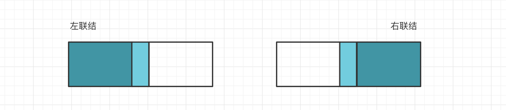

[TOC]

## MySQL必知必会

### 一.MySQL基础

#### 基础

##### 1.SQL语言分类

- **DDL**(Data Define Languge): **数据定义**语言，如：CREATE、DROP、ALTER。

- **DQL**(Data Query Language): **数据查询**语言，如：SELECT。
- **DML**(Data Manipulate Language): **数据操作**语言，如：INSERT、UPDATE、DELETE。
- **TCL**(Transaction Control Language): **事务控制**语言，如：COMMIT、ROLLBACK。

##### 2.连接数据库

```mysql
mysql -h 地址 -P 端口 -u 用户名 -p 密码;
mysql -h localhost -P 3306 -u root -p 
mysql -h 120.79.59.125 -u root # 登录到服务器的MySQL
```

#### 数据类型

##### 1.数值类型

###### (1)整数

整数包含 **TINYINT, SMALLINT, MEDIUMINT, INT, BIGINT**，分别使用 **8, 16, 24, 32, 64 位**存储空间，一般情况下**越小**的列越好。

**INT(5)** 中的数字只是规定了工具**显示字符**的个数，对于存储和计算没有意义。如果某个数不够定义字段时设置的位数，则前面以 0 补填，例：INT(5) 插入一个数 '123'，补填后为 '00123'。

MySQL没有布尔类型，通过整型 0 和 1 表示，常用 **TINYINT**(1) 表示布尔型。

###### (2)浮点数

浮点数包含 **FLOAT** 和 **DOUBLE**。

浮点数可以指定**列宽**，例如 **DOUBLE(18, 9)** 表示总共 18 位，其中小数点**后**占 9 位。

###### (3)定点数

**DECIMAL** 表示定点数，也能指定列宽。

保存一个**精确**的数值，不会发生数据的改变，不同于浮点数的四舍五入。阿里开发规范建议使用此类型。

##### 2.字符串类型

###### (1)CHAR与VARCHAR

常用字符串主要有 **CHAR(定长)和 VARCHAR(变长)** 两种类型。 

如果字符串**长度比较确定且几乎一致**，最好使用 **CHAR** 类型。

**VARCHAR** 属于**变长类型**，只需要存储必要的内容，能够**节省空间**，一般都用这个。

在进行存储和检索时，会**保留** VARCHAR 末尾的空格，而会**删除** CHAR 末尾的空格。

###### (2)其他类型

字符串类型还有 BINARY、VARBINARY、BLOB、TEXT、ENUM 和 SET 等。

**BINARY 和 VARBINARY** 类似于 CHAR 和 VARCHAR，不同的是它们包含二进制字符串，即它们包含字节字符串而不是字符字符串。因此它们没有字符集，并且排序和比较基于列值字节的数值。

**BLOB** 是一个**二进制大对象**，可以容纳可变数量的数据。有 4 种 BLOB 类型：TINYBLOB、BLOB、MEDIUMBLOB 和 LONGBLOB。它们区别在于可容纳存储范围不同。

有 4 种 **TEXT 类型**：TINYTEXT、TEXT、MEDIUMTEXT 和 LONGTEXT。对应的这 4 种 BLOB 类型，可存储的最大长度不同，可根据实际情况选择。注意：TEXT 类型也可能超出范围，使用的时候也注意场景，太长的数据可以存到 **OSS** 中。

##### 3.日期时间类型

日期时间相关数据类型有 DATETIME、DATE、TIMESTAMP、TIME 和 YEAR。

###### (1)DATETIME

能够保存从 **1001 年到 9999** 年的日期和时间，精度为**秒**，使用 **8 字节**的存储空间，它与**时区无关**。

**阿里巴巴**规范**建议**使用此类型。

###### (2)TIMESTAMP

和 UNIX 时间戳相同，保存从 1970.1.1（格林威治时间）以来的秒数，使用 **4 个字节**，只能表示从 1970 年到 2038 年。它和**时区有关**，即一个时间戳在不同的时区所代表的**具体时间是不同**的。

#### 运算符

##### 1.算术运算符

| 运算符 | 作用 |    运算符    |   作用   |
| :----: | :--: | :----------: | :------: |
| **+**  | 加法 | **/ 或 DIV** |   除法   |
| **-**  | 减法 | **% 或 MOD** | **取模** |
| *****  | 乘法 |              |          |

###### (1)运算符+号

(1) 两个操作数都为数值型，执行加法运算。

```mysql
SELECT 100 + 90;  # 190
```

(2) 其中一个为**字符型**时会试图将字符型数值转换成**数值型**，如果**转换成功**则做加法运算，如果转换**失败**则将字符型的**数值转换成 0**。

```mysql
SELECT '123' + 90;  # 213 转换成功
SELECT 'a123' + 90; # 90  转换失败
```

(3) 只要其中一方为 NULL，则结果为 NULL。

```mysql
SELECT NULL + 90;   # NULL
```

##### 2.比较运算符

条件查询经常使用比较运算符。

|    符号     |    描述    |        符号         |     描述     |
| :---------: | :--------: | :-----------------: | :----------: |
|    **=**    |    等于    |     **<>, !=**      |    不等于    |
|    **>**    |    大于    |        **<**        |     小于     |
|   **<=**    |  小于等于  |       **>=**        |   大于等于   |
| **BETWEEN** | 在两值之间 |   **NOT BETWEEN**   | 不在两值之间 |
|   **IN**    |  在集合中  |     **NOT IN**      |  不在集合中  |
|  **LIKE**   |  模糊匹配  | **REGEXP 或 RLIKE** |  正则式匹配  |
| **IS NULL** |    为空    |   **IS NOT NULL**   |    不为空    |

##### 3.逻辑运算符

逻辑运算符用来判断表达式的真假。

|    运算符    |    作用    | 运算符  |   作用   |
| :----------: | :--------: | :-----: | :------: |
| **NOT 或 !** |   逻辑非   | **OR**  |  逻辑或  |
|   **AND**    | 逻辑与减法 | **XOR** | 逻辑异或 |

##### 4.位运算符

位运算符是在二进制数上进行计算的运算符。它先将操作数变成**二进制数**后进行位运算，然后将计算结果转变回**十进制数**。

| 运算符 |   作用   | 运算符 | 作用 |
| :----: | :------: | :----: | :--: |
| **&**  |  按位与  | **!**  | 取反 |
| **\|** |  按位或  | **<<** | 左移 |
| **^**  | 按位异或 | **>>** | 右移 |

##### 5.优先级

不同运算符之间优先级不同，不知道是啥时**直接加括号**最省事。

### 二.DDL数据定义语言

#### 数据库操作

```mysql
# 创建库Books
CREATE DATABASE IF NOT EXISTS books;
# 修改库名
RENAME DATABASE books TO 新库名;
# 更改库的字符集
ALTER DATABASE books CHARACTER SET gbk;
# 删库
DROP DATABASE IF EXISTS books;
# 查看当前库信息
SHOW CREATE DATABASE books;
```

#### 数据表操作

##### 1.创建表

```mysql
CREATE TABLE 表名(
    字段名 字段类型 列级约束,
    字段名 字段类型,
    表级约束
) 数据表选项;
```

常见**约束**如下：

|      约束       |                         描述                         |
| :-------------: | :--------------------------------------------------: |
|  **NOT NULL**   |           **非空**，保证该字段的值不能为空           |
|   **DEFAULT**   |             **默认**，设置该字段的默认值             |
| **PRIMARY KEY** |     **主键**，保证该字段具有唯一值，**不能**为空     |
|   **UNIQUE**    |     **唯一**，保证该字段具有唯一值，**可以**为空     |
|   FOREIGN KEY   | **外键**，用于限制**两个表**的关系。**别用物理外键** |

常见**数据表选项**如下：

```mysql
# 字符集 如果表没有设定，则使用数据库字符集
CHARSET = charset_name
# 存储引擎 常见引擎：InnoDB MyISAM Memory/Heap CSV Archive,不同的引擎在保存表的结构和数据时采用不同的方式
ENGINE = engine_name
# 自增起始数
AUTO_INCREMENT = 行数
# 数据文件目录
DATA DIRECTORY = '目录'
# 索引文件目录
INDEX DIRECTORY = '目录'
# 表注释
COMMENT = 'string'
```

##### 2.修改表结构

修改表结构 SQL 如下：

```mysql
ALTER TABLE 表名 ADD|MODIFY|DROP|CHANGE COLUMN 字段名 [字段类型];
```

例子如下：

```mysql
# 修改表本身的选项
ALTER TABLE 表名 表的选项;
# 修改表的字段结构
ALTER TABLE 表名 操作名;
# 操作名
    ADD [COLUMN] 字段定义     -- 增加字段
	AFTER 字段名              -- 表示增加在该字段名后面
	FIRST                    -- 表示增加在第一个
    ADD PRIMARY KEY(字段名)   -- 创建主键
    ADD UNIQUE [索引名] (字段名)-- 创建唯一索引
    ADD INDEX [索引名] (字段名) -- 创建普通索引
    DROP [COLUMN] 字段名       -- 删除字段
    MODIFY [COLUMN] 字段名 字段属性   -- 对字段属性进行修改，不能修改字段名(所有原有属性也需写上)
    CHANGE [COLUMN] 原字段名 新字段名 字段属性  -- 对字段名修改
    DROP PRIMARY KEY    -- 删除主键(删除主键前需删除其AUTO_INCREMENT属性)
    DROP INDEX 索引名    -- 删除索引
    DROP FOREIGN KEY 外键    -- 删除外键
```

##### 3.其他表操作

- 删除表

```mysql
DROP TABLE [IF EXISTS] book;
```

- 清空表数据

```mysql
TRUNCATE [TABLE] 表名;
```

- 复制表数据

```mysql
CREATE TABLE author2 SELECT * FROM author;
```

- 优化表

```mysql
OPTIMIZE [LOCAL | NO_WRITE_TO_BINLOG] TABLE tbl_name [, tbl_name] ...;
```

- 修复表

```mysql
REPAIR [LOCAL | NO_WRITE_TO_BINLOG] TABLE tbl_name [, tbl_name] ... [QUICK] [EXTENDED] [USE_FRM];
```

- 分析表

```mysql
ANALYZE [LOCAL | NO_WRITE_TO_BINLOG] TABLE tbl_name [, tbl_name] ...;
```

### 三.DDL数据查询语言

#### 基础查询

##### 1.概述

基本查询格式如下：

```sql
SELECT 查询列表 FROM 表名;
```

查询列表可以是**常量值、表达式、字段、函数等**。

**(1) 查询常量值**

```mysql
SELECT 100;
```

**(2) 查询表达式**

```mysql
SELECT 100 % 98;
```

**(3) 查询函数**。相当于调用函数并得到其返回值。

```mysql
SELECT VERSION();
```

**(4) 查询字段**

```mysql
# 查询单个字段
SELECT max_salary FROM jobs;
# 查询多个字段
SELECT max_salary, min_salary FROM jobs;
# 查询全部字段(如果不是全部字段都需要,就别这样写)
SELECT * FROM jobs;
```

**(5) 完整查询语句总结**

```mysql
SELECT [ALL|DISTINCT] select_expr FROM -> WHERE -> GROUP BY [合计函数] -> HAVING -> ORDER BY -> LIMIT

a. SELECT EXPRESSION
    -- 用 * 表示所有字段
    	SELECT * FROM tb;
    -- 可以使用表达式(计算公式、函数调用、字段也是个表达式)
        SELECT stu, 29 + 25, now() FROM tb;
    -- 可以为每个列使用别名。适用于简化列标识，避免多个列标识符重复
        - 使用AS关键字，也可省略AS.
        SELECT (stu + 10) as 'add10' FROM tb;
b. FROM 子句
    用于标识查询来源
    -- 可以为表起别名。使用AS关键字
        SELECT * FROM tb1 AS tt, tb2 AS bb;
    -- FROM子句后，可以同时出现多个表
        -- 多个表会横向叠加到一起，而数据会形成一个笛卡尔积
        SELECT * FROM tb1, tb2;
    -- 向优化器提示如何选择索引
        USE INDEX、IGNORE INDEX、FORCE INDEX;
        SELECT * FROM table1 USE INDEX (key1, key2) WHERE key1 = 1 AND key2 = 2 AND key3 = 3;
        SELECT * FROM table1 IGNORE INDEX (key3) WHERE key1 = 1 AND key2 = 2 AND key3 = 3;
c. WHERE 子句
    -- 从FROM获得的数据源中进行筛选
    -- 整型1表示真，0表示假
    -- 表达式由运算符和运算数组成
        -- 运算数：变量(字段)、值、函数返回值
        -- 运算符：
            =, <=>, <>, !=, <=, <, >=, >, !, &&, ||,
            IS (NOT) NULL, (NOT) LIKE, (NOT) IN, (NOT) BETWEEN AND, IS (NOT), AND, OR, NOT, XOR
            <=>与<>功能相同，<=>可用于NULL比较
d. GROUP BY 子句, 分组子句
    GROUP BY 字段/别名 [排序方式]
    分组后会进行排序。升序：ASC，降序：DESC
    以下[合计函数]需配合 GROUP BY 使用：
    count 返回不同的非NULL值数目 -> count(*)、count(字段)
    sum:求和 max:求最大值 min:求最小值 avg:求平均值
e. HAVING 子句，条件子句
    与 WHERE 功能、用法相同，执行时机不同。
    WHERE在开始时执行检测数据，对原数据进行过滤; HAVING对筛选出的结果再次进行过滤。
    HAVING字段必须是查询出来的，WHERE字段必须是数据表存在的。
    WHERE不可以使用字段的别名，HAVING可以。因为执行WHERE代码时，可能尚未确定列值。
    WHERE不可以使用合计函数,一般需用合计函数才会用HAVING。
    SQL标准要求HAVING必须引用GROUP BY子句中的列或用于合计函数中的列。
f. ORDER BY 子句，排序子句
    ORDER BY 排序字段/别名 排序方式 [,排序字段/别名 排序方式]...
    升序：ASC，降序：DESC
    支持多个字段的排序。
g. LIMIT 子句，限制结果数量子句
    仅对处理好的结果进行数量限制。将处理好的结果的看作是一个集合，按照记录出现的顺序，索引从0开始。
    LIMIT 起始位置, 获取条数
    省略第一个参数，表示从索引0开始。LIMIT获取条数
h. DISTINCT, ALL 选项
    DISTINCT 去除重复记录
    默认为ALL, 全部记录
```

##### 2.字段别名

使用 **AS** 可以为查询字段或表明起别名，以区分重名的字段或便于展示。

```mysql
SELECT 100 % 98 AS RESULT;
# AS也可以省略
SELECT 100 % 98 RESULT;
```

```mysql
SELECT last_name AS 姓, first_name AS 名 FROM employees;
```

```mysql
SELECT salary AS `OUT PUT` FROM employees;  # 使用引号区分关键词
```

##### 3.查询去重

使用 **DISTINCT** 关键字对查询结果去重，DISTINCT 应放在需要去重的字段**之前**。

```mysql
SELECT DISTINCT department_id FROM employees;
```

##### 4.拼接查询结果

有场景需要把不同字段的查询结果进行**组合**，而 **MySQL 中的 + 号仅能当运算符**，不能当连接符。错误示范：

```mysql
# 查询员工名和姓连接成一个字段，并显示成 '姓名' 输出 (此法不对，输出为0) 
SELECT last_name + first_name AS 姓名 FROM employees;  
```

结果需要**拼接用 ==CONCAT()== 函数**。查询结果将姓和名两个字段的**结果拼接**在了一起，并且结果使用了 “,” 进行**分隔**。

```mysql
SELECT CONCAT(last_name, ', ', first_name) AS FullName FROM employees;
+--------------------+
| FullName           |
+--------------------+
| K_ing, Steven      |
| Kochhar, Neena     |
+--------------------+
```

##### 5.非空查询

**NULL 结果和其他字段拼接查询结果就会为 NULL**。**IFNULL() 函数**可以**判断查询的字段是否为 NULL，如果为 NULL 则返回**设置的默认值，如上述的 0。

```mysql
# 设置0为max_salary的默认值,如果为NULL就设置为0
SELECT IFNULL(max_salary, 0) AS 最大薪水, max_salary FROM employees;
```

#### 条件查询

使用 **WHERE** 完成条件查询，筛选符合条件的数据。

```mysql
SELECT 查询列表 FROM 表名 WHERE 筛选条件；
```

##### 1.数据过滤

###### (1)按条件运算符筛选

按普通运算符进行过滤。

```mysql
# 查询全部字段
SELECT * FROM employees WHERE salary > 12000;
# 查询指定字段(推荐)
SELECT last_name, department_id FROM employees WHERE department_id <> 90;
```

###### (2)按逻辑表达式筛选

注意使用**括号**保证逻辑表达式顺序。

```mysql
SELECT last_name, salary, commission_pct FROM employees WHERE salary >= 10000 AND salary <= 20000;
SELECT * FROM employees WHERE NOT (department_id >= 90 AND  department_id <= 110) OR salary > 15000;
```

###### (3)按操作符筛选

> **BETWEEN AND**

使用 BETWEEN AND 可以提高语句的简洁度。**包含**临界值，相当于大于等于和小于等于。

```mysql
SELECT * FROM employees WHERE employee_id <= 120 AND employee_id >= 100;
SELECT * FROM employees WHERE employee_id BETWEEN 120 AND 100;
```

> **IN**

含义：判断某字段的值是否属于 **IN 列表**中的某一项，列表中的值类型**必须一致或兼容**。

```mysql
# 查询员工的工种编号是 IT、AD 中的一个员工名和工种编号
SELECT last_name, job_id FROM employees WHERE job_id = 'IT' OR job_id = 'AD';
SELECT last_name, job_id FROM employees WHERE job_id IN('IT', 'AD');	
```

> **IS (NOT) NULL**

**=== 或 <> 不能用于判断 NULL值，而使用 IS (NOT) NULL 可以判断 NULL值==**，但是 IS 不能查询具体的数值。

```mysql
# 查询没有奖金的员工名和奖金率
SELECT last_name, commission_pct FROM employees WHERE commission_pct IS (NOT) NULL;
```

##### 2.模糊查询 

> **LIKE**

使用 LIKE 进行模糊查询，一般和**通配符**搭配使用：

- **%** : 任意多个字符, 包含 0 个字符。% 无法匹配 NULL。
- **_** : 任意单个字符。
- (特殊情况通配符) 需要**转义**。

```mysql
# 查询员工名中包含字符a的员工信息
SELECT * FROM employees WHERE last_name LIKE '%a%';
```

```mysql
# 查询员工名中第三个字符为 e，第五个字符为 a 的员工名和工资
SELECT last_name, salary FROM employees WHERE last_name LIKE '__e_a%';
```

```mysql
SELECT * FROM book WHERE name LIKE '[^AB]%'; # 不以A和B开头的任意文本
```

不要滥用通配符，通配符位于**开头处**匹配会**非常慢**，因为无法使用索引。

> **正则表达式**

使用 REGEXP 替代 LIKE 关键字进行基于正则表达式的查询，但是确实没啥用。

#### 查询排序

使用 **ORDER BY** 子句对查询结果进行排序。ORDER BY 子句可以支持 **单个字段、别名、表达式、函数、多个字段**。它必须在查询语句的**最后面**，但在 **LIMIT** 子句之前。

基本语法：

```mysql
SELECT 查询列表 FROM 表 WHERE 条件 ORDER BY 排序的字段|表达式|函数|别名 【ASC|DESC】;
```

- **ASC** 表示**升序**，默认值；**DESC** 表示**降序**。
- 可以按**多个列**进行排序，并且为**每个列**分别指定**不同的排序方式**。

```mysql
SELECT * FROM employees WHERE department_id >= 90 OEDER BY hiredate ASC;
SELECT * FROM employees OREDER BY salary ASC, employee_id DESC; 
```

```mysql
# 按姓名的长度显示员工的姓名和工资
SELECT LENGTH(last_name) AS nameLength, last_name, salary FROM employees ORDER BY LENGTH(last_name) DESC;
```

#### 函数查询

查询时可以使用内置的函数。

```mysql
SELECT 函数名(实参列表) [FROM 表];
```

##### 1.文本处理函数

```mysql
CONCAT();  # 拼接
SUBSTR();  # 截取子串
UPPER();   # 转换成大写
LOWER();   # 转换成小写
TRIM();    # 去前后指定的空格和字符
LTRIM();   # 去左边空格
RTRIM();   # 去右边空格
REPLACE(); # 替换
LPAD();    # 左填充
RPAD();    # 右填充
INSTR();   # 返回子串第一次出现的索引
LENGTH();  # 获取字节个数
```

##### 2.数值处理函数

```mysql
ROUND(); # 四舍五入
RAND();  # 随机数
FLOOR(); # 向下取整
CEIL();  # 向上取整
MOD();   # 取余
TRUNCATE(); # 截断
```

##### 3.日期函数

```mysql
NOW();     # 当前系统日期+时间
CURDATE(); # 当前系统日期
CURTIME(); # 当前系统时间
STR_TO_DATE(); # 将字符转换成日期
DTA_FORMAT();  # 将日期转换成字符
```

##### 4.聚合函数

一般用作**统计功能**。这五个聚集函数都**忽略值为 NULL 的行**，除了 **COUNT(*)**。

```mysql
AVG();	 # 返回某列的平均值
COUNT(); # 返回某列的行数
MAX();	 # 返回某列的最大值
MIN();	 # 返回某列的最小值
SUM();	 # 返回某列的和
```

> **COUNT()**

- **COUNT(column)**: 统计特定列中值**不为 NULL** 的行数。
- **COUNT(*)**: 统计所有行的数目，**包含 NULL 值**。

```mysql
# 基础查询
SELECT SUM(salary), AVG(salary), MIN(salary), MAX(salary), COUNT(salary) FROM employees;
# 搭配其他函数
SELECT SUM(salary), ROUND(AVG(salary), 2), MAX(salary), MIN(salary), COUNT(salary) FROM employees;
# 搭配DISTINCT进行去重再统计结果
SELECT SUM(DISTINCT salary), SUM(salary) FROM employees;
SELECT COUNT(DISTINCT salary), COUNT(salary) FROM employees;
```

#### 分组查询

##### 1.基础

分组就是把具有**相同数据值**的行放在**同一组**中，使用 **GROUP BY** 将结果按照字段进行分组。**基本语法**如下。

```mysql
# 查询列表要求是分组函数和GROUP BY后出现的字段
SELECT 查询字段, 分组函数 FROM 表 [WHERE 筛选条件] GROUP BY 分组字段 [ORDER BY 子句];
```

可以对同一分组数据使用**汇总函数**进行处理，例如求**分组数据的平均值**等；可以使用 **ORDER BY** 按**汇总**字段进行**排序**。

GROUP BY 的一些规定：

- **==除聚合函数之外，SELECT 后的所有查询字段都必须在 GROUP BY 子句中列出==**。
- GROUP BY 子句中列出的每个列都必须是**检索列或有效的表达式** (但不能是聚集函数)。如果在 SELECT 中使用表达式，则必须在 GROUP BY 子句中指定**相同的表达式**。不能使用别名。

- **GROUP BY** 子句支持单个字段分组，多个字段分组，多个字段之间用**逗号隔开，没有顺序**要求。
- 如果在 GROUP BY 子句中嵌套了分组，数据将在最后规定的分组上进行汇总。换句话说，在建立分组时，指定的所有列都一起计算(所以不能从个别的列取回数据)。
- 如果分组列中具有 **NULL 值**，则 NULL 将作为一个**分组**返回。如果列中有多行 NULL 值，它们将分为一组。

##### 2.过滤

**==WHERE 过滤行，HAVING 过滤分组，行过滤先于分组过滤==**。

|                |       数据源       |         位置          |     关键字     |
| :------------: | :----------------: | :-------------------: | :------------: |
| **分组前筛选** |     **原始表**     | GROUP BY 子句**前面** | **==WHERE==**  |
| **分组后筛选** | **分组后**的结果集 | GROUP BY 子句**后面** | **==HAVING==** |

##### 3.实例

**除了聚集函数之外的查询字段，都必须在 GROUP BY 之后出现**，注意观察下面的例子。

**添加条件查询**：

```mysql
# 查询邮箱中包含a字符的每个部门的最高工资
SELECT MAX(salary), department_id FROM employees WHERE email LIKE '%a%' GROUP BY department_id;
```

```mysql
# 查询有奖金的每个领导手下员工的平均工资
SELECT AVG(salary), manager_id FROM employees WHERE commission_pct IS NOT NULL GROUP BY manager_id;
```

**分组后筛选**：

```mysql
# 查询员工个数>5的部门 先查询每个部门的员工个数，再筛选结果
SELECT COUNT(*), department_id FROM employees GROUP BY department_id HAVING COUNT(*) > 5;
```

```mysql
# 每个工种有奖金的员工的最高工资>12000的工种编号和最高工资
SELECT MAX(salary), job_id FROM employees WHERE commission_pct IS NOT NULL GROUP BY job_id HAVING MAX(salary) > 12000;
```

```mysql
# 领导编号>102的每个领导手下的最低工资大于5000的领导编号和最低工资
SELECT manager_id, MIN(salary) FROM employees WHERE manager_id > 102 GROUP BY manager_id HAVING MIN(salary) > 5000;
```

**添加排序**：

```mysql
# 每个工种有奖金的员工的最高工资>6000的工种编号和最高工资,按最高工资升序
SELECT job_id, MAX(salary) AS m FROM employees WHERE commission_pct IS NOT NULL GROUP BY job_id HAVING m > 6000 ORDER BY m;
```

**按多个字段分组**：

```mysql
# 查询每个工种每个部门的最低工资,并按最低工资降序，这里job_id, department_id字段都必须出现在GROUP BY子句之后
SELECT MIN(salary), job_id, department_id FROM employees GROUP BY department_id, job_id ORDER BY MIN(salary) DESC;
```

#### 子查询

子查询即一条查询语句中又嵌套了另一条**完整的 SELECT 语句**的查询。子查询总是从内向外执行，主查询使用了子查询的执行结果，子查询都放在**小括号**内。

子查询可以放在不同**位置**：

- WHERE 或 HAVING 后面
- SELECT 后面
- FROM 后面
- EXISTS 后面

#### 联结查询

##### 1.概述

有些场景需要把一些关联信息放到两个表中，两个表通过外键进行关联，查询信息的时候需要查询两个表的信息，这时可以用到联结查询。**外键**为某个表中的一列，它包含另一个表的**主键值**，定义了两个表之间的关系。

如果数据存储在**多个表**中，怎样用单条 SELECT 语句检索出所有信息?

答案是使用**联结**。联结是用来在一条 SELECT 语句中关联表的一种机制。使用这种可以**联结多个表返回一组输出**，联结在运行时关联表中正确的行。

联结大体上分为**内部(等值)联结和外部联结**。

##### 2.等值(内部)联结

**等值联结**：也叫**内部联结**，它基于两个表之间的**相等**测试。**其效果就是在两张表进行连接查询时，只保留两张表中完全匹配的结果集**。


使用普通的 **WHERE** 语句创建联结：

```mysql
SELECT vend_name, prod_name, prod_price FROM vendors, products WHERE vendors.vend_id = products.vend_id;
```

在联结两个表时，实际上做的是将第一个表中的**每一行**与第二个表中的**每一行**配对。WHERE 子句作为过滤条件，它只包含那些匹配给定条件(这里是联结条件)的行。如果没有 WHERE 子句，第一个表中的每个行将与第二个表中的每个行配对，而**不管**它们逻辑上是否可以配在一起。这样就产生了**笛卡尔积**的结果，检索出的行的数目将是第一个表中的行数乘以第二个表中的行数。

使用普通的 **JOIN** 关键字创建联结：

```mysql
SELECT vend_name, prod_name, prod_price FROM vendors INNER JOIN products ON vendors.vend_id = products.vend_id;
```

这里两个表之间的关系是 FROM 子句的组成部分，以 **INNER JOIN** 指定。在使用这种语法时，**联结条件用特定的 ON 子句**而不是 WHERE 子句给出。传递给 ON 的实际条件与传递给 WHERE 的相同。

SQL 对一条 SELECT 语句中可以联结的表的数目没有限制，创建联结的基本规则也相同。然而联结多表是非常损耗性能的。

##### 3.自联结

**自联结操作中联结的表是同一张表**。

**自联结**通常作为外部语句用来替代从相同表中检索数据时使用的**子查询**语句。虽然最终的结果是相同的，但有时候处理联结远比处理子查询快得多。

```mysql
SELECT p1.prod_id, p1.prod_name FROM products AS p1, products AS p2 WHERE p1.vend_id = p2.vend_id AND p2.prod_id = 'DTNTR';
```

此查询中需要的两个表实际上是相同的表，因此 products 表在 FROM 子句中出现了两次。为了解决二义性而对表起了**别名**。

##### 4.自然联结

无论何时对表进行联结，应该**至少有一个列**出现在不止一个表中(被联结的列)。标准的联结(前面的内部联结)返回所有数据，甚至**相同的列多次**出现。**自然联结排除多次出现**，使每个列只返回一次。

**自然联结**是这样一种联结，其中你只能选择那些**唯一的列**。这一般是通过对表使用通配符(SELECT *)，对所有其他表的列使用明确的子集来完成的。举个例子：

```mysql
SELECT C.*, o.order_num. o.order_date, oi.prod_id, oi.quantity, oi.item_price
FROM customers AS c, orders AS o, orderitems AS oi
WHERE c.cust_id = o.cust_id AND oi.order_num = o.order_num AND prod_id  'FB';
```

在这个例子中，通配符只对第一个表使用。所有其他列明确列出，所以没有重复的列被检索出来。迄今为止前面建立的每个内部联结都是**自然联结**，很可能我们永远都不会用到不是自然联结的内部联结。

##### 5.外部联结

许多联结将一个表中的行与另一个表中的行相关联，但有时候会需要**包含没有关联行**的那些行，这种情况称为**外部联结**。几种外部联结的输出结果：

- **左外联结**：会返回**左表所有的行**，对于**右表中不存在的数据使用 NULL 填充**。
- **右外联结**：与左外连接**相反**。



下面例子是使用**内部联结**检索所有客户及其订单：

```mysql
SELECT customers.cust_id, orders.order_num 
FROM customers 
INNER JOIN orders ON customers.cust_id = orders.cust_id;
```

**外部联结**语法类似。为了检索所有客户，包括那些没有订单的客户，可如下进行：

```mysql
SELECT customers.cust_id, orders.order_num 
FROM customers 
LEFT OUTER JOIN orders ON customers.cust_id = orders.cust_id;
```

这里使用键字 **==OUTER JOIN==** 来指定联结的类型。与内部联结关联两个表中的行不同的是，外部联结**还包括没有关联行的行**。在使用 OUTER JOIN 语法时，**必须使用 RIGHT 或 LEFT 关键字**指定包括其**所有行的表**(RIGHT 指出的是 OUTER JOIN 右边的表，而 LEFT 指出的是 OUTER JOIN 左边的表)。上面的例子使用 LEFT OUTER JOIN 从 FROM 子句的左边表(customers 表)中选择所有行，也就是结果包含左边 customers 表中的全部行记录。

为了从右边的表中选择所有行，应该使用 RIGHT OUTER JOIN，如下例所示：

```mysql
SELECT customers.cust_id, orders.order_num 
FROM customers 
RIGHT OUTER JOIN orders ON customers.cust_id = orders.cust_id;
```

**左外部联结和右外部联结**是两种基本的外部联结形式，它们之间的唯一差别是所关联的表的顺序不同。换句话说，左外部联结可通过颠倒 FROM 或 WHERE 子句中表的**顺序**转换为右外部联结。因此**两种类型的外部联结可互换使用**，而究竟使用哪一种纯粹是根据方便而定。

#### 分页查询

LIMIT 关键字用于限制返回的**行数**，可以用于分页查询。LIMIT 可以有两个参数，**第一个参数**为**起始行**，从 ==**0 行开始**==；第**二个参数**为返回的**总行数**。

```mysql
SELECT 字段|表达式,...
FROM 表
【WHERE 条件】
【GROUP BY 分组字段】
【HAVING 条件】
【ORDER BY 排序的字段】
LIMIT 【要显示条目的起始索引(起始索引从0开始),要显示的条目个数】;
```

**分页公式**：

```mysql
# pageSize:每页显示条目数  page:要显示的页数
SELECT * FROM 表 LIMIT (page - 1) * pageSize, pageSize;
```

```mysql
# 查询前五条员工信息(等价)
SELECT * FROM  employees LIMIT 0, 5;
SELECT * FROM  employees LIMIT 5;
# 查询第11条到第25条信息
SELECT * FROM  employees LIMIT 10, 15;
```

#### 组合查询

将**多条**查询语句的结果**合并成一个结果**。应用场景：要查询的结果来自于**多个表**，且多个表**没有直接的连接关系**，但查询的信息一致时。

语法：就是不同的 SELECT 语句用 **UNION 或 UNION ALL 连接**起来。

```mysql
SELECT 字段|常量|表达式|函数 【FROM 表】 【WHERE 条件】 UNION 【ALL】
SELECT 字段|常量|表达式|函数 【FROM 表】 【WHERE 条件】 UNION 【ALL】
.....
SELECT 字段|常量|表达式|函数 【FROM 表】 【WHERE 条件】
```

**UNION** 代表**去重**，**UNION ALL**代表**不去重**。

组合查询的条件：

- 多条查询语句的查询的**列数**必须**一致**，且其列的**类型几乎相同**。
- 只能包含**一个 OEDER BY** 子句，并且必须位于语句的**最后**。

```mysql
# 查询部门编号>90或邮箱包含a的员工信息
SELECT * FROM employees WHERE email LIKE '%a%' OR department_id > 90;

SELECT * FROM employees WHERE email LIKE '%a%'
UNION
SELECT * FROM employees WHERE department_id > 90;
```

```mysql
# 查询中国用户中男性的信息以及外国用户中年男性的用户信息
SELECT id, cname FROM t_ca WHERE csex = '男'
UNION ALL
SELECT t_id, tname FROM t_ua WHERE tGender = 'male';
```

### 四.DML数据操作语言

#### 插入数据

插入语句：

```mysql
INSERT INTO 表名(字段名，...) VALUES(值1，...);
```

字段类型和值类型一致或兼容，字段个数和值的个数必须**一致**，且**一一对应**，字段省略时表示使用所有字段，且顺序和表中的存储**顺序一致**。可以为空的字段，可以**不用**插入值，或用 **NULL** 填充；**不可以为空**的字段，**必须**插入值。

一般使用明确给了需要插入字段的 INSERT 语句，这样即使表结构发生了变化也能兼容。

可以同时**插入多行**数据。

```mysql
# 指定列为NULL
INSERT INTO user(id, NAME, sex, borndate, phone, photo, boyfriend_id) VALUES(13, 'Jack', '女', '1990-4-23', '1898888888', NULL, 2);
# 省去NULL值
INSERT INTO user(id, NAME, sex, phone) VALUES(15, 'Alice', '女', '1388888888');
```

```mysql
# 列的顺序可以调换，一一对应即可
INSERT INTO user(NAME, sex, id, phone) VALUES('Alice', '女', 16, '110');
```

```mysql
# 列数和值的个数必须一致
INSERT INTO user(NAME, sex, id, phone) VALUES('Alice', '女', 17, '110');
```

```mysql
# 同时插入多行数据
INSERT INTO user VALUES(23, 'Alice', '女', '1990-4-23', '1898888888', NULL, 2), (25, 'Alice', '女', '1990-4-23', '1898888888', NULL, 2);
```

#### 删除数据

删除数据使用 **DELETE 语句**。

```mysql
DELETE FROM 表名 【WHERE 筛选条件】;
```

一定要加 **WHERE** 条件，否则**删除全部数据**。可以先用 SELECT 语句进行测试，防止错误删除。

```mysql
DELETE FROM beauty WHERE phone LIKE '%9';
```

可以使用 **TRUNCATE** 语句删除表的全部数据。TRUNCATE 删除**不能回滚**，DELETE 删除**可以回滚**。

```mysql
TRUNCATE TABLE 表名;
```

#### 修改数据

```mysql
UPDATE 表名 SET 字段 = 新值, 字段 = 新值 [WHERE 条件];
```

一定要加 **WHERE** 条件，否则会把所有的数据都修改了。


### 五.其他

#### MySQL函数

系统函数参考前面。MySQL 也能自定义函数。

**创建函数**

```mysql
CREATE FUNCTION 函数名(参数名 参数类型,...) RETURNS 返回类型
BEGIN
	函数体
END
```

**调用函数**

```mysql
SELECT 函数名（实参列表）
```

#### 存储过程

##### 1.概述

**存储过程**就是一组经过**预先编译**的 SQL 语句集合，可以看成是一系列 SQL 语句的**批处理**。

使用存储过程的好处：代码封装，保证了一定的安全性；代码复用；预先编译，性能较高。但是阿里巴巴的开发规范规定**别用**存储过程。

##### 2.创建存储过程

语法：

```mysql
CREATE PROCEDURE 存储过程名(IN|OUT|INOUT 参数名 参数类型, ...)
BEGIN
	存储过程体
END;
```

类似于方法：

```mysql
修饰符 返回类型 方法名(参数类型 参数名, ...){
	方法体;
}
```

存储过程包含 **IN、OUT 和 INOUT** 三种参数。

- IN: 该参数只能作为输入(该参数不能做返回值)
- OUT: 该参数只能作为输出(该参数只能做返回值)
- INOUT: 既能做输入又能做输出

给变量赋值都需要用 **SELECT INTO** 语句，且每次只能给**一个变量**赋值，不支持集合的操作。

注意：命令行中创建存储过程**==需要自定义分隔符==**。因为命令行是以 **; 为结束符**，而存储过程中也包含了**分号**，因此会错误把这部分分号当成是结束符，造成语法错误。

```mysql
# 1.需要设置新的结束标记
DELIMITER 新的结束标记;
示例：
DELIMITER $

CREATE PROCEDURE 存储过程名(IN|OUT|INOUT 参数名  参数类型,...)
BEGIN
	sql语句1;
	sql语句2;
END $ 
```

**调用存储过程**

```mysql
CALL 存储过程名(实参列表);
```

```mysql
call myprocedure(@ret);
select @ret;
```

##### 3.游标

在存储过程中使用**游标**可以对**一个结果集**进行**移动遍历**。游标主要用于**交互式应用**，其中用户需要对数据集中的任意行进行浏览和修改。使用游标的四个步骤：1. **声明游标**，这个过程**没有**实际检索出数据；2. **打开游标**；3. **取出数据**；4. **关闭游标**。

#### 视图

##### 1.概述

视图是一张**虚拟的表**，它是通过表**动态生成**的数据。视图本身不包含数据，因此它们返回的数据是从其他表中检索出来的。在添加或更改这些表中的数据时，视图将返回改变过的数据。

**视图和表的区别**：两者使用方式**完全相同**，不过表需要占用物理空间，而视图**不占用物理空间**，仅仅保存的是 SQL 逻辑。

使用视图可以简化复杂的 SQL 操作，比如复杂的连接，且只使用实际表的一**部分数据**，视图可以通过只给用户**访问视图的权限**，保证数据的安全性。

视图的作用：

- 重用 SQL 语句。
- 简化复杂的 SQL 操作。在编写查询后，可以方便地重用它而不必知道它的基本查询细节。
- 使用表的组成部分而不是整个表。
- 保护数据。可以给用户授予表的特定部分的访问权限而不是整个表的访问权限。
- 更改数据格式和表示。视图可返回与底层表的表示和格式不同的数据。

##### 2.操作视图

```mysql
# 创建视图
CREATE VIEW 视图名 AS 查询语句;
# 删除视图
DROP VIEW test1, test2;
# 查看视图结构
DESC test1;
SHOW CREATE VIEW test1;
# 查看视图的数据 ★
SELECT * FROM test1;
SELECT * FROM test1 WHERE last_name = 'Partners';
# 插入视图的数据
INSERT INTO test1(last_name, department_id) VALUES('Jack', 90);
# 修改视图的数据
UPDATE test1 SET last_name = 'Lucy' WHERE last_ame = 'Jack';
# 删除视图的数据
DELETE FROM test1;
```

如果**视图中数据**是来自于**一个表**时，**修改视图中的数据**，表数据会**更新**。而且**修改表中数据**时，对应视图也会**更新**。但是如果视图数据来源于**两个表**时，修改视图数据时会报错，**无法**修改。

#### 触发器

##### 1.概述

**触发器**是与表有关的数据库对象，在**满足定义条件时触发**，并**执行触发器中定义的语句**集合。触发器的这种特性可以**协助**应用在数据库端确保数据的完整性。

比如有【用户表】和【日志表】，当一个用户被创建的时候，就需要在日志表中插入创建的 log 日志，一种方法是**编写程序语言**逻辑实现，另一种方法就是定义一个触发器。触发器不只能进行**插入**操作，还能执行**修改，删除。**

触发器会在**某个表**执行以下语句时而**自动执行**：**DELETE、INSERT、UPDATE** 等操作。触发器必须指定在语句执行**之前**还是**之后**自动执行，之前执行使用 **BEFORE** 关键字，之后执行使用 **AFTER** 关键字。**BEFORE 用于数据验证和净化，AFTER 用于审计跟踪**，将修改记录到另外一张表中。因此根据触发时机创建以下**六种**触发器，每个表最多支持六个触发器。

```mysql
BEFORE INSERT, BEFORE DELETE, BEFORE UPDATE
AFTER INSERT, AFTER DELETE, AFTER UPDATE
```

##### 2.创建触发器

创建**触发器的语法**如下：

```mysql
CREATE TRIGGER 触发器名 BEFORE|AFTER 触发事件
ON 表名 FOR EACH ROW
BEGIN
    执行语句列表 # 可有多个语句，不同语句用分号隔开
END;
```

BEFORE 和 AFTER 参数指定触发器**执行时间**在事件**之前**或**之后**。FOR EACH ROW 表示**任何一条记录**上的操作满足触发事件都会触发该触发器。

一般情况下，MySQL 默认是以 **;** 作为结束执行语句，与触发器中需要的**分行**起冲突，为解决此问题可用自定义 **DELIMITER**，这与**存储过程的使用类似**。

下面首先将结束符号定义为 ||，中间定义一个触发器，一旦有满足条件的**删除操作**。就会执行 BEGIN 和 END 中的语句，接着**使用 || 结束**。最后使用DELIMITER ; 将结束符号**还原**。

```mysql
mysql> DELIMITER ||     # 修改默认的结束符号
mysql> CREATE TRIGGER demo BEFORE DELETE
    -> ON users FOR EACH ROW        # 每一行都观测
    -> BEGIN
    -> INSERT INTO logs VALUES(NOW());  # BEGIN与END中间是触发时执行的逻辑
    -> INSERT INTO logs VALUES(NOW());
    -> END
    -> ||
Query OK, 0 rows affected (0.06 sec)
mysql> DELIMITER ;     # 还原默认的结束符号
```

#### 外键

小项目可以用外键，大型互联网项目就别用了。为什么不要数据库外键？

- **影响性能**。
- **不利于热更新**。分布式项目经常需要热更新，外键会影响热更新。
- **去掉外键可以降低耦合度**。只是不用物理外键，**逻辑**上的外键还是存在的。
- 便于**数据库分库分表**。

#### 权限管理

MySQL 的**账户信息**保存在 **mysql** 这个数据库中。

```
USE mysql;
SELECT user FROM user;
```

**创建账户**：新创建的账户**没有任何**权限。

```
CREATE USER myuser IDENTIFIED BY 'mypassword';
```

**修改账户名**：

```
RENAME myuser TO newuser;
```

**删除账户**：

```
DROP USER myuser;
```

**查看权限★**：

```
SHOW GRANTS FOR myuser;
```

**授予权限★**：

账户用 **username@host** 的形式定义，**username@%** 使用的是**默认主机名**。

```
GRANT SELECT, INSERT ON mydatabase.* TO myuser;
```

**删除权限**：**GRANT** 和 **REVOKE** 可在几个层次上控制访问权限：

- 整个服务器，使用 GRANT ALL 和 REVOKE ALL。
- 整个数据库，使用 **ON database.\*；**
- 特定的表，使用 ON database.table。
- 特定的列。
- 特定的**存储过程**。

```
REVOKE SELECT, INSERT ON mydatabase.* FROM myuser;
```

**更改密码**：必须使用 Password() 函数进行**加密**。

```
SET PASSWROD FOR myuser = Password('new_password');
```


#### 参考资料

- 【连接查询】https://blog.csdn.net/weixin_43883625/article/details/99310513
- 《MySQL 必知必会》


