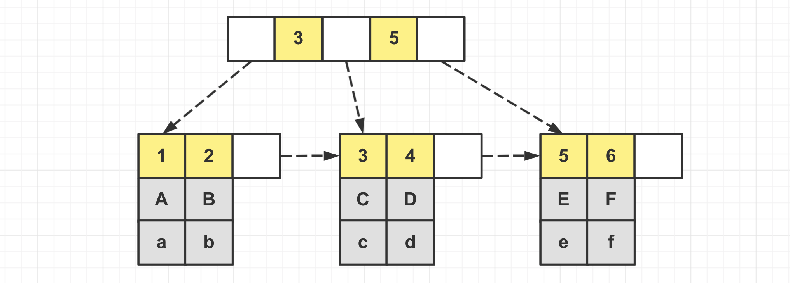
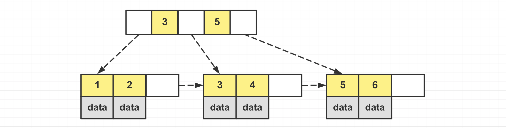
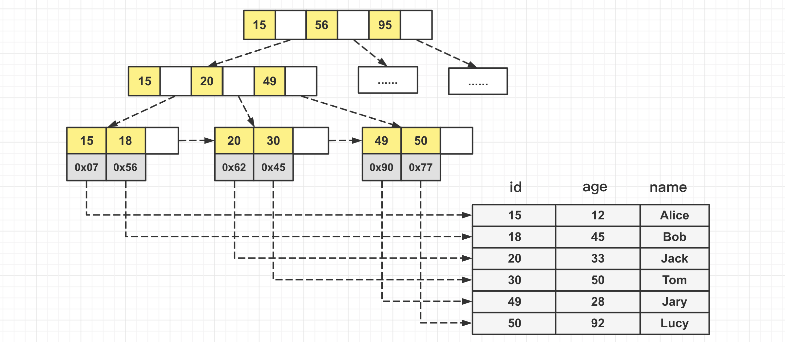
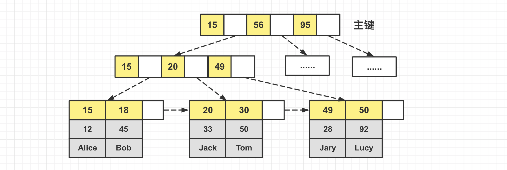
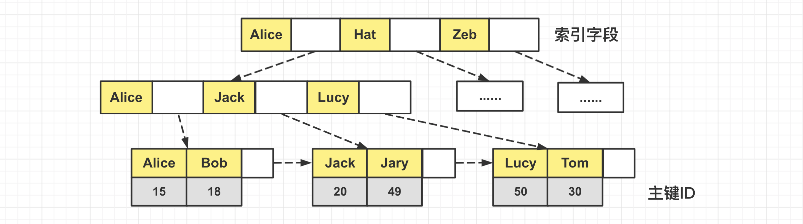
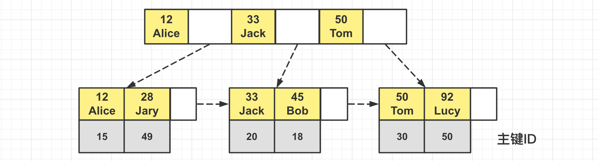

[TOC]

### MySQL索引

#### 索引基础

##### 1.概述

索引是帮助高效获取数据的**==数据结构==**。索引就像是一本字典的**目录**，可以用于快速定位需要查找的内容。

**索引**是在**存储引擎层**实现的，而不是服务器层，所以**不同存储引擎具有不同的索引类型和实现**，不同存储引擎可以采用 **B+Tree，Hash** 等不同的数据结构实现索引。

- 对于**非常小的表**，简单的**全表扫描**可能比建立索引更高效。
- 对于**中到大型的表**，索引通常**非常有效**。
- 对于**特大型的表**，建立和维护索引的代价将会随之增长。特大表可以考虑分库分表。

##### 2.索引语法

###### (1)创建索引

执行 **CREATE TABLE** 语句建表时可以创建索引，也可以单独用 **CREATE INDEX 或 ALTER TABLE** 为表增加索引。

**ALTER TABLE**：用来创建**普通索引、UNIQUE 索引或 PRIMARY KEY 索引**。例如：

```mysql
 ALTER TABLE table_name ADD INDEX index_name (column_list);
 ALTER TABLE table_name ADD UNIQUE (column_list);
 ALTER TABLE table_name ADD PRIMARY KEY (column_list);
```

其中 column_list 指出对**哪些列进行索引**，**多列时各列之间用逗号分隔**。索引名 index_name 可选，缺省时 MySQL 将根据第一个索引列赋一个名称。

**CREATE INDEX**：可对表**增加普通索引或 UNIQUE 索引**。例如：

```mysql
 CREATE INDEX index_name ON table_name (column_list);
 CREATE UNIQUE INDEX index_name ON table_name (column_list);
```

这种方式索引名不可选。此外，不能用 CREATE INDEX 语句创建 PRIMARY KEY 索引。

###### (2)唯一索引

在创建索引时，可以规定索引**能否包含重复值**。如果不包含，则索引应该创建为 **PRIMARY KEY 或 UNIQUE 索引**。对于单列唯一性索引，这保证单列不包含重复的值。对于多列惟一性索引，保证多个值的**组合**不重复。PRIMARY KEY 索引和 UNIQUE 索引非常类似。

###### (3)删除索引

使用 **ALTER TABLE** 或 **DROP INDEX** 语句来删除索引。

```mysql
# 删除索引index_name
DROP INDEX index_name ON talbe_name;
ALTER TABLE table_name DROP INDEX index_name;
# 删除主键索引
ALTER TABLE table_name DROP PRIMARY KEY;
```

前两条语句是**等价**的，即删除掉 table_name 中的索引 index_name。

第三条语句删除 PRIMARY KEY 索引，因为一个表只能有一个 PRIMARY KEY 索引，因此不需要指定索引名。

如果从表中删除了**某列**，则索引会受到影响。对于多列组合的联合索引，如果删除其中的某列，则该列也会从索引中删除。

##### 3.索引优缺点

###### (1)优点

索引可以大大减少服务器需要扫描的**数据行数**，加快数据的**检索速度**。索引帮助服务器**避免进行排序和分组**，以及**避免创建临时表**。

B+Tree 索引是**有序**的，将**随机 I/O** 变为**顺序 I/O**，会将相邻的数据都**存储在一起**，可以**用于 ORDER BY 和 GROUP BY 操作**。

可以通过创建**唯一索引**，可以保证数据库表中每一行数据的**唯一性**。可以加速表和表之间的**联结**，特别是在实现数据的参考完整性方面特别有意义。

###### (2)缺点

索引有很多优点，但是不能滥用索引。

创建索引和维护索引要**耗费时间**，这种时间随着**数据量**的增加而增加。索引需要占用**物理空间**，除了数据表占用数据空间之外，每一个索引还要占一定的物理空间，如果建立聚簇索引，那么需要的**空间就会更大**。当对表中的数据进行增加、删除和修改的时候，索引也需要维护，降低数据维护的速度。

##### 4.MySQL索引分类

###### (1)B+树索引

B+ 树索引是大多数 MySQL 存储引擎的**默认索引**类型。因为不再需要进行全表扫描，只需要对**树进行搜索**即可，所以查找速度很快。这种索引除了用于查找，还可以用于**排序和分组**(这是由数据在叶子结点的存储方式决定的)。

可以指定**多个列**作为索引列，多个索引列**共同**组成联合索引。适用于**全键值、键值范围和键前缀**查找，其中键前缀查找只适用于==**最左前缀**==查找。如果**不是按照索引列的顺序进行查找，则无法使用索引**。

InnoDB 的 B+ 树索引分为**主索引和辅助索引**。主索引的**叶子节点** data 域记录着**完整**的**数据**记录，这种索引方式被称为**聚簇索引**。数据行存储在**同一个地方**，**所以一个表只能有一个聚簇索引**。



**辅助索引**的**叶子节点**的 data 域记录着**主键的值**，因此在使用**辅助索引**进行查找时，需要先查找到**主键值**，然后再到**主索引**中进行查找。


###### (2)哈希索引

**哈希索引**能以 **O(1)** 时间进行查找，但是**失去了有序性**：

- **无法**用于**排序与分组**；
- 只支持**精确查找**，无法用于**部分查找和范围查找**。

哈希索引底层基于哈希表实现，就是对需要**查询的字段做一次哈希**，然后进行查找。

**InnoDB 存储引擎**有一个特殊的功能叫 "自适应哈希索引"，当某个索引值被使用的**非常频繁**时，会在 **B+Tree 索引之上**再创建一个**哈希索引**，这样就让 B+Tree 索引具有哈希索引的一些优点，比如**快速**的哈希查找。

###### (3)全文索引

**MyISAM** 存储引擎支持**全文索引**，用于查找文本中的**关键词**，而不是直接比较是否相等。但是查找条件使用 **MATCH AGAINST**，而不是普通的 WHERE。全文索引使用**倒排索引**实现，它记录着关键词到其所在**文档的映射**。InnoDB 存储引擎现在也支持全文索引。

###### (4)空间数据索引

MyISAM 存储引擎支持空间数据索引(R-Tree)，可以用于**地理数据**存储。空间数据索引会从所有维度来索引数据，可以有效地使用任意维度来进行组合查询。

#### B+树原理

**红黑树**等平衡树也可以用来实现**索引**，但是文件系统及数据库系统普遍采用 **B+ 树作为实现索引的数据结构**。

##### 1.B树

B 树指的是 **Balance Tree**，即平衡树。平衡树是一颗查找树，并且所有==**叶子节点位于同一层**==。

B 树的结点会**同时存数据与索引**，B 树的**非叶子节点可能也会存储数据**，而且叶子节点之间**不含有**指针。通常一个结点大小有限制，如果一个结点存储的数据过多，就会导致能存储的索引变少，树的分叉变少，使得树的高度**变高**。加载一层**结点**就对应了一次**磁盘 IO 操作**。

所以需要用 B+ 树。

##### 2.B+树

###### (1)特点

B+ 树是基于 B 树和**叶子节点顺序访问指针**进行实现，它具有 B Tree 的平衡性，并且通过**顺序访问指针**来提高区间查询的性能。

**存储**：B+Tree 中非叶子节点不存储数据，**只存储索引(冗余)**，可以放更多的索引。B+ 树存储索引时存在**冗余**，比如下图中 3 号在叶子结点和中间结点**都存在**，但是 B 树中**不存在冗余**。**全部数据都存放在叶子结点中**。

叶子节点之间可以用**指针连接**，提高**区间访问**的性能。在 B+ 树中，一个**节点**中的 **key 从左到右非递减排列**，如果某个指针的左右相邻 key 分别是 key(i) 和 key(i + 1)，且不为 null，则该指针指向节点的所有 key 大于等于 key(i) 且小于等于 key(i + 1)。这种数据结构方便进行**范围查询与排序**。



而 B 树中数据可能在非叶子结点上，而且叶子结点间不含有指针。

InnoDB 中一个结点大小参数 **Innodb_page_size** 默认为 **16K**。如果存放的是 **INT 类型**的索引，则一个结点可以存**上千个值**，可以有上千个分叉。

###### (2)树高与查询次数

平衡树查找操作的时间复杂度和**树高 h 相关**，O(h) = O(log<sub>d</sub>N)，其中 d 为每个节点的出度。红黑树的**出度为 2**，而 B+ 树的出度一般都**非常大**，所以红黑树的树**高 h 很明显比 B+ 树大非常多**，所以查找的次数也就更多。对于 B 树，由于其非叶子结点也能存储数据，可能导致树的高度更高。B+ 树比红黑树和 B 树更加**矮平**，树越低，**磁盘 IO 操作**次数就越少。

###### (3)磁盘预读特性

为减少磁盘 I/O 操作，磁盘往往不是严格按需读取，而是每次都会**预读**。预读过程中，磁盘进行**顺序读取**，顺序读取不需要进行磁盘寻道，并且只需要很短的旋转时间，速度非常快。操作系统一般将内存和磁盘分成**固定大小的块**，每一块称为**一页**，内存与磁盘以**页为单位**交换数据。数据库系统将索引的一个**节点**的大小设置为**页的大小**，使得一次 IO 就能完全载入**一个节点**。利用**预读特性**，相邻的节点也能够被**预先载入**。

#### 索引与存储引擎实现

MyISAM 和 InnoDB 这两种存储引擎有**不同的索引实现方式**。索引可以分为**主键索引**与**普通索引**，其实现方式依然可能有区别。

##### 1.MyISAM索引实现

MyISAM 存储引擎的表在**磁盘**中会存储为三个文件：**==.myd==(数据文件)、 ==.myi==(索引文件)以及==.frm== 表结构文件(.frm 文件 InnoDB 也有)**。

通过文件存储方式就可以看出，MyISAM **主键索引**的**索引文件和数据文件是分离**的，这就是**==非聚簇索引==**。MyISAM 存储引擎中**非主键索引**(普通索引)与**主键索引组织方式是类似**的，结构都差不多。

具体组织方法如下，B+ 树**索引叶子结点**存储的是**真实数据的地址，查询时通过索引叶子节点存储的数据地址去数据文件获取真实的数据**。



##### 2.InnoDB索引实现

InnoDB 存储引擎的表在磁盘中会存储为两个文件：**==.ibd== 文件(索引+数据文件) 和 ==.frm== 文件(表结构文件)**。

MyISAM 中主键索引与非主键索引的结构**类似**，而 **InnoDB** 主键索引与非主键索引(普通索引)的组织结构不同，这里分别讨论。

###### (1)主键索引

InnoDB 的**主键索引**就是==**聚簇索引**==，它通过**主键聚集索引**。聚集索引的含义：

- **表数据文件本身**就是按 **B+Tree** 组织的一个**索引结构文件**。
- **叶子节点包含了完整的数据记录**。

其组织方式如下。其中非叶子结点即是索引值，不存储任何数据；在**叶子结点上索引是主键**(黄色格子)，同时叶子结点下面保存了**全部完整的数据**。这也是聚簇的含义。



###### (2)非主键索引

对于**非主键索引(辅助索引)**，InnoDB 组织方式大致如下。**索引叶子**结点存储的是**==主键的值==**，这并非像主键索引那样存储全部数据，而是得到**主键值之后通过主键进行查找**，也就是所谓的 "**回表**" 查询。



为什么这样做？这是为了保证**一致性和节省存储空间**。**一致性**是指当插入一条数据的时候，如果**非主键索引上也存储全部元素**，那就需要同时保证在不同的地方都**全部插入数据**，这就难以保证一致性；**只在主键索引下面存放完整数据**，只需要维护**一份完整数据**，既能保证一致性也能**节省空间**。

###### (3)联合索引

**两个或更多个字段上的索引**被称作**联合索引**。对于联合索引，MySQL **从左到右**的使用索引中的字段，一个查询可以只使用索引中的**一部分**，但只能是**最左侧的部分**。

**最左前缀法则**：例如索引是 **key index_name (a, b, c)**，可以支持 **[a]、[a, b]、[a, b, c]** 等 3 种组合进行索引命中查找，不支持 [b, c] 进行查找。当最左侧字段是**常量引用**时，索引就十分有效。

**联合索引的存储结构**就是把多个字段同时放到了**叶子结点的** Key 中了。联合索引怎么比大小排序？比如有三个索引字段 (a, b, c)，那么此时比较大小是**依次**比较索引字段，先比较 a 字段，再比较 b 字段。注意：如果索引相同，那么是**挨着排存储在结点**中的，只要保证右边的值大于等于左边的即可。

下面是一个创建联合索引的例子。

```mysql
KEY `idx_age_name` (`age`, `name`);
```

**联合索引**在 InnoDB 中的组织方式如下，可以看到**多个索引字段存储到了一起**，索引叶子结点中，**黄色的部分是联合索引的全部值**。



**少用单值索引**，比如有一个表有 5 个字段需要建索引，如果建 5 个单值索引，那么就会有**五个 B+ 树**结构存放在 InnoDB 引擎的 **.ibd 文件**中。如果使用**联合索引**，如果把五个字段联合起来**建立联合索引**，那么只会有一棵 B+ 树。

###### (4)最左前缀法则

使用联合索引时需要遵守**最左前缀法则**。指的是查询从索引的**最左前列开始并且不跳过索引中的列**。也就是要命中索引的话，**必须包含左边的字段，一个或者多个都可**。结合上面联合索引的组织图，可以看到联合索引是**从左往右挨着比较**的。如果缺少左边的字段，那么其实也就是挨着比较，也就相当于走**全表**扫描了。

比如索引字段为 A(name)，B(age)，C(position)。则：

- 查询条件为 **A、AB、ABC** 时，**会走索引**。
- 查询条件为 **BC**，**不会走索引**。
- 查询条件为 **AC**，只会走字段 **A 的索引**。

Case1：这里查询条件只含 B 和 C，**不会**走索引。

```mysql
EXPLAIN SELECT * FROM employees WHERE age = 22 AND position ='manager'; 
```

Case 2：这里查询条件只含 C，**不会**走索引。

```mysql
EXPLAIN SELECT * FROM employees WHERE position = 'manager';
```

Case 3：这里查询条件只含 A，即最左前缀，**会**走索引。

```mysql
EXPLAIN SELECT * FROM employees WHERE name = 'LiLei';  
```

Case 4：这里查询条件含 A 和 B（写的顺序倒过来也可），就是最左前缀，**会**走索引。

```mysql
EXPLAIN SELECT * FROM employees WHERE name= 'LiLei' AND age = 22;
EXPLAIN SELECT * FROM employees WHERE age = 22 AND name= 'LiLei';
```

###### (5)主键规则

> 为什么 InnoDB 表**必须有主键**？

InnoDB 设计的**数据文件**就是**依附于 B+ 树**的，所有**数据都是依附在主键**上的，所以说**必须有主键**。如果自己建表的时候没有主键，那么存储引擎会自动找一个可以充当唯一索引的字段当做主键；如果找不到就会**自动生成**一个 rowId 当做主键。

> 为什么推荐使用**整型的自增**主键？

**主键**为啥推荐用**自增整型**？索引之前查找都是**基于比较**的，用整型是非常方便的。为什么推荐**自增**？如果是自增的话，**直接顺序**放就行了，如果不是自增，当前面的结点**已经存满之后**，此时为了维护 B+Tree 的平衡，会导致前面的结点进行分裂与平衡的变动，**影响性能**。

**主键规则**：推荐使用自增主键。**不要使用更新频繁的列**作为主键。不**要使用 UUID, MD5, HASH** 字符串列作为主键，它们无法保证数据的顺序增长且可能占用更多**空间**。主键值应该尽量短，由于一个结点的大小是固定的，如果主键的长度较大的话，会导致一个结点存储的索引值个数变少，导致 B+ 树的分叉变少，进而导致树变高，进而影响性能。

综上所述，自增整型是主键非常好的选择。

##### 4.总结

**MyISAM 的主键索引是非聚集索引，InnoDB 的主键索引是聚集索引。**多个索引字段建议创建联合索引。

- **MyISAM：**B+Tree **叶节点的 data 域**存放的是**数据记录的地址**。在索引检索的时候，首先按照 B+Tree 搜索算法搜索索引，如果指定的 Key 存在，则取出其 data 域的值，然后以 data 域的**值为地址**读取相应的数据记录。MyISAM 中**索引文件和数据文件是分离**的，这被称为 "**非聚簇索引**"。
- **InnoDB：**其**数据文件本身就是索引文件**。其表数据文件本身就是按 B+Tree 组织的一个索引结构，树的叶节点 **data 域保存了完整的数据记录**。这个索引的 **key 是数据表的主键**，因此 InnoDB 表数据文件本身就是主索引。这被称为 "聚簇索引"。而其余的索引都作为**辅助索引**，**辅助索引的 data 域存储相应记录主键的值**而不是地址。**在根据主键索引搜索时，直接找到 key 所在的节点即可取出数据；在根据辅助索引查找时，则需要先取出主键的值，再走一遍主索引。** **因此在设计表的时候，不建议使用过长的字段作为主键，也不建议使用非单调的字段作为主键，这样会造成主索引频繁分裂。** PS：整理自《Java工程师修炼之道》

#### 索引分析工具

先来个表：

```mysql
CREATE TABLE `employees` (
    `id` int(11) NOT NULL AUTO_INCREMENT,
    `name` varchar(24) NOT NULL DEFAULT '' COMMENT '姓名',
    `age` int(11) NOT NULL DEFAULT '0' COMMENT '年龄',
    `position` varchar(20) NOT NULL DEFAULT '' COMMENT '职位',
    `hire_time` timestamp NOT NULL DEFAULT CURRENT_TIMESTAMP COMMENT '入职时间', 
    PRIMARY KEY (`id`),
    # 创建联合索引
    KEY `idx_name_age_position` (`name`,`age`,`position`) USING BTREE
) ENGINE = InnoDB DEFAULT CHARSET = utf8 COMMENT = '员工记录表';

INSERT INTO employees(name, age, position, hire_time) VALUES('LiLei', 22, 'manager', NOW());
INSERT INTO employees(name, age, position, hire_time) VALUES('HanMeimei', 23, 'dev', NOW());
INSERT INTO employees(name, age, position, hire_time) VALUES('Lucy', 23, 'dev', NOW());
```

这里创建了**联合索引**：idx_name_age_position，联合了三个字段 **name，age 和 position**。

##### 1.EXPLAIN关键字

###### (1)概述

使用 EXPLAIN 关键字可以**模拟优化器执行 SQL 语句**，分析查询语句或结构的性能瓶颈。**在 SELECT 语句之前加 EXPLAIN 关键字**，MySQL 会在查询上设置一个**标记**，执行查询会**返回执行计划的信息**，而**不是执行**这条 SQL。注意：如果 FROM 中包含子查询，仍会执行该子查询，将结果放入临时表中。

###### (2)EXPLAIN的属性

Explain 分析结果中比较重要的属性有：

- **select_type**：SELECT 查询的类型。主要是区别普通查询和联合查询、子查询之类的复杂查询。
- **type**：**联合查询所使用的类型**。type 显示的是**访问类型**，是**较为重要**的一个指标。结果值从好到坏依次是：**system > const > eq_ref > ref >fulltext > ref_or_null > index_merge > unique_subquery >index_subquery > range > index > ALL**。一般来说应保证查询**至少达到 range 级别，最好能达到 ref**。type = const 表示通过**索引一次**就找到了；type = all 表示为**全表扫描**。

- **key**：显示实际决定使用索引的**键**。如果**没有索引被选择，键是 NULL**。**key = primary** 表示使用了**主键**；**key = null** 表示**没用到索引**。

- **possible_keys**：显示能使用哪个索引在该表中找到行。如果是空表示没有相关索引。

- **key_len**：显示决定使用的**键长度**。如果键是 NULL，长度就是 NULL。

- **ref**：显示哪个字段或常数与 key 一起被使用。
- **rows**：扫描的行数。该值在 InnoDB 上是不准确的。
- **Extra**：如果是 **Only index**，这意味着信息**只用索引树**中的信息检索出的，这比扫描整个表要快。如果是 **where used**，就是使用上了 **where 限制**。如果是 **impossible where** 表示用不着 where，一般就是没查出来啥。

##### 2.Trace工具

对于上面的两种 name > 'a' 和 name > 'zzz' **范围查询**的执行结果，MySQL **最终**是否会选择走索引是**无法轻易判断**的，可以使用 **trace 工具**来看看 MySQL 最终如何选择索引。开启 trace 工具会**影响 MySQL 性能**，所以只能**临时分析** SQL 使用，**用完后应立即关闭**。

开启 trace 工具。

```mysql
SET session optimizer_trace = "enabled=on", end_markers_in_json = on;    # 开启trace
```

执行语句。

```mysql
SELECT * FROM employees WHERE name > 'a' ORDER BY position;
```

**分析结果**存放到了下面的表中。

```mysql
SELECT * FROM information_schema.OPTIMIZER_TRACE;
```

得到 trace 字段：

```json
{
"steps": [
{
"join_preparation": { ‐‐第一阶段：SQL准备阶段
                 "select#": 1,
                 "steps": [
                 {
                 "expanded_query": "/* select#1 */ select `employees`.`id` AS `id`,`employees`.`name` AS `name`,`employees`.`age` AS `age`,`employees`.`position` AS `position`,`employees`.`hire_time` AS `hire_time` from`employees` where (`employees`.`name` > 'a') order by `employees`.`position`"
}
]/* steps */
}/* join_preparation */},
{
"join_optimization": { ‐‐第二阶段：SQL优化阶段
"select#": 1,
"steps": [
{
"condition_processing": { ‐‐条件处理
"condition": "WHERE",
"original_condition": "(`employees`.`name` > 'a')",
"steps": [
{
"transformation": "equality_propagation",
"resulting_condition": "(`employees`.`name` > 'a')"
},
{
"transformation": "constant_propagation",
"resulting_condition": "(`employees`.`name` > 'a')"
},
{
"transformation": "trivial_condition_removal",
"resulting_condition": "(`employees`.`name` > 'a')"
}
]/* steps */
}/* condition_processing */
},
{
"substitute_generated_columns": {
}/* substitute_generated_columns */
},
{
"table_dependencies": [ ‐‐表依赖详情
{
"table": "`employees`",
"row_may_be_null": false,
"map_bit": 0,
"depends_on_map_bits": [
]/* depends_on_map_bits */
}
]/* table_dependencies */
},
{
"ref_optimizer_key_uses": [
]/* ref_optimizer_key_uses */
},
{
"rows_estimation": [ ‐‐预估表的访问成本
{
"table": "`employees`",
"range_analysis": {
"table_scan": { ‐‐全表扫描情况
"rows": 10123, ‐‐扫描行数
"cost": 2054.7 ‐‐查询成本
}/* table_scan */,70 "potential_range_indexes": [ ‐‐查询可能使用的索引
{
"index": "PRIMARY", ‐‐主键索引
"usable": false,
"cause": "not_applicable"
},
{
"index": "idx_name_age_position", ‐‐辅助索引
"usable": true,
"key_parts": [
"name",
"age",
"position",
"id"
]/* key_parts */
}
]/* potential_range_indexes */,
"setup_range_conditions": [
]/* setup_range_conditions */,
"group_index_range": {
"chosen": false,
"cause": "not_group_by_or_distinct"
}/* group_index_range */,
"analyzing_range_alternatives": { ‐‐分析各个索引使用成本
"range_scan_alternatives": [
{
"index": "idx_name_age_position",
"ranges": [
"a < name" ‐‐索引使用范围
]/* ranges */,
"index_dives_for_eq_ranges": true,
"rowid_ordered": false, ‐‐使用该索引获取的记录是否按照主键排序
"using_mrr": false,
"index_only": false, ‐‐是否使用覆盖索引
"rows": 5061, ‐‐索引扫描行数
"cost": 6074.2, ‐‐索引使用成本
"chosen": false, ‐‐是否选择该索引
"cause": "cost"
}
]/* range_scan_alternatives */,
"analyzing_roworder_intersect": {
"usable": false,
"cause": "too_few_roworder_scans"
}/* analyzing_roworder_intersect */
}/* analyzing_range_alternatives */
}/* range_analysis */
}
]/* rows_estimation */
},
{
"considered_execution_plans": [
{ "plan_prefix": [
]/* plan_prefix */,
"table": "`employees`",
"best_access_path": { ‐‐最优访问路径
"considered_access_paths": [ ‐‐最终选择的访问路径
{
"rows_to_scan": 10123,
"access_type": "scan", ‐‐访问类型：为scan，全表扫描
"resulting_rows": 10123,
"cost": 2052.6,
"chosen": true, ‐‐确定选择
"use_tmp_table": true
}
]/* considered_access_paths */
}/* best_access_path */,
"condition_filtering_pct": 100,
"rows_for_plan": 10123,
"cost_for_plan": 2052.6,
"sort_cost": 10123,
"new_cost_for_plan": 12176,
"chosen": true
}
]/* considered_execution_plans */
},
{
"attaching_conditions_to_tables": {
"original_condition": "(`employees`.`name` > 'a')",
"attached_conditions_computation": [
]/* attached_conditions_computation */,
"attached_conditions_summary": [
{
"table": "`employees`",
"attached": "(`employees`.`name` > 'a')"
}
]/* attached_conditions_summary */
}/* attaching_conditions_to_tables */
},
{
"clause_processing": {
"clause": "ORDER BY",
"original_clause": "`employees`.`position`",
"items": [
{
"item": "`employees`.`position`"
}
]/* items */,
"resulting_clause_is_simple": true,
"resulting_clause": "`employees`.`position`"
}/* clause_processing */
},
{
"reconsidering_access_paths_for_index_ordering": {
"clause": "ORDER BY", "steps": [
]/* steps */,
"index_order_summary": {
"table": "`employees`",
"index_provides_order": false,
"order_direction": "undefined",
"index": "unknown",
"plan_changed": false
}/* index_order_summary */
}/* reconsidering_access_paths_for_index_ordering */
},
{
"refine_plan": [
{
"table": "`employees`"
}
]/* refine_plan */
}
]/* steps */
}/* join_optimization */
},
{
"join_execution": { ‐‐第三阶段：SQL执行阶段
"select#": 1,
"steps": [
]/* steps */
}/* join_execution */
}
]/* steps */
}
```

上述的 SQL 语句中**全表扫描的成本低于索引扫描，所以最终选择全表扫描。**

trace 工具会**分析并预估**走索引和全表扫描的**成本**，进行对比，然后进行选择执行。

#### 索引失效

有一些情况会导致**索引失效**从而进行**全表扫描**，索引失效需要联系到 InnoDB 中的**联合索引组织方式**来思考。

> **(1) 在索引列上做任何操作，比如计算、函数、自动或手动类型转换等**

在进行查询时，**索引列不能是表达式的一部分**，也不要对其**施加函数**或者成为**函数的参数**，否则**无法**使用索引。

查询中有函数时直接不走索引：

```mysql
# 使用了函数
EXPLAIN SELECT * FROM employees WHERE left(name, 3) = 'Jack';
EXPLAIN SELECT * FROM employees WHERE date(hire_time) = '2018-09-30';
# 对索引列进行运算进行了运算
SELECT actor_id FROM actor WHERE actor_id + 1 = 5;  
```

可以根据查询需求自己**转换**为范围查询走索引。

```mysql
EXPLAIN SELECT * FROM employees WHERE hire_time >='2018-09-30 00:00:00' AND
hire_time <= '2018-09-30 23:59:59';
```

> **(2) 范围查找之后的索引失效**

如果 MySQL 估计使用**全表扫秒比使用索引快**，则不使用索引。例如列 key 均匀分布在 1 和 100 之间，下面的查询使用索引就可能不走索引。

```mysql
SELECT * FROM table_name WHERE key > 1 AND key < 90;
```

下面的句子中第一句走三个索引，但是第二个 SQL 可能只走了两个索引，也就是 age 是范围查找。这里 age 后面的索引失效了，也就是只会走 name 和 age 两个索引，position 失效了。

```mysql
EXPLAIN SELECT * FROM employees WHERE name= 'LiLei' AND age = 22 AND position ='manager';
EXPLAIN SELECT * FROM employees WHERE name= 'LiLei' AND age > 22 AND position ='manager';
```

> **(3) 使用不等于(!= 或者<>)导致索引失效**

索引查询一般进行**相等比较**，比较不相等其实也就是**全表扫描**了。

```mysql
EXPLAIN SELECT * FROM employees WHERE name != 'LiLei';
```

> **(4) IS NULL，IS NOT NULL 无法使用索引**  

这与使用不等于失效的原因类似。建议数据表的字段设置为 **NOT NULL**，**并设置默认值**，这样**保证索引命中**。否则可能导致引擎放弃使用索引而进行**全表**扫描。同时默认值也能防止业务代码中出现 NPE。

```mysql
EXPLAIN SELECT * FROM employees WHERE name IS NULL;
```

> **(5) 模糊查询 LIKE 以通配符开头导致索引失效**

根据**最左前缀法则**，通配符 **% 在前面无法走索引**，直接全表扫描。

```mysql
EXPLAIN SELECT * FROM employees WHERE name like '%Lei';
```

**% 在后面是可以走索引的。**这是知道前缀的情况，**比对前缀**即可。 

```mysql
EXPLAIN SELECT * FROM employees WHERE name like 'Lei%';
```

问题：解决 like '%字符串%' 索引不被使用的方法？  

a）使用**覆盖索引**，查询字段**必须是建立覆盖索引的字段**。这里

```mysql
EXPLAIN SELECT name, age, position FROM employees WHERE name like '%Lei%';
```

b）如果不能使用覆盖索引则可能需要借助**搜索引擎**，如 ES。

> **(6) 字符串不加单引号索引失效** 

如果列为**字符串**，则 WHERE 条件中必须**将字符常量值加引号**，否则即使该列上存在索引，也不会被使用。下面第一句走索引，第二句不走索引。

```mysql
EXPLAIN SELECT * FROM employees WHERE name = '1000';
EXPLAIN SELECT * FROM employees WHERE name = 1000;
```

> **(7) 使用OR可能引起索引失效**

如果**条件中有 OR**，即使其中有条件带索引也可能不会使用。例如：

```mysql
SELECT * FROM table WHERE key1 = 'a' OR key2 = 'b'; 
```

如果在 key1 上有索引而在 key2 上没有索引，则该查询也不会走索引。

```mysql
EXPLAIN SELECT * FROM employees WHERE name = 'LiLei' or name = 'HanMeimei';
```

> **(8) 使用联合索引失效**

使用**联合索引**时，如果不满足最左前缀法则则可能不会走索引。

#### 索引优化

##### 1.联合索引优化

在需要使用**多个列**作为条件进行查询时，使用**联合索引比使用多个单列索引性能更好**。例如下面的语句中，最好把 actor_id 和 film_id 设置为联合索引。

```sql
SELECT film_id, actor_ id FROM film_actor WHERE actor_id = 1 AND film_id = 1;
```

##### 2.覆盖索引优化

**覆盖索引**就是索引包含**所有需要查询**的 (WHERE，SELECT，ORDER BY，GROUP BY 等包含的字段) 字段的值的索引。具有以下优点：

- 索引通常远小于数据行的大小，只读取索引能大大减少数据访问量。
- 一些存储引擎(例如 MyISAM)在**内存中只缓存索引**，而数据依赖于操作系统来缓存，因此只访问索引可以不使用系统调用。
- **避免 Innodb 表进行索引的二次查询**。如果能够实现覆盖索引，覆盖索引(也是辅助索引)的索引中就能包含所有需要查询的字段，就**无需访问主键索引**，无需进行**回表**查询，减少了 IO 操作，提升了查询效率。
- 对于 InnoDB，若**辅助索引**能够覆盖查询，

减少 **SELECT *** 语句的使用，这会把所有数据查出来。

```mysql
EXPLAIN SELECT * FROM employees WHERE name = 'LiLei' AND age = 23 AND position ='manager';
```

**==尽量只查业务需要的字段==**，尽量实现覆盖索引，减少回表查询次数。

如果某业务只需要查询 name 和 age 两个字段，且如果 name 和 age 组成联合索引，那么直接通过联合索引的索引列就能**覆盖**需要的值了，而不需要再次回表查询其他无关紧要的数据。

```mysql
EXPLAIN SELECT name, age FROM employees WHERE name = 'LiLei' AND age = 23 AND position = 'manager';  
```

##### 3.索引列顺序优化

让**==选择性最强==的索引列放在前面**。索引的选择性是指：**不重复的索引值和记录总数的比值**，一般字段**取值范围更广**的选择性更强。选择性最大值**为 1**，此时**每个记录都有唯一的索引与其对应**。选择性越高，查询效率也越高。

例如下面显示的结果中 customer_id 的选择性比 staff_id 更高，因此最好把 customer_id 列放在多列索引的前面。

```sql
SELECT COUNT(DISTINCT staff_id) / COUNT(*) AS staff_id_selectivity,
COUNT(DISTINCT customer_id) / COUNT(*) AS customer_id_selectivity,
COUNT(*)
FROM payment;
```

```html
staff_id_selectivity: 0.0001
customer_id_selectivity: 0.0373
COUNT(*): 16049
```

##### 4.范围查询优化

MySQL 内部优化器会**根据检索比例、表大小等多个因素整体评估是否使用索引**。如果使用范围查询，可能会因为**范围问题**使得优化器觉得全表扫描的效率还高，进而使得索引失效。具体的情况还得靠优化器根据实际场景自己分析。

**例子1**：给年龄添加**单值索引**。

```mysql
ALTER TABLE `employees` ADD INDEX `idx_age` (`age`);
```

下面的**范围查询**，实际上**没有走索引**。

```mysql
EXPLAIN SELECT * FROM employees WHERE age >= 1 AND age <= 2000;
```

本例可能是由于单次数据量**查询过大**导致优化器最终选择不走索引。

优化方法：**可以将大的范围拆分成多个小范围**。比如改成下面的两个范围查询，可能就会走索引。

```mysql
EXPLAIN SELECT * FROM employees WHERE age >= 1 AND age <= 1000;
EXPLAIN SELECT * FROM employees WHERE age >= 1001 AND age <= 2000;
```

**例子2**：看下面的 SQL 语句执行后是没走索引的。

```mysql
EXPLAIN SELECT * FROM employees WHERE name > 'a';
```

如果用 name 索引需要遍历 name 字段**联合索引树**，然后还需要根据**遍历出来的主键值**去主键索引树里再去查出最终数据，相当于**遍历了两棵索引树**(一颗联合索引树、一颗主键聚簇索引树)，成本比全表扫描还高，所以就不走索引了。

可以用**覆盖索引**优化，这样**只需要遍历 name 字段**的**联合索引树**就能拿到所有结果，如下：  

```mysql
EXPLAIN SELECT name, age FROM employees WHERE name > 'a';
```

再看下面的 SQL。这一条其实跟上面的类似，只是 name 的范围不同，这里 MySQL 发现这里数据量较少，于是**走了索引**。这里就是引擎执行的**过程中**根据数据情况进行优化。

```mysql
EXPLAIN SELECT * FROM employees WHERE name > 'zzz' ;
```

##### 5.排序优化

###### (1)概述

MySQL 支持两种方式的**排序：index 和 filesort**。Using index 是指 MySQL **扫描索引**本身完成排序，效率高；**filesort 即加载数据**之后再进行**重新排序**，效率低。

ORDER BY 满足两种情况会使用 **Using index**。

- ORDER BY 语句使用**索引最左前列**。
- 使用 WHERE 子句与 ORDER BY子句**条件列组合满足索引最左前列**。

所以尽量在**索引列上完成排序**，遵循**最左前缀法则**。如果 ORDER BY 的**条件不在索引列上**，就会产生 **Using filesort**。所以能用覆盖索引尽量用覆盖索引。

GROUP BY 与 ORDER BY 很类似，其实质是**先排序后分组**，遵照索引创建顺序的**最左前缀法则**。对于 GROUP BY 的优化如果不需要排序的可以**加上 OEDER BY NULL 禁止排序**。注意，**WHERE 筛选先于 HAVING**，能写在 WHERE 中的限定条件就不要去 HAVING 限定。  

###### (2)filesort

filesort 指**文件排序**，效率**较低**。filesort 排序方式分为：

- **单路排序**：一次性取出满足条件行的**所有字段**，然后在 **sort buffer** 中进行排序。用 trace 工具可以看到 sort_mode 信息里显示 <sort_key, additional_fields> 或者 <sort_key, packed_additional_fields>。  
- **双路排序**(又叫回表排序)：首先根据相应的条件**取出相应的排序字段和可以直接定位行数据的行 ID**，然后在 **sort buffer** 中进行排序，排序完后需要**再次回表查询得到其它需要的字段**。用 trace 工具可以看到 sort_mode 信息里显示 <sort_key, rowid>。  

MySQL 通过比较系统变量 **max_length_for_sort_data **(默认 1024 字节) 的大小和需要查询的字段总大小来判断使用哪种排序模式。

- 如果 max_length_for_sort_data 比查询字段的总长度**大**，那么使用**单路排序**模式；
- 如果 max_length_for_sort_data 比查询字段的总长度**小**，那么使用**双路排序**模式。

其实就是如果需要回表的数据行太多，那么开销就会很大。

如果**使用了 filesort**，那么 **trace** 分析结果中会有 **filesort_summary** 的信息。

```json
"filesort_summary": { 
    "rows": 10000,          // 预计扫描行数
    "examined_rows": 10000, // 参数排序的行
    "number_of_tmp_files": 3, 
    "sort_buffer_size": 262056, // 排序缓存的大小
    "sort_mode": "<sort_key, packed_additional_fields>" // 排序方式, 这里用的单路排序
}
```

number_of_tmp_files 表示使用**临时文件**的个数，这个值如果为 0 代表全部使用 **sort_buffer 内存排序**，否则使用**磁盘文件排序**。如果内存不够用，可能使用磁盘排序。

查询例子如下：

```mysql
SELECT * FROM employees WHERE name = 'Tom' ORDER BY position;
```

**单路排序**过程：

- 从索引 name 找到第一个满足 name = 'Tom' 条件的主键 id。
- 根据主键 id 取出**整行**，取出所有字段的值，存入 **sort_buffer** 中。
- 从索引 name 找到下一个满足 name = 'Tom' 条件的主键 id。
- 重复上述步骤直到不满足 name = 'Tom'。
- 对 sort_buffer 中的数据按照字段 position 进行排序。
- 返回结果给客户端。

**双路排序**过程：

- 从索引 name 找到第一个满足 name = 'Tom' 的主键 **id。**
- 根据主键 id 取出整行，把排序字段 position 和主键 id 这**两个字段**放到 sort buffer 中。
- 从索引 name 取下一个满足 name = 'Tom' 记录的主键 id。
- 重复上述步骤直到不满足 name = 'Tom'。
- 对 **sort_buffer 中的字段 position 和主键 id 按照字段 position 进行排序**。
- 遍历排序好的 id 和字段 position，按照 id 的值**回到原表**中取出所有字段的值返回给客户端。

对比两个排序模式，**单路排序**会把所有需要查询的字段**都放到 sort buffer** 中，而双路排序只会把**主键和需要排序的字段**放到 sort buffer 中进行排序，然后再通过主键**回到原表**查询需要的字段。

如果 MySQL **排序内存比较小**并且没有条件继续增加了，可以适当把 **max_length_for_sort_data** 配置小点，让优化器选择使用双路排序算法，可以在 sort_buffer 中一次排序更多的行，只是需要**再根据主键回到原表取数据**。

如果 MySQL **排序内存**有条件可以配置比较大，可以适当增大 **max_length_for_sort_data** 的值，让优化器优先选择全字段排序(单路排序)，把需要的字段放到 sort_buffer 中，这样排序后就能直接从**内存**里返回查询结果。

所以 MySQL 通过 **max_length_for_sort_data** 这个参数来控制排序，在不同场景使用不同的排序模式，从而提升排序效率。

注意，如果**全部使用 sort_buffer 内存排序一般情况下效率会高于磁盘文件排序**，但不能因为这个就随便增大 sort_buffer(默认 1M)，MySQL 很多参数设置都是做过优化的，不要轻易调整。  

##### 6.分页查询优化

一个常见的分页查询：

```mysql
SELECT * FROM employees LIMIT 10000, 10;
```

表示从表 employees 中取出**从 10001 行开始的 10 行记录**。看似只查询了 10 条记录，实际这条 SQL 是**先读取 10010 条记录**，然后**抛弃**前 10000 条记录，然后读到后面 10 条想要的数据。因此要查询一张大表比较靠后的数据，执行效率是非常低的。

常见的分页场景优化技巧如下。

###### (1)根据非主键字段排序的分页查询

看一个根据**非主键字段排序**的分页查询，SQL 如下:

```mysql
EXPLAIN SELECT * FROM employees ORDER BY NAME LIMIT 90000, 5;
```

发现**并没有使用 name 字段的索引**(key 字段对应的值为 null)，具体原因是**扫描整个索引并查找到没索引的行(**可能要遍历多个索引树)的成本比扫描全表的成本更高，所以优化器**放弃使用索引**。

这里优化关键是让**排序时返回的字段尽可能少**，所以可以**让排序和分页操作先查出主键**，然后根据主键查到对应的记录，SQL 改写如下：

```mysql
SELECT * FROM employees e INNER JOIN (SELECT id FROM employees ORDER BY NAME LIMIT 90000, 5) ed ON e.id = ed.id;
```

观察**执行计划**之后可以发现，原 SQL 使用的是 **filesort 排序**，而优化后的 SQL 使用的是**索引排序**。  

##### 7.JOIN联结查询优化

**少用 JOIN，JOIN 操作一般都是放到业务层**进行。

建个表：

```mysql
CREATE TABLE `t1` (
    `id` int(11) NOT NULL AUTO_INCREMENT,
    `a` int(11) DEFAULT NULL,
    `b` int(11) DEFAULT NULL,
    PRIMARY KEY (`id`),
    KEY `idx_a` (`a`)) ENGINE = InnoDB DEFAULT CHARSET = utf8;
create table t2 like t1;
```

MySQL 的**表关联**常见有两种算法：

- **Nested-Loop Join** 算法。
- **Block Nested-Loop Join** 算法。

###### (1)嵌套循环连接(NLJ)算法

嵌套循环连接 (NLJ) 算法即**一次一行循环**地从第一张表(称为驱动表)中读取行，在这行数据中取到关联字段，根据关联字段在另一张表(被驱动表)里取出满足条件的行，然后取出两张表的结果合集。  

```mysql
EXPLAIN SELECT * FROM t1 INNER JOIN t2 ON t1.a = t2.a;
```

**驱动表是 t2**，被驱动表是 t1。**先执行的就是驱动表**(执行计划结果的 id 如果一样则按从上到下顺序执行 SQL)；优化器**一般会优先选择小表做驱动表**。所以使用 INNER JOIN 时，排在前面的表并不一定就是驱动表。一般 JOIN 语句中，如果执行计划 Extra 中未出现 Using join buffer 则表示使用的 JOIN 算法是 NLJ。  

上面 SQL 的大致流程如下：

- 从表 t2 中读取一行数据；
- 从第 1 步的数据中，取出关联字段 a，到表 t1 中查找；
- 取出表 t1 中满足条件的行，跟 t2 中获取到的结果合并，作为结果返回给客户端；
- 重复上面 3 步。

整个过程会读取 t2 表的**所有数据**(扫描 100 行)，然后遍历这每行数据中**字段 a 的值**，根据 t2 表中 a 的值索引扫描 t1 表中的对应行(扫描 100 次 t1 表的索引，1 次扫描可以认为最终只扫描 t1 表一行完整数据，也就是总共 t1 表也扫描了 100 行)。因此整个过程扫描了 200 行。如果被驱动表的关联字段没索引，使用 NLJ 算法**性能会比较低** (下面有详细解释)，MySQL 会选择 Block Nested-Loop Join 算法。

###### (2)基于块的嵌套循环连接(BNL)算法

把驱动表的数据读入到 **join_buffer** 中，然后**扫描被驱动表**，把被驱动表每一行取出来跟 join_buffer 中的数据做对比。

```mysql
EXPLAIN SELECT * FROM t1 INNER JOIN t2 ON t1.b = t2.b;  
```

Extra 字段中的 **Using join buffer**(Block Nested Loop) 说明该关联查询使用的是 **BNL 算法**。

上面 SQL 的大致流程如下：

- 把 t2 的所有数据放入到 join_buffer 中
- 把表 t1 中每一行取出来，跟 join_buffer 中的数据做对比
- 返回满足 join 条件的数据

整个过程对表 t1 和 t2 都做了**一次全表扫描**，因此扫描的总行数为10000(表 t1 的数据总量) + 100(表 t2 的数据总量) = 10100。并且 join_buffer 里的数据是**无序**的，因此对表 t1 中的每一行，都要做 **100 次判断**，所以内存中的判断次数是 100 * 10000= **100 万次**。    

被驱动表的关联字段**没索引**为什么要选择**使用 BNL 算法**而不使用 Nested-Loop Join 呢？ 如果上面第二条 SQL 使用 Nested-Loop Join，那么扫描行数为 100 * 10000 = 100万次，这个是**磁盘扫描**。很显然，用 BNL 磁盘扫描次数少很多，相比于磁盘扫描，BNL 的**内存计算**会快得多。因此 MySQL 对于被驱动表的**关联字段没索引的关联查询，一般都会使用 BNL 算法。如果有索引一般选择 NLJ 算法，有索引的情况下 NLJ 算法比 BNL算法性能更高。**

###### (3)关联查询优化建议

- 对关联字段加**索引**，让 MySQL 做 JOIN 操作时尽量选择 **NLJ 算法**。
- 让**小表驱动大表**，写多表联结 SQL 时如果明确知道哪张表是小表可以用 **straight_join** 写法固定连接驱动方式，省去 MySQL 优化器自己判断的时间。SRTAIGHT_JOIN 解释：SRTAIGHT_JOIN 功能同 JOIN 类似，但**能让左边的表来驱动右边的表**，能改表优化器对于联表查询的执行顺序。比如： 代表制定 MySQL 选 t2 表作为驱动表。 

```mysql
SELECT * FROM t2 SRTAIGHT_JOIN t1 ON t2.a = t1.a;
```

##### 8.count(*)查询优化

对于下面的语句。

```mysql
EXPLAIN SELECT count(1) FROM employees;
EXPLAIN SELECT count(id) FROM employees;
EXPLAIN SELECT count(name) FROM employees;
EXPLAIN SELECT count(*) FROM employees;
```

四个 SQL 的**执行计划一样**，说明这四个 SQL 执行效率应该**差不多**，区别在于根据某个字段 count **会不会统计字段为 NULL 值的数据行**。

**常见优化方法：**

- 查询 MySQL **自己维护的总行数**。对于 MyISAM 存储引擎的表做不带 WHERE 条件的 count 查询性能很高，因为 MyISAM 存储引擎的表的**总行数**会被 MySQL 存储在磁盘上，查询不需要计算。对于 InnoDB 存储引擎的表 MySQL 不会存储表的总记录行数，查询 count 需要**实时计算**。
- 将**总数**维护到 **Redis 里**。插入或删除表数据行的时候同时维护 Redis 里的表总行数 key 的计数值(用 INCR 或 DECR 命令)，但是这种方式可能不准，很难保证表操作和 Redis 操作的事务一致性。  

#### 索引设计

##### 1.建立索引时机

###### (1)适合索引的场景

经常用作**查询条件**的字段需要创建索引，经常需要**排序、分组和统计**的字段也需要建立索引，查询中与其他表**关联**的字段，外键关系建立索引。

考虑使用**索引覆盖**。对数据很少被更新的表，如果用户经常只查询其中的几个字段，可以考虑在这几个字段上建立索引，从而将表的扫描改变为索引的扫描。 

对于**非常小**的表、大部分情况下简单的全表扫描比建立索引更高效；对于**中到大型的表，索引就非常有效**；但是对于**特大型**的表，建立和维护索引的代价将会随之增长，这时候可以考虑**分库分表**。

###### (2)不适合索引的场景

表的记录太少，百万级以下的数据不需要创建索引。

数据**重复**且分布平均的**字段**不需要创建索引，如 true, false 之类。

查询时 WHERE 条件里**用不到**的字段不需要创建索引。

##### 2.索引设计规范

> **限制每张表上的索引数量，建议单张表索引不超过5个**

索引并不是越多越好！索引可以提高效率同样可以降低效率。

索引可以增加查询效率，但同样也会降低**插入和更新**的效率，甚至有些情况下会降低查询效率。因为 MySQL 优化器在选择如何优化查询时，会根据统一信息，对每一个可以用到的索引来进行评估，以生成出一个最好的执行计划，如果同时有很多个索引都可以用于查询，就会增加 MySQL 优化器生成执行计划的时间，同样会降低查询性能。

> **禁止给表中的每一列都建立单独的索引**

如果几个列是同时查询的，可以设计成**联合索引**。

> **每个Innodb表必须有个主键**

Innodb 是一种**索引组织表**：数据的存储的逻辑顺序和索引的顺序是相同的。每个表都可以有多个索引，但是表的存储顺序只能有一种。Innodb 是按照**主键索引的顺序**来组织表的。

> **对于需要建立索引的字段建议**

- 出现在 SELECT、UPDATE、DELETE 语句的 WHERE 条件中的字段。
- 包含在 ORDER BY、GROUP BY、DISTINCT 中的字段。
- 不要给每个字段都建立一个索引，将一起查询中的字段建立**联合索引**效果更好。

> **索引列的顺序设计**

建立索引的目的是希望通过索引进行数据查找，减少随机 IO，增加查询性能，索引能过滤出越少的数据，则从磁盘中读入的数据也就越少。

- 将**区分度最高**的放在联合索引的最左侧。**区分度 = 列中不同值的数量 / 列的总行数**。
- 尽量把字段**长度小**的列放在联合索引的最左侧。因为字段长度越小，一页能存储的数据量越大，IO 性能也就越好。
- 使用**最频繁**的列放到联合索引的左侧。这样可以比较少的建立一些索引。

> **避免建立冗余索引和重复索引(增加了查询优化器生成执行计划的时间)**

- 重复索引示例：PRIMARY KEY(id)、INDEX(id)、UNIQUE INDEX(id)
- 冗余索引示例：INDEX(a, b, c)、INDEX(a, b)、INDEX(a)

> **对于频繁的查询优先考虑使用覆盖索引**

只查询业务需要的字段，使用覆盖索引，避免进行回表查询。

> **索引与外键**

**尽量避免使用外键约束**。外键会影响父表和子表的写操作从而降低性能，不建议使用外键约束，但一定要在表与表之间的**关联键**上建立索引。虽然外键可用于保证数据的参照完整性，但建议在**业务端**实现。


#### 参考资料

- 美团技术团队的帖子：https://www.cnblogs.com/php-rearch/p/5034118.html


