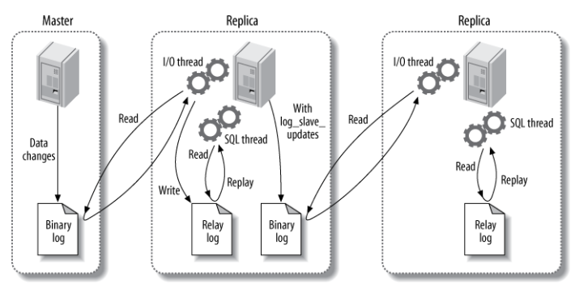
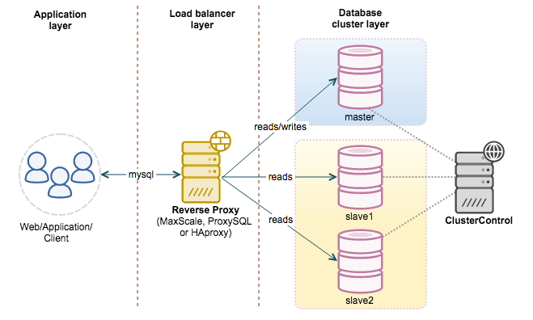

[TOC]

### MySQL架构篇

#### 从复制与读写分离

##### 1.复制步骤

- master 记录**更改**的明细，存入到**二进制日志**(binary log)，如记录**增删改**的过程，不记录查询的过程。
- master 发送**同步消息**给 slave。
- slave 收到消息后，将 master 的二进制日志复制到本地的**中继日志**(relay log)。
- slave **重现**中继日志中的消息，从而改变数据库的数据。 

主要涉及三个线程：**binlog 线程、I/O 线程和 SQL 线程**。

- **binlog 线程**：负责将**主服务器上的数据**更改写入**二进制日志**（Binary log）中。
- **I/O 线程**：负责**从主服务器上读取二进制日志**，并写入从服务器的**中继日志**（Relay log）。
- **SQL 线程**：负责**读取中继日志**，解析出主服务器已经执行的数据更改并在**从服务器中执行**。

主库将**变更写入 binlog 日志**，然后从库连接到主库之后，从库有一个 **IO 线程**，将主库的 binlog 日志**拷贝到自己本地**，写入一个 **relay 中继日志**中。接着从库中有一个 **SQL 线程会从中继日志读取 binlog**，然后执行 binlog 日志中的内容，也就是在自己**本地再次执行一遍 SQL**，这样就可以保证自己跟主库的数据是一样的。

##### 2.日志

 MySQL**复制**的**日志**格式有三种，根据**主库存放数据的方式不同**有以下三种，也就对应**三种复制方式**： 

|   复制方式    |                             特点                             |                             优点                             |                             缺点                             |
| :-----------: | :----------------------------------------------------------: | :----------------------------------------------------------: | :----------------------------------------------------------: |
|    **row**    | 基于行的格式复制，记录需要修改的**每行的数据信息**。 如果一个 SQL 修改了 2W 行的数据，那么就会记录 2W 行的日志格式 | 保证了数据的**强一致性**，且由于记录的是执行后的结果，在从库上执行还原也会比较快 | 日志记录**数量很多**，日志文件巨大，主从之间的传输需要更多的时间 |
| **statement** | 基于段的日志格式复制，也就是记录下**更改的 SQL 记录**，而不是更改的行的记录 |                      日志记录量**最小**                      | 对于一些输出结果不确定的函数，在从库上执行一遍很可能会出现问题，如 UUID，从库根据日志还原主库数据的时候需要执行一遍 SQL，时间相对较慢 |
|   **mixed**   | 混合上面两种日志格式记录记录日志，至于什么时候使用哪种日志方式由MySQL 本身决定 |               可以平衡上面两种日志格式的优缺点               |                                                              |

##### 3.读写分离

MySQL 的读写分离架构就是：**主服务器处理写操作**以及**实时性要求比较高的读**操作，而**从服务器处理读**操作。读写分离是基于上述的**主从复制**架构的。

读写分离能提高性能的**原因**在于：

- 主从服务器**负责各自的读和写**，极大程度**缓解了锁的争用**。
- **从服务器**可以**使用 MyISAM**，提升**查询性能**以及节约系统开销。
- 增加冗余，提高**可用性**。

读写分离常用**代理方式**来实现，**代理服务器**接收应用层传来的**读写请求**，然后决定转发到哪个服务器，如下图所示。

##### 4.主从复制的问题

主从复制可能出现两个问题：

**数据不一致问题**：如果**主库突然宕机**，然后恰好数据还没同步到从库，那么有些数据可能在从库上是没有的，有些数据可能就丢失，造成数据不一致问题。

**同步时延问题**：就是从库同步主库数据的过程是串行化的，也就是说主库上并行的操作，在从库上会串行执行。所以由于从库从主库拷贝日志以及串行执行 SQL 的特点，在高并发场景下，从库的数据一定会比主库慢一些，是**有延时**的。所以经常出现，刚写入主库的数据可能是读不到的，要过几十毫秒甚至几百毫秒才能读取到。

##### 5.复制方式

MySQL 有两个机制复制来解决上述问题，一个是**半同步复制**，用来解决主库数据丢失问题。一个是**并行复制**，用来解决主从同步延时问题。

**异步复制**：主库写入一个**事务** COMMIT 提交并执行完之后，将日志记录到 **binlog**，将结果反馈给**客户端**，最后**将日志传输到从库**。该复制经常遇到的问题是：因为 binlog 日志是**推送**的，所有主库和从库之间存在一定的**延迟**。这样就会造成很多问题，比如主库因为磁盘损坏等故障突然崩掉，导致 binlog 日志不存在，同时因为延迟 binlog 还没有推送到从库，从库也就会丢失很多被主库提交的事物，从而造成**主从不一致问题**。 

**半同步复制**：主库写入一个**事务** COMMIT 提交并执行完之后，并**不直接将请求反馈给前端应用用户**，而是等待**从库也接收到** binlog 日志并成功写入中继日志后，主库才返回 COMMIT 操作成功给客户端。半同步复制保障了事务执行后，至少有**两份日志记录**，一份在**主库**的 binlog 上，另一份至少在**从库**的中继日志 Relaylog 上，这样就极大的**保证了数据的一致性**。 

**并行复制**：指的是从库开启**多个线程**，并行读取 relay log 中不同库的日志，然后**并行重放不同库的日志**，这是**库级别的并行**。

##### 6.主从延迟问题解决

一般来说，如果主从延迟较为严重，有以下解决方案：

* **分库**，将一个主库拆分为多个主库，每个主库的写并发就减少了几倍，此时主从延迟可以忽略不计。
* 打开 MySQL 支持的**并行复制**，多个库并行复制。如果说某个库的写入并发就是特别高，单库写并发达到了 2000/s，并行复制还是没意义。
* 某些**写后读**的场景可以考虑**强制读主库**。

#### 参考资料

- 《高性能 MySQL 第三版》

