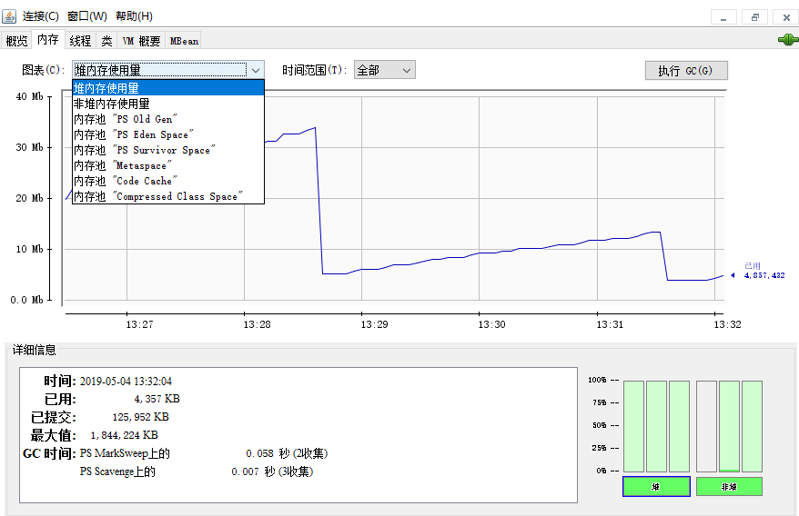
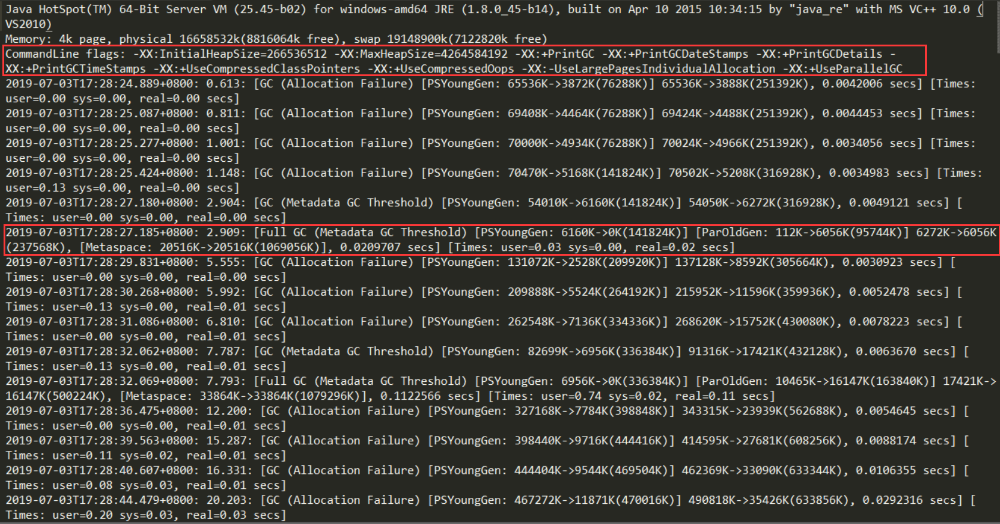
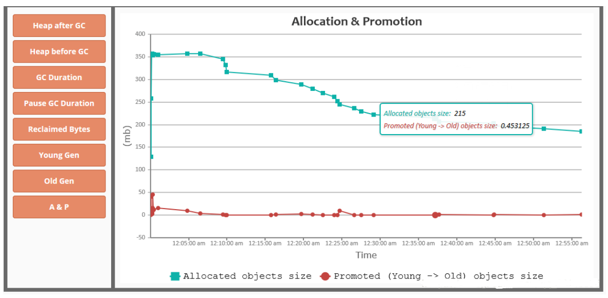

[TOC]

### JVM监控和故障处理工具

给一个系统定位问题可以分析**运行日志、异常堆栈、GC日志、线程快照文件(threaddump/javacore文件)、堆转储快照(heapdump/hprof文件)**等内容。

#### JDK的命令行工具

这些命令在 JDK 安装目录下的 **bin** 目录下：

|    名称    |                           主要作用                           |
| :--------: | :----------------------------------------------------------: |
|  **jps**   | Jvm Process Status Tool，显示指定系统内所有的 HotSpot 虚拟机**进程** |
| **jstat**  | Jvm Statistics Monitoring Tool，用于收集 HotSpot **虚拟机各方面的运行数据** |
| **jinfo**  |     Configuration Info for Java，显示**虚拟机配置**信息      |
|  **jmap**  | Memory Map for Java，生成虚拟机的**内存转储快照**(heapdump 文件) |
|  **jhat**  | Jvm Heap Dump Browser，用于**分析 heapmap 文件**，它会建立一个服务器让用户可以在浏览器上查看分析结果 |
| **jstack** |        Stack Trace for Java，显示虚拟机的**线程快照**        |

##### 1.jps虚拟机进程状况工具

jps 可以列出正在运行的**虚拟机进程**，并显示虚拟机执行**主类名称**以及这些进程的本地虚拟机**唯一 ID**。看到 ID 之后就能定位到某个 Java 应用，然后进行后续操作。jps 命令格式：

```java
jps [可选参数] [hostid]
```

**可选参数选项说明如下：**

```shell
-q # 不输出类名、Jar名和传入main方法的参数
-m # 输出传入main方法的参数
-l # 输出main类或Jar的全限名
-v # 输出传入JVM的参数
```

不加参数：

```java
$ jps
7360 NettyClient2
17396
7972 Launcher
16504 Jps
17340 NettyServer
```

- **jps -l**: 输出**主类的全名**，如果进程执行的是 **Jar 包**，输出 Jar 路径。

```java
C:\Users\Nano>jps -l
7360 firstNettyDemo.NettyClient2
17396
7972 org.jetbrains.jps.cmdline.Launcher
16492 sun.tools.jps.Jps
17340 firstNettyDemo.NettyServer
```

- **jps -v**：输出虚拟机进程启动时 **JVM 参数**。

##### 2.==jstat==监视虚拟机各种运行状态信息

###### (1)概述

jstat 是用于监视虚拟机各种**运行状态信息**的命令行工具。它可以显示本地或者远程虚拟机进程中的**类装载、内存、垃圾回收、JIT 编译**等运行数据，可以查看**堆内存各部分的使用量，以及加载类的数量**，在仅提供了纯文本控制台环境的服务器上，它将是**运行期定位虚拟机性能问题的==首选工具==**。**非常重要**！！！可以用于**内存分配调优**，需要用熟悉！

jstat 的命令格式：

```java
jstat [-命令选项] [vmid] [间隔时间(毫秒)] [查询次数]
```

常见的 **命令选项** 如下：

```java
jstat -class vmid 		// 显示ClassLoader的相关信息
jstat -compiler vmid 	// 显示JIT编译的相关信息
jstat -gc vmid   		// 显示与GC相关的堆信息
jstat -gccapacity vmid 	// 显示整个堆内存的容量及使用情况
jstat -gcnew vmid 		// 显示新生代信息
jstat -gcnewcapacity vmid 	// 显示新生代大小与使用情况
jstat -gcold vmid 		// 显示老年代和永久代的信息
jstat -gcoldcapacity vmid 	// 显示老年代的大小
jstat -gcpermcapacity vmid 	// 显示永久代大小
jstat -gcutil vmid 		// 显示垃圾收集信息
```

根据这些参数可以对各个区参数进行查看，出来的参数大同小异。

例子 1：

```sh
jstat -gc -h3 6 1000 10
```


表示分析**进程 id 为 6** 的 **GC** 情况，每隔 1000ms 打印一次记录，打印 10 次停止，每 3 行后打印指标头部。

例子 2：需要每 1000 毫秒查询一次进程 6 垃圾收集状况，一共查询 10 次，命令如下。

```sh
jstat -gcutil 6 1000 10
```


###### (2)垃圾回收统计

**jstat -gc pid 最常用**，可以评估程序内存使用及 **GC 压力整体情况**，需记住！

```sh
jstat -gc 6
```

结果如下：


- S0C：第一个幸存区的大小，单位 KB。
- S1C：第二个幸存区的大小。
- S0U：第一个幸存区的使用大小。
- S1U：第二个幸存区的使用大小。
- EC：伊甸园区的大小。
- EU：伊甸园区的使用大小。
- OC：老年代大小。
- OU：老年代使用大小。
- MC：方法区大小(元空间)。
- MU：方法区使用大小。
- CCSC：压缩类空间大小。
- CCSU：压缩类空间使用大小。
- YGC：年轻代垃圾回收**次数**，启动以来总共的次数。
- YGCT：年轻代垃圾回收消耗时间，单位 s，YGC 的**总时间**。
- FGC：老年代垃圾回收总次数。
- FGCT：老年代垃圾回收消耗时间，单位 s，FGC **总时间**。
- GCT：垃圾回收消耗总时间，单位 s，全部 GC 的**总时间**。

根据这些参数就可以看 JVM 的状态，用于**调优**！

##### 3.jinfo实时查看与调整虚拟机各项参数

查看正在运行的 Java 应用程序的扩展参数。

- **jinfo pid**：输出当前 JVM 进程的**全部参数和系统属性**。第一部分是系统属性，第二部分是 JVM 参数。

```sh
[root@nano]$ jinfo 6
Attaching to process ID 6, please wait...
Debugger attached successfully.
Server compiler detected.
JVM version is 25.202-b08
    
# Java参数    
Java System Properties:

java.vendor = Oracle Corporation
os.name = Linux
sun.boot.class.path = /usr/java/jdk1.8.0_202/jre/lib/resources.jar:/usr/java/jdk1.8.0_202/jre/lib/rt.jar:/usr/java/jdk1.8.0_202/jre/lib/sunrsasign.jar:/usr/java/jdk1.8.0_202/jre/lib/jsse.jar:/usr/java/jdk1.8.0_202/jre/lib/jce.jar:/usr/java/jdk1.8.0_202/jre/lib/charsets.jar:/usr/java/jdk1.8.0_202/jre/lib/jfr.jar:/usr/java/jdk1.8.0_202/jre/classes
# 省略....

# 虚拟机参数 
VM Flags:
Non-default VM flags: -XX:CICompilerCount=4 -XX:ConcGCThreads=2 -XX:G1HeapRegionSize=4194304 -XX:+HeapDumpOnOutOfMemoryError -XX:HeapDumpPath=null -XX:InitialHeapSize=9663676416 -XX:+ManagementServer -XX:MarkStackSize=4194304 -XX:MaxGCPauseMillis=200 -XX:MaxHeapSize=9663676416 -XX:MaxNewSize=5796528128 -XX:MetaspaceSize=268435456 -XX:MinHeapDeltaBytes=4194304 -XX:-OmitStackTraceInFastThrow -XX:+PrintGC -XX:+PrintGCDateStamps -XX:+PrintGCDetails -XX:+PrintGCTimeStamps -XX:+UseCompressedClassPointers -XX:+UseCompressedOops -XX:+UseFastUnorderedTimeStamps -XX:+UseG1GC 
Command line:  -Xmx9g -Xms9g -Xloggc:/home/shared/log/gc.log -XX:+PrintGCDateStamps -XX:+UseG1GC -XX:MaxGCPauseMillis=200 -XX:MetaspaceSize=256m -XX:-OmitStackTraceInFastThrow -XX:+PrintGCDetails -verbose:gc -XX:+HeapDumpOnOutOfMemoryError -XX:HeapDumpPath=/home/oom-dump/leo-cm-ocr -Dcom.sun.management.jmxremote.port=9999 -Dcom.sun.management.jmxremote.login.config=FenbiConfig -Djava.security.auth.login.config=/etc/jmx_ldap.config -Dcom.sun.management.jmxremote.ssl=false -javaagent:/lib/skywalking-BETA/agent/skywalking-agent.jar
```

- **jinfo -flags pid**：单独查看 **JVM 参数**。

```sh
[root@nano]$ jinfo -flags 6
Attaching to process ID 6, please wait...
Debugger attached successfully.
Server compiler detected.
JVM version is 25.202-b08
Non-default VM flags: -XX:CICompilerCount=4 -XX:ConcGCThreads=2 -XX:G1HeapRegionSize=4194304 -XX:+HeapDumpOnOutOfMemoryError -XX:HeapDumpPath=null -XX:InitialHeapSize=9663676416 -XX:+ManagementServer -XX:MarkStackSize=4194304 -XX:MaxGCPauseMillis=200 -XX:MaxHeapSize=9663676416 -XX:MaxNewSize=5796528128 -XX:MetaspaceSize=268435456 -XX:MinHeapDeltaBytes=4194304 -XX:-OmitStackTraceInFastThrow -XX:+PrintGC -XX:+PrintGCDateStamps -XX:+PrintGCDetails -XX:+PrintGCTimeStamps -XX:+UseCompressedClassPointers -XX:+UseCompressedOops -XX:+UseFastUnorderedTimeStamps -XX:+UseG1GC 
Command line:  -Xmx9g -Xms9g -Xloggc:/home/shared/log/gc.log -XX:+PrintGCDateStamps -XX:+UseG1GC -XX:MaxGCPauseMillis=200 -XX:MetaspaceSize=256m -XX:-OmitStackTraceInFastThrow -XX:+PrintGCDetails -verbose:gc -XX:+HeapDumpOnOutOfMemoryError -XX:HeapDumpPath=/home/oom-dump/leo-cm-ocr -Dcom.sun.management.jmxremote.port=9999 -Dcom.sun.management.jmxremote.login.config=FenbiConfig -Djava.security.auth.login.config=/etc/jmx_ldap.config -Dcom.sun.management.jmxremote.ssl=false -javaagent:/lib/skywalking-BETA/agent/skywalking-agent.jar
```

- **jinfo -flag name vmid**：输出**对应名称的参数**的具体值。比如输出 MaxHeapSize、查看当前 JVM 进程是否开启打印 GC 日志。

```sh
[root@nano]$ jinfo  -flag MaxHeapSize 6
-XX:MaxHeapSize=9663676416
[root@nano]$ jinfo  -flag PrintGC 6
-XX:+PrintGC
```

- **info -sysprops pid**：单独查看系统属性。

##### 4.jmap生成堆转储快照

jmap 命令用于生成==**堆转储快照**==。jmap 的作用并不仅仅为了获取 **dump 文件**，它还可以查询 finalize 执行队列、堆和永久代的详细信息。**如空间使用率、当前用的是哪种收集器等**。

- **查看实例个数与占用内存大小**

- **堆信息**。
- **堆内存 dump 文件**。

jmap 的命令格式：

```sh
[root@nano]$ jmap [option] pid
```

先用 jps 获取正在运行的**进程号**。

```bash
[root@nano] $ jps
6 TestJmap
```

###### (1)获取堆转储文件

**示例**：将指定应用程序的**堆快照**输出到**桌面**。后面可以通过 jhat、Visual VM 等工具**分析**该堆文件。

```sh
[root@nano]$ jmap -dump:format=b,file=C:\Users\SnailClimb\Desktop\heap.hprof 6
# 下面是输出    
Dumping heap to C:\Users\SnailClimb\Desktop\heap.hprof ...
Heap dump file created
```

JDK 提供 **jhat 与 jmap** 搭配使用，来**分析 dump 生成的堆快照**。jhat 内置了一个微型服务器，生成 dump 文件的分析结果后，可以在**浏览器**中查看。访问 http://localhost:7000/ 即可。

```sh
[root@nano]$ jhat C:\Users\SnailClimb\Desktop\heap.hprof
Reading from C:\Users\SnailClimb\Desktop\heap.hprof...
Dump file created Sat May 04 12:30:31 CST 2019
Snapshot read, resolving...
Resolving 131419 objects...
Chasing references, expect 26 dots..........................
Eliminating duplicate references..........................
Snapshot resolved.
Started HTTP server on port 7000
Server is ready.
```

###### (2)查看实例个数与占用内存大小

主要使用 -**histo** 参数**查看实例个数与占用内存大小**。

```bash
[root@nano] $ jmap -histo 6

 num     #instances         #bytes  class name
----------------------------------------------
   1:           658        4189056  [I
   2:          1197        1177576  [B
   3:          7504         816120  [C
   4:          5779         138696  java.lang.String
   5:           691          78976  java.lang.Class
   6:          1298          61136  [Ljava.lang.Object;
   7:           791          31640  java.util.TreeMap$Entry
   8:           634          25360  java.util.LinkedHashMap$Entry
   9:           456          22144  [Ljava.lang.String;
  10:           368          11776  java.util.HashMap$Node
  11:            38          11584  [Ljava.util.HashMap$Node;
  12:           152          10944  java.lang.reflect.Field
  13:           388           9312  java.lang.StringBuilder
  14:           251           8032  java.io.File
  15:           242           7744  java.util.Hashtable$Entry
  16:           107           6848  java.net.URL
  17:           253           6072  java.lang.StringBuffer
```

- num：序号。
- instances：实例**数量**。
- bytes：占用空间大小。
- class name：类名称，这里 [C -> char[]，[S -> short[]，[I -> int[]，[B -> byte[]，[[I -> int\[][]。

###### (3)自动生成dump文件

可以设置**内存溢出自动导出** dump 文件(内存很大的时候，可能会导不出来)。

1. **-XX:+HeapDumpOnOutOfMemoryError**
2. **-XX:HeapDumpPath=Path**

```java
public class OOMTest {

   public static List<Object> list = new ArrayList<>();

   // JVM参数设置    
   // -Xms10M -Xmx10M -XX:+PrintGCDetails -XX:+HeapDumpOnOutOfMemoryError -XX:HeapDumpPath=D:\jvm.dump 
   public static void main(String[] args) {
      List<Object> list = new ArrayList<>();
      int i = 0;
      int j = 0;
      while (true) {
         list.add(new User(i++, UUID.randomUUID().toString()));
         new User(j--, UUID.randomUUID().toString());
      }
   }
}
```

##### 5.jstack生成线程快照

**jstack** 命令用于生成虚拟机当前时刻的**线程快照**，一般称为 **threaddump** 或者 javacore 文件。线程快照就是当前虚拟机内每一条线程正在执行的**方法堆栈集合**，生成线程快照的主要目的是**定位线程出现长时间==停顿==的原因**，如**线程死锁、死循环、请求外部资源导致长时间等待**等。线程出现**停顿**的时候通过 jstack 来查看各个线程的调用堆栈，就可以知道没有响应的线程到底在后台做些什么事情。

jstack 命令格式：

```sh
jstack [option] vmid（进程号）
```

###### (1)死锁分析

**下面是一个线程死锁的代码。通过 jstack 命令进行死锁检查，输出死锁信息，找到发生死锁的线程。**

```java
public class DeadLockDemo {
    private static Object resource1 = new Object();	// 资源 1
    private static Object resource2 = new Object();	// 资源 2

    public static void main(String[] args) {
        new Thread(() -> {
            // 锁定资源1
            synchronized (resource1) {
                System.out.println(Thread.currentThread() + "get resource1");
                try {
                    // 睡眠等待
                    Thread.sleep(1000);
                } catch (InterruptedException e) {
                    e.printStackTrace();
                }
                System.out.println(Thread.currentThread() + "waiting get resource2");
                // 请求资源2
                synchronized (resource2) {
                    System.out.println(Thread.currentThread() + "get resource2");
                }
            }
        }, "线程 1").start();

        new Thread(() -> {
            // 锁定资源1
            synchronized (resource2) {
                System.out.println(Thread.currentThread() + "get resource2");
                try {
                    // 睡眠等待
                    Thread.sleep(1000);
                } catch (InterruptedException e) {
                    e.printStackTrace();
                }
                System.out.println(Thread.currentThread() + "waiting get resource1");
                // 请求资源2
                synchronized (resource1) {
                    System.out.println(Thread.currentThread() + "get resource1");
                }
            }
        }, "线程 2").start();
    }
}
```

两个线程互相等待资源，造成死锁。输出：

```sh
Thread[线程 1,5,main]get resource1
Thread[线程 2,5,main]get resource2
Thread[线程 1,5,main]waiting get resource2
Thread[线程 2,5,main]waiting get resource1
```

查看指定进程号的线程快照

```java
[root@nano]$ jstack 6
```

输出的部分内容如下：

```java
Found one Java-level deadlock:
=============================
"线程 2":
  waiting to lock monitor 0x000000000333e668 (object 0x00000000d5efe1c0, a java.lang.Object),
  which is held by "线程 1"
"线程 1":
  waiting to lock monitor 0x000000000333be88 (object 0x00000000d5efe1d0, a java.lang.Object),
  which is held by "线程 2"

Java stack information for the threads listed above:
===================================================
"线程 2":
        at DeadLockDemo.lambda$main$1(DeadLockDemo.java:31)
        - waiting to lock <0x00000000d5efe1c0> (a java.lang.Object)
        - locked <0x00000000d5efe1d0> (a java.lang.Object)
        at DeadLockDemo$$Lambda$2/1078694789.run(Unknown Source)
        at java.lang.Thread.run(Thread.java:748)
"线程 1":
        at DeadLockDemo.lambda$main$0(DeadLockDemo.java:16)
        - waiting to lock <0x00000000d5efe1d0> (a java.lang.Object)
        - locked <0x00000000d5efe1c0> (a java.lang.Object)
        at DeadLockDemo$$Lambda$1/1324119927.run(Unknown Source)
        at java.lang.Thread.run(Thread.java:748)
// 找到一个死锁
Found 1 deadlock.
```

 **jstack 命令**已经找到发生死锁的线程的具体信息。

还可以用 **Visual VM** 自动检测死锁。


###### (2)jstack找出占用CPU最高的堆栈信息

这里可以找到一个 **Java 进程里面占用 CPU 最多的线程**，从而找到是哪里的代码出了问题。

1. 使用命令 **top -p \<pid>** ，显示 Java 进程的内存情况，PID 是 Java 进程号，比如 4977。
2. 按 H，获取每个线程的**内存**情况。
3. 找到内存和 CPU 占用最高的线程 PID，比如 4977。
4. 转为十六进制得到 0x1371，此为线程 id 的十六进制表示。
5. 执行 **jstack 4977|grep -A 10 1371**，得到线程堆栈信息中 1371 这个线程所在行的后面 10 行。
6. 查看对应的**堆栈信息**找出可能存在问题的代码。

#### JDK可视化工具

JDK 中除了提供大量的命令行工具外，还有两个功能强大的可视化工具：**JConsole 和 Visual VM**。

##### 1.JConsole

JConsole 能够监视 JVM 内存的使用情况、线程堆栈跟踪、已装入的类和 VM 信息以及 CE MBean。它是一个 GUI 监视工具，可以以图表化的形式显示各种数据。并可通过远程连接监视远程的**服务器 VM**。

提供**内存监控和线程监控**的功能。



##### 2.VisualVM多合一故障处理工具

Visual VM 是一个集成多个 JDK 命令行工具的可视化工具。Visual VM 基于 NetBeans 平台开发，它具备了插件扩展功能的特性，通过插件的扩展，可用于显示虚拟机进程及进程的配置和环境信息(jps，jinfo)，监视应用程序的 CPU、GC、堆、方法区及线程的信息(jstat、jstack)等。VisualVM 在 JDK/bin 目录下。

**生产环境少用可视化的工具**，比较耗性能。

- 生成、浏览堆转储快照。
- 分析程序性能。

#### 堆转储文件

##### 1.概述

**Heap Dump** 也叫**堆转储文件**，是一个 Java 进程在**某个时间点上的内存快照**。Heap Dump 有多种类型，不过总体上 Heap Dump 在触发快照的时候都保存了 Java 对象和类的信息。通常在**写 Heap Dump 文件**前会**触发一次 Full GC**，所以 Heap Dump 文件中保存的是 **Full GC 后**留下的对象信息。

##### 2.堆转储的用途

一般在 Heap Dump 文件中可以获取到如下信息：

- **对象信息**：类、成员变量、直接量以及引用值。
- **类信息**：类加载器、名称、超类、静态成员。
- **GC Roots**：JVM 可达的对象。
- **线程栈以及本地变量**：获取快照时的线程栈信息，以及局部变量的详细信息。

因此可以分析如下问题：

- 找出**内存泄漏**的原因。
- 找出重复引用的 jar 或类。
- 分析**集合**的使用。
- 分析**类加载器**。

对 Heap Dump 的分析就是对应用的内存使用进行分析，从而更加合理地使用内存。

##### 3.获取堆转储文件

- **设置虚拟机参数-XX:+HeapDumpOnOutOfMemoryError**：设置此参数可以在发生 **OutOfMemoryError** 后获取到一份 HPROF 二进制 Heap Dump 文件，生成的文件会直接写入到工作目录。

```java
-XX:+HeapDumpOnOutOfMemoryError
```

- **使用 jmap 工具**：算是用的**最多**的方式。参考前述内容即可。

```java
jmap -dump:format=b,file=<filename.hprof> <pid>
```

- **使用 JConsole 工具**

#### 工具与虚拟机调优

**==用 jstat gc -pid 命令==**可以计算出如下一些**关键数据**，先给自己的系统设置一些**初始性的 JVM 参数**，比如堆内存大小，年轻代大小，Eden 和 Survivor 的比例，老年代的大小，大对象的阈值，大龄对象进入老年代的阈值等。

**年轻代对象增长的速率**

可以执行命令 **jstat -gc pid 1000 10**(每隔 1 秒执行 1 次命令，共执行 10 次)，通过观察 **EU**(eden 区的使用)来估算每秒 eden 大概**新增多少对象**，如果系统负载不高，可以把频率 1 秒换成 1 分钟，甚至 10 分钟来观察整体情况。注意，一般系统可能有高峰期和日常期，所以需要在不同的时间分别估算不同情况下对象增长速率。

**Young GC 的触发频率和每次耗时**

知道年轻代对象增长速率后就能根据 Eden 区的大小推算出 Young GC 大概多久触发一次，Young GC 的平均耗时可以通过 **YGCT/YGC** 公式算出，根据结果大概就能知道**系统大概多久会因为 Young GC 的执行而卡顿多久**。

**每次 Young GC 后有多少对象存活和进入老年代**

由于前面步骤已经大概知道 Young GC 的频率，假设是每 5 分钟一次，那么可以执行命令 jstat -gc pid 300000 10，观察每次结果中 **Eden**，**Survivor 和老年代**使用的变化情况，在每次 GC 后 Eden 区使用一般会大幅减少，Survivor 和老年代都有可能增长，这些增长的对象就是每次 Young GC 后存活的对象，同时还可以看出每次 Young GC 后进去老年代大概多少对象，从而可以推算出**老年代对象增长速率。**

**Full GC 的触发频率和每次耗时**

知道了老年代对象的增长速率就可以推算出 **Full GC 的触发频率**了，Full GC 的每次耗时可以用公式 **FGCT/FGC** 计算得出。

**优化思路**其实简单来说就是**尽量让每次 Young GC 后的存活对象小于 Survivor 区域的 50%，都留存在年轻代里。尽量别让对象进入老年代。尽量减少 Full GC 的频率，避免频繁 Full GC 对 JVM 性能的影响。**

#### GC日志

##### 1.概述

可以通过一些配置把运行过程中的 **GC 日志全部打印**出来，然后分析 GC 日志得到关键性指标，分析 GC 原因，调优 JVM 参数。常见参数如下。

```java
-XX:+PrintGC 		// 输出GC日志
-XX:+PrintGCDetails // 输出GC的详细日志
-XX:+PrintGCTimeStamps 	// 输出GC的时间戳（以基准时间的形式）
-XX:+PrintGCDateStamps 	// 输出GC的时间戳（以日期的形式，如 2013-05-04T21:53:59.234+0800）
-XX:+PrintHeapAtGC 		// 在进行GC的前后打印出堆的信息
-Xloggc:../logs/gc.log 	// 日志文件的输出路径
```

比如 **Spring Boot** 程序启动时添加：

```java
‐XX:+PrintGCDetails ‐XX:+PrintGCTimeStamps ‐XX:+PrintGCDateStamps ‐Xloggc:./gc.log
```

Tomcat 则直接加在 **JAVA_OPTS** 变量里。

##### 2.日志分析

一份摘自《深入理解 Java 虚拟机》中的一段 **GC 日志**：

```java
33.125:[GC[DefNew:3324K->152K(3712K), 0.0025925 secs]3324K->152K(11904K), 0.0031680 secs]
100.667:[Full GC[Tenured:0 K->210K(10240K), 0.0149142secs]4603K->210K(19456K), [Perm:2999K->2999K(21248K)], 0.0150007 secs][Times:user=0.01 sys=0.00, real=0.02 secs]
```

分析：

- 首先 "33.125" 和 "100.667" 这个数值的意义是代表 GC 发生的**时间**，该数字是 GC 启动以来的时间。
- "GC" 和 "Full GC" 则代表这次 GC 发生的**类型**，如果为 Full GC，则代表这次 GC 是 Stop The World 的。如果通过 System.gc() 方法触发的则会显示 Full GC(System)。
- "DefNew、Tenured、Perm" 表示 GC 发生的**区域**，这里显示的区域名称与使用的 GC 收集器是密切相关的。
- "3324K-＞152K(3712K)" 代表 **GC 前**该区域内已使用的**容量** -> **GC 后**该区域内已使用的容量(该区域内的总容量)。
- "0.0025925 secs" 表示这次 GC 所占用的时间单位为**秒**。
- "3324K->152K(11904K)" 则是 **GC 前** Java 堆已使用容量 -＞ **GC 后** Java 堆已使用容量(Java 堆总容量)。
- "[Times:user=0.01 sys=0.00, real=0.02 secs]" 里的 user、sys、real 分别代表用户态消耗 CPU 的时间和内核态消耗的 CPU 的时间和操作开始到结束所经历的时间。

**再看一个 GC 日志：**



可以看到图中**第一行红框**，是**项目的配置参数**。这里不仅配置了打印 GC 日志，还有相关的 VM 内存参数。 

**第二行红框**中的是在这个 GC 时间点**发生 GC 之后相关 GC 情况**。 

- "2.909" 这是具体发生 GC 的时间点。这是时间戳是从 JVM **启动开始计算**的，前面还有具体的发生时间日期。 
- "Full GC(Metadata GC Threshold)" 指这是一次 Full GC，括号里是 GC 的原因，"PSYoungGen" 是年轻代的 GC，"ParOldGen" 是老年代的 GC，"Metaspace" 是元空间的 GC。
- "6160K->0K(141824K)": 这三个数字分别对应 GC 之前占用年轻代的大小，GC 之后年轻代占用，以及整个年轻代的大小。 
- "112K->6056K(95744K)": 这三个数字分别对应 GC 之前占用老年代的大小，GC 之后老年代占用，以及整个老年代的大小。 
- "6272K->6056K(237568K)": 这三个数字分别对应 GC 之前占用堆内存的大小，GC 之后堆内存占用，以及整个堆内存的大小。 
- "20516K->20516K(1069056K)": 这三个数字分别对应 GC 之前占用元空间内存的大小，GC 之后元空间内存占用，以及整个元空间内存的大小。 
- "0.0209707" 是该时间点 GC 总耗费时间。 

通过上面的这些参数就能知道 GC 的垃圾收集情况。但是如果 GC 日志**过多且繁杂**，有时候为了发现问题往往需要连续运行很久，比如几个周，这就会有很多的 GC 日志，直接去看就不现实，可以使用可视化工具 **gceasy** 进行分析。可以看到堆内存在 GC 之前和之后的变化，以及其他信息。




#### **参考资料**

- 虚拟机性能监控与故障处理工具：http://blog.csdn.net/wsyw126/article/details/62422005
- 堆转储分析：https://blog.csdn.net/hehmxy/article/details/89114116


