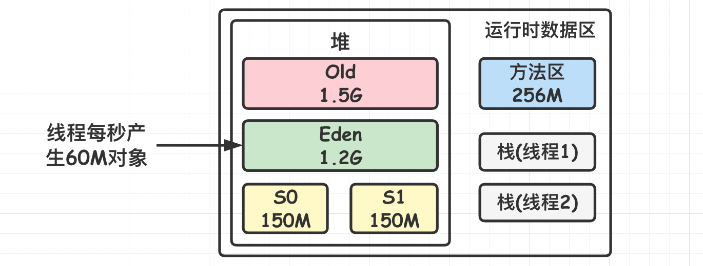
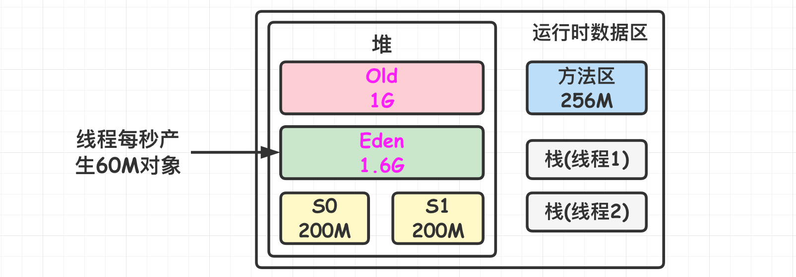

[TOC]

### 虚拟机调优及参数总结

#### 概述

##### 1.GC调优原则

多数 Java 应用**不需要**在服务器上进行 GC 优化；多数导致 GC 问题的应用，都不是因为参数设置错误，而是**代码问题**；在应用上线之前，先考虑将机器的 **JVM 参数设置到最优**；减少创建对象的数量；**减少使用全局变量和大对象**；GC 优化是到最后不得已才采用的手段；在实际使用中，分析 GC 情况**优化代码**比优化 GC 参数要多得多；**JVM 参数大小设置并没有固定标准，需要根据实际项目情况分析**。

如果满足下面的指标，**则一般不需要进行 GC 优化：**MinorGC 执行时间**不到 50ms**；Minor GC 执行**不频繁**，约 10 秒一次；Full GC 执行时间**不到 1s**；Full GC 执行频率不算频繁，不低于 10 分钟 1 次。

##### 2.GC调优目的

**虚拟机调优主要就是：结合实际业务场景和内存分配的策略进行参数配置。尽量让垃圾对象在年轻代被消灭掉而不是跑到老年代去了，减少 Full GC，同时也控制一下 MinorGC 的次数。**

- 将转移到**老年代**的**对象数量降低到最小**。
- **减少 GC 的执行时间**。

##### 3.GC调优策略

**策略 1：**将**新对象**预留在**新生代**，由于 Full GC 的成本远高于 Minor GC，因此尽可能将对象分配在新生代是明智的做法，实际项目中根据 GC 日志分析新生代空间大小分配是否合理，适当通过 "-**Xmn**" 命令调节新生代大小，**最大限度降低新对象直接进入老年代的情况**。对于 Spring 项目，一般容器内的**核心对象**，如各种 Service 对象经过多次 Minor GC 后会被分配到**老年代**中，而一些用于**处理业务的临时对象尽量控制其在新生代**中，比如处理一个订单中有一些订单对象是临时的，使用完后让其在新生代被回收掉即可，别让它们存活太多导致移动到老年代中了。

**策略 2：**虽然大部分情况下，将对象分配在新生代是合理的，但是对于大对象这种做法却值得考量。大对象如果首次在新生代分配可能会出现空间不足导致很多年龄不够的小对象被分配的老年代，破坏新生代的对象结构，可能会出现频繁的 Full GC。因此对于**大对象**，可以考虑设置**直接进入老年代**(当然生命周期较短的大对象对于垃圾回收来说简直就是噩梦)。-XX:PretenureSizeThreshold 可以设置直接进入老年代的**对象大小**。

**策略 3**：合理设置进入老年代对象的**年龄**，**-XX:MaxTenuringThreshold** 可以设置对象进入老年代的年龄大小，减少老年代的内存占用，降低 Full GC 发生的频率。

**策略 4**：设置合理的堆大小，堆大小设置有两个参数：**-Xms 初始化堆大小**，**-Xmx 最大堆大小**。

##### 4.GC调优步骤

一般情况下，JVM 调优可通过以下步骤进行：

- 分析 **GC 日志及 dump 文件**，判断是否需要优化，确定瓶颈问题点；
- 确定 JVM 调优**量化目标**；
- 确定 JVM **调优参数**；
- 依次调优内存、延迟、吞吐量等指标；
- 对比观察调优前后的差异；
- 不断的分析和调整，直到找到合适的 JVM 参数配置；
- 找到最合适的参数，将这些参数应用到所有服务器，并进行后续跟踪。

##### 5.参数设置方式

**Spring Boot 程序**的 JVM 参数设置格式：

```
java ‐Xms2048M ‐Xmx2048M ‐Xmn1024M ‐Xss512K ‐XX:MetaspaceSize=256M ‐XX:MaxMetaspaceSize=256M ‐jar microservice‐eureka‐server.jar
```

Tomcat 启动直接加在 bin 目录下 catalina.sh 文件里。

#### 虚拟机参数调优实例

**==调优全部都是根据业务具体的场景和 JVM 内存分配机制来的==**。

##### 1.电商系统优化JVM参数(ParNew+CMS)

大型电商系统后端现在一般都是拆分为多个**子系统**部署的，如商品系统，库存系统，订单系统等。这里以比较核心的订单系统为例，假设系统日均产生 50W 订单，当发生促销时，假设每秒有 1000 单，共部署 3 台服务器，每台服务器需每秒处理 300 个订单。假设每个订单对象 1K，则每秒产生 300K 的订单对象，下单过程的各种业务可能会产生其他对象，这里放大 20 倍，假设每秒产生 300K * 20 = 6M 的对象。生成订单可能还涉及查询等操作，再放大 10 倍，假设疫苗产生 60M 对象。但是这些对象会在 1 秒后全部变成垃圾对象。

对于 **8G** 内存的服务器一般是分配 **4G** 内存给 JVM，一般的 JVM **参数配置**如下：

```java
-Xms3072M -Xmx3072M -Xmn1536M -Xss1M -XX:MetaspaceSize=256M -XX:MaxMetaspaceSize=256M  -XX:SurvivorRatio=8
```



系统按**每秒生成 60MB 的速度**来生成对象，大概运行 **20 秒**就会撑满 eden 区，会触发 Minor GC，大概会有 95% 以上对象成为垃圾被回收，可能最后**一两秒**生成的对象**还被引用着**，暂估为 **100MB** 左右，那么这 100M 会被挪到 **S0 区**，根据**动态对象年龄判断原则**，这 **100MB** 对象同龄而且总和大于 S0 区的 **50%**，那么这些对象都会被挪到**老年代**，到了老年代不到**一秒**又变成了**垃圾对象**，很明显这里 **survivor 区**大小设置有点小。

分析下系统业务就知道，明显**大部分**对象都是**短生存周期**的，**根本不应该频繁进入老年代**，也**==没必要给老年代维持过大的内存空间==，得让对象尽量留在新生代里**。

于是可以**更新**下 JVM 参数设置：

```java
-Xms3072M -Xmx3072M -Xmn2048M -Xss1M -XX:PermSize=256M -XX:MaxPermSize=256M  
-XX:SurvivorRatio=8 
```



这样就降低了因为**对象动态年龄判断原则导致的对象频繁进入老年代**的问题，其实**==很多优化无非就是让短期存活的对象尽量都留在 survivor 里，不要进入老年代，这样在 Minor GC 的时候这些对象都会被回收，不会进到老年代从而导致 Full GC==**。

对于对象年龄应该为多少才移动到老年代比较合适，本例中一次 Minor GC 要间隔二三十秒，**大多数对象一般在几秒内就会变为垃圾**，完全可以将默认的 15 岁改小一点，比如改为 5，那么意味着对象要经过 **5 次 Minor GC** 才会进入老年代，整个时间也有一两分钟了，如果对象这么**长时间都没被回收**，完全可以认为这些对象是会存活的比较长的对象，可以移动到老年代，而不是继续一直占用 survivor 区空间。

对于多大的对象直接进入老年代(参数 -XX:PretenureSizeThreshold)，这个一般可以结合业务场景看下有没有什么大对象生成，预估下大对象的大小，一般来说设置为 **1M** 就差不多了，很少有超过 1M 的大对象，这些对象一般就是系统中初始化分配的缓存对象，比如**大的缓存** List，Map 之类的对象。

可以再次适当调整 JVM 参数如下：

```java
-Xms3072M -Xmx3072M -Xmn2048M -Xss1M  -XX:PermSize=256M -XX:MaxPermSize=256M  -XX:SurvivorRatio=8 
-XX:MaxTenuringThreshold=5 -XX:PretenureSizeThreshold=1M -XX:+UseParNewGC -XX:+UseConcMarkSweepGC
```

对于**老年代 CMS 的参数**如何设置可以思考下，首先想下当前这个系统有**哪些对象**可能会长期存活躲过 5 次以上  Minor GC 最终进入老年代。**无非就是那些 Spring 容器里的 Bean，线程池对象，一些初始化缓存数据对象等，这些加起来充其量也就几十 MB**。

还有就是某次 Minor GC 完了之后还有超过 200M 的对象存活，那么就会直接**进入老年代**，比如**突然某一秒瞬间要处理五六百单，那么每秒生成的对象可能有一百多 M，再加上整个系统可能压力剧增，一个订单要好几秒才能处理完，下一秒可能又有很多订单过来。**

可以估算下大概每隔**五六分钟**出现一次这样的情况，那么大概**半小时到一小时**之间就可能因为老年代满了触发一次 Full GC，Full GC 的触发条件还有之前说过的**老年代空间分配担保机制**，历次的 Minor GC 挪动到老年代的对象大小肯定是非常小的，所以几乎**不会**在 Minor GC 触发之前由于老年代空间分配担保失败而产生 Full GC，其实在半小时后发生 Full GC，这时候已经过了抢购的最高峰期，后续可能几小时才做一次 Full GC。对于碎片整理，因为都是 1 小时或几小时才做一次 Full GC，是可以每做**完一次就开始碎片整理**。

综上只要**年轻代**参数设置合理，老年代 CMS 的参数设置**基本都可以用默认值**，如下所示：

```java
-Xms3072M -Xmx3072M -Xmn2048M -Xss1M  -XX:PermSize=256M -XX:MaxPermSize=256M  -XX:SurvivorRatio=8 
-XX:MaxTenuringThreshold=5 -XX:PretenureSizeThreshold=1M -XX:+UseParNewGC -XX:+UseConcMarkSweepGC 
-XX:CMSInitiatingOccupancyFaction=92 -XX:+UseCMSCompactAtFullCollection -XX:CMSFullGCsBeforeCompaction=0
```

总结一下，核心思想就是：让**长久存活的对象早到老年代**，**尽量别让短生命周期的对象跑到老年代去**，让它们在新生代就被处理掉。

#### JVM参数

##### 1.堆内存分配参数

###### (1)堆内存

与性能有关的最常见实践之一是根据应用程序要求**初始化堆内存**。以下参数指定**最小和最大堆**大小，推荐显式指定堆大小：

- **Xms：堆区初始值**。

- **Xmx：堆区最大值**。 

```java
-Xms<heap size>[unit] 
-Xmx<heap size>[unit]
```

**heap size** 表示要初始化内存的具体大小。**unit** 表示要初始化内存的单位。单位为 **"g(GB)", "m(MB)", "k(KB)"**。

示例：

```java
-Xms2G 或 -XX:InitialHeapSize=2048m 	// 最小堆内存2G
-Xmx2G 或 -XX:MaxHeapSize=2048m      // 最大堆内存2G
```

###### (2)栈内存

- **Xss：线程栈最大值**。

举例：

```java
-Xss256k 或 -XX:ThreadStackSize=256k
```

栈的大小直接决定函数调用的可达深度。JDK5.0 以后每个线程堆栈大小为 **1M**，以前每个线程堆栈大小为 256K。应该根据应用的线程所需内存大小进行调整。在相同物理内存下，减小这个值能生成更多的线程。但是操作系统对一个进程内的线程数还是有限制的，不能无限生成，经验值在 3000~5000 左右。

###### (3)年轻代内存

根据 Oracle 官方文档，在堆总可用内存配置完成之后，第二大影响因素是**年轻代**在堆内存所占的**比例**。默认情况下，年轻代的最小大小为 **1310 MB**，最大大小为无限制。

- **-XX:NewSize：年轻代最小内存。**
- **-XX:MaxNewSize：年轻代最大内存。**
- **-Xmn：年轻代最大内存。**

举例：

```java
-XX:NewSize=256m
-Xmn512m 或 -XX:MaxNewSize=512m
```

- **-XX:NewRatio：设置新生代和老年代内存的比值。**

```java
// 设置新生代（包括 Eden 和两个 Survivor 区）与老年代的比值为 1。也就是说：新生代与老年代所占比值为 1:1，新生代占整个堆栈的 1/2
-XX:NewRatio=1  
```

###### (4)方法区内存

方法区在 JDK1.8 之前实现方式是**永久代**，JDK1.8 之后实现方式是**元空间**。两者配置的参数不同。

JDK 1.8 **之前**永久代还没被彻底移除的时候通常通过下面这些参数来调节**永久代**大小。

- **-XX:PermSize=N：方法区(永久代) 初始大小。**
- **-XX:MaxPermSize=N：方法区(永久代) 最大大小,超过这个值将会抛出异常。**

这两个参数在 JDK1.8 之后就废弃了。

JDK 1.8 的时候，永久代被**彻底移除**了，取而代之是元空间，**元空间使用的是直接内存**。如果没有指定 **Metaspace** 的大小，随着更多类的创建，虚拟机会耗尽所有可用的**系统内存**。

与元空间的相关参数如下：

- **MetaspaceSize：元数据区初始大小。**
- **MaxMetaspaceSize：元数据区最大值。**
- **MaxDirectMemorySize：最大直接内存（堆外）大小。**

例子：

```java
-XX:MetaspaceSize=128m
-XX:MaxMetaspaceSize=256m
-XX:MaxDirectMemorySize=256m
```

##### 2.行为参数

|       参数及其默认值        |                             描述                             |
| :-------------------------: | :----------------------------------------------------------: |
|   -XX:-DisableExplicitGC    |         禁止调用 System.gc()；但 JVM 的 GC 仍然有效          |
|       -XX:+MaxFDLimit       |                  最大化文件描述符的数量限制                  |
|  -XX:+ScavengeBeforeFullGC  |                新生代 GC 优先于 Full GC 执行                 |
|   -XX:+UseGCOverheadLimit   |        在抛出 OOM 之前限制 JVM 耗费在 GC 上的时间比例        |
| **-XX:-UseConcMarkSweepGC** |             对老生代采用并发标记交换算法进行 GC              |
|   **-XX:-UseParallelGC**    |                 启用并行 GC，收集新生代空间                  |
|    -XX:-UseParallelOldGC    | 对 Full GC 启用并行，当 -XX:-UseParallelGC 启用时该项自动启用 |
|    **-XX:-UseSerialGC**     |                         启用串行 GC                          |
|  -XX:+UseThreadPriorities   |                      启用本地线程优先级                      |

##### 3.性能调优参数列

|        参数及其默认值         |                  描述                   |
| :---------------------------: | :-------------------------------------: |
|  -XX:LargePageSizeInBytes=4m  |      设置用于 Java 堆的大页面尺寸       |
|    -XX:MaxHeapFreeRatio=70    |    GC 后 Java 堆中空闲量占的最大比例    |
|    **-XX:MaxNewSize=size**    |      新生成对象能占用内存的最大值       |
|    **-XX:MaxPermSize=64m**    |      老生代对象能占用内存的最大值       |
|    -XX:MinHeapFreeRatio=40    |     GC后java堆中空闲量占的最小比例      |
|        -XX:NewRatio=2         |  新生代内存容量与老生代内存容量的比例   |
|    **-XX:NewSize=2.125m**     |    新生代对象生成时占用内存的默认值     |
| -XX:ReservedCodeCacheSize=32m |         保留代码占用的内存容量          |
|    -XX:ThreadStackSize=512    | 设置线程栈大小，若为 0 则使用系统默认值 |
|      -XX:+UseLargePages       |             使用大页面内存              |

在日常性能调优中基本上都会用到以上黑体的这几个属性。

##### 4.调试参数列表

|                  参数及其默认值                  |                             描述                             |
| :----------------------------------------------: | :----------------------------------------------------------: |
|                   -XX:-CITime                    |                   打印消耗在JIT编译的时间                    |
|       -XX:ErrorFile=./hs_err_pid\<pid>.log       |                 保存错误日志或者数据到文件中                 |
|   **-XX:HeapDumpPath=./java_pid\<pid>.hprof**    |            **指定导出堆转储信息时的路径或文件名**            |
|       **-XX:-HeapDumpOnOutOfMemoryError**        |           **当首次遭遇OOM时导出此时堆中相关信息**            |
|                       -XX:                       |               出现致命ERROR之后运行自定义命令                |
| -XX:OnOutOfMemoryError="\<cmd args>;\<cmd args>" |                当首次遭遇OOM时执行自定义命令                 |
|          **-XX:-PrintConcurrentLocks**           | **遇到Ctrl-Break后打印并发锁的相关信息，与jstack -l功能相同** |
|            -XX:-PrintCommandLineFlags            |                  打印在命令行中出现过的标记                  |
|              -XX:-PrintCompilation               |                当一个方法被编译时打印相关信息                |
|                   -XX:-PrintGC                   |                     每次GC时打印相关信息                     |
|               -XX:-PrintGC Details               |                     每次GC时打印详细信息                     |
|              -XX:-PrintGCTimeStamps              |                      打印每次GC的时间戳                      |
|              -XX:-TraceClassLoading              |                       跟踪类的加载信息                       |
|          -XX:-TraceClassLoadingPreorder          |                跟踪被引用到的所有类的加载信息                |
|            -XX:-TraceClassResolution             |                          跟踪常量池                          |
|             -XX:-TraceClassUnloading             |                       跟踪类的卸载信息                       |
|           -XX:-TraceLoaderConstraints            |                  跟踪类加载器约束的相关信息                  |


#### 参考资料

- [CMS GC 默认新生代是多大？](https://www.jianshu.com/p/832fc4d4cb53)
- [CMS GC启动参数优化配置](https://www.cnblogs.com/hongdada/p/10277782.html)
- [从实际案例聊聊Java应用的GC优化-美团技术团队](https://tech.meituan.com/2017/12/29/jvm-optimize.html)
- [JVM性能调优详解](https://www.choupangxia.com/2019/11/11/interview-jvm-gc-08/) （2019-11-11）
- [JVM参数使用手册](https://segmentfault.com/a/1190000010603813)
- [美团技术：从实际案例聊聊Java应用的GC优化](https://tech.meituan.com/jvm_optimize.html)
- [大白话带你认识JVM](https://juejin.cn/post/6844904048013869064#heading-28)

