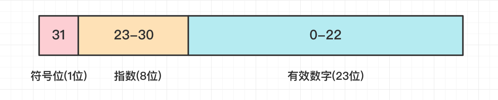
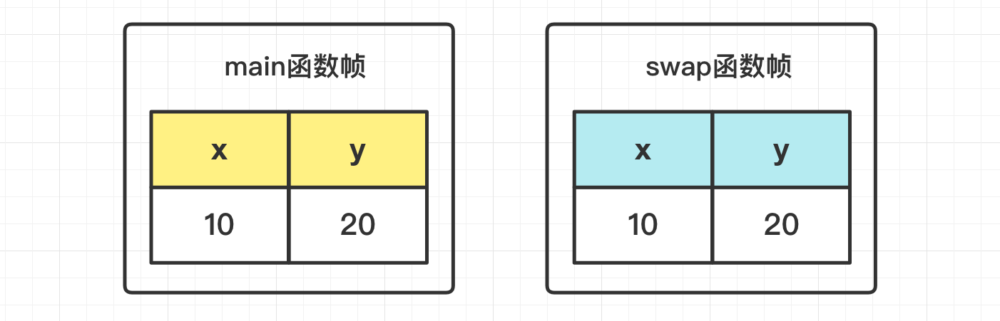

[TOC]

### Java基础

#### 数据进制

##### 1.整数的二进制表示

**原码**：**第一位是符号位，0 表示正数，1 表示负数**。其余 31 位为具体的值。

```java
00000000000000000000000000001010;	// 10的原码
10000000000000000000000000001010;	// -10的原码
```

**反码**：在原码的基础上，符号**位不变**，其余的按位**取反**。

```java
11111111111111111111111111110101;   // 10的反码:在Java中没有用到
11111111111111111111111111110101;	// -10的反码
```

**补码**：负数的补码就是**反码 + 1**，**整数的补码就是原码本身**。

```java
00000000000000000000000000001010;	// 10的补码
11111111111111111111111111110110;	// -10的补码
```

**关联**：在 Java 中整数是用**==补码==**来表示的，记住**正数的补码就是原码**本身，**负数的补码是反码 + 1**。**二进制整数**最终都是以**补码**形式出现的。正数的补码与原码、 反码是一样的，而负数的补码是反码加 1 的结果。 

##### 2.浮点数的二进制表示

Java 浮点数有 **float** 与 **double** 类型。

|  类型  | 字节数 |         取值范围          |
| :----: | :----: | :-----------------------: |
| float  |   4    |    -3.4e^38 ~ +3.4e^38    |
| double |   8    | -1.798e^308 ~ +1.798e^308 |

###### (1)float存储格式

float 浮点数**格式**如下：



- **符号位**仅一位，**0 为正数，1 为负数**。

- **指数**称为 "**阶码**"，阶码位 8 位存储**指数的移码**。

- **有效数字**称为 "**尾数**"，尾数位共 **23 位**存储有效数字。

###### (2)浮点数计算不精确

计算机通过二进制方式存储数据，因此仅能精确表示那些为 2 的**某次方和**的数，其他的数则无法精确表示。比如 0.9 不能用有限二进制位进行精确表示，所以 1 - 0.9 **并不精确地等于 0.1**。

```java
float a = 1f;
float b = 0.9f;
float f = a - b; // 结果为：0.100000024
```

**因此浮点数运算也是不完全精确的**，==**做比较的时候别用 float**，也不要进行浮点数之间的**相等判断**==。

在大多数的**商业计算**中，一般采用 java.math.**BigDecimal** 类来进行精确计算。在需要**绝对精度**表示的金融等业务场景下，**推荐使用整型存储最小单位的值**，比如存储货币单位为分，展示时转换为**常用单位**即可。

##### 3.二进制运算

Java 中二进制运算符如下。

| 运算符 |        释义        | 运算符 |             释义              |
| :----: | :----------------: | :----: | :---------------------------: |
|   <<   | **左移**保留符号位 |   ^    | **异或** (相同为 0, 不同为 1) |
|   >>   | **右移**保留符号位 |   &    |          逻辑**与**           |
|  >>>   |   **无符号右移**   |   \|   |          逻辑**或**           |
|   ~    |    按位**取反**    |        |                               |

###### (1)二进制移位运算

- **<<**：**左移保留符号位**，其余的向左移动 N 位，整数和负数都是低位补 0，相当于**乘以 2** 的 N 次方，这种方式用来做**2的整数倍乘法**运算效率很高。
- **\>>**：**右移保留符号位**，即符号位不动，其余的向右移动 N 位，整数高位补 0，负数高位补 1；
- **\>>>**：**无符号右移**。无论是正数还是负数，高位通通补 0。

对于**正数**而言，>> 和 >>> 没区别。对于**负数**而言，>> 和 >>> 的结果会因为符号位而结果差异巨大。-2 >>> 1，结果是 2147483647(Integer.MAX_VALUE)，-1 >>> 1，结果是2147483647(Integer.MAX_VALUE)。

```java
@org.junit.Test
public void test(){
    // 00000000000000000000000000001010
    int a = 10; 
    // 11111111111111111111111111110110
    int b = -10; 
    // 40，00000000000000000000000000101000, 相当于带符号乘以4
    System.out.println(a << 2); 
    // -40，11111111111111111111111111011000, 相当于带符号乘以4
    System.out.println(b << 2); 
    // 2，00000000000000000000000000000010, 正数向左移动后，高位是补0，跟符号位一致
    System.out.println(a >> 2); 
    // -3，11111111111111111111111111111101, 负数向左移动后，高位时补1，跟符号位一致
    System.out.println(b >> 2); 
    // 40，00000000000000000000000000101000, 相当于乘以4
    System.out.println(a >>> 2); 
    // 1073741821，00111111111111111111111111111101, 将符号位也一起向右移动，高位补0，所以负数会变成一个正数
    System.out.println(b >>> 2); 
}
```


###### (2)二进制逻辑运算

- **&**：按位逻辑与，都为 1 则为 1，否则为 0；
- **|**：按位逻辑或，都为 0 则为 0，有一个为 1 则为 1；
- **\^**：异或，两个都相同为 0，两个不相同为 1，1 \^ 1 = 0，1 ^ 0 = 1；
- **~**：按位取反，**包括符号位**。

```java
public void test(){
    int a = 10; // 00000000000000000000000000001010
    int b = 9;  // 00000000000000000000000000001001
    
    System.out.println(a & b); 		// 8 = 00000000000000000000000000001000
    System.out.println(a | b); 		// 11 = 00000000000000000000000000001011
    System.out.println(a ^ b); 		// 3 = 00000000000000000000000000000011
    System.out.println(~a);    		// -11 = 11111111111111111111111111110101
}
```

#### 数据类型

##### 1.基本数据类型

Java 中除了**基本类型**，其他都是**对象类型**。基本数据类型所占**字节数**与**平台无关**。

> **基本类型所占字节数**

- boolean/ ~

- byte/ 1 字节
- char/ 2 字节(可存放中文字符) 
- short/ 2 字节
- int/ 4 字节，范围：**(-2 ^ 31, 2 ^ 31 - 1)**，因为有一位是**符号位**。
- float/ 4 字节
- long/ 8 字节，范围：**(-2 ^ 63, 2 ^ 63 - 1)**，因为有一位是**符号位**。
- double/ 8 字节

boolean 只有两个值：true、false，可以使用 **1 bit** 来存储，但是具体大小没有明确规定。JVM 会在**编译时期将 boolean 类型的数据转换为 ==int==，使用 1 来表示 true，0 表示 false**。JVM 支持 boolean 数组，但是是通过读写 byte 数组来实现的。

字节数记忆法：==**11224488**==。

注意：一个 **Integer 对象**是 16 字节，因为包含有 12 字节的对象头信息。

**整数**常量默认为 **int**，**浮点数**默认为 **double** 类型。要注意某些**范围是否超出**。

##### 2.char

char 用于表示**一个字符**，这个字符可以是中文或英文字符，赋值时用**单引号**括起来。char 本质是一个固定占用**两个字节**的无符号**正整数**，这个正整数对应 **Unicode 编号**对应的字符。char 的**本质就是整数**，char 的比较就是 Unicode 的比较。

```java
char a = 'a';
System.out.println(a);			// a
System.out.println((int) a);	// 97
System.out.println('z' - a);	// 25
```

##### 3.类型转换

Java 不能隐式执行向下转型，因为这会使得精度**降低**，需要强制显式转型。

字面量 **1.1** 属于 **double** 类型，**不能**直接将 1.1 直接赋值给 float 变量，因为这是**向下**转型。字面量 **1.1F** 才是 float 类型。

```java
// float f = 1.1;
float f = 1.1F;
```

**隐式类型转换**：因为字面量 1 是 int 类型，它比 short 类型精度要高，因此不能隐式地将 int 类型下转型为 short 类型。

```java
short s1 = 1;
// s1 = s1 + 1;
```

但是使用 **+= 或者 ++ 运算符**可以执行**隐式**类型转换。

```java
s1 += 1;
// s1++;
```

上面的语句相当于将 s1 + 1 的计算结果进行了向下转型：

```java
s1 = (short) (s1 + 1);
```

##### 4.数组

数组有**两块**内存空间，一块存储数组**内容**，一块存储内容的**位置**。**一旦创建**数组就**不能改变其大小**，但可以改变元素内容。

**数组初始化**：创建一个**数字数组**时，**所有元素初始化为 0**。boolean 数组的元素初始化为 false。**对象**数组的**元素**则初始化为 **null**，因此需要对每个对象进行**对象引用**才行，否则使用时会有 NPE 异常。

**数组拷贝**：允许一个数组变量拷贝给另一个数组变量。如果是**浅拷贝**，那么两个变量将指向同一个数组，对一个进行修改会==**影响**==另一个。如果希望把一个数组的**全部值**拷贝到一个**新数组**(深拷贝)里，可使用 Arrays 类的 **copyOf()** 方法。

数组基本操作如下：

```java
int[] a = new int[3];     // 创建新的数字数组 自动初始化为0
int[] b = {1, 2, 3, 4}    // 创建并初始化数组

a.length                  // 数组长度,不加方法的括号
    
for(int element : a){}    // 使用for each遍历可以不关注下标

String[] args   // 命令行参数
java Test -g ruler test     // args[0] = "-g"  args[1] = "ruler"  args[2] = "test"
```

二维数组遍历方式，要记住怎么写，笔试面试常用。

```java
public static void main(String []args){
    // 初始化二维数组
    int[][] nums = {{22, 66, 44}, {100, 150, 180};
    int sum = 0;
    // 遍历二维数组,外循环遍历有多少个一维数组
    for(int i = 0; i < nums.length; i++){
        // 内循环遍历每一个一维数组的元素
        for(int j = 0; j < nums[0].length, j++){
            sum += nums[i][j];		// 依次相加到sum中
        }
    }
    System.out.println(sum);
}
```

#### 按值传递参数

Java 的参数是以**==值传递==**的形式传入方法中，而**不是**引用传递。对于引用类型，传递的是对象的**==地址值==**。

##### 1.基本数据类型参数传递

一个方法**不可能修改**一个基本类型的数据。看个例子：

```java
public static void main(String[] args) {
    int x = 10;
    int y = 20;
    swap(x, y);
    System.out.println("x(origin) = " + x);
    System.out.println("y(origin) = " + y);
}
// 进行交换
public static void swap(int x, int y) {
    int temp = x;
    x = y;
    y = temp;
    System.out.println("x(swap) = " + x);
    System.out.println("y(swap) = " + y);
}
```

```java
x(swap) = 20
y(swap) = 10
x(origin) = 10
y(origin) = 20
```

上面程序 main 方法调用 swap 方法来**交换 x，y 的值**，然而调用函数之后发现 main 中 x，y 的值**并未交换**。



上图中，对于**基本数据类型**，main 函数中的 x，y 和 swap 函数中的 x，y 分别存放在**不同的栈帧中**，在 main 中调用 swap 函数的时候，会将 main 中的 x，y 的**值赋给** swap 中的 x，y。swap 方法仅对其栈帧中的 x，y 做交换，并不会改变 main 中的 x，y。这是 Java 的语言特性。

##### 2.引用类型

引用类型也是**按值**传递！不过传递的是对象的==**地址值**==！

以下代码中 Dog dog 的 dog 是一个**指针**，存储的是一个**对象的地址**。在将一个**对象**作为参数传入一个方法时，本质上是**将对象的地址以值**的方式传递到形参中。

```java
public class Dog {
    String name;
    Dog(String name) {
        this.name = name;
    }
    // Getter and setter
}
```

```java
public class PassByValueExample {
    public static void main(String[] args) {
        // dogA
        Dog dog = new Dog("A");
        System.out.println(dog.toString()); // Dog@30c7da1e
        func(dog);
        System.out.println(dog.toString()); // Dog@30c7da1e
        System.out.println(dog.getName());  // A
    }

    private static void func(Dog dog) {
        System.out.println(dog.toString()); // Dog@30c7da1e
        // 此时dog指向另一个对象的地址，因此在方法中使指针引用其它对象，那么这两个指针此时指向的是完全不同的对象
        // 在一方改变其所指向对象的内容时对另一方没有影响
        dog = new Dog("B");
        System.out.println(dog.toString()); // Dog@5b464ce8
        System.out.println(dog.getName());  // B
    }
}
```

方法得到的是所有**参数值**的一个**拷贝**，即**值拷贝**的方式，方法不能修改传递给它的任何参数变量的内容。**但是如果在方法中改变对象的字段值会改变原对象该字段值**，因为改变的是**同一个地址**指向的内容。对象引用作为参数**可以**改变对象的**状态**！如下所示。

```java
class PassByValueExample {
    public static void main(String[] args) {
        Dog dog = new Dog("A");
        func(dog);
        System.out.println(dog.getName());	// 原来的A变化为B
    }

    private static void func(Dog dog) {
        // 改变了原来对象指向的值
        dog.setName("B");
    }
}
```

**总结**：

- **基本类型**在传递值的时候就是传递的**基本值**，而引用类型方法传递的时候是传递的**地址值**。
- 一个方法不能修改一个**基本数据类型**的参数(即数值型或布尔型)。但一个方法可以改变一个**对象**参数的**状态**。

#### i++与++i

**i++ 是在程序执行完毕后进行自增，而 ++i 是在程序开始执行前进行自增。**i++ 和 ++i **都==不是原子==操作**。

##### 1.i++

**i++ 的操作分三步**

1. 栈中取出 i。
2. i 自增 1。
3. 将 i 存到栈帧中。

**三个阶段**：内存到寄存器，寄存器自增，写回内存。这三个阶段中间都可以被中断分离开，所以 i++ **不是原子操作**，上面的三个步骤中任何一个步骤同时操作，都可能导致 i 的值不正确自增。

##### 2.++i

在多核机器上，CPU 在读取内存 i 时也会可能发生同时读取到同一值，这就导致两次自增，实际只增加了一次。

#### 参数数量可变的方法

**多个入参**在方法中会转化成为==**数组**==。如 printf 方法的定义如下：

```java
// ...代表能接收任意数量的参数, ...挨着类型
public SprintStream printf(String fmt, Object... args){     
    // 多个参数其实会转化为数组 即Object[]数组
    return format(fmt, args);   	
}
```

另一个多参数的例子：

```java
public static double max(double... values){
    // 可以使用foreach语法遍历
    for(double v : values){     
        // Other code
    }
}
```


#### 参考资料

- 《码出高效-Java开发手册》


