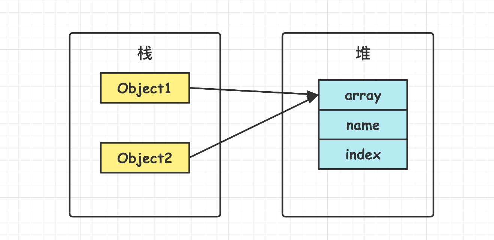
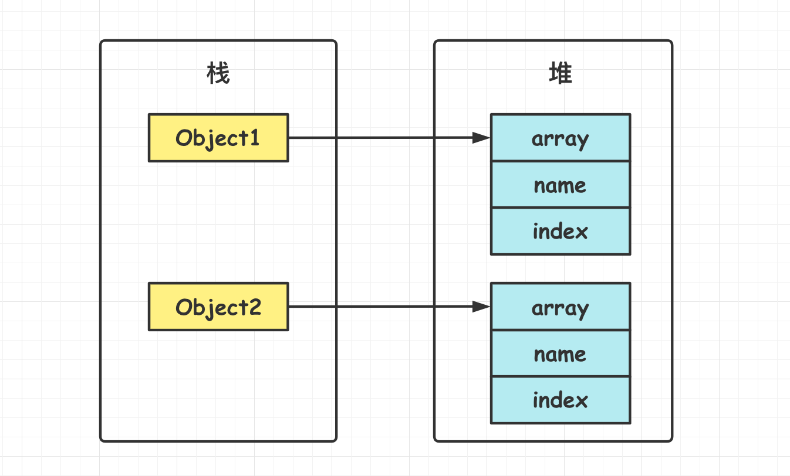

[TOC]

### 抽象类与接口

#### 接口

##### 1.接口概述

接口的作用是使实现类拥有**某一种能力**, 这种能力怎么体现取决于具体类的实现方式. 

类通过 **implements** 关键字实现某接口, 一个类可实现**多个接口**, 多接口间用**逗号**分隔. 类仅支持**单继承**, 不过接口支持**多继承**, 即一个接口可以继承多个接口. 

一个接口中可包含: **常量字段, 普通方法, 默认方法, 静态方法, 私有方法**. 

接口**不能定义实例变量**. 但接口中可以定义**常量**字段且必须赋值, 它们被自动设置为 **public static final**, 实现接口的类继承这些常量, 但是不推荐. 

##### 2.接口演化

- **Java7 及之前**, 接口可以看成是一个**完全抽象**的类, 它不能有任何的方法实现. 接口里面只能有常量属性和抽象方法, 实现类必须实现全部抽象方法. 
- **Java8** 接口引入**默认方法**和**静态方法**. 默认方法解决**修改接口的成本高**的问题. 
- **Java9** 接口引入 **private 方法**. 可在接口中编写私有方法与私有静态方法, 以解决**多个默认方法之间重复代码**问题. 

##### 3.接口的静态方法

**静态方法**在**类加载**的时候就存在了, 它**不依赖于任何实例**. 所以**接口中静态方法必须有方法体**, 也就是说**不能是抽象方法**. 

##### 4.接口的默认方法

Java8 后接口中可以使用 **default** 修饰**默认方法**, 为接口方法提供**默认实现**. Spring 中有很多接口默认方法. 

> **为什么引入默认方法?**

**引入默认方法, 不仅给接口增加了功能, 而且其他实现类不用做任何改变**. 

默认方法可以解决**接口升级**问题. 没有默认方法时**修改接口方法成本极高**. Java8 之前, 如果一个接口想要添加新的方法, 就要修改所有实现了该接口的类. 如果有 100 个类实现这个接口, 修改成本巨大. 

Java8 引入**默认方法另一大用处是==函数式数据处理==**的需求, 是为了**便于给接口增加新的功能**. 

##### 5.接口的使用

接口中的字段和方法**默认都是 public** 的. 接口**不能用 new 进行实例化**, 但可以使用接口变量引用**实现了接口的类对象**. 

```java
public interface Fly {
    int x = 123;            // 默认为 public static final
    // int y;               // 必须初始化
    public int z = 0;       // 不用写public
    // private int k = 0;   // Modifier 'private' not allowed here
    // protected int l = 0; // Modifier 'protected' not allowed here
    // private void fun3(); // Modifier 'private' not allowed here

    void flyOnRiver();   // 普通接口方法

    // Java8之后可以定义默认方法
    default void flyOnSky(){
        System.out.println("在天空中飞");
    }

    // Java8之后可以定义静态方法,且必须有方法体
    static void flyOnGround() {}
}
```

接口实现类. 

```java
public class Bird extends Animal implements Fly {

    /** 普通方法必须实现 */
    @Override
    public void flyOnRiver() {
        System.out.println("鸟在河上飞");
    }

    /** 默认方法可以不实现(也可以覆写) */
    @Override
    public void flyOnSky() {
        System.out.println("鸟在天空飞");
    }

    public static void main(String[] args) {
        // 使用接口引用实例对象 动态类型为Bird
        Fly fly = new Bird();
        fly.flyOnRiver();
        fly.flyOnSky();
    }
}
```

```java
鸟在河上飞
鸟在天空飞
// 如果注释掉flyOnSky()方法而使用接口中的默认方法 则输出如下
鸟在河上飞
在天空中飞  
```

可以使用 **instanceof** 检查一个对象是否**实现**了某接口. 

```java
if(bird instanceof Fly){...}
```

#### 方法冲突

如果先在一个接口中将一个方法定义为**默认方法**, 然后又在父类或另一个接口中定义了**同样的方法**, 那么同时实现这两个接口的类或者既继承了父类又实现了接口的类就会**发生方法冲突**. 

方法冲突主要主要有两类: 

- **接口与父类**之间的冲突(**==父类优先==**). 
- **接口与接口**之间的冲突(需要**覆写方法**来**解决二义性**). 

##### 1.接口与类方法冲突

即一个类继承的**父类**和实现的**接口**具有相同的方法. 

一个含有 getName() 默认方法的接口: 

```java
public interface Named {
    default String getName(){
        return getClass.getName();
    }
}
```

另一个含有 getName() 方法的类: 

```java
// 另一个类也有同样的getName方法
class Animal {
    private String name;
    public String getName(){
        return this.name;
    }
}
```

一个类继承了上述类并实现了接口. 

```java
public class Student extends Person implements Named {...}
```

依据 **"父类优先"** 原则, 只会考虑**父类方法**, 接口的默认方法会被**忽略**. 

##### 2.接口与接口方法冲突

即一个类同时实现了含有**相同方法**的两个接口. 

再来一个 Person 接口, **默认**实现了 getName() 方法. 

```java
public interface Person {
    default String getName(){
        return this.name;
    }
}
```

同时实现两个含有**相同方法**的接口. Student 会继承 Person 和 Named 接口中提供的两个不一致的 getName() 方法, 并不会从中选择一个, 无法通过编译. 需要明确调用的方法来解决**二义性**问题. 

```java
public class Student implements Named, Person {
    // 实现方法时必须选择一个来解决此二义性问题
    public String getName() {
        return Person.super.getName();
    }   
}
```

#### 抽象类

##### 1.概述

通过 abstract 关键字修饰的类就是抽象类. 抽象类可以包含含一个或多个**抽象方法**(也可以不含抽象方法), 也可以包含普通实例与方法。

```java
public abstract class Person {
    protected int x;
    private int y;
    // 抽象方法
    public abstract void func1();   

    public void func2() {
        System.out.println("func2");
    }
}
```

如果抽象类有抽象方法则子类需要**进行实现**. 

```java
public class Student extends Person {
    // 实现抽象方法
    @Override
    public void func1() {
        System.out.println("func1");
    }
}
```

抽象类**不能实例化**, 不能创建抽象类的对象. 但可以**创建抽象类变量**来引用其非抽象子类的对象, 也可以继承抽象类来实例化其子类. 

```java
public abstract class Person{}          // 抽象类
public class Student extends Person{}   // 抽象类子类
new Person()                // 不合法
Person p = new Student();   // 合法 抽象类引用子类对象
p.func1();		// 动态类型是Student类型
```

##### 2.接口与抽象类比较

从设计层面看, **抽象类**表示一种 **IS-A** 关系, 那就必须满足**里式替换**原则, 即子类对象必须能够替换掉所有父类对象. 而**接口**更像是一种 **LIKE-A** 关系, 它只是提供一种方法实现契约, 并不要求接口和实现接口的类具有 IS-A 关系. 

从使用层面看, 一个类可以**实现多个接口**, 但是只能**继承一个抽象类**. 

多数情况下, **==接口优先于抽象类==**. 因为接口没有抽象类严格的类层次结构要求, 可以灵活地为一个类添加各种行为. 

#### Cloneable接口

##### 1.clone方法与Cloneable接口

- **clone()**: Object 类的 protected 方法, 每个对象都有. 

- **Cloneable** 接口: 一个标记接口. 

clone() 是 protected 方法, 如果**不显式**覆写 clone(), **其它类**就**不能直接去调用**该类实例的 clone() 方法. 

```Java
public class CloneTest {
	private int a;
	private int b;
}
```

另一个类不能直接使用 clone() 方法. 

```java
public class Test {
	public static void main(String[] args) {
		CloneTest cloneTest = new CloneTest();
		try {
            // 'clone()' has protected access in  'java.lang.Object' 
			// CloneTest a = (CloneTest) cloneTest.clone();	// 编译错误
		} catch (CloneNotSupportedException e) {
			e.printStackTrace();
		}
	}
}
```

那就**覆写 clone() 方法**(事情哪有这么简单): 

```java
public class CloneTest {

	private int a;
	private int b;

	// 仅覆写clone()方法但没有实现Cloneable接口
	@Override
	public CloneTest clone() throws CloneNotSupportedException {
		// 调用Object类的clone()方法并强制转型
		return (CloneTest)super.clone();
	}
}
```

```java
public class Test {
	public static void main(String[] args) {
		CloneTest cloneTest= new CloneTest();
		try {
            // 进行克隆
			CloneTest a = (CloneTest) cloneTest.clone();
		} catch (CloneNotSupportedException e) {
			e.printStackTrace();
		}
	}
}
```

执行后抛出 **CloneNotSupportedException** 异常, 这是因为 CloneTest 类**没有**实现 ==**Cloneable 接口**==. 

```java
java.lang.CloneNotSupportedException: CloneTest 
```

Cloneable 接口是一个**标记接口**, 其作用在于可以使用 **instanceof** 进行类型检查. 如果一个类**没有实现 Cloneable 接口**但调用了 clone() 方法, 就会抛出 **CloneNotSupportedException** 异常. 

正确克隆方式: **实现 Cloneable 接口然后再覆写 clone() 方法, 并且将 clone() 定义为 public 方法**. clone() 方法中可直接调用 Object 类的方法(**由虚拟机实现**的 native 方法)即 **super.clone()**, 但直接使用 clone() 方法是实现的**浅拷贝**. 

```java
// 实现Cloneable接口
public class CloneExample implements Cloneable {
    private int a;
    private int b;

    // 覆写clone()方法
    @Override
    public Object clone() throws CloneNotSupportedException {
        // 这里默认浅拷贝
        return super.clone();   // 实现了Cloneable接口才能使用父类的clone()方法
    }
}
```

##### 2.浅拷贝

如果直接用父类的 clone() 方法, 则默认是浅拷贝的, 拷贝对象和原始对象的**引用类型将引用相同的对象**. 也就是两个对象会有**==共享的子对象==**. 被复制对象的所有变量都含有与原来的对象**相同的值**, 而所有的对其他对象的引用仍然指向**原来的对象**. 



实例如下: 

```java
public class ShallowCloneTest implements Cloneable{

	private int[] array;    // 可变类, 浅拷贝会造成原对象与拷贝后的对象对此子对象域共享
	private int index;      // 基本类型浅拷贝没事
	private String name;    // String等不可变类就算共享也安全

	public ShallowCloneTest() {
		array = new int[10];
		for (int i = 0; i < array.length; i++) {
			array[i] = i;
		}
	}

	public void set(int index, int value) {
		array[index] = value;
	}

	public int get(int index) {
		return array[index];
	}

	// 覆写克隆方法 其实就是调用父类的clone()方法
	@Override
	public ShallowCloneTest clone() throws CloneNotSupportedException {
		return (ShallowCloneTest) super.clone();
	}
}
```

测试:

```java
public static void main(String[] args) {
	// 对象1 
    ShallowCloneTest object1 = new ShallowCloneTest();
    try {
        // 克隆对象
        ShallowCloneTest object2 = object1.clone();   
        // 改变object1, object2中的arr[]也被改变了. 浅拷贝使两者共享此子对象
        object1.set(2, 222);
        System.out.println(object2.get(2));  // 222
    } catch (CloneNotSupportedException e) {
        e.printStackTrace();
    }
}
```

浅拷贝会使对象**共享子对象**, 一个改变会**影响**另一个. 

**浅拷贝**中 String 等**不可变类**的对象即使是浅拷贝也是**安全**的, **基本数据类型**也是. 

##### 3.深拷贝

深拷贝时一般不再简单的调用 Object 的 clone() 方法, 而是重新定义 **clone()** 方法来同时克隆**所有子对象**. 全部子对象的**状态**都拷贝了一份, 拷贝对象和原始对象的**引用类型引用不同对象**. 

**技巧**: 可以先用默认的 clone() 方法去克隆一个对象, 然后再手动复制该对象的**全部可变类型属性**的内容. 



深拷贝实例: 

```java
public class DeepCloneTest implements Cloneable{

    private int[] array;
    private int index;
    private String name;

    public DeepCloneTest() {
        array = new int[10];
        for (int i = 0; i < array.length; i++) {
            array[i] = i;
        }
    }

    // 覆写深拷贝的clone()方法
    @Override
    public DeepCloneTest clone() throws CloneNotSupportedException {
        // 先用Object的默认方法生成一个对象
        DeepCloneTest result = (DeepCloneTest) super.clone();
        // 再克隆该对象的全部可变类子类的内容(全部状态)
        result.array = new int[array.length];
        // 依次复制内容
        for (int i = 0; i < array.length; i++) {
            result.array[i] = array[i];
        }
        // 拷贝安全的属性
        result.index = this.index;
        result.name = this.name;
        return result;
    }
    
    // Getter and setter
}
```

```java
public static void main(String[] args) {
    DeepCloneTest object1 = new DeepCloneTest();
    try {
        DeepCloneTest object2 = object1.clone();   // 克隆object1
        // 修改对象1
        object1.set(2, 222);
        // 由于是深拷贝, 对象2不受影响, 结果为2
        System.out.println(object2.get(2));   // 2
    } catch (CloneNotSupportedException e) {
        e.printStackTrace();
    }
}
```

##### 4.clone()的替代方案

使用 clone() 方法来拷贝一个对象即复杂又有风险, 它可能会抛出异常, 并且还需要**类型转换**. 

**Effective Java** 建议最好不要使用 clone(), **可以使用==拷贝构造方法==或者==拷贝工厂==来拷贝一个对象**. 即自己实现一个用于拷贝原对象的**构造方法**, 传入需要拷贝的原对象进行状态拷贝. 

```java
// 无需实现Cloneable接口
public class ConstructorCloneTest {

	private int[] array;

	public ConstructorCloneTest() {
		array = new int[10];
		for (int i = 0; i < array.length; i++) {
			array[i] = i;
		}
	}

	// 定义用于深拷贝的构造方法, 需传入被拷贝的对象
	public ConstructorCloneTest(ConstructorCloneTest original) {
		array = new int[original.array.length];

		// 对原对象属性依次拷贝
		for (int i = 0; i < original.array.length; i++) {
			array[i] = original.array[i];
		}
	}

	// Getter and setter
}
```

```java
public static void main(String[] args) {
    ConstructorCloneTest object1 = new ConstructorCloneTest(); 
    ConstructorCloneTest object2 = new ConstructorCloneTest(object1);   
    object1.set(2, 222);
    // 实现深拷贝
    System.out.println(object2.get(2));  // 2
}
```

##### 5.数组拷贝

所以**数组类型**都有一个 public 的 clone() 方法, 可以直接使用该方法深克隆一个全新的数组, 包含原数组的副本. 

```javascript
int[] numbers = {2, 3, 4};
int[] cloned = number.clone();
cloned[1] = 12;     // 原数组不受影响
```

##### 6.序列化与深拷贝

序列化一个对象时, 当一个对象的实例变量引用其它对象, 序列化该对象时也会把引用对象进行序列化. 所以能**用序列化进行对象深拷贝**. 

#### 比较接口

比较接口有: **Comparable 接口和 Comparator 接口**. 

**Arrays.sort()** 方法可以对**对象数组排序**. 有两种使用方式: 1.传入的数组中的对象类必须**实现了 Comparable 接口;** 2.传入**一个对象数组和一个比较器, 即实现了 Comparator 接口的实例**. 

**Comparable** 接口如下: 

```java
public interface Comparable<T> {
    // 用这个对象与other进行比较, 如果这个对象小于other则返回负值, 相等返回0, 大于other则返回正值
    int compareTo(T other);   
}
```

**Comparator** 接口如下: 

```java
public interface Comparator<T> {
    int compare(T first, T second);     
}
```

这俩接口都只有一个方法, 所以都是**函数式接口**, 用 Lambda 就很舒服. 使用两个接口时都需要提供**类型参数 T**. 

```java
public class Employee implements Comparable<Employee> {    // 传入类型参数
    @Override
    public int compareTo(Employee other){   
        return Double.compare(salary, other.salary);    
    }
}

// 实现一个薪资比较器类
public class SalaryComparator implements Comparator<Employee> {
    @Override
    public int compare(Employee first, Employee second){    
        return first.salary() - second.salary();
    }
}
```

排序测试: 

```java
Employee[] staff = new Employee[3]; 

staff[0] = new Employee("Jack", 35000);
staff[1] = new Employee("Lucy", 75000);
staff[2] = new Employee("Tom", 38000);

// 方式1:使用Arrays类方法进行排序, 底层采用快排排序
Arrays.sort(staff);     
// 方式2:使用比较器的方式排序
Arrays.sort(staff, new SalaryComparator());
```

#### 标记接口

标记接口**没有任何方法**. 标识接口不对实现它的类有任何语义上的要求, 仅表明其实现类属于一个**特定的类型**. 实现标记接口相当于**打一个标签**. 

##### 1.Serializable接口

序列化接口. 

##### 2.Cloneable接口

克隆接口. 

##### 3.RandomAccess接口

实现**快速随机访问**. 如果集合类实现了 RandomAccess, 则尽量用 **for 循环来遍历**, 没有实现则用 **Iterator** 进行遍历. 

如 ArrayList 实现了 RandomAccess 接口, 其内部使用**数组存储**元素, 可以做到快速随机访问. 主要目的是使算法能够在随机和顺序访问的 List 中性能更加**高效**(如在 Collections 二分查找时). 

在 **binarySearch**() 方法中, 会判断传入的 list 是否是 RamdomAccess 的**实例**, 如果是则调用 indexedBinarySearch() 方法实现快速随机访问, 如果不是则调用 iteratorBinarySearch() 方法. 

````java
public static <T>
    int binarySearch(List<? extends Comparable<? super T>> list, T key) {
    // 如果list是RandomAccess的实例则使用快速随机访问
    if (list instanceof RandomAccess || list.size()<BINARYSEARCH_THRESHOLD)
        // 快速随机访问查找
        return Collections.indexedBinarySearch(list, key);
    else
        // 选择iterator遍历
        return Collections.iteratorBinarySearch(list, key);
}
````


#### 参考资料

- 《Java 核心技术卷》
- 《数据结构与抽象 Java 版》


