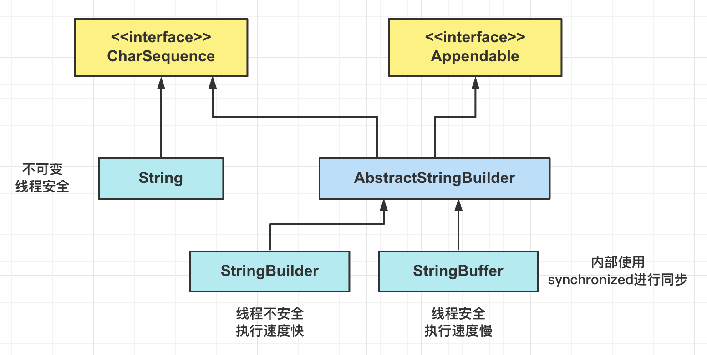

[TOC]

### 常用类

#### Object类

Object 类是**所有类的父类**, **数组**也继承了 Object 类, **接口**不继承 Object 类. 

##### 1.Object类方法

Object 类方法是每个对象都拥有的方法. 

```java
// 返回当前运行时对象的Class对象
public final native Class<?> getClass();
// 返回对象的哈希码
public native int hashCode();
// 比较两个对象是否相等
public boolean equals(Object obj);
// 创建并返回当前对象的一份拷贝. 如果不覆写clone()方法进行调用时会抛异常
protected native Object clone() throws CloneNotSupportedException;
// 返回类的名字@实例的哈希码的16进制字符串, 建议有需要的类都覆写此方法
public String toString();
// 不能覆写. 唤醒一个在此对象监视器(相当于锁的概念)上等待的线程. 如果有多个线程在等待则只会任意唤醒一个
public final native void notify();
// 不能覆写. 跟notify()作用相同, 区别是会唤醒在此对象监视器上等待的所有线程
public final native void notifyAll();
// 不能覆写. 暂停线程的执行. 注意: wait()方法释放了锁. timeout是等待时间
public final native void wait(long timeout) throws InterruptedException;
// nanos参数表示额外时间, 指超时时间还需要加上nanos毫秒
public final void wait(long timeout, int nanos) throws InterruptedException;
// 类似wait()方法, 但本方法一直等待不会超时
public final void wait() throws InterruptedException;
// 实例被垃圾回收器回收的时候触发的操作
protected void finalize() throws Throwable;
```

**native**: Native Method 即用以修饰非 Java 代码(C/C++ 等)实现的方法. 

**方法覆写**: 被 **final 修饰的方法不能被覆写**. 被 native 修饰的方法一些可以覆写, 如 clone(), finalize() 等, 一些不能覆写, 如 notify(), notifyAll(), wait() 等.  

##### 2.equals()

equals() 方法可以用来检查两个对象**是否相等**. eqauls() 方法默认进行**引用比较**, 如果调用它的对象和传入的对象的引用相同则返回 true, 否则返回 false. 

- 对于**基本类型**, == 判断两个值是否**相等**, 基本类型没有 equals() 方法. 
- **对于引用类型, == 判断两个变量是否引用==同一个==对象, 而 equals() 判断两个对象内容是否==等价==. **

```java
Integer x = new Integer(1);
Integer y = new Integer(1);
System.out.println(x.equals(y));  // true(等价)
System.out.println(x == y);       // false(不是同一个对象)
Integer m = 1;
Integer n = 1;
// 这里m n的值均从Integer的缓存池中获取, 所以引用相同
System.out.println(m == n);  	 
```

equals() 方法容易**抛空指针异常**, 应使用**常量或确定有值的对象**来调用(阿里规范). 

```java
if (str.equals("123")) {...}  // 不规范, 不确定str是否为null, 可能抛NPE
if ("123".equals(str)) {...}  // 规范
```

推荐使用 **Objects#equals()** 方法. 可以避免空指针异常.

```java
Objects.equals(null, "123"); 
```

看一下 **Objects#equals()** 方法源码. 

```java
public static boolean equals(Object a, Object b) {
    // 可以避免空指针异常. 如果a==null则a.equals(b)就不会得到执行 
    return (a == b) || (a != null && a.equals(b));
}
```

###### (1)等价的特性

覆写 equals() 方法时要遵守一些**规则**. 

**I 自反性**: 对于任意非空的引用值 x, x.equals(x) 返回值为真. 

```java
x.equals(x); 	// true
```

**II 对称性**: 对于任意非空的引用值 x 和 y, x.equals(y) 必须和 y.equals(x) 返回相同的结果. 

```java
x.equals(y) == y.equals(x); // true
```

**III 传递性**: 对于任意的非空引用值 x, y 和 z, 如果 x.equals(y) 返回真, y.equals(z) 返回真, 那么 x.equals(z) 也必须返回真. 

```java
if (x.equals(y) && y.equals(z)) {
    x.equals(z);  // true;
}
```

**IV 一致性**: 对于任意非空的引用值 x 和 y, 无论调用 x.equals(y) 多少次, 都要返回相同的结果. 在比较过程中, 对象中的数据不能被修改. 

```java
x.equals(y) == x.equals(y); // true
```

**V 与null比较**

对任何不是 null 的对象 x 调用 x.equals(null) 结果都为 false. 

```java
x.equals(null); // false;
```

###### (2)覆写equals()方法

写出**完美 equals() 方法**的建议(源自 JavaCore): 

- 检测 this 与 otherObject 是否**引用同一对象**(地址是否相同). 
- 检测 otherObject **是否为 null**. 
- 比较 this 与 otherObject 是否属于**同一个类**(类型不同也不相等). 
- 将 otherObject **类型转换**为对应类的对象. 
- 现在开始对**所有需要比较的域依次进行比较**. 使用 **==** 比较**基本类型域**, 使用 **equals 比较对象域**. 这里就需要看对不同类自己的情况写. 

```java
// 以下是Employee类的equals()方法
public boolean equals(Object otherObject){
     // 检测this与otherObject是否引用同一对象
    if(this == otherObject) return true;   
    // 检测otherObject是否为null
    if(otherObject == null) return false;   
    // 比较this与otherObject是否属于同一种类型
    if(this.getClass() != otherObject.geClass()) return false;
    // 将otherObject转换为相应的类类型变量: 类型转换
    Employee other = (Employee) otherObject;    
    // 对所有需要比较的域进行比较. 使用 == 比较基本类型域, 使用equals()比较对象域. 
    return Object.equals(name, other.name) && salary == other.salary && Objects.equals(hireDay, other.hireDay);
}
```


再看看 **String** 类的 equals() 源码, 就是套路. 

```java
public boolean equals(Object anObject) {
    // 如果地址相同直接返回true
    if (this == anObject) {
        return true;
    }
    // 首先判断是否是String的类型(也就是判断class类型)
    if (anObject instanceof String) {
        // 强制类型转换获取这个对象的String
        String aString = (String)anObject;
        if (coder() == aString.coder()) {
            // 下面就是对两个字符串的每一个字符进行对比(上述第四步)
            return isLatin1() ? StringLatin1.equals(value, aString.value)
                : StringUTF16.equals(value, aString.value);
        }
    }
    return false;
}
```

##### 3.hashCode()

###### (1)概述

hashCode() 返回**散列值**, 它是由对象导出的一个**整形值**. 每个对象都有一个**默认的散列值**, 不覆写这个方法就返回对象的**存储地址**. 

equals() 方法用来判断两个对象是否**等价**. **等价的两个对象散列值一定相同**, 但是**散列值相同的两个对象不一定等价**. 如果两个对象的 **equals() 返回 true**, 那么它们的 hashcode 值**可能相等**, 也可能不相等. 

> **为什么需要同时覆写 equals() 方法和 hashCode() 方法?**

==**当一个类需要重新定义 equals() 方法时, 必须同时覆写 hashCode() 方法!**==

因为两种定义必须一致: 如果 x.equals(y) 返回 **true**, 那么 x.hashCode() 与 y.hashCode() 就必须**相同**. 因此在覆写 **equals**() 方法时应当**总是同时覆写** hashCode() 方法, 保证**等价的两个对象散列值**也相等. 

**HashMap 或 HashSet 就是同时通过这个两个方法来判断对象是否存在的, 仅一个方法并不能有效的检索键的哈希冲突**. 一个反例: 下面的 EqualExample 仅覆写了 equals() 方法而 **没有覆写** hasCode() 方法, 所以两个对象的散列值**不同**, 最终导致往 HashSet 中添加了两个对象. 

```java
EqualExample e1 = new EqualExample(1, 1, 1);	// 假设只是覆写了equals(), 没有覆写hashCode()
EqualExample e2 = new EqualExample(1, 1, 1);  
System.out.println(e1.equals(e2));   		    // true
HashSet<EqualExample> set = new HashSet<>();
set.add(e1);
set.add(e2);
System.out.println(set.size());    // 2
```

###### (2)散列函数

理想的散列函数应当具有**均匀性**, 即不相等的对象应当**均匀分布**到所有可能的散列值上. 这要求散列函数要把所有域的值都考虑进来. 可以将每个域都当成 R 进制的某一位, 然后组成一个 R 进制的整数. **R 一般取 31**, 因为它是一个**奇素数**, 如果是**偶数**的话, 当出现**乘法溢出, 信息就会丢失**, 因为与 2 相乘相当于向左移一位. 

一个数与 31 相乘可以转换成移位和减法: **31*x == (x<<5)-x**, 编译器会自动进行这个优化. 

```java
// 覆写 hashCode() 方法
@Override
public int hashCode() {
    int result = 17;
    // xyz为类的实例变量
    result = 31 * result + x;
    result = 31 * result + y;
    result = 31 * result + z;
    return result;
}
```

最方便的就是利用 **Objects 工具类覆写 hashCode()** 方法. 

```java
// 一个简单的覆写hashCode()方法
@Override
public int hashCode() {
    // 传入多个对象到hash()方法返回hashCode
	return Objects.hash(firstName, lastName);   
}
```

散列函数详细参考数据结构与算法部分. 

##### 4.toString()

**建议**每个类都覆写 toString() 方法, 方便调试(阿里规范). 

不覆写此方法默认返回 **类名@hashCode(地址值)** 的形式, 如 **ToStringExample@4557817c**, @ 后面的数值为 **hashCode 散列码**的无符号十六进制表示. 

```java
ToStringTest test = new ToStringTest(123);
System.out.println(test.toString());
```

```java
ToStringExample@4554617c    // 类名@地址值(默认的hashCode)
```

Arrays.toString() 静态方法可以直接**打印数组**(已经**覆写**了该方法). 打印多维数组使用 Arrays.deepToString() 方法. 

```java
int[] a = {1, 2, 3};
Arrays.toString(a);             // [1, 2, 3]
```

##### 5.clone()

clone() 方法用于创建并返回一个**复制后**的对象. 如果类**没有实现 Cloneable 接口**, 那对此类对象进行复制时会抛出 CloneNotSupportedException 异常. 此方法默认进行**浅拷贝**, 深拷贝需要覆写 clone() 方法自己实现(详见常用接口部分). 

```java
// 创建并返回此对象的一个副本
protected native Object clone() throws CloneNotSupportedException;	
```

##### 6.getClass()

```java
public final native Class<?> getClass();  // 返回此Object的运行时类对象
```

作用是返回**运行时 Class 类对象**, 通过这个类对象可以获取该运行时类的相关属性和方法. 该方法由 final 声明本地方法, 不能被覆写. 

##### 7.wait()

wait() 方法使**当前线程阻塞**, 直到另一个线程在**对应的锁对象**上调用 notify() 或 notifyAll() 方法, 或达到方法参数中**指定的超时时间**, 当前线程才会被唤醒. 

```java
// 阻塞当前线程, 当前线程进入等待序列
public final native void wait(long timeout) throws InterruptedException;
public final void wait(long timeout, int nanos) throws InterruptedException;
public final void wait() throws InterruptedException; 
```

wait() 方法会把**当前线程**放在**锁对象**的**等待队列**中, 线程一直处于**休眠**状态, 在这个对象上的所有同步请求都不会得到响应. 注意, wait() 方法把当前线程放置到**这个锁对象**的等待队列中, 解锁也仅仅是在这个锁对象上. 

如果当前线程被其他线程在当前线程等待之前或正在等待时调用了 **interrupt()** 中断了, 那就会抛出 InterruptException 异常. 详细内容参考并发部分. 

##### 8.notify()

**唤醒**可能等待**该对象**的**对象锁的其他线程**. 由 JVM(与优先级无关) **随机挑选**一个**处于 wait 状态**的线程进行唤醒. 

```java
public final native void notify();　　
```

调用 notify() 之前, 线程**必须获取该对象的对象锁**, 执行完 notify() 方法后, **不会马上释放锁**, 直到退出 synchronized 代码块当前线程才会释放锁. 

##### 9.notifyAll()

```java
public final native void notifyAll();
```

与 notify() 方法类似, 但 notifyAll() 是**唤醒所有**等待队列中等待这个锁对象的全部线程, 唤醒的线程进入可运行状态, 同时重新**竞争锁**, 之后获得锁的线程进入就绪状态. 

##### 10.finalize()

该方法用于**垃圾回收**. 用于对象被回收之前的**自救**(详见 JVM 部分). 

#### Objects类

Objects 是一个用于操作对象的工具类. 常用方法有: 

- 判断对象**是否等价, **可以传入 null 对象. 

```java
public static boolean equals(Object a, Object b) {
    return (a == b) || (a != null && a.equals(b));
}
```

```java
public static boolean deepEquals(Object a, Object b) {
    if (a == b)
        return true;
    else if (a == null || b == null)
        return false;
    else
        return Arrays.deepEquals0(a, b);
}
```

- 根据传入数组**计算哈希值**, 可以用于覆写 hashCode() 方法. 

```java
public static int hash(Object... values) {
    return Arrays.hashCode(values);
}
```

#### 包装类

##### 1.概述

**基本类型都有对应的包装类型**, 包装类有一个共同的父类 **Number** 类. 

```java
byte    ---	 Byte
short   ---  Short
int	    ---  Integer
long    ---  Long
float   ---  Float
double  ---  Double
char    ---  Character
boolean ---  Boolean
```

每种包装类都有一个静态方法 **valueOf()**, 接收基本类型数值, 返回对应引用类型. 包装类对象也有一个实例方法 **xxxValue()**, 返回对应的基本类型数值. 

**泛型**中不能写基本数据类型, 需要写对应的**包装类**. 

基本类型与其对应的包装类型之间的赋值通过**自动装箱与拆箱**完成. 自动装箱/拆箱过程是**编译器**自动在代码中插入**对象装箱/拆箱代码**. 

##### 2.Integer类API

```java
// 以int形式返回Integer对象的值
int intValue();     
static String toString(int i);
// 以一个新String对象的形式返回给定数值i的radix进制参数表示. 默认10进制
static String toString(int i, int radix);   
static int parseInt(String s);
// 解析字符串参数对应的整数, 第二个参数为进制
static int parseInt(String s, int radix); 
// 二进制操作
public static int reverse(int i);
public static int reverseBytes(int i);
```

Integer 类有一些二进制操作, 包括**位翻转**与**循环移位**等. 位翻转就是将 int 当做**二进制**, 左边的位与右边的位进行互换, reverse() 是按照位进行互换, reverseBytes() 是按 byte 进行互换. 

##### 3.缓存池

包装类为减少资源开销而运用了**池化思想**, 为这些**不可变对象**创造相应的**缓存池**, 用于共享数据, 是一种==**享元模式**==的思想. 

由于包装类内部的基础类型数值是使用 **final** 修饰的所以是**不可变**的, 所以缓存的对象可以被**安全的共享**. 以 **Integer** 类为例, 构造方法如下: 

```java
private final int value;	// final修饰基本类型数值

public Integer(int value) {
    this.value = value;
}
```

Java8 中, Integer 缓存池大小==**默认为 -128 \~ 127**==. 

```java
static final int low = -128;    // 默认最小值
static final int high = 127;    // 默认最大值
static final Integer cache[];	// 缓存池数组
// 静态初始化块
static {
    // high value may be configured by property
    int h = 127;
    String integerCacheHighPropValue =
        sun.misc.VM.getSavedProperty("java.lang.Integer.IntegerCache.high");
    if (integerCacheHighPropValue != null) {
        try {
            int i = parseInt(integerCacheHighPropValue);
            i = Math.max(i, 127);
            // Maximum array size is Integer.MAX_VALUE
            h = Math.min(i, Integer.MAX_VALUE - (-low) -1);
        } catch( NumberFormatException nfe) {
            // If the property cannot be parsed into an int, ignore it.
        }
    }
    high = h;
	// 初始化时就把值放入缓冲池中
    cache = new Integer[(high - low) + 1];
    int j = low;
    for(int k = 0; k < cache.length; k++)
        cache[k] = new Integer(j++);

    // range [-128, 127] must be interned
    assert IntegerCache.high >= 127;
}
```

Integer 类的 **==valueOf()== 方法**的实现比较简单, 首先判断值是否在**缓存池**中, 如果存在就**直接返回缓存池的内容**. valueOf() 方法源码如下: 

```java
public static Integer valueOf(int i) {
    // 如果在缓存范围内从缓存池数组获取数据
    if (i >= IntegerCache.low && i <= IntegerCache.high)
        return IntegerCache.cache[i + (-IntegerCache.low)];
    // 超过范围则新建对象
    return new Integer(i);
}
```

编译器会在**自动装箱**过程调用 **valueOf()** 方法, 因此多个值相同且值在缓存池**范围内**的 Integer 实例, 并且使用**自动装箱**来创建, 就会引用**相同的对象**. 虽然 -128 ~ 127 区间内的缓存值可以直接用 "==" 比较, 但是**超出范围**就不行了. 阿里规范建议用 **equals()** 方法. 

```java
// 字面量会经过自动装箱方式创建, 从缓存池取缓存对象
Integer m = 12;  
Integer n = 12;
System.out.println(m == n); // true(m, n 为同一个对象)  12在缓存池中
Integer x = 1234;  
Integer y = 1234;
System.out.println(x == y); // false(x, y 为不同对象)  1234不在缓存池中

Integer a = Integer.valueOf(500);
Integer b = Integer.valueOf(500);
System.out.println(a == b); 	// false(500不在缓存池中)
System.out.println(a.equals(b));// true
```

其他包装类型的**缓存池**范围如下: 

- **boolean**: true, false. 
- **byte**: 全部 byte 数值 . 
- **short**: -128 ~ 127. 
- **int**: -128 ~ 127. 
- **char**: \u0000 ~ \u007F. 

使用这些基本类型对应的包装类型时, 就可以直接使用缓冲池中的对象. 但只有 Integer 类可以**修改**默认的缓存范围. 在 VM options 加入参数: -XX:AutoBoxChacheMax=7777, 就可以将最大缓存值设置为 7777, 在此范围内的都可以用 "**==**" 进行是否相等判断(但不推荐). 

> **new Integer(123) 与 Integer.valueOf(123) 的区别?**

- new Integer(123) 每次都会**==新建==一个对象**(使用了 new 关键字). 
- Integer.valueOf(123) 会使用**缓存池中的对象**, 多次调用会取得**同一个对象**的引用. 

```java
// 相当于创建2个对象
Integer x = new Integer(123);
Integer y = new Integer(123);
System.out.println(x == y);    // false
// 相当于从缓存池取
Integer z = Integer.valueOf(123);
Integer k = Integer.valueOf(123);
System.out.println(z == k);   // true
```

#### String类

##### 1.概述

空字符串 "" 也是一个对象, 有自己的长度 (0) 和内容(空). 

使用 equals() 方法来检验两个字符串是否**等价**. 比较的是内容. 一定不要用 "==" 比较字符串, 因为两个字符串对象可能内容一样但并非同一对象. 

##### 2.类方法

String 类的 API 很重要, 多记一点. 

- 长度相关. 

```java
// 当length()为0时返回true
boolean isEmpty(); 
// 返回字符串长度
int length();  
```

- 判断字符串中是否包含指定的字符串序列. 

```java
boolean contains(CharSequence s); 	
```

- 返回**指定索引位置处**的字符值. 

```java
char charAt(int index); 	
```

- **从前向后**扫描, 返回字符或者字符串参数在该字符串中**第一次出现的索引值**. 

```java
// 返回指定字符或字符串在此字符串中第一次出现处的索引
int indexOf(int ch); 		
int indexOf(String str);   	
// 作用同上, 但从指定的索引开始搜索
int indexOf(int ch, int fromIndex); 	
int indexOf(String str, int fromIndex); 
```

- **从后向前**扫描, 返回字符或字符串参数在该字符串中**第一次出现的索引**. 

```java
int lastIndexOf(int ch); 		
int lastIndexOf(String str);  	
int lastIndexOf(int ch, int fromIndex); 
int lastIndexOf(String str, int fromIndex); 
```

- 获取字符串的一部分**子字符串**. 

```java
String substring(int beginIndex); 			
String substring(int beginIndex, int endIndex); 
```

- 实现 Comparable 接口的比较方法. 

```java
// 按字典顺序比较两个字符串 
int compareTo(String anotherString);  
// 按字典顺序比较两个字符串, 不考虑大小写 
int compareToIgnoreCase(String str);  
// 将此String与另一个String比较, 不考虑大小写
boolean equalsIgnoreCase(String anotherString); 
```

- 拼接字符串. 

```java
// 在后面的每个字符串之间插入第一个字符串
static String join(CharSequence delimiter, CharSequence... elements);      
String all = String.join("/", "a", "b", "c");  // all = "a/b/c";
```

- 基本类型, char 数组, Object 转换成 String 的静态方法: **String.valueOf(xxx)**. 

```java
static String valueOf(int i)        // 返回 int 参数的字符串表示形式
static String valueOf(long l)       // 返回 long 参数的字符串表示形式
// ...
static String valueOf(char[] data); // 返回 char 数组参数的字符串表示形式
static String valueOf(Object obj);  // 返回 Object 参数的字符串表示形式
```

- 使用默认字符集将字符串转换为 byte 数组.

```java
byte[] getBytes(); 
```

- 对字符串字符进行**大小写**转换. 

```java
String toLowerCase();   	
String toUpperCase();  		
```

- 判断字符串是否匹配给定的**正则表达式**. 

```java
boolean matches(String regex); 
```

- 使用正则表达式**分割**字符串为字符串数组. 获取的数组中不包含作为分割符的字符(或字符串).

```java
String[] split(String regex);    
String[] split(String regex, int limit);  
```

- 判断字符串的**前缀后缀**(注意加了 **s**). 

```java
// 判断字符串是否以指定的前缀开始或后缀结尾
boolean startsWith(String prefix);  
boolean endsWith(String suffix);    
```

- **把字符数组转换成 String. **

```java
// 返回指定数组中表示该字符序列的 String
static String copyValueOf(char[] data); 
// 返回指定数组中表示该字符序列的 String
static String copyValueOf(char[] data, int offset, int count); 
```

- 把字符串中的字符复制到指定的字符数组中. 

```java
void getChars(int srcBegin, int srcEnd, char[] dst, int dstBegin); 
```

- **把该字符串转换成字符数组**: 笔试经常用!

```java
char[] toCharArray(); 
```

- 使用新字符**替换**字符串中的旧字符. 

```java
String replace(char oldChar, char newChar);  
```

- 使用**新子字符串替换该字符串**中匹配正则表达式的那些旧子字符串: 一个全部替换, 一个只替换**第一个**. 

```java
String replaceAll(String regex, String replacement); 	// 全部替换
String replaceFirst(String regex, String replacement); 	// 替换第一个
```

- 把该字符串规范化表示, 去掉该字符串的**前后空白符**. 

```java
String intern();    // 返回字符串对象的规范化表示形式, 放到常量池
String trim();      // 去掉前后空格, 中间空格不去
```

##### 3.源码分析

以下分析基于 Java11. 

###### (1)基本属性

```java
public final class String implements 
    java.io.Serializable, Comparable<String>, CharSequence {
}
```

String 类实现了序列化和比较接口. String 类被声明为 **==final==**, 因此它**不可被继承**.  

Java8 中, String 内部使用 **char 数组**存储数据. 

```java
// 数据数组声明为final不可变
private final char[] value;   
```

Java9 **之后**, String 类改用 **byte 数组**存储字符串, 同时使用 **coder** 来标识使用了哪种**编码**. byte 存储的字符范围较小, 所以额外需要 coder 标识编码. 

```java
public final class String
    implements java.io.Serializable, Comparable<String>, CharSequence {
    // 用数组存储实际数据
    private final byte[] value;     
    // 标识编码
    private final byte coder;
    // 哈希值
    private int hash;
    // 比较器
 　　public static final Comparator<String> CASE_INSENSITIVE_ORDER 
        = new CaseInsensitiveComparator();
}
```

存储数据的 **value 数组被声明为 final**, 即 value 数组初始化之后就**不能再引用其它数组**. 且 String 内部没有改变 value 数组的方法, 这可以保证 String 对象**不可变**, 由于是不可变对象, 所以**天生线程安全**. 

**hash** 属性是 String 实例的 hashcode 的**缓存**, 避免每次比较都去计算哈希值. 

###### (2)主要方法

String 类提供了很多**看似修改** String 的方法, 实际上都是通过**创建新的 String 对象**来实现的. 

String 的**构造方法**中, 在将一个**字符串对象**作为另一个字符串对象的构造方法参数时, 并**不会复制** value 数组内容, 而是会**指向同一个 value 数组**. 

```java
public String() {
    this.value = "".value;
    this.coder = "".coder;
}

public String(String original) {
    this.value = original.value;    // value即存放数据的final数组
    this.hash = original.hash;
}
```

几个基本方法. 

```java
public int length() {
    return value.length;
}

public boolean isEmpty() {
    return value.length == 0;
}

public char charAt(int index) {
    if ((index < 0) || (index >= value.length)) {
        throw new StringIndexOutOfBoundsException(index);
    }
    return value[index];
}
```

length(), isEmpty(), charAt() 这些方法都是在内部**调用 value 数组**的方法. 

看看计算**哈希值和判等**方法. 

```java
public int hashCode() {
    int h = hash;
    if (h == 0 && value.length > 0) {
        hash = h = isLatin1() ? StringLatin1.hashCode(value)
            : StringUTF16.hashCode(value);
    }
    return h;
}

private boolean isLatin1() {
    return COMPACT_STRINGS && coder == LATIN1;
}
```

即首先判断编码 **coder** 是否是 **LATIN**, 然后根据结果选择用 StringLatin1 或者 StringUTF16 的 hashCode() 方法. StringLatin1.**hashCode**() 如下. 

```java
public static int hashCode(byte[] value) {
    int h = 0;
    for (byte v : value) {
        h = 31 * h + (v & 0xff);
    }
    return h;
}
```

StringUTF16.**hashCode**(value) 如下. 

```java
public static int hashCode(byte[] value) {
    int h = 0;
    int length = value.length >> 1;
    for (int i = 0; i < length; i++) {
        h = 31 * h + getChar(value, i);
    }
    return h;
}
```

看看覆写后的 equals() 方法. 

```java
@Override
public boolean equals(Object anObject) {
    if (this == anObject) {
        return true;
    }
    // 判断是否是String类型
    if (anObject instanceof String) {
        // 对象转换为String
        String aString = (String)anObject;
        if (coder() == aString.coder()) {
            return isLatin1() ? StringLatin1.equals(value, aString.value)
                : StringUTF16.equals(value, aString.value);
        }
    }
    return false;
}
```

可以看到也是判断 coder 类型然后选择不同的 equals() 方法进行判断. 选其中一个 **StringLatin1.equals**(value, aString.value) 如下: 

```java
public static boolean equals(byte[] value, byte[] other) {
    // 首先判断长度
    if (value.length == other.length) {
        // 如果两个长度相同每次取相同索引位置的地方的元素进行比较
        for (int i = 0; i < value.length; i++) {
            if (value[i] != other[i]) {
                return false;
            }
        }
        return true;
    }
    return false;
}
```

##### 4.不可变性

String 类对象为**==不可变==**字符串. 

**优点**: 编译器可以让字符串**共享**. 各种字符串可以存放在公共的**存储池**中, 字符串变量指向存储池中的位置. 但虚拟机中实际上只有**字符串常量**是共享的(**final** 修饰), 而 "+" 或 substring() 等操作产生的结果通常并不是共享的. 

**不可变的好处:**

**1) 可以缓存hash值** 

String 的 hash 值经常被使用, 如 **HashMap 用 String 做 key**. 不可变的特性使得 **hash 值也不可变**, 因此只需要进行**一次**计算, 即可**缓存**起来下次用.  

**2) 可以创建String Pool** 

String 是**不可变**的, 因此可以构造 String Pool 缓存池. 如果一个 String 对象已经被**创建**过了, 那就会从缓存池中取得引用. 

**3) 参数安全性** 

String 经常作为参数, String 不可变性可以保证**参数不可变**. 例如在作为网络连接参数的情况下如果 String 是可变的, 那么在网络连接过程中, String 被改变, 改变 String 对象的那一方以为现在连接的是其它主机, 而实际情况却不一定是. 

**4) 线程安全** 

String 不可变性天生具备==**线程安全**==, 可以在**多个线程中安全地使用**. String 类是 **immutable** 类, 可以安全的在多线程中共享. 

##### 5.String Pool

虚拟机为字符串字面量开辟一个**字符串常量池**(String Pool), 类似于**缓存区**. **字符串常量池**保存着所有**字符串字面量**, 字面量在**编译时期**就可以确定. 可以使用 **String 的 ==intern()==** 方法在运行时**将字符串添加到 String Pool** 中. 

两种创建**字符串对象**的方式: 1.通过**字面量**的方式赋值. 2.通过 **new** 关键字新建一个**字符串对象**. 这两种方式在性能和内存占用方面存在差别. 

```java
String str1 = "aaa";   // 字面量
String str2 = new String("aaa");	// 使用new
```

创建字符串常量时, 首先**查询字符串常量池是否包含该字符串**, 如果存在该**字符串**则返回**引用实例**, 如果不存在则**实例化该字符串并放入缓存池**中.

**new String()** 方式首先检查 String Pool 中有没有这个字符串, 如果没有则先在 String Pool 中创建一个字符串, 然后再在**堆**中创建一个字符串, 并返回**堆中字符串的引用**. 如果 String Pool 中已经有了, 则**仅在堆中创建**. 所以通过 new 的方式可能创建一个对象也可能创建两个对象. 

虽然两个语句都是返回一个 String 对象的**引用**, 但是 JVM 对这两种创建的方式是不一样的. 看下面的**代码和图**进行理解!

```java
// 对象存储在堆中
String s1 = new String("aaa");
String s2 = new String("aaa");
System.out.println(s1 == s2);	// false

// 对象存储在缓存池中
String s3 = "aaa";
String s4 = "aaa";
System.out.println(s1 == s3);	// false (s1在堆中 s3在缓存池中)
System.out.println(s3 == s4);	// true  (s3, s4都在缓存池中)

s1 = s1.intern();   // 检查String Pool中没有"aaa"则添加进去
s2 = s2.intern();
System.out.println(s1 == s2);	// true
System.out.println(s1 == s3);	// true
```

**流程分析: **

对于 **new 新建对象**的方式, 如果 String Pool 中没有, JVM 会在内部维护的 **String Pool** 中存放一个 "aaa" 的**对象**, 并且在 **堆** 中**再创建一个 String 对象**, 然后将该**堆**中的对象的**引用返回给用户**(所以最后**指向的是堆中的对象**). 如下图创建 **s1** 时, 缓存池中没有 "aaa", 所以在缓存池中存放入 "aaa", 此时再在堆中创建一个 "aaa", 并将堆中字符串的引用返回, 所以此时 s1 指向的是缓存池外面堆中的 "aaa". 


当执行: 

```java
String s2 = new String("aaa");
```

时, 首先去看缓存池中, 已经有了 "aaa", 所以 Pool 中就**不管**了. 然后在堆中再新建一个 "aaa", 并返回其引用给 s2, 所以 s2 指向的其实是**堆**中的另一个 "aaa" 对象. 所以 s1 和 s2 其实是各自指向自己在堆中的对象, 它们只是把 "aaa" 放入 Pool 就**不用**了(注意: 这里总共创建了 **3 个对象**). 所以有: 

```java
System.out.println(s1 == s2);	// false
```

然后执行: 

```java
String s3 = "aaa";
String s4 = "aaa";
```

这是第二种以**字面量**的方式创建字符串的方式, JVM 首先会在 **String Pool** 中查找是否存在 "aaa" 对象, 如果已经有**则不创建**, 没有的话则先在 String Pool 中**创建一个对象**. 即**字面量**形式创建会**==自动==地将字符串放入 String Pool 中**. 

所以创建的 s3 和 s4 都是直接从 Pool **取出引用**而同时指向的 Pool 中的 "aaa". 所以有: 

```java
System.out.println(s1 == s3);   // false 因为不是一个对象
System.out.println(s3 == s4);   // true  因为是同一个对象
```

当一个字符串调用 **intern()** 方法时, 如果 String Pool 中已经存在一个字符串和该字符串**值相等**, 那么**就会返回** String Pool 中字符串的**引用**; 否则就会在 String Pool 中**添加**一个新的字符串, 并返回这个新字符串的引用. 

所以执行下面时: 

```java
s1 = s1.intern();   // 检查String Pool中没有"aaa"则添加进去
s2 = s2.intern();
```

s1 和 s2 会把 "aaa" 放入 Pool 中, 但是已经有了就不放了. 这时候 s1 和 s2 会修改它们的指针转而指向 Pool 中的**同一个 "aaa" 对象**, 所以这时候有 s1 和 s2 和 s3 都指向了 Pool 中的同一个对象. 所以有: 

```java
System.out.println(s1 == s2);	// true
System.out.println(s1 == s3);	// true
```

在 Java7 之前, String Pool 被放在**运行时常量池**中, 它属于**永久代**. 而在 Java7, String Pool 被移到**==堆==**中. 这是因为永久代的空间**有限**, 在大量使用字符串的场景下会导致 OutOfMemoryError 错误. 

**String Pool 总结: **

- 单独使用 "" 引号创建的字面量字符串和使用只包含常量的字符串连接符如 "aa" + "bb" 创建的字符串都是**常量**, **编译期**就已经确定存储到 String Pool 中. 
- 使用 **new String("")** 创建的对象会存储到**堆中**(如果 Pool 中没有也会创建), 是**运行期**新创建的. 
- 使用包含变量的字符串连接如 "aa" + s 创建的对象是**运行期**才创建的, 存储到**堆**中. 
- 运行期调用 String 的 **intern()** 方法可以向 String Pool 中**动态**添加字符串. 

##### 6.详解new String("aaa")

使用这种方式一共会创建**两个字符串对象**(前提是 String Pool 中还没有 "aaa" 字符串对象). 

- "aaa" 属于字符串**字面量**, 因此编译时期会在 **String Pool** 中创建一个字符串对象用于缓存, 指向这个 "aaa" 字符串字面量;
- 而使用 new 的方式会在**堆中**创建一个字符串对象, 返回的**引用**指向的是**堆中**的字符串而不是 String Pool 中的. 

创建一个测试类并通过 new 创建字符串对象. 

```java
public class NewStringTest {
    public static void main(String[] args) {
        String s = new String("aaa");
    }
}
```

使用 javap -verbose 进行**反编译**, 得到: 

```java
// ...
Constant pool:
// ...
   #2 = Class              #18            // java/lang/String
   #3 = String             #19            // aaa
// ...
  #18 = Utf8               java/lang/String
  #19 = Utf8               aaa
// ...

  public static void main(java.lang.String[]);
    descriptor: ([Ljava/lang/String;)V
    flags: ACC_PUBLIC, ACC_STATIC
    Code:
      stack=3, locals=2, args_size=1
         0: new           #2                  // class java/lang/String
         3: dup
         4: ldc           #3                  // String abc
         6: invokespecial #4                  // Method java/lang/String."<init>":(Ljava/lang/String;)V
         9: astore_1
// ...
```

在 Constant Pool 中, **#19** 存储字符串**字面量** "aaa", #3 是 **String Pool** 的字符串**对象**, 它**指向** #19 这个字符串字面量. 在 main 方法中, 0: 行使用 new **#2** 在**堆**中创建一个字符串对象, 并且使用 ldc #3 将 String Pool 中的字符串对象作为 String 构造函数的参数. 

**拓展**: 

> **下面会创建几个对象**?

```java
String s1 = new String("aaa");
String s2 = new String("aaa");
```

其实会创建 **3 个**对象. 第一句在 **Pool 中和堆中**各创建一个对象, 第二句由于 Pool 已经有了 "aaa" 所以**不会再在 Pool 中创建了**, 仅会在**堆中**创建, 所以一共创建了 3 个对象. 

> **下面会创建几个对象**?

````java
String str1 = new String("A" + "B") ; 
````

字符串常量池: "A", "B", "AB" 共 3 个;
堆: new String("AB") 共 1 个;
引用: str1 共 1 个;
总共 5 个.

> **下面会创建几个对象**?

```java
String str2 = new String("ABC") + "ABC" ;
```

字符串常量池: "ABC" 共 1 个;
堆: new String("ABC") 共 1 个;
引用: str2: 1 个;
总共 3 个.   

##### 7.StringBuilder/StringBuffer类

继承体系如下图. 



###### (1)可变性

> **StringBuilder 与 StringBuffer 为什么是可变的?**

当需要**对字符串进行修改**的时候, 可以使用 StringBuffer 和 StringBuilder 类.

String 中使用 **final** 关键字修饰**字符数组**来保存字符串, 所以 String 对象**不可变**. 

StringBuilder 与 StringBuffer 都继承自 AbstractStringBuilder 类, 在 AbstractStringBuilder 中也是使用**字符数组**保存字符串, 但是**没有用 final 关键字修饰**, 所以这两种对象都是**可变**的. 

```java
abstract class AbstractStringBuilder implements Appendable, CharSequence {
    // 存放数据的数组, 没有用final
    char[] value;
    // 记录已经用的数组数量
    int count;
}
```

StringBuffer 和 StringBuilder 类的对象能够被**多次的修改**, 并且**不产生新的未使用对象**. 

```java
public AbstractStringBuilder append(String str) {
    if (str == null)
        return appendNull();
    int len = str.length();
    ensureCapacityInternal(count + len);
    // 这里直接传入value数组并将新的str添加到value数组中, 没有创建新的对象
    str.getChars(0, len, value, count);
    count += len;
    return this;
}
```

###### (2)线程安全性

StringBuilder 与 StringBuffer 在字符串**修改较为频繁**时使用, 两者实现**几乎相同**, 只是**StringBuilder** 线程**不安全**, **StringBuffer** 线程**安全**. 由于 StringBuilder 相较于 StringBuffer 有速度优势, **所以多数情况下建议使用 StringBuilder 类**. 在要求线程安全的情况下, 则可以使用 StringBuffer 类. 

**StringBuilder** 的 **append()** 方法. 

```java
@Override
@HotSpotIntrinsicCandidate
public StringBuilder append(String str) {
    super.append(str);
    return this;
}
```

**StringBuffer** 的 **append()** 方法. 

```java
@Override
@HotSpotIntrinsicCandidate
public synchronized StringBuffer append(String str) {
    toStringCache = null;
    super.append(str);
    return this;
}
```

两者其实最终都调用共同**父类 AbstractStringBuilder 的 append()** 方法, 但是 StringBuffer 是用了 **synchronized** 加锁保证了线程安全, 当然这会影响一些性能. 

###### (3)使用原则

**基本原则**: 如果要操作少量的数据, 用 String; 单线程操作大量数据, 用 StringBuilder; 多线程操作大量数据, 用 StringBuffer. 

**可变性**: String 不可变. StringBuffer 和 StringBuilder 可变. 

**线程安全**: String **不可变**, 因此是**线程安全**的; StringBuilder 不是**线程安全**的; StringBuffer 是线程安全的, 内部使用 **synchronized** 进行同步, 所以速度慢. 

#### Arrays类

##### 1.Arrays类方法

Arrays 类是用于操作**数组**的工具类. 有的 API 非常有用!

- **排序**: 使用 **Arrays.sort()** 方法对**数值型**数组排序, 使用**快速排序**算法. 也可传入**比较器**对象进行排序. 

```java
public static void sort(int[] a);  // 对数组进行排序
```

- **二分查找**: 仅**有序数组**可用. 

```java
// 按照二分查找法查找数据, 查找成功返回下标, 否则返回-1
static int binarySearch(type[] a, type v);   
// 按照二分查找法从指定的开始和结束位置查找数据, 查找成功返回下标, 否则返回-1
static int binarySearch(type[] a, int start, int end, type v);  
```

- **数组转列表**. 

```java
String[] a = {"11", "22", "33"};		
// 将字符串数组转换为列表
List<String> stringList = Arrays.asList(a);	
```

- **toString()** 方法. 

```java
// 将数组中的元素拼接成一个字符串 [1, 2, 3, 4]
String static toString(type[] b);   	    
// 将二维数组转换为字符串形式
String static deepToString(type[] a);   	 
// 定义一个二维数组
int[][] magicSquare = {{1, 2}, {3, 4}, {5, 6}}; 
// 转字符串
String s = Arrays.deepToString(magicSquare);    // [[1, 2], [3, 4], [5, 6]]
```

- 拷贝. 

```java
int[] b = {1, 2, 3, 4}    // 创建并初始化数组
// 将数组b全部重新拷贝给另一个数组, 两者指向不同. 第二个参数为长度. 
int[] copyb = Arrays.copyOf(b, b.length);   
// 将源数组按照传入的开始位置和结束位置拷贝到一个新的数组中;
type static copyOfRange(type[] a, int start, int end);  
```

- 其他常用方法. 

```java
// 将数据按照传入的长度拷贝到一个新的数组中
type static valueOf(type[] a, int length);  
// 将数组中的所有元素值都设置为v
static void fill(type[] a, type v);  
// 如果两个数组的长度和每个元素值都相等, 那么返回true, 否则返回false
static boolean equals(type[] a, type[] b);  
```

#####  2.源码解析

###### (1)Arrays.sort()

源码如下: 

```java
public static void sort(int[] a) {
    DualPivotQuicksort.sort(a, 0, a.length - 1, null, 0, 0);
}
```

调用的是 DualPivotQuicksort.sort() 方法, 他娘的好复杂. 

```java
static void sort(int[] a, int left, int right, int[] work, int workBase, int workLen) {
    // 小数组用快排 QUICKSORT_THRESHOLD = 286
    if (right - left < QUICKSORT_THRESHOLD) {
        sort(a, left, right, true);
        return;
    }
    // Index run[i] is the start of i-th run (ascending or descending sequence).
    int[] run = new int[MAX_RUN_COUNT + 1];
    int count = 0; run[0] = left;

    // Check if the array is nearly sorted
    for (int k = left; k < right; run[count] = k) {
        // Equal items in the beginning of the sequence
        while (k < right && a[k] == a[k + 1])
            k++;
        if (k == right) break;  // Sequence finishes with equal items
        if (a[k] < a[k + 1]) { // ascending
            while (++k <= right && a[k - 1] <= a[k]);
        } else if (a[k] > a[k + 1]) { // descending
            while (++k <= right && a[k - 1] >= a[k]);
            // Transform into an ascending sequence
            for (int lo = run[count] - 1, hi = k; ++lo < --hi; ) {
                int t = a[lo]; a[lo] = a[hi]; a[hi] = t;
            }
        }

        // Merge a transformed descending sequence followed by an ascending sequence
        if (run[count] > left && a[run[count]] >= a[run[count] - 1]) {
            count--;
        }

        // The array is not highly structured, use Quicksort instead of merge sort.
        if (++count == MAX_RUN_COUNT) {
            sort(a, left, right, true);
            return;
        }
    }

    // These invariants should hold true:
    //    run[0] = 0
    //    run[<last>] = right + 1; (terminator)

    if (count == 0) {
        // A single equal run
        return;
    } else if (count == 1 && run[count] > right) {
        // Either a single ascending or a transformed descending run.
        // Always check that a final run is a proper terminator, otherwise
        // we have an unterminated trailing run, to handle downstream.
        return;
    }
    right++;
    if (run[count] < right) {
        // Corner case: the final run is not a terminator. This may happen
        // if a final run is an equals run, or there is a single-element run
        // at the end. Fix up by adding a proper terminator at the end.
        // Note that we terminate with (right + 1), incremented earlier.
        run[++count] = right;
    }

    // Determine alternation base for merge
    byte odd = 0;
    for (int n = 1; (n <<= 1) < count; odd ^= 1);

    // Use or create temporary array b for merging
    int[] b;                 // temp array; alternates with a
    int ao, bo;              // array offsets from 'left'
    int blen = right - left; // space needed for b
    if (work == null || workLen < blen || workBase + blen > work.length) {
        work = new int[blen];
        workBase = 0;
    }
    if (odd == 0) {
        System.arraycopy(a, left, work, workBase, blen);
        b = a;
        bo = 0;
        a = work;
        ao = workBase - left;
    } else {
        b = work;
        ao = 0;
        bo = workBase - left;
    }

    // Merging
    for (int last; count > 1; count = last) {
        for (int k = (last = 0) + 2; k <= count; k += 2) {
            int hi = run[k], mi = run[k - 1];
            for (int i = run[k - 2], p = i, q = mi; i < hi; ++i) {
                if (q >= hi || p < mi && a[p + ao] <= a[q + ao]) {
                    b[i + bo] = a[p++ + ao];
                } else {
                    b[i + bo] = a[q++ + ao];
                }
            }
            run[++last] = hi;
        }
        if ((count & 1) != 0) {
            for (int i = right, lo = run[count - 1]; --i >= lo;
                 b[i + bo] = a[i + ao]
                );
            run[++last] = right;
        }
        int[] t = a; a = b; b = t;
        int o = ao; ao = bo; bo = o;
    }
}
```

###### (2)Arrays.binarySearch()

用于**二分查找**的方法, 数组必须有序. 

```java
public static int binarySearch(int[] a, int key) {
    return binarySearch0(a, 0, a.length, key);
}
```

调用 **binarySearch0()** 方法, 用的**迭代法**. 

```java
private static int binarySearch0(int[] a, int fromIndex, int toIndex, int key) {
    // 左边索引
    int low = fromIndex;
    // 右边索引
    int high = toIndex - 1;
	// 左索引小于等于右索引
    while (low <= high) {
        // 求中间索引
        int mid = (low + high) >>> 1;
        // 求中间值
        int midVal = a[mid];
        // 中间值小于目标值
        if (midVal < key)
            // 左索引跑到在中间索引右边
            low = mid + 1;
        // 中间值大于目标值
        else if (midVal > key)
            // 更新右索引
            high = mid - 1;
        // 找到模板值
        else
            return mid; // key found
    }
    return -(low + 1);  // key not found.
}
```

##### 3.System.arrayCopy()

用于对数组进行**复制**.  

```java
public static void arraycopy(Object src,  // 源数组
                             int srcPos,  // 源数组的起始位置
                             Object dest, // 目标数组
                             int destPos, // 目标数组的起始位置
                             int length   // 复制长度
                             );
```

System.arraycopy() 在拷贝数组的时候, 采用的是**浅拷贝**, 如果是拷贝**对象数组**则需要注意一下. 

```java
String[] st  = {"A","B","C","D","E"};
String[] dt  = new String[5];
System.arraycopy(st, 0, dt, 0, 5);

for(String str : st){
    System.out.print(" " + str +" ");   // A  B  C  D  E 
}
for(String str : dt){
    System.out.print(" " + str +" ");   // A  B  C  D  E 
}
System.out.println(st[0] == dt[0]); // true
```

#### 其他类

##### 1.BigDecimal/BigInteger类

BigInteger 用于处理**任意长度**数字序列的数值, 也用于**精确计算**(如金融数据). 其初始化需要调用相应的**构造器**. "+、-、*、/" 这些运算都是用相应方法代替, 比如 add()、subtract()、mutiply()、divide() 这四种方法. 

```Java
// 构造方法, 直接将十进制的字符串格式进行转换
BigInteger a = BigInteger.valueOf(100);
// BigInteger和BigDecimal的方法类似
BigInteger abs()                     // 绝对值
BigInteger add(BigInteger val)       // 和
BigInteger subtract(BigInteger val)  // 差
BigInteger divide(BigInteger val)    // 商
BigInteger multiply(BigInteger val)  // 积
float floatValue()                   // 对应float值
int intValue()                       // 对应int值
long longValue()                     // 对应long值
BigInteger max(BigInteger val)       // 最大者
BigInteger min(BigInteger val)       // 最小者
BigInteger mod(BigInteger val)       // 求模
BigInteger pow(int exponent)         // exponent次方
BigInteger remainder(BigInteger val) // 除以val的余数
String toString()                    // 转换成十进制字符串形式
```

##### 2.Random类

Random 类用于生成**伪随机数**. Random 类将 **种子数** 作为随机算法的起源数字, 计算生成**伪随机数**. 若没有指定种子数, 则会以**当前时间**作为种子数. 拥有**相同种子**的 Random 实例生成的**伪随机数序列完全相同**. 

```java
Random random1 = new Random(10);
Random random2 = new Random(10);
// 种子数相同
System.out.println(random1.nextInt()); // -1157793070
System.out.println(random2.nextInt()); // -1157793070
```

Random 类是**线程安全**的, 多线程可以共用一个 Random 实例对象, 但如果并发性很高时会产生**竞争**, 这时可以使用 JUC 中的 **ThreadLocalRandom** 类. 


#### 参考资料

- [Java枚举原理](https://blog.csdn.net/Creepin_/article/details/105246043)

- [Java之Object类](https://www.cnblogs.com/HuiH/p/11677018.html)


