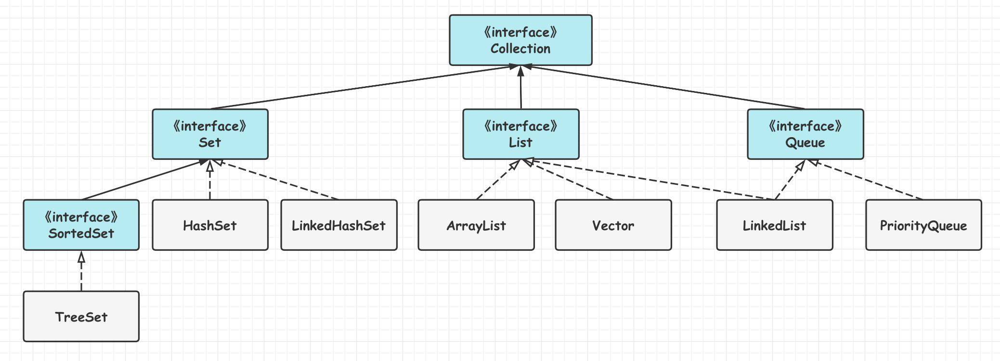
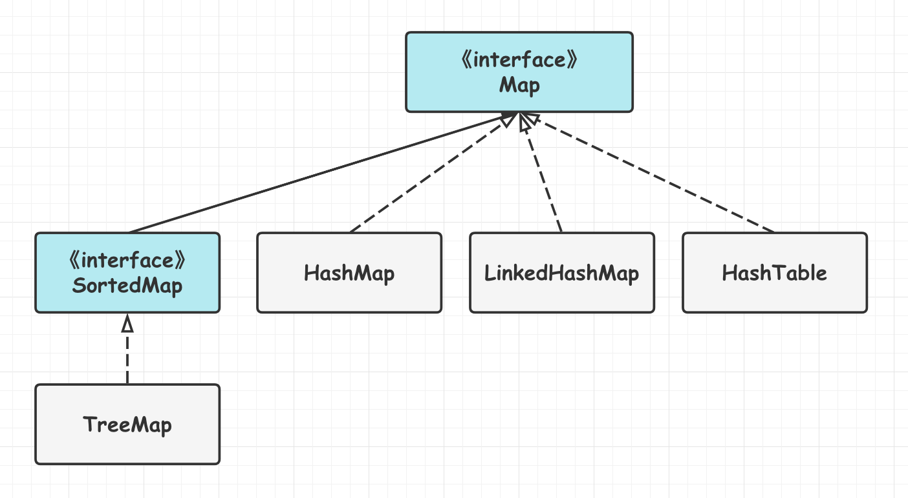

[TOC]

### 集合容器类

#### 概述

**集合框架**主要包括 **Collection** 和 **Map** 两大体系，Collection 存储对象的**集合**，而 Map 存储键值对（两个对象）的**映射表**。整个集合框架大概如下。


**通用实现**

<table align="center"><tr><td colspan="2" rowspan="2" align="center" border="0"></td><th colspan="5" align="center">Implementations</th></tr><tr><th>哈希表</th><th>动态数组</th><th>平衡树</th><th>链表</th><th>哈希表+链表</th></tr><tr><th rowspan="4">Interfaces</th><th>Set</th><td>HashSet</td><td></td><td>TreeSet</td><td></td><td>LinkedHashSet</td></tr><tr><th>List</th><td></td><td>ArrayList</td><td></td><td>LinkedList</td><td></td></tr><tr><th>Deque</th><td></td><td>ArrayDeque</td><td></td><td>LinkedList</td><td></td></tr><tr><th>Map</th><td>HashMap</td><td></td><td>TreeMap</td><td></td><td>LinkedHashMap</td></tr></table>

#### Collection接口



##### 1.Set

不允许有重复元素的集合类型。

- **TreeSet**：基于**红黑树**实现，支持**有序性**操作，例如根据一个范围查找元素的操作。但查找效率不如 HashSet，HashSet 查找的时间复杂度为 O(1)，TreeSet 则为 O(logN)。
- **HashSet**：基于**哈希表**实现，支持快速查找，但不支持有序性操作。失去了元素插入时的顺序信息，遍历 HashSet 得到的结果是不确定的。
- **LinkedHashSet**：具有 HashSet 的查找效率，且内部使用双向链表维护元素的**插入顺序**。

##### 2.List

**列表**类型。

- **ArrayList**：基于**动态数组**实现，支持**快速随机**访问。
- **Vector**：和 ArrayList 类似，但它是**线程安全**的。
- **LinkedList**：基于**双向链表**实现，只能顺序访问，但可以快速地在**链表**中间插入和删除元素。LinkedList 还可以用作栈、队列和双向队列。

##### 3.Queue

队列类型。

- **LinkedList**：可以用于实现**双向队列**。
- **PriorityQueue**：基于**堆结构**实现，可以用于实现优先队列。

#### Map接口



- **TreeMap**：基于**红黑树**实现，线程不安全。
- **HashMap**：基于**哈希表**实现。
- **HashTable**：和 HashMap 类似的线程安全类。它是遗留类，不应该去使用它。可使用 **ConcurrentHashMap**。
- **LinkedHashMap**：使用**双向链表**来维护元素的顺序，可配置顺序为插入顺序或者最近最少使用(LRU)顺序。
- **WeakHashMap**：一种特殊的 Map，其存储的元素可能会被 **GC** 自动删除，即使没有调用 remove() 或 clear() 方法。

#### 容器分类

##### 1.普通容器类

- HashMap
- ArrayList

##### 2.同步容器类

**同步容器类**就是将**方法通过 synchronized 加锁实现线程安全的类**，这也导致了导致并发环境下**效率低下**。常见的同步容器类：

- **Vector**(implements List)
- **Hashtable**(implements Map)
- **Stack**(extends Vector)
- **Collections.synchronizedXxxx**

而且同步容器在多线程环境下的**复合操作**(如**迭代**)是**非线程安全**，需要**客户端代码**来实现**加锁**。所以同步容器**迭代是需要加锁**的。真没啥用，有点鸡肋。

##### 3.并发容器类

并发容器类主要是 **JUC** 下面的一些**容器类**，可以实现**线程安全**，性能也优于同步容器类。常见的有：

- **ConcurrentHashMap**
- **CopyOnWriteArrayList**

#### 同步容器类

这里先介绍同步容器类，后面重点介绍其他的。

##### 1.Vector

###### (1)同步

Vector 的实现与 **ArrayList** 类似，但是使用了 **synchronized** 进行同步，所以是==**线程安全**==的。最好使用 ArrayList 而不是 Vector，因为**同步操作**可以由程序员自己控制。

```java
public synchronized boolean add(E e) {
    modCount++;
    ensureCapacityHelper(elementCount + 1);
    elementData[elementCount++] = e;
    return true;
}

public synchronized E get(int index) {
    if (index >= elementCount)
        throw new ArrayIndexOutOfBoundsException(index);
    return elementData(index);
}
```

###### (2)与ArrayList的比较

- **ArrayList** 线程**不安全**，而 Vector 类采用了**同步机制**保证了线程**安全**。
- Vector 是**同步**的，因此==**开销**==就比 ArrayList 要**大**，访问速度更慢。
- Vector 每次扩容请求其大小的 **2 倍**空间，而 ArrayList 是 **1.5 倍**。
- 内部也有 **modCount** 记录**结构性变化次数**。

##### 2.Hashtable

Hashtable 类似于 HashMap。其底层数据结构也是 **数组 + 链表**。由于其内部使用了 **synchronized** 锁住了全表(**全表锁**)，所以是**线程安全**的。

###### (1)Hashtable与HashMap对比

- **底层数据结构：**内部都是用**数组存放元素**。JDK1.8 以后的 HashMap 在解决哈希冲突时有了较大的变化，当链表长度大于阈值(默认为 8)(将链表转换成红黑树前会判断，如果当前数组的长度小于 64，那么会选择先进行数组扩容，而不是转换为红黑树) 时，将链表转化为红黑树，以减少搜索时间。Hashtable 没有这样的机制。

- **线程安全性**：HashMap 是**非**线程安全的，HashTable 内部的方法基本都经过 **synchronized** 修饰所以是线程安全的。
- **效率**：HashTable 加了锁，效率低下。要同时保证**线程安全与效率**的话就使用 **ConcurrentHashMap**。
- **对 Null key 和 Null value 的支持：**HashMap 中，**null 可以作为键**，这样的**键只有一个，**可以有一个或多个键所对应的值为 null。但是 HashTable **不支持键或值**为 null，插入 null 直接抛出 NPE。
- **内部初始容量大小和数组扩容量大小不同：**1.不指定容量初始值时 Hashtable 默认的初始大小为 **11**，之后每次扩容为原来的 **2n + 1**。HashMap 默认的初始化大小为 **16**。之后每次扩容为原来的 **2 倍**。2.创建时如果**给定**了容量初始值，那么 Hashtable 会**直接使用**这个容量值。而 HashMap 会将其扩充为 **2 的幂次方**大小。

###### (2)ConcurrentHashMap和Hashtable对比

ConcurrentHashMap 和 Hashtable 的区别主要体现在实现**线程安全**的方式上不同。ConcurrentHashMap 的实现方式是使用**分段锁**(Java8 之前)，后面使用了 synchronized 和 CAS(Java8)。而 Hashtable 则使用了**全表锁**来锁住整个表。

##### 3.同步容器类的问题

**同步容器**的**单个操作是安全**的，但是**迭代操作不是**。如果在遍历容器时发生了**结构性变化**，就会**抛出异常**。同步容器没有解决这个问题，要避免这个异常，需要在遍历时给整个容器对象加锁。由于加了**锁**，所以**开销**比较大。

如下面一段代码：

```java
public static Object getLast(Vector list) {
    int lastIndex = list.size() - 1;
    return list.get(lastIndex);
}

public static void deleteLast(Vector list) {
    int lastIndex = list.size() - 1;
    list.remove(lastIndex);
}
```

上述两个方法中，虽然 **Vector 是线程安全**的，但是获取 Vector 大小与**获取/删除之间**没有锁保护，当获得 Vector 大小之后，如另外一个线程删除了 Vector 中的最末尾位置的元素，则每个函数的最后一句代码执行将报错。因此对于**复合操作**，需要在**复合操作上用锁**来保证操作的原子性：

```java
public static Object getLast(Vector list) {
    synchronized (list) {
        int lastIndex = list.size() - 1;
        return list.get(lastIndex);
    }
}

public static void deleteLast(Vector list) {
    synchronized (list) {
        int lastIndex = list.size() - 1;
        list.remove(lastIndex);
    }
}
```

**同步容器不好，可以使用并发容器。并发容器都是线程安全的，且没有使用 synchronized 关键字，且没有迭代问题，而且直接支持一些复合操作**。


#### 参考资料

- http://www.cnblogs.com/chengxiao/p/6842045.html


