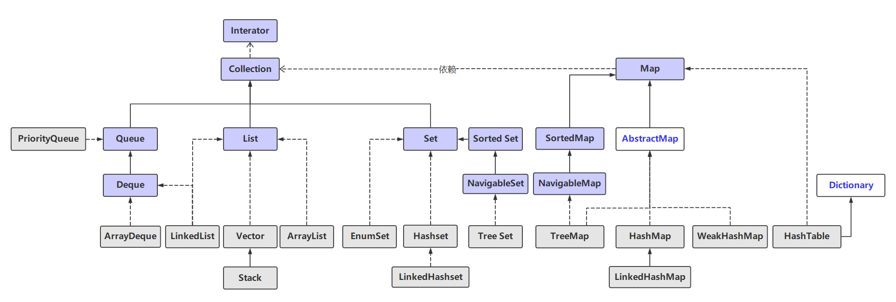
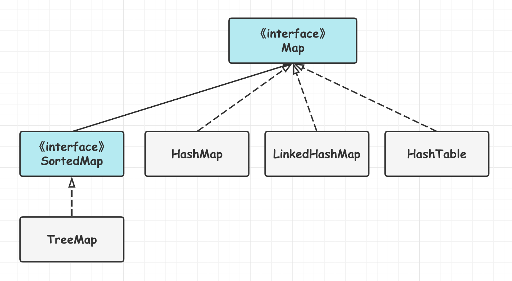

[TOC]

### 集合容器类

#### 概述

**集合框架**主要包括 **Collection** 和 **Map** 两大体系, Collection 存储对象的**集合**, 而 Map 存储键值对的**映射表**. 集合框架大概如下. 



#### Collection接口


##### 1.Set

不允许有重复元素的**集合**类型. 

- **HashSet**: 基于**哈希表**实现, 支持快速查找, 无法维持元素插入顺序. 
- **LinkedHashSet**: 内部使用双向链表维护元素的**插入顺序**. 
- **TreeSet**: 基于**红黑树**实现, 支持**有序性**操作, 但查找效率不如 HashSet, HashSet 查找的时间复杂度为 O(1), TreeSet 则为 O(logN). 

##### 2.List

**列表**类型. 

- **ArrayList**: 基于**动态数组**实现, 支持**快速随机**访问. 
- **LinkedList**: 基于**双向链表**实现, 只能顺序访问. 还可以用作栈, 队列和双向队列. 

##### 3.Queue

队列类型. 

- **LinkedList**: 可以用于实现**双向队列**. 
- **PriorityQueue**: 基于**堆结构**实现, 可以用于实现优先级队列. 

#### Map接口



- **TreeMap**: 基于**红黑树**实现, 线程不安全. 
- **HashMap**: 基于**哈希表**实现. 
- **HashTable**: 与 HashMap 类似的线程安全类. 它是遗留类, 不应该去使用它. 可使用 **ConcurrentHashMap**. 
- **LinkedHashMap**: 使用**双向链表**来维护元素的顺序, 可配置顺序为插入顺序或者最近最少使用(LRU)顺序. 
- **WeakHashMap**: 一种特殊的 Map, 其存储的元素可能会被 **GC** 自动删除. 

#### 容器分类

##### 1.普通容器类

线程不安全的普通容器类, 如 HashMap, ArrayList 等.

##### 2.同步容器类

常见的同步容器类: Vector, Hashtable, Stack, Collections.synchronizedXxxx() 等. 

**同步容器类**就是将方法通过 **synchronized** 加锁实现线程安全的类, 这导致并发环境下**效率低下**. 且在多线程环境下的**复合操作**(如**迭代**)是**非线程安全**, 需要**客户端代码**来实现**加锁**. 所以同步容器迭代是需要加锁的. 真没啥用. 

##### 3.并发容器类

并发容器类主要是 **JUC** 下面的一些**容器类**, 可以实现**线程安全**, 性能也优于同步容器类. 常见的有: 

- **ConcurrentHashMap**
- **CopyOnWriteArrayList**

#### 同步容器类

这里先介绍同步容器类, 后面重点介绍其他的. 

##### 1.Vector

Vector 的实现与 ArrayList 类似, 但是使用了 **synchronized** 进行同步, 所以是==**线程安全**==的. 最好使用 ArrayList 而不是 Vector, 因为**同步操作**可以自己控制. Vector 是**同步**的, 因此**开销**就比 ArrayList 要**大**, 访问速度更慢. 

```java
public synchronized boolean add(E e) {
    modCount++;
    ensureCapacityHelper(elementCount + 1);
    elementData[elementCount++] = e;
    return true;
}

public synchronized E get(int index) {
    if (index >= elementCount)
        throw new ArrayIndexOutOfBoundsException(index);
    return elementData(index);
}
```

##### 2.Hashtable

Hashtable 类似于 HashMap. 其底层数据结构也是 **数组 + 链表**. 由于其内部使用了 **synchronized** 锁住了全表(**全表锁**), 所以是**线程安全**的. 由于加了锁所以效率低下. 要同时保证**线程安全与效率**就使用 **ConcurrentHashMap**. 

HashMap 中, **null 可以作为键**, 这样的**键只有一个, **可以有一个或多个键所对应的值为 null. 但是 HashTable **不支持键或值**为 null, 插入 null 直接抛出 NPE. 

##### 3.同步容器类的问题

**同步容器**的**单个操作是安全**的, 但是**迭代操作不是**. 如果在遍历容器时发生了**结构性变化**, 就会**抛出异常**. 要避免这个问题, 需要在遍历时给整个容器对象加锁. 由于加了**锁**, 所以**开销**比较大. 

如下示例: 

```java
public static Object getLast(Vector list) {
    int lastIndex = list.size() - 1;
    return list.get(lastIndex);
}

public static void deleteLast(Vector list) {
    int lastIndex = list.size() - 1;
    list.remove(lastIndex);
}
```

上述两个方法中, 虽然 Vector 是线程安全的, 但获取 Vector 大小与**获取/删除之间**没有锁保护, 当获得 Vector 大小之后, 如另外一个线程删除了 Vector 最末尾位置的元素, 在执行其他操作时就会报错. 因此需要**加锁**来保证**复合操作**的原子性: 

```java
public static Object getLast(Vector list) {
    synchronized (list) {
        int lastIndex = list.size() - 1;
        return list.get(lastIndex);
    }
}

public static void deleteLast(Vector list) {
    synchronized (list) {
        int lastIndex = list.size() - 1;
        list.remove(lastIndex);
    }
}
```

**同步容器不好, 可以使用并发容器. 并发容器都是线程安全的, 且没有使用 synchronized 关键字, 且没有迭代问题, 且直接支持一些复合操作**. 


#### 参考资料

- http://www.cnblogs.com/chengxiao/p/6842045.html


