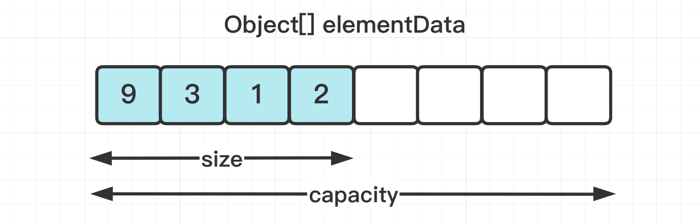

[TOC]

### ArrayList

#### 基础

##### 1.杂记

- **存储**: ArrayList 内部使用**动态数组**实现元素存储. 允许插入所有元素, 包括 **null**, 元素**可重复**. 
- **增**: 每次**添加元素**时都会检查元素数组容量是否足够, 可能会面临数组**扩容**与内容**复制**等开销问题. 
- **删改查**: 指定位置的插入与删除元素效率低, 因为需要**移动其它**元素. 实现了 RandomAccess 接口, 可实现**快速随机**访问, 按照**索引**进行访问的效率很高, 效率为 O(1). 按照内容**查找**元素效率**较低**, 效率为 O(N). 
- **迭代**: ArrayList 的**迭代器**会返回一个**内部类 Itr 对象**, **迭代时删除元素**应该使用**迭代器的 remove()** 方法而非 ArrayList 本身的 remove() 方法, 否则会产生 **Fail Fast** 异常. 当然一般使用一次 ArrayList 的 remove() 方法是没问题的. 
- **modCount** 属性继承自 **AbstractList**, 用来记录**结构发生变化的次数**. 迭代或序列化操作会检查 modCount 版本, 如果不一致则会产生 **Fail Fast 异常**. 
- **安全性**: ArrayList 是线程**不安全**的, 可以使用 **CopyOnWriteArrayList** 来解决并发安全问题. 

##### 2.基本方法

ArrayList 只能存储**引用类型**而**不能存储基本类型**(需使用对应的包装类), 如\<Integer>. 

```java
public boolean add(E obj); 				// 将元素添加到集合尾部
public boolean add(int index, E obj); 	// 在指定位置插入元素, 后面的元素往后移动
public E remove(int index); 			// 删除指定位置的元素, 返回被删除的元素
public E get(int index);    			// 返回指定位置的元素
public int size();  					// 返回集合中元素数
// 将列表的存储容量削减到当前持有元素尺寸, 确保数组不会有新元素添加的时候调用
public void trimToSize();  	
public void set(int index, E obj);		// 设置数组列表指定位置的值, 覆盖原有内容
```

##### 3.线程安全

ArrayList 不是线程安全的. 其底层以动态数组存储, 如果多线程同时操作一个 List 集合, 比如同时增加, 删除元素可能会出现问题, 如数组下标越界异常. 推荐多线程场景使用 JUC 中的 **CopyOnWriteArrayList**. 

#### ArrayList源码分析

下面的分析基于 **JDK8**. 最新的 ArrayList 源码有改动. 

##### 1.基本属性

```java
public class ArrayList<E> extends AbstractList<E>
        implements List<E>, RandomAccess, Cloneable, java.io.Serializable {
    // 默认容量
    private static final int DEFAULT_CAPACITY = 10;
    // 存放元素数组
    transient Object[] elementData;
    // 实际元素个数, 默认为0
    private int size;
    
    // ...
}
```

ArrayList 使用**动态数组 elementData 实现元素存储**. 同时也实现了 RandomAccess 接口, 所以支持**快速随机访问**. 



##### 2.构造方法

主要是初始化一个指定大小的**数组**. 

```java
// 初始化容量为initialCapacity的构造方法
public ArrayList(int initialCapacity) {
   
    if (initialCapacity > 0) {
        // 初始化动态数组elementData
        this.elementData = new Object[initialCapacity];
    } else if (initialCapacity == 0) {
        // 将默认空数组赋给elementData
        this.elementData = EMPTY_ELEMENTDATA;
    } else { 
        throw new IllegalArgumentException("Illegal Capacity: " + initialCapacity);
    }
}
```

##### 3.基本方法

下面是一些基础方法. 

```java
public int size() {
    return size;
}
public boolean isEmpty() {
    return size == 0;
}
public boolean contains(Object o) {
    return indexOf(o) >= 0;
}
```

##### 4.添加元素与扩容

添加元素的 add() 方法如下. **默认**添加到数组**末尾**. 

```java
public boolean add(E e) {
    // 确保容量足够(容量不足时扩容)
    ensureCapacityInternal(size + 1);  // Increments modCount!!
    // 当前元素插入数组末尾
    elementData[size++] = e;
    return true;
}
```

添加元素时使用 **ensureCapacityInternal() 方法**来保证数组容量**足够**. 如果初始化时**没有指定**数组大小, 那么**第一次**添加元素时**会扩容**, 这时候就会**扩容到默认的容量10**; 如果指定了容量, 那就按容量 **1.5** 倍扩容. 

```java
// 确保容量足够
private void ensureCapacityInternal(int minCapacity) {  
    ensureExplicitCapacity(calculateCapacity(elementData, minCapacity));
}

// 首先计算capacity
private static int calculateCapacity(Object[] elementData, int minCapacity) {
    
    if (elementData == DEFAULTCAPACITY_EMPTY_ELEMENTDATA) {
        // 如果之前为空则扩容到默认容量DEFAULT_CAPACITY = 10
        return Math.max(DEFAULT_CAPACITY, minCapacity);
    }
    // minCapacity是当前所需的最小容量
    return minCapacity;
}

private void ensureExplicitCapacity(int minCapacity) {
    // 增加结构修改计数器
    modCount++;
    // 如果最小需要空间比当前elementData的内存空间要大, 则需要扩容
    if (minCapacity - elementData.length > 0)
        grow(minCapacity);
}
```

如果容量不够时, 需要使用 **grow() 方法进行扩容**, 新容量的大小为 **oldCapacity + (oldCapacity >> 1)**, 也就是旧容量的 **1.5 倍**. elementData 数组会随着实际元素个数的增多而重新分配. 

```java
// 进行数组扩容
private void grow(int minCapacity) {
    // 原始数组长度
    int oldCapacity = elementData.length;
    // 扩容至原来的1.5倍
    int newCapacity = oldCapacity + (oldCapacity >> 1);
    // 再判断一下新数组容量够不够, 够了就直接使用这个长度创建新数组, 不够就将数组长度设置为需要的长度
    if (newCapacity - minCapacity < 0)
        newCapacity = minCapacity;
    // 若预设值大于默认的最大值检查是否溢出
    if (newCapacity - MAX_ARRAY_SIZE > 0)
        newCapacity = hugeCapacity(minCapacity);
    // 调用Arrays.copyOf()方法进行数据拷贝
    elementData = Arrays.copyOf(elementData, newCapacity);
}
```

**扩容操作**需要调用 Arrays.copyOf() 把原数组整个**复制**到新数组中, 这个操作**代价很高**, 因此一定要在初始化 ArrayList 对象时就**指定**大概的容量大小, **减少扩容操作的次数**, 减少对性能的影响. 最好根据业务场景**指定初始化容量**防止过多的扩容与复制开销(阿里规范). 

add() 方法也可以在**指定索引**处添加元素. 这里需要将 index 位置及以后的元素搬运到 index + 1 之后, 开销也大. 

```java
public void add(int index, E element) {
    // 判断index是否越界
    rangeCheckForAdd(index);
    // 扩容
    ensureCapacityInternal(size + 1);  // Increments modCount!!
    // public static void arraycopy(Object src, int srcPos, Object dest, int destPos, int length)
    // src:源数组; srcPos:源数组要复制的起始位置; dest:目的数组; destPos:目的数组放置的起始位置; length:复制的长度
    // 将elementData从index位置开始, 复制到elementData的index+1开始的连续空间
    System.arraycopy(elementData, index, elementData, index + 1, size - index);
    // 在elementData的index位置赋值element
    elementData[index] = element;
    size++;
}
```

##### 5.获取元素

获取元素用 **get()** 方法. 即直接通过**索引**获取对应位置的元素, 速度快. 

```java
public E get(int index) {
    // 检查索引是否越界
    rangeCheck(index);
	// 返回数据数组指定索引位置的元素
    return elementData(index);
}

E elementData(int index) {
    return (E) elementData[index];
}
```

indexOf() 用于返回一个值在数组**首次出现的位置**, 会根据是否为 null 使用不同方式判断. 不存在就返回 -1. 时间复杂度为O(N). 

```java
public int indexOf(Object o) {
    if (o == null) {
        for (int i = 0; i < size; i++)
            if (elementData[i] == null)
                return i;
    } else {
        for (int i = 0; i < size; i++)
            if (o.equals(elementData[i]))
                return i;
    }
    return -1;
}
```

lastIndexOf() 方法效果类似, 只是反过来从后面开始找索引位置. 

##### 6.更新元素

更新元素依然是通过**索引**来的. 更新之后会返回原始索引处的旧元素. 

```java
public E set(int index, E element) {
    rangeCheck(index);	// 索引有效性检查
	// 获取旧元素
    E oldValue = elementData(index);
    // 设置新元素
    elementData[index] = element;
    // 返回旧元素
    return oldValue;
}
```

##### 7.序列化

ArrayList 基于**数组**实现, 并且具有**动态扩容**特性, 因此保存元素的数组**不一定都会被使用**, 那么**就没必要全部**进行序列化. 所以保存元素的数组 **elementData** 使用 **transient** 修饰, 该关键字声明数组默认**不会被序列化**. 

```java
transient Object[] elementData; // non-private to simplify nested class access
```

因此 ArrayList 自定义了序列化与反序列化方法保证只对数组中的**有效元素**进行序列化. ArrayList 实现了 **writeObject()** 和 **readObject()** 来控制==**只序列化数组中有元素填充那部分**==内容, 数组没有存元素的部分**不**序列化. 当写入到输出流时, 先写入容量, 再依次写入每一个元素; 当读出输入流时, 先读取容量, 再依次读取每一个元素. 

注意: 序列化时也会**检查 modCount**, 如果序列化时并发**修改**列表, 可能造成 Fail Fast 异常. 

序列化方法如下:

```java
private void writeObject(java.io.ObjectOutputStream s) throws java.io.IOException {
    // 缓存modCount
    int expectedModCount = modCount;
    // 执行默认的反序列化/序列化过程. 将当前类的非静态和非瞬态字段写入此流
    s.defaultWriteObject();
    // 写入大小
    s.writeInt(size);
    // 按顺序写入所有元素
    for (int i = 0; i < size; i++) {
        s.writeObject(elementData[i]);
    }
    // 写入过程数组被更改会抛出异常
    if (modCount != expectedModCount) {
        throw new ConcurrentModificationException();
    }
}
```

反序列化方法如下:

```java
private void readObject(java.io.ObjectInputStream s) throws java.io.IOException, ClassNotFoundException {
    elementData = EMPTY_ELEMENTDATA;
    // 执行默认的序列化/反序列化过程
    s.defaultReadObject();
    // 读入数组长度
    s.readInt(); 
    if (size > 0) {
        // 像clone()方法, 但根据大小而不是容量分配数组
        int capacity = calculateCapacity(elementData, size);
        SharedSecrets.getJavaOISAccess().checkArray(s, Object[].class, capacity);
        ensureCapacityInternal(size);
        Object[] a = elementData;
        // 读入所有元素
        for (int i = 0; i < size; i++) {
            a[i] = s.readObject();
        }
    }
}
```

**序列化**时需要使用 ObjectOutputStream 的 writeObject() 将对象转换为**字节流**并输出. 而 writeObject() 方法在传入的对象**存在 writeObject()** 的时候会去**反射**调用该对象的 writeObject() 来实现**序列化**. 反序列化使用的是 ObjectInputStream 的 readObject() 方法, 原理类似. 

```java
ArrayList list = new ArrayList();
ObjectOutputStream oos = new ObjectOutputStream(new FileOutputStream(file));
oos.writeObject(list);
```

##### 8.删除元素

删除元素时调用 **System.arraycopy()** 将 index + 1 **后面**的元素都**复制**到 index 位置上, 该操作的时间复杂度为 **O(N)**, 开销较高. 

注意: **remove() 操作会修改 modCount 值**. 

```java
public E remove(int index) {
    // 判断是否越界
    rangeCheck(index);
    
    // 修改modCount值
    modCount++;
    // 读取旧值
    E oldValue = elementData(index);
    // 获取index位置开始到最后一个位置的个数
    int numMoved = size - index - 1;
    if (numMoved > 0)
        // 将elementData数组index+1位置开始拷贝到elementData从index开始的空间
        System.arraycopy(elementData, index + 1, elementData, index, numMoved);
    // 清理空间,便于垃圾回收器回收
    elementData[--size] = null; 
    return oldValue;
}
```

##### 9.迭代删除

**迭代器**的常见**误用**就是在迭代**过程中**调用**容器的删除方法**. 

```java
List<String> list = new ArrayList<>();
list.add("str1");
list.add("str1");
list.add("str1");
for (String s : list) {
    if ("str1".equals(s)) {
        // 这里使用List接口提供的remove()方法
        list.remove(s);
    }
}
```

这看起来没有什么问题, 但是运行就会抛出 **ConcurrentModificationException** 异常. 每当使用**迭代器遍历元素**时, 如果**修改了列表**(**添加、删除**元素), 就会**抛出异常**, 由于 **foreach** 同样使用的是**迭代器**, 所以也一样. 

获取**迭代器**的源码中返回的是一个**内部类 Itr** 对象. 

```java
public Iterator<E> iterator() {
    return new Itr();
}
```

如果上面的代码改成下面这样就不会抛异常了. 

```java
List<String> list = new ArrayList<>();
list.add("str1");
list.add("str1");
list.add("str1");

Iterator iterator = list.iterator();
while (iterator.hasNext()) {
    if ("str1".equals(iterator.next())) {
        // 这里使用了迭代器返回的remove()方法而不是list实现的remove()方法
        iterator.remove();
    }
}
```

这个内部类 Itr 源码如下: 

```java
private class Itr implements Iterator<E> {
    int cursor;       // 游标, 下一个元素的索引, 默认初始化为0
    int lastRet = -1; // 上次访问元素的位置
    
    // !!!记录生成迭代器时的modCount值,如果迭代时modCount变化则抛出异常
    int expectedModCount = modCount;
    
    public boolean hasNext() {
        return cursor != size;
    }

    @SuppressWarnings("unchecked")
    public E next() {
        // 检查数组是否被修改
        checkForComodification();
        int i = cursor;
        if (i >= size)
            throw new NoSuchElementException();
        Object[] elementData = ArrayList.this.elementData;
        if (i >= elementData.length)
            throw new ConcurrentModificationException();
        cursor = i + 1;// 向后移动游标
        return (E) elementData[lastRet = i];
    }

    // 删除元素
    public void remove() {
        if (lastRet < 0)
            throw new IllegalStateException();
        checkForComodification(); // 检查数组是否被修改
		// 用迭代器的删除方法会自己更新modCount值
        try {
            // 这里调用ArrayList自身的remove()方法, 该方法会修改modCount值
            ArrayList.this.remove(lastRet);
            cursor = lastRet;
            lastRet = -1;
            // 修改迭代器内部的expectedModCount为删除后当前最新的modCount值, 这样两个值一致就不会抛异常
            expectedModCount = modCount;
        } catch (IndexOutOfBoundsException ex) {
            throw new ConcurrentModificationException();
        }
    }

    // 检查数组是否被修改: 即判断当前列表的modCount值与生成迭代器时的modCount是否一致
    final void checkForComodification() {
        if (modCount != expectedModCount)
            throw new ConcurrentModificationException();
    }
    
    // ...
}
```

可以看到共有**两个 remove()** 方法, 一个属于 ArrayList **本身**, 还有一个属于其**内部类 Itr**. 

ArrayList 中有一个 **modCount** 属性, 该属性是继承自 **AbstractList**, 用于记录对 ArrayList 进行**结构性操作的次数**, 当**添加或者删除**元素时, modeCount 值就会进行对应次数的**增加**. 相当于记录了**结构性变化**, 即**添加, 删除**元素, 只是**修改**元素的内容**不算**结构性变化. 

使用 ArrayList 的 **iterator()** 方法获取到**迭代器**进行遍历时, 会把 ArrayList **当前状态下的 modCount 赋值给 Itr 类的 expectedModCount** 属性, 相当于在创建迭代器时对外部的 modCount 记录了一个**版本快照**. 如果在迭代过程中使用了 ArrayList 的 **remove()** 或 **add()** 方法, 它们会修改外部的 modCount 值进行加 1, 但迭代器中的 **expectedModeCount** 并没有变化, 当使用迭代器的 next() 方法时, 它会调用 **checkForComodification()** 方法, 通过对比发现当前的 expectedModCount 已经与外部的 modCount 值**不一致**了, 则会抛出ConcurrentModificationException 异常. 

但是如果使用内部类 **Itr 迭代器提供的 remove() 方法**, 它会调用 ArrayList 提供的 remove() 方法后, 还会使 **==expectedModCount = modCount==**, 这使得当前迭代器内部记录的 expectedModCount 的值与外部一致, 所以就不会存在版本不一致问题, 也就不会抛出异常. 

综上: **在单线程的遍历过程中, 如果要进行 remove 操作, 应该调用迭代器的 remove() 方法而不是集合类的 remove() 方法**. 

PS: 这里讨论的是**==迭代删除==时使用 ArrayList 的 remove() 方法**, 一般使用 ArrayList 的 remove() 方法是没问题的. 

#### fail-fast机制

##### 1.概述

上面的例子就可以引出 fail-fast 机制, 即**快速失败机制**, 是 Java **集合**(Collection)中的一种**错误检测机制**. 当在==**序列化或者迭代**==集合的过程中该集合在==**发生结构性变化**==的时候, 就有可能会发生 fail-fast, 即抛出 **ConcurrentModificationException** 异常. 

fail-fast 机制的实现依赖于 **modCount** 属性, 可以用于**检查并发修改**的情况. **modCount** 此字段由 **iterator()** 和 **listiterator()** 方法返回的**迭代器和列表迭代器**实现使用. **子类**是否使用此字段是**可选**的. 如果**子类**希望提供快速失败迭代器(和列表迭代器), 则它只需在其 add(E e) 和 remove(int) 方法(以及它所覆写的, 导致列表结构上修改的任何其他方法)中增加此字段即可. 

```java
protected transient int modCount = 0;
```

许多常见的集合类都可能出现 fail-fast 机制, 如 ArrayList, HashMap. 因为其内部都有这个属性. 

fail-fast 机制并不保证在不同步的修改下一定会抛出异常, 它只是尽最大努力去抛出, 所以这种机制一般仅用于检测 bug. 

在**多线程和单线程**环境下都有可能出现 fail-fast. 

fail-fast 会在以下两种情况下抛出 ConcurrentModificationException: 

(1)**单线程环境**

- 集合被创建后, 在**遍历**它的过程中**修改**了结构. 如迭代时调用了 ArrayList 自己的 remove() 方法. 

(2)**多线程环境**

- 当一个线程在**遍历**这个集合, 而**另一个线程**对这个集合的结构进行了修改. 

##### 2.避免fail-fast

**方法1**: 在**单线程**遍历过程中, 如果要进行 remove 操作, 应该调用**迭代器的 remove()** 方法. 

**方法2**: 使用 JUC 中的类来代替 ArrayList 和 HashMap. 如 **CopyOnWriterArrayList** 代替 ArrayList. 使用 **ConcurrentHashMap** 替代 HashMap. 

#### Arrays.asList()

Arrays 类的静态方法 asList() 将数组转为**集合**. 

```java
String[] str = new String[]{"1","2","3"};
List aslist = Arrays.asList(str);
aslsit.add("4");
// Exception in thread "main" java.lang.UnsupportedOperationException
//    at java.util.AbstractList.add(Unknown Source)
//    at java.util.AbstractList.add(Unknown Source)
//    at test.LinkedListTest.main(LinkedListTest.java:13)
```

其实 asList() 返回的是 java.util.**Arrays.ArrayList** 对象, **并不是普通的 ArrayList 类**! 看 Arrays 类的部分源码: 

```java
public class Arrays {
    
    // 省略
 
    public static <T> List<T> asList(T... a) {
        return new ArrayList<>(a);
    }
        
    // 这个内部类就是它        👇
    private static class ArrayList<E> extends AbstractList<E> 
   						implements RandomAccess, java.io.Serializable{
    
        private final E[] a;
    
        ArrayList(E[] array) {
            a = Objects.requireNonNull(array);
        }
    
        @Override
        public int size() {
            return a.length;
        }
        // 省略其他方法
    }
}
```

**Arrays 中的 ArrayList** 类是 Arrays 的一个**静态内部类**, 它**没有完全**实现 List 的方法. Arrays.ArrayList 是一个**定长**集合, 因为它**没有覆写** add(), remove() 方法, 所以一旦初始化元素后, 集合的 size 就是**不可变**的. 所以使用这种改变结构的方法会抛 UnsupportedOperationException 异常. 

### LinkedList

#### 基础

LinkedList 也实现了 List 接口, 内部基于**双向链表**实现, 所以其特点与 ArrayList 几乎**相反**. 

LinkedList 还实现了 **Deque** 接口, 可以按照**队列、栈和双端队列**的方式进行操作. 

LinkedList 也是线程**不安全**的队列. 

##### 1.基本方法

**面试**的时候可以用来实现**队列, 栈**等结构, 非常方便, 要**记牢几个 API**.

```java
int size();  	// 返回元素数量
void clear();  	// 删除所有元素
Object set(int index, Object element);  // 用于用新元素替换链表中的现有元素
boolean contains(Object element);		// 如果元素存在于链表中, 则返回true
boolean add(Object element);			// 将元素附加到链表的末尾
void add(int index, Object element);	
boolean addAll(Collection C);			// 将一个集合追加到链表
boolean addAll(int index, Collection C);
void addFirst(Object element);			// 将元素插入链表的开头
void addLast(Object element);			// 将元素附加在链表的末尾
Object get(int index);	// 返回链表中位置'index'处的元素. 
Object getFirst();		// 返回链表第一个元素
Object getLast();		// 返回链表最后一个元素
int indexOf(Object element);	// 返回元素第一次出现的索引
int lastIndexOf(Object element);// 返回元素最后一次出现的索引
Object remove();		        // 从链表头部删除并返回元素
Object remove(int index);		// 删除此链表中位置'index'处的元素 
boolean remove(Object O);		// 从链表中移除一个特定的元素
Object removeLast();			// 删除并返回链表最后一个元素
```

#### 源码解析

##### 1.内部结点类

基于**双向链表**实现, 使用内部节点类 **Node** 存储链表节点信息, 每个结点存储了 next 和 prev 指针.

```java
private static class Node<E> {
    E item;			// 数据
    Node<E> next;	// 后继结点指针
    Node<E> prev;	// 前驱结点指针
     
    Node(Node<E> prev, E element, Node<E> next) {
    	this.item = element;
     	this.next = next;
     	this.prev = prev;
 	}
}
```

**重要属性**如下:

```java
// 链表的节点个数
transient int size = 0;
// 头节点指针
transient Node<E> first;
// 尾节点指针
transient Node<E> last;
```

头尾指针都是 **transient** 修饰的. 

##### 2.添加元素

当向指定节点前插入一个节点时, 当前节点的**后继为指定节点**, 而**前驱结点为指定节点的前驱节点**. 此外还要修改前驱节点的后继为当前节点, 以及后继节点的前驱为当前节点. 

**最普通**的插入元素方法为 **add()**. 

```java
public boolean add(E e) {
    linkLast(e);
    return true;
}
```

调用了 linkLast() 方法, 所以最基本的 **add()** 方法其实是**尾插入**的. 由于是维护了一个**尾指针**, 所以尾插入也很迅速. 

```java
void linkLast(E e) {
    // 获取当前尾结点引用
    final Node<E> l = last;
    // 构建一个prev值为l,节点值为e,next值为null的新节点newNode
    final Node<E> newNode = new Node<>(l, e, null);
    // 将newNode作为尾节点
    last = newNode;
    // 如果原尾节点为null, 即原链表为null, 则链表首节点也设置为newNode
    if (l == null)
        first = newNode;
    else    // 否则原尾节点的next设置为newNode
        l.next = newNode;
    size++;
    modCount++;
}
```

可以在**指定**位置加入元素: 

```java
public void add(int index, E element) {
    // 判断位置是否合法
    checkPositionIndex(index);
    // 如果指定位置在尾部, 则直接通过尾插法来插入指定元素
    if (index == size)
        linkLast(element);
    else        // 如果指定位置不是尾部, 则添加到指定位置前
        linkBefore(element, node(index));
}
```

**linkBefore()** 方法如下, 即在**链表中间**插入, 在非空节点 succ 之前插入节点值 e. 主要就是要各种**修改指针**. 

````java
void linkBefore(E e, Node<E> succ) {
    // assert succ != null;
    final Node<E> pred = succ.prev;
    // 构建一个prev值为succ.prev,节点值为e,next值为succ的新节点newNode
    final Node<E> newNode = new Node<>(pred, e, succ);
    // 设置newNode为succ的前节点
    succ.prev = newNode;
    // 如果succ.prev为null, 即如果succ为首节点, 则将newNode设置为首节点
    if (pred == null)
        first = newNode;
    else        // 如果succ不是首节点
        pred.next = newNode;
    size++;
    modCount++;
}
````

看看常用的 API 实现. 

```java
public void addFirst(E e) {
    linkFirst(e);
}
```

```java
public boolean offerFirst(E e) {
    addFirst(e);
    return true;
}
```

在**头部**加元素时最后都会调用**私有方法** linkFirst(). 

```java
private void linkFirst(E e) {
    final Node<E> f = first;
    final Node<E> newNode = new Node<>(null, e, f);
    first = newNode;
    if (f == null)
        last = newNode;
    else
        f.prev = newNode;
    size++;
    modCount++;
}
```

在**尾部**添加数据, 有:

```java
public boolean offer(E e) {
    return add(e);
}
```

offer() **默认**调用 add() 方法. 此外还有如下方法. 

```java
public void addLast(E e) {
    linkLast(e);
}
```

```java
public boolean offerLast(E e) {
    addLast(e);
    return true;
}
```

##### 3.判断存在

**indexOf**(Object o) 判断链表中是否存在节点的 element 和 o 相等, 若相等则返回该节点在链表中的索引位置, 若不存在则返回 -1. 

**contains**(Object o) 方法通过判断 indexOf(Object o) 的返回值进行判断. 

```java
public boolean contains(Object o) {
     return indexOf(o) != -1;
 }

 public int indexOf(Object o) {
      int index = 0;
      // 当传入为null
      if (o == null) {
          for (Entry e = header.next; e != header; e = e.next) {
              if (e.element == null)
                  return index;
              index++;
         }
          // 顺序遍历找结点
      } else {
         for (Entry e = header.next; e != header; e = e.next) {
             if (o.equals(e.element))
                 return index;
             index++;
        }
    }
     return -1;
 }
```

##### 4.获取数据

**get(int)** 方法用于获取**指定位置**的数据. 首先判断位置信息是否**合法**, 然后**遍历**到具体位置, 获得节点的业务数据(element)并返回. 

```java
public E get(int index) {
    // 检查索引合法性
    checkElementIndex(index);
    // 获取指定索引数据
    return node(index).item;
}
```

注意: 由于具有**双向指针**, 所以查找时会判断待搜索的**索引**与整个链表的**长度**关系, 如果**小于链表长度一半**, 那么就从头遍历, 否则从尾部遍历, 这样最多也就遍历半个链表长度. 可以**提高查找效率**. 

```java
Node<E> node(int index) {
    // 如果指定下标小于一半元素数量, 则从首结点开始遍历
    if (index < (size >> 1)) {
        Node<E> x = first;
        for (int i = 0; i < index; i++)
            x = x.next;
        return x;
    // 否则, 从尾结点开始遍历
    } else {
        Node<E> x = last;
        for (int i = size - 1; i > index; i--)
            x = x.prev;
        return x;
    }
}
```

注意: **位运算**与直接做除法的区别. 先将 index 与长度 size 的**一半**比较, 如果 "index < size / 2", 就只从位置 **0 往后**遍历到位置 index 处, 而如果 index > size / 2, 就只从位置 size 往前遍历到位置 index 处. 

##### 5.删除数据

**删除**指定位置的元素用 remove() 方法. 

```java
public E remove(int index) {
    checkElementIndex(index);
    return unlink(node(index));
}
```

unlink() 实现真正的删除逻辑. 

```java
E unlink(Node<E> x) {
    final E element = x.item;
    final Node<E> next = x.next;
    final Node<E> prev = x.prev;
    
    if (prev == null) {
        first = next;
    } else {
        prev.next = next;
        x.prev = null;
    }

    if (next == null) {
        last = prev;
    } else {
        next.prev = prev;
        x.next = null;
    }

    x.item = null;
    size--;
    modCount++;
    return element;
}
```

与 ArrayList 比较而言, LinkedList 的删除动作**不需要"移动"很多**数据, 从而效率更高. 而且删除时会**传入**这个结点, 所以不用遍历去寻找这个结点, 贼快. 

#### 与ArrayList比较

- **数据结构与实现**: ArrayList 基于**动态数组**实现, LinkedList 基于**双向链表**实现.
- **线程安全性**: ArrayList 和 LinkedList **都不**保证线程安全. 
- **元素访问**: ArrayList 支持快速**随机访问**, LinkedList **不支持**. 
- **增删元素效率**: ArrayList 采用**数组**存储, 插入元素到数组末尾复杂度为 O(1), 但是在指定位置插入元素与删除元素复杂度为 O(N). LinkedList 采用**链表**存储, 在删除元素的时候不需要挪动后面的元素, 操作基本都是修改指针, LinkedList 在**任意位置**添加删除元素**更快**.  


#### 参考资料

- [ArrayList线程安全问题](https://www.cnblogs.com/zhouyuxin/p/11154771.html)


