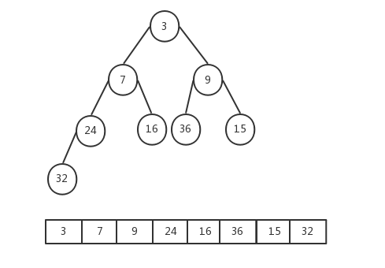
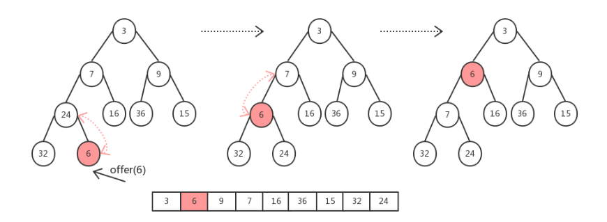
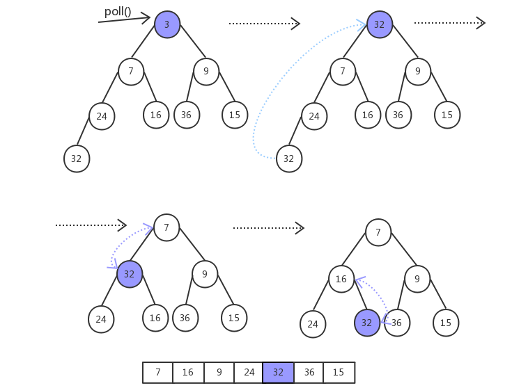

[TOC]

### PriorityQueue

#### 基础

PriorityQueue 即优先级队列, 实现了 **Queue** 接口, 每个元素都有优先级, **队头**的元素永远都是**优先级最高**的. 内部元素**不是完全有序**, 但是**逐个**出队列会得到**完全有序**的输出. 入列操作并**没有**对所有加入的元素**进行优先级排序**, **仅仅保证数组==第一个==元素是最小/大的**. 

PriorityQueue 也是线程**不安全**的队列. 

##### 2.基本使用

PriorityQueue 使用与**普通队列**一样, 唯一区别是 PriorityQueue 会根据**排序规则**决定谁在队头, 谁在队尾. 

```java
// 自定义比较器, 降序排列
static Comparator<Integer> cmp = new Comparator<Integer>() {
    public int compare(Integer e1, Integer e2) {
        return e2 - e1;
    }
};

public static void main(String[] args) {
    // 不用比较器, 默认升序排列
    Queue<Integer> q = new PriorityQueue<>();
    q.add(3);
    q.add(2);
    q.add(4);
    while(!q.isEmpty()) {
        System.out.print(q.poll() + " "); // 2 3 4 
    }

    // 使用自定义比较器, 降序排列
    Queue<Integer> qq = new PriorityQueue<>(cmp);
    qq.add(3);
    qq.add(2);
    qq.add(4);
    while(!qq.isEmpty()) {
        System.out.print(qq.poll() + " "); // 4 3 2 
    }
}
```

使用**自然序**比较器. 

```java
PriorityQueue<String> priorityQueue = new PriorityQueue<>(Comparator.naturalOrder());
```

#### 源码分析

看图说话. 



以下分析基于 JDK8. 

##### 1.基本属性

基本属性如下. 

```java
public class PriorityQueue<E> extends AbstractQueue<E> implements java.io.Serializable {
    
    private static final int DEFAULT_INITIAL_CAPACITY = 11;	// 默认初始化容量
    // 存放数据的数组
    transient Object[] queue;    
    // 数据个数
    private int size = 0;  
    // 排序比较器, 不传入则使用自然排序
    private final Comparator<? super E> comparator;  
    // 记录结构性变化次数
    transient int modCount = 0; 
}
```

PriorityQueue 内部也是使用**数组存储**元素(用于实现**堆**结构), 也有记录结构性变化的 **modCount** 变量, 不过这是自定义的, 不像 ArrayList 是继承而来的. 

##### 2.构造方法

有很多个重载构造方法, 可以定义**数组大小, 比较器**, Collection 对象等参数. 利用 Collection 对象**构造堆**后面详述. 

```java
public PriorityQueue(int initialCapacity) {
    this(initialCapacity, null);
}

public PriorityQueue(int initialCapacity, Comparator<? super E> comparator) {
    if (initialCapacity < 1)
        throw new IllegalArgumentException();
    this.queue = new Object[initialCapacity];
    this.comparator = comparator;
}
```

##### 3.添加元素

队列的**添加元素**有两种方法: **add() 和 offer()**. add() 方法如下. 

```java
public boolean add(E e) {
    return offer(e);
}
```

其内部调用 **offer()** 方法. 

```java
public boolean offer(E e) {
    if (e == null)
        throw new NullPointerException();
    // 记录修改操作
    modCount++;
    // 获取当前元素个数
    int i = size;
    // 如果数组不够了则扩容
    if (i >= queue.length)
        // 扩容操作
        grow(i + 1);
    size = i + 1;
    if (i == 0)
        queue[0] = e;
    else
        // 使用经典siftUp上移最后添加的元素, 保证堆有序
        siftUp(i, e);
    return true;
}
```

扩容的方法 **grow()** 如下. 当容量**小于 64** 时容量扩展为原来的**两倍 + 2**, 大于等于 64 时扩容为原来的 **1.5 倍**. 

```java
private void grow(int minCapacity) {
    // 旧队列长度
    int oldCapacity = queue.length;
    // 当容量小于64时容量为原来的两倍+2, 大于等于64时扩容为原来的1.5倍
    int newCapacity = oldCapacity + ((oldCapacity < 64) ? (oldCapacity + 2) : (oldCapacity >> 1));
    // 元素过量的操作
    if (newCapacity - MAX_ARRAY_SIZE > 0)
        newCapacity = hugeCapacity(minCapacity);
    // 元素拷贝
    queue = Arrays.copyOf(queue, newCapacity);
}
```

之后便是插入过程了, 参考下面的插入 6 的过程(小顶堆). 



新的元素被放到**数组的最后**, 对应到**完全二叉树**的最后一个叶子结点. 由于新插入元素后, 可能导致小顶堆的结构被破坏, 因此需要将**新插入的元素向上调整**, 如果插入的元素比**父节点大**, 那么就把**父节点调下来**, 直到新元素其比**父节点元素值小为止**. 

下面看看**上浮**操作 **siftUp()** 方法! 

```java
private void siftUp(int k, E x) {
    if (comparator != null)
        siftUpUsingComparator(k, x);
    else
        siftUpComparable(k, x);
}
```

这里判断有没有传入**自定义**的比较器, 然后进行不同的操作. 先看没有自定义比较器的情况. 

```java
private void siftUpComparable(int k, E x) {
    // 构造待插入的元素
    Comparable<? super E> key = (Comparable<? super E>) x;
    while (k > 0) {
        // 获取父节点位置
        int parent = (k - 1) >>> 1;
        // 获取父节点元素
        Object e = queue[parent];
        // 如果插入的元素大于父节点(构成小顶堆)则退出循环, 相当于直接就放好位置了
        if (key.compareTo((E) e) >= 0)
            break;
        // 插入元素小于父节点元素, 与父元素交换位置, 实现上浮
        queue[k] = e;
        // 记录父节点位置, 继续向上判断调整
        k = parent;
    }
    // 调整后将插入的元素放在对应位置
    queue[k] = key;
}
```

使用**自定义**的比较器时的方法如下, 其实都差不多. 

```java
private void siftUpUsingComparator(int k, E x) {
    while (k > 0) {
        int parent = (k - 1) >>> 1;
        Object e = queue[parent];
        // 在这里使用自定义的比较器比较
        if (comparator.compare(x, (E) e) >= 0)
            break;
        queue[k] = e;
        k = parent;
    }
    queue[k] = x;
}
```

##### 4.删除元素

移除元素的方法也有两个, 分别是 remove() 与 poll(), 与 remove() 不同的是 poll() 每次移除的是**堆顶**的元素, 也就是最小的元素, remove() 可以移除**指定的任意元素**, 并且这个移除只会移除**第一次**出现的该元素, 其他相同元素则不会移除. 

因为 **poll()** 每次移除的是**堆顶**的元素, 移除之后**需要把数组最后的元素移到堆顶(也就是堆顶), 进而不断进行下沉操作.** 主要关注 **poll()** 方法. 首先看看过程图示(堆中左子结点不一定比右子节点小). 



```java
@SuppressWarnings("unchecked")
public E poll() {
    if (size == 0)
        return null;
    // 弹出一个元素后size减少
    int s = --size;
    modCount++;
    // 获取队首元素
    E result = (E) queue[0];
    // 获取队尾元素(队首元素被移除, 把队尾元素放在队首, 从上往下调整二叉堆)
    E x = (E) queue[s];
    // 队尾元素置空
    queue[s] = null;
    if (s != 0)
        // 调整二叉堆
        siftDown(0, x);
    return result;
}
```

下沉操作 siftDown() 如下: 

```java
private void siftDown(int k, E x) {
    // 判断是否自定义了比较器
    if (comparator != null)
        siftDownUsingComparator(k, x);
    else
        siftDownComparable(k, x);
}
```

同 offer() 方法一样, poll() 方法在调整小顶堆时也分是否使用自定义比较器两种情况, 这里只看其中一个**自然排序**的方法 siftDownComparable(). 

```java
private void siftDownComparable(int k, E x) {
    // 获取待下沉的元素对象
    Comparable<? super E> key = (Comparable<? super E>)x;
    int half = size >>> 1;       
    while (k < half) {
        // 获取左孩子节点所在位置
        int child = (k << 1) + 1; 
        // 获取左孩子节点元素值
        Object c = queue[child];
        // 右孩子节点所在位置
        int right = child + 1;
        if (right < size && 
            ((Comparable<? super E>) c).compareTo((E) queue[right]) > 0)
            // 记录左右孩子中最小的元素
            c = queue[child = right];
        // 如果父节点比两个孩子节点都要小, 就结束循环
        if (key.compareTo((E) c) <= 0)
            break;
        // 把小的元素移到父节点的位置
        queue[k] = c;
        // 记录孩子节点所在的位置, 继续向下调整
        k = child;
    }
    // 最终把父节点放在对应的位置上, 使其保持一个小顶堆
    queue[k] = key;
}
```

remove() 方法这里就不深究了. 

##### 5.heapify构造堆

前面构造方法部分可知, 可以**直接传入集合类型**进行优先级队列的**构造**, 看看过程. 

```java
public PriorityQueue(Collection<? extends E> c) {
    if (c instanceof SortedSet<?>) {
        SortedSet<? extends E> ss = (SortedSet<? extends E>) c;
        this.comparator = (Comparator<? super E>) ss.comparator();
        initElementsFromCollection(ss);
    }
    else if (c instanceof PriorityQueue<?>) {
        PriorityQueue<? extends E> pq = (PriorityQueue<? extends E>) c;
        this.comparator = (Comparator<? super E>) pq.comparator();
        initFromPriorityQueue(pq);
    }
    else {
        this.comparator = null;
        // 通过集合进行初始化
        initFromCollection(c);
    }
}
```

这里就是传入一个集合并进行**堆的构造**. 

```java
private void initFromCollection(Collection<? extends E> c) {
    initElementsFromCollection(c);
    // ★
    heapify();
}
```

这里两步, 第一步是将传入的集合进初始化, 将元素放到对应的 **queue 数组**中. 

第二步就是**调用了 heapify() 方法对 queue 数组进行堆的构造**, 也就是将普通数组**堆化**. 

```java
private void heapify() {
    // 数组从后往前不断进行下沉操作
    for (int i = (size >>> 1) - 1; i >= 0; i--)
        siftDown(i, (E) queue[i]);
}
```

可以看到是**循环调用** siftDown() 完成**下沉**操作. 

从源码也可看出 PriorityQueue 并**不是线程安全队列**, 因为 offer()/poll() 都没有对队列进行加锁.


#### 参考资料

- [PriorityQueue源码解析](https://blog.csdn.net/codejas/article/details/85144502)


