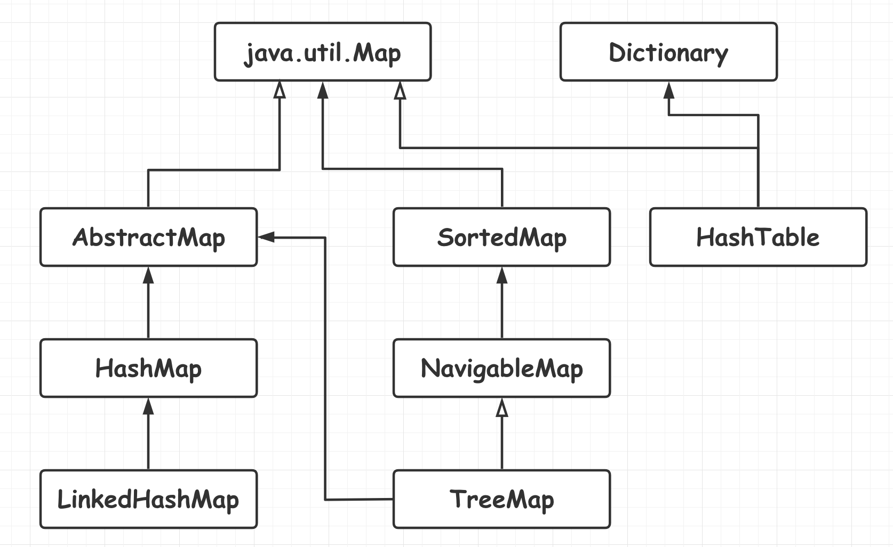

[TOC]

### Map与Set

#### Map

Map 接口的常用方法如下. 

```java
void clear();  			// 清除所有元素
boolean containsKey(Object k);	// 是否包含key
boolean containsValue(Object v);// 是否包含值
Set entrySet(); 		// 返回所有元素集合
boolean equals(Object obj);     // 判断是否相等
Object get(Object k);			// 获取指定值
int hashCode();			// 返回哈希值
boolean isEmpty();		// 是否为空
Set keySet();			// 返回键的集合
Collection values();	// 返回值的集合
Object put(Object k, Object v);	// 放入键值对
void putAll(Map m);		// 批量放入键值对
Object remove(Object k); 		// 删除键值对
int size();				// 返回键值对个数
```

Map 接口主要实现类有: **HashMap, LinkedHashMap, TreeMap** 等. 



- **HashMap**: 根据键的 hashCode 值存储数据, 遍历是无序的. 
- **LinkedHashMap**: LinkedHashMap 是 HashMap 的一个**子类**, 迭代时可以有序, 可配置按**访问顺序或者插入顺序**使用. 
- **TreeMap**: TreeMap 实现 SortedMap 接口, 能够对元素按照**键**进行排序, 默认升序, 也可以指定排序的比较器. 用 Iterator 遍历可得到有序结果. 

#### Set

Set: 存储的元素是独一无二的, 且是**无序**存储的. Set 主要实现类有 HashSet, TreeSet. 


#### 参考资料

- [Java Collection Framework](https://www.w3resource.com/java-tutorial/java-collections.php)
- [Iterator 模式](https://openhome.cc/Gossip/DesignPattern/IteratorPattern.htm)
- [Java 8 系列之重新认识 HashMap(好! ! ! ! )](https://tech.meituan.com/java_hashmap.html)
- [What is difference between HashMap and Hashtable in Java?](http://javarevisited.blogspot.hk/2010/10/difference-between-hashmap-and.html)
- [Java 集合之 HashMap](http://www.zhangchangle.com/2018/02/07/Java%E9%9B%86%E5%90%88%E4%B9%8BHashMap/)
- [The principle of ConcurrentHashMap analysis](http://www.programering.com/a/MDO3QDNwATM.html)
- [探索 ConcurrentHashMap 高并发性的实现机制](https://www.ibm.com/developerworks/cn/java/java-lo-concurrenthashmap/)
- [HashMap 相关面试题及其解答(好! ! ! ! ! ! )](https://www.jianshu.com/p/75adf47958a7)
- [Java 集合细节(二): asList 的缺陷](http://wiki.jikexueyuan.com/project/java-enhancement/java-thirtysix.html)


