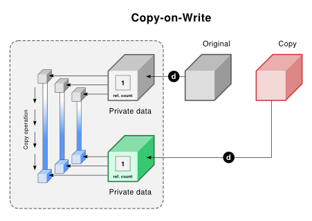

[TOC]

### CopyOnWriteArrayList

#### 基础

##### 1.杂记

- CopyOnWriteArrayList 实现了 **List** 接口，与其他 List 实现类用法类似。它以原子方式支持一些复合操作。它的迭代器不支持修改操作，但也不会抛出 ConcurrentModificationException。迭代时不需要像同步容器那边对整个列表对象加锁。
- 是线程安全的，可以被多个线程并发访问。**读取方法不加锁，其他的写(添加、修改、删除)都会加锁。**写操作在一个**复制的数组**上进行，读操作还是在**原始数组**中进行，读写分离，**互不影响**。写操作需要加锁，防止并发写入时导致写入数据丢失。写操作结束之后需要把原始数组**指向新的**复制数组。
- 适用于**读多写少**的场景。**不适合内存敏感以及对实时性要求很高**的场景。

##### 2.基本使用

基本使用与 List 类似。

```java
public static void main(String[] args) {
    List<Integer> list = new CopyOnWriteArrayList<Integer>();
    list.add(1);
    list.add(2);
}
```

##### 3.写时复制(CopyOnWrite)思想

写时复制(CopyOnWrite, **COW**)思想是计算机程序设计领域中的一种优化策略。

COW 核心思想是如果有**多个调用者**(Callers)**同时要求读取相同的资源**(如**内存**或者是**磁盘**上的数据存储)，他们会**共同获取相同的指针指向相同的资源**，如果某个调用者尝试**修改资源**内容时，系统才会真正**复制一份专用副本**给该调用者，而**其他调用者**所见到的**依然是最初的资源**。这过程对其他的调用者都是**透明**的。

COW 主要的优点是**如果调用者没有修改资源**，就**不用创建副本**，多个调用者仅进行**读取操作时可以共享同一份资源**。

**CopyOnWrite 容器**即**写时复制容器**。通俗的理解是当往一个容器**添加元素**的时候，不直接往当前容器添加，而是先将当前容器进行 Copy (**这里拷贝会创建新的对象**)，**复制**出一个新的容器，然后**新的**容器里添加元素，添加完元素之后，再将原容器的**引用指向新的容器**。这样做的好处是**可以对 CopyOnWrite 容器进行并发的读，而不需要加锁**，因为当前容器不会添加任何元素。所以 **CopyOnWrite 容器也体现了读写分离的思想**，读和写**不同**的容器。



**CopyOnWriteArrayList** 类就利用了**写时复制**的思想，相比于**读写锁**的思想又更进一步。为了将读取的性能发挥到极致，CopyOnWriteArrayList **读是完全不用加锁**的，且**写入也不会阻塞读取操作**，只有写入和写入之间需要进行同步等待，读操作的性能得到大幅度提升。

#### 源码解析

CopyOnWriteArrayList 是 **JUC** 下面的一个**并发容器**。

##### 1.基本属性

```java
public class CopyOnWriteArrayList<E>
    implements List<E>, RandomAccess, Cloneable, java.io.Serializable {

    /** The lock protecting all mutators */
    final transient ReentrantLock lock = new ReentrantLock();

    /** The array, accessed only via getArray/setArray. */
    private transient volatile Object[] array;
}
```

可以看到 CopyOnWriteArrayList 内部使用了**数组**存储元素，而且实现了 RandomAccess 接口，所以支持快速随机访问，同时也实现了 List 接口。

注意 array 是 **volatile** 修饰的，它修饰的成员变量在**每次被线程访问**时，都强迫从**主内存**中**重读**该成员变量的值。而且当成员变量**发生变化**时，强迫线程将变化值回**写到主内存**。保证了线程间的**可见性**。

此外内部还有一个**显式锁**对象。ReentrantLock 是一种**支持重入的独占锁**，任意时刻只允许**一个线程**获得锁，所以可以安全的并发去**写数组**。

此外还有一个很重要的类 **UnSafe 类静态对象**。这个对象后面并发部分有**详解**。

```java
// 静态Unsafe对象
private static final sun.misc.Unsafe UNSAFE;
private static final long lockOffset;
// 使用静态初始化块的方式实例化unsafe和lockOffset
static {
    try {
        UNSAFE = sun.misc.Unsafe.getUnsafe();
        Class<?> k = CopyOnWriteArrayList.class;
        lockOffset = UNSAFE.objectFieldOffset
            (k.getDeclaredField("lock"));
    } catch (Exception e) {
        throw new Error(e);
    }
}
```

##### 2.读取操作

先看看简单的读操作 get。

```java
// 内部数据数组
private transient volatile Object[] array;

public E get(int index) {
    return get(getArray(), index);
}

@SuppressWarnings("unchecked")
private E get(Object[] a, int index) {
    return (E) a[index];
}

final Object[] getArray() {
    return array;
}
```

**读取**操作**不需要进行同步控制和加锁**，因为内部数组 array **不会发生修改**，只会被另外一个 array 替换，因此可以保证数据安全。如果读的时候有多个线程正在向 CopyOnWriteArrayList **添加数据**，**读**还是会读到**旧的数据**，因为写的时候**不会锁住旧的** CopyOnWriteArrayList。

##### 3.添加元素

添加元素的 add 方法源码如下。

```java
public boolean add(E e) {
    // 加显式锁
    final ReentrantLock lock = this.lock;
    lock.lock();
    try {
        // 获取原来的数据数组及长度
        Object[] elements = getArray();
        int len = elements.length;
        // 拷贝原始数据到新的数组，同时新的数组长度+1(因为需要新增一个元素)
        Object[] newElements = Arrays.copyOf(elements, len + 1);
        // 新元素放到数组末尾
        newElements[len] = e;
        // 这里把内部数组设置为新的数组
        setArray(newElements);
        return true;
    } finally {
        // 解锁
        lock.unlock();
    }
}

final void setArray(Object[] a) {
    array = a;
}
```

**写操作使用了显式锁**，重点在 **Object[] newElements = Arrays.copyOf(elements, len + 1);** 这里拷贝旧数组元素并生成一个新的数组，然后将新的元素加入到 newElements 中，再将新的数组**替换**老的数组，修改就完成了。如果不加锁多线程写的时候会 Copy 出 N 个副本出来。

当修改完成后，**读取**线程可以**立即察觉**到这个修改，因为 array 被 **volatile** 修饰了。

##### 4.删除元素

**删除元素**如下。

```java
public E remove(int index) {
    // 获得显式锁
    final ReentrantLock lock = this.lock;
    // 加锁
    lock.lock();
    try {
        Object[] elements = getArray();
        int len = elements.length;
        // 先找到这个索引处的元素
        E oldValue = get(elements, index);
        // 需要移动的元素个数
        int numMoved = len - index - 1;
        if (numMoved == 0)
            setArray(Arrays.copyOf(elements, len - 1));
        else {
            // 依然是新建一个数组并长度－1
            Object[] newElements = new Object[len - 1];
            // 复制数组内容
            System.arraycopy(elements, 0, newElements, 0, index);
            System.arraycopy(elements, index + 1, newElements, index,
                             numMoved);
            // 修改本地数组指针指向新数组
            setArray(newElements);
        }
        return oldValue;
    } finally {
        // 解锁
        lock.unlock();
    }
}
```

可以看到删除方法依然加了锁。思想与添加元素类似。此外，修改元素依然是**加锁**并处理的类似操作。

##### 5.源码总结

综上所述：**读取方法不加锁，其他的写(添加、修改、删除)都会加锁。**

**由于是读不加锁，所以读是可以并行的，而且读写也可以并行，只不过写的过程中读的数据是==旧版本==的数据**，而**不允许多个线程同时进行写操作**。每个写操作都需要先获取**锁**。

**每次修改操作，都会创建一个数组**，复制原数组的内容到新数组，在**新**数组上进行修改，然后以**原子方式**设置内部的数组引用，这就是**写时复制**机制的体现。

CopyOnWriteArrayList 的缺点就是**修改代价十分昂贵**，**每次修改都伴随着一次的数组复制**；但同时优点就是它是**线程安全的**。

##### 6.特点分析

**CopyOnWriteArrayList** 体现了两个十分重要的**分布式**理念：

**(1)读写分离**

读取 CopyOnWriteArrayList 的时候读取的是 CopyOnWriteArrayList 中的 Object[] array；但是修改的时候，操作的是一个**新的** Object[] array，读和写操作的不是同一个对象，这就是**读写分离**。这种技术**数据库**用的非常多，在高并发下为了缓解数据库的压力，即使做了缓存也要对数据库做读写分离，**读的时候使用读库，写的时候使用写库，然后读库、写库之间进行一定的同步，这样就避免同一个库上读、写的 IO 操作太多**。比如 Redis 也有这种设计。

**(2)最终一致性**

如果有多个线程同时写入，**当前读的线程不一定是读到最新**的数据，但是最终读到的肯定是完全一致的。最终一致性对于分布式系统也非常重要，它通过容忍一定时间的数据不一致，提升整个分布式系统的可用性与分区容错性。当然最终一致并不是任何场景都适用的，如火车站售票系统用户对于数据的实时性要求非常高，必须做成强一致性的。

#### CopyOnWrite的问题

CopyOnWrite 容器存在两个问题，即**内存占用问题**和**数据一致性问题**。

##### 1.内存占用问题

因为 CopyOnWrite 的**写时复制**机制，所以在进行**写操作**的时候，内存里会**同时驻扎两个对象**的内存，旧的对象和新写入的对象(注意: 在复制的时候只是**复制容器里的引用**，只是在写的时候会创建新对象添加到新容器里，而旧容器的对象还在使用，所以有两份对象内存)。如果这些对象占用的内存比较大，比如说 200M 左右，那么再写入 100M 数据进去，内存就会占用500M，那么这个时候很有可能导致**频繁的 GC**。

针对内存占用问题，可以通过**压缩容器中的元素**的方法来减少大对象的内存消耗，比如，如果元素全是 10 进制的数字，可以考虑把它压缩成 36 进制或 64 进制。或者不使用 CopyOnWrite 容器，而使用其他的并发容器，如 **ConcurrentHashMap**。

##### 2.数据一致性问题

CopyOnWrite 容器只能保证**数据的最终一致性**，不能保证数据的**实时一致性**，因为部分写操作的数据还**未同步**到**读数组**中。在多线程下，线程 1 读取 CopyOnWriteArrayList 集合里面的数据，**未必是最新**的数据。因为线程 2、线程 3、线程 4 四个线程都修改了 CopyOnWriteArrayList 里面的数据，但是线程 1 拿到的还是**最老**的那个 Object[] array，新添加进去的数据并没有，所以线程 1 读取的内容**未必准确**。

如果希望写入的的数据马上能被读到，就不要使用 CopyOnWrite 容器。

#### 适用场景

CopyOnWriteArrayList 在**写操作**的**同时**允许读操作，大大提高了读操作的性能。根据原理分析，它很适合**读多写少**的应用场景，不适合数组很大且需要频繁修改的场景，它是以**优化读**为目标的。

所以 CopyOnWriteArrayList **不适合内存敏感以及对实时性要求很高**的场景，而**适合读多写少**的场景。

#### CopyOnWriteArraySet

- 实现了 **Set** 接口，不包含重复元素。
- 内部通过 CopyOnWriteArrayList 实现，性能较低，**不适用于元素个数很多**的结合。如果元素较多可以考虑 ConcurrentHashMap 或 ConcurrentSkipListSet 这两个类。


#### 参考资料

- [CopyOnWriteArrayList 原理](cnblogs.com/myseries/p/10877420.html)


