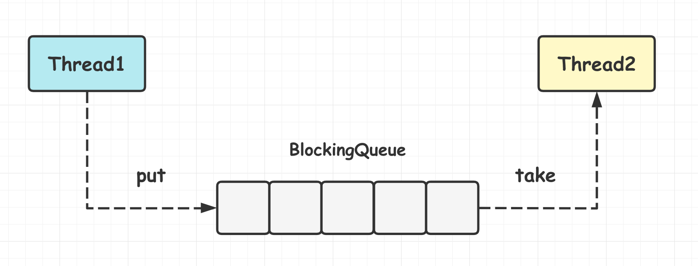

[TOC]

#### BlockingQueue

阻塞队列(BlockingQueue) 是一个**接口**，继承了 Queue 接口。

```java
public interface BlockingQueue<E> extends Queue<E> 
```

内部多基于 **ReentrantLock 和 Condition**(Condition 只能在**独占模式**使用) 实现。阻塞队列是**线程安全**的。 

##### 1.基本定义

阻塞队列是一个支持**两个附加操作**的队列。这两个附加操作是： 

- 在队列**空**时，**获取元素**的**线程会等待队列**变为非空。 
- 当队列**满**时，**存储元素**的**线程会等待队列**可用。 

提供了**阻塞的 take() 和 put() 方法**：如果队列为空 take() 将**阻塞**，**直到**队列中有内容；如果队列为满 put() 将**阻塞**，直到队列有空闲位置。



**用途：**阻塞队列常用于**生产者和消费者**的场景，生产者是往队列里添加元素的线程，消费者是从队列里拿元素的线程。阻塞队列就是生产者存放元素的**容器**，而消费者也**只从容器里拿元素**。

java.util.concurrent.**BlockingQueue** 接口有不少实现：

- **FIFO 队列**: **LinkedBlockingQueue**、**ArrayBlockingQueue**(固定长度)。
- **优先级队列**: **PriorityBlockingQueue**.

##### 2.ArrayBlockingQueue

ArrayBlockingQueue 是一个**有边界**的阻塞队列，其内部通过**数组**实现。有边界即它的**容量是有限**，必须在其初始化的时候指定它的容量大小，容量大小一旦指定就**不可改变**，不可扩容。ArrayBlockingQueue 以**先进先出**的方式存储数据，最新插入的对象是**尾部**，最新移出的对象是**头部**。

重要属性：

```java
/** The queued items */
final Object[] items;

/** items index for next take, poll, peek or remove */
int takeIndex;

/** items index for next put, offer, or add */
int putIndex;

/** Number of elements in the queue */
int count;

/** Main lock guarding all access */
final ReentrantLock lock;

/** Condition for waiting takes */
private final Condition notEmpty;

/** Condition for waiting puts */
private final Condition notFull;
```

初始化: 

```java
ArrayBlockingQueue blockingQueue = new ArrayBlockingQueue(6);
```

```java
public ArrayBlockingQueue(int capacity) {
    this(capacity, false);
}
```

可以看到默认是**非公平锁**.

```java
public ArrayBlockingQueue(int capacity, boolean fair) {
    if (capacity <= 0)
        throw new IllegalArgumentException();
    this.items = new Object[capacity];
    // 里面有CLH队列用于阻塞等待
    lock = new ReentrantLock(fair);
    // 两组条件对应两个不同的操作
    notEmpty = lock.newCondition();
    notFull =  lock.newCondition();
}
```

**put() 方法**:

```java
public void put(E e) throws InterruptedException {
    checkNotNull(e);
    final ReentrantLock lock = this.lock;
    // 获取独占锁
    lock.lockInterruptibly();
    try {
        // 判断当前的队列是否已经满了
        while (count == items.length)
            // 满了就阻塞等待
            notFull.await();
        // 加入队列
        enqueue(e);
    } finally {
        lock.unlock();	// 释放锁
    }
}
```

##### 3.LinkedBlockingQueue

LinkedBlockingQueue 阻塞队列**大小的配置是可选**的，如果初始化时指定一个大小，它就是有**边界**的; 如果不指定，其容量就是 Integer.MAX_VALUE。它的内部实现是一个**链表**。LinkedBlockingQueue 也是以**先进先出**的方式存储数据，最新插入的对象是**尾部**，最新移出的对象是**头部**。

##### 4.PriorityBlockingQueue

PriorityBlockingQueue 是一个**没有边界**的队列，它的排序规则和 java.util.**PriorityQueue** 一样。需要注意，PriorityBlockingQueue 中**允许插入 null **对象。 

插入 PriorityBlockingQueue 的对象必须实现 java.lang.**Comparable** 接口，队列**优先级**的排序规则就是按照对这个接口的实现来定义的。PriorityBlockingQueue 实现了 BlockingQueue 接口，在队列**为空**时，take 方法会**阻塞等待**。

底层是**数组**存放元素。

```java
private transient Object[] queue;
```

##### 5.SynchronousQueue

SynchronousQueue 队列内部**仅允许容纳一个元素**。当一个线程插入一个元素后会被阻塞，除非这个元素被另一个线程**消费**。

##### 6.DelayQueue

由优先级堆支持的、基于时间的调度队列。

##### 7.基于BlockingQueue的生产者与消费者

###### (1)生产者

```java
public class ProducerThread implements Runnable {
    // 阻塞队列
    private BlockingQueue queue;
    private volatile boolean flag = true;
    // 原子计数器
    private static AtomicInteger count = new AtomicInteger();
 
    public ProducerThread(BlockingQueue queue) {
        this.queue = queue;
    }
 
    @Override
    public void run() {
        try {
            System.out.println("生产线程启动...");
            while (flag) {
                System.out.println("正在生产数据....");
                String data = count.incrementAndGet() + "";
                // 将数据存入队列中
                boolean offer = queue.offer(data, 2, TimeUnit.SECONDS);
                if (offer) {
                    System.out.println("生产者,存入" + data + "到队列中, 成功.");
                } else {
                    System.out.println("生产者,存入" + data + "到队列中, 失败.");
                }
                Thread.sleep(1000);
            }
        } catch (Exception e) {
 
        } finally {
            System.out.println("生产者退出线程");
        }
 
    }
    public void stopThread() {
        this.flag = false;
    }
}
```

###### (2)消费者

```java
public class ConsumerThread implements Runnable {
    // 阻塞队列
    private BlockingQueue<String> queue;
    private volatile boolean flag = true;

    public ConsumerThread(BlockingQueue<String> queue) {
        this.queue = queue;
    }

    @Override
    public void run() {
        System.out.println("消费线程启动...");
        try {
            while (flag) {
                System.out.println("消费者,正在从队列中获取数据..");
                // 从阻塞队列获取元素
                String data = queue.poll(2, TimeUnit.SECONDS);
                if (data != null) {
                    System.out.println("消费者,拿到队列中的数据data:" + data);
                    Thread.sleep(1000);
                } else {
                    System.out.println("消费者,超过2秒未获取到数据..");
                    flag = false;
                }
            }
        } catch (Exception e) {
            e.printStackTrace();
        } finally {
            System.out.println("消费者退出线程...");
        }
    }
}
```

运行：

```java
public class ProducerAndConsumer {
    public static void main(String[] args) throws InterruptedException {
        // 初始化阻塞队列
        BlockingQueue<String> queue = new LinkedBlockingQueue<String>(10);
        // 往生产者和消费者同时阻塞队列
        ProducerThread producerThread1 = new ProducerThread(queue);
        ProducerThread producerThread2 = new ProducerThread(queue);
        ConsumerThread consumerThread1 = new ConsumerThread(queue);
        // 开启线程
        Thread t1 = new Thread(producerThread1);
        Thread t2 = new Thread(producerThread2);
        Thread c1 = new Thread(consumerThread1);
        t1.start();
        t2.start();
        c1.start();
        // 执行2s后，生产者不再生产
        Thread.sleep(2 * 1000);
        producerThread1.stopThread();
        producerThread2.stopThread();
    }
}
```

```
生产线程启动...
正在生产数据....
消费线程启动...
消费者,正在从队列中获取数据..
生产线程启动...
正在生产数据....
生产者,存入1到队列中, 成功.
生产者,存入2到队列中, 成功.
消费者,拿到队列中的数据data:2
消费者,正在从队列中获取数据..
正在生产数据....
正在生产数据....
生产者,存入3到队列中, 成功.
消费者,拿到队列中的数据data:1
生产者,存入4到队列中, 成功.
消费者,正在从队列中获取数据..
生产者退出线程
生产者退出线程
消费者,拿到队列中的数据data:3
消费者,正在从队列中获取数据..
消费者,拿到队列中的数据data:4
消费者,正在从队列中获取数据..
消费者,超过2秒未获取到数据..
消费者退出线程...
```

#### ConcurrentLinkedQueue

**ConcurrentLinkedQueue** 是一个适用于**高并发场景下的队列**，通过==**无锁**==的方式实现了高并发状态下的高性能，其性能通常好于 BlockingQueue。 它是一个基于**链接节点**的**无界线程安全队列**，该队列的元素遵循**先进先出**的原则。**头是最先加入的，尾是最近加入的，该队列不允许 null 元素**。


