[TOC]

### JMM与Volatile

#### 计算机模型与CPU架构

##### 1.计算机基础架构与模型

现代计算机基于**冯诺依曼**模型，计算机在运行时，先从**内存**中取出**第一条指令**，通过控制器的译码，按指令的要求，从**存储器**中取出数据进行指定的运算和逻辑操作，然后再按地址把结果送到**内存**中去。接下来再取出第二条指令，在控制器的指挥下完成规定操作。依此进行下去直至遇到停止指令。

##### 2.多CPU架构

###### (1)架构组成

计算机通常有多个 CPU。

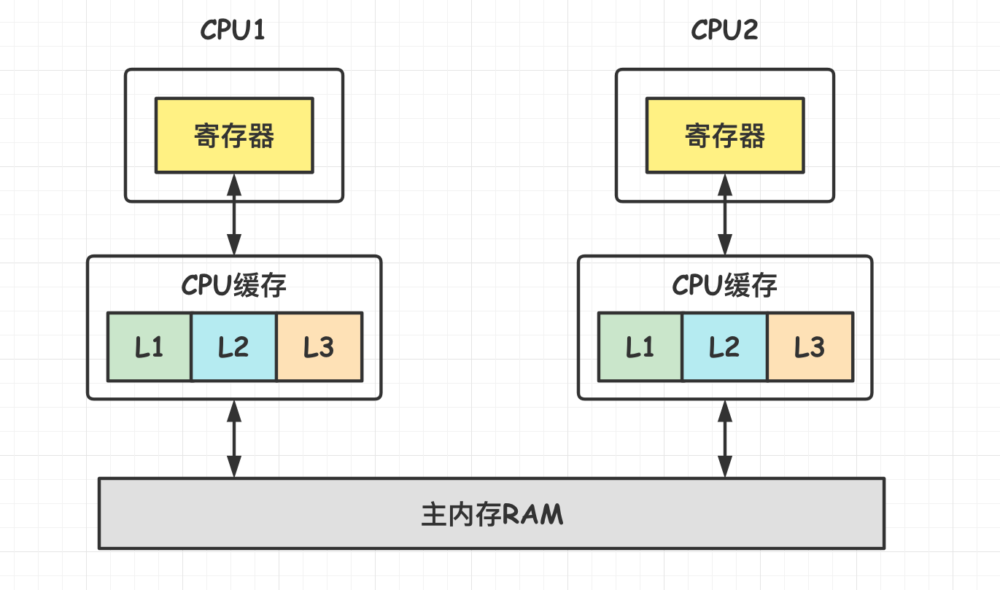

这个架构**组成大致**如下：

- **多核 CPU**：一个 CPU 除了处理器之外还包括寄存器、L1 L2 L3 缓存这些存储设备、浮点运算单元、整数运算单元等一些辅助运算设备以及内部总线等。**一个多核 CPU 也就是一个 CPU 上有多个处理器核心**，这样有什么好处呢？比如在一台计算机上运行一个**多线程**的程序，因为**是一个进程里的线程**，所以需要一些**共享一些存储变量**，如果这台计算机都是单核单线程 CPU 的话，那这个程序的不同线程需要经常在 CPU 之间的外部总线上通信，同时还要处理**不同 CPU 之间**不同缓存导致数据不一致的问题。在这种场景下**单 CPU 多核的架构**就能发挥很大的优势，通信都在**内部总线**，**共用同一个缓存。**
- **CPU 寄存器**：每个 CPU 都包含**一系列的寄存器**，它们是 CPU 内内存的基础。CPU **在寄存器上执行操作的速度远大于在主存上执行的速度**。这是因为 **CPU 访问寄存器的速度远大于主内存**。
- **CPU 缓存**：即**高速缓冲存储器**，是位于 CPU 与**主内存**间的一种容量较小但**速度很高的存储器**。由于 CPU 的速度远**高于**主内存，CPU 直接从内存中存取数据要**等待一定时间周期**，Cache 中保存着 CPU 刚用过或循环使用的**一部分数据**，当 CPU 再次使用该部分数据时可从 **Cache** 中**直接调用**，减少 CPU 的等待时间，提高了系统的效率。一般有**一级** Cache(L1 Cache)、**二级** Cache(L2 Cache)、**三级** Cache(L3 Cache) 缓存。
- **内存**：所有 CPU 都能访问主存。主存通常比 CPU 中的缓存大得多。内存需要通过**总线**与 CPU 进行通信，速度是比较慢的。

假如只有一个 CPU 而需要运行多个进程，就意味着要经常进行进程**上下文切换**。单 CPU 即便是**多核**的，也只是多个**处理器核心**，其他设备都是**共用**的，所以多个**进程**就必然要经常进行进程上下文切换，代价很高。

###### (2)CPU读取存储器数据过程

CPU 从不同地方读数据过程与复杂度是不同的。

- CPU 要取**寄存器 XX** 的值，只需要一步：**直接读取**。
- CPU 要**取 L1 cache** 的某个值，需要 1-3 步(或者更多)：把 cache 行**锁住**，把某个数据拿来，解锁，如果没锁住就慢了。
- CPU 要**取 L2 cache** 的某个值，先要到 L1 cache 里取，L1 当中不存在，在 L2 里，L2 开始加锁，加锁以后，把 L2 里的数据复制到 L1，再执行读 L1 的过程，上面的 3 步，再解锁。
- CPU **取 L3 cache** 的也是一样，只不过先由 L3 复制到 L2，从 L2 复制到 L1，从 L1 到 CPU。
- CPU **取内存**中的值则最复杂：通知内存控制器**占用总线带宽**，通知内存加锁，发起内存读请求，等待回应，回应数据保存到 L3(如果没有就到 L2)，再从 L3/L2 到 L1，再从 L1 到 CPU，之后解除总线锁定。比如需要**读取变量** age 的值，也就是从内存复制到 L3 再到 L2 再到 L1 最后到寄存器。从 CPU 同步数据到内存则是相反的流程。

CPU 读写速度：**==寄存器 > L1 > L2 > L3 > 内存条==**。

##### 3.多线程存在的问题

###### (1)缓存一致性问题

多处理器系统中每个处理器都有自己的**高速缓存**，它们又**共享同一主内存**(MainMemory)。基于**高速缓存的存储交互很好地解决了处理器与内存的速度矛盾，但是也引入了新的问题：缓存一致性问题(CacheCoherence)**。

当多个处理器的运算任务都涉及**同一块主内存**区域时，将可能导致**各自的缓存数据不一致**的情况，比如两个 CPU 都需要对主内存中的变量 age = 1 值进行 +1 操作，此时两个 CPU 都会从主内存中复制一份 age 值到 L3，再到 L2，再到 L1 最后到寄存器进行 +1 操作。也就是两个 CPU 中都有 age 变量的副本，当 CPU1 执行 +1 之后，同步回主内存，此时 age = 2；由于 CPU2 里面的缓存的 age 值也是 1，因此 CPU2 处理完后 age 也等于 2，此时再同步到主内存中，最后 age = 2，这就与 age 加两次等于 3 的结果不一致。

如果真发生这种情况，那同步回到主内存时以谁的缓存数据为准？

为了**解决一致性的问题**，需要各个处理器**访问缓存时都遵循一些协议**，在**读写时**要根据协议来进行操作，这类协议有 **MSI**、MESI、MOSI 等。除此之外，还可以采用**总线加锁**的方式解决。

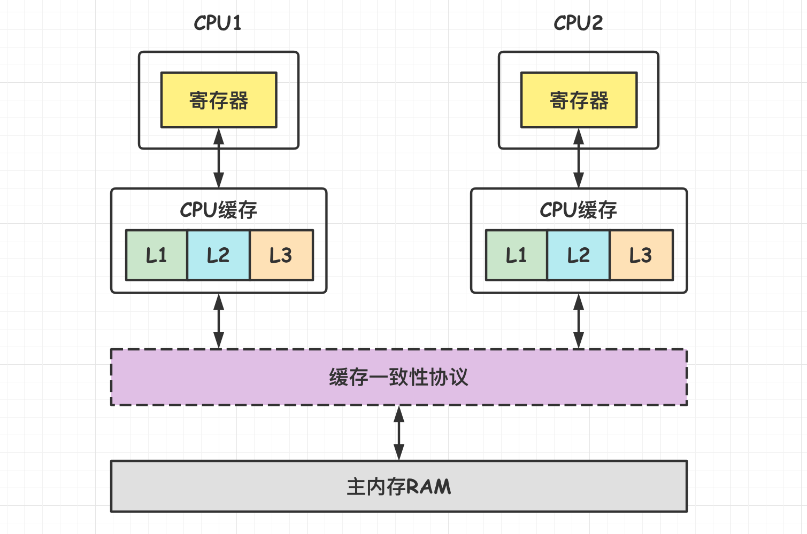

###### (2)指令重排序问题

为了使处理器内部的运算单元能尽量被充分利用，**处理器**可能会对输入代码进行**乱序执行(Out-Of-Order Execution)优化**，处理器会在计算之后将**乱序执行的结果重组**，保证该结果与顺序执行的**==结果是一致==**的，**但并不保证程序中各个语句计算的先后顺序与输入代码中的顺序一致**。

因此，如果存在一个计算任务**依赖**另一个计算任务的**中间结果**，那么其顺序性并不能靠代码的先后顺序来保证。与处理器的乱序执行优化类似，Java 虚拟机的**即时编译器**中也有类似的**指令重排序(Instruction Reorder)优化**。

##### 4.MESI协议

|          状态           |                             描述                             |                           监听任务                           |
| :---------------------: | :----------------------------------------------------------: | :----------------------------------------------------------: |
|  **M 修改**(Modified)   | 该 Cache line 有效，数据被修改了，和内存中的数据不一致，数据只存在与本 Cache 中 | **缓存行必须时刻监听所有试图读该缓存行相对的主存的操作**，这种操作必须在缓存将该缓存行写回主存并将状态变成 S(共享)状态之前被延迟执行 |
| E 独享、互斥(Exclusive) | 该 Cache line 有效，数据和内存中的数据一致，数据只存在于本 Cache 中 | 缓存行也必须监听其他缓存读主存中该缓存行的操作，一旦有这种操作，该缓存行需要变成 S(共享)状态 |
|     S 共享(Shared)      | 该 Cache line 有效，数据和内存中的数据一致，数据可以存在与多个 Cache 中 | 缓存行也必须监听其他缓存使该缓存行无效或者独享该缓存行的请求，并将该缓存行变成无效(Invalid) |
|   **I 无效**(Invalid)   |                      该 Cache line 无效                      |                                                              |

#### JMM模型

##### 1.主内存与工作内存

CPU 中**寄存器**的读写速度比**内存**快几个数量级，为解决这种**速度矛盾**，在它们之间加入了**高速缓存**(一般有多级)，因此很多时候寄存器是直接从**缓存**中读取缓存数据的。但是**主内存**中才是存放各种数据的主要位置，因此加入**高速缓存**带来了一个新问题：**缓存一致性问题**。如果多个缓存**共享同一块主内存**区域，那么多个缓存的数据可能会不一致。需要一些**协议**来解决这个问题，如下图所示。 

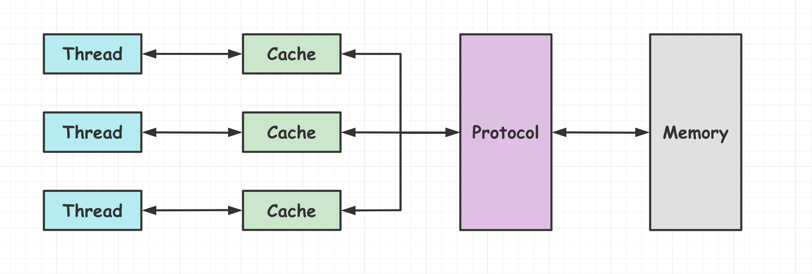

==**Java 内存模型**(**Java Memory Model 简称 JMM)**==是一种**抽象**的概念，**并不真实存在**，它描述了**一组规则或规范**，它定义了程序中各个变量(包括实例字段，静态字段和构成数组对象的元素)的**访问方式**。

**==主内存==**主要存储的是 Java **实例对象**，所有**线程创建的实例对象==都存放在主内存中==**，不管该实例对象是成员变量还是方法中的本地变量(也称局部变量)，当然也包括了共享的类信息、常量、静态变量。

**==工作内存==**主要存储**当前方法**的所有**本地变量信息**(工作内存中**存储着主内存中的变量==副本拷贝==**)，每个线程只能访问自己的**工作内存**，即线程中的本地变量对其它线程是**不可见**的，就算是两个线程执行的是同一段代码，它们也会各自在自己的工作内存中创建属于**当前线程的本地变量**，当然也包括了字节码行号指示器、相关 Native 方法的信息。注意由于工作内存是每个线程的私有数据，线程间**无法相互访问**工作内存，因此**存储在工作内存的数据不存在线程安全问题**。根据 JVM 虚拟机规范主内存与工作内存的数据存储类型以及操作方式，对于一个实例对象中的成员方法而言，如果方法中包含**本地变量**是**基本数据类型**(boolean, byte, short, char, int, long, float, double)，将**直接存储在工作内存的帧栈结构**中，但倘若**本地变量**是**引用类型**，那么该变量的引用会存储在工作**内存的帧栈**中，而**对象实例将存储在主内存**(共享数据区域，堆)中。

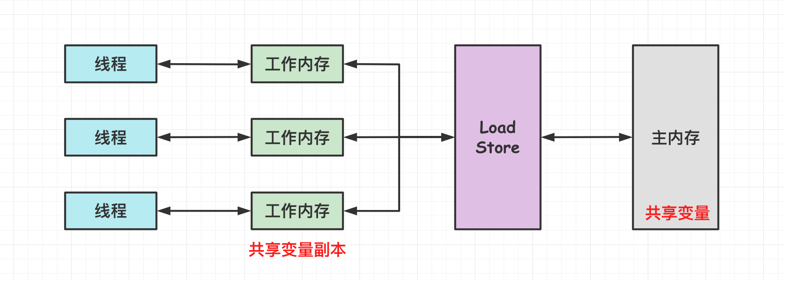

**JVM** 创建每个**线程**时都会为其创建一个**工作内存**(有些地方称为栈空间)，用于**存储线程私有的数据**。

JMM 规定**所有变量都存储在主内存**，**主内存是共享内存区域，所有线程都可以访问，但线程对变量的操作(读取赋值等)必须在工作内存中进行，首先要将变量从主内存拷贝到线程自己的工作内存空间成为副本，然后对变量进行操作，操作完成后再将变量写回主内存；线程不能直接操作主内存中的变量**。

**线程**只能直接操作**工作内存**中的变量，因此不同线程之间的**变量值传递**需要通过**主内存**来完成。基于 **JMM 规范**的线程，其工作内存与主内存之间的交互过程如下：

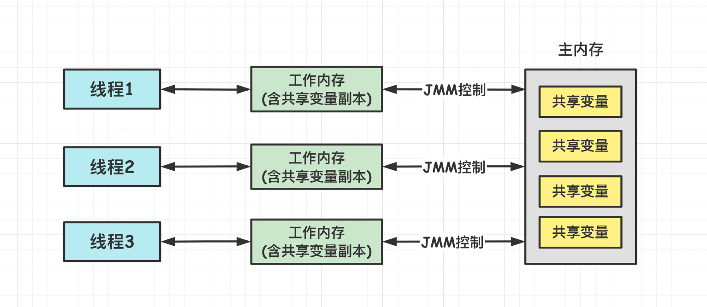

由于是共享数据区域，**多个线程对同一个变量进行访问可能会发生线程安全问题**。在当前的 Java 内存模型下，线程可以把变量保存**本地内存**(比如机器的**寄存器**)中，**而不是直接在主存**中进行读写。这就可能造成一个线程在主存中修改了一个变量的值，而另外一个线程还继续使用它在寄存器中的变量值的拷贝，造成**数据的不一致**。

但对于**实例对象**的成员变量，不管它是基本数据类型或者包装类型(Integer、Double等)还是引用类型，都会被存储到**堆区**。至于 **static 变量**以及类本身相关信息将会存储在**主内存**中。需要注意的是，在主内存中的**实例对象**可以被多线程共享，倘若两个线程同时调用了同一个对象的同一个方法，那么两条线程会将要操作的数据拷贝一份到自己的工作内存中，执行完成操作后**才刷新到主内存**。

> **为什么要有Java内存模型**？

Java **内存模型**试图屏蔽各种**硬件和操作系统的内存访问差异**，以实现让 Java 程序在各种平台下都能达到**一致的内存访问效果**。

##### 2.JMM与JVM模型的联系

JMM 与 JVM 内存区域的**划分是不同的概念层次**。**JMM 描述的是==一组规则==**，通过**这组规则控制程序中各个变量在共享数据区域和私有数据区域的访问方式**，JMM 围绕**==原子性，有序性、可见性==**展开。

JMM 与 Java 内存区域唯一相似点，都存在共享数据区域和私有数据区域，在 JMM 中主内存属于共享数据区域，从某个程度上讲应该包括了堆和方法区，而工作内存数据线程私有数据区域，从某个程度上讲则应该包括程序计数器、虚拟机栈以及本地方法栈。

JMM 是为了屏蔽不同硬件平台的差异而做的一种规范化模型。JVM 内存模型则是为了便于更好的管理、使用内存而设计的架构模型。

##### 3.JMM与硬件内存架构的关系

JMM 模型跟 CPU 缓存模型结构类似，是基于 CPU 缓存模型建立的，JMM 模型屏蔽了不同计算机底层架构的区别。但 **JMM 模型与硬件内存架构并不完全一致**。

**硬件内存**有实际的寄存器、缓存内存、主内存概念，并**没有工作内存**(线程私有数据区域)和主内存(堆内存)之分。工作内存通常映射到**高速缓存或者寄存器**中。

JMM 对内存的划分对硬件内存并没有任何影响，因为 JMM 只是一种**抽象**的概念，是**==一组规则==**，并不实际存在，不管是**工作内存的数据还是主内存的数据**，对于计算机硬件来说都会存储在计算机**主内存**中，当然也有可能存储到 **CPU 缓存或者寄存器中**，因此 JMM 模型和计算机硬件内存架构是一个相互交叉的关系，是一种**抽象概念划分与真实物理硬件**的交叉。(JVM 的内存区域划分也是同样的道理)。

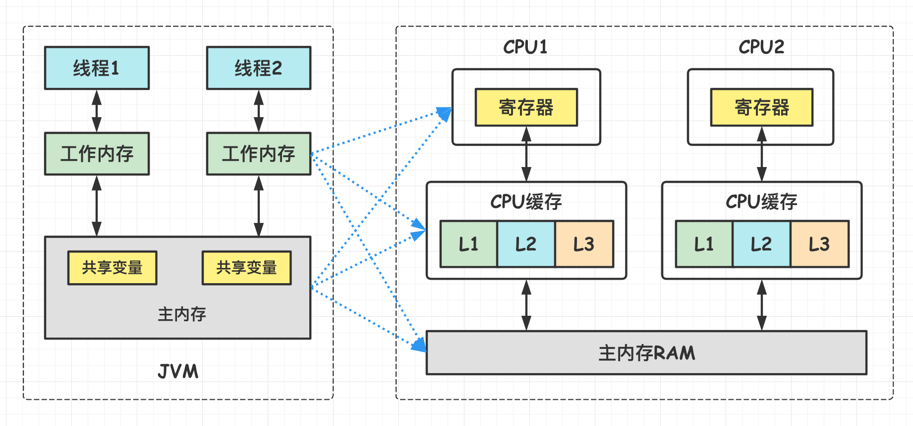

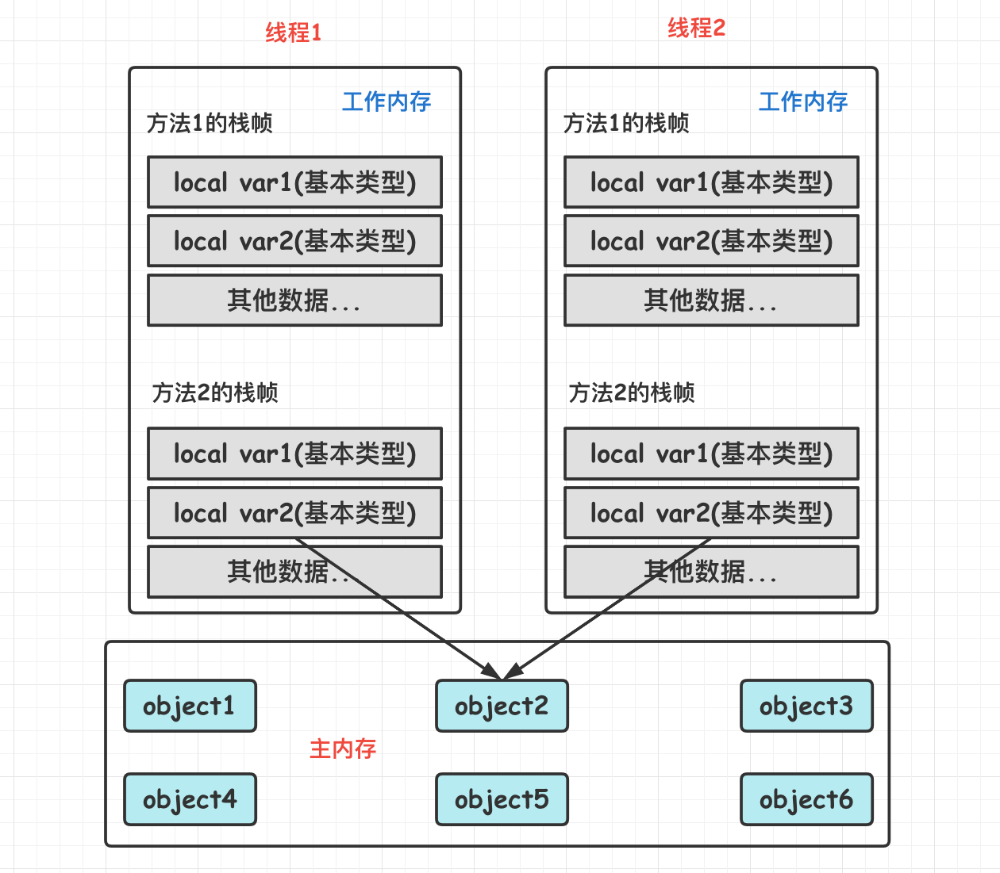

##### 4.内存间交互的8种操作

由于 **JVM** 运行程序的实体是**线程**，而每个线程创建时 JVM 都会为其创建一个**工作内存**用于存储线程**私有**的数据，线程与主内存中的变量操作必须通过**工作内存**间接完成。主要过程是将变量从主内存拷贝的每个线程各自的工作内存空间，然后对变量进行操作，操作完成后再将变量**写回**主内存。

针对以上关于主内存与工作内存之间的**具体交互协议**，即一个变量如何从主内存拷贝到工作内存、如何从工作内存同步到主内存之间的实现细节，JMM 定义了**八种操作**来完成**主内存和工作内存**的交互操作。如下图所示，箭头**绕了一圈**。

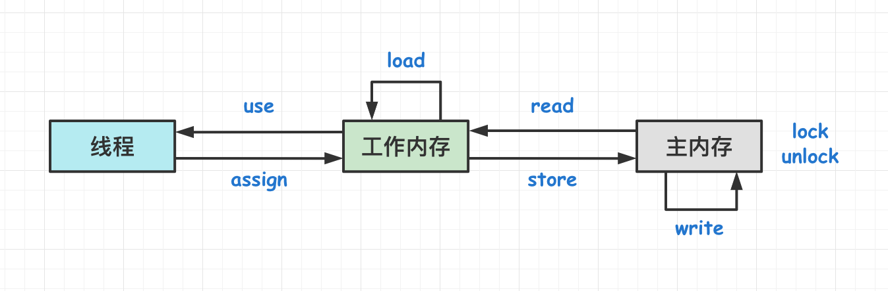

- **lock**(锁定)：作用于**主内存**的变量，把一个**变量**标识为**一条线程独占**的状态。
- **unclock**(解锁)：作用于**主内存**的变量，把一个处于**锁定状态的变量释放**出来，释放后的变量才可以被其他线程锁定。
- **read**(读取)：作用于**主内存**的变量，把一个变量的值从**主内存**传输到线程的**工作内存**，以便随后的 **load** 动作使用。
- **load**(载入)：作用于**工作内存**的变量，把 read 操作从主内存中得到的变量值**放入工作内存的变量副本**中。
- **use**(使用)：作用于**工作内存**的变量，把**工作内存**中一个变量的值传递给**处理器**。
- **assign**(赋值)：作用于**工作内存**的变量，把**处理器**接收到的值赋给**工作内存**的变量。
- **store**(存储)：作用于**工作内存**的变量，把工作内存中一个变量的值传送给**主内存**中，以便随后的 write 操作使用。
- **write**(写入)：作用于**主内存**的变量，把 store 操作从工作内存中得到的变量的值放入**主内存的变量**中。

如果要把一个变量从**主内存中复制到工作内存**中，就需要**按顺序地执行 read 和 load 操作**，如果把变量从**工作内存中同步到主内存**中，就需要按**顺序地执行 store 和 write 操作**。但 Java 内存模型**==只要求上述操作必须按顺序执行，而没有保证必须是连续执行。==**  

这里 **read 与 load** 必须一起执行，**write 与 store** 也必须一起执行。

##### 5.同步规则分析

基于上述的**八种**操作，有一些**同步规则**。

- 不允许一个线程无原因地(没有发生过任何 assign 操作)把数据从工作内存同步回主内存中 。
- 一个新的变量只能在**主内存**中诞生，不允许在工作内存中直接使用一个未被初始化(load 或者 assign)的变量。即就是对一个变量实施 use 和 store 操作之前，必须先自行 assign 和 load 操作。
- 一个变量在同一时刻只允许一条线程对其进行 lock 操作，但 lock 操作可以被**同一线程**重复执行多次，多次执行 lock 后，只有执行相同次数的 unlock 操作，变量才会被解锁。lock 和 unlock 必须**成对**出现。
- 如果对一个变量执行 lock 操作，将会清空工作内存中此变量的值，在执行引擎使用这个变量之前需要重新执行 load 或 assign 操作初始化变量的值。
- 如果一个变量事先没有被 lock 操作锁定，则不允许对它执行 unlock 操作；也不允许去 unlock 一个被其他线程锁定的变量。
- 对一个变量执行 **unlock 操作之前**，必须先把此**变量同步到主内存**中(执行 store 和 write 操作)  。

##### 6.并发操作的可见性&原子性&有序性问题及解决

可见性、原子性和有序性是**并发编程**必须考虑的问题，这里先描述这几个问题，然后再讨论 JMM 模型是**如何解决**这些问题的。

###### (1)可见性问题

**可见性指的是当一个线程修改了某个共享变量的值，其他线程是否能够马上得知这个修改的值**。

对于**单线程环境**，可见性的概念是不存在的，因为任何一个操作中修改了某个变量的值，后续的操作中都能读取这个变量值，并且是修改过的新值。

在**多线程环境**中，由于线程对共享变量的操作都是线程拷贝到各自的工作内存进行操作后才写回到主内存中的，这就可能存在一个线程 A 修改了共享变量 x 的值，还**未写回主内存**时，另外一个线程 B 又对主内存中同一个共享变量 x 进行操作，但此时 A 线程工作内存中共享变量 x 对线程 B 来说**并不可见**，这种**工作内存与主内存同步延迟现象就造成了可见性问题**，另外指令重排以及编译器优化也可能导致可见性问题。无论是编译器优化还是处理器优化的重排现象，在多线程环境下，确实会导致程序乱序执行的问题，从而也就导致可见性问题。

看一段多线程的代码。

```java
public class VolatileVisibility {

    // 全局变量
    private static boolean flag = false;

    public void refresh() {
        flag = true;
        System.out.println("线程 " + Thread.currentThread().getName() + " 修改 flag.");
    }

    public void load() {
        // 死循环
        while (!flag) {
        }
        System.out.println("线程：" + Thread.currentThread().getName() + "发现flag变化.");
    }

    public static void main(String[] args) {
        VolatileVisibility sample = new VolatileVisibility();
        Thread threadA = new Thread(() -> {
            sample.load();
        }, "threadA");

        Thread threadB = new Thread(() -> {
            // 刷新flag为true
            sample.refresh();
        }, "threadB");

        // 先开启B线程
        threadA.start();
        try {
            Thread.sleep(2000);
        } catch (InterruptedException e) {
            e.printStackTrace();
        }
        // 再开启B线程
        threadB.start();

        try {
            Thread.sleep(100);
            System.out.println("当前变量值：" + flag);
        } catch (InterruptedException e) {
            e.printStackTrace();
        }
    }
}
```

这里定义了一个普通的全局变量 flag = false。然后开启线程 A 首先进入死循环，然后开启线程 B 对 flag 进行刷新。执行结果如下：

```java
线程 threadB 修改flag.
当前变量值：true
```

可以看到线程 B 成功修改了 flag 的值，但是线程 A 依然在死循环中。下面分析一下这个流程。

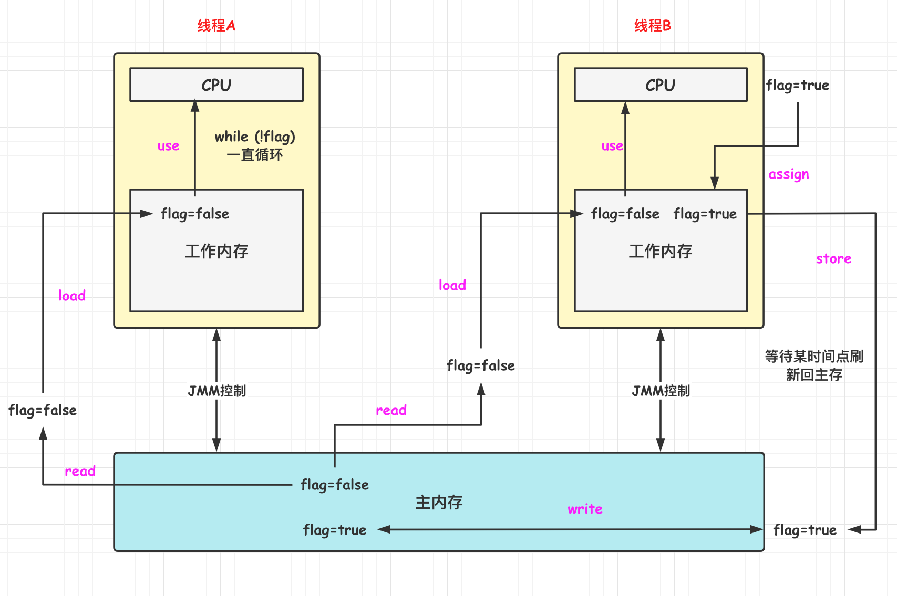

1. 主内存 flag = false。线程 A 通过 read 与 load 操作将 flag 的值从主内存读出并复制到一个线程 A 的工作内存中。此时线程 A 的工作内存有 flag 的副本为 false。
2. 然后线程 A 通过 while 循环持续监听 flag 的变化，如果 flag 变为 true 则退出循环。线程 A 的 CPU 使用其工作内存中的 flag 值用了 use 操作。
3. 之后线程 B 采用同样的方式将 flag 的副本复制到其工作内存中，然后 CPU 对 flag 值进行修改。
4. 线程 B 修改完成后，通过 assign 操作将 flag 的值写到其工作内存中，此时 flag = true。
5. 等到合适的时机，flag 的值通过 store 与 write 操作同步回主内存。此时主内存中 flag = true。
6. 由于线程 B 是通过普通写的方式将 flag 写回主内存，所以线程 A 不会实时**嗅探** flag 的变化，线程 A 一直使用的是其工作内存中的 flag 的**副本**，也就是 false，所以线程 A 会一直死循环。

> **如何解决可见性问题**？

Java 内存模型是通过在变量修改后**将新值同步回主内存**，==在变量**读取前**从主内存**刷新变量值**来实现可见性的==。

主要有三种解决可见性问题的方式：

- ==**volatile**==：轻量级。**volatile 关键字保证可见性**。当一个共享变量被 volatile 修饰时，它会保证**修改的值立即被其他的线程看到**，即修改的值**立即更新到主存**中，当其他线程需要读取时，它会去内存中读取新值。
- ==**synchronized 与显示锁**==：可以保证任一时刻只有一个线程能访问共享资源，并保证在其**释放锁之前**将修改的变量**刷新到内存**中。
- ==**final**==：即时编译器在 final 写操作后，会插入**内存屏障**，来禁止重排序，保证可见性。

###### (2)原子性问题

**原子性指的是一个操作是不可中断**的，即使是在多线程环境下，一个操作一旦开始就不会被其他线程影响。  

原子性问题实例：有一个**错误认识**就是，**int** 等**基本数据类型**在多线程环境中**不会**出现线程安全问题。下面的 cnt 属于 int 类型变量，1000 个线程对它进行**自增**操作之后，得到的值为 999997 而不是 1000000。

```java
public class VolatileAtomicExample {

    // 注意这里加了volatile保证可见性
    private volatile int cnt = 0;

    public static void main(String[] args) throws InterruptedException {
        VolatileAtomicExample example = new VolatileAtomicExample();

        for (int i = 0; i < 1000; i++) {
            Thread thread = new Thread(() -> {
                for (int j = 0; j < 1000; j++) {
                    // 不是原子操作
                    example.cnt++;
                }
            });
            thread.start();
        }
        Thread.sleep(1000);
        System.out.println(example.cnt);
    }
}
```

这是因为 **cnt++ 并不是原子操作**。在多线程环境下，有可能线程 A 将 cnt 读取到本地内存中，此时其他线程可能已经将 cnt 增大了很多，而线程 A 依然对过期的 cnt 进行自加，然后重新刷新到主存中，最终导致了 cnt 的结果不合预期，而是小于 1000000。

为啥？将**内存间的交互操作**简化为 3 个：**load、assign、store**。

load、assign、store 这一系列操作整体上来看不具备原子性，那么在 T1 修改 cnt 并且还没有将修改后的值写入主内存，T2 依然可以读入旧值。可以看出，这两个线程虽然执行了两次自增运算，但是主内存中 cnt 的值最后为 1 而不是 2。对 int 类型读写操作只是说明 load、assign、store 这些**单个操作具备原子性**，**组合在一起不一定具有原子性**。

上述的例子可以用下面的图解释。注意这里 cnt 变量加了 volatile 保证可见性。开始执行的时候，cnt = 0 被多个线程加载到其工作内存中(这里只画了 2 个线程)。然后线程内部各自对 cnt 进行自增操作，其值变成 1。但线程 1 首先完成自增后，需要将其值写入到主内存中。由于 cnt 加了 volatile 关键字，所以这里遵循缓存一致性协议，根据 MESI 协议，这里需要锁定缓存行，因此 cnt 的状态被置为 **M(Modified)**。根据缓存一致性协议，其他线程的工作内存中的 cnt 的值被置为 **I(Invalid) 无效状态**。所以这里线程 1 中的 cnt 能被写入到主内存，而线程 2(或者还有其他线程)对 cnt 值的修改就变成无效的而不会写到主内存中了，所以线程 2 中自增的循环就**白费**了一次。到最后，可能有很多这样的情况出现，使得最后 cnt 的值并不是期望的 1000000。**所以 Volatile 关键字仅能保证可见性，多线程下也不能保证原子性，也就不能保证线程安全**。

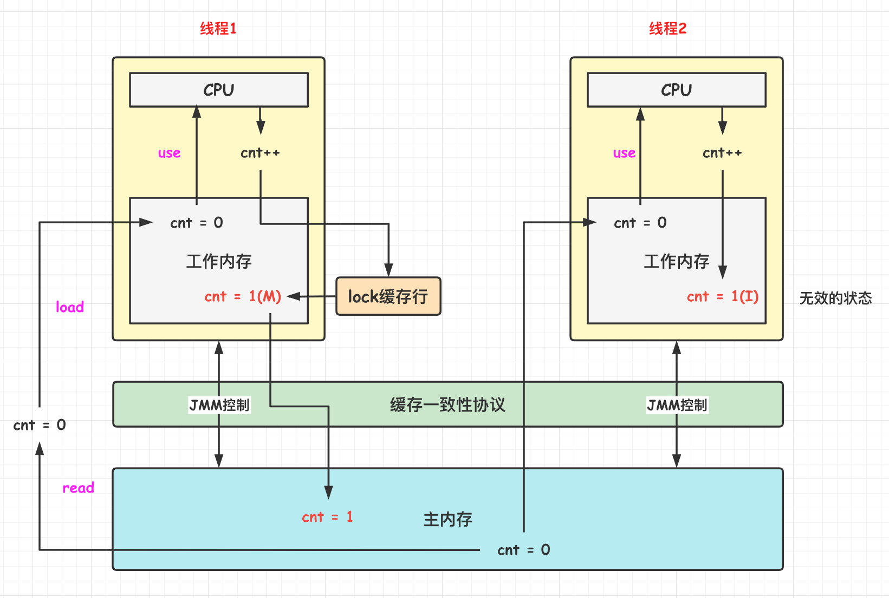

使用 **AtomicInteger** 类能保证多个线程对 int 类型修改的**原子性**，也就是让几个内存间的交互执行完其他线程才能进行。使用 **AtomicInteger** 重写之前线程不安全的代码之后得到以下线程安全实现：

```java
public class AtomicExample {
    private AtomicInteger cnt = new AtomicInteger();

    public void add() {
        cnt.incrementAndGet();
    }

    public int get() {
        return cnt.get();
    }
}
```

在 Java 中，对基本数据类型变量的读取和赋值操作是**原子性操作**有点要注意的是，对于基本数据类型，byte, short, int, float, boolean, char 来说，其**读写是原子操作**。而对于 32 位系统的来说，long 类型数据和 double 类型数据，它们的读写**并非原子性**的，也就是说如果存在两条线程同时对 long 类型或者 double 类型的数据进行读写是存在相互干扰的，因为对于 32 位虚拟机来说，每次原子读写是 32 位的，而 long 和 double 则是 **64 位**的存储单元，这样会导致一个线程在写时，操作完前 32 位的原子操作后，轮到 B 线程读取时，恰好只读取到了**后 32 位**的数据，这样可能会读取到一个既非原值又不是线程修改值的变量，它可能是 "**半个变量**" 的数值，即 64 位数据被两个线程分成了两次读取。但也不必太担心，因为读取到“半个变量”的情况比较少见。在目前的商用的虚拟机中，几乎都把 64 位的数据的读写操作作为原子操作来执行，因此这个问题了解即可。

> **如何解决原子性问题**？

除了 JVM 自身提供的对基本数据类型读写操作的原子性外，可以通过 **synchronized 和 Lock** 实现**原子性**。因为加锁能够保证任一时刻只有一个线程访问**资源**。

###### (3)有序性问题

有序性是指在**本线程**内观察，所有操作都是**有序**的；而在一个线程观察另一个线程，所有操作都是**无序**的，无序是因为发生了**指令重排序**。

在 Java 内存模型中，**允许**编译器和处理器对指令进行**重排序**，重排序过程不会影响到单线程程序的执行，却会影响到**多线程并发执行的正确性**。

> **如何解决有序性问题**？

解决方式如下：

- **==volatile==**：通过添加**内存屏障**的方式来**禁止指令重排**，即重排序时不能把后面的指令放到内存屏障之前。
- ==**synchronized 与显示锁**==：保证每个时刻**只有一个线程**执行同步代码，相当于是让**线程顺序执行**同步代码，自然就保证了有序性。  

#### 指令重排序

##### 1.概述

为了**提高性能**，**编译器和处理器**常常会对程序**指令进行重排序**。Java 虚拟机的**即时编译器**中也有类似的指令重排序(Instruction Reorder)优化。

指令重排序的意义是什么？

JVM 能根据**处理器特性**(CPU 多级缓存系统、多核处理器等)适当的对机器指令进行重排序，**使机器指令能更符合 CPU 的执行特性，最大限度的发挥机器性能。**

重排序分为**编译器重排序**和**处理器(CPU运行时)重排序**，也就是在编译器和处理器(CPU)两个地方都可能发生指令重排序。

重排序具体分**三种类型**：

1. **编译器优化的重排序**。编译器在不改变单线程程序语义的前提下，可以重新安排语句的执行顺序。
2. **指令级并行的重排序**。现代处理器采用了**指令级并行技术**(Instruction-Level Parallelism，ILP)来将多条指令重叠执行。如果不存在数据依赖性，处理器可以改变语句对应机器指令的执行顺序。
3. **内存系统的重排序**。由于处理器使用缓存和读/写缓冲区，这使得**加载和存储**操作看上去可能是在乱序执行。

下图为从源码到最终执行的指令序列示意图。

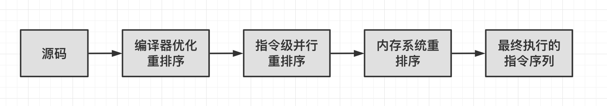

重排序是指**编译器或处理器**为了**优化程序性能**而对指令序列进行排序的一种手段。但是重排序也需要遵守一定**规则**：

- **1. 重排序操作不会对存在数据依赖关系的操作进行重排序。**比如：a = 1; b = a; 这个指令序列，由于第二个操作依赖于第一个操作，所以在编译时和处理器运行时这两个操作不会被重排序。
- **2. 重排序是为了优化性能，但是不管怎么重排序，单线程下程序的执行结果不能被改变**。

以上面的 cnt++ 为例子。如下所示，如果在 cnt++ 之后还有其他操作，这里的其他操作与当前的 cnt++ 无关。

```java
Thread thread = new Thread(() -> {
    for (int j = 0; j < 1000; j++) {
        // 不是原子操作
        example.cnt++;
        // 其他操作
        int a = 0;
        int b = 100;
        int c = a + b;
    }
});
```

在之前的例子中，由于 cnt 有 Volatile 关键字进行修饰，所以当线程 1 根据缓存一致性协议将 cnt 的值置为 M(Modified) 的时候，会把线程 2 中的 cnt 的值置为无效。当线程 2 进行下一次循环时，需要从主内存再次读取最新的 cnt 的值，然而线程 1 此时有可能并未将 cnt 的值同步回内存，所以线程 2 就需要**进行等待**。为了**提升效率**，在遵守 as-if-serial 语义的原则下，CPU 在这里可以进行指令重排序，让后面的操作先执行，等到 cnt 的值 ready 后再去读取最新的值。这就用到了指令重排序。

##### 2.重排序导致的问题

编译器或者处理器都可能会对代码的结构进行重排序。

**(1) 编译器重排序**

```java
// 优化前
int x = 1;
int y = 2;
int a1 = x * 1;
int b1 = y * 1;
int a2 = x * 2;
int b2 = y * 2;
// 优化后
int x = 1;
int y = 2;
int a1 = x * 1;
int a2 = x * 2;
int b1 = y * 1;
int b2 = y * 2;
```

**CPU 只读一次** x 和 y 的值。不需反复读取**寄存器**来**交替 x 和 y 值**。

**(2) 处理器重排序**

```java
int a = 0;
int b = 0;
int x = 0;
int y = 0;
// 处理器A执行
a = 1;
x = b;
// 处理器B执行
b = 2;
y = a;
```

处理器 A 读 b = 0，处理器 B 读 a = 0。A1 写 a = 1 先写到处理器 A 的工作内存中，此时主内存中 a = 0。如果这时处理器 B 从主内存中读 a，读到的将是 0。可能会出现 x, y 都是 0。

这说明重排序**都可能**会导致多线程程序出现**内存可见性**问题。

##### 3.数据依赖性

如果两个操作访问**同一个变量**，且这两个操作中有一个为**写操作**，此时这两个操作之间就存在**数据依赖性**。数据依赖分下列三种类型：

|    名称    |   代码示例    |              说明              |
| :--------: | :-----------: | :----------------------------: |
| **写后读** | a = 1; b = a; | 写一个变量之后，再读这个变量。 |
| **写后写** | a = 1; a = 2; | 写一个变量之后，再写这个变量。 |
| **读后写** | a = b; b = 1; | 读一个变量之后，再写这个变量。 |

上面三种情况其实就是只要重排序两个操作的执行顺序，程序的执行结果**将会被改变**。

编译器和处理器在重排序时，会**遵守数据依赖性**，编译器和处理器**不会对存在数据依赖关系**的两个操作的进行重排序。注意，这里所说的数据依赖性仅针对**单个处理器**中执行的指令序列和单个线程中执行的操作，不同处理器之间和不同线程之间的数据依赖性不被编译器和处理器考虑。

##### 4.as-if-serial语义

**指令重排序**必须遵守 **as-if-serial 语义**。as-if-serial 语义是指：**不管怎么重排序**(编译器和处理器为了提高并行度)，(**单线程**)程序的执行结果**不能被改变**。

为了遵守 as-if-serial 语义，编译器和处理器**==不会对存在数据依赖关系==的操作做重排序**，因为这种重排序会改变执行结果。但是，如果操作之间**不存在**数据依赖关系，这些操作就可能被编译器和处理器**重排序**。比如下面计算圆面积的代码示例：

```java
double pi  = 3.14;    // A
double r   = 1.0;     // B
double area = pi * r * r; // C
```

上面三个操作的**数据依赖关系**如下图所示：

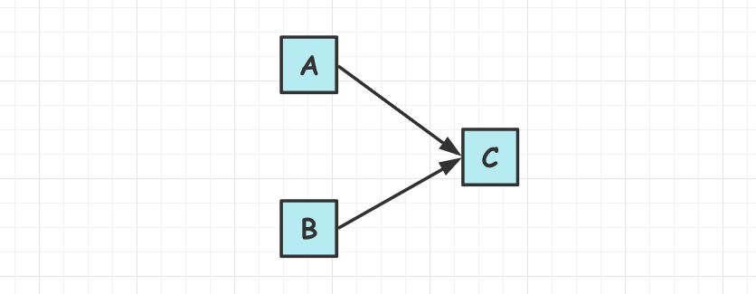

如上图所示，**A 和 C** 之间存在数据依赖关系，同时 **B 和 C** 之间也存在数据依赖关系。因此在最终执行的指令序列中，C 不能被重排序到 A 和 B 的前面(C 排到 A 和 B 的前面，程序的结果将会被改变)。但 **A 和 B 之间没有**数据依赖关系，编译器和处理器**可以重排序 A 和 B** 之间的执行顺序。下图是该程序的两种执行顺序：

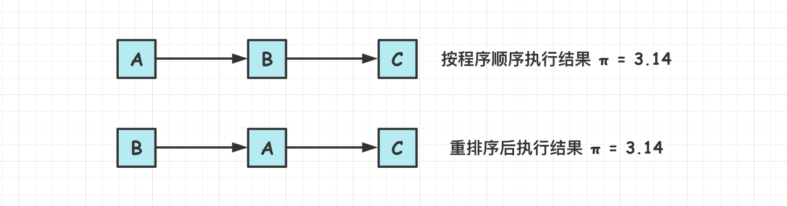

这里 A happens- before B，但实际执行时 B 却可以**排在 A 之前执行**(看上面的重排序后的执行顺序)。如果 A happens- before B，JMM 并不要求 A 一定要在 B 之前执行。JMM 仅仅要求前一个操作(执行的结果)对后一个操作可见，且前一个操作按顺序排在第二个操作之前。这里操作 A 的执行结果不需要对操作 B 可见；而且重排序操作 A 和操作 B 后的执行结果，与操作 A 和操作 B 按 happens- before 顺序执行的结果一致。在这种情况下， JMM 会认为这种重排序并不非法(not illegal)，JMM 允许这种重排序。

在计算机中，软件技术和硬件技术有一个共同的目标：**在不改变程序执行结果的前提下，尽可能的开发并行度**。编译器和处理器遵从这一目标，从 happens- before 的定义可以看出，JMM 同样遵从这一目标。

##### 6.解决指令重排序导致的可见性问题

- 对于**编译器重排序**，JMM 的编译器重排序规则会**禁止特定类型**的编译器重排序(不是所有的编译器重排序都要禁止)。
- 对于**处理器重排序**，JMM 的处理器重排序规则会要求 Java 编译器在**生成指令序列时，插入特定类型的内存屏障指令**，通过内存屏障指令来禁止特定类型的处理器重排序(不是所有的处理器重排序都要禁止)，**Volatile** 关键字就是通过加入内存屏障实现的禁止指令重排序。

#### Volatile

volatile 是 Java 虚拟机提供的**轻量级的同步机制**。volatile 关键字有如下两个作用：

- **保证可见性**：保证被 volatile 修饰的共享变量**对所有线程总数可见**的，也就是当一个线程修改了一个被 volatile 修饰共享变量的值，新值总是可以被其他线程立即得知。**对 volatile 变量的修改，修改之后，马上同步回主内存，而对其读则每次必须从主内存进行刷新读。**
- **禁止指令重排序优化**。  

##### 1.volatile语义

###### (1)volatile保证可见性

对 **volatile 变量**的修改操作**其他线程是能够立即感知**到的。将一个共享变量声明为 volatile 后，当**写**一个 volatile 变量时，JMM 会把该线程对应的**本地内存**中的变量**强制刷新到主内存**中去，这个写会操作会导致其他线程中的**缓存无效**。**读操作**会强制要求线程去**主内存读取最新的数据**。

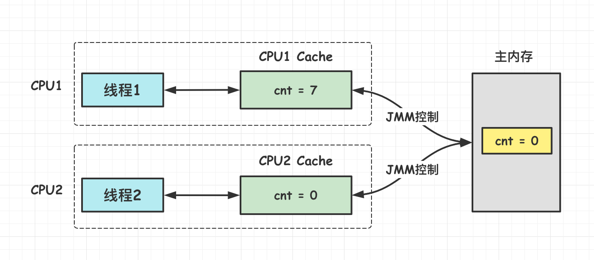

缓存可见性原理：

- JMM 内存交互层面：volatile 修饰的变量的 read、load、use 操作和 assign、store、write 必须是连续的，即修改后必须立即同步回主内存。且使用时必须从主内存刷新，不再使用工作内存中的值，由此保证可见性。

- 底层实现：使用**汇编 lock 指令**锁定变量缓存行区域并写回主内存，这个操作称为“缓存锁定”，缓存一致性机制会阻止同时修改被两个以上处理器缓存的内存区域数据。一个处理器的缓存回写到主内存后，会导致其他处理器的缓存值失效。

对于上面的例子，如果给 flag 加上 volatile 关键字，那么就能保证线程 B 将 flag 修改完成并同步回主内存的时候，线程 A 能够嗅探到 flag 值的变化，并重新从主内存取值，使得线程 A 可以退出死循环。

```java
public class NanoVolatileVisibilitySample {

    // 全局变量
    private static volatile boolean flag = false;

    public void refresh() {
        flag = true;
        System.out.println("线程 " + Thread.currentThread().getName() + " 修改 flag.");
    }

    public void load() {
        // 死循环
        while (!flag) {
        }
        System.out.println("线程：" + Thread.currentThread().getName() + "发现flag变化.");
    }

    public static void main(String[] args) {
        NanoVolatileVisibilitySample sample = new NanoVolatileVisibilitySample();
        Thread threadA = new Thread(() -> {
            sample.load();
        }, "threadA");

        Thread threadB = new Thread(() -> {
            // 刷新flag为true
            sample.refresh();
        }, "threadB");

        // 先开启B线程
        threadA.start();
        try {
            Thread.sleep(2000);
        } catch (InterruptedException e) {
            e.printStackTrace();
        }
        // 再开启B线程
        threadB.start();

        try {
            Thread.sleep(100);
            System.out.println("当前变量值：" + flag);
        } catch (InterruptedException e) {
            e.printStackTrace();
        }
    }
}
```

运行结果：

```java
线程 threadB 修改flag.
线程 threadA 发现flag变化.
当前变量值：true
```

可以看出 Volatile 可以保证内存的可见性。

###### (2)volatile禁止重排序优化

volatile 关键字另一个作用就是**禁止指令重排优化**，从而避免多线程环境下程序出现乱序执行的现象。其实现方式就是通过**==添加内存屏障==**实现的。

由于编译器和处理器都能执行指令重排优化，而如果在**指令间插入一条内存屏障可以告知编译器或者 CPU 禁止在内存屏障前后的指令执行重排序优化。**

volatile 禁止指令重排序有一些规则，比如：

**1. 当第二个操作是 voaltile 写时，无论第一个操作是什么，都不能进行重排序**。

**2. 当地一个操作是 volatile 读时，不管第二个操作是什么，都不能进行重排序**。

**3. 当第一个操作是 volatile 写时，第二个操作是 volatile 读时，不能进行重排序**。

##### 2.volatile无法保证原子性

由前面的例子可以知道，volatile **无法保证原子性**，多线程操作仍存在安全性问题。volatile 对于单个的共享变量的读/写具有原子性，但是像 cnt++ 这种**复合**操作，volatile **无法保证其原子性**，解决方案就是使用并发包中的原子操作类，通过**循环 CAS** 地方式来保证 cnt++ 操作的原子性。

在并发场景下，使用 synchronized 便保证线程安全，需要注意的是一旦使用 synchronized 修饰方法后，由于 synchronized 本身也具备与 volatile **相同的特性**，即可见性，因此在这样种情况下就完全可以**省去** volatile 修饰变量。 

##### 3.synchronized和volatile的区别

- volatile 是告诉 JVM 当前变量在寄存器(工作内存)中的值是不确定的，需要**从主存**中读取；synchronized 则是用于并发资源访问控制。

- **使用上**：volatile 仅能作用于**变量**；synchronized 则可以使用在**变量、方法、和类**上。

- **阻塞上**：**多线程访问 volatile 关键字不会发生阻塞，而 synchronized 关键字可能会发生阻塞**。
- **功能上**：volatile 关键字主要用于保证变量在多个线程之间的**可见性**，但不能保证数据的**原子性**。而 synchronized 关键字解决的是多个线程之间访问**资源的同步性**，可见性与原子性**都能保证**。

##### 4.volatile与CAS的大量使用会有啥问题？

可能会导致**==总线风暴==**问题。volatile 引入的 **MESI** 缓存一致性协议需要不断的从**主内存嗅探**和 CAS 不断循环无效交互导致**总线带宽达到峰值**。

解决办法：**部分** volatile 和 CAS 使用 synchronized。volatile 与 synchronize 同时使用的场景：**单例模式**。

#### 内存屏障

**编译器和处理器**必须**同时遵守重排**规则。**多核处理器**需使用**内存屏障指令**来**确保一致性**。**内存屏障**又称内存栅栏，是一个 **CPU 指令**。

内存屏障的作用：

- **强制刷出各种 CPU 的缓存数据**，因此任何 CPU 上的线程都能读取到这些数据的**最新版本**(解决可见性问题)。
- **禁止**指令重排序(解决重排序问题)。

所以 **==volatile 变量正是通过内存屏障实现其在内存中的语义，即可见性和禁止重排优化==**。

**处理器提供内存屏障指令**主要有：

- **写内存屏障指令**(Store Memory Barrier)：处理器将存储缓存值**写回主存**(阻塞方式)。

- **读内存屏障指令**(Load Memory Barrier)：处理器处理**失效队列**(阻塞方式)。

在 volatile **读前插**读屏障，**写后插**写屏障，**避免 CPU 重排序**导致的问题，实现多线程之间数据的**可见性**。

**屏障类型**：

|      屏障类型       |         指令实例         | 说明                                                         |
| :-----------------: | :----------------------: | :----------------------------------------------------------- |
|  LoadLoad Barriers  |   Load1;LoadLoad;Load2   | 确保 Load1 数据的装载先于 Load2 及所有后续指令的装载         |
| StoreStore Barriers | Store1;StoreStore;Store2 | 确保 Store1 数据对其他处理器可见(刷新到内存),先于 Store2 及所有后续存储指令的存储 |
| LoadStore Barriers  |  Load1;LoadStore;Store2  | 确保 Load1 数据的装载先于 Store2 及所有后续存储指令刷新到内存 |
| StoreLoad Barriers  |  Store1;StoreLoad;Load2  | 确保 Store1 数据对其他处理器可见(刷新到内存),先于 Load2 及所有后续装载指令的装载 |

**StoreLoad** 开销最大。万能屏障，兼具其它三种内存屏障功能。执行时，处理器通常要把写缓冲区中的数据**全部刷新的内存中**。

对于处理器来说，**内存屏障**会导致 **CPU 缓存的刷新**，刷新时会遵循缓存一致性协议。

- **Synchronized**：**解锁时**，JVM 会强制**刷新 CPU 缓存**，导致当前线程更改，对其他线程可见。

- **volatile**：标记 volatile 的字段，在**写**操作时，会强制**刷新 CPU 缓存**，每次读取都是**直接读内存**。

- **final**：即时编译器在 final 写操作后，会插入**内存屏障**，来禁止重排序，保证可见性。

> 还有没有什么方法可以**禁止指令重排序**？

禁止指令重排序其实只需要加**内存屏障**就行了。上述的加锁、volatile、final 等都会加上内存屏障，如果不用这些，还可以**自己手动在代码中加内存屏障**。可以利用 **Unsafe** 类中的 **loadFence()、storeFence()** 等方法。


