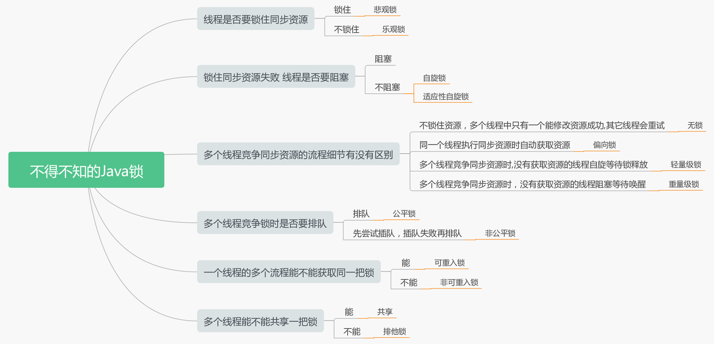
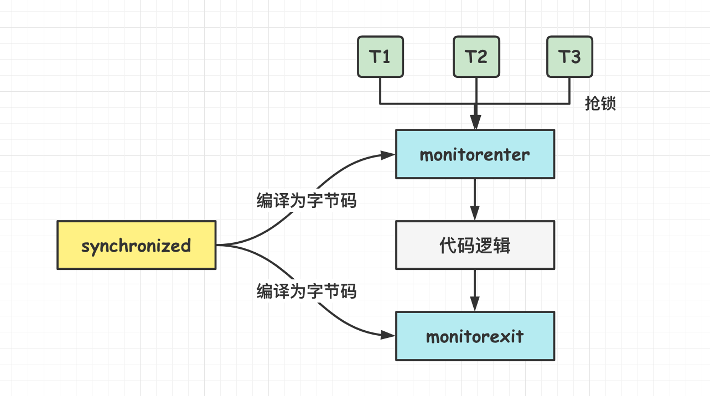
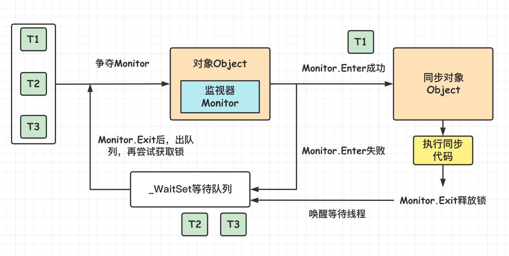
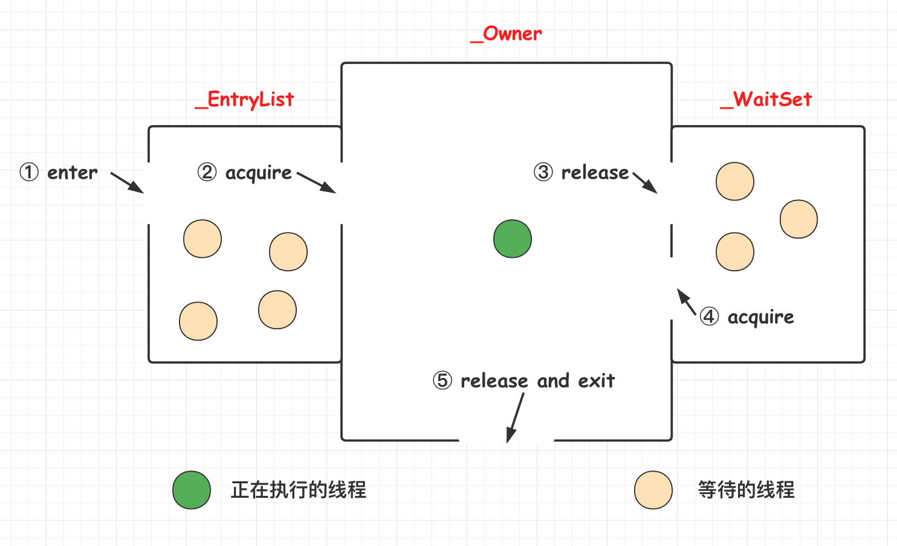
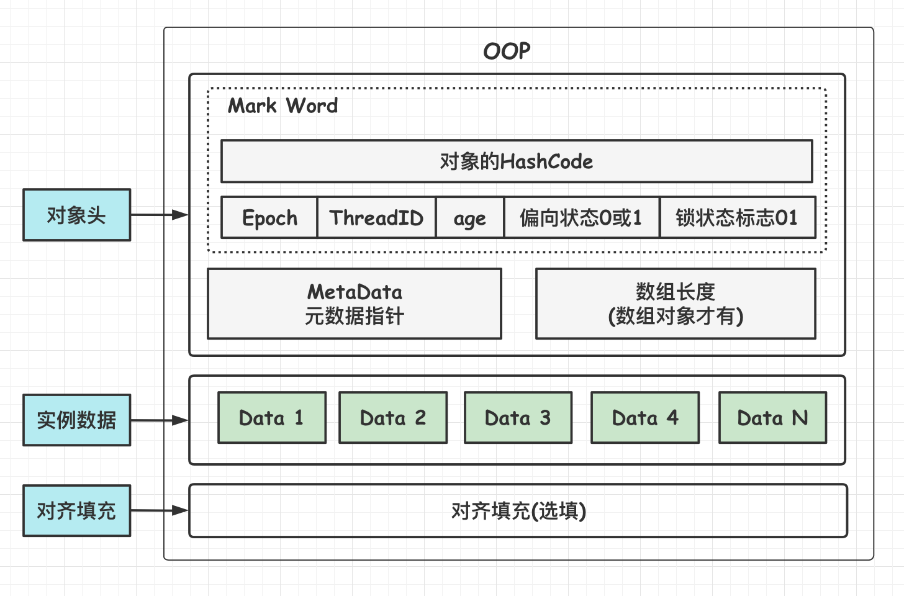
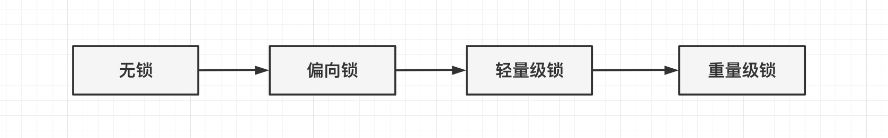
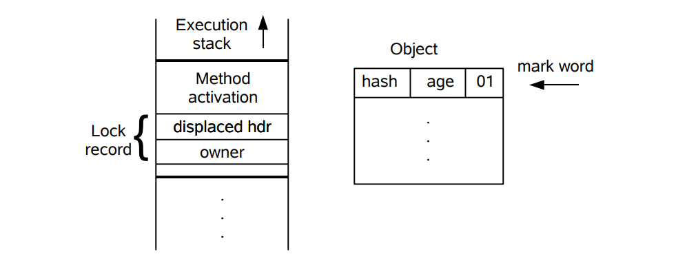
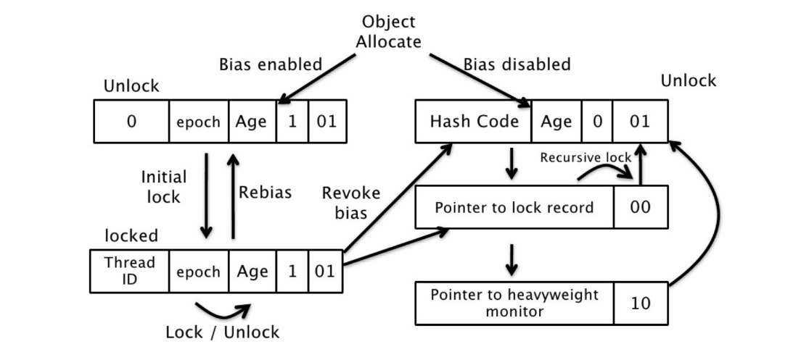
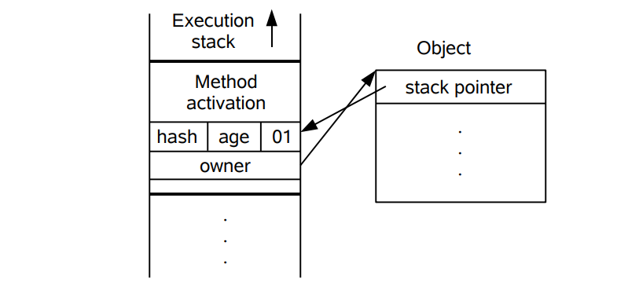
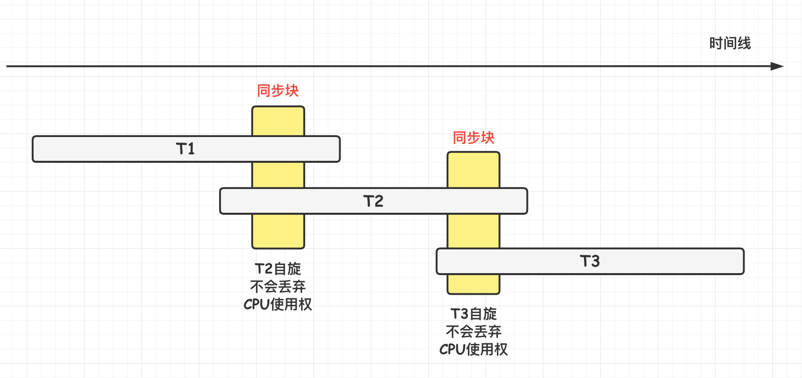

[TOC]

## 锁与互斥同步

### 一.概述

#### 基础

##### 1.不安全示例

当多**个线程**访问与操作**同一个对象**时，最终执行的结果与执行时序有关，可能正确也可能不正确。如果多个线程对同一个共享数据进行访问而不采取**同步操作**的话，那么操作的结果可能是不一致的。以下代码演示了 1000000 个线程同时对 cnt 执行**自增**操作，操作结束之后它的值有可能小于 1000000。

```java
public class ThreadUnsafeExample {

    private int cnt = 0;
	
    //  自增
    public void add() {
        cnt++;
    }

    public int get() {
        return cnt;
    }
}
```

```java
public static void main(String[] args) throws InterruptedException {
    final int threadSize = 1000000;
    ThreadUnsafeExample example = new ThreadUnsafeExample();
    final CountDownLatch countDownLatch = new CountDownLatch(threadSize);
    // 线程池
    ExecutorService executorService = Executors.newCachedThreadPool();
    // 多个线程操作cnt变量
    for (int i = 0; i < threadSize; i++) {
        executorService.execute(() -> {
            example.add();
            countDownLatch.countDown();
        });
    }
    // 等待完成
    try {
        countDownLatch.await();
    } catch (InterruptedException e) {
        e.printStackTrace();
    }
    executorService.shutdown();
    System.out.println(example.get());
}
```

```html
998236
```

远远小于 100000，出大问题。解决的方法：

- 使用 **synchronized** 关键字；
- 使用**显示锁**；
- 使用**原子变量**。

##### 2.锁概述

每个**线程**有自己的程序计数器和自己的**栈**，但是线程之间可能存在**共享内存**，可以访问与操作**相同的对象**。因此可能存在**竞争**问题。多线程编程中，有可能会出现多个线程同时访问**同一个共享、可变资源**的情况，这个资源称为**临界资源**；这种资源可能是：对象、变量、文件等。

- **共享**：资源可以由多个线程同时访问。
- **可变**：资源可以在其生命周期内被修改。  

**引出的问题：**由于线程执行的过程是**不可控**的，所以需要采用**同步机制**来协调**对对象可变状态**的访问。

**如何解决线程并发安全问题？**

实际上，所有的并发模式在解决线程安全问题时，采用的方案都是 **序列化访问临界资源**。即在同一时刻，只能有一个线程访问临界资源，也称作**同步互斥访问**。  Java 中，提供了两种方式来实现同步互斥访问：**synchronized(隐式锁) 和 Lock(显式锁)**。

**同步器的本质就是加锁**。**加锁目的**：序列化访问临界资源，即同一时刻只能有一个线程访问临界资源(**同步互斥访问**)。

不过有一点需要区别的是：当多个线程执行一个方法时，该方法内部的**局部变量并不是临界资源**，因为这些局部变量是在每个线程的私有栈中，因此不具有共享性，不会导致线程安全问题。  

##### 3.Java锁体系

根据不同的场景而区分的 Java 锁体系如下。



Java 提供了**两种锁机制**来控制多个线程对共享资源的**互斥访问**，第一个是 JVM 实现的 **synchronized**，而另一个是 JDK 实现的基于 API 的 **ReentrantLock**。

### 二.Synchronized锁

#### 基础

##### 1.概述

> **说一说对于synchronized关键字的了解？**

synchronized 关键字解决的是多个线程之间访问资源的**同步性**，synchronized 关键字可以保证被它**修饰的方法或者代码块**在任意时刻只能有**一个线程**执行。可以使用 **synchronized** 互斥锁来保证操作的**原子性**，以解决前述的竞态条件问题。

对前面的自增方法**加锁**，保证**只有一个线程**能操作此方法。

```java
public class AtomicSynchronizedExample {
    private int cnt = 0;
	// 方法加锁
    public synchronized void add() {
        cnt++;
    }

    public synchronized int get() {
        return cnt;
    }
}
```

```java
public static void main(String[] args) throws InterruptedException {
    final int threadSize = 1000;
    AtomicSynchronizedExample example = new AtomicSynchronizedExample();
    final CountDownLatch countDownLatch = new CountDownLatch(threadSize);
    ExecutorService executorService = Executors.newCachedThreadPool();
    for (int i = 0; i < threadSize; i++) {
        executorService.execute(() -> {
            example.add();
            countDownLatch.countDown();
        });
    }
    countDownLatch.await();
    executorService.shutdown();
    System.out.println(example.get());
}
```

输出为：

```html
1000
```

##### 2.synchronized基本用法

synchronized **锁是一个资源对象**。

- 同步**实例方法**，锁是当前实例对象(this)。
- 同步**类方法**，锁是当前类对象。
- 同步**代码块**，锁是括号里面的对象。

###### (1)同步代码块和实例方法

**synchronized** 保护的是==**实例对象**==。

```java
// 同步代码块
public void func() {
    synchronized (this) {
        // ...
    }
}

// 同步实例方法
public synchronized void func () {
    // ...
}
```

它只作用于==**同一个对象**==，如果调用同一个类的**两个**对象实例上的同步代码块，就**不会**进行同步，想一下如果是多个对象各自**独立操作**，其实不会存在竞争。即保护的是**同一个对象的方法调用**。再具体来说，synchronized 实例方法保护的是**当前实例对象**，**即 ==this== 对象**。this 对象有一个**锁**和一个**等待队列**，锁只能被**一个线程持有**，其他线程需要锁时会**尝试获取**，没获取到就进入**等待队列**等待，并进入 **BLOCKED** 状态。

对于以下代码，使用 ExecutorService 执行了两个线程，由于调用的是**同一个对象的同步代码块**，因此这两个线程会进行同步，当一个线程进入**同步语句块**时，另一个线程就必须**等待**。

```java
public class SynchronizedExample {
    
    public void func1() {
        synchronized (this) {
            for (int i = 0; i < 10; i++) {
                System.out.print(i + " ");
            }
        }
    }
}
```

```java
public static void main(String[] args) {
    // 作用于同一个e1对象，需要获取锁
    SynchronizedExample e1 = new SynchronizedExample();
    ExecutorService executorService = Executors.newCachedThreadPool();
    executorService.execute(() -> e1.func1());
    executorService.execute(() -> e1.func1());
}
```

此时锁住的是 e1 这个对象，两个线程都在**争取** e1 的对象锁。

```html
0 1 2 3 4 5 6 7 8 9 0 1 2 3 4 5 6 7 8 9
```

对于以下代码，两个线程调用了**不同对象**的同步代码块，两个对象**各自拥有**自己的**锁和等待队列**，因此这两个线程就**不需要同步**。从输出结果可以看出，两个线程**交叉执行**。相当于这里就有**两把锁**，不同的线程获得不同对象的锁。

```java
public static void main(String[] args) {
    // 由于同步的是代码块 所以使用两个不同对象的锁不用同步
    SynchronizedExample e1 = new SynchronizedExample();
    SynchronizedExample e2 = new SynchronizedExample();
    ExecutorService executorService = Executors.newCachedThreadPool();
    executorService.execute(() -> e1.func1());
    executorService.execute(() -> e2.func1());
}
```

```html
0 1 2 3 4 0 5 6 7 8 9 1 2 3 4 5 6 7 8 9 
```

注意：如果是对**普通实例方法**加锁，由于没有加 static 关键字，所以锁的是 **this 对象**，因此要想起到同步的作用，在 **Spring 容器**中目标对象的 scope 应该为 **singleton**。例如：

```java
@Service
public class BookServiceImpl {
    // 同步实例方法
    public synchronized void func () {
        // ...
    }
}
```

###### (2)同步静态方法

synchronized 保护的是**对象**。对于实例方法，保护的是**一个实例对象**，而**静态方法**保护的是==**类对象**==。即 **StaticCounter.class**。每个对象都有一个**锁与等待队列**，**类对象**也不例外。

**静态成员**不属于任何一个实例对象，是类成员(static 表明这是该类的一个静态资源，不管 new 了多少个对象，只有一份)。

synchronized 静态方法和 synchronized 实例方法保护的是**不同**的对象，**不同的两个线程可以一个执行 synchronized 静态方法，另一个执行 synchronized 实例方法。**因为**类对象**和**实例对象**属于**不同的对象**，两者都有其各自的锁与等待队列。

```java
public class StaticCounter {
    private static int count = 0;
    // 静态方法加锁
    public static synchronized void incr() {
        count++;
    }
}
```

锁住**静态方法**保证同时**只能有一个线程**在使用这个静态方法资源，如果有竞争就会等待。

补充：synchronized **几乎不可能跨方法加锁**(即在一个方法中加锁，在一个方法中解锁)。但是实在要跨方法加锁可以使用 **Unsafe 类**中的加**锁方法 + 一个全局对象**实现。但这是越过虚拟机**直接操作底层**，且这两个方法已经废弃了，不推荐。

```java
Unsafe.getUnsafe().monitorEnter(object);
Unsafe.getUnsafe().monitorExit(object);
```

注意：写成 **synchronized static 和 static synchronized** 都是可以的，因为 synchronized 和 static 是同级别的修饰符，放前放后都一样。

###### (3)同步一个类

```java
public void func() {
    synchronized (SynchronizedExample.class) {
        // ...
    }
}
```

作用于==**整个类**==，也就是说两个线程调用**同一个类**的**不同对象**上的这种同步语句，**也会进行同步**。

```java
public class SynchronizedExample {
    public void func2() {
        synchronized (SynchronizedExample.class) {
            for (int i = 0; i < 10; i++) {
                System.out.print(i + " ");
            }
        }
    }
}
```

```java
public static void main(String[] args) {
    // 由于是锁住整个类 所以同一个类的两个不同对象也需要等待
    SynchronizedExample e1 = new SynchronizedExample();
    SynchronizedExample e2 = new SynchronizedExample();
    ExecutorService executorService = Executors.newCachedThreadPool();
    executorService.execute(() -> e1.func2());
    executorService.execute(() -> e2.func2());
}
```

由于是锁住**整个类**，所以同一个类的**两个不同对象**也需要等待。

```html
0 1 2 3 4 5 6 7 8 9 0 1 2 3 4 5 6 7 8 9
```

**总结：** synchronized 关键字加到 **static 静态方法和 synchronized(class) 代码块上都是是给 Class 类上锁**。synchronized 关键字加到**实例方法**上或者**普通代码块**是给**对象实例**上锁。

尽量**不要**使用 synchronized(String a)，因为 JVM 中字符串常量池具有**缓存功能**！

###### (4)应用

> **项目中用过synchronized吗？**

可以回答用在了单例模式上，**双重校验锁实现对象单例(线程安全)**，详见设计模式。

##### 3.synchronized的特性

###### (1)可重入性

synchronized 是**可重入**的，即**同一个执行线程**，它获得了**对象锁**之后，可以**直接调用其他需要同样锁的代码**，无需等待。如在一个 synchronized **实例方法**内可以**直接调用**其他 synchronized **实例方法**。可重入是通过记录锁的**持有线程**和持有**数量**来实现的。

###### (2)内存可见性

synchronized 可以实现**原子操作**，避免出现**竞态条件**。同时还可以**解决内存可见性**问题，在**释放锁**时，所有的写入都会**写回内存**，获得锁后，都会从**内存**读取最新数据。而**不是利用的缓存**。

如果只是为了**保证内存可见性**，使用 synchronized 成本有点高; 可以使用轻量级的 **volatile** 关键字，但其**不能解决竞态条件的问题。**

```java
private volatile boolean switch = false;
```

###### (3)死锁

应该避免在**持有一个锁**的同时去**申请另一个锁**，如果确实需要多个锁，所有代码都应该**按照相同的顺序**去申请锁。

可以使用**显示锁 Lock** 的方式来**解决部分死锁**问题，它支持尝试获取锁和**带时间限制**的获取锁方法，使用这些方法可以在获取不到锁的时候放弃已经持有的锁。

###### (4)性能

在 Java 早期版本中，synchronized 属于重量级锁，效率低下，因为**监视器锁**(monitor)是依赖于底层的操作系统的 MutexLock 来实现的，Java 的线程是映射到操作系统的**原生线程**之上的。如果要挂起或者唤醒一个线程，都需要操作系统帮忙完成，而操作系统**实现线程之间的切换时需要从用户态转换到内核态**，这个状态之间的转换需要相对比较长的时间，时间成本相对较高。Java6 之后从 JVM 层面对 synchronized 较大优化，所以现在的 synchronized 锁效率也优化得很不错了。JDK1.6 对锁的实现引入了**大量的优化**，如**自旋锁、适应性自旋锁、锁消除、锁粗化、偏向锁、轻量级锁**等技术来减少锁操作的开销。

#### synchronized原理解析

synchronized 对应的 JMM 中**内存间交互**操作为：**lock 和 unlock**，在**虚拟机**实现上对应的**字节码**指令为 **monitorenter 和 monitorexit**。**synchronized 关键字底层原理属于 JVM 层面。**

##### 1.编译测试

###### (1)synchronized同步语句块的情况

```java
public class SynchronizedDemo {
    public void method() {
        synchronized (this) {
            System.out.println("synchronized 代码块");
        }
    }
}
```

通过 **javap** 命令反编译查看 SynchronizedDemo 类的相关**字节码**信息：首先切换到类的对应目录执行 **javac** SynchronizedDemo.java 命令生成**编译后的 .class 文件**，然后执行 **javap -c -s -v -l SynchronizedDemo.clas**s 反编译。

```java
public class javase.thread.SynchronizedDemo {
  public javase.thread.SynchronizedDemo();
    Code:
       0: aload_0
       1: invokespecial #1                  // Method java/lang/Object."<init>":()V
       4: return

  public void method();
    Code:
       0: aload_0
       1: dup
       2: astore_1
       3: monitorenter
       4: getstatic     #2                  // Field java/lang/System.out:Ljava/io/PrintStream;
       7: ldc           #3                  // String synchronized 代码块
       9: invokevirtual #4                  // Method java/io/PrintStream.println:(Ljava/lang/String;)V
      12: aload_1
      13: monitorexit
      14: goto          22
      17: astore_2
      18: aload_1
      19: monitorexit
      20: aload_2
      21: athrow
      22: return
    Exception table:
       from    to  target type
           4    14    17   any
          17    20    17   any
}
```

从上面可以看出：**synchronized 同步语句块的实现使用的是 monitorenter 和 monitorexit 指令，其中 monitorenter 指令指向同步代码块的开始位置，monitorexit 指令则指明同步代码块的结束位置。**当执行 monitorenter 指令时，线程试图**获取锁**也就是获取 **monitor**(monitor 对象存在于每个 Java 对象的**对象头**中，synchronized 便是通过这种方式获取锁的，这也是为什么 **Java 中任意对象都可以作为锁**的原因) 的持有权。当计数器为 0 则可以**成功获取**，获取后将**锁计数器**设为 1 也就是加 1。相应的在执行 **monitorexit** 指令后，将**锁计数器设为 0**，表明锁被释放。如果获取对象锁失败，那当前线程就要阻塞等待，直到锁被另外一个线程释放为止。如果有**可重入**的情况，锁计数器会持续**增加**。

###### (2)synchronized修饰方法的情况

```java
public class SynchronizedDemo2 {
    public synchronized void method() {
        System.out.println("synchronized 方法");
    }
}
```

同样执行进行**反编译**操作获取字节码。

```java
{
  public javase.thread.SynchronizedDemo2();
    descriptor: ()V
    flags: (0x0001) ACC_PUBLIC
    Code:
      stack=1, locals=1, args_size=1
         0: aload_0
         1: invokespecial #1                  // Method java/lang/Object."<init>":()V
         4: return
      LineNumberTable:
        line 3: 0
      LocalVariableTable:
        Start  Length  Slot  Name   Signature
            0       5     0  this   Ljavase/thread/SynchronizedDemo2;

  public static synchronized void method();
    descriptor: ()V
    flags: (0x0029) ACC_PUBLIC, ACC_STATIC, ACC_SYNCHRONIZED
    Code:
      stack=2, locals=0, args_size=0
         0: getstatic     #2                  // Field java/lang/System.out:Ljava/io/PrintStream;
         3: ldc           #3                  // String synchronized 方法
         5: invokevirtual #4                  // Method java/io/PrintStream.println:(Ljava/lang/String;)V
         8: return
      LineNumberTable:
        line 6: 0
        line 7: 8
}
```

synchronized 修饰的方法并**没有** monitorenter 指令和 monitorexit 指令，取得代之的是 **==ACC_SYNCHRONIZED==** 标识，该标识指明了该方法是一个**同步方法**(要看到这个标识，javap 指令必须**加 -v 参数**，不然显示不完全)，JVM 通过该 **ACC_SYNCHRONIZED 访问标志**来辨别一个方法是否声明为同步方法，从而执行相应的同步调用。

总结：Java 虚拟机中的 synchronized 是基于进入和退出 **monitor 对象**实现的。同步分为**显式同步和隐式同步**，同步**代码块**代表着**显式同步**，指的是有明确的 monitorenter 和 monitorexit 指令。**同步方法**代表着**隐式同步**，同步方法是由**方法调用指令**读取运行时常量池中方法的 **ACC_SYNCHRONIZED** 标志来隐式实现的。

##### 2.加锁详解与Monitor对象

**每个对象**在创建的时候在 JVM 中就会维护有一个**自己的 Monitor (监视器锁)**。

synchronized 是基于 JVM **内置锁**实现，**维护了内部对象 Monitor (监视器锁)**，通过**进入与退出 Monitor 对象实现方法与代码块同步，监视器锁的实现依赖底层操作系统的 Mutex lock(互斥锁)**。synchronized 关键字被编译成**字节码**后会被翻译成 **monitorenter 和 monitorexit 两条指令**分别在**同步块逻辑代码**的**起始位置与结束位置**。  



monitorenter 与 monitorexit 其实与 **JMM** 中的 **lock 与 unlock 操作是关联**的。

加锁过程如下图所示。



如果有多个线程同时请求对象的 **Monitor 锁**，只有成功获取锁的线程能够得到 **Monitor 锁**，并执行相关的业务代码，其他没用得到锁的线程会进入到这个 **Monitor 对象**的**等待队列**中，当线程获取锁后，会通知各个等待的线程再去**竞争锁**。

JVM 中 monitor 是由 **ObjectMonitor** 实现的，其主要的数据结构为：

```c
ObjectMonitor() {
    _header       = NULL; // 对象头	
    _count        = 0;    // 记录加锁次数(锁重入时使用)
    _waiters      = 0,    // 记录处于wait状态的线程数
    _recursions   = 0;
    _object       = NULL;
    _owner        = NULL; // 指向持有当前monitor对象的线程：这会反应到虚拟机栈上
    _WaitSet      = NULL; // 等待竞争锁线程，会被加入到_WaitSet
    _WaitSetLock  = 0 ;
    _Responsible  = NULL ;
    _succ         = NULL ;
    _cxq          = NULL ;
    FreeNext      = NULL ;
    _EntryList    = NULL ; // 处于等待锁block状态的线程，会被加入到该列表
    _SpinFreq     = 0 ;
    _SpinClock    = 0 ;
    OwnerIsThread = 0 ;
}
```

monitor 对象中有内部有**两个队列**，一个用来保存一个 **ObjectWaiter** 对象列表(每个**等待这个锁的线程**都会被封装成为 ObjectWaiter 对象)，owner 指向的是持有**持有 monitor 对象的线程**，当多个线程同时访问一段代码的时候，首先会进入 **_Entry_list 集合**，当线程获取到对象的 Monitor 后，会进入 _owner 区域并把 monitor 中的 owner 设置为**当前持有锁的线程**，同时 monitor 中的**计数器 count 加 1**，如果线程调用 **wait**() 方法，将会**释放**当前持有的 **monitor**，owner 设置为 **null**，count 减 1，同时该线程进入 **WaitSet** 集合中**等待被唤醒**，如果当前线程执行完毕也将会释放 monitor 锁，owner 变为null，count 减 1。

整个过程可以参考下图。 



**monitor 对象**存在每个 Java 对象的**对象头**中 (**MarkWord** 结构中存储了指向 **monitor 对象**的指针)，也就是为什么 notify，notifyall，wait 方法都**存在 Object 对象**中的原因。

##### 3.对象头

synchronized 加锁是**加在对象**上，那么对象是**如何记录锁的状态以及关于锁的各种信息**的呢？答案是**锁状态是被记录在每个对象的对象头(Mark Word)**中，看看对象的内存布局。

在 HotSpot 虚拟机中，对象在内存中存储布局分为 **3 块区域**：**对象头(Header)、实例数据(Instance Data)、对齐填充(Padding)**，这里主要关注对象头。对象头包含：**hash 码**，对象所属的年代，对象锁，**锁状态标志**，偏向锁(线程)ID，偏向时间，数组长度(数组对象)等内容。



**实例对象**与**类对象**的对象头差别不大，所以加锁加在**实例方法**与**静态方法**上原理是类似的。

HotSpot 虚拟机的**对象头**包括**两部分**(非数组对象)信息，如下图所示：

- 第一部分用于存储对象自身的**运行时数据**，如哈希码(HashCode)、GC 分代年龄、锁状态标志、线程持有的锁、偏向线程 ID、偏向时间戳、对象分代年龄，这部分信息称为**"Mark Word"**；Mark Word 被设计成一个非固定的数据结构以便在极小的空间内存储尽量多的信息，它会根据自己的状态**复用**自己的存储空间。
- 第二部分是**类型指针**，即对象指向它的**类元数据**的指针，虚拟机通过这个指针来确定这个对象是**哪个类**的实例；
- 如果对象是一个**数组**，那在对象头中还必须有**一块**用于记录**数组长度**的数据。因为虚拟机可以通过普通 Java 对象的元数据信息确定 Java 对象的大小，但是从数组的元数据中无法确定数组的大小。

**==Mark Word==** 在不同的**锁状态**下存储的内容不同(**锁升级的过程**会改变 Mark Word的值)，在 **32 位 JVM** 中是这么存的：


**重量级锁就是 synchronized 锁**，锁的**标记位为 10**，其中指针指向 monitor 对象的**起始地址**。**每一个对象**在 JVM 中都存在一个 **monitor** 对象与之相关联，monitor 对象可以与对象一起创建销毁或者当线程试图获取对象锁的时候**自动生成**，monitor 被**线程持有**之后就处于**锁定的状态**。 

总结 synchronized 修饰方法可以看出，JVM 通过判断 **ACC_SYNCHRONIZED** 访问标志来判别一个方法是否是同步方法，进而**获取 monitor 对象**。

#### 内置锁优化

在早期 synchronized 是重量锁效率低，因为 monitor 是**依赖底层操作系统**来实现的，而操作系统实现线程之间的转换需要从用户太转换到核心态，这个转换要浪费很多时间，后来从 JVM 层面对 synchronized 有了很大的优化，为了减少获得锁或者是释放锁的性能消耗，引入了**轻量级锁和偏向锁**，所以现在的 synchronized 还可以。

锁优化主要是指 **JVM** 对 **==synchronized==** 的优化。JDK1.6 对锁的实现引入了大量的优化，如**偏向锁、轻量级锁、自旋锁、适应性自旋锁、锁消除、锁粗化**等技术来减少锁操作的开销。

主要有：自旋锁、锁消除、锁粗化、轻量级锁、偏向锁。

##### 1.锁粗化

如果一系列的连续操作都对**同一个对象**反复加锁和解锁，**频繁的加锁操作就会导致性能损耗**。

下面代码中连续的 append() 方法就属于这类情况，这里如果加四次锁就会影响性能，JVM 会进行锁粗化。

```java
public class Test {
    StringBuffer stb = new StringBuffer();
    public void test1(){
        // 锁的粗化
        stb.append("1");
        stb.append("2");
        stb.append("3");
        stb.append("4");
    }
}
```

StringBuffer 是通过给方法加 **synchronized** 关键字保证的线程安全。

```java
@Override
public synchronized StringBuffer append(CharSequence s) {
    toStringCache = null;
    super.append(s);
    return this;
}
```

如果虚拟机探测到由这样的一串零碎的操作都对**同一个对象**加锁，将会把**==加锁的范围扩展==(粗化)**到**整个操作序列**的**外部**，这样只需要**加锁一次**就可以了。

##### 2.锁消除

###### (1)定义

锁消除是指对于被检测出**不可能存在竞争**的**共享数据**的**锁进行消除**。**锁消除**主要是通过**逃逸分析**来决策支持的，如果**堆上**的共享数据**不可能逃逸**出去被其它线程访问到，那么就可以把它们当成**私有数据**对待，也就可以将它们的锁进行消除。

对于一些看起来没有加锁的代码，其实**隐式的加了很多锁**。例如下面的字符串拼接代码就**隐式加了锁**：

```java
public static String concatString(String s1, String s2, String s3) {
    return s1 + s2 + s3;
}
```

String 是一个**不可变**的类，编译器会对 String 的**拼接**自动优化。在 JDK1.5 **之前**，会转化为 StringBuffer 对象的连续 append() 操作：

```java
public static String concatString(String s1, String s2, String s3) {
    StringBuffer sb = new StringBuffer();
    sb.append(s1);
    sb.append(s2);
    sb.append(s3);
    return sb.toString();
}
```

每个 append() 方法中都有一个**同步块**。虚拟机观察变量 sb，很快就会发现它的动态作用域被**限制**在 concatString() 方法内部。也就是说，sb 的所有引用永远**不会逃逸**到 concatString() 方法**之外**，其他线程**无法访问到它**，因此**可以将 append() 方法内的锁进行锁消除**以提升性能。

###### (2)逃逸分析

使用逃逸分析，编译器可以对代码做如下优化:

- **锁消除**。如果一个对象被发现只能从一个线程被访问到，那么对于这个对象的操作可以不考虑进行加锁同步。
- **将堆分配转化为栈分配**。如果一个对象在子程序中被分配，要使指向该对象的指针永远不会逃逸，对象可能是栈分配的候选，而不是堆分配。所以不是所有对象都是存在堆里面的，也有一些存在**方法栈**里面。
- **分离对象或标量替换**。有的对象可能不需要作为一个连续的内存结构存在也可以被访问到，那么对象的部分(或全部)可以不存储在内存，而是存储在 CPU 寄存器中。

从 Java7 开始已经默认开始逃逸分析，如需关闭，需要指定 ­XX:­ DoEscapeAnalysis。

##### 3.内置锁优化升级过程

**重要**！JDK1.6 引入了**偏向锁和轻量级锁**，从而让锁拥有了**四个状态**：**无锁状态(unlocked)、偏向锁状态(biasble)、轻量级锁状态(lightweight locked)和重量级锁状态(inflated)**。

以下是 HotSpot 虚拟机**对象头**的内存布局，这些数据被称为 **Mark Word**。其中 tag bits 对应了**五个状态**，这些状态在右侧的锁标志位中给出。几种锁会随着**竞争的激烈而逐渐升级**，注意锁**可以升级不可降级**，这种策略是为了提高获得锁和释放锁的效率。

**==Mark Word==** 在不同的**锁状态**下存储的内容不同，会随着锁升级而变动。在 **32 位 JVM** 中是这么存的：


所以内置锁有 4 种状态：**无锁、偏向锁、轻量级锁、重量级锁**。锁对象的状态不是一来就重量级的，而是按照如下的顺序进行膨胀升级，因此这也是对内置锁的一种**优化措施**。锁的升级==**不可逆**==。



下图**左侧**是一个线程的==**虚拟机栈**==，其中有一部分称为 **==Lock Record==** 的区域，这是在**轻量级锁**运行过程创建的，用于存放**锁对象的 Mark Word**。而右侧就是一个**==锁对象==**，包含了 **Mark Word** 和其它信息。



##### 4.偏向锁

当一个锁对象**才创建**时，是**没有任何线程获得过这个锁**的，这个时候是==**无锁状态**==。偏向锁适用于**==只有一个线程==**访问的场景。偏向锁不会自动释放。

偏向锁的思想是偏向于让**第一个**获取**锁对象的线程**，这个线程在**之后获取该锁**就**不再需要**进行同步操作，甚至连 CAS 操作也不再需要。此时 Mark Word 的结构也变为**偏向锁结构**，当这个线程再次请求锁时，无需再做任何同步操作，即获取锁的过程，这样就省去了大量有关锁申请的操作，从而也就提高了性能。所以，对于没有锁竞争的场合，偏向锁有很好的优化效果，毕竟极有可能连续多次是同一个线程申请相同的锁。但是对于锁竞争比较激烈的场合，偏向锁就失效了，因为这样场合极有可能每次申请锁的线程都是不相同的。

当锁对象**第一次**被线程获得的时候，进入**偏向状态**，标记为 **1  01**(见上图)。同时使用 CAS 操作将持有锁的**线程 ID** 记录到 **Mark Word** 中，如果 CAS 操作成功，**这个线程**以后每次进入这个锁相关的同步块就**不需要再进行任何同步**操作。

注意：偏向锁**不会**自动释放，当有**另外一个线程**去尝试获取这个锁对象时，**偏向状态就宣告结束**，此时**撤销偏向**后恢复到**未锁定**状态或者**轻量级锁**状态。



默认**开启偏向锁**。

```java
开启偏向锁：-XX:+UseBiasedLocking -XX:BiasedLockingStartupDelay=0
关闭偏向锁：-XX:-UseBiasedLocking
```

##### 5.轻量级锁

倘若偏向锁失败，虚拟机并**不会立即升级为重量级锁**，它还会尝试使用一种称为**轻量级锁的优化手段**(1.6 之后加入的)，此时 Mark Word 的结构也变为**轻量级锁的结构**。轻量级锁能够提升程序性能的依据是**“对绝大部分的锁，在整个同步周期内都不存在竞争”**，注意这是经验数据。

轻量级锁所适应的是**==竞争不是很激烈，线程交替执行同步块的场合==**，如果存在同一时间访问同一锁的场合，就会导致轻量级锁膨胀为重量级锁。

**轻量级锁**是相对于传统的重量级锁而言，它**使用 CAS 操作**来避免重量级锁使用互斥量的开销。对于绝大部分的锁，在整个同步周期内都是不存在竞争的，因此也就不需要都使用互斥量进行同步，==可以**先采用 CAS 操作**进行同步，如果 CAS 失败了**再改用互斥量**进行同步==。CAS 则让需要等待的线程==**自旋**==，不会释放 CPU 执行权，只需要**等待小段时间**即可获取到锁。

当尝试获取一个锁对象时，如果锁对象标记为 **0 01**(见上图)，说明锁对象的锁**未锁定**(unlocked)状态。此时虚拟机在当前线程的虚拟机栈中创建 Lock Record，然后使用 **CAS** 操作将对象的 Mark Word 更新为 Lock Record 指针。如果 CAS 操作**成功**了，那么线程就获取了该对象上的**锁**，并且对象的 **Mark Word 的锁标记**变为 **00**，表示该**对象处于轻量级锁状态**。



如果 **CAS 操作失败**了，虚拟机首先会检查对象的 Mark Word 是否指向当前线程的虚拟机栈，如果是的话说明当前线程已经拥有了这个锁对象，那就可以**直接**进入**同步块**继续执行，否则说明这个锁对象已经被其他线程线程**抢占**了。如果有**两条以上的线程争用同一个锁**，那轻量级锁就不再有效，要**膨胀为重量级锁**。

##### 6.自旋锁

**轻量级锁失败**后，虚拟机为了避免线程真实地在操作系统层面挂起，**还会**进行一项称为**自旋锁**的优化手段。这是基于在大多数情况下，线程**持有锁的时间都不会太长**，如果直接挂起操作系统层面的线程可能会得不偿失，毕竟操作系统实现线程之间的切换时需要从用户态转换到核心态，这个状态之间的转换需要相对比较长的时间，时间成本相对较高，因此自旋锁会假设在不久将来，当前的线程可以获得锁，因此虚拟机会让当前想要获取锁的线程做几个空循环(这也是称为自旋的原因)，一般不会太久，可能是 50 个循环或 100 循环，在经过若干次循环后，如果得到锁，就顺利进入**临界区**。如果还不能获得锁，那就会将线程在操作系统层面挂起，这就是**自旋锁的优化方式**，这种方式确实也是可以提升效率的。最后没办法也就只能升级为**重量级锁**了。

互斥同步进入阻塞状态的开销都很大，应该**尽量避免**。在许多应用中，共享数据的锁定状态只会持续很短的一段时间。自旋锁的思想是让一个线程在请求一个共享数据的锁时**执行忙循环(自旋)**一段时间，如果在这段时间内能获得锁，就可以**避免**进入阻塞状态。

自旋锁虽然能避免进入阻塞状态从而减少开销，但是它需要进行忙循环操作**占用 CPU** 时间，它只适用于共享数据的==**锁定状态很短**==的场景。如果太长就太多的忙循环了。

在 JDK1.6 中引入了**自适应的自旋锁**。自适应意味着自旋的次数不再固定，而是由前一次在同一个锁上的自旋次数及锁拥有者的状态来决定。

典型场景如下，T1 线程先进入到同步逻辑中，当 T2 需要进到同步块逻辑时，在竞争不激烈的情况下，无需进行阻塞(**放弃 CPU 使用权**)，而只需要进行自旋(**不放弃 CPU 使用权**)，等到 T1 退出同步逻辑之后，T2 再直接进入同步逻辑，而无需再次竞争锁。



##### 7.问题

系统并发高的时候，可能导致**锁膨胀升级**，JVM 规定 synchronized 锁升级之后**无法锁降级**，**锁的升级是==不可逆==的**；升级之后，如果系统的并发下来了，无疑降低了处理速度。

因此可以进行一段时间进行统计，**统计并发度已经很低**，如果还是重量级锁，则进行**锁对象的切换**。换一个锁对象，这样又开始偏向锁状态，提升了处理速度；锁对象切换时候，需要注意并发操作。

可以用这个第三方架包可以获取对象的消息头详情，获取当前锁对象是否处于重量级锁状态。

```xml
<dependency>
    <groupId>org.openjdk.jol</groupId>
    <artifactId>jol-core</artifactId>
    <version>0.9</version>
</dependency>
```


#### 参考资料

- 《深入理解JVM》


