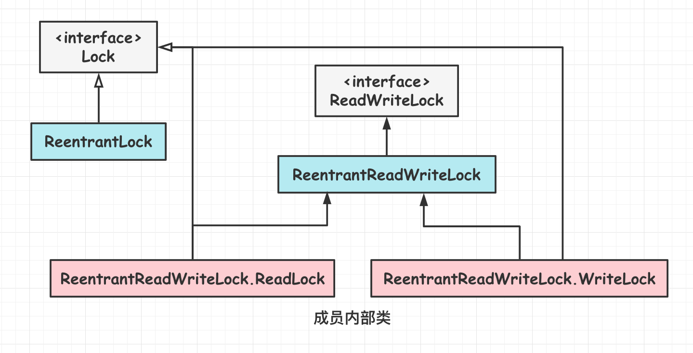
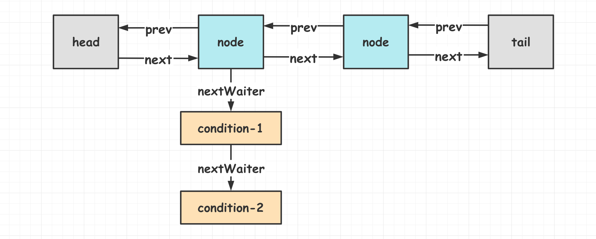
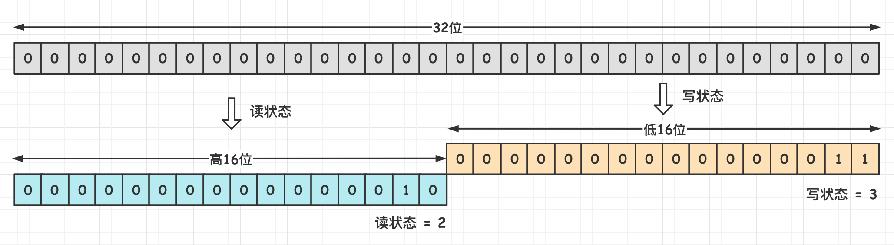
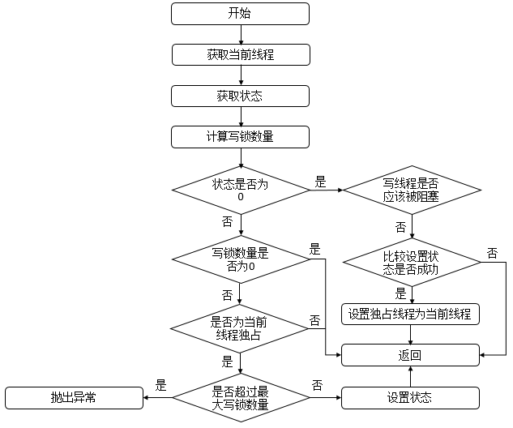
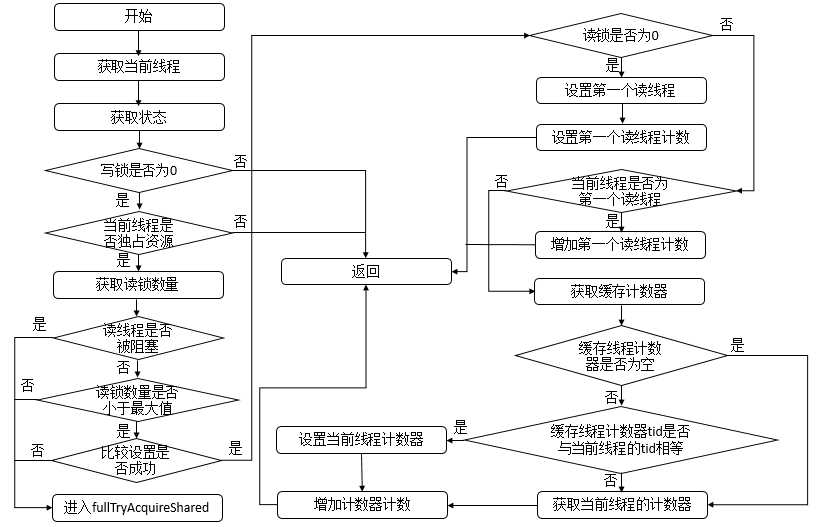
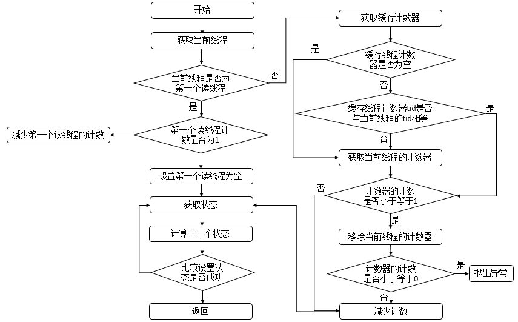

[TOC]

### 一.显式锁

显式锁是基于 **API** 的。

#### Lock接口

##### 1.概述

**synchronized** 方法或语句的使用提供了对与每个**对象**相关的隐式监视器锁的访问，但却强制所有锁获取和释放均要出现在一个块结构中：当获取了**多个锁**时，它们必须以**相反的顺序释放**，且必须在与所有锁被获取时相同的词法范围内释放所有锁。

这个时候出现了 Lock 接口。它是 java.util.concurrent.**locks** 包中的一个**接口**。Lock 实现提供了比使用 synchronized 方法和语句可获得的更广泛的锁定操作，更**灵活**的操作，可以具有差别很大的属性，可以支持多个相关的 Condition 对象。当然更高的自由度也带来更多的责任。

在 **try...catch 模块**之前使用 **lock** 加锁(阿里规范)，在 **finally** 模块中**释放锁**(保证锁必须释放)。下面是示范代码。

```java
Lock myLock = ...; 
myLock.lock();
try {
    // access the resource protected by this lock
} finally {
    myLock.unlock();
}
```

锁的锁定和释放如果在**不同的模块**时，需要谨慎编码，确保最后锁一定能够得到**释放**。

##### 2.源码分析

Lock 接口源码如下。

```java
// 获取锁。如果锁不可用，出于线程调度目的，将禁用当前线程，并且在获得锁之前，该线程将一直处于休眠状态
void lock();

// 如果当前线程未被中断，则获取锁
void lockInterruptibly();

// 返回绑定到此Lock实例的新Condition实例
Condition newCondition();

// 仅在调用时锁为空闲状态才获取该锁。如果锁可用，则获取锁，并立即返回值true。如果锁不可用，则此方法将立即返回值false
boolean tryLock();

// 如果锁在给定的等待时间内空闲，并且当前线程未被中断，则获取锁
boolean	tryLock(long time, TimeUnit unit); 

// 释放锁。在等待条件前，锁必须由当前线程保持。调用Condition.await()将在等待前以原子方式释放锁，并在等待返回前重新获取锁
void unlock(); 
```

Lock 接口有三个**实现类**分别是 ==**ReentrantLock**, **ReentrantReadWriteLock.ReadLock, ReentrantReadWriteLock.WriteLock**==。后面两个是**内部类**。**ReentrantReadWriteLock** 实现了 **ReadWriteLock** 接口，同时其内部有两个内部类实现了 Lock 接口。如下图所示。



#### ReentrantLock

##### 1.概述

JDK 中**独占锁**的实现除了使用关键字 synchronized 外，还可以使用 **ReentrantLock**。虽然在性能上 ReentrantLock 和 synchronized 区别已经不大了，但 ReentrantLock 相比 synchronized 而言功能更加**丰富**，使用起来更为灵活，也更适合复杂的并发场景。ReentrantLock 是**独占锁**，资源仅允许一个线程使用。

**ReentrantLock** 是 JUC 包中的基于 AQS 实现的一个**可重入的互斥锁**。**ReentrantLock **和 **synchronized** 在基本用法，行为语义上都是类似的，同样都具有可重入性。只不过相比原生的 Synchronized，ReentrantLock 增加了一些**高级的扩展功能**，比如它可以实现**公平锁，**同时可以绑定**多个 Conditon**。

使用 **tryLock()** 可以**避免死锁**。它会在持有一个锁 A 获取另一个锁 B 而获取不到 B 的时候，可以释放已持有的锁 A, 给其他线程获取锁 A 的机会，然后**重试**获取所有锁。

```java
public class LockExample {
	// 定义锁
    private Lock lock = new ReentrantLock();

    public void func() {
        lock.lock();	// 加锁
        try {
            for (int i = 0; i < 10; i++) {
                System.out.print(i + " ");
            }
        } finally {
            lock.unlock(); // 确保释放锁，从而避免发生死锁
        }
    }
}
```

```java
public static void main(String[] args) {
    LockExample lockExample = new LockExample();
    ExecutorService executorService = Executors.newCachedThreadPool();
    // 加锁效果与synchronized类似
    executorService.execute(() -> lockExample.func());
    executorService.execute(() -> lockExample.func());
}
```

```html
0 1 2 3 4 5 6 7 8 9 0 1 2 3 4 5 6 7 8 9
```

###### (1)可重入性

所谓的**可重入性**，就是**可以支持一个线程对锁的重复获取**，原生的 synchronized 就具有可重入性，一个用 synchronized 修饰的递归方法，当线程在执行期间，它是可以**反复**获取到锁的，而不会出现自己把自己锁死的情况。ReentrantLock 也是如此，在调用 lock() 方法时，已经获取到锁的线程，能够**再次调用** lock() 方法获取锁而不被阻塞。那么有可重入锁，就有不可重入锁，之前自定义的一个 Mutex 锁就是个不可重入锁，不过使用场景极少而已。

###### (2)公平锁/非公平锁

所谓公平锁，顾名思义指**锁的获取策略相对公平**，当多个线程在获取同一个锁时，**必须按照锁的申请时间**来依次获得锁，依次排队，不能插队；非公平锁则不同，当锁被释放时，等待中的线程**均有机会**获得锁。synchronized 是**非公平锁**，ReentrantLock **默认也是非公平**的，但是可以通过带 boolean 参数(**fair** 参数)的构造方法**指定使用公平锁**，但**非公平锁的性能一般要优于公平锁**。

##### 2.源码解析

接下来从源码角度来看看 ReentrantLock 的实现原理，它是如何保证**可重入性**，又是如何实现**公平锁**的。

ReentrantLock 是基于 **AQS** 的，AQS 是 JUC 中众多同步组件的构建基础，它通过一个 **int 类型的状态变量 state** 和**一个 FIFO 队列**来完成共享资源的获取，线程的排队等待等。AQS 是个底层框架，采用**模板方法**模式，它定义了通用的较为复杂的逻辑骨架，比如**线程的排队，阻塞，唤醒**等，将这些复杂但实质通用的部分抽取出来，这些都是需要构建同步组件的使用者无需关心的，使用者仅需重写一些简单的指定的方法即可(**其实就是对于共享变量 state 的一些简单的获取释放的操作**)。

###### (1)构造方法

构造方法如下。

```java
// 内部实例
private final Sync sync;

// 无参构造器默认为非公平锁
public ReentrantLock() {
    sync = new NonfairSync();
}

// fair为true，公平锁；反之，非公平锁
public ReentrantLock(boolean fair) {
    // 根据fair参数决定初始化哪个同步组件
    sync = fair ? new FairSync() : new NonfairSync();
}
```

ReentrantLock 的抽象静态内部类 **Sync** 继承了 **AQS**，分为**公平**锁 **FairSync** 和**非公平**锁 **NonfairSync**。此处可以指定是否采用公平锁，**FailSync 和 NonFailSync 亦为 Reentrantlock 的静态内部类，都继承于 Sync**。

- 公平锁：线程获取锁的顺序和调用 lock 的顺序一样，**FIFO**。
- 非公平锁：线程获取锁的顺序和调用 lock 的**顺序无关**。

**ReentrantLock** 默认使用**非公平锁**是基于**性能**考虑，公平锁为了保证线程规规矩矩地排队，需要增加阻塞和唤醒的时间开销。如果直接插队获取非公平锁，跳过了对队列的处理，速度会更快。

几个静态内部类的关系如下图所示。


Sync 是 ReentrantLock 内部实现的一个**同步组件**，它是 Reentrantlock 的一个静态内部类，**继承于 AQS**。源码如下。

```java
abstract static class Sync extends AbstractQueuedSynchronizer {
    private static final long serialVersionUID = -5179523762034025860L;
    // 抽象方法
    abstract void lock();
    // 尝试获取非公平锁
    final boolean nonfairTryAcquire(int acquires) {
        final Thread current = Thread.currentThread();
        int c = getState();
        if (c == 0) {
            if (compareAndSetState(0, acquires)) {
                setExclusiveOwnerThread(current);
                return true;
            }
        } else if (current == getExclusiveOwnerThread()) {
            int nextc = c + acquires;
            if (nextc < 0) // overflow
                throw new Error("Maximum lock count exceeded");
            setState(nextc);
            return true;
        }
        return false;
    }
    // 尝试释放锁
    protected final boolean tryRelease(int releases) {
        int c = getState() - releases;
        if (Thread.currentThread() != getExclusiveOwnerThread())
            throw new IllegalMonitorStateException();
        boolean free = false;
        if (c == 0) {
            free = true;
            setExclusiveOwnerThread(null);
        }
        setState(c);
        return free;
    }

    protected final boolean isHeldExclusively() {
        // While we must in general read state before owner,
        // we don't need to do so to check if current thread is owner
        return getExclusiveOwnerThread() == Thread.currentThread();
    }

    final ConditionObject newCondition() {
        return new ConditionObject();
    }

    // Methods relayed from outer class
    final Thread getOwner() {
        return getState() == 0 ? null : getExclusiveOwnerThread();
    }

    final int getHoldCount() {
        return isHeldExclusively() ? getState() : 0;
    }

    final boolean isLocked() {
        return getState() != 0;
    }

    /**
     * Reconstitutes the instance from a stream (that is, deserializes it).
     */
    private void readObject(java.io.ObjectInputStream s)
        throws java.io.IOException, ClassNotFoundException {
        s.defaultReadObject();
        setState(0); // reset to unlocked state
    }
}
```

公平锁 **FairSync** 类如下，是实现**公平锁**的 Sync 对象。

```java
static final class FairSync extends Sync {
    private static final long serialVersionUID = -3000897897090466540L;
	
    // 默认acquire1
    final void lock() {
        acquire(1);
    }

    /**
     * Fair version of tryAcquire.  Don't grant access unless
     * recursive call or no waiters or is first.
     */
    protected final boolean tryAcquire(int acquires) {
        final Thread current = Thread.currentThread();
        int c = getState();
        if (c == 0) {
            if (!hasQueuedPredecessors() &&
                compareAndSetState(0, acquires)) {
                setExclusiveOwnerThread(current);
                return true;
            }
        }
        else if (current == getExclusiveOwnerThread()) {
            int nextc = c + acquires;
            if (nextc < 0)
                throw new Error("Maximum lock count exceeded");
            setState(nextc);
            return true;
        }
        return false;
    }
}
```

非公平锁 **NonfairSync** 源码如下。

```java
static final class NonfairSync extends Sync {
    private static final long serialVersionUID = 7316153563782823691L;

    /**
     * Performs lock. Try immediate barge, backing up to normal
     * acquire on failure.
     */
    final void lock() {
        if (compareAndSetState(0, 1))
            setExclusiveOwnerThread(Thread.currentThread());
        else
            acquire(1);
    }

    protected final boolean tryAcquire(int acquires) {
        return nonfairTryAcquire(acquires);
    }
}
```

###### (2)基本方法

**lock()**

```java
public void lock() {
    sync.lock();// 代理到Sync的lock方法上
}
```

Sync 的 lock 方法是**抽象**的，实际的 lock 会**代理到 FairSync 或是 NonFairSync 上**(根据用户的选择来决定，公平锁还是非公平锁)。

**lockInterruptibly()**

```java
public void lockInterruptibly() throws InterruptedException {
    // 代理到sync的相应方法上，同lock方法的区别是此方法响应中断
    sync.acquireInterruptibly(1);
}
```

此方法**响应中断**，当线程在阻塞中的时候，若被中断，会抛出 InterruptedException 异常 。

**tryLock()**

```java
public boolean tryLock() {
    return sync.nonfairTryAcquire(1);// 代理到sync的相应方法上
}
```

tryLock，尝试获取锁，成功则直接返回 true，不成功也不耽搁时间，立即返回 false。

**unlock()**

```java
public void unlock() {
    sync.release(1);// 释放锁
}
```

释放锁，调用 syn c的 **release** 方法，其实是 AQS 的 release 逻辑。

**newCondition()**

获取一个 **conditon**，ReentrantLock 支持多个 Condition。

```java
public Condition newCondition() {
    return sync.newCondition();
}
```

从上面这写方法的能大概梳理出 ReentrantLock 的处理逻辑，其内部定义了三个重要的静态内部类：**Sync，NonFairSync，FairSync**。Sync 作为 ReentrantLock 中公用的同步组件，继承了 AQS(要利用 AQS 复杂的顶层逻辑，线程排队，阻塞，唤醒等等)；NonFairSync 和 FairSync 则都**继承 Sync**，调用 Sync 的**公用逻辑**，然后再在各自内部完成自己特定的逻辑(公平或非公平)。

所以接下来关于如何实现重入性，如何实现公平性，就得去看这几个静态内部类了。

###### (3)非公平可重入锁

首先看看静态内部类 **NonFairSync(非公平可重入锁)**的实现。NonFairSync 和 FairSync 则都继承 Sync。

```java
static final class NonfairSync extends Sync {  // 继承Sync
    private static final long serialVersionUID = 7316153563782823691L;
    /** 获取锁 */
    final void lock() {
        if (compareAndSetState(0, 1)) // CAS设置state状态，若原值是0，将其置为1
            setExclusiveOwnerThread(Thread.currentThread());//将当前线程标记为已持有锁
        else
            acquire(1);// 若设置失败，调用AQS的acquire方法，acquire又会调用我们下面重写的tryAcquire方法。这里说的调用失败有两种情况：1当前没有线程获取到资源，state为0，但是将state由0设置为1的时候，其他线程抢占资源，将state修改了，导致了CAS失败；2 state原本就不为0，也就是已经有线程获取到资源了，有可能是别的线程获取到资源，也有可能是当前线程获取的，这时线程又重复去获取，所以去tryAcquire中的nonfairTryAcquire我们应该就能看到可重入的实现逻辑了。
    }
    protected final boolean tryAcquire(int acquires) {
        return nonfairTryAcquire(acquires);// 调用Sync中的方法
    }
}
```

**nonfairTryAcquire()** 方法如下。

```java
final boolean nonfairTryAcquire(int acquires) {
    final Thread current = Thread.currentThread();// 获取当前线程
    int c = getState();// 获取当前state值
    if (c == 0) {// 若state为0，意味着没有线程获取到资源，CAS将state设置为1，并将当前线程标记我获取到排他锁的线程，返回true
        if (compareAndSetState(0, acquires)) {
            setExclusiveOwnerThread(current);
            return true;
        }
    }
    // 若state不为0，但是持有锁的线程是当前线程
    else if (current == getExclusiveOwnerThread()) {
        // state累加1
        int nextc = c + acquires;
        // int类型溢出了
        if (nextc < 0) 
            throw new Error("Maximum lock count exceeded");
        // 设置state，此时state大于1，代表着一个线程多次获锁，state的值即是线程重入的次数
        setState(nextc);
        // 返回true，获取锁成功
        return true;
    }
    // 获取锁失败了
    return false;
}
```

简单总结下流程：

**1. 先获取 state 值，若为 0，意味着此时没有线程获取到资源，CAS 将其设置为 1，设置成功则代表获取到排他锁了。**

**2. 若 state 大于 0，肯定有线程已经抢占到资源了，此时再去判断是否就是自己抢占的，是的话，state 累加，返回 true，重入成功，state 的值即是线程重入的次数**。

**3. 其他情况，则获取锁失败**。

###### (4)公平锁

**FairSync** 就是公平锁的实现。**lock** 方法很简单的一句话调用 AQS 的 **acquire** 方法。

###### (5)公平锁的实现

尝试**获取锁**，先来看**公平锁**的实现，**lock** 方法很简单的一句话调用 **AQS** 的 **acquire** 方法。

```java
final void lock() { acquire(1);}

public final void acquire(int arg) {
    if (!tryAcquire(arg) &&
        acquireQueued(addWaiter(Node.EXCLUSIVE), arg))
        selfInterrupt();
}
```

```java
protected boolean tryAcquire(int arg) {    
        throw new UnsupportedOperationException();
}
```

**AQS** 的 tryAcquire **未做具体实现**，因为是否获取锁成功是由**子类决定**的，我们直接来看 AQS 的子类 ReentrantLock 中 **tryAcquire** 的实现。

```java
static final class FairSync extends Sync {
    private static final long serialVersionUID = -3000897897090466540L;

    final void lock() {
        acquire(1);// 直接调用AQS的模板方法acquire，acquire会调用下面我们重写的这个tryAcquire
    }

    protected final boolean tryAcquire(int acquires) {
        final Thread current = Thread.currentThread();// 获取当前线程
        int c = getState();// 获取state值
        if (c == 0) {// 若state为0，意味着当前没有线程获取到资源，那就可以直接获取资源了吗？NO!这不就跟之前的非公平锁的逻辑一样了嘛。看下面的逻辑
            if (!hasQueuedPredecessors() &&// 判断在时间顺序上，是否有申请锁排在自己之前的线程，若没有，才能去获取，CAS设置state，并标记当前线程为持有排他锁的线程；反之，不能获取！这即是公平的处理方式。
                compareAndSetState(0, acquires)) {
                setExclusiveOwnerThread(current);
                return true;
            }
        }
        // 重入的处理逻辑，与上文一致，不再赘述
        else if (current == getExclusiveOwnerThread()) {
            int nextc = c + acquires;
            if (nextc < 0)
                throw new Error("Maximum lock count exceeded");
            setState(nextc);
            return true;
        }
        return false;
    }
}
```

**获取锁成功**分为两种情况，第一个 if 判断 AQS 的 state 是否等于 0，表示锁**没有人占有**。接着，hasQueuedPredecessors 判断队列是否有排在前面的线程**在等待锁**，没有的话调用 compareAndSetState 使用 CAS 的方式修改 state，传入的 acquires 写死是1。最后线程获取锁成功，setExclusiveOwnerThread 将线程记录为独占锁的线程。

第二个 if 判断当前线程是否为**独占锁**的线程，因为 ReentrantLock 是**可重入**的，线程可以不停地 lock 来增加  state 的值，对应地需要 unlock 来解锁，直到 state 为零。

**可以看到，公平锁的大致逻辑与非公平锁是一致的，不同的地方在于有了 !hasQueuedPredecessors() 这个判断逻辑，即便 state 为 0，也不能贸然直接去获取，要先去看有没有还在排队的线程，若没有，才能尝试去获取，做后面的处理。反之，返回 false，获取失败。看看这个判断是否有排队中线程的逻辑**。如果最后获取锁失败，下一步需要将线程加入到等待队列。

看看这个判断**是否有排队线程**的逻辑。

```java
public final boolean hasQueuedPredecessors() {
    Node t = tail; // 尾结点
    Node h = head; // 头结点
    Node s;
    // 判断是否有排在自己之前的线程
    return h != t && ((s = h.next) == null || s.thread != Thread.currentThread());
}
```

需要注意的是，这个判断是否有排在自己之前的线程的逻辑稍微有些绕，由代码得知，有两种情况会返回 true，将此逻辑分解一下(注意：返回 true 意味着有其他线程申请锁比自己早，需要放弃抢占)

**1. h != t && (s = h.next) == null**，这个逻辑成立的一种可能是 head 指向头结点，tail 此时还为 null。考虑这种情况：当其他某个线程去获取锁失败，需构造一个结点加入同步队列中(假设此时同步队列为空)，在添加的时候，需要先创建一个无意义傀儡头结点(在 AQS 的 enq 方法中，这是个自旋 CAS 操作)，有可能在将 head 指向此傀儡结点完毕之后，还未将 tail 指向此结点。很明显，此线程时间上优于当前线程，所以，返回 true，表示有等待中的线程且比自己来的还早。

**2. h != t && (s = h.next) != null && s.thread != Thread.currentThread()**。同步队列中已经有若干排队线程且当前线程不是队列的老二结点，此种情况会返 回true。假如没有 s.thread !=Thread.currentThread() 这个判断的话，会怎么样呢？若当前线程已经在同步队列中是老二结点(头结点此时是个无意义的傀儡结点),此时持有锁的线程释放了资源，唤醒老二结点线程，老二结点线程重新 tryAcquire(此逻辑在 AQS 中的 acquireQueued 方法中)，又会调用到 hasQueuedPredecessors，不加 s.thread !=Thread.currentThread() 这个判断的话，返回值就为 true，导致 tryAcquire 失败。

最后来看看 ReentrantLock 的 tryRelease，定义在 **Sync** 中

```java
protected final boolean tryRelease(int releases) {
    int c = getState() - releases;// 减去1个资源
    if (Thread.currentThread() != getExclusiveOwnerThread())
        throw new IllegalMonitorStateException();
    boolean free = false;
    // 若state值为0，表示当前线程已完全释放干净，返回true，上层的AQS会意识到资源已空出。若不为0，则表示线程还占有资源，只不过将此次重入的资源的释放了而已，返回false。
    if (c == 0) {
        free = true;
        setExclusiveOwnerThread(null);
    }
    setState(c);
    return free;
}
```

小结：ReentrantLock 是一种可重入的，可实现公平性的互斥锁，它的设计基于 AQS 框架，可重入和公平性的实现逻辑都不难理解，每**重入一次，state 就加 1**，当然在释放的时候，也得一层一层释放。至于公平性，在尝试获取锁的时候多了一个判断：**是否有比自己申请早的线程在同步队列中等待，若有，去等待；若没有，才允许去抢占**。**公平锁会关注队列里排队的情况，老老实实按照 FIFO 的次序；非公平锁只要有机会就抢占，才不管排队的事。**

Node 节点形成这样的结构:


nextWaiter 用于组成 **Condition 等待队列**。众所周知，**Condition 只能用在已经获得锁的情况下**，所以 Condition 等待队列不同于锁队列，Condition 队列结构如下图：



#### Condition

##### 1.概述

Condition 是在 Java5 中才出现的，它用来**替代**传统的 **Object 类** 的 **wait**()、**notify**() 实现线程间的**协作**，相比使用 Object 的 wait()、notify()，使用 Condition 的 **await**()、**signal**() 这种方式实现线程间协作更加安全和高效。因此通常来说比较推荐使用 Condition。

Condition 类能实现 synchronized 和 wait、notify 搭配的功能，且比后者更灵活，Condition 可以实现**多路通知**功能，也就是在**一个 Lock 对象**里可以创建**多个 Condition**(即对象监视器)**实例**，线程对象可以注册在指定的 Condition 中，从而**可以有选择的进行线程通知，在调度线程上更加灵活**。而 synchronized 就相当于整个 Lock 对象中只有**一个单一**的 Condition 对象，所有的线程都注册在这个对象上。线程开始 notifyAll 时，需要通知所有的 WAITING 线程，没有选择权，会有相当大的效率问题。

Condition 对象是由 **lock 对象**所创建的，且同一个锁可以**创建多个 Condition** 的对象，即创建**多个对象监视器**，这样的好处就是可以**指定唤醒线程**，而 notify 唤醒的线程是随机唤醒一个。

1、Condition 是个**接口**，基本的方法就是 **await**() 和 **signal**() 方法。

2、Condition **依赖于 Lock 接口**，生成一个 Condition 的基本代码是 **lock.newCondition()**。 

```java
// 获取锁对象
private Lock lock = new ReentrantLock();
// 通过锁对象获取多个Condition对象
public Condition conditionA = lock.newCondition();
public Condition conditionB = lock.newCondition();
```

3、调用 Condition 的 **await**() 和 **signal**() 方法，都必须在 **lock 保护之内**，就是说**必须**在 lock.**lock**() 和 lock.**unlock**() **之间**才可以使用。

4、**Conditon 中的 await() 对应 Object 的 wait()，Condition 中的 signal() 对应 Object 的 notify()，Condition 中的 signalAll() 对应 Object 的 notifyAll()。**

对于**等待/通知**机制，简化而言，就是等待一个条件，当条件不满足时，就进入**等待**，等条件满足时，就通知等待的线程开始执行。为了实现这种功能，需要进行 wait 的代码部分与需要进行通知的代码部分必须放在**同一个对象监视器**里面。执行才能实现多个阻塞的线程同步执行代码，等待与通知的线程也是同步进行。对于 wait/notify 而言，对象监视器与等待条件结合在一起 即 "synchronized(对象)" 利用该对象去调用 wait 以及 notify。但是对于 Condition 类，是对象监视器与条件分开，Lock 类来实现**对象监视器**，condition 对象来**负责条件**，去调用 await 以及 signal。

##### 2.源码解析

Condition 接口源码如下。

```java
public interface Condition {
    
    void await() throws InterruptedException;
 
    void awaitUninterruptibly();

    long awaitNanos(long nanosTimeout) throws InterruptedException;
   
    boolean await(long time, TimeUnit unit) throws InterruptedException;

    boolean awaitUntil(Date deadline) throws InterruptedException;

    void signal();
    
    void signalAll();
}
```

主要就是 **await 和 signal** 方法。下面看看源码，先获取锁再获取 Condition。

```java
ReentrantLock reentrantLock = new ReentrantLock();
Condition a = reentrantLock.newCondition();
```

ReentrantLock 的 newCondition() 方法如下。

```java
public Condition newCondition() {
    return sync.newCondition();
}
```

可见调用的是内部静态类 **Sync 的 newCondition** 方法。可见是直接返回了一个 **ConditionObject** 对象。**ConditionObject** **实现了 Condition 接口**，是 AbstractQueuedSynchronizer 的内部类(具体接口方法参考 AQS 源码)。Reentrantlock 的 newCondition 方法返回与某个 lock 实例相关联的 Condition 对象。

```java
final ConditionObject newCondition() {
    return new ConditionObject();
}
```

##### 3.demo

###### (1)官方demo

下面的代码出自 Condition 接口源码。

```java
public class BoundedBuffer {
    // 获得锁
    final Lock lock = new ReentrantLock();
    // 使用锁获得两个Condition
    final Condition notFull  = lock.newCondition(); 
    final Condition notEmpty = lock.newCondition(); 

    final Object[] items = new Object[100];
    int putptr, takeptr, count;

    public void put(Object x) throws InterruptedException {
        // 加锁
        lock.lock();
        try {
            // 当计数器为100时wait
            while (count == items.length) {
                // notFull等待
                notFull.await();
            }
            // 将数据放入数组中
            items[putptr] = x;
            if (++putptr == items.length) putptr = 0;
            // 直到计数器为100
            ++count;
            // 唤醒notEmpty条件
            notEmpty.signal();
        } finally {
            lock.unlock();
        }
    }

    public Object take() throws InterruptedException {

        lock.lock();
        try {
            while (count == 0) {
                notEmpty.await();
            }
            // 消费数据
            Object x = items[takeptr];
            if (++takeptr == items.length) takeptr = 0;
            // 直到计数器为0
            --count;
            // 唤醒notFull条件
            notFull.signal();
            return x;
        } finally {
            lock.unlock();
        }
    }
}
```

###### (2)两个Condition

**接下来，使用 Condition 来实现等待/唤醒，并且能够唤醒制定线程。**

先写业务代码：

```java
import java.util.concurrent.locks.Condition;
import java.util.concurrent.locks.ReentrantLock;

public class MyService {
    
    // 实例化一个ReentrantLock对象
    private ReentrantLock lock = new ReentrantLock();
    // 为线程A注册一个ConditionA
    public Condition conditionA = lock.newCondition();
    // 为线程B注册一个ConditionB
    public Condition conditionB = lock.newCondition();

    public void awaitA() {
        try {
            lock.lock();
            System.out.println(Thread.currentThread().getName() + "进入了awaitA方法");
            long timeBefore = System.currentTimeMillis();
            // 执行conditionA等待
            conditionA.await();
            long timeAfter = System.currentTimeMillis();
            System.out.println(Thread.currentThread().getName()+"被唤醒");
            System.out.println(Thread.currentThread().getName() + "等待了: " + (timeAfter - timeBefore)/1000+"s");
        } catch (InterruptedException e) {
            e.printStackTrace();
        } finally {
            lock.unlock();
        }
    }

    public void awaitB() {
        try {
            lock.lock();
            System.out.println(Thread.currentThread().getName() + "进入了awaitB方法");
            long timeBefore = System.currentTimeMillis();
            // 执行conditionB等待
            conditionB.await();
            long timeAfter = System.currentTimeMillis();
            System.out.println(Thread.currentThread().getName() + "被唤醒");
            System.out.println(Thread.currentThread().getName() + "等待了: " + (timeAfter - timeBefore)/1000 + "s");
        } catch (InterruptedException e) {
            e.printStackTrace();
        } finally {
            lock.unlock();
        }
    }

    public void signallA() {
        try {
            lock.lock();
            System.out.println("启动唤醒程序");
            // 唤醒所有注册conditionA的线程
            conditionA.signalAll();
        } finally {
            lock.unlock();
        }
    }
    
    public void signallB() {
        try {
            lock.lock();
            System.out.println("启动唤醒程序");
            // 唤醒所有注册conditionB的线程
            conditionB.signalAll();
        } finally {
            lock.unlock();
        }
    }
}
```

分别实例化了**两个** Condition 对象，都是使用**同一个 lock 注册**。注意 **conditionA 对象的等待和唤醒只对使用了conditionA 的线程有用**，同理 conditionB 对象的等待和唤醒只对**使用了** conditionB 的线程有用。对比 Object 的 notifyAll 方法则是**全部唤醒**。这里 Condition 还是有优势的。

继续写两个线程的代码：

```java
public class MyServiceThread1 implements Runnable{

    private MyService service;

    public MyServiceThread1(MyService service) {
        this.service = service;
    }

    @Override
    public void run() {
        service.awaitA();
    }
}
```

注意：MyServiceThread1 使用了 **awaitA**() 方法，**持有**的是 **conditionA**！

```java
public class MyServiceThread2 implements Runnable{

    private MyService service;

    public MyServiceThread2(MyService service) {
        this.service = service;
    }

    @Override
    public void run() {
        service.awaitB();
    }
}
```

注意：MyServiceThread2 使用了 **awaitB**() 方法，**持有**的是 **conditionB**！

最后看启动类：

```java
public static void main(String[] args) throws InterruptedException {
    MyService service = new MyService();
    Runnable runnable1 = new MyServiceThread1(service);
    Runnable runnable2 = new MyServiceThread2(service);

    new Thread(runnable1, "a").start();
    new Thread(runnable2, "b").start();

    // 线程sleep2秒钟
    Thread.sleep(2000);
    // 唤醒所有持有conditionA的线程
    service.signallA();

    Thread.sleep(2000);
    // 唤醒所有持有conditionB的线程
    service.sgnallB();
}
```

执行 ApplicationCondition，来看控制台输出结果：

```
a进入了awaitA方法
b进入了awaitB方法
启动唤醒程序
a被唤醒
a等待了: 2s
启动唤醒程序
b被唤醒
b等待了: 4s
```

a 和 b 都进入各自的 await() 方法。首先执行的是

```java
Thread.sleep(2000);
// 唤醒所有持有conditionA的线程
service.signallA();
```

使用 conditionA 的线程被**唤醒**，而后再唤醒使用 conditionB 的线程。学会使用 Condition，那来用它实现生产者消费者模式。

#### Synchronized与ReentrantLock比较

##### 1.使用选择

除非需要使用 ReentrantLock 的高级功能，否则**优先使用 synchronized**。这是因为 synchronized 是 JVM 实现的一种锁机制，JVM 原生地支持它，而 ReentrantLock 不是所有的 JDK 版本都支持。并且使用 synchronized 不用担心没有释放锁而导致死锁问题，因为 JVM 会**确保锁的释放**。性能已经不是选择的依据了。

##### 2.特点对比

###### (1)**锁的实现**

synchronized 是 **JVM** 实现的，而 ReentrantLock 是 **JDK** 实现的。

synchronized 是 Java 原生的**互斥同步锁**，使用方便，对于 synchronized 修饰的方法或同步块，无需再显式释放锁。synchronized 底层是通过 monitorenter 和 monitorexit 两个字节码指令来实现加锁解锁操作的。

而 ReentrantLock 做为 **API** 层面的互斥锁(也就是在 API 层面需要 lock() 和 unlock() 方法配合 try/finally 语句块来完成)，需要**显式地去加锁解锁**。ReentrantLock 实现 JUC 下面的 **AQS** 实现，需要显式的加锁与解锁。

###### (2)性能

新版本 Java 对 synchronized 进行了很多**优化**(但是这些优化都是在虚拟机层面实现的，并没有直接暴露)，例如自旋锁等，synchronized 与 ReentrantLock 大致相同。**能用 synchronized 尽量用**。

###### (3)两者都是可重入锁

两者**都是可重入锁**。可重入锁概念是：自己可以再次获取自己的内部锁。比如一个线程获得了某个对象的锁，此时这个对象锁还没有释放，当其再次想要获取这个对象的锁的时候还是可以获取的，如果不可锁重入的话，就会造成死锁。同一个线程每次获取锁，锁的计数器都自增 1，所以要等到锁的计数器下降为 0 时才能释放锁。

###### (4)拓展功能

ReentrantLock 比 synchronized 增加了一些**高级功能**。主要来说主要有三点：**1.等待可中断；2.可实现公平锁；3.可实现选择性通知(锁可以绑定多个条件)**。

- **ReentrantLock 提供了一种能够中断等待锁的线程的机制**，通过 lock.lockInterruptibly() 来实现这个机制。也就是说正在等待的线程可以选择放弃等待，改为处理其他事情。当持有锁的线程长期**不释放锁**的时候，正在等待的线程可以选择放弃等待，改为处理其他事情。ReentrantLock **可中断**，而 synchronized **不行**。
- **ReentrantLock 可以指定是公平锁还是非公平锁。而 synchronized 只能是非公平锁。所谓的公平锁就是先等待的线程先获得锁。** ReentrantLock 默认情况是非公平的，可以通过 ReentrantLock 类的 ReentrantLock(boolean fair) **构造方法**来制定是否是公平的。
- synchronized 关键字与 wait() 和 notify()/notifyAll() 方法相结合可以实现**等待/通知机制**，ReentrantLock 类当然也可以实现，但是需要借助于 **Condition** 接口与 **newCondition**() 方法。Condition 是 JDK1.5 之后才有的，它具有很好的灵活性，比如可以实现多路通知功能也就是在一个 Lock 对象中可以创建**多个 Condition** 实例(即对象监视器)，**线程对象可以注册在指定的 Condition 中，从而可以有选择性的进行线程通知，在调度线程上更加灵活。 在使用 notify()/notifyAll() 方法进行通知时，被通知的线程是由 JVM 选择的，用 ReentrantLock 类结合 Condition 实例可以实现"选择性通知"** ，这个功能非常重要，而且是 Condition 接口默认提供的。而 synchronized 关键字就相当于整个 Lock 对象中只有**一个** Condition 实例，所有的线程都注册在它一个身上。如果执行 notifyAll() 方法的话就会通知所有处于等待状态的线程这样会造成很大的效率问题，而 Condition 实例的 signalAll() 方法 只会唤醒**注册在**该 Condition 实例中的所有等待线程。

### 二.ReentrantReadWriteLock

#### 基础

##### 1.概述

synchronized 和显式锁 ReentrantLock，对于**同一受保护对象**的访问，无论是**读还是写**，都要求获得**==同样的锁==**。一些场景中是不需要的，多个线程的**读**操作完全可以并行，在**读多写少**的场景中，让读操作并行可以明显提高性能。所以使用读写锁 ReentrantReadWriteLock 可以让**读操作并行**，又不影响一致性。

JCU 包中读写锁接口(**ReadWriteLock**) 的重要实现类 **ReentrantReadWriteLock**。主要实现**读共享，写互斥**功能，对比单纯的互斥锁在共享资源使用场景为==**频繁读取及少量修改**==的情况下可以较好的提高性能。**ReentrantReadWriteLock 表示两个锁，一个是读操作相关的锁，称为共享锁；一个是写相关的锁，称为排他锁**。

**只有 "读-读" 操作是可以并行的，"读-写" 和 "写-写" 都不可以**。只有一个线程可以进行写操作，在**获取写锁**时，只有没有任何线程持有任何锁才可以获取到，在持有**写锁**时，其他任何线程都**获取不到任何锁**。在没有其他线程持有写锁的情况下，**多个**线程可以获取和持有**读锁**。

读写锁有以下三个重要的**特性**：

(1)**公平选择性**：支持非公平(默认)和公平的锁获取方式，吞吐量还是非公平优于公平。

(2)**可重入**：ReentrantReadWriteLock 的读锁和写锁都是**可重入**的。

(3)**锁降级**：遵循获取写锁、获取读锁再释放写锁的次序，**写锁能够降级成为读锁**。

AQS 支持两种资源共享方式：**独占式和共享式**，这样方便使用者实现不同类型的**同步组件**，**独占式**如 ReentrantLock，**共享式**如 Semaphore，CountDownLatch，**组合式**的如 ReentrantReadWriteLock。这里的 ReentrantReadWriteLock 就是**同时**实现了独占式和共享式的锁。

##### 2.ReadWriteLock接口

**ReadWriteLock** 接口只定义了两个方法：

```java
public interface ReadWriteLock {
    // 读锁
    Lock readLock();
    // 写锁
    Lock writeLock();
}
```

通过调用相应方法获取读锁或写锁，获取的读锁及写锁都是 **Lock 接口**的实现，可以如同使用 Lock 接口一样使用(其实也有一些特性是不支持的)。

##### 3.基本使用

```java
class RWDictionary {
    private final Map<String, Data> dataMap = new TreeMap<String, Data>();
    // 定义读写锁
    private final ReentrantReadWriteLock rwl = new ReentrantReadWriteLock();
    // 从读写锁获取读锁与写锁
    private final Lock readLock = rwl.readLock();
    private final Lock writeLock = rwl.writeLock();

    // 读方法加读锁
    public Data get(String key) {
        readLock.lock();
        try { return dataMap.get(key); }
        finally { readLock.unlock(); }
    }

    public String[] allKeys() {
        readLock.lock();
        try { return dataMap.keySet().toArray(); }
        finally { readLock.unlock(); }
    }

    // 写方法加写锁
    public Data put(String key, Data value) {
        writeLock.lock();
        try { return dataMap.put(key, value); }
        finally { writeLock.unlock(); }
    }

    // 清空加写锁
    public void clear() {
        writeLock.lock();
        try { dataMap.clear(); }
        finally { writeLock.unlock(); }
    }
}
```

与普通重入锁使用的主要区别在于需要**使用==不同==的锁对象引用读写锁**，并且在读写时分别调用对应的锁。

#### 源码解析

整体结构

```java
public class ReentrantReadWriteLock implements ReadWriteLock, java.io.Serializable {
    /**读锁*/
    private final ReentrantReadWriteLock.ReadLock readerLock;

    /**写锁*/
    private final ReentrantReadWriteLock.WriteLock writerLock;

    final Sync sync;

    /**使用默认(非公平)的排序属性创建一个新的 ReentrantReadWriteLock */
    public ReentrantReadWriteLock() {
        this(false);
    }

    /**使用给定的公平策略创建一个新的 ReentrantReadWriteLock*/
    public ReentrantReadWriteLock(boolean fair) {
        // 根据参数选择sync的公平与非公平实现
        sync = fair ? new FairSync() : new NonfairSync();
        readerLock = new ReadLock(this);
        writerLock = new WriteLock(this);
    }

    /**返回用于写入操作的锁*/
    public ReentrantReadWriteLock.WriteLock writeLock() { return writerLock; }

    /**返回用于读取操作的锁*/
    public ReentrantReadWriteLock.ReadLock readLock()  { return readerLock; }

    // 这三个静态内部类在ReentrantLock中也有
    abstract static class Sync extends AbstractQueuedSynchronizer {}
    static final class NonfairSync extends Sync {}
    static final class FairSync extends Sync {}
	// 读写锁静态内部类
    public static class ReadLock implements Lock, java.io.Serializable {}
    public static class WriteLock implements Lock, java.io.Serializable {}
}
```

##### 1.类继承关系

```java
public class ReentrantReadWriteLock implements ReadWriteLock, java.io.Serializable {}
```

ReentrantReadWriteLock 实现了 **ReadWriteLock** 接口，ReadWriteLock 接口定义了获取**读锁和写锁的规范**，具体需要实现类去实现；同时其还实现了 Serializable 接口，表示可以进行序列化，在源码中可以看到 ReentrantReadWriteLock 实现了自己的序列化逻辑。

##### 2.内部类

ReentrantReadWriteLock 有**五个内部类**，五个内部类之间也是相互关联的。内部类的关系如下图所示。


说明：如上图所示，Sync 继承自 AQS、NonfairSync(非公平锁)继承自 Sync 类、FairSync(公平锁)继承自 Sync 类(通过构造函数传入的布尔值决定要**构造哪一种 Sync 实例**)；ReadLock 实现了 **Lock** 接口、WriteLock 也实现了 **Lock** 接口。

###### (1)Sync类

类的继承关系: 

```java
abstract static class Sync extends AbstractQueuedSynchronizer {}
```

说明：Sync 抽象类继承自 **AQS** 抽象类，Sync 类提供了对 ReentrantReadWriteLock 的支持。

Sync 类内部存在两个内部类，分别为 HoldCounter 和 **ThreadLocalHoldCounter**，其中 HoldCounter 主要与**读锁配套**使用，其中，HoldCounter 源码如下。**HoldCounter** 的作用就是**保存当前线程持有共享锁的数量**，这个数量必须要与线程绑定在一起，否则操作其他线程锁就会抛出异常。

```java
// 计数器
static final class HoldCounter {
    // 计数
    int count = 0;
    // Use id, not reference, to avoid garbage retention
    // 获取当前线程的TID属性的值
    final long tid = getThreadId(Thread.currentThread());
}
```

说明：HoldCounter 主要有两个属性，count 和 tid，其中 count 表示某个**读线程重入的次数**，tid 表示该线程的 tid 字段的值，该字段可以用来**唯一标识一个线程**。ThreadLocalHoldCounter 的源码如下：

```java
// 本地线程计数器
static final class ThreadLocalHoldCounter
    extends ThreadLocal<HoldCounter> {
    // 重写初始化方法，在没有进行set的情况下，获取的都是该HoldCounter值
    public HoldCounter initialValue() {
        return new HoldCounter();
    }
}
```

说明：ThreadLocalHoldCounter 重写了 **ThreadLocal** 的 **initialValue** 方法，ThreadLocal 类可以将**线程与对象**相关联。在没有进行 set 的情况下，get 到的均是 initialValue 方法里面生成的那个 **HolderCounter** 对象。

由于读锁是可以多个线程共享的，每个线程拥有自己的副本，用来保存自己的**重入数**。

Sync 类的属性如下：

```java
abstract static class Sync extends AbstractQueuedSynchronizer {
    // 版本序列号
    private static final long serialVersionUID = 6317671515068378041L;        
    // 高16位为读锁，低16位为写锁
    static final int SHARED_SHIFT   = 16;
    // 读锁单位
    static final int SHARED_UNIT    = (1 << SHARED_SHIFT);
    // 读锁最大数量
    static final int MAX_COUNT      = (1 << SHARED_SHIFT) - 1;
    // 写锁最大数量
    static final int EXCLUSIVE_MASK = (1 << SHARED_SHIFT) - 1;
    // 本地线程计数器
    private transient ThreadLocalHoldCounter readHolds;
    // 缓存的计数器
    private transient HoldCounter cachedHoldCounter;
    // 第一个读线程
    private transient Thread firstReader = null;
    // 第一个读线程的计数
    private transient int firstReaderHoldCount;
}
```

说明：该属性中包括了读锁、写锁线程的**最大量**。**本地线程计数器**等。

Sync 类的构造函数如下：

```java
// 构造函数
Sync() {
    // 初始化本地线程计数器
    readHolds = new ThreadLocalHoldCounter();
    // 设置AQS的状态
    setState(getState()); // ensures visibility of readHolds
}
```

说明：在 Sync 的构造函数中**设置了本地线程计数器和 AQS 的状态 state**。

##### 3.读写状态设计

AQS 中的 **state** 整数变量用于表示锁的状态，16 位给读锁用，16 位给写锁用，使用一个变量便于进行 CAS 操作，锁的等待队列其实也只有一个。

读写锁对于**同步状态**的实现是在一个**整形变量**上通过 "**按位切割使用**"：将变量切割成两部分，**高 16 位表示读，低 16 位表示写。**



假设当前同步状态值为 S，get 和 set 的操作如下：

(1)获取写状态：S&0x0000FFFF：将高16位全部抹去。

(2)获取读状态： S>>>16：无符号补0，右移16位。

(3)写状态加 1：S+1。

(4)读状态加 1：S+(1<<16)即 S + 0x00010000。

在代码层的判断中，如果 S 不等于 0，当写状态(S&0x0000FFFF)，而读状态(S>>>16)大于 0，则表示该读写锁的读锁已被获取。

##### 4.写锁的获取与释放

看下 WriteLock 类中的 lock 和 unlock 方法： 

```java
public void lock() {
    sync.acquire(1);
}

public void unlock() {
    sync.release(1);
}
```

可以看到写锁的获取与释放就是**调用的==独占式==锁的获取与释放**，因此真实的实现就是 Sync 的 **tryAcquire** 和 **tryRelease**。

**写锁的获取，看下 tryAcquire：**

```java
protected final boolean tryAcquire(int acquires) {
    // 当前线程
    Thread current = Thread.currentThread();
    // 获取状态
    int c = getState();
    // 写线程数量(即获取独占锁的重入数)
    int w = exclusiveCount(c);

    // 当前同步状态state != 0，说明已经有其他线程获取了读锁或写锁
    if (c != 0) {
        // 当前state不为0，此时：如果写锁状态为0说明读锁此时被占用返回false；
        // 如果写锁状态不为0且写锁没有被当前线程持有返回false
        if (w == 0 || current != getExclusiveOwnerThread())
            return false;

        // 判断同一线程获取写锁是否超过最大次数(65535)，支持可重入
        if (w + exclusiveCount(acquires) > MAX_COUNT)
            throw new Error("Maximum lock count exceeded");
        // 更新状态
        // 此时当前线程已持有写锁，现在是重入，所以只需要修改锁的数量即可。
        setState(c + acquires);
        return true;
    }

    // 到这里说明此时c=0,读锁和写锁都没有被获取
    // writerShouldBlock表示是否阻塞
    if (writerShouldBlock() ||
        !compareAndSetState(c, c + acquires))
        return false;

    // 设置锁为当前线程所有
    setExclusiveOwnerThread(current);
    return true;
}
```

其中 **exclusiveCount** 方法表示**占有写锁的线程数量**，源码如下：

```java
static int exclusiveCount(int c) { return c & EXCLUSIVE_MASK; }
```

说明：直接将状态 state 和(2^16 - 1)做**与运算**，其等效于将 state 模上2^16。写锁数量由 state 的**低十六位**表示。

从源代码可以看出，获取写锁的步骤如下：

(1)首先获取 c、w。c 表示**当前锁**状态；w 表示**写线程数量**。然后判断同步状态 state 是否为 0。如果 state != 0，说明**已经有其他线程获取**了读锁或写锁，执行(2)；否则执行(5)。

(2)如果锁状态不为零(c  !=  0)，而写锁的状态为 0(w = 0)，说明**读锁此时被其他线程占用**，所以当前线程**不能获取写锁**，自然返回 false。或者锁状态不为零，而写锁的状态也不为 0，但是获取写锁的线程不是当前线程，则当前线程也不能获取写锁。

(3)判断当前线程获取写锁是否超过**最大次数**，若超过，抛异常，反之更新同步状态(此时当前线程已获取写锁，更新是线程安全的)，返回 true。

(4)如果 state 为 0，此时**读锁或写锁都没有被获取**，判断是否需要阻塞(公平和非公平方式实现不同)，在非公平策略下总是不会被阻塞，在公平策略下会进行判断(判断同步队列中是否有等待时间更长的线程，若存在，则需要被阻塞，否则，无需阻塞)，如果不需要阻塞，则 CAS 更新同步状态，若 CAS 成功则返回 true，失败则说明锁被别的线程抢去了，返回 false。如果需要阻塞则也返回 false。

(5)成功获取写锁后，将当前线程设置为**占有写锁**的线程，返回 true。

方法流程图如下：



**写锁的释放，tryRelease 方法：**

```java
protected final boolean tryRelease(int releases) {
    // 若锁的持有者不是当前线程，抛出异常
    if (!isHeldExclusively())
        throw new IllegalMonitorStateException();
    // 写锁的新线程数
    int nextc = getState() - releases;
    // 如果独占模式重入数为0了，说明独占模式被释放
    boolean free = exclusiveCount(nextc) == 0;
    if (free)
        // 若写锁的新线程数为0，则将锁的持有者设置为null
        setExclusiveOwnerThread(null);
    // 设置写锁的新线程数
    // 不管独占模式是否被释放，更新独占重入数
    setState(nextc);
    return free;
}
```

写锁的释放过程还是相对而言比较简单的：首先查看当前线程**是否为写锁的持有者**，如果不是抛出异常。然后检查释放后写锁的线程数是否为 0，如果为 0 则表示**写锁空闲**了，释放锁资源将**锁的持有线程**设置为 null，否则释放仅仅只是一次重入锁而已，并不能将写锁的线程清空。

说明：此方法用于释放写锁资源，首先会判断该线程是否为独占线程，若不为独占线程，则抛出异常，否则，计算释放资源后的写锁的数量，若为 0，表示**成功释放**，资源不将被占用，否则表示资源**还被占用**。其方法流程图如下。


##### 5.读锁的获取与释放

类似于写锁，读锁的 lock 和 unlock 的实际实现对应 Sync 的 **tryAcquireShared 和 tryReleaseShared** 方法。

**读锁的获取，看下 tryAcquireShared 方法**

```java
protected final int tryAcquireShared(int unused) {
    // 获取当前线程
    Thread current = Thread.currentThread();
    // 获取状态
    int c = getState();

    //如果写锁线程数 != 0 ，且独占锁不是当前线程则返回失败，因为存在锁降级
    if (exclusiveCount(c) != 0 &&
        getExclusiveOwnerThread() != current)
        return -1;
    // 读锁数量
    int r = sharedCount(c);
    /*
     * readerShouldBlock():读锁是否需要等待(公平锁原则)
     * r < MAX_COUNT：持有线程小于最大数(65535)
     * compareAndSetState(c, c + SHARED_UNIT)：设置读取锁状态
     */
    // 读线程是否应该被阻塞、并且小于最大值、并且比较设置成功
    if (!readerShouldBlock() &&
        r < MAX_COUNT &&
        compareAndSetState(c, c + SHARED_UNIT)) {
        // r == 0，表示第一个读锁线程，第一个读锁firstRead是不会加入到readHolds中
        if (r == 0) { // 读锁数量为0
            // 设置第一个读线程
            firstReader = current;
            // 读线程占用的资源数为1
            firstReaderHoldCount = 1;
        } else if (firstReader == current) { // 当前线程为第一个读线程，表示第一个读锁线程重入
            // 占用资源数加1
            firstReaderHoldCount++;
        } else { // 读锁数量不为0并且不为当前线程
            // 获取计数器
            HoldCounter rh = cachedHoldCounter;
            // 计数器为空或者计数器的tid不为当前正在运行的线程的tid
            if (rh == null || rh.tid != getThreadId(current)) 
                // 获取当前线程对应的计数器
                cachedHoldCounter = rh = readHolds.get();
            else if (rh.count == 0) // 计数为0
                // 加入到readHolds中
                readHolds.set(rh);
            // 计数+1
            rh.count++;
        }
        return 1;
    }
    return fullTryAcquireShared(current);
}
```

 其中 sharedCount 方法表示**占有读锁的线程数量**，源码如下：

```java
static int sharedCount(int c) { 
    return c >>> SHARED_SHIFT; 
}
```

说明：直接将 **state 右移 16 位**，就可以得到读锁的**线程数量**，因为 state 的高 16 位表示读锁，对应的**低十六位表示写锁数量**。

读锁获取锁的过程比写锁稍微复杂些，首先判断**写锁是否为 0** 并且当前线程不占有独占锁，直接返回；否则，判断读线程是否需要被阻塞并且读锁数量是否小于最大值并且比较设置状态成功，若当前**没有读锁**，则设置第一个读线程 firstReader 和 firstReaderHoldCount；若当前线程线程为第一个读线程，则增加 **firstReaderHoldCount**；否则，将设置当前线程对应的 **HoldCounter** 对象的值。流程图如下。



注意：更新成功后会在 firstReaderHoldCount 中或 readHolds (ThreadLocal类型的)的本线程副本中**记录当前线程重入数**(23行至43行代码)，这是为了实现 jdk1.6 中加入的 getReadHoldCount() 方法的，这个方法能获取当前线程重入共享锁的次数(state 中记录的是多**个线程的总重入次数**)，加入了这个方法让代码复杂了不少，但是其原理还是很简单的：如果当前只有一个线程的话，还不需要动用 ThreadLocal，直接往 firstReaderHoldCount 这个成员变量里存重入数，当有第二个线程来的时候，**就要动用 ThreadLocal 变量 readHolds 了，每个线程拥有自己的副本，用来保存自己的重入数**。

fullTryAcquireShared 方法：

```java
final int fullTryAcquireShared(Thread current) {

    HoldCounter rh = null;
    for (;;) { // 无限循环
        // 获取状态
        int c = getState();
        if (exclusiveCount(c) != 0) { // 写线程数量不为0
            if (getExclusiveOwnerThread() != current) // 不为当前线程
                return -1;
        } else if (readerShouldBlock()) { // 写线程数量为0并且读线程被阻塞
            // Make sure we're not acquiring read lock reentrantly
            if (firstReader == current) { // 当前线程为第一个读线程
                // assert firstReaderHoldCount > 0;
            } else { // 当前线程不为第一个读线程
                if (rh == null) { // 计数器不为空
                    // 
                    rh = cachedHoldCounter;
                    if (rh == null || rh.tid != getThreadId(current)) { // 计数器为空或者计数器的tid不为当前正在运行的线程的tid
                        rh = readHolds.get();
                        if (rh.count == 0)
                            readHolds.remove();
                    }
                }
                if (rh.count == 0)
                    return -1;
            }
        }
        if (sharedCount(c) == MAX_COUNT) // 读锁数量为最大值，抛出异常
            throw new Error("Maximum lock count exceeded");
        if (compareAndSetState(c, c + SHARED_UNIT)) { // 比较并且设置成功
            if (sharedCount(c) == 0) { // 读线程数量为0
                // 设置第一个读线程
                firstReader = current;
                // 
                firstReaderHoldCount = 1;
            } else if (firstReader == current) {
                firstReaderHoldCount++;
            } else {
                if (rh == null)
                    rh = cachedHoldCounter;
                if (rh == null || rh.tid != getThreadId(current))
                    rh = readHolds.get();
                else if (rh.count == 0)
                    readHolds.set(rh);
                rh.count++;
                cachedHoldCounter = rh; // cache for release
            }
            return 1;
        }
    }
}
```

说明：在 tryAcquireShared 函数中，如果下列三个条件不满足(读线程是否应该被阻塞、小于最大值、比较设置成功)则会进行 fullTryAcquireShared 函数中，它用来保证相关操作可以成功。其逻辑与 tryAcquireShared 逻辑类似，不再累赘。

**读锁的释放，tryReleaseShared 方法**

```java
protected final boolean tryReleaseShared(int unused) {
    // 获取当前线程
    Thread current = Thread.currentThread();
    if (firstReader == current) { // 当前线程为第一个读线程
        // assert firstReaderHoldCount > 0;
        if (firstReaderHoldCount == 1) // 读线程占用的资源数为1
            firstReader = null;
        else // 减少占用的资源
            firstReaderHoldCount--;
    } else { // 当前线程不为第一个读线程
        // 获取缓存的计数器
        HoldCounter rh = cachedHoldCounter;
        if (rh == null || rh.tid != getThreadId(current)) // 计数器为空或者计数器的tid不为当前正在运行的线程的tid
            // 获取当前线程对应的计数器
            rh = readHolds.get();
        // 获取计数
        int count = rh.count;
        if (count <= 1) { // 计数小于等于1
            // 移除
            readHolds.remove();
            if (count <= 0) // 计数小于等于0，抛出异常
                throw unmatchedUnlockException();
        }
        // 减少计数
        --rh.count;
    }
    for (;;) { // 无限循环
        // 获取状态
        int c = getState();
        // 获取状态
        int nextc = c - SHARED_UNIT;
        if (compareAndSetState(c, nextc)) // 比较并进行设置
            // Releasing the read lock has no effect on readers,
            // but it may allow waiting writers to proceed if
            // both read and write locks are now free.
            return nextc == 0;
    }
}
```

说明：此方法表示**读锁线程释放锁**。首先判断当前线程是否为第一个读线程 firstReader，若是，则判断第一个读线程占有的资源数 firstReaderHoldCount 是否为 1(表示没有重入)，若是，则设置第一个读线程 firstReader 为空，否则，将第一个读线程占有的资源数 firstReaderHoldCount 减 1；若当前线程不是第一个读线程，那么首先会获取缓存计数器(上一个读锁线程对应的计数器 )，若计数器为空或者 tid 不等于当前线程的 tid 值，则**获取当前线程的计数器**，如果计数器的计数 count 小于等于 1，则移除当前线程对应的计数器，如果计数器的计数 count 小于等于0，则抛出异常，之后再减少计数即可。无论何种情况，都会进入无限循环，该循环可以确保成功设置状态 state。其流程图如下。



在读锁的获取、释放过程中，总是会有一个对象存在着，同时该对象在获取线程获取**读锁是+1，释放读锁时-1**，该对象就是 **HoldCounter**。

要明白 HoldCounter 就要先明白读锁。前面提**过读锁的内在实现机制就是共享锁**，对于共享锁其实我们可以稍微的认为它不是一个锁的概念，它更加像**一个计数器**的概念。一次共享锁操作就相当于一次计数器的操作，获取**共享锁计数器 + 1**，释放共享锁计数器 -1。只有当线程获取共享锁后才能对共享锁进行释放、重入操作。所以 **HoldCounter** 的作用就是**保存当前线程持有共享锁的数量**，这个数量必须要与线程绑定在一起，否则操作其他线程锁就会抛出异常。

先看读锁获取锁的部分：

```java
if (r == 0) {// r == 0，表示第一个读锁线程，第一个读锁firstRead是不会加入到readHolds中
    firstReader = current;
    firstReaderHoldCount = 1;
} else if (firstReader == current) {// 第一个读锁线程重入
    firstReaderHoldCount++;    
} else {    // 非firstReader计数
    HoldCounter rh = cachedHoldCounter;// readHoldCounter缓存
    // rh == null 或者 rh.tid != current.getId()，需要获取rh
    if (rh == null || rh.tid != current.getId())    
        cachedHoldCounter = rh = readHolds.get();
    else if (rh.count == 0)
        readHolds.set(rh);  // 加入到readHolds中
    rh.count++; // 计数+1
}
```

这里为什么要搞一个 firstRead、firstReaderHoldCount 呢？而不是直接使用 else 那段代码？这是为了一个效率问题， firstReader 是不会放入到 readHolds 中的，如果读锁仅有一个的情况下就会避免查找 readHolds。可能就看这个代码还不是很理解 HoldCounter。我们先看 firstReader、firstReaderHoldCount 的定义：

```java
private transient Thread firstReader = null;
private transient int firstReaderHoldCount;
```

这两个变量比较简单，一个表示**线程**，当然该线程是一个特殊的线程，一个是 firstReader 的重入计数。

HoldCounter 的定义：

```java
static final class HoldCounter {
    int count = 0;
    final long tid = Thread.currentThread().getId();
}
```

在 HoldCounter 中仅有 count 和 tid 两个变量，其中 count 代表着**计数器**，tid 是线程的 id。但是如果要将一个对象和线程绑定起来仅记录 tid 肯定不够的，而且 HoldCounter 根本不能起到绑定对象的作用，只是记录线程 tid 而已。

如果要将**一个线程和对象绑定在一起**可以 **ThreadLocal** 实现。所以如下：

```java
static final class ThreadLocalHoldCounter
    extends ThreadLocal<HoldCounter> {
    public HoldCounter initialValue() {
        return new HoldCounter();
    }
}
```

ThreadLocalHoldCounter 继承 **ThreadLocal**，并且重写了 **initialValue** 方法。

故而，HoldCounter 应该就是**绑定线程上的一个计数器**，而 ThradLocalHoldCounter 则是线程绑定的 ThreadLocal。从上面可以看到 ThreadLocal 将 HoldCounter 绑定到**当前线程**上，同时 HoldCounter 也持有线程 Id，这样在**释放锁**的时候才能知道 ReadWriteLock 里面缓存的上一个读取线程(cachedHoldCounter)**是否是当前线程**。这样做的好处是可以减少 ThreadLocal.get() 的次数，因为这也是一个耗时操作。需要说明的是这样 HoldCounter 绑定线程 id 而不绑定线程对象的原因是避免 HoldCounter 和 ThreadLocal 互相绑定而 GC 难以释放它们(尽管 GC 能够智能的发现这种引用而回收它们，但是这需要一定的代价)，所以其实这样做只是为了帮助 GC 快速回收对象而已。

##### 6.总结

在线程持有**读锁**的情况下，该线程**不能取得写锁**(因为获取写锁的时候，如果发现当前的读锁被占用，就马上获取失败，不管读锁是不是被当前线程持有)。

在线程持有**写锁**的情况下，该线程**可以继续获取读锁**(获取读锁时如果发现写锁被占用，只有写锁没有被当前线程占用的情况才会获取失败)。

仔细想想，这个设计是合理的：因为当线程获取读锁的时候，可能有其他线程**同时也在持有读锁**，因此不能把获取读锁的线程"升级"为写锁；而对于**获得写锁**的线程，它**一定独占了读写锁**，因此**可以继续让它获取读锁**，当它同时获取了写锁和读锁后，还可以先释放写锁继续持有读锁，这样一个**写锁就"降级"为了读锁**。

综上：**一个线程要想同时持有写锁和读锁，必须先获取写锁再获取读锁；写锁可以"降级"为读锁；读锁不能"升级"为写锁。**


#### 参考资料

- [1] : https://www.cnblogs.com/xiaoxi/p/7651360.html Condition 详解
- [2] : https://www.cnblogs.com/xiaoxi/p/9140541.html "ReentrantReadWriteLock 源码详解"
- [3]：https://blog.csdn.net/qq_41174684/article/details/90442798 "Synchronized底层原理详解"
- [4]：https://www.cnblogs.com/xiaoxi/p/9140541.html "读写锁源码解析"


