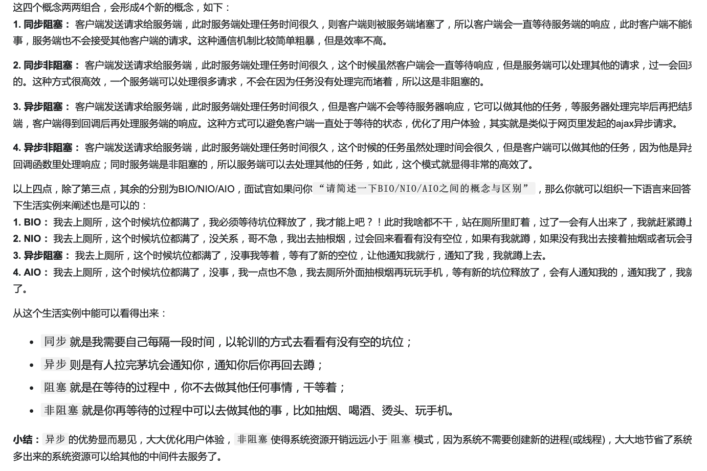
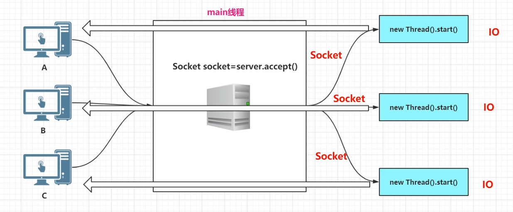
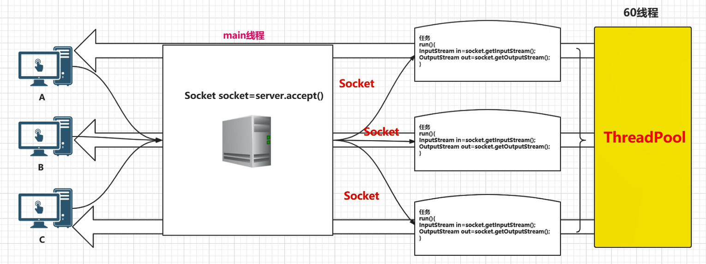
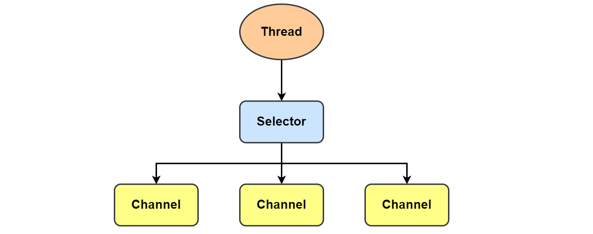

[TOC]

### Java网络IO

**IO 模型**就是说用什么样的**通道进行数据的发送和接收**，Java 共支持 3 种**网络编程 IO 模式：BIO，NIO，AIO**。它们是 Java 语言对**操作系统的各种 IO 模型的封装**。程序员在使用这些 API 的时候，不需要关心操作系统层面的知识，也不需要根据不同操作系统编写不同的代码。只需要**使用 Java 的 API** 就可以了。

#### 基本概念



##### 1.同步与异步

**同步和异步**是针对应用程序和内核的交互而言的，同步和异步关注的是消息通信机制。

- **同步**：两个同步任务**相互依赖**，并且一个任务必须以依赖于另一任务的某种方式执行。 比如在 A->B 事件模型中，需要先完成 A 才能执行 B。 再换句话说，同步调用种被调用者未处理完请求之前，调用不返回，调用者会一直等待结果的返回。例如：按下电饭锅的煮饭按钮，然后等待饭煮好，把饭盛出来，然后再去炒菜。
- **异步**：两个异步的**任务完全独立**的，一方的执行不需要等待另外一方的执行。再换句话说，**异步调用种一调用就返**回结果不需要等待结果返回，当结果返回的时候通过回调函数或者其他方式拿着结果再做相关事情。例如：按下电钮锅的煮饭按钮，直接去炒菜或者做别的事情，当电饭锅响的时候，再回去把饭盛出来。显然，异步式编程要比同步式编程高效得多。

##### 2.阻塞与非阻塞

**阻塞和非阻塞**是针对于**进程在访问数据**的时候，根据 IO 操作的**就绪状态**来采取的不同方式，是一种读取或者写入操作函数的实现方式，阻塞方式下读取或者写入函数将一直等待，而非阻塞方式下，读取或者写入函数会立即返回一个状态值。阻塞和非阻塞关注的是程序在等待调用结果（消息，返回值）时的状态。

- **阻塞：**阻塞就是发起一个请求，调用者一直等待请求结果返回，也就是当前线程会被挂起，无法从事其他任务，只有当条件就绪才能继续。例子：你打电话问书店老板有没有《分布式系统》这本书，你如果是阻塞式调用，你会一直把自己“挂起”，直到得到这本书有没有的结果。
- **非阻塞：**非阻塞就是发起一个请求，调用者不用一直等着结果返回，可以先去干其他事情，在不能立刻得到结果之前，该调用不会阻塞当前线程。例子：打电话问书店老板有没有某本书，不管老板有没有告诉你结果，可以自己先一边去玩， 当然也要偶尔过几分钟 check 一下老板有没有返回结果。 

**同步和异步是目的，阻塞和非阻塞是实现方式。**同步/异步是从**行为角度**描述事物的，而阻塞和非阻塞描述的当前**事物的状态**（等待调用结果时的状态）。

##### 3.总结

- **同步阻塞 IO（BIO）**：用户进程发起一个 IO 操作以后，必须等待 IO 操作的真正完成后，才能继续运行。
- **同步非阻塞 IO（NIO）**：用户进程发起一个 IO 操作以后**可做其它事情**，但用户进程需要**经常询问** IO 操作是否完成，这样造成不必要的 CPU 资源浪费。
- **异步非阻塞 IO（AIO）**：用户进程发起一个 IO 操作然后**立即返回**，等 IO 操作真正的完成以后，应用程序会得到IO 操作完成的通知。类比 Future 模式。

#### BIO

##### 1.概述

BIO（Blocking IO） 是**面向流**的**同步阻塞 IO**，是一种**同步阻塞模型**。面向流意味着每次从流中读**一个或多个字节**，**直到读取所有字节**，**没有被缓存**到任何地方。同步阻塞 I/O 模式，数据的读取写入必须阻塞在一个线程内等待其完成，**阻塞**的时候线程什么都不能做。

服务端提供 IP 和监听端口，客户端通过连接操作向服务端监听的地址发起连接请求，通过三次握手连接，如果连接成功，双方就可以通过套接字进行通信。传统的同步阻塞模型开发中，**ServerSocket** 负责绑定 IP 地址，启动**监听**端口；**socket** 负责发起**连接操作**，连接成功后，双方通过**输入流和输出流进行同步阻塞式**通信。

##### 2.模型图示

采用 BIO 通信模型的**服务端**通常由一个独立的 **Acceptor 线程**负责监听客户端的连接，它收到客户端连接请求后为**每个客户端创建一个新的线程**进行链路处理，处理完成后，通过输出流返回应答给客户端，**线程销毁**。

这就是典型的**一请求一应答**通信模型，BIO 通信（一请求一应答）模型图如下：



一般通过在 **while**(true) 循环中服务端会调用 **accept**() 方法等待接收客户端的连接的方式监听请求，请求一旦接收到一个连接请求，就可以建立通信套接字在这个通信套接字上进行读写操作，此时不能再接收其他客户端连接请求，只能等待同当前连接的客户端的操作执行完成， 不过可以通过多线程来支持多个客户端的连接，如上图所示。

##### 3.伪异步IO模型

客户端向服务端发送请求，服务端会为**每个客户端建立一个线程**来响应，问题来了，如果客户端出现了延时等异常，服务端为客户端建立的线程，就会一直出于等待状态，这个线程就会占用很长时间（因为数据的准备和处理都在这个线程上完成），更糟糕的是，如果有大量并发访问，服务器就会**建立大量线程响应**，引起服务器**资源枯竭**。

为了改进这种一连接一线程的模型，可以使用**线程池来**管理这些线程，实现 1 个或多个线程处理 N 个客户端的模型（但是底层还是使用的同步阻塞 I/O），通常被称为“**伪异步I/O模型**“。



比如使用 FixedThreadPool 就可以有效的控制线程的最大数量，保证系统有限的资源的控制，实现 N:M 的伪异步 I/O 模型。但是如果限制了线程数量，如果发生**大量并发请求**，超过最大数量的线程就**只能等待**，直到线程池中的有空闲的线程可以被复用。而对 Socket 的输入流就行读取时，会一直阻塞，直到读完或者发生异常退出。所以在读取数据较慢时（比如数据量大、网络传输慢等），大量并发的情况下，其他接入的消息，只能一直等待，这就是最大的弊端。

#### NIO

##### 1.概述

新的输入/输出 (NIO) 库是在 JDK **1.4** 中引入的，提供了**高速的、面向块**的 I/O，也叫 Non-Block IO 是一种**同步非阻塞**的通信模型。

同步非阻塞，服务器实现模式为一个线程可以处理多个请求(连接)，客户端发送的连接请求都会注册到多路复用器 selector 上，**多路复用器**轮询到**连接有 IO 请求**就进行处理。  

使用场景：NIO 方式适用于**连接数目多且连接比较短**（轻操作） 的架构， 比如**聊天服务器， 弹幕系统， 服务器间通讯**，编程比较复杂， JDK1.4 开始支持。**但实际少用 NIO 写代码，比较复杂的。直接用 Netty 就行了，但是 NIO 的模型很重要**。 

##### 2.流与块

BIO 与 NIO 最重要的区别是**数据打包和传输**的方式，==BIO 以**流**的方式处理数据，而 NIO 以**块**的方式处理数据==。

**面向流**的 I/O 一次处理**一个字节数据**：一个输入流产生一个字节数据，一个输出流消费一个字节数据。为流式数据创建过滤器非常容易，链接几个过滤器，以便每个过滤器只负责复杂处理机制的一部分。不利的一面是，面向流的 I/O 通常相当慢。

**面向块**的 I/O 一次处理**一个数据块**，按块处理数据比按流处理数据要**快得多**。但是面向块的 I/O 缺少一些面向流的 I/O 所具有的优雅性和简单性。

I/O 包和 NIO 已经很好地集成了，java.io.\* 已经以 NIO 为基础重新实现了，所以现在它可以利用 NIO 的一些特性。例如，java.io.\* 包中的一些类包含以块的形式读写数据的方法，这使得即使在面向流的系统中，处理速度也会更快。

##### 3.NIO模型概述与核心组件

NIO 有三大核心组件： **Channel(通道)， Buffer(缓冲区)，Selector(多路复用器器/选择器)**。

客户端和服务器之间通过 **Channel 通信**。NIO 可以在 Channel 进行读写操作。这些 Channel 都会被注册在 Selector 多路复用器上。

NIO 实现了 IO **多路复用**中的 **Reactor** 模型，**一个线程** Thread 使用一个**选择器** Selector 通过**轮询**的方式去**监听多个通道**  Channel 上的事件，从而让一个线程就可以处理多个事件。


- channel 类似于流，每个 channel 对应一个 buffer 缓冲区，buffer 底层就是个数组。
- channel 会注册到 selector 上，由 selector 根据 channel 读写事件的发生将其交由某个空闲的线程处理。
- selector 可以对应一个或多个线程。
- NIO 的 Buffer 和 channel 都是既可以读也可以写。

###### (1)通道Channel

通道 **Channel** 是对原 IO 包中的**流的模拟**，可以通过它**读取和写入**数据。通道与流的不同之处在于，**流**是单向的，只能在**一个方向**上移动(一个流必须是输入流 **InputStream** 或者输出流 **OutputStream** 的子类)，而**通道是==双向==**的，可以用于读、写或者**同时**用于读写。

通常来说 NIO 中的所有 IO 都是从 **Channel**（通道） 开始的。

- 从通道进行数据读取 ：创建一个**缓冲区**，然后请求通道读取数据。
- 从通道进行数据写入 ：创建一个**缓冲区**，填充数据，并要求通道写入数据。

**通道**都实现了 **Channel 接口**，大致有如下实现类：

- **FileChannel**：从**文件**中读写数据；
- **DatagramChannel**：通过 **UDP** 读写网络中数据；
- **SocketChannel**：通过 **TCP** 读写网络中数据；
- **ServerSocketChannel**：可以监听新进来的 TCP 连接，对每一个新进来的**连接**都会创建一个 **SocketChannel**。

###### (2)缓冲区Buffer

**从通道读入与写出数据都必须先经过缓冲区，不会直接对通道进行读写数据**。

缓冲区实质上是一个**数组**，但它功能更多，缓冲区提供了对数据的**结构化**访问，而且还可以跟踪系统的读/写进程。

缓冲区都继承于**抽象类 Buffer**，包括如下实现类：ByteBuffer、CharBuffer、ShortBuffer、IntBuffer、LongBuffer、FloatBuffer、DoubleBuffer 等。

###### (3)多路复用器Selector

**Selector** 可以对应一个或多个线程。Selector 通过**一个线程不停的轮询注册的 Channel**，找出已经准备就绪的通道执行 IO 操作。

**Selector IO 多路复用**底层一般用的 Linux API（**select，poll，epoll**）来实现，他们的区别如下表：

|              |                **select**                 |                   **poll**                   |                   **epoll(Jdk1.5及以上)**                    |
| ------------ | :---------------------------------------: | :------------------------------------------: | :----------------------------------------------------------: |
| **操作方式** |                 **遍历**                  |                   **遍历**                   |                           **回调**                           |
| **底层实现** |                 **数组**                  |                   **链表**                   |                          **哈希表**                          |
| **IO效率**   | 每次调用都进行线性遍历，时间复杂度为 O(n) | 每次调用都进行**线性遍历**，时间复杂度为O(n) | 事件通知方式，每当有 IO 事件就绪，系统注册的**回调函数**就会被调用，时间复杂度 O(1) |
| **最大连接** |                **有上限**                 |                  **无上限**                  |                          **无上限**                          |

单线程的 BIO 模型与 Redis 架构类似，如果处理的事件过多，那么可能后面的连接就连接不上会发生阻塞。所以事件的操作最好较短。所以可以用一个**线程池**来处理事件。

##### 4.缓冲区状态变量

有几重要的变量用于**描述缓冲区**的状态。

- **capacity**：**最大容量**。
- **position**：当前**已经读写**的字节数。
- **limit**：**还可以读写**的字节数。

Buffer 的**操作**一般遵循几个步骤，操作分为**读模式和写模式**：

- 调用 **allocate**() 方法分配缓冲区内存。

- 写入数据到 Buffer。
- 调用 **flip**() 方法进行**模式切换**。可以将**写模式切换到读模式**。
- 从 Buffer 中**读取**数据。
- 调用 **clear**() 方法，清理 buffer。

状态变量的改变过程举例：

① 通过 **Buffer** 的 **allocate**() 方法进行内存**分配**。新建一个大小为 8 个字节的**缓冲区**，此时 **position** 为 0，而 limit = capacity = 8。**capacity** 变量**不会改变**，下面的讨论会忽略它。


② **写模式中**，加入首先从输入通道中读取 5 个字节数据**写入**缓冲区中，此时 **position** 为 5，limit 保持**不变**。写模式中的 limit 为可以写入的**最大值**。


③ 在将**缓冲区**的数据写到**输出通道**之前，需要先调用 **flip()** 方法，这个方法**将 limit 设置为当前 position**，并将 **position 设置为 0**。这可以保证写出的数据**正好**是之前写入缓冲区的数据，因为到了 limit 位置就截止。**flip()** 可以将写模式切换到读模式。**读模式**下，limit 变成写**数据时的 position 值**，代表能够**读出的数据量值**。


④ 从缓冲区中**取 4 个字节到输出通道**中，此时 position 设为 4。


⑤ 最后需要调用 **clear()** 方法来**清空缓冲区**，此时 **position 和 limit** 都被设置为**最初位置**。


##### 4.多路复用器Selector

这里详细说 Selector。多路复用器提供选择已经就绪的任务的能力，它会不断地**轮询注册在其上的通道**（Channel），如果某个通道处于就绪状态，会被 Selector 轮询出来，然后通过 **SelectionKey** 可以取得就绪的 **Channel 集合**，从而进行后续的 IO 操作。服务器端只要提供一个线程负责 Selector 的轮询，就可以接入成千上万个客户端，这就是 **NIO** 库的巨大进步。

通过配置监听的通道 Channel 为**非阻塞**，那么当 Channel 上的 IO 事件还未到达时，就不会进入阻塞状态一直等待，而是**继续轮询**其它 Channel，找到 IO **事件已经到达**的 Channel 并处理事件。因为创建和切换线程的开销很大，因此使用**一个线程来处理多个事件**而不是一个线程处理一个事件，对于 IO 密集型的应用具有很好地性能。

**一个 Selector** 可以**同时轮询多个** Channel，因为 JDK 使用了 **epoll**() 代替传统的 select() 实现，**没有**最大连接句柄的限制，所以只需要一个线程负责 Selector 轮询，就可以接入**成千上万**的客户端连接。



###### (1)创建多路复用器

```java
// 创建多路复用器
Selector selector = Selector.open();
```

###### (2)将通道注册到选择器上

```java
// 打开一个服务端Channel
ServerSocketChannel ssChannel = ServerSocketChannel.open();
// 设置为非阻塞 必须配置
ssChannel.configureBlocking(false);
// 将Channel注册到Selector上
ssChannel.register(selector, SelectionKey.OP_ACCEPT);
```

**通道**必须配置为**非阻塞模式**，否则使用选择器就没有任何意义了，因为如果通道在某个事件上被阻塞，那么服务器就不能响应其它事件，必须等待这个事件处理完毕才能去处理其它事件，显然这和选择器的作用背道而驰。

在将通道**注册**到选择器上时，还需要指定要**注册的具体事件**，主要有以下几类：

- SelectionKey.**OP_CONNECT**：连接就绪。
- SelectionKey.**OP_ACCEPT**：接收就绪。
- SelectionKey.**OP_READ**：读就绪。
- SelectionKey.**OP_WRITE**：写就绪。

它们在 SelectionKey 的定义如下：

```java
public static final int OP_READ = 1 << 0;
public static final int OP_WRITE = 1 << 2;
public static final int OP_CONNECT = 1 << 3;
public static final int OP_ACCEPT = 1 << 4;
```

可以看出每个事件可以被当成一个**位域**，从而组成**事件集整数**。例如：

```java
int interestSet = SelectionKey.OP_READ | SelectionKey.OP_WRITE;
```

###### (3)监听事件

```java
int num = selector.select();
```

使用 select() 来**监听**到达的事件，它会**一直阻塞**直到有**至少一个**事件到达，可能有**多个**事件到达。

###### (4)获取到达的事件

Selector 在有通道**事件到达**的时候返回 **SelectionKey 的集合**，之后可以进行数据处理。这里循环**遍历**已经选择键集合中的**每一个键**（因为可能有多个通道的事件需要处理），并检测各个**键所对应的通道事件的类型**进而做出不同的处理。

```java
// 遍历SelectionKey事件
Set<SelectionKey> keys = selector.selectedKeys();
Iterator<SelectionKey> keyIterator = keys.iterator();
while (keyIterator.hasNext()) {
    SelectionKey key = keyIterator.next();
    // 判断事件类型
    if (key.isAcceptable()) {
        // ...
    } else if (key.isReadable()) {
        // ...
    }
    keyIterator.remove();
}
```

###### (5)事件循环

因为一次 **select**() 调用**不能处理完所有的事件**，并且服务器端有可能需要一直监听事件，因此服务器端**处理事件**的代码一般会放在一个**死循环**内。

```java
while (true) {
    int num = selector.select();
    Set<SelectionKey> keys = selector.selectedKeys();
    Iterator<SelectionKey> keyIterator = keys.iterator();
    while (keyIterator.hasNext()) {
        SelectionKey key = keyIterator.next();
        if (key.isAcceptable()) {
            // ...
        } else if (key.isReadable()) {
            // ...
        }
        keyIterator.remove();
    }
}
```

**NIO 模型中通过 SocketChannel 和 ServerSocketChannel 完成套接字通道的实现。非阻塞/阻塞，同步，避免 TCP 建立连接使用三次握手带来的开销。**

##### 6.代码实现与分析

NIO 服务器代码示例：

```java
public class NioServer {

    //public static ExecutorService pool = Executors.newFixedThreadPool(10);

    public static void main(String[] args) throws IOException {
        // 创建一个在本地端口进行监听的服务Socket通道.并设置为非阻塞方式，把它当成一个服务器就行了
        ServerSocketChannel serverSocketChannel = ServerSocketChannel.open();
        // 必须配置为非阻塞才能往selector上注册，否则会报错，selector模式本身就是非阻塞模式
        serverSocketChannel.configureBlocking(false);
        // 绑定端口
        serverSocketChannel.socket().bind(new InetSocketAddress(9000));
        // 创建一个选择器selector
        Selector selector = Selector.open();
        // 把ServerSocketChannel注册到selector上，并且selector对客户端accept连接操作感兴趣
        serverSocketChannel.register(selector, SelectionKey.OP_ACCEPT);

        while (true) {
            System.out.println("等待事件发生。。");
            // 轮询监听channel里的key，select是阻塞的，accept()也是阻塞的，在此处阻塞了。
            int select = selector.select();
            System.out.println("有事件发生了。。");
            // 有客户端请求，被轮询监听到
            Iterator<SelectionKey> it = selector.selectedKeys().iterator();
            while (it.hasNext()) {
                SelectionKey key = it.next();
                // 删除本次已处理的key，防止下次select重复处理
                it.remove();
                // 这里可以使用线程池来处理事件：但是也可能出现并发问题
                handle(key);
            }
        }
    }

    /**
     * 处理事件:分事件进行分别处理
     */
    private static void handle(SelectionKey key) throws IOException {
        if (key.isAcceptable()) {
            System.out.println("有客户端连接事件发生了。。");
            ServerSocketChannel serverSocketChannel = (ServerSocketChannel) key.channel();
            // serverSocketChannel阻塞等到连接事件发生，然后将这个链接对应的通道
            // socketChannel注册到多路复用器上,此处是非阻塞的体现之一：调用accept
            // 是阻塞的，但是这里因为是发生了连接事件，所以这个方法会马上执行完，所以不会阻塞
            SocketChannel socketChannel = serverSocketChannel.accept();
            socketChannel.configureBlocking(false);
            // 通过Selector监听Channel时对读事件感兴趣
            socketChannel.register(key.selector(), SelectionKey.OP_READ);

            // 读事件
        } else if (key.isReadable()) {
            System.out.println("有客户端数据可读事件发生了。。");
            // 注意这个channel跟上面不一样！
            SocketChannel socketChannel = (SocketChannel) key.channel();
            // 分配数据缓冲区
            ByteBuffer buffer = ByteBuffer.allocate(1024);
            // NIO非阻塞体现:首先read方法不会阻塞，其次这种事件响应模型，
            // 当调用到read方法时肯定是发生了客户端发送数据的事件
            int len = socketChannel.read(buffer);
            if (len != -1) {
                System.out.println("读取到客户端发送的数据：" + new String(buffer.array(), 0, len));
            }
            ByteBuffer bufferToWrite = ByteBuffer.wrap("HelloClient".getBytes());
            socketChannel.write(bufferToWrite);
            key.interestOps(SelectionKey.OP_READ | SelectionKey.OP_WRITE);
        } else if (key.isWritable()) {
            System.out.println("Write事件");
            // 服务端的write事件就是写数据给客户端
            SocketChannel socketChannel = (SocketChannel) key.channel();
            // NIO事件触发是水平触发
            // 使用Java的NIO编程的时候，在没有数据可以往外写的时候要取消写事件，
            // 在有数据往外写的时候再注册写事件
            key.interestOps(SelectionKey.OP_READ);
            //sc.close();
        }
    }
}
```

**NIO 服务端程序详细分析：**

1、创建一个 ServerSocketChannel 和 Selector ，并将 **ServerSocketChannel 注册到 Selector** 上。

2、 selector 通过 **select**() 方法监听 **channel 事件**，当客户端连接时，selector 监听到**连接事件**， 获取到 **ServerSocketChannel** 注册时绑定的 **selectionKey**。

3、selectionKey 通过 **channel**() 方法可以获取**绑定的 ServerSocketChannel**。

4、ServerSocketChannel 通过 **accept**() 方法得到 **SocketChannel**。

5、将 **SocketChannel 注册到 Selector 上，关心 read 事件**。

6、注册后返回一个 **SelectionKey**, 会和该 **SocketChannel 关联**。

7、selector 继续通过 select() 方法**监听事件**，当客户端发送数据给服务端，selector 监听到 read 事件，获取到 SocketChannel  注册时绑定的 selectionKey。

8、selectionKey 通过 channel() 方法可以获取绑定的 socketChannel。

9、将 socketChannel 里的数据读取出来。

10、用 socketChannel 将服务端数据写回客户端。

**总结：**NIO 模型的 selector 就像一个大总管，负责监听各种 IO 事件，然后转交给后端线程去处理。

**NIO 相对于 BIO 非阻塞的体现就在，BIO 的后端线程需要阻塞等待客户端写数据(比如 read 方法)，如果客户端不写数据线程就要阻塞，NIO 把等待客户端操作的事情交给了大总管 selector，selector 负责轮询所有已注册的客户端，发现有事件发生了才转交给后端线程处理，后端线程不需要做任何阻塞等待，直接处理客户端事件的数据即可，处理完马上结束，或返回线程池供其他客户端事件继续使用。还有就是 channel 的读写是非阻塞的**。

**Redis 就是典型的 NIO 线程模型**，selector 收集所有连接的事件并且转交给后端线程，线程连续执行所有事件命令并将结果写回客户端。


这里：首先注册一个 **ServerSocketChannel 到 Selector** 上，这个 ServerSocketChannel 就可以理解成一个**服务器**，专注与处理**连接事件**，此时等待连接。这时候客户端连接进来，这时候通过 ServerSocketChannel 得到客户端与服务器之间的连接的普通的 **SocketChannel**，然后把这个 **SocketChannel 注册到 Selector** 上，此后如果客户端有读写事件就**从自己的 SocketChannel 进行**，也就是说上图中 Selector 其实注册了三个普通的 SocketChannel 和一个 ServerSocketChannel，但是这四个都是类似的，只是各自处理的**事件不同**。

==**这里 Selector 既要处理连接事件，又要处理 IO 读写事件。**==

**一个缺点**：Selector 会对收到的事件进行**逐一处理**，如果是**单线程**处理这些事件则可能会造成事件太多，那么等待处理的事件就会进行累计，造成后面的**新的连接事件得不到处理**，造成**无法进行连接**。可以使用线程池的方式进行事件处理，但是这时候就可能引发并发问题了。试想一下，如果有几十万的连接，Selector 需要处理太多的读写事件，就算用了线程池，那么把事件分发给线程池其实也是需要花费时间的，这在高并发场景下也不太好。**这时候采用 Netty 啊**！

**NIO 客户端代码**：

```java
public class NioClient {

    /**
     * 多路复用器
     */
    private Selector selector;

    /**
     * 启动客户端测试
     *
     * @throws IOException IOException
     */
    public static void main(String[] args) throws IOException {
        NioClient client = new NioClient();
        // 初始化
        client.initClient("127.0.0.1", 9000);
        // 连接
        client.connect();
    }

    /**
     * 获得一个Socket通道，并对该通道做一些初始化的工作
     *
     * @param ip   连接的服务器的ip
     * @param port 连接的服务器的端口号
     * @throws IOException IOException
     */
    public void initClient(String ip, int port) throws IOException {
        // 获得一个Socket通道
        SocketChannel channel = SocketChannel.open();
        // 设置通道为非阻塞
        channel.configureBlocking(false);
        // 获得一个通道管理器
        this.selector = Selector.open();

        // 客户端连接服务器,其实方法执行并没有实现连接，需要在listen()方法中调
        // 用channel.finishConnect() 才能完成连接
        channel.connect(new InetSocketAddress(ip, port));
        // 将通道管理器和该通道绑定，并为该通道注册SelectionKey.OP_CONNECT事件
        channel.register(selector, SelectionKey.OP_CONNECT);
    }

    /**
     * 采用轮询的方式监听selector上是否有需要处理的事件，如果有，则进行处理
     *
     * @throws IOException IOException
     */
    public void connect() throws IOException {
        // 轮询访问selector
        while (true) {
            selector.select();
            // 获得selector中选中的项的迭代器
            Iterator<SelectionKey> it = this.selector.selectedKeys().iterator();
            while (it.hasNext()) {
                SelectionKey key = (SelectionKey) it.next();
                // 删除已选的key,以防重复处理
                it.remove();
                // 连接事件发生
                if (key.isConnectable()) {
                    SocketChannel channel = (SocketChannel) key.channel();
                    // 如果正在连接，则完成连接
                    if (channel.isConnectionPending()) {
                        channel.finishConnect();
                    }
                    // 设置成非阻塞
                    channel.configureBlocking(false);
                    // 在这里可以给服务端发送信息哦
                    ByteBuffer buffer = ByteBuffer.wrap("HelloServer".getBytes());
                    channel.write(buffer);
                    // 在和服务端连接成功之后，为了可以接收到服务端的信息，需要给通道设置读的权限。
                    // 获得了可读的事件
                    channel.register(this.selector, SelectionKey.OP_READ);
                } else if (key.isReadable()) {
                    read(key);
                }
            }
        }
    }

    /**
     * 处理读取服务端发来的信息 的事件
     *
     * @param key 事件key
     * @throws IOException IOException
     */
    public void read(SelectionKey key) throws IOException {
        //和服务端的read方法一样
        // 服务器可读取消息:得到事件发生的Socket通道
        SocketChannel channel = (SocketChannel) key.channel();
        // 创建读取的缓冲区
        ByteBuffer buffer = ByteBuffer.allocate(1024);
        int len = channel.read(buffer);
        if (len != -1) {
            System.out.println("客户端收到信息：" + new String(buffer.array(), 0, len));
        }
    }
}
```

##### 7.文件NIO

注意：只有**套接字 Channel** 才能配置为**非阻塞**，而 FileChannel 不能，为 FileChannel 配置非阻塞也没有意义。使用 NIO 读取数据基本流程：

- 从 FileInputStream 获取 Channel。
- 创建 Buffer。
- 将数据从 Channel 读取到 Buffer 中。

以下展示了使用 **NIO 快速复制文件**的实例：

```java
public static void fastCopy(String src, String dist) throws IOException {

    /* 获得源文件的输入字节流 */
    FileInputStream fin = new FileInputStream(src);

    /* 获取输入字节流的文件通道 */
    FileChannel fcin = fin.getChannel();

    /* 获取目标文件的输出字节流 */
    FileOutputStream fout = new FileOutputStream(dist);

    /* 获取输出字节流的文件通道 */
    FileChannel fcout = fout.getChannel();

    /* 为缓冲区分配 1024 个字节 */
    ByteBuffer buffer = ByteBuffer.allocateDirect(1024);

    while (true) {

        /* 从输入通道中读取数据到缓冲区中 */
        int r = fcin.read(buffer);

        /* read() 返回 -1 表示 EOF */
        if (r == -1) {
            break;
        }

        /* 切换读写 */
        buffer.flip();

        /* 把缓冲区的内容写入输出文件中 */
        fcout.write(buffer);

        /* 清空缓冲区 */
        buffer.clear();
    }
}
```

##### 8.BIO与NIO对比

**NIO** 与普通 BIO 的区别主要有以下几点：NIO 是**非阻塞**的；NIO 面向**块**，I/O 面向流；NIO 对于处理有**大量连接**的场景比较好，比如 P2P 网络，聊天服务器等。而 BIO 对于少量连接并发送大量数据的场景是比较适合的。

#### AIO

##### 1.概述

在 Java 7 中引入了 AIO，它是**异步非阻塞的 IO 模型**。AIO 是异步 IO 的缩写，虽然 NIO 在网络操作中，提供了非阻塞的方法，但是 NIO 的 IO 行为还是同步的。异步 IO 是基于**事件和回调机制**实现的，也就是应用操作之后会直接返回，不会堵塞在那里，当后台处理完成，操作系统会通知相应的线程进行后续的操作。

AIO 最大的一个特性就是**异步能力**，这种能力对 socket 与文件 I/O 都起作用。AIO 其实是一种在**读写操作结束之前允许进行其他操作的 I/O 处理**。

Jdk7 主要增加了三个新的**异步通道**:

- **AsynchronousFileChannel**: 用于**文件**异步读写。
- **AsynchronousSocketChannel**: **客户端**异步 socket。
- **AsynchronousServerSocketChannel**: **服务器**异步 socket。

AIO 是真正**异步**的 IO，它把 IO **读写操作完全交给了操作系统**。因为 AIO 的实施需**充分调用 OS** 参与，IO 需要操作系统支持、并发也同样需要操作系统的支持，所以性能方面不同操作系统差异会比较明显。

- **异步非阻塞**，服务器实现模式为一个有效请求一个线程，客户端的 I/O 请求都是由 OS **先完成**了再通知服务器应用去启动线程进行处理。
- AIO 方式使用于连接数目多且连接比较长（重操作）的架构，比如**相册服务器**，充分调用 OS 参与并发操作，编程比较复杂，JDK7 开始支持。 

AIO 并**没有采用 NIO 的多路复用器**，而是使用**异步通道**的概念。其 **read，write 方法**的返回类型都是 **Future 对象**。而 **Future 模型是异步**的，其核心思想是：去主函数等待时间。

**AIO 模型中通过 AsynchronousSocketChannel 和 AsynchronousServerSocketChannel 完成套接字通道的实现异步非阻塞**。但是 AIO 底层还是用的 NIO，其实就是对 NIO 的封装，其性能没准还不如 NIO，所以用的不广泛，不如直接用 Netty 是对更底层的封装。

 一般适用于**连接数较多且连接时间较长**的应用。

##### 2.Netty AIO

Netty 也支持 AIO 并提供了相应的类： AioEventLoopGroup，AioCompletionHandler，AioServerSocketChannel， AioSocketChannel，AioSocketChannelConfig。其它使用方法和 NIO 类似。目前来说 AIO 的应用还不是很广泛，Netty 之前也尝试使用过 AIO，不过又**放弃**了。

#### 对比

- **BIO：同步阻塞模型**，服务器实现模式为**一个连接一个线程**，即客户端有连接请求时服务器端就需要启动一个线程进行处理，如果这个连接不做任何事情会造成不必要的线程开销，当然可以通过线程池机制改善。通过 **Socket** 和 **ServerSocket** 完成套接字通道实现。阻塞，同步，连接耗时。
- **NIO：同步非阻塞模型**，服务器实现模式为**一个线程多个连接**，即客户端发送的**连接请求**都会注册到**多路复用器**上，多路复用器轮询到连接有 I/O 请求时才启动一个线程进行**处理**。通过 **SocketChannel** 和 **ServerSocketChannel** 完成套接字通道实现。非阻塞/阻塞，同步，避免 TCP 建立连接使用三次握手带来的开销。
- **AIO：异步非阻塞模型**，服务器实现模式为**一个有效请求一个线程**，客户端的 I/O 请求都是**由 OS 先完成了再通知服务器**应用去启动线程进行处理。通过 AsynchronousSocketChannel 和 AsynchronousServerSocketChannel 完成套接字通道实现。异步非阻塞。

|          属性          |  BIO   |    伪异步IO    |          NIO           |   AIO    |
| :--------------------: | :----: | :------------: | :--------------------: | :------: |
| **Client数：IO线程数** | 1 : 1  | M : N (M >= N) |         M : 1          |  M : 0   |
|     **IO阻塞类型**     | 阻塞IO |     阻塞IO     |        非阻塞IO        | 非阻塞IO |
|     **IO同步类型**     | 同步IO |     同步IO     | 同步IO（**多路复用**） |  异步IO  |
|    **API使用难度**     |  简单  |      简单      |          复杂          |   一般   |
|      **调试难度**      |  简单  |      简单      |          复杂          |   复杂   |
|       **并发量**       |   低   |       中       |           高           |    高    |

I/O属于**底层操作**，需要**操作系统支持**，并发也需要操作系统的支持，所以性能方面不同操作系统差异会比较明显。 

#### BIO/NIO/AIO适用场景分析

- **BIO** 模型适用于**连接数目比较小且固定**的架构，这种方式对服务器资源要求比较高，并发局限于应用中，JDK1.4 以前的唯一选择，但程序直观简单易理解。

- **NIO** 模型适用于**连接数目多且连接比较短**（轻操作）的架构，比如聊天服务器，并发局限于应用中，编程比较复杂，JDK1.4 开始支持。

- **AIO** 模型使用于**连接数目多且连接比较长**（重操作）的架构，比如相册服务器，充分调用 **OS 参与**并发操作，编程比较复杂，JDK7 开始支持。

#### Reactor模式和Proactor模式

两种 **IO 多路复用**方案: **Reactor and Proactor。**Reactor 模式是基于**同步I/O**的，而 Proactor 模式是和**异步** I/O 相关的。Reactor：能收了你跟俺说一声。Proactor：你给我收十个字节，收好了跟俺说一声。

##### 1.Reactor模式

Reactor 模式应用于**同步 I/O** 的场景。分别以**读操作和写操作**为例来看看 Reactor 中的具体步骤。读取操作： 

- 应用程序注册读就绪事件和相关联的事件处理器。
- 事件分离器等待事件的发生。
- 当发生读就绪事件的时候，事件分离器调用第一步注册的事件处理器。

- 事件处理器首先执行实际的读取操作，然后根据读取到的内容进行进一步的处理。

写入操作类似于读取操作，只不过第一步注册的是写就绪事件。 

##### 2.Proactor模式

来看看 Proactor 模式中读取操作和写入操作的过程。读取操作： 

- 应用程序初始化一个异步读取操作，然后注册相应的事件处理器，此时事件处理器不关注读取就绪事件，而是关注读取完成事件，这是区别于 Reactor 的**关键**。 

- 事件分离器等待读取操作完成事件。

- 在事件分离器等待读取操作完成的时候，操作系统调用内核线程完成读取操作（异步IO都是操作系统负责将数据读写到应用传递进来的缓冲区供应用程序操作，操作系统扮演了重要角色），并将读取的内容放入用户传递过来的缓存区中。这也是区别于Reactor的一点，Proactor中，应用程序需要传递缓存区。 

- 事件分离器捕获到读取完成事件后，激活应用程序注册的事件处理器，事件处理器直接从缓存区读取数据，而不需要进行实际的读取操作。 

Proactor 中写入操作和读取操作类似，只不过感兴趣的事件是**写入完成**事件。 

Reactor 和 Proactor 模式的主要区别就是**真正的读取和写入操作是有谁来完成**的，Reactor 中需要应用程序自己读取或者写入数据，而 Proactor 模式中，应用程序不需要进行实际的读写过程，它**只需要从缓存区读取或者写入即可**，操作系统会读取缓存区或者写入缓存区到真正的 IO 设备.。


