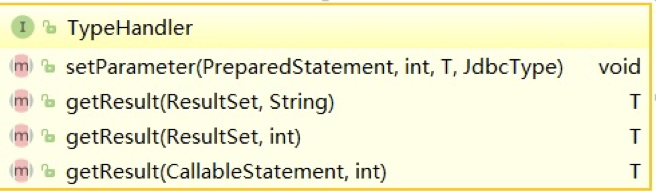

[TOC]

### Spring集成MyBatis

#### 基础

MyBatis 是一款优秀的持久层框架，它支持定制化 SQL、存储过程以及高级映射。MyBatis 避免了几乎所有的 JDBC 代码和手动设置参数以及获取结果集。MyBatis 可以使用简单的 XML 或注解来配置和映射原生类型、接口和 Java 的 POJO（Plain Old Java Objects，普通老式 Java 对象）为数据库中的记录。

UserMapper.xml

```xml
<?xml version="1.0" encoding="UTF-8" ?>
<!DOCTYPE mapper
        PUBLIC "-//mybatis.org//DTD Mapper 3.0//EN"
        "http://mybatis.org/dtd/mybatis-3-mapper.dtd">
<mapper namespace="com.tuling.mybatis.dao.UserMapper">

    <select id="selectByid2" resultType="com.tuling.mybatis.dao.User">
        select * from user where id=#{id}
    </select>
    <update id="updateByid2" parameterType="com.tuling.mybatis.dao.User">
        update user set name=#{name} where id=#{id}
    </update>
    <insert id="insertUser" keyProperty="id" keyColumn="id" useGeneratedKeys="true"
            parameterType="com.tuling.mybatis.dao.User">
        insert into user (name ,createTime,updateTime) values (#{name},#{createTime},#{updateTime})
    </insert>
    <select id="selectIds"
            resultType="com.tuling.mybatis.dao.User"
            lang="org.mybatis.scripting.freemarker.FreeMarkerLanguageDriver">

        select  * from user
        where  id in(${ids?join(',')})

    </select>

</mapper>
```

mybatis-config.xml

```xml
<?xml version="1.0" encoding="UTF-8" ?>
<!DOCTYPE configuration
        PUBLIC "-//mybatis.org//DTD Config 3.0//EN"
        "http://mybatis.org/dtd/mybatis-3-config.dtd">
<configuration>
    <environments default="development">
        <environment id="development">
            <transactionManager type="JDBC"/>
            <dataSource type="POOLED">
                <property name="driver" value="com.mysql.jdbc.Driver"/>
                <property name="url" value="jdbc:mysql://192.168.0.147/luban"/>
                <property name="username" value="root"/>
                <property name="password" value="123456"/>
            </dataSource>
        </environment>
    </environments>
    <mappers>
        <!--<mapper resource="com/tuling/mybatis/dao/xml/UserMapper.xml"/>-->
        <mapper class="com.tuling.mybatis.dao.UserMapper"></mapper>
    </mappers>
</configuration>
```

测试：

```java
String resource = "mybatis-config.xml";
InputStream inputStream = Resources.getResourceAsStream(resource);
SqlSessionFactory sqlSessionFactory = new SqlSessionFactoryBuilder().build(inputStream);
SqlSession session = sqlSessionFactory.openSession();
User result = session.selectOne("com.tuling.mybatis.dao.UserMapper.selectUser", 1);
System.out.println(result.toString());
```

SqlSessionFactoryBuilder：

用于构建会话工厂，基于 config.xml environment 、props 构建会话工厂,构建完成后即可丢弃。

SqlSessionFactory：

用于生成会话的工厂，作用于整个应用运行期间，一般不需要构造多个工厂对像。

SqlSession：

作用于单次会话，如WEB一次请求期间，不能用作于某个对像属性，也不能在多个线程间共享，因为它是线程不安全的。

#### 接口式编程

由于每次调用时都去找对应用 statement 以及拼装参数，使用上不是特别友好，myBatis 引入了接口的机制，将接口与mapper.xml 的namespace 名称绑定，MyBatis就可以根据ASM工具动态构建该接口的实例。

mapper 映射器接口实例

通过 session.getMapper(Class<T> type) 就可以获取 mapper 实例，该实例一般作用于方法域。

#### 全局的configuration配置

##### 1.属性

properties 元素可以通过 resource 或 url 加载外部 properties文件中的属性，也可以直接设置property 属性。然后在xml 中就可以通过${属性名}进行引用替换。

```xml
<properties resource="app.properties" url="">
        <property name="jdbc.driver" value="com.oracle.jdbc.Driver"/>
</properties>
```

##### 2.设置

设置MyBatis 全局参数，约定myBatis 的全局行为.

```xml
<settings>
<!-- 开启二级缓存-->
  <setting name="cacheEnabled" value="true"/>
  <!-- 开启驼峰命名适配-->
  <setting name="mapUnderscoreToCamelCase" value="true"/>
<settings>
```

##### 3.别名

在myBatis 中经常会用到 java 中类型，如sql 块中中 parameterType 参数引用中 javaType 结果集映射的javaType ,都要使用java 全路径名，可以通过

```xml
<typeAliases>
    <typeAlias type="com.tuling.mybatis.dao.Account" alias="account"/>
    <package name="com.tuling.mybatis.dao"  />
</typeAliases>
```

提示：建议不要设置。因为常用的类 mybatis 已经内置别名，而自定义的类设置别反而不好去找，影响阅读。

##### 4.类处理器

持久层框架其中比较重要的工作就是处理数据的映射转换，把java 类型转换成jdbc 类型的参数，又需要把jdbc 类型的结果集转换成java 类型。在mybatis 中是通过 TypeHandler 接口来实现的。



可以看到 typeHandler 就是两个作用 设置参数 与获取结果。

你可以设置自定义处理器

```xml
<typeHandlers>
  <typeHandler handler="org.mybatis.example.ExampleTypeHandler"  />
</typeHandlers>
```

##### 5.mappers映谢器

```xml
<mappers>
  <mapper resource="org/mybatis/builder/AuthorMapper.xml"/>
  <mapper  url="http://www.xxx.com/xml/BlogMapper.xml"/>
  <mapper class="org.mybatis.builder.BlogMapper"/>
 <package name="org.mybatis.builder"/>
</mappers>
```

加载方式：

- resource 基于classPath 加载xml文件
- url:基于资源定位加载xml 文件
- class:基于接口加载
- package ：扫描包下所有class 然后进行加载

约定规则：

- mapper 中的 namespace必须与对应的接口名称对应。

- 通过 class 或package 中加载时 .xml 文件必须与接口在同一级目录。

#### mapper文件

##### 1.sql语句块statement

通过原生JDBC写DAO的年代 ，程序员最怕莫过于 拼接SQL语句，拼接参数与设置返回结果集，Hibernate 将拼接SQL时代成为过去，通过ORM映谢，完全不需要处理任何SQL，但这又带来了新的问题就是。无法编写自定义SQL从而丧失了灵活活及更好的性能。MyBatis 通过 mapper 映射SQL很好解决了这一点。它无需在JAVA代码中拼接SQL，而是将其移至mapper 文件集中处理SQL节约了大量的开发时间。

**Mapper中的元素：**

- cache – 对给定命名空间的缓存配置。
- resultMap – 结果集映射。
- sql – 可被其他语句引用的可重用语句块。
- insert – 插入语句
- update – 更新语句
- delete –删除语句
- select – 查询语句

**select 用法及属性**

```xml
<select id="selectById" resultType="com.tuling.mybatis.dao.Account">
  select * from account where id = #{id}
</select>
```

属性：

```xml
<select

 id="selectById"    <!-- 语句块的唯一标识 与接口中方法名称对应 -->

 parameterType="User"  <!--参数java类型-->

 resultType="hashmap"  <!--返回结果java类型-->

 resultMap="userResultMap" <!--返回结果映射-->

 flushCache="false"   <!--true 每次调用都会刷新 一二级缓存-->

 useCache="true"     <!--true 是否保存至二级缓存当中去-->

 timeout="10"

 statementType= PREPARED">
```

**insert&update&delete 用法**

```xml
<insert
  id="addUser"   <!-- 语句块的唯一标识 与接口中方法名称对应 -->
  parameterType="User"   <!--参数java类型-->
  flushCache="true"  <!--true 每次调用都会刷新 一二级缓存-->
  statementType="PREPARED" <执行类型>
  keyProperty=""      <!--主键对应的java 属性，多个用 逗号分割-->
  keyColumn=""        <!--主键列，多个用 逗号分割-->
  useGeneratedKeys=""  <!--插入成功后将 将值回设至 原参数->
  timeout="20">
```

例子：

```xml
<insert id="addUser" keyColumn="id" keyProperty="id" useGeneratedKeys="true"
        parameterType="com.tuling.mybatis.dao.User">
    insert into  user (name,updateTime,createTime) values (#{name},#{updateTime},#{createTime})
</insert>
```

##### 2.参数映射

参数映射是最强大功能之一，基可以通过以下方式进行引用

- 单个简单参数引用 :如果方法中只有一个参数可通过任意名称 进行引用
- 多个简单参数引用：通过参数下标引用 #{arg0} #{arg1} 或 #{param1} ,#{param2}
- 对像属性引用: 直接通过对象属性名称引用，嵌套对像通过. 号进行引用
- 变量名称引用(需要jdk1.8支持) ：通过方法中参数名称引用，需要jdk1.8支持，且在编译时必须加上 -parameters 编译命令


