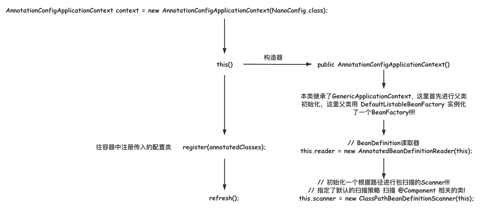
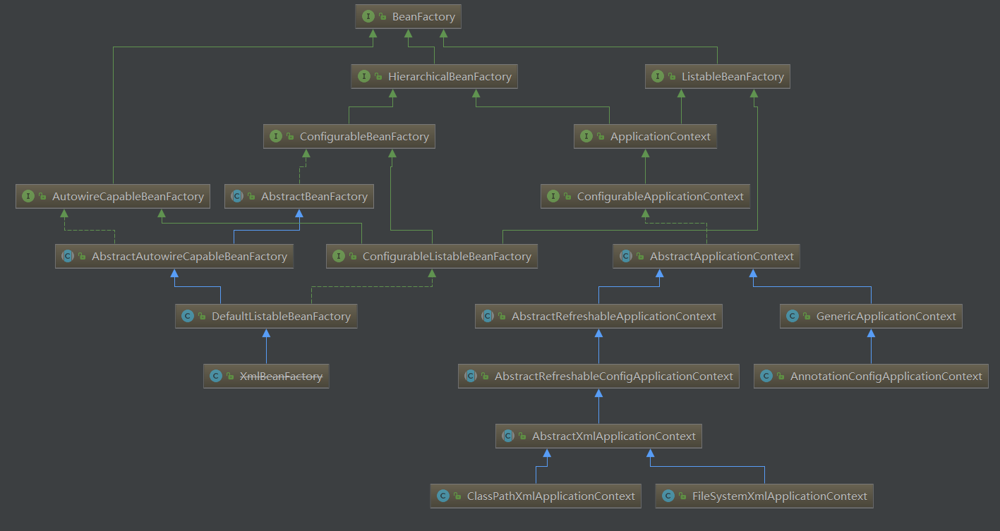
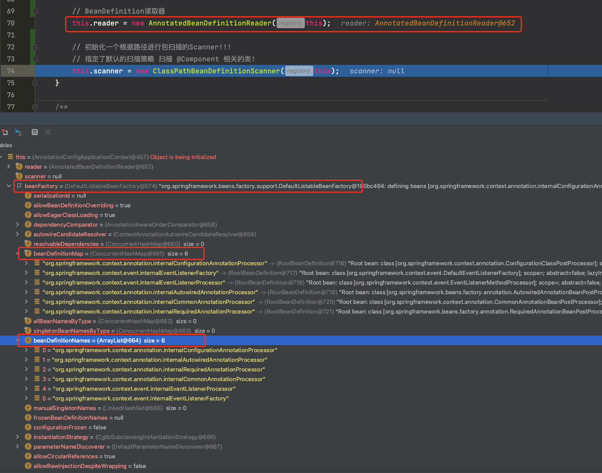
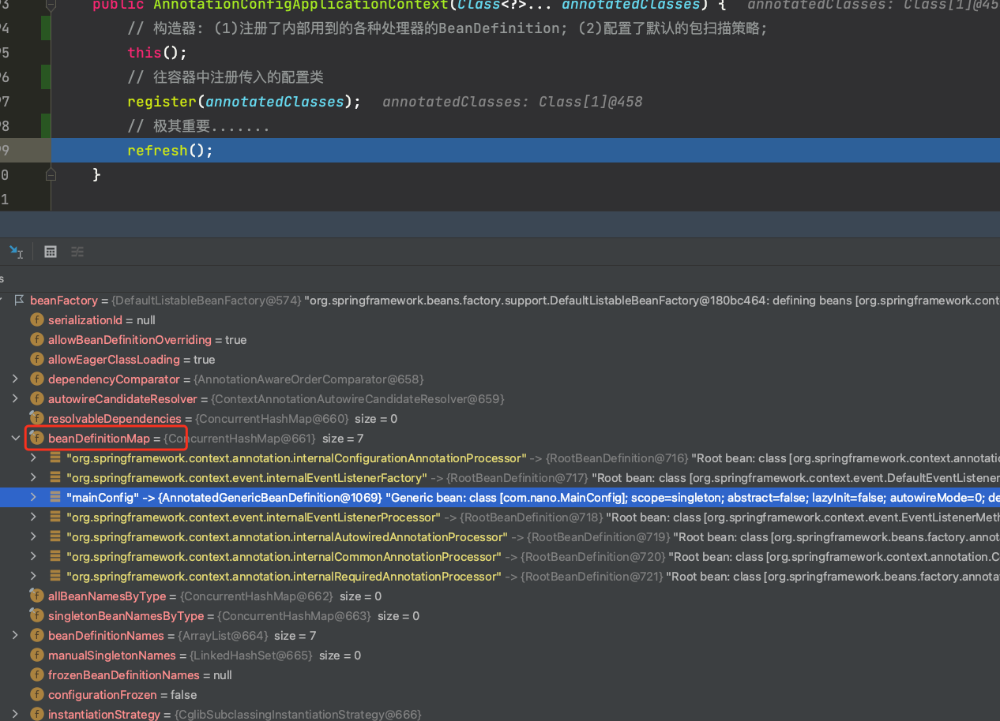
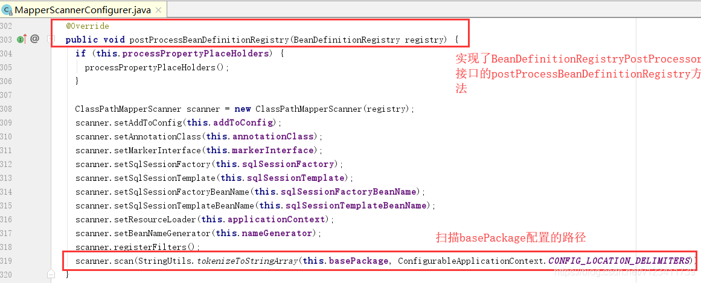

[TOC]

## Spring IOC源码分析之概览

### 基础

#### Spring容器继承图


### 引入与构造方法

#### 分析引入

定义配置类如下。

```java
@Configuration
public class NanoConfig {

    @Bean(name = "testBean")
    public TestBean testBean() {
        return new TestBean();
    }
}
```

初始化一个容器，然后从容器获取指定名称的 bean。

```java
public static void main(String[] args) {
    // 传入配置类
    AnnotationConfigApplicationContext context = new AnnotationConfigApplicationContext(NanoConfig.class);

    System.out.println(context.getBean("testBean"));
}
```

进入 AnnotationConfigApplicationContext 的构造器。

> **AnnotationConfigApplicationContext构造方法**

```java
public AnnotationConfigApplicationContext(Class<?>... annotatedClasses) {
    // 构造器: (1)注册了内部用到的各种处理器的BeanDefinition; (2)配置了默认的包扫描策略;
    this();
    // 往容器中注册传入的配置类
    register(annotatedClasses);
    // 极其重要.......
    refresh();
}
```

这里主要流程如下：



下面依次分析上述方法的三句代码。

#### 准备工作

首先看调用 this() 方法如下。完成的事情：(1)注册了内部用到的各种处理器的BeanDefinition; (2)配置了默认的包扫描策略;

##### 1.构造方法

this() 方法初始化一个容器对象。由于 AnnotationConfigApplicationContext 类继承了 **GenericApplicationContext** 类，所以这里先初始化父类 GenericApplicationContext 对象，看看其初始化方法如下。

> **GenericApplicationContext构造方法**

```java
public GenericApplicationContext() {
    // 调用默认构造方法
    // DefaultListableBeanFactory是各种接口的实现类，功能齐全
    this.beanFactory = new DefaultListableBeanFactory();
}
```

这里实例化了一个 **DefaultListableBeanFactory** 对象作为 beanFactory 的实现。可以看下面的继承图，这里看到 DefaultListableBeanFactory 实现了多个接口，功能最为齐全。



再回到 AnnotationConfigApplicationContext 类的构造器。源码如下。

> **AnnotationConfigApplicationContext构造方法**

```java
public AnnotationConfigApplicationContext() {

    // 首先进行构造 本类继承了GenericApplicationContext 因此会先进行父类的初始化
    // 这里父类用 DefaultListableBeanFactory 实例化了一个BeanFactory!!!!

    // BeanDefinition读取器
    this.reader = new AnnotatedBeanDefinitionReader(this);

    // 初始化一个根据路径进行包扫描的Scanner!!!
    // 指定了默认的扫描策略 扫描 @Component 相关的类!
    this.scanner = new ClassPathBeanDefinitionScanner(this);
}
```

这里实例化了两个对象，分别是 BeanDefinition 读取器和包扫描器。

##### 2.初始化AnnotatedBeanDefinitionReader

首先初始化了一个 BeanDefinition 的读取器。看看源码。

```java
this.reader = new AnnotatedBeanDefinitionReader(this);
```

> **AnnotatedBeanDefinitionReader构造方法**

```java
public AnnotatedBeanDefinitionReader(BeanDefinitionRegistry registry) {

    // 先生成环境再创建
    this(registry, getOrCreateEnvironment(registry));
}
```

进去 this() 方法。

> **AnnotatedBeanDefinitionReader重载构造方法**

```java
public AnnotatedBeanDefinitionReader(BeanDefinitionRegistry registry, Environment environment) {
    Assert.notNull(registry, "BeanDefinitionRegistry must not be null");
    Assert.notNull(environment, "Environment must not be null");
    this.registry = registry;
    this.conditionEvaluator = new ConditionEvaluator(registry, environment, null);
    // 这里很重要
    // 往容器中注入了各种内部需要的组件的BeanDefinition!!!
    AnnotationConfigUtils.registerAnnotationConfigProcessors(this.registry);
}
```

registerAnnotationConfigProcessors() 方法如下。

> **AnnotationConfigUtils.registerAnnotationConfigProcessors()**

```java
public static void registerAnnotationConfigProcessors(BeanDefinitionRegistry registry) {
    // 进去看
    registerAnnotationConfigProcessors(registry, null);
}
```

下面才是关键方法。

> **AnnotationConfigUtils.registerAnnotationConfigProcessors()**

```java
public static Set<BeanDefinitionHolder> registerAnnotationConfigProcessors(
    BeanDefinitionRegistry registry, @Nullable Object source) {

    DefaultListableBeanFactory beanFactory = unwrapDefaultListableBeanFactory(registry);
    if (beanFactory != null) {
        if (!(beanFactory.getDependencyComparator() instanceof AnnotationAwareOrderComparator)) {
            beanFactory.setDependencyComparator(AnnotationAwareOrderComparator.INSTANCE);
        }
        if (!(beanFactory.getAutowireCandidateResolver() instanceof ContextAnnotationAutowireCandidateResolver)) {
            beanFactory.setAutowireCandidateResolver(new ContextAnnotationAutowireCandidateResolver());
        }
    }

    Set<BeanDefinitionHolder> beanDefs = new LinkedHashSet<>(8);

    // 很重要!!!
    // org.springframework.context.annotation.internalConfigurationAnnotationProcessor
    if (!registry.containsBeanDefinition(CONFIGURATION_ANNOTATION_PROCESSOR_BEAN_NAME)) {
        RootBeanDefinition def = new RootBeanDefinition(ConfigurationClassPostProcessor.class);
        def.setSource(source);
        // 注册Bean定义到容器中
        beanDefs.add(registerPostProcessor(registry, def, CONFIGURATION_ANNOTATION_PROCESSOR_BEAN_NAME));
    }

    if (!registry.containsBeanDefinition(AUTOWIRED_ANNOTATION_PROCESSOR_BEAN_NAME)) {
        RootBeanDefinition def = new RootBeanDefinition(AutowiredAnnotationBeanPostProcessor.class);
        def.setSource(source);
        beanDefs.add(registerPostProcessor(registry, def, AUTOWIRED_ANNOTATION_PROCESSOR_BEAN_NAME));
    }

    if (!registry.containsBeanDefinition(REQUIRED_ANNOTATION_PROCESSOR_BEAN_NAME)) {
        RootBeanDefinition def = new RootBeanDefinition(RequiredAnnotationBeanPostProcessor.class);
        def.setSource(source);
        beanDefs.add(registerPostProcessor(registry, def, REQUIRED_ANNOTATION_PROCESSOR_BEAN_NAME));
    }

    // Check for JSR-250 support, and if present add the CommonAnnotationBeanPostProcessor.
    if (jsr250Present && !registry.containsBeanDefinition(COMMON_ANNOTATION_PROCESSOR_BEAN_NAME)) {
        RootBeanDefinition def = new RootBeanDefinition(CommonAnnotationBeanPostProcessor.class);
        def.setSource(source);
        beanDefs.add(registerPostProcessor(registry, def, COMMON_ANNOTATION_PROCESSOR_BEAN_NAME));
    }

    // Check for JPA support, and if present add the PersistenceAnnotationBeanPostProcessor.
    if (jpaPresent && !registry.containsBeanDefinition(PERSISTENCE_ANNOTATION_PROCESSOR_BEAN_NAME)) {
        RootBeanDefinition def = new RootBeanDefinition();
        try {
            def.setBeanClass(ClassUtils.forName(PERSISTENCE_ANNOTATION_PROCESSOR_CLASS_NAME,
                                                AnnotationConfigUtils.class.getClassLoader()));
        }
        catch (ClassNotFoundException ex) {
            throw new IllegalStateException(
                "Cannot load optional framework class: " + PERSISTENCE_ANNOTATION_PROCESSOR_CLASS_NAME, ex);
        }
        def.setSource(source);
        beanDefs.add(registerPostProcessor(registry, def, PERSISTENCE_ANNOTATION_PROCESSOR_BEAN_NAME));
    }

    if (!registry.containsBeanDefinition(EVENT_LISTENER_PROCESSOR_BEAN_NAME)) {
        RootBeanDefinition def = new RootBeanDefinition(EventListenerMethodProcessor.class);
        def.setSource(source);
        beanDefs.add(registerPostProcessor(registry, def, EVENT_LISTENER_PROCESSOR_BEAN_NAME));
    }

    if (!registry.containsBeanDefinition(EVENT_LISTENER_FACTORY_BEAN_NAME)) {
        RootBeanDefinition def = new RootBeanDefinition(DefaultEventListenerFactory.class);
        def.setSource(source);
        beanDefs.add(registerPostProcessor(registry, def, EVENT_LISTENER_FACTORY_BEAN_NAME));
    }

    return beanDefs;
}
```

这里就是将各种**==内部需要==的组件、解析器**的 BeanDefinition 注册到容器中！！！

通过 debug 模式看看，当执行完 AnnotatedBeanDefinitionReader 的初始化后，已经实例化了一个 **DefaultListableBeanFactory** 对象作为 BeanFactory。此时 beanFactory 中的 beanDefinitionMap 和 beanDefinitionNames 已经包含了上述代码中添加到容器中的几个 BeanDefinition 了。



##### 3.初始化ClassPathBeanDefinitionScanner

BeanDefinition 读取器初始化完成后，再初始化一个根据路径进行包扫描的 **Scanner**，初始化的同时指定了默认的扫描策略，可以扫描 **@Component 注解**相关的类。看看源码。

```java
this.scanner = new ClassPathBeanDefinitionScanner(this);
```

> **ClassPathBeanDefinitionScanner构造方法**

```java
public ClassPathBeanDefinitionScanner(BeanDefinitionRegistry registry) {
    // 进去(使用默认Filter)
    this(registry, true);
}
```

这里调用了另一个构造方法，传 true 表示**使用默认的 Filter**。

> **ClassPathBeanDefinitionScanner重载构造方法**

```java
public ClassPathBeanDefinitionScanner(BeanDefinitionRegistry registry, boolean useDefaultFilters) {
    // 进去
    this(registry, useDefaultFilters, getOrCreateEnvironment(registry));
}
```

进去

```java
public ClassPathBeanDefinitionScanner(BeanDefinitionRegistry registry, boolean useDefaultFilters,
                                      Environment environment) {

    this(registry, useDefaultFilters, environment,
         (registry instanceof ResourceLoader ? (ResourceLoader) registry : null));
}
```

再进去：

> **ClassPathBeanDefinitionScanner重载构造方法**

```java
public ClassPathBeanDefinitionScanner(BeanDefinitionRegistry registry, boolean useDefaultFilters,
                                      Environment environment, @Nullable ResourceLoader resourceLoader) {

    Assert.notNull(registry, "BeanDefinitionRegistry must not be null");
    this.registry = registry;

    // 使用默认Filter
    if (useDefaultFilters) {

        // 重要: 注册默认的Filter!!!进去!!!
        registerDefaultFilters();
    }
    // 设置环境
    setEnvironment(environment);
    // 设置资源加载器
    setResourceLoader(resourceLoader);
}
```

这里 **registerDefaultFilters**() 方法比较重要，进去康康。

> **ClassPathBeanDefinitionScanner::registerDefaultFilters()**

```java
protected void registerDefaultFilters() {

    // 这里相当于自动往包扫描器中加入了Component类型的注解的扫描，此时Component、Repository、Service、Controller等注解的类将会被扫描到!!!!!!!!
    // 这个跟注解@ComponentScan的用法是类似的!!!!
    this.includeFilters.add(new AnnotationTypeFilter(Component.class));

    ClassLoader cl = ClassPathScanningCandidateComponentProvider.class.getClassLoader();
    try {
        this.includeFilters.add(new AnnotationTypeFilter(
            ((Class<? extends Annotation>) ClassUtils.forName("javax.annotation.ManagedBean", cl)), false));
        logger.debug("JSR-250 'javax.annotation.ManagedBean' found and supported for component scanning");
    }
    catch (ClassNotFoundException ex) {
        // JSR-250 1.1 API (as included in Java EE 6) not available - simply skip.
    }
    try {
        this.includeFilters.add(new AnnotationTypeFilter(
            ((Class<? extends Annotation>) ClassUtils.forName("javax.inject.Named", cl)), false));
        logger.debug("JSR-330 'javax.inject.Named' annotation found and supported for component scanning");
    }
    catch (ClassNotFoundException ex) {
        // JSR-330 API not available - simply skip.
    }
}
```

注意看此方法的第一句。

```java
this.includeFilters.add(new AnnotationTypeFilter(Component.class));
```

这里就是添加了 Component 注解到 includeFilters 中，这个其实就与 @ComponentScan 注解的 includeFilters 参数是一样的。因此到了这里，Spring 就会**自动去加载标注了 @Component 注解的类**，包含 @Configuration，@Controller，@Service，@Repository 等的类。

#### 注册配置类

接着分析容器构造器第二句代码。

> **AnnotationConfigApplicationContext构造方法**

```java
public AnnotationConfigApplicationContext(Class<?>... annotatedClasses) {
    // 构造器: (1)注册了内部用到的各种处理器的BeanDefinition; (2)配置了默认的包扫描策略;
    this();
    // 往容器中注册传入的配置类
    register(annotatedClasses);
    // 极其重要.......
    refresh();
}
```

这里通过前一步初始化的 **AnnotatedBeanDefinitionReader** 对传入的配置类进行解析并注册。

> **AnnotationConfigApplicationContext::register()**

```java
public void register(Class<?>... annotatedClasses) {
    Assert.notEmpty(annotatedClasses, "At least one annotated class must be specified");
    // 点进去
    this.reader.register(annotatedClasses);
}
```

这里挨着注册传入的配置类，调用之前创建的 AnnotatedBeanDefinitionReader 的 register() 方法进行注册。

> **AnnotationConfigApplicationContext::register()**

```java
public void register(Class<?>... annotatedClasses) {
    for (Class<?> annotatedClass : annotatedClasses) {
        // 注册配置类中的Bean
        registerBean(annotatedClass);
    }
}
```

> **AnnotatedBeanDefinitionReader::register()**

```java
public void registerBean(Class<?> annotatedClass) {
    doRegisterBean(annotatedClass, null, null, null);
}
```

真正干活的是 doRegisterBean() 方法。

> **AnnotatedBeanDefinitionReader::doRegisterBean()**

```java
<T> void doRegisterBean(Class<T> annotatedClass, @Nullable Supplier<T> instanceSupplier, @Nullable String name, @Nullable Class<? extends Annotation>[] qualifiers, BeanDefinitionCustomizer... definitionCustomizers) {

    // 初始化一个BeanDefinition对象(由于承载各种Bean的属性)
    AnnotatedGenericBeanDefinition abd = new AnnotatedGenericBeanDefinition(annotatedClass);
    if (this.conditionEvaluator.shouldSkip(abd.getMetadata())) {
        return;
    }

    abd.setInstanceSupplier(instanceSupplier);
    ScopeMetadata scopeMetadata = this.scopeMetadataResolver.resolveScopeMetadata(abd);
    abd.setScope(scopeMetadata.getScopeName());
    String beanName = (name != null ? name : this.beanNameGenerator.generateBeanName(abd, this.registry));

    AnnotationConfigUtils.processCommonDefinitionAnnotations(abd);
    if (qualifiers != null) {
        for (Class<? extends Annotation> qualifier : qualifiers) {
            if (Primary.class == qualifier) {
                abd.setPrimary(true);
            }
            // 是否标注延迟初始化
            else if (Lazy.class == qualifier) {
                abd.setLazyInit(true);
            }
            else {
                abd.addQualifier(new AutowireCandidateQualifier(qualifier));
            }
        }
    }
    for (BeanDefinitionCustomizer customizer : definitionCustomizers) {
        customizer.customize(abd);
    }

    // 生成BeanDefinitionHolder
    BeanDefinitionHolder definitionHolder = new BeanDefinitionHolder(abd, beanName);
    definitionHolder = AnnotationConfigUtils.applyScopedProxyMode(scopeMetadata, definitionHolder, this.registry);
    // 注册BeanDefinitionHolder
    // 把自己的配置类的定义注册到容器中
    BeanDefinitionReaderUtils.registerBeanDefinition(definitionHolder, this.registry);
}
```

看看最后一句 BeanDefinitionReaderUtils.registerBeanDefinition() 方法。这里进行对 BeanDefinition 进行注册。

> **BeanDefinitionReaderUtils.registerBeanDefinition()**

```java
public static void registerBeanDefinition(BeanDefinitionHolder definitionHolder, BeanDefinitionRegistry registry)
    throws BeanDefinitionStoreException {

    // 使用beanName作为唯一标识注册
    String beanName = definitionHolder.getBeanName();

    // 通过注册器将BeanDefinition注册到beanDefinitionMap中
    // 实现类：DefaultListableBeanFactory.java
    registry.registerBeanDefinition(beanName, definitionHolder.getBeanDefinition());

    // 注册所有的别名(如果存在)
    // 如果还有别名的话，也要根据别名全部注册一遍，不然根据别名就会找不到Bean了
    String[] aliases = definitionHolder.getAliases();
    if (aliases != null) {
        for (String alias : aliases) {
            // alias -> beanName 保存它们的别名信息，这个很简单，用一个map保存一下就可以了，
            // 获取的时候，会先将alias转换为beanName，然后再查找
            registry.registerAlias(beanName, alias);
        }
    }
}
```

至此就把传入的**配置类**的 BeanDefinition 注册到了容器中。

继续看看 debug 模式下的执行过程。可以看到执行完 registry() 方法后，beanDefinitionMap 中已经加入了自己传入的配置类的 BeanDefinition。




### refresh()

第三步是**==最核心==**的方法，**AbstractApplicationContext** 类的 **refresh()** 方法，这个方法就是构建整个 IoC 容器过程的完整代码，这里对各个步骤进行分析。

> **AbstractApplicationContext::refresh()**

```java
@Override
public void refresh() throws BeansException, IllegalStateException {

    // 加锁 防止refresh()还没结束又来个启动或销毁容器的操作
    synchronized (this.startupShutdownMonitor) {

        // 1.准备工作
        // 记录容器的启动时间、标记"已启动"状态、处理配置文件中的占位符,对系统属性与环境变量进行准备与验证
        prepareRefresh();

        // 2.初始化BeanFactory(*)
        // 这步完成后，配置文件就会解析成一个个BeanDefinition，注册到BeanFactory中，
        // 这里Bean还没有初始化，只是配置信息都提取出来了，注册也只是将这些信息都保存
        // 到了注册中心中(其核心是一个beanName -> beanDefinition的map)
        ConfigurableListableBeanFactory beanFactory = obtainFreshBeanFactory();

        // 3.设置BeanFactory的类加载器，添加几个BeanPostProcessor，硬编码注册几个特殊的bean
        // 对BeanFactory进行各种功能填充，比如@Qualifier与@Autowired等注解就是在这步中支持的
        prepareBeanFactory(beanFactory);

        try {
            // 4.如果Bean实现了BeanFactoryPostProcessor接口，在容器初始化以后，
            // 会调用接口的postProcessBeanFactory方法。这里是提供给子类的扩展点，到这里的时候，
            // 所有的Bean都加载、注册完成了，但是都还没有初始化
            // 具体的子类可以在这步的时候添加一些特殊的BeanFactoryPostProcessor的实现类或做点什么事
            // 子类覆盖方法做额外的处理
            postProcessBeanFactory(beanFactory);

            // 5.调用BeanFactoryPostProcessor接口各个实现类的postProcessBeanFactory(factory)方法
            // 调用各种BeanFactory处理器
            invokeBeanFactoryPostProcessors(beanFactory);

            // 6.注册BeanPostProcessor接口的实现类(注意与BeanFactoryPostProcessor接口的区别)
            // 此接口两个方法: postProcessBeforeInitialization()和postProcessAfterInitialization()
            // 这两个方法分别在Bean初始化之前和初始化之后得到执行。注意这里仅仅是注册了后处理器，
            // 真正的调用是在getBean进行实例化的时候，这里bean还没初始化
            registerBeanPostProcessors(beanFactory);

            // 7.初始化当前容器的MessageSource国际化处理
            initMessageSource();

            // 8.初始化并往容器加入一个ApplicationContext的事件广播器(事件多播器)
            initApplicationEventMulticaster();

            // 9.典型的模板方法(构造方法)，子类可以在初始化单例beans之前来初始化一些特殊Bean
            onRefresh();

            // 10.注册事件监听器到事件多播器上(监听器需实现ApplicationListener接口)
            registerListeners();

            // 11.(重点重点重点)：初始化剩下所有的单例的beans(配置了lazy-init的除外)
            finishBeanFactoryInitialization(beanFactory);

            // 12.广播事件，ApplicationContext初始化完成
            finishRefresh();

        } catch (BeansException ex) {
            if (logger.isWarnEnabled()) {
                logger.warn("Exception encountered during context initialization - " +
                            "cancelling refresh attempt: " + ex);
            }

            // 销毁已经初始化的单例Beans，以免有些bean会一直占用资源
            destroyBeans();

            // 重置active标志位
            cancelRefresh(ex);

            // 抛异常
            throw ex;

        } finally {
            resetCommonCaches();
        }
    }
}
```

#### 各步骤概述

##### 1.prepareRefresh()

主要是一些准备工作。为刷新准备新的**上下文环境**，设置其启动日期和活动标志以及执行一些属性的初始化。

##### 2.obtainFreshBeanFactory():star2:

用于获得一个新的 BeanFactory。

该方法会解析所有 Spring **配置文件**(通常会放在 resources 目录下)，并将所有配置文件中的 bean 定义封装成 **BeanDefinition** 加载到 BeanFactory 中。常见的，如果解析到 @ComponentScan 注解时，会扫描 base-package 指定的目录，将该目录下使用指定注解(@Controller、@Service、@Component、@Repository) 的 **bean 定义也同样封装成 BeanDefinition** 加载到 BeanFactory 中。

上面提到的 “加载到 BeanFactory 中” 的内容主要指的是以下 3 个缓存：

- **beanDefinitionNames 缓存**：所有被加载到 BeanFactory 中的 bean 的 **beanName** 集合。
- **beanDefinitionMap 缓存**：所有被加载到 BeanFactory 中的 bean 的 **beanName** 与 **BeanDefinition** 映射。
- **aliasMap 缓存**：所有被加载到 BeanFactory 中的 bean 的 **beanName 与别名**映射。

##### 3.prepareBeanFactory(beanFactory)

配置 beanFactory 的**标准上下文特征**，例如上下文的 ClassLoader、后置处理器等。这个方法会注册 3 个默认环境 bean：environment、systemProperties 和 systemEnvironment，注册 2 个 bean 后置处理器：**ApplicationContextAwareProcessor** 和 **ApplicationListenerDetector**。

##### 4.postProcessBeanFactory(beanFactory)

允许**子类对 BeanFactory 进行后续处理**，默认实现为空，留给**子类**实现。

##### 5.invokeBeanFactoryPostProcessors(beanFactory):star2:

实例化和调用所有 **BeanFactoryPostProcessor **接口的实现类，包括其子接口 **BeanDefinitionRegistryPostProcessor** 的实现类。

**==BeanFactoryPostProcessor==** 接口是 Spring **==初始化 BeanFactory 时==**对外暴露的扩展点，Spring IoC 容器允许 BeanFactoryPostProcessor 在**容器实例化任何 bean 之前读取 bean 的定义，并可以修改它**。

**==BeanDefinitionRegistryPostProcessor==** 接口继承自 BeanFactoryPostProcessor 接口，比 BeanFactoryPostProcessor 具有**更高的优先级**，主要用来在常规的 BeanFactoryPostProcessor 激活之前**注册一些 bean 定义**。特别的，可以通过 BeanDefinitionRegistryPostProcessor 来**注册一些常规的 BeanFactoryPostProcessor**，因为此时所有常规的 BeanFactoryPostProcessor 都还没开始被处理。 

注：这边的 “常规 BeanFactoryPostProcessor” 主要用来与 BeanDefinitionRegistryPostProcessor 区分。

##### 6.registerBeanPostProcessors(beanFactory):star2:

注册所有的 **==BeanPostProcessor==**，将所有实现了 BeanPostProcessor 接口的类**加载到 BeanFactory 中**。

BeanPostProcessor 接口是 Spring **==初始化 bean 时==**对外暴露的扩展点，Spring IoC 容器允许 BeanPostProcessor 在**容器初始化 bean 的前后**，添加自己的逻辑处理。

这个方法只是将 BeanPostProcessor 实现类注册到 BeanFactory 中，**具体调用是在后面对 bean 进行初始化的 finishBeanFactoryInitialization() 方法中**。在后面所有 bean 实例化过程中，在执行**初始化方法前后会分别调用**所有 BeanPostProcessor 接口的 **postProcessBeforeInitialization**() 方法与 **postProcessAfterInitialization**() 方法。

##### 7.initMessageSource()

国际化相关。初始化消息资源 MessageSource。

##### 8.initApplicationEventMulticaster()

初始化应用的事件广播(多播)器 ApplicationEventMulticaster。

##### 9.onRefresh()

该方法为**模板方法**，提供给**子类**扩展实现，可以重写以添加特定于上下文的刷新工作，默认实现为空。比如 **Spring Boot** 通过这个方法实现 **Tomcat** 的启动。

##### 10.registerListeners()

注册事件监听器。

##### 11.finishBeanFactoryInitialization(beanFactory):star2:

该方法会实例化所有**剩余的非懒加载单例 bean**。除了一些内部的 bean、实现了 BeanFactoryPostProcessor 接口的 bean、实现了 BeanPostProcessor 接口的 bean，其他的非懒加载单例 bean 都会在这个方法中被实例化，并且 **BeanPostProcessor** 的接口方法也是在这个方法中触发。

##### 12.finishRefresh()

完成此上下文的刷新，主要是推送上下文刷新完毕事件（ContextRefreshedEvent）到监听器。

上文加星的方法为构建 IoC 构成中最重要的 4 个方法，简单的描述就是：

- **obtainFreshBeanFactory()**：创建一个新的 BeanFactory、读取和解析 **bean 定义**。
- **invokeBeanFactoryPostProcessors()**：提供给开发者对 **BeanFactory** 进行扩展。
- **registerBeanPostProcessors()**：提供给开发者对 **bean** 进行扩展。
- **finishBeanFactoryInitialization()**：**实例化**剩余的所有非懒加载单例 bean。

#### obtainFreshBeanFactory()

##### 1.概述

该方法会解析所有 Spring **配置文件**(通常会放在 resources 目录下)，并将所有配置文件中的 bean 定义封装成 **BeanDefinition** 加载到 BeanFactory 中。常见的，如果解析到 @ComponentScan 注解时，会扫描 base-package 指定的目录，将该目录下使用指定注解(@Controller、@Service、@Component、@Repository) 的 **bean 定义也同样封装成 BeanDefinition** 加载到 BeanFactory 中。

这里 “加载到 BeanFactory 中” 的内容主要指的是以下 3 个缓存：

- **beanDefinitionNames 缓存**：所有被加载到 BeanFactory 中的 bean 的 **beanName** 集合。
- **beanDefinitionMap 缓存**：所有被加载到 BeanFactory 中的 bean 的 **beanName** 与 **BeanDefinition** 映射。
- **aliasMap 缓存**：所有被加载到 BeanFactory 中的 bean 的 **beanName 与别名**映射。

##### 2.源码分析

方法源码如下。

> **AbstractApplicationContext::obtainFreshBeanFactory()**

```java
protected ConfigurableListableBeanFactory obtainFreshBeanFactory() {

    // 如果有则关闭旧的BeanFactory，创建新的BeanFactory，加载Bean定义、注册Bean等等
    // 实现类为GenericApplicationContext
    refreshBeanFactory();

    // 返回刚刚创建的BeanFactory
    ConfigurableListableBeanFactory beanFactory = getBeanFactory();

    if (logger.isDebugEnabled()) {
        logger.debug("Bean factory for " + getDisplayName() + ": " + beanFactory);
    }

    return beanFactory;
}
```

核心方法 refreshBeanFactory() 是一个**抽象方法**，如果是基于 XML 配置的容器，其实现类为 AbstractRefreshableApplicationContext 类。这里是通过**注解**的形式，实现类看 **GenericApplicationContext**。下面看看源码。

> **GenericApplicationContext::refreshBeanFactory()**

```java
/**
 * Do nothing: We hold a single internal BeanFactory and rely on callers
 * to register beans through our public methods (or the BeanFactory's).
 * @see #registerBeanDefinition
 */
@Override
protected final void refreshBeanFactory() throws IllegalStateException {
    if (!this.refreshed.compareAndSet(false, true)) {
        throw new IllegalStateException(
            "GenericApplicationContext does not support multiple refresh attempts: just call 'refresh' once");
    }
    this.beanFactory.setSerializationId(getId());
}
```

这里啥也没干。但是如果基于 XML 配置的容器，其实现类是 AbstractRefreshableApplicationContext，那么这个方法就比较多了。

> **AbstractRefreshableApplicationContext::refreshBeanFactory()**

```java
@Override
protected final void refreshBeanFactory() throws BeansException {

    // 1.如果当前ApplicationContext中已经加载过BeanFactory了，销毁所有Bean，关闭BeanFactory
    // 注意：应用中BeanFactory本来就是可以多个的，这里不是说应用全局是否有BeanFactory，而是当前ApplicationContext是否有BeanFactory
    if (hasBeanFactory()) {
        // 销毁已经存在的bean
        destroyBeans();
        // 关闭BeanFactory
        closeBeanFactory();

    } try {

        // 2.初始化一个新的BeanFactory
        // 实现类是DefaultListableBeanFactory!!!!它是一个非常全的BeanFactory实例，后面的操作都是委托其进行的
        DefaultListableBeanFactory beanFactory = createBeanFactory();
        // 用于BeanFactory的序列化
        beanFactory.setSerializationId(getId());

        // 3.设置BeanFactory的两个配置属性：是否允许Bean覆盖、是否允许循环引用
        // 实现类：AbstractRefreshableApplicationContext.java
        customizeBeanFactory(beanFactory);

        // 4.加载BeanDefinition到BeanFactory中 看实现类：AnnotationConfigWebApplicationContext.java
        loadBeanDefinitions(beanFactory);

        // 将产生的beanFactory赋予本容器
        this.beanFactory = beanFactory;

    } catch (IOException ex) {
        throw new ApplicationContextException("I/O error parsing bean definition source for " + getDisplayName(), ex);
    }
}
```

#### invokeBeanFactoryPostProcessors(beanFactory)

##### 1.概述

BeanFactoryPostProcessor 是 **BeanFactory 的后置处理器**，其**触发时期是在 BeanDefinition 加载完成后，但是没有进行 Bean 的实例化之前**。这里可以对 **BeanDefinition** 做一些**属性修改**操作。

这里实例化并调用全部已经注册的 BeanFactoryPostProcessor Beans，并且必须在单例 Bean 初始化之前调用。本方法会实例化和调用所有 **BeanFactoryPostProcessor**(包括其子类 BeanDefinitionRegistryPostProcessor)。

##### 2.重要接口

本部分涉及两个主要接口。**BeanFactoryPostProcessor** 接口如下。BeanFactoryPostProcessor 接口是 Spring 初始化 **BeanFactory** 时对外暴露的扩展点，**Spring IoC 容器允许 BeanFactoryPostProcessor 在容器实例化任何 bean 之前读取 beanDefinition，并可以修改它**。

> **BeanFactoryPostProcessor接口**

```java
public interface BeanFactoryPostProcessor {
	/**
	 * Modify the application context's internal bean factory after its standard
	 * initialization. All bean definitions will have been loaded, but no beans
	 * will have been instantiated yet. This allows for overriding or adding
	 * properties even to eager-initializing beans.
	 * @param beanFactory the bean factory used by the application context
	 * @throws org.springframework.beans.BeansException in case of errors
	 */
	void postProcessBeanFactory(ConfigurableListableBeanFactory beanFactory) throws BeansException;

}
```

BeanDefinitionRegistryPostProcessor 接口继承了 BeanFactoryPostProcessor 接口如下。

**BeanDefinitionRegistryPostProcessor** 继承自 **BeanFactoryPostProcessor**，比 BeanFactoryPostProcessor 具有**更高的优先级**，主要用来在**常规的 BeanFactoryPostProcessor 检测开始之前注册其他 beanDefinition**。特别的，可以通过 BeanDefinitionRegistryPostProcessor 来**注册**一些常规的 BeanFactoryPostProcessor，因为此时所有常规的 BeanFactoryPostProcessor 都还没开始被处理。

**BeanDefinitionRegistryPostProcessor** 在 BeanDefinition 还没有加载之前，可以**自己往容器加入 BeanDefinition**。

> **BeanDefinitionRegistryPostProcessor接口**

```java
public interface BeanDefinitionRegistryPostProcessor extends BeanFactoryPostProcessor {

	/**
	 * Modify the application context's internal bean definition registry after its
	 * standard initialization. All regular bean definitions will have been loaded,
	 * but no beans will have been instantiated yet. This allows for adding further
	 * bean definitions before the next post-processing phase kicks in.
	 * @param registry the bean definition registry used by the application context
	 * @throws org.springframework.beans.BeansException in case of errors
	 */
	void postProcessBeanDefinitionRegistry(BeanDefinitionRegistry registry) throws BeansException;

}
```

主要区别：

- **BeanDefinitionRegistryPostProcessor接口**：在 BeanDefinition 还没有加载之前，可以**自己往容器加入 BeanDefinition**。强调**==新增 BeanDefinition==**。
- **BeanFactoryPostProcessor接口**：在容器实例化任何 bean 之前读取 beanDefinition，并可以**修改**它。强调**==修改 BeanDefinition==**。

##### 3.源码分析

invokeBeanFactoryPostProcessors() 方法源码如下。

> **AbstractApplicationContext::invokeBeanFactoryPostProcessors()**

```java
protected void invokeBeanFactoryPostProcessors(ConfigurableListableBeanFactory beanFactory) {

    // 重点方法
    PostProcessorRegistrationDelegate.invokeBeanFactoryPostProcessors(beanFactory, getBeanFactoryPostProcessors());

    // Detect a LoadTimeWeaver and prepare for weaving, if found in the meantime
    // (e.g. through an @Bean method registered by ConfigurationClassPostProcessor)
    if (beanFactory.getTempClassLoader() == null && beanFactory.containsBean(LOAD_TIME_WEAVER_BEAN_NAME)) {
        beanFactory.addBeanPostProcessor(new LoadTimeWeaverAwareProcessor(beanFactory));
        beanFactory.setTempClassLoader(new ContextTypeMatchClassLoader(beanFactory.getBeanClassLoader()));
    }
}
```

进入 **invokeBeanFactoryPostProcessors**() 方法。贼长。

> **PostProcessorRegistrationDelegate.invokeBeanFactoryPostProcessors()**

```java
public static void invokeBeanFactoryPostProcessors(
    ConfigurableListableBeanFactory beanFactory, List<BeanFactoryPostProcessor> beanFactoryPostProcessors) {

    // Invoke BeanDefinitionRegistryPostProcessors first, if any.
    Set<String> processedBeans = new HashSet<>();

    // 1.判断IOC容器是不是BeanDefinitionRegistry的
    // 由于DefaultListableBeanFactory实现了BeanDefinitionRegistry接口，这里会进入下面的逻辑
    if (beanFactory instanceof BeanDefinitionRegistry) {
        BeanDefinitionRegistry registry = (BeanDefinitionRegistry) beanFactory;
        // 用于存放普通的BeanFactoryPostProcessor
        List<BeanFactoryPostProcessor> regularPostProcessors = new ArrayList<>();
        // 用于存放BeanDefinitionRegistryPostProcessor
        List<BeanDefinitionRegistryPostProcessor> registryProcessors = new ArrayList<>();

        // 2.首先处理入参中的beanFactoryPostProcessors，这些是容器硬编码(new 出来的)导入的后处理器
        // 遍历所有的beanFactoryPostProcessors,将BeanDefinitionRegistryPostProcessor和普通BeanFactoryPostProcessor区分开
        for (BeanFactoryPostProcessor postProcessor : beanFactoryPostProcessors) {
            if (postProcessor instanceof BeanDefinitionRegistryPostProcessor) {
                // 2.1 如果是BeanDefinitionRegistryPostProcessor
                BeanDefinitionRegistryPostProcessor registryProcessor =
                    (BeanDefinitionRegistryPostProcessor) postProcessor;
                // 重要!!!
                // 2.1.1 直接执行BeanDefinitionRegistryPostProcessor接口的postProcessBeanDefinitionRegistry方法
                registryProcessor.postProcessBeanDefinitionRegistry(registry);
                // 2.1.2 添加到registryProcessors(用于最后执行postProcessBeanFactory方法)
                registryProcessors.add(registryProcessor);
            } else {
                // 2.2 否则只是普通的BeanFactoryPostProcessor
                // 2.2.1 添加到regularPostProcessors(用于最后执行postProcessBeanFactory方法)
                regularPostProcessors.add(postProcessor);
            }
        }

        // 用于保存本次要执行的BeanDefinitionRegistryPostProcessor
        List<BeanDefinitionRegistryPostProcessor> currentRegistryProcessors = new ArrayList<>();

        // 3.调用所有实现PriorityOrdered接口的BeanDefinitionRegistryPostProcessor实现类
        // 3.1 找出所有实现BeanDefinitionRegistryPostProcessor接口的Bean的beanName
        String[] postProcessorNames =
            beanFactory.getBeanNamesForType(BeanDefinitionRegistryPostProcessor.class, true, false);

        // 3.2 遍历postProcessorNames，调用实现了PriorityOrdered接口的PostProcessor
        for (String ppName : postProcessorNames) {
            // 3.3 校验是否实现了PriorityOrdered接口
            if (beanFactory.isTypeMatch(ppName, PriorityOrdered.class)) {
                // 3.4 获取ppName对应的bean实例, 添加到currentRegistryProcessors中,
                // beanFactory.getBean: 这边getBean方法会触发创建ppName对应的bean对象
                currentRegistryProcessors.add(beanFactory.getBean(ppName, BeanDefinitionRegistryPostProcessor.class));
                // 3.5 将要被执行的加入processedBeans，避免后续重复执行
                processedBeans.add(ppName);
            }
        }
        // 3.6 进行排序(根据是否实现PriorityOrdered、Ordered接口和order值来排序)
        sortPostProcessors(currentRegistryProcessors, beanFactory);
        // 3.7 添加到registryProcessors(用于最后执行postProcessBeanFactory方法)
        registryProcessors.addAll(currentRegistryProcessors);
        // 重要！！！扫描加载所有的BeanDefinition！！！
        // 3.8 遍历currentRegistryProcessors, 执行postProcessBeanDefinitionRegistry方法
        invokeBeanDefinitionRegistryPostProcessors(currentRegistryProcessors, registry);
        currentRegistryProcessors.clear();	// 3.9 执行完了清理一下

        // 4.调用所有实现了Ordered接口的BeanDefinitionRegistryPostProcessor实现类(过程跟上面的步骤3基本一样)
        // 4.1 找出所有实现BeanDefinitionRegistryPostProcessor接口的类, 这边重复查找是因为执行完上面的BeanDefinitionRegistryPostProcessor,
        // 可能会新增了其他的BeanDefinitionRegistryPostProcessor,因此需要重新查找
        postProcessorNames = beanFactory.getBeanNamesForType(BeanDefinitionRegistryPostProcessor.class, true, false);
        for (String ppName : postProcessorNames) {
            // 校验是否实现了Ordered接口，并且还未执行过
            if (!processedBeans.contains(ppName) && beanFactory.isTypeMatch(ppName, Ordered.class)) {
                currentRegistryProcessors.add(beanFactory.getBean(ppName, BeanDefinitionRegistryPostProcessor.class));
                processedBeans.add(ppName);
            }
        }
        sortPostProcessors(currentRegistryProcessors, beanFactory);
        registryProcessors.addAll(currentRegistryProcessors);
        // 4.2 遍历currentRegistryProcessors,执行postProcessBeanDefinitionRegistry方法
        invokeBeanDefinitionRegistryPostProcessors(currentRegistryProcessors, registry);
        currentRegistryProcessors.clear();

        // 5.最后调用所有剩下的BeanDefinitionRegistryPostProcessors
        boolean reiterate = true;
        while (reiterate) {
            reiterate = false;
            // 5.1 找出所有实现BeanDefinitionRegistryPostProcessor接口的类
            postProcessorNames = beanFactory.getBeanNamesForType(BeanDefinitionRegistryPostProcessor.class, true, false);
            for (String ppName : postProcessorNames) {
                // 5.2 跳过已经执行过的
                if (!processedBeans.contains(ppName)) {
                    currentRegistryProcessors.add(beanFactory.getBean(ppName, BeanDefinitionRegistryPostProcessor.class));
                    processedBeans.add(ppName);
                    // 5.3 如果有BeanDefinitionRegistryPostProcessor被执行, 则有可能会产生新的BeanDefinitionRegistryPostProcessor,
                    // 因此这边将reiterate赋值为true, 代表需要再循环查找一次
                    reiterate = true;
                }
            }
            sortPostProcessors(currentRegistryProcessors, beanFactory);
            registryProcessors.addAll(currentRegistryProcessors);
            // 5.4 遍历currentRegistryProcessors,执行postProcessBeanDefinitionRegistry方法
            invokeBeanDefinitionRegistryPostProcessors(currentRegistryProcessors, registry);
            currentRegistryProcessors.clear();
        }

        // 6.调用所有BeanDefinitionRegistryPostProcessor的postProcessBeanFactory方法(BeanDefinitionRegistryPostProcessor继承自BeanFactoryPostProcessor)
        invokeBeanFactoryPostProcessors(registryProcessors, beanFactory);
        // 7.最后调用入参beanFactoryPostProcessors中的普通BeanFactoryPostProcessor的postProcessBeanFactory方法
        invokeBeanFactoryPostProcessors(regularPostProcessors, beanFactory);
    } else {
        // Invoke factory processors registered with the context instance.
        invokeBeanFactoryPostProcessors(beanFactoryPostProcessors, beanFactory);
    }

    // 到这里, 入参beanFactoryPostProcessors和容器中所有BeanDefinitionRegistryPostProcessor已经全部处理完毕,
    // 下面开始处理容器中的所有BeanFactoryPostProcessor

    // 8.找出所有实现BeanFactoryPostProcessor接口的类
    String[] postProcessorNames =
        beanFactory.getBeanNamesForType(BeanFactoryPostProcessor.class, true, false);

    // 将BeanFactoryPostProcessors分成三类：1.实现了PriorityOrdered接口的 2.实现了Ordered接口的 3.其他的
    List<BeanFactoryPostProcessor> priorityOrderedPostProcessors = new ArrayList<>();
    List<String> orderedPostProcessorNames = new ArrayList<>();
    List<String> nonOrderedPostProcessorNames = new ArrayList<>();
    // 8.1 遍历postProcessorNames,将BeanFactoryPostProcessor按实现PriorityOrdered、实现Ordered接口、普通三种区分开
    for (String ppName : postProcessorNames) {
        // 8.2 跳过已经执行过的
        // 忽略已经在上一阶段处理过的Processor
        if (processedBeans.contains(ppName)) {
            // skip - already processed in first phase above
        } else if (beanFactory.isTypeMatch(ppName, PriorityOrdered.class)) {
            // 8.3 添加实现了PriorityOrdered接口的BeanFactoryPostProcessor
            priorityOrderedPostProcessors.add(beanFactory.getBean(ppName, BeanFactoryPostProcessor.class));
        } else if (beanFactory.isTypeMatch(ppName, Ordered.class)) {
            // 8.4 添加实现了Ordered接口的BeanFactoryPostProcessor的beanName
            orderedPostProcessorNames.add(ppName);
        } else {
            // 8.5 添加剩下的普通BeanFactoryPostProcessor的beanName
            nonOrderedPostProcessorNames.add(ppName);
        }
    }

    // 9.首先调用所有实现PriorityOrdered接口的BeanFactoryPostProcessor
    // 9.1 对priorityOrderedPostProcessors排序
    sortPostProcessors(priorityOrderedPostProcessors, beanFactory);
    // 9.2 遍历priorityOrderedPostProcessors, 执行postProcessBeanFactory方法
    invokeBeanFactoryPostProcessors(priorityOrderedPostProcessors, beanFactory);

    // 10.其次调用所有实现Ordered接口的BeanFactoryPostProcessor
    List<BeanFactoryPostProcessor> orderedPostProcessors = new ArrayList<>();
    for (String postProcessorName : orderedPostProcessorNames) {
        // 10.1 获取postProcessorName对应的bean实例(通过bean名称获取bean), 添加到orderedPostProcessors, 准备执行
        orderedPostProcessors.add(beanFactory.getBean(postProcessorName, BeanFactoryPostProcessor.class));
    }
    // 10.2 对orderedPostProcessors排序
    sortPostProcessors(orderedPostProcessors, beanFactory);
    // 10.3 遍历orderedPostProcessors, 执行postProcessBeanFactory方法
    invokeBeanFactoryPostProcessors(orderedPostProcessors, beanFactory);

    // 11.最后调用所有剩下的BeanFactoryPostProcessor
    List<BeanFactoryPostProcessor> nonOrderedPostProcessors = new ArrayList<>();
    for (String postProcessorName : nonOrderedPostProcessorNames) {
        // 11.1 获取postProcessorName对应的bean实例, 添加到nonOrderedPostProcessors, 准备执行
        nonOrderedPostProcessors.add(beanFactory.getBean(postProcessorName, BeanFactoryPostProcessor.class));
    }
    // 11.2 遍历nonOrderedPostProcessors, 执行postProcessBeanFactory方法
    invokeBeanFactoryPostProcessors(nonOrderedPostProcessors, beanFactory);

    // 12.清除元数据缓存(mergedBeanDefinitions、allBeanNamesByType、singletonBeanNamesByType)，
    // 因为后处理器可能已经修改了原始元数据，例如，替换值中的占位符...
    beanFactory.clearMetadataCache();
}
```

整个 invokeBeanFactoryPostProcessors() 方法围绕两个接口，**BeanDefinitionRegistryPostProcessor** 和 **BeanFactoryPostProcessor**，这里 BeanDefinitionRegistryPostProcessor 继承了 BeanFactoryPostProcessor。BeanDefinitionRegistryPostProcessor 主要用来在**常规 BeanFactoryPostProcessor 检测开始之前注册其他 Bean 定义，BeanDefinitionRegistryPostProcessor 具有更高的优先级，执行顺序在 BeanFactoryPostProcessor 之前。**

整个 invokeBeanFactoryPostProcessors() 方法操作了 3 种 bean 对象：

- **入参 beanFactoryPostProcessors**：这个拿的是 AbstractApplicationContext 类的 beanFactoryPostProcessors 属性值，也就是在之前已经添加到 beanFactoryPostProcessors 中的 BeanFactoryPostProcessor。
- **BeanDefinitionRegistryPostProcessor 接口实现类**：实现了 BeanDefinitionRegistryPostProcessor 接口，并且注册到 Spring IoC 容器中。
- **常规 BeanFactoryPostProcessor 接口实现类**：实现了 BeanFactoryPostProcessor 接口，并且注册到 Spring IoC 容器中。

###### (1)postProcessBeanDefinitionRegistry(registry)

注释 2.1.1：直接执行 BeanDefinitionRegistryPostProcessor 接口的 **postProcessBeanDefinitionRegistry** 方法。

```java
registryProcessor.postProcessBeanDefinitionRegistry(registry);
```

进去看看。这里进的是实现类 ConfigurationClassPostProcessor。

> **ConfigurationClassPostProcessor::postProcessBeanDefinitionRegistry()**

```java
@Override
public void postProcessBeanDefinitionRegistry(BeanDefinitionRegistry registry) {
    int registryId = System.identityHashCode(registry);
    if (this.registriesPostProcessed.contains(registryId)) {
        throw new IllegalStateException(
            "postProcessBeanDefinitionRegistry already called on this post-processor against " + registry);
    }
    if (this.factoriesPostProcessed.contains(registryId)) {
        throw new IllegalStateException(
            "postProcessBeanFactory already called on this post-processor against " + registry);
    }
    this.registriesPostProcessed.add(registryId);

    // 进去！！
    processConfigBeanDefinitions(registry);
}
```

再继续进去 processConfigBeanDefinitions() 方法。下面的方法将自己定义的 **@Configuration 配置类**扫描到了容器中。

> **ConfigurationClassPostProcessor::processConfigBeanDefinitions()**

```java
/**
 * Build and validate a configuration model based on the registry of
 * {@link Configuration} classes.
 */
public void processConfigBeanDefinitions(BeanDefinitionRegistry registry) {
    // 存放BeanDefinitionHolder
    List<BeanDefinitionHolder> configCandidates = new ArrayList<>();

    // 获取已经注册的BeanDefinition(内部+自己注册的)
    String[] candidateNames = registry.getBeanDefinitionNames();

    // 挨着处理找出自己的配置类(标注了@Configuration的类)
    for (String beanName : candidateNames) {
        BeanDefinition beanDef = registry.getBeanDefinition(beanName);
        if (ConfigurationClassUtils.isFullConfigurationClass(beanDef) ||
            ConfigurationClassUtils.isLiteConfigurationClass(beanDef)) {
            if (logger.isDebugEnabled()) {
                logger.debug("Bean definition has already been processed as a configuration class: " + beanDef);
            }
            // 这里筛选出自己的配置类
        } else if (ConfigurationClassUtils.checkConfigurationClassCandidate(beanDef, this.metadataReaderFactory)) {
            configCandidates.add(new BeanDefinitionHolder(beanDef, beanName));
        }
    }

    // 没有自己定义的标注了@Configuration的配置类
    if (configCandidates.isEmpty()) {
        return;
    }

    // 根据@Order注解排序
    configCandidates.sort((bd1, bd2) -> {
        int i1 = ConfigurationClassUtils.getOrder(bd1.getBeanDefinition());
        int i2 = ConfigurationClassUtils.getOrder(bd2.getBeanDefinition());
        return Integer.compare(i1, i2);
    });

    // Detect any custom bean name generation strategy supplied through the enclosing application context
    SingletonBeanRegistry sbr = null;
    if (registry instanceof SingletonBeanRegistry) {
        sbr = (SingletonBeanRegistry) registry;
        if (!this.localBeanNameGeneratorSet) {
            BeanNameGenerator generator = (BeanNameGenerator) sbr.getSingleton(CONFIGURATION_BEAN_NAME_GENERATOR);
            if (generator != null) {
                this.componentScanBeanNameGenerator = generator;
                this.importBeanNameGenerator = generator;
            }
        }
    }

    if (this.environment == null) {
        this.environment = new StandardEnvironment();
    }

    // 初始化配置类解析器
    ConfigurationClassParser parser = new ConfigurationClassParser(
        this.metadataReaderFactory, this.problemReporter, this.environment,
        this.resourceLoader, this.componentScanBeanNameGenerator, registry);

    // 解析每个@Configuration配置类
    // 候选的列表
    Set<BeanDefinitionHolder> candidates = new LinkedHashSet<>(configCandidates);
    // 已解析的列表
    Set<ConfigurationClass> alreadyParsed = new HashSet<>(configCandidates.size());
    do {
        // 核心方法1：解析配置类,这里将包扫描能够扫描到的BeanDefinition注册到容器中!!!!!!
        parser.parse(candidates);
        // 校验
        parser.validate();

        Set<ConfigurationClass> configClasses = new LinkedHashSet<>(parser.getConfigurationClasses());
        configClasses.removeAll(alreadyParsed);

        // Read the model and create bean definitions based on its content
        if (this.reader == null) {
            this.reader = new ConfigurationClassBeanDefinitionReader(
                registry, this.sourceExtractor, this.resourceLoader, this.environment,
                this.importBeanNameGenerator, parser.getImportRegistry());
        }
        // 核心方法2：这里将配置类中定义的BeanDefinition注册到容器中!!!如通过@Import和@Bean注解配置的bean !!!!!
        this.reader.loadBeanDefinitions(configClasses);
        alreadyParsed.addAll(configClasses);

        // 下面就是做整体验证
        candidates.clear();
        // 已经注册的bean定义个数大于开始时开始系统+主配置类的(发生过解析)
        if (registry.getBeanDefinitionCount() > candidateNames.length) {
            // 获取系统+自己解析的+配置类中的bean定义信息
            String[] newCandidateNames = registry.getBeanDefinitionNames();
            // 系统的+配置类中的bean定义信息(一开始传入的)
            Set<String> oldCandidateNames = new HashSet<>(Arrays.asList(candidateNames));
            Set<String> alreadyParsedClasses = new HashSet<>();
            // 本方法汇总已经解析过的自己的组件
            for (ConfigurationClass configurationClass : alreadyParsed) {
                alreadyParsedClasses.add(configurationClass.getMetadata().getClassName());
            }
            for (String candidateName : newCandidateNames) {
                if (!oldCandidateNames.contains(candidateName)) {
                    BeanDefinition bd = registry.getBeanDefinition(candidateName);
                    if (ConfigurationClassUtils.checkConfigurationClassCandidate(bd, this.metadataReaderFactory) &&
                        !alreadyParsedClasses.contains(bd.getBeanClassName())) {
                        candidates.add(new BeanDefinitionHolder(bd, candidateName));
                    }
                }
            }
            candidateNames = newCandidateNames;
        }
    }
    while (!candidates.isEmpty());

    // Register the ImportRegistry as a bean in order to support ImportAware @Configuration classes
    if (sbr != null && !sbr.containsSingleton(IMPORT_REGISTRY_BEAN_NAME)) {
        sbr.registerSingleton(IMPORT_REGISTRY_BEAN_NAME, parser.getImportRegistry());
    }

    if (this.metadataReaderFactory instanceof CachingMetadataReaderFactory) {
        // Clear cache in externally provided MetadataReaderFactory; this is a no-op
        // for a shared cache since it'll be cleared by the ApplicationContext.
        ((CachingMetadataReaderFactory) this.metadataReaderFactory).clearCache();
    }
}
```

这里有两个核心方法：

(1) **parse()** 方法。解析**配置类**，将**包扫描能够扫描到的 BeanDefinition 注册到容器中**!!!!!!

(2) **this.reader.loadBeanDefinitions(configClasses)** 方法。这里将**配置类**中定义的 BeanDefinition 注册到容器中!!!如通过 @Import 和 @Bean 注解配置的 bean !!!!!

首先看看核心方法 **parse() 方法**.

> **ConfigurationClassParser::parse()**

```java
public void parse(Set<BeanDefinitionHolder> configCandidates) {
    this.deferredImportSelectors = new LinkedList<>();

    for (BeanDefinitionHolder holder : configCandidates) {
        BeanDefinition bd = holder.getBeanDefinition();
        try {
            // 注解方式配置的
            if (bd instanceof AnnotatedBeanDefinition) {
                parse(((AnnotatedBeanDefinition) bd).getMetadata(), holder.getBeanName());
            }
            else if (bd instanceof AbstractBeanDefinition && ((AbstractBeanDefinition) bd).hasBeanClass()) {
                parse(((AbstractBeanDefinition) bd).getBeanClass(), holder.getBeanName());
            }
            else {
                parse(bd.getBeanClassName(), holder.getBeanName());
            }
        }
        catch (BeanDefinitionStoreException ex) {
            throw ex;
        }
        catch (Throwable ex) {
            throw new BeanDefinitionStoreException(
                "Failed to parse configuration class [" + bd.getBeanClassName() + "]", ex);
        }
    }

    processDeferredImportSelectors();
}
```

```java
protected final void parse(AnnotationMetadata metadata, String beanName) throws IOException {
    processConfigurationClass(new ConfigurationClass(metadata, beanName));
}
```

```java
protected void processConfigurationClass(ConfigurationClass configClass) throws IOException {
    if (this.conditionEvaluator.shouldSkip(configClass.getMetadata(), ConfigurationPhase.PARSE_CONFIGURATION)) {
        return;
    }

    // 看看是否已经有了
    ConfigurationClass existingClass = this.configurationClasses.get(configClass);
    if (existingClass != null) {
        if (configClass.isImported()) {
            if (existingClass.isImported()) {
                existingClass.mergeImportedBy(configClass);
            }
            // Otherwise ignore new imported config class; existing non-imported class overrides it.
            return;
        } else {
            // Explicit bean definition found, probably replacing an import.
            // Let's remove the old one and go with the new one.
            this.configurationClasses.remove(configClass);
            this.knownSuperclasses.values().removeIf(configClass::equals);
        }
    }

    // Recursively process the configuration class and its superclass hierarchy.
    SourceClass sourceClass = asSourceClass(configClass);
    do {
        // 真正干活的....
        sourceClass = doProcessConfigurationClass(configClass, sourceClass);

    } while (sourceClass != null);

    this.configurationClasses.put(configClass, configClass);
}
```

进入 **doProcessConfigurationClass**() 方法。

> **ConfigurationClassParser::doProcessConfigurationClass()**

```java
@Nullable
protected final SourceClass doProcessConfigurationClass(ConfigurationClass configClass, SourceClass sourceClass)
    throws IOException {

    // Recursively process any member (nested) classes first
    processMemberClasses(configClass, sourceClass);

    // 1.处理@PropertySource注解
    for (AnnotationAttributes propertySource : AnnotationConfigUtils.attributesForRepeatable(
        sourceClass.getMetadata(), PropertySources.class,
        org.springframework.context.annotation.PropertySource.class)) {
        if (this.environment instanceof ConfigurableEnvironment) {
            processPropertySource(propertySource);
        }
        else {
            logger.warn("Ignoring @PropertySource annotation on [" + sourceClass.getMetadata().getClassName() +
                        "]. Reason: Environment must implement ConfigurableEnvironment");
        }
    }

    // 2.处理@ComponentScan注解(重要!!!)
    // 解析为ComponentScan类型的AnnotationAttributes
    Set<AnnotationAttributes> componentScans = AnnotationConfigUtils.attributesForRepeatable(
        sourceClass.getMetadata(), ComponentScans.class, ComponentScan.class);
    if (!componentScans.isEmpty() &&
        !this.conditionEvaluator.shouldSkip(sourceClass.getMetadata(), ConfigurationPhase.REGISTER_BEAN)) {
        for (AnnotationAttributes componentScan : componentScans) {
            // 返回扫描到的BeanDefinition信息：这里就对标注的 @Controller @Service 等注解的类进行了扫描
            Set<BeanDefinitionHolder> scannedBeanDefinitions =
                this.componentScanParser.parse(componentScan, sourceClass.getMetadata().getClassName());
            // Check the set of scanned definitions for any further config classes and parse recursively if needed
            for (BeanDefinitionHolder holder : scannedBeanDefinitions) {
                BeanDefinition bdCand = holder.getBeanDefinition().getOriginatingBeanDefinition();
                if (bdCand == null) {
                    bdCand = holder.getBeanDefinition();
                }
                if (ConfigurationClassUtils.checkConfigurationClassCandidate(bdCand, this.metadataReaderFactory)) {
                    parse(bdCand.getBeanClassName(), holder.getBeanName());
                }
            }
        }
    }

    // 3.处理@Import注解
    processImports(configClass, sourceClass, getImports(sourceClass), true);

    // 4.处理@ImportResource注解(用的不多忽略)
    AnnotationAttributes importResource =
        AnnotationConfigUtils.attributesFor(sourceClass.getMetadata(), ImportResource.class);
    if (importResource != null) {
        String[] resources = importResource.getStringArray("locations");
        Class<? extends BeanDefinitionReader> readerClass = importResource.getClass("reader");
        for (String resource : resources) {
            String resolvedResource = this.environment.resolveRequiredPlaceholders(resource);
            configClass.addImportedResource(resolvedResource, readerClass);
        }
    }

    // Process individual @Bean methods
    Set<MethodMetadata> beanMethods = retrieveBeanMethodMetadata(sourceClass);
    for (MethodMetadata methodMetadata : beanMethods) {
        configClass.addBeanMethod(new BeanMethod(methodMetadata, configClass));
    }

    // Process default methods on interfaces
    processInterfaces(configClass, sourceClass);

    // Process superclass, if any
    if (sourceClass.getMetadata().hasSuperClass()) {
        String superclass = sourceClass.getMetadata().getSuperClassName();
        if (superclass != null && !superclass.startsWith("java") &&
            !this.knownSuperclasses.containsKey(superclass)) {
            this.knownSuperclasses.put(superclass, configClass);
            // Superclass found, return its annotation metadata and recurse
            return sourceClass.getSuperClass();
        }
    }

    // No superclass -> processing is complete
    return null;
}
```

上述方法就会对标注了 **@Controller @Service** 等注解的类进行了扫描，并将其 BeanDefinition 进行注册。

注意：**==注释 3 处，处理了 @Import 相关注解，这里会调用 ImportSelector 接口实现类的 selectImports() 方法实现 bean 的导入，这里就是 Spring Boot 实现自动装配的方法==**。

接着看看第二个核心方法：**loadBeanDefinitions**(configClasses) 方法。这里入参为配置类，也就是加载配置类中的 BeanDefinition。

> **ConfigurationClassBeanDefinitionReader::loadBeanDefinitions()**

```java
public void loadBeanDefinitions(Set<ConfigurationClass> configurationModel) {
    TrackedConditionEvaluator trackedConditionEvaluator = new TrackedConditionEvaluator();
    for (ConfigurationClass configClass : configurationModel) {
        // 为配置类加载BeanDefinition
        loadBeanDefinitionsForConfigurationClass(configClass, trackedConditionEvaluator);
    }
}
```

看方法名就是为配置类加载 BeanDefinition。

> **ConfigurationClassBeanDefinitionReader::loadBeanDefinitionsForConfigurationClass()**

```java
private void loadBeanDefinitionsForConfigurationClass(
    ConfigurationClass configClass, TrackedConditionEvaluator trackedConditionEvaluator) {

    if (trackedConditionEvaluator.shouldSkip(configClass)) {
        String beanName = configClass.getBeanName();
        if (StringUtils.hasLength(beanName) && this.registry.containsBeanDefinition(beanName)) {
            this.registry.removeBeanDefinition(beanName);
        }
        this.importRegistry.removeImportingClass(configClass.getMetadata().getClassName());
        return;
    }

    // 判断是不是通过import导入的
    // 将@Import注解中配置的类的BeanDefinition注册到容器中!!!
    if (configClass.isImported()) {
        registerBeanDefinitionForImportedConfigurationClass(configClass);
    }
    // 看看有没有beanMethod
    for (BeanMethod beanMethod : configClass.getBeanMethods()) {
        // 重要!!! 将@Bean注解配置的BeanDefinition注册到容器中!!!
        loadBeanDefinitionsForBeanMethod(beanMethod);
    }

    loadBeanDefinitionsFromImportedResources(configClass.getImportedResources());
    loadBeanDefinitionsFromRegistrars(configClass.getImportBeanDefinitionRegistrars());
}
```

下面再将 **@Bean 注解**配置的 BeanDefinition 注册到容器中。

> **ConfigurationClassBeanDefinitionReader::loadBeanDefinitionsForBeanMethod()**

```java
private void loadBeanDefinitionsForBeanMethod(BeanMethod beanMethod) {
    // 获取配置类
    ConfigurationClass configClass = beanMethod.getConfigurationClass();
    MethodMetadata metadata = beanMethod.getMetadata();
    String methodName = metadata.getMethodName();

    // Do we need to mark the bean as skipped by its condition?
    if (this.conditionEvaluator.shouldSkip(metadata, ConfigurationPhase.REGISTER_BEAN)) {
        configClass.skippedBeanMethods.add(methodName);
        return;
    }
    if (configClass.skippedBeanMethods.contains(methodName)) {
        return;
    }

    // 这里解析配置类中配置的@Bean的注解的各种信息
    AnnotationAttributes bean = AnnotationConfigUtils.attributesFor(metadata, Bean.class);
    Assert.state(bean != null, "No @Bean annotation attributes");

    // beanName与别名相关
    List<String> names = new ArrayList<>(Arrays.asList(bean.getStringArray("name")));
    String beanName = (!names.isEmpty() ? names.remove(0) : methodName);

    // 注册Bean的别名
    for (String alias : names) {
        this.registry.registerAlias(beanName, alias);
    }

    // Has this effectively been overridden before (e.g. via XML)?
    if (isOverriddenByExistingDefinition(beanMethod, beanName)) {
        if (beanName.equals(beanMethod.getConfigurationClass().getBeanName())) {
            throw new BeanDefinitionStoreException(beanMethod.getConfigurationClass().getResource().getDescription(),
                                                   beanName, "Bean name derived from @Bean method '" + beanMethod.getMetadata().getMethodName() +
                                                   "' clashes with bean name for containing configuration class; please make those names unique!");
        }
        return;
    }

    // 初始化一个：配置类中定义类的BeanDefinition
    ConfigurationClassBeanDefinition beanDef = new ConfigurationClassBeanDefinition(configClass, metadata);
    beanDef.setSource(this.sourceExtractor.extractSource(metadata, configClass.getResource()));

    if (metadata.isStatic()) {
        // static @Bean method
        beanDef.setBeanClassName(configClass.getMetadata().getClassName());
        beanDef.setFactoryMethodName(methodName);
    } else {
        // instance @Bean method
        beanDef.setFactoryBeanName(configClass.getBeanName());
        beanDef.setUniqueFactoryMethodName(methodName);
    }
    beanDef.setAutowireMode(AbstractBeanDefinition.AUTOWIRE_CONSTRUCTOR);
    beanDef.setAttribute(RequiredAnnotationBeanPostProcessor.SKIP_REQUIRED_CHECK_ATTRIBUTE, Boolean.TRUE);

    AnnotationConfigUtils.processCommonDefinitionAnnotations(beanDef, metadata);

    // 获取@Bean中配置的各种属性
    Autowire autowire = bean.getEnum("autowire");
    if (autowire.isAutowire()) {
        beanDef.setAutowireMode(autowire.value());
    }

    // 获取配置的初始化方法
    String initMethodName = bean.getString("initMethod");
    if (StringUtils.hasText(initMethodName)) {
        beanDef.setInitMethodName(initMethodName);
    }

    // 获取配置的销毁方法
    String destroyMethodName = bean.getString("destroyMethod");
    beanDef.setDestroyMethodName(destroyMethodName);

    // 设置Scope
    ScopedProxyMode proxyMode = ScopedProxyMode.NO;
    AnnotationAttributes attributes = AnnotationConfigUtils.attributesFor(metadata, Scope.class);
    if (attributes != null) {
        beanDef.setScope(attributes.getString("value"));
        proxyMode = attributes.getEnum("proxyMode");
        if (proxyMode == ScopedProxyMode.DEFAULT) {
            proxyMode = ScopedProxyMode.NO;
        }
    }

    // Replace the original bean definition with the target one, if necessary
    BeanDefinition beanDefToRegister = beanDef;
    if (proxyMode != ScopedProxyMode.NO) {
        BeanDefinitionHolder proxyDef = ScopedProxyCreator.createScopedProxy(
            new BeanDefinitionHolder(beanDef, beanName), this.registry,
            proxyMode == ScopedProxyMode.TARGET_CLASS);
        beanDefToRegister = new ConfigurationClassBeanDefinition(
            (RootBeanDefinition) proxyDef.getBeanDefinition(), configClass, metadata);
    }

    if (logger.isDebugEnabled()) {
        logger.debug(String.format("Registering bean definition for @Bean method %s.%s()",
                                   configClass.getMetadata().getClassName(), beanName));
    }

    // 最后将配置类中的@Bean注解的BeanDefinition进行注册
    this.registry.registerBeanDefinition(beanName, beanDefToRegister);
}
```

##### 4.拓展使用

###### (1)BeanDefinitionRegistryPostProcessor接口应用

一个实现类例子如下。

```java
@Component
public class NanoBeanDefinitionRegistryPostProcessor implements BeanDefinitionRegistryPostProcessor, Ordered {

    @Override
    public void postProcessBeanFactory(ConfigurableListableBeanFactory beanFactory) throws BeansException {
        System.out.println("NanoBeanDefinitionRegistryPostProcessor类的postProcessBeanFactory方法...");
        // 自己的逻辑处理
    }

    @Override
    public void postProcessBeanDefinitionRegistry(BeanDefinitionRegistry registry) throws BeansException {
        System.out.println("NanoBeanDefinitionRegistryPostProcessor类的postProcessBeanDefinitionRegistry方法...");
        // 自己的逻辑处理
    }

    @Override
    public int getOrder() {
        return 0;
    }
}
```

实际的应用例子：在使用 Mybatis + Spring 时，经常用到的 **org.mybatis.spring.mapper.MapperScannerConfigurer** 就是一个 **BeanDefinitionRegistryPostProcessor**。

MapperScannerConfigurer 在 postProcessBeanDefinitionRegistry() 方法中进行了**一些操作**，比如：扫描 basePackage 指定的目录，将该目录下的类(通常是 DAO/MAPPER 接口)封装成 **BeanDefinition** 并加载到 BeanFactory 中。因此，项目中的 DAO(MAPPER) 接口，通常都**没有**使用注解或 XML 的方式注册到 Spring 容器，但还是可以在 Service 服务中使用 @Autowire 注解来将其注入到 Service 中就是这个原因。

```xml
<bean class="org.mybatis.spring.mapper.MapperScannerConfigurer">
    <!--basePackage指定要扫描的包，在此包之下的映射器都会被搜索到。可指定多个包，包与包之间用逗号或分号分隔-->
    <property name="basePackage" value="com.nano.demo.mapper"/>
    <property name="sqlSessionFactoryBeanName" value="sqlSessionFactory"/>
</bean>
```



###### (2)BeanFactoryPostProcessor接口应用

一个自定义的实现类。

```java
@Component
public class NanoBeanFactoryPostProcessor implements BeanFactoryPostProcessor {

    @Override
    public void postProcessBeanFactory(ConfigurableListableBeanFactory beanFactory) throws BeansException {
        System.out.println("NanoBeanFactoryPostProcessor类的postProcessBeanFactory方法...");
        // 自己的逻辑处理
    }
}
```

#### registerBeanPostProcessors(beanFactory)

##### 1.概述

前一个 invokeBeanFactoryPostProcessors() 方法主要用于注册与处理 **BeanFactoryPostProcessor** 接口，而 registerBeanPostProcessors 方法主要用于处理 **BeanPostProcessor** 接口实现类。

BeanFactoryPostProcessor 和 BeanPostProcessor 这两个接口“长得很像”。

**BeanFactoryPostProcessor** 是针对 **==BeanFactory==** 的扩展，主要用在 **bean 实例化之前，读取 bean 的定义，并可以修改它**。

**BeanPostProcessor** 是针对 **==bean==** 的扩展，主要用在 **bean 实例化之后，执行初始化方法前后，允许开发者对 bean 实例进行修改**。

本方法会注册所有的 BeanPostProcessor，将所有实现了 BeanPostProcessor 接口的类加载到 BeanFactory 中。

**BeanPostProcessor** 接口是 Spring 初始化 **bean** 时对外暴露的扩展点，Spring IoC 容器允许 BeanPostProcessor 在**容器初始化 bean 的前后**，添加自己的逻辑处理。**==这里的 registerBeanPostProcessors() 方法只是将各种 BeanPostProcessor 注册到 BeanFactory 中，具体的接口方法调用是在 bean 初始化的时候==**。

BeanPostProcessor 接口如下：

```java
public interface BeanPostProcessor {

	@Nullable
	default Object postProcessBeforeInitialization(Object bean, String beanName) throws BeansException {
		return bean;
	}

	@Nullable
	default Object postProcessAfterInitialization(Object bean, String beanName) throws BeansException {
		return bean;
	}

}
```

具体的：在之后的 finishBeanFactoryInitialization() 方法对所有 bean 进行实例化时，执行**初始化方法前**会调用所有 BeanPostProcessor 的 **postProcessBeforeInitialization()** 方法，在执行**初始化方法后**会调用所有 BeanPostProcessor 的 **postProcessAfterInitialization()** 方法。

##### 2.分析

进去方法源码。这个方法完成后所有的**后置处理器**都可以正常工作了。

> **AbstractApplicationContext::registerBeanPostProcessors()**

```java
protected void registerBeanPostProcessors(ConfigurableListableBeanFactory beanFactory) {
    // 继续看
    PostProcessorRegistrationDelegate.registerBeanPostProcessors(beanFactory, this);
}
```

进去看：

> **PostProcessorRegistrationDelegate.registerBeanPostProcessors()**

```java
public static void registerBeanPostProcessors(
    ConfigurableListableBeanFactory beanFactory, AbstractApplicationContext applicationContext) {

    // 1.获取所有实现BeanPostProcessor接口的类的BeanName
    String[] postProcessorNames = beanFactory.getBeanNamesForType(BeanPostProcessor.class, true, false);

    // BeanPostProcessor的目标计数
    int beanProcessorTargetCount = beanFactory.getBeanPostProcessorCount() + 1 + postProcessorNames.length;
    // 2.添加BeanPostProcessorChecker(主要用于记录信息)到beanFactory中
    beanFactory.addBeanPostProcessor(new BeanPostProcessorChecker(beanFactory, beanProcessorTargetCount));

    // 3.定义不同的变量用于区分: 实现PriorityOrdered接口的BeanPostProcessor、实现Ordered接口的BeanPostProcessor、普通BeanPostProcessor
    // 3.1 priorityOrderedPostProcessors: 用于存放实现PriorityOrdered接口的BeanPostProcessor
    // 使用PriorityOrdered保证顺序
    List<BeanPostProcessor> priorityOrderedPostProcessors = new ArrayList<>();
    // 3.2 internalPostProcessors: 用于存放Spring内部的BeanPostProcessor
    List<BeanPostProcessor> internalPostProcessors = new ArrayList<>();
    // 3.3 orderedPostProcessorNames: 用于存放实现Ordered接口的BeanPostProcessor的beanName
    List<String> orderedPostProcessorNames = new ArrayList<>();
    // 3.4 nonOrderedPostProcessorNames: 用于存放普通BeanPostProcessor的beanName
    List<String> nonOrderedPostProcessorNames = new ArrayList<>();

    // 4.遍历postProcessorNames, 将BeanPostProcessors按3.1 - 3.4定义的变量区分开
    for (String ppName : postProcessorNames) {
        if (beanFactory.isTypeMatch(ppName, PriorityOrdered.class)) {
            // 4.1 如果ppName对应的Bean实例实现了PriorityOrdered接口, 则拿到ppName对应的Bean实例并添加到priorityOrderedPostProcessors
            // 这里使用getBean()方法显式的创建了bean
            BeanPostProcessor pp = beanFactory.getBean(ppName, BeanPostProcessor.class);
            priorityOrderedPostProcessors.add(pp);
            if (pp instanceof MergedBeanDefinitionPostProcessor) {
                // 4.2 如果ppName对应的Bean实例也实现了MergedBeanDefinitionPostProcessor接口,
                // 则将ppName对应的Bean实例添加到internalPostProcessors
                internalPostProcessors.add(pp);
            }
        } else if (beanFactory.isTypeMatch(ppName, Ordered.class)) {
            // 4.3 如果ppName对应的Bean实例没有实现PriorityOrdered接口, 但是实现了Ordered接口, 则将ppName添加到orderedPostProcessorNames
            orderedPostProcessorNames.add(ppName);
        } else {
            // 4.4 否则将ppName添加到nonOrderedPostProcessorNames
            nonOrderedPostProcessorNames.add(ppName);
        }
    }

    // 5.首先,注册实现了PriorityOrdered接口的BeanPostProcessors
    // 5.1 对priorityOrderedPostProcessors进行排序
    sortPostProcessors(priorityOrderedPostProcessors, beanFactory);
    // 5.2 注册priorityOrderedPostProcessors
    registerBeanPostProcessors(beanFactory, priorityOrderedPostProcessors);

    // 6.其次,注册实现了Ordered接口的BeanPostProcessors
    List<BeanPostProcessor> orderedPostProcessors = new ArrayList<>();
    for (String ppName : orderedPostProcessorNames) {
        // 6.1 拿到ppName对应的BeanPostProcessor实例对象
        BeanPostProcessor pp = beanFactory.getBean(ppName, BeanPostProcessor.class);
        // 6.2 将ppName对应的BeanPostProcessor实例对象添加到orderedPostProcessors, 准备执行注册
        orderedPostProcessors.add(pp);
        if (pp instanceof MergedBeanDefinitionPostProcessor) {
            // 6.3 如果ppName对应的Bean实例也实现了MergedBeanDefinitionPostProcessor接口,
            // 则将ppName对应的Bean实例添加到internalPostProcessors
            internalPostProcessors.add(pp);
        }
    }
    // 6.4 对orderedPostProcessors进行排序
    sortPostProcessors(orderedPostProcessors, beanFactory);
    // 6.5 注册orderedPostProcessors
    registerBeanPostProcessors(beanFactory, orderedPostProcessors);

    // 7.注册所有常规的BeanPostProcessors(过程与6类似)
    List<BeanPostProcessor> nonOrderedPostProcessors = new ArrayList<>();
    for (String ppName : nonOrderedPostProcessorNames) {
        BeanPostProcessor pp = beanFactory.getBean(ppName, BeanPostProcessor.class);
        nonOrderedPostProcessors.add(pp);
        if (pp instanceof MergedBeanDefinitionPostProcessor) {
            internalPostProcessors.add(pp);
        }
    }
    registerBeanPostProcessors(beanFactory, nonOrderedPostProcessors);

    // 8.最后,重新注册所有内部BeanPostProcessors（相当于内部的BeanPostProcessor会被移到处理器链的末尾）
    // 8.1 对internalPostProcessors进行排序
    sortPostProcessors(internalPostProcessors, beanFactory);
    // 8.2注册internalPostProcessors
    registerBeanPostProcessors(beanFactory, internalPostProcessors);

    // 添加ApplicationListener探测器
    // 9.重新注册ApplicationListenerDetector(跟8类似，主要是为了移动到处理器链的末尾)
    beanFactory.addBeanPostProcessor(new ApplicationListenerDetector(applicationContext));
}
```

这里将 BeanPostProcessor 接口的**实现类**注册到容器中。整理的代码风格跟之前的 invokeBeanFactoryPostProcessors() 方法很类似。整体基本就是将 BeanPostProcessor 接口的实现类按照是否实现 **PriorityOrdered、Ordered 接口**而进行分类，然后分别按照优先级顺序注册到容器中。注册方式即调用如下重载的静态方法，可以看到上述很多地方都调用了.

> **PostProcessorRegistrationDelegate.registerBeanPostProcessors()**

```java
private static void registerBeanPostProcessors(
    ConfigurableListableBeanFactory beanFactory, List<BeanPostProcessor> postProcessors) {

    for (BeanPostProcessor postProcessor : postProcessors) {
        // 逐一注册到BeanFactory中
        // 将PostProcessor添加到BeanFactory中的beanPostProcessors缓存
        beanFactory.addBeanPostProcessor(postProcessor);
    }
}
```

> **AbstractBeanFactory#addBeanPostProcessor()**

```java
@Override
public void addBeanPostProcessor(BeanPostProcessor beanPostProcessor) {
    Assert.notNull(beanPostProcessor, "BeanPostProcessor must not be null");
    // 1.如果beanPostProcessor已经存在则移除
    // 这可以起到排序的效果，beanPostProcessor可能本来在前面，移除再添加，则变到最后面
    this.beanPostProcessors.remove(beanPostProcessor);

    if (beanPostProcessor instanceof InstantiationAwareBeanPostProcessor) {
        // 2.如果beanPostProcessor是InstantiationAwareBeanPostProcessor, 则将hasInstantiationAwareBeanPostProcessors设置为true,
        // 该变量用于指示beanFactory是否已注册过InstantiationAwareBeanPostProcessors
        this.hasInstantiationAwareBeanPostProcessors = true;
    }
    if (beanPostProcessor instanceof DestructionAwareBeanPostProcessor) {
        // 3.如果beanPostProcessor是DestructionAwareBeanPostProcessor, 则将hasInstantiationAwareBeanPostProcessors设置为true,
        // 该变量用于指示beanFactory是否已注册过DestructionAwareBeanPostProcessor
        this.hasDestructionAwareBeanPostProcessors = true;
    }
    // 4.将beanPostProcessor添加到beanPostProcessors缓存
    this.beanPostProcessors.add(beanPostProcessor);
}
```

本方法就是将 BeanPostProcessor 添加到 **beanPostProcessors 缓存**，这里缓存其实就是 BeanPostProcessor 的一个**列表**。

```java
private final List<BeanPostProcessor> beanPostProcessors = new CopyOnWriteArrayList<>();
```

本方法中对 BeanPostProcessor 先移除再添加，主要是起一个**排序**的作用。而 hasInstantiationAwareBeanPostProcessors 和 hasDestructionAwareBeanPostProcessors 变量用于指示 beanFactory 是否已注册过 InstantiationAwareBeanPostProcessors 和 DestructionAwareBeanPostProcessor，在之后的 IoC 创建过程会用到这两个变量，这边先有个印象。

##### 3.拓展使用

自定义类实现 BeanPostProcessor 接口，并将该类注册到 Spring IoC 容器中。

```java
@Component
public class NanoBeanPostProcessor implements BeanPostProcessor, PriorityOrdered {

    @Override
    public Object postProcessBeforeInitialization(Object bean, String beanName) throws BeansException {
        System.out.println("MyBeanPostProcessor#postProcessBeforeInitialization");
        if (bean instanceof LoginService) {
            System.out.println(beanName);
        }
        // 自己的逻辑
        return bean;
    }

    @Override
    public Object postProcessAfterInitialization(Object bean, String beanName) throws BeansException {
        System.out.println("NanoBeanPostProcessor类的postProcessAfterInitialization方法...");
        // 自己的逻辑
        return bean;
    }

    @Override
    public int getOrder() {
        return 0;
    }
}
```

这样在 Spring 创建 bean 实例时，执行初始化方法前会调用自定义 NanoBeanPostProcessor 的 postProcessBeforeInitialization() 方法，在执行初始化方法后会调用 NanoBeanPostProcessor 的 postProcessAfterInitialization() 方法，从而对自己关注的 bean 进行拓展。

##### 4.总结

- 整个 registerBeanPostProcessors() 方法围绕 **BeanPostProcessor** 接口展开，和 invokeBeanFactoryPostProcessors() 不同的是，invokeBeanFactoryPostProcessors() 方法会**直接调用 BeanFactoryPostProcessor 实现类**的方法，而 **registerBeanPostProcessors()** 方法只是将 BeanPostProcessor 实现类**注册到 BeanFactory 的 beanPostProcessors 缓存**中。
- registerBeanPostProcessors() 方法不会调用后处理器的方法，这是因为当前还未到 BeanPostProcessor 实现类“出场的时候”。BeanPostProcessor 实现类具体的 “出场时机” 是在 finishBeanFactoryInitialization() 创建 bean 实例时，执行初始化方法前后。**postProcessBeforeInitialization()** 方法在执行初始化方法前被调用，**postProcessAfterInitialization()** 方法在执行初始化方法后被调用。
- BeanPostProcessor 实现类和 BeanFactoryPostProcessor 实现类一样，也可以通过实现 PriorityOrdered、Ordered 接口来调整自己的**优先级**。
- registerBeanPostProcessors() 方法和 invokeBeanFactoryPostProcessors() 一样也会触发 **bean 实例的创建**，创建 Bean 实例是 IoC 的核心内容，之后会单独解析，目前暂不深入解析。

#### 事件广播与消息

##### 1.事件多播器

自定义一个 NanoApplicationListener 实现 **ApplicationListener** 接口，并且把该组件加入到容器中。

```java
@Component
public class NanoApplicationListener implements ApplicationListener {

    // 接受到消息 回调该方法
    @Override
    public void onApplicationEvent(ApplicationEvent event) {
        System.out.println("NanoApplicationListener received an event: " + event);
    }
}
```

这部分功能对应 refresh() 中的事件广播器操作相关方法。

整体流程：**initApplicationEventMulticaster**() 往容器中初始化并加入一个 ApplicationContext 的事件广播器，广播器可以进行事件的派发与广播。有了事件的广播者，这里还需要注册事件的监听器，因此 refresh() 方法中的 **registerListeners**() 方法实现对各个事件监听器的**注册**。

###### (1)初始化事件广播器

首先看看 **initApplicationEventMulticaster**() 方法。

> **AbstractApplicationContext::initApplicationEventMulticaster()**

```java
protected void initApplicationEventMulticaster() {
    // 获取BeanFactory
    ConfigurableListableBeanFactory beanFactory = getBeanFactory();

    // 已经有了广播器
    if (beanFactory.containsLocalBean(APPLICATION_EVENT_MULTICASTER_BEAN_NAME)) {
        this.applicationEventMulticaster =
            beanFactory.getBean(APPLICATION_EVENT_MULTICASTER_BEAN_NAME, ApplicationEventMulticaster.class);
        if (logger.isDebugEnabled()) {
            logger.debug("Using ApplicationEventMulticaster [" + this.applicationEventMulticaster + "]");
        }

        // 没有则初始化一个广播器
    } else {
        // 看这里：生成了默认的事件广播器！
        // 可以进去看看 multicastEvent() 广播事件方法
        this.applicationEventMulticaster = new SimpleApplicationEventMulticaster(beanFactory);

        // 将初始化的事件广播器注册到容器中
        beanFactory.registerSingleton(APPLICATION_EVENT_MULTICASTER_BEAN_NAME, this.applicationEventMulticaster);
        if (logger.isDebugEnabled()) {
            logger.debug("Unable to locate ApplicationEventMulticaster with name '" +
                         APPLICATION_EVENT_MULTICASTER_BEAN_NAME +
                         "': using default [" + this.applicationEventMulticaster + "]");
        }
    }
}
```

执行完后，容器中就有了一个实例化的**事件广播器** applicationEventMulticaster。

通过 getApplicationEventMulticaster() 方法即可获取到容器中的事件广播器，如下。

> **AbstractApplicationContext::getApplicationEventMulticaster()**

```java
ApplicationEventMulticaster getApplicationEventMulticaster() throws IllegalStateException {
    if (this.applicationEventMulticaster == null) {
        throw new IllegalStateException("ApplicationEventMulticaster not initialized - " +
                                        "call 'refresh' before multicasting events via the context: " + this);
    }
    return this.applicationEventMulticaster;
}
```

###### (2)注册事件监听器

广播器有了之后，也就是有了事件的发送者，下一步即注册事件的接收者，也就是**事件监听器**。事件监听器是实现了 **ApplicationListener** 接口的类。

```java
// 接收的事件是ApplicationEvent的子类
@FunctionalInterface
public interface ApplicationListener<E extends ApplicationEvent> extends EventListener {

    /** 接收到消息后的回调方法 */
    void onApplicationEvent(E event);
}
```

可以看到事件监听器需要的事件是 **ApplicationEvent** 的子类。

继续看 refresh() 的注册监听器的逻辑 registerListeners().

> **AbstractApplicationContext::registerListeners()**

```java
protected void registerListeners() {
    // 将硬编码方式的事件监听器注册到事件广播器中
    for (ApplicationListener<?> listener : getApplicationListeners()) {
        getApplicationEventMulticaster().addApplicationListener(listener);
    }

    // 获取配置文件注册的监听器(也就是自己实现了ApplicationListener接口的监听器)并注册到事件广播器中
    String[] listenerBeanNames = getBeanNamesForType(ApplicationListener.class, true, false);
    for (String listenerBeanName : listenerBeanNames) {
        getApplicationEventMulticaster().addApplicationListenerBean(listenerBeanName);
    }

    // 看看有没有早期的事件 有的话就进行广播
    Set<ApplicationEvent> earlyEventsToProcess = this.earlyApplicationEvents;
    this.earlyApplicationEvents = null;
    if (earlyEventsToProcess != null) {
        for (ApplicationEvent earlyEvent : earlyEventsToProcess) {
            // 观察者模式通知监听器
            getApplicationEventMulticaster().multicastEvent(earlyEvent);
        }
    }
}
```

这里首先获取了系统中**硬编码**定义好的事件监听器，获取到事件广播器后注册到广播器中。然后获取了配置文件注册的监听器(也就是自己实现了 ApplicationListener 接口的监听器)并注册到事件广播器中。这里就实现了事件监听器的注册。这里用到的就是**观察者模式**。

最后一步，看看有没有**早期发布的事件**，有的话就挨着进行广播(多播)。什么是**早期发布的事件**？指的是在**事件监听器注册之前**发布的广播事件。Spring 启动过程没有这种事件，但是 Spring Boot 启动时，可能会去调用覆写的 **onRefresh() 方法**进行 **Tomcat 的加载**，这里可能会进行事件的发布。然而此时容器中仅有事件广播器而没有事件监听器，所以会把这些早期的事件**存储**到事件广播器的 earlyApplicationEvents 中，等到事件监听器注册完成后才进行逐一的广播。

看看广播事件的方法 multicastEvent()。

> **SimpleApplicationEventMulticaster::multicastEvent()**

```java
@Override
public void multicastEvent(ApplicationEvent event) {
    multicastEvent(event, resolveDefaultEventType(event));
}
```

进行事件广播。

> **SimpleApplicationEventMulticaster::multicastEvent()**

```java
/**
 * 广播事件
 * @param event the event to multicast
 * @param eventType the type of event (can be null)
 */
@Override
public void multicastEvent(final ApplicationEvent event, @Nullable ResolvableType eventType) {

    ResolvableType type = (eventType != null ? eventType : resolveDefaultEventType(event));

    // 遍历所有事件监听器
    for (final ApplicationListener<?> listener : getApplicationListeners(event, type)) {
        // 支持异步发送事件
        Executor executor = getTaskExecutor();
        if (executor != null) {
            executor.execute(() -> invokeListener(listener, event));
        }
        // 同步发送事件
        else {
            // 回调Listener的onApplicationEvent方法，将事件发送给各个事件监听器
            invokeListener(listener, event);
        }
    }
}
```

这里通过事件的类型获取已经注册了，且监听了这个类型消息的事件监听器，然后逐一进行消息发送。如果支持异步发送则采用异步方式，否则进行同步发送消息。这里就触发了各个监听器内 onApplicationEvent() 方法的回调。如下所示。

> **SimpleApplicationEventMulticaster::invokeListener()**

```java
protected void invokeListener(ApplicationListener<?> listener, ApplicationEvent event) {
    ErrorHandler errorHandler = getErrorHandler();
    if (errorHandler != null) {
        try {
            doInvokeListener(listener, event);
        }
        catch (Throwable err) {
            errorHandler.handleError(err);
        }
    }
    else {
        doInvokeListener(listener, event);
    }
}
```

> **SimpleApplicationEventMulticaster::doInvokeListener()**

```java
private void doInvokeListener(ApplicationListener listener, ApplicationEvent event) {
    try {
        // 回调Listener的onApplicationEvent方法!!!
        listener.onApplicationEvent(event);
    }
    catch (ClassCastException ex) {
        String msg = ex.getMessage();
        if (msg == null || matchesClassCastMessage(msg, event.getClass())) {
            // Possibly a lambda-defined listener which we could not resolve the generic event type for
            // -> let's suppress the exception and just log a debug message.
            Log logger = LogFactory.getLog(getClass());
            if (logger.isDebugEnabled()) {
                logger.debug("Non-matching event type for listener: " + listener, ex);
            }
        }
        else {
            throw ex;
        }
    }
}
```

#### finishBeanFactoryInitialization(beanFactory)

##### 1.概述

finishBeanFactoryInitialization() 是这四个方法中最复杂也是最重要的，是整个 Spring IoC 核心中的**核心**。

该方法会**实例化所有剩余的非懒加载单例 bean**。除了一些**内部的 bean**、实现了 BeanFactoryPostProcessor 接口的 bean、实现了 BeanPostProcessor 接口的 bean，**其他的非懒加载单例 bean 都会在这个方法中被实例化，并且 BeanPostProcessor 实现类方法的触发也是在这个方法中**。

在 finishBeanFactoryInitialization 方法主要做了以下操作：

- 将之前解析的 BeanDefinition 进一步处理，将有父 BeanDefinition 的进行合并，获得 MergedBeanDefinition。
- 尝试**从缓存获取 bean 实例**。
- 处理特殊的 bean —— FactoryBean 的创建。
- **创建 bean 实例**。
- **循环引用的处理**。
- **bean 实例属性填充。**
- **bean 实例的初始化。**
- BeanPostProcessor 的各种**扩展应用**。

##### 2.源码分析

看看 finishBeanFactoryInitialization() 方法的源代码。本方法会实例化所有之前没有实例化的单例 bean(设置了懒加载的除外)。

> **AbstractApplicationContext::finishBeanFactoryInitialization()**

```java
protected void finishBeanFactoryInitialization(ConfigurableListableBeanFactory beanFactory) {

    // 1.初始化此上下文的转换服务,即首先初始化名为conversionService的Bean
    if (beanFactory.containsBean(CONVERSION_SERVICE_BEAN_NAME) &&
        beanFactory.isTypeMatch(CONVERSION_SERVICE_BEAN_NAME, ConversionService.class)) {
        beanFactory.setConversionService(
            beanFactory.getBean(CONVERSION_SERVICE_BEAN_NAME, ConversionService.class));
    }

    // 2.如果beanFactory之前没有注册嵌入值解析器，则注册默认的嵌入值解析器：主要用于注解属性值的解析
    if (!beanFactory.hasEmbeddedValueResolver()) {
        beanFactory.addEmbeddedValueResolver(strVal -> getEnvironment().resolvePlaceholders(strVal));
    }

    // 3.初始化LoadTimeWeaverAware Bean实例对象
    // 这是AspectJ相关的内容，放心跳过
    String[] weaverAwareNames = beanFactory.getBeanNamesForType(LoadTimeWeaverAware.class, false, false);
    for (String weaverAwareName : weaverAwareNames) {
        getBean(weaverAwareName);
    }

    // Stop using the temporary ClassLoader for type matching.
    beanFactory.setTempClassLoader(null);

    // 4.冻结所有beanDefinition，注册的bean定义不会被修改或进一步后处理，马上要实例化bean了
    // 肯定不希望这个时候还出现 bean 定义解析、加载、注册。
    beanFactory.freezeConfiguration();

    // 5.重点：实例化全部剩下的singletons(lazy-init的除外)!!!!
    beanFactory.preInstantiateSingletons();
}
```

这个方法最重要的就是最后一句话。看看这个 **preInstantiateSingletons() 方法**。

> **DefaultListableBeanFactory::preInstantiateSingletons()**

```java
@Override
public void preInstantiateSingletons() throws BeansException {
    if (logger.isInfoEnabled()) {
        logger.info("Pre-instantiating singletons in: " + this);
    }

    // 1.创建beanDefinitionNames的副本beanNames用于后续的遍历，以允许init等方法注册新的bean定义
    // this.beanDefinitionNames 保存了所有的 beanNames
    List<String> beanNames = new ArrayList<>(this.beanDefinitionNames);

    // 2.对每一个非lazy-init的singleton bean进行初始化
    // 下面这个循环，触发所有的非懒加载的singleton beans的初始化操作
    for (String beanName : beanNames) {

        // 3.获取beanName对应的MergedBeanDefinition
        RootBeanDefinition bd = getMergedLocalBeanDefinition(beanName);

        // 4.对BeanDefinition进行判断，仅对不是抽象类、singleton且非懒加载的实例化
        if (!bd.isAbstract() && bd.isSingleton() && !bd.isLazyInit()) {

            // 5.判断beanName对应的bean是否为FactoryBean
            if (isFactoryBean(beanName)) {
                // 5.1 通过beanName获取FactoryBean实例
                // 注意：通过getBean(&beanName)拿到的是FactoryBean本身；通过getBean(beanName)拿到的是FactoryBean创建的Bean实例
                Object bean = getBean(FACTORY_BEAN_PREFIX + beanName);

                if (bean instanceof FactoryBean) {
                    FactoryBean<?> factory = (FactoryBean<?>) bean;
                    // 5.2 判断这个FactoryBean是否希望急切的初始化
                    // 判断当前FactoryBean是否是SmartFactoryBean的实现，此处忽略，直接跳过
                    boolean isEagerInit;
                    if (System.getSecurityManager() != null && factory instanceof SmartFactoryBean) {
                        isEagerInit = AccessController.doPrivileged(
                            (PrivilegedAction<Boolean>) ((SmartFactoryBean<?>) factory)::isEagerInit,
                            getAccessControlContext());
                    } else {
                        isEagerInit = (factory instanceof SmartFactoryBean &&
                                       ((SmartFactoryBean<?>) factory).isEagerInit());
                    }
                    // 5.3 如果希望急切的初始化，则通过beanName获取bean实例
                    if (isEagerInit) {
                        getBean(beanName);
                    }
                }

                // 6.不是FactoryBean，仅仅是普通的 Bean，调用 getBean(beanName) 方法即可进行初始化
            } else {
                getBean(beanName);
            }
        }
    }

    // 7.到这里说明所有的非懒加载的单例 beans 已经完成了初始化
    // 如果定义的 bean 是实现了 SmartInitializingSingleton 接口的，那么在这里进行回调(忽略)
    for (String beanName : beanNames) {
        Object singletonInstance = getSingleton(beanName);
        if (singletonInstance instanceof SmartInitializingSingleton) {
            SmartInitializingSingleton smartSingleton = (SmartInitializingSingleton) singletonInstance;
            if (System.getSecurityManager() != null) {
                AccessController.doPrivileged((PrivilegedAction<Object>) () -> {
                    smartSingleton.afterSingletonsInstantiated();
                    return null;
                }, getAccessControlContext());
            } else {
                smartSingleton.afterSingletonsInstantiated();
            }
        }
    }
}
```

下面逐一分析这里的几个重要方法。

###### (1)getMergedLocalBeanDefinition()

下面分析整体方法的如下片段：

```java
// 3.获取beanName对应的MergedBeanDefinition
RootBeanDefinition bd = getMergedLocalBeanDefinition(beanName);
```

源代码如下：

> **AbstractBeanFactory::getMergedLocalBeanDefinition()**

```java
protected RootBeanDefinition getMergedLocalBeanDefinition(String beanName) throws BeansException {
    // 1.检查beanName对应的MergedBeanDefinition是否存在于缓存中
    RootBeanDefinition mbd = this.mergedBeanDefinitions.get(beanName);
    // 2.如果存在于缓存中则直接返回
    if (mbd != null) {
        return mbd;
    }
    // 3.如果不存在于缓存中
    // 3.1 getBeanDefinition(beanName)：获取beanName对应的BeanDefinition，从beanDefinitionMap缓存中获取
    // 3.2 getMergedBeanDefinition: 根据beanName和对应的BeanDefinition，获取MergedBeanDefinition
    return getMergedBeanDefinition(beanName, getBeanDefinition(beanName));
}
```

这里注释 3 很绕，主要看看 getMergedBeanDefinition() 方法。

> **AbstractBeanFactory::getMergedBeanDefinition()**

```java
protected RootBeanDefinition getMergedBeanDefinition(String beanName, BeanDefinition bd)
    throws BeanDefinitionStoreException {
    // 进去
    return getMergedBeanDefinition(beanName, bd, null);
}
```

> **AbstractBeanFactory::getMergedBeanDefinition()**

```java
protected RootBeanDefinition getMergedBeanDefinition(
    String beanName, BeanDefinition bd, @Nullable BeanDefinition containingBd)
    throws BeanDefinitionStoreException {

    // 1.加锁再进行操作
    synchronized (this.mergedBeanDefinitions) {

        // 用于存储bd的MergedBeanDefinition，也是本方法的返回值
        RootBeanDefinition mbd = null;

        // 2.检查beanName对应的MergedBeanDefinition是否存在于缓存中
        if (containingBd == null) {
            mbd = this.mergedBeanDefinitions.get(beanName);
        }

        // 3.如果beanName对应的MergedBeanDefinition不存在于缓存中
        if (mbd == null) {
            // 4.如果bd的parentName为空，代表bd没有父定义，无需与父定义进行合并操作，
            // 也就是bd的MergedBeanDefinition就是bd本身(可能需要转成RootBeanDefinition)
            if (bd.getParentName() == null) {

                // 4.1 如果bd的类型为RootBeanDefinition，则bd的MergedBeanDefinition就是bd本身，则直接克隆一个副本
                if (bd instanceof RootBeanDefinition) {
                    mbd = ((RootBeanDefinition) bd).cloneBeanDefinition();
                }
                // 4.2 否则，将bd作为参数，构建一个RootBeanDefinition。
                // 正常使用下，BeanDefinition在被加载后是GenericBeanDefinition或ScannedGenericBeanDefinition
                else {
                    mbd = new RootBeanDefinition(bd);
                }
            }

            else {
                // 5.否则，bd存在父定义，需要与父定义合并
                BeanDefinition pbd;
                try {
                    // 5.1 获取父定义的beanName
                    String parentBeanName = transformedBeanName(bd.getParentName());
                    // 5.2 如果父定义的beanName与该bean的beanName不同
                    if (!beanName.equals(parentBeanName)) {
                        // 5.3 获取父定义的MergedBeanDefinition(因为父定义也可能有父定义，也就是bd的爷爷定义...)
                        pbd = getMergedBeanDefinition(parentBeanName);
                    }
                    // 5.4 如果父定义的beanName与bd的beanName相同，则拿到父BeanFactory，
                    // 只有在存在父BeanFactory的情况下，才允许父定义beanName与自己相同，否则就是将自己设置为父定义
                    else {
                        BeanFactory parent = getParentBeanFactory();
                        // 5.5 如果父BeanFactory是ConfigurableBeanFactory，则通过父BeanFactory获取父定义的MergedBeanDefinition
                        if (parent instanceof ConfigurableBeanFactory) {
                            pbd = ((ConfigurableBeanFactory) parent).getMergedBeanDefinition(parentBeanName);
                        } else {
                            throw new NoSuchBeanDefinitionException(parentBeanName,
                                                                    "Parent name '" + parentBeanName + "' is equal to bean name '" + beanName +
                                                                    "': cannot be resolved without a ConfigurableBeanFactory parent");
                        }
                    }
                } catch (NoSuchBeanDefinitionException ex) {
                    throw new BeanDefinitionStoreException(bd.getResourceDescription(), beanName,
                                                           "Could not resolve parent bean definition '" + bd.getParentName() + "'", ex);
                }
                // 5.7 使用父定义pbd构建一个新的RootBeanDefinition对象(深拷贝)
                mbd = new RootBeanDefinition(pbd);
                // 5.8 使用bd覆盖父定义
                mbd.overrideFrom(bd);
            }

            // 6.如果没有配置scope，则设置成默认的singleton
            if (!StringUtils.hasLength(mbd.getScope())) {
                mbd.setScope(SCOPE_SINGLETON);
            }

            // 7.如果containingBd不为空 && containingBd不为singleton && mbd为singleton，
            // 则将mdb的scope设置为containingBd的scope
            if (containingBd != null && !containingBd.isSingleton() && mbd.isSingleton()) {
                mbd.setScope(containingBd.getScope());
            }

            // 8.将beanName与mbd放到mergedBeanDefinitions缓存，以便之后可以直接使用
            if (containingBd == null && isCacheBeanMetadata()) {
                this.mergedBeanDefinitions.put(beanName, mbd);
            }
        }

        return mbd;
    }
}
```

这个方法也十分操蛋，云里雾里的。

**MergedBeanDefinition** 主要是用来表示 "合并的 bean 定义"，之所以称之为 "合并的"，是因为存在 "子定义" 和 "父定义" 的情况。对于一个 bean 定义来说，可能存在以下几种情况：

- 该 BeanDefinition 存在 "父定义"：首先使用 "父定义" 的参数构建一个 RootBeanDefinition，然后再使用该 BeanDefinition 的参数来进行覆盖。
- 该 BeanDefinition 不存在 "父定义"，并且该 BeanDefinition 的类型是 RootBeanDefinition：直接返回该 RootBeanDefinition 的一个克隆。
- 该 BeanDefinition 不存在 "父定义"，但是该 BeanDefinition 的类型不是 RootBeanDefinition：使用该 BeanDefinition 的参数构建一个 RootBeanDefinition。

之所以区分出 2 和 3，是因为通常 BeanDefinition 在之前加载到 BeanFactory 中的时候，通常是被封装成 GenericBeanDefinition 或 ScannedGenericBeanDefinition，但是从这边之后 bean 的后续流程处理都是针对 RootBeanDefinition，因此在这边会统一将 BeanDefinition 转换成 RootBeanDefinition。

在日常使用的过程中，通常会是上面的第 3 种情况。如果使用 XML 配置来注册 bean，则该 bean 定义会被封装成：GenericBeanDefinition；如果使用注解的方式来注册 bean，也就是 <context:component-scan /> + @Compoment，则该 bean 定义会被封装成 ScannedGenericBeanDefinition。

这部分有点绕，可以参考下面的文章继续深入的解析里面的方法。

- https://blog.csdn.net/v123411739/article/details/87907784

###### (2)FactoryBean

一般情况下，Spring 通过**反射机制**利用 bean 的 class 属性指定实现类来**实例化 bean**。而 FactoryBean 是一种**特殊的 bean**，它是个工厂 bean，可以**自己创建 bean 实例**，如果一个类实现了 **FactoryBean** 接口，则该类可以自己定义创建实例对象的方法，只需要实现它的 **getObject**() 方法。

注：很多**中间件**都利用 FactoryBean 来进行扩展。比如 MyBatis 中的 **SqlSessionFactory** bean 就是通过这种方式配置属性的。

例如以下例子：

```java
public class BookFactoryBean implements FactoryBean<Book> {

    @Override
    public Book getObject() throws Exception {
        Book book = new Book();
        book.setName("Tom");
        return book;
    }

    @Override
    public Class<?> getObjectType() {
        return Book.class;
    }

    @Override
    public boolean isSingleton() {
        return true;
    }
}
```

为了区分 “**FactoryBean**” 和 “**FactoryBean 创建的 bean 实例**”，Spring 使用了 **“&” 前缀**。假设 beanName 为 "book"，则 getBean("book") 获得的是 BookFactoryBean 通过 getObject() 方法**创建的 bean 实例**；而 getBean("&book") 获得的是 BookFactoryBean 自身代表的 bean。

###### (3)isFactoryBean()

继续看 preInstantiateSingletons() 这个核心方法里的方法 isFactoryBean()。用于判断是否是 FactoryBean。

> **AbstractBeanFactory::isFactoryBean()**

```java
@Override
public boolean isFactoryBean(String name) throws NoSuchBeanDefinitionException {
    // 1.拿到真正的beanName（去掉&前缀、解析别名）
    String beanName = transformedBeanName(name);

    // 2.尝试从缓存获取Bean实例对象
    Object beanInstance = getSingleton(beanName, false);
    // 3.beanInstance存在，则直接判断类型是否为FactoryBean
    if (beanInstance != null) {
        return (beanInstance instanceof FactoryBean);
    }
    // No singleton instance found -> check bean definition.
    if (!containsBeanDefinition(beanName) && getParentBeanFactory() instanceof ConfigurableBeanFactory) {
        // 4.如果缓存中不存在此beanName && 父beanFactory是ConfigurableBeanFactory，则调用父BeanFactory判断是否为FactoryBean
        return ((ConfigurableBeanFactory) getParentBeanFactory()).isFactoryBean(name);
    }
    // 6.通过MergedBeanDefinition来检查beanName对应的Bean是否为FactoryBean
    return isFactoryBean(beanName, getMergedLocalBeanDefinition(beanName));
}
```

注释 2：尝试从缓存获取 Bean 实例对象，这里调用了 **getSingleton**(beanName, false) 方法，这个方法很重要。

> **DefaultSingletonBeanRegistry::getSingleton()**

```java
@Nullable
protected Object getSingleton(String beanName, boolean allowEarlyReference) {
    // 1.从单例对象缓存Map中获取beanName对应的单例对象
    Object singletonObject = this.singletonObjects.get(beanName);

    // 2.如果单例对象缓存中没有，且该beanName对应的单例bean正在创建中
    if (singletonObject == null && isSingletonCurrentlyInCreation(beanName)) {

        // 3.加锁进行操作
        synchronized (this.singletonObjects) {
            // 4.从早期单例对象缓存中获取单例对象（之所称成为早期单例对象，是因为earlySingletonObjects里
            // 的对象的都是通过提前曝光的ObjectFactory创建出来的，还未进行属性填充等操作
            // 如果此bean正在加载则不处理
            singletonObject = this.earlySingletonObjects.get(beanName);

            // 5.如果在早期单例对象缓存中也没有，并且允许创建早期单例对象引用
            if (singletonObject == null && allowEarlyReference) {
                // 6.从单例工厂缓存中获取beanName的单例工厂
                // 当某些方法需要提前初始化的时候则会调用addSingletonFactory方法将对应的ObjectFactory初始化策略存储在singletonFactories中
                ObjectFactory<?> singletonFactory = this.singletonFactories.get(beanName);
                if (singletonFactory != null) {
                    // 7.如果存在单例对象工厂FactoryBean，则通过工厂创建一个单例对象
                    // 调用预先设定的getObject方法
                    singletonObject = singletonFactory.getObject();
                    // 8.将通过单例对象工厂创建的单例对象，放到早期单例对象缓存中
                    // 记录在缓存中，earlySingletonObjects与singletonFactories互斥
                    this.earlySingletonObjects.put(beanName, singletonObject);
                    // 9.移除该beanName对应的单例对象工厂，因为该单例工厂已经创建了一个实例对象，并且放到earlySingletonObjects缓存了，
                    // 因此，后续获取beanName的单例对象，可以通过earlySingletonObjects缓存拿到，不需要在用到该单例工厂
                    this.singletonFactories.remove(beanName);
                }
            }
        }
    }

    // 10.返回单例对象
    return singletonObject;
}
```

> **DefaultSingletonBeanRegistry::isSingletonCurrentlyInCreation()**

```java
public boolean isSingletonCurrentlyInCreation(String beanName) {
    return this.singletonsCurrentlyInCreation.contains(beanName);
}
```

这段代码很重要，在正常情况下，该代码很普通，只是正常的检查下要拿的 bean 实例是否存在于缓存中，如果有就返回缓存中的 bean 实例，否则就返回 null。

然而该段代码是 Spring **解决循环依赖**的核心代码。

解决循环依赖逻辑：使用**构造方法**创建一个 "不完整" 的 bean 实例(之所以说不完整，是因为此时该 bean **实例还未初始化**)，并且提前曝光该 bean 实例的 ObjectFactory(提前曝光就是将 ObjectFactory 放到 **singletonFactories** 缓存)，通过 ObjectFactory 可以拿到该 bean 实例的**引用**。如果出现循环依赖，可以通过**缓存中的 ObjectFactory 来拿到 bean 实例**，从而避免出现循环依赖导致的死循环。这边通过缓存中的 ObjectFactory 拿到的 bean 实例虽然拿到的**是 “不完整” 的还未进行初始化的 bean 实例**，但是由于是**单例**，所以**后续初始化完成后，该 bean 实例的引用地址并不会变，所以最终看到的还是完整 bean 实例**。

Spring 中大量使用了**本地缓存**，这里引进了 4 个重要缓存：

- **(一级缓存)singletonObjects 缓存**：beanName -> 单例 bean 对象。
- **(二级缓存)earlySingletonObjects 缓存**：beanName -> 单例 bean 对象，该缓存存放的是**早期单例** bean 对象，可以理解成还未进行属性填充、初始化。
- **(三级缓存)singletonFactories 缓存**：beanName -> ObjectFactory。
- **singletonsCurrentlyInCreation 缓存**：当前正在创建单例 bean 对象的 beanName 集合。

singletonObjects、earlySingletonObjects、singletonFactories 在这边构成了一个类似于 “**三级缓存**” 的概念。

preInstantiateSingletons() 方法还有一个核心方法 **getBean**()，这里下一节单独说。

#### finishRefresh()

finishRefresh() 方法如下。

```java
protected void finishRefresh() {
    // Clear context-level resource caches (such as ASM metadata from scanning).
    clearResourceCaches();

    // 1.为此上下文初始化生命周期处理器
    initLifecycleProcessor();

    // 2.首先将刷新完毕事件传播到生命周期处理器（触发isAutoStartup方法返回true的SmartLifecycle的start方法）
    // 启动所有实现了Lifecycle接口的bean
    getLifecycleProcessor().onRefresh();

    // 3.推送上下文刷新完毕事件到相应的监听器
    // 最后发布容器启动完成的事件(调用事件广播器进行事件广播)
    publishEvent(new ContextRefreshedEvent(this));

    // Participate in LiveBeansView MBean, if active.
    LiveBeansView.registerApplicationContext(this);
}
```


#### 参考资料

- 大佬IOC合集：https://blog.csdn.net/v123411739/article/details/87741251


