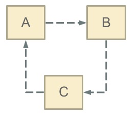

[TOC]

## Spring IOC源码分析-createBean()

在上面的 doGetBean() 方法中，最重要的创建 bean 实例的 createBean() 方法在这里单独分析，doGetBean() 方法中，**singleton 和 prototype 类型**的 bean 都会调用这个方法。

源码如下。

> **AbstractAutowireCapableBeanFactory::createBean()**

```java
@Override
protected Object createBean(String beanName, RootBeanDefinition mbd, @Nullable Object[] args) throws BeanCreationException {

    if (logger.isInfoEnabled()) {
        logger.info("Creating instance of bean: '" + beanName + "'");
    }

    RootBeanDefinition mbdToUse = mbd;

    // 1.解析beanName对应的Bean的类型，例如：com.nano.service.impl.UserServiceImpl
    // 锁定class，根据设置的class属性或者根据className来解析class
    Class<?> resolvedClass = resolveBeanClass(mbd, beanName);
    if (resolvedClass != null && !mbd.hasBeanClass() && mbd.getBeanClassName() != null) {
        // 如果resolvedClass存在，并且mdb的beanClass类型不是Class，并且mdb的beanClass
        // 不为空(则代表beanClass存的是Class的name),则使用mdb深拷贝一个新的RootBeanDefinition副本，
        // 并且将解析的Class赋值给拷贝的RootBeanDefinition副本的beanClass属性，该拷贝副本取代mdb用于后续的操作
        mbdToUse = new RootBeanDefinition(mbd);
        mbdToUse.setBeanClass(resolvedClass);
    }

    // 2.验证及准备覆盖的方法(对override属性进行标记及验证)
    try {
        mbdToUse.prepareMethodOverrides();
    } catch (BeanDefinitionValidationException ex) {
        throw new BeanDefinitionStoreException(mbdToUse.getResourceDescription(),
                                               beanName, "Validation of method overrides failed", ex);
    }

    try {
        // 3.(AOP相关)实例化前的处理，给InstantiationAwareBeanPostProcessor
        // 一个机会返回代理对象来替代真正的bean实例，达到“短路”效果
        Object bean = resolveBeforeInstantiation(beanName, mbdToUse);
        // 4.如果bean不为空，则会跳过Spring默认的实例化过程，直接使用返回的bean
        if (bean != null) {
            return bean;
        }
    } catch (Throwable ex) {
        throw new BeanCreationException(mbdToUse.getResourceDescription(), beanName,
                                        "BeanPostProcessor before instantiation of bean failed", ex);
    }

    try {
        // 5.真正创建bean(干活的方法)
        Object beanInstance = doCreateBean(beanName, mbdToUse, args);
        if (logger.isDebugEnabled()) {
            logger.debug("Finished creating instance of bean '" + beanName + "'");
        }
        return beanInstance;
    } catch (BeanCreationException | ImplicitlyAppearedSingletonException ex) {
        throw ex;
    } catch (Throwable ex) {
        throw new BeanCreationException(
            mbdToUse.getResourceDescription(), beanName, "Unexpected exception during bean creation", ex);
    }
}
```

这里注释 3 处是**实例化前**的处理，给 **InstantiationAwareBeanPostProcessor** (实现了 BeanPostProcessor 接口)一个机会**返回代理对象来替代真正的 bean 实例**，从而跳过 Spring 默认的实例化过程，达到“短路”效果。

整体流程如下图所示。编辑连接：https://www.processon.com/diagraming/61f933af1e08530f015af3fb

%E6%BA%90%E7%A0%81%E5%88%86%E6%9E%90.png)

### resolveBeforeInstantiation()

**resolveBeforeInstantiation()** 方法如下。

> **AbstractAutowireCapableBeanFactory::resolveBeforeInstantiation()**

```java
@Nullable
protected Object resolveBeforeInstantiation(String beanName, RootBeanDefinition mbd) {
    Object bean = null;
    // 如果尚未被解析
    if (!Boolean.FALSE.equals(mbd.beforeInstantiationResolved)) {
        // 1.mbd不是合成的，并且BeanFactory中存在InstantiationAwareBeanPostProcessor
        if (!mbd.isSynthetic() && hasInstantiationAwareBeanPostProcessors()) {
            // 2.解析beanName对应的Bean实例的类型
            Class<?> targetType = determineTargetType(beanName, mbd);
            if (targetType != null) {

                // 3.实例化前的后置处理器应用(处理InstantiationAwareBeanPostProcessor)
                bean = applyBeanPostProcessorsBeforeInstantiation(targetType, beanName);
                if (bean != null) {
                    // 4.如果返回的bean不为空，会跳过Spring默认的实例化过程，
                    // 所以只能在这里调用BeanPostProcessor实现类的postProcessAfterInitialization()方法
                    bean = applyBeanPostProcessorsAfterInitialization(bean, beanName);
                }
            }
        }

        // 5.如果bean不为空，则将beforeInstantiationResolved赋值为true，代表在实例化之前已经解析
        mbd.beforeInstantiationResolved = (bean != null);
    }
    return bean;
}
```

#### applyBeanPostProcessorsBeforeInstantiation()

**applyBeanPostProcessorsBeforeInstantiation()** 方法如下。在实例化之前执行 **InstantiationAwareBeanPostProcessor** 的 **postProcessBeforeInstantiation()** 方法，该方法可以**返回 bean 实例的代理**，从而跳过 Spring 默认的实例化过程。

> **AbstractAutowireCapableBeanFactory::applyBeanPostProcessorsBeforeInstantiation()**

```java
@Nullable
protected Object applyBeanPostProcessorsBeforeInstantiation(Class<?> beanClass, String beanName) {

    // 1.遍历当前BeanFactory中的BeanPostProcessor
    for (BeanPostProcessor bp : getBeanPostProcessors()) {
        // 2.应用InstantiationAwareBeanPostProcessor后置处理器，允许postProcessBeforeInstantiation方法返回bean对象的代理
        if (bp instanceof InstantiationAwareBeanPostProcessor) {
            InstantiationAwareBeanPostProcessor ibp = (InstantiationAwareBeanPostProcessor) bp;
            // 3.执行postProcessBeforeInstantiation方法，在Bean实例化前操作，
            // 该方法可以返回一个构造完成的Bean实例，从而不会继续执行创建Bean实例的“正规的流程”，达到“短路”的效果。
            Object result = ibp.postProcessBeforeInstantiation(beanClass, beanName);
            if (result != null) {
                // 4.如果result不为空，也就是有后置处理器返回了bean实例对象，则会跳过Spring默认的实例化过程
                return result;
            }
        }
    }
    return null;
}
```

#### applyBeanPostProcessorsAfterInitialization()

applyBeanPostProcessorsAfterInitialization() 方法如下。

> **AbstractAutowireCapableBeanFactory::applyBeanPostProcessorsAfterInitialization()**

```java
@Override
public Object applyBeanPostProcessorsAfterInitialization(Object existingBean, String beanName)
    throws BeansException {

    Object result = existingBean;
    // 1.遍历所有注册的BeanPostProcessor实现类，调用postProcessAfterInitialization方法
    for (BeanPostProcessor processor : getBeanPostProcessors()) {
        // 2.在bean初始化后，调用postProcessAfterInitialization方法
        Object current = processor.postProcessAfterInitialization(result, beanName);
        if (current == null) {
            // 3.如果返回null，则不会调用后续的BeanPostProcessors
            return result;
        }
        result = current;
    }
    return result;
}
```

### doCreateBean()

这里分析 createBean() 方法真正干活的方法 doCreateBean()。**真正创建 bean 实例的方法，是核心中的核心，很多代码是前后相关联的，需要反复阅读才能很好的理解**。

> **AbstractAutowireCapableBeanFactory::doCreateBean()**

```java
protected Object doCreateBean(String beanName, RootBeanDefinition mbd, @Nullable Object[] args) throws BeanCreationException {

    // 1.新建Bean包装类
    BeanWrapper instanceWrapper = null;
    // 2.如果是单例，则需要先移除未完成的FactoryBean实例的缓存
    if (mbd.isSingleton()) {
        instanceWrapper = this.factoryBeanInstanceCache.remove(beanName);
    }

    // 实例化bean，将BeanDefinition转换为BeanWrapper
    if (instanceWrapper == null) {
        // 3.根据beanName、mbd、args，使用对应的策略创建Bean实例，并返回包装类BeanWrapper
        // 到这里说明不是 FactoryBean，这里实例化 Bean，这里非常关键，细节之后再说
        // 根据指定bean使用对应的策略来创建新的实例，如工厂方法、构造函数自动注入、简单初始化
        instanceWrapper = createBeanInstance(beanName, mbd, args);
    }

    // 4.获取创建好的Bean实例
    Object bean = instanceWrapper.getWrappedInstance();
    // 5.获取Bean实例的类型Class
    Class<?> beanType = instanceWrapper.getWrappedClass();
    if (beanType != NullBean.class) {
        mbd.resolvedTargetType = beanType;
    }

    synchronized (mbd.postProcessingLock) {
        if (!mbd.postProcessed) {
            try {
                // 6.应用后置处理器MergedBeanDefinitionPostProcessor，允许修改MergedBeanDefinition，
                // Autowired注解正是通过此方法实现注入类型的预解析
                applyMergedBeanDefinitionPostProcessors(mbd, beanType, beanName);

            } catch (Throwable ex) {
                throw new BeanCreationException(mbd.getResourceDescription(), beanName,
                                                "Post-processing of merged bean definition failed", ex);
            }
            mbd.postProcessed = true;
        }
    }

    // 7.判断是否需要提早曝光实例：(单例 && 允许循环依赖 && 当前bean正在创建中)
    // 下面进行依赖处理(解决循环依赖问题)
    // 这里只对单例有效，对于prototype的bean，Spring没有好的解决方法，只能抛异常
    boolean earlySingletonExposure = (mbd.isSingleton() &&
                                      this.allowCircularReferences && isSingletonCurrentlyInCreation(beanName));

    // 要提早曝光实例
    if (earlySingletonExposure) {
        if (logger.isDebugEnabled()) {
            logger.debug("Eagerly caching bean '" + beanName + "' to allow for resolving potential circular references");
        }

        // 8.用于解决循环依赖。提前暴露一个单例工厂方法 使其他的bean能引用到该bean
        // 这里提前曝光beanName的ObjectFactory，即在bean初始化完成前将创建实例的ObjectFactory加入工厂
        // 这里将早期bean存入到三级缓存中singletonFactories
        addSingletonFactory(beanName,
                            // 8.1.(AOP相关)主要应用SmartInstantiationAwareBeanPostProcessor
                            // 允许返回指定bean的早期引用，AOP就是在这里将advice动态织入bean中，
                            // 若没有则直接返回bean，不做任何处理
                            () -> getEarlyBeanReference(beanName, mbd, bean));
    }

    // 属性填充与bean的初始化
    Object exposedObject = bean;
    try {
        // 9.对bean进行属性填充，将各个属性值注入；其中可能存在依赖于其他bean的属性，则会递归初始化依赖的bean实例
        // 这一步负责属性装配，因为前面的实例只是实例化了，并没有赋值，这里就是赋值
        populateBean(beanName, mbd, instanceWrapper);
        // 10.对bean进行初始化，这里就是处理bean初始化完成后的各种方法回调
        // init-method属性、InitializingBean接口、BeanPostProcessor接口等都会在这里触发
        exposedObject = initializeBean(beanName, exposedObject, mbd);

    } catch (Throwable ex) {
        if (ex instanceof BeanCreationException && beanName.equals(((BeanCreationException) ex).getBeanName())) {
            throw (BeanCreationException) ex;
        } else {
            throw new BeanCreationException(mbd.getResourceDescription(), beanName, "Initialization of bean failed", ex);
        }
    }

    // 如果需要提前曝光
    if (earlySingletonExposure) {

        // 11.如果允许提前曝光实例，则进行循环依赖检查
        // 从正在创建的缓存池中获取查询当前bean，如果查到了说明存在循环依赖
        Object earlySingletonReference = getSingleton(beanName, false);

        // 11.1 earlySingletonReference只有在当前解析的bean检测到存在循环依赖的情况下才会不为空
        if (earlySingletonReference != null) {

            // 11.2 如果exposedObject没有在initializeBean初始化方法中被增强，则不影响之前的循环引用
            if (exposedObject == bean) {
                exposedObject = earlySingletonReference;

                // 11.3 如果exposedObject在initializeBean方法中被增强 && 不允许在循环引用的情况下使用注入原始bean实例
                // && 当前bean有被其他bean依赖
            } else if (!this.allowRawInjectionDespiteWrapping && hasDependentBean(beanName)) {
                // 11.4 拿到依赖当前bean的所有bean的beanName数组
                String[] dependentBeans = getDependentBeans(beanName);
                Set<String> actualDependentBeans = new LinkedHashSet<>(dependentBeans.length);
                for (String dependentBean : dependentBeans) {

                    // 11.5 尝试移除这些bean的实例，因为这些bean依赖的bean已经被增强了，他们依赖的bean相当于脏数据
                    if (!removeSingletonIfCreatedForTypeCheckOnly(dependentBean)) {
                        // 11.6 移除失败的bean添加到actualDependentBeans
                        actualDependentBeans.add(dependentBean);
                    }
                }

                // 11.7 如果存在移除失败的，则抛出异常，因为存在bean依赖了“脏数据”
                // 因为bean创建后其所依赖的bean一定是已经创建的，actualDependentBeans不为空
                // 则表示当前bean创建后其依赖的bean却没有全部创建完，说明存在循环依赖
                if (!actualDependentBeans.isEmpty()) {
                    // 抛出循环依赖异常
                    throw new BeanCurrentlyInCreationException(beanName,
                                                               "Bean with name '" + beanName + "' has been injected into other beans [" +
                                                               StringUtils.collectionToCommaDelimitedString(actualDependentBeans) +
                                                               "] in its raw version as part of a circular reference, but has eventually been " +
                                                               "wrapped. This means that said other beans do not use the final version of the " +
                                                               "bean. This is often the result of over-eager type matching - consider using " +
                                                               "'getBeanNamesForType' with the 'allowEagerInit' flag turned off, for example.");
                }
            }
        }
    }

    try {
        // 12.注册用于销毁的DisposableBean，执行销毁操作的有三种：
        // 自定义destroy方法、DisposableBean接口、DestructionAwareBeanPostProcessor
        registerDisposableBeanIfNecessary(beanName, bean, mbd);

    } catch (BeanDefinitionValidationException ex) {
        throw new BeanCreationException(mbd.getResourceDescription(), beanName, "Invalid destruction signature", ex);
    }

    // 完成创建并返回
    return exposedObject;
}
```

注释 11.1 处，earlySingletonReference 只有在当前解析的 bean **存在循环依赖**的情况下才会不为空。因为如果不是循环依赖，只会在完全创建完 bean 实例才会添加到 singletonObjects 缓存。此时正在创建 bean 的过程中，还没有完全创建完，singletonObjects 缓存是肯定没有当前 beanName 的；而如果不存在循环引用，从 doGetBean 方法开始，getSingleton 方法只会在**最初 doGetBean 方法里调用一次**，不存在循环引用，也就用不到提前曝光的 ObjectFactory 来创建 bean 对象，从而 earlySingletonObjects 缓存肯定也是没有 beanName 的 bean 实例对象的，所以必然返回空。

#### createBeanInstance()

**注释 3 处** createBeanInstance() 方法根据 beanName、mbd、args，使用对应的策略**创建 bean 实例**，并返回包装类 BeanWrapper。这里创建一个新的 bean 实例。

> **AbstractAutowireCapableBeanFactory::createBeanInstance()**

```java
protected BeanWrapper createBeanInstance(String beanName, RootBeanDefinition mbd, @Nullable Object[] args) {
    // 解析bean的类型信息
    Class<?> beanClass = resolveBeanClass(mbd, beanName);

    // beanClass不为空 && beanClass不是公开类(不是public修饰) && 该bean不允许访问非公共构造函数和方法，则抛异常
    if (beanClass != null && !Modifier.isPublic(beanClass.getModifiers()) && !mbd.isNonPublicAccessAllowed()) {
        throw new BeanCreationException(mbd.getResourceDescription(), beanName,
                                        "Bean class isn't public, and non-public access not allowed: " + beanClass.getName());
    }

    Supplier<?> instanceSupplier = mbd.getInstanceSupplier();
    if (instanceSupplier != null) {
        return obtainFromSupplier(instanceSupplier, beanName);
    }

    // 1.如果存在工厂方法则使用工厂方法实例化bean对象
    if (mbd.getFactoryMethodName() != null) {
        // 根据Bean Definition中的配置生成bean的实例
        return instantiateUsingFactoryMethod(beanName, mbd, args);
    }

    // resolved: 构造函数或工厂方法是否已经解析过
    // 如果不是第一次创建，比如第二次创建 prototype bean。
    // 这种情况下，可以从第一次创建知道，采用无参构造函数还是构造函数依赖注入 来完成实例化
    boolean resolved = false;
    // autowireNecessary: 是否需要自动注入(即是否需要解析构造函数参数)
    boolean autowireNecessary = false;
    if (args == null) {
        // 2.加锁
        synchronized (mbd.constructorArgumentLock) {

            // 一个类有多个构造方法，每个构造方法都有不同的参数，所以调用前需要先根据参数锁定构造方法或对应的工厂方法
            if (mbd.resolvedConstructorOrFactoryMethod != null) {
                // 2.1 如果resolvedConstructorOrFactoryMethod缓存不为空，则将resolved标记为已解析
                resolved = true;
                // 2.2 根据constructorArgumentsResolved判断是否需要自动注入
                autowireNecessary = mbd.constructorArgumentsResolved;
            }
        }
    }
    // 3.如果已经解析过，则使用resolvedConstructorOrFactoryMethod缓存里解析好的构造函数方法
    if (resolved) {
        if (autowireNecessary) {
            // 3.1 需要自动注入，则执行构造函数自动注入
            return autowireConstructor(beanName, mbd, null, null);
        } else {
            // 3.2 否则使用默认的构造函数进行bean的实例化
            return instantiateBean(beanName, mbd);
        }
    }

    // 4.应用后置处理器SmartInstantiationAwareBeanPostProcessor，拿到bean的候选构造函数
    Constructor<?>[] ctors = determineConstructorsFromBeanPostProcessors(beanClass, beanName);
    if (ctors != null || mbd.getResolvedAutowireMode() == AUTOWIRE_CONSTRUCTOR ||
        mbd.hasConstructorArgumentValues() || !ObjectUtils.isEmpty(args)) {

        // 5.如果ctors不为空 || mbd的注入方式为AUTOWIRE_CONSTRUCTOR || mdb定义了构造函数的参数值 || args不为空，
        // 则执行构造函数自动注入
        // 在带有参数的实例构造中，Spring把精力放在了构造方法以及参数的匹配上
        return autowireConstructor(beanName, mbd, ctors, args);
    }

    // 6.没有特殊处理，则使用默认的构造函数进行bean的实例化
    // 使用默认无参构造方法初始化，没有参数的实例化很简单，只需要直接调用实例化策略进行实例化即可
    return instantiateBean(beanName, mbd);
}
```

创建实例的方法通常有以下几种：**工厂方法、构造函数自动装配(通常指带有参数的构造函数)、简单实例化(默认的构造函数)**。其中工厂方法现在基本不使用了，不再解析；简单实例化过程比较简单，也不解析；这里只对构造函数自动装配进行解析，该方法对应代码中的注释：3.1 和 5。

##### 1.determineConstructorsFromBeanPostProcessors()

注释 4 处 determineConstructorsFromBeanPostProcessors() 方法应用后置处理器 **SmartInstantiationAwareBeanPostProcessor**，拿到给定 bean 的候选构造函数，方法如下。

> **AbstractAutowireCapableBeanFactory::determineConstructorsFromBeanPostProcessors()**

```java
@Nullable
protected Constructor<?>[] determineConstructorsFromBeanPostProcessors(@Nullable Class<?> beanClass, String beanName)
    throws BeansException {

    if (beanClass != null && hasInstantiationAwareBeanPostProcessors()) {
        // 1.遍历所有的BeanPostProcessor
        for (BeanPostProcessor bp : getBeanPostProcessors()) {
            if (bp instanceof SmartInstantiationAwareBeanPostProcessor) {
                // 2.调用SmartInstantiationAwareBeanPostProcessor的determineCandidateConstructors方法，
                // 该方法可以返回要用于beanClass的候选构造函数
                // 例如：使用@Autowire注解修饰构造函数，则该构造函数在这边会被AutowiredAnnotationBeanPostProcessor找到
                SmartInstantiationAwareBeanPostProcessor ibp = (SmartInstantiationAwareBeanPostProcessor) bp;
                Constructor<?>[] ctors = ibp.determineCandidateConstructors(beanClass, beanName);
                if (ctors != null) {
                    // 3.如果ctors不为空，则不再继续执行其他的SmartInstantiationAwareBeanPostProcessor
                    return ctors;
                }
            }
        }
    }
    return null;
}
```

这里调用 SmartInstantiationAwareBeanPostProcessor 的 **determineCandidateConstructors()** 方法，该方法可以返回要用于 **beanClass 的候选构造函数**。使用 @Autowire 注解修饰构造函数，则该构造函数在这边会被 AutowiredAnnotationBeanPostProcessor 找到。

##### 2.autowireConstructor()

继续看 createBeanInstance() 方法的 **autowireConstructor**() 方法。十分离谱的方法，不建议看。

> **AbstractAutowireCapableBeanFactory::autowireConstructor()**

```java
public BeanWrapper autowireConstructor(String beanName, RootBeanDefinition mbd,
                                       @Nullable Constructor<?>[] chosenCtors, @Nullable Object[] explicitArgs) {

    // 定义bean包装类
    BeanWrapperImpl bw = new BeanWrapperImpl();
    this.beanFactory.initBeanWrapper(bw);

    // 最终用于实例化的构造函数
    Constructor<?> constructorToUse = null;
    // 最终用于实例化的参数Holder
    ArgumentsHolder argsHolderToUse = null;
    // 最终用于实例化的构造函数参数
    Object[] argsToUse = null;

    // 1.解析出要用于实例化的构造函数参数
    if (explicitArgs != null) {
        // 1.1 如果explicitArgs不为空，则构造函数的参数直接使用explicitArgs
        // 通过getBean方法调用时，显示指定了参数，则explicitArgs就不为null
        argsToUse = explicitArgs;
    }
    else {
        // 1.2 尝试从缓存中获取已经解析过的构造函数参数
        Object[] argsToResolve = null;
        synchronized (mbd.constructorArgumentLock) {
            // 1.2.1 拿到缓存中已解析的构造函数或工厂方法
            constructorToUse = (Constructor<?>) mbd.resolvedConstructorOrFactoryMethod;
            // 1.2.2 如果constructorToUse不为空 && mbd标记了构造函数参数已解析
            if (constructorToUse != null && mbd.constructorArgumentsResolved) {
                // 1.2.3 从缓存中获取已解析的构造函数参数
                argsToUse = mbd.resolvedConstructorArguments;
                if (argsToUse == null) {
                    // 1.2.4 如果resolvedConstructorArguments为空，则从缓存中获取准备用于解析的构造函数参数，
                    // constructorArgumentsResolved为true时，resolvedConstructorArguments和
                    // preparedConstructorArguments必然有一个缓存了构造函数的参数
                    argsToResolve = mbd.preparedConstructorArguments;
                }
            }
        }
        if (argsToResolve != null) {
            // 1.2.5 如果argsToResolve不为空，则对构造函数参数进行解析，
            // 如给定方法的构造函数 A(int,int)则通过此方法后就会把配置中的("1","1")转换为(1,1)
            argsToUse = resolvePreparedArguments(beanName, mbd, bw, constructorToUse, argsToResolve);
        }
    }

    // 2.如果构造函数没有被缓存，则通过配置文件获取
    if (constructorToUse == null) {
        // 2.1 检查是否需要自动装配：chosenCtors不为空 || autowireMode为AUTOWIRE_CONSTRUCTOR
        // 例子：当chosenCtors不为空时，代表有构造函数通过@Autowire修饰，因此需要自动装配
        boolean autowiring = (chosenCtors != null ||
                              mbd.getResolvedAutowireMode() == AutowireCapableBeanFactory.AUTOWIRE_CONSTRUCTOR);
        ConstructorArgumentValues resolvedValues = null;

        // 构造函数参数个数
        int minNrOfArgs;
        // 2.2 explicitArgs不为空，则使用explicitArgs的length作为minNrOfArgs的值
        if (explicitArgs != null) {
            minNrOfArgs = explicitArgs.length;
        }
        else {
            // 2.3 获得mbd的构造函数的参数值（indexedArgumentValues：带index的参数值；genericArgumentValues：通用的参数值）
            ConstructorArgumentValues cargs = mbd.getConstructorArgumentValues();
            // 2.4 创建ConstructorArgumentValues对象resolvedValues，用于承载解析后的构造函数参数的值
            resolvedValues = new ConstructorArgumentValues();
            // 2.5 解析mbd的构造函数的参数，并返回参数个数
            minNrOfArgs = resolveConstructorArguments(beanName, mbd, bw, cargs, resolvedValues);
            // 注：这边解析mbd中的构造函数参数值，主要是处理通过XML方式定义的构造函数注入的参数，
            // 但是如果是通过@Autowire注解直接修饰构造函数，则mbd是没有这些参数值的
        }

        // 3.确认构造函数的候选者
        // 3.1 如果入参chosenCtors不为空，则将chosenCtors的构造函数作为候选者
        Constructor<?>[] candidates = chosenCtors;
        if (candidates == null) {
            Class<?> beanClass = mbd.getBeanClass();
            try {
                // 3.2 如果入参chosenCtors为空，则获取beanClass的构造函数
                // (mbd是否允许访问非公共构造函数和方法 ? 所有声明的构造函数：公共构造函数)
                candidates = (mbd.isNonPublicAccessAllowed() ?
                              beanClass.getDeclaredConstructors() : beanClass.getConstructors());
            } catch (Throwable ex) {
                throw new BeanCreationException(mbd.getResourceDescription(), beanName,
                                                "Resolution of declared constructors on bean Class [" + beanClass.getName() +
                                                "] from ClassLoader [" + beanClass.getClassLoader() + "] failed", ex);
            }
        }
        // 3.3 对给定的构造函数排序：先按方法修饰符排序：public排非public前面，再按构造函数参数个数排序：参数多的排前面
        AutowireUtils.sortConstructors(candidates);
        // 最小匹配权重，权重越小，越接近要找的目标构造函数
        int minTypeDiffWeight = Integer.MAX_VALUE;
        Set<Constructor<?>> ambiguousConstructors = null;
        LinkedList<UnsatisfiedDependencyException> causes = null;

        // 4.遍历所有构造函数候选者，找出符合条件的构造函数
        for (Constructor<?> candidate : candidates) {
            // 4.1 拿到当前遍历的构造函数的参数类型数组
            Class<?>[] paramTypes = candidate.getParameterTypes();

            // 4.2 如果已经找到满足的构造函数 && 目标构造函数需要的参数个数大于当前遍历的构造函数的参数个数则终止，
            // 因为遍历的构造函数已经排过序，后面不会有更合适的候选者了
            if (constructorToUse != null && argsToUse.length > paramTypes.length) {
                break;
            }
            // 4.3 如果当前遍历到的构造函数的参数个数小于我们所需的参数个数，则直接跳过该构造函数
            if (paramTypes.length < minNrOfArgs) {
                continue;
            }

            ArgumentsHolder argsHolder;
            if (resolvedValues != null) {
                // 存在参数则根据参数值来匹配参数类型
                try {
                    // 4.4 resolvedValues不为空，
                    // 4.4.1 获取当前遍历的构造函数的参数名称
                    // 4.4.1.1 解析使用ConstructorProperties注解的构造函数参数
                    String[] paramNames = ConstructorPropertiesChecker.evaluate(candidate, paramTypes.length);
                    if (paramNames == null) {
                        // 4.4.1.2 获取参数名称解析器
                        ParameterNameDiscoverer pnd = this.beanFactory.getParameterNameDiscoverer();
                        if (pnd != null) {
                            // 4.4.1.3 使用参数名称解析器获取当前遍历的构造函数的参数名称
                            paramNames = pnd.getParameterNames(candidate);
                        }
                    }
                    // 4.4.2 创建一个参数数组以调用构造函数或工厂方法，
                    // 主要是通过参数类型和参数名解析构造函数或工厂方法所需的参数（如果参数是其他bean，则会解析依赖的bean）
                    argsHolder = createArgumentArray(beanName, mbd, resolvedValues, bw, paramTypes, paramNames,
                                                     getUserDeclaredConstructor(candidate), autowiring);
                } catch (UnsatisfiedDependencyException ex) {
                    // 4.4.3 参数匹配失败，则抛出异常
                    if (logger.isTraceEnabled()) {
                        logger.trace("Ignoring constructor [" + candidate + "] of bean '" + beanName + "': " + ex);
                    }
                    // Swallow and try next constructor.
                    if (causes == null) {
                        causes = new LinkedList<>();
                    }
                    causes.add(ex);
                    continue;
                }
            } else {
                // 4.5 resolvedValues为空，则explicitArgs不为空，即给出了显式参数
                // 4.5.1 如果当前遍历的构造函数参数个数与explicitArgs长度不相同，则跳过该构造函数
                if (paramTypes.length != explicitArgs.length) {
                    continue;
                }
                // 4.5.2 使用显式给出的参数构造ArgumentsHolder
                argsHolder = new ArgumentsHolder(explicitArgs);
            }

            // 4.6 根据mbd的解析构造函数模式（true: 宽松模式(默认)，false：严格模式），
            // 将argsHolder的参数和paramTypes进行比较，计算paramTypes的类型差异权重值
            int typeDiffWeight = (mbd.isLenientConstructorResolution() ?
                                  argsHolder.getTypeDifferenceWeight(paramTypes) : argsHolder.getAssignabilityWeight(paramTypes));
            // 4.7 类型差异权重值越小,则说明构造函数越匹配，则选择此构造函数
            if (typeDiffWeight < minTypeDiffWeight) {
                // 将要使用的参数都替换成差异权重值更小的
                constructorToUse = candidate;
                argsHolderToUse = argsHolder;
                argsToUse = argsHolder.arguments;
                minTypeDiffWeight = typeDiffWeight;
                // 如果出现权重值更小的候选者，则将ambiguousConstructors清空，允许之前存在权重值相同的候选者
                ambiguousConstructors = null;
            }
            // 4.8 如果存在两个候选者的权重值相同，并且是当前遍历过权重值最小的
            else if (constructorToUse != null && typeDiffWeight == minTypeDiffWeight) {
                // 将这两个候选者都添加到ambiguousConstructors
                if (ambiguousConstructors == null) {
                    ambiguousConstructors = new LinkedHashSet<>();
                    ambiguousConstructors.add(constructorToUse);
                }
                ambiguousConstructors.add(candidate);
            }
        }

        if (constructorToUse == null) {
            // 5.如果最终没有找到匹配的构造函数，则进行异常处理
            if (causes != null) {
                UnsatisfiedDependencyException ex = causes.removeLast();
                for (Exception cause : causes) {
                    this.beanFactory.onSuppressedException(cause);
                }
                throw ex;
            }throw new BeanCreationException(mbd.getResourceDescription(), beanName,
                                             "Could not resolve matching constructor " +
                                             "(hint: specify index/type/name arguments for simple parameters to avoid type ambiguities)");
            // 6.如果找到了匹配的构造函数，但是存在多个（ambiguousConstructors不为空） && 解析构造函数的模式为严格模式，则抛出异常
        } else if (ambiguousConstructors != null && !mbd.isLenientConstructorResolution()) {
            throw new BeanCreationException(mbd.getResourceDescription(), beanName,
                                            "Ambiguous constructor matches found in bean '" + beanName + "' " +
                                            "(hint: specify index/type/name arguments for simple parameters to avoid type ambiguities): " +
                                            ambiguousConstructors);
        }

        if (explicitArgs == null) {
            // 7.将解析的构造函数和参数放到缓存
            argsHolderToUse.storeCache(mbd, constructorToUse);
        }
    }

    try {
        final InstantiationStrategy strategy = beanFactory.getInstantiationStrategy();
        Object beanInstance;

        // 8.根据实例化策略以及得到的构造函数及构造函数参数实例化bean
        if (System.getSecurityManager() != null) {
            final Constructor<?> ctorToUse = constructorToUse;
            final Object[] argumentsToUse = argsToUse;
            beanInstance = AccessController.doPrivileged((PrivilegedAction<Object>) () ->
                                                         strategy.instantiate(mbd, beanName, beanFactory, ctorToUse, argumentsToUse),
                                                         beanFactory.getAccessControlContext());
        }
        else {
            beanInstance = strategy.instantiate(mbd, beanName, this.beanFactory, constructorToUse, argsToUse);
        }
        // 9.将构造的实例加入BeanWrapper中，并返回
        bw.setBeanInstance(beanInstance);
        return bw;
    } catch (Throwable ex) {
        throw new BeanCreationException(mbd.getResourceDescription(), beanName,
                                        "Bean instantiation via constructor failed", ex);
    }
}
```

这个方法要深挖的话还有很多，具体可以参考：

- https://blog.csdn.net/v123411739/article/details/87994934

#### applyMergedBeanDefinitionPostProcessors()

上面的方法创建一个**新的 bean 实例**。接着分析创建 bean 实例中剩下的：**填充属性、bean 实例初始化**等内容。

下面看看 applyMergedBeanDefinitionPostProcessors() 方法。应用后置处理器 MergedBeanDefinitionPostProcessor，允许修改 MergedBeanDefinition，**@Autowired 注解**正是通过此方法实现注入类型的预解析。

> **AbstractAutowireCapableBeanFactory::applyMergedBeanDefinitionPostProcessors()**

```java
protected void applyMergedBeanDefinitionPostProcessors(RootBeanDefinition mbd, Class<?> beanType, String beanName) {
    // 1.获取BeanFactory中已注册的BeanPostProcessor
    for (BeanPostProcessor bp : getBeanPostProcessors()) {
        if (bp instanceof MergedBeanDefinitionPostProcessor) {
            // 2.调用MergedBeanDefinitionPostProcessor的postProcessMergedBeanDefinition方法，
            // 对指定bean的给定MergedBeanDefinition进行后置处理，@Autowire注解在这边对元数据进行预解析
            MergedBeanDefinitionPostProcessor bdp = (MergedBeanDefinitionPostProcessor) bp;
            bdp.postProcessMergedBeanDefinition(mbd, beanType, beanName);
        }
    }
}
```

#### getEarlyBeanReference()

这里应用后置处理器 **SmartInstantiationAwareBeanPostProcessor**，允许返回指定 bean 的早期引用。这一步就是返回将 Bean 包装起来的 **ObjectFactory**。通过这个 ObjectFactory 的 **getObject() 方法**可以获取到该 bean 的一个早期实例。

> **AbstractAutowireCapableBeanFactory::getEarlyBeanReference()**

```java
protected Object getEarlyBeanReference(String beanName, RootBeanDefinition mbd, Object bean) {
    Object exposedObject = bean;

    // 1.如果mbd不是合成 && 存在InstantiationAwareBeanPostProcessors
    if (!mbd.isSynthetic() && hasInstantiationAwareBeanPostProcessors()) {

        for (BeanPostProcessor bp : getBeanPostProcessors()) {
            // 2.应用所有SmartInstantiationAwareBeanPostProcessor，调用getEarlyBeanReference方法
            if (bp instanceof SmartInstantiationAwareBeanPostProcessor) {
                SmartInstantiationAwareBeanPostProcessor ibp = (SmartInstantiationAwareBeanPostProcessor) bp;
                // 3.允许SmartInstantiationAwareBeanPostProcessor返回指定bean的早期引用
                exposedObject = ibp.getEarlyBeanReference(exposedObject, beanName);
            }
        }
    }
    // 4.返回要作为bean引用公开的对象，如果没有SmartInstantiationAwareBeanPostProcessor修改，
    // 则返回的是入参的bean对象本身
    return exposedObject;
}
```

#### addSingletonFactory()

**addSingletonFactory**() 方法**提前曝光 beanName 的 ObjectFactory**，用于**解决循环依赖**。这里是将 bean 的 ObjectFactory 放到**第三级缓存** **singletonFactories** 中，后面就可以用 ObjectFactory 的 **getObject() 方法** 生成早期对象了。

> **DefaultSingletonBeanRegistry::addSingletonFactory()**

```java
protected void addSingletonFactory(String beanName, ObjectFactory<?> singletonFactory) {
    Assert.notNull(singletonFactory, "Singleton factory must not be null");
    synchronized (this.singletonObjects) {
        // 1.如果beanName不存在于singletonObjects缓存中
        if (!this.singletonObjects.containsKey(beanName)) {
            // 2.将beanName和singletonFactory注册到singletonFactories缓存
            // (beanName -> 该beanName的单例工厂)
            this.singletonFactories.put(beanName, singletonFactory);
            // 3.移除earlySingletonObjects缓存中的beanName(beanName -> beanName的早期单例对象)
            this.earlySingletonObjects.remove(beanName);
            // 4.将beanName注册到registeredSingletons缓存(已经注册的单例集合)
            this.registeredSingletons.add(beanName);
        }
    }
}
```

解决循环依赖的问题是过提前曝光的 **ObjectFactory 获得 “不完整” 的 bean 实例**而实现的，ObjectFactory 就是通过这边的 **singletonObjects 缓存**来进行曝光的。

#### populateBean()

populateBean() 方法对 bean 进行**属性填充**。如果存在依赖于其他 bean 的属性，则会**递归初始化依赖的 bean 实例**。

> **AbstractAutowireCapableBeanFactory::populateBean()**

```java
protected void populateBean(String beanName, RootBeanDefinition mbd, @Nullable BeanWrapper bw) {

    // 1.bw为空时的处理
    if (bw == null) {
        if (mbd.hasPropertyValues()) {
            // 1.1 如果bw为空，属性不为空，抛异常，无法将属性值应用于null实例
            throw new BeanCreationException(
                mbd.getResourceDescription(), beanName, "Cannot apply property values to null instance");
        } else {
            // 2 如果bw为空，属性也为空，则跳过(没有可填充的属性)
            return;
        }
    }

    // 3.1 如果mbd不是合成的 && 存在InstantiationAwareBeanPostProcessor，
    // 则遍历处理InstantiationAwareBeanPostProcessor
    // 给InstantiationAwareBeanPostProcessor最后一次机会在属性设置前改变bean
    // 到这步的时候，bean实例化完成(通过工厂方法或构造方法)，但是还没开始属性设值，
    // InstantiationAwareBeanPostProcessor的实现类可以在这里对bean进行状态修改
    if (!mbd.isSynthetic() && hasInstantiationAwareBeanPostProcessors()) {
        for (BeanPostProcessor bp : getBeanPostProcessors()) {
            if (bp instanceof InstantiationAwareBeanPostProcessor) {
                InstantiationAwareBeanPostProcessor ibp = (InstantiationAwareBeanPostProcessor) bp;
                // 3.2 在bean实例化后，属性填充之前被调用，允许修改bean的属性，如果返回false，则跳过之后的属性填充
                // 也不需要再经过其他的 BeanPostProcessor 的处理
                if (!ibp.postProcessAfterInstantiation(bw.getWrappedInstance(), beanName)) {
                    return;
                }
            }
        }
    }

    // bean实例的所有属性都在这里了
    PropertyValues pvs = (mbd.hasPropertyValues() ? mbd.getPropertyValues() : null);

    // 4.解析自动装配模式为AUTOWIRE_BY_NAME和AUTOWIRE_BY_TYPE(现在几乎不用)
    int resolvedAutowireMode = mbd.getResolvedAutowireMode();
    if (resolvedAutowireMode == AUTOWIRE_BY_NAME || resolvedAutowireMode == AUTOWIRE_BY_TYPE) {
        MutablePropertyValues newPvs = new MutablePropertyValues(pvs);
        // 根据名称自动注入,通过名字找到所有属性值，如果是bean依赖，先初始化依赖的bean
        if (resolvedAutowireMode == AUTOWIRE_BY_NAME) {
            autowireByName(beanName, mbd, bw, newPvs);	// 4.1 解析autowireByName的注入
        }
        // 根据类型自动注入,复杂一些
        if (resolvedAutowireMode == AUTOWIRE_BY_TYPE) {
            autowireByType(beanName, mbd, bw, newPvs);	// 4.2 解析autowireByType的注入
        }
        pvs = newPvs;
    }

    // 5.BeanFactory是否注册过InstantiationAwareBeanPostProcessors
    boolean hasInstAwareBpps = hasInstantiationAwareBeanPostProcessors();
    // 6.是否需要依赖检查
    boolean needsDepCheck = (mbd.getDependencyCheck() != AbstractBeanDefinition.DEPENDENCY_CHECK_NONE);

    // 7.注册过InstantiationAwareBeanPostProcessors 或者 需要依赖检查
    if (hasInstAwareBpps || needsDepCheck) {
        if (pvs == null) {
            pvs = mbd.getPropertyValues();
        }
        PropertyDescriptor[] filteredPds = filterPropertyDescriptorsForDependencyCheck(bw, mbd.allowCaching);
        if (hasInstAwareBpps) {
            // 7.1 应用后置处理器InstantiationAwareBeanPostProcessor
            for (BeanPostProcessor bp : getBeanPostProcessors()) {
                if (bp instanceof InstantiationAwareBeanPostProcessor) {
                    InstantiationAwareBeanPostProcessor ibp = (InstantiationAwareBeanPostProcessor) bp;
                    // 7.1.1 应用后置处理器InstantiationAwareBeanPostProcessor的方法postProcessPropertyValues，
                    // 进行属性填充前的再次处理。例子：现在最常用的@Autowire属性注入就是这边注入依赖的bean实例对象
                    // 对所有需要依赖检查的属性进行后处理
                    // 这里有个非常有用的 BeanPostProcessor 进到这里: AutowiredAnnotationBeanPostProcessor
                    // 对采用 @Autowired、@Value 注解的依赖进行设值，这里的内容也是非常丰富的，不展开了
                    pvs = ibp.postProcessPropertyValues(pvs, filteredPds, bw.getWrappedInstance(), beanName);
                    if (pvs == null) {
                        return;
                    }
                }
            }
        }
        // 7.2 依赖检查，对应depends-on属性
        if (needsDepCheck) {
            checkDependencies(beanName, mbd, filteredPds, pvs);
        }
    }

    // 8.将所有PropertyValues中的属性填充到bean中
    if (pvs != null) {
        applyPropertyValues(beanName, mbd, bw, pvs);
    }
}
```

注释 4 处，根据注入类型设置属性。如果是 AUTOWIRE_BY_NAME 即根据名称寻找，此时没做什么操作，直接通过名称查找。如果是 AUTOWIRE_BY_TYPE 及根据类型寻找，此时会去推断匹配 @Primary 和 @Priority 等注解的实例。

这里注释 7.1.1 应用后置处理器 **InstantiationAwareBeanPostProcessor** 的方法 postProcessPropertyValues，进行**属性填充前的再次处理**。现在最常用的 **@Autowire 属性注入就是这边注入依赖的 bean 实例对象**，具体实现在 **AutowiredAnnotationBeanPostProcessor**，该内容会在之后介绍 @Autowire 的部分中单独介绍。

最后注释 8 处将所有 PropertyValues 中的属性填充到 bean 中。

这个方法涉及到循环依赖的解决，具体将在后面单独分析。

#### initializeBean()

此方法对 bean 进行**初始化**。还记得 init-method 吗？还有 InitializingBean 接口？还有 BeanPostProcessor 接口？这里会对这些回调方法进行调用，就是处理 bean 初始化完成后的各种回调。

> **AbstractAutowireCapableBeanFactory::initializeBean()**

```java
protected Object initializeBean(String beanName, Object bean, @Nullable RootBeanDefinition mbd) {

    // 1.激活Aware方法
    if (System.getSecurityManager() != null) {
        AccessController.doPrivileged((PrivilegedAction<Object>) () -> {
            invokeAwareMethods(beanName, bean);
            return null;
        }, getAccessControlContext());
    } else {
        // 如果bean实现了BeanNameAware、BeanClassLoaderAware或BeanFactoryAware接口，进行回调
        invokeAwareMethods(beanName, bean);
    }

    Object wrappedBean = bean;
    if (mbd == null || !mbd.isSynthetic()) {
        // 2.在初始化前回调BeanPostProcessor接口的postProcessBeforeInitialization方法
        // 允许对bean实例进行包装
        wrappedBean = applyBeanPostProcessorsBeforeInitialization(wrappedBean, beanName);
    }

    try {
        // 3.调用用户自定义的init初始化方法
        // 3.1.处理bean中定义的init-method
        // 3.2.或者如果自定义的bean实现了InitializingBean接口，调用afterPropertiesSet()方法
        invokeInitMethods(beanName, wrappedBean, mbd);

    } catch (Throwable ex) {
        throw new BeanCreationException((mbd != null ? mbd.getResourceDescription() : null),
                                        beanName, "Invocation of init method failed", ex);
    }

    if (mbd == null || !mbd.isSynthetic()) {
        // 4.在初始化后回调BeanPostProcessor接口的postProcessAfterInitialization方法
        // 允许对bean实例进行包装
        wrappedBean = applyBeanPostProcessorsAfterInitialization(wrappedBean, beanName);
    }

    return wrappedBean;
}
```

下面详细分析这个方法。总共分成了四大步。

##### 1.invokeAwareMethods()

第一步：**invokeAwareMethods()**.首先是调用实现了 Aware 接口的方法，看看源码。

> **AbstractAutowireCapableBeanFactory::invokeAwareMethods()**

```java
private void invokeAwareMethods(String beanName, Object bean) {

    // 是否实现了Aware接口
    if (bean instanceof Aware) {
        // BeanNameAware: 实现此接口的类想要拿到beanName，因此在这边赋值给它
        if (bean instanceof BeanNameAware) {
            ((BeanNameAware) bean).setBeanName(beanName);
        }

        // BeanClassLoaderAware：实现此接口的类想要拿到beanClassLoader，因此在这边赋值给它
        if (bean instanceof BeanClassLoaderAware) {
            ClassLoader bcl = getBeanClassLoader();
            if (bcl != null) {
                ((BeanClassLoaderAware) bean).setBeanClassLoader(bcl);
            }
        }

        // BeanFactoryAware: 实现此接口的类想要拿到 BeanFactory，因此在这边赋值给它
        if (bean instanceof BeanFactoryAware) {
            ((BeanFactoryAware) bean).setBeanFactory(AbstractAutowireCapableBeanFactory.this);
        }
    }
}
```

以 Aware 为结尾的类都是一些**扩展接口**，用于提供给开发者获取到 **BeanFactory 中的一些属性或对象**。这里就是对各个 Aware 接口实现类的相关方法进行回调。

##### 2.applyBeanPostProcessorsBeforeInitialization()

第二步：**applyBeanPostProcessorsBeforeInitialization()**

此方法在进行初始化之前真正回调 **BeanPostProcessor** 接口的 **postProcessBeforeInitialization**() 方法。

> **AbstractAutowireCapableBeanFactory::applyBeanPostProcessorsBeforeInitialization()**

```java
@Override
public Object applyBeanPostProcessorsBeforeInitialization(Object existingBean, String beanName)
    throws BeansException {

    Object result = existingBean;
    // 1.遍历所有注册的BeanPostProcessor实现类
    for (BeanPostProcessor processor : getBeanPostProcessors()) {
        // 2.在bean初始化方法执行前，调用postProcessBeforeInitialization方法
        Object current = processor.postProcessBeforeInitialization(result, beanName);
        if (current == null) {
            return result;
        }
        result = current;
    }
    return result;
}
```

这边提一个比较重要的实现类：**ApplicationContextAwareProcessor**，其实现如下。

> **ApplicationContextAwareProcessor::postProcessBeforeInitialization()**

```java
@Override
@Nullable
public Object postProcessBeforeInitialization(final Object bean, String beanName) throws BeansException {
    AccessControlContext acc = null;

    if (System.getSecurityManager() != null &&
        (bean instanceof EnvironmentAware || bean instanceof EmbeddedValueResolverAware ||
         bean instanceof ResourceLoaderAware || bean instanceof ApplicationEventPublisherAware ||
         bean instanceof MessageSourceAware || bean instanceof ApplicationContextAware)) {
        acc = this.applicationContext.getBeanFactory().getAccessControlContext();
    }

    if (acc != null) {
        AccessController.doPrivileged((PrivilegedAction<Object>) () -> {
            invokeAwareInterfaces(bean);
            return null;
        }, acc);
    }
    else {
        // 调用Aware接口
        invokeAwareInterfaces(bean);
    }

    return bean;
}

private void invokeAwareInterfaces(Object bean) {

    // 根据实现的接口而设置不同内容
    if (bean instanceof Aware) {
        if (bean instanceof EnvironmentAware) {
            ((EnvironmentAware) bean).setEnvironment(this.applicationContext.getEnvironment());
        }
        if (bean instanceof EmbeddedValueResolverAware) {
            ((EmbeddedValueResolverAware) bean).setEmbeddedValueResolver(this.embeddedValueResolver);
        }
        if (bean instanceof ResourceLoaderAware) {
            ((ResourceLoaderAware) bean).setResourceLoader(this.applicationContext);
        }
        if (bean instanceof ApplicationEventPublisherAware) {
            ((ApplicationEventPublisherAware) bean).setApplicationEventPublisher(this.applicationContext);
        }
        if (bean instanceof MessageSourceAware) {
            ((MessageSourceAware) bean).setMessageSource(this.applicationContext);
        }
        // !!!!这个就是为实现了ApplicationContextAware接口的类注入ApplicationContext
        if (bean instanceof ApplicationContextAware) {
            ((ApplicationContextAware) bean).setApplicationContext(this.applicationContext);
        }
    }
}
```

代码中经常通过实现 ApplicationContextAware 接口来拿到 **ApplicationContext**，之所以能拿到 ApplicationContext，就是在这边被赋值的。

##### 3.invokeInitMethods()

第三步：**invokeInitMethods()**。调用了设置的初始化方法。

> **AbstractAutowireCapableBeanFactory::invokeInitMethods()**

```java
protected void invokeInitMethods(String beanName, Object bean, @Nullable RootBeanDefinition mbd) throws Throwable {

    // 1.首先检查是否实现了InitializingBean接口，如果是则需要调用 afterPropertiesSet 方法
    boolean isInitializingBean = (bean instanceof InitializingBean);
    if (isInitializingBean && (mbd == null || !mbd.isExternallyManagedInitMethod("afterPropertiesSet"))) {
        if (logger.isDebugEnabled()) {
            logger.debug("Invoking afterPropertiesSet() on bean with name '" + beanName + "'");
        }

        // 2.调用afterPropertiesSet方法
        if (System.getSecurityManager() != null) {
            try {
                AccessController.doPrivileged((PrivilegedExceptionAction<Object>) () -> {
                    ((InitializingBean) bean).afterPropertiesSet();
                    return null;
                }, getAccessControlContext());

            } catch (PrivilegedActionException pae) {
                throw pae.getException();
            }
        } else {
            ((InitializingBean) bean).afterPropertiesSet();
        }
    }

    // 3.调用自定义初始化方法
    if (mbd != null && bean.getClass() != NullBean.class) {
        String initMethodName = mbd.getInitMethodName();
        if (StringUtils.hasLength(initMethodName) &&
            !(isInitializingBean && "afterPropertiesSet".equals(initMethodName)) &&
            !mbd.isExternallyManagedInitMethod(initMethodName)) {

            invokeCustomInitMethod(beanName, bean, mbd);
        }
    }
}
```

调用自定义初始化方法如下。

> **AbstractAutowireCapableBeanFactory::invokeCustomInitMethod()**

```java
protected void invokeCustomInitMethod(String beanName, Object bean, RootBeanDefinition mbd)
    throws Throwable {

    // 1.拿到初始化方法的方法名
    String initMethodName = mbd.getInitMethodName();
    Assert.state(initMethodName != null, "No init method set");
    // 2.根据方法名拿到方法
    Method initMethod = (mbd.isNonPublicAccessAllowed() ?
                         BeanUtils.findMethod(bean.getClass(), initMethodName) :
                         ClassUtils.getMethodIfAvailable(bean.getClass(), initMethodName));

    if (initMethod == null) {
        // 3.如果不存在initMethodName对应的方法，并且是强制执行初始化方法(默认为强制), 则抛出异常
        if (mbd.isEnforceInitMethod()) {
            throw new BeanDefinitionValidationException("Could not find an init method named '" +
                                                        initMethodName + "' on bean with name '" + beanName + "'");
        } else { // 如果设置了非强制，找不到则直接返回
            if (logger.isDebugEnabled()) {
                logger.debug("No default init method named '" + initMethodName +
                             "' found on bean with name '" + beanName + "'");
            }
            // Ignore non-existent default lifecycle methods.
            return;
        }
    }

    if (logger.isDebugEnabled()) {
        logger.debug("Invoking init method  '" + initMethodName + "' on bean with name '" + beanName + "'");
    }

    // 4.反射调用初始化方法
    if (System.getSecurityManager() != null) {
        AccessController.doPrivileged((PrivilegedAction<Object>) () -> {
            ReflectionUtils.makeAccessible(initMethod);
            return null;
        });
        try {
            AccessController.doPrivileged((PrivilegedExceptionAction<Object>)
                                          () -> initMethod.invoke(bean), getAccessControlContext());
        } catch (PrivilegedActionException pae) {
            InvocationTargetException ex = (InvocationTargetException) pae.getException();
            throw ex.getTargetException();
        }
    } else {
        try {
            ReflectionUtils.makeAccessible(initMethod);
            initMethod.invoke(bean);
        } catch (InvocationTargetException ex) {
            throw ex.getTargetException();
        }
    }
}
```

这里会用**反射**的方式调用**初始化方法**。

##### 4.applyBeanPostProcessorsAfterInitialization()

第四步：**applyBeanPostProcessorsAfterInitialization()**。也就是回调所有实现了 **BeanPostProcessor** 接口的类的 postProcessAfterInitialization() 方法实现对特定 bean 的拓展。

> **AbstractAutowireCapableBeanFactory::applyBeanPostProcessorsAfterInitialization()**

```java
@Override
public Object applyBeanPostProcessorsAfterInitialization(Object existingBean, String beanName)
    throws BeansException {

    Object result = existingBean;
    // 1.遍历所有注册的BeanPostProcessor实现类
    for (BeanPostProcessor processor : getBeanPostProcessors()) {
        // 2.在bean初始化方法执行后，调用postProcessAfterInitialization方法
        Object current = processor.postProcessAfterInitialization(result, beanName);
        if (current == null) {
            // 3.如果返回null，则不会调用后续的BeanPostProcessors
            return result;
        }
        result = current;
    }
    return result;
}
```

#### registerDisposableBeanIfNecessary()

此方法注册用于销毁的 bean，执行销毁操作的有三种：自定义 destroy 方法、DisposableBean 接口、DestructionAwareBeanPostProcessor。

> **AbstractBeanFactory::registerDisposableBeanIfNecessary()**

```java
protected void registerDisposableBeanIfNecessary(String beanName, Object bean, RootBeanDefinition mbd) {
    AccessControlContext acc = (System.getSecurityManager() != null ? getAccessControlContext() : null);
    // 1.mbd的scope不是prototype && 给定的bean需要在关闭时销毁
    if (!mbd.isPrototype() && requiresDestruction(bean, mbd)) {
        // 单例模式
        if (mbd.isSingleton()) {
            // 2.单例模式下注册用于销毁的bean到disposableBeans缓存，执行给定bean的所有销毁工作：
            // DestructionAwareBeanPostProcessors，DisposableBean接口，自定义销毁方法
            // 2.1 DisposableBeanAdapter：使用DisposableBeanAdapter来封装用于销毁的bean
            registerDisposableBean(beanName,
                                   new DisposableBeanAdapter(bean, beanName, mbd, getBeanPostProcessors(), acc));
        } else {
            // 3.其他scope处理
            Scope scope = this.scopes.get(mbd.getScope());
            if (scope == null) {
                throw new IllegalStateException("No Scope registered for scope name '" + mbd.getScope() + "'");
            }
            scope.registerDestructionCallback(beanName,
                                              new DisposableBeanAdapter(bean, beanName, mbd, getBeanPostProcessors(), acc));
        }
    }
}
```

这里 requiresDestruction(bean, mbd) 用于判断给定的 bean 是否需要在关闭时销毁。

> **AbstractBeanFactory::requiresDestruction()**

```java
protected boolean requiresDestruction(Object bean, RootBeanDefinition mbd) {
    // 1.DisposableBeanAdapter.hasDestroyMethod(bean, mbd)：判断bean是否有destroy方法
    // 2.hasDestructionAwareBeanPostProcessors()：判断当前BeanFactory是否注册过DestructionAwareBeanPostProcessor
    // 3.DisposableBeanAdapter.hasApplicableProcessors：是否存在适用于bean的DestructionAwareBeanPostProcessor
    return (bean.getClass() != NullBean.class &&
            (DisposableBeanAdapter.hasDestroyMethod(bean, mbd) || (hasDestructionAwareBeanPostProcessors() &&
                                                                   DisposableBeanAdapter.hasApplicableProcessors(bean, getBeanPostProcessors()))));
}
```

### 循环依赖

#### 基础

##### 1.概述

**循环依赖：就是 N 个类循环(嵌套)依赖**，造成多个 bean 互相引用对方，最终形成闭环。



这里循环依赖不是方法之间的循环调用，**而是对象的相互依赖关系**。比如下面的代码：

```java
@Service
public class AServiceImpl implements AService {
    @Autowired
    private BService bService;
    //...
}
@Service
public class BServiceImpl implements BService {
    @Autowired
    private AService aService;
    //...
}
```

##### 2.三大循环依赖场景

###### (1)构造器注入循环依赖

```java
@Service
public class A {
    public A(B b) {
    }
}
@Service
public class B {
    public B(A a) {
    }
}
```

**构造器注入**造成的循环依赖问题是**无法解决**的，只能抛出 BeanCurrentlyInCreationException **异常**表示循环依赖。

###### (2)prototype注入循环依赖

作用域为 prototype 的 bean 的循环依赖。

```java
@Scope(ConfigurableBeanFactory.SCOPE_PROTOTYPE)
@Service
public class A {
    @Autowired
    private B b;
}

@Scope(ConfigurableBeanFactory.SCOPE_PROTOTYPE)
@Service
public class B {
    @Autowired
    private A a;
}
```

prototype 字段属性注入循环依赖问题也是**无法解决**的。

###### (3)setter注入循环依赖

这种方式是**最最最最**为常用的依赖注入方式：

```java
@Service
public class A {
    @Autowired
    private B b;
}

@Service
public class B {
    @Autowired
    private A a;
}
```

**==单例 bean==** 的 setter 注入的循环依赖**可以解决**。

#### 三级缓存

在 Spring 容器的整个生命周期中，**单例 Bean 有且仅有一个对象**，这很容易让人想到可以用缓存来加速访问。Spring 大量运用了缓存手段，在循环依赖问题的解决过程中使用了“**三级缓存**”。

三级缓存其实更像是 Spring 容器工厂内的术语，**采用三级缓存模式来解决循环依赖问题**，这三级缓存源码如下：

```java
/** 一级缓存 缓存完整单例对象: beanName --> bean实例 */
private final Map<String, Object> singletonObjects = new ConcurrentHashMap<>(256);

/** 二级缓存 缓存早期单例对象: beanName --> 早期bean实例 */
private final Map<String, Object> earlySingletonObjects = new HashMap<>(16);

/** 三级缓存 缓存单例对象工厂: beanName --> ObjectFactory */
private final Map<String, ObjectFactory<?>> singletonFactories = new HashMap<>(16);
```

为啥这样叫？**getSingleton()** 方法从**缓存**中获得对象的顺序如下，由此命名三级缓存。**获取单例 Bean 的源码如下**：

```java
@Nullable
protected Object getSingleton(String beanName, boolean allowEarlyReference) {
    // 一级缓存
    Object singletonObject = this.singletonObjects.get(beanName);
    if (singletonObject == null && isSingletonCurrentlyInCreation(beanName)) {

        synchronized (this.singletonObjects) {
            // 二级缓存
            singletonObject = this.earlySingletonObjects.get(beanName);
            if (singletonObject == null && allowEarlyReference) {
                // 三级缓存
                ObjectFactory<?> singletonFactory = this.singletonFactories.get(beanName);
                if (singletonFactory != null) {
                    // 通过三级缓存中的ObjectFactory生成一个早期bean
                    singletonObject = singletonFactory.getObject();
                    // 将早期bean放到二级缓存中
                    this.earlySingletonObjects.put(beanName, singletonObject);
                    // 删除三级缓存中的objectFactory
                    this.singletonFactories.remove(beanName);
                }
            }
        }
    }
    return singletonObject;
}
```

这里基本就是从缓存中获取单例对象。这里就用到了**三级缓存**。

1. 首先从一级缓存 **singletonObjects** 中取**完全实例化**好的对象，获取到就直接返回，取不到则继续。
2. 如果**获取不到**或者对象正在创建中，那就再从**二级缓存** earlySingletonObjects 中获取提前曝光的早期对象，如果获取到就直接返回，取不到则继续。
3. 最后从三级缓存 **singletonFactory** 中取该 **bean 的对象工厂**，并通过 **singletonFactory.getObject**() 方法构造一个**早期的 bean**。三级缓存缓存的是 bean 的 objectFactory，通过 **getObject**() 方法构造**早期 bean** 后将其暴露注册到二级缓存 earlySingletonObjects 中，由于二级缓存已经有该 bean 的信息，因此最后删掉三级缓存中该 bean 对应的 objectFactory。其实就是**从三级缓存移动到了二级缓存**。

整体流程如下图所示。编辑连接：https://www.processon.com/diagraming/61fa43481e08530f015b2491


#### 循环依赖解决流程

Spring 创建 Bean 的流程大致中对 Bean 的创建最为核心的**三个方法**如下：

- **createBeanInstance()**：**对象实例化**，其实也就是调用对象的构造方法**实例化对象**。
- **populateBean()**：**填充属性**，这一步主要是对 bean 的**依赖属性进行注入**(@Autowired)。
- **initializeBean()**：回调一些形如 initMethod、InitializingBean 等方法。

**循环依赖主要发生在 populateBean()**这一步，也就是进行**属性填充**的时候。

假设 A 与 B 之间互相依赖形成循环依赖，这里总结一下如何利用三级缓存解决循环依赖，编辑地址：https://www.processon.com/diagraming/61f9ef831efad479c0797b42


这里流程：

- 首先按照正常流程对 A 进行初始化，初始化过程中 **getSingleton**() 时，会发现 **sharedInstance** 为空，此时继续创建 A。
- 当创建完 A 的 ObjectFactory 对象后，将其**提前加入到三级缓存 singletonFactories 中**。
- 当 A 执行到 **populatedBean**() 方法为 bean 填充属性时，发现依赖了实例 B。此时去**实例化 B**。
- B 也会按照初始化 bean 的流程走一遍。创建完 B 的 ObjectFactory 后也会将其**提前加入到三级缓存 singletonFactories 中**。
- 当 B 执行到 **populatedBean**() 方法为 bean 填充属性时，发现依赖了实例 A。此时去**实例化 A**。
- 此时又会执行一次创建 bean 的流程，但是当执行到 **getSingleton()** 方法时，从一级缓存 singletonObjects 和二级缓存 earlySingletonObjects 中**未发现 A**，但是在**三级缓存 singletonFactories 中发现 A** 的 ObjectFactory 对象。此时通过调用 ObjectFactory#**getObject**() 方法生成一个 A 的早期对象放入二级缓存 earlySingletonObjects 中进行**提前曝光**，同时从三级缓存删除。此时直接将 A 的早期对象的引用返回给 B 即可。
- B 进行**属性填充**之后的后续处理，如初始化、进行方法回调等。B 会执行初始化方法，最后将自己放入第一级缓存中(此时 B 是一个**完整**的对象)。
- 这里实例 B 创建完成，返回的是**完整的 B 的实例**。这里不必担心 B 依赖的 A 还是不完整的，因为这里 B 里面有了 A 的引用后就不会变了，到后面 A 完成实例化之后就好了。
- A 拿到 B 的完整实例之后，完成自己的属性填充，并完成自己的后续处理，然后返回实例化好的实例 A。A 创建完成后会执行初始化方法，将自己放入**第一级缓存中**(此时 A 是一个完整的对象)。此时 A 和 B 都是完整的实例，且包含对彼此的依赖。

在创建过程中，**都是从三级缓存(对象工厂创建不完整对象)，将提前暴露的对象放入到二级缓存，从二级缓存拿到后，完成初始化最终成为一个完整实例后放入一级缓存**。

getSingleton() 从缓存里获取单例对象步骤分析可知，Spring 解决循环依赖的诀窍就在于 **singletonFactories 这个三级缓存**。这个 Cache 里面都是 **ObjectFactory**，它是解决问题的关键。

```java
// 它可以将创建对象的步骤封装到ObjectFactory中 交给自定义的Scope来选择是否需要创建对象来灵活的实现scope。具体参见Scope接口
@FunctionalInterface
public interface ObjectFactory<T> {
    T getObject() throws BeansException;
}
```

经过 **ObjectFactory.getObject**() 后，此时放进了**二级缓存 earlySingletonObjects 内**。这个时候对象已经**实例化**了，虽然还不完美，但是**对象已经可以被其它引用**了。

#### 加入缓存时机

**添加到一级缓存**。在调用 getBean() 方法时会进行 bean 的创建，该方法最后一步会把创建好的 bean 放到一级缓存 singletonObjects 中，同时移除二三级缓存中不需要的对象。

```java
protected void addSingleton(String beanName, Object singletonObject) {
    // 将新初始化的bean加入缓存池中便于复用,同时删除加载bean过程中所记录的各种辅助状态
    synchronized (this.singletonObjects) {
        // 1.添加到单例对象缓存(一级缓存)
        this.singletonObjects.put(beanName, singletonObject);
        // 2.将单例工厂缓存移除(已经不需要)
        this.singletonFactories.remove(beanName);
        // 3.将早期单例对象缓存移除(已经不需要)
        this.earlySingletonObjects.remove(beanName);
        // 4.添加到已经注册的单例对象缓存
        this.registeredSingletons.add(beanName);
    }
}
```

**添加到三级缓存**。在 createBean() 方法进行 bean 创建时，会把创建的**ObjectFactory**放到**第三级缓存**中，同时把二级缓存中的 bean 移除。

```java
protected void addSingletonFactory(String beanName, ObjectFactory<?> singletonFactory) {
    Assert.notNull(singletonFactory, "Singleton factory must not be null");
    synchronized (this.singletonObjects) {
        // 1.如果beanName不存在于singletonObjects缓存中
        if (!this.singletonObjects.containsKey(beanName)) {
            // 2.将beanName和singletonFactory注册到singletonFactories(三级)缓存
            // (beanName -> 该beanName的单例工厂)
            this.singletonFactories.put(beanName, singletonFactory);
            // 3.移除earlySingletonObjects(二级)缓存中的beanName(beanName -> beanName的早期单例对象)
            this.earlySingletonObjects.remove(beanName);
            // 4.将beanName注册到registeredSingletons缓存(已经注册的单例集合)
            this.registeredSingletons.add(beanName);
        }
    }
}
```

#### 不能解决循环依赖的场景

1. **Prototype 类型的循环依赖不能解决循环依赖**，因为这种 bean 都是直接创建的，根本没有缓存。

2. 通过**构造器方式**注入属性造成的循环依赖也不能解决。这是因为在 doCreateBean() 方法中，注释 3 处调用了如下方法：

```java
instanceWrapper = createBeanInstance(beanName, mbd, args);
```

这个方法里面有一部分就是通过构造器方式实例化 bean。

然而 doCreateBean() 方法中，将创建好的早期单例 bean **暴露到第三级缓存**是在后面的方法。

```java
// 要提早曝光实例
if (earlySingletonExposure) {
    if (logger.isDebugEnabled()) {
        logger.debug("Eagerly caching bean '" + beanName + "' to allow for resolving potential circular references");
    }

    // 8.用于解决循环依赖。提前暴露一个单例工厂方法 使其他的bean能引用到该bean
    // 这里提前曝光beanName的ObjectFactory，即在bean初始化完成前将创建实例的ObjectFactory加入工厂
    addSingletonFactory(beanName,
                        // 8.1.(AOP相关)主要应用SmartInstantiationAwareBeanPostProcessor
                        // 允许返回指定bean的早期引用，AOP就是在这里将advice动态织入bean中，
                        // 若没有则直接返回bean，不做任何处理
                        () -> getEarlyBeanReference(beanName, mbd, bean));
}
```

**构造器方法比将早期 bean 暴露到缓存的方法流程先执行**，调用构造器方法时，**三级缓存中还没有所依赖 bean 的早期对象**，因此这种场景下无法解决循环依赖问题。

#### 第三级缓存的作用

放入到三级缓存中的是 将 Bean 包装起来的 **ObjectFactory**，而**二级缓存则是根据 ObjectFactory 来创建一个早期 bean 进行缓存**。

**为什么要这么做呢？**

这实际上涉及到 **AOP**，如果创建的 Bean 是有代理的，那么**注入的就应该是代理 Bean**，而**不是原始的 Bea**n。但是 Spring 一开始并不知道 Bean 是否会有循环依赖，通常情况下(没有循环依赖的情况下)，Spring 都会在完成填充属性，并且执行完初始化方法之后再为其创建代理。但是如果出现了循环依赖的话，Spring 就**不得不为其提前创建代理对象**，否则注入的就是一个原始对象，而不是代理对象。因此，这里就涉及到应该在哪里提前创建代理对象？

Spring 的做法就是在 **==ObjectFactory 中去提前创建代理对象==**。它会执行 **getObject() 方法来获取到 Bean**。

这里暴露早期 bean 到第三级缓存的方法如下：

```java
addSingletonFactory(beanName,
                    () -> getEarlyBeanReference(beanName, mbd, bean));
```

这里 getEarlyBeanReference() 方法就是返回一个 **ObjectFactory**。源码如下：

```java
protected Object getEarlyBeanReference(String beanName, RootBeanDefinition mbd, Object bean) {
    Object exposedObject = bean;

    // 1.如果mbd不是合成 && 存在InstantiationAwareBeanPostProcessors
    if (!mbd.isSynthetic() && hasInstantiationAwareBeanPostProcessors()) {

        for (BeanPostProcessor bp : getBeanPostProcessors()) {
            // 2.应用所有SmartInstantiationAwareBeanPostProcessor，调用getEarlyBeanReference方法
            if (bp instanceof SmartInstantiationAwareBeanPostProcessor) {
                SmartInstantiationAwareBeanPostProcessor ibp = (SmartInstantiationAwareBeanPostProcessor) bp;
                // 3.允许SmartInstantiationAwareBeanPostProcessor返回指定bean的早期引用
                // // 如果需要代理，这里会返回代理对象；否则返回原始对象
                exposedObject = ibp.getEarlyBeanReference(exposedObject, beanName);
            }
        }
    }
    // 4.返回要作为bean引用公开的对象，如果没有SmartInstantiationAwareBeanPostProcessor修改，
    // 则返回的是入参的bean对象本身
    return exposedObject;
}
```

因为提前进行了**代理**，避免对后面重复创建代理对象，会在 **earlyProxyReferences 中记录已被代理的对象**。

```java
public abstract class AbstractAutoProxyCreator extends ProxyProcessorSupport
    implements SmartInstantiationAwareBeanPostProcessor, BeanFactoryAware {
    @Override
    public Object getEarlyBeanReference(Object bean, String beanName) {
        Object cacheKey = getCacheKey(bean.getClass(), beanName);
        // 记录已被代理的对象
        this.earlyProxyReferences.put(cacheKey, bean);
        return wrapIfNecessary(bean, beanName, cacheKey);
    }
}
```


### 参考资料

- https://www.jianshu.com/p/6cbbb6a9b3fd
- [Spring如何解决循环依赖](https://blog.csdn.net/f641385712/article/details/92801300)

