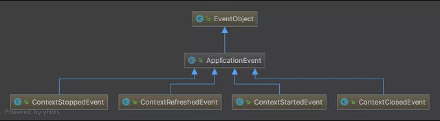

[TOC]

### Spring(Boot)基础

Spring 是一个轻量级 Web **开发框架**。一般 Spring 框架指的是 **Spring Framework**，它是**很多模块**的集合。

#### Spring模块

下图是 Spring4.x 的模块架构，包含**核心容器、数据访问/集成,、Web、AOP、工具、消息和测试等模块**。目前最新的 5.x 版本中 Web 模块的 Portlet 组件已废弃，同时增加了用于异步响应式处理的 **WebFlux** 组件。


> **Spring Core Container**

**(1) Core**

包含 Spring 框架的核心类，Spring 的其他组件都要用到该包里的类，是其他组件的基本模块。

**(2) Beans**

包含访问配置文件、创建和管理 bean 以及进行 IoC/DI 操作相关的所有类。

**(3) Context**

模构建于 Core 和 Beans 模块基础之上，提供了一种框架式对象访问方法。Context 模块继承了 Beans 的特性，为 Spring 核心提供了大量扩展，添加了对国际化、事件传播、资源加载和对 Context 的透明创建的支持。Context 模块同时也支持 J2EE 的一些特性，ApplicationContext 接口是 Context 模块的关键。

**(4) Expression Language**

提供了强大的表达式语言，用于在运行时查询和操纵对象。

> **Spring Data Access/Integration**

**(1) JDBC**

该模块提供了一个 JDBC 抽象层，可以消除冗长的 JDBC 编码和解析数据库厂商特有的错误代码。这个模块包含了 Spring 对 JDBC 数据访问进行封装的所有类。

**(2) ORM** 

该模块为 JPA、Hibernate、 iBatis 等对象-关系映射 API 提供了一个交互层。利用 ORM 封装包，可以混合使用所有 Spring 提供的特性进行 O/R 映射，如简单声明性事务管理。

**(3) OXM**

该模块提供了一个对 Object/XML 映射实现的抽象层，Object/XML 映射实现包括 JAXB、 Castor、 XMLBeans 等。

**(4) JMS(Java Messaging Service)**

该模块主要包含了一些制造和消费消息的特性。

**(5) Transaction**

支持**编程和声明性**的事务管理，这些事务类必须实现特定的接口，并且对所有的 bean 都适用。

> **Spring Web**

Web 模块提供了基础的面向 Web 的集成特性。如多文件上传、使用 Servlet Listeners 初始化 IoC 容器以及一个面向 Web 的应用上下文。它还包含 Spring 远程支持中 Web 的相关部分。

> **Spring AOP**

Aspects 模块提供了对 AspectJ 的集成支持。

Instrumentation 模块提供了 class instrumentation 支持和 classloader 实现，使得可以在特定的应用服务器上使用。

> **Test**

Test 模块支持使用 JUnit 和 TestNG 对 Spring 组件进行测试。

#### 控制反转

##### 1.IOC概述

IoC(Inverse of Control 控制反转)是一种**设计思想**，就是**将原本在程序中手动创建对象的控制权，交由 Spring 框架来管理**。**控制**就是开发者本来可以**控制**对象的**创建、管理**过程，**反转**就是将这个**权利交给外部的环境**去实现，比如 IOC 容器。IoC 并非 Spring 框架特有。

将对象之间的**相互依赖关系**交给 IoC 容器来管理，并由 IoC 容器完成对象的**注入**。**IoC 容器就像是一个工厂一样，当需要创建一个对象的时候，只需要配置好配置文件/注解即可，完全不用考虑对象是如何被创建出来的**。使用控制反转后开发者失去了创建管理对象的权利，但可以**不用考虑对象的创建、管理等一系列事情**。

例如类 A 依赖于类 B：

- **传统的开发方式**：在类 A 中手动 new 一个 B 的对象出来。
- **使用 IoC 开发方式**：不通过 new 关键字来创建对象，而是通过 IoC 容器(Spring 框架) 来生成实例化对象。需要哪个对象**直接从 IoC 容器里面获取**即可。

IOC 最核心的思想：资源不由使用资源的双方管理，**而由不使用资源的第三方管理**。

控制反转的好处：(1)降低对象之间的**耦合度**或依赖程度；(2)资源集中管理，实现资源的可配置和易管理；(3)简化应用开发，增加可维护性。

##### 2.依赖倒置原则

假设设计一辆汽车：先设计轮子，然后根据轮子大小设计底盘，接着根据底盘设计车身，最后根据车身设计好整个汽车。就出现了一个**“依赖”关系**：汽车依赖车身，车身依赖底盘，底盘依赖轮子。


这样设计的可维护性很低。假设设计完工之后要把车子的轮子设计都改大一码，因为是根据轮子的尺寸设计底盘，轮子的尺寸一改，底盘设计就得修改；同样因为是根据底盘设计的车身，那么车身也得改，同理汽车设计也得改：整个设计几乎都得改！

现在换一种思路。先设计汽车的**大概样子**，然后根据汽车的样子来设计车身，根据车身来设计底盘，最后根据底盘来设计轮子。这时候**依赖关系就倒置**过来了：轮子依赖底盘，底盘依赖车身，车身依赖汽车。


这时候如果要改轮子**就只需要改动轮子的设计**，而不需要动其他东西的设计了。

这就是依赖倒置原则：**把原本的高层建筑依赖底层建筑“倒置”过来，变成底层建筑依赖高层建筑**。高层建筑决定需要什么，底层去实现这样的需求，但是高层并不用管底层是怎么实现的。这样就不会出现前面的“牵一发动全身”的情况。

这几种概念的关系如下：


##### 3.IOC与DI的关系

- IOC 是一种**设计思想**，就是将原本在程序中手动创建对象的控制权交由 Spring 框架管理。

- DI (Dependency Injection) 是**依赖注入**，向**类里面属性注入其依赖值**。**依赖注入**是 IOC 最常见以及最合理的**实现方式**。**依赖注入不能单独存在，需要在 IOC 基础上完成操作**。

#### Bean基础

##### 1.Bean概述

在 Spring 中，组成应用程序的主体及由 IOC 容器管理的对象称之为 **bean**。bean 就是由 IOC 容器初始化、装配及管理的对象，除此之外 bean 与程序中的其他对象没有什么区别。

配置类如下：

```java
@Configuration
public class MainConfig {
    
    @Bean
    public Person person() {
    	return new Person(); 
    }
    
    @Bean(value = "myBook")
    public Book book() {
    	return new Book(); 
    }
}
```

##### 2.BeanName

每个 Bean 在 Spring 容器中都有一个**唯一的名字**（beanName）和 0 个或**多个别名**(aliases)，通过 beanName 和 alias 都能从容器中获取 bean。

通过 **@Bean** 的形式定义 bean 的默认名称是**方法名**，也可以指定 bean 的名称如 @Bean(value = "beanName")。通过 beanName 可从容器中获取对应的 bean。

```java
public static void main( String[] args ) {
    // 传入配置类
	AnnotationConfigApplicationContext ctx = new AnnotationConfigApplicationContext(NanoConfig.class);
    // 根据bean名称去获取bean
	System.out.println(ctx.getBean("myBook")); 
}
```

##### 3.@Configuration配置类

@Configuration 注解一般用来声明**配置类**，相比 @Component 注解，@Configuration 注解声明配置类语义更加明确。

```java
@Configuration
public class AppConfig {
    @Bean
    public TransferService transferService() {
        return new TransferServiceImpl();
    }
}
```

#### Bean的作用域

##### 1.作用域分类

在许多场景下单例 bean 是理想的方案，不过有的类**会携带或保持一些状态**，因此重用可能会污染这些单例对象的状态，所以 Spring 定义了多种作用域的 bean。

|     Scope     | Description                                                  |
| :-----------: | :----------------------------------------------------------- |
| **singleton** | （**默认的**）在每个 Spring IoC 容器中，一个 bean 定义对应只会有唯一一个 bean 实例 |
| **prototype** | 一个 bean 定义可以有**多个** bean 实例                       |
|  **request**  | 一个 bean 定义对应于单个 **HTTP 请求**的生命周期，仅适用于 **WebApplicationContext** 环境 |
|  **session**  | 一个 bean 定义对应于单个 **HTTP Session** 的生命周期。       |

注意：**普通** ApplicationContext 仅提供 **singleton 和 prototype** 两种作用域。**request、session** 作用域只能用在 **WebApplicationContext** 环境中。

###### (1)singleton

singleton 的 bean 是由容器来保证这种类型的 bean 在**同一个容器中**只存在一个**共享实例**。在**不指定 @Scope** 的情况下，**所有** bean 都默认为**单实例**, 且在**容器启动就进行实例创建(==饿汉式加载==)**。如果将单例 bean 指定为 **@Lazy 懒加载**，那么容器启动时就**不实例化对象**，而在**第一次使用**的时候才进行实例化。singleton bean 的生命周期全交由容器管理。

````java
@Bean
@Lazy // 懒加载
public Person person() {
    return new Person();
}
````

**Spring 的单例是基于 BeanFactory 也就是 Spring 容器的，单例 Bean 在此容器内只有一个；而 Java 的单例是基于 JVM，每个 JVM 内只有一个实例**。

###### (2)prototype

prototype (原型类型)作用域表示一个 bean **定义**对应**多个对象实例**。prototype 对象在**创建容器的时候并没有实例化**，而是**当有需要获取 bean 的时候才会去创建一个对象**，而且每次获取到的对象是一个**新的对象**。

**生命周期**：虽然这种类型的对象的**实例化以及属性设置**等工作都是由**容器负责**，但是只要创建完毕并将对象实例返回给请求方之后，**容器就不再拥有当前返回对象的引用**，请求方需要**自己负责** prototype 对象的后继生命周期的管理，包括该对象的销毁。

singleton 与 prototype 用法最大区别：**有无状态**。对**==有状态的== bean 可以使用 prototype 作用域**(比如保存每个顾客信息的对象)，而对**无状态**的 bean 则应该使用 **singleton** 作用域。  

###### (3)request

request 模式只适用于 Web 程序。**每一次 HTTP 请求都会产生一个新的 bean**，同时该 bean 仅在当前 HTTP request 内有效，当请求结束后，该对象的生命周期即告结束。

###### (4)session

session 模式只适用于 Web 程序。用户打开**浏览器会话开始**，直到关闭浏览器会话才会结束。一次会话期间只会创建一个 session 对象，所以 session 中的数据**可供当前会话中所有 servlet 共享**。该 bean 仅在**当前 HTTP session 内有效**。

##### 2.@Scope注解

@Scope 注解可以配置 bean 的**作用域**。

**ConfigurableBeanFactory** 接口提供了单例(SCOPE_SINGLETON) 和原型 (SCOPE_PROTOTYPE)模式的常量。

在 **MVC** 中，**WebApplicationContext 接口**提供 MVC 下特有的**作用域**常量，如请求(SCOPE_REQUEST)，会话(SCOPE_SESSION)。

```java
@Component
@Scope(ConfigurableBeanFactory.SCOPE_SINGLETON)  	// 设置bean作用域
// @Scope(WebApplicationContext.SCOPE_REQUSET)  	// 设置bean作用域(For MVC)
public class TestBean {
}
```

```java
public interface ConfigurableBeanFactory extends HierarchicalBeanFactory, SingletonBeanRegistry {

    String SCOPE_SINGLETON = "singleton";

    String SCOPE_PROTOTYPE = "prototype";
}
```

```java
public interface WebApplicationContext extends ApplicationContext {

	String SCOPE_REQUEST = "request";

	String SCOPE_SESSION = "session";

	String SCOPE_APPLICATION = "application";
}
```

##### 3.其他

> **Spring中单例bean的线程安全问题**

单例 bean 可能**存在线程问题**，当**多个**线程操作**同一个对象**的时候，对单例对象的**非静态成员变量的写操作**会存在线程安全问题。常见的有两种解决办法：

1. 在 Bean 对象中尽量避免定义可变的成员变量(不太现实)。
2. 在**类**中定义一个 **ThreadLocal** 成员变量，将需要的**==可变成员变量==保存在 ThreadLocal 中**(推荐的一种方式)。

#### 包扫描@ComponentScan

在**配置类**上使用 @ComponentScan 注解以进行**包扫描**。

```java
@Configuration
@ComponentScan(basePackages = "com.nano")
public class NanoConfig {
}
```

**1. 排除用法**

参数 **excludeFilters** 可以排除不需要扫描的类。下面排除 @Controller 注解的和 BookService 的类而不扫描。

```java
@Configuration
@ComponentScan(basePackages = {"com.nano"}, excludeFilters = {
@ComponentScan.Filter(type = FilterType.ANNOTATION,value = {Controller.class}),
@ComponentScan.Filter(type = FilterType.ASSIGNABLE_TYPE,value = {BookService.class}) })
public class NanoConfig {
}
```

**2. 包含用法**

参数 includeFilters 可以扫描包含的类。若使用包含的用法，需要把 useDefaultFilters 属性设置为 false(true 表示扫描全部的)。这个少用。

```java
@Configuration
@ComponentScan(basePackages = {"com.nano"},includeFilters = {
@ComponentScan.Filter(type = FilterType.ANNOTATION,value = {Controller.class, Service.class}) },useDefaultFilters = false)
public class NanoConfig {
}
```

**3: @ComponentScan.FilterType**

可以通过 FilterType 定制包扫描类的类型。

- 注解形式的 FilterType.ANNOTATION(如：@Controller @Service @Repository @Compent)。
- 指定类型的 FilterType.ASSIGNABLE_TYPE(如：@ComponentScan.Filter(type = FilterType.ASSIGNABLE_TYPE, value = {TulingService.class}))。
- 自定义的 FilterType.CUSTOM。

```java
public enum FilterType {
	// 注解形式 比如@Controller @Service @Repository @Compent 
    ANNOTATION,
	// 指定的类型 
    ASSIGNABLE_TYPE,
	// aspectJ形式 
    ASPECTJ,
	// 正则表达式
    REGEX,
	// 自定义的 
    CUSTOM
}
```

FilterType.CUSTOM 自定义类型使用实例。

```java
public class NanoFilterType implements TypeFilter {
	@Override
	public boolean match(MetadataReader metadataReader, MetadataReaderFactory metadataReaderFactory) throws IOException {
		// 获取当前类的注解源信息
		AnnotationMetadata annotationMetadata = metadataReader.getAnnotationMetadata();
		// 获取当前类的class的源信息
		ClassMetadata classMetadata = metadataReader.getClassMetadata(); 
		Resource resource = metadataReader.getResource();
		if(classMetadata.getClassName().contains("dao")) { 
            return true;
		}
		return false; 
	}
}
```

```java
@ComponentScan(basePackages = {"com.nano"},includeFilters = { @ComponentScan.Filter(type = FilterType.CUSTOM, value = NanoFilterType.class)}, useDefaultFilters = false) 
public class NanoConfig {
}
```

#### bean加载与装配

##### 1.常用bean加载方式

有不同的方式将 bean 加载到容器中。

###### (1)常用注解

通过 **@ComponentScan + (@Controller/@Service/@Respository/@Component)** 添加组件。适用场景: **自己写的业务组件**可以通过该方式来进行加载到容器中。一般使用 **@Autowired** 注解自动装配 bean。

- @**Component**: 通用注解，可标注**任意类**为 Spring 组件。如果一个 Bean **不知道**属于哪个层，可以使用此注解标注。
- @**Repository**: 对应**持久层**即 Dao 层，主要用于数据库相关操作。
- @**Service**: 对应**服务层**，主要涉及一些复杂的逻辑，需要用到 Dao 层。
- @**Controller**: 对应 MVC **控制层**，用于接受用户请求并调用 Service 层返回数据给前端页面。

###### (2)@Bean注解

**@Bean** 注解适用于导入**第三方组件**的类。

> **@Component和@Bean的区别**

- 作用对象不同：@Component 注解作用于**类**，而 @Bean 注解作用于**方法**。
- @Component 通常配合 @ComponentScan 注解将需要装配的类注入到容器中。@Bean 注解通常用于将**第三方 bean** 注入到容器中。

###### (3)@Import注解

```java
@Configuration
@Import(value = {Person.class, Car.class}) 
public class MainConfig {
}
```

@Import 注解可以导入实现了 **==ImportSelector 接口==和 ==ImportBeanDefinitionRegistrar 接口==**的 bean。

通过 @Import 与 **ImportSeletor 接口**实现组件导入，注意：导入组件的 id 为**全类名路径**。

```java
public class BookImportSelector implements ImportSelector { 
    // 可以获取导入类的注解信息
    @Override
    public String[] selectImports(AnnotationMetadata importingClassMetadata) {
    	return new String[]{"com.nano.entity.Book"};
	}
}
```

```java
@Configuration 
// 配置类中注入 bean。
@Import(value = {Person.class, Car.class, BookImportSelector.class}) 
public class NanoConfig {
}
```

通过 @Import 与 **ImportBeanDefinitionRegister 接口**导入组件(可以指定 bean 的名称)。

```java
public class NanoBeanDefinitionRegister implements ImportBeanDefinitionRegister { 
    @Override
	public void registerBeanDefinitions(AnnotationMetadata importingClassMetadata, BeanDefinitionRegistry registry) { 
        // 创建一个bean定义对象
		RootBeanDefinition rootBeanDefinition = new RootBeanDefinition(Pencil.class);
		// 把bean定义对象导入到容器中
		registry.registerBeanDefinition("book", rootBeanDefinition); 
	}
}
```

```java
@Configuration
//@Import(value = {Person.class, Car.class})
//@Import(value = {Person.class, Car.class, BookImportSelector.class})
@Import(value = {Person.class, Car.class, BookImportSelector.class, NanoBeanDefinitionRegister.class}) 
public class NanoConfig {
}
```

这种方式在**自动装配**中用的多，这在 Spring 源码中应用很多，比如 AOP 中通过这种方式往容器导入了相关组件。

###### (4)FacotryBean接口

可以通过实现 **FacotryBean 接口**来实现**比较复杂**组件的导入与注册。常规 Bean 都是 Spring **使用 Class 的反射**获取具体**实例**，如果 Bean 的获取过程**比较复杂**，那么配置类中需要配置**大量属性值**，这时候可以**实现 FactoryBean 接口**，在其 **getObject() 方法中初始化这个 bean**。比如装配 MyBatis 中的 **SqlSessionFactoryBean** 或者**数据库连接**对象就可以用这个。

```java
public class CarFactoryBean implements FactoryBean<Car> {
	// 返回bean的对象
	@Override
	public Car getObject() throws Exception {
		return new Car(); 
	}
	// 返回bean的类型
	@Override
	public Class<?> getObjectType() {
		return Car.class; 
	}
	// 是否为单例
	@Override
	public boolean isSingleton() {
		return true; 
	}
}
```

使用场景：整合**第三方的复杂初始化对象**。典型的是 **SqlSessionFactoryBean** 组件。

##### 2.懒加载@Lazy

懒加载主要针对 **singleton** 的 bean，容器启动时不创建对象，在**第一次使用的时候才会创建该对象。**

```java
@Bean
@Lazy
public Person person() {
	return new Person(); 
}
```

##### 3.条件装配@Conditional

###### (1)@Conditional注解

@Conditional 注解用于条件装配 Bean，需要**配合 Condition 接口**使用。**满足一定条件才装配 Bean 否则不装配**，比如数据库**配置信息不全**就不装配。

```java
@Configuration
@ComponentScan(basePackages = "com.nano.*")
@ImportResource(value = {"classpath:spring-other.xml"})
public class NanoConfig {
	
	@Bean(name = "dataSource", destroyMethod = "close")
    // 这里配置的类需实现Condition接口
	@Conditional(DatabaseConditional.class)      
	public DataSource getDataSource(            
        	// 使用@Value去取配置文件中的值并注入
			@Value("${database.driverName}") String driver,
			@Value("${database.url}") String url,
			@Value("${database.username}") String username, 
			@Value("${database.password}") String password
		) {
		Properties props = new Properties();
		props.setProperty("driver", driver);
		props.setProperty("url", url);
		props.setProperty("username", username);
		props.setProperty("password", password);
		DataSource dataSource = null;
		try {
			dataSource = BasicDataSourceFactory.createDataSource(props);
		} catch (Exception e) {
			e.printStackTrace();
		}
		return dataSource;
	}
}	
```

上述的 **@Conditional(DatabaseConditional.class)** 传入了 DatabaseConditional 类，传入 @Conditional 注解的**类需要实现 Condition 接口**。

```java
import org.springframework.context.annotation.Condition;
import org.springframework.context.annotation.ConditionContext;
import org.springframework.core.env.Environment;
import org.springframework.core.type.AnnotatedTypeMetadata;

public class DatabaseConditional implements Condition {

    /**
	 * 数据库装配条件 不符合条件的就不装配
	 * @param context 条件上下文
	 * @param 
	 */
	@Override
	public boolean matches(ConditionContext context, AnnotatedTypeMetadata metadata) {
		Environment env = context.getEnvironment();
        // 此处是判断条件
		return env.containsProperty("database.driverName") && env.containsProperty("database.url") 
				&& env.containsProperty("database.username") && env.containsProperty("database.password");
	}
}
```

只有满足了**上述自定义的条件**，才会**装配** DataSource 这个 bean。

###### (2)@Conditional派生注解

作用：当满足指定的**条件时，才往容器中装配该组件**。

|      @Conditional扩展注解       |                作用(判断是否满足当前指定条件)                |
| :-----------------------------: | :----------------------------------------------------------: |
|       @ConditionalOnJava        |                 系统的 Java 版本是否符合要求                 |
|     @**ConditionalOnBean**      |                     容器中存在指定 Bean                      |
|  **@ConditionalOnMissingBean**  |                    容器中不存在指定 Bean                     |
|    @ConditionalOnExpression     |                     满足 SpEL 表达式指定                     |
|     **@ConditionalOnClass**     |                       系统中有指定的类                       |
|   @ConditionalOnMissingClass    |                      系统中没有指定的类                      |
|  @ConditionalOnSingleCandidate  |     容器中只有一个指定的 Bean，或者这个 Bean 是首选 Bean     |
|     @ConditionalOnProperty      | 当 Environment 里存在 PropertySource，存在对应的值不为 false 的属性值时进行加载 |
|     @ConditionalOnResource      | 只有存在指定的资源文件时才生效，默认情况下是 classpath，也可以指定其绝对路径 |
|  @ConditionalOnWebApplication   | 当前的 ApplicationContext 是 WebApplicationContext 时才生效  |
| @ConditionalOnNotWebApplication | 当前的 ApplicationContext 不是 WebApplicationContext 时才生效 |
|       @ConditionalOnJndi        |                       JNDI 存在指定项                        |

解释：

- **@ConditionalOnClass/@ConditionalOnMissingClass**: 当前 classpath 有对应指定的类型才去创建 Bean。底层通过 ClassLoader 或者 Class.forName 来加载类。
- **@ConditionalOnBean/@ConditionalOnMissingBean**: 只有当 BeanFactory 里(不)包含指定的 Bean 时，才加载对应的 bean。注意：官网建议在 AutoConfiguration 里使用此注解，因为 @ConditionalOnClass 受到 bean 装配顺序影响，很有可能不能达到预期效果。

##### 4.@Profile

通过 @Profile 注解可以根据环境来激活标识不同的 Bean。

@Profile 标识在类上，那么只有当前环境匹配，整个配置类才会生效。@Profile 标识在 Bean 上 ，那么只有当前环境的 Bean 才会被激活。没有标志为 @Profile 的 bean 不管在什么环境都可以被激活。

```java
@Configuration
@PropertySource(value = {"classpath:ds.properties"})
public class MainConfig implements EmbeddedValueResolverAware {
    
	@Value("${ds.username}") private String userName;
	@Value("${ds.password}") private String password;
	private String jdbcUrl; private String classDriver;
    
	@Override
	public void setEmbeddedValueResolver(StringValueResolver resolver) {
		this.jdbcUrl = resolver.resolveStringValue("${ds.jdbcUrl}");
		this.classDriver = resolver.resolveStringValue("${ds.classDriver}"); 
	}
	
    // 标识为测试环境才会被装配 @Bean
	@Profile(value = "test") 
    public DataSource testDs() {
		return buliderDataSource(new DruidDataSource());
	}
   
	// 标识生产环境才会被激活 @Bean
	@Profile(value = "prod") 
    public DataSource prodDs() {
		return buliderDataSource(new DruidDataSource());
	}
    
	private DataSource buliderDataSource(DruidDataSource dataSource) { 
		dataSource.setUsername(userName); 
		dataSource.setPassword(password); 
		dataSource.setDriverClassName(classDriver); 
		dataSource.setUrl(jdbcUrl);
		return dataSource; 
	}
}
```

激活切换环境的方法：

方法一:通过运行时 JVM 参数切换: **-Dspring.profiles.active=test|dev|prod** 

方法二:通过代码方式切换。

```java
public static void main(String[] args) {
	AnnotationConfigApplicationContext ctx = new AnnotationConfigApplicationContext(); 		
    ctx.getEnvironment().setActiveProfiles("test", "dev");
	ctx.register(MainConfig.class); 
    ctx.refresh(); 
    printBeanName(ctx);
}
```

#### 配置文件与属性设置

##### 1.配置文件

配置文件可以修改 Spring Boot 自动配置的**默认值**。Spring Boot 使用**全局配置文件**，配置文件名是固定的：

- **application.properties**
- **application.yml**

###### (1)YAML语法

**k:(空格)v**：表示**一对键值对**(空格必须有)。以**空格**的缩进来控制层级关系；只要是左对齐的一列数据，都是同一个层级的。属性和值也是大小写敏感。

```yaml
server:
  port: 8081
  path: /hello
```

对象、Map 写法：

```yaml
friends:
  lastName: zhangsan
  age: 20
```

数组(List、Set)写法：用 **- 值表示数组中的一个元素**。

```yaml
pets:
  - cat
  - dog
  - pig
```

##### 2.配置信息读取

###### (1)@Value注解

使用 **@Value 注解**可以为 **bean 注入属性**，@Value 内可以直接设置属性值，也可以使用 Spring 表达式，或引用配置文件中的属性值。

```java
public class Person {
    // 普通方式
    @Value("Tom")
    private String firstName;
    // SPEL表达式赋值
    @Value("#{28-8}")
    private Integer age;
    // 通过读取配置文件的值
    @Value("${person.lastName}")
    private String lastName;
}
```

###### (2)@ConfigurationProperties注解

使用 @ConfigurationProperties 注解可以将**配置信息与指定的 bean 属性进行绑定**，从而将配置文件中的对应属性映射到一个组件类中。**prefix 属性**可以指定配置文件中的配置值。配置文件为 **application.yml**。

配置信息如下：

```yaml
person:
  lastName: Lucy
  age: 18
  boss: false
  birth: 2017/12/12
  maps: {k1: v1,k2: 12}
  friends:
    - Jack
    - Lily
  dog:
    name: 小狗
    age: 12
```

映射的类如下：

```java
@Component
// 这里前缀与配置文件中的前缀对应
@ConfigurationProperties(prefix = "person")
public class Person {
    private String lastName;
    private Integer age;
    private Boolean boss;
    private Date birth;
    private Map<String,Object> maps;
    private List<Object> friends;
    private Dog pet;
}
```

###### (3)@PropertySource注解加载自定义配置文件

 **@PropertySource** 注解可以加载**自定义配置文件**中的配置信息。**@PropertySource** 注解需要在**配置类**中标注，value 值可以有多个。ignoreResourceNotFound 指示找不到配置文件就忽略。

比如将 person 相关的信息配置在 **person.properties** 文件中，通过 @PropertySource 注解加载配置信息的方式如下。

```java
@Component
@PropertySource(value = {"classpath:person.properties"})
@ConfigurationProperties(prefix = "person")
public class Person {
    private String lastName;
    private Integer age;
    private Boolean boss;
}
```

###### (4)@ImportResource注解

@**ImportResource** 注解可以导入 Spring 的配置文件，让配置文件里面的内容生效；因为 Spring Boot 里面没有 Spring 的配置文件，自己编写的配置文件也不能自动识别，想让 Spring 的配置文件生效并加载进来就需要把 @**ImportResource** 标注在一个**配置类**上。

```java
@ImportResource(locations = {"classpath:beans.xml"})	// 导入Spring的配置文件让其生效
```

##### 3.配置文件加载顺序

Spring Boot 启动会扫描以下位置的 application.properties 或者 application.yml 文件作为**默认配置文件**。

- file:./config/
- file:./
- classpath:/config/
- classpath:/

优先级**由高到底**，高优先级的配置会覆盖低优先级的配置。

还可以通过 spring.config.location 来改变默认的配置文件位置。项目打包好以后，可以使用**命令行参数的形式**，启动项目的时候来**指定配置文件的新位置**；指定配置文件和默认加载的这些配置文件共同起作用形成互补配置。

```java
java -jar NanoApplication.jar --spring.config.location=/home/app/nano/application.properties
```

#### 依赖注入DI

所谓依赖注入，就是把底层类作为参数传入上层类，实现上层类对下层类的控制。在依赖注入模式下，创建被依赖对象工作不再由调用方完成而由 Spring 容器完成，然后注入给调用方。依赖注入不能单独存在，需要在 IOC 基础上完成操作。说白了就是**创建对象时，向类里的属性设置值**。

一般而言，依赖注入有几种方式。

- **构造器**注入。
- **setter** 注入。
- **注解**注入(@Autowired) 
- 接口注入。

**构造器注入和 setter 注入和注解注入**是主要的方式，而接口注入是从别的地方注入的方式。

##### 1.构造器注入

构造器注入**依赖于构造方法**实现，构造方法可以是**有参数或无参数**的。普通类通过构造方法来创建类对象，Spring 可以采用**反射的方式**通过使用构造方法来完成注入，这就是构造器注入的原理。

**构造器注入无法解决循环依赖问题**！

##### 2.setter注入

setter 注入即通过对应的 **setter 方法**进行属性注入，它消除了使用构造器注入时出现**多个参数的可能性**。首先可以把构造方法声明为**无参数**的，然后使用 setter 注入为其设置对应的值，其实也是通过**反射现实**的。

```xml
<bean id="role2" class="com.nano.pojo.Role">
    <property name="roleName" value="工程师"/>
    <property name="note" value="Jack"/>
</bean
```

Spring 会通过**反射调用无参构造方法生成对象**，再反射调用对应的 setter 方法注入配置的值。这种方式是基于 xml 配置时 Spring 最为主要的注入方式。

##### 3.接口注入

有些时候资源**并非来自于自身系统**，而是来自于**外界**，这个时候可以采用**接口注入**的形式来获取它。比如在 Web 工程中，配置的数据源往往是通过服务器（比如 Tomcat）去配置的，这个时候可以用 **JNDI** 的形式通过接口将它注入 Spring IoC 容器中来。

##### 4.@Autowired与@Resource注入

###### (1)@Autowired注解

@Autowired 注解首先根据类型去**寻找对应的 bean**，找不到再根据**属性名称和 beanName **来寻找 bean。默认必须找到对应 Bean，否则报错（可以使用 required = false 关闭必须装配）。

@Autowired 可以标注在**属性**上，也可以标注在**方法**上，还可以标注在**入参**上。

```java
@Autowired	
private Animal animal = null;
```

```java
@Override
@Autowired
public void setAnimal(Animal animal) {
    this.animal = animal;
}
```

```java
public BussinessPerson(@Autowired Animal animal) {
    this.animal = animal;
}
```

###### (2)@Primary与@Qualifier注解

当一个接口有**多个实现类**，使用场景需要进行区分的时候，**使用 @Primary 与 @Qualifier **可以指定**注入的 bean 的实现类型**以消除歧义。如下接口：

```java
public interface Animal {
	public void use();
}
```

下面是两个实现类：

```java
@Component
public class Dog implements Animal {
	@Override
	public void use() {
		System.out.println("狗【" + Dog.class.getSimpleName()+"】是看门用的。");
	}
}
```

```java
@Component
public class Cat implements Animal {
	@Override
	public void use() {
		System.out.println("猫【" + Cat.class.getSimpleName()+"】是抓老鼠。");
	}
}
```

这里 Dog 类和 Cat 类都实现了 Animal 接口。

```java
@Component
public class Student {
    // 自动注入实现了动物接口的类
    @Autowired	
    private Animal animal = null;

    @Override
    public void service() {
        this.animal.use();
    }

    @Override
    public void setAnimal(Animal animal) {
        this.animal = animal;
    }
}
```

Student 的自动注入会报错，因为**不知道注入哪一个**实例。产生注入失败是因为**按类型查找**，动物 Animal 接口有**多个类型**，这就存在歧义。

**注解 @Primary** 可以修改**优先权**。比如在 Cat 类上使用此注解。

```java
@Component
@Primary
public class Cat implements Animal {...}
```

此时容器会**优先**注入 Cat 实例到作为 Animal 的实现进行注入。

如果 @Primary 用在多个类上也会有歧义，可以使用 **@Qualifier 注解**。@Qualifier 注解可以配置指定的 **beanName**，它可以与 @Autowired 一起去通过**类型与 beanName **一起寻找 bean。如下注入的就是 Dog 类的实例。

```java
@Autowired
@Qualifier("dog")	// 指定beanName
Animal animal = null;
```

###### (3)@Resourse注解

@Resource 可以用于 bean 的注入。

**@Autowired** 为 Spring 提供的注解，只按照 **type 注入**。

**@Resource** 由 J2EE 提供，其定义为 javax.annotation.Resource。@Resource 既可以按照 **name** 也可以按照 **type** 进行注入，不配置时默认按照 name 进行注入。

```javascript
public class TestServiceImpl {
    // 下面两种@Resource只要使用一种即可
    @Resource(name = "userDao")
    private UserDao userDao; // 用于字段上
    
    @Resource(name = "userDao")
    public void setUserDao(UserDao userDao) { // 用于属性的setter方法上
        this.userDao = userDao;
    }
}
```

**@Resource 装配顺序：**

1. 如果**同时指定了 name 和 type**，则从 Spring 上下文中找到唯一匹配的 bean 进行装配，找不到则抛出异常。
2. 如果指定了 **name**，则从上下文中查找名称（id）匹配的 bean 进行装配，找不到则抛出异常。
3. 如果指定了 **type**，则从上下文中找到类似匹配的唯一 bean 进行装配，找不到或是找到多个，都会抛出异常。
4. 如果既没有指定 name，又没有指定 type，则默认按 name 进行装配。

#### Bean的生命周期与拓展

**单实例** bean 在容器启动的时候就创建了，而且容器销毁的时候，也会调用 bean 的销毁方法。

**多实例** bean 在容器启动的时候不会被创建的而是在获取 bean 的时候被创建，且 bean 的销毁不受 IOC 容器的管理。多例通过 GC 进行处理回收。

##### 1.生命周期

###### (1)生命周期基本流程

主要流程如下。

【单例 Spring bean 的生命周期】面试回答，这 10 个步骤可以作为面试模板：

1. **实例化**一个 Bean，完成对象创建；
2. 按照 Spring 上下文对实例化的 Bean 进行配置，也就是 **IOC 注入**；
3. 如果这个 Bean 实现了 **BeanNameAware 接口**，会调用它实现的 **setBeanName**(String beanId) 方法，此处传递的是 Spring 配置文件中 Bean 的 ID；
4. 如果这个 Bean 实现了 **BeanFactoryAware 接口**，会调用它实现的 **setBeanFactory**()，传递的是 Spring **工厂本身**(可以用这个方法获取到其他 Bean)；
5. 如果这个 Bean 实现了 **ApplicationContextAware接口**，会调用 **setApplicationContext**(ApplicationContext)方法，传入 **Spring 上下文**，该方式同样可以实现步骤 4，但**比 4 更好**，因为 ApplicationContext 是 BeanFactory 的子接口，实现了更多**方法**；
6. 如果这个 Bean 实现了 **BeanPostProcessor 接口**，将会调用 **postProcessBeforeInitialization**(Object obj,  String s)方法，BeanPostProcessor 经常被**用作是 Bean 内容的更改**，并且由于这个是在 Bean 初始化**结束时**调用 After 方法，也可用于**内存或缓存技术**；
7. 如果这个 Bean 配置了 **init-method 方法**，则调用该初始化方法；
8. 如果这个 Bean 实现了 **BeanPostProcessor 接口**，将会调用 **postAfterInitialization**(Object obj, String s) 方法；

注意：以上工作完成以后就可以**使用这个 Bean 了**，这是一个 singleton 的 bean，所以一般情况下调用同一个 ID 获取的 Bean 会是在内容**地址相同**的实例。

9. 当 Bean **不再需要**时，会经过清理阶段，如果 Bean 实现了 **DisposableBean 接口**，会调用其实现的 **destroy() 方法**。
10. 最后，如果这个 Bean 配置了 **destroy-method 方法**，则调用该**销毁方法**。

Bean 的完整生命周期经历了各种**方法调用**，这些方法可以划分为以下几类：

- **Bean 自身的方法**：包含 Bean 本身调用的方法和通过配置文件或注解配置的 **init-method** 和 **destroy-method** 所对应的的**初始化及销毁**方法。
- **Bean 级生命周期接口方法**：包含 BeanNameAware、BeanFactoryAware、InitializingBean 和 DiposableBean 等接口的方法。
- **容器级生命周期接口方法**：包含 **InstantiationAwareBeanPostProcessor** 和 **BeanPostProcessor** 这两个接口的方法，一般称它们的实现类为“**后处理器**”。
- **工厂后处理器接口方法**：包含 AspectJWeavingEnabler, ConfigurationClassPostProcessor, CustomAutowireConfigurer 等非常有用的**工厂后处理器接口**的方法。工厂后处理器也是**容器级**的。在应用上下文装配配置文件之后立即调用。

###### (2)不同Scope的生命周期

**singleton bean**

Spring 容器可以完整管理 **singleton** 作用域下 bean 的创建、初始化、销毁的完整生命周期。整个详细流程参考上面。

**prototype bean**

对于 prototype 作用域的 bean，**Spring 只负责创建实例**，当容器创建 bean 的实例(包含初始化、配置、装配等工作)后，会将其交给使用方，之后 Spring 容器就不再跟踪其生命周期。

prototype 对象在第一次时，Spring 容器都会调用其**构造器创建这个对象**，然后调用 **init-method** 属性值中所指定的初始化方法。而对象销毁的时候，Spring 容器**不会**帮调用任何方法(**不会调用 destroy 方法**)。清除 prototype bean 并释放任何其持有的资源，都是**使用方代码的职责**。对于prototype 作用域 bean，可以将 Spring 容器的角色看作**普通 new 操作**的替代者，任何迟于该时间点的生命周期事宜都得交由使用方来处理。让 Spring 容器释放被 prototype 作用域 bean 占用资源的一种可行方式是，通过使用 bean 的后置处理器，该处理器持有要被清除的 bean 的引用。

##### 2.初始化与销毁方法

###### (1)注解配置

由容器管理 Bean 的生命周期，通过指定 bean 的初始化方法和 bean 的销毁方法。

```java
@Configuration
public class NanoConfig {
    // 指定bean的生命周期的初始化方法和销毁方法.
    @Bean(initMethod = "init", destroyMethod = "destroy") 
    public Car car() {
		return new Car(); 
    }
}
```

###### (2)InitializingBean与DisposableBean接口

可以通过 **InitializingBean 和 DisposableBean** 两个接口实现 bean 的初始化及销毁方法。

```java
@Component
public class Person implements InitializingBean, DisposableBean {
	public Person() {
        System.out.println("Person的构造方法");
	}
	@Override
	public void destroy() throws Exception {
		System.out.println("DisposableBean的destroy()方法 "); 
    }
	@Override
	public void afterPropertiesSet() throws Exception {
		System.out.println("InitializingBean的 afterPropertiesSet方法");
    }
}
```

###### (3)@PostConstruct和@ProDestory注解

通过 JSR250 规范提供的注解 **@PostConstruct 和 @ProDestory** 标注的方法实现 bean 的初始化及销毁方法。

```java
@Component 
public class Book {
	public Book() {
		System.out.println("book 的构造方法");
	}
	@PostConstruct 
    public void init() {
		System.out.println("book 的PostConstruct标志的方法"); 
	}
	@PreDestroy
	public void destory() {
		System.out.println("book 的PreDestory标注的方法"); 
	}
}
```

##### 3.XXXAware接口

有些时候需要在 **Bean 的初始化**中使用 **Spring ==框架自身==的一些对象**来执行一些操作，比如获取 ServletContext 的一些参数，获取 ApplicaitionContext 中的 BeanDefinition 的名字，获取 Bean 在容器中的名字等。**==为了让 Bean 可以获取到框架自身的一些对象，Spring 提供了一组名为 *Aware 的接口。==**

这些接口均继承于 org.springframework.beans.factory.**Aware 标记接口**，并提供一个将由 **Bean 实现的 set* 方法**， Spring 通过基于 **setter 的依赖注入方式**使相应的对象可以被 Bean 使用。

介绍一些**重要的 Aware 接口**：

- **ApplicationContextAware**：获得 **ApplicationContext** 对象，可以用来获取**所有 BeanDefinition**。
- **BeanFactoryAware**：获得 **BeanFactory** 对象，可以用来检测 Bean 的作用域。
- **BeanNameAware**：获得 Bean 在**配置文件**中定义的名字。
- **ResourceLoaderAware**：获得 ResourceLoader 对象，可以获得 **classpath** 中某个文件。
- **ServletContextAware**：在一个 MVC 应用中可以获取 **ServletContext** 对象，可以读取 context 中的参数。
- **ServletConfigAware**：在一个 MVC 应用中可以获取 **ServletConfig** 对象，可以读取 config 中的参数。

一个实例。

```java
public class GiraffeService implements ApplicationContextAware,
ApplicationEventPublisherAware, BeanClassLoaderAware, BeanFactoryAware,
BeanNameAware, EnvironmentAware, ImportAware, ResourceLoaderAware {
    @Override
    public void setBeanClassLoader(ClassLoader classLoader) {
        System.out.println("执行setBeanClassLoader,ClassLoader Name = " + classLoader.getClass().getName());
    }
    
    @Override
    public void setBeanFactory(BeanFactory beanFactory) throws BeansException {
        System.out.println("执行setBeanFactory,setBeanFactory:: giraffe bean singleton=" +  beanFactory.isSingleton("giraffeService"));
    }
    
    @Override
    public void setBeanName(String s) {
        System.out.println("执行setBeanName:: Bean Name defined in context=" + s);
    }
    
    @Override
    public void setApplicationContext(ApplicationContext applicationContext) throws BeansException {
        System.out.println("执行setApplicationContext:: Bean Definition Names="
                           + Arrays.toString(applicationContext.getBeanDefinitionNames()));
    }
    
    @Override
    public void setApplicationEventPublisher(ApplicationEventPublisher applicationEventPublisher) {
        System.out.println("执行setApplicationEventPublisher");
    }
    
    @Override
    public void setEnvironment(Environment environment) {
        System.out.println("执行setEnvironment");
    }
    
    @Override
    public void setResourceLoader(ResourceLoader resourceLoader) {
        Resource resource = resourceLoader.getResource("classpath:spring-beans.xml");
        System.out.println("执行setResourceLoader:: Resource File Name="
                           + resource.getFilename());
    }
    
    @Override
    public void setImportMetadata(AnnotationMetadata annotationMetadata) {
        System.out.println("执行setImportMetadata");
    }
}
```

##### 4.BeanPostProcessor

上面的 ***Aware** 接口是针对**==某个==实现这些接口的 Bean 定制初始化**的过程，Spring 同样可以针对容器中的**==所有 Bean==**，或者**==某些== Bean** 定制初始化过程，只需**提供一个实现 BeanPostProcessor 接口的类**即可。通过 BeanPostProcessor 接口的 bean 的后置处理器会拦截**所有 bean 创建**过程。

该接口第一个方法接受的第一个参数是 bean 实例，第二个参数是 bean 的名字，重点在于方法的返回值将会作为**新的 bean 实例**以实现对原有 bean 的拓展，所以这里不要随便返回个 null。这就可以对一些**想要修饰的 bean 实例做一些事情**。

该接口中包含两个方法 **postProcessBeforeInitialization()** 和 **postProcessAfterInitialization()**。 

- **postProcessBeforeInitialization()** 在初始化 **init() 初始化方法之前**调用。

- **postProcessAfterInitialization()** 在初始化 **init() 初始化方法之后**调用。

```java
public interface BeanPostProcessor {
    @Nullable
    default Object postProcessBeforeInitialization(Object bean, String beanName) throws BeansException {
        return bean;
    }

    @Nullable
    default Object postProcessAfterInitialization(Object bean, String beanName) throws BeansException {
        return bean;
    }
}
```

例子如下：

```java
@Component
public class NanoBeanPostProcessor implements BeanPostProcessor, PriorityOrdered {

    @Override
    public Object postProcessBeforeInitialization(Object bean, String beanName) throws BeansException {
        System.out.println("MyBeanPostProcessor#postProcessBeforeInitialization");
        if (bean instanceof LoginService) {
            System.out.println(beanName);
        }
        // 自己的逻辑
        return bean;
    }

    @Override
    public Object postProcessAfterInitialization(Object bean, String beanName) throws BeansException {
        System.out.println("NanoBeanPostProcessor类的postProcessAfterInitialization方法...");
        // 自己的逻辑
        return bean;
    }

    @Override
    public int getOrder() {
        return 0;
    }
}
```

BeanPostProcessor 的执行时机(伪代码)：

```java
populateBean(beanName, mbd, instanceWrapper); 
initializeBean {
	applyBeanPostProcessorsBeforeInitialization();
    invokeInitMethods {
		isInitializingBean.afterPropertiesSet;
		自定义的init()方法 
    }
	applyBeanPostProcessorsAfterInitialization();
}
```

除了自己定义的 **BeanPostProcessor** 实现类外，Spring 容器也在启动时**自动给加了几个**实现类。如在获取 BeanFactory 的 **obtainFactory**() 方法结束后的 **prepareBeanFactory**(factory)，仔细看会发现，Spring 往容器中添加了这**两个 BeanPostProcessor：ApplicationContextAwareProcessor、ApplicationListenerDetector**。

#### BeanFactory与ApplicationContext

##### 1.BeanFactory 

BeanFactory 是 Spring 里面**最顶层**的接口，提供了最简单的**容器**的功能，只提供了**实例化对象和获取对象**的功能。它在启动的时候**不会去实例化 Bean**，中有从容器中获取 Bean 的时候才会去实例化。**BeanFactory** 是负责**生产和管理** Bean 的一个**工厂**，它的常用实现有 XmlBeanFactory、**DefaultListableBeanFactory**、**ApplicationContext** 等。


##### 2.ApplicationContext

ApplicationContext 是 BeanFactory 的**实现类**，除了提供 BeanFactory 所支持的**所有功能**外，ApplicationContext 还有额外的功能：

- **默认初始化所有**的 Singleton 实例，也可以通过配置取消预初始化。
- 继承 MessageSource，因此支持**国际化**。
- **资源访问**，比如访问 URL 和文件(ResourceLoader)；
- 同时加载**多个配置文件**。
- 消息发送、响应机制(ApplicationEventPublisher)；
- 以**声明式**方式创建并启动 Spring 容器。

由于 ApplicationContext 会**预先初始化所有的 Singleton Bean**，因此在系统创建时会有较大的**系统开销**，但一旦 ApplicationContext 初始化完成，程序后面获取 Singleton Bean 实例时候将有较好的性能。设置了 **lazy-init 属性**的 bean 则会延迟初始化。

ApplicationContext 的几个实现类：

- **ClassPathXmlApplication**：把上下文文件当成类路径资源。
- **FileSystemXmlApplication**：从文件系统中的 XML 文件载入上下文定义信息。
- **XmlWebApplicationContext**：从 Web 系统中的 XML 文件载入上下文定义信息。

BeanFacotry 与 ApplicationContext 的**本质区别**: 使用 BeanFacotry 的 bean 是**延迟加载**的，ApplicationContext 是**非延迟加载**的。

##### 3.延迟实例化与非延迟实例化

**BeanFactory** 延迟实例化的**优点**：应用启动的时候占用资源很少，对资源要求较高的应用，比较有优势。

**缺点**：速度会相对来说慢一些，且有可能会出现空指针异常的错误。

**ApplicationContext** 不延迟实例化的**优点**：

- 所有的 Bean 在启动的时候都加载，系统运行的速度快；且能在系统启动的时候，尽早发现系统中的配置问题。
- 可以用于 web 场景，在启动的时候就把所有的 Bean 都加载了。

**缺点**：把费时的操作放到系统启动中完成，所有的对象都可以**预加载**，缺点就是消耗服务器的内存。

#### Spring消息与事件

##### 1.事件驱动模型

事件驱动模型中对应观察者模式的**几种角色**如下。

> **事件角色**

**ApplicationEvent** 充当**事件的角色**，这是一个抽象类，它继承了 java.util.EventObject 并实现了 java.io.Serializable 接口。

Spring 默认实现了 ContextStartedEvent、ContextStoppedEvent、ContextRefreshedEvent、ContextClosedEvent 等事件，他们都继承了 ApplicationContextEvent。



> **事件监听者角色**

**ApplicationListener** 充当了事件监听者角色，它是一个接口，只定义了一个 **onApplicationEvent()** 方法来处理ApplicationEvent。**实现 ApplicationListener 接口的 onApplicationEvent() 方法即可实现事件监听**。

```java
@FunctionalInterface
public interface ApplicationListener<E extends ApplicationEvent> extends EventListener {
    void onApplicationEvent(E var1);
}
```

> **事件发布者角色**

**ApplicationEventPublisher** 充当了**事件的发布者**，它也是一个**接口**。

```java
@FunctionalInterface
public interface ApplicationEventPublisher {
    default void publishEvent(ApplicationEvent event) {
        this.publishEvent((Object)event);
    }

    void publishEvent(Object var1);
}
```

ApplicationEventPublisher 接口的 **publishEvent**() 这个方法在 **AbstractApplicationContext** 类中被实现，事件真正是通过 **ApplicationEventMulticaster** 来广播出去的。


```java
@Component
public class DemoPublisher {
    @Autowired
    ApplicationContext applicationContext;
    
    public void publish(String message){
        // 发布事件
        applicationContext.publishEvent(new DemoEvent(this, message));
    }
}
```

当调用 DemoPublisher 的 **publish**() 方法的时候，比如 demoPublisher.publish("你好") ，控制台就会打印出：接收到的信息是：你好。

#### Spring设计模式总结

Spring 中用到了哪些设计模式？

- **工厂模式**：Spring 使用工厂模式通过 **BeanFactory、ApplicationContext 创建 bean 对象**。
- **代理模式**：Spring **AOP 功能**的实现。
- **单例模式**：Spring 中的 Bean 默认都是**单例**的。
- **模板方法模式**：Spring 中 jdbcTemplate、hibernateTemplate 等对数据库操作的类使用到了模板模式。
- **包装器模式**：当项目需要连接多个数据库，而且不同的客户在每次访问中根据需要会去访问不同的数据库。包装器模式让可以根据客户的需求能够动态切换不同的数据源。
- **观察者模式**：**Spring 事件驱动模型**是经典的观察者模式。
- **适配器模式**：**Spring AOP** 的**增强或通知**(Advice)使用到了适配器模式、**Spring MVC** 中也是用到了**适配器模式适配 Controller**。
- **DI(Dependecy Inject, 依赖注入)：是实现控制反转的一种设计模式，依赖注入就是将实例变量传入到一个对象中去。**

##### 1.工厂方法模式

Spring 容器就是实例化和管理 Bean 的**工厂**。**工厂模式**隐藏了创建类的细节，返回值必定是**接口或者抽象类**，而不是具体的某个对象，工厂类根据条件生成不同的**子类实例**。当得到子类的**实例**后，就可以调用基类中的方法，不必考虑返回的是哪一个子类的实例。

工厂方法模式在各种 **BeanFactory 以及 ApplicationContext** 创建中都用到了。Spring 使用工厂模式可以通过 BeanFactory 或 ApplicationContext **创建 bean 对象**。

##### 2.单例模式

系统中有一些对象其实只需要一个，比如线程池、缓存、注册表、日志对象、充当打印机、显卡等设备驱动程序的对象。事实上，这一类对象**只能有一个实例**，多个实例反而可能会导致一些问题，比如程序行为异常、资源使用过量、或者不一致性的结果。

**使用单例模式的好处:**

- 对于频繁使用的对象，可以**省略创建对象所花费**的时间，特别是对重量级对象而言。
- 生成对象操作的次数减少，内存的使用频率也会降低，这将减轻 GC 压力，缩短 GC 停顿时间。

单例模式体现：**Spring 默认将所有的 Bean 设置成单例模式，这样就可以大大降低创建对象和销毁时的系统开销**。

**Spring 通过 ConcurrentHashMap 实现单例注册表的特殊方式实现单例模式**。singletonObjects 中缓存的是全部实例化完成的单例对象。

```java
// 通过ConcurrentHashMap(线程安全)实现单例注册表
private final Map<String, Object> singletonObjects = new ConcurrentHashMap<String, Object>(64);
```

##### 3.代理模式

体现：**Spring AOP 就是基于动态代理实现的**。代理模式的一个很好的例子是 **ProxyFactoryBean**。该工厂根据 Spring bean 构建 AOP 代理。

##### 4.模板方法模式

**模板方法模式**是一种行为设计模式，它定义一个操作中的算法的骨架，而将一些步骤延迟到子类中。 模板方法使得子类可以不改变一个算法的结构即可重定义该算法的某些特定步骤的实现方式。

体现：Spring 中 **jdbcTemplate、redisTemplate、hibernateTemplate** 等**以 Template 结尾的对数据库操作的类**就使用到了模板模式。一般情况下，都是使用**继承**的方式来实现模板模式，但是 Spring 并没有使用这种方式，而是**使用 Callback 方式与模板方法模式配合**，既达到了代码复用的效果，同时也增加了灵活性。

##### 5.观察者模式

观察者模式是一种对象行为型模式。它表示的是一种对象与对象之间具有依赖关系，当一个对象发生改变的时候，这个对象所依赖的对象也会做出反应。

体现：**Spring 事件驱动模型就是观察者模式很经典的一个应用**。Spring 事件驱动模型非常有用，在很多场景都可以解耦代码。**Spring 中观察者模式常用的地方是 listener 的实现，如 ApplicationListener**。

##### 6.适配器模式

**适配器模式**将一个**接口**转换成客户希望的**另一个接口**，适配器模式使接口**不兼容**的类可以一起工作，其别名为**包装器**(Wrapper)。

> **Spring AOP中的适配器模式**

Spring AOP 的**实现是基于代理模式**，但是 AOP 的**增强/通知**(Advice)使用到了**适配器模式**，与之相关的接口是 **AdvisorAdapter**。Advice 常用的类型有：BeforeAdvice、AfterAdvice、AfterReturningAdvice 等等。每个类型 Advice 都有**对应的拦截器**：MethodBeforeAdviceInterceptor、AfterReturningAdviceAdapter、AfterReturningAdviceInterceptor。Spring 预定义的通知要通过**对应的适配器**，适配成 **MethodInterceptor** 接口(方法拦截器)类型的对象，如 MethodBeforeAdviceInterceptor 负责适配 MethodBeforeAdvice。

> **Spring MVC中的适配器模式**

在 Spring MVC 中，**DispatcherServlet** 根据请求信息调用 **HandlerMapping**，解析请求对应的 **Handler**。解析到对应的 Handler (也就是平常的 Controller 控制器) 后，开始由 **HandlerAdapter** 适配器处理。**HandlerAdapter 作为期望接口，具体的适配器实现类用于对目标类进行适配，Controller 作为需要适配的类。**

**为什么要在 Spring MVC 中使用适配器模式？** Spring MVC 中的 **Controller 种类众多**，不同类型的 Controller 通过不同的方法来对请求进行处理。如果不利用适配器模式的话，**DispatcherServlet** 直接获取对应类型的 Controller，需要的**自行判断**，像下面这段代码一样：

```java
if (mappedHandler.getHandler() instanceof MultiActionController) {  
    ((MultiActionController)mappedHandler.getHandler()).xxx  
} else if (mappedHandler.getHandler() instanceof XXX) {  
    ...  
} else if(...) {  
    ...  
}  
```

增加一个 Controller 类型就要在上面代码中再加入一行判断语句，这种形式就使得程序难以维护，也违反了设计模式中的开闭原则，即对扩展开放，对修改关闭。

##### 7.装饰者模式

**装饰者模式**可以**动态**地给对象添加一些**额外的属性或行为**。相比于使用继承，装饰者模式更加灵活。当**需要修改原有**的功能，但又**不愿直接去修改原有的代码**时，可以设计一个 Decorator **套在原有代码外面**。

Spring 中配置 **DataSource** 的时候，DataSource **可能是不同的数据库和数据源**，用装饰者模式就可以根据客户的需求在少修改原有类的代码下动态切换不同的数据源。Spring 中用到的包装器模式在类名上含有 **Wrapper 或者 Decorator**。这些类基本上都是动态地给一个对象添加一些额外的职责。


#### 参考资料

- 《Spring技术内幕》

- [Spring 依赖注入](https://www.cnblogs.com/ooo0/p/10962360.html)
- [Spring Bean的生命周期](https://www.cnblogs.com/zrtqsk/p/3735273.html)
- [Spring中bean的作用域与生命周期](https://blog.csdn.net/fuzhongmin05/article/details/73389779)
- [一文搞懂如何在 Spring Boot 正确中使用 JPA](https://mp.weixin.qq.com/s?__biz=Mzg2OTA0Njk0OA==&mid=2247485689&idx=1&sn=061b32c2222869932be5631fb0bb5260&chksm=cea24732f9d5ce24a356fb3675170e7843addbfcc79ee267cfdb45c83fc7e90babf0f20d22e1&token=292197051&lang=zh_CN#rd)
- https://www.tutorialsteacher.com/ioc/inversion-of-control 
- https://design-patterns.readthedocs.io/zh_CN/latest/behavioral_patterns/observer.html
- https://juejin.im/post/5a8eb261f265da4e9e307230
- https://juejin.im/post/5ba28986f265da0abc2b6084


