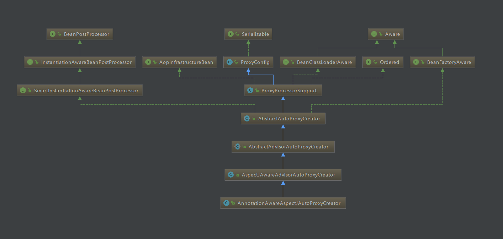
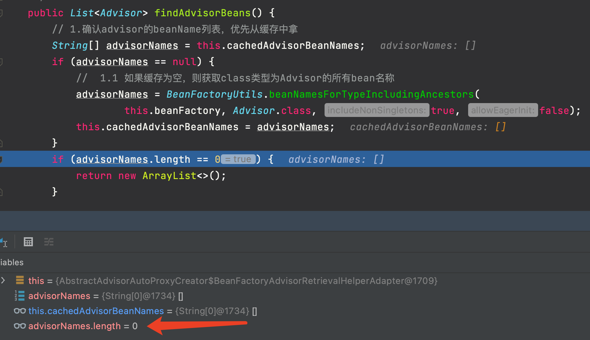
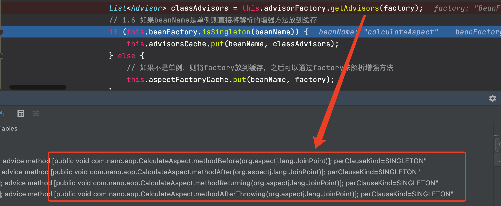
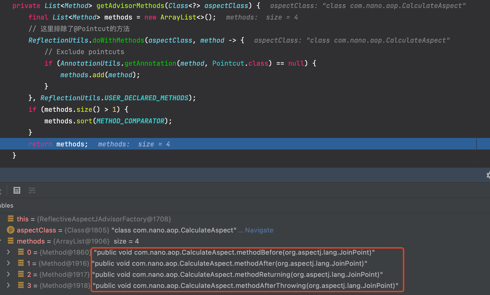
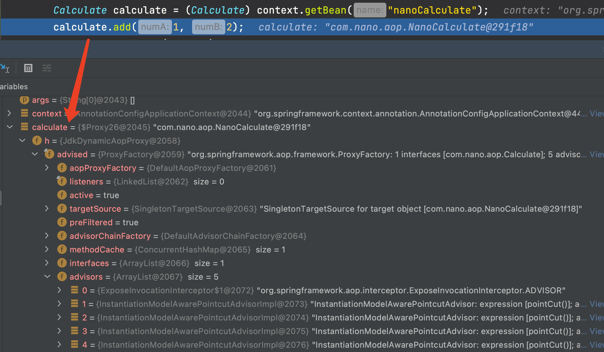
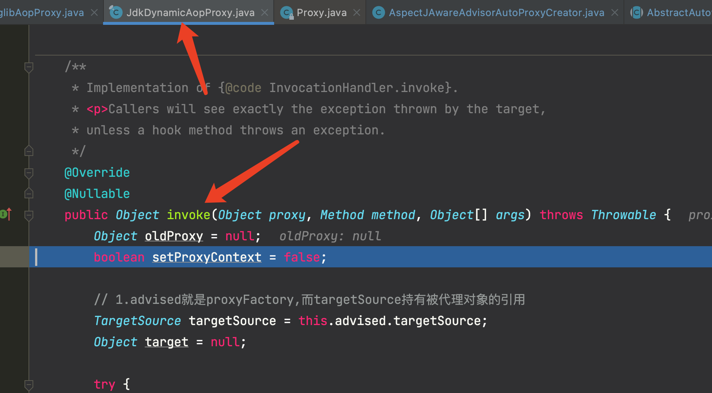
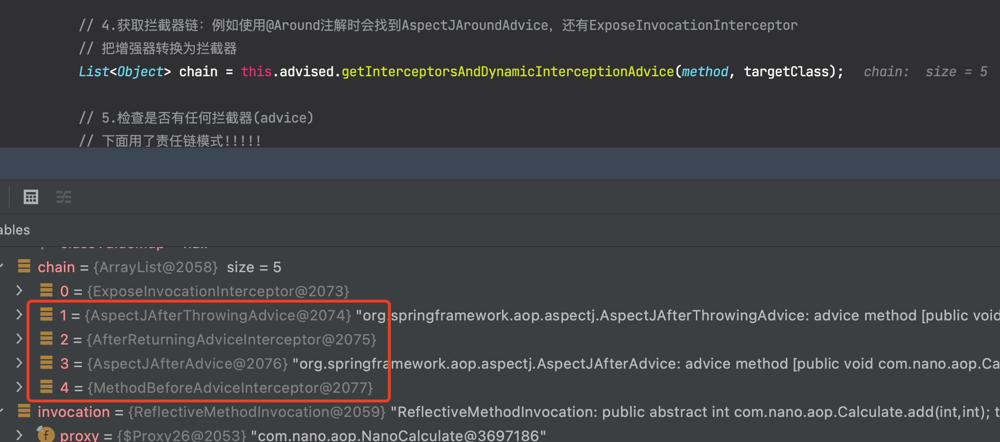
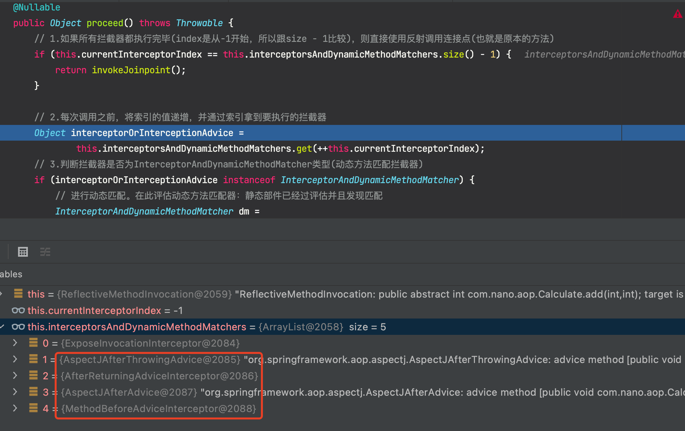

 

[TOC]

### Spring AOP源码分析

#### 实例引入

Spring2.0 以后新增了对第三方 AOP 技术 AspectJ 的支持。这里实例基于 AspectJ 的**注解方式**实现，后续 AOP 源码分析即使用了本实例。

定义计算接口：

```java
public interface Calculate {

    int add(int numA,int numB);

    int sub(int numA, int numB);

    int div(int numA,int numB);

    int multi(int numA,int numB);
}
```

定义实现类：

```java
public class NanoCalculate implements Calculate {

    @Override
    public int add(int numA, int numB) {
        System.out.println("执行目标方法[add].");
        return numA + numB;
    }

    @Override
    public int sub(int numA, int numB) {
        return numA - numB;
    }

    @Override
    public int div(int numA, int numB) {
        return numA / numB;
    }

    @Override
    public int multi(int numA, int numB) {
        System.out.println("执行目标方法[multi].");
        add(numA, numB);
        return numA * numB;
    }
}
```

定义切面类：

```java
@Component
@Aspect
public class CalculateAspect {

    @Pointcut("execution(* com.nano.aop.Calculate.*(..))")
    public void pointCut(){};

    @Before(value = "pointCut()")
    public void methodBefore(JoinPoint joinPoint){
        String methodName = joinPoint.getSignature().getName();
        System.out.println("执行目标方法【" + methodName + "】之前执行<前置通知>,入参" + Arrays.asList(joinPoint.getArgs()));
    }

    @After(value = "pointCut()")
    public void methodAfter(JoinPoint joinPoint) {
        String methodName = joinPoint.getSignature().getName();
        System.out.println("执行目标方法【" + methodName + "】之前执行<后置通知>,入参" + Arrays.asList(joinPoint.getArgs()));
    }

    @AfterReturning(value = "pointCut()")
    public void methodReturning(JoinPoint joinPoint ) {
        String methodName = joinPoint.getSignature().getName();
        System.out.println("执行目标方法【" + methodName + "】之前执行<返回通知>,入参" + Arrays.asList(joinPoint.getArgs()));
    }

    @AfterThrowing(value = "pointCut()")
    public void methodAfterThrowing(JoinPoint joinPoint) {
        String methodName = joinPoint.getSignature().getName();
        System.out.println("执行目标方法【" + methodName + "】之前执行<异常通知>,入参" + Arrays.asList(joinPoint.getArgs()));
    }

}
```

这里仅对 Calculate 接口的实现类进行了增强。

定义配置类。

```java
@Configuration
@EnableAspectJAutoProxy
public class NanoAopConfig {

    @Bean
    public NanoCalculate nanoCalculate() {
        return new NanoCalculate();
    }
    
}
```

这里注解 **@EnableAspectJAutoProxy** 开启了对 AOP 的支持。

测试类：

```java
public static void main(String[] args) {
    
    AnnotationConfigApplicationContext context = new AnnotationConfigApplicationContext(NanoConfig.class);
    
    Calculate calculate = (Calculate) context.getBean("nanoCalculate");
    System.out.println(calculate.add(1, 2));
}
```

输出如下：

```java
执行目标方法【add】之前执行<前置通知>,入参[1, 2]
执行目标方法[add].
执行目标方法【add】之前执行<后置通知>,入参[1, 2]
执行目标方法【add】之前执行<返回通知>,入参[1, 2]
3
```

如果方法抛异常，那么输出如下：

```java
执行目标方法【add】之前执行<前置通知>,入参[1, 2]
执行目标方法[add].
执行目标方法【add】之前执行<后置通知>,入参[1, 2]
执行目标方法【add】之前执行<异常通知>,入参[1, 2]
```

> **延伸**

注意看实现类的 乘法 实现：

```java
@Override
public int multi(int numA, int numB) {
    add(numA, numB);
    return numA * numB;
}
```

这里在 方法里面**还调用了一次 add()** 方法。

这时候执行一次 multi() 方法结果如下。

```java
执行目标方法【multi】之前执行<前置通知>,入参[1, 2]
执行目标方法[multi].
执行目标方法[add].
执行目标方法【multi】之前执行<后置通知>,入参[1, 2]
执行目标方法【multi】之前执行<返回通知>,入参[1, 2]
2
```

可以看到里面的 add 方法**并没有被增强**。因为这里的 add 方法是 this.add()，**因此调用的是没有被代理的对象的原始方法**。

如果想 add 方法也被代理，可以修改一下写法。这个写法就是**获取当前的代理对象**进行方法调用。

```java
@Override
public int multi(int numA, int numB) {
    System.out.println("执行目标方法[multi].");
    //add(numA, numB);
    ((Calculate) AopContext.currentProxy()).add(numA, numB);
    return numA * numB;
}
```

**同时必须设置暴露缓存**。

```java
@EnableAspectJAutoProxy(exposeProxy = true)
```

此时再次执行一下得到下面的结果，add 方法也被增强了。

```java
执行目标方法【multi】之前执行<前置通知>,入参[1, 2]
执行目标方法[multi].
执行目标方法【add】之前执行<前置通知>,入参[1, 2]
执行目标方法[add].
执行目标方法【add】之前执行<后置通知>,入参[1, 2]
执行目标方法【add】之前执行<返回通知>,入参[1, 2]
执行目标方法【multi】之前执行<后置通知>,入参[1, 2]
执行目标方法【multi】之前执行<返回通知>,入参[1, 2]
2
```

#### @EnableAspectJAutoProxy

当需要开启 AOP 功能时，需要在**配置类**上标注 **@EnableAspectJAutoProxy** 注解。

```java
@Configuration
@EnableAspectJAutoProxy
public class NanoAopConfig {

}
```

看看这个注解：

```java
@Target(ElementType.TYPE)
@Retention(RetentionPolicy.RUNTIME)
@Documented
@Import(AspectJAutoProxyRegistrar.class)
public @interface EnableAspectJAutoProxy {

	boolean proxyTargetClass() default false;

	boolean exposeProxy() default false;

}
```

注意看这里 **@Import(AspectJAutoProxyRegistrar.class)**，**@Import 注解**可以给容器中**添加组件**，进入 **AspectJAutoProxyRegistrar** 类看看。

```java
class AspectJAutoProxyRegistrar implements ImportBeanDefinitionRegistrar {

	/**
	 * Register, escalate, and configure the AspectJ auto proxy creator based on the value
	 * of the @{@link EnableAspectJAutoProxy#proxyTargetClass()} attribute on the importing
	 * {@code @Configuration} class.
	 */
	@Override
	public void registerBeanDefinitions(
			AnnotationMetadata importingClassMetadata, BeanDefinitionRegistry registry) {

		// 真正干活的
		AopConfigUtils.registerAspectJAnnotationAutoProxyCreatorIfNecessary(registry);

		AnnotationAttributes enableAspectJAutoProxy =
				AnnotationConfigUtils.attributesFor(importingClassMetadata, EnableAspectJAutoProxy.class);
		if (enableAspectJAutoProxy != null) {
			if (enableAspectJAutoProxy.getBoolean("proxyTargetClass")) {
				AopConfigUtils.forceAutoProxyCreatorToUseClassProxying(registry);
			}
			if (enableAspectJAutoProxy.getBoolean("exposeProxy")) {
				AopConfigUtils.forceAutoProxyCreatorToExposeProxy(registry);
			}
		}
	}

}
```

这个类**实现了 ImportBeanDefinitionRegistrar 接口**，该接口可以往容器中**添加 beanDefinition **信息。

进去看看。

> **AopConfigUtils.registerAspectJAnnotationAutoProxyCreatorIfNecessary()**

```java
@Nullable
public static BeanDefinition registerAspectJAnnotationAutoProxyCreatorIfNecessary(BeanDefinitionRegistry registry) {
    return registerAspectJAnnotationAutoProxyCreatorIfNecessary(registry, null);
}
```

> **AopConfigUtils.registerAspectJAnnotationAutoProxyCreatorIfNecessary()**

```java
@Nullable
public static BeanDefinition registerAspectJAnnotationAutoProxyCreatorIfNecessary(
    BeanDefinitionRegistry registry, @Nullable Object source) {

    // 进去
    return registerOrEscalateApcAsRequired(AnnotationAwareAspectJAutoProxyCreator.class, registry, source);
}
```

到这里可以看到 @EnableAspectJAutoProxy 注解往容器中注册了一个名称叫 **org.springframework.aop.config.internalAutoProxyCreator**，类型为 **AnnotationAwareAspectJAutoProxyCreator** 的 Aspectj 自动代理创建器。 

这里看看 AnnotationAwareAspectJAutoProxyCreator 类的继承关系图。



可以发现这个类实现了很多接口：

- 实现了 **Aware** 接口(BeanFactoryAware)
- 实现了 **BeanPostProcessor** 接口(后置处理器)
- 实现了 **InstantiationAwareBeanPostProcessor** 接口(后置处理器的一种，在实例化之前进行调用)

整体关系如下图所示：


##### 1.实现BeanFactoryAware接口

AbstractAutoProxyCreator 实现了 **BeanFactoryAware** 接口。

AnnotationAwareAspectJAutoProxyCreator 实现了 BeanFactoryAware 做了二个事情：

- 把 Beanfactory 保存到 AnnotationAwareAspectJAutoProxyCreator 组件上。
- 为 AnnotationAwareAspectJAutoProxyCreator 的 aspectJAdvisorsBuilder aspect 增强器构建器赋值。

但是 AbstractAutoProxyCreator 的 setBeanFactory() 方法啥都没有做，实际干活的是覆写了此方法的子类 **AbstractAdvisorAutoProxyCreator** 中的 setBeanFactory() 方法。

> **AbstractAdvisorAutoProxyCreator::setBeanFactory()**

```java
@Override
public void setBeanFactory(BeanFactory beanFactory) {
    // 1.调用父类AbstractAutoProxyCreator.setBeanFactory()方法
    super.setBeanFactory(beanFactory);
    if (!(beanFactory instanceof ConfigurableListableBeanFactory)) {
        throw new IllegalArgumentException(
            "AdvisorAutoProxyCreator requires a ConfigurableListableBeanFactory: " + beanFactory);
    }
    // 2.初始化bean工厂
    initBeanFactory((ConfigurableListableBeanFactory) beanFactory);
}

protected void initBeanFactory(ConfigurableListableBeanFactory beanFactory) {
    this.advisorRetrievalHelper = new BeanFactoryAdvisorRetrievalHelperAdapter(beanFactory);
}
```

注释 1 处调用父类的 super.setBeanFactory(beanFactory);

注释 2 处调用本来的 initBeanFactory() 来**初始化 bean 工厂**。但是本类中的 initBeanFactory() 方法也被子类覆写了。这里看 **AnnotationAwareAspectJAutoProxyCreator** 类中的 **initBeanFactory**() 方法。

> **AnnotationAwareAspectJAutoProxyCreator::initBeanFactory()**

```java
// 创建一个AOP的增强器通过@Apsectj注解的方式
@Override
protected void initBeanFactory(ConfigurableListableBeanFactory beanFactory) {
    // 调用父类方法
    super.initBeanFactory(beanFactory);
    // 若Aspectj的增强器工厂对象为空,就创建一个ReflectiveAspectJAdvisorFactory
    if (this.aspectJAdvisorFactory == null) {
        this.aspectJAdvisorFactory = new ReflectiveAspectJAdvisorFactory(beanFactory);
    }
    // 把aspectJAdvisorFactory包装为BeanFactoryAspectJAdvisorsBuilderAdapter
    this.aspectJAdvisorsBuilder =
        new BeanFactoryAspectJAdvisorsBuilderAdapter(beanFactory, this.aspectJAdvisorFactory);
}
```

##### 2.实现BeanPostProcessor接口

AnnotationAwareAspectJAutoProxyCreator 实现了 **BeanPostProcessor** 接口，通过该接口可以对 bean 进行更多的增强操作。这里是其父类 AbstractAutoProxyCreator 实现这个接口的两个方法。

> **AnnotationAwareAspectJAutoProxyCreator::postProcessBeforeInitialization()**

```java
public Object postProcessBeforeInitialization(Object bean, String beanName) {
    return bean;
}
```

postProcessBeforeInitialization() 方法在执行 bean 的初始化方法之前调用，但是这里**没有进行任何操作**。

> **AnnotationAwareAspectJAutoProxyCreator::postProcessAfterInitialization()**

```java
@Override
public Object postProcessAfterInitialization(@Nullable Object bean, String beanName) throws BeansException {
    if (bean != null) {
        Object cacheKey = getCacheKey(bean.getClass(), beanName);
        // 1.判断当前bean是否需要被代理，真正的创建代理对象逻辑
        if (this.earlyProxyReferences.remove(cacheKey) != bean) {
            return wrapIfNecessary(bean, beanName, cacheKey);
        }
    }
    return bean;
}
```

postProcessAfterInitialization() 方法在执行 bean 的**初始化方法之后**调用，**创建代理对象的逻辑**就在这里!!!在这里是**非常核心**的方法！！！！！后面单独分析。

##### 3.实现InstantiationAwareBeanPostProcessor接口

AnnotationAwareAspectJAutoProxyCreator 实现了 **InstantiationAwareBeanPostProcessor** 接口，这是后置处理器的一种,在**实例化之前**进行调用。

其父类 AbstractAutoProxyCreator 类实现了 SmartInstantiationAwareBeanPostProcessor 接口(继承了 InstantiationAwareBeanPostProcessor 接口)，这里分析 SmartInstantiationAwareBeanPostProcessor 接口的两个方法的实现。

> **AbstractAutoProxyCreator::postProcessBeforeInstantiation()**

```java
@Override
public Object postProcessBeforeInstantiation(Class<?> beanClass, String beanName) throws BeansException {
    Object cacheKey = getCacheKey(beanClass, beanName);

    // 1.判断TargetSource缓存中是否包含当前bean，如果不包含，则判断当前bean是否是已经被代理的bean，
    // 如果代理过，则不对当前传入的bean进行处理，如果没代理过，则判断当前bean是否为系统bean，或者是
    // 切面逻辑不会包含的bean，如果是，则将当前bean缓存到advisedBeans中，否则继续往下执行。
    // 经过这一步的处理之后，只有在TargetSource中没有进行缓存，并且应该被切面逻辑环绕，但是目前还未
    // 生成代理对象的bean才会通过此方法
    if (!StringUtils.hasLength(beanName) || !this.targetSourcedBeans.contains(beanName)) {
        if (this.advisedBeans.containsKey(cacheKey)) {
            return null;
        }
        // 2.(判断是不是基础bean || 是否应该跳过)  shouldSkip直接返回false
        // shouldSkip()方法看子类AspectJAwareAdvisorAutoProxyCreator的实现
        if (isInfrastructureClass(beanClass) || shouldSkip(beanClass, beanName)) {
            // 2.1 把cacheKey存放在advisedBeans中
            this.advisedBeans.put(cacheKey, Boolean.FALSE);
            return null;
        }
    }

    // 3.获取封装当前bean的TargetSource对象，如果不存在，则直接退出当前方法，否则从TargetSource
    // 中获取当前bean对象，并且判断是否需要将切面逻辑应用在当前bean上
    TargetSource targetSource = getCustomTargetSource(beanClass, beanName);
    if (targetSource != null) {
        if (StringUtils.hasLength(beanName)) {
            this.targetSourcedBeans.add(beanName);
        }
        // 3.1 获取能够应用当前bean的切面逻辑
        Object[] specificInterceptors = getAdvicesAndAdvisorsForBean(beanClass, beanName, targetSource);
        // 3.2 根据切面逻辑为当前bean生成代理对象
        Object proxy = createProxy(beanClass, beanName, specificInterceptors, targetSource);
        this.proxyTypes.put(cacheKey, proxy.getClass());
        return proxy;
    }

    return null;
}
```

这个方法放到后面单独分析。

> **AbstractAutoProxyCreator::postProcessAfterInstantiation()**

```java
@Override
public boolean postProcessAfterInstantiation(Object bean, String beanName) {
    return true;
}
```

这个方法也啥都没干。

#### resolveBeforeInstantiation()

回顾之前**创建 bean 的流程**中，createBean() 方法中有一步为：

```java
// 3.(AOP相关)实例化前的处理，给InstantiationAwareBeanPostProcessor
// 一个机会返回代理对象来替代真正的bean实例，达到“短路”效果
Object bean = resolveBeforeInstantiation(beanName, mbdToUse);
```

进去看看这个方法。

```java
@Nullable
protected Object resolveBeforeInstantiation(String beanName, RootBeanDefinition mbd) {
    Object bean = null;
    // 如果尚未被解析
    if (!Boolean.FALSE.equals(mbd.beforeInstantiationResolved)) {
        // 1.mbd不是合成的，并且BeanFactory中存在InstantiationAwareBeanPostProcessor
        if (!mbd.isSynthetic() && hasInstantiationAwareBeanPostProcessors()) {
            // 2.解析beanName对应的Bean实例的类型
            Class<?> targetType = determineTargetType(beanName, mbd);
            if (targetType != null) {

                // 3.实例化前调用InstantiationAwareBeanPostProcessor接口的postProcessBeforeInstantiation()方法
                bean = applyBeanPostProcessorsBeforeInstantiation(targetType, beanName);
                if (bean != null) {
                    // 4.如果返回的bean不为空，会跳过Spring默认的实例化过程，
                    // 所以只能在这里调用BeanPostProcessor实现类的postProcessAfterInitialization()方法
                    // 但是这里基本不会调用!!!!!
                    bean = applyBeanPostProcessorsAfterInitialization(bean, beanName);
                }
            }
        }

        // 5.如果bean不为空，则将beforeInstantiationResolved赋值为true，代表在实例化之前已经解析
        mbd.beforeInstantiationResolved = (bean != null);
    }
    return bean;
}
```

前面分析得知，如果使用了 @EnableAspectJAutoProxy 注解开启了 AOP 功能，那么会给容器内注入 **AnnotationAwareAspectJAutoProxyCreator** 这个组件，而 AnnotationAwareAspectJAutoProxyCreator 实现了 **InstantiationAwareBeanPostProcessor** 接口。因此上述**注释 1 处**的条件满足。

##### 1.postProcessBeforeInstantiation()

注释 3 处，在**实例化**前调用 InstantiationAwareBeanPostProcessor 接口的 **postProcessBeforeInstantiation**() 方法。

```java
@Nullable
protected Object applyBeanPostProcessorsBeforeInstantiation(Class<?> beanClass, String beanName) {

    // 1.遍历当前BeanFactory中的BeanPostProcessor
    for (BeanPostProcessor bp : getBeanPostProcessors()) {
        // 2.应用InstantiationAwareBeanPostProcessor后置处理器，允许postProcessBeforeInstantiation方法返回bean对象的代理
        if (bp instanceof InstantiationAwareBeanPostProcessor) {
            InstantiationAwareBeanPostProcessor ibp = (InstantiationAwareBeanPostProcessor) bp;
            // 3.执行postProcessBeforeInstantiation方法，在Bean实例化前操作，
            // 该方法可以返回一个构造完成的Bean实例，从而不会继续执行创建Bean实例的“正规的流程”，达到“短路”的效果。
            Object result = ibp.postProcessBeforeInstantiation(beanClass, beanName);
            if (result != null) {
                // 4.如果result不为空，也就是有后置处理器返回了bean实例对象，则会跳过Spring默认的实例化过程
                return result;
            }
        }
    }
    return null;
}
```

### postProcessBeforeInstantiation()寻找增强器

先看第一个方法，在实例化之前调用，主要用于**寻找与实例化增强器(事务相关的增强器和自定义的增强器)**！！

方法流程总结如下：编辑连接：https://www.processon.com/diagraming/61fa897c0e3e7407d4bf31c0


**InstantiationAwareBeanPostProcessor** 接口的实现类为 AbstractAutoProxyCreator，看看它的实现。

> **AbstractAutoProxyCreator::postProcessBeforeInstantiation()**

```java
@Override
public Object postProcessBeforeInstantiation(Class<?> beanClass, String beanName) throws BeansException {
    Object cacheKey = getCacheKey(beanClass, beanName);

    // 1.判断TargetSource缓存中是否包含当前bean，如果不包含，则判断当前bean是否是已经被代理的bean，
    // 如果代理过，则不对当前传入的bean进行处理，如果没代理过，则判断当前bean是否为系统bean，或者是
    // 切面逻辑不会包含的bean，如果是，则将当前bean缓存到advisedBeans中，否则继续往下执行。
    // 经过这一步的处理之后，只有在TargetSource中没有进行缓存，并且应该被切面逻辑环绕，但是目前还未
    // 生成代理对象的bean才会通过此方法
    if (!StringUtils.hasLength(beanName) || !this.targetSourcedBeans.contains(beanName)) {
        if (this.advisedBeans.containsKey(cacheKey)) {
            return null;
        }
        // 2.(判断是不是基础bean || 是否应该跳过)  shouldSkip直接返回false
        // shouldSkip()方法看子类AspectJAwareAdvisorAutoProxyCreator的实现
        if (isInfrastructureClass(beanClass) || shouldSkip(beanClass, beanName)) {
            // 2.1 把cacheKey存放在advisedBeans中
            this.advisedBeans.put(cacheKey, Boolean.FALSE);
            return null;
        }
    }

    // 3.获取封装当前bean的TargetSource对象，如果不存在，则直接退出当前方法，否则从TargetSource
    // 中获取当前bean对象，并且判断是否需要将切面逻辑应用在当前bean上
    TargetSource targetSource = getCustomTargetSource(beanClass, beanName);
    if (targetSource != null) {
        if (StringUtils.hasLength(beanName)) {
            this.targetSourcedBeans.add(beanName);
        }
        // 3.1 获取能够应用当前bean的切面逻辑
        Object[] specificInterceptors = getAdvicesAndAdvisorsForBean(beanClass, beanName, targetSource);
        // 3.2 根据切面逻辑为当前bean生成代理对象
        Object proxy = createProxy(beanClass, beanName, specificInterceptors, targetSource);
        this.proxyTypes.put(cacheKey, proxy.getClass());
        return proxy;
    }

    return null;
}
```

#### isInfrastructureClass()

上面注释 2 处 isInfrastructureClass() 方法用于判断是不是基础 bean。源码如下。

> **AbstractAutoProxyCreator::isInfrastructureClass()**

```java
protected boolean isInfrastructureClass(Class<?> beanClass) {
    boolean retVal = Advice.class.isAssignableFrom(beanClass) ||
        Pointcut.class.isAssignableFrom(beanClass) ||
            Advisor.class.isAssignableFrom(beanClass) ||
                AopInfrastructureBean.class.isAssignableFrom(beanClass);
    if (retVal && logger.isTraceEnabled()) {
        logger.trace("Did not attempt to auto-proxy infrastructure class [" + beanClass.getName() + "]");
    }
    return retVal;
}
```

#### shouldSkip()

注释 2 处 shouldSkip() 用于判断是否需要跳过。这个方法被 AspectJAwareAdvisorAutoProxyCreator 类覆写了。看看源码。

> **AspectJAwareAdvisorAutoProxyCreator::shouldSkip()**

```java
@Override
protected boolean shouldSkip(Class<?> beanClass, String beanName) {
    // 1.调用父类的寻找全部增强器的方法
    List<Advisor> candidateAdvisors = findCandidateAdvisors();
    for (Advisor advisor : candidateAdvisors) {
        // 2.仅AspectJPointcutAdvisor类型的增强器返回false
        if (advisor instanceof AspectJPointcutAdvisor &&
            ((AspectJPointcutAdvisor) advisor).getAspectName().equals(beanName)) {
            return true;
        }
    }
    // 3.没找到或者不满足条件的直接调用父类的shouldSkip()返回false
    return super.shouldSkip(beanClass, beanName);
}
```

这里注释 1 处调用了父类的 findCandidateAdvisors() 方法来寻找增强器。进去看看，这个方法比较重要。**这个方法在 bean 实例化之前就调用了一次，找到且生成了事务相关的增强器和自己定义的增强器，并且放到了缓存中。后面还有地方调用这个方法，就是直接从缓存拿了**。

> **AbstractAdvisorAutoProxyCreator::findCandidateAdvisors()**

```java
@Override
protected List<Advisor> findCandidateAdvisors() {
    // 1.添加根据父类规则找到的所有advisor(主要是找事务的增强器切面)
    List<Advisor> advisors = super.findCandidateAdvisors();
    // 2.为bean工厂中的所有AspectJ方面构建advisor
    if (this.aspectJAdvisorsBuilder != null) {
        advisors.addAll(this.aspectJAdvisorsBuilder.buildAspectJAdvisors());
    }
    return advisors;
}
```

##### 1.findCandidateAdvisors()

这里注释 1 又调用了父类的 findCandidateAdvisors()。这里主要用于**寻找事务相关的增强器**。

> **AbstractAdvisorAutoProxyCreator::findCandidateAdvisors()**

```java
protected List<Advisor> findCandidateAdvisors() {
    Assert.state(this.advisorRetrievalHelper != null, "No BeanFactoryAdvisorRetrievalHelper available");
    // 通过增强查找工具类查找所有增强
    // 这里主要用于寻找事务切面！！
    return this.advisorRetrievalHelper.findAdvisorBeans();
}
```

> **BeanFactoryAdvisorRetrievalHelper::findAdvisorBeans()**

```java
public List<Advisor> findAdvisorBeans() {
    // 1.确认advisor的beanName列表，优先从缓存中拿
    String[] advisorNames = this.cachedAdvisorBeanNames;
    if (advisorNames == null) {
        //  1.1 如果缓存为空，则获取class类型为Advisor的所有bean名称
        advisorNames = BeanFactoryUtils.beanNamesForTypeIncludingAncestors(
            this.beanFactory, Advisor.class, true, false);
        this.cachedAdvisorBeanNames = advisorNames;
    }
    if (advisorNames.length == 0) {
        return new ArrayList<>();
    }

    // 2.遍历处理advisorNames
    // 如果配置了事务，这里advisorNames就不为空
    List<Advisor> advisors = new ArrayList<>();
    for (String name : advisorNames) {
        if (isEligibleBean(name)) {
            // 2.1 跳过当前正在创建的advisor
            if (this.beanFactory.isCurrentlyInCreation(name)) {
                if (logger.isDebugEnabled()) {
                    logger.debug("Skipping currently created advisor '" + name + "'");
                }
            }
            else {
                try {
                    // 2.2 通过beanName获取对应的bean对象，并添加到advisors
                    advisors.add(this.beanFactory.getBean(name, Advisor.class));

                } catch (BeanCreationException ex) {
                    Throwable rootCause = ex.getMostSpecificCause();
                    if (rootCause instanceof BeanCurrentlyInCreationException) {
                        BeanCreationException bce = (BeanCreationException) rootCause;
                        String bceBeanName = bce.getBeanName();
                        if (bceBeanName != null && this.beanFactory.isCurrentlyInCreation(bceBeanName)) {
                            if (logger.isDebugEnabled()) {
                                logger.debug("Skipping advisor '" + name +
                                             "' with dependency on currently created bean: " + ex.getMessage());
                            }
                            // Ignore: indicates a reference back to the bean we're trying to advise.
                            // We want to find advisors other than the currently created bean itself.
                            continue;
                        }
                    }
                    throw ex;
                }
            }
        }
    }
    // 3.返回符合条件的advisor列表
    return advisors;
}
```

由于这个方法主要用于**寻找事务相关的增强器**！这里是找不到的，等下一节**开启了事务**之后，开启事务的注解 **@EnableTransactionManagement** 会往容器中配置导入一个 **BeanFactoryTransactionAttributeSourceAdvisor** 增强器。

这里普通的增强器找不到，所以直接就返回了，最后直接调用父类的 shouldSkip() 返回 false。这里先不分析了。



##### 2.buildAspectJAdvisors()

这里就**寻找自定义的 AspectJ** 的增强器。

进去看看源码。

> **BeanFactoryAspectJAdvisorsBuilder::buildAspectJAdvisors()**

```java
public List<Advisor> buildAspectJAdvisors() {
    List<String> aspectNames = this.aspectBeanNames;

    // 1.如果aspectNames为null，表示没有解析过，需要进行解析
    if (aspectNames == null) {
        synchronized (this) {
            aspectNames = this.aspectBeanNames;
            if (aspectNames == null) {
                // 初始化增强器列表
                List<Advisor> advisors = new ArrayList<>();
                aspectNames = new ArrayList<>();
                // 1.1 获取容器中所有的beanName
                String[] beanNames = BeanFactoryUtils.beanNamesForTypeIncludingAncestors(
                    this.beanFactory, Object.class, true, false);
                // 1.2 循环遍历所有的beanName，找出对应的增强方法
                for (String beanName : beanNames) {
                    // 1.3 不合法的beanName则跳过，默认返回true，子类可以覆盖实现，AnnotationAwareAspectJAutoProxyCreator
                    if (!isEligibleBean(beanName)) {
                        continue;
                    }

                    // 获取beanName对应bean的类型
                    Class<?> beanType = this.beanFactory.getType(beanName);
                    if (beanType == null) {
                        continue;
                    }

                    // 1.4 如果bean存在@Aspect注解(也就是切面类)则进行处理
                    if (this.advisorFactory.isAspect(beanType)) {
                        // 将存在Aspect注解的beanName添加到aspectNames列表
                        aspectNames.add(beanName);
                        // 新建切面元数据
                        AspectMetadata amd = new AspectMetadata(beanType, beanName);
                        // 获取per-clause的类型是SINGLETON
                        if (amd.getAjType().getPerClause().getKind() == PerClauseKind.SINGLETON) {
                            // 使用BeanFactory和beanName创建一个BeanFactoryAspectInstanceFactory，主要用来创建切面对象实例
                            MetadataAwareAspectInstanceFactory factory =
                                new BeanFactoryAspectInstanceFactory(this.beanFactory, beanName);

                            // 1.5 解析标记AspectJ注解中的增强方法！！！
                            List<Advisor> classAdvisors = this.advisorFactory.getAdvisors(factory);
                            // 1.6 如果beanName是单例则直接将解析的增强方法放到缓存中
                            if (this.beanFactory.isSingleton(beanName)) {
                                this.advisorsCache.put(beanName, classAdvisors);
                            } else {
                                // 如果不是单例，则将factory放到缓存，之后可以通过factory来解析增强方法
                                this.aspectFactoryCache.put(beanName, factory);
                            }
                            // 1.7 将解析的增强器添加到advisors
                            advisors.addAll(classAdvisors);

                        } else {
                            // 如果per-clause的类型不是SINGLETON
                            if (this.beanFactory.isSingleton(beanName)) {
                                // 名称为beanName的Bean是单例但切面实例化模型不是单例，则抛异常
                                throw new IllegalArgumentException("Bean with name '" + beanName +
                                                                   "' is a singleton, but aspect instantiation model is not singleton");
                            }
                            MetadataAwareAspectInstanceFactory factory =
                                new PrototypeAspectInstanceFactory(this.beanFactory, beanName);
                            // 将factory放到缓存，之后可以通过factory来解析增强方法
                            this.aspectFactoryCache.put(beanName, factory);
                            // 解析标记AspectJ注解中的增强方法，并添加到advisors中
                            advisors.addAll(this.advisorFactory.getAdvisors(factory));
                        }
                    }
                }
                // 1.9 将解析出来的切面beanName放到缓存aspectBeanNames
                this.aspectBeanNames = aspectNames;
                // 1.10 最后返回解析出来的增强器
                return advisors;
            }
        }
    }

    // 2.如果aspectNames不为null，则代表已经解析过了，则无需再次解析
    // 2.1 如果aspectNames是空列表，则返回一个空列表。空列表也是解析过的，只要不是null都是解析过的
    if (aspectNames.isEmpty()) {
        return Collections.emptyList();
    }
    // 2.2 aspectNames不是空列表，则遍历处理
    List<Advisor> advisors = new ArrayList<>();
    for (String aspectName : aspectNames) {
        // 根据aspectName从缓存中获取增强器
        List<Advisor> cachedAdvisors = this.advisorsCache.get(aspectName);
        if (cachedAdvisors != null) {
            // 根据上面的解析，可以知道advisorsCache存的是已经解析好的增强器，直接添加到结果即可
            advisors.addAll(cachedAdvisors);
        } else {
            // 如果不存在于advisorsCache缓存，则代表存在于aspectFactoryCache中，
            // 从aspectFactoryCache中拿到缓存的factory，然后解析出增强器，添加到结果中
            MetadataAwareAspectInstanceFactory factory = this.aspectFactoryCache.get(aspectName);
            advisors.addAll(this.advisorFactory.getAdvisors(factory));
        }
    }
    // 返回增强器
    return advisors;
}
```

这里首先看 aspectNames 是否为 null，如果为 null 需要则进行解析。解析的时候会获取容器中所有的 **beanName**，然后遍历每个 beanName，获取其类型后判断其是否是**切面类(标注了 @Aspect 注解)**。如果是切面类则通过注释 1.5 的 getAdvisors() 方法对切面类进行解析，获取**增强器**。获取到的增强器被**缓存到 advisorsCache 这个 map 中**，等待后面**创建代理对象时**使用。

这里 getAdvisors() 方法执行完成后，得到的 classAdvisors 如下：



下面重点看看 getAdvisors() 方法是如何获取增强器的。

###### (1)getAdvisors()

这里首先将切面类封装成 MetadataAwareAspectInstanceFactory，然后它会携带切面类的信息到 getAdvisors() 方法中，看看源码。

> **ReflectiveAspectJAdvisorFactory::getAdvisors()**

```java
@Override
public List<Advisor> getAdvisors(MetadataAwareAspectInstanceFactory aspectInstanceFactory) {
    // 1.上一步将beanClass和beanName封装成了aspectInstanceFactory的AspectMetadata属性，
    // 这边可以通过AspectMetadata属性重新获取到当前处理的切面类
    Class<?> aspectClass = aspectInstanceFactory.getAspectMetadata().getAspectClass();
    // 2.获取当前处理的切面类的名字
    String aspectName = aspectInstanceFactory.getAspectMetadata().getAspectName();
    // 3.校验切面类
    validate(aspectClass);

    // 4.使用装饰器包装MetadataAwareAspectInstanceFactory，以便它只实例化一次。
    MetadataAwareAspectInstanceFactory lazySingletonAspectInstanceFactory =
        new LazySingletonAspectInstanceFactoryDecorator(aspectInstanceFactory);

    List<Advisor> advisors = new ArrayList<>();
    // 5.获取切面类中的方法(也就是用来进行逻辑增强的方法，被@Around、@After等注解修饰的方法，
    // 这里使用@Pointcut的方法不处理) !!!
    for (Method method : getAdvisorMethods(aspectClass)) {
        // 6.处理method，获取增强器
        Advisor advisor = getAdvisor(method, lazySingletonAspectInstanceFactory, advisors.size(), aspectName);
        if (advisor != null) {
            // 7.如果增强器不为空，则添加到advisors
            advisors.add(advisor);
        }
    }

    // 8.如果寻找的增强器不为空且又配置了增强延迟初始化，那么需要在首位加入同步实例化增强器(用以保证增强使用之前的实例化)
    if (!advisors.isEmpty() && lazySingletonAspectInstanceFactory.getAspectMetadata().isLazilyInstantiated()) {
        Advisor instantiationAdvisor = new SyntheticInstantiationAdvisor(lazySingletonAspectInstanceFactory);
        advisors.add(0, instantiationAdvisor);
    }

    // 9.获取DeclareParents注解
    // Find introduction fields.
    for (Field field : aspectClass.getDeclaredFields()) {
        Advisor advisor = getDeclareParentsAdvisor(field);
        if (advisor != null) {
            advisors.add(advisor);
        }
    }

    return advisors;
}
```

这里重点在注释 5 处，调用了 getAdvisorMethods() 方法获取了切面类中全部的**增强方法。**

> **ReflectiveAspectJAdvisorFactory::getAdvisorMethods()**

```java
private List<Method> getAdvisorMethods(Class<?> aspectClass) {
    final List<Method> methods = new ArrayList<>();
    // 这里排除了@Pointcut的方法
    ReflectionUtils.doWithMethods(aspectClass, method -> {
        // Exclude pointcuts
        if (AnnotationUtils.getAnnotation(method, Pointcut.class) == null) {
            methods.add(method);
        }
    }, ReflectionUtils.USER_DECLARED_METHODS);
    if (methods.size() > 1) {
        methods.sort(METHOD_COMPARATOR);
    }
    return methods;
}
```

这里 debug 的结果如下，可以看到获取到了 **CalculateAspect** 中自定义的四个增强方法(参考 CalculateAspect 类)。



接着调用注释 6 处的 getAdvisor() 方法获取具体的增强器。

看看这个方法。

> **ReflectiveAspectJAdvisorFactory::getAdvisor()**

```java
@Override
@Nullable
public Advisor getAdvisor(Method candidateAdviceMethod, MetadataAwareAspectInstanceFactory aspectInstanceFactory,
                          int declarationOrderInAspect, String aspectName) {

    // 1.校验切面类
    validate(aspectInstanceFactory.getAspectMetadata().getAspectClass());

    // 2.AspectJ切点信息的获取，就是指定注解的表达式信息的获取
    // 如：@Around("execution(* com.nano.aop.*.*(..))")
    AspectJExpressionPointcut expressionPointcut = getPointcut(
        candidateAdviceMethod, aspectInstanceFactory.getAspectMetadata().getAspectClass());
    // 3.如果expressionPointcut为null，则直接返回null
    if (expressionPointcut == null) {
        return null;
    }

    // 4.根据切点信息生成增强器
    return new InstantiationModelAwarePointcutAdvisorImpl(expressionPointcut, candidateAdviceMethod,
                                                          this, aspectInstanceFactory, declarationOrderInAspect, aspectName);
}
```

这里注释 2 处首先**解析获取了切点的表达式信息**。然后在注释 4 处**根据表达式信息生成对应的增强器，这里是直接 new 的形式生成的**。看看这个构造方法。

> **InstantiationModelAwarePointcutAdvisorImpl构造方法**

```java
public InstantiationModelAwarePointcutAdvisorImpl(AspectJExpressionPointcut declaredPointcut,
                                                  Method aspectJAdviceMethod, AspectJAdvisorFactory aspectJAdvisorFactory,
                                                  MetadataAwareAspectInstanceFactory aspectInstanceFactory, int declarationOrder, String aspectName) {

    // 1.简单的将信息封装在类的实例中
    this.declaredPointcut = declaredPointcut;
    this.declaringClass = aspectJAdviceMethod.getDeclaringClass();
    this.methodName = aspectJAdviceMethod.getName();
    this.parameterTypes = aspectJAdviceMethod.getParameterTypes();
    // aspectJAdviceMethod保存的是用来进行逻辑增强的方法(@Around、@After等修饰的方法)
    this.aspectJAdviceMethod = aspectJAdviceMethod;
    this.aspectJAdvisorFactory = aspectJAdvisorFactory;
    this.aspectInstanceFactory = aspectInstanceFactory;
    this.declarationOrder = declarationOrder;
    this.aspectName = aspectName;

    // 2.是否需要延迟实例化
    if (aspectInstanceFactory.getAspectMetadata().isLazilyInstantiated()) {
        Pointcut preInstantiationPointcut = Pointcuts.union(
            aspectInstanceFactory.getAspectMetadata().getPerClausePointcut(), this.declaredPointcut);
        this.pointcut = new PerTargetInstantiationModelPointcut(
            this.declaredPointcut, preInstantiationPointcut, aspectInstanceFactory);
        this.lazy = true;
    }
    else {
        this.pointcut = this.declaredPointcut;
        this.lazy = false;
        // 3.实例化增强器：根据注解中的信息初始化对应的增强器!!!!!
        this.instantiatedAdvice = instantiateAdvice(this.declaredPointcut);
    }
}
```

这里最重要的在注释 3 处，根据注解中的信息初始化对应的增强器。

> **InstantiationModelAwarePointcutAdvisorImpl::instantiateAdvice()**

```java
private Advice instantiateAdvice(AspectJExpressionPointcut pointcut) {
    // 获取Advice
    Advice advice = this.aspectJAdvisorFactory.getAdvice(this.aspectJAdviceMethod, pointcut,
                                                         this.aspectInstanceFactory, this.declarationOrder, this.aspectName);
    return (advice != null ? advice : EMPTY_ADVICE);
}
```

继续看看。

> **ReflectiveAspectJAdvisorFactory::getAdvice()**

```java
@Override
@Nullable
public Advice getAdvice(Method candidateAdviceMethod, AspectJExpressionPointcut expressionPointcut,
                        MetadataAwareAspectInstanceFactory aspectInstanceFactory, int declarationOrder, String aspectName) {

    // 1.获取切面类
    Class<?> candidateAspectClass = aspectInstanceFactory.getAspectMetadata().getAspectClass();
    // 2.校验切面类(重复校验第3次...)
    validate(candidateAspectClass);

    // 3.查找并返回方法的第一个AspectJ注解
    AspectJAnnotation<?> aspectJAnnotation =
        AbstractAspectJAdvisorFactory.findAspectJAnnotationOnMethod(candidateAdviceMethod);
    if (aspectJAnnotation == null) {
        return null;
    }

    // 4.如果到这里说明有一个AspectJ方法。检查切面类是否使用了AspectJ注解
    if (!isAspect(candidateAspectClass)) {
        throw new AopConfigException("Advice must be declared inside an aspect type: " +
                                     "Offending method '" + candidateAdviceMethod + "' in class [" +
                                     candidateAspectClass.getName() + "]");
    }

    if (logger.isDebugEnabled()) {
        logger.debug("Found AspectJ method: " + candidateAdviceMethod);
    }

    // 返回的增强器
    AbstractAspectJAdvice springAdvice;

    // 5.根据方法使用的aspectJ注解创建对应的增强器!!!!!
    switch (aspectJAnnotation.getAnnotationType()) {
        case AtPointcut:  // 忽略
            if (logger.isDebugEnabled()) {
                logger.debug("Processing pointcut '" + candidateAdviceMethod.getName() + "'");
            }
            return null;
        case AtAround:
            springAdvice = new AspectJAroundAdvice(
                candidateAdviceMethod, expressionPointcut, aspectInstanceFactory);
            break;
        case AtBefore:
            springAdvice = new AspectJMethodBeforeAdvice(
                candidateAdviceMethod, expressionPointcut, aspectInstanceFactory);
            break;
        case AtAfter:
            springAdvice = new AspectJAfterAdvice(
                candidateAdviceMethod, expressionPointcut, aspectInstanceFactory);
            break;
        case AtAfterReturning:
            springAdvice = new AspectJAfterReturningAdvice(
                candidateAdviceMethod, expressionPointcut, aspectInstanceFactory);
            AfterReturning afterReturningAnnotation = (AfterReturning) aspectJAnnotation.getAnnotation();
            if (StringUtils.hasText(afterReturningAnnotation.returning())) {
                springAdvice.setReturningName(afterReturningAnnotation.returning());
            }
            break;
        case AtAfterThrowing:
            springAdvice = new AspectJAfterThrowingAdvice(
                candidateAdviceMethod, expressionPointcut, aspectInstanceFactory);
            AfterThrowing afterThrowingAnnotation = (AfterThrowing) aspectJAnnotation.getAnnotation();
            if (StringUtils.hasText(afterThrowingAnnotation.throwing())) {
                springAdvice.setThrowingName(afterThrowingAnnotation.throwing());
            }
            break;
        default:
            throw new UnsupportedOperationException(
                "Unsupported advice type on method: " + candidateAdviceMethod);
    }

    // 6.配置增强器，切面类的name，其实就是beanName
    springAdvice.setAspectName(aspectName);
    springAdvice.setDeclarationOrder(declarationOrder);
    // 获取增强方法的参数
    String[] argNames = this.parameterNameDiscoverer.getParameterNames(candidateAdviceMethod);
    // 如果参数不为空，则赋值给springAdvice
    if (argNames != null) {
        springAdvice.setArgumentNamesFromStringArray(argNames);
    }
    springAdvice.calculateArgumentBindings();

    // 最后返回增强器
    return springAdvice;
}
```

这里就是**根据增强器的类型，然后直接 new 出对应的增强器实例**。此时容器内就已经缓存了增强器的相关信息，下面就准备创建代理对象了。

### postProcessAfterInitialization()生成代理对象

上一步 postProcessBeforeInstantiation() 方法主要是找到了增强器，这里 **postProcessAfterInitialization() 就用于生成代理对象**。注意 resolveBeforeInstantiation() 这个方法并没有创建代理对象，因为此时都还没有 bean，**代理对象是在后面 bean 初始化完成后，调用 BeanPostProcessor 接口的 postProcessAfterInitialization() 方法时创建的**。由于 AnnotationAwareAspectJAutoProxyCreator 的父类 AbstractAutoProxyCreator 实现了 **BeanPostProcessor** 接口，因此各个 bean 初始化完成后会去下面的方法走一圈，如果有就生成代理对象。

整个流程如下图所示：编辑连接：https://www.processon.com/diagraming/61fc89341e08530f015ba3ee


看看源码。这里就是遍历容器中的 bean，看看其是否需要进行代理增强，不需要就返回，需要就为其生成代理对象。

> **AbstractAutoProxyCreator::postProcessAfterInitialization()**

```java
@Override
public Object postProcessAfterInitialization(@Nullable Object bean, String beanName) throws BeansException {
    if (bean != null) {
        Object cacheKey = getCacheKey(bean.getClass(), beanName);
        // 1.判断当前bean是否需要被代理，真正的创建代理对象逻辑
        if (this.earlyProxyReferences.remove(cacheKey) != bean) {
            return wrapIfNecessary(bean, beanName, cacheKey);
        }
    }
    return bean;
}
```

重点是 wrapIfNecessary() 方法。

> **AbstractAutoProxyCreator::wrapIfNecessary()**

```java
protected Object wrapIfNecessary(Object bean, String beanName, Object cacheKey) {
    // 1.判断当前bean是否在targetSourcedBeans缓存中存在(已经处理过)，如果存在则直接返回当前bean
    if (StringUtils.hasLength(beanName) && this.targetSourcedBeans.contains(beanName)) {
        return bean;
    }
    // 2.在advisedBeans缓存中存在，并且value为false则代表无需处理
    if (Boolean.FALSE.equals(this.advisedBeans.get(cacheKey))) {
        return bean;
    }
    // 3.(bean的类是AOP基础设施类 || bean应该跳过)，则标记为无需处理，并返回
    if (isInfrastructureClass(bean.getClass()) || shouldSkip(bean.getClass(), beanName)) {
        this.advisedBeans.put(cacheKey, Boolean.FALSE);
        return bean;
    }

    // 4.获取当前bean的Advices和Advisors
    Object[] specificInterceptors = getAdvicesAndAdvisorsForBean(bean.getClass(), beanName, null);
    // 5.如果存在增强器则创建代理！！！！
    if (specificInterceptors != DO_NOT_PROXY) {
        this.advisedBeans.put(cacheKey, Boolean.TRUE);
        // 5.1 创建代理对象：这边SingletonTargetSource的target属性存放的就是原来的bean实例(也就是被代理对象)，
        // 用于最后增加逻辑执行完毕后，通过反射执行真正的方法时使用(method.invoke(bean, args))
        Object proxy = createProxy(
            bean.getClass(), beanName, specificInterceptors, new SingletonTargetSource(bean));
        // 5.2 创建完代理后，将cacheKey -> 代理类的class放到缓存
        this.proxyTypes.put(cacheKey, proxy.getClass());
        // 返回代理对象
        return proxy;
    }

    // 6.标记为无需处理
    this.advisedBeans.put(cacheKey, Boolean.FALSE);
    return bean;
}
```

注释 1-3 就是前置判断，满足这些条件的就**无需创建代理直接返回**了。

#### getAdvicesAndAdvisorsForBean()

这个方法是获取当前 **beanName** 对应的**增强器信息**。整体就是找到**符合条件的 Advisor**，找不到就返回 DO_NOT_PROXY，也就是不代理。

> **AbstractAdvisorAutoProxyCreator::getAdvicesAndAdvisorsForBean()**

```java
@Override
@Nullable
protected Object[] getAdvicesAndAdvisorsForBean(
    Class<?> beanClass, String beanName, @Nullable TargetSource targetSource) {

    // 1.找到符合条件的Advisor
    List<Advisor> advisors = findEligibleAdvisors(beanClass, beanName);
    if (advisors.isEmpty()) {
        // 2.如果没有符合条件的Advisor，则返回null
        return DO_NOT_PROXY;
    }
    return advisors.toArray();
}
```

看看 findEligibleAdvisors() 方法。

> **AbstractAdvisorAutoProxyCreator::findEligibleAdvisors()**

```java
protected List<Advisor> findEligibleAdvisors(Class<?> beanClass, String beanName) {
    // 1.查找所有的候选Advisor增强器(事务相关的和自定义的)
    // findCandidateAdvisors()在bean 实例化之前就调用了一次，找到且生成了事务相关的增强器和自己定义的增强器，
    // 并且放到了缓存中，这里就从缓存中去增强器即可
    List<Advisor> candidateAdvisors = findCandidateAdvisors();
    // 2.从所有候选的Advisor中找出符合条件的(筛选本类能用的，因为有的切面是针对特定的bean的)
    List<Advisor> eligibleAdvisors = findAdvisorsThatCanApply(candidateAdvisors, beanClass, beanName);
    // 3.扩展方法，留给子类实现
    extendAdvisors(eligibleAdvisors);
    if (!eligibleAdvisors.isEmpty()) {
        // 4.对符合条件的Advisor进行排序
        eligibleAdvisors = sortAdvisors(eligibleAdvisors);
    }
    // 返回适用的增强器列表
    return eligibleAdvisors;
}
```

##### 1.findCandidateAdvisors()

这里注释 1 中的 findCandidateAdvisors() 在上面就已经调用且分析了，到这里的时候之前就已经执行过这个方法并且把增强器放到了缓存中了，**这里再调用其实就是直接从缓存中拿**，直接拿到候选的增强器。

##### 2.findAdvisorsThatCanApply()

这个方法是筛选出适用于当前 bean 的增强器，因为有的切面是针对特定的 bean 而写的。

> **AbstractAdvisorAutoProxyCreator::findAdvisorsThatCanApply()**

```java
protected List<Advisor> findAdvisorsThatCanApply(
    List<Advisor> candidateAdvisors, Class<?> beanClass, String beanName) {

    ProxyCreationContext.setCurrentProxiedBeanName(beanName);
    try {
        // 进去
        return AopUtils.findAdvisorsThatCanApply(candidateAdvisors, beanClass);
    }
    finally {
        ProxyCreationContext.setCurrentProxiedBeanName(null);
    }
}
```

进到一个工具类。

> **AopUtils.findAdvisorsThatCanApply()**

```java
public static List<Advisor> findAdvisorsThatCanApply(List<Advisor> candidateAdvisors, Class<?> clazz) {
    if (candidateAdvisors.isEmpty()) {
        return candidateAdvisors;
    }
    List<Advisor> eligibleAdvisors = new ArrayList<>();
    // 1.首先处理引介增强(@DeclareParents)用的比较少可以忽略
    // 有兴趣的参考：https://www.cnblogs.com/HigginCui/p/6322283.html
    for (Advisor candidate : candidateAdvisors) {
        if (candidate instanceof IntroductionAdvisor && canApply(candidate, clazz)) {
            eligibleAdvisors.add(candidate);
        }
    }
    boolean hasIntroductions = !eligibleAdvisors.isEmpty();
    // 2.遍历所有的候选Advisors
    for (Advisor candidate : candidateAdvisors) {
        // 2.1 引介增强上面已经处理，直接跳过
        if (candidate instanceof IntroductionAdvisor) {
            continue;
        }
        // 2.2 正常增强处理，判断当前bean是否可以应用于当前的增强器
        // 即bean是否包含在增强器的execution指定的表达式中
        if (canApply(candidate, clazz, hasIntroductions)) {
            eligibleAdvisors.add(candidate);
        }
    }
    return eligibleAdvisors;
}
```

这里看看注释 2.2 处.

> **AopUtils.canApply()**

```java
public static boolean canApply(Advisor advisor, Class<?> targetClass, boolean hasIntroductions) {
    if (advisor instanceof IntroductionAdvisor) {
        return ((IntroductionAdvisor) advisor).getClassFilter().matches(targetClass);
    }
    else if (advisor instanceof PointcutAdvisor) {
        PointcutAdvisor pca = (PointcutAdvisor) advisor;
        return canApply(pca.getPointcut(), targetClass, hasIntroductions);
    }
    else {
        // It doesn't have a pointcut so we assume it applies.
        return true;
    }
}
```

#### createProxy()

上一步找到适用的增强器列表后，如果有就创建代理对象。

> **AbstractAutoProxyCreator::createProxy()**

```java
protected Object createProxy(Class<?> beanClass, @Nullable String beanName,
                             @Nullable Object[] specificInterceptors, TargetSource targetSource) {

    if (this.beanFactory instanceof ConfigurableListableBeanFactory) {
        AutoProxyUtils.exposeTargetClass((ConfigurableListableBeanFactory) this.beanFactory, beanName, beanClass);
    }

    // 1.初始化ProxyFactory
    ProxyFactory proxyFactory = new ProxyFactory();
    // 从当前对象复制属性值
    proxyFactory.copyFrom(this);

    // 检查proxyTargetClass属性，判断对于给定的bean使用类代理还是接口代理，
    // proxyTargetClass值默认为false，可以通过proxy-target-class属性设置为true
    if (!proxyFactory.isProxyTargetClass()) {
        // 检查preserveTargetClass属性，判断beanClass是应该基于类代理还是基于接口代理
        if (shouldProxyTargetClass(beanClass, beanName)) {
            // 如果是基于类代理，则将proxyTargetClass赋值为true
            proxyFactory.setProxyTargetClass(true);
        } else {
            // 评估bean的代理接口
            evaluateProxyInterfaces(beanClass, proxyFactory);
        }
    }

    // 将拦截器封装为Advisor(advice持有者)
    Advisor[] advisors = buildAdvisors(beanName, specificInterceptors);
    // 将advisors添加到proxyFactory
    proxyFactory.addAdvisors(advisors);
    // 设置要代理的类，将targetSource赋值给proxyFactory的targetSource属性
    // 之后可以通过该属性拿到被代理的bean的实例
    proxyFactory.setTargetSource(targetSource);
    // 自定义ProxyFactory，空方法，留给子类实现
    customizeProxyFactory(proxyFactory);

    // 用来控制proxyFactory被配置之后，是否还允许修改通知。默认值为false
    // (即在代理被配置之后，不允许修改代理类的配置)
    proxyFactory.setFrozen(this.freezeProxy);
    if (advisorsPreFiltered()) {
        proxyFactory.setPreFiltered(true);
    }

    // 2.使用proxyFactory获取代理
    return proxyFactory.getProxy(getProxyClassLoader());
}
```

直接看最后注释 2 处，使用 proxyFactory 创建代理对象。

> **ProxyFactory::getProxy()**

```java
public Object getProxy(@Nullable ClassLoader classLoader) {
    // 1.createAopProxy：创建AopProxy
    // 2.getProxy(classLoader)：获取代理对象实例
    return createAopProxy().getProxy(classLoader);
}
```

这里创建代理对象分为了两步，分别是 createAopProxy() 返回 AopProxy 对象，然后调用 getProxy() 生成代理对象。

##### 1.createAopProxy()

> **ProxyCreatorSupport::createAopProxy()**

```java
protected final synchronized AopProxy createAopProxy() {
    if (!this.active) {
        // 1.激活此代理配置
        activate();
    }
    // 2.创建AopProxy
    return getAopProxyFactory().createAopProxy(this);
}
```

这里主要看看注释 2 处，createAopProxy()方法。

> **DefaultAopProxyFactory::createAopProxy()**

```java
@Override
public AopProxy createAopProxy(AdvisedSupport config) throws AopConfigException {
    // 1.判断使用JDK动态代理还是Cglib代理
    // optimize：用于控制通过cglib创建的代理是否使用激进的优化策略。除非完全了解AOP如何处理代理优化，
    // 否则不推荐使用这个配置，目前这个属性仅用于cglib代理，对jdk动态代理无效
    // proxyTargetClass：默认为false，设置为true时，强制使用cglib代理，设置方式：<aop:aspectj-autoproxy proxy-target-class="true" />
    // hasNoUserSuppliedProxyInterfaces：config是否存在代理接口或者只有SpringProxy一个接口
    if (config.isOptimize() || config.isProxyTargetClass() || hasNoUserSuppliedProxyInterfaces(config)) {
        // 拿到要被代理的对象的类型
        Class<?> targetClass = config.getTargetClass();
        if (targetClass == null) {
            // TargetSource无法确定目标类：代理创建需要接口或目标
            throw new AopConfigException("TargetSource cannot determine target class: " +
                                         "Either an interface or a target is required for proxy creation.");
        }
        // 要被代理的对象是接口 || targetClass是Proxy class
        // 当且仅当使用getProxyClass方法或newProxyInstance方法动态生成指定的类作为代理类时，才返回true
        if (targetClass.isInterface() || Proxy.isProxyClass(targetClass)) {
            // JDK动态代理，这边的入参config(AdvisedSupport)实际上是ProxyFactory对象
            // 具体为：AbstractAutoProxyCreator中的proxyFactory.getProxy发起的调用，在ProxyCreatorSupport使用了this作为参数，
            // 调用了的本方法，这边的this就是发起调用的proxyFactory对象，而proxyFactory对象中包含了要执行的的拦截器
            return new JdkDynamicAopProxy(config);
        }
        // Cglib代理
        return new ObjenesisCglibAopProxy(config);
    } else {
        // JDK动态代理
        return new JdkDynamicAopProxy(config);
    }
}
```

这里就是根据代理对象的情况，如有无接口来决定使用 **JDK 动态代理还是 CGLIB 代理**。

##### 2.getProxy()

上一步只是创建了 JDK 动态代理或者 CGLIB 代理的 AopProxy 对象，实际创建代理的过程还得看 **JdkDynamicAopProxy** 与 **CglibAopProxy** 两个类实现的 **getProxy() 方法**。

###### (1)创建JDK动态代理

> **JdkDynamicAopProxy::getProxy()**

```java
@Override
public Object getProxy(@Nullable ClassLoader classLoader) {
    if (logger.isDebugEnabled()) {
        logger.debug("Creating JDK dynamic proxy: target source is " + this.advised.getTargetSource());
    }
    // 1.拿到要被代理对象的所有接口
    Class<?>[] proxiedInterfaces = AopProxyUtils.completeProxiedInterfaces(this.advised, true);
    findDefinedEqualsAndHashCodeMethods(proxiedInterfaces);
    // 2.通过classLoader、接口、InvocationHandler实现类，来获取到代理对象
    return Proxy.newProxyInstance(classLoader, proxiedInterfaces, this);
}
```

最终，通过 JDK 动态代理的类被调用时，会走到 JdkDynamicAopProxy#**invoke()** 方法。

###### (2)创建CGLIB代理

> **CglibAopProxy::getProxy()**

```java
@Override
public Object getProxy(@Nullable ClassLoader classLoader) {
    if (logger.isDebugEnabled()) {
        logger.debug("Creating CGLIB proxy: target source is " + this.advised.getTargetSource());
    }

    try {
        // 1.拿到要代理目标类
        Class<?> rootClass = this.advised.getTargetClass();
        Assert.state(rootClass != null, "Target class must be available for creating a CGLIB proxy");

        // proxySuperClass默认为rootClass
        Class<?> proxySuperClass = rootClass;
        if (ClassUtils.isCglibProxyClass(rootClass)) {
            // 如果rootClass是被Cglib代理过的，获取rootClass的父类作为proxySuperClass
            proxySuperClass = rootClass.getSuperclass();
            Class<?>[] additionalInterfaces = rootClass.getInterfaces();
            for (Class<?> additionalInterface : additionalInterfaces) {
                // 将父类的接口也添加到advised的interfaces属性
                this.advised.addInterface(additionalInterface);
            }
        }

        // 2.校验proxySuperClass，主要是校验方法是否用final修饰、跨ClassLoader的包可见方法，如果有将警告写入日志
        validateClassIfNecessary(proxySuperClass, classLoader);

        // 3.创建和配置Cglib Enhancer
        Enhancer enhancer = createEnhancer();
        if (classLoader != null) {
            enhancer.setClassLoader(classLoader);
            if (classLoader instanceof SmartClassLoader &&
                ((SmartClassLoader) classLoader).isClassReloadable(proxySuperClass)) {
                enhancer.setUseCache(false);
            }
        }
        // superclass为被代理的目标类proxySuperClass，通过名字可以看出，生成的代理类实际上是继承了被代理类
        enhancer.setSuperclass(proxySuperClass);
        enhancer.setInterfaces(AopProxyUtils.completeProxiedInterfaces(this.advised));
        enhancer.setNamingPolicy(SpringNamingPolicy.INSTANCE);
        enhancer.setStrategy(new ClassLoaderAwareUndeclaredThrowableStrategy(classLoader));

        // 4.获取所有要回调的拦截器
        Callback[] callbacks = getCallbacks(rootClass);
        Class<?>[] types = new Class<?>[callbacks.length];
        for (int x = 0; x < types.length; x++) {
            types[x] = callbacks[x].getClass();
        }

        // 在上面调用getCallbacks之后，此时仅填充fixedInterceptorMap
        enhancer.setCallbackFilter(new ProxyCallbackFilter(
            this.advised.getConfigurationOnlyCopy(), this.fixedInterceptorMap, this.fixedInterceptorOffset));
        enhancer.setCallbackTypes(types);

        // 5.生成代理类并创建代理实例，返回代理实例
        return createProxyClassAndInstance(enhancer, callbacks);

    } catch (CodeGenerationException | IllegalArgumentException ex) {
        throw new AopConfigException("Could not generate CGLIB subclass of " + this.advised.getTargetClass() +
                                     ": Common causes of this problem include using a final class or a non-visible class",
                                     ex);
    } catch (Throwable ex) {
        throw new AopConfigException("Unexpected AOP exception", ex);
    }
}
```

这里注释 4 处获取所有要回调的拦截器。

> **CglibAopProxy::getCallbacks()**

```java
private Callback[] getCallbacks(Class<?> rootClass) throws Exception {
    // 1.用于优化选择的参数
    // Parameters used for optimization choices...
    boolean exposeProxy = this.advised.isExposeProxy();
    boolean isFrozen = this.advised.isFrozen();
    boolean isStatic = this.advised.getTargetSource().isStatic();

    // 2.使用AdvisedSupport作为参数，创建一个DynamicAdvisedInterceptor（“aop”拦截器，用于AOP调用）
    // this.advised就是之前创建CglibAopProxy时传进来的ProxyFactory(ProxyCreatorSupport子类)
    // Choose an "aop" interceptor (used for AOP calls).
    Callback aopInterceptor = new DynamicAdvisedInterceptor(this.advised);

    // Choose a "straight to target" interceptor. (used for calls that are
    // unadvised but can return this). May be required to expose the proxy.
    Callback targetInterceptor;
    if (exposeProxy) {
        targetInterceptor = (isStatic ?
                             new StaticUnadvisedExposedInterceptor(this.advised.getTargetSource().getTarget()) :
                             new DynamicUnadvisedExposedInterceptor(this.advised.getTargetSource()));
    }
    else {
        targetInterceptor = (isStatic ?
                             new StaticUnadvisedInterceptor(this.advised.getTargetSource().getTarget()) :
                             new DynamicUnadvisedInterceptor(this.advised.getTargetSource()));
    }

    // Choose a "direct to target" dispatcher (used for
    // unadvised calls to static targets that cannot return this).
    Callback targetDispatcher = (isStatic ?
                                 new StaticDispatcher(this.advised.getTargetSource().getTarget()) : new SerializableNoOp());

    // 3.将aop拦截器添加到mainCallbacks中
    Callback[] mainCallbacks = new Callback[] {
        aopInterceptor,  // for normal advice aop拦截器，因此当代理类被执行时，会走到该拦截器中
        targetInterceptor,  // invoke target without considering advice, if optimized
        new SerializableNoOp(),  // no override for methods mapped to this
        targetDispatcher, this.advisedDispatcher,
        new EqualsInterceptor(this.advised),	// 针对equals方法的拦截器
        new HashCodeInterceptor(this.advised)	// 针对hashcode方法的拦截器
    };

    Callback[] callbacks;

    // If the target is a static one and the advice chain is frozen,
    // then we can make some optimizations by sending the AOP calls
    // direct to the target using the fixed chain for that method.
    if (isStatic && isFrozen) {
        Method[] methods = rootClass.getMethods();
        Callback[] fixedCallbacks = new Callback[methods.length];
        this.fixedInterceptorMap = new HashMap<>(methods.length);

        // TODO: small memory optimization here (can skip creation for methods with no advice)
        for (int x = 0; x < methods.length; x++) {
            Method method = methods[x];
            List<Object> chain = this.advised.getInterceptorsAndDynamicInterceptionAdvice(method, rootClass);
            fixedCallbacks[x] = new FixedChainStaticTargetInterceptor(
                chain, this.advised.getTargetSource().getTarget(), this.advised.getTargetClass());
            this.fixedInterceptorMap.put(methods.toString(), x);
        }

        // Now copy both the callbacks from mainCallbacks
        // and fixedCallbacks into the callbacks array.
        callbacks = new Callback[mainCallbacks.length + fixedCallbacks.length];
        System.arraycopy(mainCallbacks, 0, callbacks, 0, mainCallbacks.length);
        System.arraycopy(fixedCallbacks, 0, callbacks, mainCallbacks.length, fixedCallbacks.length);
        this.fixedInterceptorOffset = mainCallbacks.length;
    }
    else {
        callbacks = mainCallbacks;
    }
    return callbacks;
}
```

最终，通过 CGLIB 代理的类被调用时，会走到 DynamicAdvisedInterceptor#**intercept()** 方法。

### 代理方法调用流程

在测试类中：

```
Calculate calculate = (Calculate) context.getBean("nanoCalculate");
calculate.add(1, 2);
```



可以看到获取的 calculate 就是一个**代理对象**。

这里就是调用了代理对象的 add() 方法。用 debug 模式看，下一步就是进到 **JdkDynamicAopProxy** 类的 **invoke**() 方法。



#### invoke()

因此这里分析这个方法。

invoke() 方法的调用链路如下图所示。编辑连接：https://www.processon.com/diagraming/61fa9a081efad479c079b2ec

.png)

源码如下。

> **JdkDynamicAopProxy::invoke()**

```java
@Override
@Nullable
public Object invoke(Object proxy, Method method, Object[] args) throws Throwable {
    Object oldProxy = null;
    boolean setProxyContext = false;

    // 1.advised就是proxyFactory,而targetSource持有被代理对象的引用
    TargetSource targetSource = this.advised.targetSource;
    Object target = null;

    try {
        // equals()方法不代理
        if (!this.equalsDefined && AopUtils.isEqualsMethod(method)) {
            return equals(args[0]);
            // hashCode()方法不代理
        } else if (!this.hashCodeDefined && AopUtils.isHashCodeMethod(method)) {
            return hashCode();
            // 只有getDecoratedClass()声明 - > dispatch到代理配置
        } else if (method.getDeclaringClass() == DecoratingProxy.class) {
            return AopProxyUtils.ultimateTargetClass(this.advised);
            // ProxyConfig上的服务调用与代理配置...
        } else if (!this.advised.opaque && method.getDeclaringClass().isInterface() &&
                   method.getDeclaringClass().isAssignableFrom(Advised.class)) {
            return AopUtils.invokeJoinpointUsingReflection(this.advised, method, args);
        }

        Object retVal;

        // 2.有时候目标对象内部的"自我调用"将无法实施切面中的增强则需要通过此属性暴露代理对象
        // exposeProxy属性在@EnableAspectJAutoProxy注解中配置
        // 暴露代理对象就是将代理对象放到线程本地变量ThreadLocal的缓存中
        if (this.advised.exposeProxy) {
            oldProxy = AopContext.setCurrentProxy(proxy);
            setProxyContext = true;
        }

        // 3.拿到被代理的对象实例与Class类型
        target = targetSource.getTarget();
        Class<?> targetClass = (target != null ? target.getClass() : null);

        // 4.获取拦截器链：例如使用@Around注解时会找到AspectJAroundAdvice，还有ExposeInvocationInterceptor
        // 把增强器转换为拦截器
        List<Object> chain = this.advised.getInterceptorsAndDynamicInterceptionAdvice(method, targetClass);

        // 5.检查是否有任何拦截器(advice)
        // 下面用了责任链模式!!!!!
        if (chain.isEmpty()) {
            Object[] argsToUse = AopProxyUtils.adaptArgumentsIfNecessary(method, args);
            // 6.不存在拦截器链，直接进行反射调用方法
            retVal = AopUtils.invokeJoinpointUsingReflection(target, method, argsToUse);
        }
        else {
            // 7.如果存在拦截器，则创建一个ReflectiveMethodInvocation，把所有信息传进去构造方法调用对象!!
            MethodInvocation invocation =
                new ReflectiveMethodInvocation(proxy, target, method, args, targetClass, chain);
            // 8.重点：调用ReflectiveMethodInvocation的执行方法!!!!!!
            retVal = invocation.proceed();
        }

        // 9.必要时转换返回值
        Class<?> returnType = method.getReturnType();
        if (retVal != null && retVal == target &&
            returnType != Object.class && returnType.isInstance(proxy) &&
            !RawTargetAccess.class.isAssignableFrom(method.getDeclaringClass())) {
            retVal = proxy;
        } else if (retVal == null && returnType != Void.TYPE && returnType.isPrimitive()) {
            throw new AopInvocationException(
                "Null return value from advice does not match primitive return type for: " + method);
        }
        return retVal;

    } finally {
        if (target != null && !targetSource.isStatic()) {
            // Must have come from TargetSource.
            targetSource.releaseTarget(target);
        }
        if (setProxyContext) {
            // Restore old proxy.
            AopContext.setCurrentProxy(oldProxy);
        }
    }
}
```

这里注释 3 处，有时候目标对象内部的"自我调用"将无法实施切面中的增强，则需要通过 exposeProxy 属性来暴露代理对象，exposeProxy 属性在 @EnableAspectJAutoProxy 注解中配置。暴露代理对象就是将代理对象放到线程本地变量 ThreadLocal 的缓存中。

注释 4 处获取了方法的拦截器链，debug 一下如下图所示。



这里可以看到**四个增强**已经在链中了，**且排好了顺序，这是因为创建增强器的时候最后就做了排序**。

然后注释 5 处检查**是否有任何拦截器**，如果 chain 为空也就是没有拦截器，此时**不做增强**，直接用**反射调用目标方法**。

> **AopUtils.invokeJoinpointUsingReflection()**

```java
@Nullable
public static Object invokeJoinpointUsingReflection(@Nullable Object target, Method method, Object[] args)
    throws Throwable {

    try {
        ReflectionUtils.makeAccessible(method);
        // 使用反射调用方法
        return method.invoke(target, args);
    } catch (InvocationTargetException ex) {
        throw ex.getTargetException();
    } catch (IllegalArgumentException ex) {
        throw new AopInvocationException("AOP configuration seems to be invalid: tried calling method [" +
                                         method + "] on target [" + target + "]", ex);
    } catch (IllegalAccessException ex) {
        throw new AopInvocationException("Could not access method [" + method + "]", ex);
    }
}
```

**如果 chain 不为空，也就是有拦截器，此时开始调用增强的逻辑！！！这里用到了责任链模式！！是重点。主要看看 proceed() 方法**。

> **ReflectiveMethodInvocation::proceed()**

```java
@Override
@Nullable
public Object proceed() throws Throwable {
    // 1.如果所有拦截器都执行完毕(index是从-1开始，所以跟size - 1比较)，则直接使用反射调用连接点(也就是原本的方法)
    if (this.currentInterceptorIndex == this.interceptorsAndDynamicMethodMatchers.size() - 1) {
        return invokeJoinpoint();
    }

    // 2.每次调用之前，将索引的值递增，并通过索引拿到要执行的拦截器
    Object interceptorOrInterceptionAdvice =
        this.interceptorsAndDynamicMethodMatchers.get(++this.currentInterceptorIndex);
    // 3.判断拦截器是否为InterceptorAndDynamicMethodMatcher类型(动态方法匹配拦截器)
    if (interceptorOrInterceptionAdvice instanceof InterceptorAndDynamicMethodMatcher) {
        // 进行动态匹配。在此评估动态方法匹配器：静态部件已经过评估并且发现匹配
        InterceptorAndDynamicMethodMatcher dm =
            (InterceptorAndDynamicMethodMatcher) interceptorOrInterceptionAdvice;
        if (dm.methodMatcher.matches(this.method, this.targetClass, this.arguments)) {
            return dm.interceptor.invoke(this);
        }
        else {
            // 动态匹配失败。跳过此拦截器并调用链中的下一个
            return proceed();
        }
    }
    else {
        // 一般走这里
        // 4.只是一个普通的拦截器，则触发拦截器链责任链的调用，并且参数为ReflectiveMethodInvocation本身
        return ((MethodInterceptor) interceptorOrInterceptionAdvice).invoke(this);
    }
}
```

这里采用了**链式调用的方式**进行整体的方法调用，这里维护了一个索引 **currentInterceptorIndex**，它从 -1 开始，并且在每次 proceed() 方法执行之前**自增一次**。在注释 1 处，通过判断当前的 **currentInterceptorIndex 索引与拦截器列表的大小关系**，当满足下面的： 

```java
this.currentInterceptorIndex == this.interceptorsAndDynamicMethodMatchers.size() - 1
```

这个条件(这里自己称呼为 **拦截器索引条件** 吧)的时候，就通过**反射调用原始目标方法**。使得原始目标方法在各个增强的**中间位置**(这里也就是 before 增强之后)被调用。

proceed() 方法进来的时候把整个拦截器链传入，**拦截器链也是有序的**，其中 before 增强在最后，之后是 after 增强，然后是 return 增强，最后是 afterThrowing 增强。如下图所示。



由于这里是到最后注释 4 处，继续调用了下一个拦截器的 **invoke() 方法**，这使得整个过程跟递归类似，直到调用到链尾才开始正式执行。因此，这使得 before 增强最先执行，执行完成后，发现满足 **拦截器索引条件**，因此通过反射调用原始目标方法，如果目标方法执行成功，则执行 after 增强的逻辑，然后执行 return 增强的逻辑；如果目标方法抛异常，则先执行 after 增强的逻辑，然后执行 afterThrowing 增强的逻辑，抛异常后不再执行 return 的增强。

#### MethodInterceptor实现类

这里 MethodInterceptor 接口有很多实现类，也就是各个拦截器调用增强方法的逻辑。

##### 1.MethodBeforeAdviceInterceptor

这是调用 before 增强的拦截器。其 invoke() 方法实现如下。

> **MethodBeforeAdviceInterceptor::invoke()**

```java
@Override
public Object invoke(MethodInvocation mi) throws Throwable {
    // 先执行前置增强
    this.advice.before(mi.getMethod(), mi.getArguments(), mi.getThis());
    return mi.proceed();
}
```

这里就是**先执行前置增强逻辑**然后再继续通过 proceed() 链式调用后面的方法。

##### 2.AspectJAfterAdvice

这是调用 after 增强的拦截器。其 invoke() 方法实现如下。

> **AspectJAfterAdvice::invoke()**

```java
@Override
public Object invoke(MethodInvocation mi) throws Throwable {
    try {
        return mi.proceed();
    }
    finally {
        // 由于后置增强是在finally中执行的 因此即使发送异常也会执行后置增强
        invokeAdviceMethod(getJoinPointMatch(), null, null);
    }
}
```

由于 这里是先调用 proceed() 方法，**后置增强是在 finally 中执行的，因此即使发生异常也会执行后置增强**。

##### 3.AfterReturningAdviceInterceptor

这是调用 return 增强的拦截器。其 invoke() 方法实现如下。

> **AfterReturningAdviceInterceptor::invoke()**

```java
@Override
public Object invoke(MethodInvocation mi) throws Throwable {

    Object retVal = mi.proceed();
    // 这里如果前面抛异常了 返回通知就不执行了 因为这里直接把异常抛出去了!!!
    this.advice.afterReturning(retVal, mi.getMethod(), mi.getArguments(), mi.getThis());
    return retVal;
}
```

可以看到，return 增强的逻辑是在原始目标方法执行之后调用，如果目标方法正常执行则可以进行 return 增强；如果目标方法抛异常，那么这里就直接把异常抛出去，不再执行 return 的增强逻辑了。

##### 4.AspectJAfterThrowingAdvice

这是调用 afterThrowing 增强的拦截器。其 invoke() 方法实现如下。

> **AspectJAfterThrowingAdvice::invoke()**

```java
@Override
public Object invoke(MethodInvocation mi) throws Throwable {
    try {
        return mi.proceed();
    }
    catch (Throwable ex) {
        // 如果没有异常就不会触发异常增强
        if (shouldInvokeOnThrowing(ex)) {
            invokeAdviceMethod(getJoinPointMatch(), null, ex);
        }
        throw ex;
    }
}
```

所以这里如果没有异常就不执行 afterThrowing 增强的逻辑，如果有异常就进入了 catch 块里面，执行 **afterThrowing** 增强的逻辑。

这里 MethodInterceptor 接口除了这些实现类，还有 **TransactionInterceptor**，这是用于事务增强的拦截器，后面再单独分析。

### AOP总结

AspectJ 方式的 AOP 内容到此就介绍完毕了，核心流程如下。

1. 解析 AOP 的注解，并注册对应的内部管理的自动代理创建者的 bean。上面分析的是 AnnotationAwareAspectJAutoProxyCreator，其他的还有 InfrastructureAdvisorAutoProxyCreator 和 AspectJAwareAdvisorAutoProxyCreator。

2. 当 bean 初始化完毕后，会触发所有 BeanPostProcessor 的 **postProcessAfterInitialization()** 方法，此时就会调用的 **AnnotationAwareAspectJAutoProxyCreator** 的 postProcessAfterInitialization() 方法。该方法会查找定义的切面类(使用 @Aspect 注解)，创建切面类中定义的**增强器**(使用 @Before、@After、@Around 等注解)，并根据 @Pointcut 的 execution 表达式**筛选出适用于当前遍历的 bean 的增强器**， 将适用于当前遍历的 bean 的增强器作为参数之一**创建对应的 AOP 代理**。

3. 当调用到被 AOP 代理的方法时，会走到对应的代理方法：**JdkDynamicAopProxy#invoke() 或  DynamicAdvisedInterceptor#intercept()**，该方法会创建 ReflectiveMethodInvocation，通过**责任链**的方式来执行所有的增强器和被代理的方法。

**拓展**：业务对象如果需要进行一些列的**校验、封装**操作，少些 if-else 的一种方法是可以使用责任链模式，类似上面 AOP 的增强逻辑。(1)可以定义一个校验接口，定义校验规则，可以写一个抽象类，把公共的逻辑封装起来。(2)有多少种校验规则就写几个实现类。(3)如果校验规则有先后顺序或者区分业务线，可以定义一个 Order 接口或枚举。


