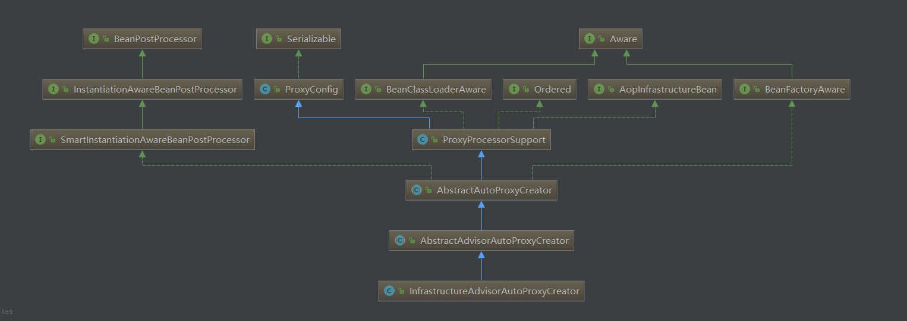
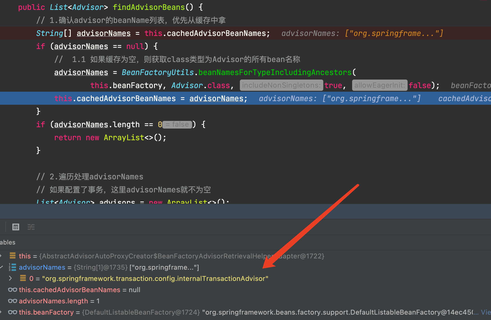
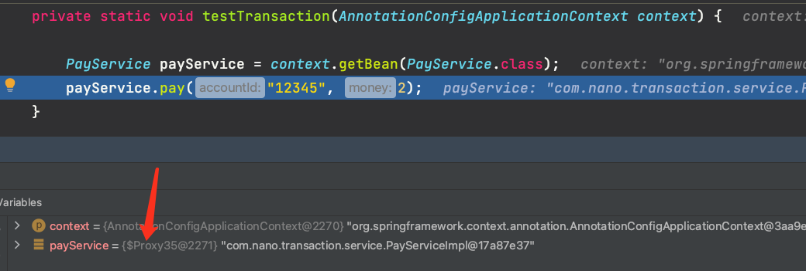
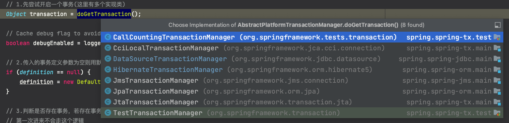

[TOC]

## Spring事务源码分析

### @EnableTransactionManagement注解

@EnableTransactionManagement 注解配置在**配置类**上可以开启事务功能。注意：Spring Boot 中如果使用了 @Transactional 注解后就不需要在启动类标注其他注解，因为 Spring Boot 已经自动装配了相关的对象 **TransactionAutoConfiguration**。这里分析的是 Spring 环境。

```java
@Target(ElementType.TYPE)
@Retention(RetentionPolicy.RUNTIME)
@Documented
@Import(TransactionManagementConfigurationSelector.class)
public @interface EnableTransactionManagement {

	/** 指定使用什么代理模式(true为cglib代理,false为JDK代理) */
	boolean proxyTargetClass() default false;

	/** 通知模式 是使用代理模式还是Aspectj 一般使用Proxy */
	AdviceMode mode() default AdviceMode.PROXY;

	int order() default Ordered.LOWEST_PRECEDENCE;

}
```

这里用了 **@Import 注解**往容器内导入了组件 TransactionManagementConfigurationSelector。这里只有一个方法。

```java
public class TransactionManagementConfigurationSelector extends AdviceModeImportSelector<EnableTransactionManagement> {

	/**
	 * 往容器中添加组件
	 * 1) AutoProxyRegistrar
	 * 2) ProxyTransactionManagementConfiguration
	 */
	@Override
	protected String[] selectImports(AdviceMode adviceMode) {
		switch (adviceMode) {
			// 配置的默认模式是PROXY
			case PROXY:
				return new String[] {AutoProxyRegistrar.class.getName(),
						ProxyTransactionManagementConfiguration.class.getName()};
			case ASPECTJ:
				return new String[] {
						TransactionManagementConfigUtils.TRANSACTION_ASPECT_CONFIGURATION_CLASS_NAME};
			default:
				return null;
		}
	}

}
```

这里看默认配置，也就是往容器导入了两个组件：**ProxyTransactionManagementConfiguration** 和 **AutoProxyRegistrar**。

#### ProxyTransactionManagementConfiguration组件

先看 ProxyTransactionManagementConfiguration。

```java
@Configuration
@Role(BeanDefinition.ROLE_INFRASTRUCTURE)
public class ProxyTransactionManagementConfiguration extends AbstractTransactionManagementConfiguration {

    /**
	 * 导入了一个增强器组件
	 */
    @Bean(name = TransactionManagementConfigUtils.TRANSACTION_ADVISOR_BEAN_NAME)
    @Role(BeanDefinition.ROLE_INFRASTRUCTURE)
    public BeanFactoryTransactionAttributeSourceAdvisor transactionAdvisor() {
        BeanFactoryTransactionAttributeSourceAdvisor advisor = new BeanFactoryTransactionAttributeSourceAdvisor();
        advisor.setTransactionAttributeSource(transactionAttributeSource());
        advisor.setAdvice(transactionInterceptor());
        if (this.enableTx != null) {
            advisor.setOrder(this.enableTx.<Integer>getNumber("order"));
        }
        return advisor;
    }

    /**
	 * 事务属性资源组件
	 */
    @Bean
    @Role(BeanDefinition.ROLE_INFRASTRUCTURE)
    public TransactionAttributeSource transactionAttributeSource() {
        return new AnnotationTransactionAttributeSource();
    }

    /**
	 * 导入一个事务拦截件 这个拦截件类似AOP的各种增强通知的链式调用方式
	 */
    @Bean
    @Role(BeanDefinition.ROLE_INFRASTRUCTURE)
    public TransactionInterceptor transactionInterceptor() {
        TransactionInterceptor interceptor = new TransactionInterceptor();
        interceptor.setTransactionAttributeSource(transactionAttributeSource());
        if (this.txManager != null) {
            interceptor.setTransactionManager(this.txManager);
        }
        return interceptor;
    }

}
```

这是一个配置类，导入了三个组件：

- **==BeanFactoryTransactionAttributeSourceAdvisor==**
- **==TransactionAttributeSource==**
- **==TransactionInterceptor==**

这里 **BeanFactoryTransactionAttributeSourceAdvisor** 是一个**增强器**，它实现了 **Advisor** 相关的各种接口。这里 @Bean 注解内显式指定了它的 beanName 如下为 **internalTransactionAdvisor**，这里后面会用到。

```java
public static final String TRANSACTION_ADVISOR_BEAN_NAME =
    "org.springframework.transaction.config.internalTransactionAdvisor";
```

**TransactionInterceptor** 是一个**拦截器**，可以在 AOP 的**链式增强调用**中触发。

回顾下 AOP 源码里面的如下方法：

```java
@Override
protected List<Advisor> findCandidateAdvisors() {
    // 1.添加根据父类规则找到的所有advisor(主要是找事务的增强器切面)
    List<Advisor> advisors = super.findCandidateAdvisors();
    // 2.为bean工厂中的所有AspectJ方面构建advisor
    if (this.aspectJAdvisorsBuilder != null) {
        advisors.addAll(this.aspectJAdvisorsBuilder.buildAspectJAdvisors());
    }
    return advisors;
}
```

这个方法就是**找到所有增强器**，注释 1 这个方法主要用于**寻找事务相关的增强器**！但是这里直接往容器中配置导入一个 **==BeanFactoryTransactionAttributeSourceAdvisor==** 增强器，这时候就能找到了并**放入缓存**了。

#### AutoProxyRegistrar组件

再看看 AutoProxyRegistrar 类，它实现了 **ImportBeanDefinitionRegistrar** 接口，该接口可以往容器中加入 **beanDefinition**。

```java
public class AutoProxyRegistrar implements ImportBeanDefinitionRegistrar {

	private final Log logger = LogFactory.getLog(getClass());

	/**
	 * 往容器中导入组件
	 */
	@Override
	public void registerBeanDefinitions(AnnotationMetadata importingClassMetadata, BeanDefinitionRegistry registry) {
		boolean candidateFound = false;
		Set<String> annTypes = importingClassMetadata.getAnnotationTypes();
		for (String annType : annTypes) {
			AnnotationAttributes candidate = AnnotationConfigUtils.attributesFor(importingClassMetadata, annType);
			if (candidate == null) {
				continue;
			}
			Object mode = candidate.get("mode");
			Object proxyTargetClass = candidate.get("proxyTargetClass");
			if (mode != null && proxyTargetClass != null && AdviceMode.class == mode.getClass() &&
					Boolean.class == proxyTargetClass.getClass()) {
				candidateFound = true;
				if (mode == AdviceMode.PROXY) {
					// 往容器中注册beanDefinition
					AopConfigUtils.registerAutoProxyCreatorIfNecessary(registry);
					if ((Boolean) proxyTargetClass) {
						AopConfigUtils.forceAutoProxyCreatorToUseClassProxying(registry);
						return;
					}
				}
			}
		}
		if (!candidateFound && logger.isWarnEnabled()) {
			String name = getClass().getSimpleName();
			// logger.warn(...);
		}
	}

}
```

这里 **registerAutoProxyCreatorIfNecessary**() 方法与 AOP 的操作类似，也是往容器导入了指定的 **beanDefinition** 组件。

> **AopConfigUtils.registerAutoProxyCreatorIfNecessary()**

```java
@Nullable
public static BeanDefinition registerAutoProxyCreatorIfNecessary(BeanDefinitionRegistry registry) {
    // 进去
    return registerAutoProxyCreatorIfNecessary(registry, null);
}
```

> **AopConfigUtils.registerAutoProxyCreatorIfNecessary()**

```java
@Nullable
public static BeanDefinition registerAutoProxyCreatorIfNecessary(
    BeanDefinitionRegistry registry, @Nullable Object source) {

    // 往容器导入了一个InfrastructureAdvisorAutoProxyCreator组件的beanDefinition
    return registerOrEscalateApcAsRequired(InfrastructureAdvisorAutoProxyCreator.class, registry, source);
}
```

看这里！！！往容器中导入了一个 **InfrastructureAdvisorAutoProxyCreator** 组件。看看它的继承图，跟 AOP 的 AnnotationAwareAspectJAutoProxyCreator 组件十分类似。



所以这里也重点分析 **postProcessBeforeInstantiation**() 和 **postProcessAfterInitialization**() 这两个方法。

### 增强器解析

#### postProcessBeforeInstantiation()

由于事务是基于 AOP 实现的，所以这里也走了 **AOP 的一些列源码**。postProcessBeforeInstantiation() 方法源码如下，这**与 AOP 中的代码一样**！

> **AbstractAutoProxyCreator::postProcessBeforeInstantiation()**

```java
@Override
public Object postProcessBeforeInstantiation(Class<?> beanClass, String beanName) throws BeansException {
    Object cacheKey = getCacheKey(beanClass, beanName);

    // 1.判断TargetSource缓存中是否包含当前bean，如果不包含，则判断当前bean是否是已经被代理的bean，
    // 如果代理过，则不对当前传入的bean进行处理，如果没代理过，则判断当前bean是否为系统bean，或者是
    // 切面逻辑不会包含的bean，如果是，则将当前bean缓存到advisedBeans中，否则继续往下执行。
    // 经过这一步的处理之后，只有在TargetSource中没有进行缓存，并且应该被切面逻辑环绕，但是目前还未
    // 生成代理对象的bean才会通过此方法
    if (!StringUtils.hasLength(beanName) || !this.targetSourcedBeans.contains(beanName)) {
        if (this.advisedBeans.containsKey(cacheKey)) {
            return null;
        }
        // 2.(判断是不是基础bean || 是否应该跳过)  shouldSkip直接返回false
        // shouldSkip()方法看子类AspectJAwareAdvisorAutoProxyCreator的实现
        if (isInfrastructureClass(beanClass) || shouldSkip(beanClass, beanName)) {
            // 2.1 把cacheKey存放在advisedBeans中
            this.advisedBeans.put(cacheKey, Boolean.FALSE);
            return null;
        }
    }

    // 3.获取封装当前bean的TargetSource对象，如果不存在，则直接退出当前方法，否则从TargetSource
    // 中获取当前bean对象，并且判断是否需要将切面逻辑应用在当前bean上
    TargetSource targetSource = getCustomTargetSource(beanClass, beanName);
    if (targetSource != null) {
        if (StringUtils.hasLength(beanName)) {
            this.targetSourcedBeans.add(beanName);
        }
        // 3.1 获取能够应用当前bean的切面逻辑
        Object[] specificInterceptors = getAdvicesAndAdvisorsForBean(beanClass, beanName, targetSource);
        // 3.2 根据切面逻辑为当前bean生成代理对象
        Object proxy = createProxy(beanClass, beanName, specificInterceptors, targetSource);
        this.proxyTypes.put(cacheKey, proxy.getClass());
        return proxy;
    }

    return null;
}
```

上述代码重点在于 3.1 与 3.2 处，**3.1 处获取 bean 的增强，3.2 处生成代理对象**。

##### 1.getAdvicesAndAdvisorsForBean()

> **AbstractAdvisorAutoProxyCreator::getAdvicesAndAdvisorsForBean()**

```java
@Override
@Nullable
protected Object[] getAdvicesAndAdvisorsForBean(
    Class<?> beanClass, String beanName, @Nullable TargetSource targetSource) {

    // 1.找到符合条件的Advisor
    List<Advisor> advisors = findEligibleAdvisors(beanClass, beanName);
    if (advisors.isEmpty()) {
        // 2.如果没有符合条件的Advisor，则返回null
        return DO_NOT_PROXY;
    }
    return advisors.toArray();
}
```

getAdvicesAndAdvisorsForBean() 在这里寻找适合当前 bean 的增强器。

> **AbstractAdvisorAutoProxyCreator::findEligibleAdvisors()**

```java
protected List<Advisor> findEligibleAdvisors(Class<?> beanClass, String beanName) {
    // 1.查找所有的候选Advisor增强器(事务相关的和自定义的)
    // findCandidateAdvisors()在bean 实例化之前就调用了一次，找到且生成了事务相关的增强器和自己定义的增强器，
    // 并且放到了缓存中，这里就从缓存中去增强器即可
    List<Advisor> candidateAdvisors = findCandidateAdvisors();
    // 2.从所有候选的Advisor中找出符合条件的(筛选本类能用的，因为有的切面是针对特定的bean的)
    List<Advisor> eligibleAdvisors = findAdvisorsThatCanApply(candidateAdvisors, beanClass, beanName);
    // 3.扩展方法，留给子类实现
    extendAdvisors(eligibleAdvisors);
    if (!eligibleAdvisors.isEmpty()) {
        // 4.对符合条件的Advisor进行排序
        eligibleAdvisors = sortAdvisors(eligibleAdvisors);
    }
    return eligibleAdvisors;
}
```

###### (1)findCandidateAdvisors()

findCandidateAdvisors() 方法，这在之前已经分析过。由于事务注解 @EnableTransactionManagement 已经将  BeanFactoryTransactionAttributeSourceAdvisor 这个组件导入到容器中(且其 beanName 指定为 internalTransactionAdvisor)，且 BeanFactoryTransactionAttributeSourceAdvisor 实现了 Advisor 接口，所以下面这里可以**寻找到**这个事务增强器。



###### (2)findAdvisorsThatCanApply()

这个方法用于判断当前找到的增强器是否适用于当前的 bean。

> **AbstractAdvisorAutoProxyCreator::findAdvisorsThatCanApply()**

```java
protected List<Advisor> findAdvisorsThatCanApply(
    List<Advisor> candidateAdvisors, Class<?> beanClass, String beanName) {

    ProxyCreationContext.setCurrentProxiedBeanName(beanName);
    try {
        // 进去
        return AopUtils.findAdvisorsThatCanApply(candidateAdvisors, beanClass);
    }
    finally {
        ProxyCreationContext.setCurrentProxiedBeanName(null);
    }
}
```

> **AopUtils.findAdvisorsThatCanApply()**

```java
public static List<Advisor> findAdvisorsThatCanApply(List<Advisor> candidateAdvisors, Class<?> clazz) {
    if (candidateAdvisors.isEmpty()) {
        return candidateAdvisors;
    }
    List<Advisor> eligibleAdvisors = new ArrayList<>();
    // 1.首先处理引介增强(@DeclareParents)用的比较少可以忽略
    // 有兴趣的参考：https://www.cnblogs.com/HigginCui/p/6322283.html
    for (Advisor candidate : candidateAdvisors) {
        if (candidate instanceof IntroductionAdvisor && canApply(candidate, clazz)) {
            eligibleAdvisors.add(candidate);
        }
    }
    boolean hasIntroductions = !eligibleAdvisors.isEmpty();
    // 2.遍历所有的候选Advisors
    for (Advisor candidate : candidateAdvisors) {
        // 2.1 引介增强上面已经处理，直接跳过
        if (candidate instanceof IntroductionAdvisor) {
            continue;
        }
        // 2.2 正常增强处理，判断当前bean是否可以应用于当前的增强器
        // 即bean是否包含在增强器的execution指定的表达式中
        if (canApply(candidate, clazz, hasIntroductions)) {
            eligibleAdvisors.add(candidate);
        }
    }
    return eligibleAdvisors;
}
```

这里重点分析注释 2.2 处的 canApply()。

> **AopUtils.canApply()**

```java
public static boolean canApply(Advisor advisor, Class<?> targetClass, boolean hasIntroductions) {
    // 根据类的继承图 发现 BeanFactoryTransactionAttributeSourceAdvisor没实现IntroductionAdvisor接口
    if (advisor instanceof IntroductionAdvisor) {
        return ((IntroductionAdvisor) advisor).getClassFilter().matches(targetClass);
    }
    // 1.注意：事务相关的BeanFactoryTransactionAttributeSourceAdvisor实现了PointcutAdvisor接口
    else if (advisor instanceof PointcutAdvisor) {
        // 1.1.强转为PointcutAdvisor
        PointcutAdvisor pca = (PointcutAdvisor) advisor;
        // 1.2.继续进去
        return canApply(pca.getPointcut(), targetClass, hasIntroductions);
    } else {
        // It doesn't have a pointcut so we assume it applies.
        return true;
    }
}
```

由于 BeanFactoryTransactionAttributeSourceAdvisor 实现了 PointcutAdvisor 接口，这里继续进到注释 1.2 处的 canApply() 方法。

> **AopUtils.canApply()**

```java
public static boolean canApply(Pointcut pc, Class<?> targetClass, boolean hasIntroductions) {
    Assert.notNull(pc, "Pointcut must not be null");
    if (!pc.getClassFilter().matches(targetClass)) {
        return false;
    }

    // 1.获取切点中的方法匹配器 TransactionAttributeSourcePointcut
    // 该切点在创建BeanFactoryTransactionAttributeSourceAdvisor的时候
    // 创建了切点TransactionAttributeSourcePointcut
    MethodMatcher methodMatcher = pc.getMethodMatcher();
    if (methodMatcher == MethodMatcher.TRUE) {
        // No need to iterate the methods if we're matching any method anyway...
        return true;
    }

    // 2.判断方法匹配器是不是IntroductionAwareMethodMatcher
    IntroductionAwareMethodMatcher introductionAwareMethodMatcher = null;
    if (methodMatcher instanceof IntroductionAwareMethodMatcher) {
        introductionAwareMethodMatcher = (IntroductionAwareMethodMatcher) methodMatcher;
    }

    // 3.获取当前类的实现接口类型
    Set<Class<?>> classes = new LinkedHashSet<>();
    if (!Proxy.isProxyClass(targetClass)) {
        classes.add(ClassUtils.getUserClass(targetClass));
    }
    classes.addAll(ClassUtils.getAllInterfacesForClassAsSet(targetClass));

    for (Class<?> clazz : classes) {
        // 4.获取并遍历接口的所有方法
        Method[] methods = ReflectionUtils.getAllDeclaredMethods(clazz);
        for (Method method : methods) {
            // 4.1.正在进行匹配的是methodMatcher.matches(method, targetClass)这个逻辑
            if (introductionAwareMethodMatcher != null ?
                introductionAwareMethodMatcher.matches(method, targetClass, hasIntroductions) :
                // 4.2.看这个，实现类为TransactionAttributeSourcePointcut
                methodMatcher.matches(method, targetClass)) {
                return true;
            }
        }
    }

    return false;
}
```

这里注释 1 处获取了一个匹配器 methodMatcher，然后注释 4.2 处用于判断**当前方法是否适用于目标类**。这里实现类为TransactionAttributeSourcePointcut。

> **TransactionAttributeSourcePointcut::matches()**

```java
@Override
public boolean matches(Method method, @Nullable Class<?> targetClass) {
    if (targetClass != null && TransactionalProxy.class.isAssignableFrom(targetClass)) {
        return false;
    }
    // 1.获取事务源对象，在ProxyTransactionManagementConfiguration配置类中配置的这里获取
    TransactionAttributeSource tas = getTransactionAttributeSource();
    // 2.从事务源对象中获取事务属性，看AbstractFallbackTransactionAttributeSource的实现
    return (tas == null || tas.getTransactionAttribute(method, targetClass) != null);
}
```

注释 2 处对**事务属性**进行了解析。看实现类 AbstractFallbackTransactionAttributeSource 的源码。

> **AbstractFallbackTransactionAttributeSource::getTransactionAttribute()**

```java
@Override
@Nullable
public TransactionAttribute getTransactionAttribute(Method method, @Nullable Class<?> targetClass) {
    if (method.getDeclaringClass() == Object.class) {
        return null;
    }

    // 1.通过目标类和目标类的接口方法拼接缓存key
    Object cacheKey = getCacheKey(method, targetClass);
    // 2.从缓存中获取
    TransactionAttribute cached = this.attributeCache.get(cacheKey);
    if (cached != null) {
        if (cached == NULL_TRANSACTION_ATTRIBUTE) {
            return null;
        } else {
            // 缓存中有直接返回
            return cached;
        }
    }
    else {
        // 3.解析事务属性
        TransactionAttribute txAttr = computeTransactionAttribute(method, targetClass);
        // 4.事务属性为空
        if (txAttr == null) {
            // 3.1 在缓存中标识为事务方法
            this.attributeCache.put(cacheKey, NULL_TRANSACTION_ATTRIBUTE);
        }
        else {
            String methodIdentification = ClassUtils.getQualifiedMethodName(method, targetClass);
            // 3.2 为事物属性设置方法描述符号
            if (txAttr instanceof DefaultTransactionAttribute) {
                ((DefaultTransactionAttribute) txAttr).setDescriptor(methodIdentification);
            }
            if (logger.isDebugEnabled()) {
                logger.debug("Adding transactional method '" + methodIdentification + "' with attribute: " + txAttr);
            }
            // 3.3 加入到缓存
            this.attributeCache.put(cacheKey, txAttr);
        }
        return txAttr;
    }
}
```

重点看看注释 3 处的 computeTransactionAttribute() 方法，这个方法就是去**寻找哪里标注了事务的注解**，寻找的顺序为 (1)实现类的方法上;(2)实现类上;(3)接口方法上;(4)接口上。

> **AbstractFallbackTransactionAttributeSource::computeTransactionAttribute()**

```java
@Nullable
protected TransactionAttribute computeTransactionAttribute(Method method, @Nullable Class<?> targetClass) {

    // 判断方法修饰符
    if (allowPublicMethodsOnly() && !Modifier.isPublic(method.getModifiers())) {
        return null;
    }

    // method为接口中的方法,specificMethod为实现类方法
    Method specificMethod = AopUtils.getMostSpecificMethod(method, targetClass);

    // 1.找实现类方法上的事务属性(标注的事务注解)
    TransactionAttribute txAttr = findTransactionAttribute(specificMethod);
    if (txAttr != null) {
        return txAttr;
    }

    // 2.找实现类上的事务属性(标注的事务注解)
    txAttr = findTransactionAttribute(specificMethod.getDeclaringClass());
    if (txAttr != null && ClassUtils.isUserLevelMethod(method)) {
        return txAttr;
    }

    if (specificMethod != method) {
        // 3.找接口方法定义上的事务属性(标注的事务注解)
        txAttr = findTransactionAttribute(method);
        if (txAttr != null) {
            return txAttr;
        }
        // 4.找接口方法定义类上的事务属性(标注的事务注解)
        txAttr = findTransactionAttribute(method.getDeclaringClass());
        if (txAttr != null && ClassUtils.isUserLevelMethod(method)) {
            return txAttr;
        }
    }

    return null;
}
```

这里看看从方法上找事务属性对象的方法。

> **AnnotationTransactionAttributeSource::findTransactionAttribute()**

```java
@Override
@Nullable
protected TransactionAttribute findTransactionAttribute(Method method) {
    // 进去
    return determineTransactionAttribute(method);
}
```

> **AnnotationTransactionAttributeSource::determineTransactionAttribute()**

```java
@Nullable
protected TransactionAttribute determineTransactionAttribute(AnnotatedElement element) {

    // 1.遍历事务注解解析器
    for (TransactionAnnotationParser annotationParser : this.annotationParsers) {
        // 2.解析方法上标注的事务注解，看SpringTransactionAnnotationParser的代码
        TransactionAttribute attr = annotationParser.parseTransactionAnnotation(element);
        if (attr != null) {
            return attr;
        }
    }
    return null;
}
```

这里注释 2 处通过事务注解解析器对方法上的**事务注解**进行解析，获取配置的属性。

> **SpringTransactionAnnotationParser::parseTransactionAnnotation()**

```java
@Override
@Nullable
public TransactionAttribute parseTransactionAnnotation(AnnotatedElement element) {
    AnnotationAttributes attributes = AnnotatedElementUtils.findMergedAnnotationAttributes(
        element, Transactional.class, false, false);
    if (attributes != null) {
        // 解析@Transactional属性
        return parseTransactionAnnotation(attributes);
    } else {
        return null;
    }
}
```

下面就真正进行了注解属性的解析。

> **SpringTransactionAnnotationParser::parseTransactionAnnotation()**

```java
protected TransactionAttribute parseTransactionAnnotation(AnnotationAttributes attributes) {
    RuleBasedTransactionAttribute rbta = new RuleBasedTransactionAttribute();

    // 1.传播行为
    Propagation propagation = attributes.getEnum("propagation");
    rbta.setPropagationBehavior(propagation.value());
    // 2.隔离级别
    Isolation isolation = attributes.getEnum("isolation");
    rbta.setIsolationLevel(isolation.value());
    // 3.超时
    rbta.setTimeout(attributes.getNumber("timeout").intValue());
    // 4.是否只读事务
    rbta.setReadOnly(attributes.getBoolean("readOnly"));
    rbta.setQualifier(attributes.getString("value"));

    // 5.事务回滚规则
    List<RollbackRuleAttribute> rollbackRules = new ArrayList<>();
    for (Class<?> rbRule : attributes.getClassArray("rollbackFor")) {
        rollbackRules.add(new RollbackRuleAttribute(rbRule));
    }
    // 5.1.对哪个类进行回滚
    for (String rbRule : attributes.getStringArray("rollbackForClassName")) {
        rollbackRules.add(new RollbackRuleAttribute(rbRule));
    }
    // 5.2.对哪些异常不回滚
    for (Class<?> rbRule : attributes.getClassArray("noRollbackFor")) {
        rollbackRules.add(new NoRollbackRuleAttribute(rbRule));
    }
    // 5.3.对哪些类不回滚
    for (String rbRule : attributes.getStringArray("noRollbackForClassName")) {
        rollbackRules.add(new NoRollbackRuleAttribute(rbRule));
    }
    rbta.setRollbackRules(rollbackRules);

    return rbta;
}
```

至此，标注了事务注解的类可以**获取到事务增强器**了，并且实现了对注解中配置属性的解析。下面就进行代理对象的创建了。

##### 2.createProxy()

这里代理对象的创建流程与 AOP 中的分析的流程**一毛一样**。

#### postProcessAfterInitialization()

对于事务来讲，也会进到 AOP 相关的 postProcessAfterInitialization() 方法中，进而进入到 **wrapIfNecessary**() 方法中，进而生成**事务的代理对象**。生成代理对象的流程也跟 AOP 的一致。

### 事务调用分析

#### 引入实例

首先是配置类如下：

```java
@Configuration
@EnableTransactionManagement
@EnableAspectJAutoProxy(exposeProxy = true)
@ComponentScan(basePackages = {"com.nano"})
public class TransactionConfig {


    @Bean
    public JdbcTemplate jdbcTemplate(DataSource dataSource) {
        return new JdbcTemplate(dataSource);
    }

    @Bean
    public DataSource dataSource() {
        DruidDataSource dataSource = new DruidDataSource();
        dataSource.setUsername("root");
        dataSource.setPassword("cz1174520425*****");
        dataSource.setUrl("jdbc:mysql://1.116.226.222/spring_test?characterEncoding=utf-8&useSSL=false&serverTimezone=GMT%2B8");
        dataSource.setDriverClassName("com.mysql.jdbc.Driver");
        return dataSource;
    }

    @Bean
    public PlatformTransactionManager transactionManager(DataSource dataSource) {
        return new DataSourceTransactionManager(dataSource);
    }

}
```

这里有几个关注点：

- @EnableTransactionManagement 开启了事务。
- @EnableAspectJAutoProxy 注解配置了**暴露代理对象属性** exposeProxy 为 true(参考 AOP 部分)。
- 往容器注入了 JdbcTemplate、DataSource、PlatformTransactionManager 等组件。

这里引入。

```java
@Service
public class PayServiceImpl implements PayService {

    @Autowired
    private AccountInfoDao accountInfoDao;

    @Autowired
    private ProductInfoDao productInfoDao;

    @Override
    @Transactional(rollbackFor = RuntimeException.class)
    public void pay(String accountId, double money) {
        // 查询余额
        double blance = accountInfoDao.qryBlanceByUserId(accountId);

        // 更新库存
        ((PayService) AopContext.currentProxy()).updateProductStore(1);

        // 更新余额
        int retVal = accountInfoDao.updateAccountBlance(accountId,money);
    }

    @Override
    @Transactional(propagation = Propagation.REQUIRES_NEW, rollbackFor = RuntimeException.class)
    public void updateProductStore(Integer productId) {
        try{
            productInfoDao.updateProductInfo(productId);

        } catch (Exception e) {
            throw new RuntimeException("更新库存异常");
        }
    }
}
```

这里有两个方法，一个是 pay() 支付方法，一个是 updateProductStore() 更新库存的方法。这里 pay() 方法用了默认的传播行为 **PROPAGATION_REQUIRED**，也就是**支持当前事务**，若当前没有事务就创建一个事务。updateProductStore() 方法指定了传播行为 **REQUIRES_NEW**，也就是 **创建一个新的事务，如果当前存在事务，则把当前事务挂起**。

测试方法：

```java
private static void testTransaction(AnnotationConfigApplicationContext context) {

    PayService payService = context.getBean(PayService.class);
    payService.pay("12345", 2);
}
```

这里调用 pay() 方法，**同时**也调用了 updateProductStore() 方法。下面通过源码的角度来分析整个执行流程。

#### 源码分析

debug 调用 pay() 方法，可以看到 payService 为一个**代理对象**。



继续执行则进入到 JdkDynamicAopProxy 的 invoke() 方法。这与 AOP 的调用流程是一样的，这里就不分析了，贴一下代码。

> **JdkDynamicAopProxy::invoke()**

```java
@Override
@Nullable
public Object invoke(Object proxy, Method method, Object[] args) throws Throwable {
    Object oldProxy = null;
    boolean setProxyContext = false;

    // 1.advised就是proxyFactory,而targetSource持有被代理对象的引用
    TargetSource targetSource = this.advised.targetSource;
    Object target = null;

    try {
        // equals()方法不代理
        if (!this.equalsDefined && AopUtils.isEqualsMethod(method)) {
            return equals(args[0]);
            // hashCode()方法不代理
        } else if (!this.hashCodeDefined && AopUtils.isHashCodeMethod(method)) {
            return hashCode();
            // 只有getDecoratedClass()声明 - > dispatch到代理配置
        } else if (method.getDeclaringClass() == DecoratingProxy.class) {
            return AopProxyUtils.ultimateTargetClass(this.advised);
            // ProxyConfig上的服务调用与代理配置...
        } else if (!this.advised.opaque && method.getDeclaringClass().isInterface() &&
                   method.getDeclaringClass().isAssignableFrom(Advised.class)) {
            return AopUtils.invokeJoinpointUsingReflection(this.advised, method, args);
        }

        Object retVal;

        // 2.有时候目标对象内部的"自我调用"将无法实施切面中的增强则需要通过此属性暴露代理对象
        // exposeProxy属性在@EnableAspectJAutoProxy注解中配置
        // 暴露代理对象就是将代理对象放到线程本地变量ThreadLocal的缓存中
        if (this.advised.exposeProxy) {
            oldProxy = AopContext.setCurrentProxy(proxy);
            setProxyContext = true;
        }

        // 3.拿到被代理的对象实例与Class类型
        target = targetSource.getTarget();
        Class<?> targetClass = (target != null ? target.getClass() : null);

        // 4.获取拦截器链：例如使用@Around注解时会找到AspectJAroundAdvice，还有ExposeInvocationInterceptor
        // 把增强器转换为拦截器
        List<Object> chain = this.advised.getInterceptorsAndDynamicInterceptionAdvice(method, targetClass);

        // 5.检查是否有任何拦截器(advice)
        // 下面用了责任链模式!!!!!
        if (chain.isEmpty()) {
            Object[] argsToUse = AopProxyUtils.adaptArgumentsIfNecessary(method, args);
            // 6.不存在拦截器链，直接进行反射调用方法
            retVal = AopUtils.invokeJoinpointUsingReflection(target, method, argsToUse);
        }
        else {
            // 7.如果存在拦截器，则创建一个ReflectiveMethodInvocation，把所有信息传进去构造方法调用对象!!
            MethodInvocation invocation =
                new ReflectiveMethodInvocation(proxy, target, method, args, targetClass, chain);
            // 8.重点：调用ReflectiveMethodInvocation的执行方法!!!!!!
            retVal = invocation.proceed();
        }

        // 9.必要时转换返回值
        Class<?> returnType = method.getReturnType();
        if (retVal != null && retVal == target &&
            returnType != Object.class && returnType.isInstance(proxy) &&
            !RawTargetAccess.class.isAssignableFrom(method.getDeclaringClass())) {
            retVal = proxy;
        } else if (retVal == null && returnType != Void.TYPE && returnType.isPrimitive()) {
            throw new AopInvocationException(
                "Null return value from advice does not match primitive return type for: " + method);
        }
        return retVal;

    } finally {
        if (target != null && !targetSource.isStatic()) {
            // Must have come from TargetSource.
            targetSource.releaseTarget(target);
        }
        if (setProxyContext) {
            // Restore old proxy.
            AopContext.setCurrentProxy(oldProxy);
        }
    }
}
```

依然进入注释 8 的 **proceed()** 方法。

> **ReflectiveMethodInvocation::proceed()**

```java
@Override
@Nullable
public Object proceed() throws Throwable {
    // 1.如果所有拦截器都执行完毕(index是从-1开始，所以跟size - 1比较)，则直接使用反射调用连接点(也就是原本的方法)
    if (this.currentInterceptorIndex == this.interceptorsAndDynamicMethodMatchers.size() - 1) {
        return invokeJoinpoint();
    }

    // 2.每次调用之前，将索引的值递增，并通过索引拿到要执行的拦截器
    Object interceptorOrInterceptionAdvice =
        this.interceptorsAndDynamicMethodMatchers.get(++this.currentInterceptorIndex);
    // 3.判断拦截器是否为InterceptorAndDynamicMethodMatcher类型(动态方法匹配拦截器)
    if (interceptorOrInterceptionAdvice instanceof InterceptorAndDynamicMethodMatcher) {
        // 进行动态匹配。在此评估动态方法匹配器：静态部件已经过评估并且发现匹配
        InterceptorAndDynamicMethodMatcher dm =
            (InterceptorAndDynamicMethodMatcher) interceptorOrInterceptionAdvice;
        if (dm.methodMatcher.matches(this.method, this.targetClass, this.arguments)) {
            return dm.interceptor.invoke(this);
        }
        else {
            // 动态匹配失败。跳过此拦截器并调用链中的下一个
            return proceed();
        }
    }
    else {
        // 一般走这里
        // 4.只是一个普通的拦截器，则触发拦截器链责任链的调用，并且参数为ReflectiveMethodInvocation本身
        return ((MethodInterceptor) interceptorOrInterceptionAdvice).invoke(this);
    }
}
```

最后注释 4 这里会进行**各个拦截器的链式调用**。与 AOP 中的各种 Interceptor 类似，这里也实现了一个事务拦截器即 **==TransactionInterceptor==**。看看其实现的 invoke() 方法。

> **TransactionInterceptor::invoke()**

```java
@Override
@Nullable
public Object invoke(MethodInvocation invocation) throws Throwable {

    // 1.获取代理对象的目标class
    Class<?> targetClass = (invocation.getThis() != null ? AopUtils.getTargetClass(invocation.getThis()) : null);

    // 2.使用事务调用
    return invokeWithinTransaction(invocation.getMethod(), targetClass, invocation::proceed);
}
```

重点看看注释 2 处的事务调用 **invokeWithinTransaction**()。

> **TransactionAspectSupport::invokeWithinTransaction()**

```java
@Nullable
protected Object invokeWithinTransaction(Method method, @Nullable Class<?> targetClass,
                                         final InvocationCallback invocation) throws Throwable {

    // 1.如果事务属性为null，说明为非事务方法
    TransactionAttributeSource tas = getTransactionAttributeSource();
    // 2.由于@EnableTransactionManager导入了TransactionAttributeSource，这里可以获取出事务属性对象
    final TransactionAttribute txAttr = (tas != null ? tas.getTransactionAttribute(method, targetClass) : null);
    final PlatformTransactionManager tm = determineTransactionManager(txAttr);
    // 3.获取需要切入的方法(也就是标识了@Transactional注解的方法)
    final String joinpointIdentification = methodIdentification(method, targetClass, txAttr);

    // 4.在这里只看常用的事务管理器,这里一般不会配置CallbackPreferringPlatformTransactionManager事务管理器
    if (txAttr == null || !(tm instanceof CallbackPreferringPlatformTransactionManager)) {
        // 4.1.判断有没有必要开启事务
        TransactionInfo txInfo = createTransactionIfNecessary(tm, txAttr, joinpointIdentification);

        Object retVal;
        try {
            // 4.2.调用目标方法！！！！
            retVal = invocation.proceedWithInvocation();
        }
        catch (Throwable ex) {
            // 4.3.如果抛出异常进行回滚
            completeTransactionAfterThrowing(txInfo, ex);
            throw ex;
        }
        finally {
            // 4.4.清除事务信息
            cleanupTransactionInfo(txInfo);
        }
        // 4.5.提交事务
        commitTransactionAfterReturning(txInfo);
        return retVal;
    }

    // 下面的不看了
    else {
        
    }
}
```

这里其实就是 Spring 为**事务执行流程**的封装了，整体过程也比较清楚。

整体流程图如下所示，编辑连接：https://www.processon.com/diagraming/621113445653bb4ec5c66e50


#### createTransactionIfNecessary()

这里看看注释 4.1 处 createTransactionIfNecessary() 方法。**整个方法获取了事务并进行了开启**。

> **TransactionAspectSupport::createTransactionIfNecessary()**

```java
protected TransactionInfo createTransactionIfNecessary(@Nullable PlatformTransactionManager tm,
                                                       @Nullable TransactionAttribute txAttr, final String joinpointIdentification) {

    // 1.包装事务属性
    if (txAttr != null && txAttr.getName() == null) {
        txAttr = new DelegatingTransactionAttribute(txAttr) {
            @Override
            public String getName() {
                return joinpointIdentification;
            }
        };
    }

    TransactionStatus status = null;
    if (txAttr != null) {
        if (tm != null) {
            // 2.获取一个事务状态
            status = tm.getTransaction(txAttr);
        }
        else {
            if (logger.isDebugEnabled()) {
                logger.debug("Skipping transactional joinpoint [" + joinpointIdentification +
                             "] because no transaction manager has been configured");
            }
        }
    }
    // 3.准备事务信息
    return prepareTransactionInfo(tm, txAttr, joinpointIdentification, status);
}
```

注释 2 处，getTransaction() 方法用于**获取一个事务**。

注释 3 处，prepareTransactionInfo() 方法用于**准备事务信息**。

##### 1.getTransaction()

这个是重点方法！

> **AbstractPlatformTransactionManager::getTransaction()**

```java
@Override
public final TransactionStatus getTransaction(@Nullable TransactionDefinition definition) throws TransactionException {

    // 1.获取事务对象，这里可能还没有事务 所以下面要进行判断 (这里有多个实现类)
    Object transaction = doGetTransaction();

    boolean debugEnabled = logger.isDebugEnabled();

    // 2.传入的事务定义参数为空则用默认的事务定义
    if (definition == null) {
        definition = new DefaultTransactionDefinition();
    }

    // 3.(重要)判断是否存在事务，若存在事务，这里直接返回不走下面的处理了
    // 执行pay()方法的时候还没有事务，所以第一次进来不会走这个逻辑
    // 执行pay()方法里面的updateAccountBlance()方法的时候，已经存在事务了，所以会走这里的逻辑
    if (isExistingTransaction(transaction)) {
        // 3.1.处理已有事务的情况
        return handleExistingTransaction(definition, transaction, debugEnabled);
    }

    // 3.2.到这里说明还不存在事务 需要新建事务

    // 4.判读事务超时
    if (definition.getTimeout() < TransactionDefinition.TIMEOUT_DEFAULT) {
        throw new InvalidTimeoutException("Invalid transaction timeout", definition.getTimeout());
    }

    // 5.根据传播行为做不同处理
    // 5.1.如果当前存在事务，则加入该事务；如果当前没有事务，则抛出异常
    if (definition.getPropagationBehavior() == TransactionDefinition.PROPAGATION_MANDATORY) {
        throw new IllegalTransactionStateException(
            "No existing transaction found for transaction marked with propagation 'mandatory'");
    }
    // 5.2.支持当前事务则新建事务
    else if (definition.getPropagationBehavior() == TransactionDefinition.PROPAGATION_REQUIRED ||
             definition.getPropagationBehavior() == TransactionDefinition.PROPAGATION_REQUIRES_NEW ||
             definition.getPropagationBehavior() == TransactionDefinition.PROPAGATION_NESTED) {
        // 5.2.1.执行挂起事务方法，但由于当前是没有事务的，所以传null
        SuspendedResourcesHolder suspendedResources = suspend(null);
        if (debugEnabled) {
            logger.debug("Creating new transaction with name [" + definition.getName() + "]: " + definition);
        }
        try {
            boolean newSynchronization = (getTransactionSynchronization() != SYNCHRONIZATION_NEVER);
            // 5.2.2.创建一个新的事务状态
            DefaultTransactionStatus status = newTransactionStatus(
                definition, transaction, true, newSynchronization, debugEnabled, suspendedResources);
            // 5.2.3.现在事务还没开启，这里开启一个事务！！！
            doBegin(transaction, definition);
            // 5.2.4.准备同步事务
            prepareSynchronization(status, definition);
            return status;
        }
        catch (RuntimeException | Error ex) {
            resume(null, suspendedResources);
            throw ex;
        }
    }
    // 5.3.不支持当前事务
    else {
        // 创建一个空事务
        if (definition.getIsolationLevel() != TransactionDefinition.ISOLATION_DEFAULT && logger.isWarnEnabled()) {
            logger.warn("Custom isolation level specified but no actual transaction initiated; " +
                        "isolation level will effectively be ignored: " + definition);
        }
        boolean newSynchronization = (getTransactionSynchronization() == SYNCHRONIZATION_ALWAYS);
        return prepareTransactionStatus(definition, null, true, newSynchronization, debugEnabled, null);
    }
}
```

这个方法就是获取事务的方法。对于上面的例子，当执行例子中的 **pay()** 方法时，第一次进入到 **getTransaction()** 方法时，由于**还没有创建事务**，注释 3 处的判断就不命中，因此直接执行后面的逻辑，也就是为 pay() 方法正常的创建并开启事务。当 pay() 方法执行到例子中的 **updateProductStore()** 方法时，会调用 PayService 的代理对象的 **updateProductStore**() 方法，然后又会重新调用一次 JdkDynamicAopProxy 的 **invoke()** 方法，然后又会发现 updateProductStore() 方法**也需要事务**，此时就会一步步再次执行到上面的方法，这时候就会**存在事务了**，此时执行注释 3.1 处的 **handleExistingTransaction**() 方法就返回了。

当走到注释 3.1 处，说明**当前还没有事务**，则需要根据实际的配置为 pay() 方法创建新的事务，这里会根据具体的传播行为进行不同的操作。(1)如果是 PROPAGATION_MANDATORY 则直接抛异常;(2)如果是支持当前事务的几种传播行为(PROPAGATION_REQUIRED、PROPAGATION_REQUIRES_NEW、PROPAGATION_NESTED)等，则会创建并开启一个新的事务;(3)其他的传播行为则创建一个空事务。

这里分析一下几个重点方法。

###### (1)doGetTransaction()

这个方法尝试获取并返回一个**事务对象**，这个方法有很多实现类。



这里分析的是 **DataSourceTransactionManager** 中的实现。比较常见的还有：HibernateTransactionManager 和 JpaTransactionManager。看看实现。

> **DataSourceTransactionManager::doGetTransaction()**

```java
@Override
protected Object doGetTransaction() {
    // 1.创建一个数据库事务管理器
    DataSourceTransactionObject txObject = new DataSourceTransactionObject();
    // 2.设置一个事务保存点
    txObject.setSavepointAllowed(isNestedTransactionAllowed());
    // 3.从事务同步管理器中获取连接持有器
    ConnectionHolder conHolder =
        (ConnectionHolder) TransactionSynchronizationManager.getResource(obtainDataSource());
    txObject.setConnectionHolder(conHolder, false);
    // 4.返回一个事务对象
    return txObject;
}
```

###### (2)doBegin()

这个方法也有多个实现类，这里也分析的是 **DataSourceTransactionManager** 中的实现。

总结一下 doBegin() 方法干的事情：

- 判断事务是否有数据库连接。最开始是没有数据库连接的，这里获取**数据库连接**对象，并封装为 **ConnectionHolder** 对象后，设置到事务对象中。
- 设置事务的隔离级别。
- 关闭自动提交。
- 激活事务。
- 设置超时时间。
- 把数据源和 ConnectionHolder 进行绑定。

> **DataSourceTransactionManager::doBegin()**

```java
@Override
protected void doBegin(Object transaction, TransactionDefinition definition) {
    DataSourceTransactionObject txObject = (DataSourceTransactionObject) transaction;
    Connection con = null;

    try {
        // 1.第一次进来，事务持有器中是没有对象的,所以需要自己手动的设置进去
        if (!txObject.hasConnectionHolder() ||
            txObject.getConnectionHolder().isSynchronizedWithTransaction()) {
            // 2.获取一个数据库连接
            Connection newCon = obtainDataSource().getConnection();
            if (logger.isDebugEnabled()) {
                logger.debug("Acquired Connection [" + newCon + "] for JDBC transaction");
            }
            // 3.把数据库连接封装起来且设置到事务对象中
            txObject.setConnectionHolder(new ConnectionHolder(newCon), true);
        }

        // 4.开始同步标准
        txObject.getConnectionHolder().setSynchronizedWithTransaction(true);
        con = txObject.getConnectionHolder().getConnection();

        // 5.获取事务隔离级别
        Integer previousIsolationLevel = DataSourceUtils.prepareConnectionForTransaction(con, definition);
        txObject.setPreviousIsolationLevel(previousIsolationLevel);

        // 6.关闭事务自动提交(由代码手动提交事务)
        if (con.getAutoCommit()) {
            txObject.setMustRestoreAutoCommit(true);
            if (logger.isDebugEnabled()) {
                logger.debug("Switching JDBC Connection [" + con + "] to manual commit");
            }
            con.setAutoCommit(false);
        }

        // 7.设置是否为只读事务
        prepareTransactionalConnection(con, definition);
        // 8.设置事务激活
        txObject.getConnectionHolder().setTransactionActive(true);

        int timeout = determineTimeout(definition);
        if (timeout != TransactionDefinition.TIMEOUT_DEFAULT) {
            txObject.getConnectionHolder().setTimeoutInSeconds(timeout);
        }

        // 9.把数据源和事务持有器保存到事务同步管理器中
        if (txObject.isNewConnectionHolder()) {
            TransactionSynchronizationManager.bindResource(obtainDataSource(), txObject.getConnectionHolder());
        }
    }
    catch (Throwable ex) {
        if (txObject.isNewConnectionHolder()) {
            // 抛出异常,释放资源
            DataSourceUtils.releaseConnection(con, obtainDataSource());
            txObject.setConnectionHolder(null, false);
        }
        throw new CannotCreateTransactionException("Could not open JDBC Connection for transaction", ex);
    }
}
```

###### (3)prepareSynchronization()

本方法把当前的事务设置到同步管理器中，相当于把当前获取的事务及属性缓存起来，后面可以获取到该事务。

> **AbstractPlatformTransactionManager::prepareSynchronization()**

```java
protected void prepareSynchronization(DefaultTransactionStatus status, TransactionDefinition definition) {
    if (status.isNewSynchronization()) {
        // 1.设置事务激活
        TransactionSynchronizationManager.setActualTransactionActive(status.hasTransaction());
        // 2.设置隔离级别
        TransactionSynchronizationManager.setCurrentTransactionIsolationLevel(
            definition.getIsolationLevel() != TransactionDefinition.ISOLATION_DEFAULT ?
            definition.getIsolationLevel() : null);
        // 3.设置只读事务
        TransactionSynchronizationManager.setCurrentTransactionReadOnly(definition.isReadOnly());
        // 4.设置事务名称
        TransactionSynchronizationManager.setCurrentTransactionName(definition.getName());
        TransactionSynchronizationManager.initSynchronization();
    }
}
```

###### (4)handleExistingTransaction()

在 getTransaction() 方法中，在已经存在事务的情况下，比如执行到了 pay() 方法中的 updateProductStore() 方法，此时会调用 PayService 的代理对象的 updateProductStore() 方法，然后又会重新调用一次 JdkDynamicAopProxy 的 invoke() 方法，然后又会发现 updateProductStore() 方法也需要事务，此时就会一步步再次执行到上面的方法，这时候就会存在事务了，此时执行注释 3.1 处的 handleExistingTransaction() 方法就返回了。

这里看看 handleExistingTransaction() 方法源码。

> **AbstractPlatformTransactionManager::handleExistingTransaction()**

```java
private TransactionStatus handleExistingTransaction(
    TransactionDefinition definition, Object transaction, boolean debugEnabled)
    throws TransactionException {

    // 1.到这里说明肯定有事务 如果是PROPAGATION_NEVER隔离级别则抛异常
    if (definition.getPropagationBehavior() == TransactionDefinition.PROPAGATION_NEVER) {
        throw new IllegalTransactionStateException(
            "Existing transaction found for transaction marked with propagation 'never'");
    }

    if (definition.getPropagationBehavior() == TransactionDefinition.PROPAGATION_NOT_SUPPORTED) {
        if (debugEnabled) {
            logger.debug("Suspending current transaction");
        }
        Object suspendedResources = suspend(transaction);
        boolean newSynchronization = (getTransactionSynchronization() == SYNCHRONIZATION_ALWAYS);
        return prepareTransactionStatus(
            definition, null, false, newSynchronization, debugEnabled, suspendedResources);
    }

    // 2.PROPAGATION_REQUIRES_NEW隔离级别：创建一个新的事务，如果当前存在事务，则把当前事务挂起
    if (definition.getPropagationBehavior() == TransactionDefinition.PROPAGATION_REQUIRES_NEW) {
        if (debugEnabled) {
            logger.debug("Suspending current transaction, creating new transaction with name [" +
                         definition.getName() + "]");
        }
        // 2.1.这里需要挂起之前的事务
        SuspendedResourcesHolder suspendedResources = suspend(transaction);
        try {
            // 2.2.新开启一个事务
            boolean newSynchronization = (getTransactionSynchronization() != SYNCHRONIZATION_NEVER);
            DefaultTransactionStatus status = newTransactionStatus(
                definition, transaction, true, newSynchronization, debugEnabled, suspendedResources);

            // 2.3.开始事务
            doBegin(transaction, definition);
            // 2.4.准备同步
            prepareSynchronization(status, definition);
            return status;
        }
        catch (RuntimeException | Error beginEx) {
            resumeAfterBeginException(transaction, suspendedResources, beginEx);
            throw beginEx;
        }
    }

    if (definition.getPropagationBehavior() == TransactionDefinition.PROPAGATION_NESTED) {
        // 省略了...
    }

    // 省略了...
    boolean newSynchronization = (getTransactionSynchronization() != SYNCHRONIZATION_NEVER);
    return prepareTransactionStatus(definition, transaction, false, newSynchronization, debugEnabled, null);
}
```

这个方法其实就是针对**已经存在事务**情况下的处理。

对于前面的例子，由于例子中的 updateProductStore() 方法的传播行为为 PROPAGATION_REQUIRES_NEW，也就是 **创建一个新的事务，如果当前存在事务，则把当前事务挂起**。所以这里会执行到注释 2 处。这里首先执行了 suspend() 方法将当前的事务进行**挂起**，然后采用了之前类似的步骤**重新创建**并开启了一个事务。

##### 2.prepareTransactionInfo()

> **TransactionAspectSupport::prepareTransactionInfo()**

```java
protected TransactionInfo prepareTransactionInfo(@Nullable PlatformTransactionManager tm,
                                                 @Nullable TransactionAttribute txAttr, String joinpointIdentification,
                                                 @Nullable TransactionStatus status) {

    // 1.把事务管理器，事务属性，连接点信息封装成为TransactionInfo
    TransactionInfo txInfo = new TransactionInfo(tm, txAttr, joinpointIdentification);
    if (txAttr != null) {
        // We need a transaction for this method...
        if (logger.isTraceEnabled()) {
            logger.trace("Getting transaction for [" + txInfo.getJoinpointIdentification() + "]");
        }
        // 设置事务状态
        txInfo.newTransactionStatus(status);
    }
    else {
        // The TransactionInfo.hasTransaction() method will return false. We created it only
        // to preserve the integrity of the ThreadLocal stack maintained in this class.
        if (logger.isTraceEnabled()) {
            logger.trace("No need to create transaction for [" + joinpointIdentification +
                         "]: This method is not transactional.");
        }
    }
    // 把事务信息绑定到当前线程上
    txInfo.bindToThread();
    return txInfo;
}
```

#### proceedWithInvocation()

之前的 createTransactionIfNecessary() 方法获取并开启了事务，这里 proceedWithInvocation() 就是**执行目标方法**了。

#### completeTransactionAfterThrowing()

用于发生异常时进行**回滚**。这里**默认**只对 **RuntimeException** 回滚。

```java
protected void completeTransactionAfterThrowing(@Nullable TransactionInfo txInfo, Throwable ex) {
    if (txInfo != null && txInfo.getTransactionStatus() != null) {
        if (logger.isTraceEnabled()) {
            logger.trace("Completing transaction for [" + txInfo.getJoinpointIdentification() +
                         "] after exception: " + ex);
        }
        // 1.命中了配置的异常才进行回滚，看rollbackOn方法
        if (txInfo.transactionAttribute != null && txInfo.transactionAttribute.rollbackOn(ex)) {
            try {
                // 1.1.进行回滚
                txInfo.getTransactionManager().rollback(txInfo.getTransactionStatus());
            }
            catch (TransactionSystemException ex2) {
                logger.error("Application exception overridden by rollback exception", ex);
                ex2.initApplicationException(ex);
                throw ex2;
            }
            catch (RuntimeException | Error ex2) {
                logger.error("Application exception overridden by rollback exception", ex);
                throw ex2;
            }
        }
        else {
            // 2.没有命中配置的异常依然会提交事务
            try {
                txInfo.getTransactionManager().commit(txInfo.getTransactionStatus());
            }
            catch (TransactionSystemException ex2) {
                logger.error("Application exception overridden by commit exception", ex);
                ex2.initApplicationException(ex);
                throw ex2;
            }
            catch (RuntimeException | Error ex2) {
                logger.error("Application exception overridden by commit exception", ex);
                throw ex2;
            }
        }
    }
}
```

这里判断是否需要回滚的 rollbackOn() 方法如下：

```java
@Override
public boolean rollbackOn(Throwable ex) {
    return (ex instanceof RuntimeException || ex instanceof Error);
}
```

也就是默认是 RuntimeException 才回滚。因此最好是**配置**发生什么异常时进行回滚。

#### commitTransactionAfterReturning()

该方法用于事务的**提交**。

#### 传播行为分析

##### 1.正常执行

对于上面的例子。

```java
@Service
public class PayServiceImpl implements PayService {

    @Autowired
    private AccountInfoDao accountInfoDao;

    @Autowired
    private ProductInfoDao productInfoDao;

    @Override
    @Transactional(rollbackFor = RuntimeException.class)
    public void pay(String accountId, double money) {
        // 查询余额
        double blance = accountInfoDao.qryBlanceByUserId(accountId);

        // 更新库存
        ((PayService) AopContext.currentProxy()).updateProductStore(1);

        // 更新余额
        int retVal = accountInfoDao.updateAccountBlance(accountId,money);
    }

    @Override
    @Transactional(propagation = Propagation.REQUIRES_NEW, rollbackFor = RuntimeException.class)
    public void updateProductStore(Integer productId) {
        try{
            productInfoDao.updateProductInfo(productId);

        } catch (Exception e) {
            throw new RuntimeException("更新库存异常");
        }
    }

}
```

在正常执行不抛异常的情况下，**pay()** 方法会**创建一个事务**，配置了传播行为为 **Propagation.REQUIRES_NEW** 的**updateProductStore**() 方法也会**创建一个事务**。也就是在两个事务中执行。

##### 2.抛异常

当执行方法可能抛异常的情况下，如下所示。

```java
@Service
public class PayServiceImpl implements PayService {

    @Autowired
    private AccountInfoDao accountInfoDao;

    @Autowired
    private ProductInfoDao productInfoDao;

    @Override
    @Transactional(rollbackFor = RuntimeException.class)
    public void pay(String accountId, double money) {
        // 查询余额
        double blance = accountInfoDao.qryBlanceByUserId(accountId);

        // 更新库存
        ((PayService) AopContext.currentProxy()).updateProductStore(1);

        // 这里加入抛异常的逻辑
        double i = 1 / 0;
        
        // 更新余额
        int retVal = accountInfoDao.updateAccountBlance(accountId,money);
    }

    @Override
    @Transactional(propagation = Propagation.REQUIRES_NEW, rollbackFor = RuntimeException.class)
    public void updateProductStore(Integer productId) {
        try{
            productInfoDao.updateProductInfo(productId);

        } catch (Exception e) {
            throw new RuntimeException("更新库存异常");
        }
    }

}
```

这里在 pay() 方法中加入抛异常的逻辑，此时 updateProductStore() 方法由于是新的事务，所以**可以正常执行并提交**，也就是会修改库存；而 pay() 方法抛异常后，触发回滚，此时余额不会回滚。这里其实造成了**脏数据**。

另一种抛异常的情况如下：

```java
@Service
public class PayServiceImpl implements PayService {

    @Autowired
    private AccountInfoDao accountInfoDao;

    @Autowired
    private ProductInfoDao productInfoDao;

    @Override
    @Transactional(rollbackFor = RuntimeException.class)
    public void pay(String accountId, double money) {
        // 查询余额
        double blance = accountInfoDao.qryBlanceByUserId(accountId);

        // 更新库存
        ((PayService) AopContext.currentProxy()).updateProductStore(1);
        
        // 更新余额
        int retVal = accountInfoDao.updateAccountBlance(accountId,money);
    }

    @Override
    @Transactional(propagation = Propagation.REQUIRES_NEW, rollbackFor = RuntimeException.class)
    public void updateProductStore(Integer productId) {
        try{
            productInfoDao.updateProductInfo(productId);
            
        // 这里加入抛异常的逻辑
        double i = 1 / 0;

        } catch (Exception e) {
            throw new RuntimeException("更新库存异常");
        }
    }

}
```

也就是 updateProductStore() 方法加入了抛异常的逻辑，**此时两个事务都会回滚**，库存和余额都不会被更新。


