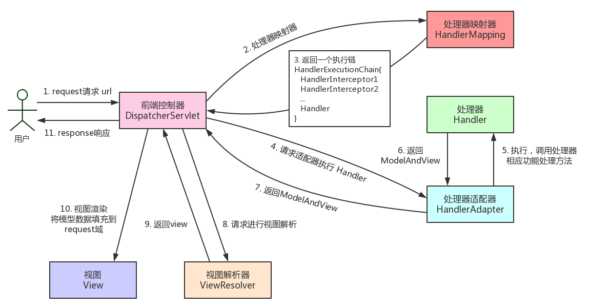

[TOC]

### Spring MVC

#### Controller注解

##### 1.请求注解

> **@RequestMapping注解**

可以指定接口路径，HTTP 方法。

```java
@RequestMapping(value="/users", method = RequestMethod.GET)
public ResponseEntity<List<User>> getAllUsers() {
    return userRepository.findAll();
}
```

> **@GetMapping/@PostMapping/@PutMapping/@DeleteMapping注解**

指定接口的 HTTP 方法。

```java
@GetMapping("/users")
public ResponseEntity<List<User>> getAllUsers() {
    return userRepository.findAll();
}
```

##### 2.参数传递注解

> **@PathVariable注解**

用于获取**路径参数**。

> **@RequestParam注解**

用于获取**查询参数**。

```java
@GetMapping("/user/{userId}")
public List<Teacher> getKlassRelatedTeachers(
    @PathVariable("userId") Long userId,
    @RequestParam(value = "type", required = false) String type) {
}
```

如果 URL 为：

```http
/user/123?type=android
```

解析后得到参数为：userId = 123, type = android。

GET 请求**参数为列表**时的写法：

```java
@ApiOperation(value = "XXXX", notes = "XXXX")
@GetMapping(value = "/test")
public APIResponse<Book> getBook(
    @ApiParam(name = "classIdx", value = "题目类型") @RequestParam(value = "classIdx") int classIdx,       @ApiParam(name = "contents", value = "识别内容") @RequestParam(value = "contents[]") List<String> contents) {
}
```

> **@RequestBody注解**

用于**读取 Request 请求**（可能是 POST, PUT, DELETE, GET 请求）的 **body 部分**并且 **Content-Type** 为 **application/json 格式**的数据，接收到数据之后会自动将数据**绑定到 Java 对象**上去。Spring 使用 **HttpMessageConverter** 或自定义的 **HttpMessageConverter** 将请求 body 中的 JSON 字符串**转换为相应对象**。

示例接口：

```java
@PostMapping("/registry")
public ResponseEntity registry(@RequestBody @Valid User user) {
    userService.save(user);
    return ResponseEntity.ok().build();
}
```

```java
@Data
@AllArgsConstructor
@NoArgsConstructor
public class User {
    @NotBlank
    private String userName;
    @NotBlank
    private String password;
    @FullName
    @NotBlank
    private String fullName;
}
```

发送 POST 请求到这个接口，并且 Body 携带 JSON 数据：

```json
{"userName":"Alice","fullName":"Jack","password":"123456"}
```

注意：一个请求方法只可以有一个 @RequestBody，但可以有**多个** @RequestParam 和 @PathVariable。 

> **@JsonIgnore**

 一般用于类的**属性**上，用于**过滤掉特定字段不返回**或者不解析。

```java
public class Book {
    private String name;
    // 生成JSON时将忽略此属性
    @JsonIgnore
    private List<UserRole> userRoles = new ArrayList<>();
}
```

#### 参数校验

**JSR(Java Specification Requests）**是一套参数校验标准，它定义了很多常用的**校验注解**，可以直接将这些注解加在 JavaBean 属性上实现参数校验。校验的时候实际用的是 **Hibernate Validator** 框架，它实现了 JSR 标准。SpringBoot 项目的 spring-boot-**starter-web 依赖**中已经默认引入 **hibernate-validator** 相关依赖。

##### 1.常用校验注解

|                   注解                    |                           含义                            |
| :---------------------------------------: | :-------------------------------------------------------: |
|               **@NotEmpty**               |          被注释的字符串的不能为 null 也不能为空           |
|               **@NotBlank**               |     被注释的字符串非 null，并且必须包含一个非空白字符     |
|               **@NotNull**                |                 被注释的元素必须不为 null                 |
|        **@Pattern(regex=,flag=)**         |           被注释的元素必须符合指定的正则表达式            |
|                **@Email**                 |               被注释的元素必须是 Email 格式               |
|        **@Min(value)/@Max(value)**        | 被注释的元素必须是一个数字，且必须大于等于/小于等于指定值 |
| **@DecimalMin(value)/@DecimalMax(value)** | 被注释的元素必须是一个数字，且必须大于等于/小于等于指定值 |
|           **@Size(max=, min=)**           |            被注释的元素的大小必须在指定范围内             |
|      **@Digits(integer, fraction)**       |     被注释的元素必须是一个数字，其值必须在指定范围内      |
|             **@Past/@Future**             |           被注释的元素必须是一个过去/未来的日期           |

##### 2.校验请求参数

可以对路径中的参数和请求的参数进行校验。需要在类上标注 **@Validated** 注解才能校验方法参数。

```java
@RestController
@RequestMapping("/api")
@Validated
public class PersonController {

    @GetMapping("/person/{id}")
    public ResponseEntity<Integer> getPersonByID(@Valid @PathVariable("id") @Max(value = 5,message = "超过 id 的范围了") Integer id) {
        return ResponseEntity.ok().body(id);
    }
}
```

##### 3.校验请求体

可以对接口的请求体 RequestBody 参数进行校验。使用上述注解对传入的参数进行校验如下：

```java
@Data
@AllArgsConstructor
@NoArgsConstructor
public class Person {

    @NotNull(message = "classId不能为空")
    private String classId;

    @Size(max = 33)
    @NotNull(message = "name不能为空")
    private String name;

    @Pattern(regexp = "((^Man$|^Woman$|^UGM$))", message = "sex值不在可选范围")
    @NotNull(message = "sex不能为空")
    private String sex;

    @Email(message = "email格式不正确")
    @NotNull(message = "email不能为空")
    private String email;

}
```

在需要验证的**参数**上加上 **@Valid** 注解，验证失败时抛出 MethodArgumentNotValidException 异常。

```java
@RestController
@RequestMapping("/api")
public class PersonController {
	
    @PostMapping("/person")
    public void getPerson(@RequestBody @Valid Person person) {
        
    }
}
```

#### 异常处理

全局处理 Controller 层异常是十分常见的需求。

**相关注解：**

1. **@ControllerAdvice**：注解定义**全局异常处理类**。
2. **@ExceptionHandler**：注解声明**异常处理方法**。

异常处理方式：如果对特定异常进行处理，则需要声明一个全局异常处理类，然后指定需要处理的异常类型。

如下处理参数校验中可能抛出的 MethodArgumentNotValidException 异常。

```java
@ControllerAdvice
@ResponseBody
public class GlobalExceptionHandler {

    /** 请求参数异常处理 */
    @ExceptionHandler(MethodArgumentNotValidException.class)
    public ResponseEntity<?> handleMethodArgumentNotValidException(MethodArgumentNotValidException ex, HttpServletRequest request) {
        //......
    }
}
```

更多异常处理的参考：

1. [Spring Boot 处理异常的几种常见姿势](https://mp.weixin.qq.com/s?__biz=Mzg2OTA0Njk0OA==&mid=2247485568&idx=2&sn=c5ba880fd0c5d82e39531fa42cb036ac&chksm=cea2474bf9d5ce5dcbc6a5f6580198fdce4bc92ef577579183a729cb5d1430e4994720d59b34&token=2133161636&lang=zh_CN#rd)
2. [使用枚举简单封装一个优雅的 Spring Boot 全局异常处理！](https://mp.weixin.qq.com/s?__biz=Mzg2OTA0Njk0OA==&mid=2247486379&idx=2&sn=48c29ae65b3ed874749f0803f0e4d90e&chksm=cea24460f9d5cd769ed53ad7e17c97a7963a89f5350e370be633db0ae8d783c3a3dbd58c70f8&token=1054498516&lang=zh_CN#rd)

#### Spring MVC工作流程

Spring MVC 框架核心类是 **DispatcherServlet**，它是一个 Servlet，顶层是实现的 Servlet 接口。

**整体流程如下：**

**客户端发送请求 -> 前端控制器 DispatcherServlet 接受客户端请求 -> 找到处理器映射 HandlerMapping 解析请求对应的 Handler-> HandlerAdapter 根据 Handler 来调用真正的处理器开始处理请求，并处理相应的业务逻辑 -> 处理器返回一个模型视图 ModelAndView -> 视图解析器进行解析 -> 返回一个视图对象 -> 前端控制器 DispatcherServlet 渲染数据-> 将得到视图对象返回给用户**。

**如下图所示：** 

**流程说明：**

- 客户端的所有请求都交给前端控制器 **DispatcherServlet** 来处理，它会负责调用系统的其他模块来真正处理用户的请求。  
- DispatcherServlet 收到请求后，将根据请求的**信息**(包括 URL、HTTP 协议方法、请求头、请求参数、Cookie 等)以及 **HandlerMapping** 的配置找到**处理该请求的 Handler**。  
- 在这个地方 Spring 会通过 **HandlerAdapter** 对该**处理进行封装**。  
- HandlerAdapter 是一个**适配器**，它用统一的接口对**各种 Handler 中的方法进行调用**。  
- Handler 完成对用户请求的处理后，会返回一个 **ModelAndView** 对象给 DispatcherServlet，ModelAndView 包含了数据模型以及相应的视图的信息。  
- ModelAndView 的视图是**逻辑**视图，DispatcherServlet 还要借助 **ViewResolver** 完成从逻辑视图到真实视图对象的**解析**工作。  
- 当得到**真正的视图对**象后，DispatcherServlet 会利用视图对象对模型数据进行**渲染**。  
- 客户端得到响应，可能是一个普通的 HTML 页面，也可以是 XML 或 JSON 字符串，还可以是图片或者文件。 


