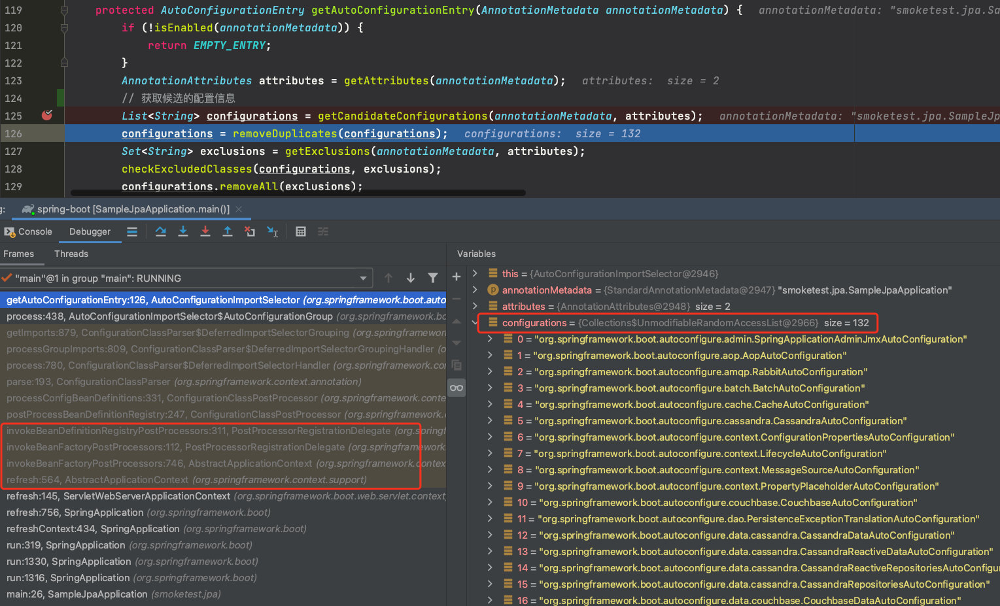
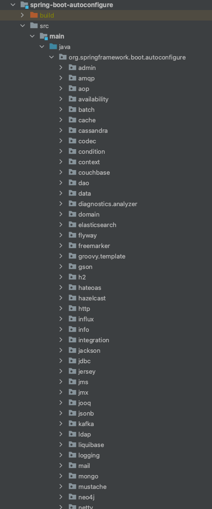
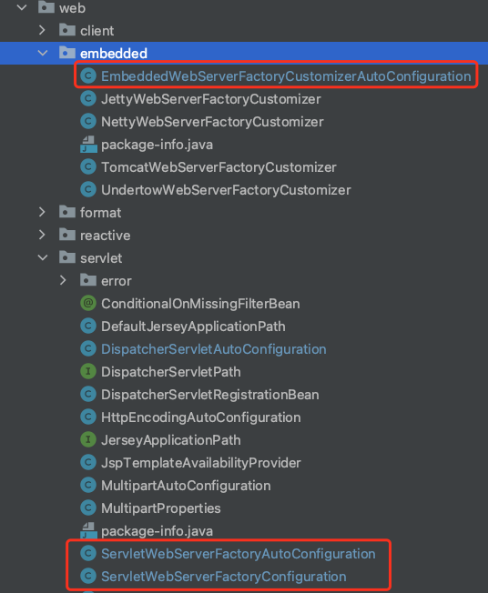

[TOC]

## Spring Boot源码分析

#### @SpringBootApplication注解

@SpringBootApplication 用于标注程序**主启动类**。

```java
@SpringBootApplication
public class NanoApplication {
    public static void main(String[] args) {
        SpringApplication.run(NanoApplication.class,args);
    }
}
```

**@SpringBootApplication** 源码如下：

```java
@Target(ElementType.TYPE)
@Retention(RetentionPolicy.RUNTIME)
@Documented
@Inherited
// 配置类
@SpringBootConfiguration
// 开启自动配置!!!
@EnableAutoConfiguration
// 配置包扫描规则
@ComponentScan(excludeFilters = { @Filter(type = FilterType.CUSTOM, classes = TypeExcludeFilter.class),
		@Filter(type = FilterType.CUSTOM, classes = AutoConfigurationExcludeFilter.class) })
public @interface SpringBootApplication {

	@AliasFor(annotation = EnableAutoConfiguration.class)
	Class<?>[] exclude() default {};

	@AliasFor(annotation = EnableAutoConfiguration.class)
	String[] excludeName() default {};

	@AliasFor(annotation = ComponentScan.class, attribute = "basePackages")
	String[] scanBasePackages() default {};

	@AliasFor(annotation = ComponentScan.class, attribute = "basePackageClasses")
	Class<?>[] scanBasePackageClasses() default {};

	@AliasFor(annotation = ComponentScan.class, attribute = "nameGenerator")
	Class<? extends BeanNameGenerator> nameGenerator() default BeanNameGenerator.class;

	@AliasFor(annotation = Configuration.class)
	boolean proxyBeanMethods() default true;

}
```

@SpringBootApplication 注解其实包含了三个注解。

- @**SpringBootConfiguration**：表示这是一个 Spring Boot 的**配置类**。

- @**ComponentScan**：定义包扫描信息。

- @**EnableAutoConfiguration**：开启**自动配置**功能。

##### 1.@SpringBootConfiguration

**@SpringBootConfiguration** 源码如下：

```java
package org.springframework.boot;
@Target(ElementType.TYPE)
@Retention(RetentionPolicy.RUNTIME)
@Documented
@Configuration
public @interface SpringBootConfiguration {

}
```

**@Configuration**：表明该类为一个配置类。

##### 2.@ComponentScan

@ComponentScan 注解配置包扫描，这里配置了不加载的 bean 信息，除此之外就会扫描加载主启动类所在包及其子包中的 bean。

```java
@ComponentScan(excludeFilters = {
		@Filter(type = FilterType.CUSTOM, classes = TypeExcludeFilter.class),
		@Filter(type = FilterType.CUSTOM, classes = AutoConfigurationExcludeFilter.class) })
```

##### 3.@EnableAutoConfiguration自动装配

###### (1)源码分析

@EnableAutoConfiguration 注解开启了**==自动装配==**功能。源码如下：

```java
@Target(ElementType.TYPE)
@Retention(RetentionPolicy.RUNTIME)
@Documented
@Inherited
@AutoConfigurationPackage
// 往容器导入组件!!!!进去看看
@Import(AutoConfigurationImportSelector.class)
public @interface EnableAutoConfiguration {

	String ENABLED_OVERRIDE_PROPERTY = "spring.boot.enableautoconfiguration";

	Class<?>[] exclude() default {};

	String[] excludeName() default {};

}
```

可以看到，这里用了 **@Import 注解**往容器导入了一个组件，也就是 **AutoConfigurationImportSelector** 类。在 Spring 基础中有分析到，**@Import 注解配合 ImportSelector 接口**可以实现对 bean 组件的导入。

这里 AutoConfigurationImportSelector 类就实现了 **ImportSelector** 接口，重点看看这个接口的 **selectImports() 方法**的实现，源码如下。

> **AutoConfigurationImportSelector::selectImports()**

```java
@Override
public String[] selectImports(AnnotationMetadata annotationMetadata) {
    if (!isEnabled(annotationMetadata)) {
        return NO_IMPORTS;
    }
    // 获取配置信息
    AutoConfigurationEntry autoConfigurationEntry = getAutoConfigurationEntry(annotationMetadata);
    return StringUtils.toStringArray(autoConfigurationEntry.getConfigurations());
}
```

继续看获取配置信息的方法：

> **AutoConfigurationImportSelector::getAutoConfigurationEntry()**

```java
protected AutoConfigurationEntry getAutoConfigurationEntry(AnnotationMetadata annotationMetadata) {
    if (!isEnabled(annotationMetadata)) {
        return EMPTY_ENTRY;
    }
    AnnotationAttributes attributes = getAttributes(annotationMetadata);
    // 获取候选的配置信息
    List<String> configurations = getCandidateConfigurations(annotationMetadata, attributes);
    configurations = removeDuplicates(configurations);
    Set<String> exclusions = getExclusions(annotationMetadata, attributes);
    checkExcludedClasses(configurations, exclusions);
    configurations.removeAll(exclusions);
    configurations = getConfigurationClassFilter().filter(configurations);
    fireAutoConfigurationImportEvents(configurations, exclusions);
    return new AutoConfigurationEntry(configurations, exclusions);
}
```

获取看看获取候选的配置信息的 getCandidateConfigurations() 方法。

> **AutoConfigurationImportSelector::getCandidateConfigurations()**

```java
protected List<String> getCandidateConfigurations(AnnotationMetadata metadata, AnnotationAttributes attributes) {
    // 1.加载自动装配的类，从META-INF/spring.factories文件中找!!!
    List<String> configurations = SpringFactoriesLoader.loadFactoryNames(getSpringFactoriesLoaderFactoryClass(),
                                                                         getBeanClassLoader());
    // 2.抛异常：没有在META-INF/spring.factories下找到配置类!!!
    Assert.notEmpty(configurations, "No auto configuration classes found in META-INF/spring.factories. If you "
                    + "are using a custom packaging, make sure that file is correct.");
    return configurations;
}
```

这里会**在导入的 jar 包下的 ==META-INFO/spring.factories== 文件中查找 key 为 ==EnableAutoConfiguration== 的值集合，这些就是可以自动装配的类**!!!!!!

断点调试一下，可以看到 getAutoConfigurationEntry() 这个方法的调用链如下。这里就是会在 refresh() 方法中执行到 invokeBeanFactoryPostProcessors() 方法，并执行到 postProcessBeanDefinitionRegistry() 方法，接着执行到 **ConfigurationClassParser::doProcessConfigurationClass()** 方法，在这个方法中实现对配置类中各种注解的解析，其中就包含 @Import 注解(详细流程参考 refresh() 方法中的 invokeBeanFactoryPostProcessors() 方法)。

处理 @Import 注解时，会调用 **ImportSelector** 接口实现类的 **selectImports**() 方法实现 **bean 的导入**，这里就是 Spring Boot 实现自动装配的方法。



可以看到这里找出了 132 个配置类。

整个流程图示如下，编辑地址：https://www.processon.com/diagraming/621b8ce1e0b34d34c37bae47


通过上面的分析可知，Spring Boot 会**在导入的 jar 包下的 META-INFO/spring.factories 文件中查找 key 为 EnableAutoConfiguration 的值集合，这些就是可以自动装配的类。并根据依赖来筛选需要导入的配置类**。

这里看看重要的项目：**==spring-boot-autoconfigure==** 的 **META-INFO/spring.factories 文件**。可以找到其中 key 为 **==EnableAutoConfiguration==** 的配置如下，其对应的值有很多，所以这里导入了很多自动配置类。自动配置类一般为 **xxxAutoConfiguration**，它可以往容器中导入这个场景需要的所有组件，并配置好这些组件。

```properties
# Auto Configure!!!!!自动配置类!!!!!很多常见的中间件的
org.springframework.boot.autoconfigure.EnableAutoConfiguration=\
org.springframework.boot.autoconfigure.admin.SpringApplicationAdminJmxAutoConfiguration,\
org.springframework.boot.autoconfigure.aop.AopAutoConfiguration,\
org.springframework.boot.autoconfigure.amqp.RabbitAutoConfiguration,\
org.springframework.boot.autoconfigure.batch.BatchAutoConfiguration,\
org.springframework.boot.autoconfigure.cache.CacheAutoConfiguration,\
org.springframework.boot.autoconfigure.cassandra.CassandraAutoConfiguration,\
org.springframework.boot.autoconfigure.context.ConfigurationPropertiesAutoConfiguration,\
org.springframework.boot.autoconfigure.context.LifecycleAutoConfiguration,\
org.springframework.boot.autoconfigure.context.MessageSourceAutoConfiguration,\
org.springframework.boot.autoconfigure.context.PropertyPlaceholderAutoConfiguration,\
org.springframework.boot.autoconfigure.couchbase.CouchbaseAutoConfiguration,\
org.springframework.boot.autoconfigure.dao.PersistenceExceptionTranslationAutoConfiguration,\
org.springframework.boot.autoconfigure.data.cassandra.CassandraDataAutoConfiguration,\
org.springframework.boot.autoconfigure.data.cassandra.CassandraReactiveDataAutoConfiguration,\
org.springframework.boot.autoconfigure.data.cassandra.CassandraReactiveRepositoriesAutoConfiguration,\
org.springframework.boot.autoconfigure.data.cassandra.CassandraRepositoriesAutoConfiguration,\
org.springframework.boot.autoconfigure.data.couchbase.CouchbaseDataAutoConfiguration,\
org.springframework.boot.autoconfigure.data.couchbase.CouchbaseReactiveDataAutoConfiguration,\
org.springframework.boot.autoconfigure.data.couchbase.CouchbaseReactiveRepositoriesAutoConfiguration,\
org.springframework.boot.autoconfigure.data.couchbase.CouchbaseRepositoriesAutoConfiguration,\
org.springframework.boot.autoconfigure.data.elasticsearch.ElasticsearchDataAutoConfiguration,\
org.springframework.boot.autoconfigure.data.elasticsearch.ElasticsearchRepositoriesAutoConfiguration,\
org.springframework.boot.autoconfigure.data.elasticsearch.ReactiveElasticsearchRepositoriesAutoConfiguration,\
org.springframework.boot.autoconfigure.data.elasticsearch.ReactiveElasticsearchRestClientAutoConfiguration,\
org.springframework.boot.autoconfigure.data.jdbc.JdbcRepositoriesAutoConfiguration,\
org.springframework.boot.autoconfigure.data.jpa.JpaRepositoriesAutoConfiguration,\
org.springframework.boot.autoconfigure.data.ldap.LdapRepositoriesAutoConfiguration,\
org.springframework.boot.autoconfigure.data.mongo.MongoDataAutoConfiguration,\
org.springframework.boot.autoconfigure.data.mongo.MongoReactiveDataAutoConfiguration,\
org.springframework.boot.autoconfigure.data.mongo.MongoReactiveRepositoriesAutoConfiguration,\
org.springframework.boot.autoconfigure.data.mongo.MongoRepositoriesAutoConfiguration,\
org.springframework.boot.autoconfigure.data.neo4j.Neo4jDataAutoConfiguration,\
org.springframework.boot.autoconfigure.data.neo4j.Neo4jReactiveDataAutoConfiguration,\
org.springframework.boot.autoconfigure.data.neo4j.Neo4jReactiveRepositoriesAutoConfiguration,\
org.springframework.boot.autoconfigure.data.neo4j.Neo4jRepositoriesAutoConfiguration,\
org.springframework.boot.autoconfigure.data.r2dbc.R2dbcDataAutoConfiguration,\
org.springframework.boot.autoconfigure.data.r2dbc.R2dbcRepositoriesAutoConfiguration,\
org.springframework.boot.autoconfigure.data.redis.RedisAutoConfiguration,\
org.springframework.boot.autoconfigure.data.redis.RedisReactiveAutoConfiguration,\
org.springframework.boot.autoconfigure.data.redis.RedisRepositoriesAutoConfiguration,\
org.springframework.boot.autoconfigure.data.rest.RepositoryRestMvcAutoConfiguration,\
org.springframework.boot.autoconfigure.data.web.SpringDataWebAutoConfiguration,\
org.springframework.boot.autoconfigure.elasticsearch.ElasticsearchRestClientAutoConfiguration,\
org.springframework.boot.autoconfigure.flyway.FlywayAutoConfiguration,\
org.springframework.boot.autoconfigure.freemarker.FreeMarkerAutoConfiguration,\
org.springframework.boot.autoconfigure.groovy.template.GroovyTemplateAutoConfiguration,\
org.springframework.boot.autoconfigure.gson.GsonAutoConfiguration,\
org.springframework.boot.autoconfigure.h2.H2ConsoleAutoConfiguration,\
org.springframework.boot.autoconfigure.hateoas.HypermediaAutoConfiguration,\
org.springframework.boot.autoconfigure.hazelcast.HazelcastAutoConfiguration,\
org.springframework.boot.autoconfigure.hazelcast.HazelcastJpaDependencyAutoConfiguration,\
org.springframework.boot.autoconfigure.http.HttpMessageConvertersAutoConfiguration,\
org.springframework.boot.autoconfigure.http.codec.CodecsAutoConfiguration,\
org.springframework.boot.autoconfigure.influx.InfluxDbAutoConfiguration,\
org.springframework.boot.autoconfigure.info.ProjectInfoAutoConfiguration,\
org.springframework.boot.autoconfigure.integration.IntegrationAutoConfiguration,\
org.springframework.boot.autoconfigure.jackson.JacksonAutoConfiguration,\
org.springframework.boot.autoconfigure.jdbc.DataSourceAutoConfiguration,\
org.springframework.boot.autoconfigure.jdbc.JdbcTemplateAutoConfiguration,\
org.springframework.boot.autoconfigure.jdbc.JndiDataSourceAutoConfiguration,\
org.springframework.boot.autoconfigure.jdbc.XADataSourceAutoConfiguration,\
org.springframework.boot.autoconfigure.jdbc.DataSourceTransactionManagerAutoConfiguration,\
org.springframework.boot.autoconfigure.jms.JmsAutoConfiguration,\
org.springframework.boot.autoconfigure.jmx.JmxAutoConfiguration,\
org.springframework.boot.autoconfigure.jms.JndiConnectionFactoryAutoConfiguration,\
org.springframework.boot.autoconfigure.jms.activemq.ActiveMQAutoConfiguration,\
org.springframework.boot.autoconfigure.jms.artemis.ArtemisAutoConfiguration,\
org.springframework.boot.autoconfigure.jersey.JerseyAutoConfiguration,\
org.springframework.boot.autoconfigure.jooq.JooqAutoConfiguration,\
org.springframework.boot.autoconfigure.jsonb.JsonbAutoConfiguration,\
org.springframework.boot.autoconfigure.kafka.KafkaAutoConfiguration,\
org.springframework.boot.autoconfigure.availability.ApplicationAvailabilityAutoConfiguration,\
org.springframework.boot.autoconfigure.ldap.embedded.EmbeddedLdapAutoConfiguration,\
org.springframework.boot.autoconfigure.ldap.LdapAutoConfiguration,\
org.springframework.boot.autoconfigure.liquibase.LiquibaseAutoConfiguration,\
org.springframework.boot.autoconfigure.mail.MailSenderAutoConfiguration,\
org.springframework.boot.autoconfigure.mail.MailSenderValidatorAutoConfiguration,\
org.springframework.boot.autoconfigure.mongo.embedded.EmbeddedMongoAutoConfiguration,\
org.springframework.boot.autoconfigure.mongo.MongoAutoConfiguration,\
org.springframework.boot.autoconfigure.mongo.MongoReactiveAutoConfiguration,\
org.springframework.boot.autoconfigure.mustache.MustacheAutoConfiguration,\
org.springframework.boot.autoconfigure.neo4j.Neo4jAutoConfiguration,\
org.springframework.boot.autoconfigure.netty.NettyAutoConfiguration,\
org.springframework.boot.autoconfigure.orm.jpa.HibernateJpaAutoConfiguration,\
org.springframework.boot.autoconfigure.quartz.QuartzAutoConfiguration,\
org.springframework.boot.autoconfigure.r2dbc.R2dbcAutoConfiguration,\
org.springframework.boot.autoconfigure.r2dbc.R2dbcTransactionManagerAutoConfiguration,\
org.springframework.boot.autoconfigure.rsocket.RSocketMessagingAutoConfiguration,\
org.springframework.boot.autoconfigure.rsocket.RSocketRequesterAutoConfiguration,\
org.springframework.boot.autoconfigure.rsocket.RSocketServerAutoConfiguration,\
org.springframework.boot.autoconfigure.rsocket.RSocketStrategiesAutoConfiguration,\
org.springframework.boot.autoconfigure.security.servlet.SecurityAutoConfiguration,\
org.springframework.boot.autoconfigure.security.servlet.UserDetailsServiceAutoConfiguration,\
org.springframework.boot.autoconfigure.security.servlet.SecurityFilterAutoConfiguration,\
org.springframework.boot.autoconfigure.security.reactive.ReactiveSecurityAutoConfiguration,\
org.springframework.boot.autoconfigure.security.reactive.ReactiveUserDetailsServiceAutoConfiguration,\
org.springframework.boot.autoconfigure.security.rsocket.RSocketSecurityAutoConfiguration,\
org.springframework.boot.autoconfigure.security.saml2.Saml2RelyingPartyAutoConfiguration,\
org.springframework.boot.autoconfigure.sendgrid.SendGridAutoConfiguration,\
org.springframework.boot.autoconfigure.session.SessionAutoConfiguration,\
org.springframework.boot.autoconfigure.security.oauth2.client.servlet.OAuth2ClientAutoConfiguration,\
org.springframework.boot.autoconfigure.security.oauth2.client.reactive.ReactiveOAuth2ClientAutoConfiguration,\
org.springframework.boot.autoconfigure.security.oauth2.resource.servlet.OAuth2ResourceServerAutoConfiguration,\
org.springframework.boot.autoconfigure.security.oauth2.resource.reactive.ReactiveOAuth2ResourceServerAutoConfiguration,\
org.springframework.boot.autoconfigure.solr.SolrAutoConfiguration,\
org.springframework.boot.autoconfigure.sql.init.SqlInitializationAutoConfiguration,\
org.springframework.boot.autoconfigure.task.TaskExecutionAutoConfiguration,\
org.springframework.boot.autoconfigure.task.TaskSchedulingAutoConfiguration,\
org.springframework.boot.autoconfigure.thymeleaf.ThymeleafAutoConfiguration,\
org.springframework.boot.autoconfigure.transaction.TransactionAutoConfiguration,\
org.springframework.boot.autoconfigure.transaction.jta.JtaAutoConfiguration,\
org.springframework.boot.autoconfigure.validation.ValidationAutoConfiguration,\
org.springframework.boot.autoconfigure.web.client.RestTemplateAutoConfiguration,\
org.springframework.boot.autoconfigure.web.embedded.EmbeddedWebServerFactoryCustomizerAutoConfiguration,\
org.springframework.boot.autoconfigure.web.reactive.HttpHandlerAutoConfiguration,\
org.springframework.boot.autoconfigure.web.reactive.ReactiveMultipartAutoConfiguration,\
org.springframework.boot.autoconfigure.web.reactive.ReactiveWebServerFactoryAutoConfiguration,\
org.springframework.boot.autoconfigure.web.reactive.WebFluxAutoConfiguration,\
org.springframework.boot.autoconfigure.web.reactive.error.ErrorWebFluxAutoConfiguration,\
org.springframework.boot.autoconfigure.web.reactive.function.client.ClientHttpConnectorAutoConfiguration,\
org.springframework.boot.autoconfigure.web.reactive.function.client.WebClientAutoConfiguration,\
org.springframework.boot.autoconfigure.web.servlet.DispatcherServletAutoConfiguration,\
org.springframework.boot.autoconfigure.web.servlet.ServletWebServerFactoryAutoConfiguration,\
org.springframework.boot.autoconfigure.web.servlet.error.ErrorMvcAutoConfiguration,\
org.springframework.boot.autoconfigure.web.servlet.HttpEncodingAutoConfiguration,\
org.springframework.boot.autoconfigure.web.servlet.MultipartAutoConfiguration,\
org.springframework.boot.autoconfigure.web.servlet.WebMvcAutoConfiguration,\
org.springframework.boot.autoconfigure.websocket.reactive.WebSocketReactiveAutoConfiguration,\
org.springframework.boot.autoconfigure.websocket.servlet.WebSocketServletAutoConfiguration,\
org.springframework.boot.autoconfigure.websocket.servlet.WebSocketMessagingAutoConfiguration,\
org.springframework.boot.autoconfigure.webservices.WebServicesAutoConfiguration,\
org.springframework.boot.autoconfigure.webservices.client.WebServiceTemplateAutoConfiguration
```

**注意**：虽然上面的自动配置类会被加载到容器中，但是在各个配置类中具体配置的各个 bean 一般还会做进一步筛选，这里一般操作方式是通过各种==**条件装配注解、依赖信息、配置文件中的属性**==来进一步确定哪些组件需要被自动加载。比如**如果在配置文件中配置了某个属性值，就有可能会命中自动配置类中的条件装配条件，实现对特定组件的加载**。

###### (2)自动装配实例

上面的分析可知 Spring Boot 实现了许多组件的自动配置，以其中的 **RedisAutoConfiguration** 配置类为例看看。

> **RedisAutoConfiguration类**

```java
@Configuration(proxyBeanMethods = false)
// 存在RedisOperations时才装配
@ConditionalOnClass(RedisOperations.class)
// Redis属性配置
@EnableConfigurationProperties(RedisProperties.class)
// 导入组件
@Import({ LettuceConnectionConfiguration.class, JedisConnectionConfiguration.class })
public class RedisAutoConfiguration {

	@Bean
	// 当有redisTemplate的bean时就不会装配
	@ConditionalOnMissingBean(name = "redisTemplate")
	@ConditionalOnSingleCandidate(RedisConnectionFactory.class)
	public RedisTemplate<Object, Object> redisTemplate(RedisConnectionFactory redisConnectionFactory) {
		RedisTemplate<Object, Object> template = new RedisTemplate<>();
		template.setConnectionFactory(redisConnectionFactory);
		return template;
	}

	@Bean
	@ConditionalOnMissingBean
	@ConditionalOnSingleCandidate(RedisConnectionFactory.class)
	public StringRedisTemplate stringRedisTemplate(RedisConnectionFactory redisConnectionFactory) {
		StringRedisTemplate template = new StringRedisTemplate();
		template.setConnectionFactory(redisConnectionFactory);
		return template;
	}
}
```

这里有几点需要注意：

- @ConditionalOnClass(RedisOperations.class) 表明需要存在 RedisOperations.class 时这个配置类才生效。这是因为上面的 **spring-boot-autoconfigure** 的 META-INFO/spring.factories 文件中引入了贼多自动配置类，但是有很多都不是当前需要的，只有配置了依赖的这里才会需要，否则就会过滤掉了。
- 导入了 JedisConnectionConfiguration 组件，该组件导入了 JedisConnectionFactory 的 Redis 连接池相关组件。
- @ConditionalOnMissingBean(name = "redisTemplate") 表明当容器中存在 redisTemplate 的 bean 时，就不会装配这个 bean，这个操作的精妙之处在于，**如果自己定义了 redisTemplate 对象，那就用自己定义的；如果没有定义就用默认的**。

再看看 **HttpEncodingAutoConfiguration(Http 编码自动配置)**配置类。

> **HttpEncodingAutoConfiguration类**

```java
@Configuration   
// 启动指定类的ConfigurationProperties功能；将配置文件中对应的值和HttpEncodingProperties绑定起来；并把HttpEncodingProperties加入到IOC容器中
@EnableConfigurationProperties(HttpEncodingProperties.class)  
// 判断当前应用是否是web应用，如果是，当前配置类生效
@ConditionalOnWebApplication 
// 判断当前项目有没有这个类CharacterEncodingFilter；SpringMVC中进行乱码解决的过滤器；
@ConditionalOnClass(CharacterEncodingFilter.class)  
// 判断配置文件中是否存在某个配置 spring.http.encoding.enabled；如果不存在，判断也是成立的
// 即使我们配置文件中不配置pring.http.encoding.enabled=true，也是默认生效的；
@ConditionalOnProperty(prefix = "spring.http.encoding", value = "enabled", matchIfMissing = true)  
public class HttpEncodingAutoConfiguration {

    // 已经和SpringBoot的配置文件映射了
    private final HttpEncodingProperties properties;

    // 只有一个有参构造器的情况下，参数值就会从容器中拿，上面已有一个条件装配，保证容器中必有这个类
    public HttpEncodingAutoConfiguration(HttpEncodingProperties properties) {
        this.properties = properties;
    }

    // 给容器中添加一个组件，这个组件的某些值需要从properties中获取
    @Bean   
    @ConditionalOnMissingBean(CharacterEncodingFilter.class) // 判断容器没有这个组件
    public CharacterEncodingFilter characterEncodingFilter() {
        CharacterEncodingFilter filter = new OrderedCharacterEncodingFilter();
        filter.setEncoding(this.properties.getCharset().name());
        filter.setForceRequestEncoding(this.properties.shouldForce(Type.REQUEST));
        filter.setForceResponseEncoding(this.properties.shouldForce(Type.RESPONSE));
        return filter;
    }
    
    @Bean
    public HttpEncodingAutoConfiguration.LocaleCharsetMappingsCustomizer localeCharsetMappingsCustomizer() {
        return new HttpEncodingAutoConfiguration.
            LocaleCharsetMappingsCustomizer(this.properties);
    }
    //...
}
```

一但这个配置类生效；这个配置类就会给容器中**添加各种组件**；这些组件的属性是从对应的 **properties 配置文件**中获取的，这些类里面的每一个属性又是和配置文件绑定的。所有在配置文件中能配置的**属性都是在 xxxxProperties 类中封装**，配置文件能配置什么就可以参照某个功能对应的这个属性类。

```java
// 从配置文件中获取指定的值和bean的属性进行绑定
@ConfigurationProperties(prefix = "spring.http.encoding")  
public class HttpEncodingProperties {
    public static final Charset DEFAULT_CHARSET = Charset.forName("UTF-8");
    //...
}
```

#### 自定义Starter

需要自己定义 META-INFO/spring.factories 文件，指定自动配置类。

#### Spring Boot启动流程分析

```java
@SpringBootApplication
public class SampleJpaApplication {

	public static void main(String[] args) {
		SpringApplication.run(SampleJpaApplication.class, args);
	}

}
```

前面分析了 @SpringBootApplication 注解是如何实现自动装配的，这里分析一下 **SpringApplication.run**() 方法。

> **SpringApplication.run**()

```java
public static ConfigurableApplicationContext run(Class<?> primarySource, String... args) {
    return run(new Class<?>[] { primarySource }, args);
}
```

```java
public static ConfigurableApplicationContext run(Class<?>[] primarySources, String[] args) {

    // 1.先看构造方法
    // 2.再看run()方法
    return new SpringApplication(primarySources).run(args);
}
```

先看看构造方法如下，这里就是去环境中找各种需要的资源。

> **SpringApplication构造方法**

```java
public SpringApplication(ResourceLoader resourceLoader, Class<?>... primarySources) {
    // 资源加载器
    this.resourceLoader = resourceLoader;
    Assert.notNull(primarySources, "PrimarySources must not be null");
    this.primarySources = new LinkedHashSet<>(Arrays.asList(primarySources));
    // 推断web容器的类型
    this.webApplicationType = WebApplicationType.deduceFromClasspath();
    this.bootstrapRegistryInitializers = new ArrayList<>(
        getSpringFactoriesInstances(BootstrapRegistryInitializer.class));
    // 设置初始化器: 这里就是去spring.factories文件中找配置的ApplicationContextInitializer类型的对象!!!
    setInitializers((Collection) getSpringFactoriesInstances(ApplicationContextInitializer.class));
    // 设置监听器: 这里就是去spring.factories文件中找配置的ApplicationListener类型的对象!!!
    setListeners((Collection) getSpringFactoriesInstances(ApplicationListener.class));
    // 推断启动类
    this.mainApplicationClass = deduceMainApplicationClass();
}
```

**==getSpringFactoriesInstances() 方法==**就是去**各个 jar 包**下面找**不同类型的配置信息**。这里在获取初始化器和监听器的时候，会去 **spring.factories** 文件中找配置的 key 为 ApplicationContextInitializer 和 ApplicationListener 的对象！这与自动装配道理是相同的，自动装配是去寻找 key 为 EnableAutoConfiguration 的配置属性！

然后看看 **run()** 方法。

> **SpringApplication::run()**

```java
public ConfigurableApplicationContext run(String... args) {
    // 停表 用于监控启动时长
    StopWatch stopWatch = new StopWatch();
    stopWatch.start();

    DefaultBootstrapContext bootstrapContext = createBootstrapContext();

    // 1.可配置的应用上下文
    ConfigurableApplicationContext context = null;
    configureHeadlessProperty();
    // 2.监听器 监听启动事件
    SpringApplicationRunListeners listeners = getRunListeners(args);
    listeners.starting(bootstrapContext, this.mainApplicationClass);
    try {
        // 3.通过启动参数生成应用参数
        ApplicationArguments applicationArguments = new DefaultApplicationArguments(args);
        // 4.准备可配置的环境，在ApplicationContext中使用此环境
        ConfigurableEnvironment environment = prepareEnvironment(listeners, bootstrapContext, applicationArguments);
        // 5.从环境中获取spring.beaninfo.ignore并配置
        configureIgnoreBeanInfo(environment);
        // 6.打印启动时的横幅
        Banner printedBanner = printBanner(environment);
        // 7.创建ApplicationContext
        context = createApplicationContext();
        context.setApplicationStartup(this.applicationStartup);
        // 8.准备ApplicationContext，包括设置环境、注册一些必要的组件等
        prepareContext(bootstrapContext, context, environment, listeners, applicationArguments, printedBanner);

        // 9.核心：执行context的refresh()方法 初始化启动ApplicationContext!!!!!!
        refreshContext(context);
        // 10.执行refresh()方法后的其他方法
        afterRefresh(context, applicationArguments);
        // 11.停止停表
        stopWatch.stop();
        // 12.打印启动日志
        if (this.logStartupInfo) {
            new StartupInfoLogger(this.mainApplicationClass).logStarted(getApplicationLog(), stopWatch);
        }
        // 13.调用启动完成的事件回调
        listeners.started(context);
        // 14.从应用上下文获取ApplicationRunner和CommandLineRunner类型的Bean并调用他们的run方法
        callRunners(context, applicationArguments);
    }
    catch (Throwable ex) {
        // 失败时调用必要的逻辑 失败分析报告器就用在这里
        handleRunFailure(context, ex, listeners);
        throw new IllegalStateException(ex);
    }

    try {
        // 15.正常启动，调用运行中事件回调
        listeners.running(context);
    }
    catch (Throwable ex) {
        handleRunFailure(context, ex, null);
        throw new IllegalStateException(ex);
    }
    // 返回创建的ApplicationContext
    return context;
}
```

##### 1.createApplicationContext()

createApplicationContext() 方法用于创建 ApplicationContext。

> **SpringApplication::createApplicationContext()**

```java
protected ConfigurableApplicationContext createApplicationContext() {
    // 进去 看ApplicationContextFactory的实现
    return this.applicationContextFactory.create(this.webApplicationType);
}
```

这里实现类是 ApplicationContextFactory 接口中的默认方法。

> **ApplicationContextFactory接口的默认方法**

```java
ApplicationContextFactory DEFAULT = (webApplicationType) -> {
    try {
        // 根据Web环境类型
        switch (webApplicationType) {
                // 这里返回的是这个容器
            case SERVLET:
                return new AnnotationConfigServletWebServerApplicationContext();
            case REACTIVE:
                return new AnnotationConfigReactiveWebServerApplicationContext();
            default:
                return new AnnotationConfigApplicationContext();
        }
    }
    catch (Exception ex) {
        throw new IllegalStateException("Unable create a default ApplicationContext instance, "
                                        + "you may need a custom ApplicationContextFactory", ex);
    }
};
```

这里根据环境类型创建不同的 ApplicationContext。对于 SERVLET 环境则使用的是 **AnnotationConfigServletWebServerApplicationContext**。AnnotationConfigServletWebServerApplicationContext 继承了 **ServletWebServerApplicationContext**。

##### 2.refreshContext(context)

这里就是核心方法，去初始化 IOC 容器。 

> **SpringApplication::refreshContext()**

```java
private void refreshContext(ConfigurableApplicationContext context) {
    if (this.registerShutdownHook) {
        shutdownHook.registerApplicationContext(context);
    }
    // 使用了Spring的refresh()方法
    refresh(context);
}
```

> **SpringApplication::refresh()**

```java
protected void refresh(ConfigurableApplicationContext applicationContext) {
    applicationContext.refresh();
}
```

这里看看实现类 **ServletWebServerApplicationContext** 的 refresh() 方法。

> **ServletWebServerApplicationContext::refresh()**

```java
@Override
public final void refresh() throws BeansException, IllegalStateException {
    try {
        // 调用父类的refresh()方法
        super.refresh();
    }
    catch (RuntimeException ex) {
        WebServer webServer = this.webServer;
        if (webServer != null) {
            webServer.stop();
        }
        throw ex;
    }
}
```

这里调用了 **AbstractApplicationContext 的 refresh() 方法** 进行容器的启动!!!!!

然后在 **AbstractApplicationContext 的 refresh() 方法** 中，有一个留给子类实现的 **onRefresh**() 方法。ServletWebServerApplicationContext 覆写该方法后实现了内嵌 Tomcat 容器的加载，参考上面的分析！具体参考下面的 Tomcat 启动流程分析。

注意：加载 Tomcat 是在 **onRefresh**() 方法中，这先于 finishBeanFactoryInitialization(beanFactory) 执行，所以此时 IOC 容器**还没创建完成**！

#### Spring Boot启动内嵌Tomcat原理

##### 1.ServletWebServerFactory

**ServletWebServerFactory** 是产生内嵌 Web 容器的工厂接口，其源码如下：

```java
@FunctionalInterface
public interface ServletWebServerFactory {
    
	WebServer getWebServer(ServletContextInitializer... initializers);
}
```

这里就一个生成 WebServer 的方法。

下面分析一下 Spring Boot 是**如何生成内嵌的 Tomcat 服务器**的。Spring Boot 自动装配的重要项目是 **spring-boot-autoconfigure**，各种技术的自动装配相关的几乎都在里面，如下图所示。



看看其 web 包下的 **embeded** 包，这里就有内嵌服务器的**自动配置**相关的类。



可见 Spring Boot 生成内嵌 Tomcat 服务器的相关字段配置类就在 web 包下，这里分析几个关键的配置类。

###### (1)ServletWebServerFactoryConfiguration

首先看看 ServletWebServerFactoryConfiguration 配置类，源码如下。

> **ServletWebServerFactoryConfiguration类**

```java
@Configuration(proxyBeanMethods = false)
class ServletWebServerFactoryConfiguration {

    // 配置类
    @Configuration(proxyBeanMethods = false)
    // 条件装配,存在Servlet、Tomcat和UpgradeProtocol时才装配
    @ConditionalOnClass({ Servlet.class, Tomcat.class, UpgradeProtocol.class })
    // 在当前BeanFactory中找不到ServletWebServerFactory类型的bean时才创建
    @ConditionalOnMissingBean(value = ServletWebServerFactory.class, search = SearchStrategy.CURRENT)
    static class EmbeddedTomcat {

        /** 注入TomcatServletWebServerFactory */
        @Bean
        TomcatServletWebServerFactory tomcatServletWebServerFactory(
            ObjectProvider<TomcatConnectorCustomizer> connectorCustomizers,
            ObjectProvider<TomcatContextCustomizer> contextCustomizers,
            ObjectProvider<TomcatProtocolHandlerCustomizer<?>> protocolHandlerCustomizers) {

            // new一个Factory
            TomcatServletWebServerFactory factory = new TomcatServletWebServerFactory();
            factory.getTomcatConnectorCustomizers()
                .addAll(connectorCustomizers.orderedStream().collect(Collectors.toList()));
            factory.getTomcatContextCustomizers()
                .addAll(contextCustomizers.orderedStream().collect(Collectors.toList()));
            factory.getTomcatProtocolHandlerCustomizers()
                .addAll(protocolHandlerCustomizers.orderedStream().collect(Collectors.toList()));
            return factory;
        }
    }
    
    // 省略配置其他容器的代码
}
```

这里可以往容器中注入 TomcatServletWebServerFactory 工厂，通过其工厂方法可以用于生成 Tomcat 服务器实例。

###### (2)EmbeddedWebServerFactoryCustomizerAutoConfiguration

这个配置类引入了 TomcatWebServerFactoryCustomizer 类，它实现了 WebServerFactoryCustomizer 接口，是一种 **WebServerFactory 的定制器**。

> **EmbeddedWebServerFactoryCustomizerAutoConfiguration类**

```java
@Configuration(proxyBeanMethods = false)
@ConditionalOnWebApplication
@EnableConfigurationProperties(ServerProperties.class)
public class EmbeddedWebServerFactoryCustomizerAutoConfiguration {

	/**
	 * 默认Tomcat的
	 * Nested configuration if Tomcat is being used.
	 */
	@Configuration(proxyBeanMethods = false)
	@ConditionalOnClass({ Tomcat.class, UpgradeProtocol.class })
	public static class TomcatWebServerFactoryCustomizerConfiguration {

		@Bean
		public TomcatWebServerFactoryCustomizer tomcatWebServerFactoryCustomizer(Environment environment,
				ServerProperties serverProperties) {
			return new TomcatWebServerFactoryCustomizer(environment, serverProperties);
		}

	}
    
    // 省略配置其他容器的代码
}
```

这里需要有 Tomcat 及 UpgradeProtocol 类才会进行装配。

###### (3)ServletWebServerFactoryAutoConfiguration

配置类 ServletWebServerFactoryAutoConfiguration 源码如下。

> **ServletWebServerFactoryAutoConfiguration类**

```java
@Configuration(proxyBeanMethods = false)
// 自动配置优先级最高
@AutoConfigureOrder(Ordered.HIGHEST_PRECEDENCE)
// ServletRequest存在时才有效
@ConditionalOnClass(ServletRequest.class)
// SERVLET环境才装配
@ConditionalOnWebApplication(type = Type.SERVLET)
// 启用ServerProperties属性的自动配置
@EnableConfigurationProperties(ServerProperties.class)
// 注入几个配置类
@Import({ ServletWebServerFactoryAutoConfiguration.BeanPostProcessorsRegistrar.class,
		// Tomcat!!!
		ServletWebServerFactoryConfiguration.EmbeddedTomcat.class,
		ServletWebServerFactoryConfiguration.EmbeddedJetty.class,
		ServletWebServerFactoryConfiguration.EmbeddedUndertow.class })
public class ServletWebServerFactoryAutoConfiguration {

	@Bean
	public ServletWebServerFactoryCustomizer servletWebServerFactoryCustomizer(ServerProperties serverProperties,
			ObjectProvider<WebListenerRegistrar> webListenerRegistrars) {
		return new ServletWebServerFactoryCustomizer(serverProperties,
				webListenerRegistrars.orderedStream().collect(Collectors.toList()));
	}

	@Bean
	@ConditionalOnClass(name = "org.apache.catalina.startup.Tomcat")
	public TomcatServletWebServerFactoryCustomizer tomcatServletWebServerFactoryCustomizer(
			ServerProperties serverProperties) {
		return new TomcatServletWebServerFactoryCustomizer(serverProperties);
	}

	@Bean
	@ConditionalOnMissingFilterBean(ForwardedHeaderFilter.class)
	@ConditionalOnProperty(value = "server.forward-headers-strategy", havingValue = "framework")
	public FilterRegistrationBean<ForwardedHeaderFilter> forwardedHeaderFilter() {
		ForwardedHeaderFilter filter = new ForwardedHeaderFilter();
		FilterRegistrationBean<ForwardedHeaderFilter> registration = new FilterRegistrationBean<>(filter);
		registration.setDispatcherTypes(DispatcherType.REQUEST, DispatcherType.ASYNC, DispatcherType.ERROR);
		registration.setOrder(Ordered.HIGHEST_PRECEDENCE);
		return registration;
	}

	/**
	 * Registers a {@link WebServerFactoryCustomizerBeanPostProcessor}. Registered via
	 * {@link ImportBeanDefinitionRegistrar} for early registration.
	 */
	public static class BeanPostProcessorsRegistrar implements ImportBeanDefinitionRegistrar, BeanFactoryAware {

		private ConfigurableListableBeanFactory beanFactory;

		@Override
		public void setBeanFactory(BeanFactory beanFactory) throws BeansException {
			if (beanFactory instanceof ConfigurableListableBeanFactory) {
				this.beanFactory = (ConfigurableListableBeanFactory) beanFactory;
			}
		}

		@Override
		public void registerBeanDefinitions(AnnotationMetadata importingClassMetadata,
				BeanDefinitionRegistry registry) {
			if (this.beanFactory == null) {
				return;
			}
			registerSyntheticBeanIfMissing(registry, "webServerFactoryCustomizerBeanPostProcessor",
					// 进去看看
					WebServerFactoryCustomizerBeanPostProcessor.class,
					WebServerFactoryCustomizerBeanPostProcessor::new);
			registerSyntheticBeanIfMissing(registry, "errorPageRegistrarBeanPostProcessor",
					ErrorPageRegistrarBeanPostProcessor.class, ErrorPageRegistrarBeanPostProcessor::new);
		}

		private <T> void registerSyntheticBeanIfMissing(BeanDefinitionRegistry registry, String name,
				Class<T> beanClass, Supplier<T> instanceSupplier) {
			if (ObjectUtils.isEmpty(this.beanFactory.getBeanNamesForType(beanClass, true, false))) {
				RootBeanDefinition beanDefinition = new RootBeanDefinition(beanClass, instanceSupplier);
				beanDefinition.setSynthetic(true);
				registry.registerBeanDefinition(name, beanDefinition);
			}
		}

	}

}
```

这个配置类首先往容器注入了几个 **WebServerFactory 的定制器**，即 ServletWebServerFactoryCustomizer、TomcatServletWebServerFactoryCustomizer。然后静态内部类 BeanPostProcessorsRegistrar 往容器中注入了一个 **WebServerFactoryCustomizerBeanPostProcessor**，也就是一个后处理器！！！源码如下。

> **WebServerFactoryCustomizerBeanPostProcessor类**

```java
public class WebServerFactoryCustomizerBeanPostProcessor implements BeanPostProcessor, BeanFactoryAware {

	private ListableBeanFactory beanFactory;

	private List<WebServerFactoryCustomizer<?>> customizers;

	@Override
	public void setBeanFactory(BeanFactory beanFactory) {
		Assert.isInstanceOf(ListableBeanFactory.class, beanFactory,
				"WebServerCustomizerBeanPostProcessor can only be used with a ListableBeanFactory");
		this.beanFactory = (ListableBeanFactory) beanFactory;
	}

	@Override
	public Object postProcessBeforeInitialization(Object bean, String beanName) throws BeansException {
		// BeanPostProcessor可以拦截所有bean的创建
		// 如果当前的bean是WebServerFactory类型的才生效!!!
		if (bean instanceof WebServerFactory) {
			postProcessBeforeInitialization((WebServerFactory) bean);
		}
		return bean;
	}

	/**
	 * 啥也没干
	 */
	@Override
	public Object postProcessAfterInitialization(Object bean, String beanName) throws BeansException {
		return bean;
	}

	@SuppressWarnings("unchecked")
	private void postProcessBeforeInitialization(WebServerFactory webServerFactory) {

		// 这里就是获取容器中的所有定制器，挨着调用定制化方法customize()去定制webServer工厂bean
		LambdaSafe.callbacks(WebServerFactoryCustomizer.class, getCustomizers(), webServerFactory)
				.withLogger(WebServerFactoryCustomizerBeanPostProcessor.class)
				  // 调用定制器的customize()方法,看看实现类：ServletWebServerFactoryCustomizer
				.invoke((customizer) -> customizer.customize(webServerFactory));
	}
    
    // 忽略...
}
```

这里 WebServerFactoryCustomizerBeanPostProcessor 实现了 BeanPostProcessor 接口，是一个后处理器，可以对所有的 bean 在创建时进行拦截。重点看看其覆写的 BeanPostProcessor 接口的 **postProcessBeforeInitialization**() 方法。这里判断了当前拦截的 bean 是否是 WebServerFactory 类型的，如果是就进行处理。看看处理方法。

> **WebServerFactoryCustomizerBeanPostProcessor::postProcessBeforeInitialization()**

```java
private void postProcessBeforeInitialization(WebServerFactory webServerFactory) {

    // 这里就是获取容器中的所有定制器，挨着调用定制化方法customize()去定制webServer工厂bean
    LambdaSafe.callbacks(WebServerFactoryCustomizer.class, getCustomizers(), webServerFactory)
        .withLogger(WebServerFactoryCustomizerBeanPostProcessor.class)
        // 调用定制器的customize()方法,看看实现类：ServletWebServerFactoryCustomizer
        .invoke((customizer) -> customizer.customize(webServerFactory));
}
```

这里就是获取容器中的所有**定制器**，包含前面自动配置的那些定制器，挨着调用定制化方法 customize() 去定制 webServer 工厂 **bean 的属性**。

看一个例子 ServletWebServerFactoryCustomizer 的 customize() 方法。

> **ServletWebServerFactoryCustomizer::customize()**

```java
@Override
public void customize(ConfigurableServletWebServerFactory factory) {

    // 这里就是读取ServerProperties中配置的各种属性 然后设置到ServerFactory中
    PropertyMapper map = PropertyMapper.get().alwaysApplyingWhenNonNull();
    // 自定义的port就是在这里配置了
    map.from(this.serverProperties::getPort).to(factory::setPort);
    map.from(this.serverProperties::getAddress).to(factory::setAddress);
    map.from(this.serverProperties.getServlet()::getContextPath).to(factory::setContextPath);
    map.from(this.serverProperties.getServlet()::getApplicationDisplayName).to(factory::setDisplayName);
    map.from(this.serverProperties.getServlet()::isRegisterDefaultServlet).to(factory::setRegisterDefaultServlet);
    map.from(this.serverProperties.getServlet()::getSession).to(factory::setSession);
    map.from(this.serverProperties::getSsl).to(factory::setSsl);
    map.from(this.serverProperties.getServlet()::getJsp).to(factory::setJsp);
    map.from(this.serverProperties::getCompression).to(factory::setCompression);
    map.from(this.serverProperties::getHttp2).to(factory::setHttp2);
    map.from(this.serverProperties::getServerHeader).to(factory::setServerHeader);
    map.from(this.serverProperties.getServlet()::getContextParameters).to(factory::setInitParameters);
    map.from(this.serverProperties.getShutdown()).to(factory::setShutdown);
    for (WebListenerRegistrar registrar : this.webListenerRegistrars) {
        registrar.register(factory);
    }
}
```

这里就会将自己在**配置文件**中定义的一些关于 WebServer 的属性设置到 WebServerFactory 工厂 bean 中，后面通过该工厂生成 WebServer 的时候就会带上自己配置的属性了。

##### 2.Tomcat启动流程

ServletWebServerApplicationContext 容器在初始化过程中，会调用 refresh() 方法来初始化容器。refresh() 方法中有一个 **onRefresh() 方法**就是留给子类实现的拓展方法。

看看 ServletWebServerApplicationContext 类覆写的 onRefresh() 方法。

> **ServletWebServerApplicationContext::onRefresh()**

```java
@Override
protected void onRefresh() {
    super.onRefresh();
    try {
        // 创建内嵌的Web服务器!!!!
        createWebServer();
    }
    catch (Throwable ex) {
        throw new ApplicationContextException("Unable to start web server", ex);
    }
}
```

这里就是**创建内嵌的 Web 服务器**。

> **ServletWebServerApplicationContext::createWebServer()**

```java
private void createWebServer() {
    // 1.WebServer对象
    WebServer webServer = this.webServer;
    // 2.获取上下文
    ServletContext servletContext = getServletContext();

    // 3.1.初始化时两个都为空，执行默认的创建逻辑
    if (webServer == null && servletContext == null) {

        StartupStep createWebServer = this.getApplicationStartup().start("spring.boot.webserver.create");

        // 3.1.1.获取内嵌ServletWebServer工厂
        // ServletWebServerFactory接口有TomcatServletWebServerFactory、JettyServletWebServerFactory等相关实现类
        ServletWebServerFactory factory = getWebServerFactory();
        createWebServer.tag("factory", factory.getClass().toString());
        // 3.1.2.调用工厂方法创建一个webServer!!!这里就创建了Tomcat服务器对象了
        this.webServer = factory.getWebServer(getSelfInitializer());
        createWebServer.end();
        // 3.1.3.注册两个bean
        getBeanFactory().registerSingleton("webServerGracefulShutdown",
                                           new WebServerGracefulShutdownLifecycle(this.webServer));
        getBeanFactory().registerSingleton("webServerStartStop",
                                           new WebServerStartStopLifecycle(this, this.webServer));
    }
    // 3.2.已存在的情况
    else if (servletContext != null) {
        try {
            getSelfInitializer().onStartup(servletContext);
        }
        catch (ServletException ex) {
            throw new ApplicationContextException("Cannot initialize servlet context", ex);
        }
    }
    initPropertySources();
}
```

###### (1)getWebServerFactory()

注释 3.1.1 处 getWebServerFactory() 方法用于获取内嵌 ServletWebServer 工厂，这在之前已经分析过，Spring Boot 会自动配置不同容器的 ServletWebServer 工厂，对于 Tomcat 就是前面提到的 **TomcatServletWebServerFactory**。然后通过各个 WebServerFactory 的定制器对工厂进行定制。

###### (2)factory.getWebServer()

这里就是调用 ServletWebServer 工厂的工厂方法创建 WebServer 对象。这里调用的是 TomcatServletWebServerFactory 工厂的getWebServer() 方法。

> **TomcatServletWebServerFactory::getWebServer()**

```java
/** 生成Web服务器对象 */
@Override
public WebServer getWebServer(ServletContextInitializer... initializers) {
    if (this.disableMBeanRegistry) {
        Registry.disableRegistry();
    }
    // 创建Tomcat实例
    Tomcat tomcat = new Tomcat();
    // 获取Tomcat的baseDir
    File baseDir = (this.baseDirectory != null) ? this.baseDirectory : createTempDir("tomcat");
    tomcat.setBaseDir(baseDir.getAbsolutePath());
    // 创建Tomcat的Connector
    Connector connector = new Connector(this.protocol);
    connector.setThrowOnFailure(true);
    tomcat.getService().addConnector(connector);
    customizeConnector(connector);
    tomcat.setConnector(connector);
    tomcat.getHost().setAutoDeploy(false);
    // 配置Tomcat的引擎
    configureEngine(tomcat.getEngine());
    for (Connector additionalConnector : this.additionalTomcatConnectors) {
        tomcat.getService().addConnector(additionalConnector);
    }
    prepareContext(tomcat.getHost(), initializers);
    // 包装实例、启动服务器后返回
    return getTomcatWebServer(tomcat);
}
```

这里就很清晰了，直接生成了一个 Tomcat 实例，并进行了属性配置。完成后包装实例并启动容器。

> **TomcatServletWebServerFactory::getTomcatWebServer()**

```java
protected TomcatWebServer getTomcatWebServer(Tomcat tomcat) {
    // 这里判断一下配置的端口是否大于0
    return new TomcatWebServer(tomcat, getPort() >= 0, getShutdown());
}
```

继续看：

> **TomcatServletWebServerFactory构造方法**

```java
public TomcatWebServer(Tomcat tomcat, boolean autoStart, Shutdown shutdown) {
    Assert.notNull(tomcat, "Tomcat Server must not be null");
    this.tomcat = tomcat;
    this.autoStart = autoStart;
    this.gracefulShutdown = (shutdown == Shutdown.GRACEFUL) ? new GracefulShutdown(tomcat) : null;
    // 初始化Tomcat
    initialize();
}
```

继续看初始化方法。

> **TomcatServletWebServerFactory::initialize()**

```java
private void initialize() throws WebServerException {
    logger.info("Tomcat initialized with port(s): " + getPortsDescription(false));
    synchronized (this.monitor) {
        try {
            addInstanceIdToEngineName();

            Context context = findContext();
            context.addLifecycleListener((event) -> {
                if (context.equals(event.getSource()) && Lifecycle.START_EVENT.equals(event.getType())) {
                    // Remove service connectors so that protocol binding doesn't
                    // happen when the service is started.
                    removeServiceConnectors();
                }
            });

            // 调用Tomcat的启动方法!!!!!
            // Start the server to trigger initialization listeners
            this.tomcat.start();

            // We can re-throw failure exception directly in the main thread
            rethrowDeferredStartupExceptions();

            try {
                ContextBindings.bindClassLoader(context, context.getNamingToken(), getClass().getClassLoader());
            }
            catch (NamingException ex) {
                // Naming is not enabled. Continue
            }

            // 重点!!!!创建一个线程
            // Unlike Jetty, all Tomcat threads are daemon threads. We create a
            // blocking non-daemon to stop immediate shutdown
            startDaemonAwaitThread();
        }
        catch (Exception ex) {
            stopSilently();
            destroySilently();
            throw new WebServerException("Unable to start embedded Tomcat", ex);
        }
    }
}
```

这里就调用了 Tomcat 的 **start()** 方法启动了内嵌的服务器！！！

#### Spring Boot自动注册DispatcherServlet

这里 Spring Boot 通过自动配置类 **DispatcherServletAutoConfiguration** 将 **DispatcherServlet** 注册到**容器**中。然后在 **Tomcat** 启动的时候将 DispatcherServlet **绑定到 servelet 容器也就是 Tomcat 中**。

参考：

- https://www.cnblogs.com/nizuimeiabc1/p/12542570.html
- https://blog.csdn.net/bishabeijing/article/details/115729250
- 《深入理解 Spring MVC 源代码》P188


