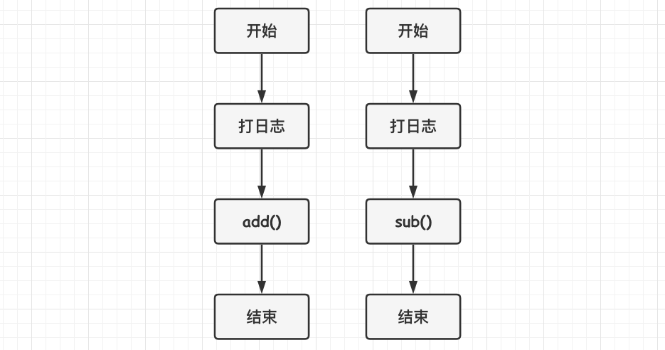
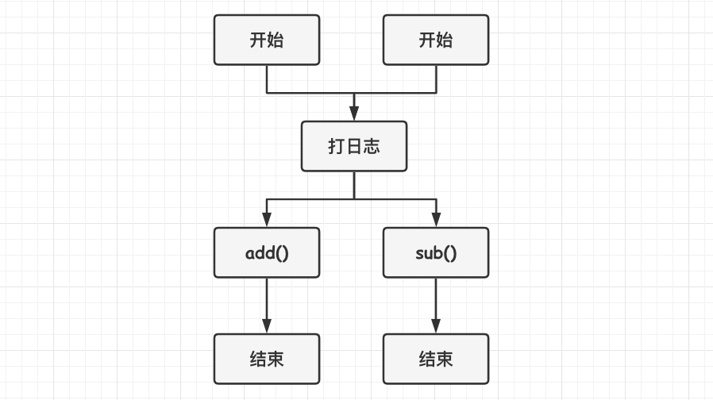
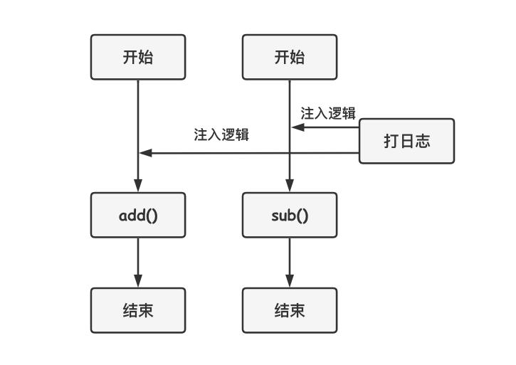

[TOC]

### Spring AOP

#### 基础

##### 1.概述

AOP(Aspect-Oriented Programming 面向切面编程)能够将那些与业务无关，**却为业务模块所共同调用的逻辑或责任封装起来**，便于**减少系统的重复代码**，**降低模块间的耦合度**，并**有利于未来的可拓展性和可维护性**。AOP 是 OOP 的延续，是函数式编程的一种衍生范型。

核心思想：**约定编程**。

AOP 主要用来**解决**在不改变原有业务逻辑的情况下，增强横切逻辑代码，根本上解耦合，避免横切逻辑代码重复的**问题**。

应用场景：**数据库事务、日志功能、权限管理、记录运行时间、应用统计功能**等。


AOP 就是典型的**代理模式**的体现。

##### 2.实例

有两个接口，分别进行加减法计算，为避免计算出现问题，需要对每次接口的入参进行日志记录，第一版实现如下。



这个方案有个问题，就是后续每次新增一个接口，就需要拷贝一次 “记录入参” 的代码。这里可以提出一个公共方法，每个接口都来调用这个方法，于是有了以下第二版实现。



这个方案还是存在问题，虽然不用每次都拷贝代码了，但是每个接口总得要显式的调用这个方法，忘记调用就没法了。这里可以通过**某种策略识别出所有要加入日志记录的接口**，然后在接口调用时，将日志记录的工作注入到接口调用的地方(切点)，这就是 AOP 的核心思想。第三版的实现如下。



这样接口只需要关心具体的业务，而不需要关注该业务之外的逻辑或处理。**红框处，就是面向切面编程的思想。**

##### 3.基本术语

- **连接点**(Joinpoint)：在程序执行过程中某个特定的点，比如**某方法调用的时候或者处理异常**的时候。在 Spring AOP 中，一个连接点总是表示一个**方法的执行**。
- **通知/增强**(Advice)：Advice 定义了将会织入到**连接点方法**的**具体增强逻辑**。包括 **"around"、"before" 和 "after"** 等不同类型的通知。包括 Spring 在内的许多 AOP 框架都是以拦截器做通知模型，并维护一个以连接点为中心的拦截器链。
- **切点**(Pointcut)：匹配连接点的**表达式语句**，它定义了相应 Advice 将要发生的地方。可以用于指定一组连接点，代表要在这一组 Joinpoint 中织入增强逻辑。上面的例子中，切点就表示 "所有要加入日志记录的接口" 的一个 "表达式"。例如："execution(* com.nano.service..*.*(..))"。通知和一个切入点表达式关联，并在满足这个切入点的连接点上运行。
- **切面**(Aspect)：Aspect 是对系统中的横切关注点逻辑进行模块化封装的 AOP **概念实体**。类似于 Java 中的类**声明**，在 Aspect 中可以包含多个切点以及相关的增强定义。
- **织入**(Weaving)：织入指的是将 Advice 连接到 Pointcut 指定的 Joinpoint 处的**过程**，也称为：将 Advice 织入到 Pointcut 指定的 Joinpoint 处。织入实现把**切面连接到其它的应用程序类型或者对象上**，并创建一个被通知的对象。这些可以在编译时(如 AspectJ)、类加载时和运行时(如 Spring AOP)完成。

- **目标对象**(Target Object)：符合 Pointcut 所指定的条件，被织入 Advice 的对象。被一个或者多个切面所通知的对象，也被称做被通知(advised)对象。既然 Spring AOP 是通过运行时代理实现的，这个对象永远是一个被代理对象。
- **AOP 代理**(AOP Proxy)：AOP 框架创建的对象，用来实现切面契约(例如通知方法执行等等)。在 Spring 中，AOP 代理可以是 JDK 动态代理或者 CGLIB 代理。

对于上面的例子来说：

- Jointpoint："加法接口" 或 "减法接口" 每次被调用时所处的**程序执行点**都是一个连接点 Jointpoint。
- Pointcut：就是用于指定 "加法接口" 和 "减法接口" 的一个 "表达式"，当然这个表达式还可以指定很多其他的接口，表达式常见的格式为："execution(* com.nano.service..*.*(..))"。
- Aspect：是定义 Advice、Pointcut 的地方。
- Advice：就是要在 "加法接口" 和 "减法接口" 织入的日志记录**增强逻辑**。
- Weaving：就是指将日记记录逻辑加到 "加法接口" 和 "减法接口" 的**过程**。
- Target：就是定义了 "加法接口" 和 "减法接口" 的**对象实例**。

#### 应用实例

##### 1.Controller异常监控

对 Controller 层进行**异常监控报警**的 Interceptor 如下。

```java
@Aspect
@Component
public class ControllerMonitorInterceptor {

    private static final Logger logger = LoggerFactory.getLogger(ControllerMonitorInterceptor.class);

    @Pointcut("execution(* com.nano.controller..*Controller.*(..))")
    public void controllerMonitor() {
    }

    /**
     * 记录Controller层异常.
     * 收集尽量多的参数.方便定位问题. 同时形成报警监控，报警信息里面提供充分的信息.
     *
     * @param jp 切点
     * @param ex 异常类型
     * @throws Throwable 异常对象
     */
    @AfterThrowing(throwing = "ex", pointcut = "controllerMonitor()")
    public void monitorControllerHandleException(JoinPoint jp, Throwable ex) throws Throwable {

        String shotSig = jp.getSignature().toShortString();

        // 1.分析异常

        // 2.发送报警信息
    }

}
```

##### 2.多个切面

多个切面可以监控同一个方法，当调用方法时，使用 **@Order** 注解或者实现 Order接口都定义不同切面的**执行顺序**。

#### AOP实现方式与原理

##### 1.Spring AOP和AspectJ AOP

AOP 有 Spring 自带的 Spring AOP 以及集成的 AspectJ AOP 实现。

**Spring AOP 属于==运行时==增强，而 AspectJ 是==编译时==增强。**Spring AOP **基于代理**(Proxying)，而 AspectJ 则是**基于字节码**操作。Spring AOP 是纯 Java 实现，在运行期对目标对象进行代理，织入增强代码。AspectJ 是第三方技术，Spring 已经整合 AspectJ，提供对 AspectJ 注解的支持。AspectJ 应该算的上是 Java 生态系统中最**完整**的 AOP 框架，开发 AOP 程序更加容易，是企业主流用法。

如果项目中切面比较少，那么两者性能差异不大。但是当切面**很多**，最好选择 **AspectJ**，它比 Spring AOP **快很多**。

##### 2.AOP实现原理

**AOP 是基于动态代理实现的**，如果要代理的对象实现了**特定接口**，那么会使用 **JDK 动态代理**创建代理对象。要代理的对象没有实现接口，使用 **CGLIB** 生成一个被代理对象的子类对象来作为代理对象，实现接口的对象也可以配置使用 CGLIB 代理。

###### (1)JDK动态代理

JDK 动态代理可以在**运行时动态生成字节码**。JDKProxy 返回的动态代理类是目标类所**实现接口**的另一个实现版本，它实现了对目标类的代理。注意：必须要**有接口**才能进行代理，代理后对象必须**转换为接口类型**。

###### (2)CGLIB动态代理

CGLIB 代理返回的动态代理类是目标代理类的一个**子类**。CGLIB 继承被代理的类后，**覆写方法并织入通知**，动态生成字节码并运行。注意被代理的类**不能是 final 的**，因为不能被继承而无法生成子类。


