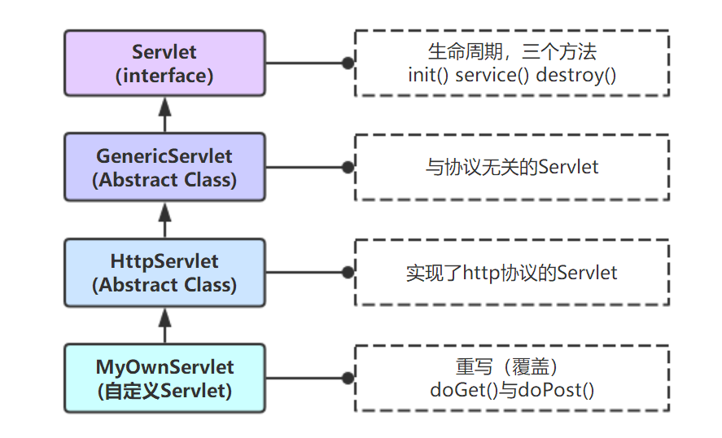
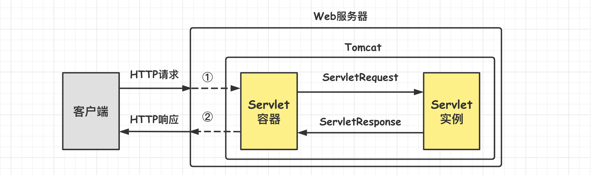
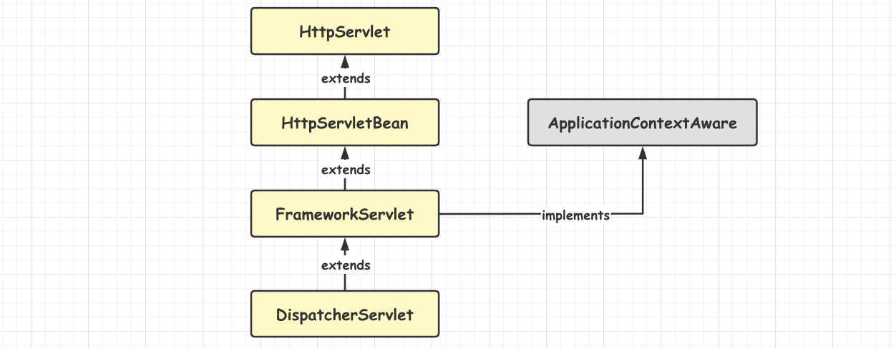

[TOC]

### Spring MVC源码分析

#### Servlet

##### 1.概述

Servlet 是在**服务器**上运行的小程序,一个 servlet 就是一个 Java 类。

该类的继承关系如下：



实现自定义的 Servlet 一般有三种**方式**：

- 实现 javax.servlet.**Servlet** 接口。

- 继承 javax.servlet.**GenericServlet** 类。
- 继承 javax.servlet.http.**HttpServlet** 类。**==常见操作==**。

Servlet 主要负责**接收用户请求 HttpServletRequest**，在 **doGet() 以及 doPost()** 中做相应的处理，并将回应 **HttpServletResponse** 反馈给用户。Servlet 可以设置初始化参数，供 Servlet 内部使用。一个 Servlet 类只会有**一个实例**，在它初始化时调用 **init**() 方法，销毁时调用 **destroy**() 方法。Servlet 需要在 **web.xml** 中配置，一个 Servlet 可以设置多个 URL 访问。**Servlet 不是线程安全**，因此要谨慎使用类变量。

##### 2.Servlet接口与生命周期

Servlet 接口定义了 5 个方法，其中**前三个方法与 Servlet 生命周期相关**：

```java
void init(ServletConfig config) throws ServletException;
void service(ServletRequest req, ServletResponse resp) throws ServletException, java.io.IOException;
void destroy();
java.lang.String getServletInfo();
ServletConfig getServletConfig();
```

Servlet 生命周期如下：

- Web 容器**加载 Servlet 并将其实例化**后，Servlet 生命周期开始，**容器运行**其 **init() 方法**进行 Servlet **初始化**。
- **请求到达**时调用 Servlet 的 **service**() 方法，service() 方法会根据需要调用对应的 **doGet() 或 doPost()** 等方法。
- 当服务器**关闭**或项目被卸载时服务器会将 Servlet 实例销毁，此时调用 Servlet 的 **destroy**() 方法。

init 方法和 destroy 方法**只会执行一次**，service 方法客户端每次请求 Servlet **都会执行**。Servlet 中有时会用到一些需要初始化与销毁的资源，因此可以把初始化资源的代码放入 init 方法中，销毁资源的代码放入 destroy 方法中，这样就不需要每次处理客户端的请求都要初始化与销毁资源。

##### 3.线程安全性

**Servlet 不是线程安全的，多线程并发的读写会导致数据不同步的问题**。

解决的办法是**尽量不要定义 name 属性**，而是要把 name 变量分别定义在 doGet() 和 doPost() 方法内。虽然使用synchronized(name){} 语句块可以解决问题，但是会造成线程的等待。注意：**多线程的并发的读写 Servlet 类属性会导致数据不同步**。但是如果只是并发地读取属性而不写入，则不存在数据不同步的问题。因此 Servlet 里的**只读属性**最好定义为 final 类型的。

##### 4.Tomcat与Servlet的联系

Tomcat 是 Web 应用服务器，是一个 Servlet/JSP 的**容器**。Tomcat 作为 **Servlet 容器**，负责处理客户请求，把请求传送给 Servlet，并将 Servlet 的**响应传送回给客户**。

从 HTTP 协议中的请求和响应可以得知，浏览器发出的请求是一个**请求文本**，而浏览器接收到的也应该是一个**响应文本**。但是在下面这个图中，并不知道是如何转变的，只知道浏览器发送过来的请求也就是 request，响应回去的就用 response。



(1) Tomcat 将 HTTP 请求文本接收**并解析**，然后封装成 **HttpServletRequest** 类型的 **request 对象**，所有的 HTTP **头数据**读可以通过 request 对象调用对应的方法查询到。

(2) Tomcat 同时会把要**响应的信息封装为 HttpServletResponse 类型的 response 对象**，通过设置 response 属性就可以控制要输出到浏览器的内容，然后将 response 交给 Tomcat，Tomcat 就会将其变成**响应文本**的格式发送给浏览器。

Java Servlet API 是 **Servlet 容器(Tomcat) 和 Servlet 之间的接口**，它定义了 serlvet 的各种方法，还定义了 Servlet 容器传送给 Servlet 的对象类，其中最重要的就是 **ServletRequest** 和 **ServletResponse**。所以在编写 servlet 时，需要实现 Servlet 接口，按照其规范进行操作。

##### 5.Tomcat装载Servlet的三种情况

(1) Servlet 容器**启动时**自动装载某些 Servlet，实现它只需要在 web.xml 文件中的 `<servlet></servlet>` 之间添加以下代码：

```xml
<load-on-startup>1</load-on-startup>
```

其中，数字越小表示优先级越高。例如在 web.xml 中设置 TestServlet2 的优先级为 1，而 TestServlet1 的优先级为 2，启动和关闭 Tomcat 时优先级高的先启动也先关闭。　　

(2) 客户端**首次**向某个 Servlet **发送请求**。

(3) Servlet 类被**修改**后，Tomcat 容器会重新装载 Servlet。

#### Spring MVC重要组件

##### 1.前端控制器DispatcherServlet

**作用**：Spring MVC 的入口函数。接收请求，响应结果，相当于转发器、中央处理器。DispatcherServlet 就相当于 MVC 模式中的 C，它是整个流程控制的中心，由它**调用其它组件处理用户的请求**，DispatcherServlet 的存在降低了组件之间的耦合性。

##### 2.处理器映射器HandlerMapping

**作用**：**根据请求的 URL 查找 Handler**。HandlerMapping 负责根据用户请求找到 Handler，即处理器 Controller。SpringMVC 提供了**不同的映射器实现不同的映射方式**，例如：配置文件方式，实现接口方式，注解方式等。

##### 3.处理器适配器HandlerAdapter

**作用**：按照**特定规则(HandlerAdapter 要求的规则)去执行 Handler**。

通过 **HandlerAdapter** 执行 **handler**，这是**适配器模式**的应用，通过扩展适配器可以对更多**类型的处理器**进行执行。

##### 4.处理器Handler

处理器也就是常见的 **Controller**。由于 Handler 涉及到具体的**用户业务请求**，所以一般情况需要工程师根据业务需求开发 Handler。编写 Handler 时按照 **HandlerAdapter** 的要求去做，这样适配器才可以去正确执行 Handler。

Handler 是继 DispatcherServlet 前端控制器的**后端控制器**，在 DispatcherServlet 的控制下 Handler 对具体的用户请求进行处理。

##### 5.视图解析器ViewResolver

作用：进行**视图解析**，根据**逻辑视图**名解析成**真正的视图**（view）。

ViewResolver 负责将处理结果生成 View 视图，ViewResolver 首先根据逻辑视图名解析成物理视图名即具体的页面地址，再生成 View 视图对象，最后对 View 进行**渲染**将处理结果通过页面展示给用户。Spring MVC 框架提供了很多的 **View 视图类型**，包括：jstlView、freemarkerView、pdfView 等。

一般情况下需要通过**页面标签或页面模版技术**将模型数据通过页面展示给用户，需要由工程师根据业务需求开发具体的页面。

##### 6.视图View

View 是一个接口，实现类支持不同的 View 类型，如 JSP、Freemarker、PDF 等。

#### DispatcherServlet继承体系

DispatcherServlet 的继承关系如下图所示。



**HttpServlet** 是由 javax.servlet 包提供的实现了 Servlet 接口的基础类，一般自定义 Servlet 是通过继承 HttpServlet 实现，这里 DispatcherServlet 也是如此。

#### Servlet组件初始化

当服务器启动的时候，如果在配置了 \<load-on-startup> 属性，就会在服务器启动的时候自动加载 Servlet 的 **init()** 方法；如果没有配置，则会在第一次收到请求的时候执行 **init() 方法**，进行 Servlet 的初始化。

当 Spring Boot **创建完内嵌的 Tomcat 容器**后，会将自动配置的 **DispatcherServlet 注册到 Tomcat 中**。第一次请求到来时，Tomcat 会调用 DispatcherServlet 的 init() 方法，由于 DispatcherServlet 继承了 HttpServletBean，所以实际调用的是 HttpServletBean 的 init() 方法。源码如下。

> **HttpServletBean::init()**

```java
@Override
public final void init() throws ServletException {
    if (logger.isDebugEnabled()) {
        logger.debug("Initializing servlet '" + getServletName() + "'");
    }

    PropertyValues pvs = new ServletConfigPropertyValues(getServletConfig(), this.requiredProperties);
    if (!pvs.isEmpty()) {
        try {
            BeanWrapper bw = PropertyAccessorFactory.forBeanPropertyAccess(this);
            ResourceLoader resourceLoader = new ServletContextResourceLoader(getServletContext());
            bw.registerCustomEditor(Resource.class, new ResourceEditor(resourceLoader, getEnvironment()));
            initBeanWrapper(bw);
            bw.setPropertyValues(pvs, true);
        } catch (BeansException ex) {
            if (logger.isErrorEnabled()) {
                logger.error("Failed to set bean properties on servlet '" + getServletName() + "'", ex);
            }
            throw ex;
        }
    }

    // 1.进行初始化
    initServletBean();

    if (logger.isDebugEnabled()) {
        logger.debug("Servlet '" + getServletName() + "' configured successfully");
    }
}
```

这里注释 1 处进行初始化，在 HttpServletBean 中是一个空实现，说明是子类进行了覆写。这里 **FrameworkServlet** 类覆写了 initServletBean() 方法。

> **FrameworkServlet::initServletBean()**

```java
@Override
protected final void initServletBean() throws ServletException {
    getServletContext().log("Initializing Spring FrameworkServlet '" + getServletName() + "'");
    if (logger.isInfoEnabled()) {
        logger.info("FrameworkServlet '" + getServletName() + "': initialization started");
    }
    long startTime = System.currentTimeMillis();

    try {
        // 1.初始化WebApplicationContext
        this.webApplicationContext = initWebApplicationContext();
        initFrameworkServlet();
    }
    catch (ServletException | RuntimeException ex) {
        logger.error("Context initialization failed", ex);
        throw ex;
    }

    if (logger.isInfoEnabled()) {
        long elapsedTime = System.currentTimeMillis() - startTime;
        logger.info("FrameworkServlet '" + getServletName() + "': initialization completed in " +
                    elapsedTime + " ms");
    }
}
```

上面注释 1 处**初始化了 WebApplicationContext**。

> **FrameworkServlet::initWebApplicationContext()**

```java
protected WebApplicationContext initWebApplicationContext() {

    WebApplicationContext rootContext =
        WebApplicationContextUtils.getWebApplicationContext(getServletContext());
    WebApplicationContext wac = null;

    if (this.webApplicationContext != null) {
        // A context instance was injected at construction time -> use it
        wac = this.webApplicationContext;
        if (wac instanceof ConfigurableWebApplicationContext) {
            ConfigurableWebApplicationContext cwac = (ConfigurableWebApplicationContext) wac;
            if (!cwac.isActive()) {
                // The context has not yet been refreshed -> provide services such as
                // setting the parent context, setting the application context id, etc
                if (cwac.getParent() == null) {
                    // The context instance was injected without an explicit parent -> set
                    // the root application context (if any; may be null) as the parent
                    cwac.setParent(rootContext);
                }
                configureAndRefreshWebApplicationContext(cwac);
            }
        }
    }
    if (wac == null) {
        // No context instance was injected at construction time -> see if one
        // has been registered in the servlet context. If one exists, it is assumed
        // that the parent context (if any) has already been set and that the
        // user has performed any initialization such as setting the context id
        wac = findWebApplicationContext();
    }
    if (wac == null) {
        // No context instance is defined for this servlet -> create a local one
        wac = createWebApplicationContext(rootContext);
    }

    if (!this.refreshEventReceived) {
        synchronized (this.onRefreshMonitor) {
            // 1.这里调用了DispatcherServlet的onRefresh()方法
            onRefresh(wac);
        }
    }

    if (this.publishContext) {
        // Publish the context as a servlet context attribute.
        String attrName = getServletContextAttributeName();
        getServletContext().setAttribute(attrName, wac);
        if (this.logger.isDebugEnabled()) {
            this.logger.debug("Published WebApplicationContext of servlet '" + getServletName() +
                              "' as ServletContext attribute with name [" + attrName + "]");
        }
    }

    return wac;
}
```

这里注释 1 处调用了 onRefresh() 方法，注意这个 onRefresh() 方法与 Spring 启动时的 onRefresh() 方法不一样。这里的 onRefresh() 方法被 FrameworkServlet 的子类 **DispatcherServlet** 进行了覆写。

> **DispatcherServlet::onRefresh()**

```java
@Override
protected void onRefresh(ApplicationContext context) {
    // 初始化各个组件!!!!!
    initStrategies(context);
}
```

> **DispatcherServlet::initStrategies()**

```java
protected void initStrategies(ApplicationContext context) {
    initMultipartResolver(context);
    initLocaleResolver(context);
    initThemeResolver(context);
    // 初始化HandlerMapping
    initHandlerMappings(context);
    initHandlerAdapters(context);
    initHandlerExceptionResolvers(context);
    initRequestToViewNameTranslator(context);
    initViewResolvers(context);
    initFlashMapManager(context);
}
```

可以看到，这里就对 MVC 中所需要的各大组件进行了初始化。**这里各种组件的初始化方法很类似，大部分都是从容器中获取对应的组件 bean，然后注册到 DispatcherServlet 中。对于 Spring Boot 而言，各个组件则通过对应的 AutoConfiguration 类进行自动注入。因此初始化的时候就能从容器中直接获取到对应的默认组件了**。

比如初始化 HandlerMappings 源码如下.

> **DispatcherServlet::initHandlerMappings()**

```java
private void initHandlerMappings(ApplicationContext context) {
    this.handlerMappings = null;

    // 默认扫描全部HandlerMapping
    if (this.detectAllHandlerMappings) {
        // 找到容器中所有的HandlerMapping实现类
        Map<String, HandlerMapping> matchingBeans =
            BeanFactoryUtils.beansOfTypeIncludingAncestors(context, HandlerMapping.class, true, false);
        if (!matchingBeans.isEmpty()) {
            this.handlerMappings = new ArrayList<>(matchingBeans.values());
            // 排序
            AnnotationAwareOrderComparator.sort(this.handlerMappings);
        }
    } else {
        try {
            HandlerMapping hm = context.getBean(HANDLER_MAPPING_BEAN_NAME, HandlerMapping.class);
            this.handlerMappings = Collections.singletonList(hm);
        } catch (NoSuchBeanDefinitionException ex) {
        }
    }

    // 如果实在没有HandlerMapping则弄一个默认的
    if (this.handlerMappings == null) {
        this.handlerMappings = getDefaultStrategies(context, HandlerMapping.class);
        if (logger.isDebugEnabled()) {
            logger.debug("No HandlerMappings found in servlet '" + getServletName() + "': using default");
        }
    }
}
```

#### DispatcherServlet与请求响应流程

Servlet 包下有一个 **HttpServlet** 类，其中的 **service**() 方法即是处理 **HTTP 请求的入口**，所以 DispatcherServlet 其实就是一个 servlet。

**HttpServlet 的 service() 方法**如下。

> **HttpServlet::service()**

```java
@Override
public void service(ServletRequest req, ServletResponse res)
    throws ServletException, IOException
{
    HttpServletRequest  request;
    HttpServletResponse response;

    if (!(req instanceof HttpServletRequest &&
          res instanceof HttpServletResponse)) {
        throw new ServletException("non-HTTP request or response");
    }

    request = (HttpServletRequest) req;
    response = (HttpServletResponse) res;

    // 进行服务
    service(request, response);
}
```

上面最后调用了 **HttpServlet 的重载方法 service() 方法**如下。

> **HttpServlet::service()**

```java
protected void service(HttpServletRequest req, HttpServletResponse resp)
    throws ServletException, IOException
{
    String method = req.getMethod();

    if (method.equals(METHOD_GET)) {
        long lastModified = getLastModified(req);
        if (lastModified == -1) {
            // servlet doesn't support if-modified-since, no reason
            // to go through further expensive logic
            doGet(req, resp);
        } else {
            long ifModifiedSince = req.getDateHeader(HEADER_IFMODSINCE);
            if (ifModifiedSince < lastModified) {
                // If the servlet mod time is later, call doGet()
                // Round down to the nearest second for a proper compare
                // A ifModifiedSince of -1 will always be less
                maybeSetLastModified(resp, lastModified);
                doGet(req, resp);
            } else {
                resp.setStatus(HttpServletResponse.SC_NOT_MODIFIED);
            }
        }

    } else if (method.equals(METHOD_HEAD)) {
        long lastModified = getLastModified(req);
        maybeSetLastModified(resp, lastModified);
        doHead(req, resp);

    } else if (method.equals(METHOD_POST)) {
        doPost(req, resp);

    } else if (method.equals(METHOD_PUT)) {
        doPut(req, resp);

    } else if (method.equals(METHOD_DELETE)) {
        doDelete(req, resp);

    } else if (method.equals(METHOD_OPTIONS)) {
        doOptions(req,resp);

    } else if (method.equals(METHOD_TRACE)) {
        doTrace(req,resp);

    } else {
        //
        // Note that this means NO servlet supports whatever
        // method was requested, anywhere on this server.
        //

        String errMsg = lStrings.getString("http.method_not_implemented");
        Object[] errArgs = new Object[1];
        errArgs[0] = method;
        errMsg = MessageFormat.format(errMsg, errArgs);

        resp.sendError(HttpServletResponse.SC_NOT_IMPLEMENTED, errMsg);
    }
}
```

可以看到，这里针对不同的 HTTP 方法调用了不同的 **doXXX()** 方法，进而实现对不同 HTTP 请求的处理。

这些处理的方法都被子类 **==FrameworkServlet==** 进行了覆写，源码如下。

> **FrameworkServlet::doGet()/doPost()/doPut()**

```java
@Override
protected final void doGet(HttpServletRequest request, HttpServletResponse response)
    throws ServletException, IOException {

    // 处理请求
    processRequest(request, response);
}

@Override
protected final void doPost(HttpServletRequest request, HttpServletResponse response)
    throws ServletException, IOException {

    // 处理请求
    processRequest(request, response);
}

@Override
protected final void doPut(HttpServletRequest request, HttpServletResponse response)
    throws ServletException, IOException {

    // 处理请求
    processRequest(request, response);
}
```

可以看到这里不同的 HTTP 方法最后都调用了 **processRequest(request, response)** 方法进行处理。

> **FrameworkServlet::processRequest()**

```java
protected final void processRequest(HttpServletRequest request, HttpServletResponse response)
    throws ServletException, IOException {

    // 开始时间
    long startTime = System.currentTimeMillis();
    Throwable failureCause = null;

    LocaleContext previousLocaleContext = LocaleContextHolder.getLocaleContext();
    LocaleContext localeContext = buildLocaleContext(request);

    // 获取请求参数
    RequestAttributes previousAttributes = RequestContextHolder.getRequestAttributes();
    ServletRequestAttributes requestAttributes = buildRequestAttributes(request, response, previousAttributes);

    WebAsyncManager asyncManager = WebAsyncUtils.getAsyncManager(request);
    asyncManager.registerCallableInterceptor(FrameworkServlet.class.getName(), new RequestBindingInterceptor());

    initContextHolders(request, localeContext, requestAttributes);

    try {
        // 重要：做处理-DispatcherServlet覆写此方法！！！！
        doService(request, response);
    }
    catch (ServletException | IOException ex) {
        failureCause = ex;
        throw ex;
    }
    catch (Throwable ex) {
        failureCause = ex;
        throw new NestedServletException("Request processing failed", ex);
    }

    finally {
        resetContextHolders(request, previousLocaleContext, previousAttributes);
        if (requestAttributes != null) {
            // 标记请求完成，并执行一些请求完成的回调方法
            requestAttributes.requestCompleted();
        }

        if (logger.isDebugEnabled()) {
            if (failureCause != null) {
                this.logger.debug("Could not complete request", failureCause);
            }
            else {
                if (asyncManager.isConcurrentHandlingStarted()) {
                    logger.debug("Leaving response open for concurrent processing");
                }
                else {
                    this.logger.debug("Successfully completed request");
                }
            }
        }

        publishRequestHandledEvent(request, response, startTime, failureCause);
    }
}
```

这里最核心的 **==doService==**(request, response) 方法被 FrameworkServlet 的子类 **==DispatcherServlet==** 覆写。

> **DispatcherServlet::doService()**

```java
@Override
protected void doService(HttpServletRequest request, HttpServletResponse response) throws Exception {
    if (logger.isDebugEnabled()) {
        String resumed = WebAsyncUtils.getAsyncManager(request).hasConcurrentResult() ? " resumed" : "";
        logger.debug("DispatcherServlet with name '" + getServletName() + "'" + resumed +
                     " processing " + request.getMethod() + " request for [" + getRequestUri(request) + "]");
    }

    // Keep a snapshot of the request attributes in case of an include,
    // to be able to restore the original attributes after the include.
    Map<String, Object> attributesSnapshot = null;
    if (WebUtils.isIncludeRequest(request)) {
        attributesSnapshot = new HashMap<>();
        Enumeration<?> attrNames = request.getAttributeNames();
        while (attrNames.hasMoreElements()) {
            String attrName = (String) attrNames.nextElement();
            if (this.cleanupAfterInclude || attrName.startsWith(DEFAULT_STRATEGIES_PREFIX)) {
                attributesSnapshot.put(attrName, request.getAttribute(attrName));
            }
        }
    }

    // Make framework objects available to handlers and view objects.
    request.setAttribute(WEB_APPLICATION_CONTEXT_ATTRIBUTE, getWebApplicationContext());
    request.setAttribute(LOCALE_RESOLVER_ATTRIBUTE, this.localeResolver);
    request.setAttribute(THEME_RESOLVER_ATTRIBUTE, this.themeResolver);
    request.setAttribute(THEME_SOURCE_ATTRIBUTE, getThemeSource());

    if (this.flashMapManager != null) {
        FlashMap inputFlashMap = this.flashMapManager.retrieveAndUpdate(request, response);
        if (inputFlashMap != null) {
            request.setAttribute(INPUT_FLASH_MAP_ATTRIBUTE, Collections.unmodifiableMap(inputFlashMap));
        }
        request.setAttribute(OUTPUT_FLASH_MAP_ATTRIBUTE, new FlashMap());
        request.setAttribute(FLASH_MAP_MANAGER_ATTRIBUTE, this.flashMapManager);
    }

    try {

        // 做分发!!!
        doDispatch(request, response);
    }
    finally {
        if (!WebAsyncUtils.getAsyncManager(request).isConcurrentHandlingStarted()) {
            // Restore the original attribute snapshot, in case of an include.
            if (attributesSnapshot != null) {
                restoreAttributesAfterInclude(request, attributesSnapshot);
            }
        }
    }
}
```

该方法通过 **doDispatch**(request, response) 对**请求进行分发**。

> **DispatcherServlet::doDispatch()**

```java
protected void doDispatch(HttpServletRequest request, HttpServletResponse response) throws Exception {
    // 1.定义一个已处理请求，指向参数中的request，已处理请求后续可能会变
    HttpServletRequest processedRequest = request;
    // 2.定义处理器执行链，内部封装拦截器列表和处理器
    HandlerExecutionChain mappedHandler = null;
    // 3.是否是multipartRequest，默认为否
    boolean multipartRequestParsed = false;

    // 4.获取与当前请求管理的异步管理器，用于执行异步操作
    WebAsyncManager asyncManager = WebAsyncUtils.getAsyncManager(request);

    try {
        // 5.用于保存结果视图
        ModelAndView mv = null;
        Exception dispatchException = null;

        try {
            // 6.检查multipartRequest，如果是则创建其引用，否则返回原始请求
            processedRequest = checkMultipart(request);
            multipartRequestParsed = (processedRequest != request);

            // 7.获取可以处理当前请求的处理器
            mappedHandler = getHandler(processedRequest);
            // 7.1.没有找到处理器的情况
            if (mappedHandler == null) {
                noHandlerFound(processedRequest, response);
                return;
            }

            // 8.根据该处理器获取对应的处理适配器
            HandlerAdapter ha = getHandlerAdapter(mappedHandler.getHandler());

            // 9.单独处理last-modified请求头，用于判断请求内容是否修改
            // 如果未修改直接返回，此时浏览器可以使用本地缓存
            String method = request.getMethod();
            boolean isGet = "GET".equals(method);
            if (isGet || "HEAD".equals(method)) {
                // 获取请求内容的最后更该时间，一般针对的是静态内容
                long lastModified = ha.getLastModified(request, mappedHandler.getHandler());
                if (logger.isDebugEnabled()) {
                    logger.debug("Last-Modified value for [" + getRequestUri(request) + "] is: " + lastModified);
                }
                // GET请求且资源未改变直接返回
                if (new ServletWebRequest(request, response).checkNotModified(lastModified) && isGet) {
                    return;
                }
            }

            // 10.通过mappedHandler这个HandlerExecutionChain执行链的封装，
            // 链式的执行其中所有拦截器的前置拦截方法preHandle()
            if (!mappedHandler.applyPreHandle(processedRequest, response)) {
                // 10.1.任意一个拦截器的前置拦截方法返回了false则提前结束请求的处理
                return;
            }

            // 11.最终执行处理器适配器的处理方法，对请求进行处理，在处理中最终调用了请求对应的处理器方法
            // 执行的返回值是ModelAndReview类型，封装了模型数据与视图，后续对此结果进行处理并根据其中视图与模型的内容返回响应结果
            // 此处是真正处理业务逻辑的地方
            mv = ha.handle(processedRequest, response, mappedHandler.getHandler());

            if (asyncManager.isConcurrentHandlingStarted()) {
                return;
            }

            applyDefaultViewName(processedRequest, mv);

            // 执行chain中拦截器附加的后处理方法，即postHandle()方法
            mappedHandler.applyPostHandle(processedRequest, response, mv);

        } catch (Exception ex) {
            dispatchException = ex;
        } catch (Throwable err) {
            dispatchException = new NestedServletException("Handler dispatch failed", err);
        }
        // 处理分发结果：包括解析视图并进行视图渲染，执行chain中拦截器附加的后处理方法，即afterCompletion()方法
        processDispatchResult(processedRequest, response, mappedHandler, mv, dispatchException);
    }
    catch (Exception ex) {
        triggerAfterCompletion(processedRequest, response, mappedHandler, ex);
    }
    catch (Throwable err) {
        triggerAfterCompletion(processedRequest, response, mappedHandler,
                               new NestedServletException("Handler processing failed", err));
    }
    finally {
        if (asyncManager.isConcurrentHandlingStarted()) {
            // Instead of postHandle and afterCompletion
            if (mappedHandler != null) {
                mappedHandler.applyAfterConcurrentHandlingStarted(processedRequest, response);
            }
        } else {
            // Clean up any resources used by a multipart request.
            if (multipartRequestParsed) {
                cleanupMultipart(processedRequest);
            }
        }
    }
}
```


