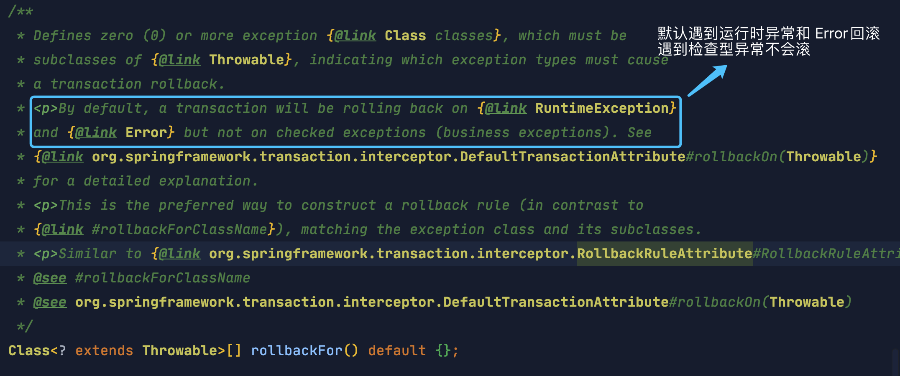

[TOC]

### Spring事务

#### 事务基础

**注意：程序是否支持事务首先取决于数据库，比如使用 MySQL 的 InnoDB 引擎才是可以支持事务的。**

> **MySQL怎么保证原子性的？**

如果想要保证事务的原子性，就需要在异常发生时，对已经执行的操作进行**回滚**，在 MySQL 中，恢复机制是通过 **回滚日志（undo log）** 实现的，所有**事务**进行的修改都会**先记录到这个回滚日志中**，**然后再执行相关的操作**。如果执行过程中遇到异常的话，可以直接利用 **回滚日志** 中的信息将数据**回滚**到修改之前的样子即可！并且回滚日志会**先于**数据持久化到磁盘上。这样就保证了即使遇到数据库突然宕机等情况，当用户再次启动数据库的时候，数据库还能够通过**查询回滚日志**来回滚将之前未完成的事务。

**Spring 数据库事务**是通过 **AOP 技术**提供服务的，AOP 将除去 SQL 之外**公共的代码抽离**出来单独实现。Spring 数据库事务多采用**声明式事务**，编程式事务已经用的不多了。

#### Spring管理事务方式

Spring 对事务的支持有两种。

1. **编程式**事务，在代码中**硬编码**方式使用事务(不推荐使用)
2. **声明式**事务，通过**注解**或配置文件配置使用事务(**推荐**使用)

##### 1.编程式事务管理

通过 **TransactionTemplate** 或 **TransactionManager** **手动管理事务**，实际应用中很少使用。

使用 **TransactionTemplate** 进行编程式事务管理的示例如下。

```java
@Autowired
private TransactionTemplate transactionTemplate;

public void testTransaction() {
	// 执行事务
    transactionTemplate.execute(new TransactionCallbackWithoutResult() {
        @Override
        protected void doInTransactionWithoutResult(TransactionStatus transactionStatus) {
            try {
                // 业务代码
            } catch (Exception e){
                // 回滚
                transactionStatus.setRollbackOnly();
            }
        }
    });
}
```

使用 **TransactionManager** 进行编程式事务管理的示例代码如下。

```java
@Autowired
private PlatformTransactionManager transactionManager;

public void testTransaction() {
    TransactionStatus status = transactionManager.getTransaction(new DefaultTransactionDefinition());
    try {
        // ...业务代码
        transactionManager.commit(status);
    } catch (Exception e) {
        transactionManager.rollback(status);
    }
}
```

##### 2.声明式事务管理

**推荐使用**声明式事务，它对代码**侵入性**最小。

Spring 数据库的事务约定如下：


**声明式事务的优缺点**：

- **优点**：不需要在业务逻辑代码中编写事务相关代码，只需要在配置文件配置或使用注解(@Transaction)，这种方式没有侵入性。
- **缺点**：声明式事务的**最细粒度作用于方法**上，如果像代码块也有事务需求，只能变通下将代码块变为方法。

对于**声明式事务**，Spring 通过**注解 @Transactional 进行标注**，告诉 Spring 在什么地方**启用数据库事务功能**。这个注解可以标注到**方法、类或接口**上。@Transactional 还可以**配置隔离级别和传播行为**等。无论发生**异常与否**，Spring **都会释放事务。**

@Transactional 注解标注使用的**范围**：

- **类**：如果这个注解使用在类上的话，表明该注解对该类中**所有的 public 方法**都生效，且配置**相同**的事务属性信息。
- **方法**：**推荐**将注解使用于方法上，注意：**该注解只能应用到 public 方法上，否则不生效**。方法上的事务配置可以覆盖类上的事务配置。
- **接口**：**不推荐**在接口上使用。

使用 **@Transactional** 注解进行事务管理的示例代码如下：

```java
@Service
public class PayServiceImpl implements PayService {

    @Autowired
    private AccountInfoDao accountInfoDao;

    @Autowired
    private ProductInfoDao productInfoDao;

    @Override
    @Transactional(rollbackFor = RuntimeException.class, isolation = Isolation.DEFAULT)
    public void pay(String accountId, double money) {
        // 业务操作
    }

    @Override
    @Transactional(propagation = Propagation.REQUIRES_NEW, rollbackFor = RuntimeException.class)
    public void updateProductStore(Integer productId) {
        // 业务操作
    }

}
```

这里可以配置很多东西，@Transactional 注解源码如下。

```java
@Target({ElementType.TYPE, ElementType.METHOD})
@Retention(RetentionPolicy.RUNTIME)
@Inherited
@Documented
public @interface Transactional {
    // 通过bean name指定事务管理器
    @AliasFor("transactionManager")
    String value() default "";

    // 同value属性
    @AliasFor("value")
    String transactionManager() default "";

    // 指定传播行为
    Propagation propagation() default Propagation.REQUIRED;

    // 指定隔离级别
    Isolation isolation() default Isolation.DEFAULT;

    // 指定超时时间
    int timeout() default -1;

    // 是否只读事务
    boolean readOnly() default false;

    // 下面是关于异常回滚的内容
    Class<? extends Throwable>[] rollbackFor() default {};

    String[] rollbackForClassName() default {};
	
    // 哪些异常不回滚
    Class<? extends Throwable>[] noRollbackFor() default {};

    String[] noRollbackForClassName() default {};
}
```

@Transactional 的**常用配置参数**总结：

|     属性名      |                             说明                             |
| :-------------: | :----------------------------------------------------------: |
| **propagation** |          事务的**传播行为**，默认值为 **REQUIRED**           |
|  **isolation**  |          事务的**隔离级别**，默认值采用 **DEFAULT**          |
|   **timeout**   | **事务的超时时间**，默认值为 -1（不会超时）。如果超过该时间限制但事务还没有完成，则自动回滚事务。 |
|  **readOnly**   |         指定事务是否为**只读事务**，默认值为 false。         |
| **rollbackFor** | 用于指定能够触发事务回滚的**异常类型**，并且可以指定多个异常类型。 |

Exception 分为**运行时异常** RuntimeException 和**非运行时异常**。在 @Transactional 注解中如果**不配置 rollbackFor 属性**，那么事物只会在**遇到 RuntimeException 的时候才会回滚**，加上 rollbackFor=Exception.class，可以让事务在遇到**非运行时异常时**也回滚。

**声明式事务原理**：如果一个类或者一个类中的 **public** 方法上被标注 @Transactional 注解的话，Spring 容器就会在**==启动的时候为其创建一个代理类==**，在调用被 @Transactional 注解的 public 方法的时候，实际调用的是 **TransactionInterceptor 类**中的  **invoke() 方法**。这个方法的作用就是在**目标方法之前开启事务**，方法执行过程中如果遇到异常的时候**回滚事务**，方法调用完成之后**提交事务**。

具体看后面的源码分析。

#### 事务相关三大接口

- **PlatformTransactionManager**：(平台)**事务管理器**，Spring 事务**策略的核心**
- **TransactionDefinition**：**事务定义信息**(事务隔离级别、传播行为、超时、只读、回滚规则)
- **TransactionStatus**：**事务运行状态**

**PlatformTransactionManager** 接口可以被看作是**事务上层的管理者**，而 **TransactionDefinition** 和 **TransactionStatus** 这两个接口可以看作是**事务的描述**。PlatformTransactionManager 会根据 TransactionDefinition 的定义比如事务超时时间、隔离界别、传播行为等来进行事务管理 ，而 TransactionStatus 接口则提供了一些方法来获取事务相应的**状态**比如是否新事务、是否可以回滚等等。

##### 1.PlatformTransactionManager

Spring 并不直接管理事务，而是提供了**多种事务管理器**。**PlatformTransactionManager** 是 Spring 的事务管理器接口。Spring 将具体的**事务管理职责委托给特定的平台或框架**，各个平台都实现并提供了对应的**事务管理器**，如 **JDBC** 提供了 DataSourceTransactionManager，**Hibernate** 提供了 HibernateTransactionManager，**JPA** 提供了 JpaTransactionManager 等。

抽象出这样一个事务管理接口是为了要**将事务管理行为抽象出来**，然后**不同的平台**去实现它，这样可以**保证提供给外部的行为不变，方便扩展**。

PlatformTransactionManager 接口体系如下:


PlatformTransactionManager 接口中定义了**三个**方法：

```java
public interface PlatformTransactionManager {
    // 获取事务状态
    TransactionStatus getTransaction(@Nullable TransactionDefinition definition) throws TransactionException;

    // 事务提交
    void commit(TransactionStatus status) throws TransactionException;

    // 事务回滚
    void rollback(TransactionStatus status) throws TransactionException;
}
```

##### 2.TransactionDefinition

事务管理器接口 PlatformTransactionManager 通过 **getTransaction**(TransactionDefinition definition) 方法来得到一个**事务**，这个方法里面的**参数是 TransactionDefinition 类** ，这个类就定义了一些**基本的事务属性**。

事务属性可以理解成**事务的一些基本配置**，描述了**事务策略**如何应用到**方法**上。

**事务属性包含了 5 个方面：**

- 隔离级别
- 传播行为
- 回滚规则
- 是否只读
- 事务超时

TransactionDefinition 接口中定义了 5 个方法以及一些表示事务属性的常量比如**隔离级别、传播行为**等等的常量。

```java
public interface TransactionDefinition {

	// 支持当前事务，若当前没有事务就创建一个事务
	int PROPAGATION_REQUIRED = 0;

	// 如果当前存在事务，则加入该事务；如果当前没有事务，则以非事务的方式继续运行
	int PROPAGATION_SUPPORTS = 1;

	// 如果当前存在事务，则加入该事务；如果当前没有事务，则抛出异常
	int PROPAGATION_MANDATORY = 2;

	// 创建一个新的事务，如果当前存在事务，则把当前事务挂起
	int PROPAGATION_REQUIRES_NEW = 3;

	// 以非事务方式运行，如果当前存在事务，则把当前事务挂起
	int PROPAGATION_NOT_SUPPORTED = 4;

	// 以非事务方式运行，如果当前存在事务，则抛出异常
	int PROPAGATION_NEVER = 5;

	/**
	 * 表示如果当前正有一个事务在运行中，则该方法应该运行在 一个嵌套的事务中，
	 * 被嵌套的事务可以独立于封装事务进行提交或者回滚(保存点)，
	 * 如果封装事务不存在,行为就像 PROPAGATION_REQUIRES NEW
	 */
	int PROPAGATION_NESTED = 6;

	/**
	 * 使用后端数据库默认的隔离级别，Mysql 默认采用的 REPEATABLE_READ隔离级别
	 * Oracle 默认采用的 READ_COMMITTED隔离级别
	 */
	int ISOLATION_DEFAULT = -1;

	/**
	 * 读未提交
	 * 最低的隔离级别，允许读取尚未提交的数据变更，可能会导致脏读、幻读或不可重复读
	 */
	int ISOLATION_READ_UNCOMMITTED = Connection.TRANSACTION_READ_UNCOMMITTED;

	/**
	 * 读已提交
	 * 允许读取并发事务已经提交的数据，可以阻止脏读，但是幻读或不可重复读仍有可能发生
	 */
	int ISOLATION_READ_COMMITTED = Connection.TRANSACTION_READ_COMMITTED;

	/**
	 * 可重复读
	 * 对同一字段的多次读取结果都是一致的，除非数据是被本身事务自己所修改，可以阻止脏读和不可重复读，但幻读仍有可能发生
	 */
	int ISOLATION_REPEATABLE_READ = Connection.TRANSACTION_REPEATABLE_READ;

	/**
	 * 串行化
	 * 最高的隔离级别，完全服从ACID的隔离级别。所有的事务依次逐个执行，这样事务之间就完全不可能产生干扰，
	 * 该级别可以防止脏读、不可重复读以及幻读。但是这将严重影响程序的性能通常情况下也不会用到该级别
	 */
	int ISOLATION_SERIALIZABLE = Connection.TRANSACTION_SERIALIZABLE;

	// 使用默认的超时时间
	int TIMEOUT_DEFAULT = -1;

	// 获取事务传播行为
	int getPropagationBehavior();

	// 获取事务隔离级别
	int getIsolationLevel();

	// 获取事务超时时间
	int getTimeout();

	// 获取是否只读事务
	boolean isReadOnly();

	// 返回事务名称
	@Nullable
	String getName();

}
```

这里常量 0-2 是**支持当前事务**的传播行为，3-5 是**不支持当前事务**的传播行为。支持当前事务的意思是**继续用当前事务**执行操作。

##### 3.TransactionStatus

TransactionStatus 接口用来记录事务的**状态**，该接口定义了一组方法，用来获取或判断事务的相应状态信息。

PlatformTransactionManager.getTransaction(…)方法返回一个 **TransactionStatus 对象**。返回的 TransactionStatus 对象可能代表一个**新的或已经存在的事务**。

```java
public interface TransactionStatus extends SavepointManager, Flushable {

	// 是否为新事务
	boolean isNewTransaction();

	// 是否有保存点
	boolean hasSavepoint();

	// 设置为只回滚
	void setRollbackOnly();

	// 是否只回滚
	boolean isRollbackOnly();

	@Override
	void flush();

	// 是否已完成
	boolean isCompleted();
}
```

#### 事务属性详解

实际业务开发一般都是使用 **@Transactional 注解**来开启事务，里面的参数就对应了一些事务的**属性**。

##### 1.事务隔离级别

**TransactionDefinition** 接口中定义了**五个**表示隔离级别的常量：

```java
public interface TransactionDefinition {
    int ISOLATION_DEFAULT = -1;
    int ISOLATION_READ_UNCOMMITTED = 1;
    int ISOLATION_READ_COMMITTED = 2;
    int ISOLATION_REPEATABLE_READ = 4;
    int ISOLATION_SERIALIZABLE = 8;
    // ......
}
```

含义分别如下：

- **TransactionDefinition.ISOLATION_DEFAULT:** 使用**后端数据库默认**的隔离级别，MySQL 默认采用的 **REPEATABLE_READ** **可重复读**隔离级别，Oracle 默认采用的 READ_COMMITTED **可提交读**隔离级别。
- **TransactionDefinition.ISOLATION_READ_UNCOMMITTED:** 读未提交，**可能会导致脏读、幻读或不可重复读**。
- **TransactionDefinition.ISOLATION_READ_COMMITTED:** 读已提交，**可以阻止脏读，但是幻读或不可重复读仍有可能发生。**
- **TransactionDefinition.ISOLATION_REPEATABLE_READ:** 可重复读，**可以阻止脏读和不可重复读，但幻读仍有可能发生。**
- **TransactionDefinition.ISOLATION_SERIALIZABLE:** 串行化，**可以防止脏读、不可重复读以及幻读**。但是这将严重影响程序的性能，通常情况下不会用到该级别。

为了方便使用，Spring 相应地定义了一个**枚举类**：**Isolation**，源码如下。

```java
public enum Isolation {
	DEFAULT(TransactionDefinition.ISOLATION_DEFAULT),
	READ_UNCOMMITTED(TransactionDefinition.ISOLATION_READ_UNCOMMITTED),
	READ_COMMITTED(TransactionDefinition.ISOLATION_READ_COMMITTED),
	REPEATABLE_READ(TransactionDefinition.ISOLATION_REPEATABLE_READ),
	SERIALIZABLE(TransactionDefinition.ISOLATION_SERIALIZABLE);
}
```

> **如何理解默认的ISOLATION_DEFAULT？**

MySQL InnoDB 存储引擎的默认支持的隔离级别是 **REPEATABLE-READ(可重复读)**。**InnoDB 存储引擎在 REPEATABLE-READ（可重读） 事务隔离级别下使用的是 Next-Key Lock 间隙锁算法，因此可以==避免幻读==的产生**，这与其他数据库系统(如 SQL Server)是不同的。所以说 InnoDB 存储引擎的默认支持的隔离级别是 REPEATABLE-READ（可重读）已经可以完全保证事务的隔离性要求，即达到了 SQL 标准的 SERIALIZABLE(可串行化) 隔离级别。

##### 2.事务传播行为

###### (1)概述

当**事务方法**被另一个**事务方法**调用时，必须指定**事务应该如何传播**。例如：方法可能继续**在当前事务**中运行，也可能开启一个**新事务**，并在自己的事务中运行。传播行为是**方法之间调用事务**采取的策略问题，**事务传播行为是为了解决业务层方法之间==互相调用==的事务问题**。

如果在 A 类的 **aMethod**() 事务方法中调用了 B 类的 **bMethod**() 事务方法。这个时候就涉及到**业务层方法之间互相调用的事务问题**。如果 bMethod() 如果发生**异常需要回滚**，这就需要**配置事务传播行为**才能让 aMethod() 跟着回滚。

```java
Class A {
    @Transactional(propagation = propagation.xxx)
    public void aMethod {
        // do something
        B b = new B();
        b.bMethod();
    }
}

Class B {
    @Transactional(propagation = propagation.xxx)
    public void bMethod {
        // do something
    }
}
```

###### (2)传播行为分类

**支持(使用)当前事务的情况：**

- **TransactionDefinition.PROPAGATION_REQUIRED：**如果当前存在事务，则**加入该事务**；如果当前没有事务，则创建一个**新的事务**。
- **TransactionDefinition.PROPAGATION_SUPPORTS：**如果当前存在事务，则**加入该事务**；如果当前没有事务，则以非事务的方式继续运行。
- **TransactionDefinition.PROPAGATION_MANDATORY：**如果当前存在事务，则**加入该事务**；如果当前没有事务，则抛出异常。（mandatory：强制性）

**不支持(使用)当前事务的情况：**

- **TransactionDefinition.PROPAGATION_REQUIRES_NEW：**创建一个新的事务，如果当前存在事务，则把当前事务挂起。
- **TransactionDefinition.PROPAGATION_NOT_SUPPORTED：**以非事务方式运行，如果当前存在事务，则把当前事务挂起。
- **TransactionDefinition.PROPAGATION_NEVER：**以非事务方式运行，如果当前存在事务，则抛出异常。

**其他情况**:

- **TransactionDefinition.PROPAGATION_NESTED：** 如果当前存在事务，则创建一个事务作为当前事务的嵌套事务来运行；如果当前没有事务，则该取值等价于 TransactionDefinition.PROPAGATION_REQUIRED。

在 TransactionDefinition 接口中定义了如下几个表示传播行为的常量。

```java
public interface TransactionDefinition {
    int PROPAGATION_REQUIRED = 0;
    int PROPAGATION_SUPPORTS = 1;
    int PROPAGATION_MANDATORY = 2;
    int PROPAGATION_REQUIRES_NEW = 3;
    int PROPAGATION_NOT_SUPPORTED = 4;
    int PROPAGATION_NEVER = 5;
    int PROPAGATION_NESTED = 6;
    //......
}
```

**枚举类 Propagation** 更方便开发中使用。

```java
package org.springframework.transaction.annotation;
import org.springframework.transaction.TransactionDefinition;

public enum Propagation {

	REQUIRED(TransactionDefinition.PROPAGATION_REQUIRED),
	SUPPORTS(TransactionDefinition.PROPAGATION_SUPPORTS),
	MANDATORY(TransactionDefinition.PROPAGATION_MANDATORY),
	REQUIRES_NEW(TransactionDefinition.PROPAGATION_REQUIRES_NEW),
	NOT_SUPPORTED(TransactionDefinition.PROPAGATION_NOT_SUPPORTED),
	NEVER(TransactionDefinition.PROPAGATION_NEVER),
	NESTED(TransactionDefinition.PROPAGATION_NESTED);
    
	private final int value;

	Propagation(int value) {
		this.value = value;
	}
	public int value() {
		return this.value;
	}
}
```

Spring Boot 的 **@Transactional**。这个注释的 Propagation 字段有很多个配置选项。如下：

- **REQUIRED**：(默认)使用当前的事务，如果当前没有事务，则自己新建一个事务，子方法是必须运行在一个事务中的；如果当前存在事务，则加入这个事务，成为一个整体。举例：领导(外层方法)没饭吃，我(自己的方法)有钱，我会自己买了自己吃；领导有的吃，会分给你一起吃。
- **SUPPORTS**：如果当前有事务，则使用事务；如果当前没有事务，则不使用事务。(可用于查询)。举例：领导没饭吃，我也没饭吃；领导有饭吃，我也有饭吃。
- **MANDATORY**：该传播属性强制必须存在一个事务(外层调用方法必须有事务)，如果不存在，则抛出异常。举例：领导必须管饭，不管饭没饭吃，我就不乐意了，就不干了(抛出异常)。
- **REQUIRES_NEW**：如果当前有事务，则挂起该事务，并且自己创建一个新的事务给自己使用；如果当前没有事务，则同 REQUIRED。此时有两个事务，会分别提交。举例：领导有饭吃，我偏不要，我自己买了自己吃。
- NOT_SUPPORTED：如果当前有事务，则把事务挂起，自己不适用事务去运行数据库操作。举例：领导有饭吃，分一点给你，我太忙了，放一边，我不吃。
- NEVER：如果当前有事务存在，则抛出异常。举例：领导有饭给你吃，我不想吃，我热爱工作，我抛出异常。
- NESTED：如果当前有事务，则开启子事务(嵌套事务)，嵌套事务是独立提交或者回滚；如果当前没有事务，则同 REQUIRED。但是如果主事务提交，则会携带子事务一起提交。如果主事务回滚，则子事务会一起回滚。相反，子事务异常，则父事务可以回滚或不回滚。举例：领导决策不对，老板怪罪，领导带着小弟一同受罪。小弟出了差错，领导可以推卸责任。

###### (3)传播行为详解

下面详解各个传播行为的含义。

**1. TransactionDefinition.PROPAGATION_REQUIRED**

**使用最多**的一个事务传播行为，平时经常使用的 @Transactional 注解**默认使用就是这个事务传播行为**。**如果当前存在事务，则加入该事务；如果当前没有事务，则创建一个新的事务。**也就是说：

- 如果外部方法没有开启事务的话，Propagation.REQUIRED 修饰的内部方法会**新开启自己的事务**，且开启的事务**相互独立，互不干扰**。
- 如果外部方法**开启事务**并且被 Propagation.REQUIRED 的话，所有 Propagation.REQUIRED 修饰的内部方法和外部方法均**属于同一事务**，**只要一个方法回滚，整个事务都会回滚**。

举个例子：如果上面的 aMethod() 和 bMethod() 使用的都是 PROPAGATION_REQUIRED 传播行为的话，两者使用的就是**同一个事务**，只要其中一个方法回滚，整个事务**均回滚**。

```java
Class A {
    @Transactional(propagation=propagation.PROPAGATION_REQUIRED)
    public void aMethod {
        // do something
        B b = new B();
        // 调用另一个事务方法
        b.bMethod();
    }
}

Class B {
    @Transactional(propagation=propagation.PROPAGATION_REQUIRED)
    public void bMethod {
        // do something
    }
}
```

**2.TransactionDefinition.PROPAGATION_REQUIRES_NEW**

**创建一个新的事务，如果当前存在事务，则把当前事务挂起**。也就是说不管外部方法是否开启事务，Propagation.REQUIRES_NEW 修饰的内部方法会**新开启自己的事务**，且开启的事务相互独立，互不干扰。

举个例子：如果上面的 bMethod() 使用 PROPAGATION_REQUIRES_NEW 事务传播行为修饰，aMethod 还是用 PROPAGATION_REQUIRED 修饰的话。如果 aMethod() 发生异常**回滚**，bMethod() **不会跟着回滚**，因为 bMethod()开启了**独立的事务**。但是，如果 bMethod() 抛出了**未被捕获的异常**并且这个异常满足事务回滚规则的话，aMethod() 同样也会回滚，因为这个**异常**被 aMethod() 的事务管理机制检测到了。

```java
Class A {
    // PROPAGATION_REQUIRED
    @Transactional(propagation=propagation.PROPAGATION_REQUIRED)
    public void aMethod {
        //do something
        B b = new B();
        b.bMethod();
    }
}

Class B {
    // REQUIRES_NEW：会开启新的事务
    @Transactional(propagation=propagation.REQUIRES_NEW)
    public void bMethod {
        //do something
    }
}
```

**3.TransactionDefinition.PROPAGATION_NESTED:**

**如果当前存在事务，则创建一个事务作为当前事务的嵌套事务来运行；如果当前没有事务，则该取值等价于TransactionDefinition.PROPAGATION_REQUIRED**。也就是说：

- 在外部方法**未开启事务**的情况下 Propagation.NESTED 和 Propagation.REQUIRED 作用**相同**，修饰的内部方法都会新开启自己的事务，且开启的事务相互独立，互不干扰。
- 如果外部方法**开启事务**的话，Propagation.NESTED 修饰的内部方法属于外部事务的**子事务**，外部主事务回滚的话，子事务也会回滚，而内部子事务可以单独回滚而不影响外部主事务和其他子事务。

举个例子：如果 aMethod() 回滚的话，bMethod() 和 bMethod2() 都要回滚，而 bMethod() 回滚的话，并不会造成 aMethod() 和 bMethod() 回滚。

```java
Class A {
    @Transactional(propagation=propagation.PROPAGATION_REQUIRED)
    public void aMethod {
        //do something
        B b = new B();
        b.bMethod();
        b.bMethod2();
    }
}

Class B {
    @Transactional(propagation=propagation.PROPAGATION_NESTED)
    public void bMethod {
        //do something
    }
    @Transactional(propagation=propagation.PROPAGATION_NESTED)
    public void bMethod2 {
        //do something
    }
}
```

**4.TransactionDefinition.PROPAGATION_MANDATORY**

用的较少。如果当前存在事务，则加入该事务；如果当前没有事务，则抛出异常。mandatory 就是强制性的含义。

**5.其他传播行为**

若是错误的配置以下 3 种事务传播行为，事务将**不会发生回滚**，这里不深入分析，使用的少。

- TransactionDefinition.PROPAGATION_SUPPORTS: 如果当前存在事务，则加入该事务；如果当前没有事务，则以非事务的方式继续运行。
- TransactionDefinition.PROPAGATION_NOT_SUPPORTED: 以非事务方式运行，如果当前存在事务，则把当前事务挂起。
- TransactionDefinition.PROPAGATION_NEVER: 以非事务方式运行，如果当前存在事务，则抛出异常。

##### 3.事务回滚规则

事务回滚规则定义了哪些**异常会导致事务回滚**而哪些不会。默认情况下，事务只有遇到**运行期异常**(**RuntimeException** 及其子类)时才会回滚，**Error** 也会导致事务回滚，但是在**遇到受查(Checked)异常时不会回滚**。



配置**回滚自定义异常**类型的方式：

```java
@Transactional(rollbackFor = TestException.class)
```

Exception 分为**运行时异常** RuntimeException 和**非运行时异常**。在 @Transactional 注解中如果不配置 rollbackFor 属性，那么事物只会在**遇到 RuntimeException 的时候才会回滚**，加上 **rollbackFor=Exception.class**，可以让事务在遇到**非运行时异常时**也回滚。

##### 4.事务只读属性

对于**只有读取数据查询**的事务，可以**指定事务类型为 readonly，即只读事务**。只读事务不涉及数据的修改，数据库会提供一些优化手段，适合用在有**多条数据库查询**操作的方法中。

TransactionDefinition 接口中有这个方法。

```java
package org.springframework.transaction;
import org.springframework.lang.Nullable;

public interface TransactionDefinition {
    // ......
    // 返回是否为只读事务，默认值为false
    boolean isReadOnly();
}
```

为什么一个数据查询操作还要启用事务支持呢？以 MySQL 的 InnoDB 为例，MySQL **默认对每一个新建立的连接**都启用了自动提交模式。在该模式下，每一个发送到 MySQL 服务器的 SQL 语句都会在一个**单独的事务**中进行处理，执行结束后会自动提交事务，并开启一个新的事务。

但是如果给方法加上了 **@Transactional 注解**，这个方法执行的所有 SQL 会被放在**一个事务**中。如果声明了**只读事务**的话，数据库就会去优化它的执行，并不会带来其他的什么收益。如果不加 Transactional，每条 SQL 会开启一个单独的事务，中间被其它事务改了数据，都会实时读取到最新值。

分享一下关于**事务只读属性**，其他人的解答：

1. 如果一次执行单条查询语句，则没有必要启用事务支持，数据库默认支持 SQL 执行期间的读一致性；
2. 如果一次执行多条查询语句，例如统计查询、报表查询，在这种场景下，多条查询 SQL 必须保证整体的读一致性，否则在前条 SQL 查询之后，后条 SQL 查询之前，数据被其他用户改变，则该次整体的统计查询将会出现读数据不一致的状态，此时应该启用事务支持。

##### 5.事务超时属性

事务超时指一个事务所允许执行的最长时间，如果超过该时间限制但事务还没有完成，则自动回滚事务。在 TransactionDefinition 中以 int 的值来表示超时时间，其单位是**秒**，默认值为 -1，即不超时。

#### Spring AOP方法自调用问题

若同一类中的其他**没有 @Transactional 注解的方法内部调用有 @Transactional 注解的方法**，**有 @Transactional 注解的方法的事务会==失效==。**

这是由于 **Spring AOP 方式实现代理**的原因造成的，因为只有当 @Transactional 注解的方法在**类以外被调用的时候，Spring 事务管理才生效。**

例如下面的 MyService 类中的 **method1**() 调用 **method2**( )就会导致 method2() 的事务失效。

```java
@Service
public class MyService {
    // 普通方法
    private void method1() {
		// 调用事务方法
        method2();
        //......
    }
    // 事务方法    
    @Transactional
    public void method2() {
        //......
    }
}
```

解决办法就是**避免同一类中自调用或者使用 AspectJ 取代 Spring AOP 代理**。


#### 参考资料

- [事务管理中 transactional 参数/](http://www.mobabel.net/spring事务管理中transactional的参数/)
- [Spring 官方文档](https://docs.spring.io/spring/docs/4.2.x/spring-framework-reference/html/transaction.html)
- 《Spring5 高级编程》
- [透彻的掌握 Spring 中@transactional 的使用](https://www.ibm.com/developerworks/cn/java/j-master-spring-transactional-use/index.html)
- [Spring 事务的传播特性](https://github.com/love-somnus/Spring/wiki/Spring事务的传播特性)
- [Spring 事务传播行为详解](https://segmentfault.com/a/1190000013341344)
- [全面分析 Spring 的编程式事务管理及声明式事务管理](https://www.ibm.com/developerworks/cn/education/opensource/os-cn-spring-trans/index.html)
- [可能是最漂亮的 Spring 事务管理详解](https://mp.weixin.qq.com/s?__biz=Mzg2OTA0Njk0OA==&mid=2247484943&idx=1&sn=46b9082af4ec223137df7d1c8303ca24&chksm=cea249c4f9d5c0d2b8212a17252cbfb74e5fbe5488b76d829827421c53332326d1ec360f5d63&token=1082669959&lang=zh_CN#rd)
- [一口气说出6种@Transactional注解失效场景](https://mp.weixin.qq.com/s?__biz=Mzg2OTA0Njk0OA==&mid=2247486483&idx=2&sn=77be488e206186803531ea5d7164ec53&chksm=cea243d8f9d5cacecaa5c5daae4cde4c697b9b5b21f96dfc6cce428cfcb62b88b3970c26b9c2&token=816772476&lang=zh_CN#rd)


