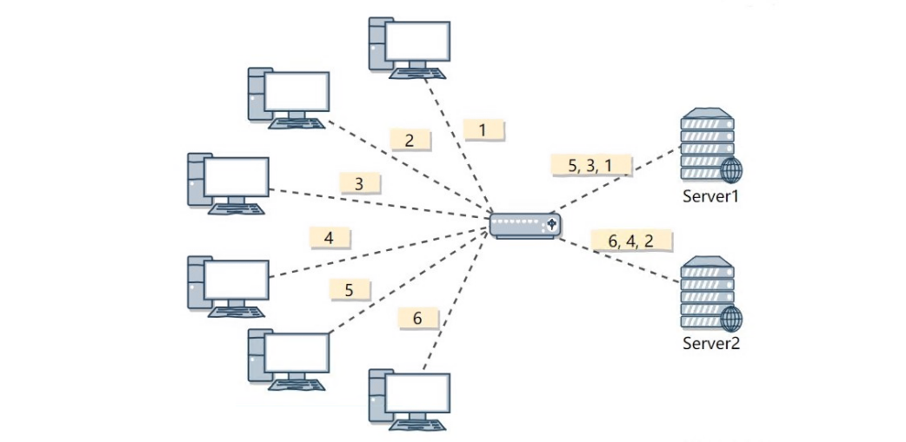
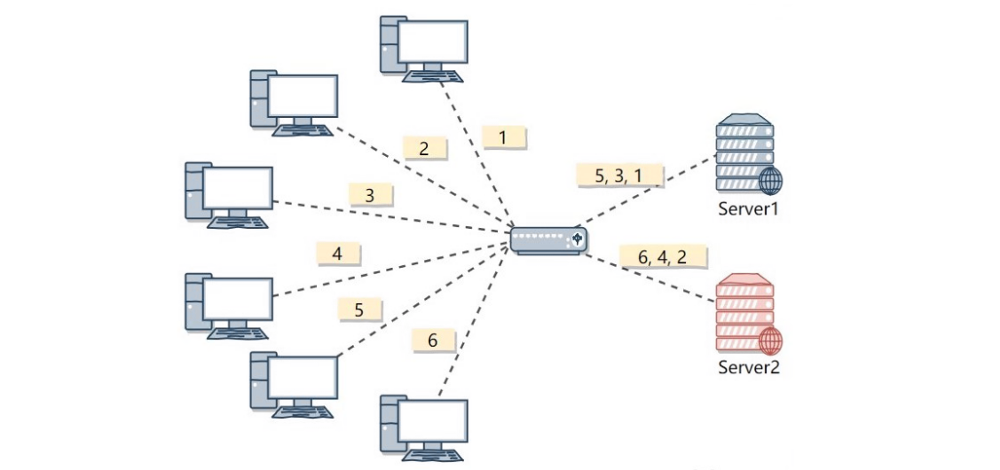
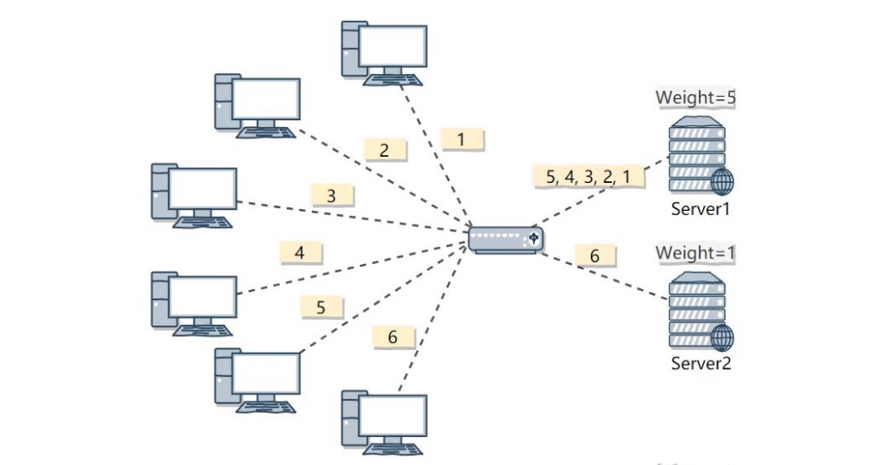
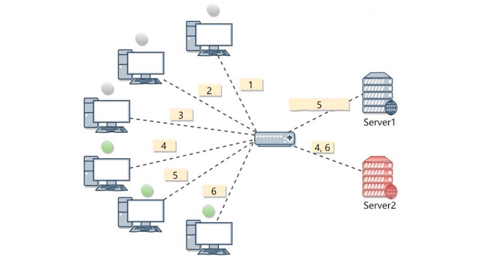
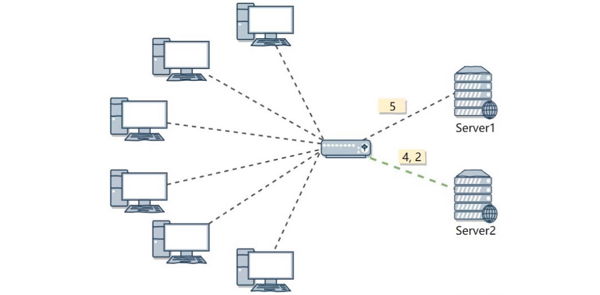
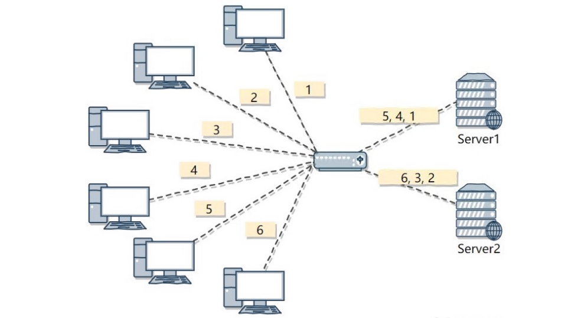
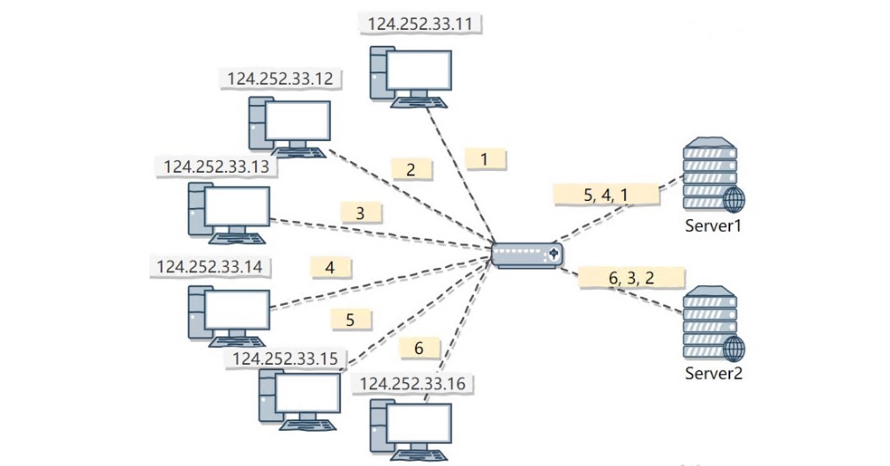
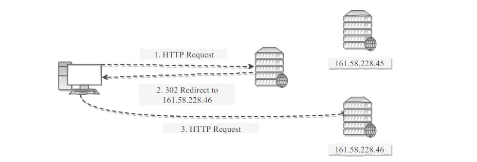
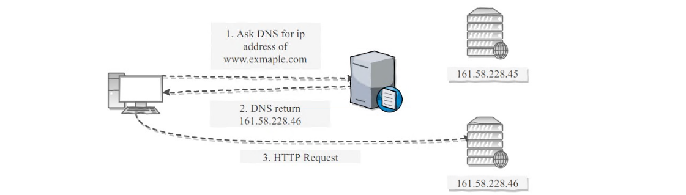

[TOC]

### 系统设计

#### 系统特性

##### 1.伸缩性

指不断向集群中**添加服务器**来缓解不断上升的用户**并发访问压力和不断增长的数据存储需求**。

###### (1)伸缩性与性能

如果系统存在**性能问题**，那么单个用户的请求总是很慢的；如果系统存在**伸缩性问题**，那么**单个**用户的**请求可能会很快**，但是在**并发数很高**的情况下系统会**很慢**。

###### (2)实现伸缩性

**应用服务器**只要提供**==无状态服务==**，那么就可以很容易地通过负载均衡器向集群中添加新的服务器。

**关系型数据库**的伸缩性通过 **Sharding** 来实现，将**数据按一定的规则分布到不同的节点**上，从而解决单台存储服务器的存储空间限制。对于**非关系型数据库**，它们天生就是为海量数据而诞生，对伸缩性的支持特别好。

##### 2.扩展性

指的是添加**新功能**时对现有系统的其它应用无影响，这就要求不同应用具备**低耦合**的特点。

实现可扩展主要有两种方式：

- 使用**消息队列**进行解耦，应用之间通过消息传递进行通信；
- 使用**分布式服务**将业务和**可复用的服务**分离开来，业务使用分布式服务框架调用可复用的服务。新增的产品可以通过调用可复用的服务来实现业务逻辑，对其它产品没有影响。

##### 3.可用性

###### (1)冗余

保证**高可用**的主要手段是使用**冗余**，当某个服务器故障时就请求其它服务器。

**应用服务器**的冗余比较容易实现，只要**保证应用服务器不具有状态**，那么某个应用服务器故障时，负载均衡器将该应用服务器原先的用户请求转发到另一个应用服务器上，不会对用户有任何影响。

**存储服务器**的冗余需要使用**主从复制**来实现，当主服务器故障时，需要提升从服务器为主服务器，这个过程称为**切换**。

###### (2)系统监控

对 **CPU、内存、磁盘、网络**等系统负载信息进行监控，当某个信息达到一定阈值时通知运维人员，从而在系统发生故障之前及时发现问题。

###### (3)服务降级

**服务降级**是系统为了应对大量的请求，**主动关闭部分功能**，从而**保证核心功能**可用。

##### 4.安全性

要求系统在应对各种**攻击手段**时能够有可靠的应对措施。

#### 系统性能评价

##### 1.性能指标

###### (1)响应时间

指某个请求从**发出到接收到响应**消耗的时间。在对响应时间进行测试时，通常采用重复请求的方式，然后计算平均响应时间。

**P90/P95/P99**：单个请求响应耗时**从小到大**排列，顺序处于 90%/95%/99% 位置的值即为 P90/P95/P99 值。

###### (2)吞吐量

指系统在**单位时间**内可以处理的**请求数量**，通常使用**每秒的请求数**来衡量。

###### (3)并发用户数

指系统能**同时处理的并发用户请求**数量。在没有并发存在的系统中，请求被**顺序执行**，此时**响应时间为吞吐量的倒数**。例如系统支持的吞吐量为 100 req/s，那么平均响应时间应该为 0.01s。

目前的大型系统都支持**多线程**来处理并发请求，多线程能够提高吞吐量以及缩短响应时间，主要有两个原因：

- 多 CPU
- IO 等待时间

使用 **IO 多路复用**等方式，系统在等待一个 IO 操作完成的这段时间内不需要被阻塞，可以去处理其它请求。通过将这个等待时间利用起来，使得 **CPU 利用率**大大提高。并发用户数不是越高越好，因为如果并发用户数太高，系统来不及处理这么多的请求，会使得过多的请求需要等待，那么响应时间就会大大提高。

##### 2.系统性能优化

###### (1)集群

将多台服务器组成**集群**，使用**负载均衡**将请求转发到集群中，避免单一服务器的负载压力过大导致性能降低。

###### (2)缓存

**缓存**能够提高性能的原因如下：

- 缓存数据通常位于**内存等介质**中，数据**读取**特别快；
- 缓存数据可以位于**靠近用户的地理位置**上；
- 可以将计算结果进行缓存，从而**避免重复计算**。

###### (3)异步

某些流程可以将操作转换为异步消息，将消息发送到**消息队列**之后立即返回，之后这个操作会被**异步处理**。比如某些**与主线业务关联不大的统计、更新流程**等。

#### 好系统标准Hint

> 姚刚强

- 不同模块间完全没有影响
- 只共享Immutable Data
- 共享 Mutable Data，但是 interface 少，而且**几乎不变**
- interface 变化次数/ implementation 变化次数比例小

==**先考虑业务架构，再考虑技术架构。**==

#### 负载均衡

集群中的应用服务器(节点) 通常被设计成**无状态**，用户可以请求**任何一个节点**。

负载均衡器会根据集群中每个节点的负载情况，将用户请求转发到合适的节点上。

负载均衡器可以用来实现高可用以及伸缩性：

- **高可用**：当某个节点故障时，负载均衡器会将用户请求转发到另外的节点上，从而保证所有服务持续可用；
- **伸缩性**：根据系统整体负载情况，可以很容易地添加或移除节点。

负载均衡器运行过程包含两个部分：

1. 根据**负载均衡算法**得到转发的节点；
2. 进行转发。

##### 1.负载均衡算法

###### (1)轮询算法

**轮询算法把每个请求轮流发送到每个服务器上**。

下图中，一共有 6 个客户端产生了 6 个请求，这 6 个请求按 (1, 2, 3, 4, 5, 6) 的顺序发送。(1, 3, 5) 的请求会被发送到服务器 1，(2, 4, 6) 的请求会被发送到服务器 2。

该算法比较适合每个服务器的**性能差不多**的场景，如果有性能存在差异的情况下，那么性能较差的服务器可能无法承担过大的负载(下图的 Server 2)。

###### (2)加权轮询算法

加权轮询是在轮询的基础上，根据服务器的性能差异，为**服务器赋予一定的权值**，性能高的服务器分配更高的权值。

例如下图中，服务器 1 被赋予的权值为 5，服务器 2 被赋予的权值为 1，那么 (1, 2, 3, 4, 5) 请求会被发送到服务器 1，(6) 请求会被发送到服务器 2。

###### (3)最少连接算法

由于每个请求的连接时间不一样，使用轮询或者加权轮询算法的话，可能会让一台服务器当前连接数过大，而另一台服务器的连接过小，造成**负载不均衡**。

例如下图中，(1, 3, 5) 请求会被发送到服务器 1，但是 (1, 3) 很快就断开连接，此时只有 (5) 请求连接服务器 1；(2, 4, 6) 请求被发送到服务器 2，只有 (2) 的连接断开，此时 (6, 4) 请求连接服务器 2。该系统继续运行时，服务器 2 会承担过大的负载。

**最少连接算法就是将请求发送给当前最少连接数的服务器上**。

例如下图中，服务器 1 当前连接数最小，那么新到来的请求 6 就会被发送到服务器 1 上。

###### (4)加权最少连接算法

在最少连接的基础上，根据服务器的性能为每台服务器分配**权重**，再根据权重计算出每台服务器能处理的连接数。

###### (5)随机算法

把请求**随机发送到服务器**上。和轮询算法类似，该算法比较适合服务器**性能差不多**的场景。

###### (6)源地址哈希算法

源地址哈希通过对**客户端 IP 计算哈希值**之后，再对**服务器数量取模**得到目标服务器的序号。

可以保证同一 IP 的客户端的请求会转发到同一台服务器上，用来实现会话**粘滞(Sticky Session)**。

##### 2.转发实现

###### (1)HTTP重定向

HTTP 重定向负载均衡服务器使用某种负载均衡算法计算得到服务器的 IP 地址之后，将该地址写入 **HTTP 重定向报文**中，状态码为 **302**。客户端收到重定向报文之后，需要重新向服务器发起请求。

**缺点**：需要两次请求，因此访问延迟比较高；HTTP 负载均衡器处理能力有限，会限制集群的规模。该负载均衡转发的缺点比较明显，实际场景中**很少使用它**。

###### (2)DNS域名解析

在 **DNS 解析域名的同时使用负载均衡算法计算服务器 IP 地址**。

**优点**：DNS 能够根据地理位置进行域名解析，返回离用户最近的服务器 IP 地址。

**缺点**：由于 DNS 具有多级结构，每一级的域名记录都可能被缓存，当下线一台服务器需要修改 DNS 记录时，需要过很长一段时间才能生效。

大型网站基本使用了 DNS 做为**第一级负载均衡**手段，然后在内部使用其它方式做第二级负载均衡。也就是说，域名解析的结果为内部的负载均衡服务器 IP 地址。

###### (3)反向代理服务器

**反向代理服务器**位于源服务器**前面**，用户的请求需要**先经过反向代理服务器**才能到达源服务器。反向代理可以用来**进行缓存、日志记录**等，同时也可以用来做为**负载均衡服务器**。

在这种负载均衡转发方式下，客户端不直接请求源服务器，因此源服务器不需要外部 IP 地址，而反向代理需要配置内部和外部两套 IP 地址。

**优点**：与其它功能集成在一起，部署简单。

**缺点**：**所有请求和响应**都需要经过反向代理服务器，它可能会成为性能瓶颈。

###### (4)网络层

在操作系统内核进程获取网络数据包，根据负载均衡算法计算源服务器的 IP 地址，并修改请求数据包的目的 IP 地址，最后进行转发。

源服务器返回的响应也需要经过负载均衡服务器，通常是让负载均衡服务器同时作为集群的网关服务器来实现。

**优点**：在内核进程中进行处理，性能比较高。

**缺点**：和反向代理一样，所有的请求和响应都经过负载均衡服务器，会成为性能瓶颈。

###### (5)链路层

在链路层根据**负载均衡算法**计算源服务器的 **MAC** 地址，并修改请求数据包的目的 MAC 地址，并进行转发。

通过配置源服务器的虚拟 IP 地址和负载均衡服务器的 IP 地址一致，从而不需要修改 IP 地址就可以进行转发。也正因为 IP 地址一样，所以源服务器的响应不需要转发回负载均衡服务器，可以直接转发给客户端，避免了负载均衡服务器的成为瓶颈。

这是一种三角传输模式，被称为**直接路由**。对于提供下载和视频服务的网站来说，直接路由避免了大量的网络传输数据经过负载均衡服务器。

这是目前大型网站使用最广负载均衡转发方式，在 Linux 平台可以使用的负载均衡服务器为 LVS(Linux Virtual Server)。

#### 参考资料

- [Comparing Load Balancing Algorithms](http://www.jscape.com/blog/load-balancing-algorithms)
- [Redirection and Load Balancing](http://slideplayer.com/slide/6599069/#)

