[TOC]

## 分布式理论

### 分布式系统基础

分布式系统定义：分布式系统是一个硬件或软件组件分布在不同的网络计算机上，彼此之间仅仅通过消息传递进行通信和协调的系统。

#### 分布式系统特点

- **分布性**：在空间随意分布。
- **对等性**：没有主从之分，都是对等的。
- **并发性**：可能会并发操作一些共享的资源。
- **缺乏全局时钟**：很难定义两个事件谁先谁后。
- **故障总是会发生**：分布式系统中的计算机可能发生任何形式的故障。

#### 分布式系统的问题

##### 1.通信异常

主要是因为**网络**本身的不可靠性。消息丢失与延迟在分布式系统中十分普遍。

##### 2.网络分区

指分布式系统中，不同的节点分布在不同的**子网络**(机房或异地网络等)中，由于一些特殊的原因导致这些子网络直接出现网络不连通的情况，但各个子网络的内部网络是正常的，**从而导致整个系统的网络环境被切分成了若干个孤立的区域**。这样的现象就称为网络分区，俗称 "**脑裂**"。

当出现网络分区时，分布式系统会出现局部小集群，这对分布式**一致性**提出了巨大的挑战。

##### 3.三态

由于网络可能出现各种问题，分布式系统中的一次请求与响应，可能存在**成功、失败与超时**等三种状态。

##### 4.结点故障

组成分布式系统的服务器节点出现宕机或 "僵死" 现象。

### 一致性算法/协议

在对一个分布式系统进行架构设计的过程中，往往会在系统的**可用性和数据一致性**之间进行反复权衡，于是就产生了一系列一致性协议。

**二阶段提交(2PC)** 协议解决了**分布式事务的原子性**问题。

**三阶段提交(3PC)** 协议避免了 2PC 中的**无限期等待**问题，但存在**数据不一致**问题。

**Paxos 算法**引入少数服从多数原则，支持角色之间的轮换，避免了单点故障，无限期等待，网络分区问题，是最优秀的分布式一致性协议之一。

#### 两阶段提交(2PC)

##### 1.概述

二阶段提交(2PC, Two-Phase Commit)是指在计算机网络以及数据库领域内，为了使基于分布式系统架构下的所有节点在进行事务提交时保持原子性和一致性而设计的一种算法(协议)。PC 是 phase-commit 的缩写，即**阶段提交**。

二阶段提交是一种保证**分布式系统数据一致性**的协议，许多**关系型数据库都是采用的两阶段提交协议**来完成 **分布式事务** 的处理。

二阶段提交协议是将**事务的提交过程**分成两个阶段来进行处理。在两阶段提交中，主要涉及到两个角色，分别是**协调者和参与者**。

- **协调者：**用来统一调度所有分布式节点的执行逻辑。

- **参与者：**被调度的分布式节点。

##### 2.算法流程

###### (1)阶段一:提交事务请求(投票阶段)

1. 事务询问。协调者节点向所有参与者节点询问是否可以执行提交操作(vote)，并开始等待各参与者节点的响应。

2. 执行事务。各参与者节点执行询问发起为止的所有事务操作，并将 Undo 信息和 Redo 信息写入日志。

3. 各参与者节点响应协调者节点发起的询问。如果参与者节点的事务操作实际执行成功，则它返回一个 "YES" 消息；如果参与者节点的事务操作实际执行失败，则它返回一个 "NO" 消息。

###### (2)阶段二:执行事务请求(执行阶段)

分为以下两种情况：

**==情况1：执行事务提交==**。

当协调者节点从所有参与者节点获得的相应消息都为 "YES" 时，**执行事务提交**。

1. 发送提交请求。协调者节点向所有参与者节点发出 "正式提交(Commit)" 请求。

2. 事务提交。参与者节点接受到 COMMIT 请求后正式完成操作，并释放在整个事务期间内占用的资源。
3. 反馈事务提交结果。参与者节点完成事务提交之后，向协调者节点发送 "ACK” 消息。
4. 完成事务。协调者节点收到所有参与者节点反馈的 "ACK” 消息后，完成事务。

==**情况2：中断事务**==。

如果任一参与者节点在第一阶段返回的响应消息为 "NO"，或者协调者节点在第一阶段的询问超时之前无法获取所有参与者节点的响应消息时，那么就会**中断事务**。

1. 发送回滚请求。协调者节点向所有参与者节点发出 "回滚操作(Rollback)" 的请求。
2. 事务回滚。参与者节点收到回滚请求后，利用之前写入的 Undo 信息执行回滚，并释放在整个事务期间内占用的资源。
3. 反馈事务回滚结果。参与者节点向协调者节点发送 "ACK” 消息。
4. 中断事务。协调者节点受到所有参与者节点反馈的 "ACK” 消息后，完成事务中断。

简单来说，二阶段提交将一个事务的处理过程分成了 **投票与执行** 两个阶段，其核心是对每个事务都采用**先尝试后提交**的处理方式，因此也可以将二阶段提交看做一个**强一致性算法**。

##### 3.存在问题

事实上 2PC 只解决了各个事务的**原子性问题**，也存在诸多问题。

* **单点故障问题**：由于协调者的重要性，一旦协调者发生故障。参与者会一直阻塞下去。尤其在第二阶段，协调者发生故障，那么所有的参与者还都处于锁定事务资源的状态中，而无法继续完成事务操作。
* **同步阻塞问题**：执行过程中，所有参与节点都是事务阻塞型的。当参与者占有公共资源时，其他第三方节点访问公共资源不得不处于阻塞状态。
* **数据不一致问题**：比如当第二阶段，协调者只发送了一部分的 Commit 请求就挂了，那么也就意味着收到消息的参与者会进行事务的提交，而后面没收到的则不会进行事务提交，这就会产生数据不一致性问题。
* **太过保守：**二阶段提交缺乏较为完善的容错机制，任意一个节点的失败导致整个事务的失败。

#### 三阶段提交(3PC)

三阶段提交(3PC) 是对二阶段提交的改进。将 2PC 中的 "**提交事务请求**" 的过程一分为二，形成了三个阶段。

##### 1.算法流程

###### (1)CanCommit阶段

1. 事务询问。协调者向参与者发送 CanCommit 请求。询问是否可以执行事务提交操作。然后开始等待参与者响应。
2. 参与者响应事务询问。参与者接到 CanCommit 请求之后，正常情况下，如果其自身认为可以顺利执行事务，则返回 "Yes" 响应，并进入预备状态。否则反馈 "No"。

###### (2)PreCommit阶段

根据阶段一的响应可能有以下两种请况：

**==情况1：执行事务预提交==**

假如协调者从所有的参与者获得的反馈都是 **"Yes" 响应**，那么就会执行事务的预提交。

1. 发送预提交请求。协调者向所有参与者发送 PreCommit 请求，并进入 Prepared 阶段。
2. 事务预提交。参与者接收到 PreCommit 请求后，会执行事务操作，并将 Undo 和 Redo 信息记录到事务日志中。
3. 各参与者向协调者反馈事务执行的响应。如果参与者成功执行了事务操作，则返回 "ACK" 响应，同时开始等待最终指令：提交(Commit) 或者中止(Abort)。

**==情况2：事务中断==**

假如有任何一个参与者向协调者发送了 **"No" 响应**，或者等待超时之后，协调者都没有接到参与者的响应，那么就执行事务中断。

1. 发送中断请求。协调者向所有参与者发送 abort 请求。
2. 中断事务。参与者收到来自协调者的 abort 请求之后(或超时之后，仍未收到协调者的请求)，执行事务的中断。

###### (3)DoCommit阶段

该阶段将进行真正的事务提交，可能会存在以下两种情况。

**==情况1：执行提交==**

1. 发送提交请求。协调接收到所有参与者发送的 "ACK" 响应，那么他将从 "**预提交**" 状态进入到 "**提交**" 状态。并向所有参与者发送 doCommit 请求。
2. 事务提交。参与者接收到 doCommit 请求之后，执行正式的事务提交，并在完成事务提交之后释放所有事务资源。
3. 反馈事务提交结果。参与者完成事务提交之后，向协调者发送 "ACK" 响应。
4. 完成事务。协调者接收到所有参与者的 "ACK" 响应之后，完成事务。

**==情况2：中断事务==**

如果协调者收到任意一个参与的 "No" 响应；或者协调者等待超时之后而无法接收到全部参与的反馈响应，就会中断事务。

1. 发送中断请求。协调者向所有参与者发送 abort 请求。
2. 事务回滚。参与者接收到 abort 请求之后，利用其在阶段二记录的 Undo 信息来执行事务的回滚操作，并在完成回滚之后释放所有的事务资源。
3. 反馈事务回滚结果。参与者完成事务回滚之后，向协调者发送 "ACK" 消息。
4. 中断事务。协调者接收到所有参与者反馈的 "ACK" 消息之后，执行事务的中断。

一旦进入阶段三，可能会出现以下**故障**：

- 协调者出现问题。
- 协调者和参与者之间的网络出现故障。

无论哪种异常都会导致参与者无法及时接收到来自协调者的 doCommit 或者 abort 请求。针对这样的情况，参与者都会在等待超时之后，**继续进行事务的提交**。

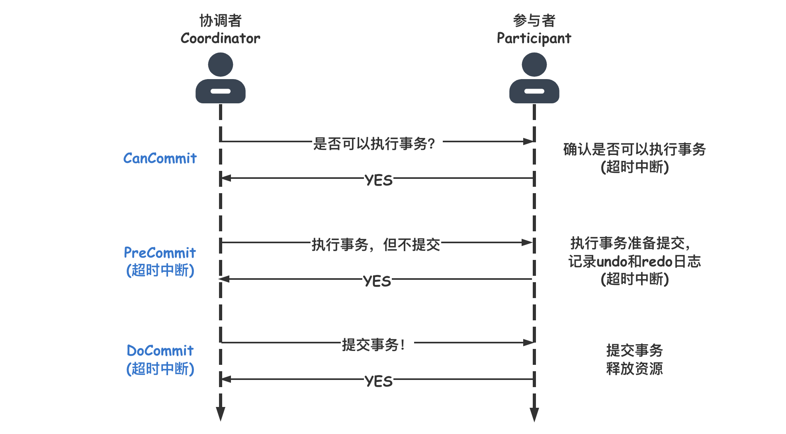

上图是 3PC 在成功的环境下的流程图，可以看到 3PC 在很多地方进行了**超时中断的处理**，比如协调者在指定时间内为收到全部的确认消息则进行事务中断的处理，这样能 **减少同步阻塞**的时间 。还有需要注意的是，3PC 在 DoCommit 阶段参与者如未收到协调者发送的提交事务的请求，**它会在一定时间内进行事务的提交**。为什么这么做呢？是因为这个时候肯定保证了在第一阶段所有的协调者全部返回了可以执行事务的响应，这个时候**有理由相信其他系统都能进行事务的执行和提交**，所以不管协调者有没有发消息给参与者，进入第三阶段参与者都会进行事务的提交操作。

相对于 2PC，3PC 协议最大的优点在于降低了参与者的阻塞范围，并且能够在出现单点故障后继续达成一致。**3PC 主要解决的单点故障问题，并减少阻塞范围**，因为一旦参与者无法及时收到来自协调者的信息之后，它会**默认执行 commit**，而不会一直持有事务资源并处于阻塞状态。

3PC 通过一系列的**超时机制很好的缓解了阻塞问题**，但是最重要的**==一致性问题并没有得到根本的解决==**，比如在 PreCommit 阶段，当一个参与者收到了请求之后其他参与者和协调者挂了或者出现了**网络分区**，这个时候收到消息的参与者都会进行事务提交，这就会出现**数据不一致**性问题。

所以，要解决一致性问题还需要靠 **Paxos 算法**。

#### Paxos算法

##### 1.概述

Paxos 算法使用希腊的一个小岛名作为比喻，描述了 **Paxos 小岛中通过决议的流程**，并以此命名这个算法。自 Paxos 问世以来就持续垄断了分布式一致性算法，Paxos 这个名词几乎等同于分布式一致性。然而 Paxos 的最大特点就是难，**不仅难以理解，更难以实现**。

Paxos 算法是一种**基于消息传递且具有高度容错特性的分布式一致性算法**，是目前公认的解决分布式一致性问题最有效的算法之一，**其解决的问题就是在分布式系统中如何就某个值(决议)达成一致**。它用于达成共识性问题，即对多个节点产生的值，该算法能**保证只选出唯一一个值**。

Paxos 算法运行在**允许宕机故障的异步系统**中，**不要求可靠的消息传递**，可容忍消息丢失、延迟、乱序以及重复。它利用大多数(Majority) 机制保证了 2F+1 的容错能力，**即 2F+1 个节点的系统最多允许 F 个节点同时出现故障**。

一个或多个**提议进程(Proposer)** 可以发起**提案(Proposal)**，Paxos 算法使所有提案中的某一个提案，在**所有进程中达成一致**。系统中的多数派同时认可该提案，即达成了一致。最多只针对一个确定的提案达成一致。

主要有三类节点：

- **提议者**(Proposer)：**提出提案**，提案信息包括提案编号和提议的 value。
- **接受者**(Acceptor)：对每个提议进行投票。
- **最终决策学习者**(Learner)：被告知投票的结果，不参与投票过程。

在多副本状态机中，每个副本同时具有 Proposer、Acceptor、Learner **三种角色**。

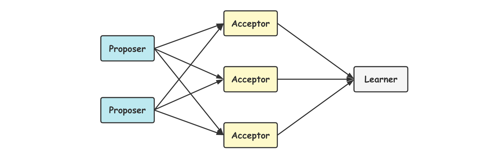

##### 2.算法流程

Paxos 算法通过一个决议分为**两个阶段**(Learn 阶段之前决议已经**形成**)。规定一个**提议**包含两个字段：**[n, v]**，其中 n 为序号(具有唯一性)，v 为提议值。

1. **第一阶段**：**Prepare 阶段**。Proposer 向 Acceptors 发出 Prepare 请求，Acceptors 针对收到的 **Prepare 请求**进行 **Promise 承诺**。
2. **第二阶段**：**Accept 阶段**。Proposer 收到多数 Acceptors 承诺的 Promise 后，向 Acceptors 发出 **Propose 请求**，Acceptors 针对收到的 Propose 请求进行 **Accept 处理**。
3. **第三阶段**：**Learn 阶段**。Proposer 在收到多数 Acceptors 的 Accept 之后，标志着**本次 Accept 成功**，决议形成，将形成的决议发送**给所有 Learners**。

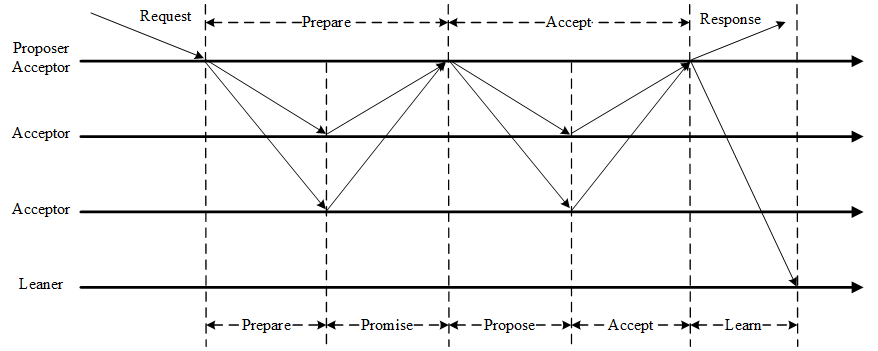

Paxos算法流程中的每条消息描述如下：

- **Prepare**: Proposer 生成**全局唯一且递增的 Proposal ID**(可使用时间戳加 Server ID)，向所有 Acceptors 发送 Prepare 请求，这里无需携带提案内容，只携带 Proposal ID 即可。
- **Promise**: Acceptors 收到 Prepare 请求后，做出 "**两个承诺，一个应答**"。

###### (1)Prepare阶段

下图演示了两个 Proposer 和三个 Acceptor 的系统中运行该算法的**初始过程**，每个 Proposer 都会向所有 **Acceptor 发送 Prepare 请求**。


当 **Acceptor** 接收到一个 **Prepare 请求**，包含的提议为 **[n1, v1]**，并且之前还未接收过 Prepare 请求，那么发送一个 **Prepare 响应**，设置当前接收到的提议为 [n1, v1]，并且保证以后**不会再接受序号小于 n1 的提议**。

如下图，Acceptor X 在收到 **[n=2, v=8]** 的 Prepare 请求时，由于之前没有接收过提议，因此就发送一个 [no previous] 的 Prepare 响应，设置当前接收到的提议为 [n=2, v=8]，并且保证以后不会再接受小于 2 的提议。其它的 Acceptor 类似。

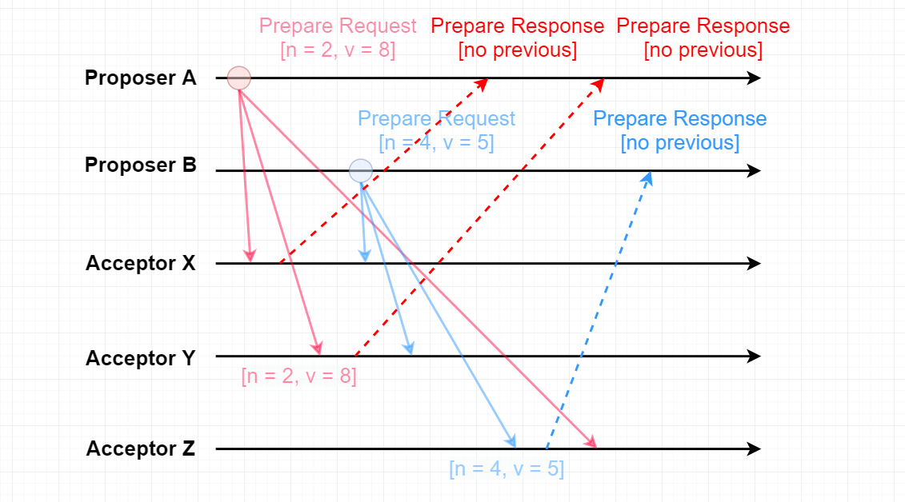

如果 Acceptor 接收到一个 Prepare 请求，包含的提议为 [n2, v2]，并且之前已经接收过提议 [n1, v1]。如果 n1 > n2，那么就丢弃该提议请求；否则，发送 Prepare 响应，该 Prepare 响应包含之前已经接收过的提议 [n1, v1]，设置当前接收到的提议为 [n2, v2]，并且保证以后**不会再接受序号小于 n2 的提议**。

如下图，Acceptor Z 收到 Proposer A 发来的 [n=2, v=8] 的 Prepare 请求，由于之前已经接收过 [n=4, v=5] 的提议，并且 n > 2，因此就抛弃该提议请求；Acceptor X 收到 Proposer B 发来的 [n=4, v=5] 的 Prepare 请求，因为之前接收到的提议为 [n=2, v=8]，并且 2 <= 4，因此就发送 [n=2, v=8] 的 Prepare 响应，设置当前接收到的提议为 [n=4, v=5]，并且保证以后不会再接受序号小于 4 的提议。Acceptor Y 类似。

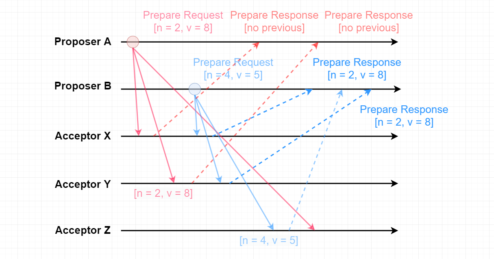

###### (2)Accept阶段

当一个 Proposer 接收到超过一半 Acceptor 的 Prepare 响应时，就可以发送 Accept 请求。

Proposer A 接收到两个 Prepare 响应之后，就发送 [n=2, v=8] Accept 请求。该 Accept 请求会被所有 Acceptor 丢弃，因为此时所有 Acceptor 都保证不接受序号小于 4 的提议。

Proposer B 过后也收到了两个 Prepare 响应，因此也开始发送 Accept 请求。需要注意的是，Accept 请求的 v 需要取它收到的最大提议编号对应的 v 值，也就是 8。因此它发送 [n=4, v=8] 的 Accept 请求。

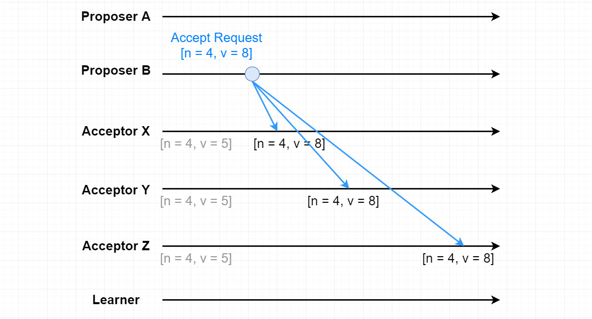

###### (3)Learn阶段

Acceptor **接收到 Accept 请求时**，如果序号大于等于该 Acceptor 承诺的最小序号，那么就**发送 Learn 提议给所有的 Learner**。当 Learner 发现有大多数的 Acceptor 接收了某个提议，那么该提议的**提议值就被 Paxos 选择出来**。

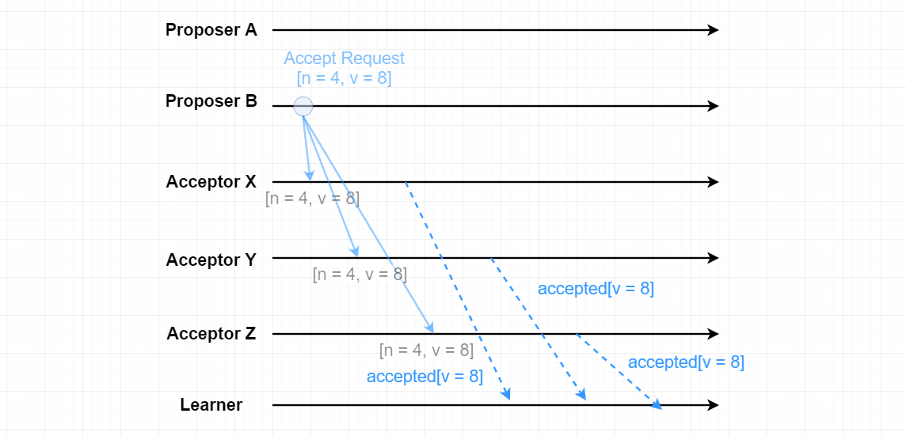

##### 3.约束条件

###### (1)正确性

指**只有一个提议值会生效**。因为 Paxos 协议要求每个生效的提议被多数 Acceptor 接收，并且 Acceptor 不会接受两个不同的提议，因此可以保证正确性。

###### (2)可终止性

指最后**总会有一个提议生效**。Paxos 协议能够让 Proposer 发送的提议朝着能被大多数 Acceptor 接受的那个提议靠拢，因此能够保证可终止性。

##### 4.死循环问题

其实就有点类似于两个人吵架，A 说我是对的，B 说我才是对的，两个人据理力争的谁也不让谁。

比如说此时提案者 P1 提出一个方案 **M1**，完成了 **Prepare 阶段**的工作，这个时候 acceptor 则批准了 M1，但是此时提案者 P2 同时也提出了一个方案 M2，它也完成了 Prepare 阶段的工作。然后 P1 的方案已经不能在第二阶段被批准了(因为 acceptor 已经批准了比 M1 更大的 M2)，所以 P1 自增方案变为 M3 重新进入 Prepare 阶段，然后 acceptor 又批准了新的 M3 方案，它又不能批准 M2 了，这个时候 M2 又自增进入 Prepare 阶段。

就这样无休无止的永远提案下去，这就是 Paxos 算法的**死循环问题**。

#### Raft算法

由于 Paxos 算法非常难以理解、实现、排错，所以不断有人尝试优化这一算法，直到 2013 年才有了重大突破，斯坦福的 Diego Ongaro、John Ousterhout 以易懂性为目标设计了新的一致性算法：**Raft算法**，到现在有十多种语言实现的 Raft 算法框架，较为出名的有以 Go 语言实现的 Etcd，它的功能类似于 Zookeeper，但采用了更为主流的 REST 接口。

Raft 是一个通俗易懂，更**容易落地**的分布式协议。

##### 1.节点状态

**每个节点**有**三个状态**，他们会在这三个状态之间进行变换。**客户端只能从主节点写数据，从节点里读数据**。


##### 2.算法流程

> **(1)选主流程**

初始是 **Follwer 状态节点**，等 100-300ms 没有收到 Leader 节点的心跳就**变候选人**。候选人给大家发选票，候选人获得大多数节点的选票就变成了 Leader 节点。

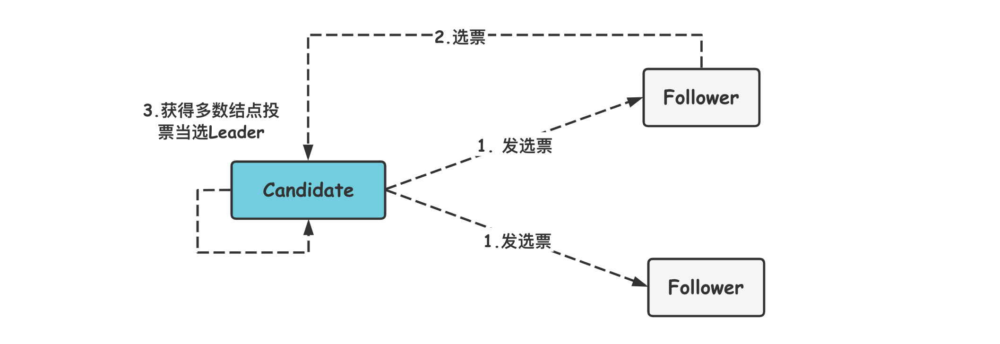

> **(2)日志复制流程**

每次改变数据**先记录日志**，**日志未提交不能改节点的数值**。然后 Leader 会复制数据给其他 Follower 节点，并等大多数节点写日志成功再提交数据。

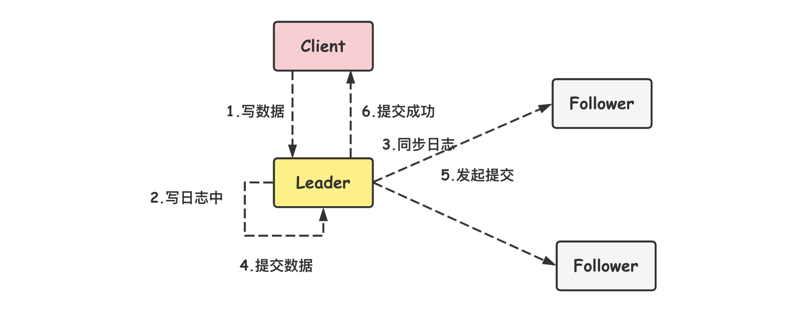

> **(3)选举超时**

每个节点随机等 150 到 300MS，如果时间到了就开始发选票，因为有的节点等的时间短，所以它会先发选票，从而当选成主节点。但是如果两个候选人获得的票一样多，它们之间就要打加时赛，这个时候又会重新随机等 150 到 300MS，然后发选票，直到获得最多票当选成主节点。

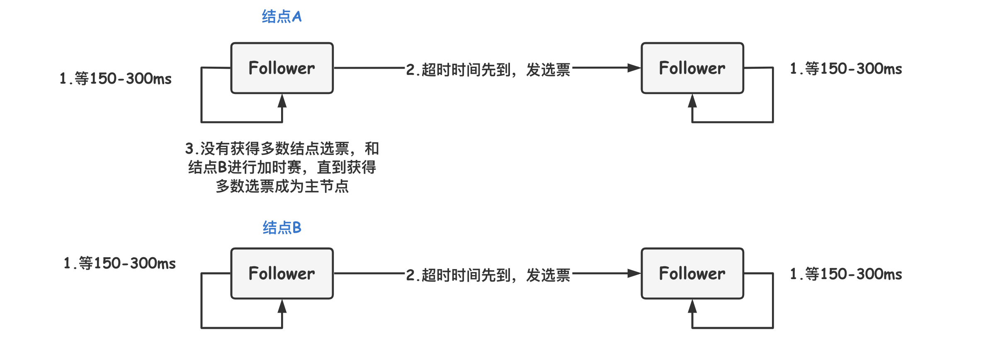

> **(4)心跳超时**

每个节点会记录主节点是谁，并且和主节点之间维持一个心跳超时时间，如果没有收到主节点回复，从节点就要重新选举候选人节点。

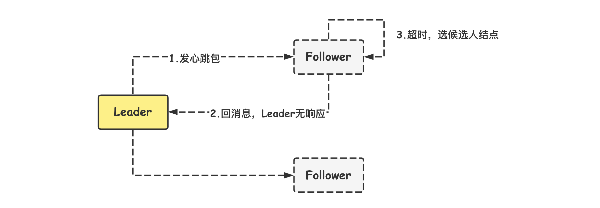

> **(5)集群中断**

当集群之间的部分节点失去通讯时，主节点的日志不能复制给多个从节点就不能进行提交。

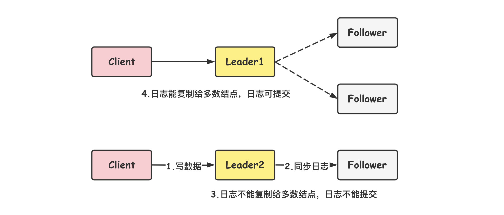

> **(6)集群恢复**

当集群恢复之后，原来的主节点发现自己不是选票最多的节点，就会变成**从节点**，并回滚自己的日志，最后主节点会同步日志给从节点，保持主从数据的一致性。

### 分布式事务

#### 概述

普通事务是由一系列对系统中数据进行访问与更新的操作所组成的一个程序执行逻辑单元，狭义上的事务特指数据库事务。事务有**四个特性**，分别是原子性(Atomicity)、一致性(Consistency)、隔离性(Isolation) 和持久性(Durability)，简称事务的 ACID 特性。

**分布式事务**是指事务的参与者、支持事务的服务器、资源服务器以及事务管理器分别位于分布式系统的**不同节点**之上。

#### CAP理论

分布式系统不可能同时满足**一致性**(C：Consistency)、**可用性**(A：Availability)和**分区容忍性**(P：Partition Tolerance)，最多只能同时满足**其中两项**。

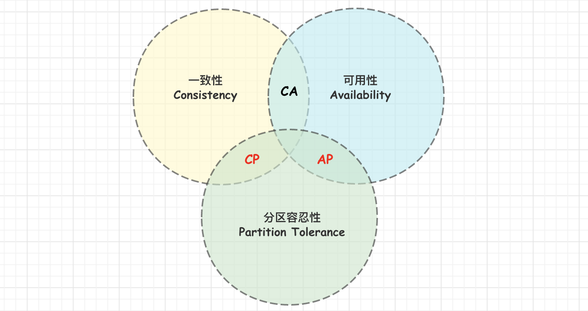

##### 1.一致性(Consistency)

**一致性**指的是**多个数据副本**是否能**保持一致**的特性，在一致性的条件下，系统在执行数据更新操作之后能够从一致性状态转移到另一个一致性状态。

对系统的一个数据**更新成功**之后，如果所有用户都能够**读取到最新的值**，该系统就被认为具有**强一致性**。

##### 2.可用性(Availability)

**可用性**指分布式系统在面对**各种异常**时可以提供正常服务的能力，可以用系统可用时间占总时间的比值来衡量，4 个 9 的可用性表示系统 99.99% 的时间是可用的。

在可用性条件下，要求系统提供的**服务一直处于可用的状态**，对于用户的每一个操作请求总是能够在有限的时间内返回结果。

##### 3.分区容忍性(Partion Tolerance)

**网络分区**指分布式系统中的节点被**划分为多个区域**，每个区域**内部可以通信**，但是**区域之间无法通信**。

分区容忍性指分布式系统在**遇到任何网络分区故障(脑裂)**的时候，**仍然需要能对外提供一致性和可用性的服务**，除非是整个网络环境都发生了故障。

##### 4.取舍

对于一个分布式系统而言，**分区容错性**是一个基本的需求，因为放弃分区容错性 P 就意味着放弃了系统的可拓展性。因为对于分布式系统，网络问题是一个必定会出现的异常情况，因此分区容错就是分布式系统必然要面对与解决的问题。当发生网络分区的时候，如果要继续服务，那么强一致性和可用性只能二选一。因此通常需要根据业务特点在 **C(一致性) 和 A(可用性)** 之间寻求平衡。

在多个节点之间进行数据同步时：

- 为了保证一致性(**CP**)，**不能访问未同步完成的节点**，也就失去了部分可用性。
- 为了保证可用性(**AP**)，**允许读取所有节点的数据**，但是数据可能不一致。

#### BASE理论

BASE 是**基本可用**(Basically Available)、**软状态**(Soft State) 和**最终一致性**(Eventually Consistent) 三个短语的缩写。

BASE 理论是对 CAP 中**一致性和可用性权衡**的结果，它的核心思想是：**即使无法做到强一致性，但每个应用都可以根据自身业务特点，采用适当的方式来使系统达到最终一致性**。

也就是牺牲数据的**一致性**来满足系统的**高可用性**，系统中一部分数据不可用或者不一致时，仍需要保持系统整体基本可用。

##### 1.基本可用(Basically Available)

指分布式系统在出现故障的时候，保证**核心可用**，允许**损失部分可用性**。基本可用的例子：

- 响应时间上的损失。响应时间变长。
- 功能上的损失。如服务降级。

例如电商在做促销时，为了保证**购物系统的稳定性**，部分消费者可能会被引导到一个**降级的页面**。

##### 2.软状态(Soft State)

**软状态**指允许系统中的数据存在**中间状态**，并认为该中间状态**不会影响系统整体可用性**，即允许系统不同节点的**数据副本之间进行同步的过程存在一定时延**。

##### 3.最终一致性(Eventually Consistent)

**最终一致性**强调的是系统中所有的数据副本，在经过一段时间的同步后，**最终能达到一致的状态**。其本质是需要系统保证最终数据能够达到一致，而不需要实时保证系统数据的强一致性。

**ACID** 要求**强一致性**，通常运用在**传统的数据库系统**上。而 **BASE** 要求最终一致性，通过牺牲强一致性来达到可用性，通常运用在**大型分布式系统**中。

工程实践中，最终一致性存在以下五类主要变种。

- 因果一致性。
- 读已之所写。
- 会话一致性。
- 单调读一致性。
- 单调写一致性。

##### 4.应用

总的来说，BASE 理论面向的是大型高可用高拓展的分布式系统，和传统事务的 ACID 特性是相反的，它完全不同于 ACID 的强一致性模型，而是提出通过牺牲强一致性来获得可用性，并允许数据在一段时间内是不一致的，但最终达到一致性状态。

在实际的分布式场景中，不同业务单元和组件对一致性的要求是不同的，因此 ACID 和 BASE 往往会**结合在一起使用**。

针对**数据库**领域，BASE 思想的主要实现是对**业务数据进行拆分**，让不同的数据分布在不同的机器上，以提升系统的可用性，当前主要有以下两种做法：

- 按**功能划分**数据库。
- **分片**(如开源的 Mycat、Amoeba 等)。

由于拆分后会涉及**分布式事务**问题，所以 eBay 在该 BASE 论文中提到了如何用最终一致性的思路来实现高性能的分布式事务。

### 分布式系统设计

#### 分布式ID

随着业务发展，数据量将越来越大，需要对数据进行**分表**，而分表后如果每个表中的数据都进行普通自增，则可能出现 ID 冲突。这时就需要一个单独的**机制来负责生成唯一 ID**，生成的 ID 也叫做**分布式ID**，或**全局ID**。常见分布式 ID 生成方案如下。

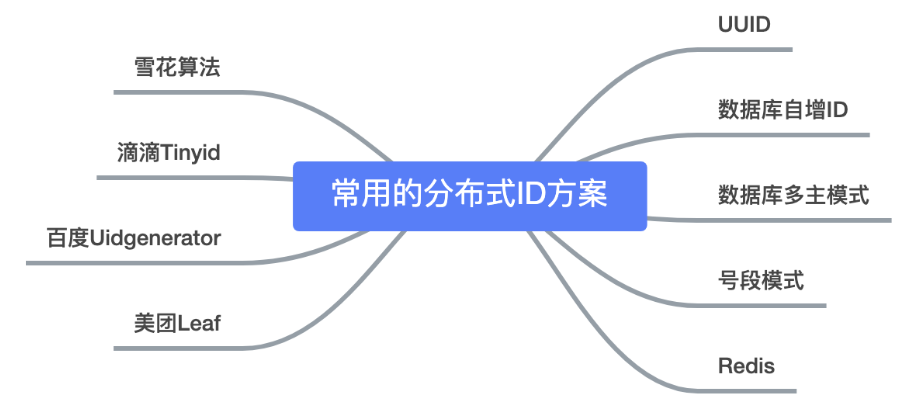

生成分布式 ID 的思想大致两种：

- **自增思想**：数据库自增 ID、数据库多主模式、号段模式、Redis 等。
- **雪花算法思想**。

##### 1.UUID

不适合作为主键，长度较长且无序不可读，作为主键性能较差。UUID 不具有有序性，会导致 B+ 树索引在写的时候有过多的随机写操作，可能造成页分裂，成本较大。

##### 2.Redis生成ID

使用 Redis 来生成分布式 ID 其实和利用 MySQL 自增 ID 类似，可以利用 Redis 中的 **incr 命令**来实现**原子性的自增与返回**，比如：

```shell
$ 127.0.0.1:6379> set seq_id 1     // 初始化自增ID为1
OK
$ 127.0.0.1:6379> incr seq_id      // 增加1，并返回
(integer) 2
$ 127.0.0.1:6379> incr seq_id      // 增加1，并返回
(integer) 3
```

使用 Redis 的效率很高，但需要考虑**持久化**的问题。

**RDB 持久化**相当于**打一个快照**进行持久化，如果打完快照后，连续自增了几次，还没来得及做下一次快照持久化，这个时候 Redis 挂掉了，重启 Redis 后会**出现 ID 重复**。

**AOF 持久化**相当于对每条写命令进行持久化，如果 Redis 挂掉了，**不会出现 ID 重复的现象**，但是会由于 incr 命令过多而导致重启恢复数据时间过长。

##### 3.雪花算法

###### (1)概述

雪花算法是 Twitter 开源的分布式 ID 生成算法，它**不依赖数据库**。其**核心思想是**：分布式 ID 固定是一个 **long 型数字**，一个 long 型占 8 个字节，也就是 **64 个 bit**，原始 Snowflake 算法中对于 bit 的分配如下图：

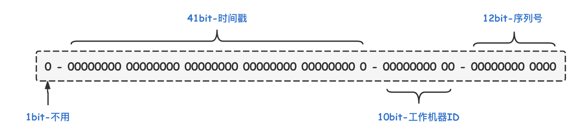

- **第一个 bit 位**：是标识部分，由于 long 的最高位是符号位(正数是 0)，一般生成的 ID 为正数，所以不使用且固定为 0。
- **时间戳部分**：占 41 bit，这个是**毫秒级的时间**，一般实现上不会存储当前的时间戳，而是时间戳的差值(当前时间 - 固定的开始时间)，这样可以使**产生的 ID 从更小值**开始；41 位的时间戳可以使用 69 年，(1L << 41) / (1000L * 60 * 60 * 24 * 365) = 69年。
- **工作机器 id 部分**：占 10bit，这里比较灵活，比如，可以使用前 5 位作为数据中心机房标识，后 5 位作为单机房机器标识，可以部署 1024 个节点。
- **序列号部分**：占 12bit，支持**同一毫秒内**同一个节点生成 4096 个 ID。

将这个算法封装为一个**工具方法**，各个业务应用可以直接使用该工具方法来获取分布式 ID，只需保证**每个业务应用有自己的工作机器 ID 即可**，而不需要单独去搭建一个获取分布式 ID 的应用。

一个 github 上用 Java 实现的版本：[链接](https://github.com/beyondfengyu/SnowFlake)

```java
public class SnowFlake {

    /** 起始的时间戳 */
    private final static long START_STMP = 1480166465631L;

    /** 每一部分占用的位数 */
    private final static long SEQUENCE_BIT = 12; // 序列号占用的位数
    private final static long MACHINE_BIT = 5;   // 机器标识占用的位数
    private final static long DATACENTER_BIT = 5;// 数据中心占用的位数

    /** 每一部分的最大值 */
    private final static long MAX_DATACENTER_NUM = -1L ^ (-1L << DATACENTER_BIT);
    private final static long MAX_MACHINE_NUM = -1L ^ (-1L << MACHINE_BIT);
    private final static long MAX_SEQUENCE = -1L ^ (-1L << SEQUENCE_BIT);

    /** 每一部分向左的位移 */
    private final static long MACHINE_LEFT = SEQUENCE_BIT;
    private final static long DATACENTER_LEFT = SEQUENCE_BIT + MACHINE_BIT;
    private final static long TIMESTMP_LEFT = DATACENTER_LEFT + DATACENTER_BIT;

    private long datacenterId;  // 数据中心
    private long machineId;     // 机器标识
    private long sequence = 0L; // 序列号
    private long lastStmp = -1L;// 上一次时间戳

    public SnowFlake(long datacenterId, long machineId) {
        if (datacenterId > MAX_DATACENTER_NUM || datacenterId < 0) {
            throw new IllegalArgumentException("datacenterId can't be greater than MAX_DATACENTER_NUM or less than 0");
        }
        if (machineId > MAX_MACHINE_NUM || machineId < 0) {
            throw new IllegalArgumentException("machineId can't be greater than MAX_MACHINE_NUM or less than 0");
        }
        this.datacenterId = datacenterId;
        this.machineId = machineId;
    }

    /** 产生下一个ID */
    public synchronized long nextId() {
        long currStmp = getNewstmp();
        if (currStmp < lastStmp) {
            throw new RuntimeException("Clock moved backwards.  Refusing to generate id");
        }

        if (currStmp == lastStmp) {
            // 相同毫秒内，序列号自增
            sequence = (sequence + 1) & MAX_SEQUENCE;
            // 同一毫秒的序列数已经达到最大
            if (sequence == 0L) {
                currStmp = getNextMill();
            }
        } else {
            // 不同毫秒内，序列号置为0
            sequence = 0L;
        }

        lastStmp = currStmp;

        return (currStmp - START_STMP) << TIMESTMP_LEFT // 时间戳部分
            | datacenterId << DATACENTER_LEFT       	// 数据中心部分
            | machineId << MACHINE_LEFT             	// 机器标识部分
            | sequence;                             	// 序列号部分
    }

    private long getNextMill() {
        long mill = getNewstmp();
        while (mill <= lastStmp) {
            mill = getNewstmp();
        }
        return mill;
    }

    private long getNewstmp() {
        return System.currentTimeMillis();
    }

    public static void main(String[] args) {
        SnowFlake snowFlake = new SnowFlake(2, 3);

        for (int i = 0; i < (1 << 12); i++) {
            System.out.println(snowFlake.nextId());
        }

    }
}
```

许多大厂并没有直接使用 Snowflake，而是进行了**改造**，因为 Snowflake 算法中**最难实践的就是工作机器 id**，原始的雪花算法需要**人工去为每台机器去指定一个机器 id**，并配置在某个地方从而让算法从此处获取机器 id。但是在大厂里机器很多，人力成本太大且容易出错，所以许多都进行了改造。

###### (2)百度(uid-generator)

**uid-generator** 使用的就是 Snowflake，只是在生产机器 id，也叫做 workId 时有所不同。

uid-generator 中的 workId 是由 **uid-generator** 自动生成的，并且考虑到了应用部署在 docker 上的情况，在 uid-generator 中用户可以自己去定义 **workId 的生成策略**，默认提供的策略是：**应用启动时由数据库分配**。说的简单一点就是：应用在启动时会往数据库表(uid-generator 需要新增一个 WORKER_NODE 表)中去**插入一条数据**，数据插入成功后返回的该数据对应的自增唯一 id 就是该机器的 workId，而数据由 host，port 组成。

对于 uid-generator 中的 workId，占用了 22 个 bit 位，时间占用了 28 个 bit 位，序列化占用了 13 个 bit 位，需要注意的是，和原始的 Snowflake **不太一样**，时间的单位是秒，而不是毫秒，workId 也不一样，同一个应用每重启一次就会**消费一个 workId**。具体可参考[github.com/baidu](https://github.com/baidu/uid-generator/blob/master/README.zh_cn.md)

###### (3)美团(Leaf)

美团的 Leaf 也是一个分布式 ID 生成框架。它非常全面，即**支持号段模式**，也支持 Snowflake 模式。

Leaf 中的 Snowflake 模式和原始 Snowflake 算法的不同点，也**主要在 workId 的生成**，Leaf 中 workId 是基于 **ZooKeeper 的顺序 Id 来生成的**，每个应用在使用 Leaf-snowflake 时，在启动时都会都在 Zookeeper 中生成一个**顺序 ID**，**相当于一台机器对应一个顺序节点**，也就是一个 workId。

Github 地址：[Leaf](https://github.com/Meituan-Dianping/Leaf)

总得来说，上面两种都是**自动生成 workId**，以让**系统更加稳定以及减少人工参与**。

####  分布式锁

##### 1.概述

在**单机**场景下，可以使用语言的**内置锁**来实现进程同步。但是在**分布式场景**下，需要同步的进程可能位于不同的节点上，那么就需要使用**分布式锁**。引入分布式锁来解决**分布式应用之间访问共享资源的并发问题**。**锁的本质**：**==同一时间只允许一个用户操作==**。

**阻塞锁**通常使用**互斥量**来实现：

- 互斥量为 0: 表示有其它进程在使用锁资源，此时处于锁定状态。
- 互斥量为 1: 表示没有进程在使用锁资源，处于未锁定状态。

1 和 0 可以用一个**整型值**表示，也可以用**某个数据(资源)是否存在**表示。

##### 2.数据库唯一索引

**获得锁**时向表中**插入一条记录**，**释放锁时删除这条记录**。**唯一索引**可以保证该记录只被插入一次，那么就可以用这个记录是否存在来**判断是否存于锁定状态**。

存在以下几个问题：

- 锁**没有失效时间**，解锁失败的话其它进程无法再获得该锁。
- 只能是**非阻塞锁**，插入失败直接就报错了，无法重试。
- **不可重入**，已经获得锁的进程也必须重新获取锁。

MySQL 本身有自带的悲观锁 **FOR UPDATE** 关键字，也可以自己实现悲观/乐观锁来达到目的。

##### 3.Redis的SETNX指令

###### (1)概述

由于 Redis 是**单线程**，所以命令会以**串行**的方式执行，并且本身提供了像 **==SETNX==**(set if not exists) 这样的指令。

使用 **SETNX**(set if not exist) 指令插入一个键值对时，如果 **Key 已经存在**，那么会返回 **False**，否则**插入成功并返回 True**，该命令本身具有互斥性。

SETNX 指令和数据库的**唯一索引类似**，保证了**只存在一个 Key 的键值对**，因此可以**用一个 Key 的键值对是否存在来判断是否存于锁定状态**。

EXPIRE 指令可以为一个键值对设置一个**过期时间**，从而避免了数据库唯一索引实现方式中**释放锁失败**的问题。

###### (2)SETNX源码分析

分布式锁类似于 "**占坑**"，而 **SETNX(SET if not exists)** 指令就是这样的一个操作，**只允许被一个客户端占有**。

看看**源码(t_string.c/setGenericCommand)** ：

```c
// SET/ SETEX/ SETTEX/ SETNX 最底层实现
void setGenericCommand(client *c, int flags, robj *key, robj *val, robj *expire, int unit, robj *ok_reply, robj *abort_reply) {
    /* initialized to avoid any harmness warning */
    long long milliseconds = 0; 
    // 如果定义了key的过期时间则保存到上面定义的变量中
    // 如果过期时间设置错误则返回错误信息
    if (expire) {
        if (getLongLongFromObjectOrReply(c, expire, &milliseconds, NULL) != C_OK)
            return;
        if (milliseconds <= 0) {
            addReplyErrorFormat(c,"invalid expire time in %s",c->cmd->name);
            return;
        }
        if (unit == UNIT_SECONDS) milliseconds *= 1000;
    }

    // lookupKeyWrite 函数是为执行写操作而取出 key 的值对象
    // 这里的判断条件是：
    // 1.如果设置了 NX(不存在)，并且在数据库中找到了 key 值
    // 2.或者设置了 XX(存在)，并且在数据库中没有找到该 key
    // => 那么回复 abort_reply 给客户端
    if ((flags & OBJ_SET_NX && lookupKeyWrite(c->db,key) != NULL) ||
        (flags & OBJ_SET_XX && lookupKeyWrite(c->db,key) == NULL)) {
        addReply(c, abort_reply ? abort_reply : shared.null[c->resp]);
        return;
    }
    // 在当前的数据库中设置键为key值为value的数据
    genericSetKey(c->db,key,val,flags & OBJ_SET_KEEPTTL);
    // 服务器每修改一个key后都会修改dirty值
    server.dirty++;
    if (expire) setExpire(c,c->db,key,mstime()+milliseconds);
    notifyKeyspaceEvent(NOTIFY_STRING,"set",key,c->db->id);
    if (expire) notifyKeyspaceEvent(NOTIFY_GENERIC, "expire",key,c->db->id);
    addReply(c, ok_reply ? ok_reply : shared.ok);
}
```

在 Redis 2.8 的版本中，**加入了 SET 指令的扩展参数，SETNX 可以和 EXPIRE 指令一起执行**：

```bash
> SET lock:test true ex 5 nx
OK
// ... do something critical ...
> DEL lock:test
```

只需要符合 **SET key value [EX seconds | PX milliseconds] [NX | XX] [KEEPTTL]** 这样的格式即可。

###### (3)代码实现

下面用 **Jedis** 来模拟实现，关键代码如下：

```java
private static final String LOCK_SUCCESS = "OK";
private static final Long RELEASE_SUCCESS = 1L;
private static final String SET_IF_NOT_EXIST = "NX";
private static final String SET_WITH_EXPIRE_TIME = "PX";

@Override
public String acquire() {
    try {
        // 获取锁的超时时间，超过这个时间则放弃获取锁
        long end = System.currentTimeMillis() + acquireTimeout;
        // 随机生成一个value
        String requireToken = UUID.randomUUID().toString();
        while (System.currentTimeMillis() < end) {
            String result = jedis
                .set(lockKey, requireToken, SET_IF_NOT_EXIST, SET_WITH_EXPIRE_TIME, expireTime);
            if (LOCK_SUCCESS.equals(result)) {
                return requireToken;
            }
            try {
                Thread.sleep(100);
            } catch (InterruptedException e) {
                Thread.currentThread().interrupt();
            }
        }
    } catch (Exception e) {
        log.error("acquire lock due to error", e);
    }

    return null;
}

@Override
public boolean release(String identify) {
    if (identify == null) {
        return false;
    }

    String script = "if redis.call('get', KEYS[1]) == ARGV[1] then return redis.call('del', KEYS[1]) else return 0 end";
    Object result = new Object();
    try {
        result = jedis.eval(script, Collections.singletonList(lockKey),
                            Collections.singletonList(identify));
        if (RELEASE_SUCCESS.equals(result)) {
            log.info("release lock success, requestToken:{}", identify);
            return true;
        }
    } catch (Exception e) {
        log.error("release lock due to error", e);
    } finally {
        if (jedis != null) {
            jedis.close();
        }
    }

    log.info("release lock failed, requestToken:{}, result:{}", identify, result);
    return false;
}
```

在 Redis 里使用 **SET key value [EX seconds] [PX milliseconds] NX** 创建一个 key，这样就算**加锁**。其中：

- **NX**：表示**==只有 key 不存在==**的时候才会设置**成功**，如果此时 Redis 中存在这个 key，那么设置失败，返回 nil。
- **EX seconds**：设置 **key 的过期时间**，精确到**秒级**。意思是 seconds 秒后**锁自动释放**，别人创建的时候如果发现已经有了就不能加锁了。
- **PX milliseconds**：设置 key 的**过期时间**，精确到**毫秒级**。

比如执行以下命令：

```r
SET resource_name my_random_value PX 30000 NX
```

**==释放锁就是删除 key==** ，但是一般可以用 lua 脚本删除，判断 value **一样才删除**：

``` lua
-- 删除锁的时候，找到key对应的value，跟自己传过去的value做比较，如果一样才删除
if redis.call("get", KEYS[1]) == ARGV[1] then
    return redis.call("del", KEYS[1])
else
    return 0
end
```

为啥要用 random_value **==随机值==**呢？因为如果某个客户端获取到了锁，但是阻塞了很长时间才执行完，比如超过了 30s，此时可能已经**自动释放锁**了，此时可能**别的客户端已经获取到了这个锁**，要是这个时候直接删除 key 的话会有问题，所以得用随机值加上面的 lua 脚本来释放锁。

###### (4)问题1:锁超时

假设有两平行的服务 A B，其中 A 服务在 **获取锁之后** 由于未知原因突然 **挂了**，那么 B 服务就永远无法获取到锁了：

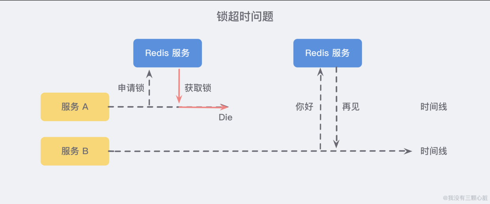

所以需要额外设置一个**超时时间**，来保证服务的**可用性**。

但是另一个问题随即而来：**如果在加锁和释放锁之间的业务逻辑执行得太长，以至于超出了锁的超时限制**，也会出现问题。因为这时候第一个线程持有锁过期了，而临界区的逻辑还没有执行完，与此同时第二个线程就**提前**拥有了这把锁，导致临界区的代码不能得到严格的串行执行。

为了避免这个问题，**Redis 分布式锁==不要用于较长时间的任务==**。如果真的偶尔出现了问题，造成的数据小错乱可能就需要人工的干预。

有一个稍微安全一点的方案是 **将锁的 value 值设置为一个随机数**，释放锁时**先匹配随机数是否一致**，然后**再删除 key**，这是为了 **确保当前线程占有的锁不会被其他线程释放**，除非这个锁是因为过期了而被服务器自动释放的。

**但是匹配 value 和删除 key 在 Redis 中并不是一个原子性的操作**，也没有类似保证原子性的指令，所以可能需要使用像 **Lua 脚本**来处理了，因为 **Lua 脚本可以 保证多个指令的原子性执行**。

> **延伸的讨论：GC可能引发的安全问题**

Martin Kleppmann 曾与 Redis 之父 Antirez 就 Redis 实现分布式锁的安全性问题进行过深入的讨论，其中有一个问题就涉及到 **GC**。在 GC 的时候会发生 **STW(Stop-The-World)**，这本身是为了保障垃圾回收器的正常执行，但可能会引发如下的问题：

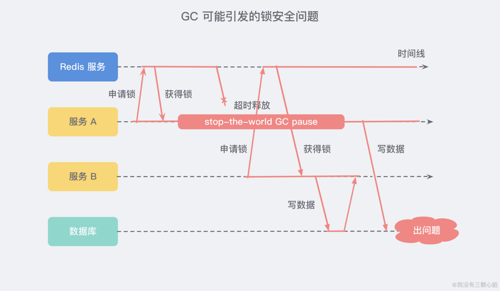

服务 A 获取了锁并设置了超时时间，但是**服务 A 出现了 STW 且时间较长，导致了分布式锁进行了超时释放**，在这个期间服务 B 获取到了锁，待服务 A STW 结束之后又恢复了锁，这就导致了 **服务 A 和服务 B 同时获取到了锁**，这个时候分布式锁就不安全了。

不仅仅局限于 Redis，Zookeeper 和 MySQL 有同样的问题。

###### (5)问题2:单点/多点问题

如果 Redis 采用**单机部署模式**，那就意味着当 Redis 故障了，就会导致整个服务不可用。

而如果采用**主从模式**部署，想象一个这样的场景：服务 A 申请到**一把锁**之后，如果作为主机的 Redis 宕机了，那么服务 B 在申请锁的时候就会从**从机那里获取到这把锁**。为解决这个问题，Redis 作者提出了一种 **RedLock 红锁** 的算法(Redission 同 Jedis)：

```java
// 三个 Redis 集群
RLock lock1 = redissionInstance1.getLock("lock1");
RLock lock2 = redissionInstance2.getLock("lock2");
RLock lock3 = redissionInstance3.getLock("lock3");

RedissionRedLock lock = new RedissionLock(lock1, lock2, lock2);
lock.lock();
// do something....
lock.unlock();
```

##### 4.Redis的RedLock算法

###### (1)概述

Redis 官方提出了一种基于 Redis 实现分布式锁的方式名叫 **RedLock**，此种方式比原先的单节点的方法更安全。是 Redis 官方支持的**分布式锁算法**。

它可以保证以下特性：

- **安全特性**：互斥访问，即永远只有一个 client 能拿到锁。
- **避免死锁**：最终 client 都可能拿到锁，不会出现死锁的情况，即使原本锁住某资源的 client 崩溃了或者出现了网络分区。
- **容错性**：只要大部分 Redis **节点存活**就可以正常提供服务。

###### (2)算法流程

算法很易懂，起 **5 个 master 节点**，分布在不同的机房尽量保证可用性。为了**获得锁**，client 会进行如下操作：

1. 获取当前**时间戳**，单位是毫秒。
2. 跟上面类似，轮流尝试在**每个 master 节点上创建锁**，过期时间较短，一般就几十毫秒。
3. 尝试在**大多数节点**上建立一个锁，比如 5 个节点就要求是 3 个节点 `n / 2 + 1` 。
4. 客户端计算**建立好锁的时间**，如果**建立锁的时间小于超时时间，就算建立成功**了。
5. 要是锁建立失败了，那么就**依次删除之前建立过的锁**。
6. 只要别人建立了一把分布式锁，就得**不断轮询去尝试获取锁**。

使用了**多个 Redis 实例**来实现分布式锁，这是为了保证在发生 Redis **单点故障**时仍然可用。

###### (3)失败重试

如果一个客户端**申请锁失败**了，那么它需要稍等一会再重试，避免多个客户端同时申请锁的情况，最好的情况是一个 client 需要**几乎同时向 5 个 master 发起锁申请**。另外就是如果 client 申请锁失败了它需要尽快在它曾经申请到锁的 master 上执行 **unlock 操作**，便于其他 client 获得这把锁，避免这些锁过期造成的时间浪费，当然如果这时候网络分区使得 client 无法联系上这些 master，那么这种浪费就是不得不付出的代价了。

###### (4)释放锁

放锁操作很简单，就是依次释放所有节点上的锁就行了。

###### (5)崩溃恢复和fsync

如果节点没有持久化机制，client 从 5 个 master 中的 3 个处获得了锁，然后其中一个重启了，这是注意 **整个环境中又出现了 3 个 master 可供另一个 client 申请同一把锁！** 违反了互斥性。如果开启了 AOF 持久化那么情况会稍微好转一些，因为 Redis 的过期机制是语义层面实现的，所以在 server 挂了的时候时间依旧在流逝，重启之后锁状态不会受到污染。但是考虑断电之后呢，AOF 部分命令没来得及刷回磁盘直接丢失了，除非配置刷盘策略为 fsnyc = **always**，但这会降低性能。

解决这个问题的方法是，当一个**节点重启**之后，规定**在 max TTL 期间它是不可用**的，这样它就不会干扰原本已经申请到的锁，等到它 crash 前的那部分锁都过期了，环境不存在历史锁了，那么再把这个节点加进来正常工作。

###### (6)性能

Martin 认为 Redlock 实在**不是**一个好的选择，对于需求性能的分布式锁应用**它太重了且成本高**；对于需求正确性的应用来说它不够安全。因为它对高危的时钟或者说其他上述列举的情况进行了不可靠的假设，如果**应用只需要高性能的分布式锁不要求多高的正确性，那么单节点 Redis 够了**；如果应用想要保住**正确性**，那么不建议 Redlock，建议使用一个**合适的一致性协调系统**，例如 Zookeeper，且保证存在 fencing token。

##### 5.基于Zookeeper实现

###### (1)分布式锁实现

- 创建一个**锁目录 /lock**。
- 当一个客户端需要获取锁时，在 /lock 下**创建==临时有序的子节点==**。
- 客户端获取 /lock 下的**子节点列表**，判断自己创建的**子节点是否为当前子节点列表中序号最小的子节点**，如果是则认为**获得锁**；否则**监听自己的==前一个子节点==**，获得子节点的变更通知后重复此步骤直至获得锁。
- 执行业务代码，完成后**删除对应的子节点**。

###### (2)会话超时

如果一个已经获得**锁的会话超时**了，因为创建的是**临时节点**，所以该会话对应的临时节点会被删除，其它会话就可以获得锁了。可以看到，Zookeeper 分布式锁**不会出现数据库的唯一索引实现的分布式锁释放锁失败问题**。

###### (3)羊群效应

一个节点**未获得锁**，只需要**监听自己的==前一个子节点==**，这是因为如果监听所有的子节点，那么任意一个子节点状态改变，其它所有子节点**都会收到通知**，这会给 Zookeeper 服务器造成巨大的开销和网络压力，即**羊群效应**。

###### (4)代码实现demo

ZK 分布式锁可以做的比较简单，就是**某个节点尝试创建临时 znode**，此时创建成功了就**获取了这个锁**；这个时候别的客户端来创建锁会失败，只能**注册一个监听器**监听这个锁。释放锁就是删除这个 znode，一旦释放掉就会通知客户端，然后有一个等待着的客户端就可以再次重新加锁。

``` java
public class ZooKeeperSession {

    private static CountDownLatch connectedSemaphore = new CountDownLatch(1);

    private ZooKeeper zookeeper;
    private CountDownLatch latch;

    public ZooKeeperSession() {
        try {
            this.zookeeper = new ZooKeeper("192.168.31.187:2181, 192.168.31.19:2181, 192.168.31.227:2181", 50000, new ZooKeeperWatcher());
            try {
                connectedSemaphore.await();
            } catch (InterruptedException e) {
                e.printStackTrace();
            }
            System.out.println("ZooKeeper session established.");
        } catch (Exception e) {
            e.printStackTrace();
        }
    }

    // 获取分布式锁
    public Boolean acquireDistributedLock(Long productId) {
        String path = "/product-lock-" + productId;

        try {
            zookeeper.create(path, "".getBytes(), Ids.OPEN_ACL_UNSAFE, CreateMode.EPHEMERAL);
            return true;
        } catch (Exception e) {
            while (true) {
                try {
                    // 相当于是给node注册一个监听器，去看这个监听器是否存在
                    Stat stat = zk.exists(path, true);
                    if (stat != null) {
                        this.latch = new CountDownLatch(1);
                        this.latch.await(waitTime, TimeUnit.MILLISECONDS);
                        this.latch = null;
                    }
                    zookeeper.create(path, "".getBytes(), Ids.OPEN_ACL_UNSAFE, CreateMode.EPHEMERAL);
                    return true;
                } catch (Exception ee) {
                    continue;
                }
            }
        }
        return true;
    }

    // 释放掉一个分布式锁
    public void releaseDistributedLock(Long productId) {
        String path = "/product-lock-" + productId;
        try {
            zookeeper.delete(path, -1);
            System.out.println("release the lock for product[id=" + productId + "]");
        } catch (Exception e) {
            e.printStackTrace();
        }
    }

    // 建立zksession的watcher
    private class ZooKeeperWatcher implements Watcher {

        public void process(WatchedEvent event) {
            System.out.println("Receive watched event: " + event.getState());

            if (KeeperState.SyncConnected == event.getState()) {
                connectedSemaphore.countDown();
            }
            if (this.latch != null) {
                this.latch.countDown();
            }
        }
    }

    // 封装单例的静态内部类
    private static class Singleton {

        private static ZooKeeperSession instance;

        static {
            instance = new ZooKeeperSession();
        }

        public static ZooKeeperSession getInstance() {
            return instance;
        }
    }

    // 获取单例
    public static ZooKeeperSession getInstance() {
        return Singleton.getInstance();
    }

    // 初始化单例的便捷方法
    public static void init() {
        getInstance();
    }
}
```

也可以采用另一种方式，创建**临时顺序节点**：

如果有一把锁，被**多个人**给竞争，此时**多个人会排队**，第一个拿到**锁的人会执行**，然后释放锁；后面的每个人都会去监听**排在自己前面**的那个人**创建的 node**，一旦某个人释放了锁，排在自己后面的人就会**被 ZooKeeper 给通知**，一旦被通知了之后，自己就获取到了锁，就可以执行代码了。

``` java
public class ZooKeeperDistributedLock implements Watcher {

    private ZooKeeper zk;
    private String locksRoot = "/locks";
    private String productId;
    private String waitNode;
    private String lockNode;
    private CountDownLatch latch;
    private CountDownLatch connectedLatch = new CountDownLatch(1);
    private int sessionTimeout = 30000;

    public ZooKeeperDistributedLock(String productId) {
        this.productId = productId;
        try {
            String address = "192.168.31.187:2181, 192.168.31.19:2181, 192.168.31.227:2181";
                zk = new ZooKeeper(address, sessionTimeout, this);
            connectedLatch.await();
        } catch (IOException e) {
            throw new LockException(e);
        } catch (KeeperException e) {
            throw new LockException(e);
        } catch (InterruptedException e) {
            throw new LockException(e);
        }
    }

    public void process(WatchedEvent event) {
        if (event.getState() == KeeperState.SyncConnected) {
            connectedLatch.countDown();
            return;
        }

        if (this.latch != null) {
            this.latch.countDown();
        }
    }

    public void acquireDistributedLock() {
        try {
            if (this.tryLock()) {
                return;
            } else {
                waitForLock(waitNode, sessionTimeout);
            }
        } catch (KeeperException e) {
            throw new LockException(e);
        } catch (InterruptedException e) {
            throw new LockException(e);
        }
    }

    public boolean tryLock() {
        try {
            // 传入进去的locksRoot + “/” + productId
            // 假设productId代表了一个商品id，比如说1
            // locksRoot = locks
            // /locks/10000000000，/locks/10000000001，/locks/10000000002
            lockNode = zk.create(locksRoot + "/" + productId, new byte[0], ZooDefs.Ids.OPEN_ACL_UNSAFE, CreateMode.EPHEMERAL_SEQUENTIAL);

            // 看看刚创建的节点是不是最小的节点
            // locks：10000000000，10000000001，10000000002
            List<String> locks = zk.getChildren(locksRoot, false);
            Collections.sort(locks);
            if(lockNode.equals(locksRoot+"/"+ locks.get(0))){
                // 如果是最小的节点,则表示取得锁
                return true;
            }
            // 如果不是最小的节点，找到比自己小1的节点
            int previousLockIndex = -1;
            for(int i = 0; i < locks.size(); i++) {
                if(lockNode.equals(locksRoot + “/” + locks.get(i))) {
                    previousLockIndex = i - 1;
                    break;
                }
            }
            this.waitNode = locks.get(previousLockIndex);
        } catch (KeeperException e) {
            throw new LockException(e);
        } catch (InterruptedException e) {
            throw new LockException(e);
        }
        return false;
    }

    private boolean waitForLock(String waitNode, long waitTime) throws InterruptedException, KeeperException {
        Stat stat = zk.exists(locksRoot + "/" + waitNode, true);
        if (stat != null) {
            this.latch = new CountDownLatch(1);
            this.latch.await(waitTime, TimeUnit.MILLISECONDS);
            this.latch = null;
        }
        return true;
    }

    public void unlock() {
        try {
            // 删除/locks/10000000000节点
            // 删除/locks/10000000001节点
            System.out.println("unlock " + lockNode);
            zk.delete(lockNode, -1);
            lockNode = null;
            zk.close();
        } catch (InterruptedException e) {
            e.printStackTrace();
        } catch (KeeperException e) {
            e.printStackTrace();
        }
    }

    public class LockException extends RuntimeException {
        private static final long serialVersionUID = 1L;

        public LockException(String e) {
            super(e);
        }

        public LockException(Exception e) {
            super(e);
        }
    }
}
```

##### 6.Redis分布式锁和ZK分布式锁对比

Redis 分布式锁**需要自己不断去尝试获取锁**，比较消耗性能。如果 Redis 获取锁的那个客户端出现 bug 挂了，那么只能等待超时时间之后才能释放锁。Redis 分布式锁确实挺麻烦的，遍历上锁，计算时间等等。

ZK 分布式锁，**获取不到锁，注册个监听器即可**，不需要不断主动尝试获取锁，性能开销较小。ZK 创建的是临时 znode，只要客户端挂了，znode 就没了，此时就**自动释放锁**。ZK 的分布式锁语义清晰实现简单。

总体来说 ZK 的分布式锁比 Redis 的分布式锁牢靠、而且模型简单易用。


#### 参考资料

- 大型网站技术架构：核心原理与案例分析
- [Paxos、Raft分布式一致性最佳实践](https://www.zhihu.com/column/paxos)


