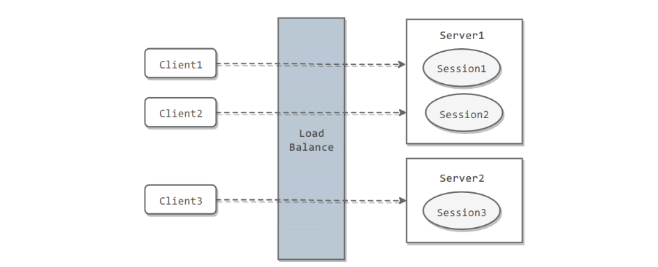
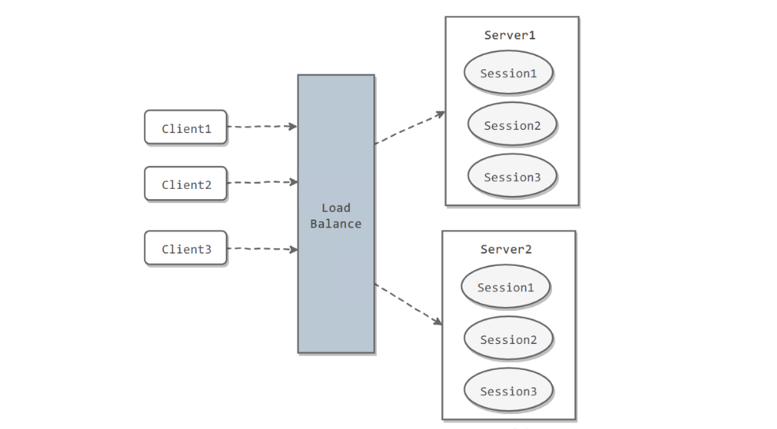

[TOC]

### 系统认证与授权

#### 认证与授权

##### 1.基本概念

认证与授权目的就是为了保护系统的安全性。

**认证(Authentication)** 是**验证用户身份的凭据**(例如用户名/用户 ID 和密码)，通过这个凭据，系统得以知道存在这个用户。

**授权(Authorization)** 发生在认证之后。**授权就是控制系统的访问权限**。比如有些特定资源只能具有特定权限的人才能访问比如 admin，有些对系统资源操作比如删除、添加、更新只能特定人才具有。

#### Cookie与Session

Cookie 和 Session 都是用来**跟踪浏览器用户身份**的会话方式(实现**==会话跟踪==**)，但两者的应用场景不太一样。

##### 1.Cookie

###### (1)概述

Cookies 是**存放在==客户端==，一般用来保存用户信息**的数据(通常经过加密)。Cookie 不能跨域，当前及其父级域名可以取值。Cookie 可以设置有效期。

###### (2)Cookie使用场景

- 保存登录信息。
- 记录用户状态。
- 记录和分析用户行为。如记录用户在某个页面的停留状态或者商品浏览记录。

###### (3)服务端使用Cookie

**1) 设置 cookie 返回给客户端**

```java
@GetMapping("/user")
public String setCookie(HttpServletResponse response) {
    // 创建一个cookie
    Cookie cookie = new Cookie("username", "Jack");
    // 设置cookie过期时间
    cookie.setMaxAge(7 * 24 * 60 * 60); // expires in 7 days
    // 添加到response中
    response.addCookie(cookie);
    return "Username is changed!";
}
```

**2) 使用 @CookieValue 注解获取特定的 cookie 的值**

```java
@GetMapping("/")
public String readCookie(@CookieValue(value = "username", defaultValue = "Atta") String username) {
    return "Username in Cookie: " + username;
}
```

**3) 读取所有的 Cookie 值**

可以从 **HttpServletRequest** 对象中获取全部的 Cookie 值。

```java
@GetMapping("/all-cookies")
public String readAllCookies(HttpServletRequest request) {

    Cookie[] cookies = request.getCookies();
    if (cookies != null) {
        return Arrays.stream(cookies)
            .map(c -> c.getName() + "=" + c.getValue())
            .collect(Collectors.joining(", "));
    }
    return "No cookies";
}
```

##### 2.Session

**Session 的主要作用就是通过==服务端==记录用户的状态。**典型场景是**购物车**，当要添加商品到购物车的时候，系统不知道是哪个用户操作的，因为 HTTP 协议是无状态的。服务端给特定的用户创建**特定的 Session 之后**就可以标识这个用户并且跟踪这个用户了。

**如何使用 Session 进行身份验证？**

一般通过 **SessionID** 来实现用户的验证，SessionID 一般会选择存放在 **Redis** 中。举个例子：用户成功登陆系统，然后返回给客户端具有 **SessionID 的 Cookie**，当用户向后端发起请求的时候会把 SessionID 带上，这样后端就知道用户的身份状态了。详细过程如下：

1. 用户向服务器发送用户名和密码用于登陆。
2. 服务器验证通过后，服务器为用户**创建一个 Session**，并将 Session 信息**存储**起来。
3. 服务器向用户返回一个 **SessionID**，**写入用户的 Cookie**。
4. 当用户保持登录状态时，Cookie 将与**每个后续请求**一起被发送出去。
5. 服务器可以将存储在 Cookie 上的 Session ID 与存储在**内存中或者数据库**中的 Session 信息进行**比较**，以验证用户的身份，返回给用户客户端响应信息的时候会附带用户当前的状态。

使用 Session 的时候需要注意：

1. 依赖 Session 的关键业务一定要**确保客户端开启了 Cookie**。
2. 注意 Session 的**过期时**间。

##### 3.Cookie与Session区别

**Cookie** 数据保存在**客户端**(浏览器端)，**Session** 数据保存在**服务器端**。相对来说 Session 安全性更高。如果使用 Cookie 的一些敏感信息不要写入 Cookie 中，最好能将 Cookie 信息**加密**然后使用到的时候再去服务器端解密。

##### 4.Spring Session

Spring Session 提供了一种**跨多个应用程序**或实例管理用户会话信息的机制。参考文章：

- [Getting Started with Spring Session](https://codeboje.de/spring-session-tutorial/)
- [Guide to Spring Session](https://www.baeldung.com/spring-session)
- [Sticky Sessions with Spring Session & Redis](https://medium.com/@gvnix/sticky-sessions-with-spring-session-redis-bdc6f7438cc3)

##### 5.面试题

> **如果没有Cookie的话Session还能用吗？**

一般是通过 **Cookie 来保存 SessionID** ，假如使用了 Cookie 保存 SessionID 的方案的话，如果客户端**禁用了 Cookie**，那么 Seesion 就**无法**正常工作。但并不是没有 Cookie 之后就不能用 Session 了，比如**可以将 SessionID 放在请求的 URL 里面，**进行 **URL 重写**。

```http
https://baidu.com?session_id=xxx
```

这种方案的安全性和用户体验感较低。

> **为什么Cookie无法防止CSRF攻击，而token可以？**

**CSRF(Cross Site Request Forgery) 即跨站请求伪造**。进行 Session 认证的时候，一般使用 Cookie 来存储 SessionId，当登陆之后服务端生成一个 SessionId 放在 **Cookie** 中返回给客户端，服务端通过 Redis 或者其他存储工具记录保存着这个 SessionId，客户端登录以后每次请求都会**带上这个 SessionId**，服务端通过这个 SessionId 来标识用户。如果别人通过 cookie 拿到了 sessionId 后就可以冒充用户的身份访问系统了。Session 认证中 **Cookie 中的 SessionId 是由浏览器**发送到服务端的，攻击者可以通过**让用户误点攻击链接**，达到攻击效果。

但是使用 **token** 的话就不会存在这个问题，在登录成功获得 token 之后，一般**会选择存放在 Local Storage** 中。然后在前端通过**某些方式**会给每个发到后端的请求**加上这个 token**，这样就不会出现 CSRF 漏洞的问题。因为即使用户点击了非法链接发送了请求到服务端，这个**非法请求是不会携带 token** 的，所以这个请求将是**非法**的。

**==需要注意的是不论是 Cookie 还是 token 都无法避免跨站脚本攻击XSS==(Cross Site Scripting)**。为避免与层叠样式表(Cascading Style Sheets，CSS)的缩写混淆，跨站脚本攻击通常缩写为 XSS。XSS 中攻击者会用各种方式将**恶意代码**注入到其他用户的页面中，就可以通过**脚本**盗用信息，使用**脚本的话 cookie 和 token 都可能被盗用**。

推荐阅读：

1. [如何防止CSRF攻击？—美团技术团队](https://tech.meituan.com/2018/10/11/fe-security-csrf.html)

#### 分布式Session

分布式系统下那么多的服务，Session 状态如何管理？常用的方法有以下几种：

##### 1.集群下的Session管理

一个用户的 Session 信息如果存储在一个**服务器**上，那么当负载均衡器把用户的下一个请求转发到另一个服务器，由于服务器没有用户的 Session 信息，那么该用户就需要重新进行登录等操作。

###### (1)Sticky Session

需要配置**负载均衡器**，使得**一个用户的所有请求都路由到同一个服务器**，这样就可以把用户的 Session 存放在该服务器中。

**缺点**：当服务器宕机时，将丢失该服务器上的所有 Session。



###### (2)Session复制

在服务器之间进行 **Session 同步**操作，每个服务器都有**所有用户的 Session 信**息，因此用户可以向任何一个服务器进行请求。

缺点：**占用过多内存**；同步过程占用网络带宽以及服务器处理器时间。



###### (3)Session服务器

使用一个**单独的服务器存储 Session 数据**，可以使用 **Redis** 这种内存型数据库存储。

**优点**：为了使得大型网站具有伸缩性，集群中的**应用服务器通常需要保持无状态**，那么应用服务器不能存储用户的会话信息。Session Server 将用户的会话信息单独进行存储，从而保证了应用服务器的无状态。

**缺点**：需要去实现存取 Session 的代码。


##### 2.Tomcat+Redis

这个方式挺方便，就是跟之前一样使用 Session 的代码，也是基于 Tomcat 原生的 Session 支持即可，区别就是使用 **Tomcat  RedisSessionManager**，让所有部署的 **Tomcat 都将 Session 数据存储到 Redis 即可**。

在 Tomcat 的配置文件中配置：

``` xml
<Valve className="com.orangefunction.tomcat.redissessions.RedisSessionHandlerValve" />

<Manager className="com.orangefunction.tomcat.redissessions.RedisSessionManager"
         host="{redis.host}"
         port="{redis.port}"
         database="{redis.dbnum}"
         maxInactiveInterval="60"/>
```

然后指定 Redis 的 host 和 port 就行了。还可以用下面这种方式基于 **Redis 哨兵**支持的 **Redis 高可用集群**来保存 Session 数据。

```xml
<Valve className="com.orangefunction.tomcat.redissessions.RedisSessionHandlerValve" />
<Manager className="com.orangefunction.tomcat.redissessions.RedisSessionManager"
         sentinelMaster="mymaster"
         sentinels="<sentinel1-ip>:26379, <sentinel2-ip>:26379, <sentinel3-ip>:26379"
         maxInactiveInterval="60"/>
```

##### 3.Spring Session+Redis

虽然 Tomcat + Redis 的方式好用，但是会**严重依赖于 Web 容器**，不好将代码移植到其他 Web 容器上去（比如 Jetty），尤其是更换技术栈就更难受了。

所以现在也有基于 Java 一站式解决方案，也就是 **Spring**。Spring 全家桶里面啥都有，Spirng Cloud 做微服务，Spring Boot 做脚手架，所以用 **Spring Session** 是一个很好的选择。

在 pom.xml 中配置：

``` xml
<dependency>
    <groupId>org.springframework.session</groupId>
    <artifactId>spring-session-data-redis</artifactId>
    <version>1.2.1.RELEASE</version>
</dependency>
<dependency>
    <groupId>redis.clients</groupId>
    <artifactId>jedis</artifactId>
    <version>2.8.1</version>
</dependency>
```

在 Spring 配置文件中配置：

``` xml
<bean id="redisHttpSessionConfiguration"
      class="org.springframework.session.data.redis.config
             .annotation.web.http.RedisHttpSessionConfiguration">
    <property name="maxInactiveIntervalInSeconds" value="600"/>
</bean>

<bean id="jedisPoolConfig" class="redis.clients.jedis.JedisPoolConfig">
    <property name="maxTotal" value="100" />
    <property name="maxIdle" value="10" />
</bean>

<bean id="jedisConnectionFactory"
      class="org.springframework.data.redis.connection.jedis.JedisConnectionFactory" 
      destroy-method="destroy">
    <property name="hostName" value="${redis_hostname}"/>
    <property name="port" value="${redis_port}"/>
    <property name="password" value="${redis_pwd}" />
    <property name="timeout" value="3000"/>
    <property name="usePool" value="true"/>
    <property name="poolConfig" ref="jedisPoolConfig"/>
</bean>
```

在 **web.xml** 中配置：

``` xml
<filter>
    <filter-name>springSessionRepositoryFilter</filter-name>
    <filter-class>org.springframework.web.filter.DelegatingFilterProxy</filter-class>
</filter>
<filter-mapping>
    <filter-name>springSessionRepositoryFilter</filter-name>
    <url-pattern>/*</url-pattern>
</filter-mapping>
```

示例代码：

``` java
@RestController
@RequestMapping("/test")
public class TestController {

    @RequestMapping("/putIntoSession")
    public String putIntoSession(HttpServletRequest request, String username) {
        request.getSession().setAttribute("name", "leo");
        return "ok";
    }

    @RequestMapping("/getFromSession")
    public String getFromSession(HttpServletRequest request, Model model){
        String name = request.getSession().getAttribute("name");
        return name;
    }
}
```

给 Spring Session **配置基于 Redis 来存储 Session 数据**，然后配置了一个 **Spring Session 的过滤器**，这样的话，**Session 相关操作都会交给 Spring Session 了**。接着在代码中就可以使用原生的 Session 操作，就是**直接基于 Spring Session** 从 Redis 中获取数据了。

总结一下，实现分布式的会话有很多种方式，Tomcat + Redis 早期比较常用，但是会重耦合到 Tomcat 中；现在通过 Spring Session 来实现还是比较香的。

##### 4.弃用Session

使用 **JWT Token** 储存用户身份，然后再从数据库或者 cache 中获取其他的信息。这样无论请求分配到哪个服务器都无所谓。

#### Token与JWT

##### 1.概述

使用 Session 来鉴别用户的身份会带来一些麻烦，比如需要保证保存 Session 信息服务器的可用性、**不适合移动端**(依赖 Cookie) 等等。

使用 **Token** 可以**不需要服务端存放 Session 信息**就能实现身份验证。**JWT(JSON Web Token)** 就是这种方式的实现，这种方式服务端无需保存 Session 数据，**只用在客户端保存服务端返回给客户的 Token** 即可，扩展性得到提升。

**JWT 本质上就一段==签名的 JSON 格式==的数据。由于它是带有签名的，因此接收者便可以验证它的真实性。**

JWT 由 3 部分构成：

1. **Header**(头部)：描述 JWT 的元数据。定义了生成**签名**的算法以及 Token 的类型。
2. **Payload**(负载)：用来存放实际**需要传递**的数据。
3. **Signature**(签名)：服务器通过 Payload、Header 和一个密钥(secret) 使用 Header 里面指定的签名算法(默认由 HMAC SHA256) 生成。

在基于 Token 进行身份验证的的应用程序中，服务器通过 Payload、Header 和一个密钥(secret)创建**令牌（Token）**并将 Token 发送给客户端，客户端将 Token **保存在 Cookie 或者 localStorage 里面**，之后客户端发出的所有请求都会**携带**这个令牌 Token。客户端可以把 token 放在 **Cookie** 里面**自动发送**，但是这样**不能跨域**，所以更好的做法是**放在 HTTP Header** 的  **Authorization** 字段中：**Authorization: Bearer Token**。

详细流程如下：

1. 用户向服务器发送用户名和密码用于登陆系统。
2. 身份验证服务响应并返回了**签名的 JWT**，里面包含了用户信息。
3. 用户以后每次向后端发请求都在 **Header 中带上 JWT**。
4. 服务端检查 JWT 并从中获取用户相关信息并进行**验证**。


推荐阅读：

- [JWT (JSON Web Tokens) Are Better Than Session Cookies](https://dzone.com/articles/jwtjson-web-tokens-are-better-than-session-cookies)
- [JSON Web Tokens (JWT) 与 Sessions](https://juejin.im/entry/577b7b56a3413100618c2938)
- [JSON Web Token 入门教程](https://www.ruanyifeng.com/blog/2018/07/json_web_token-tutorial.html)
- [彻底理解Cookie，Session，Token](https://mp.weixin.qq.com/s?__biz=Mzg2OTA0Njk0OA==&mid=2247485603&idx=1&sn=c8d324f44d6102e7b44554733da10bb7&chksm=cea24768f9d5ce7efe7291ddabce02b68db34073c7e7d9a7dc9a7f01c5a80cebe33ac75248df&token=844918801&lang=zh_CN#rd)

##### 2.Token认证的特点

相比 Session 认证方式，使用 Token 进行身份认证主要有下面的优势：

**(1)可以避免CSRF攻击**

Token 一般会选择存放在客户端的 **LocalStorage** 中，这样可以预防 CSRF 攻击。因为即使用户点击了非法链接发送了请求到服务端，这个非法请求是**不会**携带 Token 的，所以这个请求将是非法的。

但依然存在 XSS 攻击的风险，为了避免 XSS 攻击，可以选择将 Token 存储在标记为 **httpOnly** 的 Cookie 中，但是这样又导致了必须自己提供 CSRF 保护。

具体采用上面哪种方式存储 Token 呢，**大部分**情况下存放在 **LocaStorage** 下都是比较好的选择，某些情况下可能需要存放在标记为 httpOnly 的 Cookie 中会更好。

**(2)适合移动端应用**

使用 Session 进行身份认证需要保存一份信息在**服务器端**，而且这会**依赖 Cookie** 来保存 SessionId，所以**不适合移动端**。使用 Token 进行身份认证就不会存在这种问题，因为只要 Token 可以被客户端存储就能够使用，而且 Token 还可以跨语言使用。

**(3)单点登录友好**

使用 Session 进行身份认证的话，实现单点登录，需要把用户的 Session 信息保存在**一台服务器**上，并且还会遇到常见的 **Cookie 跨域**的问题。但是使用 Token 进行认证的话，Token 被**保存在客户端**，不会存在这些问题。

Token 本身由 OAuth 系列引入后才大规模普及的。主要目的是支持**单点登录**。OAuth 用 Token 作为**唯一的凭证**，使用它的第三方服务器可以在验证完 Token 后建立自己的 Session(既可以用传统 Session，也可以用 Token 作为 Redis 中的 key)，而把用户身份认证工作完全委托给 OAuth。

Token 也有缺点：

**(1)无状态**

Token 自身包含了**身份验证**所需要的所有信息，使得服务器**不需要存储 Session 信息**，这增加了系统的**可用性和伸缩性**，大大减轻了服务端的压力。但是也正是由于 Token 的**无状态**，也导致了它最大的缺点：当后端在 Token 有效期内废弃一个 Token 或者更改它的权限的话，**不会立即生效**，一般需要等到有效期过后才可以。另外当用户 Logout 的话，Token 也还有效。除非在后端增加额外的处理逻辑。 

##### Token认证常见问题

###### (1)注销登录等场景下Token还有效

也就是注销登录之后，Token **依然有效**的问题，与之**类似**的具体相关场景有：

1. 退出登录。
2. 修改密码。
3. 服务端修改了某个用户具有的权限或者角色。
4. 用户的帐户被删除/暂停。
5. 用户由管理员注销。

这个问题**不存在于 Session 认证方式**中，因为 Session 认证中遇到这种情况的话服务端**删除对应的 Session 记录即可**。而 Token 一旦派发出去，如果后端不增加其他逻辑的话，它在**失效之前都是有效**的。大致有下面几种方案解决方法：

- **将 Token 存入内存数据库**：将 Token 存入 Redis。如果需要让某个 Token 失效就直接从 Redis 中**删除这个 Token 即可**。但是这样会导致每次使用 Token 发送请求都要先从 DB 中查询 Token 是否存在的步骤，而且违背了 JWT 的**无状态原则**。
- **黑名单机制**：和上面的方式类似，使用内存数据库比如 Redis 维护一个**黑名单**，如果想让某个 Token 失效的话就直接将这个 Token 加入到 **黑名单** 即可。然后每次使用 Token 进行请求的话都会先判断这个 Token **是否存在于黑名单**中。
- **保持令牌的有效期限短并经常轮换**：很简单的一种方式。但是会导致用户登录状态不会被持久记录，而且需要用户**经常登录**。

对于**修改密码后** Token 还有效问题的解决比较容易，一种比较好的方式：**使用用户的密码的哈希值对 Token 进行签名。因此如果密码更改，则任何先前的令牌将自动无法验证**。

###### (2)Token续签问题

Token 有效期一般都建议设置的不太长，那么 Token **过期**后如何认证，如何**实现动态刷新 Token**，避免用户经常需要重新登录？

Session 认证中一般的续签做法：假如 Session 有效期 30 分钟，如果 30 分钟内用户有访问，就把 Session 有效期被延长 30 分钟。

Token 续签怎么做？

- **类似于 Session 认证中的做法**：这种方案满足于大部分场景。假设服务端给的 Token 有效期设置为 30 分钟，服务端每次进行**校验时**，如果发现 Token 的有效期马上快过期了，服务端就**重新生成 Token 给客户端**。客户端每次请求都检查新旧 Token，如果**不一致**，则**更新**本地的 Token。这种做法的问题是仅仅在**快过期**的时候请求才会更新 Token，对客户端不是很友好。
- **Token 有效期设置到半夜**：这是一种折衷的方案，保证了大部分用户白天可以正常登录，适用于对安全性要求不高的系统。
- **用户登录返回两个 Token**：第一个是 **acessToken** ，它的**过期时间 Token 本身的过期时间比如半个小时**，另外一个是 **refreshToken** 它的过期时间**更长一点**比如为 1 天。客户端登录后，将 accessToken 和 refreshToken 保存在**本地**，每次访问将 accessToken 传给服务端。服务端校验 accessToken 的**有效性**，如果**过期**的话，就将 **refreshToken** 传给服务端。如果有效，服务端就生成**新的 accessToken 给客户端**。否则，客户端就重新登录即可。该方案的不足是：1. 需要客户端**配合**；2. 用户注销的时候需要同时**保证两个 Token 都无效**；3. 重新请求获取 Token 的过程中会有**短暂 Token 不可用**的情况（可以通过在客户端设置定时器，当 accessToken 快过期的时候，提前去通过 refreshToken 获取新的 accessToken）。

#### OAuth2.0

OAuth 是一个行业的**标准授权协议**，主要用来**授权第三方应用获取有限的权限**。OAuth2.0 就是一种**授权机制**，它的最终目的是**为第三方应用颁发一个有时效性的令牌 Token**，使得第三方应用能够**通过该令牌获取相关的资源**。OAuth2.0 是对 OAuth1.0 的完全重新设计，它更快且更容易实现。

OAuth 2.0 比较常用的场景就是**第三方登录**，如用其他网站用微信登录一般就是使用的 OAuth2.0。现在 OAuth2.0 也常见于**支付场景(微信支付、支付宝支付)和开发平台(微信开放平台、阿里开放平台等)**。

微信支付账户相关参数：


**相关帖子：**

- [OAuth 2.0 的一个简单解释](http://www.ruanyifeng.com/blog/2019/04/oauth_design.html)
- [10 分钟理解什么是 OAuth 2.0 协议](https://deepzz.com/post/what-is-oauth2-protocol.html)
- [OAuth 2.0 的四种方式](http://www.ruanyifeng.com/blog/2019/04/oauth-grant-types.html)
- [GitHub OAuth 第三方登录示例教程](http://www.ruanyifeng.com/blog/2019/04/github-oauth.html)

#### 单点登录(SSO)

##### 1.概述

**SSO**(Single Sign On) 即**单点登录**，指的是用户**登陆多个子系统的其中一个就有权访问与其相关的其他系统**。比如登陆京东金融之后，京东超市、京东家电等子系统都是登录状态。

###### (1)SSO与OAuth2.0的区别

OAuth 是一个行业的标准授权协议，主要用来**授权第三方应用获取有限的权限**。而 SSO 解决的是一个公司的**多个相关的系统之间的登陆问题**。

###### (2)单点登录系统的好处

1. **用户角度**：用户能够做到一次登录多次使用，非常友好。
2. **系统管理员角度**：系统只需维护一个统一的账号中心。
3. **新系统开发角度**：新系统开发时只需对接统一的账号中心，简化开发流程。

###### (3)核心功能

单点登录的核心功能有：

- 单点登录
- 单点登出
- 支持跨域单点登录
- 支持跨域单点登出


#### 参考资料

- https://medium.com/@sherryhsu/session-vs-token-based-authentication-11a6c5ac45e4
- https://www.varonis.com/blog/what-is-oauth/
- https://tools.ietf.org/html/rfc6749
- 【服务器端使用cookie】https://attacomsian.com/blog/cookies-spring-boot
- [JWT 超详细分析](https://learnku.com/articles/17883?order_by=vote_count&)
- https://medium.com/devgorilla/how-to-log-out-when-using-jwt-a8c7823e8a6
- https://medium.com/@agungsantoso/csrf-protection-with-json-web-tokens-83e0f2fcbcc
- [Invalidating JSON Web Tokens](https://stackoverflow.com/questions/21978658/invalidating-json-web-tokens)


