[TOC]

### Zookeeper基础

#### 概述

项目从单体到**分布式**转变之后，会产生**多个节点之间协同**的问题。如：

1. 每天的定时任务由谁哪个节点来执行？
2. RPC 调用时的**服务发现**?
3. 如何保证并发请求的**幂等**?

这些问题可以统一归纳为**多节点协调问题**，如果靠节点自身进行协调是不可靠的，性能上也不可取。应该由一个**独立的服务做协调工作**，它必须可靠，而且保证性能。

ZooKeeper 是用于分布式应用的协调服务。它公开了一组简单的 API，**分布式应用程序可以基于这些 API 用于同步，节点状态、配置等信息、服务注册等信息**。ZooKeeper 的设计目标是将那些复杂且容易出错的分布式一致性服务封装起来，构成一个高效可靠的原语集，并以一系列简单易用的接口提供给用户使用。ZooKeeper 虽然是个大管家，但是它不会直接发号施令，而是**只是对各个客户的行为做记录**，不然 Zookeeper 就成了一个中心化的结点，其可靠性依然有问题。

**ZooKeeper 是一个典型的分布式==数据一致性==解决方案，分布式应用程序可以基于 ZooKeeper 实现诸如数据发布/订阅、负载均衡、命名服务、分布式协调/通知、集群管理、Master 选举、分布式锁和分布式队列等功能。**其一致性是通过基于 **Paxos** 算法的 **ZAB 协议**完成的。

ZooKeeper 作为分布式系统也满足 CAP 定理，其实现保证了 **==CP==**(数据一致性与分区容错性)。

#### 部署与常规配置

##### 1.安装与运行

ZooKeeper 基于 Java 开发，下载后只要有对应 JVM 环境即可运行。其**默认的端口号是 2181**。

文件说明：

* apache-zookeeper-xxx-tar.gz 代表**源代码**。
* apache-zookeeper-xxx-bin.tar.gz **运行版本。**

下载地址：[https://zookeeper.apache.org/releases.html#download](https://zookeeper.apache.org/releases.html#download)

具体部署流程：

```bash
# 下载
wget https://mirrors.tuna.tsinghua.edu.cn/apache/zookeeper/current/apache-zookeeper-3.5.5-bin.tar.gz
# 解压
tar -zxvf apache-zookeeper-3.5.5-bin.tar.gz
# 拷贝默认配置
cd {zookeeper_home}/conf 
cp zoo_sample.cfg zoo.cfg
# 启动
{zookeeper_home}/bin/zkServer.sh
```

Zookeeper 有**集群模式**和**单机模式**等两种运行模式，单机模式不过多介绍。

##### 2.集群模式与配置文件

集群模式下一个简单的 zoo.cfg **配置文件**。

```yaml
# ZK中的时间配置最小单位(基本单位)，其他时间配置以整数倍tickTime计算，这里是2秒
tickTime=2000
# Leader允许Follower启动时在initLimit时间内完成数据同步，它表示tickTime时间倍数 即:initLimit*tickTime，这里是20秒
initLimit=10
# Leader发送心跳包给集群中所有Follower，若Follower在syncLimit时间内没有响应，那么Leader就认为该Follower已经挂掉了，即：syncLimit*tickTime，这里为10秒
syncLimit=5
# 数据存储目录
dataDir=/usr/local/zookeeper/data
# 对客户端提供的端口号
clientPort=2181
# 配置ZK的日志目录
dataLogDir=/usr/local/zookeeper/logs
# 单个客户端与Zookeeper最大并发连接数
maxClientCnxns=60
# 保存的数据快照数量，之外的将会被清除
autopurge.snapRetainCount=3
# 自动触发清除任务时间间隔，小时为单位。默认为0，表示不自动清除。
autopurge.purgeInterval=1
# ZK集群节点配置，端口号2888用于集群节点之间数据通信，端口号3888用于集群中Leader选举
server.1=192.168.123.100:2888:3888
server.2=192.168.123.101:2888:3888
server.3=192.168.123.102:2888:3888
```

集群模式下的多个服务器配置为：

```yaml
server.id=host:port:port
```

注意：其中 id 称为 **Server ID**，标识该机器在集群中的**机器序号**；同时需要在数据目录(即 dataDir 参数指定的目录)下创建一个 **==myid==** 文件，该文件仅有**一行内容，并且是一个数字**，即对应于每台机器的 **Server ID 数字**。

**每个服务器**都需要上述配置文件和 myid 文件。

##### 3.集群部署实例

配置语法：

```
server.<节点ID>=<ip>:<数据同步端口>:<选举端口>
```

* **节点 ID：**服务 id 手动指定 1 至 125 之间的数字，并写到对应服务节点的 **{dataDir}/myid** 文件中。
* **IP 地址：**节点的远程 IP 地址。各结点的 IP 地址可以相同，这种称作为**伪集群**，注意生产环境不能这么做，因为在同一台机器就无法达到容错的目的。
* **数据同步端口：**主从**同时数据复制端口**，注意伪集群时端口号不能重复。
* **选举端口：**主从节点**选举端口**，注意伪集群时端口号不能重复。

配置文件示例：

```bash
tickTime=2000
dataDir=/var/lib/zookeeper/
clientPort=2181
initLimit=5
syncLimit=2
# 以下为集群配置，必须配置在所有节点的zoo.cfg文件中
server.1=zoo1:2888:3888
server.2=zoo2:2888:3888
server.3=zoo3:2888:3888
```

**集群配置流程：**

- 分别创建 3 个 data 目录用于存储各节点数据。

```bash
mkdir data
mkdir data/1
mkdir data/3
mkdir data/3
```

- 创建 myid 文件，并分别写入 id 号 1,2,3。

```bash
echo 1 > data/1/myid
echo 3 > data/3/myid
echo 2 > data/2/myid
```

- 编写配置文件。

**conf/zoo1.cfg**

```bash
tickTime=2000
initLimit=10
syncLimit=5
dataDir=data/1
clientPort=2181
# 集群配置
server.1=127.0.0.1:2887:3887
server.2=127.0.0.1:2888:3888
server.3=127.0.0.1:2889:3889
```

**conf/zoo2.cfg**

```bash
tickTime=2000
initLimit=10
syncLimit=5
dataDir=data/2
clientPort=2182
# 集群配置
server.1=127.0.0.1:2887:3887
server.2=127.0.0.1:2888:3888
server.3=127.0.0.1:2889:3889
```

**conf/zoo3.cfg**

```bash
tickTime=2000
initLimit=10
syncLimit=5
dataDir=data/3
clientPort=2183
# 集群配置
server.1=127.0.0.1:2887:3887
server.2=127.0.0.1:2888:3888
server.3=127.0.0.1:2889:3889
```

- 分别启动结点，启动时分别选择配置文件启动。如果当前只有一个启动，整个集群是不可用的，只有启动超过一半才行。

```bash
./bin/zkServer.sh start conf/zoo1.cfg
./bin/zkServer.sh start conf/zoo2.cfg
./bin/zkServer.sh start conf/zoo3.cfg
```

- 分别查看状态。

```bash
./bin/zkServer.sh status conf/zoo1.cfg
Mode: follower
./bin/zkServer.sh status conf/zoo2.cfg
Mode: leader
./bin/zkServer.sh status conf/zoo3.cfg
Mode: follower
```

- 分别连接指定节点：zkCli.sh 后加参数 **-server** 表示连接指定 IP 与端口。

```bash
./bin/zkCli.sh -server 127.0.0.1:2181
./bin/zkCli.sh -server 127.0.0.1:2182
./bin/zkCli.sh -server 127.0.0.1:2183
```

- 任意节点中**创建数据**，查看其它节点已经同步成功。

注意：-server 参数后**同时连接多个服务节点**，并用逗号隔开 127.0.0.1:2181, 127.0.0.1:2182。

通过 **./bin/zkServer.sh status <zoo配置文件>** 命令可以查看到**节点状态**。

```bash
./bin/zkServer.sh status conf/zoo1.cfg
Mode: follower
./bin/zkServer.sh status conf/zoo2.cfg
Mode: leader
./bin/zkServer.sh status conf/zoo3.cfg
Mode: follower
```

可以发现中间的 **2182** 是 **leader** 状态。

### Zookeeper核心原理

#### 系统模型

##### 1.数据模型

ZooKeeper 的视图结构和标准的 Unix 文件系统非常类似，但没有引入传统文件系统中目录和文件等相关概念，而是使用了其特有的 "**数据节点**" 概念，称之为 ZNode。 

**ZNode** 是 ZooKeeper 中数据的最小单元，每一个结点都被称为 ZNode。每个 ZNode 上都可以保存数据，同时还可以挂载**子节点**，因此构成了一个层次化的命名空间，形成**一颗树**。不过 znode 没有目录的概念，不能执行类似 cd 之类的命令。

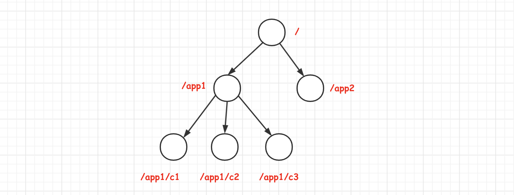

###### 事务ID

在 ZooKeeper 中，事务是指能够改变 ZooKeeper 服务器状态的操作，一般包括数据节点**创建与删除、数据节点内容更新**和**客户端会话创建与失效**等操作。对于每一个事务请求，ZooKeeper 都会为其分配一个**全局唯一的事务 ID**，用 **ZXID** 来表示，通常是一个 64 位的数字。每一个 ZXID 对应一次更新操作，从这些 ZXID 中可以间接地识别出 ZooKeeper 处理这些更新操作请求的全局顺序。

##### 2.结点ZNode

###### (1)结点类型

每个数据结点都有其生命周期，这取决于其结点类型。数据结点可以按照 **==持久与否，顺序与否==** 分为四大类。

**==持久结点==**(PERSISTENT)

结点**默认**类型。持久结点指该数据节点被创建后，就会**一直**存在于 ZooKeeper 服务器上，直到有删除操作来主动清除这个节点。

```bash
# 默认创建持久节点
create /test "test"
```

**==持久顺序结点==**(PERSISTENT_SEQUENTIAL)

持久顺序节点的基本特性和持久节点是一致的，额外的特性表现在顺序性上。在 Zookeeper 中，每个父节点都会为它的**第一级子节点**维护一份顺序，用于记录下**每个子节点创建的先后顺序**。在创建节点过程中，ZooKeeper 会自动为给定节点名(路径)加上一个**数字后缀**，作为一个新的、完整的节点名。适合用于**分布式锁、分布式选举**等场景。

创建时添加 **-s** 参数即可。

```bash
# 创建序号节点
create -s /test
# 返回创建的加了序号的实际路径
Created /test0000000001

# 再次创建一个
create -s /test
# 返回创建的实际路径2，序号已递增
Created /test0000000002
```

**==临时结点==**(EPHEMERAL)

临时节点的生命周期和**客户端会话**绑定，如果客户端会话失效断开连接，那么这个节点就会被自动删除并清理掉。注意，这里指的是客户端会话失效，而非 TCP 连接断开。它可以用于判断客户端是否还在连接，如果已经断开连接，那么节点就不在了。**==临时节点下面不能包含子结点==**，所以临时节点**只能做叶子节点**。适用于**心跳，服务发现等场景**。

创建时添加参数 **-e** 即可。

```bash
# 创建临时节点，会话端口自动删除
create -e /temp "test"
```

**==临时顺序节点==**(EPHEMERAL_SEQUENTIAL)

基本特性和临时节点也是一致的，同样是在临时节点的基础上增加了顺序的特性。

```bash
create -e -s /temp/seq
```

###### (2)结点数据与状态信息

znode 结点包含如下信息：

- **path**：唯一路径。增删改查都是基于 PATH。
- **childNode**：子节点列表。
- **type**：节点类型。
- **data**：数据内容。
- **stat**：状态属性。

每个数据结点除了存储数据内容，还存储结点本身的一些**状态信息**。**get 命令**可以获取结点信息，得到结果的第一行是当前数据结点的**数据内容**，第二行开始就是结点的**状态信息**。典型的有：

- **czxid**。即 Created ZXID，表示数据结点被**创建时的事务 ID**。
- **mzxid**。即 Modified ZXID，表示数据结点最后一次被更新时的事务 ID。
- ctime。结点创建时间。
- mtime。结点最后一次被更新时间。
- **version**。数据结点的版本号。
- **cversion**。子结点的版本号。
- **aversion**。结点的 ACL 版本号(权限版本变更次数)。
- ephemeralOwner。创建该临时结点的会话的 sessionID，如果为持久结点则此属性为 0。
- numChildren。子结点个数。
- **pzxid**。表示该结点子结点列表最后一次被修改时的事务 ID。只有子结点列表变更会修改 pzxid，子结点内容变化不会影响 pzxid

例子：

```bash
cZxid = 0x385
ctime = Tue Sep 24 17:26:28 CST 2019
mZxid = 0x385 
mtime = Tue Sep 24 17:26:28 CST 2019
pZxid = 0x385
cversion = 0
dataVersion = 2
aclVersion = 0
ephemeralOwner = 0x0
dataLength = 17
numChildren = 3
```

##### 3.结点版本(保证分布式数据原子性操作)

每个数据结点都有三种类型的版本信息。

- **version**。数据结点数据内容的版本号。
- **cversion**。子结点的版本号。
- **aversion**。当前结点的 ACL 版本号。

这里的 "**版本**" 分别表示对结点**数据内容、子结点列表、节点 ACL 信息**的**==更新次数==**。比如一个数据结点创建后，其 version 值为 0，表示的含义是 "当前结点自创建后，被更新过 0 次"。如果对数据内容进行了更新，version 值就会增加(只要是更新操作，即使内容不变也会增加，因为这里强调的是变更次数)。

版本在实现 "乐观锁" 场景下十分有用。乐观锁一般分为：数据读取、**写入校验**和数据写入等步骤。比如 JDK 的 CAS，对于值 V，每次更新前都会对比其值是否是预期值 A，只有符合预期，才会将 V 原子化等更新到新值 B。ZooKeeper 中的 version 属性正是用于实现乐观锁机制中的 "写入校验" 的。

##### 4.Watcher监听(数据变更的通知)

###### (1)概述

ZooKeeper 引入了 Watcher 机制来实现**分布式的通知功能**。ZooKeeper 允许客户端向服务端**注册一个 Watcher 监听**，当服务端的一些指定事件触发了这个 Watcher，那么就会向**指定客户端发送一个事件通知**来实现分布式的通知功能。整个 Watcher 注册与通知过程如下图。

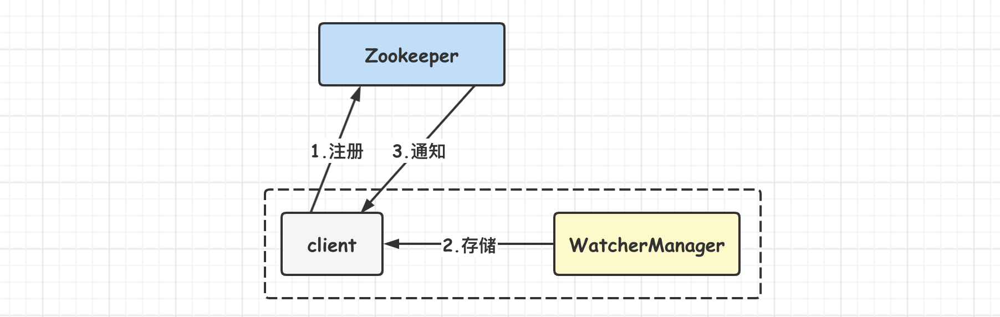

客户端在向 ZooKeeper 注册 Watcher 的同时也会将 Watcher 对象存储在客户端的 **WatcherManager** 中，当 ZooKeeper 服务器触发 Watcher 事件后，会向客户端发出通知，客户端线程从 WatcherManager 取出对应的 Watcher 对象**执行回调逻辑**(执行 process() 方法)。

**客户端**会记录 **Watcher 与数据结点路径的映射关系**。Watcher 注册完成后，会被保存到 ZKWatcherManager 对象的 dataWatches 属性中，其数据结构为 Map<String, Set\<Watcher>>，用于将数据结点的路径和 Watcher 进行映射后管理起来。

###### (2)Watcher特性

**1.一次性**

无论是客户端还是服务端，**==一旦一个 Watcher 被触发，Zookeeper 都会将其从相应的存储中移除==**。因此，使用 Watcher 时需要进行**反复注册**。使用后失效可以减小服务端的压力，不然通知的结点可能很多。

**2.客户端串行执行**

客户端 Watcher 回调是一个串行同步的过程。这保证了顺序。

**3.轻量**

当服务端发生了事件后，ZooKeeper 会通过 Watcher 机制以 **WatchedEvent 消息**的方式告知客户端发送了事件。WatchedEvent 仅包含了**通知状态、事件类型和结点路径**等三部分内容，**不包含事件的具体内容**。例如某个结点的子结点列表发生了变更，ZooKeeper 会通过 Watcher 告知客户端此事，但客户端无法从事件中得到数据结点的原始数据和变更后的子结点数据，**客户端需要主动重新去获取数据**。

##### 5.ACL(权限控制)

Zookeeper 通过 **ACL(Access Control List) 权限控制机制**来**保证数据的安全**。ACL 即**访问控制列表**，可以针对任意用户和组进行细粒度的权限控制。

ACL 包含三部分内容，分别是权限模式(Scheme)、授权对象(ID)与权限(Permission)，通常采用 "**scheme : id : permission**" 来标识一个 ACL 信息。

权限仅对当前节点有效，不会被子节点继承。

###### (1)权限模式(Scheme)

权限模式用于确定权限验证时的检验策略。比如：

- IP：通过 IP 地址进行权限控制。
- Digest：类似于 "username:password" 的方式进行权限配置。**用户密码**认证模式，只有在会话中添加了认证才可以防问。
- World：所有用户都能操作数据。
- Super：超级用户。

###### (2)授权对象(ID)

授权对象指权限赋予的用户或一个指定的实体，例如是 IP 地址或机器。

###### (3)权限(Permission)

权限指通过权限检查后可以执行的操作。

- **CREATE**。**子结点**创建权限。允许授权对象在该结点下创建子结点。
- **DELETE**。**子结点**删除权限。允许授权对象删除该数据结点的子结点。
- **READ**。数据结点的读取权限。允许授权对象访问该数据结点并读取其数据内容或子结点列表。
- **WRITE**。数据结点的更新权限。允许授权对象对该数据结点进行更新操作。
- **ADMIN**。数据结点的管理权限。允许授权对象对该数据结点进行 ACL 相关的设置。

#### 客户端

##### 1.客户端命令

**基本命令列表**：

- **connect host:port**：重新连接指定 ZooKeeper 服务。
- **create [-s] [-e] [-c] [-t ttl] path [data] [acl]**：创建节点。
- **delete [-v version] path**：删除节点(不能存在子节点）。
- **deleteall path**：删除路径及所有子节点。
- **setquota -n|-b val path**：设置节点限额。-n 子节点数，-b 字节数。
- **listquota path**：查看节点限额。
- **delquota [-n|-b] path**：删除节点限额。
- **get [-s] [-w] path**：查看节点数据。-s 包含节点状态，-w 添加监听。
- **ls [-s] [-w] [-R] path**：列出子节点。-s 状态，-R 递归查看所有子节点，-w 添加监听。
- **setAcl [-s] [-v version] [-R] path acl**：为节点设置 ACL 权限。
- **stat [-w] path**：查看节点状态。-w 添加监听。

**node 数据的增删改查**：

```bash
# 列出子节点 
ls /
# 创建节点
create /student "nano"
# 查看节点
get /student
# 创建子节点 
create /student/height "32"
# 删除节点
delete /student/height
# 删除所有节点包括子节点
deleteall /student
# 修改节点
set /student "woman"
```

##### 2.开源客户端

可以使用 Java 客户端进行 ZK 的访问与操作。

###### (1)ZkClient

一个 GitHub 开源的 ZK 操作框架。

###### (2)Curator

Netflix 公司开源的框架。其里面已有不少有用的实现类，可以有以下作用：

- ZK 的基础操作与访问。
- Master 选举。
- InterProcessMutex 类提供**分布式锁**功能。
- DistributedAtomicInteger 类提供了**分布式计数器**功能。
- DistributedBarrier 类提供分布式 Barrier 的功能，对应于普通的 **CyclicBarrier**。

##### 3.Java客户端

ZooKeeper 提供了 Java 与 C 两种语言的客户端。依赖：

```xml
<dependency>
    <groupId>org.apache.zookeeper</groupId>
    <artifactId>zookeeper</artifactId>
    <version>3.5.5</version>
</dependency>
```

**初始连接：**

常规的客户端类是 org.apache.zookeeper.**ZooKeeper**，实例化该类之后将会**自动与集群建立连接**。构造参数说明如下：

|      参数名称      |     类型     |                             说明                             |
| :----------------: | :----------: | :----------------------------------------------------------: |
| **connectString**  |    String    | 连接串，包括 **ip + 端口** ,集群模式下用逗号隔开  192.168.0.149:2181,192.168.0.150:2181 |
| **sessionTimeout** |   **int **   | 会话**超时时间**，该值不能超过服务端所设置的  minSessionTimeout 和maxSessionTimeout |
|    **watcher**     |   Watcher    |            会话监听器，**服务端事件将会触该监听**            |
|     sessionId      |  **long **   |                        自定义会话 ID                         |
|   sessionPasswd    |  **byte**[]  |                         会话**密码**                         |
|   canBeReadOnly    | **boolean ** |                    该连接是否为**只读**的                    |
|    hostProvider    | HostProvider | 服务端地址提供者，指示客户端如何选择某个服务来调用，默认采用StaticHostProvider 实现 |

######  (1)创建、查看节点

**创建节点**：通过 org.apache.zookeeper.ZooKeeper#**create**() 即可**创建节点**，其参数说明如下：

|  参数名称  |      类型      |   说明   |
| :--------: | :------------: | :------: |
|  **path**  |     String     |   路径   |
|  **data**  |     byte[]     |   数据   |
|  **acl**   |   List\<ACL>   | 权限参数 |
| createMode |   CreateMode   |          |
|     cb     | StringCallback |          |
|    ctx     |     Object     |          |

**查看节点**：通过 org.apache.zookeeper.ZooKeeper#**getData**() 即可**查看节点**，其参数说明如下：

| 参数名称 |     类型     | 说明 |
| :------: | :----------: | :--: |
|   path   |    String    |      |
|  watch   | **boolean ** |      |
| watcher  |   Watcher    |      |
|    cb    | DataCallback |      |
|   ctx    |    Object    |      |

**查看子节点**：通过 org.apache.zookeeper.ZooKeeper#**getChildren**() 即可获取**子节点**，其参数说明如下：

| 参数名称 |       类型        | 说明 |
| :------: | :---------------: | :--- |
|   path   |      String       |      |
|  watch   |   **boolean **    |      |
| watcher  |      Watcher      |      |
|    cb    | Children2Callback |      |
|   ctx    |      Object       |      |

###### (2)监听节点

在 **getData**() 与 **getChildren**() 两个方法中可分别设置**监听数据变化和子节点变化**。通过**设置 watch 为 true**，当前事件触发时会调用 zookeeper() 构建函数中 **Watcher.process()** 方法。也可以添加 watcher 参数来实现**自定义监听**。一般采用后者。

注意：所有的监听都是**一次性的，如果要持续监听需要触发后在添加一次监听**。

##### 4.会话Session

Session 指的是 ZooKeeper **服务器与客户端**会话。在 ZooKeeper 中，一个客户端连接是指客户端和服务器之间的一个 **TCP 长连接**。客户端启动的时候，首先会与服务器建立一个 TCP 连接，从第一次连接建立开始，客户端会话的生命周期也开始了。通过这个连接，客户端能够通过**心跳检测**与服务器保持有效的会话，也能够向 Zookeeper 服务器发送请求并接受响应，同时还能够通过该**连接接收来自服务器的 Watch 事件通知**。 Session 的 sessionTimeout 参数用来设置一个客户端会话的**超时时间**。当由于服务器压力太大、网络故障或是客户端主动断开连接等各种原因导致客户端连接断开时，只要在 sessionTimeout 规定的时间内能够重新连接上集群中任意一台服务器，那么之前创建的会话仍然有效。

在为客户端创建会话之前，服务端首先会为每个客户端都分配一个 **sessionID**。由于 sessionID 是 Zookeeper 会话的一个重要标识，许多与会话相关的运行机制都是基于这个 sessionID 的，因此无论是哪台服务器为客户端分配的 sessionID，都务必保证**全局唯一**。

在 Zookeeper 中，会话还有对应的事件，比如 CONNECTION_LOSS 连接丢失事件 、SESSION_MOVED 会话转移事件、SESSION_EXPIRED 会话超时失效事件。

##### 5.客户端组件

Zookeeper 客户端的核心组件如下。

- Zookeeper 实例。客户端的入口。
- ClientWatchManage。客户端的 Watcher 管理器。
- HostProvider。客户端地址列表管理器。
- **ClientCnxn**。客户端核心线程，其内部包含两个线程，即 SendThread 和 EventThread。SendThread 是一个 IO 线程，负责 Zookeeper 客户端与服务器之间的网络 IO 通信。EventThread 是一个事件线程，负责对服务端的事件进行处理。

##### 6.客户端会话创建过程

###### (1)初始化阶段

- 初始化 Zookeeper 对象。
- 设置会话默认 Watcher。
- 构造 Zookeeper 服务器地址列表管理器 HostProvider。
- 创建并初始化客户端网络连接器 ClientCnxn。创建 ClientCnxn 的同时，还会创建客户端的两个核心队列：outgoingQueue(客户端请求发送队列)和 pendingQueue(服务端响应等待队列)。
- 初始化 SendThread 和 EventThread。

###### (2)会话创建阶段

- 启动 SendThread 和 EventThread。
- 获取一个服务器地址。
- 创建 TCP 连接。ClientCnxnSocket 负责与服务器创建一个 TCP 长连接。
- 构造 ConnectRequest 请求。
- 发送请求。

###### (3)响应处理阶段

- 接收服务端响应。
- 处理 response。
- 查询 Watcher。
- 处理事件。EventThread 不断从 waitingEvents 队列中取出待处理的 Watcher 对象，然后直接调用该对象的 process 方法进行事件回调。

#### 序列化与协议

Zookeeper 客户端与服务端会进行一些列的网络数据传输，Zookeeper 使用了 **Jute** 这个序列化组件实现通信数据的序列化与反序列化操作。

Zookeeper 设计了基于 TCP/IP 协议的独有的应用层通信协议，实现数据的高效传输。

#### 服务器启动分析

Zookeeper 服务端整体架构如下：

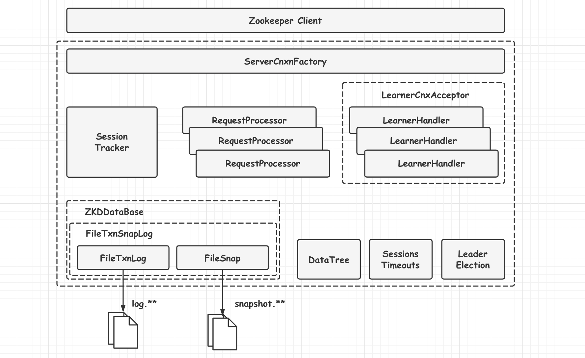

Zookeeper 服务器的启动，大致可以分为以下五个步骤：

1. 配置文件解析。
2. 初始化数据管理器。
3. 初始化网络 I/O 管理器。
4. 数据恢复。
5. 对外服务。

##### 1.单机版服务器启动

单机版服务器的启动其流程图如下。

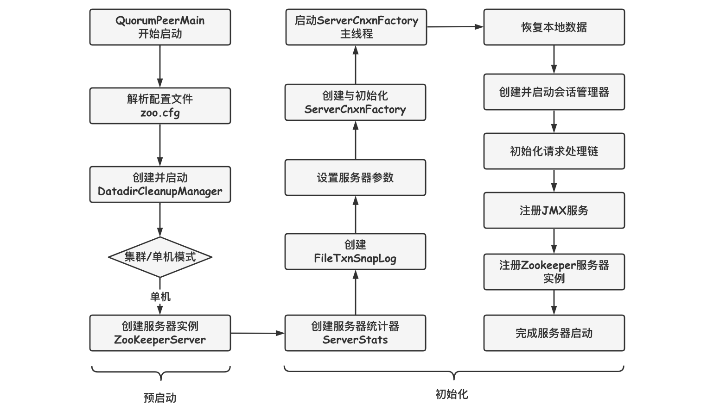

上图的过程可以分为**预启动**和**初始化**过程。

###### (1)预启动

1. 统一由 QuorumPeerMain 作为启动类。无论单机或集群，在 zkServer.cmd 和zkServer.sh 中都配置了 QuorumPeerMain 作为启动入口类。
2. 解析配置文件 zoo.cfg。zoo.cfg 配置运行时的基本参数，如 tickTime、dataDir、clientPort 等参数。
3. 创建并启动历史文件清理器 DatadirCleanupManager。对事务日志和快照数据文件进行定时清理。
4. 判断当前是集群模式还是单机模式启动。若是单机模式，则委托给 ZooKeeperServerMain 进行启动。
5. 再次进行配置文件 zoo.cfg 的解析。
6. 创建服务器实例 ZooKeeperServer。Zookeeper 服务器首先会进行服务器实例的创建，然后对该服务器实例进行初始化，包括连接器、内存数据库、请求处理器等组件的初始化。

###### (2)初始化

1. 创建服务器统计器 ServerStats。ServerStats 是 Zookeeper 服务器运行时的统计器。
2. 创建 Zookeeper 数据管理器 FileTxnSnapLog。FileTxnSnapLog 是 Zookeeper 上层服务器和底层数据存储之间的对接层，提供了一系列操作数据文件的接口，如事务日志文件和快照数据文件。Zookeeper 根据 zoo.cfg 文件中解析出的快照数据目录 dataDir 和事务日志目录 dataLogDir 来创建 FileTxnSnapLog。
3. 设置服务器 tickTime 和会话超时时间限制。
4. 创建 ServerCnxnFactory。通过配置系统属性 zookeper.serverCnxnFactory 来指定使用 Zookeeper 自己实现的 NIO 还是使用 Netty 框架作为 Zookeeper 服务端网络连接工厂。
5. 初始化 ServerCnxnFactory。Zookeeper 会初始化 Thread 作为 ServerCnxnFactory 的主线程，然后再初始化 NIO 服务器。
6. 启动 ServerCnxnFactory 主线程。进入 Thread 的 run 方法，此时服务端还不能处理客户端请求。
7. 恢复本地数据。启动时，需要从本地快照数据文件和事务日志文件进行数据恢复。
8. 创建并启动会话管理器。Zookeeper 会创建会话管理器 SessionTracker 进行会话管理。
9. 初始化 Zookeeper 的请求处理链。Zookeeper 请求处理方式为**责任链模式**的实现。会有多个请求处理器依次处理一个客户端请求，在服务器启动时，会将这些请求处理器串联成一个请求处理链。
10. 注册 JMX 服务。Zookeeper 会将服务器运行时的一些信息以 JMX 的方式暴露给外部。
11. 注册 Zookeeper 服务器实例。将 Zookeeper 服务器实例注册给 ServerCnxnFactory，之后 Zookeeper 就可以对外提供服务。

至此，单机版的 Zookeeper 服务器启动完毕。

##### 2.集群版服务器启动

单机和集群服务器的启动在很多地方是一致的，其流程图如下。

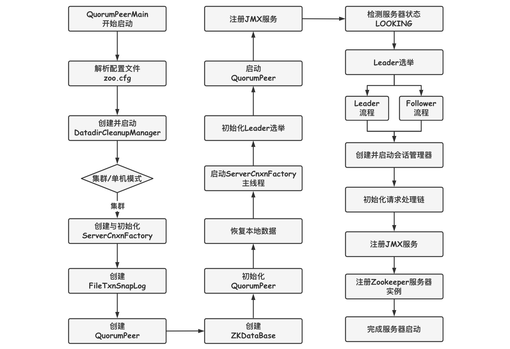

上图的过程可以分为**预启动、初始化、Leader选举、Leader 与 Follower 启动期交互过程、Leader 与 Follower 启动**等过程。

###### (1)预启动

1. 统一由 QuorumPeerMain 作为启动类。
2. 解析配置文件 zoo.cfg。
3. 创建并启动历史文件清理器 DatadirCleanupFactory。

       　　　　4. 判断当前是集群模式还是单机模式的启动。在集群模式中，在 zoo.cfg 文件中配置了多个服务器地址，可以选择集群启动。

###### (2)初始化

1. 创建 ServerCnxnFactory。

2. 初始化 ServerCnxnFactory。

3. 创建 Zookeeper 数据管理器 FileTxnSnapLog。

4. 创建 QuorumPeer 实例。Quorum 是集群模式下特有的对象，是 Zookeeper 服务器实例(ZooKeeperServer)的托管者，QuorumPeer 代表了集群中的一台机器，在运行期间，QuorumPeer 会不断检测当前服务器实例的运行状态，同时根据情况发起 Leader 选举。

5. 创建内存数据库 ZKDatabase。ZKDatabase 负责管理 ZooKeeper 的所有会话记录以及 DataTree 和事务日志的存储。

6. 初始化 QuorumPeer。将核心组件如 FileTxnSnapLog、ServerCnxnFactory、ZKDatabase 注册到 QuorumPeer 中，同时配置 QuorumPeer 的参数，如服务器列表地址、Leader 选举算法和会话超时时间限制等。

7. 恢复本地数据。

8. 启动 ServerCnxnFactory 主线程。

###### (3)Leader选举

1. 初始化 Leader 选举。集群模式特有，Zookeeper 首先会根据自身的服务器 ID(SID)、最新的 ZXID(lastLoggedZxid) 和当前的服务器 epoch(currentEpoch) 来生成一个初始化投票，在初始化过程中，每个服务器都会给自己投票。然后，根据 zoo.cfg 的配置，创建相应 Leader 选举算法实现，Zookeeper 提供了三种默认算法(LeaderElection、AuthFastLeaderElection、FastLeaderElection)，可通过 zoo.cfg 中的 electionAlg 属性来指定，但现只支持 FastLeaderElection 选举算法。在初始化阶段，Zookeeper 会创建 Leader 选举所需的网络 I/O 层 QuorumCnxManager，同时启动对 Leader 选举端口的监听，等待集群中其他服务器创建连接。

2. 注册 JMX 服务。

3. 检测当前服务器状态。运行期间，QuorumPeer 会不断检测当前服务器状态。在正常情况下，Zookeeper 服务器的状态在 LOOKING、LEADING、FOLLOWING/OBSERVING 之间进行切换。在启动阶段，QuorumPeer 的初始状态是 LOOKING，因此开始进行 Leader 选举。

4. Leader 选举。通过投票确定 Leader，其余机器称为 Follower 和 Observer。具体算法在后面会给出。

###### (4)Leader和Follower启动期交互过程

1. 创建 Leader 服务器和 Follower 服务器。完成 Leader 选举后，每个服务器会根据自己服务器的角色创建相应的服务器实例，并进入各自角色的主流程。

2. Leader 服务器启动 Follower 接收器 LearnerCnxAcceptor。运行期间，Leader 服务器需要和所有其余的服务器(统称为 Learner)保持连接以确集群的机器存活情况，LearnerCnxAcceptor 负责接收所有非 Leader 服务器的连接请求。

3. Leader 服务器开始和 Leader 建立连接。所有 Learner 会找到 Leader 服务器，并与其建立连接。

4. Leader 服务器创建 LearnerHandler。Leader 接收到来自其他机器连接创建请求后，会创建一个 LearnerHandler 实例，每个 LearnerHandler 实例都对应一个 Leader 与 Learner 服务器之间的连接，其负责 Leader 和 Learner 服务器之间几乎所有的消息通信和数据同步。

5. 向 Leader 注册。Learner 完成和 Leader 的连接后，会向 Leader 进行注册，即将 Learner 服务器的基本信息(LearnerInfo)，包括 SID 和 ZXID，发送给 Leader 服务器。

6. Leader 解析 Learner 信息，计算新的 epoch。Leader 接收到 Learner 服务器基本信息后，会解析出该 Learner 的 SID 和 ZXID，然后根据 ZXID 解析出对应的 epoch_of_learner，并和当前 Leader 服务器的 epoch_of_leader 进行比较，如果该 Learner 的 epoch_of_learner 更大，则更新 Leader 的 epoch_of_leader = epoch_of_learner + 1。然后 LearnHandler 进行等待，直到过半 Learner 已经向 Leader 进行了注册，同时更新了 epoch_of_leader 后，Leader 就可以确定当前集群的 epoch 了。

7. 发送 Leader 状态。计算出新的 epoch 后，Leader 会将该信息以一个 LEADERINFO 消息的形式发送给 Learner，并等待 Learner 的响应。

8. Learner 发送 ACK 消息。Learner 接收到 LEADERINFO 后，会解析出 epoch 和 ZXID，然后向 Leader 反馈一个 ACKEPOCH 响应。

9. 数据同步。Leader 收到 Learner 的 ACKEPOCH 后，即可进行数据同步。

10. 启动 Leader 和 Learner 服务器。当有过半 Learner 已经完成了数据同步，那么 Leader 和 Learner 服务器实例就可以启动了。

###### (5)Leader和Follower启动

1. 创建启动会话管理器。

2. 初始化 Zookeeper 请求处理链，集群模式的每个处理器也会在启动阶段串联请求处理链。

3. 注册 JMX 服务。

至此，集群版的 Zookeeper 服务器启动完毕。

#### Leader选举与ZAB协议

##### 1.集群与服务器角色

ZooKeeper 服务器集群中有 **Leader、Follower 和 Observer** 三种类型角色。

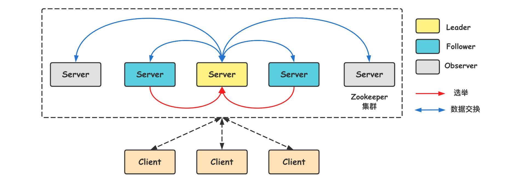

ZooKeeper 集群中的所有机器通过一个 **Leader 选举过程**来选定一台称为 "Leader" 的机器，Leader 既可以为客户端提供写服务又能提供读服务。除了 Leader 外，Follower 和 Observer 都只能提供读服务。Follower 和 Observer 唯一的区别在于 Observer 机器不参与 Leader 的选举过程，也不参与写操作的 "**过半写成功**" 策略，因此 Observer 机器可以在不影响写性能的情况下提升集群的读性能。

###### (1)Leader

Leader 服务器是 ZooKeeper 集群工作的核心，是集群中唯一的**写请求**处理者，其主要工作如下：

- 事务请求的唯一调度和处理者，保证集群事务处理的顺序性。
- 集群内部各服务器的调度者。

**请求处理链**

Zookeeper 使用**责任链**来处理每个客户端的请求，Leader 服务器的请求**处理链**如下：

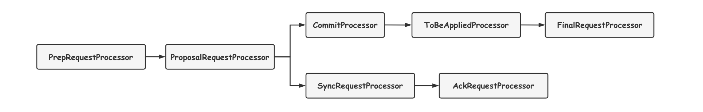

典型的处理器有：

- PrepRequestProcessor。请求预处理器。
- ProposalRequestProcessor。事务投票处理器。
- SyncRequestProcessor。事务日志记录处理器。

**LearnerHandler**

为了保证整个集群内部的实时通信，同时为了确保可以控制所有的 Follower/Observer 服务器，Leader 服务器会与每个 Follower/Observer 服务器建立一个 **TCP 长连接**。同时也会为每个 Follower/Observer 服务器创建一个名为 LearnerHandler 的实体。LearnerHandler 是 Learner 服务器的管理者，主要负责 Follower/Observer 服务器和 Leader 服务器之间的一系列网络通信，包括数据同步、请求转发和 Proposal 提议的投票等。Leader 服务器中保存了所有 Follower/Observer 对应的LearnerHandler。

###### (2)Follower

Follower 是 Zookeeper 集群的跟随者，其主要工作如下：

- 处理客户端非事务性请求(读取数据)，转发事务请求给 Leader 服务器。
- 参与事务请求 Proposal 的投票。
- 参与 Leader 选举投票。

Follower 也采用了**责任链模式**组装的请求处理链来处理每一个客户端请求，由于不需要对事务请求的投票处理，因此 Follower 的请求处理链相对简单。

###### (3)Observer

Observer 充当观察者角色，观察 Zookeeper 集群的最新状态变化并将这些状态同步过来，其对于非事务请求可以进行独立处理，对于事务请求，则会转发给 Leader 服务器进行处理。Observer 不会参与任何形式的投票，包括事务请求 Proposal 的投票和 Leader 选举投票。

##### 2.ZAB协议与Leader选举概述

为达成集群数据一致性，ZooKeeper 并**没有完全采用 Paxos算法**，而是**使用 ZAB(ZooKeeper Atomic Broadcast 原子广播)协议**作为其**保证分布式数据一致性的核心算法**。ZAB 协议并不像 Paxos 算法那样是一种通用的分布式一致性算法，它是一种**特别为 Zookeeper 设计的崩溃可恢复的原子消息广播算法**。基于该协议，ZooKeeper 实现了一种**主备模式**的系统架构来保持集群中各个副本之间的数据一致性。

Leader 选举是保证分布式数据一致性的关键所在。当 Zookeeper 集群中的一台服务器出现以下两种情况之一时，需要进入 Leader 选举。

- 服务器初始化启动。
- 服务器运行期间无法和 Leader 保持连接。

下面就两种情况进行分析讲解。

###### (1)服务器启动时期的Leader选举

若进行 Leader 选举，则至少需要两台机器，这里选取 3 台机器组成的服务器集群为例。在集群初始化阶段，当有一台服务器 Server1 启动时，其单独无法进行和完成 Leader 选举，当第二台服务器 Server2 启动时，此时两台机器可以相互通信，每台机器都试图找到 Leader，于是进入 Leader 选举过程。

选举过程如下：

**1. 每个 Server 发出一个投票**。由于是初始情况，Server1 和 Server2 都会将自己作为 Leader 服务器来进行投票，每次投票会包含所推举的服务器的 myid 和 ZXID，使用 (myid, ZXID) 来表示，此时 Server1 的投票为 (1, 0)，Server2 的投票为 (2, 0)，然后各自将这个投票发给集群中其他机器。

**2. 接受来自各个服务器的投票**。集群的每个服务器收到投票后，首先判断该投票的有效性，如检查是否是本轮投票、是否来自 LOOKING 状态的服务器。

**3. 处理投票**。针对每一个投票，服务器都需要将别人的投票和自己的投票进行 PK，PK 规则如下：

- **优先检查 ZXID**。ZXID 比较大的服务器优先作为 Leader。
- **如果 ZXID 相同，那么就比较 myid**。myid 较大的服务器作为 Leader 服务器。

对于 Server1 而言，它的投票是 (1, 0)，接收 Server2 的投票为(2, 0)，首先会比较两者的 ZXID，均为 0，再比较 myid，此时 Server2 的 myid 最大，于是更新自己的投票为 (2, 0)，然后重新投票。对于 Server2 而言，其无须更新自己的投票，只是再次向集群中所有机器发出上一次投票信息即可。

**4. 统计投票**。每次投票后，服务器都会统计投票信息，判断是否已经有过半机器接受到相同的投票信息，对于 Server1、Server2 而言，都统计出集群中已经有两台机器接受了 (2, 0) 的投票信息，此时便认为已经选出了 Leader。

**5. 改变服务器状态**。一旦确定了 Leader，每个服务器就会更新自己的状态，如果是 Follower，那么就变更为 FOLLOWING，如果是 Leader，就变更为 LEADING。

###### (2)服务器运行时期的Leader选举

在 Zookeeper 运行期间，Leader 与非 Leader 服务器各司其职，即便当有非 Leader 服务器宕机或新加入，此时也不会影响 Leader，但是一旦 Leader 服务器挂了，那么整个集群将暂停对外服务，进入新一轮 Leader 选举，其过程和启动时期的 Leader选 举过程基本一致。

假设正在运行的有 Server1、Server2、Server3 三台服务器，当前 Leader 是 Server2，若某一时刻 Leader 挂了，此时便开始 Leader 选举。

选举过程如下：

**1. 变更状态**。Leader 挂后，余下的非 Observer 服务器都会讲自己的服务器状态变更为 LOOKING，然后开始进入 Leader 选举过程。

**2. 每个 Server 会发出一个投票**。在运行期间，每个服务器上的 ZXID 可能不同，此时假定 Server1 的 ZXID 为 123，Server3 的 ZXID 为 122；在第一轮投票中，Server1 和 Server3 都会投自己，产生投票 (1, 123)，(3, 122)，然后各自将投票发送给集群中所有机器。

**3. 接收来自各个服务器的投票**。与启动时过程相同。

**4. 处理投票**。与启动时过程相同，此时 Server1 将会成为 Leader。

**5. 统计投票**。与启动时过程相同。

**6. 改变服务器的状态**。与启动时过程相同。

##### 3.Leader选举算法分析

在 3.4.0 后的 Zookeeper 版本只保留了 TCP 版本的 FastLeaderElection 选举算法。

###### (1)术语解释

- **SID(服务器ID)**：一个数字，标识 Zookeeper 集群中的一台机器，每台机器不能重复。SID 与 **myid** 的值一致。
- **ZXID(事务ID)**：ZXID 是一个事务 ID，用来唯一标识因此服务器状态的变更。在某一个时刻，集群中每台机器的 ZXID 值不一定完全都一致。
- **Vote(投票)**：Leader 选举需通过投票实现，当集群中的机器发现自己无法检测到 Leader 机器的时候，就会开始尝试进行投票。
- **Quorum(过半数机器**)：一个量词，通常指过半数的机器。

###### (2)算法分析

当一台机器进入 Leader 选举时，当前集群可能会处于以下两种状态：

- 集群中已经存在 Leader。
- 集群中不存在 Leader。

对于**集群中已经存在 Leader** 而言，此种情况一般都是某台机器启动得较晚，在其启动之前，集群已经在正常工作。对这种情况，该机器试图去选举 Leader 时，会被告知当前服务器的 Leader 信息，对于该机器而言，仅仅需要和 Leader 机器建立起连接，并进行状态同步即可。

而在**集群中不存在 Leader** 情况下则会相对复杂，其步骤如下：

**1. 第一次投票**

无论哪种情况导致进行 Leader 选举，集群的所有机器都处于试图选举出一个 Leader 的状态，即 LOOKING 状态，LOOKING 机器会向所有其他机器发送消息，该消息称为**投票**。投票中包含了 SID(服务器的唯一标识) 和 ZXID(事务ID)，**(SID, ZXID) 形式来标识一次投票信息**。

假定 Zookeeper 由 5 台机器组成，SID 分别为 1、2、3、4、5，ZXID 分别为 9、9、9、8、8，并且此时 SID 为 2 的机器是 Leader 机器，某一时刻，1、2 所在机器出现故障，因此集群开始进行 Leader 选举。在第一次投票时，每台机器都会将自己作为投票对象，于是 SID 为 3、4、5 的机器投票情况分别为 (3, 9)，(4, 8)，(5, 8)。

**2. 变更投票**

每台机器发出投票后，也会**收到**其他机器的投票，每台机器会根据一定规则来处理收到的其他机器的投票，并以此来决定是否需要变更自己的投票，这个规则也是整个 Leader 选举算法的核心所在，其中术语描述如下:

- **vote_sid**：接收到的投票中所推举 Leader 服务器的 SID。
- **vote_zxid**：接收到的投票中所推举 Leader 服务器的 ZXID。
- **self_sid**：当前服务器自己的 SID。
- **self_zxid**：当前服务器自己的 ZXID。

每次对收到的投票的处理，都是对 **(vote_sid, vote_zxid)** 和 **(self_sid, self_zxid)** 进行对比的过程。

- **规则一**：如果 vote_zxid 大于 self_zxid，就认可当前收到的投票，并再次将该投票发送出去。
- **规则二**：如果 vote_zxid 小于 self_zxid，那么坚持自己的投票，不做任何变更。
- **规则三**：如果 vote_zxid 等于 self_zxid，那么就对比两者的 SID，如果 vote_sid 大于 self_sid，那么就认可当前收到的投票，并再次将该投票发送出去。
- **规则四**：如果 vote_zxid 等于 self_zxid，并且 vote_sid 小于 self_sid，那么坚持自己的投票，不做任何变更。

简而言之就是：**==ZXID 大的优先，ZXID 相同时 SID 大的优先==**。

结合上面规则，给出下面的集群变更过程。

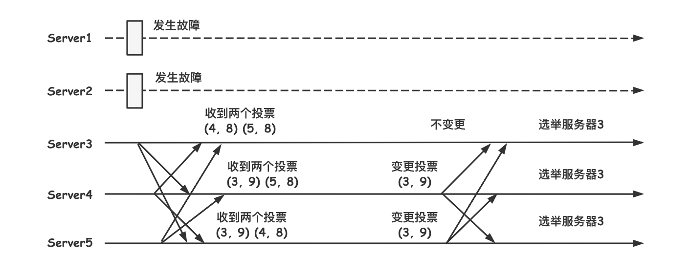

**3. 确定Leader**

经过第二轮投票后，集群中的每台机器都会再次接收到其他机器的投票，然后开始统计投票，如果一台机器收到了**超过半数**的相同投票，那么这个投票对应的 SID 机器即为 Leader。此时 Server3 将成为 Leader。

由上面规则可知，**通常哪台服务器上的数据越新(ZXID 会越大)，其成为 Leader 的可能性越大，也就越能够保证数据的恢复。如果 ZXID 相同，则 SID 越大机会越大**。

##### 4.Leader选举实现细节

###### (1)服务器状态

服务器具有**四种状态**，分别是 LOOKING、FOLLOWING、LEADING、OBSERVING。

- **LOOKING**：寻找 Leader 状态。当服务器处于该状态时，它会认为当前集群中没有 Leader，因此需要进入 Leader 选举状态。
- **FOLLOWING**：跟随者状态。表明当前服务器角色是 Follower。
- **LEADING**：领导者状态。表明当前服务器角色是 Leader。
- **OBSERVING**：观察者状态。表明当前服务器角色是 Observer。

###### (2)投票数据结构

每个投票中包含了两个最基本的信息，所推举服务器的 SID 和 ZXID，投票(Vote) 在 Zookeeper 中包含字段如下:

- **id**：被推举的 Leader 的 SID。

- **zxid**：被推举的 Leader 事务 ID。

- **electionEpoch**：逻辑时钟，用来判断多个投票是否在**同一轮选举周期**中，该值在服务端是一个自增序列，每次进入新一轮的投票后，都会对该值进行加 1 操作。

- **peerEpoch**：被推举的 Leader 的 epoch。

- **state**：当前服务器的状态。

###### (3)QuorumCnxManager(网络I/O)

每台服务器在启动的过程中，会启动一个 QuorumPeerManager，负责各台服务器之间的底层 Leader 选举过程中的网络通信。

**1. 消息队列**

QuorumCnxManager 内部维护了一系列的队列，用来保存接收到的、待发送的消息以及消息的发送器，除接收队列以外，其他队列都按照 SID 分组形成队列集合，如一个集群中除了自身还有 3 台机器，那么就会为这 3 台机器分别创建一个发送队列，互不干扰。

- **recvQueue**：消息接收队列，用于存放那些从其他服务器接收到的消息。

- **queueSendMap**：消息发送队列，用于保存那些待发送的消息，按照 SID 进行分组。

- **senderWorkerMap**：发送器集合，每个 SenderWorker 消息发送器，都对应一台远程 Zookeeper 服务器，负责消息的发送，也按照 SID 进行分组。
- **lastMessageSent**：最近发送过的消息，为每个 SID 保留最近发送过的一个消息。

**2. 建立连接**

为了能够相互投票，Zookeeper 集群中的所有机器都需要两两建立起网络连接。QuorumCnxManager 在启动时会创建一个 ServerSocket 来监听 Leader 选举的通信端口(默认为 3888)。开启监听后，Zookeeper 能够不断地接收到来自其他服务器的创建连接请求，在接收到其他服务器的 TCP 连接请求时，会进行处理。为了避免两台机器之间重复地创建 TCP 连接，Zookeeper 只允许 SID 大的服务器主动和其他机器建立连接，否则断开连接。在接收到创建连接请求后，服务器通过对比自己和远程服务器的 SID 值来判断是否接收连接请求，如果当前服务器发现自己的 SID 更大，那么会断开当前连接，然后自己主动和远程服务器建立连接。一旦连接建立，就会根据远程服务器的 SID 来创建相应的消息发送器 SendWorker 和消息接收器 RecvWorker，并启动。

**3. 消息接收与发送**

**消息接收**：由消息接收器 RecvWorker 负责，由于 Zookeeper 为每个远程服务器都分配一个单独的 RecvWorker，因此每个 RecvWorker 只需要不断地从这个 TCP 连接中读取消息，并将其保存到 recvQueue 队列中。

**消息发送**：由于 Zookeeper 为每个远程服务器都分配一个单独的 SendWorker，因此每个 SendWorker 只需要不断地从对应的消息发送队列中获取出一个消息发送即可，同时将这个消息放入 lastMessageSent 中。在 SendWorker 中，一旦 Zookeeper 发现针对当前服务器的消息发送队列为空，那么此时需要从 lastMessageSent 中取出一个最近发送过的消息来进行再次发送，这是为了解决接收方在消息接收前或者接收到消息后服务器挂了，导致消息尚未被正确处理。同时，Zookeeper 能够保证接收方在处理消息时，会对重复消息进行正确的处理。

###### (4)FastLeaderElection(选举算法核心)

几个核心概念：

- **外部投票**：特指其他服务器发来的投票。

- **内部投票**：服务器自身当前的投票。

- **选举轮次**：Zookeeper 服务器 Leader 选举的轮次，即 logicalclock。

- **PK**：对内部投票和外部投票进行对比来确定是否需要变更内部投票。

**1. 选票管理**

下图是选票管理过程中相关组件之间的协作关系。

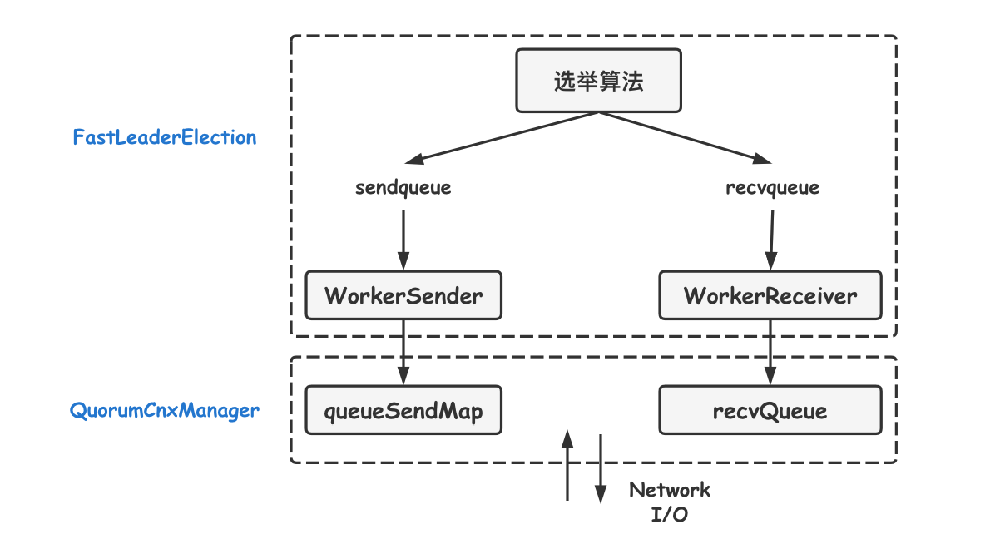

- **sendqueue**：选票发送队列，用于保存待发送的选票。
- **recvqueue**：选票接收队列，用于保存接收到的外部投票。
- **WorkerReceiver**：选票接收器。其会不断地从 QuorumCnxManager 中获取其他服务器发来的选举消息，并将其转换成一个选票，然后保存到 recvqueue 中，在选票接收过程中，如果发现该外部选票的选举轮次小于当前服务器的，那么忽略该外部投票，同时立即发送自己的内部投票。
- **WorkerSender**：选票发送器，不断地从 sendqueue 中获取待发送的选票，并将其传递到底层 QuorumCnxManager 中。

**2. 算法核心**

上图展示了 FastLeaderElection 模块是如何与底层网络 I/O 进行交互的。Leader 选举的基本流程如下：

**① 自增选举轮次**。Zookeeper 规定所有有效的投票都必须在同一轮次中，在开始新一轮投票时，会首先对 logicalclock 进行自增操作。

**② 初始化选票**。在开始进行新一轮投票之前，每个服务器都会初始化自身的选票，每台服务器在初始化阶段都会将自己推举为 Leader。

**③ 发送初始化选票**。完成选票的初始化后，服务器就会发起第一次投票。Zookeeper 会将刚刚初始化好的选票放入 sendqueue 中，由发送器 WorkerSender 负责发送出去。

**④ 接收外部投票**。每台服务器会不断地从 recvqueue 队列中获取外部选票。如果服务器发现无法获取到任何外部投票，那么就会立即确认自己是否和集群中其他服务器保持着有效的连接，如果没有连接，则马上建立连接，如果已经建立了连接，则再次发送自己当前的内部投票。

**⑤ 判断选举轮次**。在发送完初始化选票之后，接着开始处理外部投票。在处理外部投票时，会根据选举轮次来进行不同的处理。

- **外部投票的选举轮次大于内部投票**。若服务器自身的选举轮次落后于该外部投票对应服务器的选举轮次，那么就会立即更新自己的选举轮次(logicalclock)，并且清空所有已经收到的投票，然后使用初始化的投票来进行 PK 以确定是否变更内部投票。最终再将内部投票发送出去。
- **外部投票的选举轮次小于内部投票**。若服务器接收的外选票的选举轮次落后于自身的选举轮次，那么 Zookeeper 就会直接忽略该外部投票，不做任何处理，并返回步骤 4。

- **外部投票的选举轮次等于内部投票**。此时可以开始进行选票 PK。

**⑥ 选票PK**。在进行选票 PK 时，符合任意一个条件就需要变更投票。

- 若外部投票中推举的 Leader 服务器的选举轮次大于内部投票，那么需要变更投票。
- 若选举轮次一致，那么就对比两者的 ZXID，若外部投票的 ZXID 大，那么需要变更投票。
- 若两者的 ZXID 一致，那么就对比两者的 SID，若外部投票的 SID 大，那么就需要变更投票。

**⑦ 变更投票**。经过 PK 后，若确定了外部投票优于内部投票，那么就变更投票，即使用外部投票的选票信息来覆盖内部投票，变更完成后，再次将这个变更后的内部投票发送出去。

**⑧ 选票归档**。无论是否变更了投票，都会将刚刚收到的那份外部投票放入选票集合 recvset 中进行归档。recvset 用于记录当前服务器在本轮次的 Leader 选举中收到的所有外部投票 (按照服务队的 SID 区别，如 {(1, vote1), (2, vote2)...})。

**⑨ 统计投票**。完成选票归档后，就可以开始统计投票，统计投票是为了统计集群中是否已经有过半的服务器认可了当前的内部投票，如果确定已经有过半服务器认可了该投票，则终止投票。否则返回步骤 4。

**⑩ 更新服务器状态**。若已经确定可以终止投票，那么就开始更新服务器状态，服务器首选判断当前被过半服务器认可的投票所对应的 Leader 服务器是否是自己，若是自己，则将自己的服务器状态更新为 LEADING，若不是，则根据具体情况来确定自己是 FOLLOWING 或是 OBSERVING。

以上 10 个步骤就是 FastLeaderElection 的核心，其中步骤 4-9 会经过几轮循环，直到有 Leader 选举产生。

##### 5.数据同步机制

Zookeeper 的数据同步是为了保证各节点中的**数据一致性**，同步时涉及两个流程，一个是正常的**客户端数据提交**，另一个是集群某个节点宕机在恢复后的**数据同步**。

**客户端写入请求：**写入请求的大至流程是，leader 接收客户端**写请求**，并**同步给各个子节点**。如下图：

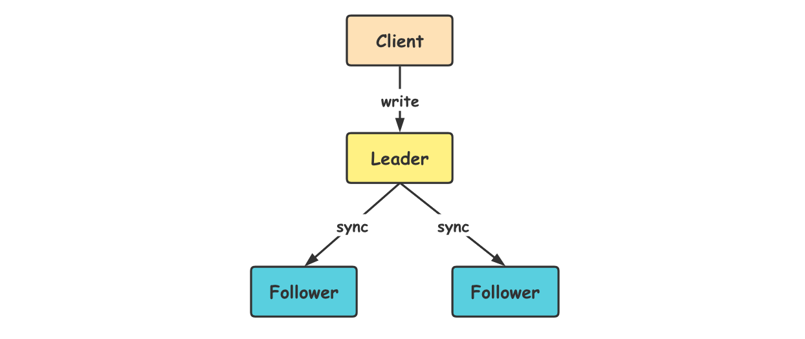

但实际情况要复杂的多，比如 client 它并不知道哪个节点是 leader 有可能写的请求会发给 follower ，由 follower 再**转发**给 leader 进行**同步**处理。

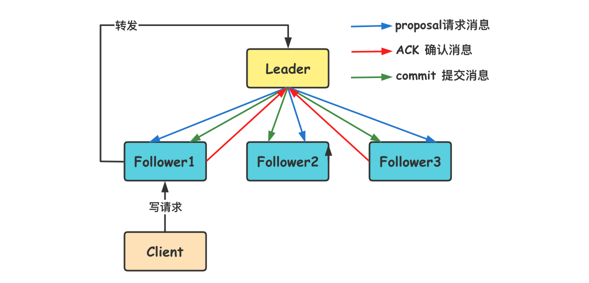

客户端**写入流程**说明：

1. client 向 zk 中的 server 发送写请求，如果该 server 不是 leader，则会将该写请求转发给 leader，leader 将请求事务以 **proposal** 形式分发给 follower；
2. 当 follower 收到 leader 的 proposal 时，根据接收的**先后顺序**处理 proposal；
3. 当 leader 收到 follower 针对某个 proposal **过半的 ack 后**，则发起**事务提交**，重新发起一个 **commit** 的 proposal；
4. follower 收到 commit 的 proposal 后，**记录事务提交**，并把数据更新到**内存数据库**；
5. 当写成功后，反馈给 client。

**服务节点初始化同步：**

在集群运行过程当中如果有一个 follower 节点宕机，由于宕机节点没过半，集群仍然能正常服务。当 leader 收到新的客户端请求，此时无法同步给宕机的节点。造成数据不一致。为了解决这个问题，当**节点启动**时，第一件事情就是找当前的 Leader，比对数据是否一致。不一至则开始**同步**，同步完成之后在进行对外提供服务。

如何比对 Leader 的数据**版本**呢，这里通过 **ZXID 事务 ID** 来确认。比 Leader 低就需要同步。

**ZXID：**ZXID 是一个长度 64 位的数字，其中低 32 位是按照数字递增，**任何数据的变更**都会导致低 32 位的数字简单加 1。高 32 位是 leader 周期编号，每当选举出一个新的 leader 时，新的 leader 就从本地事务日志中取出 ZXID，然后解析出高 32 位的周期编号，进行**加 1**，再将**低 32 位的全部设置为 0**。这样就保证了每次**新选举的 leader 后**，保证了 ZXID 的**唯一性而且是保证递增**的。 

#### 数据与存储

Zookeeper 的数据模型是树结构，在**内存数据库**中，存储了整棵树的内容，包括所有的节点路径、节点数据、ACL 信息，Zookeeper 会定时将这个数据存储到磁盘上。在 Zookeeper 服务器启动期间，首先会进行数据初始化工作，用于将存储在磁盘上的数据文件加载到服务器内存中。

##### 1.内存数据

###### (1)DataTree

DataTree 是内存数据存储的核心，是一个树结构，**代表了内存中一份完整的数据**。DataTree 不包含任何与网络、客户端连接及请求处理相关的业务逻辑，是一个独立的组件。

###### (2)DataNode

**DataNode 是数据存储的最小单元**，其内部除了保存了结点的数据内容、ACL 列表、节点状态之外，还记录了父节点的引用和子节点列表两个属性，其也提供了对子节点列表进行操作的接口。

###### (3)ZKDatabase

Zookeeper 的内存数据库，管理 Zookeeper 的所有会话、DataTree 存储和事务日志。ZKDatabase 会定时向磁盘 dump 快照数据，同时在 Zookeeper 启动时，会通过磁盘的事务日志和快照文件**恢复**成一个完整的内存数据库。

##### 2.事务日志

在配置 Zookeeper 集群时需要配置 dataDir 目录，其用来存储事务日志文件。

##### 3.数据快照(snapshot)

数据快照是 Zookeeper 数据存储中非常核心的运行机制，数据快照用来记录 Zookeeper 服务器上某一时刻的**全量**内存数据内容，并将其写入指定的**磁盘**文件中。

### ZooKeeper应用

Zookeeper 是一个典型的发布/订阅模式的分布式数据管理与协调框架，基于分布式的数据发布与订阅可以有诸多应用场景。可以用在名字服务、配置管理、集群管理、集群选举、分布式锁、队列管理、消息订阅 等场景。

#### 命名服务/注册中心

命名服务功能主要是根据指定名字来获取资源或服务的地址、提供者等信息，利用其 znode 和 watcher 机制，将其作为动态注册和获取服务信息的配置中心，统一管理服务名称和其对应的服务器列表信息，系统能够实时感知后端服务器的状态(上线、下线、宕机)。

因此 Zookeeper 可以作为注册中心。

##### 1.负载均衡

轮询服务注册表，尽可能将服务请求均匀分配到所有注册有效的服务器上。

##### 2.健康检查/心跳监测

动态维护服务地址注册表，利用心跳请求实时监控注册服务状态，删除无效服务节点，维护有效的地址注册表。可以让不同的机器都在 ZooKeeper 的一个指定节点下创建临时子节点。不同机器之间可以根据这个临时节点来判断对应的客户端机器是否存活。

##### 3.调用监控

通过统计注册表各个子节点被访问次数来监控服务调用情况。

##### 4.动态路由

可以通过配置注册表参数，在不修改服务代码的情况下，动态指定服务访问的机器。

##### 5.动态配置

发布者将数据发布到 Zookeeper 的一个或多个节点上，订阅者进行数据订阅以动态获取数据，从而实现配置信息的集中式管理与数据的动态更新。

一般发布订阅有两种模式：推模式和拉模式。

- **推模式：**服务端主动将数据更新发送给所有订阅的客户端。
- **拉模式：**客户端主动发起请求以定时轮询的方式获取最新数据。

Zookeeper 采取了推拉结合的模式。**客户端向服务端注册自己需要关注的节点，一旦节点的数据发生变更，那么服务端就会向相应的客户端发送 Watcher 事件通知。客户端收到这个通知之后，需要主动到服务端获取最新的数据**。

配置中心中的配置数据有几个特点：

- 数据量较小。
- 数据内容可以动态变化。
- 集群多个机器共享配置信息。

比如可以把数据库的配置信息存放到 Zookeeper 中，机器初始化的时候去读取一次数据库配置信息，并在配置节点上注册一个监听数据变更的 Watcher 监听。如果配置信息改变，Zookeeper 可以告知机器配置信息发生变更，机器重新拉取配置信息即可。

#### 分布式锁

分布式锁是控制分布式系统之间同步访问共享资源的一种方式。

##### 1.排他锁

排他锁(Exclusive Locks, 简称 X 锁)，又称为**写锁或独占锁**。如果事务 T1 对数据对象 O1 加上了排他锁，那么整个加锁期间，只允许事务 T1 对 O1 进行读取和操作，其他任何事务都不能再对这个数据对象进行读写操作，直到事务释放了排他锁。

排他锁的核心是如何保证当前有且仅有一个事务获得锁，并且锁被释放后，所有正在获得锁的事务都能被通知到。

###### (1)定义锁

Zookeeper 中通过数据节点来表示一个锁，例如 /exclusive/lock 节点就可以被定义为一个锁。


###### (2)获取锁

在需要获取锁时，所有客户端都会试图调用 **create()** 接口，在 /exclusive 节点下创建**临时子节点** /exclusive/lock。Zookeeper 保证所有客户端最终只有一个客户端能**创建成功**，就可以认为该客户端获取了锁。其他没获取锁的客户端会在 /exclusive 节点上注册一个子节点变更的 **Watcher 监听**，以便实时监听到 lock 节点的变更情况。

###### (3)释放锁

由于 /exclusive/lock 是一个**==临时节点==**，因此在以下两种情况下，都可能释放锁。

- 当前获取锁的客户端机器发生宕机，那么此临时节点就会被移除。
- 正常**执行完**业务逻辑后，客户端会主动将自己创建的临时节点**删除**。

无论什么情况下移除了 /exclusive/lock 节点，Zookeeper 都会通知所有在 /exclusive 节点上注册了**子节点变更** Watcher 监听的客户端，客户端收到通知之后，就会重新发起分布式锁获取，即**重复 "获取锁"** 过程。

整个排他锁获取与释放流程如下。

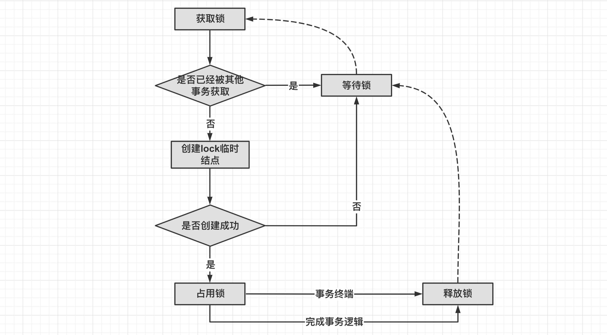

##### 2.共享锁

共享锁(Shared Locks, 简称 S 锁)，又称**读锁**。如果事务 T1 对数据对象 O1 加上了**共享锁**，那么当前事务只能对 O1 进行**读取操作**，其他事务也只能对这个数据对象加**共享锁**，直到该数据对象上的**所有共享锁都被释放**。

共享锁与排他锁的根本区别在于，加上排他锁后，数据对象只对一个事务可见，而加上共享锁后，数据对所有事务都可见。

###### (1)定义锁

同样通过 Zookeeper 上的数据节点表示一个锁，是一个类似于 **/shared/[Hostname]-请求类型-序号** 的**临时顺序节点**。 

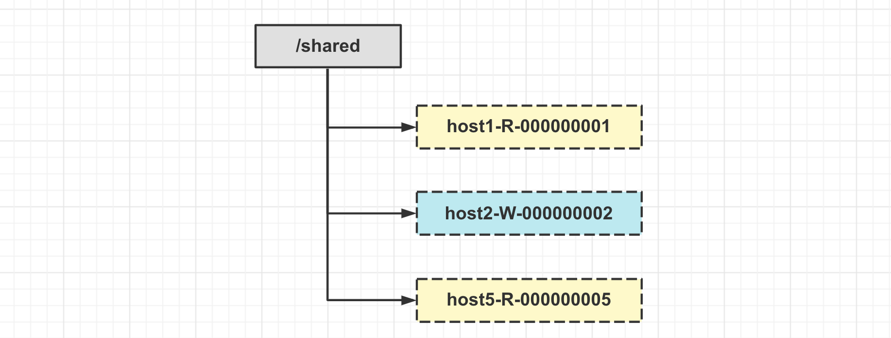

###### (2)获取锁

在需要获取共享锁时，所有客户端都会到 /shared 这个节点下创建一个**==临时顺序节点==**。如果当前是读请求，那么就创建例如 /shared/192.168.0.2-R-000000001 的节点；如果是写请求，那么就创建例如 /shared/192.168.0.2-W-000000001 的节点。

###### (3)判断读写顺序

根据共享锁的定义，**不同的事务**都可以同时对同一个数据对象进行**读取操作**，而**更新操作**必须在当前没有任何事务进行**读写操作**的情况下进行。基于这个原则，通过 Zookeeper 的节点可以确定分布式读写顺序，大致可以分为以下四个步骤：

- 创建完节点后，获取 /shared 节点下的所有子节点，并对该节点注册子节点变更的 Watcher 监听。
- 确定自己的节点序号在所有子节点的顺序。
- 对于**读请求**。如果没有比自己序号小的子节点，或是所有比自己序号小的子节点都是**读请求**，那么表明自己已经成功**获取到了共享锁**，同时开始执行读取逻辑；如果比自己序号小的子节点中有**写请求**，那么需要进入等待。对于**写请求**。如果自己不是序号最小的子节点，就需要进入等待。
- 接收到 Watcher 通知后，重复步骤 1。

###### (4)释放锁

释放锁的逻辑和排他锁是一致的。整个共享锁的获取与释放流程如下图所示。

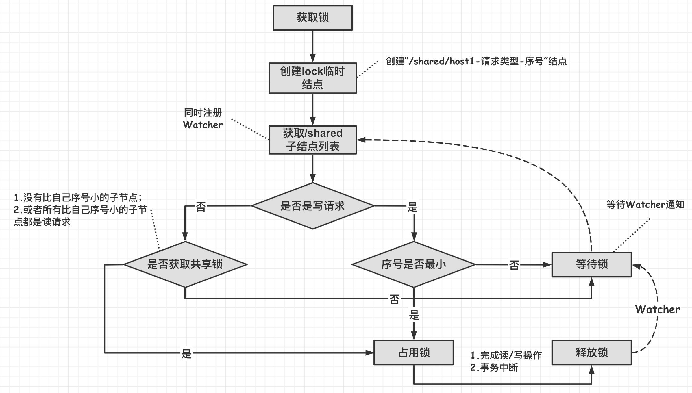

##### 3.羊群效应

上述的共享锁过程基本能满足一般分布式集群竞争锁的需求(一般 10 台机器以内)。但如果机器规模扩大后，就会存在问题。这里重点看看“判断读写顺序”的过程。下面是一个共享锁的实例。

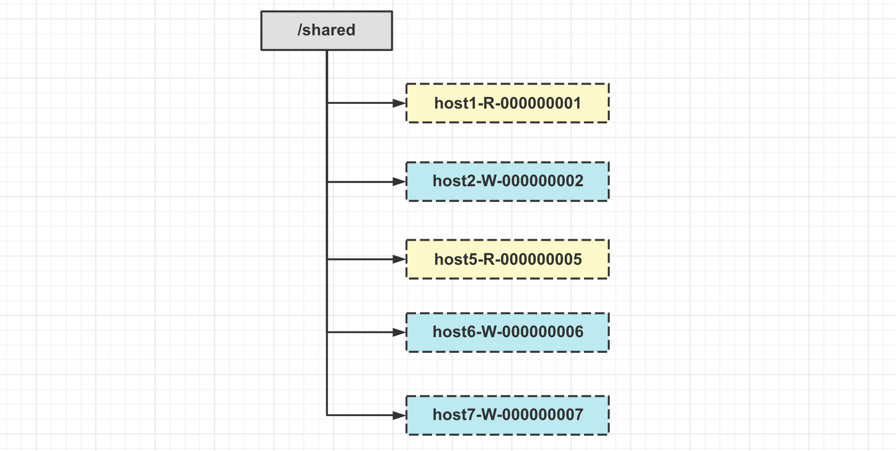

分析一下上面的情况。

- host1 这台机器首先进行读操作，完成读操作后将节点 host1-R-000000001 **删除**。
- 剩下的 4 台机器**都收到了这个节点被删除的通知**。然后**重新从 /shared 节点上获取一份新的子节点列表**。
- 每个机器判断自己的读写顺序。其中 host2 这个机器发现自己已经是序号最小的机器了，于是开始进行写操作。其他机器发现没有轮到自己进行读或写操作，于是继续等待。
- 重复上述流程.....

因此可以看到，host1 这个客户端在移除自己的共享锁之后，Zookeeper 发送了**子节点变更 Watcher 通知给==所有==机器**，这个通知实际上仅对 host2 机器产生了实际的影响，对其他的全部机器都没有任何作用。

上述过程可以看到，在整个分布式锁的竞争过程中，大量的 ==**"Watcher 通知"**== 和 ==**"子结点列表获取"**== 两个操作重复进行。且大多数运行的结果都是判断出自己并非是序号最小的结点，从而继续等待下一轮通知。**如果集群规模比较大，就会对 Zookeeper 服务器造成巨大的性能影响和网络冲击；而且如果同一时刻有多个结点对应的客户端完成事务或是事务中断引起结点消失，Zookeeper 服务器就会在短时间内向其余客户端发送大量的事件通知**，这就是 **=="羊群效应"==**。

上述的 Zookeeper 分布式共享锁的实现中出现羊群效应的根源在于没有找准客户端真正的关注点。前述的分布式锁竞争过程的核心逻辑在于，判断自己是否是所有子节点中序号最小的。因此很容易想到每个结点对应的客户端其实只需要关注比自己序号小的那个相关结点的变更情况就可以了，而不需要关注全局的子列表变更情况。

##### 4.改进分布式锁

前述的共享锁实现思路是对的，这里的改进主要在于：每个锁竞争者，只需要关注 /shared 结点下序号比自己小的那个结点是否存在即可。如下图所示。

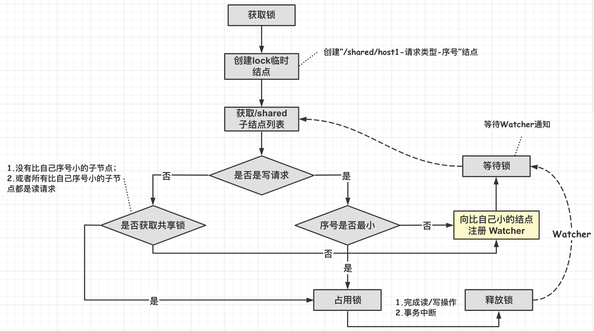

具体步骤如下：

1. 客户端调用 create() 方法创建一个类似与 "/shared/[Hostname]-请求类型-序号" 的临时顺序结点。
2. 客户端调用 getChildren() 接口来获取所有已经创建的子结点列表。注意对比之前的实现：这里**==不需要注册任何 Watcher==**。
3. 如果无法获取共享锁，那么就调用 exist() 来**==向比自己小的那个结点注册 Watcher==**。注意：这里 "比自己小的结点" 具体得看是读请求还是写请求。

- **==读请求==：向比自己序号小的==最后一个写请求结点==注册 Watcher 监听。**
- **==写请求==：向比自己序号小的==最后一个结点==注册 Watcher 监听。**

4. 等待 Watcher 通知，继续进入步骤 2。

这个改进过程其实就是尽量去**缩小锁**的范围。具体选哪种实现可以根据**具体的场景选择**。在集群规模不大、网络资源丰富的情况下，采用第一种实现是简单实用的选择；如果集群达到一定规模，且希望能精细化的控制分布式锁，那可以采用改进版的分布式锁实现。

#### 框架与系统应用

##### 1.Hadoop

Hadoop 利用 Zookeeper 实现 HA(High Availability)，这部分逻辑主要集中在 Hadoop Common 的 HA 模块中。

##### 2.HBase

HBase 利用 Zookeeper 服务完成对整个系统的分布式协调工作。

##### 3.Kafka

Kafka 使用 Zookeeper 作为注册系统来对整个集群的 Broker 服务器进行管理。在 Zookeeper 上会有一个专门用来进行 Broker 服务器列表记录的结点(记为 Broker 结点)，其路径为 "/brokers/ids"。每个 Broker 服务器在启动时，都会到 Zookeeper 上进行注册，即到 Broker 结点下创建属于自己的结点，其结点路径为 "/brokers/ids/[0-N]"。

在 Kafka 中，使用一个全局唯一的数字(可称为 Broker ID)来代表每一个 Broker 服务器，不同的 Broker 必须使用不同的  Broker ID 进行注册，如 "/brokers/ids/1" 和 "/brokers/ids/2" 分别代表了两个 Broker 服务器。创建完 Broker 结点后，每个 Broker 会将自己的 IP 地址和端口信息写入到该结点下去。

Broker 创建的结点是一个临时结点，一旦这个 Broker 服务器宕机或者下线，对应的 Zookeeper 结点也会删除。因此可以通过 Zookeeper 上 Broker 结点的变化情况来动态表征 Broker 服务器的可用性。

除了 Broker 之外，Topic 注册也是类似的逻辑。

##### 4.Dubbo

**Zookeeper 一个最常用的使用场景就是用于担任服务生产者和服务消费者的注册中心(提供发布订阅服务)。** 服务生产者将自己提供的服务注册到 Zookeeper 中心，服务的消费者在进行服务调用的时候先到 Zookeeper 中查找服务，获取到服务生产者的详细信息之后，再去调用服务生产者的内容与数据。在 Dubbo 架构中 Zookeeper 就担任了注册中心这一角色。

在单体式服务中，通常是由多个客户端去调用一个服务，只要在客户端中配置唯一服务节点地址即可，当升级到分布式后，服务节点变多，像阿里一线大厂服务节点更是上万之多，这么多节点不可能手动配置在客户端，这里就需要一个**中间服务**，专门用于**帮助客户端发现服务节点**，就是**服务发现**。

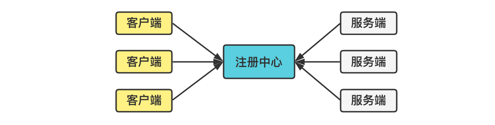

一个完整的注册中心涵盖以下功能特性：

- **服务注册：**服务端**上线时**将自提供的服务提交给注册中心。
- **服务注销：**通知客户端服务端**下线**。
- **服务订阅**：动态实时接收服务**变更消息**。
- **可靠性**：注册服务本身是**集群**的，数据**冗余存储**。避免单点故障，及数据丢失。
- **容错性**：当服务提供者出现宕机，断电等极端情况时，注册中心能够**动态感知**并通知客户端服务提供者的状态。

Dubbo 基于 Zookeeper 实现服务**注册中心**。所有服务提供者在 Zookeeper 上创建的结点都是临时结点，这利用了临时结点的生命周期与客户端会话相关的特性，可以表明服务提供者的在线状态。

###### (1)Dubbo Zookeeper注册中心存储结构

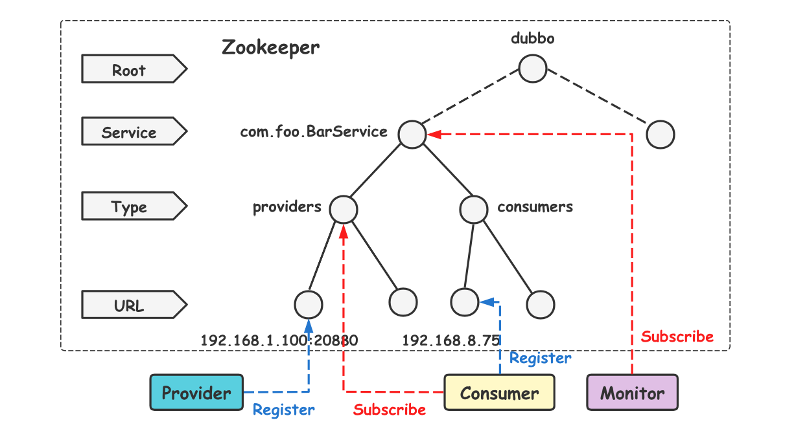

**节点说明**

|  **类别**   |   **属性**   |                           **说明**                           |
| :---------: | :----------: | :----------------------------------------------------------: |
|  **Root**   | **持久节点** |                  根节点名称，默认是 "dubbo"                  |
| **Service** | **持久节点** |                 **服务名称**，完整的服务类名                 |
|  **type**   | **持久节点** | 可选值：**providers**(提供者)、**consumers**（消费者）、**configurators**(动态配置)、**routers** |
|   **URL**   | **临时节点** |       URL 名称：包含服务提供者的 IP 端口及配置等信息。       |

**流程说明**

1. 服务**提供者**启动时：向 /dubbo/com.foo.BarService/providers 目录下写入自己的 **URL 地址**。
2. 服务**消费者**启动时：**订阅** /dubbo/com.foo.BarService/providers 目录下的提供者 **URL 地址**。并向 /dubbo/com.foo.BarService/consumers 目录下写入**自己的 URL 地址**。
3. **监控中心**启动时：订阅 /dubbo/com.foo.BarService 目录下的**所有提供者和消费者 URL 地址**。

###### (2)示例代码

服务端：

```java
import com.alibaba.dubbo.config.ApplicationConfig;
import com.alibaba.dubbo.config.ProtocolConfig;
import com.alibaba.dubbo.config.RegistryConfig;
import com.alibaba.dubbo.config.ServiceConfig;
import java.io.IOException;

public class Server {
    public void openServer(int port) {
        // 构建应用
        ApplicationConfig config = new ApplicationConfig();
        config.setName("simple-app");

        // 通信协议
        ProtocolConfig protocolConfig = new ProtocolConfig("dubbo", port);
        protocolConfig.setThreads(200);

        ServiceConfig<UserService> serviceConfig = new ServiceConfig();
        serviceConfig.setApplication(config);
        serviceConfig.setProtocol(protocolConfig);
        serviceConfig.setRegistry(new RegistryConfig("zookeeper://192.168.0.149:2181"));
        serviceConfig.setInterface(UserService.class);
        UserServiceImpl ref = new UserServiceImpl();
        serviceConfig.setRef(ref);
        //开始提供服务  开张做生意
        serviceConfig.export();
        System.out.println("服务已开启!端口:"+serviceConfig.getExportedUrls().get(0).getPort());
        ref.setPort(serviceConfig.getExportedUrls().get(0).getPort());
    }

    public static void main(String[] args) throws IOException {
        new Server().openServer(-1);
        System.in.read();
    }
}
```

客户端代码：

```java
import com.alibaba.dubbo.config.ApplicationConfig;
import com.alibaba.dubbo.config.ReferenceConfig;
import com.alibaba.dubbo.config.RegistryConfig;
import java.io.IOException;

public class Client {
    
    UserService service;

    // URL远程服务的调用地址
    public UserService buildService(String url) {
        ApplicationConfig config = new ApplicationConfig("young-app");
        // 构建一个引用对象
        ReferenceConfig<UserService> referenceConfig = new ReferenceConfig<>();
        referenceConfig.setApplication(config);
        referenceConfig.setInterface(UserService.class);
        referenceConfig.setRegistry(new RegistryConfig("zookeeper://192.168.0.149:2181"));
        referenceConfig.setTimeout(5000);
        // 透明化
        this.service = referenceConfig.get();
        return service;
    }

    static int i = 0;

    public static void main(String[] args) throws IOException {
        Client client1 = new Client();
        client1.buildService("");
        String cmd;
        while (!(cmd = read()).equals("exit")) {
            UserVo u = client1.service.getUser(Integer.parseInt(cmd));
            System.out.println(u);
        }
    }
    private static String read() throws IOException {
        byte[] b = new byte[1024];
        int size = System.in.read(b);
        return new String(b, 0, size).trim();
    }
}
```

查询 zk 实际存储内容：

```bash
/dubbo
/dubbo/com.tuling.zk.dubbo.UserService
/dubbo/com.tuling.zk.dubbo.UserService/configurators	# 配置
/dubbo/com.tuling.zk.dubbo.UserService/routers	# 路由

/dubbo/com.tuling.zk.dubbo.UserService/providers	# 提供者
/dubbo/com.tuling.zk.dubbo.UserService/providers/dubbo://192.168.0.132:20880/com.tuling.zk.dubbo.UserService?anyhost=true&application=simple-app&dubbo=2.6.2&generic=false&interface=com.tuling.zk.dubbo.UserService&methods=getUser&pid=11128&side=provider&threads=200&timestamp=1570518302772
/dubbo/com.tuling.zk.dubbo.UserService/providers/dubbo://192.168.0.132:20881/com.tuling.zk.dubbo.UserService?anyhost=true&application=simple-app&dubbo=2.6.2&generic=false&interface=com.tuling.zk.dubbo.UserService&methods=getUser&pid=12956&side=provider&threads=200&timestamp=1570518532382
/dubbo/com.tuling.zk.dubbo.UserService/providers/dubbo://192.168.0.132:20882/com.tuling.zk.dubbo.UserService?anyhost=true&application=simple-app&dubbo=2.6.2&generic=false&interface=com.tuling.zk.dubbo.UserService&methods=getUser&pid=2116&side=provider&threads=200&timestamp=1570518537021

/dubbo/com.tuling.zk.dubbo.UserService/consumers	# 消费者
/dubbo/com.tuling.zk.dubbo.UserService/consumers/consumer://192.168.0.132/com.tuling.zk.dubbo.UserService?application=young-app&category=consumers&check=false&dubbo=2.6.2&interface=com.tuling.zk.dubbo.UserService&methods=getUser&pid=9200&side=consumer&timeout=5000&timestamp=1570518819628
```

#### 应用实例

##### 1.分布式集群监控

实现对集群中各个机器的状态管理。

###### (1)分布式集群管理需求

1. 主动查看线上服务节点数量。
2. 查看服务节点**资源使用情况**。
3. 服务**离线**通知。
4. 服务资源(CPU、内存、硬盘)**超出阀值**通知。

###### (2)架构设计

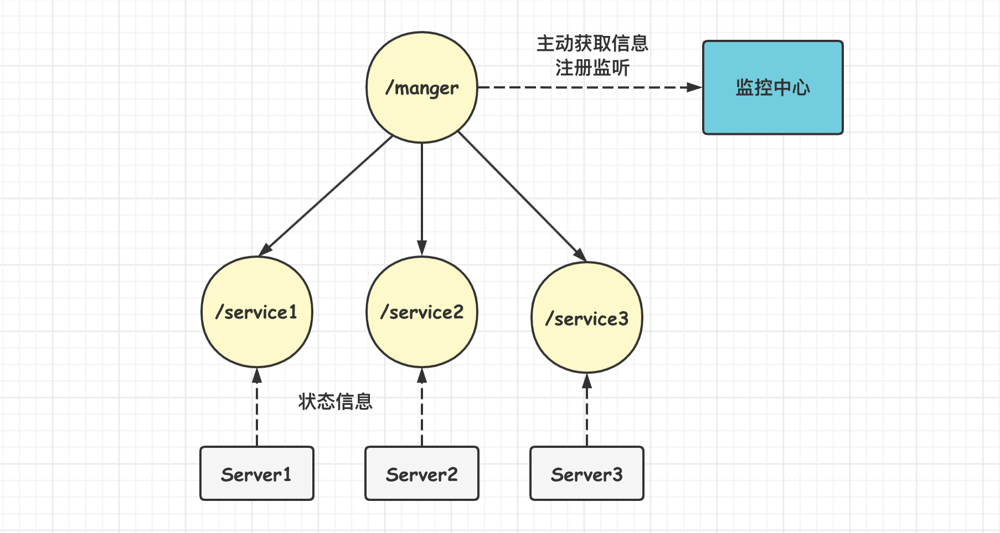

 **节点结构：**服务器当做根结点：

```
manger    // 根节点
```

其他服务结点为**临时序号结点**：

```txt
server00001 :<json> 		// 服务节点 1
server00002 :<json> 		// 服务节点 2
server....n :<json>	        // 服务节点 n
```

**服务器节点的状态信息**：

    1. IP
    2. CPU
    3. memory
    4. disk

###### (3)功能实现

**数据生成与上报：**服务器上线,创建临时节点。定时变更节点状态信息。

**主动查询：**实时查询 Zookeeper 获取集群节点的状态信息。

**被动通知：**监听根节点下子节点的变化情况,如果 CPU 等硬件资源低于警告位则发出警报。

客户端代码：

```java
public class Agent {

    private String server = "192.168.0.149:2181";
    ZkClient zkClient;
    private static Agent instance;
    private static final String rootPath = "/manger";
    private static final String servicePath = rootPath + "/service";
    private String nodePath;
    private Thread stateThread;
    List<OsBean> list = new ArrayList<>();

    public static void premain(String args, Instrumentation instrumentation) {
        instance = new Agent();
        if (args != null) {
            instance.server = args;
        }
        instance.init();
    }

    // 初始化连接
    public void init() {
        // 创建客户端
        zkClient = new ZkClient(server, 5000, 10000);
        System.out.println("zk连接成功" + server);
        // 创建根结点
        buildRoot();
        // 创建结点
        createServerNode();
        // 定时任务实时更新
        stateThread = new Thread(() -> {
            while (true) {
                updateServerNode();
                try {
                    Thread.sleep(5000);
                } catch (InterruptedException e) {
                    e.printStackTrace();
                }
            }
        }, "zk_stateThread");
        stateThread.setDaemon(true);
        stateThread.start();
    }

    // 构建根节点
    public void buildRoot() {
        if (!zkClient.exists(rootPath)) {
            zkClient.createPersistent(rootPath);
        }
    }

    // 生成服务节点
    public void createServerNode() {
        nodePath = zkClient.createEphemeralSequential(servicePath, getOsInfo());
        System.out.println("创建节点:" + nodePath);
    }

    // 监听服务节点状态改变
    public void updateServerNode() {
        zkClient.writeData(nodePath, getOsInfo());
    }

    // 更新服务节点状态
    public String getOsInfo() {
        OsBean bean = new OsBean();
        bean.lastUpdateTime = System.currentTimeMillis();
        bean.ip = getLocalIp();
        bean.cpu = CPUMonitorCalc.getInstance().getProcessCpu();
        MemoryUsage memoryUsag = ManagementFactory.getMemoryMXBean().getHeapMemoryUsage();
        bean.usableMemorySize = memoryUsag.getUsed() / 1024 / 1024;
        bean.usableMemorySize = memoryUsag.getMax() / 1024 / 1024;
        ObjectMapper mapper = new ObjectMapper();
        try {
            return mapper.writeValueAsString(bean);
        } catch (JsonProcessingException e) {
            throw new RuntimeException(e);
        }
    }

    // 更新结点
    public void updateNode(String path, Object data) {
        if (zkClient.exists(path)) {
            zkClient.writeData(path, data);
        } else {
            zkClient.createEphemeral(path, data);
        }
    }

	// 获取本地IP地址
    public static String getLocalIp() {
        InetAddress addr = null;
        try {
            addr = InetAddress.getLocalHost();
        } catch (UnknownHostException e) {
            throw new RuntimeException(e);
        }
        return addr.getHostAddress();
    }

}
```


#### 参考资料

- 《从Paxos到Zookeeper-分布式一致性原理与实践》


#### 


