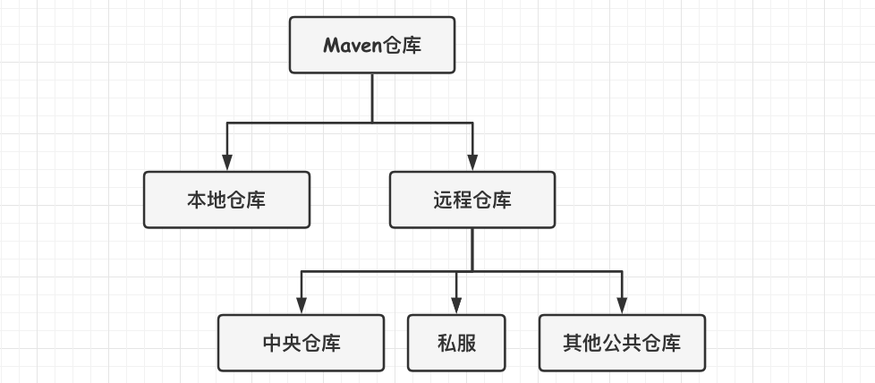
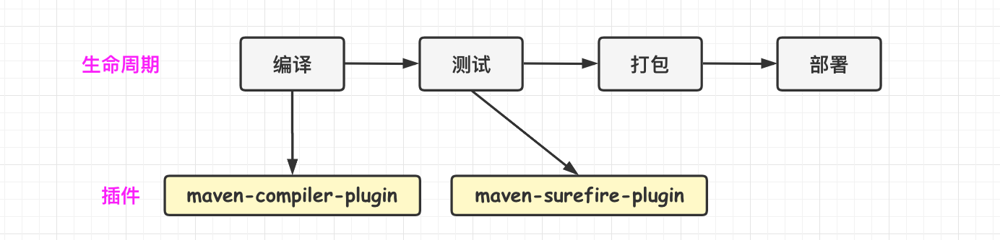
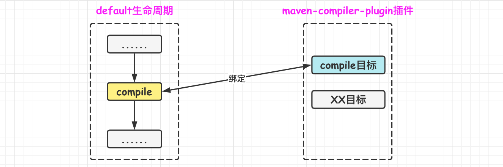
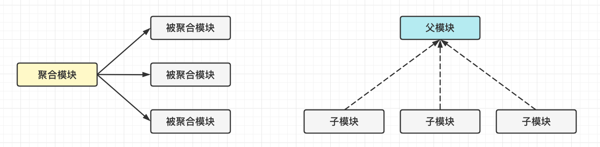

[TOC]

### Maven

#### Maven基础

##### 1.概述

Maven 是一个跨平台的项目管理工具，主要服务于 Java 平台的项目构建、依赖管理和项目信息管理。

Maven 的主要用途是**项目构建**，能够**自动化构建**从清理、编译、测试到生成报告，再到打包和部署的整个过程，只需要输入简单命令即可。此外，Maven 不仅是构建工具，还是依赖管理工具和项目信息管理工具，通过提供中央仓库，自动下载构件(artifact)。

##### 2.Maven安装

Maven 运行依赖于 JDK。

需要环境变量 **M2_HOME** 为 Maven 安装目录。

一个重要的路径是当前用户目录下的 "**~.m2**" 目录，该目录存放了 repository 仓库，这是 Maven 的本地仓库，存放了所有的构建。

**最佳实践**：将安装目录下的配置文件 "M2_HOME/conf/settings.xml" 复制到 "**~.m2**" 目录中，即 "~/.m2/settings.xml"，然后再进行配置修改。因为前者是全局范围的，整台机器上所有用户都会受该配置影响，而后者是用户范围的，只会影响当前用户。推荐配置用户范围的配置，可以避免无意识影响其他用户，也可以避免 Maven 升级时配置被覆盖。

如果需要接入公司的私有仓库，一般需要进行 Maven 认证，需要在配置文件中设置 HTTP 代理并配置用户信息和密码。

##### 3.约定优于配置

Maven 中存在一个**超级 POM**，所有的项目都隐式的基础自该 POM，类似与所有 Java 对象都继承自 Object 类。超级 POM 定义了中央仓库和插件仓库，以及一些目录结构。**这就是体现约定的地方**。

Maven 项目约定：

- **源码目录**：**src/main/java**
- 资源目录：src/main/resources
- **测试源码目录**：**src/test/java**
- 测试资源目录：src/test/resources
- 编译输出目录：target/classes
- 打包方式：jar

#### POM文件

Maven 项目的核心是 pom.xml，POM(Project Object Model) 即项目对象模型，定义项目基本信息，描述项目如何构建，声明项目依赖等。

一个示例文件如下：

```xml
<?xml version="1.0" encoding="UTF-8" standalone="no"?>
<project xmlns="http://maven.apache.org/POM/4.0.0" xmlns:xsi="http://www.w3.org/2001/XMLSchema-instance" xsi:schemaLocation="http://maven.apache.org/POM/4.0.0 http://maven.apache.org/maven-v4_0_0.xsd">
    <modelVersion>4.0.0</modelVersion>
    <groupId>com.nano</groupId>
    <artifactId>nano-diary</artifactId>
    <version>1.0.4</version>
    <packaging>pom</packaging>
    <name>${project.artifactId}</name>

    <!--定义父POM-->
    <parent>
        <groupId>com.nano</groupId>
        <artifactId>nano-parent</artifactId>
        <version>2.0.0</version>
    </parent>

    <!--聚合模块-->
    <modules>  
        <module>nano-diary-common</module>
        <module>nano-diary-server</module>
        <module>nano-diary-job</module>
    </modules>

    <!--自定义属性-->
    <properties>
        <commons2.spring.version>2021.05.2</commons2.spring.version>
        <hadoop.client.version>2.5.1</hadoop.client.version>
        <alibaba.easyexcel.version>2.2.10</alibaba.easyexcel.version>
        <commons.mailer.version>0.2.4</commons.mailer.version>
        <common.redis.version>2022.03.2</common.redis.version>
        <zookeeper.version>1.3.2</zookeeper.version>
    </properties>

    <!--定义依赖-->
    <dependencies>
        <dependency>
            <groupId>org.apache.zookeeper</groupId>
            <artifactId>zookeeper</artifactId>
            <version>${zookeeper.version}</version>
        </dependency>
    </dependencies>

    <!--构件相关-->
    <build>
        <pluginManagement>
            <plugins>
                <plugin>
                    <groupId>com.nano.common.plugin</groupId>
                    <artifactId>code-generator-maven-plugin</artifactId>
                    <version>0.0.1</version>
                </plugin>
            </plugins>
        </pluginManagement>
    </build>

</project>
```

- project：所有 pom.xml 的根目录；

- modelVersion：指定当前 POM 模型的版本。

- groupId、artifactId、version：定义了项目的基本坐标。

- packaging：打包方式。默认为 jar，还可以为 pom、war 等。

#### 坐标与依赖

##### 1.坐标

Maven 坐标是用来表示一个组件依赖的标示。世界上任何一个构件都可以使用 Maven 坐标唯一标识，Maven 坐标元素包括 **groupId，artifactId，version，packaging、classifier**。只要能正确提供坐标元素，就能找到对应的 Maven 构件。

一个坐标示例如下：

```xml
<groupId>com.nano</groupId>
<artifactId>nano-diary</artifactId>
<version>1.0.4</version>
<packaging>pom</packaging>
```

- **groupId**：定义当前 Maven 项目隶属的**实际项目**。不应该是组织或公司(一个公司有很多项目，每个项目有很多模块)。通常是域名反向写。
- **artifactId**：定义实际项目的一个 Maven 模块，推荐使用**实际项目名称**作为前缀。
- **version**：定义 Maven 项目当前所处的版本。前三个合称 **GAV**，是**必须定义**的。
- **packaging**：定义 Maven 项目的打包方式，可选的有：jar(默认)、war、pom，不同的打包方式会影响构建的生命周期。
- classifier：定义构建输出的一些附属构建，如 javadoc、sources。

##### 2.依赖配置

POM 文件的根元素 "\<project>" 下面 "\<**dependencies**>" 可以包含若干个 "\<**dependency**>" 元素，以声明项目的依赖。

```xml
<dependencies>
    <dependency>
        <groupId></groupId>
        <artifactId></artifactId>
        <version></version>
        <type></type>
        <scope></scope>
        <optional></optional>
        <exclusions>
            <exclusion>
            </exclusion>
        </exclusions>
    </dependency>
</dependencies>
```

一个依赖声明可以包含下面元素：

- groupId、artifactId、version：依赖的基本坐标，合称 GAV，是必须的元素。
- type：依赖的类型，对应于项目坐标定义的 packaging，默认：jar。大多数情况下不用写
- scope：依赖的范围。
- optional：标志依赖是否可选，true/false。
- exclusions：用来排除传递性依赖。

##### 3.依赖范围

依赖范围是用来**控制依赖于三种 classpath(编译 classpath、测试 classpath、运行 classpath) 的关系**。

Maven 的依赖范围有如下几种：

- **compile**：**编译依赖范围**。没有指定时则默认为此，对编译、测试、运行等三种 classpath 都有效。典型例子是 Spring-Core 在三种环境下都需要。
- **test**：**测试依赖范围**。只对测试 classpath 有效，典型例子是 Junit，它只在编译测试代码及运行测试时需要。
- **provided**：**已提供依赖范围**。对**编译和测试** classpath 有效，但在运行时无效，典型例子是 servlet-api，运行时由容器提供。
- **runtime**：**运行时依赖范围**。对**测试和运行** classpath 有效，编译主代码时无效，典型例子是 JDBC 驱动实现，编译时只需要 JDK 提供的 JDBC 接口，运行才需要具体的实现。
- **system**：**系统依赖范围**。对**编译和测试** classpath 有效，但在运行时无效。使用该范围时，必须通过 systemPath 元素指定依赖的路径。
- **import**：**导入依赖范围**。该范围**不会对三种 classpath 产生实际应用**，会将目标 POM 中的 dependencyManagement 配置导入合并到当前 POM 的 dependencyManagement 元素中。多用在父 POM 中。

| 依赖范围Scope | 对于编译classpath有效 | 对于测试classpath有效 | 对于运行classpath有效 |     示例     |
| :-----------: | :-------------------: | :-------------------: | :-------------------: | :----------: |
|    compile    |           Y           |           Y           |           Y           | Spring-core  |
|     test      |           N           |           Y           |           N           |    JUnit     |
|   provided    |           Y           |           Y           |           N           | Servlet-api  |
|    runtime    |           N           |           Y           |           Y           | JDBC驱动实现 |
|    system     |           Y           |           Y           |           N           |              |

##### 4.传递性依赖与依赖范围

Maven 的传递性依赖是指**不需要考虑依赖的库文件所需要依赖的库文件，能够将依赖模块的依赖自动的引入**。

依赖的**范围**不仅可以控制依赖与三种 classpath 的关系，还会对**传递性依赖**产生影响。假设 A 依赖于 B，B 依赖于 C，则说 A 对于 B 是第一直接依赖，B 对 C 是第二直接依赖，A 对于 C 是传递依赖。第一直接依赖范围和第二直接依赖范围决定了传递性依赖的范围，其结果如下：

下表**第一列为第一直接依赖**，**第一行为第二直接依赖**。

|              | compile  | test | provided | runtime  |
| :----------: | :------: | :--: | :------: | :------: |
| **compile**  | compile  |  -   |    -     | runtime  |
|   **test**   |   test   |  -   |    -     |   test   |
| **provided** | provided |  -   | provided | provided |
| **runtime**  | runtime  |  -   |    -     | runtime  |

- 第二直接依赖范围是 "compile" 时，传递性依赖范围与第一直接依赖范围**一致**；
- 第二直接依赖范围是 "test" 时，依赖**不会得以传递**；
- 第二直接依赖范围是 "provided" 时，只传递第一直接依赖范围也为 provided 的；
- 第二直接依赖范围是 "runtime" 时，传递性依赖的范围与第一直接依赖范围一致。

例子：nano-diary 项目有一个依赖范围为 test 的 Hutool 依赖，称之为第一直接依赖。Hutool 又依赖了一个 javax.mail，依赖范围为 compile，即第二直接依赖为 compile。查询上表得知传递性依赖的范围是 test，所以 javax.mail 是 nano-diary 项目的一个范围为 test 的传递性依赖。

##### 5.依赖调解

一般情况下，只关心项目的直接依赖，而不关心直接依赖引入的传递性依赖，**但当传递性依赖出现问题时**，需要知道该传递性依赖是怎么引进来的。

例如项目 A 的依赖关系如下：

```
A -> B -> C -> X(1.0)
A -> D -> X(3.0)
A -> E -> X(2.0)
```

这里 X 是 A 的传递性依赖，但是依赖路径上有多个版本的 X，必须选择一个。

Maven 依赖调解第一原则：**路径最近者优先**。即依赖路径长度短的优先选择，此时可能选择 X(2.0) 或者 X(3.0)。

Maven 依赖调解第二原则：**第一声明者优先**。当依赖路径长度相同时，在 POM 中声明顺序靠前的会被选用，即选用 X(3.0)。

##### 6.可选依赖

如果依赖中配置 "\<**optional**>" 为 true 则表示为可选依赖。

假设有下面的依赖关系：A -> B、B -> X(可选)、B -> Y(可选)，由于 X 和 Y 是配置了可选的，所以 X 与 Y 依赖只会影响项目 B，依赖不会传递给 A，X 和 Y 不会对 A 有任何影响。当 A 需要使用 X 或 Y 中的一个时，只需要在 A 中显式声明其依赖即可。

可选依赖的必要性：项目 B 实现两种特性，特性一依赖于 X，特性二依赖于 Y，而且这两个特性是互斥的，用户不可能同时适用这两个特性，这时候可选依赖就有用了。比如 B 是一个持久层隔离工具包，它支持多种数据库，一般 A 在依赖使用时只会选择其中的一种。

原则上说，是不应该使用可选依赖的，根据面向对象的单一职责性原则，该原则同样适用于 Maven 项目的规划。

##### 7.依赖排除

传递性依赖会给项目隐式的引入很多依赖，这极大的简化了项目依赖的管理，但是有时某些依赖会带来问题，这时需要把带来问题的依赖排除掉。

当引入第三方 jar 包的时候，难免会引入传递性依赖，有些时候这是好事，然而有些时候不需要其中的一些传递性依赖。

依赖排除时可以使用 **exclusions** 元素声明被排除的依赖，exclusions 可以包含一个或者多个 exclusion 子元素，因此可以排除一个或者多个传递性依赖。需要注意的是，声明 exclusions 的时候只需要 groupId 和 artifactId，而不需要 version 元素，这是因为只需要 groupId 和 artifactId 就能唯一定位依赖图中的某个依赖。Maven 解析后的依赖中不可能出现 groupId 和 artifactId 相同，但是 version 不同的两个依赖。

```xml
<dependency>    
    <groupId>org.springframework</groupId>  
    <artifactId>spring-core</artifactId>  
    <version>2.5.6</version>  
    <exclusions>  
        <exclusion>      
            <groupId>commons-logging</groupId>          
            <artifactId>commons-logging</artifactId>  
        </exclusion>  
    </exclusions>  
</dependency>  
```

##### 8.依赖优化

去掉多余的依赖，显示声明某些必要的依赖。

- "mvn dependency:list"：查看项目已解析的依赖。
- "mvn dependency:tree"：查看项目的依赖树。

#### Maven仓库

##### 1.概述

Maven 坐标是一个构件的逻辑表示，构件的物理表示是文件，Maven 通过**仓库来统一管理这些文件**。

得益于坐标机制，Maven 项目能够以统一的方式来使用任何构件，在此基础上，Maven 可以在某个位置统一存储所有 Maven 项目共享的构建，这个统一位置就是**仓库**。

构件在 Maven 仓库里的存储路径为: "**{groupId}/{artifactId}/{version}/{artifactId-version.packaging}**"

Maven 中的仓库分为：**本地仓库和远程仓库**。

Maven 根据坐标寻找构件时，先查看**本地仓库**是否存在该构件，存在则直接使用；否则就查找**远程仓库**，找到之后就下载到本地仓库；本地和远程都没找到，直接报错。



##### 2.本地仓库

本地仓库默认**路径**是 "**~/.m2/repository**"。

构件进入本地仓库有两种方式：

- Maven 从远程仓库下载到本地仓库
- 通过在项目执行 "mvn clean install" 安装到本地仓库。

##### 3.远程仓库

###### (1)概述

远程仓库类型多样。对 Maven 而言，用户的本地仓库只有一个，但可以**配置访问很多远程仓库**。而**中央仓库**是默认的远程仓库，这在 "$M2_HOME/lib/maven-model-builder-{version}.jar" 的 "org/apache/maven/model/pom-4.0.0.xml" 文件定义了，该 POM 也被称为超级 POM。

- **中央仓库**是 Maven 核心自带的远程仓库，含绝大多数开源的构件；

- **私服**是在局域网搭建的仓库服务器，用于代理外部的远程仓库，可以节省带宽和时间，内部的项目还能部署到私服供其他项目使用；使用私服可以加速 Maven 构建以及提高稳定性，内网访问不需要依赖于网络。一般公司都会搭建自己的私服。常见私服 **Nexus**。私服没有的构建会去其他公共仓库拉取，然后存放到私服中。

- **其他公共仓库**，如阿里云等。

通过POM文件的 "\<repositories>\<repository>" 元素可以配置远程仓库，如：

```xml
<repositories>
    <repository>
        <id>jboss</id>
        <name>jboss repository</name>
        <url>http://repository.jboss.com/maven2/</url>
        <releases>
            <enabled>true</enabled>
        </releases>
        <snapshots>
            <enabled>false</enabled>
        </snapshots>
        <layout>default</layout>
    </repository>
</repositories>
```

###### (2)部署到远程仓库

如果需要将本地构建部署到远程仓库，需要在 "\<distributionManagement>" 标签下面配置远程仓库的信息，并在配置文件中配置自己的认证信息。

执行 "mvn clean deploy" 可以将构建部署至远程仓库。如果当前项目是**快照版本**，则部署到**快照版本仓库**地址；否则部署到发布版本仓库地址。

##### 4.镜像

如果仓库 X 可以提供仓库 Y 存储的所有内容，则认为 X 是 Y 的一个镜像。镜像可以在 "${M2_HOME}/conf/settings.xml" 中进行配置：

```xml
<mirrors>
    <mirror>
        <id>nexus-aliyun</id>
        <mirrorOf>*</mirrorOf>
        <name>Nexus aliyun</name>
        <url>http://maven.aliyun.com/nexus/content/groups/public</url>
    </mirror>
</mirrors>
```


#### 生命周期与插件

##### 1.生命周期与插件概述

Maven 的生命周期是对所有**构建过程的抽象和统一**。包含了项目的**清理、初始化、编译、测试、打包、集成测试、验证、部署和站点生成**等几乎所有**构建步骤**。

生命周期抽象了构建的各个步骤，定义了它们的次序，但是**没有提供具体实现**。Maven 的生命周期是抽象的，其**实际行为是由插件来完成的**，**生命周期和插件两者协同合作**，密不可分。

这种思想与设计模式中的模板方法非常相似。模板方法模式在父类定义算法的整体结构，子类通过实现或者重写父类的方法来控制实际行为，这样既能保证算法有足够的可扩展性，又能严格控制算法的整体结构。

Maven 通过**插件机制与生命周期**进行绑定，每个构建步骤都可以绑定一个或者多个插件行为，而且大部分构建步骤都已经绑定了默认的插件。



##### 2.三套生命周期

Maven 拥有 3 套独立的生命周期：clean、default、site。

- **clean** 生命周期：目的是**清理项目**。

- **default** 生命周期：目的是**构建项目**。

- site 生命周期：目的是建立项目站点(不分析了)。

每个生命周期包含一些阶段(phase)，这些阶段是**有序**的，后面的阶段会**依赖于前面**的阶段。

###### (1)clean生命周期

目的是**清理项目**。包含 3 个阶段。

- pre-clean：执行一些清理前需要完成的动作。

- **clean**：清理上一次构建生成的文件。

- post-clean：执行一些清理后需要完成的动作。

###### (2)default生命周期

目的是**构建项目**。包含了真正构建时所需要执行的全部步骤，是所有生命周期中最核心的。完整阶段如下，只解释重要的阶段。

- **validate**

- initialize

- generate-sources

- process-sources：处理项目主资源文件，一般来说，是对 src/main/resources 目录的内容进行变量替换等工作，复制到项目输出的主 classpath 目录中。

- generate-resources

- process-resources

- **compile**：**编译项目的主源码**。一般是编译 **/src/main/java** 目录下的主源码至项目输出的主 classpath 目录中。

- process-classes

- generate-test-sources

- process-test-sources：处理项目测试资源文件，一般来说，是对 src/test/resources 目录的内容进行变量替换等工作，复制到项目输出的测试 classpath 目录中。

- generate-test-resources

- process-test-resources

- test-compile：编译项目的测试源码到测试 classpath 目录中。

- process-test-classes

- **test**：**使用单元测试框架进行测试**，测试代码不会被打包或部署。

- prepare-package

- **package**：**将编译好的代码打包成可发布的格式**，如 jar。

- pre-integration-test

- integration-test

- post-integration-test

- **verify**

- **install**：将包安装到 Maven 本地仓库，供本地其他 Maven 项目使用。

- **deploy**：将最终的包发布到远程仓库，供其他开发人员和 Maven 项目使用。

##### 3.命令行与生命周期

从命令行执行 Maven 任务的主要方式就是调用 Maven 的生命周期阶段。

各个生命周期是相互独立的，**但一个生命周期的阶段依赖与前面的阶段**。命令中指定执行某个阶段时，**会把该阶段前面的所有阶段都执行了**。

- "**$mvn clean**"：调用 clean 生命周期的 clean 阶段。实际执行了 clean 生命周期的 pre-clean 和 clean 阶段。
- "**$mvn test**"：调用 default 生命周期的 test 阶段。实际执行 default 生命周期的 validate、initialize 等直到 test 的所有阶段。
- "**$mvn clean install**"：调用 clean 生命周期的 clean 阶段以及 default 生命周期的 install 阶段。实际执行了 clean 生命周期的 pre-clean 和 clean 阶段。以及 default 生命周期从开始到 install 的全部阶段。这个命令结合了两个生命周期，在执行真正的项目之前清理项目是一个很好的实践。

##### 4.插件目标

Maven 的核心仅仅定义了抽象的生命周期，具体的任务是交由插件完成的，插件以独立的构件形式存在。Maven 会在需要的时候下载并使用插件。

对于一个插件，为了复用代码，它往往能够完成**多个任务**，例如插件 maven-dependency-plugin，能够分析项目依赖、列出项目依赖树、列出项目已解析的依赖，如果为这样每个功能独立编写一个插件，显然是不可取的，因为这些功能背后有相同的代码，因此将这些功能聚集在一个插件里，**每个功能就是一个插件目标**。

maven-dependency-plugin 有十多个目标，每个目标对应一个功能，前述的几个功能对应的插件目标分别为：dependency:analyze、dependency:tree、dependency:list。这是一种通用写法，**冒号前面是插件前缀，后面插件目标**。类似的还有 piler:compile，即 maven-compiler-plugin 的 compile 目标。

##### 5.插件绑定

Maven 的生命周期与插件相互绑定，用于完成实际的构建任务，具体而言，是**==生命周期的阶段与插件的目标相互绑定==**，以完成某个具体的构建任务。

例如项目编译的任务对应了 default 生命周期的 compile 阶段，而 maven-compiler-plugin 插件的 compile 目标就能完成这一任务，将它们绑定就能实现项目编译。



###### (1)内置(默认)绑定

Maven 为主要的生命周期阶段已经绑定了许多默认的插件目标。如下表中的 default 生命周期中绑定的插件目标示例。

|   生命周期阶段    |                 插件目标                  |            执行任务            |
| :---------------: | :---------------------------------------: | :----------------------------: |
| process-resources |     maven-resources-plugin:resources      |   复制主资源文件至主输出目录   |
|    **compile**    |       maven-compiler-plugin:compile       |   **编译主代码**至主输出目录   |
|   test-compile    |     maven-compiler-plugin:testCompile     | **编译测试代码**至测试输出目录 |
|       test        |        maven-surefire-plugin:test         |          执行测试用例          |
|      package      | maven-jar-plugin:jar/maven-war-plugin:war |        打包为jar/war包         |
|      install      |       maven-install-plugin:install        |  将项目输出构件安装到本地仓库  |
|      deploy       |        maven-deploy-plugin:deploy         |  将项目输出构件发布到远程仓库  |

default 生命周期有许多阶段，有一些阶段默认没有绑定任何插件，所以没有实际的行为。如有需要可以自己绑定。

例如执行 "mvn clean install" 指令时，输出如下：

```bash
nano@cz:~/Desktop/code/sourcecode/NanoJavaCode $ mvn clean install
[INFO] Scanning for projects...
[INFO] ------------------------------------------------------------------------
[INFO] Reactor Build Order:
[INFO] 
[INFO] NanoJavaCode                                                       [pom]
[INFO] java                                                               [jar]
[INFO] design-pattern                                                     [jar]
[INFO] 
[INFO] -----------------------< com.nano:NanoJavaCode >------------------------
[INFO] Building NanoJavaCode 1.0-SNAPSHOT                                 [1/3]
[INFO] --------------------------------[ pom ]---------------------------------
[INFO] 
[INFO] --- maven-clean-plugin:2.5:clean (default-clean) @ NanoJavaCode ---
[INFO] 
[INFO] --- maven-install-plugin:2.4:install (default-install) @ NanoJavaCode ---
[INFO] Installing /Users/nano/Desktop/code/sourcecode/NanoJavaCode/pom.xml to /Users/nano/.m2/repository/com/nano/NanoJavaCode/1.0-SNAPSHOT/NanoJavaCode-1.0-SNAPSHOT.pom
[INFO] 
[INFO] ---------------------------< com.nano:java >----------------------------
[INFO] Building java 1.0-SNAPSHOT                                         [2/3]
[INFO] --------------------------------[ jar ]---------------------------------
[INFO] 
# clean生命周期的clean阶段
[INFO] --- maven-clean-plugin:2.5:clean (default-clean) @ java ---
[INFO] 
# default生命周期的resources阶段
[INFO] --- maven-resources-plugin:2.6:resources (default-resources) @ java ---
[WARNING] Using platform encoding (UTF-8 actually) to copy filtered resources, i.e. build is platform dependent!
[INFO] Copying 0 resource
[INFO] 
# default生命周期的compile阶段
[INFO] --- maven-compiler-plugin:3.1:compile (default-compile) @ java ---
[INFO] Changes detected - recompiling the module!
[WARNING] File encoding has not been set, using platform encoding UTF-8, i.e. build is platform dependent!
# 编译主代码至主输出目录
[INFO] Compiling 11 source files to /Users/nano/Desktop/code/sourcecode/NanoJavaCode/java/target/classes
[INFO] --- maven-resources-plugin:2.6:testResources (default-testResources) @ java ---
[WARNING] Using platform encoding (UTF-8 actually) to copy filtered resources, i.e. build is platform dependent!
[INFO] skip non existing resourceDirectory /Users/nano/Desktop/code/sourcecode/NanoJavaCode/java/src/test/resources
[INFO]
# default生命周期的testCompile阶段
[INFO] --- maven-compiler-plugin:3.1:testCompile (default-testCompile) @ java ---
[INFO] Nothing to compile - all classes are up to date
[INFO] 
# default生命周期的test阶段
[INFO] --- maven-surefire-plugin:2.12.4:test (default-test) @ java ---
[INFO] No tests to run.
[INFO] 
# default生命周期的打包阶段 打成jar包
[INFO] --- maven-jar-plugin:2.4:jar (default-jar) @ java ---
[INFO] Building jar: /Users/nano/Desktop/code/sourcecode/NanoJavaCode/java/target/java-1.0-SNAPSHOT.jar
[INFO] 
# default生命周期的install阶段
[INFO] --- maven-install-plugin:2.4:install (default-install) @ java ---
[INFO] Installing /Users/nano/Desktop/code/sourcecode/NanoJavaCode/java/target/java-1.0-SNAPSHOT.jar to /Users/nano/.m2/repository/com/nano/java/1.0-SNAPSHOT/java-1.0-SNAPSHOT.jar
[INFO] Installing /Users/nano/Desktop/code/sourcecode/NanoJavaCode/java/pom.xml to /Users/nano/.m2/repository/com/nano/java/1.0-SNAPSHOT/java-1.0-SNAPSHOT.pom
[INFO] 
# ......
[INFO] NanoJavaCode ....................................... SUCCESS [  0.285 s]
[INFO] java ............................................... SUCCESS [  2.527 s]
[INFO] design-pattern ..................................... SUCCESS [  0.690 s]
[INFO] ------------------------------------------------------------------------
[INFO] BUILD SUCCESS
[INFO] ------------------------------------------------------------------------
[INFO] Total time:  3.604 s
[INFO] Finished at: 2022-05-08T17:10:46+08:00
[INFO] ------------------------------------------------------------------------
```

"mvn clean install" 指令实际执行了 clean 生命周期的 pre-clean 和 clean 阶段。以及 default 生命周期从开始到 install 的全部阶段。从整个输出来看也是，在不同的阶段会调用绑定的插件，执行指定的目标完成任务。

###### (2)自定义绑定

除了内置绑定外，用户能够自己选择将某个插件目标绑定到生命周期的某个阶段上，以便在项目构建过程中执行更丰富的任务。

下面的例子是创建项目的源码 jar 包，需要使用 org.apache.maven.plugins 插件。

```xml
<plugin>
    <groupId>org.apache.maven.plugins</groupId>
    <artifactId>maven-source-plugin</artifactId>
    <version>2.1.1</version>
    <executions>
        <execution>
            <id>attach-source</id>
            <phase>verify</phase>
            <goals>
                <goal>jar-no-fork</goal>
            </goals>
        </execution>
    </executions>
</plugin>
```

在 POM 的 "\<**build**>" 元素下的 "\<**plugins**>" 子元素中可以声明使用的插件。"\<**phase**>" 和 "\<**goals**>" 分别用于配置生命周期阶段和插件目标。

除了基本的插件坐标配置，"\<**executions**>" 下的每个 "\<**execution**>" 用来配置执行一个**任务**。有时候，即使不配置 "\<**phase**>" 阶段，插件目标也能绑定到生命周期中去，这是因为很多插件的目标在编写时已经定义了默认的绑定阶段。最后通过 "\<**goals**>" 元素配置指定要执行的**插件目标**。至此自定义插件绑定完成，此时运行 "**mvn verify**" 执行 verify 阶段(因为上述配置了绑定到 verify 阶段)，此时就能激活上述的插件工作 生成一个源码 jar 包了。

当插件的目标绑定到不同的生命周期阶段的时候，插件目标的执行顺序是有生命周期阶段的顺序决定的。当多个插件目标绑定到同一生命周期阶段的时候，则按照插件声明的顺序来决定目标的执行顺序。

可以通过 mvn 命令激活生命周期阶段，从而执行那些绑定在生命周期阶段上的插件目标。但 Maven 还支持直接从**命令行调用插件目标**。因为有些任务**不适合绑定在生命周期上**，例如 maven-help-plugin:describe，这个目标不需要在构建项目的时候去描述插件信息；又如 maven-dependency-plugin:tree，这个目标也不需要在构建项目的时候去显示依赖树。这些插件目标应该通过如下方式使用：

```bash
$ mvn help:describe -Dplugin=compiler
$ mvn dependency:tree
```

describe 是 maven-help-plugin 的目标没错，但冒号前面的 help 是什么？它既不是 groupId，也不是 artifactId， Maven 是如何根据该信息找到对应版本插件？看看如下的完整命令：

```bash
$ mvn org.apache.maven.plugins:maven-help-plugin:2.1:describe -Dplugin=compiler
$ mvn org.apache.maven.plugins:maven-dependency-plugin:2.1:tree
```

这与上面的命令是**等价**的。但显然前面的命令更简洁，更容易记忆和使用。为了达到该目的，Maven 引入了**目标前缀**的概念。

help 是 maven-help-plugin 的目标前缀，dependency 是 maven-dependency-plugin 的目标前缀，有了插件前缀，Maven就能找到对应的 artifactId。默认情况下，如果该插件是 Maven 官方插件，则可以省略groupId(org.apache.maven.plugins)，Maven 在解析该插件的时候，会自动将 groupId 补上。

##### 6.插件参数配置

可以对插件进行参数配置以控制插件的具体行为。

可以通过命令行的方式配置参数。具体为：使用 —D 参数，并伴随一个 **参数键=参数值** 的形式进行配置。如：

```sh
$ mvn install -D maven.test.skip=true
```

可以跳过测试步骤。

还可以在 POM 文件中配置插件的参数。

#### 聚合与继承

Maven 的**聚合特性**能够把项目的**各个模块聚合在一起构建**，而**继承特性**则能够帮助**抽取各模块相同的依赖和插件等配置**，在简化 POM 的同时，还能促进各个模块配置的一致性。

##### 1.聚合

Maven 聚合也称**多模块**，能够一次构建**多个模块**。聚合模块本身也是一个 Maven 项目，所以也有自己的 POM 文件，且该 POM 文件的 "\<**packaging**>" 元素为 **pom**，并且含有 "\<**modules**>"和 "\<**module**>" 元素。如：

```xml
<?xml version="1.0" encoding="UTF-8" standalone="no"?>
<project xmlns="http://maven.apache.org/POM/4.0.0" xmlns:xsi="http://www.w3.org/2001/XMLSchema-instance" xsi:schemaLocation="http://maven.apache.org/POM/4.0.0 http://maven.apache.org/maven-v4_0_0.xsd">
    <modelVersion>4.0.0</modelVersion>
    <groupId>com.nano</groupId>
    <artifactId>nano-diary</artifactId>
    <version>1.0.4</version>
    <packaging>pom</packaging>
    <name>${project.artifactId}</name>

    <!--聚合模块-->
    <modules>  
        <module>nano-diary-common</module>
        <module>nano-diary-server</module>
        <module>nano-diary-job</module>
    </modules>

</project>
```

这里每个 module 的值都是一个当前 POM 的**相对目录**，一般而言，为了方便快速定位内容，模块所处的目录名称应该与其 artifactId 一致，不过这不是 Maven 的要求。因此，聚合模块与其他模块的目录结构并非一定要父子关系，通过修改 module 的值，也能更改为平级关系:

```xml
<module>../nano-diary-common</module>
```

对聚合模块进行构建时，会依次对其中的模块进行构建。Maven 首先会解析聚合模块的 POM，分析要构建的模块，**并计算出一个 "反应堆" 构建顺序**，然后根据这个**顺序依次构建各个模块**。Maven 按顺序读取 POM，如果该 POM 没有依赖模块，就构建该模块；否则就先构建其依赖模块，一直递推。反应堆包含了模块之间继承和依赖的关系。模块间的依赖关系会将反应堆构成一个**有向非循环图**。

##### 2.继承

继承解决的是对**重复依赖和插件配置**的抽取。通过定义一个父模块，将其他模块相同的配置抽离到父模块中，然后继承父模块，并且父模块也是一个 Maven 项目，其 POM 文件的 "\<**packaging**>" 元素需指定为 **pom**。下面的父工程模块只是为了消除重复配置，只需要定义 POM 文件即可，无需定义 src/main/java 之类的代码与资源文件夹。

```xml
<?xml version="1.0" encoding="UTF-8"?>
<project xmlns="http://maven.apache.org/POM/4.0.0"
    xmlns:xsi="http://www.w3.org/2001/XMLSchema-instance"
    xsi:schemaLocation="http://maven.apache.org/POM/4.0.0 http://maven.apache.org/maven-v4_0_0.xsd">
    <modelVersion>4.0.0</modelVersion>
    <groupId>com.nano</groupId>
    <artifactId>nano-parent</artifactId>
    <version>1.0.9.091-monorepo</version>
    <name>${project.artifactId}</name>
    <packaging>pom</packaging>

    <parent>
        <groupId>com.another.parent</groupId>
        <artifactId>commons-parent</artifactId>
        <version>2021.03</version>
    </parent>

    <properties>
        <log4j.version>2.15.0</log4j.version>
        <!-- 第三方开源 -->
        <google.guava.version>20.0</google.guava.version>
        <lombok.version>1.18.8</lombok.version>
        <jackson.module.kotlin.version>2.11.0</jackson.module.kotlin.version>
        <!-- 开源包版本定义 -->
        <org.hadoop.common.version>2.5.0</org.hadoop.common.version>
        <org.hadoop.yarn.common.version>2.8.5</org.hadoop.yarn.common.version>
        <!-- 构建相关 & 插件 -->
        <maven_source_plugin_version>3.0.1</maven_source_plugin_version>
        <maven_enforcer_plugin_version>1.4.1</maven_enforcer_plugin_version>
        <maven_thrift_plugin_version>0.1.11</maven_thrift_plugin_version>
    </properties>


    <dependencyManagement>
        <dependencies>
            <dependency>
                <groupId>org.apache.hadoop</groupId>
                <artifactId>hadoop-common</artifactId>
                <version>${org.hadoop.common.version}</version>
            </dependency>
            <dependency>
                <groupId>org.apache.hadoop</groupId>
                <artifactId>hadoop-yarn-common</artifactId>
                <version>${org.hadoop.yarn.common.version}</version>
            </dependency>

            <!-- log4j2修复安全漏洞升级 -->
            <dependency>
                <groupId>org.apache.logging.log4j</groupId>
                <artifactId>log4j-api</artifactId>
                <version>${log4j.version}</version>
            </dependency>
            <dependency>
                <groupId>org.apache.logging.log4j</groupId>
                <artifactId>log4j-web</artifactId>
                <version>${log4j.version}</version>
            </dependency>
            <dependency>
                <groupId>org.apache.logging.log4j</groupId>
                <artifactId>log4j-core</artifactId>
                <version>${log4j.version}</version>
            </dependency>
            <dependency>
                <groupId>org.apache.logging.log4j</groupId>
                <artifactId>log4j-slf4j-impl</artifactId>
                <version>${log4j.version}</version>
            </dependency>
            
            <!--swagger guava最低版本要求-->
            <dependency>
                <groupId>com.google.guava</groupId>
                <artifactId>guava</artifactId>
                <version>${google.guava.version}</version>
            </dependency>
            <dependency>
                <groupId>org.projectlombok</groupId>
                <artifactId>lombok</artifactId>
                <version>${lombok.version}</version>
                <scope>provided</scope>
            </dependency>
    </dependencyManagement>
   
    <build>
        <pluginManagement>
            <plugins>

                <!-- DAO模板代码生成插件
                     用于方便所有Server端服务生成模板,方便引用直接引入最新版本.如果要使用特定版本,请直接覆盖此版本号即可
                 -->
                <plugin>
                    <groupId>com.nano.common.plugin</groupId>
                    <artifactId>code-generator-maven-plugin</artifactId>
                    <version>${plugin_code_generator_maven_plugin_version}</version>
                </plugin>

                <!--配置生成源码包-->
                <plugin>
                    <!-- 源码插件 -->
                    <groupId>org.apache.maven.plugins</groupId>
                    <artifactId>maven-source-plugin</artifactId>
                    <version>${maven_source_plugin_version}</version>
                    <!-- 发布时自动将源码同时发布的配置 -->
                    <executions>
                        <execution>
                            <id>attach-sources</id>
                            <goals>
                                <goal>jar-no-fork</goal>
                            </goals>
                        </execution>
                    </executions>
                    <configuration>
                        <attach>true</attach>
                    </configuration>
                </plugin>

                <!-- thrift编译插件:其运行依赖于本地安装的thrift软件. 需要把thrift执行路径放到PATH中.-->
                <plugin>
                    <groupId>org.apache.thrift.tools</groupId>
                    <artifactId>maven-thrift-plugin</artifactId>
                    <version>${maven_thrift_plugin_version}</version>
                    <configuration>
                        <!--<thriftExecutable>/usr/local/bin/thrift</thriftExecutable>-->
                        <thriftSourceRoot>src/main/thrift</thriftSourceRoot>
                        <outputDirectory>src/main/java</outputDirectory>
                    </configuration>
                    <executions>
                        <!-- 默认不添加执行周期. 手工想执行的时候再执行. -->
                        <!--
                        <execution>
                            <id>thrift-sources</id>
                            <phase>generate-sources</phase>
                            <goals>
                                <goal>compile</goal>
                            </goals>
                        </execution>
                        <execution>
                            <id>thrift-test-sources</id>
                            <phase>generate-test-sources</phase>
                            <goals>
                                <goal>testCompile</goal>
                            </goals>
                        </execution>
                        -->
                    </executions>
                </plugin>
            </plugins>
        </pluginManagement>
    </build>       
</project>
```

子模块需要增加 "\<**parent**>" 元素配置，需要声明父 POM 的 GAV。

```xml
<!--定义父POM-->
<parent>
    <groupId>com.nano</groupId>
    <artifactId>nano-parent</artifactId>
    <version>2.0.0</version>
</parent>
```

POM 文件可被继承的元素有如下(仅列举了常见的)。

```sh
groupId: 项目组ID，项目坐标的核心元素
version: 项目版本，项目坐标的核心元素
description: 项目的描述信息
organization: 项目所在组织机构信息
url: 项目的URL地址
developers: 项目的开发者信息
distributionManagement: 项目的部署配置
properties: 自定义的Maven属性
dependencies: 项目的依赖配置
dependencyManagement: 项目的依赖管理配置
repositories: 项目的仓库配置
build: 项目的源码目录配置、输出目录配置、插件配置、插件配置管理等
reporting: 项目的报告输出目录配置、报告插件配置等
```

这里 "\<dependencies>" 元素可以被继承，也就是说**依赖会被继承**。

Maven 提供的 "\<**dependencyManagement**>" 元素既能让子模块继承到父模块的依赖配置，又能保证子模块依赖使用的灵活性。在父 POM 中的 "\<dependencyManagement>" 元素下的依赖声明**不会引入实际的依赖**，不过它能够约束 "\<dependencies>" 下依赖的使用。

在父 POM 使用 "\<**dependencyManagement**>" 声明的依赖能够**统一项目范围中依赖的版本**，在子模块使用依赖的时候就**不需要版本**了，只需要简单的配置 groupId 和 artifactId 就能获得对应的依赖信息，从而**引进正确的依赖**。如果子模块**不声明依赖的使用**，即使该依赖已经在父 POM 的 "\<dependencyManagement>" 中声明了，也不会引入依赖而产生任何效果。

即使 nano-dairy 项目继承了上述的父 POM，由于其中是用 "\<dependencyManagement>" 元素定义的依赖，所以其中的**依赖不会被引入**到 nano-dairy 项目中，不过父 POM 中的**配置是会被继承**的。当 nano-dairy 项目中需要用到某些依赖时，需要再次声明该依赖，如果父 POM 中定义了某依赖的 version，则 nano-dairy 项目中可以直接**继承 version 配置值**而无需再次配置。比如在子项目中如需使用 hadoop 依赖，只需要配置如下。

```xml
<dependency>
    <groupId>org.apache.hadoop</groupId>
    <artifactId>hadoop-common</artifactId>
</dependency>
```

使用这种方式似乎并不能减少太多 POM 配置，但是依然十分推荐。因为在父 POM 中使用 "\<dependencyManagement>" 声明依赖能够统一项目范围中依赖的版本，对于子模块而言，**可以按需添加依赖**，对于整个大项目而言，可以**规范对依赖的版本号管理**。

对于**插件**也有类似的机制，Maven 提供了 "\<**pluginManagement**>" 元素帮助管理插件。父 POM 中使用 "\<pluginManagement>" 配置的插件也不会造成实际的插件调用行为。只有当子项目的 POM 中真正配置了 plugin 元素，且 groupId 和 artifactId 与 "\<pluginManagement>" 中配置的插件匹配时，"\<pluginManagement>" 中的配置才会被继承从而影响实际的插件行为。因此可以将许多默认的插件参数配置到父 POM 中，子项目中使用插件时只需要简单的定义插件的 groupId 和 artifactId 即可使用插件。子模块使用时默认会继承父 POM 中的配置参数，如果子模块自己定义了则会覆盖父 POM 的属性。

##### 3.聚合与继承的关系

**聚合主要为了方便快速构建项目，继承主要为了消除重复配置**。实际项目中，有可能一个 POM 即是聚合 POM，又是继承用的父 POM。

对于 Maven 聚合，聚合模块知道他聚合了哪些模块，但是被聚合模块不知道它自己被谁聚合了。
对于 Maven 继承，子模块知道自己的父模块是谁，但父模块不知道自己有多少子模块。

注意聚合和继承的 POM 中的 "\<**packaging**>" 元素都必须为 **pom**。



#### Maven属性

Maven 的属性与 Java 中的常量有异曲同工之妙，都是为了**消除重复**，对相关内容进行统一管理并且可以减少日后升级版本的工作量，降低错误发生的概率。

在 POM 文件中，可以通过 "**${属性名称}**" 的方式来**引用属性值**。

在 Maven 中，存在 6 类属性，分别为：

**(1)内置属性**

主要有两个，分别为: "\${basedir}" 表示项目**根目录**，即 POM 文件所在的目录，"${version}" 表示项目的**版本**。

**(2)POM 属性**

用户可以通过该类属性引用 POM 文件中对应元素的值，如："${project.artifactId}" 对应到 "\<project>\<artifactId>" 的值，常用的 POM 属性有：

```sh
${project.build.sourceDirectory}：项目的主源码目录，默认为src/main/java/
${project.build.testSourceDirectory}：项目的测试源码目录，默认为src/test/java
${project.build.directory}：项目构建输出目录，默认为target/
${project.outputDirectory}：项目主代码编译输出目录，默认为target/classes
${project.testOutputDirectory}：项目测试代码输出目录，默认为target/test-classes
${project.groupId}：项目的groupId
${project.artifactId}：项目的artifactId
${project.version}：项目的version，与${version}等价
${project.build.finalName}：项目打包输出文件名称，默认为${project.artifactId}-${project.version}
```

注：每一个 POM 属性都对应到一个 POM 元素。

**(3)自定义属性**

在 POM 文件中，通过 "\<**properties**>" 元素可以定义一个或多个属性。比如版本值就经常通过这种方式定义与维护。

```xml
<!--自定义属性-->
<properties>
    <commons2.spring.version>2021.05.2</commons2.spring.version>
    <zookeeper.version>1.3.2</zookeeper.version>
</properties>

<!--定义依赖-->
<dependencies>
    <dependency>
        <groupId>org.apache.zookeeper</groupId>
        <artifactId>zookeeper</artifactId>
        <version>${zookeeper.version}</version>
    </dependency>
</dependencies>
```

**最佳实践**：在父 POM 中统一通过属性方式定义依赖的版本值，子模块直接继承父 POM 就有了版本值，这样能够统一的修改与管理所有的相关项目。

**(4)配置文件属性**

与 POM 属性同理，使用 "settings." 开头的属性可以引用 settings.xml **配置文件**中元素的值，如常用的${settings.localRepository} 引用本地仓库的地址。

**(5)Java 系统属性**

所有 Java 系统属性都可以被引用，可以通过 "mvn help:system" 查看所有 Java 系统属性。如 "${user.home}" 指向用户目录。

**(6)环境变量属性**

所有的环境变量可以使用 "env." 开头的 Maven 属性进行引用，可以通过 "mvn help:system" 查看所有的环境变量。如 "${env.JAVA_HOME}" 指向了 JAVA_HOME 环境变量的值。

#### 其他功能

##### 1.资源排除

```xml
<resources>
    <!-- 启动过滤，包含的文件会被过滤掉 -->
    <resource>
        <directory>src/main/resources</directory>
        <filtering>true</filtering>
        <includes>
            <include>src/main/resources/dev/*.*</include>
            <include>src/main/resources/local/*.*</include>
        </includes>
    </resource>

    <!-- 不启动过滤，包含的文件会被打包 -->
    <resource>
        <directory>src/main/resources</directory>
        <filtering>false</filtering>
        <includes>
            <include>*.xml</include>
            <include>*.properties</include>
        </includes>
    </resource>
</resources>
```

#### 编写插件

##### 1.一般步骤

编写 Maven 插件的主要步骤如下。

1.**创建一个 maven-plugin 项目**。插件本身也是 Maven 项目，特殊的地方在于它的 **packaging** 元素必须是 **maven-plugin**。可以使用 **maven-archetype-plugin** 快速创建一个 Maven 插件项目，这在 IDEA 中也有。

2.**为插件编写目标**。每个插件都必须包含一个或多个目标，Maven 称之为 **Mojo**(指 Maven Old Java Object)。编写插件的时候必须提供一个或者多个继承自 **AbstractMojo** 的类。插件目标的行为就是与 AbstractMojo 子类的 execute() 方法绑定的，所以具体的目标逻辑需要**覆写 execute() 方法**实现。

3.**为目标提供配置点**。大部分 Maven 插件其目标都是可配置的，因此在编写 Mojo 的时候需要注意提供可配置的参数。

4.编写代码实现目标行为。根据实际需要实现 Mojo。

5.错误处理及日志。当 Mojo 发生异常时，根据情况控制 Maven 的运行状态。在代码中编写必要的日志以便为用户提供足够的信息

6.测试插件。编写自动化的测试代码测试行为，然后再实际运行插件以验证其行为。

##### 2.统计代码行数插件

使用 maven-archetype-plugin 快速创建一个 Maven 插件项目，或者通过 IDEA 创建项目。

```sh
$mvn archetype:generate
```

注意：官方插件命名的格式为 **maven-xxx-plugin**，非官方的插件命名为 **xxx-maven-plugin**。如果命名为官方的格式，在后续安装到本地的时候可能会提示 ERROR 或者 WARN。

Maven 插件项目的 POM 有两个特殊的地方：

- 它的 packaging 必须为 maven-plugin，这种特殊的打包类型能控制 Maven 为其在生命周期阶段绑定插件处理相关的目标，例如在 compile 阶段，Maven 需要为插件项目构建一个特殊插件描述符文件。
- 包含了一个 artifactId 为 maven-plugin-api 的依赖，该依赖中包含了插件开发所必须的类，例如 **AbstractMojo**。

创建一个 CountMojo 继承 AbstractMojo 并实现其 **execute() 方法**，其代码如下。

这里有两个注解需要注意：

**(1) @Mojo注解**

指定类为 Mojo 实现类，注解参数如下。

- **name：唯一必须声明的参数，即目标(goal) 的名称**。
- defaultPhase：默认绑定的阶段。

**(2) @Parameter注解**

@Parameter 注解包含如下参数。

- property：指定参数名称。
- defaultValue：默认值。
- required：该属性是否必须配置。
- readonly：只读属性，不可修改。

```java
@Mojo(name = "count", defaultPhase = LifecyclePhase.PROCESS_SOURCES)
public class CountMojo extends AbstractMojo {

    private static final String[] INCLUDES_DEFAULT = {".java", ".xml", ".properties"};

    @Parameter(defaultValue = "${basedir}", property = "baseDir", required = true)
    private File baseDir;

    private List<File> legalFiles;

    @Parameter(property = "suffixes")
    private String[] suffixes;

    public void execute() throws MojoExecutionException, MojoFailureException {
        initialize();

        if (!isParamLegal()) {
            getLog().error("Param is illegal");
            return;
        }

        findOutAllLegalFilesRecursionWithDirection(baseDir);

        countEachLegalFile();
    }

    private void initialize() {
        legalFiles = new ArrayList<File>();

        if (suffixes == null || suffixes.length == 0) {
            suffixes = INCLUDES_DEFAULT;
        }

        getLog().info("baseDir: " + baseDir);
    }

    private boolean isParamLegal() {
        if (baseDir == null || !baseDir.isDirectory()) {
            return false;
        }
        return true;
    }

    private void findOutAllLegalFilesRecursionWithDirection(File baseDir) {
        File[] curFiles = baseDir.listFiles();

        for (File file : curFiles) {
            if (file.isFile()
                    && isLegalFileName(file.getName())) {
                legalFiles.add(file);
            } else if (file.isDirectory()) {
                findOutAllLegalFilesRecursionWithDirection(file);
            }
        }
    }

    private boolean isLegalFileName(String fileName) {
        for (String suffix : suffixes) {
            if (fileName.endsWith(suffix)) {
                return true;
            }
        }
        return false;
    }

    private void countEachLegalFile() {
        printStartFriendInfo();

        for (File file : legalFiles) {

            try {
                BufferedReader bufferedReader = new BufferedReader(new FileReader(file));

                int countLine = 0;

                while (bufferedReader.readLine() != null) {
                    countLine++;
                }
                
                getLog().info(file.getAbsolutePath() + ": " + countLine + (countLine > 1 ? " lines" : " line"));

            } catch (IOException e) {
                getLog().error("Can't open the file " + file.getName());
            }
        }

        printEndFriendInfo();
    }

    private void printStartFriendInfo() {
        getLog().info("");
        getLog().info("COUNT LINE");
        getLog().info("");

    }

    private void printEndFriendInfo() {
        getLog().info("");
        getLog().info("");
    }
}
```

最后使用命令 "**$mvn clean install**" 可以部署到本地。

注：使用 IDEA 开发插件可以参考：https://juejin.cn/post/6844904110244757517

##### 3.错误处理和日志

AbstractMoj 实现了 Mojo 接口，execute() 方法会抛出两种异常：

- MojoExecutionException
- MojoFailureException

当执行插件目标的时候遇到 MojoFailureException，就会显示 "BUILD FAILURE" 的错误信息，这种异常表示 Mojo 在运行时发现了**预期**的错误。

当执行插件目标的时候遇到 MojoExecutionException，就会显示 "BUILD ERROR" 的错误信息，这种异常表示 Mojo 在运行时发现了**未预期**的错误。

此外，AbstractMoj 提供了一个 getLog() 方法，用户可以使用该方法获得一个 Log 对象，用于日志打印。


#### 参考资料

- 《Maven实战》徐晓斌 
- 《Maven实战》学习笔记：https://www.cnblogs.com/Jxwz/category/1155589.html
- Maven插件开发：https://juejin.cn/post/6844904110244757517

