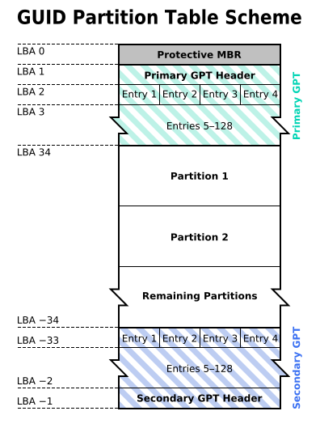

[TOC]

### Linux基础

#### 磁盘的文件名

Linux 中每个**硬件**都被当做**一个文件**，包括**磁盘**。**磁盘以磁盘接口类型进行命名**，常见磁盘的文件名如下：

- **IDE 磁盘：/dev/hd[a-d]**
- **SATA/SCSI/SAS 磁盘：/dev/sd[a-p]**

这里文件名后面的序号与**系统检测**到磁盘的顺序有关，而与磁盘所插入的插槽位置无关。

#### 分区表

**磁盘分区表**主要有两种格式，一种是限制较多的 **MBR 分区表**，一种是较新且限制较少的 **GPT 分区表**。

##### 1.MBR

MBR 中，**第一个扇区**最重要，里面有**主要开机记录**(Master boot record, MBR)及**分区表**(Partition table)，其中主要开机记录占 446 bytes，分区表占 64 bytes。

**分区表**只有 **64 bytes**，最多只能存储 **4 个分区**，这 4 个分区为**主分区和扩展分区**。其中**扩展分区只有一个**，它使用其它扇区来记录额外的分区表，因此通过扩展分区可以分出更多分区，这些分区称为**逻辑分区**。

Linux 也把分区当成**文件**，分区文件的命名方式为：磁盘文件名 + 编号，例如 /dev/sda1。注意：**逻辑分区**的编号**从 5 开始**。

##### 2.GPT

不同的**磁盘**有不同的**扇区**大小，例如 512 bytes 和最新磁盘的 4 k。GPT 为了**兼容所有磁盘**，在定义扇区上使用**逻辑区块地址**(LBA)，LBA 默认大小为 **512 bytes**。

GPT 第 1 个区块记录了**主要开机记录**(MBR)，紧接着是 **33 个区块记录分区信息**，并把最后的 33 个区块用于对**分区信息**进行备份。这 33 个区块第一个为 GPT 表头纪录，这个部份纪录了分区表本身的位置与大小和备份分区的位置，同时放置了分区表的校验码(CRC32)，操作系统可以根据这个校验码来判断 GPT 是否正确。若有错误，可以使用备份分区进行恢复。

GPT **没有扩展分区**概念，都是**主分区**，每个 LBA 可以分 **4 个分区**，因此总共可以分 4 * 32 = **128 个分区**。

**MBR** 不支持 **2.2 TB 以上**的硬盘，GPT 则最多支持到 **233 TB = 8 ZB**。

#### 开机检测程序

##### 1.BIOS

**BIOS**(Basic Input/Output System，基本输入输出系统)，它是一个**固件**(嵌入在硬件中的软件)，BIOS 程序存放在断电后内容不会丢失的**只读内存**中。

BIOS 是开机的时候计算机执行的**第一个程序**，这个程序知道可以开机的磁盘，并读取磁盘**第一个扇区的主要开机记录(MBR)**，由主要开机记录执行其中的开机管理程序，这个开机管理程序会加载**操作系统的内核文件**。

MBR 中的开机管理程序提供以下功能：**选单、载入核心文件以及转交其它开机管理程序**。转交这个功能可以用来实现**多重引导**，只需要将另一个操作系统的**开机管理程序**安装在其它分区的启动扇区上，在启动开机管理程序时，就可以选择启动当前的操作系统或转交给其它开机管理程序从而启动另一个操作系统。

安装**多重引导**，最好先安装 Windows 再安装 Linux。因为安装 Windows 时会**覆盖掉主要开机记录(MBR)**，而 Linux 可以选择将开机管理程序安装在主要开机记录或者其它分区的启动扇区，并且可以设置开机管理程序的选单。

##### 2.UEFI

BIOS **不可以读取 GPT 分区表**，而 **UEFI 可以**。

#### 其他

##### 1.包管理工具

**RPM** 和 **DPKG** 为最常见的两类软件包管理工具。

**YUM 基于 RPM**，具有依赖管理和软件升级功能。

##### 2.发行版

Linux 发行版是 Linux 内核及各种应用软件的集成版本。

| 基于的包管理工具 | 商业发行版  |     社区发行版      |
| :--------------: | :---------: | :-----------------: |
|     **RPM**      | **Red Hat** | **Fedora / CentOS** |
|     **DPKG**     | **Ubuntu**  |     **Debian**      |

