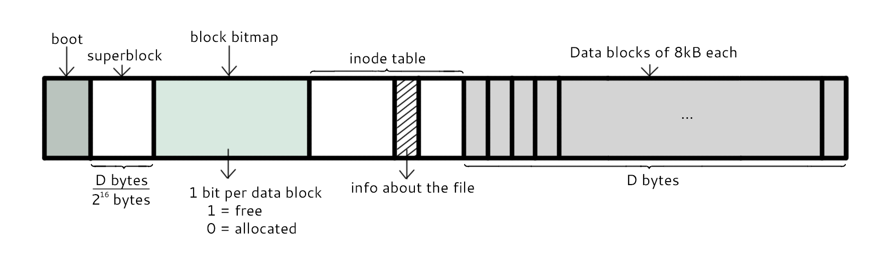
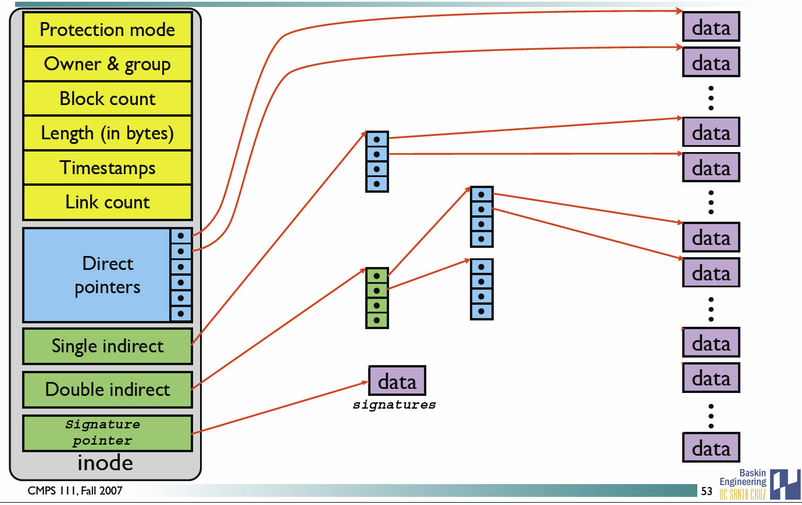

[TOC]

### Linux文件系统与文件

Linux 中**所有被操作系统管理的资源**, 如网络接口卡, 磁盘驱动器, 输入输出设备等硬件设备, 普通文件或目录**都被看作文件**. Linux 中硬件也被当成一个文件, 通常称为设备文件, 这样就可以通过**读写文件的方式实现对硬件的访问**. 

#### 文件系统

##### 1.分区与文件系统

对分区进行**格式化**是为了在**分区上建立文件系统**. 一个分区通常只能格式化为一个文件系统, 但是磁盘阵列等技术可以将一个分区格式化为**多个**文件系统. 

##### 2.组成

**文件系统**最主要的几个组成部分如下: 

- **==inode==**: 一个**文件**占用一个 **inode**, 记录文件的**属性**, 同时记录此文件的**实际内容所在的 block 编号**; 
- **==block==**: 实际记录文件的**内容**, 文件太大时, 会占用**多个 block**; 

- **==superblock==**: 记录文件系统的**整体信息**, 包括 inode 和 block 的总量, 使用量, 剩余量, 以及文件系统的格式与相关信息等; 
- **==block bitmap==**: 记录 block **是否被使用的位域**. 

下面的图甚妙. 



###### (1)block

在 **Ext2 文件系统**中所支持的 **block** 大小有 **1K, 2K 及 4K** 三种, 不同的大小限制了**单个文件和文件系统**的最大大小. 

|     大小     | 1KB  |  2KB  | 4KB  |
| :----------: | :--: | :---: | :--: |
| 最大单一文件 | 16GB | 256GB | 2TB  |
| 最大文件系统 | 2TB  |  8TB  | 16TB |

一个 block 只能被**一个文件**所使用, 未使用的部分则浪费了. 因此如果需要存储大量小文件, 最好选用比较小的 block. 

文件存储在硬盘上, 硬盘的最小存储单位是**扇区**, 每个扇区存储 512 字节. 操作系统读取硬盘数据时, 不会一个扇区一个扇区的读取, 这样效率较低, 而是**一次读取多个扇区, 即一次读取一个块(block). 块由多个扇区组成, 是文件读取的最小单位, 块最常见大小是 4Kb, 约为 8 个连续的扇区组成**. 

###### (2)inode

除数据存储外, 还需要一个空间来存储文件的**元信息 metadata**, 如文件拥有者, 创建时间, 权限, 大小等. 这种**存储文件元信息的区域就叫 inode. 每个文件都有一个 inode**. 

**使用 stat 命令可以查看文件的 inode 信息. 每个 inode 都有一个号码, Linux 中使用 inode 号码区分不同的文件. **

inode 具体包含以下信息(文件的**属性**): 

- **权限**(read/write/excute)
- 拥有者与群组(owner/group) 
- **容量**
- 建立或状态改变的时间(ctime)
- 最近一次的读取时间(atime)
- 最近修改的时间(mtime)
- 该文件真正内容的**指向**(pointer).

inode 中记录了**文件内容所在的 block 编号**, 但是每个 block 非常小, 一个大文件**随便都需要几十万的 block**. 而一个 inode 大小有限, 无法直接引用这么多 block 编号. 因此引入了**间接, 双间接, 三间接引用**. 间接引用是指让 inode 记录的引用 **block 块记录引用信息**. 



##### 3.文件读取

对于 ==**Ext2**== 文件系统, 当要读取一个文件的内容时, 先在 **inode** 中去查找文件内容所在的**所有 block**, 然后把所有 block 的内容读出来. 


而对于 ==**FAT**== 文件系统, 它**没有 inode**, **每个 block** 中存储着**下一个 block** 的编号, 链式存储 block 编号. 


#### 目录

##### 1.概述

建立一个**目录**时, 会分配一个 **inode** 与**至少一个 block**. **block 记录**的内容是目录下所有**文件的 inode 编号以及文件名**. 

可以看出**文件的 inode 本身不记录文件名**, **文件名**记录在**目录**中, 因此新增文件, 删除文件, 更改文件名这些操作与**目录的 w 权限**有关. 

##### 2.挂载

挂载利用**目录**作为**文件系统的进入点**, 也就是说进入**目录**之后就可以读取**文件系统**的数据. 

##### 3.目录结构

为了使不同 **Linux 发行版本**的目录结构保持一致性, FHS 标准规定了 Linux 目录结构. 最基础的三个目录如下: 

- **/**: root. 根目录. 
- **/usr**: unix software resource. 所有系统**默认软件**都会安装到这个目录. 
- **/var**: variable. 存放系统或程序运行过程中的**数据文件**. 


**常见目录说明: **

- **/bin: **存放**二进制可执行文件**(ls、cat、mkdir 等), 常用命令一般都在这里. 
- **/etc: **存放**系统管理和配置文件**. 
- **/home: **存放所有**用户文件**的根目录, 是用户主目录的基点, 比如用户 user 的主目录就是 /home/user, 可以用 ~user 表示. 
- **/usr: **存放**系统应用程序**. 
- **/opt: **存放额外安装的可选应用程序包. 如可以把 Tomcat 安装到这里. 
- **/proc: **虚拟文件系统目录, 是系统内存的映射. 可直接访问这个目录来获取系统信息. 
- **/root: **root 用户的主目录. 
- **/sbin:** 存放二进制可执行文件, 只有 root 才能访问. 这里存放的是 root 用户使用的系统级别的管理命令和程序. 如 ifconfig 等. 
- **/dev: **存放设备文件. 
- **/mnt: **root 安装临时文件系统的安装点, 系统提供这个目录是让用户临时挂载其他的文件系统. 
- **/boot: **存放用于系统引导时使用的各种文件. 
- **/lib: **存放与系统运行相关的库文件 . 
- **/tmp: **存放各种临时文件, 是公用的临时文件存储点. 
- **/var: **存放运行时需要改变数据的文件, 也是某些大文件的溢出区, 比如日志文件等. 

#### 文件

##### 1.文件类型

Linux 中比较重要的文件类型有: 普通文件, 目录文件, 链接文件, 设备文件, 管道文件, Socket 套接字文件等. 

###### (1)普通文件

普通文件指 txt, html, pdf 等应用层面的文件类型, 用户可以根据访问权限对其进行访问, 修改和删除. 

###### (2)目录文件

**目录**也是一种**文件**, 打开目录实际上是打开**目录文件**. 目录文件包含了它目录下的所有文件名以及指向这些文件的指针. 

######  (3)链接文件

**链接文件**分为符号链接(软链接)文件和硬链接文件. 后面**详解**. 

- 符号链接(软链接)(Symbolic Link)
- 硬链接(Hard Link)

######  (4)设备文件

设备文件分为**块设备**文件和**字符设**备文件, 设备文件一般存于 **/dev** 目录下. **字符设备与块设备最根本的区别就是它们是否可以被随机访问. **

- **字符设备文件**: 字符设备是依照先后顺序被存取数据的设备, 通常不支持随机存取, 此类设备可以按字节/字符来读取数据,  如键盘, 串口等等. 
- **块设备文件**: 块设备是可以被随机存取数据的设备, 应用程序可以访问块设备上任何一块位置. 块设备以块的方式读取数据,如硬盘, 软盘, 光碟等. 

######  (5)管道文件

管道文件一般用于**进程间通信**, 使用 **mkfifo** 命令可以创建一个管道文件. 

######  (6)Socket套接字文件

套接字文件用于**网络进程**间的通信, 可以用于两台不同机器间通信, 也可以用于本机的 Socket 网络程序. 

##### 2.链接

详解一下链接文件, 分为**软(符号)链接和硬(实体)链接**. 

```shell
$ ln [-sf] source_filename dist_filename
-s : 默认是实体链接(hard link), 加 -s 为符号链接(symbolic link)
-f : 如果目标文件存在时, 先删除目标文件
```

两者关系图如下: 


###### (1)实体链接(硬链接)

在目录下创建一个**条目**, 记录着文件名与 inode 编号, 这个 inode 就是**源文件的 inode**. **删除任意一个**条目, 文件还是**存在**, 只要**引用数量不为 0**. 

**硬链接的文件拥有相同的 inode**, 因为操作系统**靠 inode 来区分文件**, 2 个 inode 相同的文件, 就代表它们**是一个文件**. 删除一个文件并不会对其他拥有相同 inode 的文件产生影响, 只有当 inode 相同的**所有文件被删除**了, 也就是把硬链接和源文件都删除, 这个文件才会被删除. 

硬链接的限制: **不能跨越文件系统, 不能对目录进行链接**. 

```bash
$ ln /etc/crontab .
$ ll -i /etc/crontab crontab
34474855 -rw-r--r--. 2 root root 451 Jun 10 2014 crontab
34474855 -rw-r--r--. 2 root root 451 Jun 10 2014 /etc/crontab
# 这里这两个文件其实指向的是同一个文件, 只有都删掉才能完全删除文件
```

###### (2)符号链接(软链接)

符号链接文件保存着**源文件所在的绝对路径**, 在读取时会定位到**源文件**上, 可以理解为 **Windows 的快捷方式. **

当符号链接被删除时, **并不会影响**源文件. 而当**源文件**被删除了, 链接文件就**打不开**了. 

因为记录的是**路径**, 所以可以为**==目录==建立链接**. 

##### 3.文件属性

用户分为三种: **文件拥有者, 群组, 其它人**. 不同用户有不同的文件权限. 

使用 **ll** 查看一个文件时, 会显示文件信息, 如: 

```shell
drwxr-xr-x 3 root root 17 May 6 00:14 hello.txt
```

解释: 

- **drwxr-xr-x**: 文件**类型以及权限**, 第 1 位为文件**类型字段**, 后 9 位为文件**权限字段**. 
- 3: **链接数**. 
- root: 文件**拥有者**. 
- root: 所属**群组**. 
- 17: 文件大小. 
- May 6 00:14: 文件最后被修改的时间. 
- hello.txt: 文件名. 

常见文件类型及其含义: 

- **d**: **目录**
- **-**: **文件**
- **l**: **链接文件**

##### 4.文件权限

Linux 中的每个用户必须属于一个组, 不能独立于组外. 每个文件有所有者, 所在组, 其它组的概念. 

文件信息中 9 位的文件权限字段中, 每 3 个为一组, 共 3 组, 每一组分别代表对**文件拥有者, 所属群组, 其它人**的文件权限. 一组权限中的 3 位分别为 **r, w, x** 权限, 分别表示**可读, 可写, 可执行**. 

**文件权限**可以用一组数字来表示, 此时一组权限的 3 个位当做二进制数字的位, 从左到右每个位的权值为 4, 2, 1, 即每个权限对应的**数字权值为 ==r = 4, w = 2, x = 1==**. 

###### (1)修改权限

使用 **chmod 指令**修改权限. 

```bash
$ chmod [-R] xyz dirname/filename
```

示例: 将 .bashrc 文件的权限修改为 **-rwxr-xr--. **这里就是用**数字**代表权限. 

```bash
$ chmod 754 .bashrc
```

也可以使用**符号**来设定权限. 

```bash
$ chmod [ugoa] [+-=] [rwx] dirname/filename
- u: 拥有者
- g: 所属群组
- o: 其他人
- a: 所有人
- +: 添加权限
- -: 移除权限
- =: 设定权限
```

示例: 为 .bashrc 文件的所有用户**添加**写权限. 

```bash
$ chmod a+w .bashrc
```

**对于文件: **

|  权限名称   |              操作              |
| :---------: | :----------------------------: |
|  **r**(读)  |    可以使用**查看文件内容**    |
|  **w**(写)  |      可以**修改文件内容**      |
| **x**(执行) | 可以将其作为二进制文件**运行** |

root 可以无视普通用户的权限, 即使文件目录权限是 000, **依旧可以访问**. 

###### (2)目录权限

**文件名不是存储在一个文件的内容中, 而是存储在一个文件所在的目录中**. 因此, 拥有文件的 **w 权限并不能对文件名进行修改**. 文件名是存放在**目录的 block 中**的, 所以要新增, 删除, 修改文件名需要**目录的 w 权限**. 

对**文件和目录**而言, 读写权限表示**不同的意义**. ==目录存储文件列表, 一个目录的权限也就是对其**文件列表**的权限==. 

- **r 权限**表示可以**读取**目录的文件列表. 

- **w 权限**表示可以**修改**目录的文件列表, 即可添加, 删除文件, 对文件名**进行修改**等. 

- **x 权限**表示可以使用 cd 进入目录, x **权限是 r 和 w 权限**的**基础**, 如果这个目录都不能进, 也就没办法读取文件列表以及对文件列表进行修改了. 

###### (3)文件默认权限

- **文件**默认权限: 文件**默认没有可执行权限**, 因此为 **666**, 也就是 ==**-rw-rw-rw-**==. 
- **目录**默认权限: 目录必须要能够**进入**, 也就是必须拥有**可执行权限**, 因此为 **777**, 也就是 ==**drwxrwxrwx**==. 

#### 文件与目录常见指令

##### 1.基本操作

###### (1)ls

列出文件或者目录的信息, 目录的信息就是其中包含的文件. 

```shell
$ ls [-aAdfFhilnrRSt] file|dir
-a : 列出全部文件
-d : 仅列出目录本身
-l : 以长数据串行列出, 包含文件属性与权限等数据
```

###### (2)cd

更换当前目录. 

```shell
$ cd [相对路径或绝对路径]
$ cd # 进入/home目录
```

###### (3)mkdir

**创建**目录. 

```shell
$ mkdir [-mp] 目录名称
-m : 配置目录权限
-p : 递归创建目录
```

###### (4)rmdir

**删除**目录, 目录**必须为空**. 

```bash
$ rmdir [-p] 目录名称
-p : 递归删除目录
```

###### (5)touch

更新**文件时间**或者**建立新文件**. 

```bash
$ touch [-acdmt] filename
-a :  更新 atime
-c :  更新 ctime, 若该文件不存在则不建立新文件
-m :  更新 mtime
-d :  后面可以接更新日期而不使用当前日期, 也可以使用 --date="日期或时间"
-t :  后面可以接更新时间而不使用当前时间, 格式为[YYYYMMDDhhmm]
```

###### (6)cp

**复制文件**. 如果源文件有**两个**以上, 则**目的文件**一定要是**目录**才行. 

**-r** 代表**递归拷贝**. 

###### (7)rm

**删除**文件. 

```bash
$ rm [-fir] 文件或目录
-r : 递归删除
```

递归删除: 

```bash
$ rm -rf folder
```

###### (8)mv

**移动**文件. 

```bash
$ mv [-fiu] source destination
$ mv [options] source1 source2 source3 .... directory
-f :  force 强制移动, 如果目标文件已经存在, 不会询问而直接覆盖
```

##### 2.获取文件内容

###### (1)cat

获取文件内容. 

```bash
$ cat [-AbEnTv] filename
```

###### (2)tac

是 cat 的**反向操作**, 从**最后一行**开始打印. 

###### (3)more

和 cat 不同的是它可以**一页一页**查看文件内容, 比较适合查看**大文件**. 

###### (4)less

和 more 类似, 但多了一个**向前翻页**的功能. 

###### (5)head

取得文件**前几行**. 

```bash
$ head [-n number] filename
-n : 后面接数字, 表示显示几行
```

###### (6)tail

head 的反向操作, 只是取得是**后几行**. 

##### 3.指令与文件搜索

###### (1)which

**指令搜索**. 

```bash
$ which [-a] command
-a : 将所有指令列出, 而不是只列第一个
```

###### (2)whereis

**文件搜索**. 速度比较快, 因为它只搜索**几个特定的目录**. 

```bash
$ whereis [-bmsu] dirname/filename
```

###### (3)locate

**文件搜索**. 可以用关键字或正则表达式进行搜索. 

locate 使用 "/var/lib/mlocate/" 这个数据库来进行搜索, 它存储在内存中, 并且每天**更新一次**, 所以无法用 locate 搜索新建的文件. 可以使用 updatedb 来立即更新数据库. 

```bash
$ locate [-ir] keyword
-r: 正则表达式
```

###### (4)find

**文件搜索**. 可以使用文件的属性和权限进行搜索. 

```bash
$ find [basedir] [option]
example: find . -name "shadow*"
```


