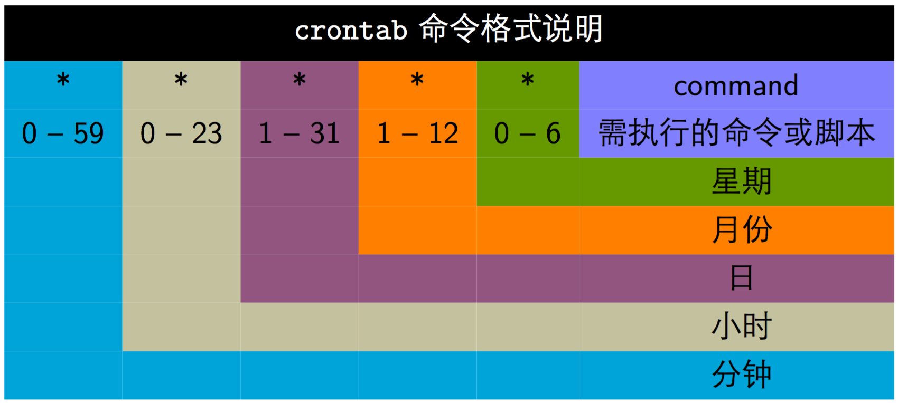

[TOC]

### Linux系统管理

#### Linux启动

##### 1.Linux启动流程分析

大体过程如下. 

- 1.主机加电**自检**, **加载 BIOS 硬件信息**. 
- 2.读取 **MBR** 的**引导文件**(GRUB, LILO). 
- 3.**引导加载 Linux 内核**. 
- 4.运行**第一个进程 init**(进程号永远**为 1**). 
- 5.进入相应的**运行级别**. 
- 6.运行终端, 输入用户名和密码. 

###### (1)内核引导

当计算机打开电源后, 首先是 **BIOS 开机自检**, 按照 BIOS 中设置的启动设备(通常是硬盘)来启动. 自检完成后从 **MBR(主引导记录)** 中读取 **BootLoader**(启动引导程序), Linux 中最常见的 BootLoader 就是 **GRUB**. 

之后 BootLoader 会**加载操作系统内核**. 操作系统接管硬件以后, 首先**读入 /boot 目录下的内核文件**. 

###### (2)运行init

内核加载完毕, 会完成**硬件检测和驱动程序加载**. 完成之后则会运行**第一个进程**, 就是 **/sbin/init** 进程. **init 进程**是系统所有进程的**起点**, 可以把它看成系统所有进程的老祖宗, 没有这个进程系统中任何进程都不会启动. init 进程的进程号永远**为 1**. 

init 进程首先需要**读取配置文件 /etc/inittab**. 配置文件就各种调用进行设置. 

###### (3)系统初始化

许多程序需要**开机启动**. 它们在 Windows 叫做 "**服务**"(service), 在 Linux 叫做 "**守护进程**"(daemon). init 进程的一大任务, 就是去运行这些**开机启动的进程**. 

Linux 允许为**不同的场合**, 分配不同的开机启动程序, 这叫做 "**运行级别**"(runlevel). 也就是说启动时会根据 "运行级别" 确定要运行哪些程序. 比如 Apache 用作服务器时需要启动, 用作桌面就不需要. 

Linux 有 7 个运行级别(runlevel): 

- 运行级别 0: 系统停机状态, 系统默认运行级别不能设为 0, 否则不能正常启动. 
- 运行级别 1: 单用户工作状态, root 权限, 用于系统维护, 禁止远程登陆. 
- 运行级别 2: 多用户状态(没有 NFS). 
- 运行级别 3: 完全的多用户状态(有 NFS), 登陆后进入控制台命令行模式. 
- 运行级别 4: 系统未使用, 保留. 
- 运行级别 5: X11 控制台, 登陆后进入图形 GUI 模式. 
- 运行级别 6: 系统正常关闭并重启, 默认运行级别不能设为 6, 否则不能正常启动. 

在 **init 的配置文件**中有这么一行: 

```bash
si::sysinit:/etc/rc.d/rc.sysinit
```

也就是调用执行了: 

```bash
/etc/rc.d/rc.sysinit
```

而 **rc.sysinit** 是一个 Shell 脚本, 它主要是**完成一些系统初始化**的工作, rc.sysinit 是每一个运行级别都要首先运行的重要脚本. 它主要完成的工作有: 激活交换分区, 检查磁盘, 加载硬件模块以及其它一些需要优先执行任务. 

```bash
l5:5:wait:/etc/rc.d/rc 5
```

这一行表示以 **5 为**参数运行 **/etc/rc.d/rc**, /etc/rc.d/rc 也是一个 Shell 脚本, 它接受 5 作为参数, 去执行 /etc/rc.d/rc5.d/ 目录下的**所有的 rc 启动脚本**, /etc/rc.d/rc5.d/ 目录中的这些启动脚本实际上都是一些**连接文件**, 而不是真正的 rc 启动脚本, 真正的 rc 启动脚本都放在 **/etc/rc.d/init.d/** 目录下. 

这些 rc 启动脚本有类似的用法, 它们一般能接受 start, stop, restart, status 等参数. /etc/rc.d/rc5.d/ 中的 rc 启动脚本通常是 K 或 S 开头的连接文件, 对于以 S 开头的启动脚本, 将以 start 参数来运行. 如果发现存在相应的脚本也存在 K 打头的连接, 而且已经处于运行态了(以 /var/lock/subsys/ 下的文件作为标志), 则将首先以 stop 为参数停止这些已经启动了的守护进程, 然后再重新运行. 这样做可以保证当 **init** 改变运行级别时, 所有相关的**守护进程都将重启**. 

###### (4)建立终端

**rc** 执行完毕后, **返回 init**, 这时**基本系统环境已经设置好了**, 各种**守护进程也已经启动**了. 

init 接下来会打开 **6 个终端**, 以便用户登录系统. 在 inittab 中的以下 6 行即定义了 6 个终端: 

```java
1:2345:respawn:/sbin/mingetty tty1
2:2345:respawn:/sbin/mingetty tty2
3:2345:respawn:/sbin/mingetty tty3
4:2345:respawn:/sbin/mingetty tty4
5:2345:respawn:/sbin/mingetty tty5
6:2345:respawn:/sbin/mingetty tty6
```

##### 2.应用开机自启

比如开机自启 Zookeeper: 

1. 新建一个**脚本** zookeeper. 
2. 为新建的脚本 zookeeper 添加**可执行权限**, 命令是: **chmod +x zookeeper**. 
3. 把 zookeeper 这个**脚本添加到开机启动项里面**, 命令是: **chkconfig --add zookeeper**. 
4. 查看是否添加成功, 命令是: **chkconfig --list**. 

#### Linux进程管理

##### 1.查看进程

###### (1)ps

查看某个时间点的**进程信息**. 

示例一: 查看自己的进程. 

```sh
$ ps -l
```

示例二: 查看系统所有进程. 

```sh
$ ps -aux
USER        PID %CPU %MEM    VSZ   RSS TTY      STAT START   TIME COMMAND
root          1  0.0  0.0 128116  6664 ?        Ss   May14   0:08 /usr/lib/systemd/systemd --system --deserialize 18
root          2  0.0  0.0      0     0 ?        S    May14   0:00 [kthreadd]
root          3  0.0  0.0      0     0 ?        S    May14   0:00 [ksoftirqd/0]
root          5  0.0  0.0      0     0 ?        S<   May14   0:00 [kworker/0:0H]
```

示例三: 查看**特定的进程**. 

```sh
$ ps aux | grep threadx
```

###### (2)pstree

查看**进程树**. 

示例: 查看所有进程树. 

```sh
$ pstree -A
```

###### (3)top

**实时显示进程信息**. 包含任务队列信息, 进程信息, CPU 信息, 物理内存信息, 交换分区信息. 

示例: 两秒钟刷新一次. 

```sh
$ top -d 2
```

```bash
Processes: 531 total, 3 running, 528 sleeping, 2254 threads                                                                                                   13:26:22
Load Avg: 2.66, 3.60, 3.48  CPU usage: 17.82% user, 16.0% sys, 66.17% idle   SharedLibs: 399M resident, 56M data, 36M linkedit.
MemRegions: 123487 total, 4181M resident, 144M private, 1998M shared. PhysMem: 16G used (3162M wired), 46M unused.
VM: 3014G vsize, 2322M framework vsize, 10590990(0) swapins, 11359485(0) swapouts. Networks: packets: 21519133/22G in, 21111404/2720M out.
Disks: 7925742/143G read, 3476658/119G written.

PID    COMMAND      %CPU TIME     #TH   #WQ  #PORTS MEM    PURG   CMPRS  PGRP  PPID  STATE    BOOSTS            %CPU_ME %CPU_OTHRS UID  FAULTS    COW      MSGSENT
68     systemstats  89.8 28:52.71 5/1   4/1  123    44M+   0B     912K   68    1     running   0[792]           0.00000 89.23502   0    5002814+  244      5036495
18492  iTerm2       45.7 18:36.21 11    8    355-   185M-  4304K  18M-   18492 1     sleeping *0-[33517]        1.22936 4.74174    501  3302066+  2960     25707232+
128    WindowServer 44.8 14:07:52 15    4    5775   1190M- 95M    121M   128   1     sleeping *0[1]             10.9656 1.16883    88   93223377+ 1061248  1452812849+
0      kernel_task  20.7 05:13:17 281/8 0    0      195M-  0B     0B     0     0     running   0[0]             0.00000 0.00000    0    10119630+ 6270     1391351755+
480    Magnet       15.8 09:32.33 3     1    815    51M    0B     8632K  480   1     sleeping *44[2373]         0.00000 0.00000    501  1401788+  956      15699395+
17554  WeChat       11.2 68:24.85 45    16   1583-  311M   2280K  111M   17554 1     sleeping *6-[5]            0.00000 4.75936    501  25378254+ 5492     158111613+
```

指定查看某个进程. 

```sh
$ top -p 14253
```

###### (4)netstat

查看**占用端口的进程**. 

示例: 查看特定端口的进程, 比如查看 MySQL 开没有. 

```sh
$ netstat -anp | grep 3306
```

##### 2.关闭进程

###### (1)kill

关掉进程. 

```bash
$ kill [信号] PID
```

进程信息常用 1, 9, 15. 只能识别**进程号**. 

###### (2)killall

关掉进程. 使用**进程名**杀死进程. 

##### 3.进程优先级

表示进程优先级的参数有 **Priority 和 Nice**. 

```bash
$ ps -el
F S   UID    PID   PPID  C PRI  NI ADDR SZ WCHAN  TTY          TIME CMD
4 S     0      1      0  0  80   0 - 32029 ep_pol ?        00:00:08 systemd
1 S     0      2      0  0  80   0 -     0 kthrea ?        00:00:00 kthreadd
1 S     0      3      2  0  80   0 -     0 smpboo ?        00:00:00 ksoftirqd/0
1 S     0      5      2  0  60 -20 -     0 worker ?        00:00:00 kworker/0:0H
```

这里 **PRI** 和 **NI** 就是这两个参数. **数值越小优先级越高**, PRI 是内核动态调整的, 普通用户只能调整 NI 值, 且只能增大. 仅 root 用户可以将 NI 值设为**负值**. 

nice 命令可以给新执行的命令直接赋予 NI 值, 但是不能修改已经存在进程的 NI 值. 

关闭 Apache 服务并重启设置优先级为 5. 

```bash
$ service http stop
$ nice -n -5 service httpd start
```

**renice** 命令可以给已经存在的进程设置优先级. 

```bash
$ renice -10 12345
```

##### 4.父进程与子进程

###### (1)SIGCHLD

当一个**子进程**改变了它的状态时(停止运行, 继续运行或者退出), 有两件事会发生在**父进程**中: 

- 得到 **SIGCHLD** 信号. 
- **waitpid()** 或者 **wait()** 调用会**返回**. 

其中**子进程发送的 SIGCHLD 信号**包含了子进程的信息, 比如进程 ID, 进程状态, 进程使用 CPU 的时间等. 

在子进程退出时, 它的**进程描述符不会立即释放**, 这是为了让父进程得到子进程信息, 父进程通过 **wait() 和 waitpid()** 来获得一个**已经退出**的子进程的**信息**. 

###### (2)wait()

```c
pid_t wait(int *status)
```

父进程调用 **wait() 会一直阻塞**, 直到收到一个子进程**退出的 SIGCHLD 信号**, 之后 **wait()** 函数会**销毁子进程**并返回. 

如果成功, 返回被收集的子进程的**进程 ID**; 如果调用进程没有子进程, 调用就会失败, 此时**返回 -1**, 同时 errno 被置为 ECHILD. 

参数 status 用来保存被收集的**子进程退出时的一些状态**, 如果对这个子进程是如何死掉的毫不在意, 只想把这个子进程消灭掉, 可以设置这个参数为 NULL. 

###### (3)waitpid()

```c
pid_t waitpid(pid_t pid, int *status, int options)
```

作用和 wait() 完全相同, 但是多了两个**可由用户控制的参数 pid 和 options**. 

pid 参数指示一个**子进程的 ID**, 表示只关心这个子进程退出的 SIGCHLD 信号. 如果 **pid=-1** 时, 那么和 wait() 作用相同, 都是关心所有子进程退出的 SIGCHLD 信号. 

options 参数主要有 WNOHANG 和 WUNTRACED 两个选项, WNOHANG 可以使 waitpid() 调用变成非阻塞的, 也就是说它会立即返回, 父进程可以继续执行其它任务. 

###### (4)孤儿进程

一个**父进程**退出, 而它的一个或多个子进程还在运行, 那么这些**子进程将成为孤儿进程**. 孤儿进程将被 **init 进程**(进程号为 1) 所**收养**, 并由 **init 进程对它们完成状态收集工作**. 由于**孤儿进程会被 init 进程收养**, 所以孤儿进程不会对系统造成危害. 

###### (5)僵尸进程

一个**子进程**的进程描述符在**子进程退出时不会释放**, 只有当**父进程通过 wait() 或 waitpid() 获取了子进程信息后才会释放**. 如果子进程**退出**, 而父进程并**没有调用 wait() 或 waitpid()**, 那么子进程的**进程描述符**仍然保存在系统中, 这种进程称之为**僵尸进程**. 

僵尸进程通过 **ps 命令**显示出来的状态为 **Z(zombie)**. 由于系统所能使用的**进程号**是有限的, 如果产生大量僵尸进程, 将因为没有可用的进程号而导致系统不能产生新的进程. 

要**消灭**系统中大量的僵尸进程, 只需要将其**父进程**杀死, 此时僵尸进程就会变成**孤儿进程**, 从而被 **init 进程所收养**, 这样 init 进程就会释放所有的僵尸进程所占有的资源, 从而结束僵尸进程. 

#### Linux系统资源管理

##### 1.资源查看

###### (1)vmstat命令

用于**监控系统资源**, 可以监控 **CPU 使用, 进程状态, 内存使用**等信息. 

```bash
$ vmstat
procs -----------memory---------- ---swap-- -----io---- -system-- ------cpu-----
 r  b   swpd   free   buff  cache   si   so    bi    bo   in   cs us sy id wa st
 1  0      0 4216980   4172 1987016    0    0     0     1    2    4  0  0 100  0  0
```

###### (2)free命令

查看**内存使用**状态. free 命令是一个快速查看**内存使用情况**的方法, 它是对 **/proc/meminfo** 所收集信息的一个概述. 它可以显示系统**当前内存的使用情况, 包括已用内存, 可用内存和交换内存的情况**. 

free 默认以**字节**为单位输出内存使用量. 

```bash
$ free
              total        used        free      shared  buff/cache   available
Mem:        7990076     1781780     4217136      192428     1991160     5730212
Swap:       2519036           0     2519036
```

修改输出单位需要加参数, **-g** 为 GB, **-m** 为 MB, **-k** 为 KB, **-b** 为字节. 

```shell
$ free -g
             total       used       free     shared    buffers     cached
Mem:             3          1          1          0          0          0
-/+ buffers/cache:          0          2
Swap:            3          0          3
```

使用 **-t** 参数查看所有**内存汇总**, 使用这个选项会在输出中加一个汇总行. 

```shell
$ free -t
              total        used        free      shared  buff/cache   available
Mem:        7990076     1782028     4216824      192428     1991224     5729960
Swap:       2519036           0     2519036
Total:     10509112     1782028     6735860
```

###### (3)查看CPU信息

**CPU** 主要信息保存在 **/proc/cpuinfo** 这个文件中. 查看就行. 

```bash
$ cat /proc/cpuinfo 
processor	: 0
vendor_id	: GenuineIntel
cpu family	: 6
model		: 85
model name	: Intel(R) Xeon(R) Gold 6136 CPU @ 3.00GHz
stepping	: 4
microcode	: 0x2000069
cpu MHz		: 2992.968
cache size	: 25344 KB
physical id	: 0
siblings	: 2
core id		: 0
cpu cores	: 2
apicid		: 0
initial apicid	: 0
fpu		: yes
fpu_exception	: yes
cpuid level	: 22
wp		: yes
flags		: fpu vme de pse tsc msr pae mce cx8 apic sep mtrr pge mca cmov pat pse36 clflush mmx fxsr sse sse2 ss ht syscall nx pdpe1gb rdtscp lm constant_tsc arch_perfmon nopl xtopology tsc_reliable nonstop_tsc eagerfpu pni pclmulqdq ssse3 fma cx16 pcid sse4_1 sse4_2 x2apic movbe popcnt tsc_deadline_timer aes xsave avx f16c rdrand hypervisor lahf_lm abm 3dnowprefetch invpcid_single ssbd ibrs ibpb stibp fsgsbase tsc_adjust bmi1 avx2 smep bmi2 invpcid rdseed adx smap xsaveopt arat md_clear spec_ctrl intel_stibp flush_l1d arch_capabilities
bogomips	: 5985.93
clflush size	: 64
cache_alignment	: 64
address sizes	: 42 bits physical, 48 bits virtual
power management:

processor	: 1
vendor_id	: GenuineIntel
cpu family	: 6
model		: 85
model name	: Intel(R) Xeon(R) Gold 6136 CPU @ 3.00GHz
stepping	: 4
microcode	: 0x2000069
cpu MHz		: 2992.968
cache size	: 25344 KB
physical id	: 0
siblings	: 2
core id		: 1
cpu cores	: 2
apicid		: 1
initial apicid	: 1
fpu		: yes
fpu_exception	: yes
cpuid level	: 22
wp		: yes
flags		: fpu vme de pse tsc msr pae mce cx8 apic sep mtrr pge mca cmov pat pse36 clflush mmx fxsr sse sse2 ss ht syscall nx pdpe1gb rdtscp lm constant_tsc arch_perfmon nopl xtopology tsc_reliable nonstop_tsc eagerfpu pni pclmulqdq ssse3 fma cx16 pcid sse4_1 sse4_2 x2apic movbe popcnt tsc_deadline_timer aes xsave avx f16c rdrand hypervisor lahf_lm abm 3dnowprefetch invpcid_single ssbd ibrs ibpb stibp fsgsbase tsc_adjust bmi1 avx2 smep bmi2 invpcid rdseed adx smap xsaveopt arat md_clear spec_ctrl intel_stibp flush_l1d arch_capabilities
bogomips	: 5985.93
clflush size	: 64
cache_alignment	: 64
address sizes	: 42 bits physical, 48 bits virtual
power management:
```

**top 命令**也可以看 CPU 状态信息. 

**dstat 命令**每秒 CPU 使用率情况获取, 一秒刷新一次. 

```bash
$ dstat
You did not select any stats, using -cdngy by default.
----total-cpu-usage---- -dsk/total- -net/total- ---paging-- ---system--
usr sys idl wai hiq siq| read  writ| recv  send|  in   out | int   csw 
  0   0 100   0   0   0| 195B 1626B|   0     0 |   0     0 | 310   457 
  0   0 100   0   0   0|   0     0 | 540B  842B|   0     0 | 312   472 
  0   1  99   0   0   0|   0     0 |2020B  362B|   0     0 | 330   465 
  1   0 100   0   0   0|   0     0 |2986B  822B|   0     0 | 346   529 
  1   1  99   0   0   0|   0     0 |1880B  362B|   0     0 | 401   594 
  0   1 100   0   0   0|   0     0 |1564B  362B|   0     0 | 323   446 
  1   0  99   0   0   0|   0     0 | 628B  362B|   0     0 | 305   438  
```

#### Linux网络管理

##### 1.基础命令

- 查看当前系统的**网卡**信息: **ifconfig**. 
- 查看与某台机器的连接情况: ping. 
- 查看当前系统的**端口**使用: **netstat -an**. 

##### 2.限制IP访问

Linux 下限制 IP 访问的方式有两种. 

**(1)hosts.allow和hosts.deny**

**使用 hosts.allow 和 hosts.deny 来设置 IP 白名单和黑名单, /etc/ 目录下**. 优先级为先检查 hosts.deny, 再检查 hosts.allow, 后者设定可越过前者限制. **冒号前面**是**服务进程名称**, 通常系统进程在 **/etc/inetd.conf** 中指定, 比如 in.ftpd, in.telnetd, in.sshd. 

**(2)iptables命令**

iptables 是**防火墙**相关的命令, 可以用来**限制 IP 登录**. 

#### Linux定时任务crontab

crontab 命令用于**设置周期性被执行的指令**. crontab 命令存放于 **crontab 文件**中, 以供之后读取和执行. 通常 crontab 储存的指令被**守护进程激活**, crond 常常在**后台运行**. 这类作业一般称为 cron jobs. 

##### 1.crontab文件


crontab 文件包含送交 cron 守护进程的一**系列作业和指令**. 每个用户可以拥有自己的 crontab 文件; 同时操作系统保存一个**针对整个系统的 crontab 文件**, 该文件通常存放于 **/etc** 或者 /etc 之下的子目录中.  

crontab 文件的**每一行**均遵守特定的格式, 由**空格或 tab 分隔为数个领域**, 每个领域可以放置单一或多个数值. **cron 服务**是 Linux 内置服务, 但**它不会开机自启动**, 可以用以下命令启动和停止服务: 

```sh
/sbin/service crond start
/sbin/service crond stop
/sbin/service crond restart
/sbin/service crond reload
```

要把 cron 设为开机自启动, 需要在 **/etc/rc.d/rc.local** 脚本中加入 **/sbin/service crond start**. 

```bash
$ crontab -l  # 查看当前用户的crontab
$ crontab -e  # 编辑crontab
$ crontab -r  # 删除crontab
```

##### 2.操作符号



在一个区域里填写**多个数值**的方法: 

- 逗号(,)分开的值, 如: "1, 3, 4, 7, 8". 
- 连词符(-)指定值的**范围**, 例如: "1-6". 
- 星号(*)代表**任何可能的值**. 如在小时域里的星号等于是"每一个小时". 
- 某些 cron 程序的扩展版本也支持斜线(/)操作符, 用于表示**跳过某些给定的数**. 例如, "/3" 在小时域中等于 "0, 3, 6, 9, 12, 15, 18, 21" 等被 3 整除的数. 

##### 3.时间设置

前 5 个域称之**分时日月周**, 方便记忆. 

```bash
# 文件格式说明
# --分钟(0 - 59)
# |  --小时(0 - 23)
# | |  --日(1 - 31)
# | | |  --月(1 - 12)
# | | | |  --星期(0 - 7)
# | | | | |
# * * * * * 被执行的命令
```

从**第六个域起**, 指明要执行的命令. 

##### 4.例子

```shell
* * * * * command			# 每 1 分钟执行一次 command.
3,15 * * * * command		# 每小时的第 3 和第 15 分钟执行.
3,15 8-11 * * * command		# 在上午 8 点到 11 点的第 3 和第 15 分钟执行.
3,15 8-11 */2 * * command	# 每隔两天的上午 8 点到 11 点的第 3 和第 15 分钟执行.
```


#### 参考资料

- https://blog.csdn.net/sinat_24928447/article/details/78042290


