[TOC]

### 进程管理

#### 进程与线程

##### 1.进程

进程是**资源分配**的基本单位. 下图显示了 4 个程序创建了 4 个进程, 它们可以并发地执行. 

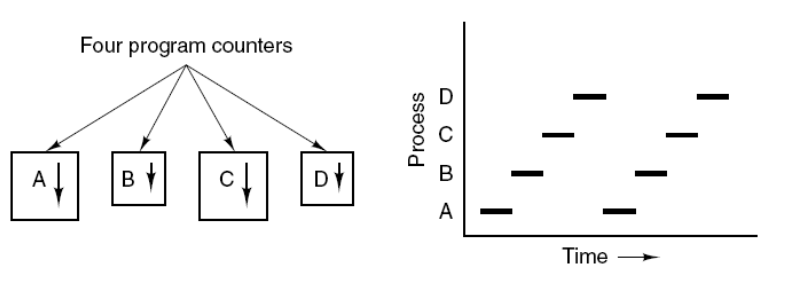

##### 2.线程

线程是==**独立调度**==的基本单位. 一个进程中可以有多个线程, 它们**共享**进程资源. 如 QQ 和浏览器是两个进程, 浏览器进程里面有很多线程, 例如 HTTP 请求线程, 事件响应线程, 渲染线程等等, 线程的并发执行使得在浏览器中点击一个新链接从而发起 HTTP 请求时, 浏览器还可以响应用户的其它事件. 

线程可以分为**用户级线程和内核线程**. 

##### 3.进程与线程区别

###### (1)资源与调度

**进程是==资源分配==的基本单位**, 但是线程**不拥有**资源, 线程可以访问隶属进程的资源. 

**线程是==独立调度==的基本单位**, 在**同一进程**中, 线程的切换**不会引起进程切换**, 从一个进程中的线程切换到另一个进程中的线程时, 会引起进程切换. 

**进程有自己独立的地址空间**, 每启动一个进程, 系统都会为其分配地址空间, 建立数据表来维护代码段, 堆栈段和数据段; **线程没有独立的地址空间**, 它使用相同的地址空间共享数据. 

###### (2)系统开销

**进程在创建, 撤销, 切换时的开销远大于线程. **

由于创建或撤销进程时, 系统都要为之分配或回收资源, 如内存空间, I/O 等, 其开销**远大于**创建或撤销线程时的开销. 类似地, 在进行进程切换时, 涉及当前执行进程 CPU 环境的保存及新调度进程 CPU 环境的设置, 而**线程切换**时只需保存和设置少量**寄存器**内容, **开销很小**. 

###### (3)通信方面

线程间可以通过**直接读写同一进程**中的**数据**进行通信, 但是**进程通信需要通过一定的 IPC**(Inter-Process Communication, 进程间通信)方法. 

###### (4)其他

每个**线程**都有一个**程序计数器**(记录要执行的下一条指令), 一组寄存器(保存当前线程的工作变量), 堆栈(记录执行历史). 

##### 4.协程

协程(Coroutines) **比线程更加轻量**, 正如一个进程可以拥有多个线程一样, 一个线程可以拥有多个协程. 协程不是进程也不是线程, 而是一个特殊的函数, 这个函数可以在某个地方**挂起**, 并且可以重新在挂起处外继续运行. 协程与进程、线程相比并不是一个维度的概念. 

协程不是被操作系统内核所管理的, 而是**完全由程序控制**, 也就是在**用户态**执行. 这样带来的好处是**性能大幅度的提升**, 因为不会像线程切换那样消耗资源. 

**协程上下文切换**: 协程的切换者是用户(应用程序), 切换时机由应用程序来决定. 协程的切换内容是硬件上下文, 切换内存保存在用户自己的变量(用户栈或堆)中. 协程的切换过程**只有用户态**, 即没有陷入内核态, 因此切换效率高. 

##### 5.Linux中的进程与线程

Linux 中线程和进程**基本没有区别**, 因为 Linux 内核并没有把线程和进程区别对待. 

系统调用 **fork()** 可以新建一个**子进程**, 函数 **pthread()** 可以**新建一个线程**. 但无论线程还是进程, 都是用 **task_struct 数据结构**表示, **唯一的区别就是共享的数据区域不同**. 线程看起来跟进程没有区别, 只是**线程的某些数据区域和其父进程是共享的, 而子进程是拷贝副本, 而不是共享**. 比如说 **mm 结构和 files 结构**在线程中都是**共享**的. 

**进程与子进程**: 

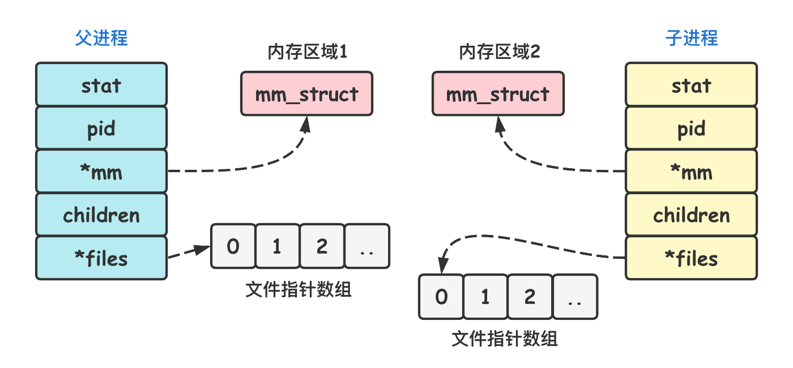

**进程与子线程**: 

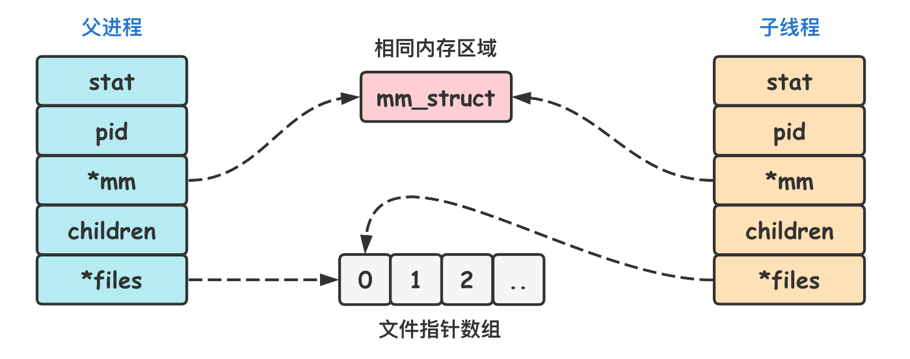

由于共享数据的存在, 所以**多线程**程序要利用**锁**机制, 避免多个线程同时往**同一区域写入数据**, 否则可能造成数据不一致. 

**注意**: 只有 Linux 系统将线程看做共享数据的进程, 不对其做特殊看待, 其他的很多操作系统是对线程和进程区别对待的, 线程有其特有的数据结构. 

对于新建进程时**内存区域拷贝**的问题, Linux 采用了 **copy-on-write 的策略优化**, 也就是并不真正复制父进程的内存空间, 而是等到**需要写操作时才去复制**. **所以 Linux 中新建进程和新建线程都是很迅速的**. 

#### 进程基础

编译好的**可执行文件**只是一个**文件**而不是进程, **可执行文件必须要载入内存**, 包装成一个进程才能真正跑起来. 

当一个**可执行文件被加载到内存时**, 这个程序就成为进程. 进程包含内容: **程序代码**(文本段), **程序计数器**, 进程堆栈(临时数据如函数参数, 返回参数与局部变量等), **数据段**(全局变量等), 还可能包含**堆**. 

##### 1.进程控制块(进程描述符)

###### (1)概述

**进程需要依靠操作系统创建, 每个进程都有它的固有属性, 如进程号(PID), 进程状态, 打开的文件等等.** 

**操作系统使用进程控制块表示每个进程**. **进程控制块(也叫进程描述符)** (Process Control Block, **PCB**) 描述进程的**基本信息和运行状态**, 所谓创建进程和撤销进程, 都是指对 PCB 的操作. 下图是 PCB 的结构: 

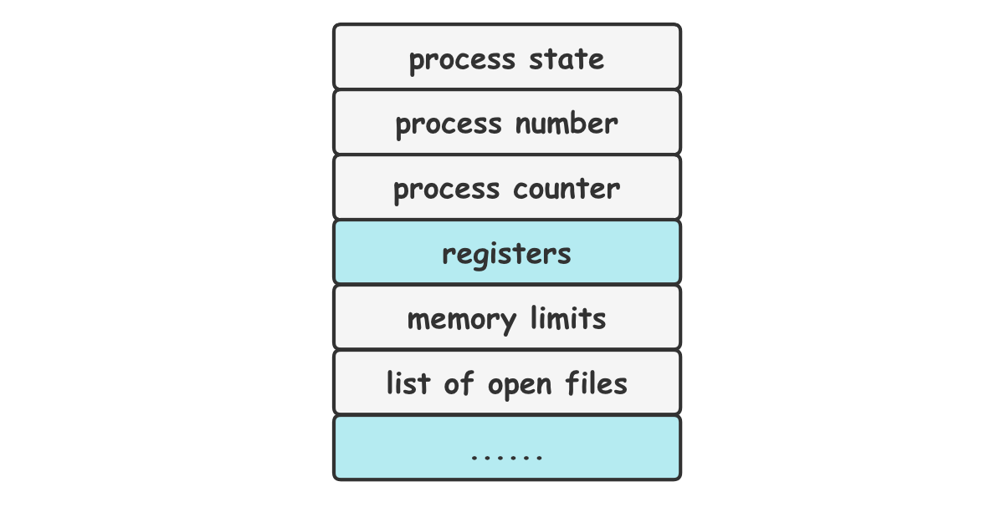

它包含进程相关的信息: 

- **进程状态**: 包含新的, 就绪, 运行, 等待, 停止等. 
- **程序计数器**: 表示进程将要执行的**下一个指令**的地址. 
- **CPU 寄存器**: 中断时记录寄存器的值, 这些状态信息与程序计数器需要一起保存, 以便进程**恢复**后能够正确执行. 
- **CPU 调度信息**: 包含进程优先级, 调度队列的指针等. 
- **内存管理信息**: 根据操作系统使用的内存系统, 这类信息可以包括基地址和界限寄存器的值, 页表或段表等. 
- **记账信息**: 包括 CPU 使用时间, 作业或者进程数量等统计信息. 
- **IO 状态信息**: 包含分配给进程的 **IO 设备列表, 打开文件列表**等. 

在支持多线程的系统中, **PCB 被扩展到包括每个线程的信息**. 

###### (2)Linux进程表示

在 Linux 中, 线程, 进程使用的是相同的核心数据结构. Linux 中使用一个 **task_struct** 结构来表示进程控制块, 包含了该进程的信息. 

```c
struct task_struct {
    volatile long state;	// 进程状态!
    unsigned long flags;	// 与管理有关的状态信息
    int prio, static_prio, normal_prio;// 优先级, 静态优先级
    struct list_head tasks;            // 进程链表
    struct list_head ptrace_children;
    struct list_head ptrace_list;
    struct mm_struct *mm, *active_mm;  // 指向进程存储空间的指针
    pid_t pid;                         // 进程的pid
    pid_t tgid;
    struct task_struct *real_parent;    // 真父进程指针
    struct task_struct *parent;         // 父进程指针
    struct list_head children;	        // 子进程链表
    struct list_head sibling;	        // 兄弟进程链表
    struct task_struct *group_leader;	// threadgroup leader
    struct timespec start_time; 		// monotonic time
    struct timespec real_start_time;	// boot based time
    struct thread_struct thread;
    unsigned long rt_priority;          // 实时优先级
    struct fs_struct *fs;               // 进程所在文件目录
    struct files_struct *files;         // 进程打开文件指针!!!
    struct dentry *proc_dentry;         // proc文件的dentry
    struct backing_dev_info *backing_dev_info;
    struct signal_struct *signal;       // 信号
    struct sighand_struct *sighand;
    //...
};
```

**task_struct** 就是 Linux 内核对于一个进程的描述, 也称为 **进程描述符**. 

比较有意思的是 **mm 指针和 files 指针**. **mm 指针**指向的是进程的**虚拟内存**, 也就是**载入资源和可执行文件**的地方; **files 指针**指向一个**数组**, 该数组装着**该进程打开的所有文件的指针**. 

在 Linux 内核中, 所有**活动进程**通过 **task_struct 的双向链表**表示. 内核采用**一个指针 current 指向当前正在执行的进程**, 通过这个指针即可修改进程的状态. 

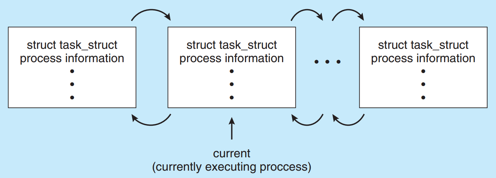

##### 2.文件描述符

task_struct 中的 **files** 是一个**文件指针数组**, "**文件描述符**" 就是**指这个文件指针数组的索引**. 

每个进程被**创建**时, **files 指针数组的前三位被填入默认值, 分别指向标准输入流, 标准输出流, 标准错误流**. 一般来说一个进程会**从 files[0] 读取输入**, 将**输出写入 files[1]**, 将**错误信息写入 files[2]**. 

文件描述符默认情况下 0 是输入, 1 是输出, 2 是错误. 见下图. 

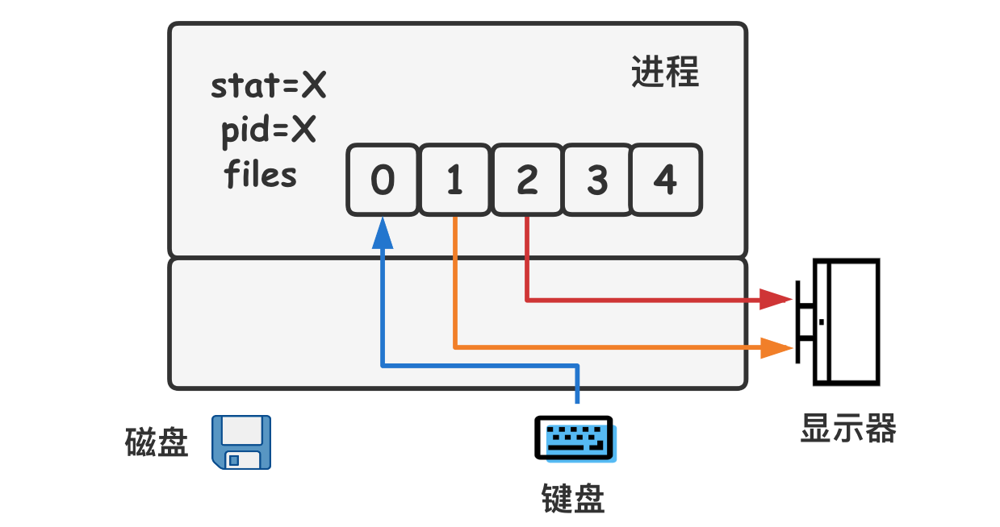

Linux 中**一切都被抽象成文件**, 设备也是文件, 可以进行**读和写**. 一般计算机中输入流是**键盘**, 输出流是**显示器**, 错误流也是**显示器**, 所以现在这个进程和内核连了三根线. 因为硬件都是由内核管理的, 进程需要通过**系统调用**让内核进程访问硬件资源. 

例如 C 语言的 **printf()** 函数是向命令行打印字符, 从进程角度来看, 就是向 **files[1] 写入数据**; 同理 scanf() 函数就是进程试图从 **files[0]** 这个文件中读取数据. 

如果应用程序需要其他资源, 比如**打开一个文件进行读写**, 可以通过系统调用让内核把文件打开, 这个文件就**会被放到 files 指针数组的第 4 个位置**: 

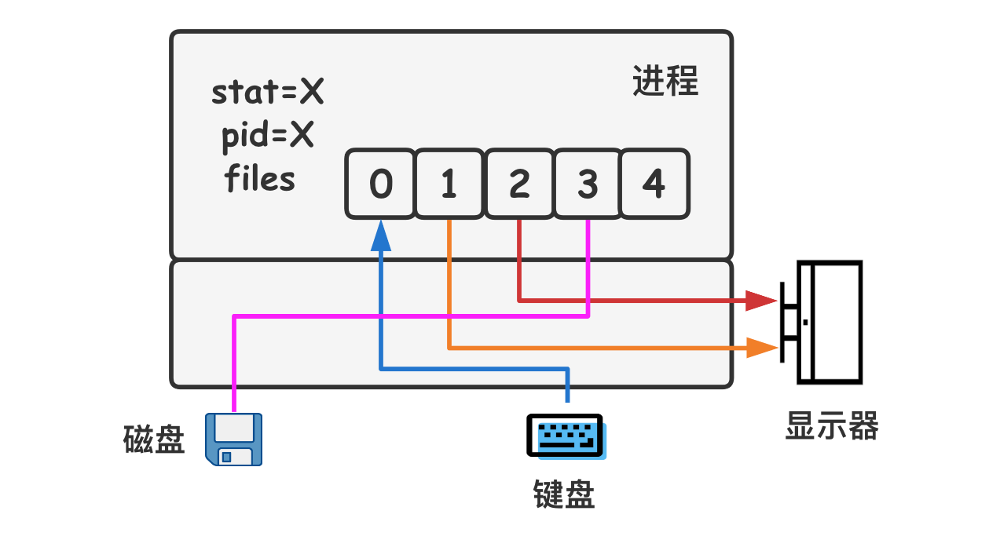

**输入重定向**就很好理解了, 由于应用程序从标准输入流 **files[0]** 读取数据, 所以只要把 **files[0] 指向一个文件**, 那么程序就会从这个文件中读取数据, 而不是键盘. 

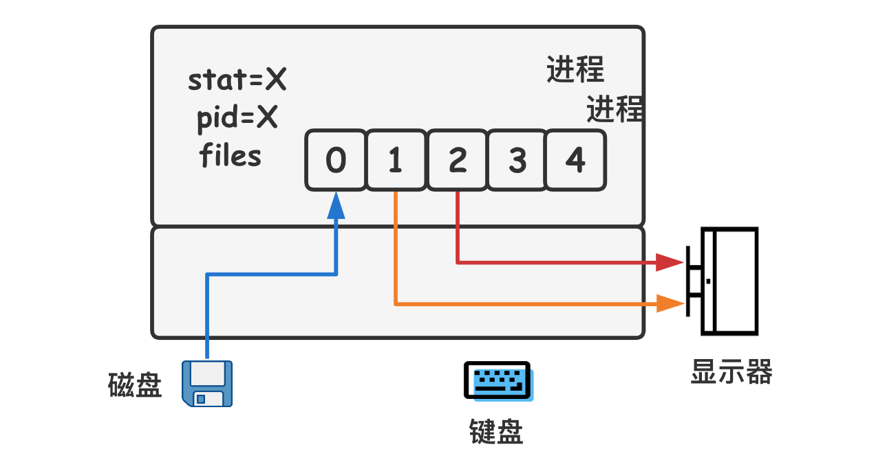

同理**输出重定向**就是把标准输出流 files[1] 指向**一个文件**, 那么程序输出就**不会写入到显示器**, 而是写入这个文件. 

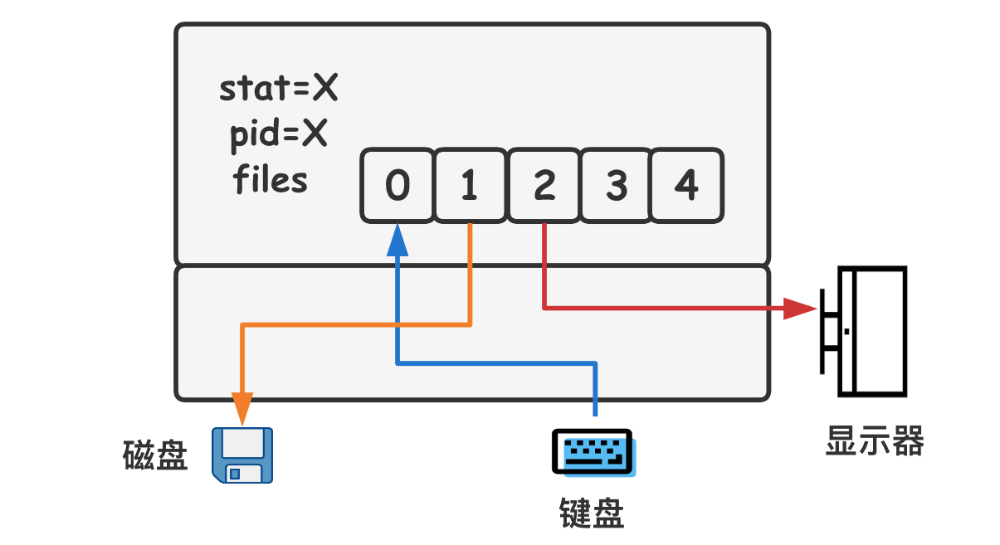

**管道符**也类似, 就是把一个进程的**输出流**和另一个进程的**输入流**接起一条 **管道**, 数据就在其中传递. 

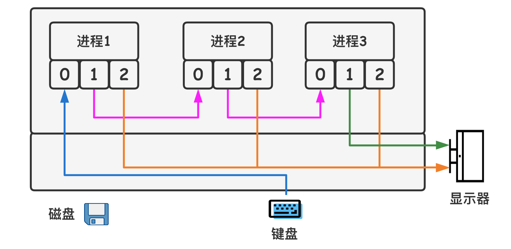

不管是设备, 其他进程, socket 套接字还是文件, 全部都可以进行读写, **统一装进一个简单的 files 数组**, 进程通过简单的**文件描述符访问相应资源**, 具体细节交给操作系统, 优美高效. 

#### 进程运行

##### 1.进程状态-五状态模型

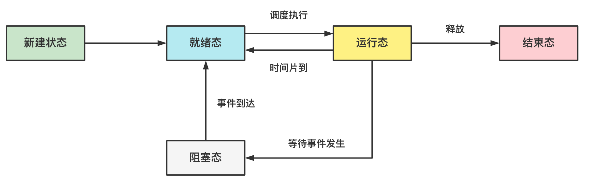

- **就绪状态**(ready): 等待被调度
- **运行状态**(running)
- 阻塞状态(waiting): 等待资源

注意: 

- 只有**就绪态和运行态**可以**相互转换**, 其它都是**单向转换**. 就绪状态的进程通过**调度算法**而获得 CPU 时间, 转为运行状态; 而运行状态的进程, 在分配给它的 CPU 时间片用完之后就会转为就绪状态, 等待下一次调度. 缺少 CPU 时间会从运行态转换为就绪态.
- 阻塞状态是缺少需要的资源从而由运行状态转换而来, 该资源不占用 CPU 时间. 

##### 2.进程创建

进程在执行过程中可以创建多个新的进程, 原来的进程为**父进程**, 新进程为子进程, 从而形成一颗**进程树**. 

一般使用**进程标识符(PID)**来唯一标识进程. 比如 Linux 的 **init 进程的 PID 为 1**, 它是所有用户进程的父进程.  

**通过系统调用 fork() 创建新进程. 新进程的地址空间复制了原来进程的地址空间, 这种机制允许父进程与子进程直接轻松通信. 对于新进程, 系统调用 fork() 返回值为 0, 而对于创建这个新进程的 fork() 返回值为新创建子进程的 PID**. 下图是通过系统调用 fork() 创建进程. 

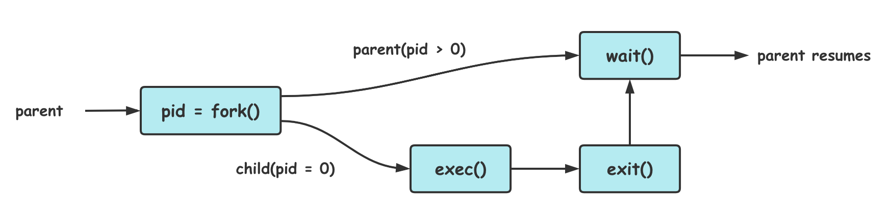

##### 3.进程终止

当进程创建新进程后, 可能有两种执行方式: 

- 父进程与子进程**并发执行**. 
- 父进程**等待直到某个子进程或全部子进程执行完**.

**父进程可以通过系统调用 wait() 来等待子进程的终止**. wait() 可以通过参数让父进程获得子进程的**退出状态**以及子进程的 PID, 这样父进程就知道是哪个子进程终止了. 

当一个子进程执行完毕后, 可以通过**系统调用 exit() 请求操作系统删除自己**, 此时**进程终止**. 此时子进程返回**状态值**给父进程(通过系统调用 wait()), 这样父进程就知道子进程的终止信息. 进程终止后所有的进程资源会被操作系统释放. 

虽然进程**终止后**所有的进程资源会被操作系统释放, 但是它在**进程表中的条目依然存在**, 直到它的**父进程调用了 wait()**, 这是因为进程表也包含了进程的退出状态. 

当进程已经**终止**但是其父进程**尚未调用 wait() 系统调用**时, 这种进程就成为**==僵尸进程==**. **所有进程终止时都会过渡**到这种状态, 但一般而言僵尸只是短暂的存在. 一旦父进程调用了 wait() 系统调用, 僵尸进程的进程标识符和它在进程表中的条目就会被**完全释放**. 

如果**父进程没有调用 wait() 系统调用自己就终止**了, 那么子进程就变成**孤儿进程**. Linux 下会将 **init** 进程作为孤儿进程的父进程, **init 进程会定时调用 wait()**, 以便收集任何孤儿进程的退出状态, 并释放孤儿进程的进程标识符和进程表条目. 

#### 进程调度

**进程调度器**选择一个就绪进程到 CPU 上执行. 

##### 1.调度程序

进程的整个生命周期中会在各种**调度队列**之间进行迁移, 操作系统为了**调度必须按一定方式从这些队列中选择进程**. 进程选择通过**调度器或者调度程序**来执行. 

根据进程类型进行调度: IO 密集型进程与 CPU 密集型进程. 

##### 2.调度队列

进程进入操作系统时, 会被加入到**作业队列**中, 这个队列包括系统中的**所有进程**. 有两种队列: 

**就绪队列(Ready Queue)**: 驻留在内存中处于就绪态的等待运行的进程保存在就绪队列中. 这个队列通常用链表实现, 其头结点有两个指针, 分别指向链表的第一个和最后一个 PCB 块, 每个 PCB 块还包含一个指针, 指向就绪队列的下一个 PCB. 

**设备队列**: 如果进程执行后需要等待特定事件的发生, 如 **IO** 请求的完成, 那么进程被加入到**设备队列**中, **每个设备都有自己的设备队列, 用于保存等待该特定 IO 设备的进程列表**. 如下图中下面的几个都是设备队列, 比如磁带单元, 终端单元等. 

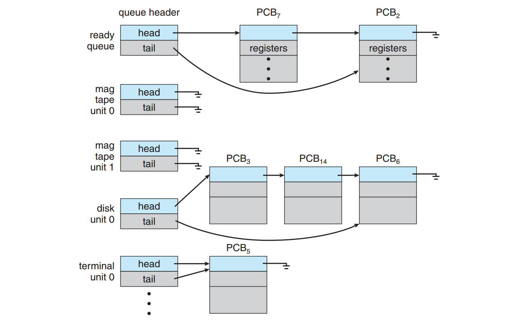

**关系**: 新的进程放到**就绪队列**, 进程执行过程中如果进程可能发出 **IO 请求**并被放到 **IO 队列**(属于设备队列)中, IO 完成之后进程再次被放到就绪队列中, 重复上述的流程直到进程完成被删除. 

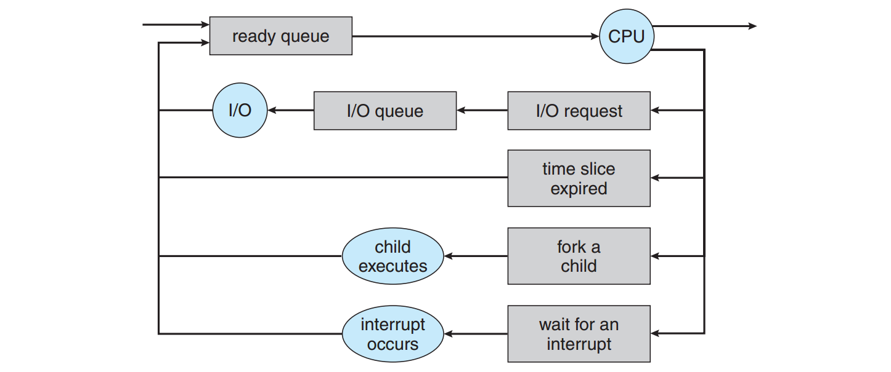

##### 3.进程切换

**切换 CPU 到另一个进程需要保存当前进程状态和恢复另一个进程的状态, 这个过程为==上下文(进程)切换==. **上下文切换的开销是纯粹的时间开销, 因为这个时间内啥都没干就是保存进程状态. 

**进程切换的时候会把进程上下文信息全部保存到 PCB 中, 包括 CPU 寄存器的值, 进程状态和内存管理信息等. 当进程获取 CPU 执行权限时又从 PCB 中重新加载状态**. 如下图所示为进程间 CPU 的切换过程. 

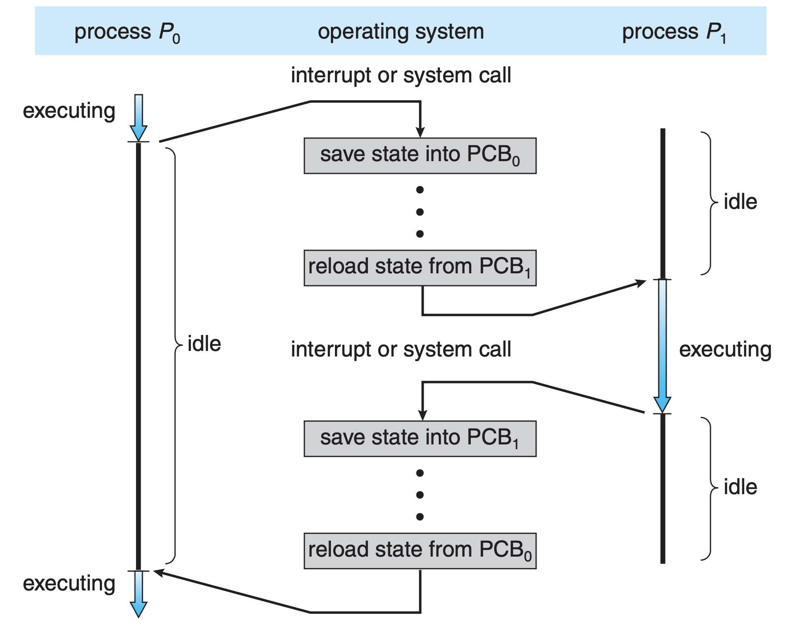

**中断**导致 CPU 从执行当前任务改变到执行内核程序, 当中断发生时, 系统需要保存当前运行在 CPU 上的**进程上下文**, 以便在处理后能够恢复上下文, 即先挂起进程, 再恢复进程. 

#### 进程调度算法

CPU 调度处理的问题是: 从**就绪队列**中选择进程以便为其分配 CPU, **如何选择进程**就是进程调度算法. **不同操作系统**的调度算法**目标不同**, 因此需要针对**不同系统环境**来讨论调度算法. 

##### 1.批处理系统

**批处理系统**没有太多的用户操作, 在该系统中, 调度算法目标是**保证吞吐量和周转时间**(从提交到终止的时间). 

###### (1)先来先服务(FCFS)

先请求 CPU 的进程首先分配到 CPU, 可以通过 FIFO 队列实现. 当一个进程进入就绪队列时, 这个进程的 PCB 就会被链接到队列尾部. FCFS 算法是非抢占的. 

按照**请求的顺序**进行调度. 有利于长作业, 但不利于短作业, 因为短作业必须一直等待前面的长作业执行完毕才能执行, 而长作业又需要执行很长时间, 可能造成**短作业等待时间过长**, 同时造成所有进程的平均等待时间较长. 

###### (2)短作业优先(SJF)

按估计运行时间**最短**的顺序进行调度. 长作业有可能会饿死, 处于一直等待短作业执行完毕的状态. 因为如果一直有短作业到来, 那么长作业永远得不到调度. 最短作业优先算法的**平均等待时间较低**. 

###### (3)最短剩余时间优先(SRTN)

按估计**剩余时间最短**的顺序进行调度. 

##### 2.交互式系统

交互式系统有**大量的用户交互操作**, 在该系统中调度算法的目标是**快速地进行响应**. 

###### (1)时间片轮转算法

将所有**就绪进程**按 **先来先服务(FCFS)**的原则排成一个**队列**, 每次调度时, 把 CPU 时间分配给**队首进程**, 该进程可以执行一个**时间片**. 当时间片用完时, 由计时器发出时钟**中断**, 调度程序便**停止**该进程的执行, 并将它送往**就绪队列的末尾**, 同时继续把 CPU 时间分配给**队首**的进程. 

时间片轮转算法的效率和**时间片的大小**有很大关系: 

- 由于**进程切换**需要**保存进程信息**并且载入新进程的信息, 如果时间片太小, 会导致**进程切换太频繁**, 在进程切换上就会花过多时间. 
- 而如果**时间片过长**, 那么**实时性**就不能得到保证. 

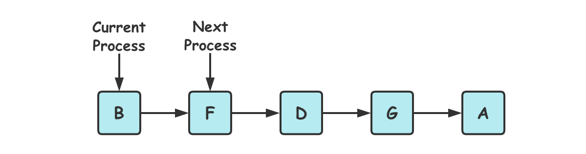

###### (2)优先级调度算法

为**每个进程**分配一个**优先级**, 按优先级进行调度. 为了防止低优先级的进程**永远等不到调度**, 可以随着**时间的推移增加等待进程的优先级**. 

###### (3)多级反馈队列算法

如果一个进程需要执行 **100** 个时间片, 如果采用**时间片轮转调度**算法, 那么需要**交换 100 次**. 

**多级队列**是为这种需要**连续执行多个时间片**的进程设计的, 它设置了**多个队列**, **每个队列时间片大小都不同**, 如 **1, 2, 4, 8** ,... 进程在**第一个队列没执行完**, 就会被移到**下一个队列**. 这种方式下, 之前的进程只需要交换 7 次. 

**新就绪**的进程总是进入**最高优先级队列的队尾**, 并按 FCFS 原则等待调度; 当轮到该进程执行时, 若它能在规定的时间片内**完成**, 便可准备撤离系统, 否则将其转入**第二级队列末尾**, 再同样按 FCFS 原则等待调度; 如果它在第二级队列上运行一个时间片后**仍未完成**, 再依次将它转入第**三级队列**, ……, 如此下去, 当一个长作业从第一级队列降到最后一级队列时, 便在该队列中**采取 RR 算法**运行. 

每个**队列优先级**也不同, 最**上面的优先级最高**. 因此只有**上一个队列没有进程在排队**, 才能调度**当前队列**上的进程. 

可以将这种调度算法看成是**时间片轮转调度算法和优先级调度算法**的**==结合==**. 

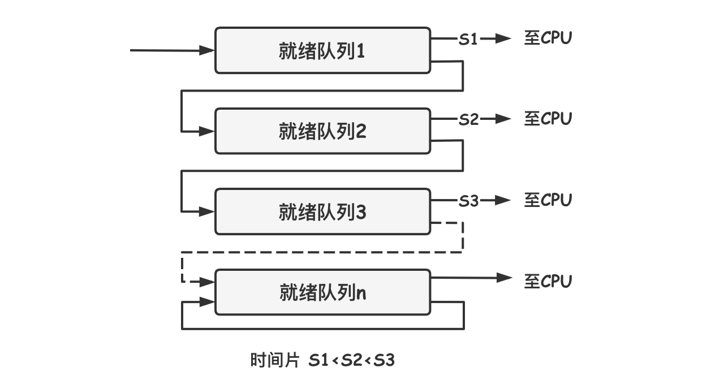

**UNIX** 操作系统便是采取的这种调度算法. 

##### 3.实时操作系统

实时系统要求一个请求在一个确定时间内得到响应. 比如 **UCOSII**. 分为硬实时和软实时.

##### 4.Linux进程调度算法

Linux 内核 V2.6 中, **完全公平调度程序**(CFS)是默认的调度算法. Linux 系统的调度基于**调度类**, 每个类都有一个特定的**优先级**. 内核针对不同的调度类采用不同的**调度算法**, 以便满足系统与进程的需要. 

每个可运行的任务放置在==**红黑树**==上, 它的键是基于 **vruntime 值**的, 当一个任务变为**可运行**的时候, 它被添加到树上, 当任务变成不可运行时(如阻塞等待 IO 时), 它从树上被**删除**. 一般来说, 得到**较少处理时间的任务(vruntime 值较小)会偏向树的左侧, 得到较多处理时间的任务会偏向树的右侧**. 

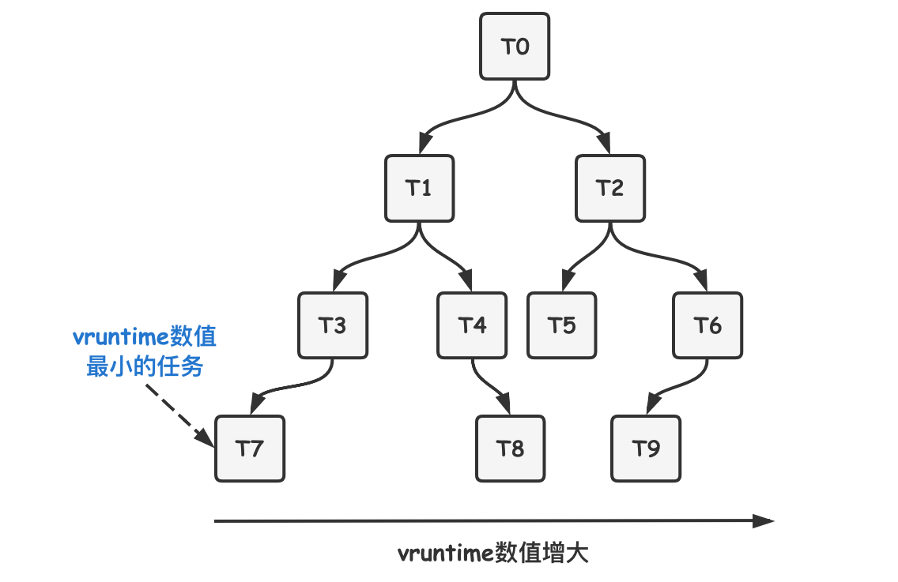

#### 进程间通信IPC

##### 1.概述

IPC 即进程间通信. 进程同步与进程通信很容易混淆, 它们的区别在于: 

- **进程同步**: **控制多个进程按一定顺序执行**. 
- **进程通信**: **进程间传输信息**. 

进程通信是一种手段, 而进程同步是一种目的. 一般为达到进程同步的目的, 需要让进程进行通信而传输一些进程同步所需的信息. 

##### 2.进程间通信模型

进程间通信有两个常用模型: **消息传递模型与共享内存模型**. 

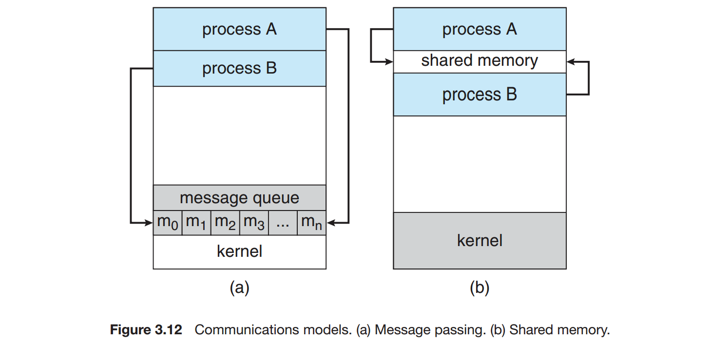

**消息传递模型**: 通信的进程通过**相互交换消息**来传递消息, 消息交换可以直接进行, 也可以通过一个共同的邮箱(如消息队列)来间接进行. 适用于分布式系统间的进程通信. 

**共享内存模型**: 建立一块供协作进程**共享的内存区域**, 进程通过向此共享区域**读写数据**来交换信息. 进程通过系统调用 shared_memory_create() 和 shared_memory_attach() 创建共享内存, 并访问其他进程拥有的内存区域. 共享内存模型的**速度最快**. 共享内存系统仅在**建立**共享内存区域时需要进行系统调用, 一旦共享内存建立完成, 所有的访问都可以作为**常规的内存访问**, 无需借助内核. 不过共享内存模型容易出现数据保护与同步方面的问题, 即**数据不一致**的问题. 

##### 3.实现方式

###### (1)普通管道

普通管道(无名管道)允许两个进程按生产者-消费者模式进行通信: 生产者向管道一端写, 消费者从管道另一端读. 所以普通管道**只允许单向通信**, 如果需要双向通信需要采用两个管道, 两个管道向不同的方向发送数据. 

**管道**通过系统调用 ==**pipe()**== 函数创建, 并通过文件描述符 int fd[] 来访问, **fd[0] 为管道输入端, fd[1] 为管道输出端**. 这与前述的 **files 文件指针数组**对应. 

```c
#include <unistd.h>
int pipe(int fd[2]);
```

Unix 将**管道**作为一种特殊类型的**文件**, 因此可以用普通的系统调用 read() 和 write() 来访问管道. 

**普通管道只能被创建它的进程访问**. 通常父进程创建一个管道, 并使用它来与其子进程进行通信(该子进程通过 fork() 创建). 由于子进程继承了父进程的打开文件, 而普通管道也是一种特殊的文件, 所以子进程也继承了父进程的管道. 

**普通管道**可用于**具有亲缘关系进程间**的通信, 允许一个进程和另一个与它有**共同祖先的进程**之间进行通信. 它具有以下限制: 

- 只支持**半双工**通信(单向交替传输). 
- **只能**在**父子进程**中使用. 
- 普通管道仅在进程相互通信时才存在, 一旦进程完成通信且终止后普通管道就**不存在**了. 

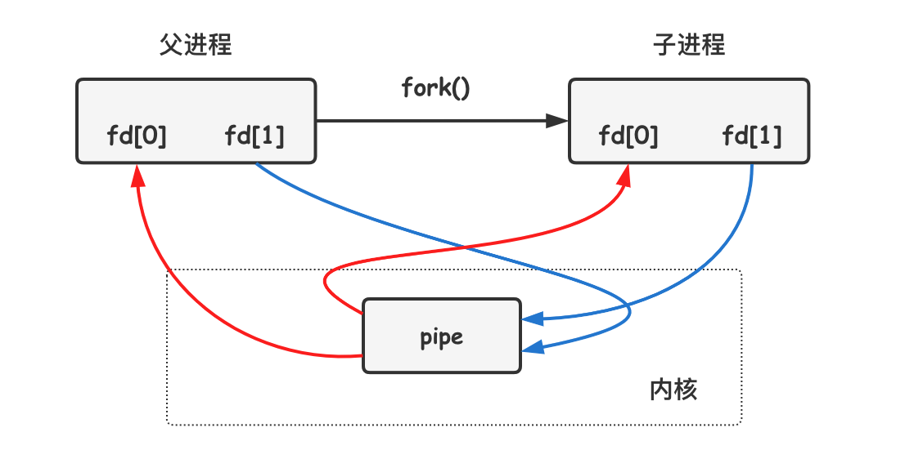

Unix 命令行下, 管道经常用于将一个命令的输出作为另一个命令的输入. 

###### (2)命名管道

**命名管道也叫 FIFO**, 克服了管道只能在父子进程中使用的限制, 也克服了管道**没有名字**的限制. 因此除具有管道所具有的功能外, 它还允许**无亲缘关系进程间**的通信, 一个典型的场景是一个命名管道有几个写者. 区别: **普通(无名)管道**: 只存在于内存中的文件; **命名管道**: 存在于实际的磁盘介质或者文件系统. 

命名管道通过系统调用 **mkfifo()** 来创建. 命名管道在文件系统中有对应的**文件名**, 其表现就类似于文件系统上的一个**文件**, 因此当进程通信完成之后, 命名管道将**继续存在**, 直到被显式的删除. 可以通过系统调用 open()、read()、write()、close() 等进行操作. 

命名管道虽然运行双向通信, 但是是**半双工**的. 

```c
#include <sys/stat.h>
int mkfifo(const char *path, mode_t mode);
int mkfifoat(int fd, const char *path, mode_t mode);
```

FIFO 常用于**客户-服务器**应用程序中, FIFO 用作**汇聚点**, 在**客户进程和服务器进程**之间传递数据. 

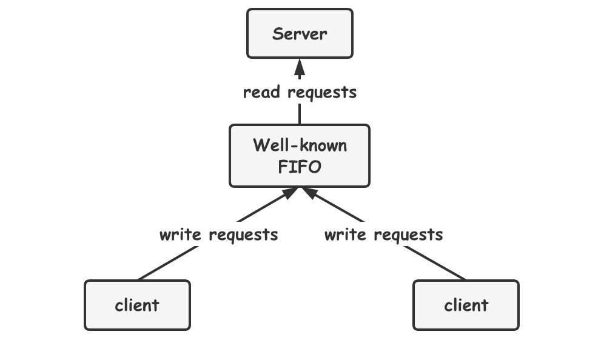

###### (3)消息队列

**消息队列**是消息的**链表**, 具有特定的格式, 存放在内存中并由**消息队列标识符**标识. **消息队列存放在内核**中, 只有在**内核重启**(即操作系统重启)或显式地删除消息队列时才会被真正的删除. 消息队列可以实现消息的随机查询, 消息不一定要以先进先出的次序读取, 也可以按消息的类型读取. 比 FIFO 更有优势. 

相比 FIFO, 消息队列具有以下优点: 

- 消息队列可以**独立于**读写进程存在, 从而避免了 FIFO 中同步管道的打开和关闭时可能产生的困难. 
- 避免了 FIFO 的**同步阻塞**问题, 不需要进程自己提供同步方法. 
- 读进程可以根据消息类型有**选择地接收**消息, 而不像 FIFO 那样只能默认地接收. 

###### (4)信号量

信号量是一个**计数器**, 用于为**多个进程**提供对**共享数据对象**的访问. 信号量的意图在于**进程间同步**. 这种通信方式主要用于解决与同步相关的问题并避免竞争条件. 主要作为进程间以及同一进程内不同线程之间的同步手段. 

###### (5)共享内存

**允许多个进程共享**一个给定的**存储区**, 不同进程可以及时看到对方进程中对**共享内存中数据的更新**. 因为数据**不需要**在进程之间**复制**, 所以这是**最快**的一种 IPC. 这种方式需要依靠某种**同步操作**, 如**互斥锁和信号量**等. 需要使用**信号量**用来**同步对共享存储的访问**. 

**多个进程**可以将**同一个文件映射**到它们的**地址空间从而实现共享内存**. 

###### (6)套接字

套接字可用于**不同主机**之间的**进程通信**. 套接字是支持 TCP/IP 网络通信的基本操作单元, 可以看做是不同主机之间的进程进行双向通信的端点, 用套接字中的相关函数来完成通信过程. 

Java 中**面向连接**的 TCP 套接字使用 Socket 类, **无连接**的 UDP 套接字使用 DatagramSocket 类.

#### 进程同步

进程同步即控制**多个进程**按一定**顺序**执行. 区分两个概念: 

- **同步**: 多个进程按一定**顺序**执行. 
- **互斥**: 多个进程在同一时刻只有**一个进程**能进入临界区. 

##### 1.临界区

对**临界资源**进行访问的那段代码称为**临界区**. 当一个进程在临界区内执行时, 其他进程不允许在临界区内执行. 为了互斥访问临界资源, 每个进程在进入临界区之前, 需要先进行**检查**. 

临界区问题的解决方案通常有两种: 一是基于**软件**的解决方案, 这种方案一般不保证能够在现代计算机体系结构上正确工作. 另一种方案是基于**硬件**同步的解决方案, 典型的代表是通过加锁来保护临界区, 使用 CAS 硬件指令来解决临界区问题. 

##### 2.互斥锁

临界区问题基于硬件的解决方案不但复杂而且不能为程序员直接使用. 因此操作系统构造了相关的软件工具, 最简单的就是互斥锁. 可以用互斥锁保护临界区, 从而防止竞争条件. **一个进程在进入临界区时应该获取到锁, 它在退出临界区是释放锁**. 

互斥锁可以通过 acquire() 获取锁和 release() 释放锁, 每个互斥锁都有一个布尔类型的变量 available 表示锁是否可用. 

##### 3.信号量

信号量通常用于控制访问具有**多个实例**的某种资源, 信号量的初值为可用资源数量. 

**信号量**(Semaphore)是一个**整型变量**, 可以对其执行 **wait 和 signal** 操作. 

-  **wait**: 如果信号量**大于 0**, 执行 -1 操作; 如果信号量**等于 0**, 进程**睡眠**, 等待信号量大于 0; 
-  **signal**: 对信号量执行 +1 操作, 唤醒睡眠的进程让其完成 down 操作. 

wait 和 signal 等对于整型变量的操作需要是**原子的**, 不能分割, 通常的做法是在执行这些操作的时候屏蔽中断. 

如果信号量的取值**只能为 0 或者 1**, 那么就成为了 **互斥量(Mutex)**, **0 表示临界区已经加锁, 1 表示临界区解锁**. 

```c
typedef int semaphore;
semaphore mutex = 1;
void P1() {
    down(&mutex);
    // 临界区
    up(&mutex);
}

void P2() {
    down(&mutex);
    // 临界区
    up(&mutex);
}
```

#### 线程

##### 1.概述

线程是 **CPU** 使用的**基本单元**, 它包括线程 ID, 程序计数器, 寄存器组和堆栈. 同一个进程的线程**共享**代码段, 数据段与其他操作系统资源. 下图是多线程进程. 

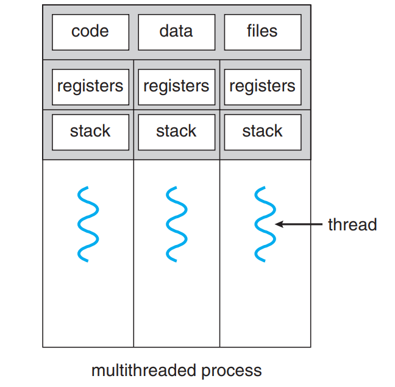

##### 2.多线程模型

线程分为用户线程与内核线程. 用户线程位于内核之上, 其管理无需内核支持, 而内核线程由操作系统支持与管理. 

##### 3.线程同步

**线程同步**是两个或多个共享关键资源**线程的并发执行**. 应该同步线程以避免关键的资源使用冲突. 操作系统一般有如下线程同步方式: 

1. **信号量(Semphares)**: 允许同一时刻**多个线程**访问**同一资源**, 但是需要控制同一时刻**访问此资源的最大线程数量**. 如 JDK 中的 Semphare 类. 
2. **互斥量(Mutex)**: 互斥量是信号量的一种**特殊形式**. 采用**互斥对象机制**, 只有拥有互斥对象的线程才有访问公共资源的权限. 因为互斥对象**只有一个**, 所以可以保证公共资源不会被多个线程同时访问. 如 Java 中 **synchronized** 关键词和各种 **Lock** 都是这种机制. 
3. **事件(Event)**: **Wait/Notify 机制**, 通过通知操作的方式来保持多线程同步, 还可以方便的实现多线程优先级的比较操作. 

#### 进程死锁

正常情况下资源访问步骤: **申请, 使用, 释放**. 

当一个**进程**申请资源时, 如果资源不可用, 那么进程进入等待状态. 有时候不同进程申请的资源被其他的等待进程互相占用, 那么进程就有可能一直等待对方的资源而再也无法改变状态, 这就产生死锁. 

##### 1.死锁概述

###### (1)死锁的必要条件

发生死锁的四个必要条件如下, 四个条件必须**同时成立**才能形成死锁. 

1. **互斥条件**: 一个资源在任意一个时刻**只能由一个进程持有**. 
2. **请求与保持条件**: 一个进程因请求资源而**阻塞**时, 对**已持有的资源保持不放**. 
3. **不可抢占条件**: 线程已持有的资源在未使用完之前**不能被其他线程强行剥夺**, 只有自己使用完后才释放资源. 
4. **循环等待条件**: 若干进程之间形成一种头尾相接的**循环等待资源关系**. 

###### (2)资源分配图

**系统资源分配图**可以更精确的描述死锁, 它是一个**有向图**. **资源分配图**中方框表示**资源**, 圆圈表示**进程**. 假如进程为 P, 资源为 R. **P → R** 说明进程正在**申请**这个资源, **R → P** 说明这个资源的一个实例已经**分配**给了这个进程. 

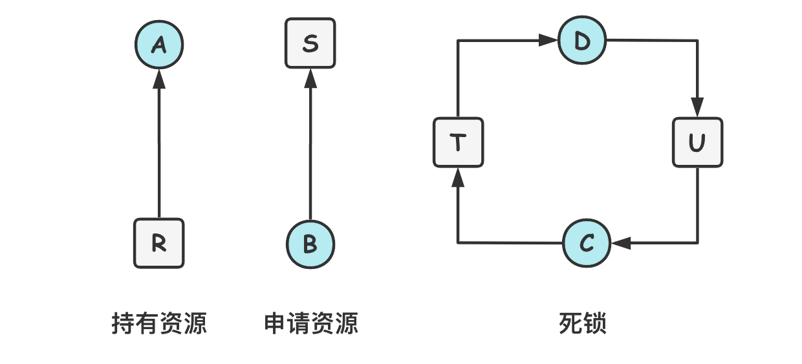

如果资源分配图**没有环**, 那就没有发生死锁; 如果分配图**有环**, 那么**可能**存在死锁(不是一定). 如果一个资源**只有一个实例**, 那么如果有环就**肯定出现死锁**了; 如果一个资源有**多个实例**, 即使存在环也**不一定存在死锁**(如下右图). 

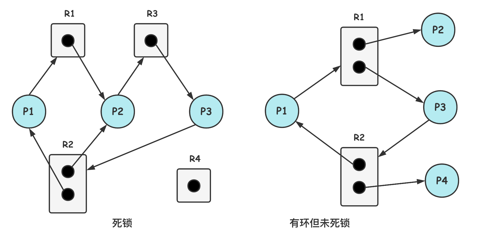

##### 2.死锁处理方法

**处理死锁**主要有以下几种方法: **死锁预防, 鸵鸟策略, 死锁检测, 死锁恢复, 死锁避免**等. 下面分别叙述.

##### 3.死锁预防

在程序运行之前**预防发生死锁**. 避免死锁只要破坏产生死锁的四个条件中的**其中一个**就可以了. 

**(1) 破坏互斥条件**. 这个条件**没有办法破坏**, 因为用锁本来就是想让他们互斥的(临界资源需要互斥访问). 

**(2) 破坏请求与保持条件**. 一次性申请所有的资源. 

**(3) 破坏不可抢占条件**. **占用部分资源的线程进一步申请其他资源时**, 如果申请不到, **可以主动释放它占有的资源**. 

**(4) 破坏环路等待**. 靠按序申请资源来预防. 按**某一顺序申请资源, 释放资源则反序释放**. 破坏循环等待条件. 

##### 4.死锁避免

在程序**运行时**避免发生死锁. 

**安全状态**: 如果没有死锁发生, 并且即使所有进程突然请求对资源的最大需求, 也仍然存在某种调度次序能够使得每一个进程运行完毕, 则称该状态是安全的. 

安全状态的检测与死锁的检测类似, 因为安全状态必须要求不能发生死锁.

##### 5.鸵鸟策略

像鸵鸟把头埋在沙子里, **假装根本没发生问题**. 因为解决死锁问题的代价很高, 因此鸵鸟策略这种**不采取任务措施**的方案可能会获得更高的性能. 当发生死锁时如果对用户造成的影响不大, 或发生死锁的概率很低, 可以采用鸵鸟策略. 大多数操作系统如 Linux 和 Windows, 处理死锁问题的办法仅仅是**忽略它**. 

##### 6.死锁检测

不试图阻止死锁, 而是当**检测到死锁发生时**, 采取措施进行**恢复**. 

###### (1)每种类型一个资源的死锁检测

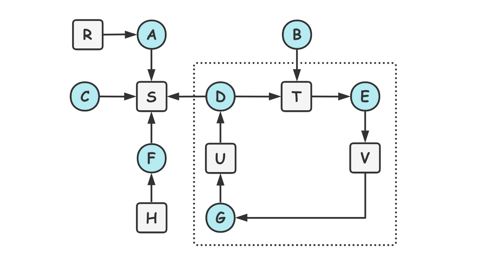

**资源分配图**中方框表示**资源**, 圆圈表示**进程**. 从图中可以抽取出环, 它满足了**环路等待**条件, 因此会发生死锁. 

每种类型一个资源的死锁检测算法是通过==**检测有向图是否存在环**==来实现, 从一个节点出发进行深度优先搜索, 对访问过的节点进行标记, 如果访问了已经标记的节点, 就表示有向图存在环, 也就是检测到死锁的发生. 

###### (2)每种类型多个资源的死锁检测

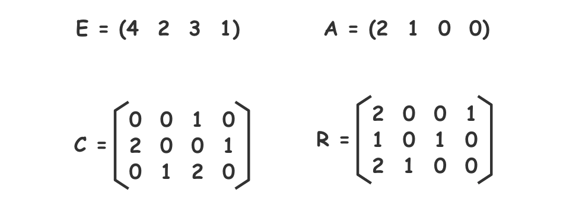

上图中, 有**三个进程四个资源**, 每个数据代表的含义如下: 

- E 向量: 资源总量. 
- A 向量: 资源剩余量. 
- C 矩阵: 每个进程所拥有的资源数量, 每一行都代表一个进程拥有资源的数量. 
- R 矩阵: 每个进程请求的资源数量. 

进程 P1 和 P2 所请求的资源都得不到满足, 只有进程 P3 可以, 让 P3 执行, 之后释放 P3 拥有的资源, 此时 A = (2 2 2 0). P2 可以执行, 执行后释放 P2 拥有的资源, A = (4 2 2 1) . P1 也可以执行. 所有进程都可以顺利执行, 没有死锁. 

算法总结如下: 每个进程**最开始时都不被标记**, 执行过程有可能被标记. 当算法结束时, **任何没有被标记的进程都是死锁进程**. 

1. 寻找一个没有标记的进程 P<sub>i</sub>, 它所请求的资源小于等于 A. 
2. 如果找到了这样一个进程, 那么将 C 矩阵的第 i 行向量加到 A 中, 标记该进程, 并转回 1. 
3. 如果没有这样一个进程, 算法终止. 

##### 7.死锁恢复

(1)利用**抢占**恢复. (2)利用**回滚**恢复. (3)通过**杀死进程**恢复. 


#### 参考资料

- 协程: jianshu.com/p/6dde7f92951e
- labuladong文章: Linux的进程、线程、文件描述符是什么


