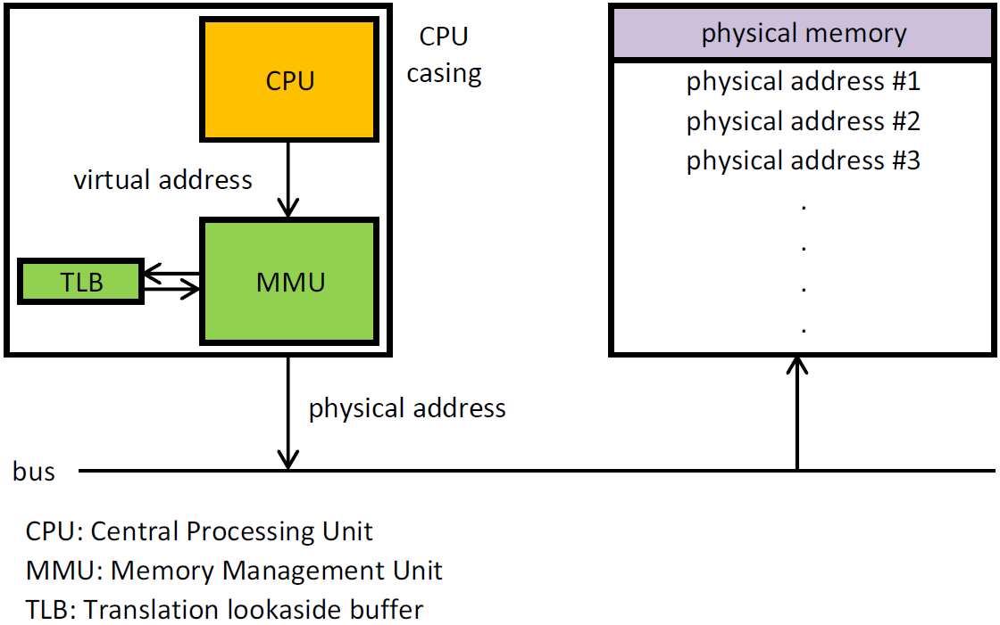
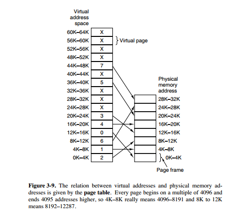
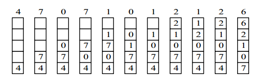
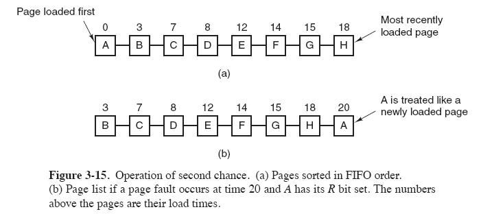
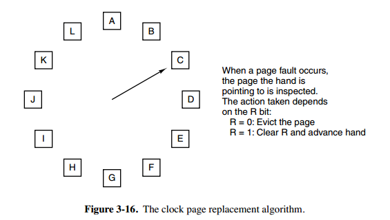
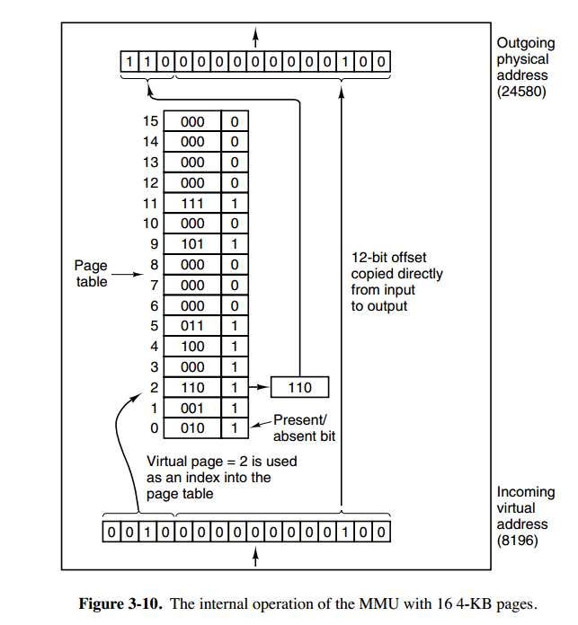
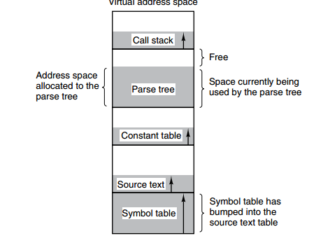
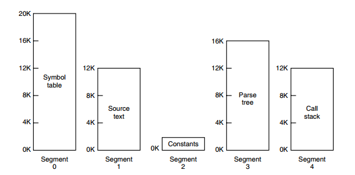

[TOC]

### 内存管理

操作系统的**内存管理**主要负责**内存的分配与回收**(malloc(): 申请内存, free(): 释放内存), 以及**地址转换**(将**逻辑地址转换成相应的物理地址**). 

#### 内存管理机制

当前内存管理机制多采用**非连续分配管理**方式, 即允许一个程序使用的**内存分布在离散或者说不相邻的内存中**, 常见的如**页式管理**和**段式管理**. 

- **页式管理**. 把**主存**分为大小相等且**固定的一页一页**的形式. **页式管理通过页表对应逻辑地址和物理地址**. 
- **段式管理**. 页式管理虽然提高了内存利用率, 但页式管理其中的页实际并无任何实际意义. 段式管理把**主存分为一段段的**. 但最重要的是**段是有实际意义**的, **每个段定义了一组逻辑信息**, 例如有主程序段 MAIN, 子程序段 X, 数据段 D 及栈段 S 等. **段式管理通过段表对应逻辑地址和物理地址**. 
- **段页式管理**. 段页式管理机制**结合**了段式管理和页式管理的优点. 简单来说就是把**主存先分成若干段, 每个段又分成若干页**, 这个机制中段与段之间以及段的内部的都是离散的. 

#### 虚拟地址空间

##### 1.基本概念

几个概念.

- **虚拟地址/逻辑地址**: 指由程序产生的**由段选择符和段内偏移地址**两个部分组成的地址. 这两部分组成的地址**并没有直接访问物理内存**, 而是要通过**分段地址**的变换机构处理或**==映射后==**才会对应到相应的物理内存地址. 许多人直接把逻辑地址当成虚拟地址. 

- **线性地址**: 指的是**虚拟地址到物理地址变换之间的中间层**, 是处理器可寻指的内存空间(称为线性地址空间)中的地址. 程序代码会产生逻辑地址, 或者说是段中的偏移地址, 加上相应段的基地址就生成了一个线性地址. 如果启用了分页机制, 那么线性地址可以再经过变换产生物理地址. 若是没有采用分页机制, 那么线性地址就是物理地址. 

- **物理地址**: **物理地址**指的是**真实物理内存中地址**, 是内存单元**真正**的地址, 具体一点就是**内存地址寄存器中的地址**, 是地址变换的**最终结果**. 

**编程**一般只有可能和**逻辑地址**打交道, 比如 C 语言中指针里存储的数值就可以理解成为内存里的一个**地址**, 这个地址就是**逻辑地址**, **==逻辑地址由操作系统决定==**. 

##### 2.寻找方式

> **CPU寻址了解吗?为什么需要虚拟地址空间?**

现代处理器使用的是一种称为**虚拟寻址(Virtual Addressing)**的寻址方式. **使用虚拟寻址时, CPU 需要将虚拟地址翻译成物理地址, 这样才能访问到真实的物理内存**. 实现虚拟地址到物理地址转换的硬件是 CPU 中称为 **内存管理单元(Memory Management Unit, MMU)** 的硬件. 如下图所示: 



如果没有虚拟地址空间, 程序可以直接访问与操作物理内存. 这时用户程序可以访问**任意内存地址**, 这很有可能破坏操作系统, 造成**操作系统崩溃**. 因此不能直接把物理地址暴露出来.

通过**虚拟地址访问内存**有以下优势: 

- **不同进程**使用的虚拟地址**彼此隔离**. 一个进程中的代码无法更改正在由另一进程或操作系统使用的物理内存. 这也提升了操作系统安全性. 

- 程序可以使用一系列**虚拟地址**来访问**大于可用物理内存的内存缓冲区**. 当物理内存的供应量变小时, 内存管理器会将物理内存页(通常大小为 4 KB)保存到**磁盘文件**. 

#### 虚拟内存

##### 1.虚拟内存概念

几个概念: 

- **物理内存 RAM(Random Access Memory)**: 是计算机的**实际内存大小**, 它直接与 CPU 交换数据, 也被称为主存. 
- **虚拟内存(Virtual Memory)**: 虚拟内存是操作系统为了更高效率使用物理内存的一种概念, 它是对物理内存的抽象. Windows 的**"虚拟内存"**和 Linux 的 **"交换空间(swap)"** 都是虚拟内存技术的一种**实现**. 

**虚拟内存**是计算机系统**内存管理**的一种技术. **虚拟内存**使应用程序认为它**拥有连续可用的内存**(一个连续完整的地址空间), 而实际上它通常是被**分隔成多个物理内存碎片**, 甚至可能还有部分**暂时存储在外部磁盘存储器上**, 在需要时进行**数据交换**. 它可以让程序可以**拥有超过系统物理内存大小的可用内存空间**, 其目的是为了让物理内存扩充成更大的**逻辑内存**, 从而让程序获得更多的**可用内存**. **虚拟内存为每个进程提供了一个一致的, 私有的地址空间**.  

为更好的管理内存, 操作系统将**内存**抽象成**地址空间**. 每个程序拥有自己的**地址空间**, 这个地址空间被分割成多个块, **每一块称为一页**. 这些**页被映射到物理内存**, 但**不需要映射到连续的物理内存, 也不需要所有页都必须在物理内存中**. 当程序引用到不在物理内存中的页时, 由**硬件执行必要的映射**, 将缺失的部分装入**物理内存**并重新执行失败的指令. **虚拟内存允许程序不用将地址空间中的每一页都映射到物理内存**, 也就是说一个程序不需要全部调入内存就可以运行, 这使得有限的内存运行大程序成为可能. 例如有一台计算机可以产生 16 位地址, 那么一个程序的地址空间范围是 0~64K. 该计算机只有 32KB 的物理内存, 虚拟内存技术允许该计算机运行一个 64K 大小的程序. **虚拟内存是被虚拟**出来的, 可以使用硬盘(**不仅仅是硬盘**)来作为虚拟内存. 这就是为什么可以**正常运行一个所需内存比计算机内存还大的程序**, 并感受不到内存的限制的原因. 



##### 2.局部性原理

局部性原理是虚拟内存技术的**基础**. 正是因为程序运行具有局部性原理, 才可以**只装入部分程序到内存**就可以开始运行. 

程序在执行的时候往往**呈现局部性规律**, 也就是说在某个较短的时间段内, 程序**执行局限于某一小部分**, 程序访问的存储空间也局限于某个区域. 局部性原理**表现**在以下两个方面: 

- **时间局部性**: 如果程序中的某条**指令一旦执行**, 不久以后该指令可能**再次执行**; 如果某数据被访问过, 不久以后该数据可能再次被访问. 产生时间局部性的典型原因是由于在程序中存在着大量的**循环操作**. **时间局部性**是通过将近来使用的**指令和数据保存到高速缓存存储器**中, 并使用高速缓存的层次结构实现. 
- **空间局部性**: 一旦程序访问了某个存储单元, 在不久之后, 其附近的存储单元可能也将被访问, 即程序在一段时间内所访问的地址, 可能集中在一定的范围之内, 这是因为指令通常是顺序存放, 顺序执行的, 数据也一般是簇聚存储的. **空间局部性**通常是使用**较大的高速缓存**, 并将预取机制集成到高速缓存控制逻辑中实现. 

虚拟内存技术实际上就是建立了 "**内存-外存**" 的**两级存储器**的结构, 利用**局部性原理实现髙速缓存**. 

##### 3.虚拟存储器

基于**局部性原理**, 在程序装入时, 可以将程序的**一部分装入内存**, 而将其他部分留在**外存**, 就可以启动程序执行. 在程序执行过程中, 当所访问的信息不在内存时, 由**操作系统**将所需要的部分调入内存, 然后继续执行程序. 另一方面, 操作系统也可以将内存中暂时不使用的内容交换到外存上, 从而腾出空间存放将要调入内存的信息. 这样计算机好像为用户提供了一个比实际内存大得多的存储器: **虚拟存储器**. 

所以虚拟内存是一种**时间换空间**的策略, 用 CPU 的计算时间与页的调入调出花费的时间, 换来了一个虚拟的更大的空间来支持程序的运行. 

##### 4.虚拟内存技术实现

**虚拟内存的实现需要建立在离散分配的内存管理方式基础上. **虚拟内存的**实现**有以下三种方式: 

1. **请求分页存储管理**: 建立在**分页管理**之上, 为了支持虚拟存储器功能而增加了**请求调页功能, 页面置换功能**. 请求分页是目前最常用的一种实现虚拟存储器的方法. 请求分页存储管理系统中, 在作业开始运行之前, 仅装入当前要执行的**部分页**即可运行. 假如在作业运行的过程中发现要访问的**页面不在内存**, 则由处理器通知操作系统按照对应的**页面置换算法**将相应的页面调入到主存, 同时操作系统也可以将暂时不用的**页面置换到外存**中. 
2. **请求分段存储管理**: 建立在**分段存储管理**之上, 增加了**请求调段功能, 分段置换功能**. 具体过程与分页形式类似, 不过这里操作的是段.
3. **请求段页式存储管理**. 

不管哪种实现方式, 一般都需要: 

1. 一定容量的**内存和外存**: 只需将程序的一部分装入内存, 而将其他部分留在外存, 程序即可执行; 
2. **缺页中断**: 如果**需执行的指令或访问的数据尚未在内存**(称为缺页或缺段), 则由**处理器**通知**操作系统**将相应的页或段**调入到内存**, 然后继续执行程序; 
3. **虚拟地址空间**: **逻辑地址到物理地址的变换**. 

##### 5.页面置换算法

**虚拟内存管理**很重要的一个概念就是**页面置换算法**. 

> **为何进行页面置换? **

在程序运行过程中, 如果要访问的页(或段)**不在内存中**, 就发生**缺页中断**, 从而需要将该页**调入内存**之后再进行访问. 被内存映射的文件实际上成了一个分页交换文件. 此时如果内存**已无空闲空间**, 系统必须从**内存中**调出一个**页到磁盘对换区**中, 以便为即将调入的页让出空间. 

用来**选择被淘汰页**的规则即**页面置换算法**. **页面置换算法**和缓存淘汰策略类似, 缓存系统中缓存大小有限, 当有新的缓存到达时, 需要淘汰一部分已经存在的缓存, 这样才有空间存放新的缓存数据. ==页面置换算法的主要目标是使页面**置换频率最低**==, 也可以说**缺页率最低**. 

常见的页面置换算法. 

###### (1)最佳算法OPT

OPT 算法所选择的被换出的页面将是最长时间内不再被访问, 通常可以保证获得最低的缺页率. 是一种**理论上的算法**, 因为无法知道一个页面多长时间不再被访问. 

举例: 一个系统为某进程分配了三个物理块, 并有如下页面引用序列: 

```html
7, 0, 1, 2, 0, 3, 0, 4, 2, 3, 0, 3, 2, 1, 2, 0, 1, 7, 0, 1
```

开始运行时, 先将 7, 0, 1 三个页面装入内存. 当进程要访问页面 2 时, 产生缺页中断, 会将页面 7 换出, 因为页面 7 再次被访问的时间最长. 

###### (2)最近最久未使用算法LRU

LRU(Least Recently Used) 算法. 虽然无法知道将来要使用的页面情况, 但可以知道**过去使用页面**的情况. LRU 将**最近最久未使用**的页面换出. 为实现 LRU, 需要在内存中维护一个所有页面的**==双向链表==**. 当一个页面被访问时, 将这个页面移到链表表头. 这样就能保证**链表表尾的页面**是最近最久未访问的. 因为**每次访问**都需要**更新链表**, 因此这种方式实现的 LRU 代价较高. 

下面是页面使用顺序及其在链表中的图示. 

```
4, 7, 0, 7, 1, 0, 1, 2, 1, 2, 6
```



###### (3)最近未使用算法NRU

NRU算法(Not Recently Used). 每个页面都有**两个状态位**: **R 与 M**, 当页面被**访问**时设置页面的 **R = 1**, 当页面被**修改**时设置 **M = 1**. 其中 R 位会**定时被清零**. 可以将页面分成以下**四类**: 

- R=0, M=0
- R=0, M=1
- R=1, M=0
- R=1, M=1

当发生缺页中断时, NRU 算法随机地从**类编号最小**的**非空类**中挑选一个页面将它换出. NRU **优先换出已经被修改的脏页面**(R=0, M=1), 而**不是被频繁使用的干净页面**(R=1, M=0). 

###### (4)先进先出算法FIFO

FIFO 算法(First In First Out). 选择换出的页面是**最先进入**的页面. 该算法会将那些**经常被访问**的页面也可能被换出, 从而使缺页率升高. 

###### (5)第二次机会算法

**FIFO 算法**可能会把经常使用的页面置换出去, 为避免这一问题, 对该算法做一个简单的**修改**: 当页面被访问 (读或写) 时设置该页面的 **R 位为 1**. 需要替换的时候, 检查**最老页面的 R 位**. 如果 R 位是 0, 那么这个页面既老又没有被使用, 可以立刻置换掉; 如果**是 1, 就将 R 位清 0**, 并把该页面放到链表的**尾端**, 修改它的装入时间使它就像刚装入的一样, 然后继续从链表的头部开始搜索. 



###### (6)时钟算法

Clock 算法, **第二次机会算法**需要在**链表**中移动页面, 降低了效率. 时钟算法使用**环形链表**将页面连接起来, 再使用一个**指针**指向最老的页面. 



#### 分页

##### 1.分页系统地址映射

**内存管理单元(MMU)**管理着**地址空间和物理内存**的转换, 其中的**页表(Page table)**存储着**页(程序地址空间)和页框(物理内存空间)**的映射表. **虚拟内存**采用的是**分页技术**, 也就是将地址空间划分成**固定大小的页**, 每一页再与**内存进行映射**. 一个**虚拟地址**分成两个部分, 一部分存储**页面号**, 一部分存储**偏移量**. 

下图的页表存放着 **16 个页**, 这 16 个页需要用 4 个比特位来进行索引定位. 例如对于虚拟地址(0010 000000000100), 前 4 位是存储页面号 2, 读取表项内容为(110 1), 页表项最后一位表示是否存在于内存中, 1 表示存在. 后 12 位存储偏移量. 这个页对应的页框的地址为 (110 000000000100). 



##### 2.快表与多级页表

页表管理机制中有两个很重要的概念: **快表和多级页表**, 它们分别解决了页表管理中很重要的两个问题: 

1. 虚拟地址到物理地址的**转换要快**. 
2. 解决**虚拟地址空间大**, 页表也会很大的问题. 

为了提高**内存的空间性能**, 提出了**多级页表**的概念; 但是提到空间性能是以浪费时间性能为基础的, 因此为了补充损失的时间性能, 提出了快表(TLB)的概念. 不论是快表还是多级页表实际上都利用到了程序的局部性原理. 

###### (1)快表

为解决**虚拟地址到物理地址的转换速度**, 操作系统在**页表方案**基础之上引入了 **快表** 来加速虚拟地址到物理地址的转换. 可以把快表理解为一种特殊的**高速缓冲存储器(Cache)**, 其中的**内容是页表的一部分或者全部内容**. 作为页表的 Cache, 它的作用与页表相似, 但是提高了访问速率. 由于采用页表做地址转换, 读写内存数据时 CPU 要访问两次主存. 有了快表, 有时只要访问一次高速缓冲存储器, 一次主存, 这样可加速查找并提高指令执行速度. 

###### (2)多级页表

引入**多级页表**的主要目的是为了避免把全部页表一直放在内存中**占用过多空间**, 特别是那些根本就不需要的页表就不需要保留在内存中. 多级页表属于**时间换空间**的典型场景, 具体可以查看下面这篇文章.

- 多级页表如何节约内存: [https://www.polarxiong.com/archives/多级页表如何节约内存.html](https://www.polarxiong.com/archives/多级页表如何节约内存.html)

#### 分段

**虚拟内存**采用的是分页技术, 也就是将地址空间划分成固定大小的**页**, 每一页再与内存进行映射. 下图为一个编译器在编译过程中建立的**多个表**, 有 4 个表是动态增长的, 如果使用分页系统的**一维地址空间**, 动态增长的特点会导致**覆盖问题**的出现. 



**分段**的做法是把**每个表分成段**, 一个段构成一个**独立的地址空间**. 每个段的长度可以**不同**, 并且可以**动态增长**. 



#### 段页式

**程序的地址空间**划分成多个拥有**独立地址空间的段, **每个**段上的地址空间划分成大小相同的页**. 这样既拥有分段系统的**共享和保护**, 又拥有分页系统的**虚拟内存**功能. 

#### 分页与分段的比较

**分页**主要用于**实现虚拟内存**, 从而获得更大的地址空间; **分段**主要是为了使**程序和数据**可以被划分为**逻辑上独立的地址空间**并且有助于**共享和保护**. 

**共同点**: 

- 分页机制和分段机制都是为了**提高内存利用率, 较少内存碎片**. 
- 页和段都是**离散存储**的, 所以两者都是离散分配内存的方式. 但每个页和段中的**内存是连续**的. 

**区别**: 

- 页的大小是固定的, 由操作系统决定; 而段的大小不固定, 取决于当前运行的程序. 
- 分页仅仅是为了满足操作系统内存管理的需求, 而段是逻辑信息的单位, 在程序中可以体现为代码段, 数据段, 能够更好满足用户的需要. 


#### 参考资料

- 《计算机操作系统—汤小丹》第四版
- [《深入理解计算机系统》](https://book.douban.com/subject/1230413/)
- [https://zh.wikipedia.org/wiki/输入输出内存管理单元](https://zh.wikipedia.org/wiki/输入输出内存管理单元)
- [https://baike.baidu.com/item/快表/19781679](https://baike.baidu.com/item/快表/19781679)
- https://www.jianshu.com/p/1d47ed0b46d5
- <https://www.studytonight.com/operating-system>
- <https://www.geeksforgeeks.org/interprocess-communication-methods/>
- <https://juejin.im/post/59f8691b51882534af254317>
- [《虚拟内存的那点事儿》](https://juejin.im/post/59f8691b51882534af254317)


