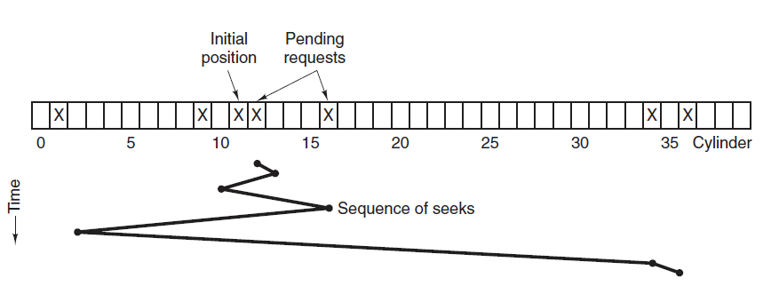
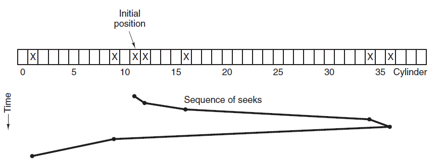

[TOC]

### 外设与IO

#### 磁盘调度算法

读写一个**磁盘块**的时间的影响因素有：

- **旋转时间**：主轴转动盘面，使得磁头移动到适当的扇区上。
- **寻道时间**：制动手臂移动，使得磁头移动到适当的磁道上。
- 实际的数据传输时间。

其中寻道时间最长，因此磁盘调度的**主要目标是使磁盘的平均寻道时间最短**。

##### 1.先来先服务算法

FCFS 算法(First Come First Served)，按照**磁盘请求的顺序**进行调度。优点是公平和简单。缺点也很明显，因为**未对寻道做任何优化**，使平均寻道时间可能较长。

##### 2.最短寻道时间优先算法

SSTF 算法(Shortest Seek Time First)，优先调度与**当前磁头所在磁道距离最近的磁道**。虽然平均寻道时间比较低，但是**不够公平**。如果新到达的磁道请求总是比一个在等待的磁道请求近，那么在等待的磁道请求会一直等待下去，也就是出现饥饿现象。具体来说，两端的磁道请求更容易出现饥饿现象。

##### 3.电梯(扫描)算法

SCAN 算法，**电梯总是保持一个方向运行**，直到该方向**没有请求为止**，然后**改变运行方向**。电梯算法（扫描算法）和电梯的运行过程类似，总是按一个方向来进行磁盘调度，直到该方向上没有未完成的磁盘请求，然后改变方向。因为考虑了移动方向，因此**所有的磁盘请求都会被满足**，解决了 SSTF 的饥饿问题。

