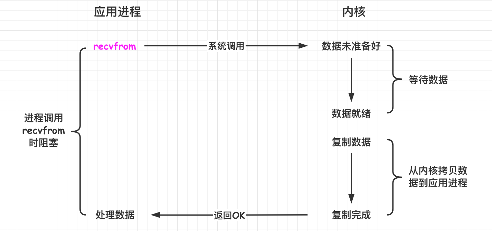
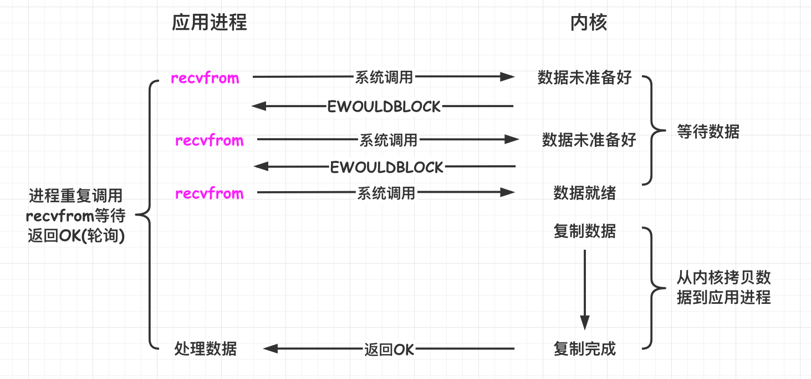
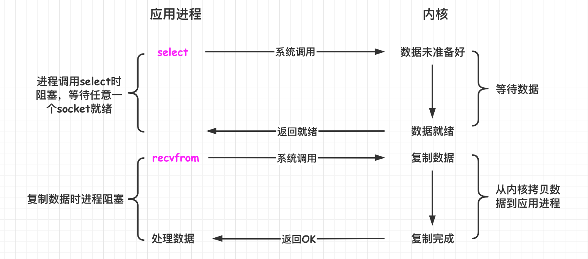
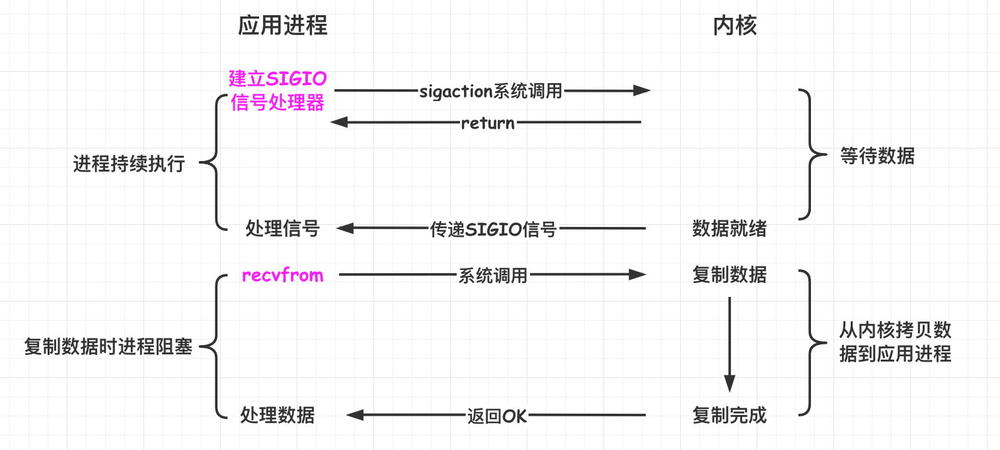
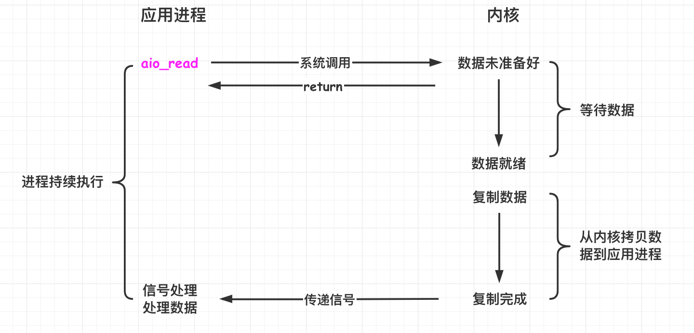
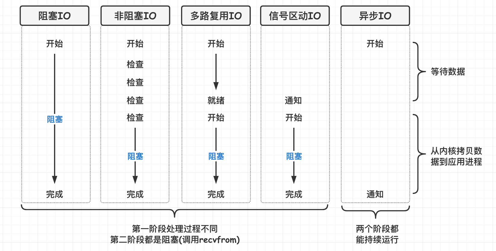

[TOC]

### IO模型

#### IO模型

通常用户进程中的一次**完整 IO 交互**流程分为**两个阶段**. 首先是经过**内核空间**, 由**操作系统**处理; 然后到**用户空间**, 由**应用进程**处理. 应用进程必须通过**系统调用**请求内核协助**完成 IO 操作**. 

对于一个**套接字**上的网络输入操作主要分为两个阶段: 

- **等待数据**: 等待网络数据到达**网卡**, 然后将**数据读取到内核缓冲区**. 
- **复制数据**: 从内核缓冲区**复制数据**, 拷贝到**用户空间的应用进程**中. 

Unix 有**五种** IO 模型: 

- **阻塞式 IO**
- **非阻塞式 IO**
- **IO 复用(select 和 poll)**
- **信号驱动式 IO(SIGIO)**
- **异步 IO(AIO)**

##### 1.阻塞式IO

**应用进程**被**阻塞**, 直到数据**从内核缓冲区复制**到应用**进程缓冲区中**才返回. 

在阻塞过程中, 其它应用进程依然可以执行, 因此阻塞不意味着整个操作系统都被阻塞. 因为其它应用进程还可以执行, 所以不消耗 CPU 时间, 这种模型的 CPU **利用效率**会比较高. 例如 **Java BIO**. 

下图中, **recvfrom()** 用于**接收 Socket** 传来的数据, 并复制到**应用进程的缓冲区 buf** 中. 这里可把 recvfrom() 当成系**统调用**. 除了异步 IO 之外的其他几个模型都需要调用 recvfrom() 来从操作系统内核复制数据, 调用它的时候就是**阻塞**的. 

```c
ssize_t recvfrom(int sockfd, void *buf, size_t len, int flags, struct sockaddr *src_addr, socklen_t *addrlen);
```



##### 2.非阻塞式IO

**应用进程**执行系统调用 **recvfrom()** 之后, 内核返回一个**错误码**. 应用进程**可以继续执行**, 但是需要**不断执行系统调用**来获知 IO 是否完成, 这种方式称为**轮询**(polling). 由于 CPU 要处理更多的**系统调用**, 因此这种模型的 CPU 利用率比较**低**. 



##### 3.多路复用IO

使用 **select() 或者 poll()** **等待**数据, 并且可以**等待多个套接字**中的任何一个变为**可读**, 这一过程会被**阻塞**. 当某一个套接字**可读时**返回, 之后再使用 **recvfrom()** 把数据从内核**复制**到进程中, 所以这里使用了**两个**系统调用. 

**多个进程的 IO** 可以注册到一个 **Selector** 上, Selector 会对所有 IO 进行监听. 它可以让**单个进程**具有处理**多个 IO ==事件==**的能力. 因此又被称为==**事件驱动 IO**==(Event Driven IO). 

如果一个 Web 服务器没有 IO 复用, 那么**每一个 Socket 连接**都需要创建一个**线程**去处理. 如果同时有**几万个**连接, 那么就需要创建相同数量的线程. 相比多进程和多线程技术, **IO 复用不需要进程线程创建和切换的开销**, 系统开销更小. 



IO 复用的**优势在于能够处理更多的连接**, 但是对单个连接的处理不一定比阻塞 IO 快. 对于**每一个 Socket**, 一般都是设置为**非阻塞**, 但是**整个用户进程其实是一直被阻塞**的, 只不过进程是**被 select 调用**阻塞, 而不是被 Socket IO 阻塞. 

典型应用有 **Java NIO, Nginx, Netty**. 

##### 4.信号驱动IO

应用进程使用 **sigaction()** 系统调用, 内核**立即**返回, 应用进程**可以继续执行**, 所以**等待数据**阶段应用进程是**非阻塞**的. 内核在数据**到达时**向应用进程发送 **SIGIO** 信号, 应用进程收到之后在信号处理程序中调用 **recvfrom()** 调用将数据从内核**复制**到应用进程中. 

相比于非阻塞式 IO 的轮询方式, 信号驱动 IO 的 CPU 利用率更高. 等待数据的时候不是阻塞的, 但是**拷贝**数据到应用进程的时候**依然是阻塞**的. 

其实**用的不太多**. 



##### 5.异步IO

应用进程执行 **aio_read()** 系统调用会**立即返回**, 应用进程可以**继续执行**, 不会被阻塞, 内核自己会等待数据到来并把数据复制到应用进程缓冲区之后之后向应用进程**发送信号**. 

异步 IO 与信号驱动 IO 的区别在于, **异步 IO** 的信号是通知应用进程 **IO 操作已经完成, 数据已经复制到了应用进程缓冲区**, 而**信号驱动** IO 的信号是通知应用进程**可以开始 IO**, 也就是通知应用进程**可以开始阻塞并拷贝数据**了, 数据得自己拷贝. 



异步 IO 模型真正实现了异步, 是五种 IO 模型中**唯一的异步模型**. 

**典型应用**: **Java7 AIO**, 高性能服务器应用. 

##### 6.五大IO模型比较

###### (1)同步与异步

**同步 IO **调用一旦开始, 调用者必须**等到方法调用返回后, 才能继续后续的行为**. 

**异步 IO** 调用更像一个**消息传递**, 一旦开始, 方法调用就会立即返回, 调用者可以继续后续的操作. 而异步方法通常会在另外一个线程中, "真实" 地执行着. 整个过程不会阻碍调用者的工作. 

###### (2)阻塞与非阻塞

阻塞调用是指调用结果返回之前, 当前线程会被**挂起**. 方法只有在得到结果之后才会返回. 非阻塞指在不能立刻得到结果之前, 该方法不会阻塞当前线程, 而会立刻返回. 

> **举个生活例子**

如果想吃一份宫保鸡丁盖饭: 

- **同步阻塞**: 到饭馆点餐, 然后在那等着, 还要一边喊: 好了没! (阻塞式IO)
- **同步非阻塞**: 在饭馆点完餐, 就去遛狗了. 不过每过十分钟就打电话问饭店: 好了没! (非阻塞式IO)
- **异步阻塞**: 遛狗的时候, 接到饭馆电话, 说饭做好了, 让您亲自去拿. (多路复用式IO)
- **异步非阻塞**: 饭馆打电话说, 我们知道您的位置, 一会给你送过来, 安心遛狗就可以了. 

**阻塞式 IO, 非阻塞式 IO, 多路复用 IO 和信号驱动 IO 都是==同步 IO==**, 它们的主要区别在**第一个阶段**, 因为**第二阶段**都是**==阻塞调用 recvfrom()== 将数据从内核复制到用户进程**. 

非阻塞式 IO, 信号驱动 IO 和异步 IO 在第一阶段不会阻塞. 



#### IO多路复用实现

**==select/poll/epoll==** 都是 **IO ==多路复用模型==**的具体**实现**, select 出现的最早, 之后是 poll, 再是 epoll. 

##### 1.select

```c
int select(int n, fd_set *readfds, fd_set *writefds, fd_set *exceptfds, struct timeval *timeout);
```

有**三种类型**的描述符类型: **readset, writeset, exceptset**, 分别对应读, 写, 异常条件的描述符集合. fd_set 使用**数组**实现, 数组大小使用 FD_SETSIZE 定义. **timeout** 为超时参数, 调用 select 会一直阻塞直到有描述符的事件到达或者等待的时间超过 timeout. 成功调用返回结果大于 0, 出错返回结果为 -1, 超时返回结果为 0. 

##### 2.poll

```c
int poll(struct pollfd *fds, unsigned int nfds, int timeout);
```

结构体 pollfd 使用**链表实现**. 

##### 3.select与poll比较

**(1)功能**

select 和 poll 的功能**基本相同**, 不过在一些实现细节上有所不同. 

- select 会**修改描述符**, 而 poll 不会; 
- **select** 的**描述符类型**使用**数组实现**, FD_SETSIZE 大小默认为 **1024**, 因此默认**只能监听 1024 个描述符**. 如果要监听更多描述符的话, 需要修改 FD_SETSIZE 之后**重新编译**; 而 **poll** 的**描述符类型**使用**链表实现**, 没有描述符数量的限制; 
- poll 提供了更多的**事件类型**, 并且对描述符的**重复利用**上比 select 高. 
- 如果一个线程对某个描述符调用了 select 或者 poll, 另一个线程关闭了该描述符, 会导致调用结果不确定. 

**(2)速度**

select 和 poll 速度**都比较慢**. 

- select 和 poll **每次调用**都需要将**全部描述符**从应用进程缓冲区复制到**内核**缓冲区. 
- select 和 poll 的返回结果中没有声明哪些描述符已经准备好, 所以如果返回值大于 0 时, 应用进程都需要使用**轮询**的方式来找到 IO 完成的描述符. 

**(3)可移植性**

几乎**所有的**系统都**支持 select**, 但是只有**比较新的**系统支持 **poll**. 

##### 4.epoll

```c
int epoll_create(int size);
int epoll_ctl(int epfd, int op, int fd, struct epoll_event *event); 
int epoll_wait(int epfd, struct epoll_event * events, int maxevents, int timeout);
```

**epoll_ctl**() 用于向内核注册**新的**描述符或者是改变某个文件描述符的**状态**. 已注册的**描述符**在内核中会被维护在一棵**红黑树**上, 通过**回调函数**内核会将 IO 准备好的**描述符**加入到一个**链表**中管理, 进程调用 epoll_wait() 便可以得到**事件完成**的描述符. **通过==红黑树和双向链表==数据结构, 并结合回调机制, 造就了 epoll 的高效**. 

**epoll 只需要将描述符从进程缓冲区向内核缓冲区==拷贝一次==**, 并且进程**不需要通过轮询**来获得事件**完成的描述符**. 

**epoll 仅适用于 ==Linux==. **epoll 比 select 和 poll 更加**灵活**而且**没有描述符数量限制**. 

epoll 对**多线程编程更有友好**, 一个线程调用了 epoll_wait() 另一个线程关闭了同一个描述符也**不会**产生像 select 和 poll 的不确定情况. 

##### 5.epoll工作模式

**epoll** 的描述符事件有**两种触发模式**: **LT**(level trigger) 和 **ET**(edge trigger). 

###### (1)水平触发模式

epoll_wait() 函数为 epoll 系列主要系统调用函数, 它在**一段超时时间内等待一组文件描述符上的事件**. 此函数成功返回时返回**就绪网络事件的个数**. 可以设置 "timout" 参数, 其单位是毫秒, 在这个时间内 epoll_wait() 系统调用将被阻塞. 

当 epoll_wait() 检测到**描述符事件到达**时, 将此**事件通知进程**, 进程可以**不立即**处理该事件, 下次调用 epoll_wait() 会再次通知进程. 是**默认**的一种模式, 并且同时支持 **Blocking** 和 **No-Blocking**. 

###### (2)边沿触发模式

和水平触发模式不同的是, 通知之后进程**必须立即处理事件**, 下次再调用 epoll_wait() 时**不会**再得到事件到达的通知. 这种模式很大程度上**减少了 epoll 事件被重复触发的次数**, 因此效率要比 LT 模式高. **只支持 No-Blocking**(可以理解为马上就需要处理所以是非阻塞), 以避免由于一个文件句柄的阻塞读/阻塞写操作把处理多个文件描述符的任务饿死. 

##### 6.应用场景

不要认为 select 和 poll 都已经过时只用 epoll 就可以, 它们都有各自的使用场景. 

###### (1)select应用场景

select 的 timeout 参数**精度为 1ns**, 而 poll 和 epoll 为 **1ms**, 因此 **select 更加适用于实时性要求比较高**的场景, 比如核反应堆的控制. 

**select 可移植性更好**, 几乎被**所有主流平台**所支持. 

###### (2)poll应用场景

poll **没有最大描述符数量的限制**, 如果**平台支持**并且对**实时性要求不高**, 应该使用 **poll** 而非 select. 

###### (3)epoll应用场景

只需要运行在 **Linux** 平台上, 有**大量的描述符**需要同时轮询, 并且这些连接最好是**长连接**. 需要同时监控**小于 1000** 个描述符, 就**没有必要**使用 epoll, 因为这个应用场景下并不能体现 epoll 的优势. 

需要监控的描述符状态**变化多**, 而且都是非常短暂的, 也**没有必要**使用 epoll. 因为 epoll 中的所有描述符都存储在内核中, 造成每次需要对描述符的状态改变都需要通过 epoll_ctl() 进行系统调用, 频繁系统调用降低效率. 并且 epoll 的描述符存储在内核, 不容易调试. 


#### 参考资料

- Stevens W R, Fenner B, Rudoff A M. UNIX network programming[M]. Addison-Wesley Professional, 2004.
- [Boost application performance using asynchronous I/O](https://www.ibm.com/developerworks/linux/library/l-async/)
- [Synchronous and Asynchronous I/O](https://msdn.microsoft.com/en-us/library/windows/desktop/aa365683(v=vs.85).aspx)
- [Linux IO 模式及 select、poll、epoll 详解](https://segmentfault.com/a/1190000003063859)
- [poll vs select vs event-based](https://daniel.haxx.se/docs/poll-vs-select.html)
- [select / poll / epoll: practical difference for system architects](http://www.ulduzsoft.com/2014/01/select-poll-epoll-practical-difference-for-system-architects/)
- [Browse the source code of userspace/glibc/sysdeps/unix/sysv/linux/ online](https://code.woboq.org/userspace/glibc/sysdeps/unix/sysv/linux/)


