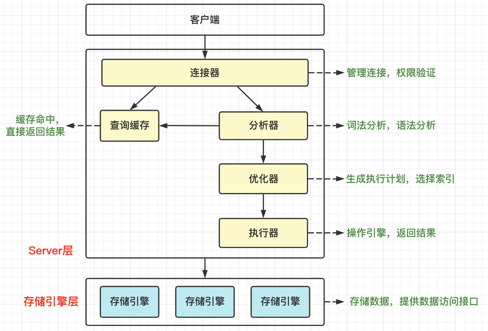
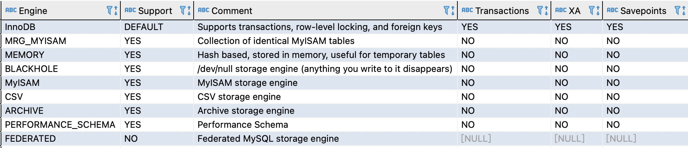

[TOC]

### MySQL系统原理

#### MySQL架构

下图是 MySQL 的简要架构图。整体主要分为 **Server 层和存储引擎层**。



##### 1.Server层

**Server 层**主要包括连接器、查询缓存、分析器、优化器、执行器等，所有**跨存储引擎**的功能都在这一层实现，比如存储过程、触发器、视图、内置函数等，还有一个通用的日志模块 binlog 日志模块。

总结一下：**连接器用于身份权限校验；分析器分析 SQL 语句要做什么；优化器分析采用何种方案去执行语句；执行器去执行语句**。

###### (1)连接器

**连接器用于身份认证和权限校验**。

连接器负责跟客户端建立连接、获取权限、维持和管理连接。连接后如果用户名密码认证通过，连接器会到权限表里面查出账户拥有的权限。后面这个连接里面的权限判断逻辑都将依赖于此时读到的权限。这意味着一个用户成功建立连接后，即使用管理员账号对这个用户的权限做了修改，也不会影响已经存在连接的权限。修改完成后，只有再新建连接才会使用新的权限设置。

客户端如果太长时间没动静，连接器会自动断开连接。这由参数 **wait_timeout** 控制，默认为 8 小时。建立连接的过程通常是比较复杂的，所以建议在使用中要尽量减少建立连接的动作，也就是尽量使用长连接。

###### (2)查询缓存

执行查询语句的时候，会先查询缓存。

之前执行过的语句及其结果可能会以 **key-value** 的形式被直接缓存在内存中。key 是查询的**语句**，value 是查询的结果。如果当前查询能够直接在这个缓存中找到 key，那么这个 value 就会被直接返回给客户端。

但是**查询缓存的失效非常频繁**，只要有对一个表的更新，这个表上**所有的查询缓存**都会被清空。

MySQL 8.0 版本已经**删除**了查询缓存模块。

###### (3)分析器

**分析器会分析 SQL 语句的语法并判断其要做什么**。

分析器会对 SQL 进行 "**词法分析**" 和 "**语法分析**"。词法分析就是识别出 SQL 字符串的含义；针对词法分析的结果，词法分析器会根据语法规则判断输入的 SQL 语句语法是否合法。如果输入的语句不对，就会抛出 "You have an error in your SQL syntax..." 错误。

###### (4)优化器

**优化器根据实际情况去判断并选择最优的方案去执行语句**。

这里最优只是优化器觉得最优的方案，实际执行时不一定是最优的。优化器可以在表里面有多个索引的时候，决定使用哪个索引；或者在一个语句有多表关联(JOIN) 的时候，决定各个表的连接顺序。比如：

```mysql
SELECT * FROM t1 JOIN t2 USING(ID) WHERE t1.c = 10 AND t2.d = 20;
```

- 可以先从表 t1 里面取出 c = 10 的记录的 ID 值，再根据 ID 值关联表 t2，再判断 t2 里面 d 的值是否等于 20。
- 可以先从表 t2 里面取出 d = 20 的记录的 ID 值，再根据 ID 值关联表 t1，再判断 t1 里面 c 的值是否等于 10。

这两种执行方法的逻辑结果是一样的，但是执行的效率会有不同，而优化器的作用就是决定选择使用哪种方案。

###### (5)执行器 

**执行器执行语句并从存储引擎返回数据**。

前面通过分析器知道 SQL 要做什么，通过优化器知道了该怎么做，于是就进入了执行器阶段，开始执行语句。

开始执行的时候，要先判断一下用户对数据表有没有执行查询权限，如果有权限则打开表继续执行。打开表的时候，执行器就会根据表的引擎定义，去使用这个引擎提供的接口。

比如查询：

```mysql
SELECT * FROM T WHERE id = 10;
```

这里 ID 字段没有索引，执行器的执行流程如下：

1. 调用 InnoDB 引擎接口取这个表的第一行，判断 ID 值是不是 10，如果不是则跳过，如果是则将这行存在结果集中；
2. 调用引擎接口取 "下一行"，重复相同的判断逻辑，直到取到这个表的最后一行。
3. 执行器将上述遍历过程中所有满足条件的行组成的记录集作为**结果集**返回给客户端。

数据库的慢查询日志中可以看到一个 **rows_examined** 的字段，表示这个语句**执行**过程中**扫描了多少行**。这个值就是在执行器每次调用引擎获取数据行的时候累加的。有些场景下，执行器调用一次，在引擎内部则扫描了多行，因此**引擎扫描行数跟 rows_examined 并不是完全相同的**。

##### 2.存储引擎层

**存储引擎层**主要负责**数据的存储和读取**，采用可以替换的插件式架构，支持 InnoDB、MyISAM、Memory 等多种存储引擎。**InnoDB** 是默认的存储引擎。

#### MySQL存储引擎

##### 1.概述

**存储引擎就是数据库用于数据存储、更新、查询等操作的不同实现方式**。MySQL 采用不同方式将数据存储在文件或内存中，这些技术使用不同的**存储机制、索引技巧、锁定水平**以提供不同的功能和能力。

查看 MySQL 提供的所有存储引擎。

```sql
SHOW ENGINES;
SHOW VARIABLES LIKE '%storage_engine%'; # 查看默认引擎
```

结果如下图所示：



MySQL5.5 之前的默认存储引擎是 **MyISAM**，MySQL5.5 之后的默认存储引擎是 **InnoDB**，在 5.7 版本中**只有 InnoDB 是事务**型存储引擎。

不同存储引擎有不同的功能特点及**适用场景**，不同需求可以选择不同的存储引擎。

##### 2.MyISAM

MyISAM 是 MySQL5.5 版本之前的默认存储引擎，**不支持事务**。

MyISAM 存储引擎下的表由 **.myd（数据）**和 **.myi（索引文件）组成**，.**frm 文件存储表结构**。

**不支持行级锁，只能对整张表加锁**，读取时会对需要读到的**所有表加共享锁**，写入时则对表加**排它锁**。但在表有读取操作的同时，也可以往表中插入新的记录，这被称为**并发插入**(CONCURRENT INSERT)。

如果指定了 **DELAY_KEY_WRITE** 选项，在每次**修改**执行完成时，**不会立即**将修改的索引数据写入磁盘，而是会写到内存中的**键缓冲区**，只有在清理键缓冲区或者关闭表的时候才会将对应的索引块写入磁盘。这种方式可以极大的提升写入性能，但是在数据库或者主机崩溃时会**造成索引损坏**，需要执行**修复操作**。可以手工或者自动执行检查和修复操作，但是和事务恢复以及崩溃恢复不同，可能导致一些**数据丢失**，而且修复操作是非常慢的。

**应用场景**：如果设计简单，数据以**紧密格式**存储。对于**只读数据**，或者**表比较小**、可以**容忍修复操作**，则依然可以使用它。

##### 3.InnoDB

InnoDB 是 MySQL5.5 及之后版本的**默认存储引擎**，是**事务型**存储引擎。

**事务**：实现了四个标准的隔离级别，默认级别是**可重复读(REPEATABLE READ)**。在**可重复读**隔离级别下，通过**多版本并发控制(MVCC) + 间隙锁**防止**幻读**。InnoDB 支持**行级锁与表级锁**。

**索引**：主索引是**聚簇索引**，在索引中保存了数据，从而避免直接读取磁盘，因此对查询性能有很大的提升。

它内部做了很多优化，包括从磁盘读取数据时采用的可预测性读、能够加快读操作并且自动创建的自适应哈希索引、能够加速插入操作的插入缓冲区等。

**应用场景**：可靠性要求较高或要求事务。只有在需要它**不支持**的特性时，才考虑使用其它存储引擎。**==能用就用==**。

> **MyISAM与InnoDB对比**

- **事务**：InnoDB 支持**事务**，可以使用 **Commit 和 Rollback** 语句；MyISAM 不支持事务。
- **锁的粒度**：MyISAM 只支持表锁，InnoDB 支持**表锁与行锁**。InnoDB 在应对高并发事务上使用 MVCC 比单纯的加锁更高效。
- **外键**：InnoDB 支持**外键**；MyISAM 不支持外键而。
- **备份**：InnoDB 支持**在线热备份**。
- **崩溃恢复**：MyISAM **崩溃**后发生损坏的概率比 InnoDB 高很多，且恢复的速度也更慢；InnoDB 崩溃之后恢复更加容易。
- **其它特性**：MyISAM 支持压缩表和空间数据索引。

《MySQL 高性能》：不要轻易相信 "MyISAM 比 InnoDB 快" 之类的经验之谈，这个结论往往不是绝对的。在很多已知场景中，InnoDB 的速度都能让 MyISAM 望尘莫及，尤其是用到了聚簇索引，或者需要访问的数据都可以放入内存的应用。所以**一般情况下选择 InnoDB 都是没有问题**的。如果并不在乎可扩展能力和并发能力，也不需要事务支持以及崩溃后的安全恢复问题，也可以选择 MyISAM。

> **如何选择存储引擎?**

**根据具体的应用场景选择：**综合考虑是否需要事务、是否可以热备份、崩溃恢复、存储引擎的特有特性等。注意不要混合使用存储引擎。一般**使用 InnoDB** 就行了。

##### 4.其他存储引擎

###### (1)CSV

**特性**：以 **CSV 格式**进行数据存储，所有列都不能为 NULL，不支持索引，可以对**数据文件直接编辑**(其他引擎是二进制存储，不可编辑)。

**对应文件系统存储特点**：数据以文本方式存储在文件中，**.csv** 文件存储表内容，**.csm** 文件存储表的元数据，如表状态和数据量，**.frm** 存储表的结构。

**引用场景**：作为数据交换的**中间表**。

###### (2)Archive

**特性**：以 zlib 对表数据进行压缩，磁盘 I/O 更少，数据存储在 ARZ 为后缀的文件中(表文件为 **a.arz，a.frm**)，只支持 INSERT 和 SELECT 操作(不可以 DELETE 和 UPDATE)，只允许在自增 ID 列上加索引。

**应用场景**：日志和数据采集类应用。

###### (3)Memory

**特性**：也称为 HEAP 存储引擎，所以数据保存在内存中(数据库重启后会导致数据丢失)，支持 HASH 索引(等值查找应选择 HASH)和 BTree 索引(范围查找应选择)，所有字段都为固定长度，Memory 存储使用表级锁。

**应用场景**：用于查找或是映射表，例如用于保存数据分析中产生的中间表，用于缓存周期性聚合数据的结果表等。Memory 数据易丢失，所以要求数据可再生。

#### SQL语句执行流程

SQL 语句一般可以分为**查询**与**更新**(增加，更新，删除)两类。

##### 1.查询语句

先分析下查询语句，语句如下：

```mysql
SELECT * FROM tb_student A WHERE A.age = '18' AND A.name = 'Jack';
```

参考 MySQL 架构分析下这个语句的执行流程：

- **查询权限**。先检查该语句是**否有权限**，如果没有则直接返回错误信息。
- **查询缓存**。如果有权限则以这条 SQL 语句为 key 在内存中查询是否有结果，如果有直接取缓存值，如果没有，执行下一步。MySQL8.0 之后就没有这个操作了。
- **词法分析与语法检查**。通过分析器进行词法分析并分析是否有语法错误，提取 SQL 语句的**关键元素**。比如提取上面这个语句是查询 SELECT，提取需要查询的表名为 tb_student，需要查询所有的列，查询条件是这个表的 id = '1'。然后判断这个 SQL 语句是否有语法错误，比如关键词是否正确等等，如果检查没问题就执行下一步。
- **优化器确定执行方案**。上述 SQL 语句可以有两种执行方案：(1) 先查询学生表中姓名为 "Jack" 的学生，然后判断是否年龄是 18。(2) 先找出学生中年龄 18 岁的学生，然后再查询姓名为 "Jack" 的学生。优化器会根据**自己的优化算法**进行选择执行效率最好的一个方案(优化器的决定有时候不一定最好)。确定执行计划后就准备开始执行。

##### 2.更新语句

接下来看看更新语句如何执行，SQL 语句如下：

```mysql
UPDATE tb_student A SET A.age = '19' WHERE A.name = 'Jack';
```

这条语句与之前查询的流程类似，只不过执行**更新需要进行日志记录**。这就引入了日志模块，MySQL 自带的日志模块是 **binlog(归档日志)**，所有的存储引擎都可以使用，**常用的 InnoDB 引擎**还自带了一个日志模块 **redo log(重做日志)**。

这里以 InnoDB 模式下来分析这个语句的执行流程，流程如下：

- 先**查询**到 Jack 这一条数据，如果**有缓存**也会用缓存值。
- 然后拿到查询的语句，把 age 改为 19，然后调用引擎 API 接口，写入这一行数据，InnoDB 引擎把**数据保存在内存中**，同时**记录 redo log**，此时 redo log **进入 prepare 状态**，然后告诉执行器，执行完成了随时可以**提交**。
- 执行器**收到通知后记录 binlog**，然后调用引擎接口，**提交 redo log 并且状态改为提交状态**，更新完成。

> **为什么要用两个日志模块，用一个日志模块不行吗?**

这是因为最开始 MySQL 默认存储引擎是 MyISAM，但 **redo log 是 InnoDB 引擎独有的**，这就导致会**没有 crash-safe 的能力**(crash-safe 的能力即使数据库发生**异常重启**，之前提交的记录都不会丢失)，**binlog 日志只能用来归档**。

并不是说只用一个日志模块不可以，**只是 InnoDB 引擎就是通过 redo log 来支持事务**。那么用两个日志模块，但是不要这么复杂行不行，为什么 redo log 要引入 prepare 预提交状态？这里用**反证法**来说明下为什么要这么做。

- **先写 redo log 直接提交，然后写 binlog**。假设写完 redo log 后机器挂了，binlog 日志没有被写入，那么机器重启后，这台机器会通过 redo log 恢复数据，但是这个时候 binlog 并没有记录该数据，后续进行机器备份的时候，就会丢失这一条数据，同时主从同步也会**丢失**这一条数据。
- **先写 binlog，然后写 redo log**。假设写完了 binlog，机器异常重启了，由于没有 redo log，本机是无法恢复这一条记录的，但是 binlog 又有记录，那么和上面同样的道理，就会**产生数据不一致**的情况。

如果**采用 redo log 两阶段提交**的方式就不一样了，**写完 binglog 后，然后再提交 redo log** 就会防止出现上述的问题，从而保证了数据一致性。

那么问题来了，有没有一个极端的情况呢？假设 redo log 处于预提交状态，binglog 也已经写完了，这个时候发生了异常重启会怎么样呢？ 这个就要依赖于 MySQL 的**处理机制**了，MySQL 的处理过程如下：

- **判断 redo log 是否完整，如果判断是完整的就立即提交。**
- **如果 redo log 只是预提交但不是 commit 状态，这个时候就会去判断 binlog 是否完整，如果完整就提交 redo log，不完整就回滚事务**。

这样就解决了**数据一致性**的问题。

#### 面试题

> **为什么不建议亿级大表使用InnoDB?**

百万数据 和亿级数据可能 B+tree 都需要三层 tree， 但因为百万千万数据的**索引空间少**，可以更多的放到**内存中**，速度也就相应快。  亿级表只能放很小的一部分，万一不中缓存，那么就要走更多的磁盘 IO。 说白了主要就是 **innodb_buffer_pool 缓存**不够。

参考：[为什么不建议innodb使用亿级大表 | 峰云就她了](http://xiaorui.cc/2016/12/08/%E4%B8%BA%E4%BB%80%E4%B9%88%E4%B8%8D%E5%BB%BA%E8%AE%AEinnodb%E4%BD%BF%E7%94%A8%E4%BA%BF%E7%BA%A7%E5%A4%A7%E8%A1%A8/)


#### 参考资料

- [MySQL-InnoDB-MVCC多版本并发控制](https://segmentfault.com/a/1190000012650596)
- [为什么不建议innodb使用亿级大表 | 峰云就她了](http://xiaorui.cc/2016/12/08/%E4%B8%BA%E4%BB%80%E4%B9%88%E4%B8%8D%E5%BB%BA%E8%AE%AEinnodb%E4%BD%BF%E7%94%A8%E4%BA%BF%E7%BA%A7%E5%A4%A7%E8%A1%A8/)


