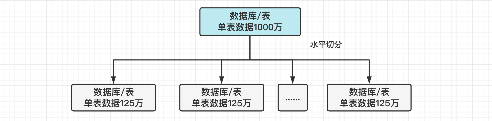

[TOC]

### MySQL优化

#### 查询性能优化

##### 1.优化数据访问

###### (1)减少请求数据量

- 只返回**必要的列**：最好**不要使用 SELECT *** 语句，而只查询需要的字段，使用覆盖索引。
- 只返回**必要的行**：使用 **LIMIT** 限制返回的数据量。可以自己封装一层默认加上 LIMIT 参数。
- **缓存**重复查询的数据：使用**缓存**可以避免在数据库中进行查询，缓存带来的查询性能提升将会是非常明显的。
- **禁止不带任何限制**数据范围条件的查询语句。比如：当用户在查询订单历史的时候，可以控制在一个月的范围内。

###### (2)减少服务器端扫描行数

最有效的方式是**使用索引来覆盖查询**。

##### 2.重构查询方式

###### (1)切分大查询

一个**大查询**如果**一次性执行**的话，可能一次**锁住**很多数据，导致占满整个事务日志、耗尽系统资源、阻塞很多小的但重要的查询。

```sql
DELETE FROM messages WHERE createTime < DATE_SUB(NOW(), INTERVAL 3 MONTH);
```

```sql
rows_affected = 0
do {
    rows_affected = do_query(
        "DELETE FROM messages WHERE create  < DATE_SUB(NOW(), INTERVAL 3 MONTH) LIMIT 10000")
} while rows_affected > 0
```

###### (2)分解联结查询

将一个**联结**查询分解成对每一个表进行**一次单表查询**，然后在**应用程序中进行关联**，这样做的好处有：

- 让缓存更高效。对于联结查询，如果其中一个表发生变化，那么整个查询缓存就无法使用。而分解后的多个查询，即使其中一个表发生变化，对其它表的查询缓存依然可以使用。
- **分解成多个单表查询**，这些单表查询的缓存结果更可能被其它查询使用到，从而减少冗余记录的查询。
- 减少锁竞争；
- 在**应用层进行联结**，可以更容易对数据库进行拆分，从而更容易做到高性能和可伸缩(阿里推荐)。

##### 3.索引优化

具体参考索引部分。

#### 大表优化

当 MySQL **单表记录数过大**时，数据库的性能会明显下降，一些常见的优化措施如下。

##### 1.读/写分离

经典的数据库拆分方案，主库负责写，从库负责读。

##### 2.分库分表

当数据量过大时，可以进行分库分表操作。分表可以进行水平切分与垂直切分。

#### 分库分表

##### 1.垂直切分

**根据数据表的相关性进行拆分**。

例如，用户表中既有用户登录信息又有用户基本信息，可以将用户表拆分成两个单独的表，甚至放到单独的库做分库。**简单来说垂直拆分是指数据表列的拆分，把一张列比较多的表拆分为多张表**。通常是按照列的**关系密集程度**进行切分，也可以利用垂直切分将**经常被使用的列**和不**经常被使用的列**切分到不同的表中。


如果一个表中某个字段的**内容长度过长**，通常需要单独切分出去，比如 TEXT 类型的字段，可以考虑单独切分。

- **垂直拆分的优点**：可以使得列数据变小，在查询时减少读取的 Block 数，减少 I/O 次数。垂直分区可以简化表的结构，易于维护。
- **垂直拆分的缺点**：**主键会出现冗余**，需要管理冗余列，可能引起 **JOIN 操作**，可以通过在**应用层进行 JOIN** 来解决。此外，垂直分区会让事务变得更加复杂。

##### 2.水平切分

水平切分(**Sharding**)指保持数据**表结构不变**，通过某种**策略存储数据分片**。

水平切分后每一片数据分散到不同的**数据表或库**中，达到分布式的目的。水平拆分可以支撑非常大的数据量，所有库表的数据加起来就是全部数据。水平拆分将数据均匀放更多的库里，用**多个库**来扛更高的并发，还有就是用多个库的存储容量来进行**扩容**。



当一个表的数据不断增多时，Sharding 是必然的选择，它可以将数据分布到**集群**的不同节点上，从而缓解**单个数据库**的压力。

数据量小的时候不用拆分，因为拆分会带来**逻辑、部署、运维的各种复杂度**，一般的数据表在优化得当的情况下支撑千万以下的数据量是没有太大问题的。

需要注意的一点是：分表仅仅是**解决了单一表数据过大**的问题，但由于表的数据还是在**同一台机器**上，这对于提升 MySQL 并发能力没有什么意义，所以**水平拆分通常也要分库**。

一个典型的分表逻辑，根据主键而分成 64 张表。

```
id / 10 % 64
```

以下是数据库分片的两种常见实现方案：

- **客户端代理：**分片逻辑在**应用端**，封装在 jar 包中，通过修改或者封装 JDBC 层来实现。如 **Sharding-JDBC** 、阿里的 **TDDL** 是两种比较常用的实现。
- **中间件代理:** 在应用和数据中间加了一个**代理层**，分片逻辑统一维护在**中间件服务**中。如 **Mycat** 、360 的 **Atlas**、网易的 **DDB** 等都是这种方案的实现。

##### 3.Sharding策略

水平切分可以有不同的策略。

- **哈希取模**：**hash(key) % N**。
- **范围**：可以是 **ID 范围**也可以是**时间范围**。
- **映射表**：使用**单独**的一个数据库来存储映射关系。
- **根据字段特点分**：比如主键是**身份证号**，就可以根据身份证号的特点来依据地域或者出生年月分。但需要考虑数据的分布情况。

需要注意的是有些策略很容易产生**热点问题**，导致大量的流量全部打到一个表上。

##### 4.Sharding的问题

###### (1)事务问题

使用**分布式事务**来解决，比如 **XA 接口**。

###### (2)联结

可以将原来的连接分解成**多个单表查询**，然后在**用户程序**中进行**联结**。

###### (3)ID唯一性

- 使用**全局唯一 ID(GUID)**。
- 为每个**分片指定一个 ID 范围。**
- **分布式 ID 生成器**(如 **Snowflake** 算法)。

##### 5.分布式ID

分成多个表之后，如果每个表都是从 1 开始自增就不对，需要一个**全局唯一的 id** 来支持。生成全局 ID 有下面这几种方式：

###### (1)UUID

UUID 是**无序**的，会导致 B+ 树索引在写的时候有过多的随机写操作，性能下降明显。此外 UUID 太长了、占用空间大。因此 UUID **不适合**作为主键。

###### (2)数据库自增ID

两个数据库分别**设置不同步长**，生成不重复 ID 的策略。虽然这样生成的 ID 有序，但是需要独立部署数据库实例，且难以进行水平扩展。

###### (3)Redis生成ID

性能比较好，灵活方便，不依赖于数据库。但是引入了新的组件造成系统更加复杂，可用性降低，编码更加复杂，增加了系统成本。

###### (4)Leaf

Leaf 是美团开源的分布式 ID 生成器，能保证全局唯一性、趋势递增、单调递增、信息安全，里面也提到了几种分布式方案的对比，但也需要依赖关系数据库、**Zookeeper** 等中间件。

参考美团技术团队的一篇文章：https://tech.meituan.com/2017/04/21/mt-leaf.html 。

###### (5)雪花算法

Github 地址：https://github.com/twitter-archive/snowflake。

Snowflake 算法是 Twitter 开源的**分布式 ID 生成算法**，它可支持一般每秒几万并发的场景。

雪花算法生成一个 **64 位的 long 型的 ID**，1 个 bit 是不用的，用其中 41 bits 作为**毫秒数**，用 10 bits 作为**工作机器 id**，12 bits 作为**序列号**。

* **1 bit**：**不用**。因为二进制里第一个 bit 为如果是 1，那么都是负数，但是生成的 id 都是正数，所以第一个 bit 统一为 0。
* **41 bits**：**表示的是时间戳**，单位是**毫秒**。41 bits 可以表示的数字多达 `2^41 - 1`，即可以标识 `2^41 - 1` 个毫秒值，换算成年就是表示 69 年的时间。
* **10 bits**：**记录工作机器 id**。代表的是这个服务最多可以部署在 2^10 台机器上，也就是 1024 台机器。但是 10 bits 里 5 个 bits 代表机房 id，5 个 bits 代表机器 id。意思就是最多代表 2^5 个机房(32 个机房)，每个机房里可以代表 2^5 个机器(32台机器)。
* **12 bits**：**这个是用来记录同一个毫秒内产生的不同 id**。12 bits 可以代表的最大正整数是 `2^12 - 1 = 4096`，也就是说可以用这个 12 bits 代表的数字来区分**同一个毫秒内**的 4096 个不同的 id。

``` 
0 | 0001100 10100010 10111110 10001001 01011100 00 | 10001 | 1 1001 | 0000 00000000
```

``` java
public class IdWorker {

    private long workerId;
    private long datacenterId;
    private long sequence;

    public IdWorker(long workerId, long datacenterId, long sequence) {
        // 这儿就检查了一下，要求就是传递进来的机房id和机器id不能超过32，不能小于0
        if (workerId > maxWorkerId || workerId < 0) {
            throw new IllegalArgumentException(
                String.format("worker Id can't be greater than %d or less than 0", maxWorkerId));
        }
        if (datacenterId > maxDatacenterId || datacenterId < 0) {
            throw new IllegalArgumentException(
                String.format("datacenter Id can't be greater than %d or less than 0", maxDatacenterId));
        }
        System.out.printf(
            "worker starting. timestamp left shift %d, datacenter id bits %d, worker id bits %d, sequence bits %d, workerid %d",
            timestampLeftShift, datacenterIdBits, workerIdBits, sequenceBits, workerId);

        this.workerId = workerId;
        this.datacenterId = datacenterId;
        this.sequence = sequence;
    }

    private long twepoch = 1288834974657L;

    private long workerIdBits = 5L;
    private long datacenterIdBits = 5L;

    // 这个是二进制运算，就是5bit最多只能有31个数字，也就是说机器id最多只能是32以内
    private long maxWorkerId = -1L ^ (-1L << workerIdBits);

    // 这个是一个意思，就是5bit最多只能有31个数字，机房id最多只能是32以内
    private long maxDatacenterId = -1L ^ (-1L << datacenterIdBits);
    private long sequenceBits = 12L;

    private long workerIdShift = sequenceBits;
    private long datacenterIdShift = sequenceBits + workerIdBits;
    private long timestampLeftShift = sequenceBits + workerIdBits + datacenterIdBits;
    private long sequenceMask = -1L ^ (-1L << sequenceBits);

    private long lastTimestamp = -1L;

    public long getWorkerId() {
        return workerId;
    }

    public long getDatacenterId() {
        return datacenterId;
    }

    public long getTimestamp() {
        return System.currentTimeMillis();
    }

    public synchronized long nextId() {
        // 获取当前时间戳，单位是毫秒
        long timestamp = timeGen();

        if (timestamp < lastTimestamp) {
            System.err.printf("clock is moving backwards.  Rejecting requests until %d.", lastTimestamp);
            throw new RuntimeException(String.format(
                "Clock moved backwards.  Refusing to generate id for %d milliseconds", lastTimestamp - timestamp));
        }

        if (lastTimestamp == timestamp) {
            // 这个意思是说一个毫秒内最多只能有4096个数字
            // 无论传递多少进来，这个位运算保证始终就是在4096这个范围内，避免自己传递的sequence超过了4096这个范围
            sequence = (sequence + 1) & sequenceMask;
            if (sequence == 0) {
                timestamp = tilNextMillis(lastTimestamp);
            }
        } else {
            sequence = 0;
        }

        // 记录一下最近一次生成id的时间戳，单位是毫秒
        lastTimestamp = timestamp;

        // 将时间戳左移，放到41bit位置；
        // 将机房id左移放到5bit位置；
        // 将序号放最后12bit；
        // 最后拼接起来成一个64bit的二进制数字，转换成10进制就是个long型
        return ((timestamp - twepoch) << timestampLeftShift) | (datacenterId << datacenterIdShift)
            | (workerId << workerIdShift) | sequence;
    }

    private long tilNextMillis(long lastTimestamp) {
        long timestamp = timeGen();
        while (timestamp <= lastTimestamp) {
            timestamp = timeGen();
        }
        return timestamp;
    }

    private long timeGen() {
        return System.currentTimeMillis();
    }

    // ---------------测试---------------
    public static void main(String[] args) {
        IdWorker worker = new IdWorker(1, 1, 1);
        for (int i = 0; i < 30; i++) {
            System.out.println(worker.nextId());
        }
    }

}
```

##### 6.分库分表中间件

比较常见的分库分表中间件有：Sharding-JDBC、Mycat、Cobar、TDDL、Atlas 等。

无论**分库还是分表**，一般的数据库中间件都是可以支持的。这些中间件可以做到在分库分表之后，**可以根据指定的某个字段值**，比如说 userId，**自动路由到对应的库与表上去**。

###### (1)Sharding-JDBC

属于 **client 层**方案，是 **ShardingSphere 的 client 层方案**，这种方案的**优点在于不用部署，运维成本低，不需要代理层的二次转发请求，性能很高**。但如果遇到升级时需要各个系统都重新升级版本再发布，各个系统都需要**耦合** Sharding-JDBC 的依赖。

###### (2)Mycat

基于 Cobar 改造的，属于 **Proxy 层**方案，支持的功能**非常完善**。这种 **Proxy 层**方案的**缺点在于需要部署**，自己运维一套中间件，运维成本高，但是**好处在于对于各个项目是透明的**，如果遇到升级之类的都是中间件的事。

###### (3)选型

建议**中小型公司选用 Sharding-JDBC**，client 层方案轻便，而且维护成本低，不需要额外增派人手，而且中小型公司系统复杂度会低一些，项目也没那么多。

**中大型公司可以选用 Mycat 这类 Proxy 层**方案，大公司可以有专门团队研究和维护 Mycat，大量项目直接透明使用即可。


#### 参考资料

- MySQL大表优化方案[https://segmentfault.com/a/1190000006158186]


