[TOC]

### 数据结构

#### 数组

##### 1.稀疏数组

需要记录二维数组的场景下，如果记录的**有效信息**较少可以考虑使用**稀疏数组**。比如记录一个**棋盘、地图**等，如下图的二维数组中很多值是**默认值 0**，浪费存储空间。


#### 线性表

**线性表**存储方式分为**顺序存储和链式存储**。顺序存储使用**数组**进行存储；链式存储使用**链表**进行存储。

##### 1.数组实现

元素在内存中顺序存储。插入、删除元素时需要额外移动元素，效率较低。查询效率高。

##### 2.单向链表

元素在内存中**不一定**连续存储。链表是以**结点**方式来存储数据，每个结点包含 **data 域, next 域**，用于指向下一个结点，遍历方向只能从头到尾。

##### 3.双向链表

双向链表可以**向前或者向后**查找。

#### 栈

栈是一种后进先出 (**LIFO**) 的数据结构。栈的操作端通常被称为**栈顶**，另一端被称为**栈底**。

栈的常见应用：十进制转 N 进制、行编辑器、校验括号是否匹配、中缀表达式转后缀表达式、表达式求值等。

> **数组实现**

使用可变大小数组实现栈，容量不够时可以自动**扩容**。使用数组实现栈则数组的第一个位置是**栈底**，数组**最后占用**的位置才指向**栈顶**，否则压栈会整体**移动**元素位置。


弹栈操作可以将所有的元素依次弹栈即可。可以看看 **ArrayDeque** 的源码。

> **链式实现**

需要使用链表的**头插法或尾插法**来实现。可以参考 **LinkedList** 的源码实现。


#### 队列

##### 1.概述

队列是一种先进先出 **(FIFO)** 的数据结构。添加元素在**后端**，出队列在**前端**。

双端队列。能在队列的**前端和后端**进行添加、删除与获取操作，行为上类似于**双端栈**。

优先级队列。根据**优先级**组织队列中的对象。对象优先级通过 **compareTo()** 方法确定。Java 实现类 **PriorityQueue**。重点是**堆**实现。

##### 2.Java队列接口

###### (1)Queue接口

```java
// 将元素插入队列
boolean add(E e);
// 将元素插入队列，与add相比，在容量受限时应该使用这个
boolean offer(E e);
// 将队首的元素删除，队列为空则抛出异常
E remove();
// 将队首的元素删除，队列为空则返回null
E poll();
// 获取队首元素，但不移除，队列为空则抛出异常
E element();
// 获取队首元素，但不移除，队列为空则返回null
E peek();
void clear();
int size();
```

入队、出队和取值两个一组，一个**抛出异常，一个返回 null**。

###### (2)Deque接口

继承 Queue 接口。两种方法**成对**，出现问题时一个抛**异常**一个返回 **NULL**。

| 操作类型 | 第一个元素(Deque实例的开头) | 最后一个元素(Deque实例的结尾) |
| :------: | :-------------------------: | :---------------------------: |
|   插入   | addFirst(e)  offerFirst(e)  |   addLast(e)  offerLast(e)    |
|   移除   | removeFirst()  pollFirst()  |   removeLast()  pollLast()    |
|   检索   |   getFirst()  peekFirst()   |     getLast()  peekLast()     |

#### 符号表

##### 1.概述

符号表是一种**存储键值对**的数据结构，其主要目的是将**一个键和一个值**联系起来。

符号表分为**有序和无序**两种，有序符号表主要指支持 min()、max() 等根据键的**大小关系**来实现的操作。有序符号表保证的是**键**的有序性，比较的是键。

符号表有**多种实现**方式，**树或者散列表**等都可以。

##### 2.实现

**符号表实现算法比较**

|            算法            | 插入 | 查找 | 是否有序 |
| :------------------------: | :--: | :--: | :------: |
|       **二叉查找树**       | logN | logN |    是    |
|       **2-3 查找树**       | logN | logN |    是    |
|   **拉链法**实现的散列表   | N/M  | N/M  |    否    |
| **线性探测法**实现的散列表 |  1   |  1   |    否    |

符号表的各种实现方式优缺点对比。

|      数据结构      |                        优点                        |                          缺点                          |
| :----------------: | :------------------------------------------------: | :----------------------------------------------------: |
|     **散列表**     |       能够快速的**查找和插入**常见类型的数据       | **无法进行有序性**相关的操作，链接与空节点需要额外空间 |
|   **二叉查找树**   |       实现简单，能够进行**有序性**的相关操作       |          没有性能上界的保证，链接需要额外空间          |
| **平衡二叉查找树** | 最优的**查找和插入**效率，能够进行有序性相关的操作 |                   链接需要额外的空间                   |

**无序**时应当优先考虑**散列表**，当需要**有序**性操作时使用**红黑树**。

##### 3.Java符号表实现

- java.util.HashMap：基于**拉链法的散列表。**
- java.util.TreeMap：基于**红黑树**。

#### 散列表

散列表是根据**键值(Key value)** 直接进行访问的数据结构，它通过把**键值映射到表中一个位置**来访问记录，以加快查找的速度。散列表通过**散列函数**将键映射到对应的位置。

##### 1.散列函数

###### (1)定义

散列表中每个**键**被映射到从 **0 到 TableSize - 1** 这个范围的某个数，并被放到合适的单元中，这个映射关系就是**==散列函数==**。对于一个大小为 **M** 的散列表，散列函数能够把任意键转换为 **[0, M - 1]** 内的正整数，该正整数即为 **hash** 值。

散列函数对键进行映射时通常应该满足以下**三个特性**：

- **一致性**：相等的键应当有相等的 hash 值，两个键相等表示调用 equals() 返回的值相等。
- **高效性**：计算应当简便高效，有必要的话可以把 hash 值缓存起来，在调用 hash 函数时直接返回。
- **均匀性**：所有键的 hash 值应当均匀地分布到 [0, M-1] 之间，不均匀可能产生很多冲突，从而导致散列表性能下降。

###### (2)常见散列函数

**除留余数法(取模)**可以将整数散列到 [0, M-1] 之间，例如一个正整数 k，计算 k % M 既可得到一个 [0, M-1] 之间的 hash 值。注意 **M 最好是一个素数**，否则无法利用键包含的所有信息。例如 M 为 10<sup>k</sup>，那么只能利用键的后 k 位。

对于其它数值形式的键，可以将其**转换成整数**的形式，然后利用除留余数法。例如对于**浮点数**，可以将其的**二进制形式**转换成整数。

对于**多部分组合**的类型，每个部分都需要计算 hash 值，这些 hash 值都具有同等重要的地位。为了达到这个目的，可以将该类型看成 R 进制的整数，每个部分都具有不同的**权值**。

例如，字符串的散列函数实现如下：

```java
int hash = 0;
for (int i = 0; i < s.length(); i++)
    hash = (R * hash + s.charAt(i)) % M;
```

再如拥有**多个成员**的自定义类的哈希函数如下：

```java
int hash = (((day * R + month) % M) * R + year) % M;
```

R 通常取 **31**。

Java 中的 **hashCode**() 实现了哈希函数，但是默认使用对象的**内存地址值**。在使用 hashCode() 时，应当结合除留余数法来使用。因为**内存地址是 32 位整数**，计算时只需要 **31 位**的非负整数，因此应当屏蔽符号位之后再使用除留余数法。

```java
int hash = (x.hashCode() & 0x7fffffff) % M;
```

使用 Java 的 HashMap 等自带的哈希表实现时，只需要去实现 **Key 类型**的 hashCode() 函数即可。Java 规定 hashCode() 能够将键均匀分布于所有的 32 位整数，Java 中的 String、Integer 等对象的 hashCode() 都能实现这一点。以下展示了**自定义类型**如何覆写 hashCode()：

```java
public class Transaction {

    private final String who;
    private final Date when;
    private final double amount;

    public Transaction(String who, Date when, double amount) {
        this.who = who;
        this.when = when;
        this.amount = amount;
    }

    // 覆写散列函数
    @Override
    public int hashCode() {
        int hash = 17;
        int R = 31;
        hash = R * hash + who.hashCode();
        hash = R * hash + when.hashCode();
        hash = R * hash + ((Double) amount).hashCode();
        return hash;
    }
}
```

##### 2.散列冲突

当两个**不同**的键散列到**同一个值**的时候 (hash 值相同)，就产生了散列冲突。解决散列冲突的简单方法有：**拉链法和开放定址法**。

######  (1)拉链法

拉链法使用**数组 + 链表**来存储 hash 值相同的键，从而解决冲突(比如 **HashMap** 类)。

**查找**需要分两步，首先查找 Key 所在的**链表** (对应的数据槽)，然后在链表中**顺序查找**。

对于 N 个键，M 条链表 (N > M)，如果哈希函数能够满足均匀性的条件，每条链表的**长度趋向于 N/M**，因此未命中的查找和插入操作所需要的比较次数为 \~N/M。


这个详细可看 **HashMap** 的源码。

###### (2)开放地址法

**线性探测法**使用**空位**来解决冲突，当冲突发生时，**向前探测一个空位**来存储冲突的键。

更常见的是，单元 h0(x), h1(x), ....  相继被试选，其中

***h i (x) = (hash(x) + f i (x) ) mod TableSize, 且 f(0) = 0\*。**

**函数 f  是解决冲突解决方法(冲突函数)**。此方法中**所有的数据都需要放入表**内，所以**需要的表比拉链法散列需要的表更大**。这样的表叫做**探测散列表**。

使用线性探测法，数组的大小 M 应当**大于键的个数 N**(M > N)。

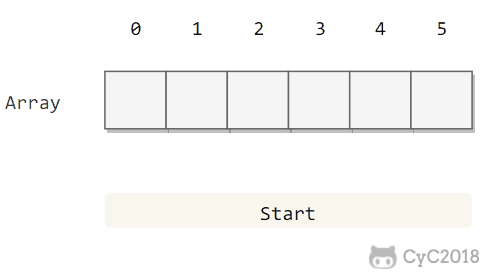

现考察三种具体的冲突解决方案。**线性探测法、平方探测法、双散列法**。

> **线性探测法**

线性探测法中典型的情形是**冲突函数 f 为一次函数**：

```
f(i) = i
```

这相当于相继**逐个探测单元**(必要时可以回绕)以查找出一个**空**单元。

存在的**问题**：有时候占据的单元会形成一些**区块**，其结果成为**一次聚集**，就是说散列到**区块**中的任何关键字都需要**多次尝试**才能解决冲突。

线性探测法的成本取决于连续条目的长度，连续条目也叫**聚簇**。当聚簇很长时，在查找和插入时也需要进行**很多次探测**。**装填因子**的选取很重要。

**α = N/M**，把 α 称为**使用率**。理论证明，当 α 小于 1/2 时探测的预计次数只在 1.5 到 2.5 之间。为了保证散列表的性能，应当调整数组的大小，使得 **α 在 [1/4, 1/2]** 之间。

> **平方探测法**

平方探测就是**冲突函数为二次**的探测方法，它是**消除**线性探测中**一次聚集**问题的散列冲突解决方法。

典型的情形是：

```
f(i) = i * i
```

**定理**：如果使用**平方探测**，且表的大小是**素数**，那么当表至少有**一半是空**的时候，**总能够**插入一个新的元素。即使表被填充的位置仅仅比**一半多一个**，那么插入都**可能失败**。

但平方探测也可能产生**二次聚集**问题。

> **双散列法**

双散列法冲突函数一般的选择是：

```
f(i) = i * hash2(x)
```

这个公式是说将第二个散列函数应用到 x 并在距离 **hash2(x)**,  **2 hash2(x)....** 等处进行探测。

##### 3.再散列

如果散列表装的太满，那么再插入新元素的时候可能消耗时间很长，而且可能失败。解决方法是**新建**一个大约 2 倍大的表，然后扫描整个原始散列表，**重新计算元素的新散列值**并装入到新的散列表中，这个操作就是**再散列**。类似 HashMap 的扩容操作。

再散列显然开销较大。

**再散列策略**：

- 散列表到一半满就再散列。
- 当插入元素失败才再散列(比较极端)。
- **途中策略**：当散列表达到一个**装填因子**时进行再散列 (较好)。

#### 二叉堆

##### 1.数据结构与实现

###### (1)存储特点

堆形式上是**==一颗完全二叉树==**，堆的**根结点**是堆有序的二叉树中的**最大或最小**结点 (大顶堆或小顶堆)。**堆中**某个节点的值总是**大于等于**其子节点的值。

由于堆是完全二叉树，因此可以方便的存储到==**数组**==中。为便于清晰地描述节点的**位置关系**，这里**不使用数组索引为 0** 的位置。位置 **k** 的节点的父节点位置为 **k / 2**，而它的两个子节点的位置分别为 **2k 和 2k+1**。

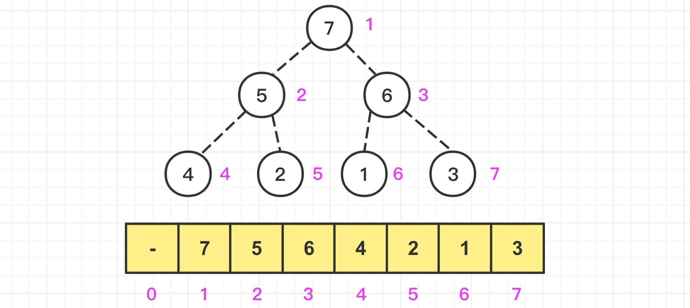

如果 0 不空出来只需要在计算的时候把 i 值往右偏移一个位置就行了。

|     结点     |     位置     |     结点     |     位置      |
| :----------: | :----------: | :----------: | :-----------: |
| **当前结点** |   **a[i]**   | **左子结点** |   **a[2i]**   |
|  **父结点**  | **a[i / 2]** | **右子结点** | **a[2i + 1]** |

注意父节点位置这里是**整数除**，**2 和 3 除以 2 都为 1**。

###### (2)插入元素

当**插入**一个元素到堆中时，它可能**不满足堆**的性质，在这种情况下需要**调整堆中元素的位置使之重新变成堆**，这个过程称为**堆化** (heapify)。在最大堆中，要堆化一个元素，需要**找到它的父亲结点**，如果不满足堆的基本性质则**交换两个元素的位置**，重复该过程直到每个结点都满足堆的性质为止。

实现方式就是将**新元素**放到**==数组末尾==**，然后**==上浮==**到合适的位置。在堆的**==下一个可用位置(也就是存放元素数组的下一个位置)创建一个空穴==**，否则该堆将不是完全树。将**待插入的元素**与**空穴的父结点**进行比较，如果比父节点小就交换空穴与父节点位置，空穴**==上浮==**，循环此过程。

如下面在大顶堆中插入一个新元素 **26**：在二叉堆的下一个可用位置放置一个**空穴**，该空穴值假定为 26，但是**不赋值**，可以**==减少比较与交换操作==**。

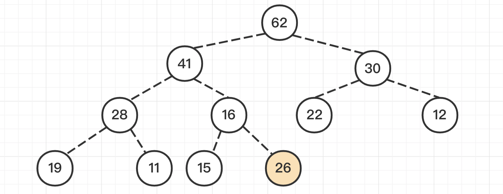

通过二叉堆的**索引**公式可以找到新插入元素的**父亲结点**，然后**比较两者大小**，如果新元素更大则交换两个元素的位置，这个操作就相当于把该元素**==上浮==**了一下。如下图中 26 与 16 交换位， 26 上浮。

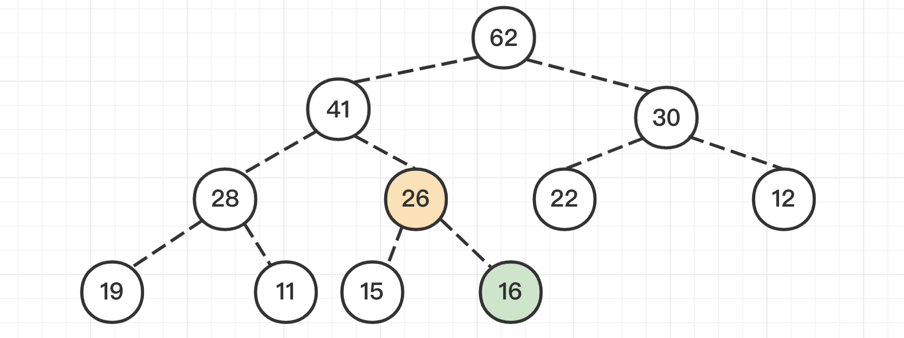

重复该操作直到 26 到了一个**满足堆条件的位置**，此时就完成了插入的操作，下图插入 26 完成。

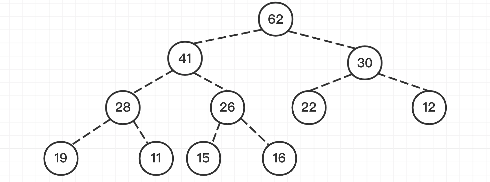

###### (3)删除堆顶元素

删除堆中的**堆顶元素**就是用**最后一个元素替换掉栈顶元素**，然后把替换后的最后一个元素删除掉，这样一来元素的总个数也满足条件，然后只需要把**栈顶元素依次往下调整**就好了，这个操作就叫做 **下沉(sink)**。即从数组**顶端删除最大**的元素，并将数组的**最后一个元素放到顶端**，并让这个元素**==下沉到合适==**的位置。

具体方法是将**堆顶元素置换为空穴**，然后将空穴的**两个子结点中较小者**与其交换位置，直到下沉到对应位置。但是可能遇到**只有一个子结点**的情况，此时一种解决方法是始终保证算法把每一个结点都**看成有两个子结点**。为了实施这种解法，当堆的大小为偶数时在每个**下沉开始处**，可将其值**大于堆中任何元素的标记**放到堆的**终端后面**的位置上。也就是假想有一个大于或者小于任何元素的结点此时正在堆的**最后一个位置**上。

例如删除大顶堆堆顶元素 62。用数组最后的一个元素**==替换==**掉堆顶元素，然后删除替换后的最后一个元素并返回堆顶元素 62：

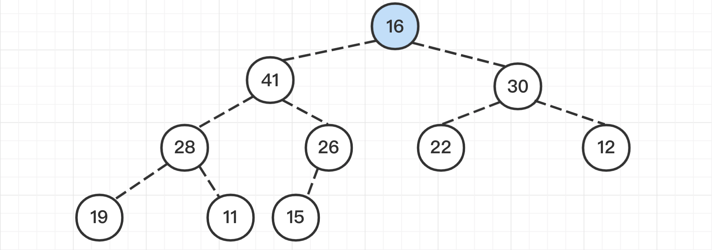

然后比较其孩子结点的大小：

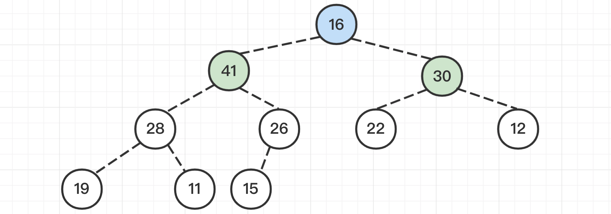

如果**不满足堆**的条件，那么就跟**孩子结点中较大**的一个交换位置：41 ＞ 30，所以16 与 41 **交换**位置。

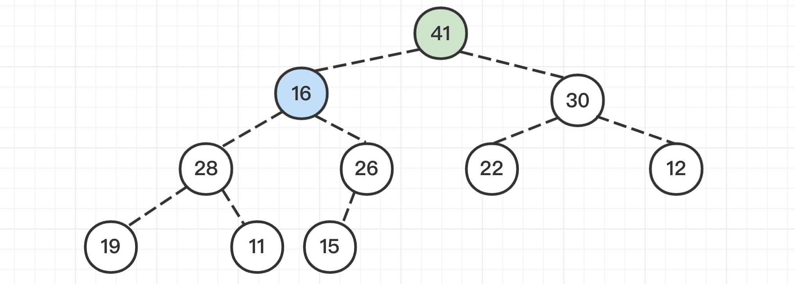

重复该步骤，直到 16 到达合适的位置：

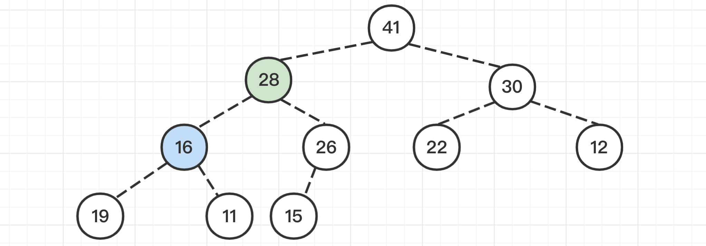

完成取出堆顶元素的操作：

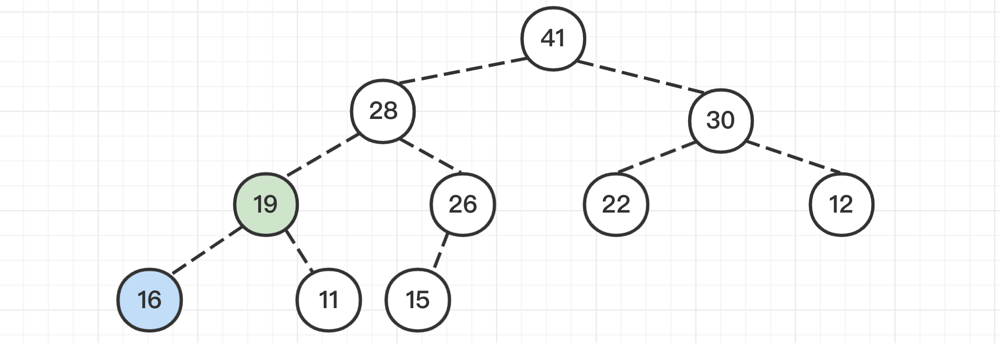

###### (4)数组构造堆

使用无序的数组构造堆时，就是**不断对每个元素**进行**下沉**操作。

##### 2.优先级队列

Java 中的 PriorityQueue 类可以实现优先级队列，默认为**最小堆**，与上述相比有一些函数名不一样，底层还是维护了一个 **Object 类型的数组**，另外如果想要把最小堆变成**最大堆**可以给 PriorityQueue 传入自己的**比较器**，例如：

```java
// 默认为最小堆
PriorityQueue<Integer> pq = new PriorityQueue<>();

// 使用Lambda表达式传入比较器转换成最大堆
PriorityQueue<Integer> pq2 = new PriorityQueue<>((a, b) -> b - a);
```

> **优先级队列的应用**

应用有很多：

- 数据压缩：赫夫曼编码算法；
- 最短路径算法：Dijkstra 算法；
- 最小生成树算法：Prim 算法；
- 动态数据排序：动态数据查找第 K 大元素、前 K 个元素、中位数值(可以同时维护一个大顶堆和一个小顶堆，用于找无界数据流的中值)；

#### 布隆过滤器

##### 1.概述

布隆过滤器(Bloom Filter)可以把它看作由**二进制向量(或者说位数组)和一系列随机映射函数(哈希函数)两部分组成的数据结构**，它可以用于检查元素是否在给定大集合中。

其优点是占用空间少且性能高；缺点是具有一定的错误识别率和数据删除难度较大。

##### 2.布隆过滤器原理

布隆过滤器一般采用**位数组**存储数据。


**位数组**中的每个元素都只**占用 1 bit** ，并且每个元素**只能是 0 或者 1**。这样一个 100 万个元素的位数组只占用  1000000Bit / 8 = 125000 Byte = 125000/1024 kb ≈ **122kb** 的空间。

**一个元素加入布隆过滤器：**

1. 使用布隆过滤器中的**哈希函数**对元素值进行计算，得到**哈希值**(有**几个哈希函数得到几个哈希值**)，一般都有多个哈希函数。
2. 根据得到的哈希值，在位**数组中把对应下标的位值置为 1**。

**判断一个元素是否存在于布隆过滤器：**

1. 对给定元素再次使用上述的**多个哈希函数**进行**相同的哈希计算**；
2. 得到值之后判断位数组中的**==每个位==对应的元素是否都为 1**，如果**存在一个值不为 1**，说明该元素**肯定不在**布隆过滤器中。如果全部为 1，大概率认为是命中的，当然这里也存在一定的**误判几率**。

举个例子：

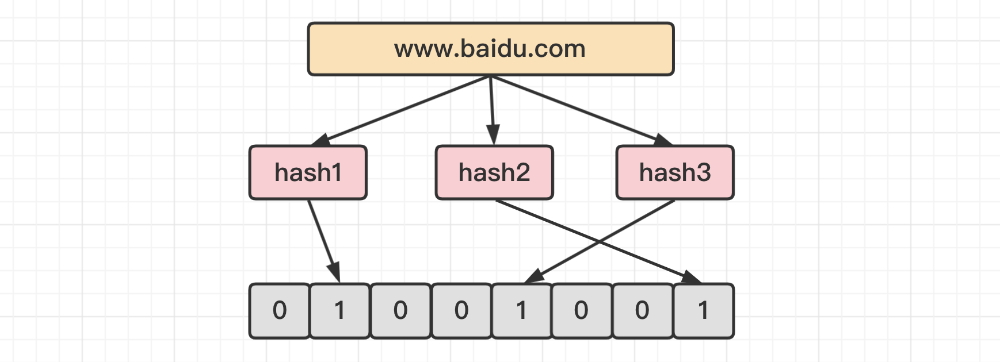

如图所示，当字符串存储要加入到布隆过滤器中时，该字符串首先由**多个哈希函数生成不同的哈希值**，然后把位数组对应位置的元素设置**为 1**。

**不同的字符串可能哈希出来的位置相同，这种情况可以适当增加位数组大小或者调整哈希函数**。

综上：**布隆过滤器可能误判某元素存在，但不会误判某元素不存在**。

##### 3.布隆过滤器使用场景

1. **大数据判断是否存在**。比如判断一个数字是否在于包含大量数据的集合中。
2. **数据过滤与去重**。比如爬给定网址的时候对已经爬取过的 URL 去重，或垃圾邮箱的过滤。
3. **解决缓存穿透**。如果一直请求一定不在缓存中的数据，缓存找不到数据就会达到数据库，造成缓存穿透。布隆过滤器也可以用来解决此类问题。
4. 黑名单功能。

##### 4.实现布隆过滤器

###### (1)Java实现

这里使用 Java 工具类：**BitSet** 类。

```java
public class SimpleBloomFilter {

    // 位数组的大小
    private static final int DEFAULT_SIZE = 2 << 24;

    // 通过这个数组可以创建6个不同的哈希函数
    private static final int[] SEEDS = new int[]{3, 13, 46, 71, 91, 134};

    // 位数组。数组中的元素只能是 0 或者 1
    private BitSet bits = new BitSet(DEFAULT_SIZE);

    // 存放包含hash函数的类的数组
    private SimpleHash[] hashFuncs = new SimpleHash[SEEDS.length];

    // 初始化多个包含hash函数的类的数组，每个类中的hash函数都不一样
    public MyBloomFilter() {
        // 初始化多个不同的 Hash 函数
        for (int i = 0; i < SEEDS.length; i++) {
            hashFuncs[i] = new SimpleHash(DEFAULT_SIZE, SEEDS[i]);
        }
    }

    // 添加元素到位数组
    public void add(Object value) {
        for (SimpleHash func : hashFuncs) {
            bits.set(func.hash(value), true);
        }
    }

    // 判断指定元素是否存在于位数组
    public boolean contains(Object value) {
        boolean contains = true;
        for (SimpleHash f : hashFuncs) {
            contains = contains && bits.get(f.hash(value));
        }
        return contains;
    }

    // 静态内部类。用于hash操作
    public static class SimpleHash {

        private int cap;
        private int seed;

        public SimpleHash(int cap, int seed) {
            this.cap = cap;
            this.seed = seed;
        }

        // 计算hash值
        public int hash(Object value) {
            int h;
            return (value == null) ? 0 : Math.abs(seed * (cap - 1) & ((h = value.hashCode()) ^ (h >>> 16)));
        }
    }
}
```

测试：

```java
String value1 = "https://www.baidu.cn/";
String value2 = "https://www.sina.com";
SimpleBloomFilter filter = new SimpleBloomFilter();
System.out.println(filter.contains(value1));   // false
System.out.println(filter.contains(value2));   // false
filter.add(value1);
filter.add(value2);
System.out.println(filter.contains(value1));   // true
System.out.println(filter.contains(value2));   // true
```

###### (2)基于Guava实现

**Guava** 中布隆过滤器在实际项目中可以直接用。

例子：创建一个最多存放**最多 1500 个整数**的布隆过滤器，并且设置可以**容忍误判的概率为百分之(0.01)**。

```java
// 创建布隆过滤器对象
BloomFilter<Integer> filter = BloomFilter.create(
    Funnels.integerFunnel(),
    1500,
    0.01);
// 判断指定元素是否存在
System.out.println(filter.mightContain(1));
System.out.println(filter.mightContain(2));
// 将元素添加进布隆过滤器
filter.put(1);
filter.put(2);
System.out.println(filter.mightContain(1));
System.out.println(filter.mightContain(2));
```

当 **mightContain**() 方法返回 true 时，该元素有 **99％** 的概率在过滤器中，当过滤器返回 false 时，可以**100％** 确定该元素**不存在**于过滤器中。

Guava 布隆过滤器的一个重大缺点就是**只能单机使用**(另外容量扩展也不容易)，而现在互联网一般都是**分布式**场景。为了解决这个问题，可以使用 Redis 中的布隆过滤器。

###### (3)Redis布隆过滤器

Redis 中的布隆过滤器有两个基本指令，**bf.add** 添加元素，**bf.exists** 查询元素是否存在，它的用法和 **set** 集合的 sadd 和 sismember 差不多。

注意 **bf.add** 只能一次添加一个元素，如果想要一次添加多个，就需要用到 **bf.madd** 指令。同样如果需要一次查询多个元素是否存在，就需要用到 **bf.mexists** 指令。

```bash
127.0.0.1:6379> bf.add codehole user1
(integer) 1
127.0.0.1:6379> bf.add codehole user2
(integer) 1
127.0.0.1:6379> bf.exists codehole user1
(integer) 1
127.0.0.1:6379> bf.exists codehole user2
(integer) 1
127.0.0.1:6379> bf.exists codehole user3
(integer) 0
127.0.0.1:6379> bf.madd codehole user4 user5
1) (integer) 1
2) (integer) 1
127.0.0.1:6379> bf.mexists codehole user4 user5 user6
1) (integer) 1
2) (integer) 1
3) (integer) 0
```

上面的布隆过过滤器是**默认参数**的布隆过滤器，它在第一次 add 的时候**自动创建**。Redis 也提供了可以自定义参数的布隆过滤器，只需要在 add 之前使用 **bf.reserve 指令显式创建**即可。

bf.reserve 有三个参数，分别是 **key、error_rate (错误率) 和 initial_size**：

- **error_rate 越低，需要的空间越大**。对于不需要过于精确的场合，设置稍大一些也没有关系，比如推送系统，只会让一小部分的内容被过滤掉，整体的观看体验还是不会受到很大影响的；
- **initial_size 表示预计放入的元素数量**。当实际数量超过这个值时，误判率就会提升，所以需要提前设置一个较大的数值避免超出导致误判率升高；

如果不使用 bf.reserve，默认的 error_rate 是 0.01，initial_size 是 100。

#### 跳表SkipList

##### 1.基本原理

**跳表**是一种**升维优化**的思想，采用了**空间换时间**的做法来提升速度，具体是通过添加**多级索引**实现。

先来看一个普通的链表结构：

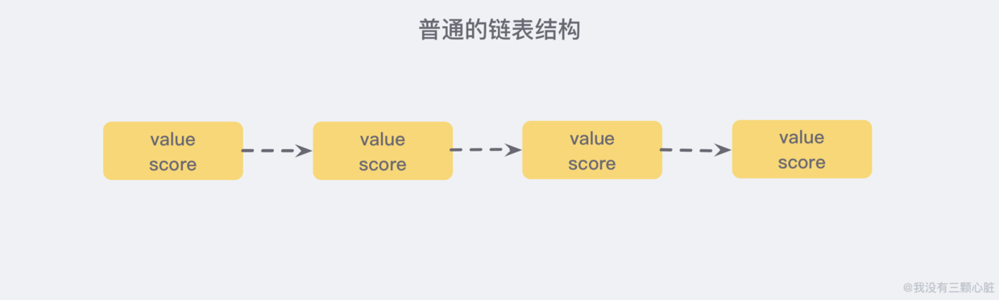

如果需要这个链表按照 score 值进行排序，当需要添加新的元素时需要**遍历定位到插入点**，这样才能保证链表有序，而**不能用高效的二分法**。

如果每相邻两个节点之间就增加一个指针，让指针指向下一个节点，如下图：

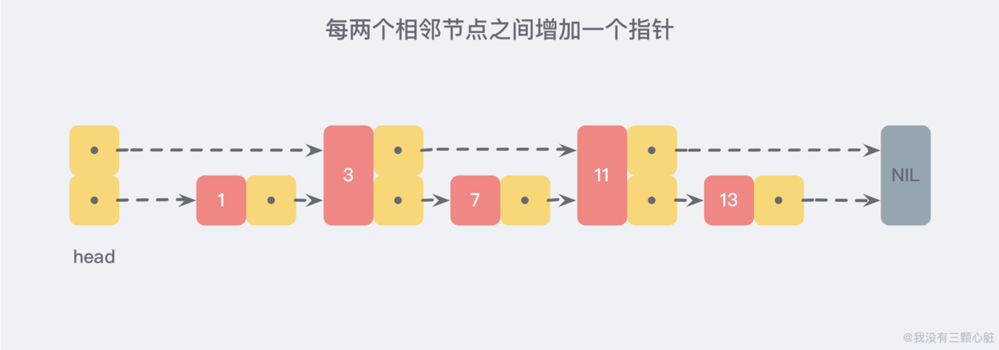

这样所有新增的指针连成了一个**新的链表**，但它包含的数据却只有原来的**一半** (图中的为 3，11)。

现在查找数据时可以根据这条新的链表查找，如果碰到比待查找数据大的节点时，再**回到原来的链表**中查找。比如查找 7，查找的路径则是沿着下图中标注出的红色指针所指向的方向进行的。

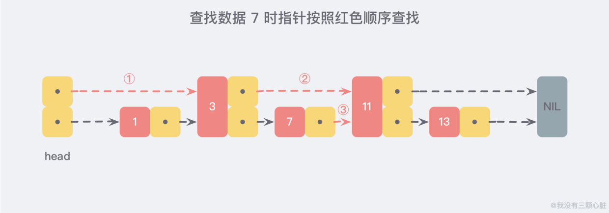

通过新增加的指针查找，不再需要与链表上的每一个节点逐一进行比较，这样改进之后需要比较的节点数大概只有原来的一半。利用同样的方式可以在新产生的链表上，继续为每两个相邻的节点增加一个指针，从而产生**第三层链表**：

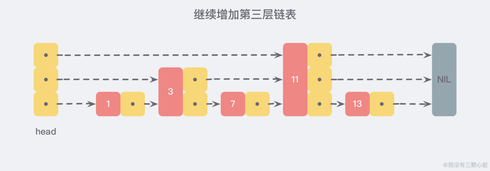

在这个新的三层链表结构中**查找 13**，那么沿着最上层链表首先比较的是 11，发现 11 比 13 小，于是就知道只需要到 11 后面继续查找，**从而一下跳过了 11 前面的所有节点**。

当**链表足够长**，这样的多层链表结构可以**跳过很多下层节点**，从而加快查找的效率。

**跳跃表 skiplist** 就是受到这种多层链表结构的启发而设计出来的。按照上面生成链表的方式，上面每一层链表的节点个数，是下面一层的节点个数的**一半**，这样查找过程就非常类似于一个**二分查找**，使得查找的时间复杂度可以降低到 **O(logn)**。

但是这种方法在**插入数据**的时候有很大的问题。新插入一个节点之后，就会**打乱上下相邻两层链表**上节点个数严格的 2:1 的对应关系。如果要**维持这种对应关系**，就必须把新插入的节点后面的**所有节点 (也包括新插入的节点) 重新进行调整**，这会让时间复杂度重新退化成 O(N)。**删除数据**也有同样的问题。

**skiplist** 为了避免这一问题，它**不要求**上下相邻两层链表之间的节点**个数有严格的对应关系**，而是**为每个节点随机出一个层数(level)**。比如一个节点随机出的层数是 3，那么就把它链入到第 1 层到第 3 层这三层链表中。为了表达清楚，下图展示了如何通过一步步的插入操作从而形成一个 skiplist 的过程：

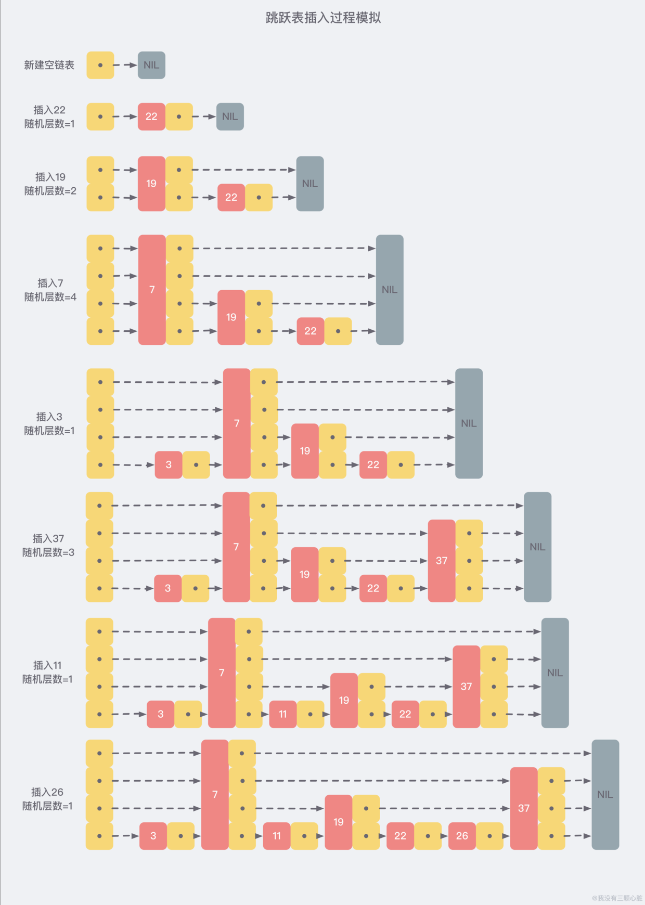

从上面的创建和插入的过程中可以看出，**每一个节点的层数(level)是随机出来的**，而且新插入一个节点并**不会**影响到其他节点的层数，因此**插入操作只需要修改节点前后的指针，而不需要对多个节点都进行调整**，这就降低了插入操作的复杂度。

现在假设从刚才创建的这个结构中查找 23 这个不存在的数，那么查找路径会如下图。

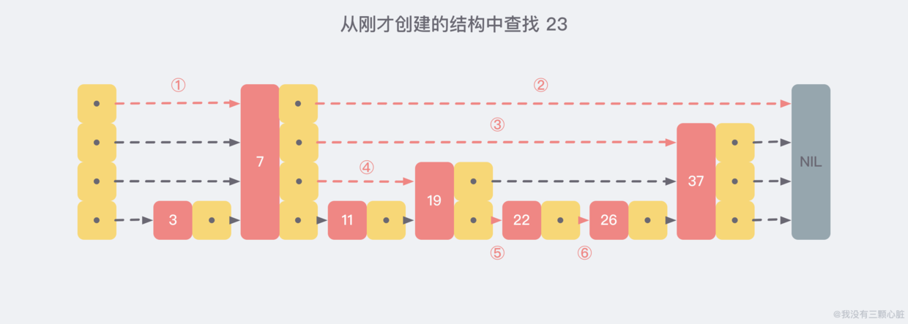

##### 2.应用场景

**Redis** 中的 **Zset 数据结构**的底层实现。ZSet 结构同时包含一个**字典**和一个**跳跃表**，跳跃表按 score 从小到大保存所有集合元素。字典保存着从 member 到 score 的映射。这两种结构通过**指针共享相同元素**的 member 和 score，不会浪费额外内存。

#### 并查集UnionFind

##### 1.概述

在一些有 **N 个元素**的**集合应用问题**中，通常是在开始时让**每个元素**构成一个**单元素的集合**，然后按一定**顺序将属于同一组**的元素所在的**集合合并**，其间要**反复查找一个元素在哪个集合**中。

用于解决**动态连通性问题**，能动态连接两个点，并且**判断两个点是否连通**。

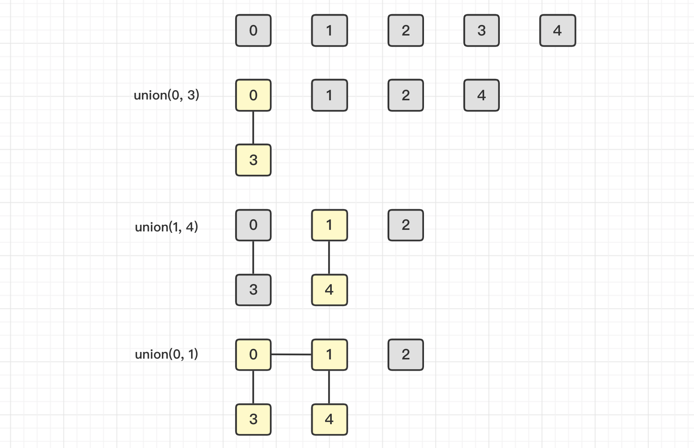

并查集基本方法如下：

|                方法                 |             描述              |
| :---------------------------------: | :---------------------------: |
|            **UF**(int N)            | **构造**一个大小为 N 的并查集 |
|    void **union**(int p, int q)     |     **连接 p 和 q 节点**      |
|         int **find**(int p)         | **查找 p 所在的连通分量编号** |
| boolean **connected**(int p, int q) | 判断 p 和 q 节点**是否连通**  |

##### 2.抽象类

```java
public abstract class UF {

    protected int[] id;

    public UF(int N) {
        id = new int[N];
        for (int i = 0; i < N; i++) {
            id[i] = i;
        }
    }
	// 直接判断两个点是否在一个集合中
    public boolean connected(int p, int q) {
        return find(p) == find(q);
    }

    public abstract int find(int p);

    public abstract void union(int p, int q);
}
```

并查集有不同的**==实现方式==**，性能也不同。

##### 3.Quick Find实现

可以快速进行 **find** 操作，也就是可以**快速判断两个节点是否连通**。

需要保证**同一连通分量的所有节点**的 **id 值**相等。

但是 **union 操作代价却很高**，需要将其中一个连通分量中的所有节点 id 值都**修改**为另一个节点的 id 值。

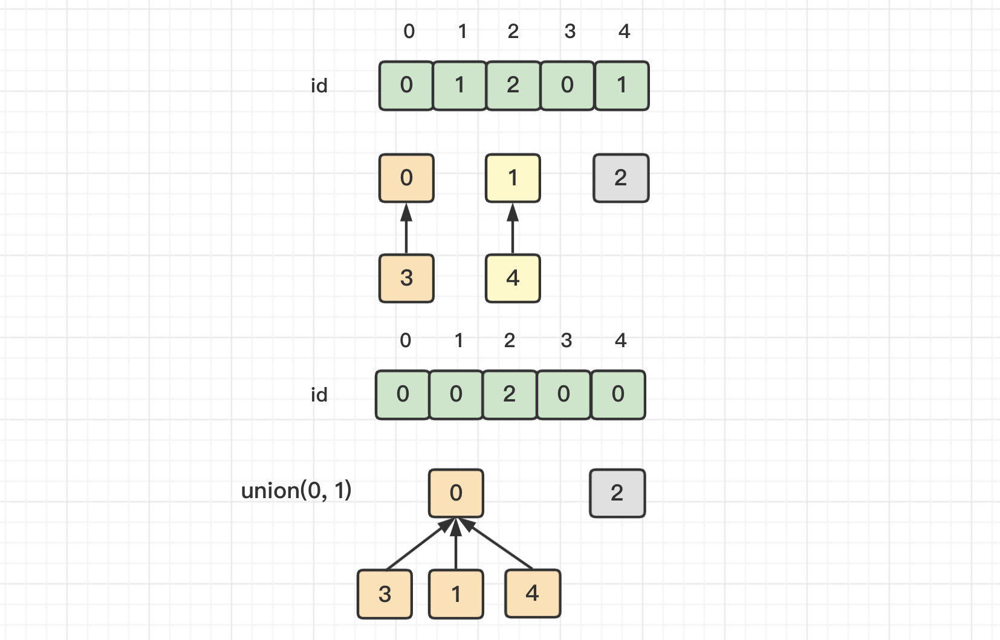

```java
public class QuickFindUF extends UF {

    public QuickFindUF(int N) {
        super(N);
    }

    @Override
    public int find(int p) {
        return id[p];
    }

    @Override
    public void union(int p, int q) {
        int pID = find(p);
        int qID = find(q);
        if (pID == qID) {
            return;
        }
        for (int i = 0; i < id.length; i++) {
            if (id[i] == pID) {
                id[i] = qID;
            }
        }
    }
}
```

##### 4.Quick Union实现

可以快速进行 union 操作，只需要**修改一个节点的 id 值**即可。

但是 **find 操作开销很大**，因为同一个连通分量的节点 id 值不同，id 值只是用来指向另一个节点。因此需要一直向上查找操作，直到找到最上层的节点。

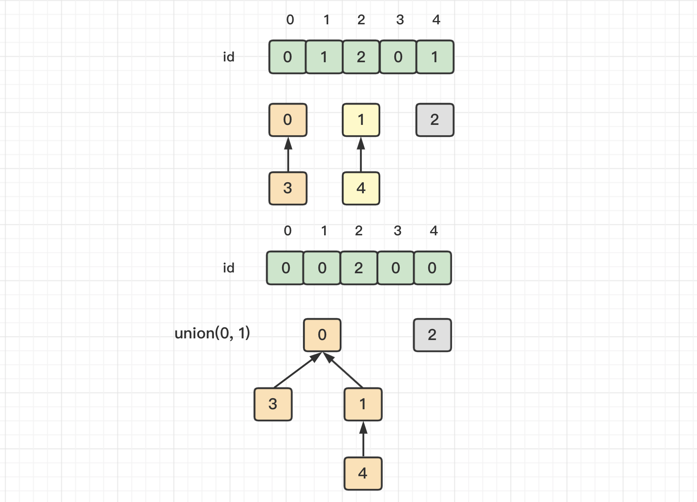

```java
public class QuickUnionUF extends UF {

    public QuickUnionUF(int N) {
        super(N);
    }

    @Override
    public int find(int p) {
        while (p != id[p]) {
            p = id[p];
        }
        return p;
    }

    @Override
    public void union(int p, int q) {
        int pRoot = find(p);
        int qRoot = find(q);

        if (pRoot != qRoot) {
            id[pRoot] = qRoot;
        }
    }
}
```

这种方法可以**快速进行 union 操作**，但是 **find 操作和树高**成正比，最坏的情况下树的高度为节点的数目。

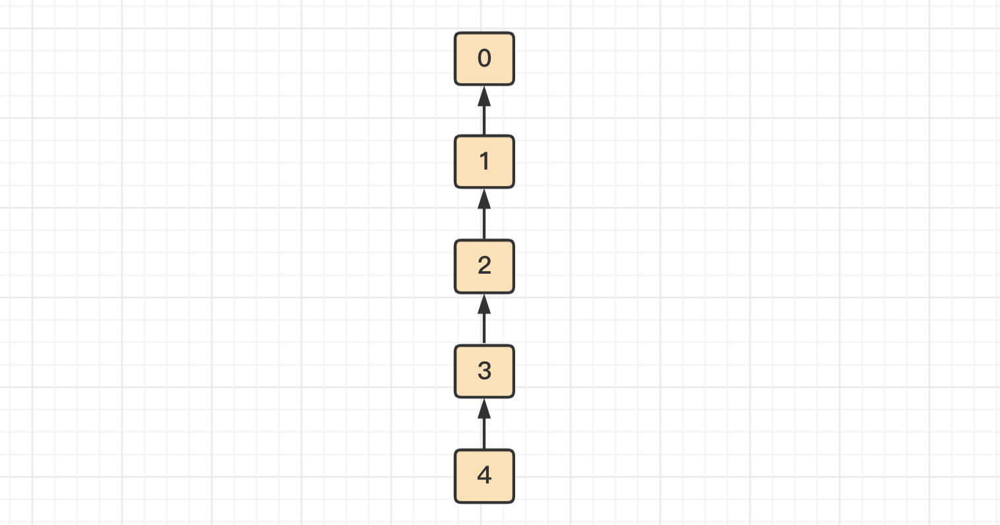

##### 5.加权Quick Union实现

为了解决 quick-union 的**树通常会很高**的问题，加权 quick-union 在 union 操作时会让**较小的树连接较大的树上面**。理论研究证明，加权 quick-union 算法构造的树深度最多**不超过 logN**。

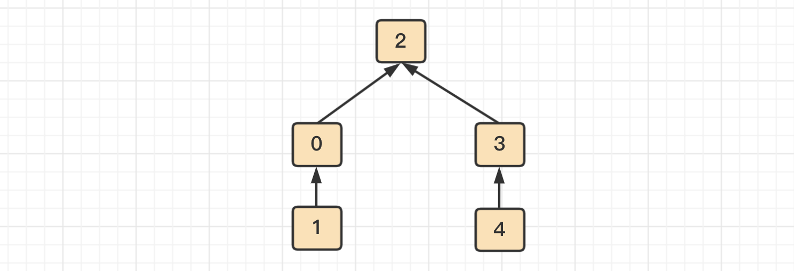

```java
public class WeightedQuickUnionUF extends UF {

    // 保存节点的数量信息
    private int[] sz;

    public WeightedQuickUnionUF(int N) {
        super(N);
        this.sz = new int[N];
        for (int i = 0; i < N; i++) {
            this.sz[i] = 1;
        }
    }

    @Override
    public int find(int p) {
        while (p != id[p]) {
            p = id[p];
        }
        return p;
    }

    @Override
    public void union(int p, int q) {

        int i = find(p);
        int j = find(q);

        if (i == j) return;

        if (sz[i] < sz[j]) {
            id[i] = j;
            sz[j] += sz[i];
        } else {
            id[j] = i;
            sz[i] += sz[j];
        }
    }
}
```

##### 6.路径压缩的加权Quick Union实现

在检查节点的同时将**它们直接链接到根节点**，只需要在 find 中添加一个**循环**即可。

##### 7.比较

|              算法              |   union    |    find    |
| :----------------------------: | :--------: | :--------: |
|         **Quick Find**         |     N      |     1      |
|        **Quick Union**         |    树高    |    树高    |
|      **加权 Quick Union**      |    logN    |    logN    |
| **路径压缩的加权 Quick Union** | 非常接近 1 | 非常接近 1 |


#### 参考资料

- https://www.jianshu.com/p/68220564f341
- 《算法 第四版》
- 《数据结构与抽象》


