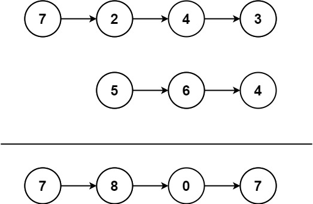
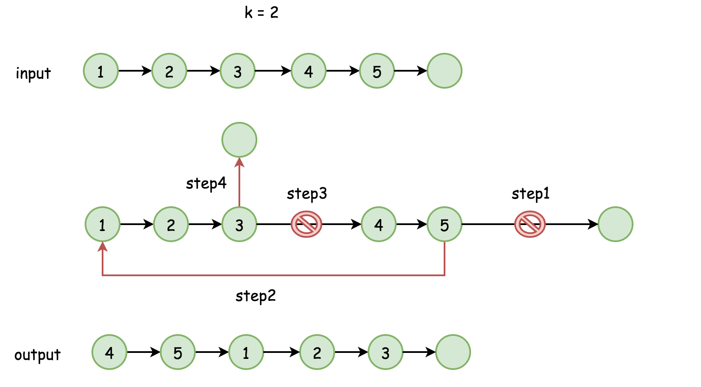
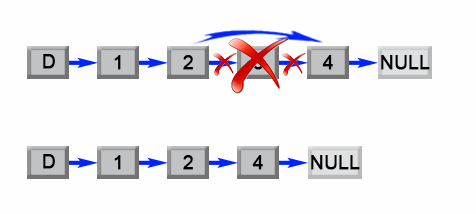
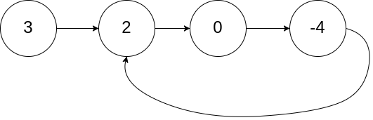

[TOC]

### 链表题目

#### 基础

##### 1.链表类问题解题技巧

###### (1)使用额外空间

使用**额外空间**(如 **HashMap、数组**)来辅助操作. 

场景: 复制链表的复制、判断链表是否有环等等. 

额外空间会增加空间复杂度, 而且很多题 O(1) 空间就行了, 不过使用额外空间在**笔试中**很不错.  

###### (2)引入dummy结点

对于**头结点可能会改变**的题目, 引入 dummy 结点是**基操**, 最后返回 dummy.next 即可. 

场景: 删除某个结点(可能把头结点删了), 两两一个交换结点(头结点会被交换出去)等. 

###### (3)快慢指针或双指针

由于链表无法直接寻址, 因此可以**引入多个指针**. **快慢指针**是非常巧妙且常见的技巧!

场景: 找链表中间结点、判断链表是否有环、删除倒数第 K 个结点、奇偶链表等. 

###### (4)牢记链表逆序的方法

很多题都需要**链表逆序**! 逆序可以使用**栈、递归、迭代**等方式实现. 栈比较费空间, 递归较难理解, 利用迭代可以通过画图的方式推出迭代路线. 

面试一定要掌握**迭代**的方式逆序. 

场景: 判断链表是否是回文结构(逆序后半部分)、两个链表数字相加(这个题用栈逆序贼方便, 看实际情况吧)、反转指定范围链表等. 

###### (5)学会画迭代思路图

不少题目使用额外空间很容易, 但是空间浪费, 但可以通过迭代的方式做出来, 因此**要学会分析题目画出迭代的关系, 指针的变化**步骤与方式. 

场景: 链表逆序(迭代方式)、两两一组交换链表、奇偶链表等. 

###### (6)其他

链表是**空节点**, 或者有一个值和一个指向下一个链表的指针, 因此很多链表问题可以用**递归**来处理. 

遇到需要**逆序**的情况, 如果不好处理, 可以考虑使用**栈**. 

##### 2.链表结点类

```java
public class ListNode {
    int val;
    ListNode next;
    
    ListNode() {}
    ListNode(int val) { this.val = val; }     
    ListNode(int val, ListNode next) { this.val = val; this.next = next; }
}
```

##### 3.寻找链表中点

许多场景下可能需要寻找链表的中点, 或者需要找到后半部分链表的起点, 使用**快慢指针**的方式. 

代码如下: 

```java
ListNode fast = head;
ListNode slow = head;
while (fast != null && fast.next != null) {
    fast = fast.next.next;
    slow = slow.next;
}

// 第二部分的开头并断开两部分的指针
ListNode secondHead = slow.next;
slow.next = null;
```

这里 fast 和 slow **初始时都指向的是 head 节点**, 由于 fast 一次移动个节点, 所以需要判断 "fast.next.next != null", 移动完成后, "**slow.next**" 就是指向后半部分链表的开头. 

为什么 **slow.next** 一定是后半链表的开头? 这里需要分两种情况.

**结点数目为奇数**

这种情况下前面半条链表比后面半条链表**多一个节点**. fast 移动到最后一个节点就会停止, 此时 slow 到 4 的位置, **slow.next** 就是后半部分的开头.


**结点数目为偶数**

这种情况下两条链表节点**数目一致**. fast 移动到倒数第二个节点就会停止, 此时 slow 到 3 的位置, **slow.next** 就是后半部分的开头.


### 反转链表类题目

这类题目涉及到反转整个链表或者部分链表. 

#### 反转单向链表[206.简单]

**题目描述**: https://leetcode-cn.com/problems/reverse-linked-list

反转一个单链表. 示例: 

```java
输入: 1->2->3->4->5->NULL
输出: 5->4->3->2->1->NULL
```

**题解1: 迭代法**


也叫**头插法**. 时间复杂度 **O(N), 空间复杂度 O(1)** 的算法. 引入 **dummy 结点**, 然后把**第一个结点**先弄好, 之后每次将新的结点插入到 dummy 结点的**后面一个**. 1.temp 结点指向 head; 2.head 后移; 3.temp 指向 dummy 的后一个结点; 4.dummy 指向 temp. 此时新的 temp 结点处理完成.

```java
public ListNode reverseList(ListNode head) {

    if (head == null || head.next == null) {
        return head;
    }

    ListNode dummy = new ListNode(0);

    while (head != null) {
        // 临时结点指向head
        ListNode temp = head;
        // head往后移动,此时temp指向的就是需要操作的结点
        head = head.next;
        // 将temp结点插入dummy后面
        temp.next = dummy.next;
        dummy.next = temp;
    }

    return dummy.next;
}
```

**题解2: 递归法**

Base case 就是已经处理到最后一个结点，直接返回即可。


这里假设 head 指向 1，此时 head.next 指向 2. 所以递归时需要传入 head.next 进行持续递归并使用 newHead 来表示已经递归好的结果。这里即 reverseList() 方法已经将 2-3-4 完成逆序，此时 newHead 指向 4. 然而由于此时 **head 依然 指向的是 head.next 也就是 1 指向 2**. 正确的逆序结果应该是 2 指向 1. 所以此时需要进行指针的变更: 即 head.next.next = head 使 2 指向 1，且 head 指向 null 防止循环链表。

```java
public ListNode reverseList(ListNode head) {

    // Base case: 已经到链表最后一个节点，逆序就是自己
    if (head == null || head.next == null) {
        return head;
    }

    // 将head后面的链表逆序,假设返回的就是逆序后的结果
    ListNode newHead = reverseList(head.next);
    // 为了防止循环链表需要修改指针
    head.next.next = head;
    head.next = null;

    // 返回新的头结点
    return newHead;
}
```

#### 反转指定范围的链表[92.中等]

**题目描述**: https://leetcode-cn.com/problems/reverse-linked-list-ii

反转从**位置 m 到 n** 的链表. 请使用**一趟扫描**完成反转. 注意: 1 ≤ m ≤ n ≤ 链表长度. 

```java
输入: 1->2->3->4->5->NULL, m = 2, n = 4
输出: 1->4->3->2->5->NULL
```

**题解1: 迭代法**

将链表分为 3 个部分, 2 个**不反转**部分和 1 个**反转**的部分. 

- 前面的**不反转**部分, **保留最后一个节点**, 后面的不反转部分, 保留**第一个**节点. 
- 对于**反转**部分, 要**保留第一个端点**. 
- 反转结束后, 将三个部分**拼接**起来. 


由于**反转**的可能涉及第一个结点的变动, 所以**引入 dummy 结点**. 同时引入一个 **cur** 指针, **从前往后**一直遍历. 

这里假设 start = 4， end = 6. cur 指针需要移动 3 次到达不需要反转部分的末尾即 originEnd，**记录一下**。其下一个结点就是需要反转部分的开始，即 revStart，**记录一下**。此时让 cur 再走 3 次，到达需要反转部分的末尾，此时其下一个结点即末尾无需反转的开始，**记录一下**。同时这里将需反转部分与最后的部分的连接断开。最后对中间部分进行反转，然后依次进行拼接即可。注意：这里 revStart 反转后就成了反转部分的末尾，因此直接与 lastStart 进行拼接即可。

```java
public ListNode reverseBetween(ListNode head, int start, int end) {
    // 引入dummy与cur结点
    ListNode dummy = new ListNode(0);
    dummy.next = head;
    ListNode cur = dummy;

    // 找第一部分不用变的末尾(start = 4, end = 6)
    for(int i = 0; i < start - 1; i++) {
        cur = cur.next;
    }
    // 记录第一部分不用变化的末尾节点
    ListNode originEnd = cur;

    // 记录需要反转部分的起始结点
    ListNode revStart = originEnd.next;
    // 移动到需要反转部分的末尾(end - start = 2)
    for(int j = 0; j <= end - start; j++) {
        cur = cur.next;
    }
    // 此时cur指向需要反转部分的末尾, 其后面一个结点即为后面不需要变得部分的头结点
    ListNode lastStart = cur.next;
    // 当前cur指向需要反转链表的最后一个节点, 此时断开指针
    cur.next = null;
    // 反转链表, 经过反转, revBegin已经指向了反转后链表的末尾
    originEnd.next = reverse(revStart);
    
    // 连接最后一段不需要变化的部分
    revStart.next = lastStart;

    return dummy.next;
}

// 递归反转链表
ListNode reverse(ListNode head) {
    if (head.next == null) {
        return head;
    }
    ListNode newHead = reverse(head.next);
    head.next.next = head;
    head.next = null;
    return newHead;
}
```

#### 两两交换链表中的节点[24.中等]

**题目描述**: https://leetcode-cn.com/problems/swap-nodes-in-pairs

给定一个链表, **两两交换**其中相邻的节点, 并返回交换后的链表. **不能**只是单纯的改变节点内部的值, 而是**需要实际的进行节点交换**. 

```
1->2->3->4 返回 2->1->4->3
```

**题解1: 双指针遍历法**

首先由于需要操作**头结点**, 因此引入一个 **dummy** 结点, 用于保存最后返回的头结点. 图示如下图. 


- 再引入一个 **cur 结点**, 后续 cur 作为 dummy 结点移动. 
- 后续的结点**两两一组进行交换**, 主要是注意指针的变换, 类似于普通的**变量交换**, 如上图的步骤 1-3.
- 每当两个结点的处理完成后, cur 指针往**后移动两步**, head 移动到 cur 的**后面**, 再次重复上述的交换动作. 直到 cur 的后面没有结点或者只有一个结点为止. 

```java
public ListNode swapPairs(ListNode head) {

    if (head == null || head.next == null) {
        return head;
    }

    ListNode dummy = new ListNode(0);
    ListNode cur = dummy;

    while (head != null && head.next != null) {
        // 下面三步改变链表节点的指向
        cur.next = head.next;
        head.next = head.next.next;
        cur.next.next = head;

        // 移动指针
        head = head.next;
        cur = cur.next.next;
    }

    return dummy.next;
}
```

**题解2: 递归法**

递归牛逼。


这里需要返回的新的头结点就是当前头结点的下一个结点，所以 head.next 即 newHead，这就是方法最终需要返回的对象。由于一次处理两个结点，所以假设两个结点之后的所有结点都已经完成处理，此时让原始 head 指向"假设已经完成处理的链表"。最后新的头结点指向原始头结点完成交换并返回新的头节点即可。

```java
public ListNode swapPairs(ListNode head) {

    // Base case
    if (head == null || head.next == null) {
        return head;
    }
    // 新的头结点就是当前头结点的下一个结点
    ListNode newHead = head.next;
    // 使当前头结点指向"假设已经完成处理的后续链表"
    head.next = swapPairs(head.next.next);
    // 新的头结点指向原始头结点完成交换，并返回新的头结点
    newHead.next = head;
    return newHead;
}
```

#### K个一组翻转链表[25.困难]

**题目描述:** https://leetcode-cn.com/problems/reverse-nodes-in-k-group

给你一个链表, 每 **k 个节点一组**进行翻转, 返回翻转后的链表. k 是一个正整数, 且小于或等于链表的长度. 如果剩余节点总数**不是 k** 的整数倍, 那么将最后**剩余的节点保持原有顺序**. 

题目要求: 算法只能使用**常数**的额外空间. 不是仅交换数值, 需要**交换结点**. 

```java
链表: 1->2->3->4->5
当 k = 2 时, 应当返回: 2->1->4->3->5
当 k = 3 时, 应当返回: 3->2->1->4->5
```

**题解1: 快慢指针法**

题目要求算法只能使用**常数**的额外空间. 说明不能用递归, 只能用**迭代**的方式进行, 可以画个图理清每一个临界位置的指向. 


- 引入 dummy 结点，并初始化双指针 fast 和 slow。然后进入死循环遍历。
- 通过 k 次循环将 fast 指针移动到需要**反转部分的末尾**. 循环中就可能遇到空，此时退出循环即可。
- 此时判断一下如果翻转元素不到 k 个, 即 end == null, 说明**已经到达末尾**, 直接返回即可. 
- 然后需要定义 **remainHead** 指向后面**剩余未处理的头结点**，定义 **revHead** 指向本轮**需要反转部分的头结点**, 以便将翻转元素前后两部分连接起来. 
- 断开需反转部分和剩余部分的指针，并进行反转，反转后将结果拼接到 slow 指针之后。
- 最后重新建立连接，并将快慢指针重置到当前的 revHead 处，持续进行下一轮循环。

```java
public ListNode reverseKGroup(ListNode head, int k) {
    ListNode dummy = new ListNode(0);
    dummy.next = head;

    // 快慢双指针
    ListNode fast = dummy;
    ListNode slow = dummy;

    while (true) {
        // fast遍历到需要翻转部分的最后一个元素位置
        for (int i = 0; i < k && fast != null; i++) {
            fast = fast.next;
        }
        // 说明fast到了链表尾部,此轮反转长度不够,直接跳出循环
        if (fast == null) {
            break;
        }
        // 记录剩余未处理链表的头结点
        ListNode remainHead = fast.next;
        // 定义start指向翻转元素的第一个位置
        ListNode revHead = slow.next;
        // 最后一个翻转元素先断链
        fast.next = null;
        // 然后通过翻转方法reverse()后接在slow后面
        slow.next = reverse(revHead);
        // 保持下次循环一致的位置
        revHead.next = remainHead;
        // 一轮反转后重置指针
        slow = revHead;
        fast = revHead;
    }

    return dummy.next;
}

// 递归反转链表
private ListNode reverse(ListNode head) {
    if (head.next == null) {
        return head;
    }
    ListNode newHead = reverse(head.next);
    head.next.next = head;
    head.next = null;
    return newHead;
}
```

### 链表合并与切分类题目

当需要变换链表时, 直接引入一个 dummy 结点, 然后把处理完成的链表弄到 dummy 后面即可. 

#### 合并两个有序的链表[21.简单]

**题目描述:** https://leetcode-cn.com/problems/merge-two-sorted-lists/

两个链表都是从小到大排列, 合并两个链表, 使其合并之后依然是从小到大排列. 

**题解1: 递归法**

**递归版本**, 额外空间为 **O(N)**. 关键点在于需要区分两种情况，进行分别递归。

```java
public ListNode mergeTwoLists(ListNode list1, ListNode list2) {

    if (list1 == null || list2 == null) {
        return list1 != null ? list1 : list2;
    }

    // 到这里说明两个链表均不为空，指定head
    ListNode head = null;

    // 这里分两种情况分别初始化head，并将下一个结点设置为剩下的合并后的结果
    if (list1.val < list2.val) {
        head = list1;
        head.next = mergeTwoLists(list1.next, list2);
    } else {
        head = list2;
        head.next = mergeTwoLists(list1, list2.next);
    }
    return head;
}
```

**题解2: 迭代法**

需要找到**小的起始值**开始遍历合并, 完成处理后的结点依次连接到 dummy 结点后面形成一条新的链表. 

```java
public ListNode mergeTwoLists(ListNode list1, ListNode list2) {

    if (list1 == null || list2 == null) {
        return list1 != null ? list1 : list2;
    }

    ListNode dummy = new ListNode(0);
    ListNode cur = dummy;

    // 都不为空才遍历
    while (list1 != null && list2 != null) {
        // 分情况取两个链表的头结点
        if (list1.val < list2.val) {
            cur.next = list1;
            list1 = list1.next;
        } else {
            cur.next = list2;
            list2 = list2.next;
        }
        // 移动cur指针到末尾并断开其对后面链表的连接
        cur = cur.next;
        cur.next = null;
    }

    // 到这里说明其中一个链表为null了 连接上后面的即可
    if (list1 == null) cur.next = list2;
    if (list2 == null) cur.next = list1;

    return dummy.next;
}
```

#### 合并K个有序链表[23.困难]

**题目描述:** https://leetcode-cn.com/problems/merge-k-sorted-lists

**合并 k** 个排序链表, 返回合并后的排序链表, 请分析和描述算法的复杂度. 

```
[
  1->4->5,
  1->3->4,
  2->6
]
输出: 1->1->2->3->4->4->5->6
```

**题解1: 逐一比较**

比较 k 个节点(每个链表的首节点), 获得最小值的节点. 不断将节点接在最终有序链表的后面. 

**题解2: 使用优先队列**

几乎与上述方法一样, 除了将 **比较环节** 用 **优先队列** 进行了优化. 将**所有的数值放入到优先队列中, 再逐一出队列**. 

**题解3: 逐一两两合并链表**

利用合并两个链表的思想, **将合并 k 个链表的问题转化成合并 2 个链表 k-1 次**. 

**题解4: 分治法**

这个方法沿用了上面的解法, 但是进行了较大的优化. 不需要对大部分节点重复遍历多次. 如下图所示.


这里合并两条有序链表时采用了前述"合并两个有序的链表"的递归代码，整体代码如下：

```java
public ListNode mergeKLists(ListNode[] lists) {
    // Base case
    if (lists == null || lists.length == 0) {
        return null;
    }
    return merge(lists, 0, lists.length - 1);
}

private ListNode merge(ListNode[] lists, int left, int right) {
    if (left == right) {
        return lists[left];
    }

    int mid = left + (right - left) / 2;
    ListNode l1 = merge(lists, left, mid);
    ListNode l2 = merge(lists, mid + 1, right);

    // 递归合并两个列表
    return mergeTwoLists(l1, l2);
}

private ListNode mergeTwoLists(ListNode l1, ListNode l2) {
    if (l1 == null) return l2;
    if (l2 == null) return l1;

    if (l1.val < l2.val) {
        l1.next = mergeTwoLists(l1.next, l2);
        return l1;
    } else {
        l2.next = mergeTwoLists(l1, l2.next);
        return l2;
    }
}
```

#### 分隔链表[86.中等]

**题目描述: **https://leetcode-cn.com/problems/partition-list

给定一个**链表**和一个**特定值 x**, 对链表进行分隔, 使得所有**小于 x 的节点都在大于或等于 x 的节点之前**. 应当保留两个分区中每个节点的初始相对位置. 


```
输入: head = 1->4->3->2->5->2, x = 3
输出: 1->2->2->4->3->5
```

**题解1: 双指针法**

遍历链表，根据值将链表拆分到两个链表中。最后将链表进行拼接即可。

- 引入两个 **dummy** 结点. 

- 不断**遍历**原链表, **小的结点挂载到小的链表, 大于等于的结点挂载到大的结点**. 

- 最后将**两个链表连接起来**. 整个过程没有新建结点, 额外空间是 O(1). 

```java
public ListNode partition(ListNode head, int x) {
    if (head == null || head.next == null) {
        return head;
    }

    // 拆成两条链表
    ListNode dummyLess = new ListNode(0);
    ListNode dummyMore = new ListNode(0);
    ListNode curLess = dummyLess;
    ListNode curMore = dummyMore;

    while (head != null) {
        // 分别往不同的链表追加
        if (head.val < x) {
            curLess.next = head;
            curLess = curLess.next;
        } else {
            curMore.next = head;
            curMore = curMore.next;
        }
        head = head.next;
    }
    // more后面的指针一定要断开 防止死循环
    curMore.next = null;
    // 链表拼接并返回
    curLess.next = dummyMore.next;
    return dummyLess.next;
}
```

#### 奇偶链表[328.中等]

**题目描述**: https://leetcode-cn.com/problems/odd-even-linked-list

给定一个单链表, 把所有的**奇数节点**和**偶数节点**分别**排在一起**. 这里的奇数节点和偶数节点指的是**节点编号**的奇偶性, 而**不是节点的值的奇偶性**. 

请尝试使用**原地算法**完成. 要求空间复杂度应为 **O(1)**, 时间复杂度为 O(N). 说明: 应当保持奇数节点和偶数节点的**相对顺序**. 链表的第一个节点视为奇数节点, 第二个节点视为偶数节点, 以此类推. 

```java
输入: 1->2->3->4->5->NULL
输出: 1->3->5->2->4->NULL

输入: 2->1->3->5->6->4->7->NULL 
输出: 2->3->6->7->1->5->4->NULL
```

**题解1: 双链表法**

与上个题类似, 只不过判断条件变化了, 引入两个 dummy 结点即可. 将奇节点拼接在一个链表里, 偶链表拼接在另一个链表里. 最后把偶链表接在奇链表的**尾部**. 

```java
public ListNode oddEvenList(ListNode head) {
    if (head == null || head.next == null) {
        return head;
    }

    ListNode dummyOdd = new ListNode(0);
    ListNode dummyEven = new ListNode(0);
    ListNode curOdd = dummyOdd;
    ListNode curEven = dummyEven;

    int cnt = 1;
    while (head != null) {
        // 记录当前处理的临时结点
        ListNode temp = head;
        head = head.next;
        temp.next = null;
        // 分奇偶移动指针
        if (cnt++ % 2 == 1) {
            curOdd.next = temp;
            curOdd = curOdd.next;
        } else {
            curEven.next = temp;
            curEven = curEven.next;
        }
    }
    // 拼接奇偶情况
    curOdd.next = dummyEven.next;
    return dummyOdd.next;
}
```

**题解2: 双指针法**

解法与题解 1 类似, 只不过无需定义两个结点, 直接改变指针即可, 流程如下.


代码如下:

```java
public ListNode oddEvenList(ListNode head) {
    if (head == null) {
        return null;
    }

    // 第一个节点是奇结点(就是head), 第二个为偶结点的头结点, evenHead保存偶链表头部
    ListNode oddCur = head;
    ListNode evenCur = head.next;
    ListNode evenHead = evenCur;

    while (evenCur != null && evenCur.next != null) {
        // 奇结点的下一个是下一个偶结点的下一个
        oddCur.next = evenCur.next;
        // 往后移动奇结点指针
        oddCur = oddCur.next;
        // 偶结点的下一个是跳过一个位置的下一个
        evenCur.next = oddCur.next;
        // 往后移动偶结点指针
        evenCur = evenCur.next;
    }
    // 拼接两条链表
    oddCur.next = evenHead;
    // 返回头(就是奇结点头部)
    return head;
}
```

#### 链表分隔成K个链表[725.中等]

**题目描述: **https://leetcode-cn.com/problems/split-linked-list-in-parts

给定一个头结点为 root 的链表, 编写一个函数以将链表**分隔为 k 个连续**的部分. 每部分的长度应该尽可能的相等: 任意两部分的长度差距不能超过 1, 也就是说可能有些部分为 null. 这k个部分应该按照在链表中出现的顺序进行输出, 并且排在前面的部分的长度应该大于或等于后面的长度. 返回一个符合上述规则的链表的列表. 

```java
输入: root = [1, 2, 3], k = 5
输出: [[1],[2],[3],[],[]]
解释:输入输出各部分都应该是链表, 而不是数组. 

输入: root = [1, 2, 3, 4, 5, 6, 7, 8, 9, 10], k = 3
输出: [[1, 2, 3, 4], [5, 6, 7], [8, 9, 10]]
解释:输入被分成了几个连续的部分, 并且每部分的长度相差不超过1.前面部分的长度大于等于后面部分的长度. 
```

**题解1: 迭代法**


1. 先计算链表长度.
2. 计算出每条链表至少可以分 cutCnt 个节点，由于存在可能不能刚好均分的情况，所以需要计算一下前 moreCnt 条链表可以多分一个节点。
3. 遍历构造 K 条链表，注意前 moreCnt 条链表需要多分一个节点，构造完成之后依次放到链表数组中即可。

```java
public ListNode[] splitListToParts(ListNode root, int k) {
    ListNode head = root;
    // 求链表长度
    int length = 0;
    while (head != null) {
        head = head.next;
        length++;
    }

    // 计算每份至少多少个结点
    int cutCnt =  length / k;
    // 计算前面多少份需要多分一个(有可能不是恰好分完)
    int moreCnt = length % k;

    // 分别构造链表
    ListNode[] res = new ListNode[k];
    for (int i = 0; i < k; i++) {
        ListNode tempHead = new ListNode(0);
        ListNode cur = tempHead;
        // 判断如果prevCount > 0 , 则当前需要多分一份
        int curNum = moreCnt > 0 ? cutCnt + 1: cutCnt;
        moreCnt--;

        for (int j = 0; j < curNum; j++) {
            if (root != null) {
                cur.next = root;
                cur = root;
                root = root.next;
            }
        }

        // 切断前面的节点和后面的联系
        cur.next = null;
        res[i] = tempHead.next;
    }
    return res;
}
```

同样的思路另一种写法.

```java
public ListNode[] splitListToParts(ListNode head, int k) {
    ListNode cur = head;
    // 获取链表长度
    int length = 0;
    while (cur != null) {
        length++;
        cur = cur.next;
    }
    // 计算每份至少多少个结点
    int cutCnt = length / k;
    // 计算前面多少份需要多分一个(有可能不是恰好分完)
    int moreCnt = length % k;

    ListNode[] res = new ListNode[k];
    // 当前分配的链表条数
    int cnt = 0;
    while (head != null) {
        // curNum即当前的链表需要分配的结点数目(前面的几条链表需要多分配一个结点)
        int curNum = moreCnt > 0 ? (cutCnt + 1) : cutCnt;
        moreCnt--;

        // 构造链表
        ListNode tempHead = new ListNode(0);
        ListNode curNode = tempHead;
        while (curNum > 0) {
            curNode.next = head;
            head = head.next;
            curNode = curNode.next;
            curNum--;
        }
        // 与原本的链断开连接
        curNode.next = null;
        res[cnt] = tempHead.next;
        cnt++;
    }
    return res;
}
```

#### 重排链表[143.中等]

**题目描述: **https://leetcode-cn.com/problems/reorder-list

给定一个**单链表 L**: L0→L1→…→Ln-1→Ln, 将其重新排列后变为: L0→Ln→L1→Ln-1→L2→Ln-2→…

也就是**不断从链表两边取结点组合形成新的链表**. 不能只是单纯的改变节点内部的值, 而需要进行**节点交换**. 

```javascript
给定链表 1->2->3->4, 重新排列为 1->4->2->3.
给定链表 1->2->3->4->5, 重新排列为 1->5->2->4->3.
```

**题解1: 逆转后半部分法**

利用由于是**一头一尾取元素**. 先利用**快慢指针找到链表的中间结点**. 将后半部分**链表逆序**(可以迭代或者递归逆序). 最后将前后**两个部分的链表交替连接合并起来即可**. 


代码如下: 

```java
public void reorderList(ListNode head) {

    if (head == null || head.next == null || head.next.next == null) {
        return;
    }

    // 快慢指针将链表分半
    ListNode fast = head;
    ListNode slow = head;
    while (fast.next != null && fast.next.next != null) {
        fast = fast.next.next;
        slow = slow.next;
    }

    // 第二部分的开头并断开两部分的指针
    ListNode secondHead = slow.next;
    slow.next = null;

    // 逆序后半部分链表
    secondHead = reverse(secondHead);

    // 引入两个变量分别指向两个链表头部开始遍历
    ListNode firstCur = head;
    ListNode secondCur = secondHead;

    while (firstCur != null && secondCur != null) {
        // 分别记录两个temp结点并移动指针
        ListNode tempFirst = firstCur;
        ListNode tempSecond = secondCur;
        firstCur = firstCur.next;
        secondCur = secondCur.next;

        // 进行结点拼接
        tempFirst.next = tempSecond;
        tempSecond.next = firstCur;
    }
}

private ListNode reverse(ListNode head) {
    if (head.next == null) {
        return head;
    }
    ListNode newHead = reverse(head.next);
    head.next.next = head;
    head.next = null;
    return newHead;
}
```

#### 两个链表当成数字相加生成新链表[2.中等]

**题目描述:** https://leetcode-cn.com/problems/add-two-numbers

给出两个 **非空 的链表**用来表示两个**非负**的整数. 它们各自的位数是按照 **逆序 的方式存储**的, 并且它们的每个节点只能存储 一位 数字. 如果将这两个数相加起来, 则会返回一个新的链表来表示它们的和. 可以假设除了数字 0 之外, 这两个数都不会以 0 开头. 

```java
输入: (2 -> 4 -> 3) + (5 -> 6 -> 4)
输出: 7 -> 0 -> 8
原因: 342 + 465 = 807
```

**题解1: 直接相加法**

直接将两个链表**加起来**就行. 注意点: 可能其中一个链表已经是遍历完了, 还需要持续**遍历剩下**的; 还有可能存在结果进位的情况, 需要判断进位标志最后再处理一下.

两种情况:

**长度不够时补零**


**最后有进位时需要处理**


代码如下:

````java
public ListNode addTwoNumbers(ListNode list1, ListNode list2) {
    if (list1 == null|| list2 == null) {
        return list1 == null ? list2 : list1;
    }

    ListNode res = new ListNode(0);
    ListNode cur = res;

    // 记录进位
    int carry = 0;
    // 一直遍历直到两条链表都为空
    while (list1 != null || list2 != null) {

        // 小技巧: 当一条为空时值默认取0
        int num1 = list1 == null ? 0 : list1.val;
        int num2 = list2 == null ? 0 : list2.val;

        int sum = num1 + num2 + carry;
        // 刷新carry
        carry = sum / 10;
        // 记录当前加法值
        cur.next = new ListNode(sum % 10);

        if (list1 != null) list1 = list1.next;
        if (list2 != null) list2 = list2.next;

        cur = cur.next;
    }

    // 有可能存在结果进位的情况,需要判断进位标志最后再处理一下 如: 13+87=100
    if (carry > 0) {
        cur.next = new ListNode(carry);
    }
    return res.next;
}
````

也可以将 carry 整合到 while 条件里面:

```java
public ListNode addTwoNumbers(ListNode list1, ListNode list2) {
    if (list1 == null|| list2 == null) {
        return list1 == null ? list2 : list1;
    }

    ListNode res = new ListNode(0);
    ListNode cur = res;

    // 记录进位
    int carry = 0;
    // 一直遍历直到两条链表都为空且carry不为0
    while (list1 != null || list2 != null || carry > 0) {

        // 小技巧: 当一条为空时值默认取0
        int num1 = list1 == null ? 0 : list1.val;
        int num2 = list2 == null ? 0 : list2.val;

        int sum = num1 + num2 + carry;
        // 刷新carry
        carry = sum / 10;
        // 记录当前加法值
        cur.next = new ListNode(sum % 10);

        if (list1 != null) list1 = list1.next;
        if (list2 != null) list2 = list2.next;

        cur = cur.next;
    }

    return res.next;
}
```

#### 两个链表当成数字相加生成新链表II[445.中等]

**题目描述: **https://leetcode-cn.com/problems/add-two-numbers-ii

给你两个非空链表来代表两个非负整数. 数字最高位位于链表开始位置. 它们的每个节点只存储一位数字. 将这两数相加会返回一个新的链表. 你可以假设除了数字 0 之外, 这两个数字都不会以零开头. 



```java
输入: l1 = [7,2,4,3], l2 = [5,6,4]   输出: [7,8,0,7]
输入: l1 = [2,4,3], l2 = [5,6,4]     输出: [8,0,7]
输入: l1 = [0], l2 = [0]             输出: [0]
```

**题解1: 逆序法**

先将两个链表进行逆序, 然后参考上一题的思路进行处理, 最后把结果逆序. 

**题解2: 使用栈**

题目的进阶版是**不能修改原链表**. 然而需要实现逆序的操作, 此时可以考虑采用栈进行逆序. 此外, 每次处理一轮之后, 新生成的结点直接采用**头插法**进行链表构造就能省去最后链表逆序的操作. 采用栈之后的代码也很类似.

```java
public ListNode addTwoNumbers(ListNode list1, ListNode list2) {

    if (list1 == null || list2 == null) {
        return list1 == null ? list2 : list1;
    }

    // 使用栈使元素逆序 模拟逆序链表
    Stack<Integer> stack1 = new Stack<>();
    Stack<Integer> stack2 = new Stack<>();
    while (list1 != null) {
        stack1.push(list1.val);
        list1 = list1.next;
    }
    while (list2 != null) {
        stack2.push(list2.val);
        list2 = list2.next;
    }

    int carry = 0;
    ListNode res = new ListNode(0);
    ListNode cur = res;

    while (!stack1.isEmpty() || !stack2.isEmpty()) {
        int num1 = stack1.isEmpty() ? 0 : stack1.pop();
        int num2 = stack2.isEmpty() ? 0 : stack2.pop();
        int sum = num1 + num2 + carry;

        carry = sum / 10;

        // 直接采用头插法构造结果(最后就无需再次逆序结果)
        ListNode temp = new ListNode(sum % 10);
        temp.next = cur.next;
        cur.next = temp;
    }

    if (carry > 0) {
        ListNode temp = new ListNode(carry);
        temp.next = cur.next;
        cur.next = temp;
    }

    return res.next;
}
```


#### 循环向右旋转链表【61.中等】

##### 题目描述

给定一个链表, 旋转链表, 将链表每个节点向**右移动** k 个位置, 其中 k 是**非负数**. 

```java
输入: 1->2->3->4->5->NULL, k = 2
输出: 4->5->1->2->3->NULL
解释:
向右旋转 1 步: 5->1->2->3->4->NULL
向右旋转 2 步: 4->5->1->2->3->NULL
```

```java
输入: 0->1->2->NULL, k = 4
输出: 2->0->1->NULL
解释:
向右旋转 1 步: 2->0->1->NULL
向右旋转 2 步: 1->2->0->NULL
向右旋转 3 步: 0->1->2->NULL
向右旋转 4 步: 2->0->1->NULL
```

> https://leetcode-cn.com/problems/rotate-list

##### 解题思路

###### (1)连接成环法

链表中的点**已经相连**, 一次旋转操作意味着: 

- 先将链表**闭合成环**. 
- 找到相应的位置**断开**这个环, 确定新的链表头和链表尾. 



> 新的链表头在哪里?

在位置 **n-k** 处, 其中 **n** 是链表中点的**个数**, 新的链表**尾**就在头的前面, 位于位置 **n-k-1**. 

这里假设 k < n

> 如果 k >= n 怎么处理?

k 可以被写成 k = (k / n) * n + k % n **两者加和**的形式, 其中前面的部分**不影响**最终的结果, 因此**只需要考虑 k % n** 的部分, 这个**值一定比 n 小**. 

**取模相当于循环转了几圈. **

```java
public ListNode rotateRight(ListNode head, int k) {
    // base cases
    if (head == null) return null;
    if (head.next == null) return head;

    // 将链表合并成环形
    ListNode oldTail = head;
    // n是链表长度
    int n;
    for(n = 1; oldTail.next != null; n++)
        oldTail = oldTail.next;
    // 合并成环
    oldTail.next = head;

    // 找到新的尾部结点: (n - k % n - 1)th node
    // 新的头结点: (n - k % n)th node
    ListNode newTail = head;
    for (int i = 0; i < n - k % n - 1; i++) {
        newTail = newTail.next;
    }
    // 新的头结点
    ListNode newHead = newTail.next;

    // 打开这个环
    newTail.next = null;
    return newHead;
}
```

###### (2)取模旋转法

**不连接成环. **

1. 求出链表的**长度 len**. 
2. **k = k % len** 取余就是需要**右移的距离**. 
3. **找到倒数第 k 个位置**. 可以使用**双指针法**. 
4. 记录**慢指针**的 next 节点, 这就是最后要返回的节点. 


```java
public ListNode rotateRight(ListNode head, int k) {
    // Base case
    if (head == null || k == 0) return head;
    ListNode cur = head;

    // 求链表长度
    int length = 0;
    while (cur != null) {
        cur = cur.next;
        length++;
    }
    // 以len为一个周期
    k = k % length;

    // 刚好回到原处
    if (k == 0) return head;

    // 保存一下头节点
    ListNode listNode = head;

    // cur重新指向head
    cur = head;

    // 先移动K个结点 前面K个会放到新的链表末尾
    while (k > 0) {
        k--;
        cur = cur.next;
    }

    while (cur.next != null) {
        head = head.next;
        cur = cur.next;
    }
    // 记录next的位置, 也就是新的头结点
    ListNode res = head.next;

    // 断开连接
    head.next = null;
    // 后一段的末尾指向前一段的开头
    cur.next = listNode;
    return res;
}
```


### 删除结点类题目

#### 删除链表结点【237.简单】

##### 题目描述

请编写一个函数, 使其可以删除某个**链表中给定的(非末尾)节点**, 将只被给定要求被删除的节点. 

```java
public void deleteNode(ListNode node) {
	// Your Code
}
```

> https://leetcode-cn.com/problems/delete-node-in-a-linked-list/

##### 解题思路

此题**没有给头结点**, 比较特殊, **不能通过遍历**来找到该结点. 按照题目要求先**确保不是尾结点**, 然后用该结点的**下一个结点的==值覆盖==**掉要删除元素的值, 最后再**将重复元素断链**即删除了重复结点. 

```java
public void deleteNode(ListNode node) {
    // 如果为null则抛出异常, 并确保node不是尾节点(题目也说了不是尾结点)
    if (node == null || node.next == null) {
        throw new IllegalArgumentException("node should be valid and can not be the tail node");
    }

    // 将node后面结点的值覆盖掉node的值
    node.val = node.next.val;
    // 再将后面一个结点删除即可
    node.next = node.next.next;
}
```

#### 删除等于某个值的全部节点【203.简单】

##### 题目描述

删除链表中等于给定值 **val** 的所有节点. 

```
输入: 1->2->6->3->4->5->6, val = 6
输出: 1->2->3->4->5
```

> https://leetcode-cn.com/problems/remove-linked-list-elements/

##### 解题思路

由于可能需要删除头结点, **引入 dummy 节点**. 需要注意几种特殊情况, 一是**删除头结点**, 二是需要删除的节点连在一起, 三是删除末尾节点. 

```java
public ListNode removeElements(ListNode head, int val) {
    if(head == null) {
        return head;
    }

    // 可能删除头结点, 引入dummy节点
    ListNode dummy = new ListNode(0);
    ListNode cur = dummy;

    while (head != null) {
        // 如果是还要的结点就接到dummy后面
        if (head.val != val) {
            cur.next = head;
            head = head.next;
            cur = cur.next;
            cur.next = null;

            // 值相同直接不管了
        } else {
            head = head.next;
        }
    }
    return dummy.next;
}
```

#### 删除排序链表中的重复元素【83.简单】

##### 题目描述

给定一个**排序链表**, 删除**所有重复**的元素, 使得每个元素**只出现一次**. 

```java
输入: 1->1->2
输出: 1->2

输入: 1->1->2->3->3
输出: 1->2->3
```

> https://leetcode-cn.com/problems/remove-duplicates-from-sorted-list

##### 解题思路

解法1: 与上一个题目类似. 直接**迭代遍历**, 对比**当前值和下一个结点**的值, 如果**相同则跳过下一个结点**, 如果不同则移动当前节点到下一个. 


这里头结点是肯定保留的, 所以**不用 dummy 结点**. 

```java
public ListNode deleteDuplicates(ListNode head) {
    ListNode cur = head;
    while(cur != null && cur.next != null) {
        // 结点值相同则删除重复结点
        if(cur.val == cur.next.val) {
            cur.next = cur.next.next;
            // 结点值不同则直接后移一个结点
        } else {
            cur = cur.next;
        }
    }
    return head;
}
```

解法2: 这个更好理解. 判断当前dummy链表的**最后一个结点是否是当前head的值**, 如果是就忽略, 不是就加入这个head结点. 

```java
public ListNode deleteDuplicates2(ListNode head) {

    if(head == null || head.next == null) return head;
    // 引入dummy结点(需要初始化一个最大值)
    ListNode dummy = new ListNode(MAX_VALUE);
    ListNode cur = dummy;

    while (head != null) {
        // 判断当前dummy链表的最后一个结点是否是当前head的值, 如果是就忽略, 不是就加入这个head结点
        if(cur.val != head.val) {
            cur.next = head;
            head = head.next;
            cur = cur.next;
            // 断开指针
            cur.next = null;
        } else {
            head = head.next;
        }
    }
    return dummy.next;
}
```

#### 删除排序链表中的重复元素II【82.中等】

##### 题目描述

给定一个**排序链表**, 删除所有含有**重复数字**的节点, 只保留原始链表中 **没有重复出现** 的数字. 

```java
输入: 1->2->3->3->4->4->5
输出: 1->2->5

输入: 1->1->1->2->3
输出: 2->3
```

> https://leetcode-cn.com/problems/remove-duplicates-from-sorted-list-ii

##### 解题思路

迭代**滑动窗口**解决. 头结点可能被删, 引入结点 **dummy**. 创建 **cur** 指针指向链表的**头部**. 接着对 cur 指针**迭代**, 对比 cur 指针的**下一个结点与下下一个结点的值**是否相等. 迭代过程中, 如果 **cur.next.val == cur.next.next.val** 说明此时**有重复元素**, 此时创建一个**临时指针 temp**, 指向 cur 的**下一个节点**, 即 temp 指向**第一个重复元素**所在的位置. 通过 while 循环**去重**, 去重后 temp 指向的是**重复元素中的最后一个位置**. 最后 cur.next = temp.next 即可**消除**重复元素. 

```java
public ListNode deleteDuplicates(ListNode head) {
    // 可能要删掉头结点-引入dummy结点
    ListNode dummy = new ListNode(0);
    dummy.next = head;

    ListNode cur = dummy;

    while (cur.next != null && cur.next.next != null) {
        // 说明此时后面的结点有重复
        if (cur.next.val == cur.next.next.val) {
            // 来一个临时节点指向重复区间的第一个结点
            ListNode temp = cur.next;
            // 循环去重 直到temp指向重复区间的最后一个结点
            while (temp.next != null && temp.val == temp.next.val) {
                temp = temp.next;
            }

            // 移动cur进行去重即可
            cur.next = temp.next;

            // 没有重复则移动指针
        } else {
            cur = cur.next;
        }
    }
    return dummy.next;
}
```

#### 删除链表倒数第K个结点【19.中等】

##### 题目描述

给定一个链表, 删除链表的**倒数第 n 个**节点, 并且返回链表的**头结点**. 

```
给定一个链表: 1->2->3->4->5, 和 n = 2. 当删除了倒数第二个节点后, 链表变为 1->2->3->5.
```

说明: 给定的 n 保证是**有效**的. 进阶: 你能尝试使用**一趟扫描**实现吗?

> https://leetcode-cn.com/problems/remove-nth-node-from-end-of-list

##### 解题思路

###### (1)两次遍历法

**删除倒数第 K 个结点**, 也就是删除从列表开头数起的第 **(L - n + 1)**个结点, 其中 L 是列表的**长度**. 只要找到列表的长度, 这个问题就很容易解决. 



```java
public ListNode removeNthFromEnd(ListNode head, int n) {
    // 引入dummy结点
    ListNode dummy = new ListNode(0);
    dummy.next = head;

    // 遍历找链表长度
    int length  = 0;
    ListNode cur = head;
    while (cur != null) {
        length++;
        cur = cur.next;
    }
    // 计算还需要正向走的长度
    length = length - n;
    cur = dummy;
    while (length > 0 && cur != null) {
        length--;
        cur = cur.next;
    }

    // 删除结点
    cur.next = cur.next.next;
    return dummy.next;
}
```

###### (2)双指针单次遍历法

可以优化为只使用**一次遍历**. 使用**两个指针**. 第一个指针从列表开头**向前移动** n+1 步, 第二个指针再从列表的**开头出发**. 此时两个指针**被 n 个结点分开**. 通过**同时移动两个指针向前来保持这个恒定的间隔**, 直到**第一个指针到达最后一个结点**. 此时**第二个指针**将指向从最后一个结点数起的**第 n 个结点**. 第二个指针的下一个结点即为要删除的结点. 


这个方法不错, 记住!

```java
public ListNode removeNthFromEnd2(ListNode head, int n) {
    // 引入Dummy结点
    ListNode dummy = new ListNode(0);
    dummy.next = head;

    ListNode first = dummy, second = dummy;

    // first指针先走N步
    for (int i = 1; i <= n + 1; i++) {
        first = first.next;
    }
    // 当first指针到达链表尾部停止
    while (first != null) {
        first = first.next;
        second = second.next;
    }
    // 此时second指针的下一个结点就是需要删除的结点
    second.next = second.next.next;
    return dummy.next;
}
```

### 链表相交与环类问题

#### 判断链表是否有环【141.简单】

##### 题目描述

给定一个链表, 判断链表中**是否有环**. 


> https://leetcode-cn.com/problems/linked-list-cycle/

##### 解题思路

###### (1)快慢双指针法

使用快慢指针. 通过使用具有 **不同速度** 的快、慢两个指针遍历链表. **慢指针每次移动一步, 而快指针每次移动两步. **如果存在环则迟早会相遇. 


```java
public boolean hasCycle(ListNode head) {
    // Base case
    if (head == null || head.next == null) {
        return false;
    }
    // 初始化时快指针在慢指针之前一步
    ListNode slow = head;
    ListNode fast = head.next;
    // 一直判断指针是否相遇
    while (slow != fast) {
        // 并判断是否已经到头
        if (fast == null || fast.next == null) {
            return false;
        }
        // 否则分别移动两个指针
        slow = slow.next;
        fast = fast.next.next;
    }
    return true;
}
```

写法2: 

```java
public boolean hasCycle(ListNode head) {
    if(head == null || head.next == null) {
        return false;
    }
    ListNode fast = head;
    ListNode slow = head;
    while(fast != null && fast.next != null) {
        fast = fast.next.next;
        slow = slow.next;
        if(fast == slow) return true;
    }
    return false;
}
```

#### 判断链表是否有环并返回第一个入环结点【142.中等】

##### 题目描述

给定一个链表, 返回链表开始入环的第一个节点.  如果链表无环, 则返回 null. 为了表示给定链表中的环, 使用整数 pos 来表示链表尾连接到链表中的位置(索引从 0 开始).  如果 pos 是 -1, 则在该链表中没有环. 

说明: 不允许修改给定的链表. 



> https://leetcode-cn.com/problems/linked-list-cycle-ii

##### 解题思路

###### (1)快慢双指针法

采用**“快慢指针”**的方法. 两个指针 fast 和 slow, 开始的时候两个指针都指向链表头 head, 然后在每一步操作中 slow 向前走一步而 fast 每一步向前两步. 

由于 fast 要比 slow 移动的快, 如果有环, fast 一定会先进入环, 而 slow 后进入环. 当两个指针都进入环之后, 经过一定步的操作之后二者一定能够在环上相遇, 并且此时 slow 还没有绕环一圈, 也就是说一定是在 slow 走完第一圈之前相遇. 可以看下图: 


相遇之后 **fast 指针回到头部**, **slow 指针不动**. 然后两者一起再次移动, 两个都一次**移动一步**, 直到相遇. 

使用**双指针**, 一个指针 **fast** 每次移动**两个节点**, 一个指针 **slow** 每次移动**一个节点**. 因为存在环, 所以两个指针必定相遇在环中的某个节点上. (这个证明过程**记一下**, 有的面试官会叫证明). 


计算式如下: 


注意这里的编码. 

```java
public ListNode detectCycle(ListNode head) {
    // 快慢指针
    ListNode fast = head, slow = head;
    while (true) {
        // 说明不存在环
        if (fast == null || fast.next == null) {
            return null;
        }

        fast = fast.next.next;
        slow = slow.next;
        // 快慢指针相遇退出循环
        if (fast == slow) break;
    }
    // 快指针回到head结点
    fast = head;
    // 快慢指针同时移动一步直到相遇的点
    while (slow != fast) {
        slow = slow.next;
        fast = fast.next;
    }

    return fast;
}
```

#### 判断两个无环链表是否相交

##### 题目描述

判断两个链表是否存在交点. 

##### 解题思路

把第一个链表的结尾连接到第二个链表的**开头**, 看第二个链表**是否存在环**;

或者**直接比较**两个链表的**最后一个节点是否相同**. 

#### 找两个无环链表的第一个相交结点【160.简单】

##### 题目描述

判断两个**无环**的链表是否相交并得到**第一个相交**的结点. 不相交就返回 null. 

> https://leetcode-cn.com/problems/intersection-of-two-linked-lists/

##### 解题思路

###### (1)双指针法

如果两个无环链表相交, 那么从**相交节点开始**, 一直到两个链表终止的这段, **二者共享**. 具体如下: 

① 链表 1 从头节点开始, 走到最后一个节点, 统计链表 1 的长度记为 **len1**, 同时记录链表 1 的**最后一个节点**记为 end1. 

② 链表 2 从头节点开始, 走到最后一个节点, 统计链表 2 的长度记为 **len2**, 同时记录链表 2 的**最后一个节点**记为 end2. 

③ 如果 end1 != end2, **说明二者不相交, 返回 null**. 否则, 进入步骤 ④. 

④ 如果链表 1 比较长, 链表 1 **就先走 len1 - len2** 步;如果链表 2 比较长, 链表 2 先走 len2 - len1 步. 然后**两者一起运动, 首次相等的结点就是相遇的结点**. 空间复杂度为 O(1). 

```java
public static ListNode getIntersectionNode(ListNode head1, ListNode head2) {
    if (head1 == null || head2 == null) {
        return null;
    }
    // 计算两个链表的长度 并让temp1和temp2各自到链尾部
    int len1 = 0, len2 = 0;

    ListNode cur1 = head1;
    ListNode cur2 = head2;

    while (cur1.next != null) {
        cur1 = cur1.next;
        len1++;
    }
    while (cur2.next != null) {
        cur2 = cur2.next;
        len2++;
    }
    // 比较尾部两个指针 如果不相同则肯定不相交
    if (cur1 != cur2) {
        return null;
    }

    // 编码技巧: 让cur1始终指向较长的一根链表 cur2指向较短的链表
    cur1 = (len1 - len2 > 0) ? head1 : head2;
    cur2 = (cur1 == head1) ? head2 : head1;
    // 求两个链表的长度差
    int gap = Math.abs(len1 - len2);
    // 链表长的先走gap步
    while (gap != 0 && cur1 != null) {
        cur1 = cur1.next;
        gap--;
    }

    // 两个链表同时运动找第一个相同的点
    while (cur1 != cur2) {
        cur1 = cur1.next;
        cur2 = cur2.next;
    }
    // 返回其中一个
    return cur1;
}
```

力扣上一个解法, 也是**双指针, 简洁好多. . **

```java
public ListNode getIntersectionNode(ListNode headA, ListNode headB) {

    ListNode head1 = headA;
    ListNode head2 = headB;
    // 两个节点不相交
    while (head1 != head2) {
        if (head1 != null) {
            head1 = head1.next;
        } else {
            head1 = headB;
        }
        if (head2 != null) {
            head2 = head2.next;
        } else {
            head2 = headA;
        }
    }
    if (head1 == null) {
        return null;
    }
    return head1;
}
```

**再来一种解法. **

设 A 的长度为 a + c, B 的长度为 b + c, 其中 c 为尾部**公共部分长度**, 可知 a + c + b = b + c + a. 

当访问 A 链表的指针访问到**链表尾部时**, 令它从链表 B 的头部开始访问链表 B;同样地, 当访问 B 链表的指针访问到链表尾部时, 令它从链表 A 的头部开始访问链表 A. **这样就能控制访问 A 和 B 两个链表的指针能同时访问到交点**. 

如果**不存在交点**, 那么 a + b = b + a, 以下实现代码中 l1 和 l2 **会同时为 null**, 从而**退出**循环. 

```java
public ListNode getIntersectionNode(ListNode headA, ListNode headB) {
    ListNode l1 = headA, l2 = headB;
    while (l1 != l2) {
        l1 = (l1 == null) ? headB : l1.next;
        l2 = (l2 == null) ? headA : l2.next;
    }
    return l1;
}
```

### 其他题目

#### 链表的插入排序【147.中等】

##### 题目描述

对链表进行**插入排序**. 

```
输入: 4->2->1->3
输出: 1->2->3->4
```

> https://leetcode-cn.com/problems/insertion-sort-list/

##### 解题思路

与传统插入排序不同, **无法**对已排序链表**从尾至首遍历**进行插入. 

- 为链表增加一个头部, 其值为**无穷小**. 
- 对已排序链表部分**从首至尾**遍历, 找到所有**小于当前遍历元素的位置**, 进行链表的**尾部插入**. 
- 将"**已排序链表部分**"->"**待排序链表部分**"进行**拼接**. 


 ```java
public ListNode insertionSortList(ListNode head) {

    // 引入dummy结点并设置值为最小值
    ListNode dummy = new ListNode(Integer.MIN_VALUE);
    dummy.next = head;

    ListNode temp;
    ListNode cur = dummy;
    ListNode end = head;

    // 外层循环, 遍历非有序的链表
    while(cur.next != null){
        // 当前的move结点的值与end结点的值是有序时, move和end往后移一位
        if(end.val <= cur.next.val){
            end = cur.next;
            cur = cur.next;
        } else {
            // head用来遍历有序链表, 寻找当前move结点应该插入的位置
            head = dummy;
            // while循环找到当前move结点的正确位置
            while(head.next.val < cur.next.val && head.next != cur.next){
                head = head.next;
            }
            // 当while循环结束时, head结点的下一个结点就是当前move结点应该插入的位置,在正确位置将move结点插入
            temp = cur.next;
            cur.next = cur.next.next;
            temp.next = head.next;
            head.next = temp;
        }
    }
    // 最后返回哨兵dummyHead结点的下一个结点即可
    return dummy.next;
}
 ```

#### 排序链表【148.中等】

##### 题目描述

在 **O(n log n)** 时间复杂度和**常数级空间**复杂度下, 对**链表进行排序**. 

```java
输入: 4->2->1->3
输出: 1->2->3->4

输入: -1->5->3->4->0
输出: -1->0->3->4->5
```

> https://leetcode-cn.com/problems/sort-list

##### 解题思路

###### (1)递归归并排序

前面的链表插入排序也是可以排序, 但是复杂度比较高. O(n log n) 可以联系到归并排序?根据时间复杂度我们自然想到**二分法**, 从而联想到**归并**排序. 

① **分割 cut 环节**:  找到当前链表**中点**, 并从中点将链表**断开**(以便在下次递归 cut 时, 链表片段拥有**正确边界**);
我们使用 fast , slow 快慢**双指针法**, **奇数个节点找到中点**, 偶数个节点找到**中心左边的节点**. 找到中点 slow 后, 执行 slow.next = null 将链表**切断**. 递归分割时, 输入当前链表左端点 head 和中心节点 slow 的下一个节点 tmp (因为链表是从 slow 切断的). cut 递归终止条件:  当 head.next == null 时, 说明只有一个节点了, 直接返回此节点. 

② **合并 merge 环节**:  将两个**排序链表合并**, 转化为一个排序链表. **双指针法合并**, 建立辅助 ListNode h 作为头部. 设置两指针 left, right 分别指向**两链表头部**, 比较两指针处节点值大小, 由小到大加入合并链表头部, 指针**交替前进**, 直至**添加完两个链表**. 返回辅助 ListNode h 作为头部的下个节点 h.next. 时间复杂度 **O(l + r)**, l, r 分别代表**两个链表长度**. 

③ 当题目输入的 head == null 时, 直接返回 null. 


```java
public ListNode sortList(ListNode head) {
    // Base case
    if(head == null || head.next == null) {
        return head;
    }

    // 使用快慢指针寻找链表中间节点
    ListNode slow, fast;
    slow = head; fast = head.next;
    while(fast != null && fast.next != null){
        head = head.next; fast = fast.next.next;
    }
    fast = head.next; head.next = null;

    // 分治, 递归调用
    ListNode slowTemp = sortList(slow);
    ListNode fastTemp = sortList(fast);

    return merge(slowTemp, fastTemp);
}

// 归并操作-合并两个排序链表
private ListNode merge(ListNode list1, ListNode list2){
    ListNode dummy = new ListNode(0);
    ListNode head = dummy;
    while(list1 != null && list2 != null){
        if (list1.val < list2.val){
            dummy.next = list1; dummy = list1; list1 = list1.next;
        } else {
            dummy.next = list2; dummy = list2; list2 = list2.next;
        }
    }
    dummy.next = (list1 == null) ? list2 : list1;
    return head.next;
}
```

#### 复制结点带有随机指针的链表【138.中等】

##### 题目描述

给定一个链表, 每个节点包含一个额外增加的**随机指针**, 该指针可以指向链表中的**任何节点或空节点**. 要求返回这个链表的 **深拷贝**.  用一个由 n 个节点组成的链表来表示输入/输出中的链表. 带有随机指针的结点类如下: 

```java
class Node {
    int val;
    Node next;
    // 随机指针
    Node random;
    public Node(int val) {
        this.val = val;
        this.next = null;
        this.random = null;
    }
}
```

> https://leetcode-cn.com/problems/copy-list-with-random-pointer

##### 解题思路

###### (1)Map法

使用一个 **Map** 来保存**原有结点与副本结点的对应关系**, 然后根据原结点的关系从 map 中取对应的副本结点**并设置关系**. map 中的结点的**指针关系依然没变**. 

```java
private static RandomListNode copyListWithRandomPointer(RandomListNode head) {
    // 使用Map存储原始节点与对应复制后节点的关系
    HashMap<RandomListNode, RandomListNode> nodeMap = new HashMap<>();

    // 遍历第一次将全部节点放入map中, map中的结点的指针关系依然没变
    RandomListNode cur = head;
    while (cur != null) {
        nodeMap.put(cur, new RandomListNode(cur.value));
        cur = cur.next;
    }
    
    cur = head;
    // 不断从map中取之前的节点设置副本的关系
    while (cur != null) {
        nodeMap.get(cur).next = nodeMap.get(cur.next);
        nodeMap.get(cur).random = nodeMap.get(cur.random);
        cur = cur.next;
    }
    return nodeMap.get(head);
}
```

时间、空间复杂度均为 **O(N)**. 

###### (2)迭代复制法(最优)

空间复杂度降为 **O(1)**. 

- 遍历两次, 第一次在每个节点的后面**复制一个值一样的结点**. 

- 第二次遍历时根据原有结点的**随机指针设置复制后的随机指针**(因为原结点与复制结点是挨着的, 所以**有位置关系**). 

- 最后将复制后的链表与原链表**完全分开**即可. 


```java
public Node copyRandomList(Node head) {
    // Base case
    if (head == null) return null;
    // 为每个结点再复制一次
    Node cur = head;
    while (cur != null) {
        Node temp = new Node(cur.val);
        temp.next = cur.next;
        cur.next = temp;
        cur = cur.next.next;
    }

    // 复制随机指针
    cur = head;
    while (cur != null) {
        // 随机指针为空的不管
        if (cur.random != null) {
            // 拷贝当前节点的随机指针的指向
            cur.next.random = cur.random.next;
        }
        // 移动两步
        cur = cur.next.next;
    }
    // 将两条链表完全拆分
    cur = head;
    Node copyHead = cur.next;
    Node copyCur = copyHead;
    while (copyCur.next != null) {
        // 移动原链表指针
        cur.next = cur.next.next;
        cur = cur.next;
        // 移动复制链表指针
        copyCur.next = copyCur.next.next;
        copyCur = copyCur.next;
    }
    // 结束标志null
    cur.next = null;
    return copyHead;
}
```

#### 寻找链表中间结点【876.简单】

##### 题目描述

给定一个带有**头结点** head 的非空单链表, 返回链表的**中间结点**. 如果有两个中间结点, 则返回**第二个中间结点**. 

```java
输入: [1,2,3,4,5]
输出: 此列表中的结点 3 (序列化形式: [3,4,5]) 返回的结点值为 3 .  (测评系统对该结点序列化表述是 [3,4,5]). 
注意, 返回了一个 ListNode 类型的对象 ans, 这样: 
ans.val = 3, ans.next.val = 4, ans.next.next.val = 5, 以及 ans.next.next.next = NULL.
    
输入: [1,2,3,4,5,6]
输出: 此列表中的结点 4 (序列化形式: [4,5,6]) 该列表有两个中间结点, 值分别为3和4, 返回第二个结点. 
```

https://leetcode-cn.com/problems/middle-of-the-linked-list

##### 解题思路

###### (1)单指针法

使用单个指针, **遍历两次**即可. 

```java
public ListNode middleNode(ListNode head) {
    // 第一次遍历求链表长度
    int n = 0;
    ListNode cur = head;
    while (cur != null) {
        ++n;
        cur = cur.next;
    }
    // 第二次遍历只走一半
    int k = 0;
    cur = head;
    while (k < n / 2) {
        ++k;
        cur = cur.next;
    }
    return cur;
}
```

###### (2)双指针法

使用**快慢双指针**, 快指针一次走两步, 慢指针一次走一步. **当快指针到链尾部, 慢指针就在中间了. **


```java
public ListNode middleNode(ListNode head) {
    // 初始时快慢指针都在头部
    ListNode slow = head, fast = head;
    // 迭代退出条件
    while (fast != null && fast.next != null) {
        // 快慢指针各自移动
        slow = slow.next;
        fast = fast.next.next;
    }
    return slow;
}
```

#### 判断链表是否是回文结构【234.简单】

##### 题目描述

请判断一个链表是否为**回文链表**. 

```
输入: 1->2
输出: false
```

```
输入: 1->2->2->1
输出: true
```

> https://leetcode-cn.com/problems/palindrome-linked-list/

##### 解题思路

###### (1)压栈法

采用栈的方式, 将链表结点全部**压栈**, 然后**逐渐弹栈依次与原链表进行比较**. 需要得空间为 O(N) . 

```java
private static boolean isPalindromeListUsingStack(Node head) {
    if (head == null) return true;
    // 利用栈
    Stack<Node> stack = new Stack<>();
    // 将节点全部压栈
    Node temp = head;
    while (temp != null) {
        stack.push(temp);
        temp = temp.next;
    }
    // 元素逐个弹出与链表顺序一一比较
    while (head != null) {
        if (head.value != stack.pop().value) {
            return false;
        }
        head = head.next;
    }
    return true;
}
```

###### (2)半边压栈法

不需要把链表全部压栈, 只需要把链表的**一半**元素压栈即可. 这个方法需要找到链表的**中间结点**, 找的方式可以使用**双指针**. 

###### (3)逆转链表法

首先使用**双指针**方式找到链表**中间结点**, 然后从此处**反转**链表的**右半部分**, 使其最后**指向中间结点**, 然后从两边的**两侧同时开始移动**比较, 最后一定要**恢复**链表右边的结构为原样. 这个过程虽然复杂但是空间复杂度为 **O(1)**. 

```java
public boolean isPalindrome(ListNode head) {

    if (head == null) return true;

    // 1.找到前半部分的末尾
    ListNode firstHalfEnd = endOfFirstHalf(head);

    // 2.反转后半部分并得到后半部分开头
    ListNode secondHalfStart = reverse(firstHalfEnd.next);

    // 3.挨着检查数值是否相同
    ListNode cur1 = head;
    ListNode cur2 = secondHalfStart;
    boolean result = true;
    while (result && cur2 != null) {
        if (cur1.val != cur2.val) result = false;
        cur1 = cur1.next;
        cur2 = cur2.next;
    }
    // 4.注意把后面的半部分逆序回来
    firstHalfEnd.next = reverse(secondHalfStart);
    return result;
}

private ListNode reverse(ListNode head) {
    if (head == null || head.next == null) {
        return head;
    }
    ListNode newHead = reverse(head.next);
    head.next.next = head;
    head.next = null;
    return newHead;
}

// 找到前半部分的末尾
private ListNode endOfFirstHalf(ListNode head) {
    ListNode fast = head;
    ListNode slow = head;
    while (fast.next != null && fast.next.next != null) {
        fast = fast.next.next;
        slow = slow.next;
    }
    return slow;
}
```

#### 链表子序列(组件)【817.中等】

##### 题目描述

给定一个链表(链表结点包含一个整型值)的**头结点 head**. 同时给定**列表 G**, 该列表是上述链表中整型值的**一个子集**. 返回列表 G 中组件的个数, 这里对组件的定义为: 链表中一段**最长连续结点**的值(该值必须在列表 G 中)构成的集合. 

```java
输入: head: 0->1->2->3  G = [0, 1, 3]
输出: 2 解释: 链表中 0 和 1 是相连接的, 且 G 中不包含 2, 所以 [0, 1] 是 G 的一个组件, 同理 [3] 也是一个组件, 故返回 2. 
    
输入: head: 0->1->2->3->4  G = [0, 3, 1, 4]
输出: 2 解释: 链表中, 0 和 1 是相连接的, 3 和 4 是相连接的, 所以 [0, 1] 和 [3, 4] 是两个组件, 故返回 2. 
```

> https://leetcode-cn.com/problems/linked-list-components

##### 解题思路

利用**额外空间**进行辅助解答. 首先将数组内容放入一个 **Set** 中, 用于判断**是否包含**该元素. 遍历**链表**, 每个结点都去 Set 中看是否包含这个值. 同时维护一个 flag 变量来解决**多个元素连续出现**的情况. 

```java
public int numComponents(ListNode head, int[] nums) {
    // 引入Set
    Set<Integer> set = new HashSet();
    for (int num: nums) set.add(num);

    ListNode cur = head;
    int res = 0;

    while (cur != null) {
        // 如果set包含这个值但不包含下一个值 则计数器+1
        if (set.contains(cur.val) && (cur.next == null || !set.contains(cur.next.val))) {
            res++;
        }
        cur = cur.next;
    }
    return res;
}
```

#### 二进制链表转整数【1290.简单】

##### 题目描述

给一个**单链表**的引用结点 head. 链表中每个结点的值不是 0 就是 1. 已知此链表是一个整数数字的二进制表示形式. 请返回该链表所表示数字的 十进制值 . 


```java
输入: head = [1,0,1]
输出: 5
解释: 二进制数 (101) 转化为十进制数 (5)
```

> https://leetcode-cn.com/problems/convert-binary-number-in-a-linked-list-to-integer

##### 解题思路

###### (1)算法解

利用**二进制转十进制**的算法, 一次遍历即可. 

```java
public int getDecimalValue(ListNode head) {
    // 求和
    int sum = 0;
    while(head != null){
        // 每一位都乘2+原来的值
        sum = sum * 2 + head.val;
        head = head.next;
    }
    return sum;
}
```

###### (2)库函数解

直接进行解析. 

```java
public int getDecimalValue(ListNode head) {
    StringBuilder s = new StringBuilder();
    while(head != null) {
        s.append(head.val);
        head = head.next;
    }
    return Integer.parseInt(s.toString(), 2);
}
```


