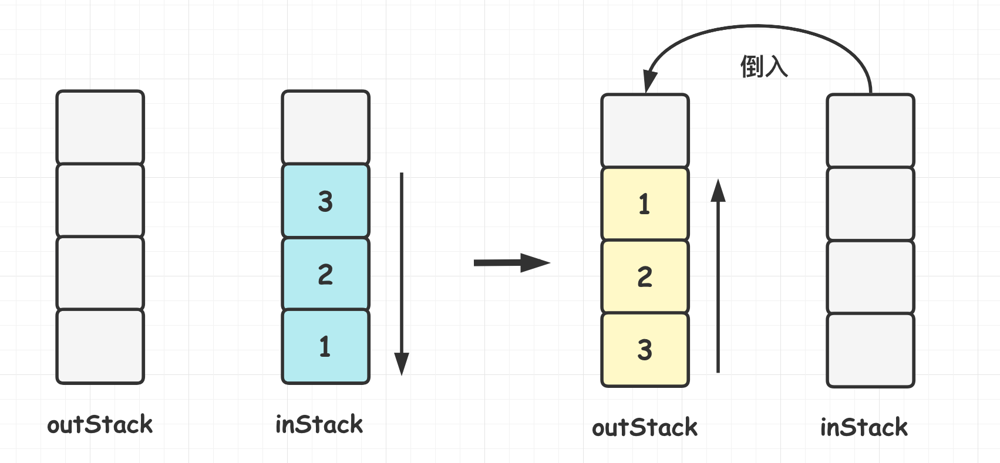
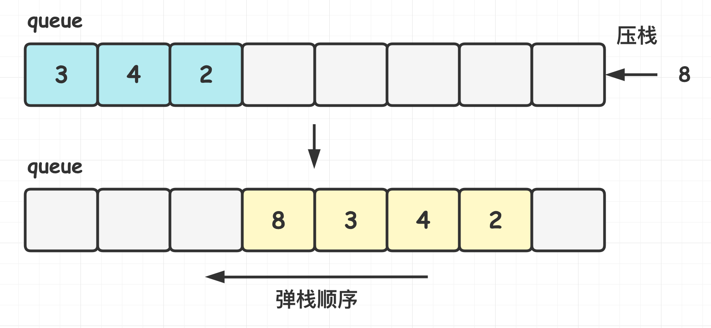
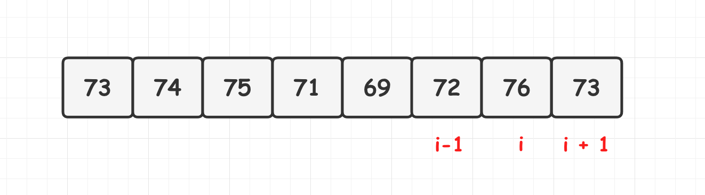
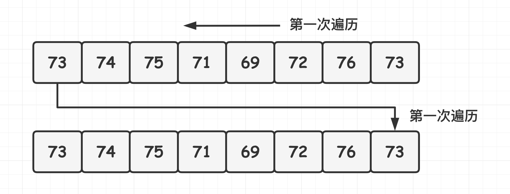

[TOC]

### 栈与队列题目

#### 用栈实现队列[232.简单]

**题目描述:** https://leetcode-cn.com/problems/implement-queue-using-stacks

使用栈实现队列的下列操作: 

- push(x): 将一个元素放入队列的尾部. 
- pop(): 从队列首部移除元素. 
- peek(): 返回队列首部的元素(不删除). 
- empty(): 返回队列是否为空. 

**题解1: 双栈法**



栈的顺序为后进先出, 而队列的顺序为先进先出. 准备两个栈 inStack 和 outStack.

**压栈**直接往 inStack 中压入. 

**弹栈**时, 如果 outStack 中有元素, 则直接弹出 outStack 栈顶元素. 当 outStack 中没有元素时, 再把 inStack 中的元素全部倒入到 outStack 中再进行弹栈, 这样可以保证先进先出的顺序. 

整体时间复杂度 O(1), 空间复杂度 O(N).

```java
class MyQueue {

    private Stack<Integer> inStack;
    private Stack<Integer> outStack;

    private int head;

    public MyQueue() {
        inStack = new Stack<>();
        outStack = new Stack<>();
    }

    public void push(int x) {
        // 直接压入inStack
        inStack.add(x);
    }

    public int pop() {
        // 边界情况,都没有元素
        if (outStack.isEmpty() && inStack.isEmpty()) {
            throw new IllegalStateException("No element.");
        }

        // 当outStack为空但inStack不为空时,将inStack中的元素全部转移到outStack中
        if (outStack.isEmpty()) {
            while (!inStack.isEmpty()) {
                outStack.add(inStack.pop());
            }
        }

        return outStack.pop();
    }

    public int peek() {
        if (outStack.isEmpty() && inStack.isEmpty()) {
            throw new IllegalStateException("No element.");
        }

        if (outStack.isEmpty()) {
            while (!inStack.isEmpty()) {
                outStack.add(inStack.pop());
            }
        }
        return outStack.peek();
    }

    public boolean empty() {
        return outStack.isEmpty() && inStack.isEmpty();
    }
}
```

#### 用队列实现栈[225.简单]

**题目描述**: https://leetcode-cn.com/problems/implement-stack-using-queues

使用队列实现栈的下列操作: 

- push(x): 元素 x 入栈. 元素取值范围: 1 <= x <= 9.
- pop(): 移除栈顶元素. 
- top(): 获取栈顶元素. 
- empty(): 返回栈是否为空. 

**题解1: 双队列法**

类似与上一个题, 采用双队列的形式, 压栈和弹栈操作都在一个队列进行. 比较简单.

**题解2: 单队列循环法**



在将一个元素 x 插入队列时, 为维护**后进先出**顺序, 需要让 **x 插入队列首部**. 队列的**默认插入顺序是队列尾部**, 因此在将 x **插入队列尾部**之后, 需要让**除了 x 之外的所有元素出队列**, **然后依次再入队列**, 也就是**换个方向**插入到队列**末尾**. 

过程: 每次插入元素的时候都入到队列尾部, 然后把前面的元素全部搬到当前元素后面. 搬运的元素个数即当前队列的大小. 

```java
private Queue<Integer> queue = new LinkedList<>();

public void push(int num) {
    // 得到当前队列的size
    int size = queue.size();
    // 新元素加入到队列
    queue.add(num);
    // 每次push的时候都把前面的元素全部搬运到刚插入的元素的后面,新元素成为栈顶
    for (int i = 0; i < size; i++) {
        queue.add(queue.poll());
    }
}

public int pop() {
    return queue.remove();
}

public int top() {
    return queue.peek();
}

public boolean empty() {
    return queue.isEmpty();
}
```

#### 有效的括号[20.简单]

**题目描述**: https://leetcode-cn.com/problems/valid-parentheses

给定一个**只包括** '(', ')', '{', '}', '[', ']' 的字符串, 判断**字符串是否有效**. 有效字符串需满足: 左括号必须用相同类型的右括号闭合; 左括号必须以正确的顺序闭合; 注意空字符串可被认为是有效字符串. 注意这个字符串**只包含**有这几个符号. 

```html
输入: "()[]{}" 输出: true

输入: "([)]"   输出: false
```

**题解1: 辅助栈法**

利用**辅助栈**实现匹配. 遇到**左括号就压栈, 遇到右括号就弹栈**, 且需要看**弹出的栈是否匹配**, 最后看栈**是否为空**即可. 剪枝: 奇数长度的字符串不符合条件.

```java
public boolean isValid(String str) {

    if (Objects.isNull(str) || str.length() == 0) {
        return false;
    }

    // 奇数长度字符串不符合
    if (str.length() % 2 == 1) {
        return false;
    }

    Deque<Character> stack = new LinkedList<>();
    // 遍历字符串元素
    for (char c : str.toCharArray()) {
        // 遇到开符号则压栈
        if (c == '(' || c == '{' || c == '[') {
            stack.push(c);
            // 遇到闭括号则弹栈对比
        } else {
            // 栈为空直接为false
            if (stack.isEmpty()) {
                return false;
            }
            // 弹出栈顶判断与当前括号是否匹配
            char temp = stack.pop();
            if ((temp == '(' && c != ')')) return false;
            if ((temp == '[' && c != ']')) return false;
            if ((temp == '{' && c != '}')) return false;
        }
    }
    // 最后看栈是否为空
    return stack.isEmpty();
}
```

#### 栈的压入弹出序列匹配[946.中等]

**题目描述**: https://leetcode-cn.com/problems/validate-stack-sequences/submissions/

输入两个整数序列, 第一个序列表示栈的**压入顺序**, 请判断第二个序列是否可能为该栈的**弹出顺序**. 假设压入栈的所有**数字均不相等**. 例如序列 1, 2, 3, 4, 5 是某栈的压入顺序, 序列 4, 5, 3, 2, 1 是该压栈序列对应的一个弹出序列, 但 4, 3, 5, 1, 2 就不可能是该压栈序列的弹出序列. (注意: 这两个序列的长度是相等的). 

**题解1: 模拟栈法**

借助一个**辅助栈进行模拟**, 遍历**压栈**序列放入到辅助栈中模拟压栈行为. 先将第一个元素放在栈中, 这里是 1, 然后判断**栈顶元素**是不是**出栈序列的第一个元素**, 这里 1≠4, 所以**继续压栈**, 直到**相等之后开始出栈**. 出栈一个元素, 对于出栈序列**向后移动一位**, 直到**不相等**, 这样循环等压栈顺序遍历完成, 如果辅助栈还**不为空**, 说明弹出序列**不是**该栈的弹出顺序. 

**举例**: 入栈 1, 2, 3, 4, 5, 出栈 4, 5, 3, 2, 1. 首先 1 入辅助栈, 此时栈顶 1≠4, 继续入栈 2. 此时栈顶 2 ≠ 4, 继续入栈 3. 此时栈顶 3 ≠ 4, 继续入栈 4 . 此时栈顶 4＝4, 出栈 4, 弹出序列向后一位, 此时为 5, 辅助栈里面是 1, 2, 3. 此时栈顶 3 ≠ 5, 继续入栈 5. 此时栈顶 5 = 5, 出栈 5, 弹出序列向后一位, 此时为 3, 辅助栈里面是 1, 2, 3. 

```java
public boolean validateStackSequences(int[] pushArray, int[] popArray) {
    
    if (popArray.length == 0 || pushArray.length == 0) return true;
    // 辅助栈
    Stack<Integer> stack = new Stack<>();
    // 出栈数组指针指向首位
    int popIndex = 0;
    // 遍历压栈序列
    for (int i = 0; i < pushArray.length; i++) {
        // 不断将入栈数组压栈
        stack.push(pushArray[i]);
        // 每压栈一个元素后判断栈顶元素是否是等于出栈数组索引处的值
        // 如果是则不断弹栈直到不相等为止, 弹栈时确保栈不为空
        while (!stack.isEmpty() && stack.peek() == popArray[popIndex]) {
            // 弹出元素,并将出栈序列指针后移
            stack.pop();
            popIndex++;
        }
    }
    // 最后判断栈是否为空
    return stack.isEmpty();
}
```

**题解2: 数组模拟法**

使用数组来实现栈的作用, **模拟出入栈操作**. **size 表示栈**的大小, size - 1 就是**栈顶**的位置. 

注意: 用**数组**来实现栈, 虽然存取更快, 但多数情况下**其实不推荐**. 特别是数组 pushArray 可能特别大的时候, 那作为栈的数组 stack 也会特别大. 但实际上**同时存在栈中的元素往往不是特别多**, 这就存在很大的空间浪费. 代码其实跟上面差不多. 

```java
public boolean validateStackSequences2(int[] pushArray, int[] popArray) {
    int[] stack = new int[pushArray.length];
    int size = 0;
    for (int i = 0, j = 0; i < pushArray.length; i++) {
        stack[size++] = pushArray[i];
        while (size != 0 && stack[size - 1] == popArray[j]) {
            size--;
            j++;
        }
    }
    return size == 0;
}
```

### 单调栈类题目

单调栈实际上就是栈, 只是利用了一些巧妙的逻辑, 使得每次**新元素入栈**后, 栈内的元素都保持有序(单调递增或单调递减). 

#### 最小值栈[155.简单]

**题目描述**: https://leetcode-cn.com/problems/min-stack

设计一个支持 push, pop, top 等操作, 并能在**常数时间内检索到最小元素的栈**. 

- push(x): 将元素 x 压入栈中. 
- pop(): 删除栈顶的元素. 
- top(): 获取栈顶元素. 
- getMin(): **检索栈中的最小元素**. 

**题解1: 辅助栈法**

借用一个辅助栈 **minStack**, 用于不断存储获取 stack 中**最小值**. 

- push()方法: 每当 **push() 新值**进来时, 如果 **小于等于 minStack** 栈顶值, 则**一起 push()** 到 minStack, 即**更新**了栈顶最小值. 
- pop()方法: 判断将 pop() 出去的元素值**是否是 minStack 栈顶元素值**(即最小值), 如果是则将 minStack 栈顶元素**一起 pop()**, 这样可以保证 minStack 栈顶元素始终是 stack 中的最小值. 
- getMin()方法: 返回 minStack **栈顶**即可. 

minStack 作用分析: minStack 等价于**遍历** stack 所有元素, 把升序的数字都删除掉, 留下一个从**栈底到栈顶降序**的栈. 相当于给 stack 中的降序元素做了标记, 每当 pop() 这些降序元素, minStack 会将相应的栈顶元素 pop() 出去, 保证其**栈顶元素始终是 stack 中的最小元素**. 

```java
private Stack<Integer> dataStack = new Stack<>();
private Stack<Integer> minStack = new Stack<>();

public void push(int data) {
    // 压入普通栈
    dataStack.push(data);
    // 如果当前最小值栈为空或新值小于最小值栈的栈顶, 则同时压入最小值栈
    if(minStack.isEmpty() || data <= minStack.peek()) {
        minStack.push(data);
    }
}

public void pop() {
    // 如果弹出的元素等于最小值栈的栈顶, 则两个栈同时弹出
    if (dataStack.peek().equals(minStack.peek())) {
        dataStack.pop();
        minStack.pop();
    } else {
        // 否则只弹出普通栈数据
        dataStack.pop();
    }
}

public int top() {
    return dataStack.peek();
}

public int getMin() {
    // 获取最小值
    return minStack.peek();
}
```

对于实现**最小值队列**问题, 可以**先将队列使用栈**来实现, 然后就**将问题转换为最小值栈**, 这个问题出现在 编程之美: 3.7. **最大值栈**其实也是类似的解法. 

#### 每日温度[739.中等]

**题目描述**: https://leetcode-cn.com/problems/daily-temperatures

请根据**每日 气温 列表**, 重新生成一个列表. 对应位置的输出为: 要想观测到**更高的气温**, 至少需要**等待的天数**. 如果气温在这之后都不会升高, 请在该位置用 **0** 来代替. 

例如, 给定一个列表 temperatures: [73, 74, 75, 71, 69, 72, 76, 73], 输出 [1, 1, 4, 2, 1, 1, 0, 0]. 

```html
Input: [73, 74, 75, 71, 69, 72, 76, 73]
Output: [1, 1, 4, 2, 1, 1, 0, 0]
```

**题解1: 单调栈法**

维护一个单调栈，从右往左遍历数组，所以栈内元素单调递减。由于是从右往左遍历数组, 并将当前栈内所有**比当前元素小的元素全部出栈**, 最后再将当前元素入栈. 这是因为如果 temp[i] > temp[i - 1], 那么 temp[i] 之前的所有元素的下一个最大元素都不可能是 temp[i - 1], 因为 temp[i] 已经挡在前面了. 如下图所示.



这里的单调栈中存的是**索引位置**而不是具体的温度值. 索引值相减就是结果.

**视频讲解**: https://leetcode.cn/problems/daily-temperatures/solution/dong-hua-yan-shi-dan-diao-zhan-739mei-ri-iita/


整个过程为: 从右往左遍历数组, 将栈中小于当前元素的索引全部出栈, 此时就可以进行判断, 如果栈中没有元素了, 说明不存在下一个最大元素, 否则下一个最大元素就是当前栈顶索引对应的元素, 然后再把当前元素索引入栈, 因为可能前一个元素更小. 直到完成遍历.

```java
public int[] dailyTemperatures(int[] temp) {
    int[] res = new int[temp.length];
    Stack<Integer> stack = new Stack<>();
    // 从右往左遍历
    for (int i = temp.length - 1; i >= 0; i--) {

        // 把当前栈中比当前元素小的都弹出
        while (!stack.isEmpty() && temp[i] >= temp[stack.peek()]) {
            stack.pop();
        }
        // 栈为空 即后面没有比当前天温度高的
        // 栈不为空 此时栈顶元素对应的下标减去当前下标即为结果
        res[i] = stack.isEmpty() ? 0 : (stack.peek() - i);

        // 当前元素索引进栈
        stack.push(i);
    }
    return res;
}
```

#### 下一个更大元素[496.简单]

**题目描述:** https://leetcode-cn.com/problems/next-greater-element-i

给定两个 **没有重复元素** 的数组 **nums1 和 nums2**, 其中 nums1 是 nums2 的**子集**. **找到 nums1 中每个元素在 nums2  中的下一个比其大的值. **nums1 中数字 x 的下一个更大元素是指 x 在 nums2 中对应位置的右边的第一个比 x 大的元素. 如果不存在时对应位置输出 -1. 

```java
示例 1: 输入: nums1 = [4,1,2], nums2 = [1,3,4,2].   输出: [-1,3,-1]
解释:
    对于num1中的数字4, 无法在第二个数组中找到下一个更大的数字, 因此输出 -1. 
    对于num1中的数字1, 第二个数组中数字1右边的下一个较大数字是 3. 
    对于num1中的数字2, 第二个数组中没有下一个更大的数字, 因此输出 -1. 
示例 2: 输入: nums1 = [2,4], nums2 = [1,2,3,4].     输出: [3,-1]
```

**题解1: 单调栈法**

这是"每日温度"的升级版本. 可以忽略数组 nums1, 先对 nums2 中的**每一个元素**, 先利用**单调栈**的解法求出每个元素的**下一个更大的元素**. 并将这些答案放入 **HashMap 中**(这就是强调元素不相同的原因), 最后再遍历 nums1 直接找出答案. 

注意: 这里思想与"每日温度"是一样的, 只不过由于元素是不同的, 所以这里栈中这里**直接存的是元素值**而非索引值, 进行比较时亦是如此.

```java
public int[] nextGreaterElement(int[] nums1, int[] nums2) {
    // 存放元素与索引的map
    HashMap<Integer, Integer> map = new HashMap<>();
    // 辅助单调栈
    Deque<Integer> stack = new LinkedList<>();

    // 利用单调栈法求num2的每个元素的下一个最大元素
    for (int i = nums2.length - 1; i >= 0; i--) {

        // 将栈中比当前元素小的元素全部出栈
        while (!stack.isEmpty() && nums2[i] >= stack.peek()) {
            stack.pop();
        }

        // 如果栈为空则不存在下一个最大元素 否则栈顶元素就是当前元素的下一个最大元素
        int nextGreater = stack.isEmpty() ? -1 : stack.peek();
        // 将当前元素的下一个最大元素缓存到Map中
        map.put(nums2[i], nextGreater);

        // 当前元素入栈
        stack.push(nums2[i]);
    }

    // 构造结果
    int[] res = new int[nums1.length];
    for (int i = 0; i < nums1.length; i++) {
        res[i] = map.getOrDefault(nums1[i], -1);
    }
    return res;
}
```

#### 循环数组中下一个更大元素[503.中等]

**题目描述**: https://leetcode-cn.com/problems/next-greater-element-ii

给定一个**循环数组**(最后一个元素的下一个元素是数组的第一个元素), 输出**每个元素的下一个更大元素**. 数字 x 的下一个更大的元素是按数组遍历顺序, 这个数字之后的第一个比它更大的数, 这意味着你应该**循环地搜索**它的下一个更大的数. 如果不存在, 则输出 -1. 

```java
输入: [1,2,1]   输出: [2,-1,2]
解释: 第一个1的下一个更大的数是2;数字2找不到下一个更大的数; 第二个1的下一个最大的数需要循环搜索, 结果也是2. 
```

**题解1: 单调栈法**

这个题就是"下一个更大元素"的升级版本. 比较麻烦的就是当前元素的下一个最大元素在前面. 由于这道题的数组是**循环数组**, 因此需要将**每个元素都入栈两次**. 这种情况下, 只需要同样的操作**执行两次**即可. 也就是遍历两次数组.



最简单直接的做法就是上面的代码复制一份.

```java
public int[] nextGreaterElements(int[] nums) {
    // 辅助单调栈
    Deque<Integer> stack = new LinkedList<>();
    int[] res = new int[nums.length];

    Arrays.fill(res, -1);

    for (int i = nums.length - 1; i >= 0; i--) {
        while (!stack.isEmpty() && nums[i] >= stack.peek()) {
            stack.pop();
        }

        int nextGreater = stack.isEmpty() ? -1 : stack.peek();
        res[i] = nextGreater;
        stack.push(nums[i]);
    }

    // 同样的操作再来一次
    for (int i = nums.length - 1; i >= 0; i--) {
        while (!stack.isEmpty() && nums[i] >= stack.peek()) {
            stack.pop();
        }
        int nextGreater = stack.isEmpty() ? -1 : stack.peek();
        res[i] = nextGreater;
        stack.push(nums[i]);
    }

    return res;
}
```

这样的代码就很丑了, 下面是通过**取模**的方式优化的代码, 原理一致.

```java
public int[] nextGreaterElements(int[] nums) {

    // 辅助单调栈
    Deque<Integer> stack = new LinkedList<>();
    int[] res = new int[nums.length];
    int length = nums.length;
    Arrays.fill(res, -1);

    for (int i = 2 * length - 1; i >= 0; i--) {
        // 将栈中比当前元素小的元素全部出栈
        while (!stack.isEmpty() && nums[i % length] >= stack.peek()) {
            stack.pop();
        }

        // 如果栈为空则不存在下一个最大元素 否则栈顶元素就是当前元素的下一个最大元素
        int nextGreater = stack.isEmpty() ? -1 : stack.peek();
        res[i % length] = nextGreater;
        // 当前元素入栈
        stack.push(nums[i % length]);
    }

    return res;
}
```


