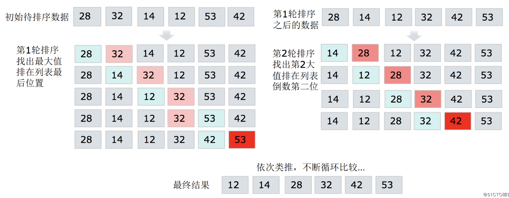
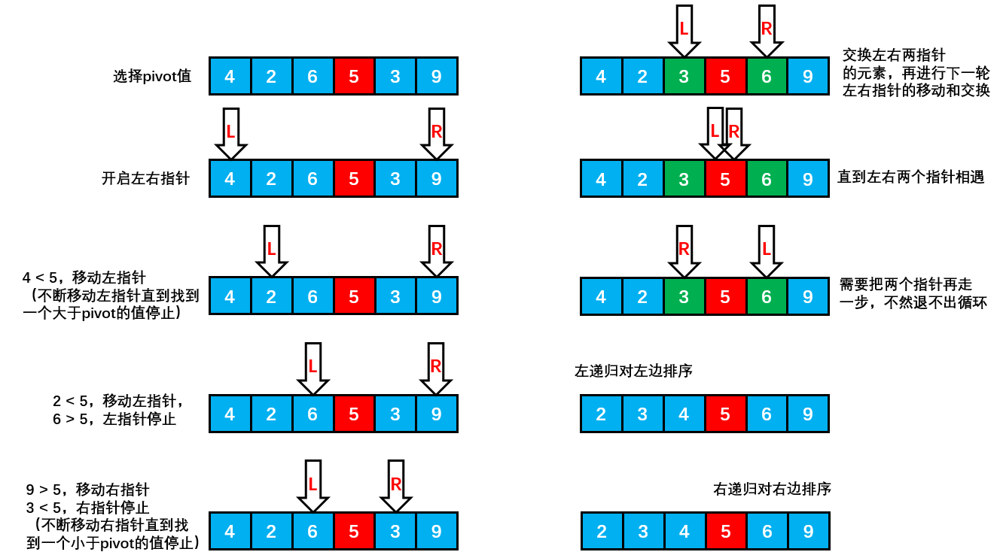
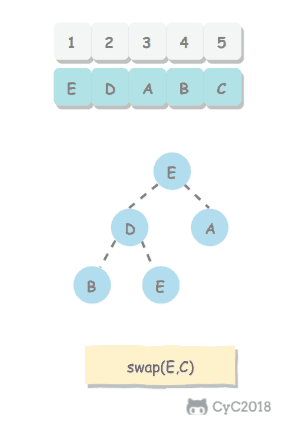
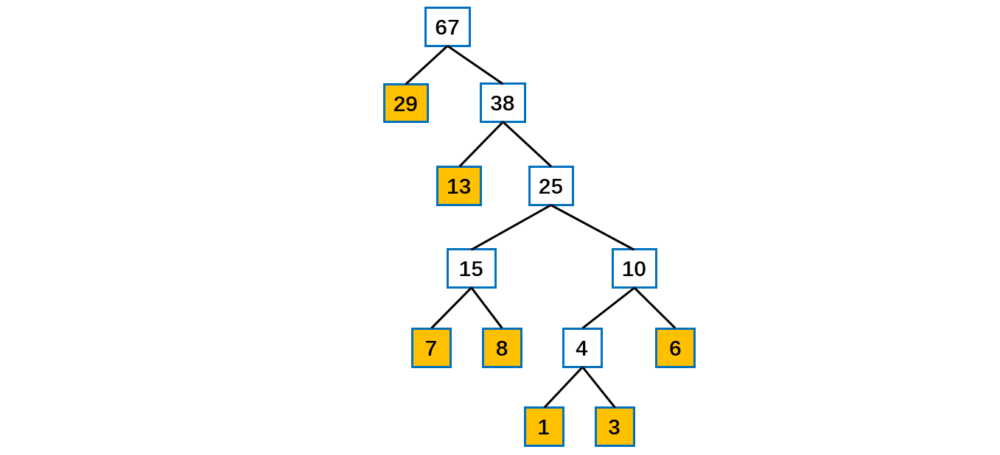

[TOC]

## 基础算法

### 排序算法

#### 基础

##### 1.概述

**待排序**的元素需要实现 **Comparable 接口**，该接口有 **compareTo()** 方法，可以用它来判断两个元素的大小关系，约定都是**基于比较**的排序。

排序算法的成本模型是==**比较和交换的次数**==。

##### 2.相关术语

- **稳定**：如果 a 原本在 b 前面，**而 a = b**，排序之后 **a 仍然在 b 的前面**；如果排序算法不改变**相等对象**的相对次序，则成为**稳定的**。
- **不稳定**：如果 a 原本在 b 的前面，而 a = b，排序之后 a 可能会出现在 b 的后面，则这是不稳定的。
- **内排序**：所有排序操作都在**内存**中完成。
- **外排序**：由于数据太大，因此把数据放在**磁盘**中，而排序通过磁盘和内存的数据传输才能进行。
- 时间复杂度：一个算法执行所耗费的时间。
- 空间复杂度：运行完一个程序所需内存的大小。
- **原地排序**：不占用额外内存。
- 非原地排序：占用额外内存。

##### 3.相关定理

- N 个互异数的数组的平均逆序数是 **N(N - 1) / 4**。
- 通过**交换相邻元素**进行排序的任何算法平均都需要 **Ω(N^2^)** 时间。
- 只使用**元素间比较**的任何排序算法均需要 **Ω(N log N)** 次比较。
- 对任何基于**比较**的算法，找**最小元**都必须至少用 **N - 1 次**比较。 
- 平均来说，基于**切分**的选择算法的运行时间是**线性**级别的。
- **快速排序是最快的通用排序算法**。---《算法第 4 版》

##### 4.排序算法总结

**排序算法的比较**

|         算法         | 稳定性 |          时间复杂度          | 空间复杂度 |           备注           |
| :------------------: | :----: | :--------------------------: | :--------: | :----------------------: |
|     **选择排序**     | **×**  |        N<sup>2</sup>         |     1      |                          |
|     **冒泡排序**     |   √    |        N<sup>2</sup>         |     1      |                          |
|     **插入排序**     |   √    |      N \~ N<sup>2</sup>      |     1      | 时间复杂度和初始顺序有关 |
|     **希尔排序**     | **×**  | N 的若干倍乘于递增序列的长度 |     1      |      改进版插入排序      |
|     **快速排序**     | **×**  |            NlogN             |    logN    |                          |
| **三向切分快速排序** | **×**  |          N \~ NlogN          |    logN    |   适用于有大量重复主键   |
|     **归并排序**     |   √    |            NlogN             |     N      |                          |
|      **堆排序**      | **×**  |            NlogN             |     1      |    无法利用局部性原理    |
|     **基数排序**     |   √    |             N*k              |            |        空间换时间        |

**原地排序**：选择排序、插入排序、希尔排序、快速排序、三向快速排序、堆排序。

**非原地排序**：归并排序。 

##### 5.Java的排序算法实现

Java 主要排序方法为 java.util.Arrays.**sort**()，该方法对于**基本数据类型**使用三向切分的**快速排序**，对于**引用类型**使用**归并排序**。

#### 选择排序

算法思路：从**未排序**的数组中**选择最小元素**，将它与数组的**第一个元素交换位置**；再从数组剩下的元素中选择出最小的元素，将它与数组的第二个元素交换位置。不断进行这样的操作，直到将整个数组排序。

选择排序需要 \~**N<sup>2</sup>/2 次比较和 \~N 次**交换，它的运行时间与输入无关，这个特点使得**它对一个已经排序的数组也需要这么多的比较和交换操作。**


```java
public static void selectionSort(int[] array) {
    // Base case
    if (array == null || array.length < 2) return;
    // 直接假设第一个是最小的元素，然后跟后面的逐一比较，如果更小则交换

    // 总共要经过 N-1 轮比较
    for (int i = 0; i < array.length - 1; i++) {
        // 假设当前位置为最小的元素
        int minValue = i;
        // 每轮需要比较的次数 N-i
        for (int j = i + 1; j < array.length; j++) {
            // 更新目前能找到的最小值元素的下标
            if (array[j] < array[minValue]) {
                minValue = j;
            }
        }

        // 将找到的最小值和i位置所在的值进行交换
        if (i != minValue) {
            int tmp = array[i];
            array[i] = array[minValue];
            array[minValue] = tmp;
        }
    }
}
```

需要 O(n^2^) 次比较和 O(n) 次交换。**平均**时间复杂度是 O(n^2^)。最优时，**最坏时和平均时都是O(n^2^)**。

#### 冒泡排序

算法思路：从左到右**不断交换相邻逆序**的元素，在一轮的循环之后，可以让未排序的最大元素**上浮到右侧**。在一轮循环中，如果没有发生交换，那么说明数组已经是**有序**的，此时可以直接退出。



通过从左到右不断交换相邻逆序的相邻元素，在一轮的交换之后，可以让**未排序的元素上浮到右侧**。


```java
public static void bubbleSort(int[] array) {
    // Base case
    if (array == null || array.length < 2) return;
    // 从尾部开始遍历
    for (int end = array.length - 1; end > 0; end--) {
        for (int i = 0; i < end; i++) {
            // 一轮之后将最大的值放到最后
            if (array[i] > array[i + 1]) {
                // 如果前一个值大于后一个则交换两者位置
                swap(array, i, i + 1);
            }
        }
    }
}

public static void swap(int[] array, int i, int j){
    int temp = array[i];
    array[i] = array[j];
    array[j] = temp;
}
```

平均复杂度为 O(N^2)，如果是**有序数组**，那么最好时间复杂度为 O(N)；最坏就是顺序是反着的，此时复杂度为 O(N^2)。 

#### 插入排序

每次都将当前元素插入到**左侧已经排序**的数组中，使得**插入之后**左侧数组**依然有序**。

对于数组 {3, 5, 2, 4, 1}，它具有以下**逆序**：(3, 2), (3, 1), (5, 2), (5, 4), (5, 1), (2, 1), (4, 1)，插入排序每次**只能交换相邻元素**，令**逆序数量减少 1**，因此插入排序需要**==交换的次数为逆序数量==**。

插入排序的时间复杂度取决于数组的**初始顺序**，如果数组已经部分**有序**了，那么逆序较少，需要的交换次数也就较少，时间复杂度较低。

- **平均**情况下插入排序需要 \~N<sup>2</sup>/4 比较以及 \~N<sup>2</sup>/4 次交换；
- **最坏**情况下需要 \~N<sup>2</sup>/2 比较以及 \~N<sup>2</sup>/2 次交换，最坏的情况是数组是**倒序**的；
- **最好**情况下需要 N-1 次比较和 0 次交换，最好的情况就是数组已经**有序**了。

插入排序的效率**最优**时是 **O(n)**，**最坏时是 O(n^2^)**，数组越接近有序，需要做的工作越少。


第 j 元素是通过不断**向左比较并交换**来实现插入过程：当第 j 元素小于第 j - 1 元素，就将它们的位置**交换**，然后令 j 指针向左移动一个位置，不断进行以上操作。


上述是插入排序流程。分成了**有序和无序两部分**，在比较时，需要将有序部分数组**右移**，为插入**腾出空间**。当 10 插入到 6 和 11 之间 时，需要将 6 往右移动才有空间给 10。

```java
public static void insertionSort(int[] array) {
    // Base case
    if (array == null || array.length < 2) return;
    // 从下标为1的元素开始选择合适的位置插入，因为下标为0的只有一个元素，默认是有序的
    for (int i = 1; i < array.length; i++) {
        // 记录当前要插入的数据
        int tmp = array[i];
        // 从已经排序的序列最右边的开始比较，找到比其小的数
        int j = i;
        // 当j大于0且待交换元素小于之前的元素
        while (j > 0 && tmp < array[j - 1]) {
            // 将前一个元素后移
            array[j] = array[j - 1];
            j--;
        }

        // 说明存在比其小的数，插入
        if (j != i) {
            array[j] = tmp;
        }
    }
}
```

简单版本。

```java
public static void insertionSort(int[] array) {
    // Base case
    if (array == null || array.length < 2) {
        return;
    }
    // 从第一个开始遍历
    for (int i = 1; i < array.length; i++) {
        for (int j = i - 1; j >= 0 && array[j] > array[j + 1]; j--) {
            swap(array, j, j + 1);
        }
    }
}

public static void swap(int[] arr, int i, int j) {
    arr[i] = arr[i] ^ arr[j];
    arr[j] = arr[i] ^ arr[j];
    arr[i] = arr[i] ^ arr[j];
}
```

自己写的简便版本：

```java
private static void insertSort(int[] nums) {
    // i从1开始，第0个默认有序
    for (int i = 1; i < nums.length; i++) {
        // 从i起从右往左开始插入
        int j = i;
        // 遇到一个顺序不对的就进行交换
        while (j > 0 && nums[j] < nums[j - 1]) {
            swap(nums, j, j - 1);
            // 移动指针
            j--;
        }

    }
}
```

#### 希尔排序

##### 1.概述

对于简单插入排序的问题：数组 arr = {2, 3, 4, 5, 6, 1} 这时需要插入的**数 1**(最小)，这样的过程是：

```java
{2,3,4,5,6,6}
{2,3,4,5,5,6}
{2,3,4,4,5,6}
{2,3,3,4,5,6}
{2,2,3,4,5,6}
{1,2,3,4,5,6}
```

当需要插入的数是较小的数时，**后移的次数明显增多**，对效率有影响，插入排序有**多少个逆序对**，就需要交换多少次。

对于**大规模**的数组，插入排序很慢，因为它只能交换**相邻**的元素，每次**只能将逆序数量减少 1**。希尔排序的出现就是为了解决插入排序的这种局限性，它通过**==交换不相邻的元素==，每次可以将逆序数量减少大于 1**。希尔排序也是一种**插入排序**，它是简单插入排序经过优化之后的一个更高效的版本，也称为==**缩小增量排序**==。

**希尔排序使用==插入排序==对==间隔 h 的序列进行排序==。通过不断==减小 h，最后令 h = 1==，就可以使得整个数组是有序的**。

##### 2.增量序列

看下希尔排序的基本步骤，**选择增量 gap = length / 2，缩小增量继续以 gap = gap / 2 的方式**，这种增量选择可以用一个**序列**来表示：

```java
n/2, (n/2)/2, ..., 1
```

这种序列称为**增量序列**。

希尔排序的**增量序列**的选择与证明是个数学难题，上述的增量序列也是希尔建议的增量，称为**希尔增量**，但其实这个增量序列**不是最优**的。可以证明采用希尔增量时**最坏情况**下运行时间是 **O(n^2^)**。

采用其他的增量序列还可能降低最坏运行时间。Hibbard 提出一个**不同的增量序列**，形如：

```java
1, 3, 7, ..., 2^k-1 
```

可以证明采用 Hibbard 增量时**最坏情况**下运行时间是 **O(n^1.5^)**。

##### 3.过程图解

初始增量步长 **gap = length / 2**，意味着整个数组被分为 **5 组**，如下图颜色分别对应。然后在**各自组内进行插入排序**。

第二次 gap = 5 / 2 = 2，所以数组被分为 **2 组**，如颜色对应所示，再对两组分别进行**直接插入排序**，使得整体更加有序。

最后再缩小增量 gap = 2 / 2 = 1，此时**再次进行插入排序**就**很快**了。


在希尔排序的理解时倾向于对于**每一个分组**，逐组进行处理；但在代码实现中可以不用这么按部就班地处理完一组再调转回来处理下一组（这样还得加个 for 循环去处理分组）比如 [5, 4, 3, 2, 1, 0] ，首次增量设 gap = length / 2 = 3，则为 3 组 [5, 2] [4, 1] [3, 0]。实现时**不用**循环按组处理，可以从第 gap 个元素开始，逐个**跨组处理**。同时在插入数据时，可以采用元素交换法寻找最终位置。

##### 4.代码实现

希尔排序时 对**有序序列**在插入时**采用移位法**，并测试排序速度，发现快了许多。合理可用。

```java
public static void shellSort(int[] nums) {

    // 增量gap, 并逐步的缩小增量
    for (int gap = nums.length / 2; gap > 0; gap /= 2) {
        // 从第gap个元素，逐个对其所在的组进行直接插入排序
        for (int i = gap; i < nums.length; i++) {
            int j = i;
            int temp = nums[j];
            if (nums[j] < nums[j - gap]) {
                while (j - gap >= 0 && temp < nums[j - gap]) {
                    // 移动
                    nums[j] = nums[j - gap];
                    j = j - gap;
                }
                // 当退出while后，就给temp找到插入的位置
                nums[j] = temp;
            }
        }
    }
}
```

希尔排序的运行时间**达不到**平方级别，使用递增序列 1, 4, 13, 40, ...  的希尔排序所需要的比较次数不会超过 N 的若干倍乘于递增序列的长度。

##### 5.效率与优化

**希尔排序的效率**

采用一般**增量序列**时，最佳复杂度 O(**nlogn**)，平均情况 **O(nlogn)**。

调整间隔能改善其效率，一般是**避免间隔 gap 是偶数值**。因为当 gap 是偶数时的比较会在增量是 gap / 2 的下一次排序中**重复**。在此种情况下，当 gap 为偶数时，只需将其加 1 。即可将最坏情形改进为 **O(n^1.5^)**。

> **如何优化希尔排序？**

- 优化**增量序列**。采用其他的增量序列还可能降低最坏运行时间。
- 因为是基于**插入排序**的，所以可以使用其插入排序及其优化中给出的优化方案。即：进行了预处理操作，并在内循环中，总是将**较大的元素向右移动**。

#### 归并排序

##### 1.概述

**归并排序**的思想是将数组分成**两部分**，分别进行排序，然后归并起来。基本操作就是**合并两个已排序的数组**，由于两个数组是已经排序的，所以若将**输出放到==第三个==数组**中，则该算法可以通过对输入数据**一趟排序**完成。

归并排序是一种**分治**策略。


将两个**数组合并**起来的步骤如下图所示，即维护**两个指针**分别指向两个有序的数组，然后分别比较两者的值，**值小的拷贝到辅助数组**里面，并将此索引进行移动，直到某一边全部移动完毕，然后把**剩余的没有复制完成的全部拷贝**到辅助数组（如下图中 1 2 3 6 全部拷贝到辅助数组中后，左边还剩下 7、8），最后把辅助数组**拷贝到原数组**即可。


维护**两个指针**分别比较，然后将较小的项复制到**第三个数组**中， 因此需要额外的**辅助数组**，会消耗额外**内存**空间。

一般使用**递归**归并排序，逐层排序。真正的排序发生在**合并步骤**而不是递归调用的步骤。8 个数据会 merge 7 次，80000 个数据会 merge 8000 - 1 = 79999 次。


##### 2.代码实现

以下是归并排序的算法，类似于**树的后序遍历**，即**先处理左右**再进行数据 **merge**。merge 的时候也就是双指针普通的合并两个有序数组的算法。

```java
public static void mergeSort(int[] array) {
    // Base case
    if (array == null || array.length < 2) return;
    mergeSort(array, 0, array.length - 1);
}

private static void mergeSort(int[] array, int left, int right) {
    // 当切分到仅一个元素时返回
    if (left == right) return;
    // 当前数组中值
    int mid = left + ((right - left) / 2);
    // 分别对两边排序
    mergeSort(array, left, mid);
    mergeSort(array, mid + 1, right);
    // 最后对左右两部分结果进行合并
    merge(array, left, mid, right);
}

public static void merge(int[] array, int left, int mid, int right) {
    // 辅助数组
    int[] tmp = new int[array.length];
    // p1、p2是检测指针，k是元素存放指针
    int p1 = left, p2 = mid + 1, k = left;
    // 也就是合并两个有序的数组到一个数组
    while (p1 <= mid && p2 <= right) {
        if (array[p1] <= array[p2]) {
            tmp[k++] = array[p1++];
        } else {
            tmp[k++] = array[p2++];
        }
    }
    // 说明其中一个数组复制完了，直接将后面所有元素加到合并的序列中
    while (p1 <= mid) tmp[k++] = array[p1++];
    while (p2 <= right) tmp[k++] = array[p2++];

    // 复制回原数组
    for (int i = left; i <= right; i++) {
        array[i] = tmp[i];
    }
}
```

##### 3.归并排序效率

归并排序在**所有情形下**都是 **==O(NlogN)==** 的，其缺点是需要**临时辅助数组**进行**合并**。归并排序是**稳定**的。merge 过程是不管是否有序的。归并排序的运行时间严重依赖于比较元素和在数组中移动位置的相对开销，这些开销是与**编程语言**相关的。归并排序是一种渐进最优的基于比较排序的算法。

> **如何优化归并排序**？

归并算法中对于**小规模**的子数组可以采用**插入排序**。

#### **快速排序**

##### 1.概述

快速排序是最快的通用排序算法，它的内循环的指令很少，而且它还能利用缓存，因为它总是顺序地访问数据。它的运行时间近似为 ~cNlogN，这里的 c 比其它线性对数级别的排序算法都要小。使用三向切分快速排序，实际应用中可能出现的某些分布的输入能够达到线性级别，而其它排序算法仍然需要线性对数时间。

快排是对冒泡排序的改进，也是一种**分治**的递归算法。快速排序是一种**原地排序**算法。

快速排序通过一个==**切分枢轴元**（pivot）==将数组分为两个子数组，==左子数组**小于等于**切分元素==，右子数组大于等于切分元素，将这两个子数组排序也就将整个数组排序了。

pivot 十分重要，直接影响排序的**时间**。可以选取**左端、右端以及中间三个元素**，并取其**中值**作为枢轴元。称为**三数中值分割法**。一种较为安全的做法是**随机选取**枢轴元，可以用下面的方式随机选：

```java
pivot = left + (int) (Math.random() * (right - left + 1))
```

##### 2.算法实现

过程如下图所示。




代码实现有好几种写法，下面的版本中 pivot 值在最**前面**（**面试用这个即可**）：

```java
public static void quickSort(int[] array) {
    if (array == null || array.length < 2) return;
    quickSort(array, 0, array.length - 1);
}

private static void quickSort(int[] array, int left, int right) {
    if (left < right) {
        int pivot = partition(array, left, right);
        quickSort(array, left, pivot - 1);
        quickSort(array, pivot + 1, right);
    }
}

private static int partition(int[] array, int left, int right) {
    // 挑选一个随机的pivot索引并交换到第一个位置上
    int randomPivot = left + (int) (Math.random() * (right - left + 1));
    swap(array, randomPivot, left);
    // 数组第一个值为pivot值
    int pivotValue = array[left];
    int i = left + 1;
    int j = right;
    while (true) {
        while (i <= j && array[i] <= pivotValue) i++;
        while (i <= j && array[j] >= pivotValue) j--;
        // 数组越界退出
        if(i >= j) break;
        // 交换两个值
        swap(array, i, j);
    }
    // 交换第一个pivot元素和j位置
    swap(array, left, j);
    return j;
}
```

##### 3.性能分析

快速排序是**原地排序**，**不需要辅助数组，但是==递归调用==需要辅助栈**。快速排序**最好情况**下是每次都正好将数组**对半分**，这样递归调用**次数才是最少**的。这种情况下比较次数为 C<sub>N</sub>=2C<sub>N/2</sub>+N，复杂度为 **O(NlogN)**。可以证明**平均情况**也是 **O(NlogN)**。

**最坏情况**下，第一次从最小的元素切分，第二次从第二小的元素切分，如此这般。因此**最坏**的情况下需要比较 N<sup>2</sup>/2，此时复杂度是 **O(N^2^)**。为了防止数组最开始就是有序的，在**进行快速排序时需要随机打乱数组**。

综上：平均 **O(NlogN)**，最好 **O(NlogN)**，最坏 **O(N^2^)**。

##### 4.快排优化

**1. 切换到插入排序**

因为快速排序在小数组中也会递归调用自己，对于**小数组（小于 20 项），插入排序比快速排序的性能更好**，因此在**小数组**中可以切换为**插入排序**。

**2. 三数取中**

最好的情况是每次都能取数组的**中位数**作为切分元素，但是计算中位数的代价很高。一种折中方法是取第一项、中间项和最后一项 3 个元素，并取三个数的中间大小元素作为切分元素。

**3. 三向切分**

对于有**大量重复元素**的数组，可以将数组切分为**三部分**，分别对应**小于、等于和大于切分元素**。**三向切分快速排序**对于有**大量重复元素**的随机数组可以在线性时间内完成排序。


以下是左神算法班版本，pivot 值在最后面。实现过程图解参考：https://blog.csdn.net/u010452388/article/details/81218540

```java
// 对外暴露的方法
public static void quickSort(int[] array) {
    // Base case
    if (array == null || array.length < 2) {
        return;
    }
    // 传入待排数组和两个边界
    quickSort(array, 0, array.length - 1);
}

private static void quickSort(int[] array, int left, int right) {
    // 仅在没有越界的情况下进行
    if (left < right) {
        // 将pivot放到最末尾的位置
        // 每次随即选一个数与最后一个数交换进行快排 随机快排
        swap(array, left + (int) (Math.random() * (right - left + 1)), right);
        // //此数组长度永远为2,p[0]为等于区的左边界，p[1]为等于区的右边界
        int[] p = partition(array, left, right);
        // 将分出来的小于区重复上面的动作
        quickSort(array, left, p[0] - 1);
        // 将分出来的大于区重复上面的动作
        quickSort(array, p[1] + 1, right);
    }
}

/**
 * 对数组进行切分成三部分，最后返回等于的范围
 *
 * @param array 数组
 * @param left 左
 * @param right 右
 * @return 等于的范围
 * 总有一个等于pivot的位置，就是等于pivot自身
 * 返回等于区域(左边界，右边界), 所以返回一个长度为2的数组res, res[0] res[1]
 */
public static int[] partition(int[] array, int left, int right) {
    // 声明一个小于区的索引
    int less = left - 1;
    // 声明一个大于区的索引
    int more = right;
    // left 表示当前数的位置   arr[R]->划分值
    while (left < more) {
        // 小于pivot值
        if (array[left] < array[right]) {
            swap(array, ++less, left++);
            // 大于pivot值
        } else if (array[left] > array[right]) {
            swap(array, --more, left);
        } else {
            // 等于pivot值
            left++;
        }
    }
    // 如果index索引与more相遇，则退出循环，并且right位置数与more位置数交换
    swap(array, more, right);
    // 用来记录等于区的左边界和右边界对应的索引
    return new int[] {less + 1, more};
}

public static void swap(int[] array, int i, int j) {
    int tmp = array[i];
    array[i] = array[j];
    array[j] = tmp;
}
```

##### 5.快排应用

###### (1) 基于切分的快速选择算法

**求一个数组的第 k 大元素，可以使用堆排序，也可以使用基于快排思想的快速选择算法**。

快速排序的 partitionSort() 方法，会返回一个整数 j 使得 a[l .. j - 1] **小于等于 a[j]**，且 a[j + 1 .. h] **大于等于 a[j]**，此时 a[j] 就是数组的**第 j 大元素**。可以利用这个特性**找出数组**的**第 k 个元素**。

该算法是**线性级别**的，假设每次能将数组二分，那么比较的总次数为 (N+N/2+N/4+..)，直到找到第 k 个元素，这个和显然小于 2N。

```java
public int select(int[] nums, int k) {
    int left = 0, right = nums.length - 1;
    while (right > left) {
        int pivot = partition2(nums, left, right);
        if (pivot == k) {
            return nums[k];
        } else if (pivot > k) {
            right = pivot - 1;
        } else {
            left = pivot + 1;
        }
    }
    return nums[k];
}
```

Java 中的 Array 类的 **sort 方法**使用**快速排序**对**基本类型的数组**进行升序排序。

#### 堆排序

##### 1.概述

堆排序是利用**堆**这种数据结构而设计的一种排序算法。**堆**是具有以下性质的**==完全二叉树==**：每个结点的值都大于或等于其左右孩子结点的值，称为**大顶堆**；每个结点的值都小于或等于其左右孩子结点的值，称为**小顶堆**。一般**升序**采用**大顶堆**，**降序**采用**小顶堆**。**注意** : 没有要求结点的左孩子的值和右孩子的值的大小关系。

##### 2.算法实现

**堆排序基本思想**：将待排序序列构造成一个**大顶堆**。此时整个序列的**最大值**就是堆顶的**根节点**。将堆顶元素与**末尾元素进行交换**，此时**末尾**就为**最大值**。然后将剩余 n - 1 个元素**重新构造成一个堆**，这样会得到 n - 1 个元素的**最大值**，再将当前堆顶的最大值与**第 n - 1 个元素的末尾值**进行交换。**如此反复执行**，便能得到一个有序序列。把**最大元素**和当前堆中数组的**最后一个元素**交换位置，并且**不删除它**，那么就可以得到一个**从尾到头的递减**序列，从正向来看就是一个递增序列，这就是**堆排序**。

###### (1)构建堆

**无序数组**建立堆最直接的方法是从**左到右遍历数组**进行**上浮**操作；**==一个更高效的方法是从右至左进行下沉操作==**，如果一个节点的两个节点都**已经是堆有序**，那么进行下沉操作可以使得这个节点为根节点的堆有序。叶子节点不需要进行下沉操作，可以忽略叶子节点的元素，因此只需要**遍历一半**的元素即可。构建完后的堆**不是完全有序**的，此时需要再进行进一步的**排序**。


###### (2)交换堆顶元素与最后一个元素

将构造好的**堆的堆顶**与最后一个元素进行交换，**交换之后**需要进行**下沉**操作维持堆的**有序状态**。



整体代码如下所示：

```java
public static void heapSort(int[] array) {
    // Base case
    if (array == null || array.length < 2) return;
    // 这一步是不断取元素构造大顶堆 构建完成之后堆值并不是完全有序的
    for (int i = 0; i < array.length; i++) {
        buildHeap(array, i);
    }
    // 当前size等于数组大小 size表示结构的大小
    int size = array.length;
    // 交换堆顶元素与最后一个元素
    swap(array, 0, --size);
    // 不断把堆顶元素与最后一个元素进行交换 然后进行下沉
    while (size > 0) {
        // 重组堆使其满足大顶堆
        sink(array, 0, size);
        // 再交换堆顶与最后一个元素
        swap(array, 0, --size);
    }
}

/**
 * 将元素插入堆并进行上浮
 */
public static void buildHeap(int[] array, int index) {
    // 如果子节点元素比父节点小就交换
    while (array[index] > array[(index - 1) / 2]) {
        swap(array, index, (index - 1) / 2);
        // 索引变成父节点索引
        index = (index - 1) / 2;
    }
}

/**
 * 堆顶元素下沉操作
 *
 * @param array 数组
 * @param index 索引
 * @param size 当前剩余堆的大小
 */
private static void sink(int[] array, int index, int size) {
    // 左子节点
    int left = index * 2 + 1;
    while (left < size) {
        int largest = (left + 1 < size && array[left + 1] > array[left]) ? left + 1 : left;
        largest = array[largest] > array[index] ? largest : index;
        if (largest == index) break;
        swap(array, largest, index);
        index = largest;
        left = index * 2 + 1;
    }
}

private static void swap(int[] arr, int i, int j) {
    int tmp = arr[i];
    arr[i] = arr[j];
    arr[j] = tmp;
}
```

##### 3.效率分析

一个堆的高度为 **logN**，因此在堆中插入元素和删除最大元素的**复杂度都为 logN**。对于**堆排序**，由于要对 **N 个节点**进行**下沉操作**，因此复杂度为 **NlogN**。堆排序是一种**原地排序**，没有利用额外的空间。

现代操作系统很少使用堆排序，因为它无法利用局部性原理进行缓存，也就是数组元素很少和相邻的元素进行比较和交换。

#### 非比较排序

计数排序、基数排序、桶排序等属于**非比较排序**算法，平均时间复杂度都是 **O(n)**。这些排序因为其待排序**元素本身**就含有了**定位特征**，因而不需要比较就可以确定其前后位置，从而可以突破比较排序算法时间复杂度 O(nlgn) 的理论下限。

这三种排序算法都利用了**桶的概念**，但对桶的使用方法上有明显差异：

- **计数排序**：每个桶只存储**单一键值**。
- **桶排序**：每个桶存储**一定范围**的数值。
- **基数排序**：根据键值的**每位数字**来分配桶。

##### 1.计数排序

假设有[1, 2, 3, 1, 0, 4] 这六个数，这里面最大的值为 4，那么创建一个**长度为 4 的数组**，每个元素默认为 **0**，每个位置相当于一个**计数器**。然后遍历数组，在数字对应的位置处的**计数器 + 1** 即可。然后将计数用的数组中数的**个数按序取出**即可。

计数排序可能需要**占用大量空间**，因此它仅适用于**数据比较集中**的情况，比如 [0 \~ 100]，[10000 ~ 19999] 这样的数据。

##### 2.桶排序

桶排序与计数排序很相似，不过现在的**桶不单计数**，是实实在在地**放入元素**。举个例子，学校要对所有老师按年龄进行排序，这么多老师很难操作，那么先让他们**按年龄段进行分组**，20－30 岁的一组，30－40 岁一组，50－60 岁一组，然后**组内再排序**。这样效率就大大提高了，桶排序也是于这种思想。

操作步骤：

1. **确认范围**，亦即求取原数组的**最大值与最小值**。
2. 确认需要**多少个桶**（这个通常作为参数传入，不能大于原数组长度），然后最大值减最小值，除以桶的数量，算得每个桶最多能放多个元素，这个数称为桶的**最大容量**。
3. 遍历原数组的所有元素，除以这个最大容量，就能得到它要放入的桶的编号了。在放入时可以使用插入排序，也可以在合并时才使用快速排序。
4. 对**所有桶进行遍历**，如果桶内的元素已经排好序，直接一个个取出来，放到结果数组就行了。

##### 3.基数排序

###### (1)概述

基数排序是一种非比较型的整数排序算法。其基本原理是，按照**整数的每个位数分组**。在分组过程中，对于不足位的数据用 0 补位。

基数排序按照对**位数分组的顺序**的不同，可以分为 **LSD**（Least significant digit）基数排序和 **MSD**（Most significant digit）基数排序。

LSD 基数排序，是按照**从低位到高位**的顺序进行分组排序；MSD 基数排序，是按照从**高位到低位**的顺序进行分组排序。上述两种方式不仅仅是对位数分组顺序不同，其实现原理也是不同的。

- 基数排序是**线性时间**的排序，但是使用情况比较特殊。

- **不作为**通用排序算法。
- 负数的数组最好不要使用基数排序。
- 整数排序需要 10 个桶，字母排序需要 27 个桶。
- 基数排序是使用**空间换时间**的经典算法，基数排序所需要的**内存比较大**。如果排序的数据量较大，可能造成**内存溢出**。

比如排序：

```java
arr = {53, 3, 542, 748, 14, 241}
```

将其看成字符串进行排序，小于 100 的前面补 0 占位。

从个位到十位再到百位排序，每一位可能情况有 0 - 9 共 10 种情况，因此需要十个桶，将对应的数字放到对应的桶里面，桶里面是**有序**的。重排之后将桶里面的数据再次按照十位分入不同的桶中。最后按照**百位分入桶中**。最后实现排列。


###### (2)字符串使用基数排序实现字典排序

此外，基数排序不局限于数字，可以稍作变换，就能应用于字符串的字典排序中。我们先来一个简单的例子，只对都是小写字母的字符串数组进行排序。

小写字母一共 26 个，考虑到长度不一样的情况，需要对够短的字符串进行补充，这时补上什么好呢？不能直接上0，而是补空白。然后根据字母与数字的对应关系，弄 **27 个桶**，**空字符串对应 0**，a 对应 1，b 对应 2.... 字典排序是从左边开始比较， 因此需要用到 MST 基数排序。

### 二.其他算法

####  二分查找

二分查找基于**有序数组**。二分查找也称为折半查找，这种折半特性的算法时间复杂度为 **O(logN)**。

> 命题：在 N 个键的有序数组中进行**二分查找**最多需要 **(logN + 1)** 次比较。

##### 1.递归实现

**递归查找流程：**首先确定该数组的**中间**的下标。

```java
int mid = (left + right) / 2;
// 防止超出范围
int mid = left + (right - left) / 2;
```

代码如下：

```java
/**
 * 二分查找算法 递归实现
 *
 * @param array      数组
 * @param left  左边的索引
 * @param right 右边的索引
 * @param target     要查找的值
 * @return 如果找到就返回下标，如果没有找到就返回 -1
 */
public static int binarySearch(int[] array, int left, int right, int target) {
	// Base case
	if (array == null || array.length == 0) return -1;

	// 当left >right 时，说明已经递归整个数组，但是没有找到
	if (left > right) {
		return -1;
	}

	// 找中间索引与值
	int mid = left + (right - left) / 2;
	int midValue = array[mid];

	// 向右递归
	if (target > midValue) {
		return binarySearch(array, mid + 1, right, target);
		// 向左递归
	} else if (target < midValue) {
		return binarySearch(array, left, mid - 1, target);
	} else {
		// 等于时直接返回
		return mid;
	}
}
```

##### 2.迭代实现

也可**迭代**实现二分查找.注意结束迭代的条件就是 **leftIndex <= rightIndex** 。

```java
/**
 * 二分查找的迭代实现
 *
 * @param array  待查找的数组, arr是升序排序
 * @param target 需要查找的数
 * @return 返回对应下标，-1表示没有找到
 */
public static int binarySearch(int[] array, int target) {
	// 左右索引值
	int left = 0;
	int right = array.length - 1;
	// 说明继续查找
	while (left <= right) {
		int mid = left + (right - left) / 2;
		if (array[mid] == target) {
			return mid;
		} else if (array[mid] > target) {
			// 需要向左边查找
			right = mid - 1;
		} else {
			// 需要向右边查找
			left = mid + 1;
		}
	}
	// Not find
	return -1;
}
```

#### KMP算法

KMP 算法可以用来解决字符串**查找**的问题，可以在**一个字符串（S）中查找一个子串（W）出现的位置**。KMP 算法把字符匹配的**时间复杂度缩小到 O(m+n)**，而**空间复杂度也只有 O(m)**。因为“暴力搜索”的方法会**反复回溯主串**，导致效率低下，而 KMP 算法可以利用已经部分匹配这个有效信息，保持主串上的指针不回溯，通过修改子串的指针，让模式串尽量地移动到有效的位置。

KMP 方法算法就利用之前判断过信息，通过一个 **next** 数组，保存模式串中前后**最长公共子序列**的长度，每次**回溯**时，通过 **next 数组找到前面匹配过的位置**，省去了大量的计算时间。

```java
/**
 * 找到match子串在origin中的下标
 * @param origin 最长字符串
 * @param match 待寻找的子串
 * @return 子串位置 没有返回-1
 */
public static int getIndexOf(String origin, String match) {
    // Base case
    if (origin == null || match == null || match.length() < 1 || origin.length() < match.length()) {
        return -1;
    }
    // 由字符串获取char数组
    char[] originStr = origin.toCharArray();
    char[] matchStr = match.toCharArray();
    // 两个字符串的比对位置
    int originIndex = 0;
    int matchIndex = 0;
    // 找到待匹配子串的最长前缀数组
    int[] nextArr = getNextArray(matchStr); 	// O (M)
    // O(N)
    // 循环保证不能越界
    while (originIndex < originStr.length && matchIndex < matchStr.length) {
        // 如果两个比对位置相等
        if (originStr[originIndex] == matchStr[matchIndex]) {
            // 比对指针同时后移
            originIndex++;
            matchIndex++;
            // 说明比对子串已经到了第一个位置（人为规定第一个字符的最长前缀为-1）
        } else if (nextArr[matchIndex] == -1) { // str2中比对的位置已经无法往前跳了
            // 原始字符串对比指针往下移动一个
            originIndex++;
            // 表示原始字符串的对比位置不动 match串的对比位置往前跳
        } else {
            // 跳的位置为最长前缀数组的大小值
            matchIndex = nextArr[matchIndex];
        }
    }
    // i1 越界  或者  i2越界了
    return matchIndex == matchStr.length ? originIndex - matchIndex : -1;
}

/**
 * 得到待匹配match子串的最长前缀数组
 *
 * @param ms 待匹配子串字符数组
 * @return 最长前缀数组
 */
public static int[] getNextArray(char[] ms) {
    // 仅一个则返回-1
    if (ms.length == 1) {
        return new int[] { -1 };
    }
    int[] next = new int[ms.length];
    // 人为定义第一个为-1
    next[0] = -1;
    //  人为定义第二个为0
    next[1] = 0;
    int index = 2; // next数组的位置
    // cn指拿哪个位置的字符和i-1的字符比 初始时为0
    int cn = 0;
    while (index < next.length) {
        // 如果对的上说明比前一个多一个
        if (ms[index - 1] == ms[cn]) {
            // index++准备求下一个位置信息
            next[index++] = ++cn;
            // cn往前跳
        } else if (cn > 0) { // 当前跳到cn位置的字符，和i-1位置的字符配不上
            cn = next[cn];
        } else {
            // 表示cn没法往前跳了，这个位置的最长前缀为0
            next[index++] = 0;
        }
    }
    return next;
}

public static void main(String[] args) {
    String str = "abcabcababaccc";
    String match = "cc";
    System.out.println(getIndexOf(str, match));
}
```

具体算法细节请参考：

- **字符串匹配的KMP算法:** http://www.ruanyifeng.com/blog/2013/05/Knuth%E2%80%93Morris%E2%80%93Pratt_algorithm.html
- **从头到尾彻底理解KMP:** https://blog.csdn.net/v_july_v/article/details/7041827
- **如何更好的理解和掌握 KMP 算法?:** https://www.zhihu.com/question/21923021
- **KMP 算法详细解析:**  https://blog.sengxian.com/algorithms/kmp
- **图解 KMP 算法:** http://blog.jobbole.com/76611/
- **汪都能听懂的KMP字符串匹配算法【双语字幕】:** https://www.bilibili.com/video/av3246487/?from=search&seid=17173603269940723925
- **KMP字符串匹配算法1:** https://www.bilibili.com/video/av11866460?from=search&seid=12730654434238709250

#### 赫夫曼编码

##### 1.概述

赫夫曼编码也称为霍夫曼编码，是一种**编码方式**，属于一种程序算法。赫夫曼编码是赫哈夫曼树在电讯**通信**中的经典的应用之一。赫夫曼编码广泛地用于**数据文件压缩**，可以进行字符串压缩，也可以进行文件压缩。其压缩率通常在 20%～90% 之间。赫夫曼码是**可变字长编码**(VLC)的一种。

##### 2.编码原理

根据**数据**出现的**频率**对数据进行**编码**，从而**压缩原始数据**。

例如对于一个文本文件，其中各种**字符**出现的次数如下：

- a : 10
- b : 20
- c : 40
- d : 80

可以将每种字符转换成**二进制编码**，例如将 a 转换为 00，b 转换为 01，c 转换为 10，d 转换为 11。这是最简单的一种编码方式，没有考虑各个字符的**权值**（出现频率）。而哈夫曼编码采用了**贪心策略**，使**==出现频率最高的字符的编码最短==**，从而保证整体的编码长度最短。

如下的字符串共 40 个字符(包括空格)  

```
i like like like java do you like a java  
```

对应的 ASCII 码

```java
105 32 108 105 107 101 32 108 105 107 101 32 108 105 107 101 32 106 97 118 97 32 100 111 32 121 111 117 32 108 105 107 101 32 97 32 106 97 118 97
```

对应的二进制

```java
01101001 00100000 01101100 01101001 01101011 01100101 00100000 01101100 01101001 01101011 01100101 00100000 01101100 01101001 01101011 01100101 00100000 01101010 01100001 01110110 01100001 00100000 01100100 01101111 00100000 01111001 01101111 01110101 00100000 01101100 01101001 01101011 01100101 00100000 01100001 00100000 01101010 01100001 01110110 01100001 
```

按照二进制来传递信息，总的长度是  **359**   (包括空格)。

对于赫夫曼编码方式，统计各个字符出现的次数如下：

```java
d:1 y:1 u:1 j:2  v:2  o:2  l:4  k:4  e:4 i:5  a:5  (空格):9  // 各个字符对应的个数
```

按照上面字符出现的次数构建一颗赫夫曼树, **次数作为==权值==**。

根据赫夫曼树，给各个字符编码，规定编码**向左的路径为 0，向右的路径为 1**，得到的**路径编码**如下：

```java
o: 1000   u: 10010  d: 100110  y: 100111  i: 101
a: 110    k: 1110   e: 1111    j: 0000    v: 0001
l: 001    (空格): 01
```

这是一个**前缀编码**，即每个编码都**不会是另一个编码的前缀**。

按照上面的赫夫曼编码，上述字符串对应的编码如下：

```java
1010100110111101111010011011110111101001101111011110100001100001110011001111000011001111000100100100110111101111011100100001100001110
```

长度变为 **133**。原来长度是  359 , 压缩了  (359 - 133) / 359 = 62.9%

此编码满足前缀编码，即字符的编码都不能是其他字符编码的前缀。**不会造成匹配的多义性**。赫夫曼编码是**无损压缩**。

注意，赫夫曼树根据排序方法不同，也可能不太一样，**这样对应的赫夫曼编码也不完全一样**，但是 WPL 是一样的，都是最小的。比如有多个字符出现权值相同的情况，这时候如何处理这里权值相同的字符的排列方式就会产生形状不同的霍夫曼树，此时产生的编码可能不一样，但是其长度应该是一样的。

##### 3.霍夫曼树

###### (1)概述

给定 n 个权值作为 n 个叶子结点，构造一棵二叉树，若该树的**带权路径长度( wpl)** 达到最小，称这样的二叉树为**最优二叉树**。

==赫夫曼树是**带权路径长度最短**的树，权值**较大**的结点**离根较近**。==

路径和路径长度：在一棵树中，从一个结点往下可以达到的孩子或孙子结点之间的通路，称为路径。通路中分支的数目称为路径长度。若规定根结点的层数为 1，则从根结点到第L层结点的路径长度为 L - 1。

**结点的权及带权路径长度：若将树中结点赋给一个有着某种含义的数值，则这个数值称为该结点的权。**结点的**带权路径长度**为：从根结点到该结点之间的路径长度与该结点的权的乘积。

**树的带权路径长度：**树的带权路径长度规定为所有==**叶子结点**==的带权路径长度**之和**，记为 **WPL**(Weighted
Path Length) , **权值越大的结点离根结点越近**的二叉树才是最优二叉树。

WPL 最小的二叉树就是**赫夫曼树**。

###### (2)代码实现

首先**生成**一颗哈夫曼树，每次生成过程中选取**频率最少的两个节点**，生成一个新节点作为它们的**父节点**，并且新节点的**频率为两个节点的和**。选取频率最少的原因是，生成过程使得先选取的节点位于树的**更低层**，那么需要的编码长度更长，频率更少可以使得总编码长度更少。

生成编码时，从根节点出发，向**左遍历则添加二进制位 0**，向**右则添加二进制位 1**，直到遍历到**叶子节点**，**叶子节点代表的字符的编码就是这个路径编码。**


```java
public class Huffman {

    private class Node implements Comparable<Node> {
        char ch;
        int freq;
        boolean isLeaf;
        Node left, right;

        public Node(char ch, int freq) {
            this.ch = ch;
            this.freq = freq;
            isLeaf = true;
        }

        public Node(Node left, Node right, int freq) {
            this.left = left;
            this.right = right;
            this.freq = freq;
            isLeaf = false;
        }

        @Override
        public int compareTo(Node o) {
            return this.freq - o.freq;
        }
    }
	// 编码
    public Map<Character, String> encode(Map<Character, Integer> frequencyForChar) {
        // 优先级队列
        PriorityQueue<Node> priorityQueue = new PriorityQueue<>();
        for (Character c : frequencyForChar.keySet()) {
            priorityQueue.add(new Node(c, frequencyForChar.get(c)));
        }
        while (priorityQueue.size() != 1) {
            Node node1 = priorityQueue.poll();
            Node node2 = priorityQueue.poll();
            priorityQueue.add(new Node(node1, node2, node1.freq + node2.freq));
        }
        return encode(priorityQueue.poll());
    }

    private Map<Character, String> encode(Node root) {
        Map<Character, String> encodingForChar = new HashMap<>();
        encode(root, "", encodingForChar);
        return encodingForChar;
    }

    private void encode(Node node, String encoding, Map<Character, String> encodingForChar) {
        if (node.isLeaf) {
            encodingForChar.put(node.ch, encoding);
            return;
        }
        encode(node.left, encoding + '0', encodingForChar);
        encode(node.right, encoding + '1', encodingForChar);
    }
}
```

##### 4.数组构造霍夫曼树

**给定一个数组，要求转为一棵赫夫曼树**。

给定数组如下，先排序得到**有序**数组。数组值代表**权值**。

```java
{13, 7, 8, 3, 29, 6, 1}
{1, 3, 6, 7, 8, 13, 29}
```

构成赫夫曼树的步骤：

- 从小到大进行排序, 将每一个数据，每个数据都是一个**节点** ， 每个节点可以看成是一颗最简单的二叉树。
- 取出根节点**权值最小**的**两颗**二叉树。
- 组成一颗**新的二叉树**, 该新的二叉树的根节点的**权值**是前面两颗二叉树根节点**权值的和** 。
- 再将这颗新的二叉树，以**根节点的权值大小再次排序**， 不断重复  1-2-3-4 的步骤，直到数列中，所有的数据都被处理，就得到一颗赫夫曼树。



上图中黄色结点是**子结点**，即为给定数组中的值，**由下往上不断构造**。由此得到赫夫曼树。


#### **参考资料**

- 《算法 第四版》
- 《数据结构与算法分析 Java语言描述》
- https://www.cnblogs.com/wmyskxz/p/9301021.html
- KMP算法：https://www.cnblogs.com/imzhr/p/9613963.html

