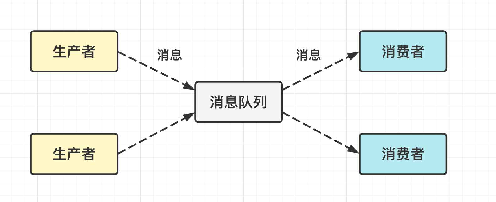
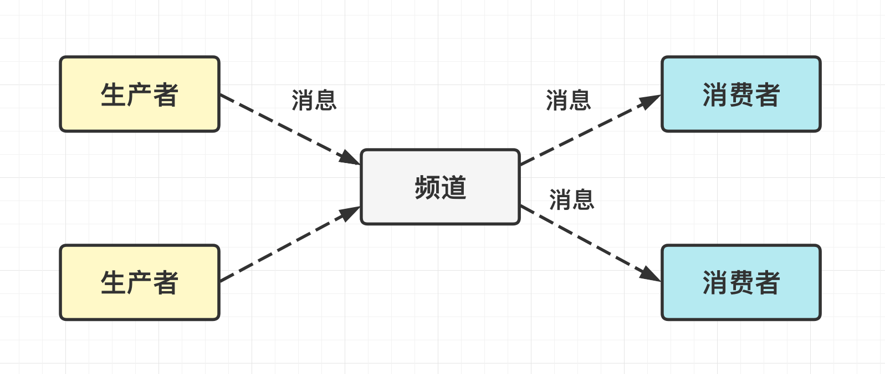
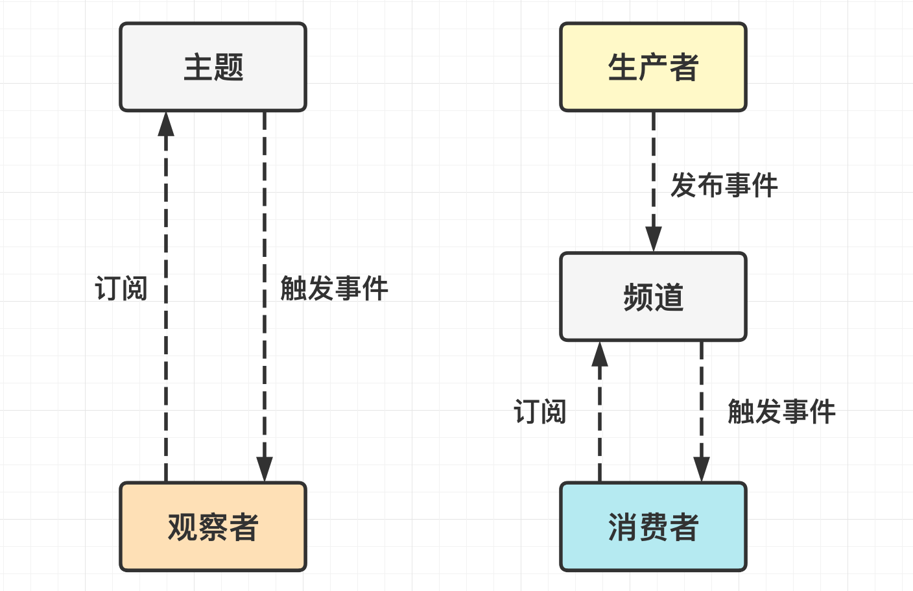
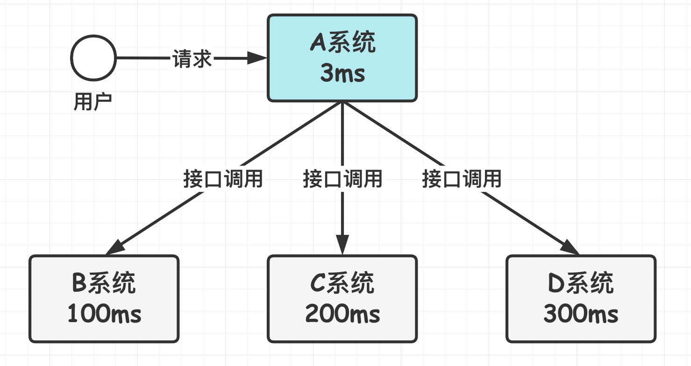
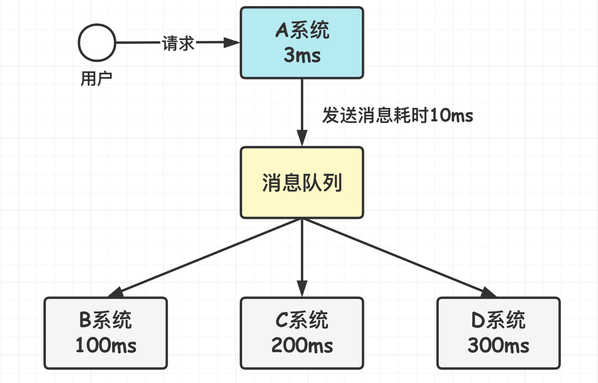
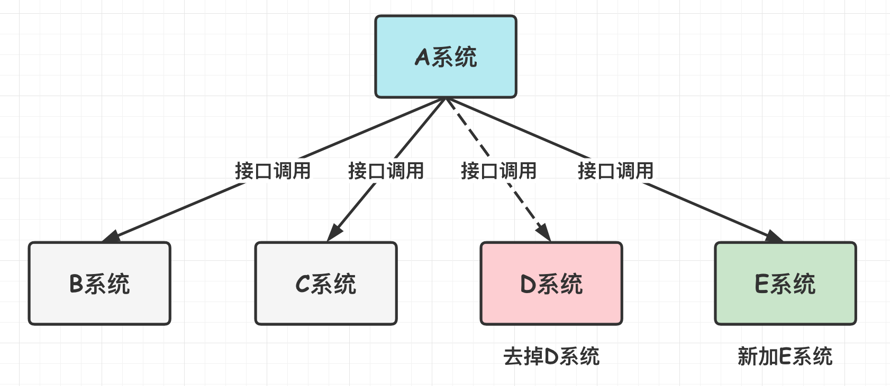
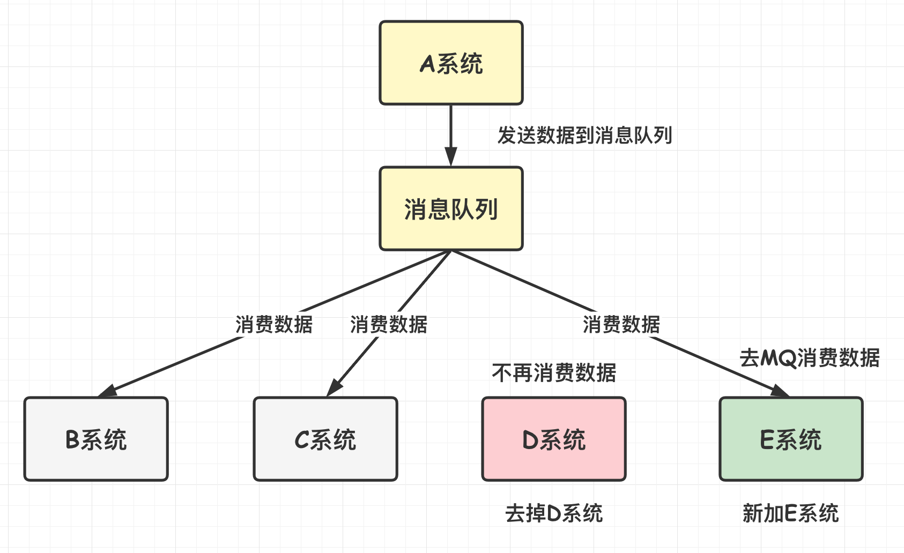
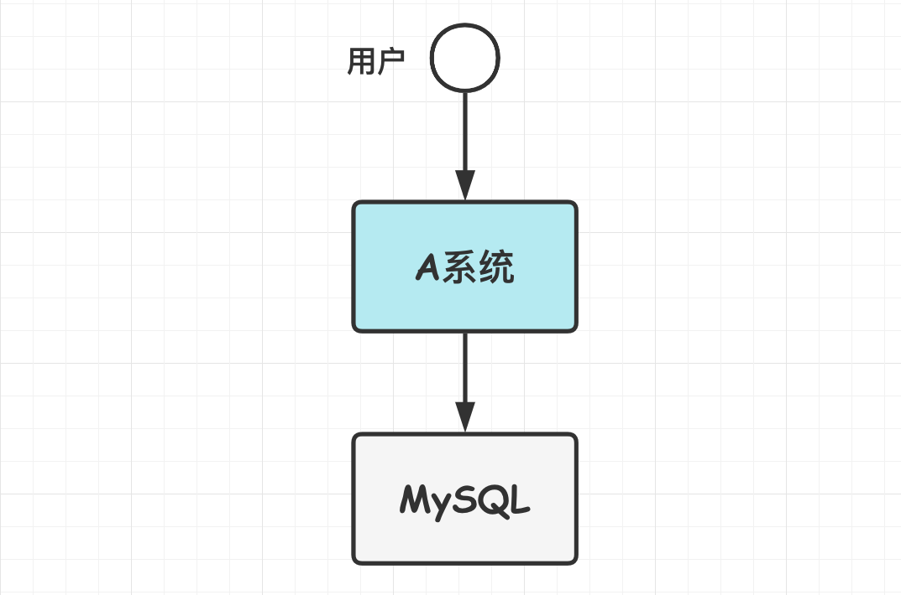
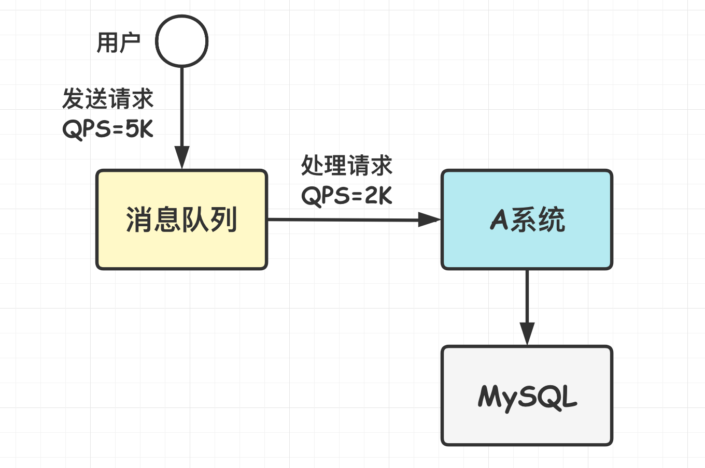

[TOC]

### 消息队列基础

#### 基础

##### 1.概述

消息队列是分布式系统中重要的组件, 使用消息队列主要是为了**通过异步处理提高系统性能和削峰、降低系统耦合性**. 目前使用较多的消息队列有 RabbitMQ, Kafka, RocketMQ 等. 

##### 2.消息模型

###### (1)点对点模型

消息生产者向消息队列中发送了一个消息之后, 只能**被一个消费者消费一次**. **不能重复消费**. 

###### (2)发布/订阅模型

消息生产者向频道发送一个消息之后, **多个消费者可以从该频道订阅到这条消息并消费**. **可以重复消费**. 

**发布/订阅模式**与**观察者模式**有以下不同: 

- 观察者模式中, 观察者和主题都知道对方的存在; 而在发布/订阅模式中, 生产者与消费者不知道对方的存在, 它们之间通过频道进行通信. 
- 观察者模式是**同步**的, 当事件触发时, 主题会调用观察者的方法, 然后等待方法返回; 而发布/订阅模式是**异步**的, 生产者向频道发送一个消息之后, 就不需要关心消费者何时去订阅这个消息, 可以立即返回. 

##### 3.使用场景

> **为什么使用消息队列?**

消息队列的核心场景有: **异步**, **解耦**, **削峰**. 

###### (1)异步

假如 A 系统接收一个请求, 需要在自己先执行逻辑(耗时 3ms), 还需要在 **BCD 三个系统写库**(分别耗时 100ms、200ms、300ms), 则请求总延时是 603ms, 时间较长. 

如果使用消息队列, A 系统可以将操作的信息发送到消息队列中, 然后各个系统自己去写库. 如果 A 系统需要花费 10ms 将消息发送给消息队列, 那么请求总时长仅 13ms, 用户体验极好. 

实际的例子就是注册系统. 当用户提交注册信息后, 服务将信息写入数据库, 然后就可以发送注册消息到消息队列, 消费者收到信息后再给用户发送短信验证码.

###### (2)解耦

多系统之间经常存在耦合情况. 如下所示. 这里 A 系统通过调用接口发送数据到 BCD 三个系统. 如果因为业务需求不需要调用 D 系统了, 或者加入了新的 E 系统. 此时都会需要去**修改 A 系统的代码**进行兼容. 这里 **A 系统**跟其它各种系统**严重耦合,** 如果 A 系统产生一条比较关键的数据, 这些系统都需要得到这个数据. 而 A 系统要时刻考虑其他系统如果挂了该咋办? 要不要重发, 要不要把消息存起来?

如果使用 MQ, **A 系统产生一条数据后直接发送给 MQ, 需要数据的系统则自己去 MQ 里面消费**. 如果新系统需要数据, 直接从 MQ 里消费即可; 如果某个系统不需要这条数据了, 不再对 MQ 消费即可. 这样 **A 系统就不需要去考虑要给谁发送数据, 不需要维护这个代码, 也不需要考虑其他系统是否调用成功、失败超时等情况**. 

通过一个 MQ 及 Pub/Sub 发布订阅消息模型, A 系统就**跟其它系统彻底解耦**了. 

###### (3)削峰

假设 A 系统大部分时间的 QPS 都是 100, 当某次进行促销时, QPS 暴增到 5K, 而 A 系统扛得住的 QPS 为 2K, 所以这可能直接就把 MySQL 或者系统打挂了. 

如果使用 MQ, 每秒 5K 个请求写入 MQ, A 系统根据自己的**处理能力**慢慢从消息队列中拉取处理请求即可, 这样服务不至于挂掉. 等到高峰期过了之后再把消息队列里面加压的消息慢慢消费即可.

##### 4.使用消息队列的问题

- **系统可用性降低**: 引入消息队列后需要考虑消息丢失或者说 MQ 挂掉等情况, 需要保证消息队列的**高可用**.
- **系统复杂性提高**: 引入消息队列后需要保证消息没有被重复消费、处理消息丢失的情况、保证消息传递的顺序性、消息堆积等等问题.
- **一致性问题**: 可能存在消费者没有正确消费消息的情况, 这样可能导致数据不一致.

消息队列的架构通常比较复杂, 引入它有很多好处, 但是也得针对它带来的坏处做各种额外的技术方案和架构以进行规避. 

##### 5.可靠性

###### (1)生产者可靠性

生产者可靠性指生产者完成操作后**一定能将消息成功发送到消息队列**中. 

实现方法: 

- 在本地数据库建一张消息表, 将消息数据与业务数据保存在同一数据库实例里, 这样就可以利用本地数据库的事务机制. 事务提交成功后, 将消息表中的消息转移到消息队列中, 若转移消息成功则删除消息表中的数据, 否则继续重传. 

###### (2)消费者可靠性

消费者可靠性指消费者能够从消息队列**成功消费一次**消息. 

实现方法: 

- 保证消费者处理消息的业务逻辑具有**幂等性**, 保证即使多次消费消息, 最后结果都是一致的. 
- 保证消息具有唯一编号, 并使用一张**日志表来记录已经消费的消息编号**. 

#### JMS与AMQP

##### 1.JMS

JMS(JAVA Message Service) 是 Java 的消息服务, ActiveMQ 是基于 JMS 规范实现的.

##### 2.AMQP

AMQP(Advanced Message Queuing Protocol) 是一个提供统一消息服务的应用层标准高级消息队列协议(二进制应用层协议), 是应用层协议的一个开放标准, 为面向消息的中间件设计, **兼容 JMS**. 基于此协议的客户端与消息中间件可传递消息, 并不受客户端/中间件同产品, 不同的开发语言等条件的限制. 

**RabbitMQ 就是基于 AMQP 协议实现的. **

##### 3.JMS与AMQP比较

|     对比     |                     JMS                     |          AMQP          |
| :----------: | :-----------------------------------------: | :--------------------: |
|     定义     |                  Java API                   |        **协议**        |
|    跨语言    |                     否                      |         **是**         |
|    跨平台    |                     否                      |         **是**         |
| 支持消息类型 | 提供**两种消息模型**: 1.点对点; 2.发布/订阅 | 提供五种消息模型 |
| 支持消息类型 |              支持多种消息类型               |  **byte**\  |

#### 常见消息队列

##### 1.ActiveMQ

**ActiveMQ** 性能较差, 且版本迭代慢, **不推荐使用**. 

##### 2.RabbitMQ

**RabbitMQ** 在吞吐量方面明显落后于 Kafka 和 RocketMQ, 但它基于 erlang 开发, 所以并发能力很强, 延时很低, 达到微秒级. 

##### 3.RocketMQ

可以根据源码定制 MQ, 并且有阿里的实际业务场景的考验支撑. 文档相对简单, 但接口不是**按照标准 JMS 规范**设计的, 有些系统迁移时需要修改大量代码. 

##### 4.Kafka

**Kafka** 的特点就是仅提供较少的核心功能, 但是**提供超高的吞吐量, ms 级的延迟, 极高的可用性以及可靠性, 而且分布式可以任意扩展**. Kafka 的一点劣势是有**可能消息重复消费**, 这对数据准确性会造成极其轻微的影响, 在大数据领域的实时计算以及日志采集等场景中, 这点轻微影响可以忽略, 所以这个特性天然适合大数据实时计算以及日志收集. 

##### 5.总结

|           特性           |               ActiveMQ                |                      RabbitMQ                      |                           RocketMQ                           |                            Kafka                             |
| :----------------------: | :-----------------------------------: | :------------------------------------------------: | :----------------------------------------------------------: | :----------------------------------------------------------: |
|      **单机吞吐量**      | 万级, 比 RocketMQ、Kafka 低一个数量级 |                    同 ActiveMQ                     |                     10 万级, 支撑高吞吐                      | **10 万级**, 高吞吐, 一般配合大数据类的系统来进行**实时数据计算、日志采集**等场景 |
| topic 数量对吞吐量的影响 |                                       |                                                    | topic 可以达到几百/几千的级别, 吞吐量会有较小幅度的下降, 这是 RocketMQ 的一大优势, 在同等机器下, 可以支撑大量的 topic | topic 从几十到几百个时候, 吞吐量会大幅度下降, 在同等机器下, Kafka 尽量保证 topic 数量不要过多, 如果要支撑大规模的 topic, 需要增加更多的机器资源 |
|        **时效性**        |               **ms 级**               |     微秒级, 这是 RabbitMQ 的一大特点, 延迟最低     |                            ms 级                             |                     **延迟在 ms 级以内**                     |
|        **可用性**        |      高, 基于主从架构实现高可用       |                    同 ActiveMQ                     |                    **非常高, 分布式架构**                    | **非常高, 分布式**, 一个数据多个副本, 少数机器宕机, 不会丢失数据, 不会导致不可用 |
|      **消息可靠性**      |         有较低的概率丢失数据          |                      基本不丢                      |              经过参数优化配置, 可以做到 0 丢失               |              经过参数优化配置, 可以做到 0 丢失               |
|       **功能支持**       |         MQ 领域的功能极其完备         | 基于 erlang 开发, 并发能力很强, 性能极好, 延时很低 |           MQ 功能较为完善, 还是分布式的, 扩展性好            | 功能较为简单, 主要支持简单的 MQ 功能, 在大数据领域的实时计算以及日志采集被大规模使用 |

综上对比后, 选用建议: 

不推荐用 ActiveMQ. 

对于**中小型公司**, 技术实力较为一般, 技术挑战不是特别高, 用 **RabbitMQ** 是不错的选择; 对于**大型公司**, 基础架构研发实力较强, 用 **RocketMQ** 是很好的选择. 

如果是**大数据领域**的实时计算、日志采集等场景, 用 **Kafka** 是业内标准的.

#### 参考资料

- [Observer vs Pub-Sub](http://developers-club.com/posts/270339/)
- [消息队列中点对点与发布订阅区别](https://blog.csdn.net/lizhitao/article/details/47723105)

