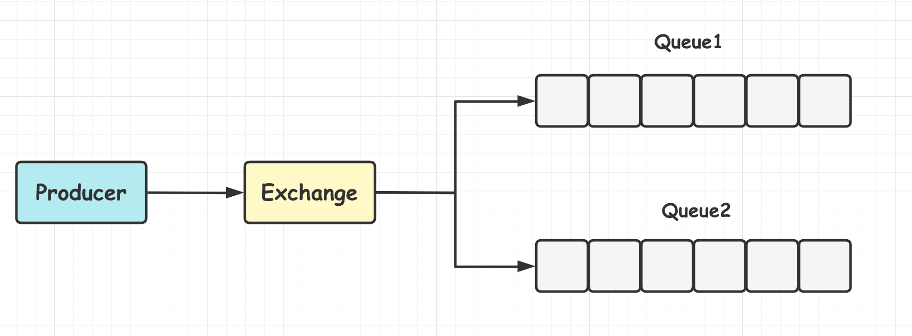
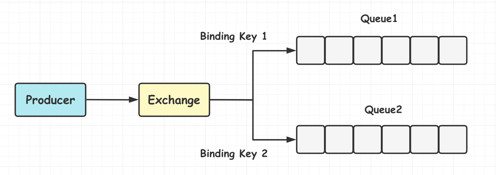

[TOC]

### RabbitMQ

#### 基础

RabbitMQ 是用 Erlang 语言实现 **AMQP** 协议的消息中间件. RabbitMQ 的特点: 

- **可靠性: **RabbitMQ 使用持久化、传输确认及发布确认等机制来保证消息的可靠性. 
- **灵活路由: **在消息进入队列之前, 通过交换器来路由消息. 对于典型的路由功能, RabbitMQ 己经提供了一些内置的交换器来实现. 针对更复杂的路由功能, 可以将多个交换器绑定在一起, 也可以通过插件机制来实现自己的交换器. 
- **扩展性: **RabbitMQ 可以部署为集群, 可以根据实际业务情况动态收缩集群节点. 
- **高可用性: **可以在集群中设置镜像, 使得部分节点在出现问题的情况下依然可用. 
- **支持多种协议: **除了原生支持 AMQP 协议, 还支持 STOMP、MQTT 等多种协议. 
- **多语言客户端: **几乎支持所有常用语言, 比如 Java, Python, JavaScript等. 
- **插件机制: **RabbitMQ 提供了许多插件, 以实现从多方面进行扩展. 也可以自己开发插件.

#### RabbitMQ架构

整体模型架构如下所示. 

##### 1.Producer与Consumer

- **Producer(生产者)** 
- **Consumer(消费者)**

消息一般由 2 部分组成: **消息头**(Label)和 **消息体**(PayLoad). 

消息体是不透明的, 而消息头则由一系列的**可选属性组成**, 如 **routing-key**(路由键), **priority**(相对于其他消息的优先权), **delivery-mode**(指出该消息可能需要持久性存储)等.

##### 2.Exchange

即交换器, 在 RabbitMQ 中, 消息并不是直接被投递到 **Queue(消息队列)** 中, 中间还必须经过 **Exchange(交换器)** 这一层, **交换器**会把的消息分配到对应的**消息队列**中. **交换器**用来接收生产者发送的消息并将这些消息路由给服务器中的队列. 

Exchange 有 4 种**类型**, 分别对应着不同的**路由策略**: **direct(默认)**, **fanout**, **topic** 和 **headers**. 不同类型的 Exchange 转发消息的**策略**有所区别. 

生产者将消息发给**交换器**的时候, 一般会指定一个 **RoutingKey(路由键)**, 用于指定该消息的路由规则, 这个 RoutingKey 需要与交换器类型和绑定键(BindingKey)联合使用才能最终生效. 

RabbitMQ 会将 **Exchange(交换器)** 与 **Queue(消息队列)** 进行绑定关联, 在绑定的时候一般会指定一个 **BindingKey(绑定建)**, 这样 RabbitMQ 就知道如何正确将消息路由到队列了, 如下图所示. 一个绑定就是基于路由键将交换器和消息队列连接起来的路由规则, 所以可以将**交换器理解成一个由绑定构成的路由表**. Exchange 和 Queue 的绑定可以是**多对多**的关系. 

生产者将消息发送给交换器时, 需要一个 **RoutingKey**, 当 BindingKey 和 RoutingKey 相匹配时, 消息会被路由到对应的队列中. 

##### 3.Queue

**Queue(消息队列)** 用来保存消息直到发送给消费者. 它是消息的容器. 一个消息可投入到一个或多个队列. 生产者生产消息并最终投递到队列中, 消费者可以从队列中获取消息并消费. 

**RabbitMQ** 中消息只能存储在 **队列** 中, 而 Kafka 将消息存储在 **topic(主题)** 这个逻辑层面, 而相对应的队列逻辑只是 topic 实际存储文件中的位移标识. 

**多个消费者可以订阅同一个队列**, 这时队列中的消息会被平均分摊(Round-Robin, 即轮询)给多个消费者进行处理, 而不是每个消费者都收到所有的消息并处理, 这可以避免消息的重复消费. 

**RabbitMQ** 不支持队列层面的广播消费, 如果有广播消费的需求, 需要在其上进行二次开发. 

##### 4.Broker

一个 Broker 可以看作一个 RabbitMQ 服务节点或实例. 

